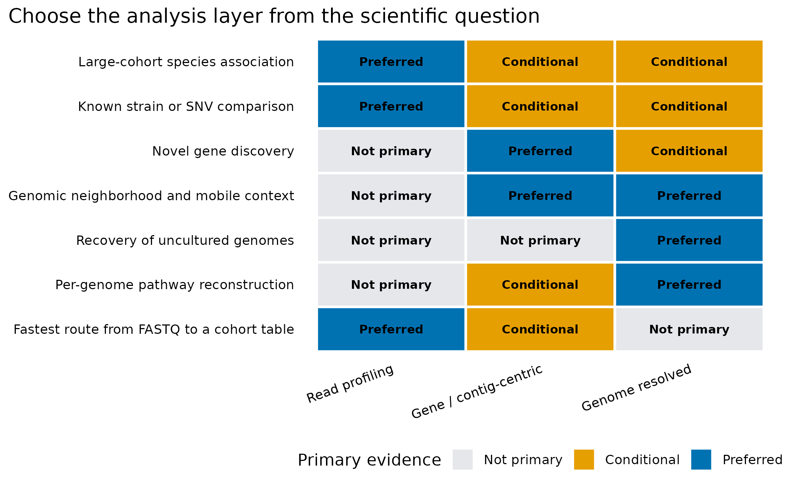
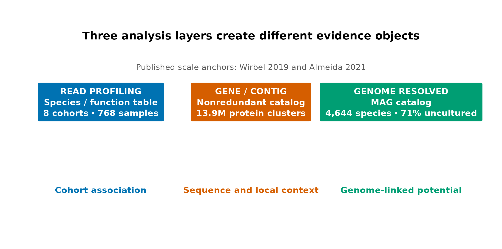

> **学习目标：**看到一个宏基因组问题时，先决定需要 read profiling、gene / contig-centric 还是 genome-resolved 证据，再选择软件。  
> **真实锚点：**Wirbel 等 CRC 跨队列研究的 8 个队列、768 个样本，以及 UHGG/UHGP 公开目录的 4,644 个物种和 13.9 million 个 UHGP-90 蛋白簇。  
> **预计资源：**普通笔记本约 1 分钟，内存低于 500 MB；这里只执行决策表审计和作图，不重跑组装或分箱。

## 这一步对应论文里的哪张图 {#sec-target}

宏基因组论文常把多条路线画在同一张 workflow 里，容易造成一个错觉：reads 必须依次经过所有方框，才算“完整分析”。真实研究并不是这样。

Wirbel 等的 CRC 研究用物种谱完成跨队列关联和预测，核心对象是 **samples × features 的 read-based 表** [@wirbel2019crc]。Almeida 等建立 UHGG/UHGP 时则必须组装、预测基因、分箱、质控和去冗余，最终把 286,997 个输入基因组整理为 4,644 个物种，并建立多种相似度层级的蛋白目录 [@almeida2021uhgg]。两篇工作的科学问题不同，正确路线自然不同。

这里重绘两张决策图：

::: {layout-ncol="2"}
{#fig-layer-decision}

{#fig-workflow-anchors}
:::

图 @fig-layer-decision 不是“哪个方法更高级”的排行榜，而是回答：**为了当前问题，哪一层是主要证据？** 图 @fig-workflow-anchors 则提醒我们，read profiling 的强项是规模和可比性；gene / contig-centric 的强项是发现基因与序列上下文；genome-resolved 的强项是把序列重新归属于一个经过质控的基因组。

::: {.callout-important title="先选证据对象，再选工具"}
如果最终统计问题是“哪些已知物种在 8 个 CRC 队列中稳定变化”，第一对象应该是统一生成的物种谱，而不是先为每个样本做分箱。若问题是“一个新型 CAZyme 位于谁的基因组、附近还有哪些基因”，只有物种谱又远远不够。
:::

## 理论：三个层级不是一条必须走到底的流水线 {#sec-theory}

先给结论：

1. **Read profiling** 把 reads 直接映射或分类到参考 marker、基因家族或 k-mer 数据库，最快得到跨样本可比较的表。
2. **Gene / contig-centric** 关注组装出的 contig、预测基因和非冗余基因目录，能发现参考库外的序列和基因邻域，但未必知道它们属于哪个完整基因组。
3. **Genome-resolved** 将 contig 分箱为 MAG，并对完整度、污染、嵌合和分类进行审计，才适合讨论“某个基因组携带了什么”。
4. 三条路线可以并行互证；它们不是从“初级”到“高级”的单向升级。

### 1. Read profiling：先获得稳定的样本 × 特征表

Reference-based read profiling（基于参考的 reads 谱分析）跳过 de novo assembly，把 reads 与 marker、参考基因组、蛋白家族或 k-mer 数据库比较。典型产物包括：

- MetaPhlAn / mOTUs 的物种相对丰度表；
- Kraken2 分类结果和 Bracken 重估丰度；
- HUMAnN 的 gene family、pathway abundance 和 pathway coverage；
- 菌株 marker 或 SNV 方法生成的距离和系统发育对象。

它最适合队列统计、病例—对照比较和机器学习，因为所有样本可以在同一特征空间中比较。代价是结论受数据库覆盖、分类阈值和版本影响：参考库中没有的序列不会凭空获得正确名字。

### 2. Gene / contig-centric：保留新序列和局部上下文

Gene / contig-centric（基因或 contig 中心）路线通常先组装，再做基因预测、去冗余、丰度回比和功能注释。它回答的不是“哪个参考物种最像”，而是：

- 样本中出现了哪些参考库尚未收录的基因；
- ARG、CAZyme、BGC 或病毒信号位于哪条 contig；
- 基因附近是否存在转座酶、整合酶、调控元件或同一代谢模块的其他基因；
- 不同队列共享哪些非冗余基因簇。

UHGP-90 含 13,907,849 个 90% amino-acid-identity 蛋白簇；即便在如此大规模的目录里，UHGP-100 仍有 41.5% 的蛋白缺少有意义的功能解释 [@almeida2021uhgg]。因此，“注释不到”首先意味着**功能未知**，不是“没有功能”。

### 3. Genome-resolved：把功能归回经过审计的基因组

Genome-resolved（基因组解析）路线在组装后增加 read depth、分箱、bin refinement、MAG 质控、去冗余和分类。它可以进一步回答：

- 哪些基因共同存在于同一个候选基因组；
- 一个未培养物种的代谢模块是否近乎完整；
- 同一物种在不同样本中有哪些 core / accessory genes；
- 某个 MAG 的丰度、系统发育位置和潜在生态功能是什么。

UHGG 的 4,644 个推断物种中，3,312 个（71%）没有培养代表；只有 573 个代表基因组同时满足论文采用的完整 MIMAG high-quality 条件 [@almeida2021uhgg]。这说明 MAG 扩展了可见范围，也说明**高质量基因组不能只凭一个 bin 文件名宣称**。

<details>
<summary><strong>深入：三个层级可以怎样组合</strong></summary>

常见的组合不是“全部都做”，而是针对证据缺口增加一层：

| 主问题 | 主路线 | 补充路线 | 补充目的 |
|---|---|---|---|
| 大队列疾病 signature | read profiling | gene catalog / MAG | 检查关键功能或物种的基因组背景 |
| 新 ARG 或 BGC | gene / contig-centric | read mapping | 量化其跨样本丰度和 prevalence |
| 未培养物种代谢 | genome-resolved | metatranscriptome / metabolome | 区分遗传潜力、表达与真实产物 |
| 菌株传播 | read-based SNV / marker | isolate or MAG | 提高基因组覆盖并验证 accessory genes |

同一份 FASTQ 可以产生多个对象，但每个对象都应有独立的数据谱系、质量门槛和结论上限。
</details>

## 准备工作 {#sec-setup}

<details>
<summary><strong>展开：安装依赖、核对真实锚点和定义作图函数</strong></summary>

首次运行安装轻量依赖：

```{r}
#| eval: false
install.packages(c("ggplot2", "dplyr", "scales", "digest", "knitr"))
```

本文读取两个已提交的小表：

- `02-layer-capabilities.tsv`：依据 shotgun 方法综述与 UHGG/UHGP 研究整理的决策矩阵；
- `02-published-anchors.tsv`：Wirbel CRC 和 UHGG/UHGP 论文中的公开规模指标。

```{r}
library(ggplot2)
library(dplyr)
library(scales)
library(digest)

set.seed(20260719)

stopifnot(
  digest(
    "data/small/02-layer-capabilities.tsv",
    algo = "sha256",
    file = TRUE
  ) == "4986c5dcfac1f49e1596b117c5a36c573a5ae21b1b695d89d477ce1ca24d80a8",
  digest(
    "data/small/02-published-anchors.tsv",
    algo = "sha256",
    file = TRUE
  ) == "7a141d3d31b759e9e80d4c7e215a98313a1df1c121716ad4b80ad6394b8bbf0d"
)

pal_pub <- c(
  "#0072B2", "#D55E00", "#009E73", "#CC79A7",
  "#E69F00", "#56B4E9", "#F0E442", "#999999"
)

scale_color_pub <- function(...) {
  ggplot2::scale_color_manual(values = pal_pub, ...)
}

scale_fill_pub <- function(...) {
  ggplot2::scale_fill_manual(values = pal_pub, ...)
}

theme_pub <- function(base_size = 12) {
  ggplot2::theme_bw(base_size = base_size, base_family = "sans") +
    ggplot2::theme(
      panel.grid = ggplot2::element_blank(),
      axis.text = ggplot2::element_text(color = "black"),
      axis.ticks = ggplot2::element_line(color = "black", linewidth = 0.3),
      legend.key = ggplot2::element_blank(),
      legend.background = ggplot2::element_rect(
        fill = scales::alpha("white", 0.7),
        color = NA
      ),
      plot.title.position = "plot"
    )
}

save_pub <- function(
  plot,
  file_base,
  width = 150,
  height = 100,
  units = "mm",
  dpi = 300
) {
  dir.create(
    dirname(file_base),
    recursive = TRUE,
    showWarnings = FALSE
  )
  ggplot2::ggsave(
    paste0(file_base, ".pdf"),
    plot,
    width = width,
    height = height,
    units = units,
    device = grDevices::cairo_pdf
  )
  ggplot2::ggsave(
    paste0(file_base, ".png"),
    plot,
    width = width,
    height = height,
    units = units,
    dpi = dpi,
    bg = "white"
  )
  ggplot2::ggsave(
    paste0(file_base, ".tiff"),
    plot,
    width = width,
    height = height,
    units = units,
    dpi = dpi,
    compression = "lzw",
    bg = "white"
  )
}
```
</details>

## 可复制代码：把科学问题翻译成数据对象 {#sec-code}

### 第 1 步：读取并审计两个输入表

```{r}
capabilities <- read.delim(
  "data/small/02-layer-capabilities.tsv",
  check.names = FALSE,
  stringsAsFactors = FALSE
)
anchors <- read.delim(
  "data/small/02-published-anchors.tsv",
  check.names = FALSE,
  stringsAsFactors = FALSE
)

stopifnot(
  nrow(capabilities) == 7L,
  nrow(anchors) == 7L,
  setequal(
    names(capabilities)[-1],
    c("Read profiling", "Gene / contig-centric", "Genome resolved")
  ),
  anchors$Value[anchors$Metric == "CRC case-control samples"] == 768,
  anchors$Value[anchors$Metric == "UHGP-90 protein clusters"] == 13907849,
  anchors$Value[anchors$Metric == "UHGG inferred prokaryotic species"] == 4644
)

knitr::kable(capabilities)
knitr::kable(anchors)
```

评分不是统计显著性：

- `0 = Not primary`：不能直接产生该问题的主要证据；
- `1 = Conditional`：可以辅助，但需要覆盖度、归属步骤或另一层对象；
- `2 = Preferred`：通常是该问题的主要分析对象。

### 第 2 步：转成长表，避免把层级混成一个变量

```{r}
layer_columns <- names(capabilities)[-1]
cap_long <- reshape(
  capabilities,
  varying = layer_columns,
  v.names = "Score",
  timevar = "Layer",
  times = layer_columns,
  direction = "long"
)
rownames(cap_long) <- NULL

cap_long$Layer <- factor(cap_long$Layer, levels = layer_columns)
cap_long$Question <- factor(
  cap_long$Question,
  levels = rev(capabilities$Question)
)
cap_long$Score_factor <- factor(cap_long$Score, levels = 0:2)

head(cap_long)
```

### 第 3 步：从真实指标构建路线锚点

```{r}
anchor_value <- function(metric) {
  value <- anchors$Display_value[anchors$Metric == metric]
  stopifnot(length(value) == 1L)
  value
}

flow <- data.frame(
  x = 1:3,
  Layer = factor(
    c("Read profiling", "Gene / contig-centric", "Genome resolved"),
    levels = c("Read profiling", "Gene / contig-centric", "Genome resolved")
  ),
  Label = c(
    paste0(
      "READ PROFILING\nSpecies / function table\n",
      anchor_value("CRC analysis cohorts"), " · ",
      anchor_value("CRC case-control samples")
    ),
    paste0(
      "GENE / CONTIG\nNonredundant catalog\n",
      anchor_value("UHGP-90 protein clusters")
    ),
    paste0(
      "GENOME RESOLVED\nMAG catalog\n",
      anchor_value("UHGG inferred prokaryotic species"), " · 71% uncultured"
    )
  ),
  Claim = c(
    "Cohort association",
    "Sequence and local context",
    "Genome-linked potential"
  )
)

flow
```

## 审计与升级：今天应该如何选择 {#sec-audit}

Quince 等对 shotgun 流程的划分仍然有效，但今天做路线选择时需要补五项审计 [@quince2017shotgun]：

1. **先写最终统计单位。** 若最终每行是 sample、每列是 species/pathway，read profiling 是主线；若每行是 gene/contig/MAG，就必须保存组装和回比谱系。
2. **不要把 reference-free 说成 assumption-free。** 组装仍受深度、重复序列、群落复杂度和菌株混合影响；分箱仍依赖 coverage 和 sequence composition。
3. **不要把 MAG 当成单细胞基因组。** MAG 是群落 reads 的计算重建结果，可能是共识序列，也可能包含嵌合和错分 contig。
4. **功能归属要区分层级。** HUMAnN 的 stratified profile、contig 上的邻域和 MAG 内的基因都能提供“属于谁”的线索，但证据强度和错误模式不同。
5. **三条路线必须用同一份 metadata。** Sample ID、组别、批次、队列和排除规则若在不同分支漂移，后续无法真正互证。

::: {.callout-note title="路线可以升级，但训练边界不能后补"}
例如 CRC 主线可以先用物种谱完成跨队列发现，再对稳定物种做 pangenome 或 MAG 分析。但“哪些物种值得深入”若来自全部队列，随后又把同一批队列称为外部验证，就产生了信息泄漏。路线升级不能破坏预先定义的发现—验证边界。
:::

### 一个可执行的选择顺序

按下面四问决定主路线：

1. 最终结论的主语是 **sample-level feature、gene/contig，还是 genome**？
2. 是否必须发现数据库外的新序列？
3. 是否必须知道多个基因是否位于同一个基因组？
4. 样本数和算力是否允许稳定组装、回比和分箱？

若第 1 问已经指向样本级疾病关联，第 2–3 问都是否，先做 read profiling 往往更稳。若核心假设本身就是“一个未培养物种携带完整代谢模块”，则 genome-resolved 不是可选装饰，而是最低证据门槛。

## 出版级美化 {#sec-polish}

### 图 1：问题—层级决策热图

```{r}
p_decision <- ggplot(
  cap_long,
  aes(x = Layer, y = Question, fill = Score_factor)
) +
  geom_tile(color = "white", linewidth = 0.8) +
  geom_text(
    aes(label = c("Not primary", "Conditional", "Preferred")[Score + 1L]),
    size = 2.8,
    fontface = "bold"
  ) +
  scale_fill_manual(
    values = c("0" = "#E5E7EB", "1" = "#E69F00", "2" = "#0072B2"),
    labels = c("Not primary", "Conditional", "Preferred"),
    drop = FALSE
  ) +
  labs(
    x = NULL,
    y = NULL,
    fill = "Primary evidence",
    title = "Choose the analysis layer from the scientific question"
  ) +
  theme_pub(base_size = 11) +
  theme(
    axis.text.x = element_text(angle = 20, hjust = 1),
    axis.ticks = element_blank(),
    panel.border = element_blank(),
    legend.position = "bottom"
  )

p_decision
```

```{r}
save_pub(
  p_decision,
  "figures/02-layer-decision",
  width = 185,
  height = 115
)
```

### 图 2：两个公开研究如何锚定三层对象

```{r}
p_flow <- ggplot() +
  geom_label(
    data = flow,
    aes(x = x, y = 1, label = Label, fill = Layer),
    color = "white",
    fontface = "bold",
    size = 3.15,
    lineheight = 1.05,
    label.padding = grid::unit(0.55, "lines"),
    label.r = grid::unit(0.16, "lines"),
    linewidth = 0
  ) +
  geom_text(
    data = flow,
    aes(x = x, y = 0.55, label = Claim, color = Layer),
    size = 3.2,
    fontface = "bold"
  ) +
  scale_fill_manual(
    values = c(
      "Read profiling" = "#0072B2",
      "Gene / contig-centric" = "#D55E00",
      "Genome resolved" = "#009E73"
    ),
    guide = "none"
  ) +
  scale_color_manual(
    values = c(
      "Read profiling" = "#0072B2",
      "Gene / contig-centric" = "#D55E00",
      "Genome resolved" = "#009E73"
    ),
    guide = "none"
  ) +
  annotate(
    "text",
    x = 2,
    y = 1.34,
    label = "Three analysis layers create different evidence objects",
    fontface = "bold",
    size = 4
  ) +
  annotate(
    "text",
    x = 2,
    y = 1.18,
    label = "Published scale anchors: Wirbel 2019 and Almeida 2021",
    color = "grey35",
    size = 3
  ) +
  coord_cartesian(
    xlim = c(0.55, 3.45),
    ylim = c(0.35, 1.42),
    clip = "off"
  ) +
  theme_void(base_size = 11) +
  theme(plot.margin = margin(10, 12, 10, 12))

p_flow
```

```{r}
save_pub(
  p_flow,
  "figures/02-workflow-anchors",
  width = 185,
  height = 92
)
```

两张图均输出 PDF、PNG 和 TIFF。图中只使用英文；颜色同时配合单元格文字和明确标签，黑白打印时仍能读出判断。

## 常见坑方框 {#sec-pitfalls}

::: {.callout-caution title="八个最常见的路线选择错误"}
1. **所有项目都先组装。** 大样本临床队列可能因此耗尽算力，却没有改善主问题的证据。
2. **把 HUMAnN 叫 gene-centric assembly。** HUMAnN 是 read-based functional profiling；它不会生成 de novo contig 或基因目录。
3. **把 eggNOG-mapper、dbCAN、RGI、antiSMASH 直接接到 raw FASTQ。** 这些工具通常读取预测蛋白、基因、contig 或 MAG。
4. **把未分类 reads 全部叫新物种。** 它们也可能是低质量、宿主残留、数据库差异、保守区域或非目标生物。
5. **看到 bin 就讨论完整通路。** 未经过完整度、污染、GUNC、rRNA/tRNA 和 assembly graph 审计的 bin 不能承担完整基因组结论。
6. **认为 reference-based 一定更可复现。** 数据库 release、阈值和分类器版本变化同样会改变结果。
7. **三条分支使用不同样本集合。** 这样得到的物种、基因和 MAG 结果无法直接相互解释。
8. **把功能潜力升级为活性。** 无论来自 read、contig 还是 MAG，DNA 注释仍然不是表达、通量或因果证据。
:::

## 这段 Methods 怎么写 {#sec-methods}

> Analysis objectives were assigned a priori to three evidence layers: reference-based read profiling, gene/contig-centric analysis and genome-resolved analysis. Read profiles were defined as sample-by-feature tables generated directly from metagenomic reads; gene/contig-centric outputs comprised assembled contigs, predicted genes and nonredundant sequence catalogs; genome-resolved outputs additionally required binning, refinement, quality assessment, dereplication and taxonomic classification. The decision matrix was encoded before outcome inspection and was informed by established shotgun metagenomics guidance. Published scale anchors were extracted from the Wirbel colorectal-cancer meta-analysis and the UHGG/UHGP catalog. All values were checked against locked TSV inputs (SHA-256 `4986c5dc...24d80a8` and `7a141d3d...8bbf0d`). Figures were generated in R 4.4.1 with a fixed seed and exported as PDF and 300-ppi PNG/TIFF files.

换成真实项目后，还要补充每一层实际使用的软件版本、数据库 release、参数、样本排除规则、组装策略、回比阈值、MAG 质量标准和文件 checksum。不要只写“shotgun metagenomic analysis was performed”。

## 换成你自己的数据怎么做 {#sec-yourdata}

### 先建立三张对象清单

在运行工具前写出：

| Object | Rows | Columns / fields | Main claim | Required QC |
|---|---|---|---|---|
| Read profile | samples | species / pathways | cohort association | mapping/classification rate, database release |
| Gene catalog | genes / contigs | annotation, coverage, sample abundance | sequence/function discovery | length, coverage, redundancy, annotation evidence |
| MAG catalog | genomes | quality, taxonomy, genes, abundance | genome-linked potential | completeness, contamination, chimerism, rRNA/tRNA |

没有对应科学问题的对象不必为了“流程看起来完整”而强行生成。

### 用五列锁定跨分支样本

```text
SampleID    Cohort    Group      Batch    Include
S001        Center_A  Control    Run1     TRUE
S002        Center_A  CRC        Run1     TRUE
S101        Center_B  Control    Run2     TRUE
S102        Center_B  CRC        Run2     TRUE
```

这张表应同时驱动 read profiling 合并、assembly 输入、coverage 回比和下游统计。若某条路线额外排除样本，必须记录原因，并在比较不同层级时使用明确的共同样本集。

### 最后给每个结论写上限

- 物种谱差异：**taxonomic association**；
- 基因或通路丰度差异：**functional potential association**；
- contig 邻域：**physical linkage within the assembled sequence**；
- MAG 内基因：**genome-linked potential subject to MAG quality**；
- 表达、蛋白、代谢物和因果：需要对应分子层、时间或实验数据。

## 小结

宏基因组没有一条适合所有问题的“全套流程”。Read profiling、gene / contig-centric 和 genome-resolved 分别优化规模可比性、新序列与局部上下文、基因组归属。先确定最终证据对象，才能知道哪些计算是必要的，哪些只是增加成本。

## 参考 {#sec-refs}

::: {#refs}
:::
