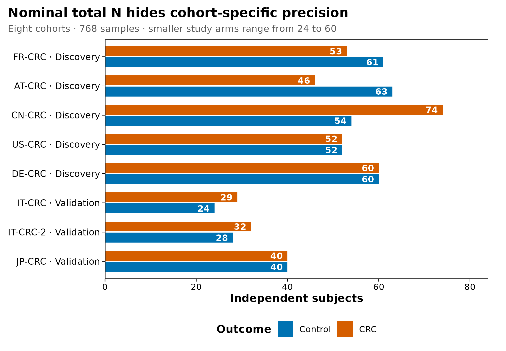
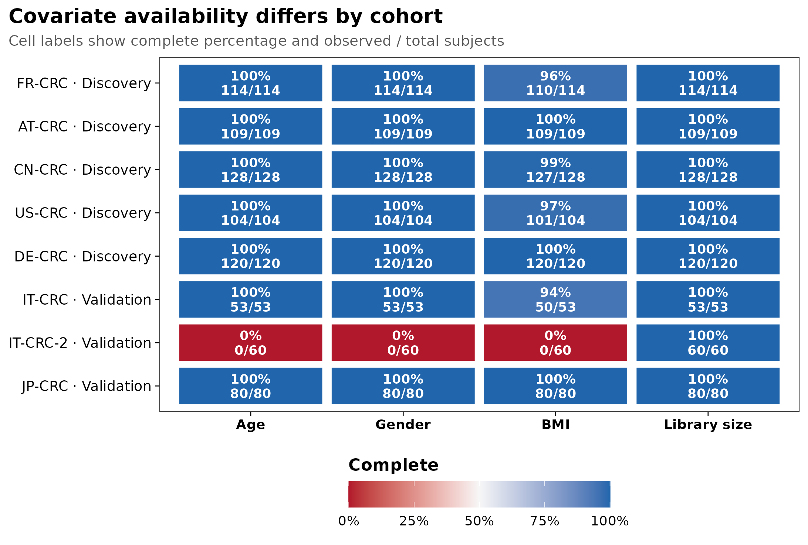
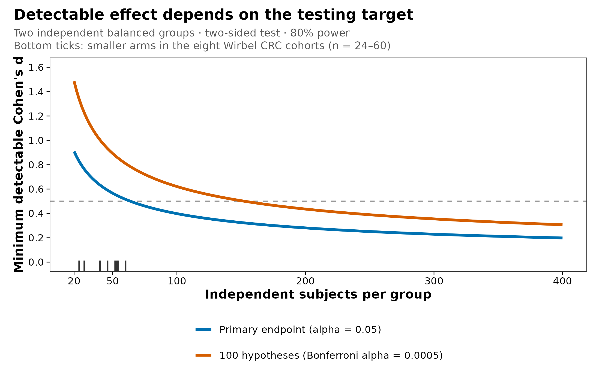

> **学习目标：**把“计划测多少例”拆成可审计的独立实验单位、主要终点、队列/批次结构、协变量完整度、最小有意义效应和验证方案。  
> **真实数据：**Wirbel 等 CRC 跨队列研究公开的 8 个队列、768 个 CRC/对照样本；本文使用队列与临床元数据，不使用虚构菌群丰度。  
> **预计资源：**普通笔记本约 1 分钟，内存低于 500 MB；效力曲线是设计敏感性分析，不是从 metadata 估计的疾病效应。

## 这一步对应论文里的哪张图 {#sec-target}

研究设计不只属于 Methods。它决定论文中的每张结果图能否被解释。

Wirbel 等在发现阶段整合 5 个 CRC 队列，又把 3 个未参与发现的队列留作独立验证；论文 Figure 3 与 Figure 5 的价值不只是 AUC 高低，而是检验疾病 signature 能否跨研究迁移 [@wirbel2019crc]。这里不复制论文面板，而是从作者公开 metadata 重绘三张设计审计图：

::: {layout-ncol="2"}
{#fig-cohort-balance}

{#fig-covariate-completeness}
:::

{#fig-power-sensitivity}

图 @fig-cohort-balance 显示总数接近平衡，并不意味着每个队列都同样有力：单个设计臂从 24 到 74 人不等。图 @fig-covariate-completeness 进一步显示，公开的 `IT-CRC-2` metadata 中年龄、性别和 BMI 均不可用。图 @fig-power-sensitivity 则把这些真实样本量放进一个**明确受限的规划近似**：主要终点、显著性水平或多重检验目标一变，效力也随之改变。

::: {.callout-important title="总样本量不是有效样本量"}
`768 samples` 不能自动替代“8 个独立队列、16 个病例—对照设计臂”。队列内检验受较小设计臂限制；跨队列模型还要为中心异质性、协变量缺失和外部验证预留信息。把全部样本打散后随机分训练集和测试集，会让同一队列的技术与人群特征同时进入两边。
:::

## 理论：从 estimand 倒推设计，而不是从预算倒推故事 {#sec-theory}

### 1. 先写一句能被计算的主要问题

**Estimand（目标估计量）**是研究真正想估计的量。宏基因组研究中，下面四句话需要四套不同的效力方案：

- CRC 与 control 的 Shannon diversity 平均差；
- 病例状态对 Bray–Curtis 群落差异解释的变异比例；
- 一个预先指定物种的 log abundance ratio；
- 一组物种在完全未见队列中的预测 AUC。

“比较两组菌群是否不同”没有指定数据对象、终点、统计模型或最小有意义效应，因此也没有唯一的样本量答案。STORMS 报告规范要求把研究设计、样本处理、生信和统计信息放在同一条可追溯链上 [@mirzayi2021storms]。

### 2. 独立实验单位决定真正的 N

- **Experimental unit（实验单位）**：可以独立接受处理、暴露或抽样的最小单位；
- **Observation（观测）**：实际进入测序和分析的一份样本；
- **Technical replicate（技术重复）**：对同一生物材料重复提取、建库或测序。

同一位受试者的两个时间点是两个观测，但通常仍只有一个独立受试者。若处理施加在笼位，实验单位可能是笼而不是动物。技术重复能帮助估计测量误差，却不能把 20 位受试者变成 40 个独立重复。

CRC 公开 metadata 的 `Sample_ID` 在这 768 个样本中唯一，适合审计病例—对照横断面设计；但它不能证明所有未来数据都没有家庭、中心、纵向或重复采样结构。自己的 metadata 必须显式提供 `SubjectID`、`Site`、`Batch`、`Timepoint` 和配对关系。

### 3. 平衡、分层与混杂决定参数能否被识别

病例与对照数量相近，只解决了一个维度。还要问：

1. 病例和对照是否分布在相同提取板、建库批次和测序 lane？
2. 年龄、性别、BMI、用药和采样流程是否在组间可比较？
3. `Disease` 是否与 `Study`、`Country` 或 `Batch` 完全重合？
4. 每个队列是否同时包含两组，允许估计队列内疾病差异？

如果所有病例都在 batch A、所有对照都在 batch B，模型 `feature ~ disease + batch` 的两个系数不可分。增加 reads 或事后使用 batch-correction 软件都不能创造缺失的交叉设计。

### 4. 样本量、测序深度和发现目标是三种不同预算

在固定总预算下，增加独立受试者通常提高对人群差异的覆盖；增加单样本测序深度主要提高低丰度物种、基因和组装对象的可见性。两者不能互相完全替代：

- read-based 常见物种或群落终点可能先受个体异质性限制；
- 稀有物种、低丰度功能或 strain SNV 可能先受覆盖度限制；
- MAG 和病毒发现还受群落复杂度、目标丰度与组装连续性限制。

因此，第 04 篇会单独处理“测多深”；本节只讨论**独立样本数与设计信息**。

### 5. 微生物组效力必须与终点和数据生成过程匹配

两组连续终点可用标准化均值差 $d$ 做初步规划；但微生物组表具有稀疏、过度离散、组成型约束、特征相关和不等测序深度。差异丰度的真实效力通常需要从 pilot 表拟合分布，再按计划模型重复模拟 [@larosa2012power; @chen2020powmic]。

若主要终点是 PERMANOVA，效力取决于组内距离、目标群落效应、距离度量、协变量和合法置换结构；不能把普通 t 检验的样本量直接搬过来。Kelly 等提出的距离矩阵模拟框架正是为这一类问题服务 [@kelly2015micropower]。Ferdous 等的综述也强调，样本量计算应围绕可检验假设，而不是寻找一个适用于所有微生物组研究的固定数字 [@ferdous2022power]。

<details>
<summary><strong>深入：为什么不能用研究结束后的 observed power 挽救阴性结果</strong></summary>

研究结束后把观测效应和 P 值代回效力公式，得到的 observed power 通常只是 P 值的单调变换。它不能区分：

- 真效应接近零；
- 样本量不足；
- 终点噪声过大；
- 批次或混杂掩盖了效应；
- 分析方法与数据分布不匹配。

阴性结果应报告效应量、置信区间、质量控制和设计能够排除的效应范围。设计阶段则用外部 pilot、最小有意义效应和多个情景做 prospective sensitivity analysis（前瞻性敏感性分析）。
</details>

## 准备工作 {#sec-setup}

<details>
<summary><strong>展开：安装依赖、重建公开设计表并定义作图函数</strong></summary>

首次运行安装轻量依赖：

```{r}
#| eval: false
install.packages(c("ggplot2", "scales", "digest", "knitr"))
```

本文执行时直接读取已提交的小表 `data/small/03-crc-design-audit.tsv`。它由 Zenodo 记录 3517209 v1.0 的 `meta_all.tsv` 确定性生成。若要从公开源重建：

```{bash}
#| eval: false
mkdir -p data/raw data/small results

curl -fL \
  "https://zenodo.org/records/3517209/files/meta_all.tsv?download=1" \
  -o data/raw/meta_all.tsv

echo "da18b10fdabae6308329e80b73991f84  data/raw/meta_all.tsv" \
  | md5sum -c -

Rscript scripts/prepare_article03_data.R \
  data/raw/meta_all.tsv \
  data/small/03-crc-design-audit.tsv \
  results/03-study-design-summary.json
```

下面的依赖、随机种子和作图函数均在正文中定义：

```{r}
library(ggplot2)
library(scales)
library(digest)
library(knitr)

set.seed(20260719)

stopifnot(
  digest(
    "data/small/03-crc-design-audit.tsv",
    algo = "sha256",
    file = TRUE
  ) == "7bdbd41dbdbec761462b2686650cb3e73aa656552d2f031838c6657c13209d8a"
)

pal_pub <- c(
  "#0072B2", "#D55E00", "#009E73", "#CC79A7",
  "#E69F00", "#56B4E9", "#F0E442", "#999999"
)

scale_color_pub <- function(...) {
  ggplot2::scale_color_manual(values = pal_pub, ...)
}

scale_fill_pub <- function(...) {
  ggplot2::scale_fill_manual(values = pal_pub, ...)
}

theme_pub <- function(base_size = 12) {
  ggplot2::theme_bw(base_size = base_size, base_family = "sans") +
    ggplot2::theme(
      panel.grid = ggplot2::element_blank(),
      axis.text = ggplot2::element_text(color = "black"),
      axis.ticks = ggplot2::element_line(color = "black", linewidth = 0.3),
      legend.key = ggplot2::element_blank(),
      legend.background = ggplot2::element_rect(
        fill = scales::alpha("white", 0.7),
        color = NA
      ),
      plot.title.position = "plot"
    )
}

save_pub <- function(
  plot,
  file_base,
  width = 160,
  height = 105,
  units = "mm",
  dpi = 300
) {
  dir.create(
    dirname(file_base),
    recursive = TRUE,
    showWarnings = FALSE
  )
  ggplot2::ggsave(
    paste0(file_base, ".pdf"),
    plot,
    width = width,
    height = height,
    units = units,
    device = grDevices::cairo_pdf
  )
  ggplot2::ggsave(
    paste0(file_base, ".png"),
    plot,
    width = width,
    height = height,
    units = units,
    dpi = dpi,
    bg = "white"
  )
  ggplot2::ggsave(
    paste0(file_base, ".tiff"),
    plot,
    width = width,
    height = height,
    units = units,
    dpi = dpi,
    compression = "lzw",
    bg = "white"
  )
  invisible(plot)
}
```
</details>

## 可复制代码：先审计有效 N，再做规划敏感性 {#sec-code}

### 1. 读取 16 个真实设计臂

```{r}
design <- read.delim(
  "data/small/03-crc-design-audit.tsv",
  check.names = FALSE,
  stringsAsFactors = FALSE,
  na.strings = c("", "NA")
)

required_columns <- c(
  "Study", "Role", "Group", "N",
  "Age_observed", "Age_complete_pct",
  "Gender_observed", "Gender_complete_pct",
  "BMI_observed", "BMI_complete_pct",
  "Library_observed", "Library_complete_pct"
)
stopifnot(
  nrow(design) == 16L,
  all(required_columns %in% names(design)),
  !anyDuplicated(design[c("Study", "Group")]),
  setequal(design$Group, c("Control", "CRC")),
  sum(design$N) == 768L,
  sum(design$N[design$Group == "CRC"]) == 386L,
  sum(design$N[design$Group == "Control"]) == 382L
)

kable(design[, c(
  "Study", "Role", "Group", "N",
  "Age_observed", "Gender_observed",
  "BMI_observed", "Library_median_m_reads"
)])
```

每行是一个队列中的一个病例—对照设计臂。公开表没有菌群特征，因此这里不估计“CRC 的微生物效应”；它只回答设计是否拥有足够、完整且可分层的信息。

### 2. 把总样本量拆回队列内比较

```{r}
study_order <- unique(design$Study)
control_rows <- design[design$Group == "Control", , drop = FALSE]
control_rows <- control_rows[
  match(study_order, control_rows$Study),
  ,
  drop = FALSE
]
crc_rows <- design[design$Group == "CRC", , drop = FALSE]
crc_rows <- crc_rows[
  match(study_order, crc_rows$Study),
  ,
  drop = FALSE
]
stopifnot(identical(control_rows$Study, crc_rows$Study))

cohort_counts <- data.frame(
  Study = study_order,
  Role = control_rows$Role,
  Control = control_rows$N,
  CRC = crc_rows$N,
  Smaller_arm = pmin(control_rows$N, crc_rows$N),
  Total = control_rows$N + crc_rows$N,
  stringsAsFactors = FALSE
)

stopifnot(
  min(cohort_counts$Smaller_arm) == 24L,
  max(cohort_counts$Smaller_arm) == 60L,
  stats::median(cohort_counts$Smaller_arm) == 49
)

kable(cohort_counts)
```

8 个队列合计 `r sum(cohort_counts$Total)` 人，但较小设计臂中位数只有 `r median(cohort_counts$Smaller_arm)` 人，范围为 `r paste(range(cohort_counts$Smaller_arm), collapse = "–")` 人。队列内 effect estimate 的不确定性首先由这些数字决定，而不是由合并后的 768 决定。

### 3. 审计协变量能否进入预定模型

```{r}
covariate_spec <- data.frame(
  Variable = c("Age", "Gender", "BMI", "Library size"),
  Observed_column = c(
    "Age_observed",
    "Gender_observed",
    "BMI_observed",
    "Library_observed"
  ),
  stringsAsFactors = FALSE
)

completeness <- do.call(
  rbind,
  lapply(study_order, function(study) {
    rows <- design[design$Study == study, , drop = FALSE]
    total <- sum(rows$N)
    observed <- vapply(
      covariate_spec$Observed_column,
      function(column) sum(rows[[column]]),
      numeric(1)
    )
    data.frame(
      Study = study,
      Role = unique(rows$Role),
      Variable = covariate_spec$Variable,
      Observed = observed,
      Total = total,
      Complete_pct = 100 * observed / total,
      stringsAsFactors = FALSE
    )
  })
)

missing_totals <- data.frame(
  Variable = covariate_spec$Variable,
  Missing = vapply(
    covariate_spec$Observed_column,
    function(column) sum(design$N - design[[column]]),
    numeric(1)
  ),
  stringsAsFactors = FALSE
)

stopifnot(
  identical(
    missing_totals$Missing,
    c(60, 60, 71, 0)
  ),
  all(
    completeness$Complete_pct[
      completeness$Study == "IT-CRC-2" &
        completeness$Variable != "Library size"
    ] == 0
  ),
  all(
    completeness$Complete_pct[
      completeness$Study == "IT-CRC-2" &
        completeness$Variable == "Library size"
    ] == 100
  )
)

kable(missing_totals)
```

年龄缺失 `r missing_totals$Missing[missing_totals$Variable == "Age"]` 例，性别缺失 `r missing_totals$Missing[missing_totals$Variable == "Gender"]` 例，BMI 缺失 `r missing_totals$Missing[missing_totals$Variable == "BMI"]` 例。若强制在全体样本中拟合 `feature ~ disease + age + sex + BMI + study`，complete-case analysis 会整队列删除 `IT-CRC-2`，从而改变“外部验证”的目标人群。

### 4. 用两个 alpha 情景计算最小可检测差异

下面只考虑一个理想化问题：

- 两个独立组；
- 每组样本量相等；
- 连续、近似正态的主要终点；
- 双侧检验；
- 目标 power = 80%；
- 标准差归一为 1，因此差异是 Cohen's $d$。

```{r}
alpha_scenarios <- data.frame(
  Scenario = c(
    "One primary endpoint",
    "100 confirmatory hypotheses"
  ),
  Alpha = c(0.05, 0.05 / 100),
  Label = c(
    "Primary endpoint (alpha = 0.05)",
    "100 hypotheses (Bonferroni alpha = 0.0005)"
  ),
  stringsAsFactors = FALSE
)

n_grid <- seq(20, 400, by = 2)
target_power <- 0.80

power_sensitivity <- do.call(
  rbind,
  lapply(seq_len(nrow(alpha_scenarios)), function(i) {
    alpha_value <- alpha_scenarios$Alpha[i]
    data.frame(
      N_per_group = n_grid,
      Detectable_d = vapply(
        n_grid,
        function(n) {
          stats::power.t.test(
            n = n,
            delta = NULL,
            sd = 1,
            sig.level = alpha_value,
            power = target_power,
            type = "two.sample",
            alternative = "two.sided"
          )$delta
        },
        numeric(1)
      ),
      Scenario = alpha_scenarios$Scenario[i],
      Label = alpha_scenarios$Label[i],
      Alpha = alpha_value,
      stringsAsFactors = FALSE
    )
  })
)

curve_checks <- split(
  power_sensitivity$Detectable_d,
  power_sensitivity$Scenario
)
stopifnot(all(vapply(
  curve_checks,
  function(x) all(diff(x) < 0),
  logical(1)
)))

detectable_at <- function(n, alpha_value) {
  stats::power.t.test(
    n = n,
    delta = NULL,
    sd = 1,
    sig.level = alpha_value,
    power = target_power,
    type = "two.sample",
    alternative = "two.sided"
  )$delta
}

sensitivity_landmarks <- data.frame(
  N_per_group = c(24, 60, 24, 60),
  Alpha = c(0.05, 0.05, 0.0005, 0.0005)
)
sensitivity_landmarks$Detectable_d <- mapply(
  detectable_at,
  sensitivity_landmarks$N_per_group,
  sensitivity_landmarks$Alpha
)
kable(sensitivity_landmarks, digits = 3)
```

在理想化单一主要终点下，每组 $n=24$ 只能以 80% power 检出约 $d=`r sprintf("%.2f", detectable_at(24, 0.05))`$ 的差异；每组 $n=60$ 的边界约为 $d=`r sprintf("%.2f", detectable_at(60, 0.05))`$。若把 100 个确认性假设用 Bonferroni 作为保守规划边界，对应数值升至约 `r sprintf("%.2f", detectable_at(24, 0.0005))` 和 `r sprintf("%.2f", detectable_at(60, 0.0005))`。

这些数值不应直接当作物种差异丰度研究的正式样本量。它们只证明：**同一个 N 在不同主要终点和错误控制目标下，代表完全不同的可检测范围。**

### 5. 把失访、质控淘汰和分层写进招募数

若模型估计需要 $n_\text{analysis}$ 个可分析受试者，预计总不可用比例为 $q$，最低招募数为：

$$
n_\text{recruit} =
\left\lceil
\frac{n_\text{analysis}}{1-q}
\right\rceil .
$$

```{r}
analysis_target <- 60
loss_scenarios <- c(
  "5% unusable" = 0.05,
  "10% unusable" = 0.10,
  "15% unusable" = 0.15
)

recruitment <- data.frame(
  Scenario = names(loss_scenarios),
  Analysis_target_per_group = analysis_target,
  Expected_unusable = unname(loss_scenarios),
  Recruit_per_group = ceiling(
    analysis_target / (1 - unname(loss_scenarios))
  ),
  stringsAsFactors = FALSE
)
kable(recruitment)
```

不可用比例应包括撤回、metadata 缺失、DNA 量不足、建库失败、去宿主后微生物 reads 不足和预先定义的 QC 淘汰；不能在结果出来后临时改变分母。

## 审计与升级 {#sec-audit}

### 从“合并后显著”升级到“队列内可识别”

Wirbel 研究最值得保留的设计思想是发现队列与外部验证队列分开 [@wirbel2019crc]。今天实施时应再增加四层审计：

1. **预注册主要终点。** 明确是 community-level、feature-level 还是 predictive endpoint，并指定效应量尺度。
2. **把 Study 当作设计结构。** 先估计队列内效应，再做 meta-analysis；或在分层模型中显式建模 study，而不是把 768 个样本视为同分布。
3. **把缺失写进 estimand。** 若某队列没有年龄/BMI，决定是使用未调整的队列内效应、分层调整、插补，还是限制目标总体；每种选择回答的问题不同。
4. **把验证集锁死。** 特征筛选、预处理、超参数和阈值只能在训练数据中确定；真正未见队列只能在管线冻结后打开。

### 不要把测序量完整误解为协变量完整

本文 768 例的 `Library_Size` 全部可用，但年龄、性别和 BMI 并非如此。测序量完整只能说明一个技术字段存在，不能替代临床混杂变量。反过来，把 library size 机械加入每一个下游模型也不一定正确：相对丰度、offset、下采样、presence/absence 和 read-depth QC 对测序量的处理不同，必须服从数据对象和统计模型。

### 正式效力分析的升级路线

| 主要终点 | 需要的 pilot 信息 | 建议规划方式 |
|---|---|---|
| 单一连续指标 | 组内 SD、最小有意义差异 | 参数公式 + 多情景敏感性 |
| PERMANOVA | 组内距离、目标 $\omega^2$、置换结构 | 距离矩阵模拟 |
| 差异丰度 | prevalence、均值、离散度、零值、相关结构 | 拟合 pilot 后重复模拟 |
| 纵向变化 | 个体内相关、时间点、失访模式 | mixed-model simulation |
| 外部预测 | 队列数、prevalence、异质性、目标 AUC/校准 | leave-one-study-out simulation |

::: {.callout-warning title="先做设计可识别性，再做 power"}
如果疾病与批次完全混杂，或所有验证样本在分析前已参与特征筛选，再大的名义 power 也不能恢复目标效应。样本量公式假定设计和检验本身有效；它不会修复不可识别参数、数据泄漏或错误实验单位。
:::

## 出版级美化 {#sec-polish}

### 1. 队列内病例—对照平衡图

```{r}
balance_long <- rbind(
  data.frame(
    Study = cohort_counts$Study,
    Role = cohort_counts$Role,
    Group = "Control",
    N = cohort_counts$Control
  ),
  data.frame(
    Study = cohort_counts$Study,
    Role = cohort_counts$Role,
    Group = "CRC",
    N = cohort_counts$CRC
  )
)
balance_long$Study_label <- paste0(
  balance_long$Study,
  ifelse(
    balance_long$Role == "Discovery / meta-analysis",
    " · Discovery",
    " · Validation"
  )
)
study_labels <- unique(balance_long$Study_label)
balance_long$Study_label <- factor(
  balance_long$Study_label,
  levels = rev(study_labels)
)
balance_long$Group <- factor(
  balance_long$Group,
  levels = c("Control", "CRC")
)

p_cohort_balance <- ggplot(
  balance_long,
  aes(N, Study_label, fill = Group)
) +
  geom_col(
    position = position_dodge(width = 0.76),
    width = 0.68,
    orientation = "y"
  ) +
  geom_text(
    aes(x = N - 1.0, label = N),
    position = position_dodge(width = 0.76),
    hjust = 1,
    size = 3.2,
    fontface = "bold",
    color = "white"
  ) +
  scale_fill_manual(
    values = c("Control" = "#0072B2", "CRC" = "#D55E00"),
    drop = FALSE
  ) +
  scale_x_continuous(
    limits = c(0, 84),
    breaks = seq(0, 80, by = 20),
    expand = expansion(mult = c(0, 0))
  ) +
  labs(
    title = "Nominal total N hides cohort-specific precision",
    subtitle = "Eight cohorts · 768 samples · smaller study arms range from 24 to 60",
    x = "Independent subjects",
    y = NULL,
    fill = "Outcome"
  ) +
  theme_pub(base_size = 11) +
  theme(
    plot.title = element_text(face = "bold", size = 13),
    plot.subtitle = element_text(color = "grey35", size = 9.5),
    axis.title = element_text(face = "bold"),
    axis.text.y = element_text(size = 9.2),
    legend.position = "bottom",
    legend.title = element_text(face = "bold"),
    plot.margin = margin(8, 18, 8, 8)
  )

p_cohort_balance
save_pub(
  p_cohort_balance,
  "figures/03-cohort-balance",
  width = 180,
  height = 125
)
```

### 2. 协变量完整度热图

```{r}
completeness$Study_label <- paste0(
  completeness$Study,
  ifelse(
    completeness$Role == "Discovery / meta-analysis",
    " · Discovery",
    " · Validation"
  )
)
completeness$Study_label <- factor(
  completeness$Study_label,
  levels = rev(study_labels)
)
completeness$Variable <- factor(
  completeness$Variable,
  levels = covariate_spec$Variable
)
completeness$Cell_label <- sprintf(
  "%.0f%%\n%d/%d",
  completeness$Complete_pct,
  completeness$Observed,
  completeness$Total
)
completeness$Text_color <- ifelse(
  completeness$Complete_pct <= 20 |
    completeness$Complete_pct >= 80,
  "white",
  "black"
)

p_covariate_completeness <- ggplot(
  completeness,
  aes(Variable, Study_label, fill = Complete_pct)
) +
  geom_tile(
    color = "white",
    linewidth = 1.0,
    width = 0.96,
    height = 0.92
  ) +
  geom_text(
    aes(label = Cell_label, color = Text_color),
    size = 3.0,
    fontface = "bold",
    lineheight = 0.92
  ) +
  scale_color_identity() +
  scale_fill_gradient2(
    low = "#B2182B",
    mid = "#F7F7F7",
    high = "#2166AC",
    midpoint = 50,
    limits = c(0, 100),
    breaks = c(0, 25, 50, 75, 100),
    labels = function(x) paste0(x, "%")
  ) +
  labs(
    title = "Covariate availability differs by cohort",
    subtitle = "Cell labels show complete percentage and observed / total subjects",
    x = NULL,
    y = NULL,
    fill = "Complete"
  ) +
  theme_pub(base_size = 11) +
  theme(
    plot.title = element_text(face = "bold", size = 13),
    plot.subtitle = element_text(color = "grey35", size = 9.5),
    axis.text.x = element_text(face = "bold"),
    axis.text.y = element_text(size = 9.2),
    legend.position = "bottom",
    legend.title = element_text(face = "bold")
  ) +
  guides(fill = guide_colorbar(
    title.position = "top",
    barwidth = grid::unit(60, "mm")
  ))

p_covariate_completeness
save_pub(
  p_covariate_completeness,
  "figures/03-covariate-completeness",
  width = 185,
  height = 125
)
```

### 3. 最小可检测差异敏感性曲线

```{r}
power_sensitivity$Label <- factor(
  power_sensitivity$Label,
  levels = alpha_scenarios$Label
)
arm_sizes <- cohort_counts[, c("Study", "Smaller_arm")]

power_colors <- c(
  "Primary endpoint (alpha = 0.05)" = "#0072B2",
  "100 hypotheses (Bonferroni alpha = 0.0005)" = "#D55E00"
)

p_power_sensitivity <- ggplot(
  power_sensitivity,
  aes(N_per_group, Detectable_d, color = Label)
) +
  geom_hline(
    yintercept = 0.5,
    color = "grey60",
    linewidth = 0.5,
    linetype = "dashed"
  ) +
  geom_line(linewidth = 1.15) +
  geom_rug(
    data = arm_sizes,
    aes(x = Smaller_arm),
    inherit.aes = FALSE,
    sides = "b",
    color = "grey20",
    linewidth = 0.7,
    length = grid::unit(3.5, "mm")
  ) +
  scale_color_manual(values = power_colors) +
  scale_x_continuous(
    breaks = c(20, 50, 100, 200, 300, 400),
    limits = c(20, 400)
  ) +
  scale_y_continuous(
    breaks = seq(0, 1.6, by = 0.2),
    limits = c(0, 1.6)
  ) +
  labs(
    title = "Detectable effect depends on the testing target",
    subtitle = paste0(
      "Two independent balanced groups · two-sided test · 80% power\n",
      "Bottom ticks: smaller arms in the eight Wirbel CRC cohorts (n = 24–60)"
    ),
    x = "Independent subjects per group",
    y = "Minimum detectable Cohen's d",
    color = NULL
  ) +
  theme_pub(base_size = 11) +
  theme(
    plot.title = element_text(face = "bold", size = 13),
    plot.subtitle = element_text(
      color = "grey35",
      size = 9.3,
      lineheight = 1.0
    ),
    axis.title = element_text(face = "bold"),
    legend.position = "bottom",
    legend.text = element_text(size = 8.8),
    plot.margin = margin(8, 8, 13, 12)
  ) +
  guides(color = guide_legend(nrow = 2, byrow = TRUE))

p_power_sensitivity
save_pub(
  p_power_sensitivity,
  "figures/03-power-sensitivity",
  width = 185,
  height = 120
)
```

三张图都导出 PDF、300-ppi PNG 和 LZW 压缩 TIFF。图内的队列、分组、轴、图例和统计标注均为英文；Methods 中仍应解释 `Discovery`、`Validation` 和 power 情景的定义。

## 常见坑：审稿人会追问什么 {#sec-pitfalls}

::: {.callout-caution title="把样本管数当独立 N"}
纵向样本、左右侧样本、同笼动物或技术重复没有写入模型，会低估标准误并夸大显著性。先画 subject—sample—batch 层级表，再决定随机效应、配对检验和置换限制。
:::

::: {.callout-caution title="用一个通用数字回答所有终点"}
“每组 30 个就够”没有统计意义。α diversity、PERMANOVA、差异物种、MAG 发现和外部 AUC 的效力函数不同；至少要给主要终点、最小效应、方差/距离、alpha、power 和不可用比例。
:::

::: {.callout-caution title="把 pilot 点估计当真效应"}
小型 pilot 的效应常被高估。规划时同时使用最小有意义效应、pilot 置信区间和保守情景；不要只选择能让预算看起来足够的数字。
:::

::: {.callout-caution title="忽略多重检验和 prevalence"}
物种表中 500 个特征不等于 500 个同等有力的检验。稀有特征的有效样本数更低，零值、离散度和相关结构会改变 power 与 FDR；应按预过滤规则和计划 DA 方法模拟。
:::

::: {.callout-caution title="complete-case analysis 偷换目标人群"}
如果缺失集中在一个队列，完整病例分析不是随机少几个人，而是可能删除整个中心。需要报告每个队列的缺失模式，并说明插补、分层调整或未调整 meta-analysis 各自的 estimand。
:::

::: {.callout-caution title="随机切分冒充外部验证"}
同一队列随机拆分会共享采样、提取、测序和人群特征。跨队列问题应按 Study 留出；所有特征选择和调参都留在训练队列内部。
:::

## 这段 Methods 怎么写 {#sec-methods}

下面模板与本文实际执行对象一致：

> **Study-design audit and planning sensitivity.** We reconstructed the case-control design from the public metadata accompanying the Wirbel et al. colorectal cancer metagenome meta-analysis (Zenodo record 3517209, version 1.0; `meta_all.tsv`; MD5 `da18b10fdabae6308329e80b73991f84`; CC BY 4.0). Eight prespecified cohorts containing both colorectal cancer and control samples were retained, yielding 768 unique subjects (386 cases and 382 controls). Cohort-specific arm sizes ranged from 24 to 74 subjects. Availability of age, sex, BMI and sequencing library size was summarized within each cohort and outcome group; 60 age values, 60 sex values and 71 BMI values were missing, whereas library size was complete. The `IT-CRC-2` public metadata contained no age, sex or BMI values. As an illustrative prospective sensitivity analysis—not an estimate of a microbiome disease effect—we calculated the minimum detectable standardized mean difference for two independent balanced groups using a two-sided t-test, 80% power, and either alpha = 0.05 for one primary endpoint or alpha = 0.0005 as a conservative Bonferroni boundary for 100 confirmatory hypotheses. Calculations and figures were generated in R 4.4.1 with a fixed seed of 20260719 and exported as PDF and 300-ppi PNG/TIFF files.

若用于自己的研究，还必须补充：

- 招募来源、纳入/排除标准和独立实验单位；
- 主要/次要终点及最小有意义效应；
- 随机化、配对、阻断和 batch 平衡方案；
- pilot 数据来源、方差/距离/分布参数及软件版本；
- 多重检验、失访和 QC 淘汰假设；
- 预注册的训练、验证和最终测试边界。

## 换成你自己的数据怎么做 {#sec-own-data}

### 最低 metadata 合同

每行一个观测，至少提供：

| 字段 | 含义 | 不能省略的原因 |
|---|---|---|
| `SampleID` | 测序样本唯一标识 | 对齐 FASTQ、谱表和 QC |
| `SubjectID` | 独立受试者/实验单位 | 识别配对和伪重复 |
| `Group` | 主要暴露或结局 | 定义主要比较 |
| `Study` / `Site` | 队列或中心 | 分层、meta-analysis、外部验证 |
| `Batch` / `Plate` / `Lane` | 实验技术结构 | 检查混杂与阻断 |
| `Timepoint` | 纵向时间 | 定义基线与重复测量 |
| 核心协变量 | 年龄、性别、BMI、用药等 | 控制预先指定的混杂 |
| `LibrarySize` | QC 后 reads 或目标层 reads | 审计测序深度与可用性 |

### 开工前完成五张表

1. `table(Group, Study)`：每个队列是否同时有各组；
2. `table(Group, Batch)`：疾病与实验批次是否重合；
3. 每个 `SubjectID` 的观测数：谁是独立 N；
4. `Study × covariate` 完整度矩阵：调整模型会删除谁；
5. 主要终点的 power 情景表：效应、方差、alpha、power、失访和招募数。

### 正式模拟的最小伪代码

```{r}
#| eval: false
set.seed(20260719)

for (n_per_group in c(30, 50, 80, 120)) {
  for (simulation_id in seq_len(1000)) {
    # 1. 从外部 pilot 拟合的 prevalence、mean、dispersion、
    #    correlation 和 library-size 分布生成数据
    # 2. 按未来方案加入 Study、Batch、pairing 或 longitudinal structure
    # 3. 原样执行预过滤、normalization、model 和 FDR procedure
    # 4. 记录 primary endpoint 是否检出，以及 empirical FDR
  }
}
```

模拟脚本必须使用未来计划中的**完整分析管线**。若只模拟正态数据，却计划使用稀疏组成型物种表、队列分层和 BH FDR，得到的 power 不对应真正研究。

## 小结

- 真正的 N 是独立实验单位数，不是 FASTQ、样本管或技术重复数。
- 8 个队列的 768 例应被看成有层级的设计，而不是一个同分布的大样本。
- 协变量缺失会限制可调整模型，并可能改变目标总体。
- 样本量必须绑定主要终点、最小效应、alpha、power、不可用比例和验证边界。
- t 检验曲线只能作为明确标注的规划近似；PERMANOVA、差异丰度、纵向和外部预测应使用与分析方法匹配的模拟。

## 参考 {#sec-references}

- Wirbel J, Pyl PT, Kartal E, et al. Meta-analysis of fecal metagenomes reveals global microbial signatures that are specific for colorectal cancer. *Nature Medicine*. 2019;25:679–689. <https://doi.org/10.1038/s41591-019-0406-6>
- La Rosa PS, Brooks JP, Deych E, et al. Hypothesis testing and power calculations for taxonomic-based human microbiome data. *PLoS ONE*. 2012;7:e52078. <https://doi.org/10.1371/journal.pone.0052078>
- Kelly BJ, Gross R, Bittinger K, et al. Power and sample-size estimation for microbiome studies using pairwise distances and PERMANOVA. *Bioinformatics*. 2015;31:2461–2468. <https://doi.org/10.1093/bioinformatics/btv183>
- Chen L. powmic: an R package for power assessment in microbiome case-control studies. *Bioinformatics*. 2020;36:3563–3565. <https://doi.org/10.1093/bioinformatics/btaa197>
- Mirzayi C, Renson A, Genomic Standards Consortium, et al. Reporting guidelines for human microbiome research: the STORMS checklist. *Nature Medicine*. 2021;27:1885–1892. <https://doi.org/10.1038/s41591-021-01552-x>
- Ferdous T, Jiang L, Dinu I, et al. The rise to power of the microbiome: power and sample size calculation for microbiome studies. *Mucosal Immunology*. 2022;15:1060–1070. <https://doi.org/10.1038/s41385-022-00548-1>
