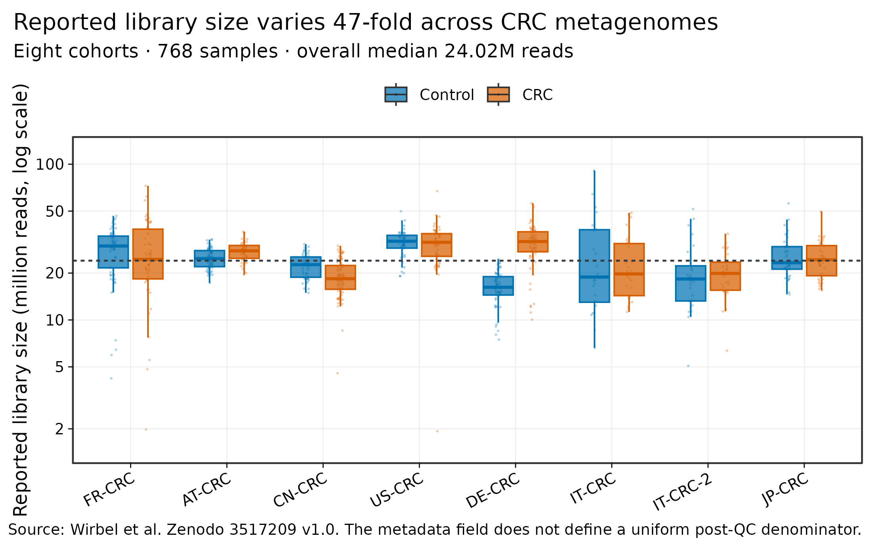
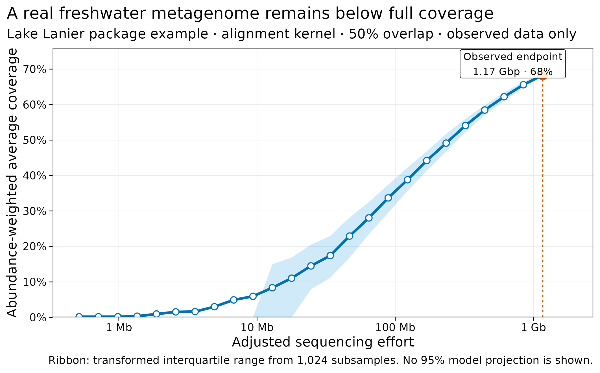
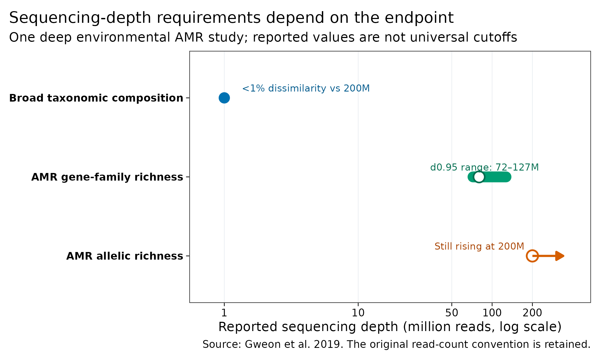

> **学习目标：**把“每个样本测多少”改写成一个可验证的决策：明确 reads 的分母、主要终点、样本复杂度、宿主 DNA 比例和停止规则，再用代表性样本的真实下采样曲线定深度。  
> **真实数据：**Wirbel 等公开的 8 个 CRC 队列、768 个样本的 `Library_Size`；Nonpareil 包中 Lake Lanier 宏基因组的真实 `.npo` 冗余曲线；Gweon 等深测序研究报告的 taxonomy 与 AMR 终点锚点。  
> **预计资源：**本文小表重绘在普通笔记本上通常低于 1 分钟、内存低于 1 GB。对自己的 FASTQ 做完整 pilot 时，磁盘至少要容纳原始数据、各下采样层级与一次完整输出；组装、MAG 或 strain 终点应在 HPC/云端先用 3–5 个代表性样本实测 wall time、峰值内存和临时盘。

## 这一步对应论文里的哪张图 {#sec-target}

测序深度不是一个脱离研究终点的 Methods 数字。它会同时出现在样本 QC 图、稀释/饱和曲线和方法敏感性分析里。

Wirbel 等的 CRC 跨队列公开 metadata 提供了一个现实起点：同一分析集的 reported library size 从 1.93 million 到 90.92 million，整体中位数约 24.02 million [@wirbel2019crc]。这些值适合审计队列间深度差异，却不能自动视为统一阶段的“去宿主后微生物 reads”。

{#fig-crc-library-depth}

Lake Lanier 的公开 Nonpareil 示例则展示了真正的数据内饱和信号。该 `.npo` 文件包含 13,551,190 条 reads，平均长度 86.158 bp；按 Nonpareil 的 overlap correction 转换后，1.17 Gbp 的观测终点对应约 68% abundance-weighted average coverage [@oh2011lakelanier; @rodriguezr2014nonpareil]。

{#fig-nonpareil-saturation}

但“coverage 上升”仍不等于所有分析终点同步饱和。Gweon 等对 pig caeca、river sediment 和 effluent 做约 200 million、150-bp paired-end reads 的深测序：广义 taxonomic composition 在 1 million 的层级已与最深层级相差低于 1%，而 AMR gene-family richness 约需 80 million，effluent 中的 AMR allelic richness 到 200 million 仍未平台 [@gweon2019depth]。

{#fig-endpoint-depth}

::: {.callout-important title="先问“什么达到稳定”，再问“测多少”"}
图 @fig-endpoint-depth 的 1M、80M 和 200M 来自同一项环境/动物 AMR 研究，却已经相差两个数量级。它们证明的是**终点依赖性**，不是“人体肠道应测 1M”或“所有 resistome 应测 80M”的报价单。
:::

## 理论：深度是“可用信息量”，不是下机 reads 的单一数字 {#sec-theory}

### 1. 同一个 FASTQ 至少有四种深度分母

测序服务报告的数字可能是 read pairs，也可能是单端 reads；分析日志又可能报告质控后 reads、非宿主 reads 或成功比对到目标的 reads。先固定四层分母：

1. **Raw reads / read pairs**：下机总量，必须说明 paired-end 时计“pairs”还是“两端之和”；
2. **QC-passed reads**：去接头、低质量和过短序列后的数量；
3. **Non-host microbial reads**：去宿主后仍可进入微生物分析的数量；
4. **Endpoint-supporting reads**：被目标 profiler、基因库、MAG 或 strain 位点真正利用的数量。

可用信息量可以写成审计恒等式：

$$
N_\text{microbial}
=
N_\text{raw}
\times f_\text{QC}
\times f_\text{non-host},
$$

$$
N_\text{target}
=
N_\text{microbial}
\times f_\text{assigned}
\times f_\text{target}.
$$

这些比例不是固定常数。宿主比例 5% 与 95% 的两个样本即使下机量相同，留给微生物的 reads 也会相差近 20 倍；参考数据库覆盖不足时，`f_assigned` 还会因环境和数据库版本改变。

### 2. Coverage、richness 与“看见稀有对象”不是同一个量

Nonpareil 通过 reads 之间的冗余估计 DNA sequence space 的 abundance-weighted average coverage，不依赖分类数据库 [@rodriguezr2014nonpareil; @rodriguezr2018nonpareil3]。这里的 abundance weighting 很关键：

- 高丰度群体贡献大量 DNA，先被覆盖；
- 大量极低丰度物种可以仍未被观测；
- 68% average coverage 不表示 68% 的物种、基因家族或 MAG 已被发现；
- reference-based taxonomy 饱和也不表示未收录物种、strain SNV 或 AMR allele 饱和。

因此，至少要分别画：

- database-independent sequence coverage 曲线；
- 主要分类/功能终点的稳定性曲线；
- 若做组装，contig、mapped fraction、目标基因组 breadth/depth 和 MAG recovery 曲线。

### 3. 目标基因组的相对丰度会把 MAG 深度迅速推高

在理想均匀抽样、无宿主、无损失、无重复的下界近似中，若目标基因组大小为 $G$、相对 DNA 丰度为 $a$、希望平均深度为 $D$、单条 read 长度为 $L$，所需单端 reads 约为：

$$
N_\text{reads}
\approx
\frac{D G}{aL}.
$$

以 5 Mb 基因组、150 bp reads、目标 10× 为例：

- 相对丰度 1%：约 33 million reads；
- 相对丰度 0.1%：约 333 million reads；
- 相对丰度 0.01%：约 3.3 billion reads。

这是理想下界，不含宿主、质控损失、覆盖不均、重复序列、近缘菌株共存和组装图冲突。它解释了为什么“物种组成已经稳定”与“能否回收低丰度 MAG”可以同时得到相反答案。

### 4. 样本数与单样本深度争夺同一预算

固定总测序预算 $B$ 时，粗略关系是：

$$
B \approx n_\text{samples} \times d_\text{per-sample}.
$$

增加独立受试者主要扩展人群异质性和统计精度；增加单样本深度主要提高低丰度序列与复杂对象的可见性。若主要终点是常见物种的队列内差异，过度加深少量样本可能不如增加独立受试者；若目标是稀有 resistome、strain 或 MAG，过浅地摊薄到更多样本又可能让每个样本都没有可用 target coverage。

设计时应同时报告两条曲线：

- **效力曲线**：独立样本数变化时，目标统计效应的可检测范围；
- **饱和曲线**：单样本深度变化时，目标数据产物的增益。

### 5. 饱和必须用预先写好的停止规则判定

“曲线看起来平了”不可审计。可把最深样本按固定层级下采样，在每一层运行完全相同的 pipeline，并预先定义稳定性：

$$
\Delta_k
=
\frac{|M_k-M_{k-1}|}
{\max(|M_k|,\epsilon)},
$$

其中 $M_k$ 可以是 Shannon index、与最深层级的 Bray–Curtis dissimilarity、AMR richness、目标 genome breadth 或 MAG 数量。一个可复核的停止规则可以是：

> 在连续两个深度层级中，主要终点相对变化均低于 5%，且关键 QC、阴性对照与次要终点没有恶化。

阈值 5% 只是示例，正式研究应根据最小有意义差异、测量误差与错误代价预注册。离散的 MAG 数量或稀有 allele richness 往往不适合只用相对变化，还应报告多次固定种子的下采样变异。

<details>
<summary><strong>深入：为什么 Nonpareil 只用一端或 merged reads</strong></summary>

Nonpareil coverage 模型假设序列事件近似独立。paired-end 的两个 mates 来自同一 DNA 片段，并不独立；Nonpareil 3 因而建议使用 single reads、paired-end 中的一端，或已合并的 read [@rodriguezr2018nonpareil3]。若把 R1 和 R2 当作两条独立随机序列直接混入，冗余结构和测序 effort 的解释都会改变。

此外，Nonpareil 自身的随机子采样要固定 `-r`。多次鲁棒性评估可以预先列出多个种子，但不能依赖“当前时间”。
</details>

## 准备工作 {#sec-setup}

<details>
<summary><strong>展开：安装依赖、校验真实输入并定义作图函数</strong></summary>

本文重绘只依赖轻量 R 包：

```{r}
#| eval: false
install.packages(c("ggplot2", "scales", "digest", "knitr"))
```

CRC library-size 表由 Wirbel 公开 metadata 确定性生成。Lake Lanier `.npo` 是 Nonpareil tag `v3.5.5` 中未修改的 package example；文件头记录它由 Nonpareil `2.40`、alignment kernel、50% overlap 生成。第三方文件按 Artistic License 2.0 保留来源与 notice：

```{bash}
#| eval: false
mkdir -p data/raw data/small results

curl -fL \
  "https://zenodo.org/records/3517209/files/meta_all.tsv?download=1" \
  -o data/raw/meta_all.tsv
echo "da18b10fdabae6308329e80b73991f84  data/raw/meta_all.tsv" \
  | md5sum -c -

curl -fL \
  "https://raw.githubusercontent.com/lmrodriguezr/nonpareil/v3.5.5/utils/Nonpareil/inst/extdata/LakeLanier.npo" \
  -o data/small/04-lake-lanier.npo
echo "8db00c35eadb64c36eaccad35007c9e7a5d553efb0d5c12b6f859ab1097f52f4  data/small/04-lake-lanier.npo" \
  | sha256sum -c -

Rscript scripts/prepare_article04_data.R \
  data/raw/meta_all.tsv \
  data/small/04-lake-lanier.npo \
  data/small/04-crc-library-size.tsv \
  data/small/04-lake-lanier-coverage.tsv \
  results/04-sequencing-depth-summary.json
```

若只拿到 `.npo`，下面就是本文使用的核心转换。它复现 Nonpareil 对 alignment-kernel 输出的 overlap correction 和 sequencing-effort adjustment；不拟合或外推 95% coverage 模型：

```{r}
#| eval: false
header <- grep(
  "^# @",
  readLines("data/small/04-lake-lanier.npo"),
  value = TRUE
)
keys <- sub(":.*$", "", sub("^# @", "", header))
values <- sub("^.*: ", "", header)
meta <- setNames(values, keys)

npo <- read.table(
  "data/small/04-lake-lanier.npo",
  sep = "\t",
  comment.char = "#"
)
names(npo) <- c("reads", "mean", "sd", "q1", "median", "q3")

coverage_exponent <- 1 - exp(
  2.23e-2 * as.numeric(meta[["overlap"]]) - 3.5698
)
npo$coverage <- npo$mean^coverage_exponent
npo$q1_coverage <- npo$q1^coverage_exponent
npo$q3_coverage <- npo$q3^coverage_exponent

final_coverage <- tail(npo$coverage, 1)
adjusted_reads <- ifelse(
  npo$reads == 0,
  0,
  exp(
    log(max(npo$reads)) +
      final_coverage^0.27 *
        (log(npo$reads) - log(max(npo$reads)))
  )
)
npo$effort_bp <- adjusted_reads *
  as.numeric(meta[["L"]]) *
  as.numeric(meta[["R"]]) /
  max(adjusted_reads)
```

下面的依赖、随机种子、文件指纹和作图函数均在正文内定义：

```{r}
library(ggplot2)
library(scales)
library(digest)
library(knitr)

set.seed(20260719)

expected_sha256 <- c(
  "data/small/04-lake-lanier.npo" =
    "8db00c35eadb64c36eaccad35007c9e7a5d553efb0d5c12b6f859ab1097f52f4",
  "data/small/04-crc-library-size.tsv" =
    "3478f729860c48975239276ef33ccc42a2027132e4c87e13f1f6e8ed9c1aad3e",
  "data/small/04-lake-lanier-coverage.tsv" =
    "7f67d953b4b2544aa74fb5fb1ad840ce32727573d94418b316480703b3f1140a",
  "data/small/04-depth-evidence.tsv" =
    "adf1a4af658330612212c761ce7a804bafcad34c0dc3c36994a0bf95bc31cb9a"
)
observed_sha256 <- vapply(
  names(expected_sha256),
  digest,
  character(1),
  algo = "sha256",
  file = TRUE
)
stopifnot(
  identical(
    unname(observed_sha256),
    unname(expected_sha256)
  )
)

pal_pub <- c(
  "#0072B2", "#D55E00", "#009E73", "#CC79A7",
  "#E69F00", "#56B4E9", "#F0E442", "#999999"
)

scale_color_pub <- function(...) {
  ggplot2::scale_color_manual(values = pal_pub, ...)
}

scale_fill_pub <- function(...) {
  ggplot2::scale_fill_manual(values = pal_pub, ...)
}

theme_pub <- function(base_size = 12) {
  ggplot2::theme_bw(base_size = base_size, base_family = "sans") +
    ggplot2::theme(
      panel.grid.minor = ggplot2::element_blank(),
      panel.grid.major = ggplot2::element_line(
        color = "#E8ECF1",
        linewidth = 0.25
      ),
      axis.text = ggplot2::element_text(color = "black"),
      axis.ticks = ggplot2::element_line(color = "black", linewidth = 0.3),
      legend.key = ggplot2::element_blank(),
      legend.background = ggplot2::element_rect(
        fill = scales::alpha("white", 0.75),
        color = NA
      ),
      plot.title.position = "plot"
    )
}

save_pub <- function(
  plot,
  file_base,
  width = 180,
  height = 112,
  units = "mm",
  dpi = 300
) {
  dir.create(
    dirname(file_base),
    recursive = TRUE,
    showWarnings = FALSE
  )
  ggplot2::ggsave(
    paste0(file_base, ".pdf"),
    plot,
    width = width,
    height = height,
    units = units,
    device = grDevices::cairo_pdf
  )
  ggplot2::ggsave(
    paste0(file_base, ".png"),
    plot,
    width = width,
    height = height,
    units = units,
    dpi = dpi,
    bg = "white"
  )
  ggplot2::ggsave(
    paste0(file_base, ".tiff"),
    plot,
    width = width,
    height = height,
    units = units,
    dpi = dpi,
    compression = "lzw",
    bg = "white"
  )
  invisible(plot)
}
```
</details>

## 可复制代码：从真实分布到预注册停止规则 {#sec-code}

### 1. 读取 768 个 CRC 样本的 reported library size

```{r}
library_size <- read.delim(
  "data/small/04-crc-library-size.tsv",
  check.names = FALSE,
  stringsAsFactors = FALSE
)

required_library_columns <- c(
  "Sample_ID", "Study", "Group", "Library_Size", "Role"
)
stopifnot(
  nrow(library_size) == 768L,
  all(required_library_columns %in% names(library_size)),
  !anyDuplicated(library_size$Sample_ID),
  length(unique(library_size$Study)) == 8L,
  setequal(library_size$Group, c("Control", "CRC")),
  all(library_size$Library_Size > 0),
  stats::median(library_size$Library_Size) == 24019758.5,
  min(library_size$Library_Size) == 1932775,
  max(library_size$Library_Size) == 90924580
)

study_order <- unique(library_size$Study)
group_order <- c("Control", "CRC")
depth_summary <- do.call(
  rbind,
  lapply(study_order, function(study) {
    do.call(
      rbind,
      lapply(group_order, function(group) {
        x <- library_size$Library_Size[
          library_size$Study == study &
            library_size$Group == group
        ]
        data.frame(
          Study = study,
          Group = group,
          N = length(x),
          Median_m_reads = stats::median(x) / 1e6,
          Q1_m_reads = unname(stats::quantile(x, 0.25)) / 1e6,
          Q3_m_reads = unname(stats::quantile(x, 0.75)) / 1e6,
          Minimum_m_reads = min(x) / 1e6,
          Maximum_m_reads = max(x) / 1e6,
          stringsAsFactors = FALSE
        )
      })
    )
  })
)
rownames(depth_summary) <- NULL
kable(depth_summary, digits = 2)
```

这张表回答的是“公开 metadata 中各队列的 library-size 字段如何分布”。它没有统一声明该字段位于 raw、QC-passed 还是 non-host 阶段，所以不能把队列差异直接解释成有效微生物深度，更不能把 `Library_Size` 当作疾病组的生物学变量。

```{r}
depth_ratio <- max(library_size$Library_Size) /
  min(library_size$Library_Size)
depth_audit <- data.frame(
  Metric = c(
    "Samples",
    "Studies",
    "Median reported library size",
    "Minimum reported library size",
    "Maximum reported library size",
    "Maximum / minimum ratio"
  ),
  Value = c(
    nrow(library_size),
    length(unique(library_size$Study)),
    sprintf("%.2f M reads", median(library_size$Library_Size) / 1e6),
    sprintf("%.2f M reads", min(library_size$Library_Size) / 1e6),
    sprintf("%.2f M reads", max(library_size$Library_Size) / 1e6),
    sprintf("%.1f-fold", depth_ratio)
  ),
  stringsAsFactors = FALSE
)
kable(depth_audit)
```

### 2. 读取真实 Lake Lanier coverage 曲线

```{r}
coverage_curve <- read.delim(
  "data/small/04-lake-lanier-coverage.tsv",
  check.names = FALSE,
  stringsAsFactors = FALSE
)

required_curve_columns <- c(
  "Read_subsample", "Adjusted_effort_bp",
  "Mean_redundancy", "Q1_redundancy", "Q3_redundancy",
  "Mean_coverage", "Q1_coverage", "Q3_coverage"
)
stopifnot(
  nrow(coverage_curve) == 47L,
  all(required_curve_columns %in% names(coverage_curve)),
  all(diff(coverage_curve$Read_subsample) >= 0),
  all(diff(coverage_curve$Adjusted_effort_bp) >= 0),
  tail(coverage_curve$Read_subsample, 1) == 13551190,
  abs(
    tail(coverage_curve$Adjusted_effort_bp, 1) -
      1167543428.02
  ) < 0.01,
  abs(tail(coverage_curve$Mean_redundancy, 1) - 0.65906) < 1e-8,
  round(100 * tail(coverage_curve$Mean_coverage, 1)) == 68L
)

selected_curve_rows <- coverage_curve[
  coverage_curve$Read_subsample %in% c(
    91907, 382788, 1594284, 6640083, 13551190
  ),
  c(
    "Read_subsample", "Adjusted_effort_bp",
    "Mean_redundancy", "Mean_coverage",
    "Q1_coverage", "Q3_coverage"
  )
]
selected_curve_rows$Adjusted_effort_Mbp <-
  selected_curve_rows$Adjusted_effort_bp / 1e6
selected_curve_rows$Mean_coverage_pct <-
  100 * selected_curve_rows$Mean_coverage
kable(
  selected_curve_rows[, c(
    "Read_subsample",
    "Adjusted_effort_Mbp",
    "Mean_redundancy",
    "Mean_coverage_pct"
  )],
  digits = 2
)
```

曲线终点是**已经观测到的数据范围**：1.17 Gbp、约 68% average coverage。本文没有把拟合曲线延伸到 95%，因为外推对模型形状、数据质量和实现版本更敏感；自己的研究若使用 `Nonpareil.predict()`，必须同时报告版本、kernel、`k`、read 输入约定、拟合质量与预测区间。

### 3. 对照同一研究中的三个 endpoint anchors

```{r}
depth_evidence <- read.delim(
  "data/small/04-depth-evidence.tsv",
  check.names = FALSE,
  stringsAsFactors = FALSE
)

stopifnot(
  nrow(depth_evidence) == 3L,
  identical(
    depth_evidence$Anchor_m_reads,
    c(1L, 80L, 200L)
  ),
  depth_evidence$Lower_m_reads[2] == 72L,
  depth_evidence$Upper_m_reads[2] == 127L,
  depth_evidence$Lower_m_reads[3] == 193L
)
kable(depth_evidence)
```

`Broad taxonomic composition` 的 1M 锚点只表示该研究中 Kraken/Centrifuge profile 与 200M 层级的 Bray–Curtis dissimilarity 低于 1%。它不保证：

- taxon richness 没有数据库平台假象；
- 低于检测限的物种已经被发现；
- AMR allele、virulence gene、strain SNV 或 MAG 已经饱和；
- 1M 在人源高宿主样本中仍留下相同微生物 reads；
- 另一个数据库 release 或阈值会产生相同结果。

### 4. 先算目标对象的理想下界

```{r}
reads_for_target <- function(
  genome_size_mb,
  relative_dna_abundance,
  target_depth,
  read_length = 150
) {
  stopifnot(
    genome_size_mb > 0,
    relative_dna_abundance > 0,
    relative_dna_abundance <= 1,
    target_depth > 0,
    read_length > 0
  )
  target_depth *
    genome_size_mb *
    1e6 /
    relative_dna_abundance /
    read_length
}

ideal_lower_bound <- data.frame(
  Relative_DNA_abundance = c(0.01, 0.001, 0.0001),
  Target = "5 Mb genome at 10x",
  Single_reads_required = vapply(
    c(0.01, 0.001, 0.0001),
    function(a) reads_for_target(5, a, 10, 150),
    numeric(1)
  ),
  stringsAsFactors = FALSE
)
ideal_lower_bound$Million_single_reads <-
  ideal_lower_bound$Single_reads_required / 1e6
kable(ideal_lower_bound, digits = 1)
```

这个下界只用于判断数量级。如果希望把它换成 raw read pairs 的采购量，还要除以 `f_QC × f_non-host × f_assigned`，并按 paired-end 的计数约定换算。对近缘菌株共存或高重复区，平均 10× 也不保证连续组装。

### 5. 用固定层级与固定种子做 pilot

对 paired-end FASTQ，先确认 R1/R2 顺序完全一致。`seqtk sample` 在相同记录数、顺序和种子下可同步抽取两个 mates；抽样后仍要逐条核对 read ID：

```{bash}
#| eval: false
set -euo pipefail

mkdir -p pilot_fastq
for fraction in 0.05 0.10 0.20 0.40 0.60 0.80 1.00; do
  label="$(printf "%03d" "$(awk -v x="${fraction}" 'BEGIN{print 100*x}')")"

  seqtk sample -s20260719 sample_R1.fastq.gz "${fraction}" \
    | gzip -c > "pilot_fastq/sample_${label}_R1.fastq.gz"
  seqtk sample -s20260719 sample_R2.fastq.gz "${fraction}" \
    | gzip -c > "pilot_fastq/sample_${label}_R2.fastq.gz"
done

paste \
  <(zcat pilot_fastq/sample_020_R1.fastq.gz | sed -n '1~4p' | cut -d' ' -f1) \
  <(zcat pilot_fastq/sample_020_R2.fastq.gz | sed -n '1~4p' | cut -d' ' -f1) \
  | awk 'substr($1,1,length($1)-2) != substr($2,1,length($2)-2) {bad++}
         END {exit bad > 0}'
```

若目的是采购 raw depth，上述每一层都应重新经过 QC、去宿主和完整 endpoint pipeline；若只研究“固定 clean microbial reads 下的算法饱和”，可以在去宿主后下采样，但 Methods 必须把分母写成 non-host reads。

Nonpareil 3 的命令应固定随机种子，并对 paired-end 只用一端或 merged reads：

```{bash}
#| eval: false
nonpareil \
  -s sample.nonhost.R1.fastq.gz \
  -T kmer \
  -f fastq \
  -b results/nonpareil/sample \
  -t 8 \
  -R 8192 \
  -r 20260719
```

不同版本的命令行选项可能变化，正式执行前用 `nonpareil -V` 和 `nonpareil -h` 固化实际版本与参数。`-R` 是内存上限，不是建议的统一资源值。

### 6. 把 endpoint stability 写成机器可判定的表

自己的每个下采样层级至少输出：

```text
SampleID	Fraction	Seed	RawPairs	QCPairs	NonHostPairs	Endpoint	Metric	Value
P01	0.20	20260719	10000000	9400000	8100000	Taxonomy	BrayVsFull	0.034
P01	0.20	20260719	10000000	9400000	8100000	AMR	FamilyRichness	118
P01	0.20	20260719	10000000	9400000	8100000	MAG	HighQualityMAGs	2
```

然后按终点计算相邻层级变化与相对最深层级的误差：

```{r}
relative_change <- function(current, previous, epsilon = 1e-8) {
  abs(current - previous) / pmax(abs(current), epsilon)
}

stable_for_two_steps <- function(values, tolerance = 0.05) {
  if (length(values) < 3L) {
    return(FALSE)
  }
  changes <- relative_change(values[-1], values[-length(values)])
  all(utils::tail(changes, 2L) <= tolerance)
}
```

正式判定应在所有代表性样本上执行，而不是只挑一条最漂亮的曲线。若稀有终点在不同固定种子下波动明显，应增加深度、改变终点，或把结论限制在可稳定观测的对象上。

## 审计与升级 {#sec-audit}

### 从固定 reads 配额升级为“每个终点的有效分母”

报告 `20M reads/sample` 时，至少再给出：

- read pairs 还是 single reads；
- raw、QC-passed、non-host 还是 classified/mapped；
- 每个样本的中位数、IQR、最小值和淘汰阈值；
- 宿主比例、未分类比例与目标比对比例；
- 是否因 lane 补测或合并导致批次差异。

CRC 的真实分布说明，跨队列整合时只有一列 `Library_Size` 仍不够。应回到每个研究的 preprocessing lineage，确定字段定义与工具版本；无法统一时，把深度作为队列内 QC 和敏感性因素，而不是假装为跨队列同一测量。

### 从单一 saturation curve 升级为 endpoint panel

建议给每个代表性样本保存一张审计表，至少覆盖：

| Evidence layer | Primary saturation metric | Failure signal |
|---|---|---|
| Sequence space | Nonpareil average coverage | Curve remains steep at maximum effort |
| Taxonomy | Bray–Curtis to deepest profile; target prevalence | Rare targets appear/disappear across seeds |
| Function | Gene/pathway abundance error; richness | Database hits continue growing rapidly |
| Resistome | Family and allele richness; breadth | Family stable but alleles still rising |
| Assembly | Mapped fraction; contig yield; target breadth | N50 rises while biological recovery does not |
| MAG | HQ/MQ MAG count; target genome breadth/depth | MAG count unstable or strain mixing increases |
| Strain | Callable sites; SNV precision; breadth | Too few callable loci despite stable species profile |

### 从一条确定性曲线升级为预注册的随机鲁棒性

可复现性要求固定随机数；稳健性则要求评估抽样波动。二者可以同时满足：

```{r}
pilot_seeds <- c(20260719, 20260729, 20260808, 20260818, 20260828)
stopifnot(
  length(unique(pilot_seeds)) == 5L,
  all(pilot_seeds > 0)
)
pilot_seeds
```

把这 5 个种子写进方案，报告每个深度层级的 median、IQR 和最坏样本。不要反复抽样直到得到想要的平台。

### 忠实复现之后，再按今天的标准审计

Gweon 等的结果应忠实表述为其样本、数据库、比对标准和最深层级下的观察 [@gweon2019depth]。今天复用时还应补充：

1. 把数据库 release 与 profiler 参数锁定；
2. 同时报告 reads 与 sequenced bases，消除读长/paired-end 歧义；
3. 对每个生物样本分别下采样，不把样本 pool 后再画一条曲线；
4. 把阴性对照和 spike-in 的深度行为一起审计；
5. 对低丰度目标报告 breadth、depth 与检测限，而不只报告相对丰度；
6. 在预算决定前比较“更多样本”和“更深测序”的边际收益。

::: {.callout-warning title="饱和曲线不能修复偏倚"}
更多 reads 不能修复 DNA 提取偏好、kit contamination、index hopping、病例—对照批次混杂、数据库缺失或错误宿主参考。若新增 reads 只重复同一偏倚，曲线可以很平，结论仍然错误。
:::

## 出版级美化 {#sec-polish}

### 1. CRC 队列 reported library-size 分布

```{r}
library_plot_data <- library_size
library_plot_data$Study <- factor(
  library_plot_data$Study,
  levels = study_order
)
library_plot_data$Group <- factor(
  library_plot_data$Group,
  levels = c("Control", "CRC")
)
overall_median_m <- median(library_plot_data$Library_Size) / 1e6

p_crc_library <- ggplot(
  library_plot_data,
  aes(Study, Library_Size / 1e6, fill = Group, color = Group)
) +
  geom_boxplot(
    position = position_dodge(width = 0.72),
    width = 0.62,
    linewidth = 0.45,
    outlier.shape = NA,
    alpha = 0.72
  ) +
  geom_point(
    position = position_jitterdodge(
      jitter.width = 0.13,
      jitter.height = 0,
      dodge.width = 0.72,
      seed = 20260719
    ),
    size = 0.75,
    alpha = 0.30,
    stroke = 0
  ) +
  geom_hline(
    yintercept = overall_median_m,
    linewidth = 0.55,
    linetype = "22",
    color = "#343A40"
  ) +
  scale_fill_manual(
    values = c("Control" = "#0072B2", "CRC" = "#D55E00"),
    drop = FALSE
  ) +
  scale_color_manual(
    values = c("Control" = "#0072B2", "CRC" = "#D55E00"),
    drop = FALSE
  ) +
  scale_y_log10(
    breaks = c(2, 5, 10, 20, 50, 100),
    labels = c("2", "5", "10", "20", "50", "100"),
    limits = c(1.5, 120)
  ) +
  labs(
    title = "Reported library size varies 47-fold across CRC metagenomes",
    subtitle = paste(
      "Eight cohorts · 768 samples ·",
      "overall median 24.02M reads"
    ),
    x = NULL,
    y = "Reported library size (million reads, log scale)",
    fill = NULL,
    color = NULL,
    caption = paste(
      "Source: Wirbel et al. Zenodo 3517209 v1.0.",
      "The metadata field does not define a uniform post-QC denominator."
    )
  ) +
  guides(color = "none") +
  coord_cartesian(clip = "off") +
  theme_pub(11.5) +
  theme(
    axis.text.x = element_text(angle = 28, hjust = 1),
    legend.position = "top",
    plot.margin = margin(8, 17, 8, 8)
  )

save_pub(
  p_crc_library,
  "figures/04-crc-library-depth",
  width = 190,
  height = 118
)
p_crc_library
```

### 2. Lake Lanier 的观测 abundance-weighted coverage

```{r}
coverage_plot_data <- coverage_curve[
  coverage_curve$Adjusted_effort_bp >= 5e5,
  ,
  drop = FALSE
]
coverage_endpoint <- utils::tail(coverage_plot_data, 1L)

p_nonpareil <- ggplot(
  coverage_plot_data,
  aes(Adjusted_effort_bp, Mean_coverage)
) +
  geom_ribbon(
    aes(ymin = Q1_coverage, ymax = Q3_coverage),
    fill = "#56B4E9",
    alpha = 0.28
  ) +
  geom_line(color = "#0072B2", linewidth = 1.05) +
  geom_point(
    color = "#0072B2",
    fill = "white",
    shape = 21,
    size = 2.1,
    stroke = 0.65
  ) +
  geom_point(
    data = coverage_endpoint,
    color = "#D55E00",
    fill = "#D55E00",
    shape = 21,
    size = 3.2,
    stroke = 0.7
  ) +
  geom_vline(
    xintercept = coverage_endpoint$Adjusted_effort_bp,
    color = "#D55E00",
    linetype = "22",
    linewidth = 0.5
  ) +
  annotate(
    "label",
    x = 7.1e8,
    y = 0.715,
    label = "Observed endpoint\n1.17 Gbp · 68%",
    hjust = 0.5,
    size = 3.1,
    label.size = 0.2,
    fill = scales::alpha("white", 0.88)
  ) +
  scale_x_log10(
    breaks = c(1e6, 1e7, 1e8, 1e9),
    labels = c("1 Mb", "10 Mb", "100 Mb", "1 Gb"),
    limits = c(5e5, 1.8e9)
  ) +
  scale_y_continuous(
    breaks = seq(0, 0.7, by = 0.1),
    labels = label_percent(accuracy = 1),
    limits = c(0, 0.76),
    expand = expansion(mult = c(0, 0))
  ) +
  labs(
    title = "A real freshwater metagenome remains below full coverage",
    subtitle = paste(
      "Lake Lanier package example · alignment kernel ·",
      "50% overlap · observed data only"
    ),
    x = "Adjusted sequencing effort",
    y = "Abundance-weighted average coverage",
    caption = paste(
      "Ribbon: transformed interquartile range from 1,024 subsamples.",
      "No 95% model projection is shown."
    )
  ) +
  theme_pub(11.5)

save_pub(
  p_nonpareil,
  "figures/04-nonpareil-saturation",
  width = 180,
  height = 112
)
p_nonpareil
```

### 3. 同一研究中的 endpoint-specific depth anchors

```{r}
endpoint_order <- depth_evidence$Endpoint
endpoint_plot_data <- depth_evidence
endpoint_plot_data$Endpoint_y <- c(
  "Broad taxonomic composition" = 3,
  "AMR gene-family richness" = 2,
  "AMR allelic richness" = 1
)[endpoint_plot_data$Endpoint]
stopifnot(
  identical(
    unname(endpoint_plot_data$Endpoint_y),
    c(3, 2, 1)
  )
)

taxonomy_anchor <- endpoint_plot_data[
  endpoint_plot_data$Endpoint == "Broad taxonomic composition",
  ,
  drop = FALSE
]
family_anchor <- endpoint_plot_data[
  endpoint_plot_data$Endpoint == "AMR gene-family richness",
  ,
  drop = FALSE
]
allele_anchor <- endpoint_plot_data[
  endpoint_plot_data$Endpoint == "AMR allelic richness",
  ,
  drop = FALSE
]

p_endpoint <- ggplot(endpoint_plot_data, aes(Anchor_m_reads, Endpoint_y)) +
  geom_segment(
    data = family_anchor,
    aes(
      x = Lower_m_reads,
      xend = Upper_m_reads,
      y = Endpoint_y,
      yend = Endpoint_y
    ),
    color = "#009E73",
    linewidth = 4.5,
    lineend = "round"
  ) +
  geom_point(
    data = taxonomy_anchor,
    color = "#0072B2",
    fill = "#0072B2",
    shape = 21,
    size = 4.0
  ) +
  geom_point(
    data = family_anchor,
    color = "#006D4F",
    fill = "white",
    shape = 21,
    size = 4.0,
    stroke = 1.0
  ) +
  geom_point(
    data = allele_anchor,
    color = "#D55E00",
    fill = "white",
    shape = 21,
    size = 4.0,
    stroke = 1.1
  ) +
  geom_segment(
    data = allele_anchor,
    aes(
      x = Anchor_m_reads,
      xend = 340,
      y = Endpoint_y,
      yend = Endpoint_y
    ),
    color = "#D55E00",
    linewidth = 0.9,
    arrow = grid::arrow(
      length = grid::unit(2.5, "mm"),
      type = "closed"
    )
  ) +
  annotate(
    "text",
    x = 1.35,
    y = 3,
    label = "<1% dissimilarity vs 200M",
    hjust = 0,
    vjust = -0.9,
    size = 3.0,
    color = "#005A8D"
  ) +
  annotate(
    "text",
    x = 88,
    y = 2,
    label = "d0.95 range: 72–127M",
    hjust = 0.5,
    vjust = -0.9,
    size = 3.0,
    color = "#006D4F"
  ) +
  annotate(
    "text",
    x = 175,
    y = 1,
    label = "Still rising at 200M",
    hjust = 1,
    vjust = -0.9,
    size = 3.0,
    color = "#A84300"
  ) +
  scale_x_log10(
    breaks = c(1, 10, 50, 100, 200),
    labels = c("1", "10", "50", "100", "200"),
    limits = c(0.75, 400)
  ) +
  scale_y_continuous(
    breaks = c(3, 2, 1),
    labels = c(
      "Broad taxonomic composition",
      "AMR gene-family richness",
      "AMR allelic richness"
    ),
    limits = c(0.55, 3.45)
  ) +
  labs(
    title = "Sequencing-depth requirements depend on the endpoint",
    subtitle = paste(
      "One deep environmental AMR study;",
      "reported values are not universal cutoffs"
    ),
    x = "Reported sequencing depth (million reads, log scale)",
    y = NULL,
    caption = paste(
      "Source: Gweon et al. 2019.",
      "The original read-count convention is retained."
    )
  ) +
  theme_pub(11.5) +
  theme(
    panel.grid.major.y = element_blank(),
    axis.text.y = element_text(face = "bold"),
    plot.margin = margin(10, 16, 8, 8)
  )

save_pub(
  p_endpoint,
  "figures/04-endpoint-depth-anchors",
  width = 190,
  height = 112
)
p_endpoint
```

三张图分别回答三个不同问题：

1. 真实队列中的名义深度是否均衡；
2. 一个真实样本的 DNA sequence space 是否继续获得新覆盖；
3. 不同生物学终点需要多少 reads 才接近稳定。

它们不应合并成一个“推荐深度”数字。

## 常见坑：审稿人会追问什么 {#sec-pitfalls}

::: {.callout-caution title="把 read pairs、single reads 和 bases 混在一起"}
`20M PE150` 可能表示 20M pairs（约 6 Gbp），也可能表示两端合计 20M reads（约 3 Gbp）。Methods 同时写 read pairs、single reads、read length 和 total bases，才能跨平台比较。
:::

::: {.callout-caution title="只报下机量，不报 non-host yield"}
高宿主样本的 raw depth 很漂亮，微生物端却可能几乎没有信息。逐样本报告 raw、QC-passed、host-mapped、non-host、classified/mapped 和 target-supporting counts，并预先定义淘汰阈值。
:::

::: {.callout-caution title="用 taxonomy 平台替代所有终点的平台"}
常见物种组成稳定，不代表 AMR alleles、strain SNV、病毒、质粒、BGC 或 MAG 已稳定。每个主要终点都需要自己的增益曲线。
:::

::: {.callout-caution title="只在一个高质量样本上做 pilot"}
最容易饱和的样本会低估需求。pilot 至少覆盖预期的低/高生物量、高/低宿主比例和低/高复杂度；正式深度由最难但仍在目标总体内的样本决定，或明确分层采购。
:::

::: {.callout-caution title="把池化曲线当作单样本可用性"}
把所有样本 reads pool 后的曲线回答“整个项目发现多少对象”，不回答任一受试者是否有足够 coverage。需要个体层级推断时，先逐样本画曲线，再汇总 median、IQR 和最坏情形。
:::

::: {.callout-caution title="看到平线就继续外推"}
模型外推越远，越依赖曲线形状与数据质量。报告观测范围和预测范围的边界；若最高层仍陡峭，优先增加 pilot 深度，而不是把远距离预测写成保证。
:::

## 这段 Methods 怎么写 {#sec-methods}

### 本文真实重绘的英文模板

> Reported library sizes were extracted from the Wirbel et al. colorectal cancer metadata (Zenodo record 3517209, version 1.0; MD5 `da18b10fdabae6308329e80b73991f84`) for 768 case-control metagenomes from eight cohorts. The Lake Lanier saturation example used the unmodified `LakeLanier.npo` file distributed with Nonpareil tag v3.5.5 (file header: Nonpareil v2.40, alignment kernel, 50% read overlap; SHA-256 `8db00c35eadb64c36eaccad35007c9e7a5d553efb0d5c12b6f859ab1097f52f4`). Read redundancy was transformed to abundance-weighted average coverage using the overlap correction described for Nonpareil. Only the observed range (13,551,190 reads; 1.17 Gbp) was displayed; no projection beyond the observed data was used.

### 换成正式 pilot 的英文模板

> Sequencing depth was defined at four stages: raw read pairs, quality-controlled read pairs, non-host read pairs, and endpoint-supporting reads. Representative pilot samples spanning the anticipated biomass, host-DNA fraction, and community-complexity range were subsampled to 5%, 10%, 20%, 40%, 60%, 80%, and 100% using prespecified seeds (`20260719`, `20260729`, `20260808`, `20260818`, and `20260828`). Each subset was processed with the same quality-control, host-removal, profiling, assembly, and database releases as the final workflow. Depth was considered adequate when the preregistered primary endpoint changed by less than 5% across two successive depth levels in every representative sample, while secondary endpoints and negative-control metrics remained within their prespecified limits. Nonpareil version `[VERSION]` was run on one mate per paired-end library using the `[KERNEL]` kernel, `k=[K]`, and fixed random seeds.

正式稿再补：

- sequencer、read length、lane 与是否补测；
- 每样本 raw/QC/non-host 的 median、IQR、range；
- host reference build 与去宿主参数；
- profiler/assembler/mapper 版本；
- taxonomy、AMR、MAG 等数据库 release；
- pilot 样本选择规则、下采样种子与停止阈值；
- 未达阈值样本的预注册处置方式。

## 换成你自己的数据怎么做 {#sec-own-data}

### 1. 先写一张 sequencing-depth contract

| Field | 必填内容 |
|---|---|
| Primary endpoint | 例如 species Bray–Curtis、AMR family richness、target MAG breadth |
| Unit | read pairs、single reads、bases；raw/QC/non-host/assigned |
| Representative samples | 低/高生物量、宿主比例、复杂度与关键分层 |
| Fractions | 预先固定的下采样层级 |
| Seeds | 一个确定性主分析种子 + 预注册鲁棒性种子 |
| Pipeline lock | 工具、参数、reference/database release |
| Stability metric | 相邻层级变化、相对最深层误差或 breadth/depth |
| Stop rule | 连续层级、容忍度、必须通过的样本比例 |
| Failure action | 补测、改终点、分层分析或判为不可用 |

### 2. 用 3–5 个代表性样本跑全流程 pilot

不要只跑 profiler。如果投稿目标包括 HUMAnN、resistome、MAG 或 strain，就让每个下采样层级经过最终同款 pipeline。记录：

- wall time、CPU time、峰值 RAM、临时盘；
- raw/QC/non-host/assigned counts；
- contamination 与 negative-control 指标；
- 每个主要/次要终点的数值；
- 工具、数据库、容器和脚本 commit。

### 3. 同时比较两种预算方案

例如预算允许 1.2 billion read pairs，可比较：

- 60 人 × 20M pairs；
- 40 人 × 30M pairs；
- 24 人 × 50M pairs。

把第 03 篇的统计效力结果与本文的 endpoint saturation 放在同一张决策表里：只有同时满足最小独立样本数与最小有效深度的方案才可行。

### 4. 对分层失败诚实设边界

如果低生物量或高宿主样本在可承受预算内仍不稳定，不要把它们和高质量样本混在同一检测限下。可选择：

- 预注册更严格的 non-host reads 阈值；
- 为该分层单独加深或更换宿主耗竭方案；
- 把主要终点降到可稳定测量的 evidence layer；
- 把“未检出”写成“低于本研究检测能力”，而不是“生物学不存在”。

## 小结

宏基因组没有通用的每样本 reads 数。可靠的深度决策需要同时满足四个条件：

1. 分母明确：pairs、reads、bases 与 raw/QC/non-host/assigned 不混用；
2. 终点明确：taxonomy、function、AMR、MAG 和 strain 分别判定；
3. 数据真实：用代表性样本的固定下采样与完整 pipeline 画曲线；
4. 规则预注册：在看结果前写稳定性阈值、随机种子和失败处置。

CRC metadata 的 47-fold library-size 范围、Lake Lanier 在 1.17 Gbp 时约 68% 的 abundance-weighted coverage，以及同一研究中 taxonomy 1M 与 AMR ≥80M 的差异，共同说明：**深度不是一个采购惯例，而是围绕目标证据层设计的实验参数。**

## 参考 {#sec-references}

- Wirbel J, Pyl PT, Kartal E, et al. Meta-analysis of fecal metagenomes reveals global microbial signatures that are specific for colorectal cancer. *Nature Medicine*. 2019. [doi:10.1038/s41591-019-0406-6](https://doi.org/10.1038/s41591-019-0406-6)
- Oh S, Caro-Quintero A, Tsementzi D, et al. Metagenomic insights into the evolution, function, and complexity of the planktonic microbial community of Lake Lanier. *Applied and Environmental Microbiology*. 2011. [doi:10.1128/AEM.00107-11](https://doi.org/10.1128/AEM.00107-11)
- Rodriguez-R LM, Konstantinidis KT. Nonpareil: a redundancy-based approach to assess the level of coverage in metagenomic datasets. *Bioinformatics*. 2014. [doi:10.1093/bioinformatics/btt584](https://doi.org/10.1093/bioinformatics/btt584)
- Rodriguez-R LM, Gunturu S, Tiedje JM, et al. Nonpareil 3: fast estimation of metagenomic coverage and sequence diversity. *mSystems*. 2018. [doi:10.1128/mSystems.00039-18](https://doi.org/10.1128/mSystems.00039-18)
- Gweon HS, Shaw LP, Swann J, et al. The impact of sequencing depth on the inferred taxonomic composition and AMR gene content of metagenomic samples. *Environmental Microbiome*. 2019. [doi:10.1186/s40793-019-0347-1](https://doi.org/10.1186/s40793-019-0347-1)
