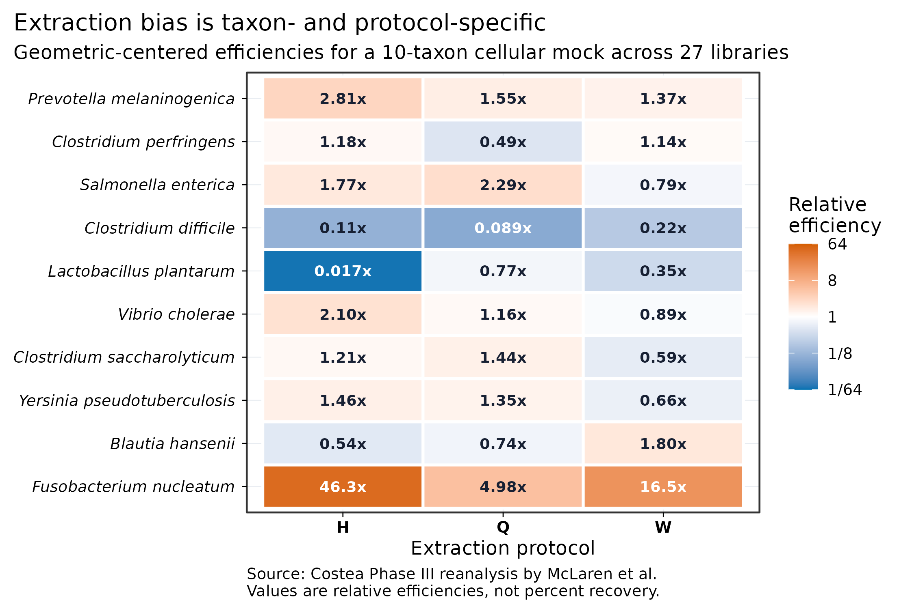
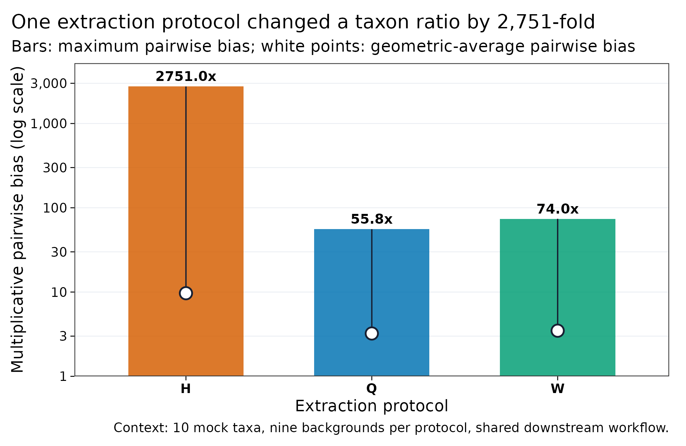
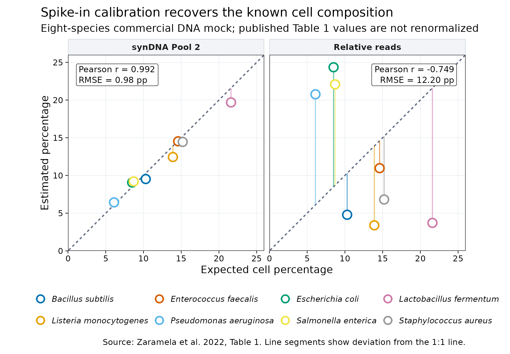

> **学习目标：**把“选一个常用试剂盒送测”升级成可审计的测量设计：区分保存、裂解、提取、建库、测序与比对造成的偏差；知道 cellular mock、blank、whole-cell spike-in、DNA spike-in、qPCR 和 flow cytometry 各自覆盖哪一段；把 relative abundance 转成有明确分母的 quantitative abundance。  
> **真实数据：**Costea 等 Phase III 的 10 菌整细胞 mock、8 份人粪便背景和 1 份 mock-only 样本，经 H/Q/W 三种提取协议形成的 27 个 MetaPhlAn2 profiles；Zaramela 等 Table 1 中 8 菌商业 DNA mock 的 synDNA Pool 2 预测值与相对 read 比例。  
> **预计资源：**本文的 309 行固化小表在普通笔记本上通常低于 1 分钟、内存低于 1 GB。真正的湿实验资源由样本数、重复、mock、blank、提取板和文库体系决定；做 CRC 粪便队列时，应在正式收样前用代表性基质完成至少一次提取—建库 pilot，而不是等 FASTQ 到手后才发现病例与批次不可分。

## 这一步对应论文里的哪张图 {#sec-target}

Costea 等把同一批粪便材料交给 21 种 DNA extraction protocols，发现提取步骤是所考察技术因素中影响最大的部分；论文 Figure 3 直接比较了提取与 library preparation 对群落组成的影响，Phase III 又用已知细胞组成的 mock 检验推荐协议 [@costea2017standards]。

McLaren、Willis 和 Callahan随后用一个乘法偏差模型重新分析 Phase III：10 个已知丰度菌种跨越约 446 倍细胞丰度，被加入 8 份粪便和 1 份 mock-only 背景；每个背景分别经过 H、Q、W 三种提取协议，共 27 个 shotgun profiles [@mclaren2019bias]。其 Figure 4 和 Table 2 的关键不是给试剂盒排永久名次，而是证明：

- 同一协议对不同 taxon 的相对回收效率可以相差数个数量级；
- 同一 taxon 的偏差方向又会随协议改变；
- 因为所有样本共享后续流程，协议间差异主要反映 extraction 及其对下游步骤的连带影响；
- mock 测到的“相对效率”只在相近基质、协议、建库和分析流程内可迁移。

本文从作者归档的 RDA 对象重新计算同一组 relative efficiencies。Protocol H 中 *Lactobacillus plantarum* 的相对效率约为 0.0168，而 *Fusobacterium nucleatum* 约为 46.29；二者之比形成约 2,751 倍的最大成对偏差。

{#fig-extraction-bias}

{#fig-protocol-bias}

提取偏差解决的是“不同 taxon 被不等比例看见”；绝对定量还要解决“整份样本里一共有多少”。Vandeputte 等用 flow cytometry 发现健康人粪便 microbial load 可相差约 10 倍，说明相同的 10% relative abundance 可能对应完全不同的 cells per gram [@vandeputte2017qmp]。

Zaramela 等把不同 GC 的 synthetic DNA standards 与一个 8 菌商业 DNA mock 联合建库，用 spike-in calibration 预测 genome copies/cells。本文按其 Table 1 原值重绘 Pool 2：预期 cell percentage 与 synDNA 预测的 Pearson $r=0.992$、RMSE 为 0.98 percentage points；普通 relative reads 的 $r=-0.749$、RMSE 为 12.20 percentage points [@zaramela2022syndna]。

{#fig-syndna}

::: {.callout-important title="对照放在哪里，决定它能校正什么"}
整细胞 mock 或 whole-cell spike-in 在裂解前加入，能感知提取偏差；synthetic DNA 在提取后、建库前加入，只能审计建库、测序与比对。后者即使完美，也不能找回从未被裂解或在提取中丢失的原生 DNA。
:::

## 理论：从细胞到 reads 是一串有方向的测量过程 {#sec-theory}

### 1. 提取偏差是乘法偏差，不是随机噪声

设样本 $s$ 中 taxon $i$ 的真实绝对量为 $A_{is}$，整个 wet-lab 与 bioinformatics protocol 对它的相对效率为 $b_i$。只观察组成时：

$$
\widetilde{p}_{is}
=
\frac{b_i A_{is}}
{\sum_j b_j A_{js}}.
$$

两个 taxon 的观测比值满足：

$$
\frac{\widetilde{p}_{is}}
{\widetilde{p}_{ks}}
=
\frac{b_i}{b_k}
\times
\frac{A_{is}}{A_{ks}}.
$$

因此，若 $b_i/b_k=50$，真实比例相同的两个 taxon 也会被测成 50:1。增加测序深度可以降低 sampling noise，却不会让 $b_i/b_k$ 自动回到 1。

McLaren 等把每个 taxon 的效率除以全部 mock taxa 效率的 geometric mean，得到 relative efficiency。它没有“细胞回收百分比”的单位，只回答该 taxon 相对同一协议中其他 taxon 被放大还是压低。最大成对偏差：

$$
B_{\max}
=
\frac{\max_i(b_i)}
{\min_i(b_i)}
$$

表示任意两种 mock taxa 的比例最多会因系统偏差改变多少倍 [@mclaren2019bias]。

### 2. 裂解强度、DNA 纯度和片段长度会互相牵制

粪便中既有易裂解细胞，也有厚 peptidoglycan、孢子、真菌细胞壁和被基质包裹的细胞。机械 bead beating 往往有助于提高难裂解对象的回收，却也会剪切 DNA；温和酶解或 HMW extraction 有利于长片段，却可能改变 taxon recovery。抑制物去除、离心、柱纯化和磁珠选择又会继续改变总产量与片段分布。

这使短读和长读的“最佳提取”目标不同：

- **short-read profiling**更重视跨 taxon 的均衡裂解、纯度和批间一致性；
- **long-read assembly**还要求足够浓度、完整性和高分子量 DNA；
- 同一 aliquot 很难同时把强机械裂解和极长片段做到最优；
- HMW 协议也必须用 mock 或 paired short-read profile 检查 taxon dropout，不能只看 Nanodrop 和 read N50。

Trigodet 等对复杂 metagenome 的六种 HMW strategies 进行 benchmark，也强调长读实验需要高浓度、高纯度、高分子量输入，传统短读提取方案并不能直接替代 [@trigodet2022hmw]。若研究同时要做 CRC species profile 和 long-read MAG，稳妥方案常是从充分 homogenized stool 分出两个预注册 aliquots：一个优化均衡裂解，一个优化 HMW；两条线不能在分析阶段假装成同一种测量。

### 3. 建库会再乘上一层 GC、insert 与 PCR 偏差

DNA 进入 library preparation 后，还会经历 fragmentation、end repair、adapter ligation、size selection、PCR 或 PCR-free amplification、pooling 和 sequencing。每一步都可能改变某些片段被读到的概率：

- GC 极端片段可能在 PCR、cluster generation 或 base calling 中损失；
- 过窄的 size selection 会改变可进入文库的片段群；
- low-input library 的 PCR cycles 增加时，duplicates 与 amplification skew 往往上升；
- enzymatic fragmentation 与 mechanical shearing 的序列/片段选择机制不同；
- insert-size distribution、adapter dimers、duplicate rate 和 GC coverage 需要逐文库审计；
- platform、flow-cell chemistry 和 index design 也可能形成系统差异。

Jones 等在 mock 与 human microbiome 材料中观察到 library methodology 会改变 genomic 和 functional predictions，并在其 benchmark 条件下建议优先考虑 PCR-free [@jones2015library]。这不是“PCR-free 永远无偏”：输入不足、DNA 质量差或 kit/platform 改变时，PCR-free 也会产生选择；PCR 建库则应记录 input mass、cycle number、fragmentation、insert range 和 batch。

Poulsen 等比较 Nextera（含 PCR）、KAPA PCR-free、NEXTflex PCR-free 与 HiSeq/NextSeq 组合，发现 library preparation 和 platform 都有系统效应，而且效应依赖样本类型 [@poulsen2022library]。所以病例和对照不能分开发往不同平台或不同建库体系，再指望统计模型把它们完全“校正掉”。

### 4. Relative abundance 不包含 total microbial load

若一个相对 profile 与一个相容的总量测量共享同一目标总体和分母，最简单的 load scaling 是：

$$
A_{is}=p_{is}\times L_s,
$$

其中 $L_s$ 可以是 cells/g wet stool、16S copies/g、genome equivalents/g 或 target-gene copies/g。单位必须跟着 $L_s$ 走。

这个公式看似简单，实际有三个前提：

1. $p_{is}$ 的组成分母与 $L_s$ 的总量分母相容；
2. profile 对各 taxon 的效率差异已经足够小或经过同体系校准；
3. 样本质量、稀释倍数、提取体积与原始质量被完整追溯。

例如 total bacterial 16S qPCR 测到的是 **gene copies**，不是 cells；不同 taxon 的 16S copy number、提取回收与 PCR inhibition 都会影响换算。Flow cytometry 直接给 total cells，却不提供 taxon identity，并受 gating、debris、聚团、染色和保存影响。把 flow-derived cells/g 乘到一个 genome-length-weighted shotgun profile 上时，还必须证明 profiler 输出确实可解释为相容的 cell fraction。

### 5. Spike-in 的流程位置与分子形态决定可见范围

设加入样本的 synthetic standard 有已知 genome equivalents $G_{\mathrm{std},s}$，target 和 standard 的 length-normalized signals 分别为 $R_{is}/L_i$ 与 $R_{\mathrm{std},s}/L_{\mathrm{std}}$。在“相同有效回收、相同可比对性”的理想近似下：

$$
\widehat{G}_{is}
=
\frac{R_{is}/L_i}
{R_{\mathrm{std},s}/L_{\mathrm{std}}}
\times
G_{\mathrm{std},s}.
$$

单一标准很难覆盖 GC、fragment length、copy state 和 mapping behavior。synDNA 方案使用多个不同 GC 的 synthetic sequences 建立 sample-specific calibration curve，因此比简单“除以 spike reads”更能审计 library/sequencing response [@zaramela2022syndna]。但 synthetic DNA 与原生细胞仍不共享裂解步骤。

控制体系应按问题组合：

| Control or scale | 最适合回答的问题 | 不能单独回答 |
|---|---|---|
| Extraction blank | 污染从试剂/操作进入了多少 | 原生 taxon 回收是否均衡 |
| Cellular mock | 整条协议对已知 taxa 的相对效率 | 未包含 taxa 和真实基质的全部行为 |
| Whole-cell spike-in | 从保存/裂解到 mapping 的总回收 | spike 与原生 taxa 是否等效裂解 |
| Synthetic DNA spike-in | 建库、测序、mapping 的样本内 calibration | 保存、裂解与提取损失 |
| Total bacterial qPCR/ddPCR | 指定 target 的 gene copies 与 inhibition | 未校正 copy number 时的 cells |
| Flow cytometry | 总 cells per mass/volume | taxon identity 与提取偏差 |

### 6. “绝对”不是一句形容词，而是一条单位链

对 CRC 粪便研究，建议把单位链写成：

$$
\text{wet stool mass}
\rightarrow
\text{homogenate volume}
\rightarrow
\text{extraction aliquot}
\rightarrow
\text{elution volume}
\rightarrow
\text{library input}
\rightarrow
\text{reads}
\rightarrow
\text{cells or copies per gram}.
$$

其中任何一个质量、体积或稀释倍数缺失，最后的“per gram”都无法复核。RPKM、CPM、relative abundance、copies per million reads 和 genome equivalents per million reads 仍是 sequencing-denominator units；没有外部标尺时，不应把它们改名为 absolute abundance。

## 准备工作 {#sec-setup}

<details>
<summary><strong>展开：安装依赖、获取固定输入并定义作图函数</strong></summary>

本文重绘只依赖轻量 R 包：

```{r}
#| eval: false
install.packages(c("ggplot2", "scales", "digest", "knitr"))
```

Costea/McLaren 的三个 RDA 输入来自 eLife 归档仓库的固定 commit。底层 reads 属于 ENA study `PRJEB14847`；归档 profiles 由 MetaPhlAn2 2.7.6 使用 `--min_cu_len 0 --stat avg_g` 生成。RDA 没有记录 marker database release，因此不能推测补写：

```{bash}
#| eval: false
set -euo pipefail

mkdir -p data/raw data/small results
base_url="https://raw.githubusercontent.com/elifesciences-publications/mgs-bias-manuscript/24c0edd557f18f0b62b8fd46a60fe3819515227a/data"

curl -fL \
  "${base_url}/costea2017_sample_data.rda" \
  -o data/raw/costea2017_sample_data.rda
curl -fL \
  "${base_url}/costea2017_metaphlan2_profiles.rda" \
  -o data/raw/costea2017_metaphlan2_profiles.rda
curl -fL \
  "${base_url}/costea2017_mock_composition.rda" \
  -o data/raw/costea2017_mock_composition.rda

echo "e72bacb32fe87d85d2b7e80111f08bfa162c8b4af1db79e5396edc80b6a6db6b  data/raw/costea2017_sample_data.rda" \
  | sha256sum -c -
echo "98cbec350509a9c6a4ac8c1d639cbab307e8a5954edc40a92cca14e82004c555  data/raw/costea2017_metaphlan2_profiles.rda" \
  | sha256sum -c -
echo "00c690763a215b9be4baed5657fefa341a3b45ab6d157f06dbb802d61a92fd2e  data/raw/costea2017_mock_composition.rda" \
  | sha256sum -c -

Rscript scripts/prepare_article05_data.R \
  data/raw/costea2017_sample_data.rda \
  data/raw/costea2017_metaphlan2_profiles.rda \
  data/raw/costea2017_mock_composition.rda \
  data/small/05-costea-mock-profiles.tsv \
  data/small/05-costea-bias-summary.tsv \
  data/small/05-syndna-mock-benchmark.tsv \
  results/05-library-prep-summary.json
```

`05-syndna-mock-benchmark.tsv` 按 Zaramela 等 Table 1 的 8 个 bacterial rows 原值录入，未强行归一到 100%；许可、列映射与第三方来源见 `data/small/05-data-NOTICE.txt`。

下面的依赖、随机种子、文件指纹与作图函数均在正文内定义：

```{r}
library(ggplot2)
library(scales)
library(digest)
library(knitr)

set.seed(20260719)

expected_sha256 <- c(
  "data/small/05-costea-mock-profiles.tsv" =
    "062960a07b6b3a8f981c9f709fea33f63b2679db49e3c133c656f6e42c91e9af",
  "data/small/05-costea-bias-summary.tsv" =
    "d6c9f056804d805954e0ee691bb4acaf85855c991a33d9220f867150855de3ab",
  "data/small/05-syndna-mock-benchmark.tsv" =
    "ce839059735055d54d4e65c4d9f415988ca271dd4df8d64ccff8a10c8773ab01",
  "data/small/05-control-placement.tsv" =
    "bc2c773eed6692dfe23c18dfb76bdb899aa42b877aa5f05454081a4ca4a4f12f"
)
observed_sha256 <- vapply(
  names(expected_sha256),
  digest,
  character(1),
  algo = "sha256",
  file = TRUE
)
stopifnot(
  identical(
    unname(observed_sha256),
    unname(expected_sha256)
  )
)

pal_pub <- c(
  "#0072B2", "#D55E00", "#009E73", "#CC79A7",
  "#E69F00", "#56B4E9", "#F0E442", "#999999"
)

scale_color_pub <- function(...) {
  ggplot2::scale_color_manual(values = pal_pub, ...)
}

scale_fill_pub <- function(...) {
  ggplot2::scale_fill_manual(values = pal_pub, ...)
}

theme_pub <- function(base_size = 12) {
  ggplot2::theme_bw(base_size = base_size, base_family = "sans") +
    ggplot2::theme(
      panel.grid.minor = ggplot2::element_blank(),
      panel.grid.major = ggplot2::element_line(
        color = "#E8ECF1",
        linewidth = 0.25
      ),
      axis.text = ggplot2::element_text(color = "black"),
      axis.ticks = ggplot2::element_line(
        color = "black",
        linewidth = 0.3
      ),
      legend.key = ggplot2::element_blank(),
      legend.background = ggplot2::element_rect(
        fill = scales::alpha("white", 0.75),
        color = NA
      ),
      plot.title.position = "plot"
    )
}

save_pub <- function(
  plot,
  file_base,
  width = 180,
  height = 112,
  units = "mm",
  dpi = 300
) {
  dir.create(
    dirname(file_base),
    recursive = TRUE,
    showWarnings = FALSE
  )
  ggplot2::ggsave(
    paste0(file_base, ".pdf"),
    plot,
    width = width,
    height = height,
    units = units,
    device = grDevices::cairo_pdf
  )
  ggplot2::ggsave(
    paste0(file_base, ".png"),
    plot,
    width = width,
    height = height,
    units = units,
    dpi = dpi,
    bg = "white"
  )
  ggplot2::ggsave(
    paste0(file_base, ".tiff"),
    plot,
    width = width,
    height = height,
    units = units,
    dpi = dpi,
    compression = "lzw",
    bg = "white"
  )
  invisible(plot)
}
```
</details>

## 可复制代码：从 protocol bias 到 quantitative unit {#sec-code}

### 1. 读取并验证 27 个真实 mock profiles

```{r}
mock_profiles <- read.delim(
  "data/small/05-costea-mock-profiles.tsv",
  check.names = FALSE,
  stringsAsFactors = FALSE
)
bias_summary <- read.delim(
  "data/small/05-costea-bias-summary.tsv",
  check.names = FALSE,
  stringsAsFactors = FALSE
)
syndna <- read.delim(
  "data/small/05-syndna-mock-benchmark.tsv",
  check.names = FALSE,
  stringsAsFactors = FALSE
)
control_placement <- read.delim(
  "data/small/05-control-placement.tsv",
  check.names = FALSE,
  stringsAsFactors = FALSE
)

required_profile_columns <- c(
  "Sample", "Protocol", "Specimen", "Taxon",
  "FACS_cells", "Actual_mock_fraction",
  "Observed_mock_fraction",
  "Relative_efficiency_observation"
)
required_bias_columns <- c(
  "Protocol", "Taxon", "Relative_efficiency",
  "Log2_relative_efficiency",
  "Maximum_pairwise_bias", "Average_pairwise_bias"
)

stopifnot(
  nrow(mock_profiles) == 270L,
  nrow(bias_summary) == 30L,
  nrow(syndna) == 8L,
  nrow(control_placement) == 7L,
  all(required_profile_columns %in% names(mock_profiles)),
  all(required_bias_columns %in% names(bias_summary)),
  setequal(unique(mock_profiles$Protocol), c("H", "Q", "W")),
  length(unique(mock_profiles$Sample)) == 27L,
  length(unique(mock_profiles$Taxon)) == 10L,
  all(mock_profiles$FACS_cells > 0),
  all(mock_profiles$Actual_mock_fraction > 0),
  all(mock_profiles$Observed_mock_fraction > 0),
  all(bias_summary$Relative_efficiency > 0)
)

mock_truth <- unique(
  mock_profiles[
    ,
    c("Taxon", "FACS_cells", "Actual_mock_fraction")
  ]
)
mock_truth <- mock_truth[
  order(-mock_truth$FACS_cells),
  ,
  drop = FALSE
]
true_cell_span <- max(mock_truth$FACS_cells) /
  min(mock_truth$FACS_cells)

mock_audit <- data.frame(
  Metric = c(
    "Libraries",
    "Libraries per protocol",
    "Background specimens",
    "Known mock taxa",
    "Known cell-abundance span"
  ),
  Value = c(
    length(unique(mock_profiles$Sample)),
    paste(
      as.integer(table(factor(
        unique(mock_profiles[, c("Sample", "Protocol")])$Protocol,
        levels = c("H", "Q", "W")
      ))),
      collapse = " / "
    ),
    "8 fecal + 1 mock-only",
    nrow(mock_truth),
    sprintf("%.1f-fold", true_cell_span)
  ),
  stringsAsFactors = FALSE
)
kable(mock_audit)
```

这里的 27 个样本不是 27 个独立受试者，而是 9 个 backgrounds × 3 个 protocols。它适合估计 protocol-specific measurement bias，不适合拿来做疾病统计或把技术重复当生物学重复。

### 2. 从 relative efficiency 计算成对偏差

每个 protocol 的 relative efficiencies 已以 geometric mean 居中到 1。下面独立重算最大与平均成对偏差：

```{r}
pairwise_bias_metrics <- function(efficiency) {
  stopifnot(
    length(efficiency) >= 2L,
    all(is.finite(efficiency)),
    all(efficiency > 0)
  )
  ratios <- utils::combn(
    efficiency,
    2,
    function(x) max(x) / min(x)
  )
  c(
    Maximum_pairwise_bias = max(ratios),
    Average_pairwise_bias = exp(mean(log(ratios)))
  )
}

protocol_metrics <- do.call(
  rbind,
  lapply(c("H", "Q", "W"), function(protocol) {
    x <- bias_summary$Relative_efficiency[
      bias_summary$Protocol == protocol
    ]
    metrics <- pairwise_bias_metrics(x)
    data.frame(
      Protocol = protocol,
      Maximum_pairwise_bias =
        unname(metrics[["Maximum_pairwise_bias"]]),
      Average_pairwise_bias =
        unname(metrics[["Average_pairwise_bias"]]),
      Lowest_efficiency_taxon =
        bias_summary$Taxon[
          bias_summary$Protocol == protocol
        ][which.min(x)],
      Highest_efficiency_taxon =
        bias_summary$Taxon[
          bias_summary$Protocol == protocol
        ][which.max(x)],
      stringsAsFactors = FALSE
    )
  })
)

stopifnot(
  abs(
    protocol_metrics$Maximum_pairwise_bias[
      protocol_metrics$Protocol == "H"
    ] - 2751.00178
  ) < 0.01,
  abs(
    protocol_metrics$Maximum_pairwise_bias[
      protocol_metrics$Protocol == "Q"
    ] - 55.82398
  ) < 0.01,
  abs(
    protocol_metrics$Maximum_pairwise_bias[
      protocol_metrics$Protocol == "W"
    ] - 74.00882
  ) < 0.01
)

protocol_metrics$Maximum_pairwise_bias <- round(
  protocol_metrics$Maximum_pairwise_bias,
  1
)
protocol_metrics$Average_pairwise_bias <- round(
  protocol_metrics$Average_pairwise_bias,
  1
)
protocol_metrics$Lowest_efficiency_taxon <- gsub(
  "_",
  " ",
  protocol_metrics$Lowest_efficiency_taxon
)
protocol_metrics$Highest_efficiency_taxon <- gsub(
  "_",
  " ",
  protocol_metrics$Highest_efficiency_taxon
)
kable(protocol_metrics)
```

Protocol H 的极端值主要由 *L. plantarum* 低效率与 *F. nucleatum* 高效率驱动。Protocol Q 在这套数据里最大偏差最小，但 McLaren 等同时报告 Q 的平均 noise 较高，并指出这可能与 mock reads 较少有关 [@mclaren2019bias]。所以正确结论是“在该 benchmark 中 Q 的系统偏差范围较小”，而不是“所有项目都买 Q”。

### 3. 审计 synDNA 是否恢复已知 cell composition

```{r}
rmse <- function(observed, expected) {
  stopifnot(
    length(observed) == length(expected),
    all(is.finite(observed)),
    all(is.finite(expected))
  )
  sqrt(mean((observed - expected)^2))
}

syn_metrics <- data.frame(
  Method = c("synDNA Pool 2", "Relative reads"),
  Pearson_r = c(
    cor(
      syndna$Expected_cell_percent,
      syndna$SynDNA_pool2_percent,
      method = "pearson"
    ),
    cor(
      syndna$Expected_cell_percent,
      syndna$Relative_read_percent,
      method = "pearson"
    )
  ),
  RMSE_percentage_points = c(
    rmse(
      syndna$SynDNA_pool2_percent,
      syndna$Expected_cell_percent
    ),
    rmse(
      syndna$Relative_read_percent,
      syndna$Expected_cell_percent
    )
  ),
  stringsAsFactors = FALSE
)

stopifnot(
  syn_metrics$Pearson_r[1] > 0.99,
  syn_metrics$Pearson_r[2] < -0.74,
  syn_metrics$RMSE_percentage_points[1] < 1,
  syn_metrics$RMSE_percentage_points[2] > 12
)
kable(syn_metrics, digits = 3)
```

这张表比较的是 commercial DNA mock 中的 **genome-copy/cell percentage**。作者为便于与制造商 composition 对照，采用“一细胞一 genome copy”的简化；快速生长细菌可能有多份染色体，所以正式实验应把输出优先称为 genome equivalents，除非 cells 的换算经过验证 [@zaramela2022syndna]。

### 4. 给每种 control 标明进入流程的位置

```{r}
kable(
  control_placement[
    ,
    c(
      "Control_or_scale",
      "Added_or_measured_at",
      "Primary_unit_or_signal",
      "Captures",
      "Does_not_capture"
    )
  ],
  align = c("l", "l", "l", "l", "l")
)
```

同一个研究通常需要多种对照：

- blank 用于发现 contamination；
- cellular mock 用于估计 taxon-specific relative efficiency；
- whole-cell 或 DNA spike-in 用于量化 sample-specific recovery/scale；
- qPCR/ddPCR 或 flow cytometry 提供与 sequencing denominator 独立的 load；
- technical replicates 用于估计 precision，却不能替代 blank 或 truth-known mock。

### 5. 用 load scaling 保留单位

```{r}
scale_by_total_load <- function(
  relative_profile,
  total_load,
  tolerance = 1e-6
) {
  stopifnot(
    is.numeric(relative_profile),
    length(relative_profile) > 0L,
    all(is.finite(relative_profile)),
    all(relative_profile >= 0),
    is.numeric(total_load),
    length(total_load) == 1L,
    is.finite(total_load),
    total_load >= 0
  )
  profile_sum <- sum(relative_profile)
  if (
    profile_sum <= 0 ||
    abs(profile_sum - 1) > tolerance
  ) {
    stop("The relative profile must sum to 1 on the same denominator")
  }
  relative_profile * total_load
}
```

函数不会猜单位。输入 `total_load = cells/g wet stool`，输出才是 load-scaled cells/g；输入 `16S copies/g`，输出就是 copies/g。若 relative profile 排除了 unclassified、virus、host 或只含 selected taxa，和 total load 的分母已经不同，必须先定义 remainder，而不是强制归一后相乘。

### 6. 用一个已知 spike 计算 genome equivalents

```{r}
estimate_from_single_spike <- function(
  target_reads,
  target_length_bp,
  spike_reads,
  spike_length_bp,
  spike_genome_equivalents
) {
  values <- c(
    target_reads,
    target_length_bp,
    spike_reads,
    spike_length_bp,
    spike_genome_equivalents
  )
  stopifnot(
    all(is.finite(values)),
    all(values > 0)
  )
  target_signal <- target_reads / target_length_bp
  spike_signal <- spike_reads / spike_length_bp
  target_signal /
    spike_signal *
    spike_genome_equivalents
}
```

这是理想比例公式，只适合解释单位。正式数据应检查：

- spike sequence 不与 natural genomes/host 交叉比对；
- spike amount 位于线性范围且不大量占用 reads；
- GC 与 fragment-length response 有校准；
- target 的 genome length、copy number 和 multi-mapping 处理明确；
- extraction 前加入时，spike 与原生 cells 的裂解差异；
- extraction 后加入时，不能声称覆盖 extraction loss；
- 每批都有标准曲线、blank、LOD/LOQ 和失败规则。

### 7. 在送样前审计病例—批次可辨识性

把 extraction plate、library plate、kit lot、operator、sequencing lane 和 index set 写进 metadata。下面的函数不“校正”混杂，只在完全混杂时立即停止：

```{r}
audit_outcome_batch <- function(
  metadata,
  outcome = "Group",
  batch = "Extraction_plate"
) {
  stopifnot(
    is.data.frame(metadata),
    all(c(outcome, batch) %in% names(metadata)),
    !anyNA(metadata[, c(outcome, batch), drop = FALSE])
  )
  tab <- table(metadata[[batch]], metadata[[outcome]])
  outcomes_per_batch <- rowSums(tab > 0)
  batches_per_outcome <- colSums(tab > 0)
  list(
    table = tab,
    every_batch_contains_multiple_outcomes =
      all(outcomes_per_batch > 1L),
    every_outcome_spans_multiple_batches =
      all(batches_per_outcome > 1L)
  )
}
```

在 CRC case-control 设计中，应在 cohort/site 内按病例状态、性别、年龄层和关键临床分层 block-randomize，再把 aliquots 分散到 extraction plates、library batches 和 lanes。若所有 CRC 在 plate A、所有 control 在 plate B，任何 downstream association 都同时是 batch association。

## 审计与升级 {#sec-audit}

### 忠实复算历史 benchmark，但不把旧流程当成当前数据库规范

本文复算使用作者归档的 MetaPhlAn2 2.7.6 profiles，并确认 H/Q/W 最大成对偏差约为 2,751、56 和 74，与 eLife Table 2 的舍入值一致 [@mclaren2019bias]。这份数据适合证明 protocol bias 的结构，因为：

- raw study、sample mapping、mock truth 和 profiling command 有明确来源；
- 10 个 mock taxa 在全部 27 个 samples 中被检测到；
- 三个 extraction protocols 共用后续流程；
- relative efficiency 的定义与原分析一致。

它不适合作为当前 CRC taxonomic profiling 的参考数据库：

- MetaPhlAn2 marker database release 没有写入 RDA；
- `--min_cu_len 0 --stat avg_g` 为提高 rare mock sensitivity 而选；
- mock 的 10 个 taxa 不能代表全部 human gut、fungi、virus、archaea、spore-formers 或 resistome；
- 原文指出 Figure 6 中三个 taxa 的标签与 FACS 表可能不一致，复算采用公开 FACS measurements；
- 历史 taxonomy、contaminant assignment 与今天的数据库可能不同。

因此，Methods 应把 database release 写成“not encoded in the archived object”，而不是根据年份猜一个版本。

### 从“统一试剂盒”升级为“统一流程 + 真实 matrix validation”

统一 extraction protocol 是降低 differential bias 的重要起点，却不是充分条件。当前设计至少还要锁定：

1. collection device、preservative、time-to-freezing 和 freeze-thaw；
2. wet/dry mass、homogenization、aliquot mass 和 elution volume；
3. bead-beating instrument、speed、duration、tube/beat lot；
4. kit、lot、operator、plate position 和 extraction date；
5. DNA concentration assay、purity、fragment distribution；
6. library input mass、fragmentation、size-selection、PCR cycles；
7. index set、pooling rule、lane/platform/chemistry；
8. profiler、reference/database release 和 thresholds。

若多个中心无法统一，可在每个中心运行同一 cellular mock/reference material，并让一部分 bridge samples 跨实验室重复。bridge samples 可以估计 differential bias，但不能证明任一中心都接近真值。

### 从“PCR-free 更好”升级为输入分层的决策

PCR-free 在输入量与质量足够时，常用于减少 amplification bias；但研究不能把高 DNA 样本做 PCR-free、低 DNA 样本做 amplified library，再让这两类恰好对应 control/CRC。建议：

- 先用 pilot 得到各临床分层的 DNA-yield distribution；
- 为同一 primary analysis 预先选择一个可覆盖大多数样本的 library strategy；
- 对低输入 exception 设独立标签和敏感性分析；
- 记录实际 input mass 与 cycle number，而不只写 kit name；
- 比较 insert distribution、GC coverage、duplicates、adapter contamination 和 mapped fraction；
- technical re-library 应跨关键分层抽样，不只重做失败最严重的组。

### 从一份 mock 升级为分层 control panel

一个 10 菌 mock 可以准确识别这 10 个 taxa 的 bias，却无法证明其他对象也无偏。根据主要终点增加控制：

| Primary endpoint | 至少增加的 control |
|---|---|
| Common bacterial species | Matrix-matched cellular mock + extraction blank |
| Fungi/eukaryotes | 含厚壁真菌或目标真核的 mock |
| Spore-formers | 含孢子或相近难裂解对象的 recovery test |
| Resistome copies/g | Known gene-copy/genomic standard + inhibition test |
| Long-read MAG | HMW reference material + fragment-length and taxon-recovery audit |
| Low biomass | Multiple blanks, positive control, lot tracking, detection-limit study |
| Cross-center cohort | Shared reference material + bridge specimens |

### 从一个“绝对丰度”字段升级为可审计的 measurement model

投稿表中不要只有 `Absolute_abundance`。至少保存：

```text
SampleID
OriginalMass_gWet
HomogenateVolume_mL
ExtractionAliquot_g
ElutionVolume_uL
LibraryInput_ng
SpikeType
SpikeAmount
SpikeAddedAt
SpikeReads
TotalLoadMethod
TotalLoadValue
TotalLoadUnit
TargetSignal
AbsoluteEstimate
AbsoluteUnit
LOD
LOQ
ExtractionPlate
LibraryBatch
SequencingLane
```

若用 qPCR，还要保存 primer/probe、target region、standard material、efficiency、$R^2$、replicate Cq、inhibition/dilution test 和 copy-number correction。若用 flow cytometry，要保存 staining、gating、beads、dilution、events、debris/doublet rule 和样本保存方式。

### 把 calibration 与 validation 分开

用同一份 mock 估计 bias 并报告“校正后完美”只是 calibration fit。更强的验证设计是：

- 用预先指定的一部分 mock/bridge samples 拟合 relative efficiencies；
- 在未参与拟合的 independent controls 上评估 bias、RMSE 和 coverage；
- 把校正前后结果都报告；
- 预先规定效率过低、spike reads 过少、标准曲线失败和外推时的处置；
- 不对 mock 未覆盖的 taxon 默默套用最近邻校正系数。

::: {.callout-warning title="Protocol-specific calibration 不能跨流程漂移"}
一旦改变 extraction、bead beating、library kit、PCR cycles、platform、read length、profiler 或 database release，原 bias vector 的可迁移性就需要重新验证。校正系数不是试剂盒的永久属性。
:::

## 出版级美化 {#sec-polish}

### 1. 三种协议的 taxon-specific relative efficiency

```{r}
taxon_order <- bias_summary$Taxon[
  bias_summary$Protocol == "H"
]
taxon_labels <- gsub("_", " ", taxon_order)

extraction_plot_data <- bias_summary
extraction_plot_data$Protocol <- factor(
  extraction_plot_data$Protocol,
  levels = c("H", "Q", "W")
)
extraction_plot_data$Taxon_label <- factor(
  gsub("_", " ", extraction_plot_data$Taxon),
  levels = rev(taxon_labels)
)
extraction_plot_data$Efficiency_label <- ifelse(
  extraction_plot_data$Relative_efficiency < 0.1,
  sprintf("%.3fx", extraction_plot_data$Relative_efficiency),
  ifelse(
    extraction_plot_data$Relative_efficiency >= 10,
    sprintf("%.1fx", extraction_plot_data$Relative_efficiency),
    sprintf("%.2fx", extraction_plot_data$Relative_efficiency)
  )
)
extraction_plot_data$Text_color <- ifelse(
  abs(extraction_plot_data$Log2_relative_efficiency) >= 3.4,
  "white",
  "#172033"
)

p_extraction_bias <- ggplot(
  extraction_plot_data,
  aes(Protocol, Taxon_label, fill = Log2_relative_efficiency)
) +
  geom_tile(color = "white", linewidth = 0.8) +
  geom_text(
    aes(
      label = Efficiency_label,
      color = Text_color
    ),
    size = 3.15,
    fontface = "bold",
    show.legend = FALSE
  ) +
  scale_color_identity() +
  scale_fill_gradient2(
    low = "#0072B2",
    mid = "white",
    high = "#D55E00",
    midpoint = 0,
    limits = c(-6, 6),
    oob = scales::squish,
    breaks = c(-6, -3, 0, 3, 6),
    labels = c("1/64", "1/8", "1", "8", "64"),
    name = "Relative\nefficiency"
  ) +
  labs(
    title = "Extraction bias is taxon- and protocol-specific",
    subtitle = paste(
      "Geometric-centered efficiencies for a 10-taxon cellular mock",
      "across 27 libraries"
    ),
    x = "Extraction protocol",
    y = NULL,
    caption = paste(
      "Source: Costea Phase III reanalysis by McLaren et al.",
      "Values are relative efficiencies, not percent recovery.",
      sep = "\n"
    )
  ) +
  coord_cartesian(clip = "off") +
  theme_pub(11.5) +
  theme(
    panel.grid = element_blank(),
    axis.text.y = element_text(
      face = "italic",
      margin = margin(r = 4)
    ),
    axis.text.x = element_text(face = "bold"),
    legend.position = "right",
    plot.caption = element_text(hjust = 0),
    plot.margin = margin(8, 12, 8, 8)
  )

save_pub(
  p_extraction_bias,
  "figures/05-extraction-bias",
  width = 190,
  height = 128
)
p_extraction_bias
```

### 2. 最大与平均成对偏差

```{r}
protocol_plot_data <- unique(
  bias_summary[
    ,
    c(
      "Protocol",
      "Maximum_pairwise_bias",
      "Average_pairwise_bias"
    )
  ]
)
protocol_plot_data$Protocol <- factor(
  protocol_plot_data$Protocol,
  levels = c("H", "Q", "W")
)
protocol_plot_data$Maximum_label <- sprintf(
  "%.1fx",
  protocol_plot_data$Maximum_pairwise_bias
)

p_protocol_bias <- ggplot(
  protocol_plot_data,
  aes(Protocol, Maximum_pairwise_bias, fill = Protocol)
) +
  geom_col(width = 0.62, alpha = 0.83) +
  geom_linerange(
    aes(
      ymin = Average_pairwise_bias,
      ymax = Maximum_pairwise_bias
    ),
    color = "#172033",
    linewidth = 0.45
  ) +
  geom_point(
    aes(y = Average_pairwise_bias),
    shape = 21,
    size = 3.5,
    fill = "white",
    color = "#172033",
    stroke = 0.9
  ) +
  geom_text(
    aes(
      y = Maximum_pairwise_bias,
      label = Maximum_label
    ),
    vjust = -0.55,
    fontface = "bold",
    size = 3.4
  ) +
  scale_fill_manual(
    values = c(
      "H" = "#D55E00",
      "Q" = "#0072B2",
      "W" = "#009E73"
    )
  ) +
  scale_y_log10(
    breaks = c(1, 3, 10, 30, 100, 300, 1000, 3000),
    labels = c("1", "3", "10", "30", "100", "300", "1,000", "3,000"),
    limits = c(1, 5200),
    expand = expansion(mult = c(0, 0))
  ) +
  labs(
    title = "One extraction protocol changed a taxon ratio by 2,751-fold",
    subtitle = paste(
      "Bars: maximum pairwise bias;",
      "white points: geometric-average pairwise bias"
    ),
    x = "Extraction protocol",
    y = "Multiplicative pairwise bias (log scale)",
    caption = paste(
      "Context: 10 mock taxa, nine backgrounds per protocol,",
      "shared downstream workflow."
    )
  ) +
  guides(fill = "none") +
  theme_pub(11.5) +
  theme(
    panel.grid.major.x = element_blank(),
    axis.text.x = element_text(face = "bold"),
    plot.margin = margin(10, 12, 8, 8)
  )

save_pub(
  p_protocol_bias,
  "figures/05-protocol-bias-range",
  width = 172,
  height = 112
)
p_protocol_bias
```

### 3. synDNA 与 relative reads 的 cell-composition recovery

```{r}
syndna_long <- rbind(
  data.frame(
    Taxon = syndna$Taxon,
    Expected_percent = syndna$Expected_cell_percent,
    Estimated_percent = syndna$SynDNA_pool2_percent,
    Method = "synDNA Pool 2",
    stringsAsFactors = FALSE
  ),
  data.frame(
    Taxon = syndna$Taxon,
    Expected_percent = syndna$Expected_cell_percent,
    Estimated_percent = syndna$Relative_read_percent,
    Method = "Relative reads",
    stringsAsFactors = FALSE
  )
)
method_order <- c("synDNA Pool 2", "Relative reads")
syndna_long$Method <- factor(
  syndna_long$Method,
  levels = method_order
)
syndna_long$Taxon <- factor(
  syndna_long$Taxon,
  levels = syndna$Taxon
)

annotation_data <- data.frame(
  Method = factor(method_order, levels = method_order),
  X = c(1.1, 24.8),
  Y = c(24.8, 24.8),
  Hjust = c(0, 1),
  Label = c(
    sprintf(
      "Pearson r = %.3f\nRMSE = %.2f pp",
      syn_metrics$Pearson_r[1],
      syn_metrics$RMSE_percentage_points[1]
    ),
    sprintf(
      "Pearson r = %.3f\nRMSE = %.2f pp",
      syn_metrics$Pearson_r[2],
      syn_metrics$RMSE_percentage_points[2]
    )
  ),
  stringsAsFactors = FALSE
)

taxon_colors <- setNames(pal_pub, levels(syndna_long$Taxon))

p_syndna <- ggplot(
  syndna_long,
  aes(
    Expected_percent,
    Estimated_percent,
    color = Taxon
  )
) +
  geom_abline(
    slope = 1,
    intercept = 0,
    linetype = "22",
    color = "#667085",
    linewidth = 0.65
  ) +
  geom_segment(
    aes(
      xend = Expected_percent,
      yend = Expected_percent
    ),
    linewidth = 0.55,
    alpha = 0.55
  ) +
  geom_point(
    shape = 21,
    fill = "white",
    size = 3.6,
    stroke = 1.15
  ) +
  geom_label(
    data = annotation_data,
    aes(
      x = X,
      y = Y,
      label = Label,
      hjust = Hjust
    ),
    inherit.aes = FALSE,
    vjust = 1,
    size = 3.15,
    lineheight = 1.05,
    label.size = 0.2,
    fill = scales::alpha("white", 0.90)
  ) +
  facet_wrap(~Method, nrow = 1) +
  scale_color_manual(values = taxon_colors) +
  scale_x_continuous(
    breaks = seq(0, 25, 5),
    limits = c(0, 26),
    expand = expansion(mult = c(0, 0))
  ) +
  scale_y_continuous(
    breaks = seq(0, 25, 5),
    limits = c(0, 26),
    expand = expansion(mult = c(0, 0))
  ) +
  coord_equal() +
  labs(
    title = "Spike-in calibration recovers the known cell composition",
    subtitle = paste(
      "Eight-species commercial DNA mock;",
      "published Table 1 values are not renormalized"
    ),
    x = "Expected cell percentage",
    y = "Estimated percentage",
    color = NULL,
    caption = paste(
      "Source: Zaramela et al. 2022, Table 1.",
      "Line segments show deviation from the 1:1 line."
    )
  ) +
  theme_pub(11.0) +
  theme(
    panel.grid.minor = element_blank(),
    strip.background = element_rect(
      fill = "#F2F4F7",
      color = "#D0D5DD"
    ),
    strip.text = element_text(face = "bold"),
    legend.position = "bottom",
    legend.text = element_text(face = "italic", size = 8.5),
    legend.key.width = grid::unit(4.5, "mm"),
    plot.margin = margin(8, 12, 8, 8)
  ) +
  guides(
    color = guide_legend(
      nrow = 2,
      byrow = TRUE,
      override.aes = list(
        shape = 21,
        fill = "white",
        size = 3
      )
    )
  )

save_pub(
  p_syndna,
  "figures/05-syndna-quantification",
  width = 190,
  height = 132
)
p_syndna
```

三张图不能合并成一个“最佳试剂盒”结论：

1. heatmap 显示 taxon-specific bias 的方向；
2. pairwise summary 显示比例失真的数量级；
3. synDNA benchmark 显示有外部标尺时，测序信号才可能回到 genome-copy/cell composition。

## 常见坑：审稿人会追问什么 {#sec-pitfalls}

::: {.callout-caution title="病例和对照分批提取或建库"}
病例状态与 extraction plate、kit lot、operator、library batch 或 lane 完全重合时，疾病效应不可辨识。统计上的 batch covariate 不能凭空恢复不存在的交叉设计。
:::

::: {.callout-caution title="只看 DNA yield，不看 taxon recovery"}
高 ng/µL 可能主要来自易裂解 taxa 或宿主 DNA。至少同时审计 mock recovery、host fraction、purity、fragment distribution 和 endpoint-specific yield。
:::

::: {.callout-caution title="把 Nanodrop 当作 library-ready DNA"}
吸光度比值不能替代 fluorometric dsDNA concentration、抑制物测试与 fragment-size measurement。长读还要给 HMW 分布；短读也要确认输入量与建库适配。
:::

::: {.callout-caution title="把 PCR-free 写成无偏"}
PCR-free 可减少一类 amplification bias，但 fragmentation、ligation、size selection、cluster generation、platform 和 mapping bias 仍在。低输入样本若改用 PCR，必须记录 cycles 并做分层敏感性分析。
:::

::: {.callout-caution title="DNA spike-in 被当作 end-to-end control"}
提取后加入的 DNA 没经历保存、裂解与 purification，不能发现难裂解 taxa 或提取损失。若主要问题是 end-to-end recovery，应加入 cellular mock/whole-cell spike-in。
:::

::: {.callout-caution title="qPCR copies 被直接称为 cells"}
16S qPCR 测的是 target copies；copy-number variation、PCR efficiency、inhibition 和 extraction recovery都会进入结果。未校正时，应报告 copies/g 而不是 cells/g。
:::

::: {.callout-caution title="RPKM/CPM 被命名为绝对丰度"}
这些单位的分母仍是本样本文库。没有外部 load 或已知 spike，RPKM、CPM 和 relative abundance 不能判断一个 taxon 的绝对量是升是降。
:::

::: {.callout-caution title="mock 只跑一次且只在项目开头跑"}
lot、operator、instrument 和 reagent drift 会让 bias 随批次变化。至少在关键批次放置 bridge controls，并预先定义控制图、可接受范围与失败后的重提取/重建库规则。
:::

## 这段 Methods 怎么写 {#sec-methods}

### 本文真实复算的英文模板

> Extraction-associated taxon bias was re-estimated from the archived Costea Phase III objects distributed with the McLaren, Willis and Callahan analysis repository (commit `24c0edd557f18f0b62b8fd46a60fe3819515227a`; MIT license). The experiment comprised a ten-taxon cellular mock community, eight fecal backgrounds and one mock-only background, each processed using extraction protocols H, Q and W (27 metagenomes). True mock composition was defined by the arithmetic mean of the published FACS cell measurements. Archived species profiles had been generated with MetaPhlAn2 v2.7.6 using `--min_cu_len 0 --stat avg_g`; the marker-database release was not encoded in the archived objects and was therefore recorded as unavailable. Within each sample, observed mock proportions were divided by the known mock proportions, and the resulting efficiencies were centered by their geometric mean. Protocol-level efficiencies were estimated by geometric averaging across the nine backgrounds. Maximum pairwise bias was defined as the ratio of the largest to the smallest protocol-level relative efficiency.

> The synDNA comparison transcribed the eight bacterial rows from Table 1 of Zaramela et al. (2022) without renormalization. Agreement with the manufacturer-reported cell composition was summarized using Pearson correlation and root-mean-square error in percentage points. All redraws were generated in R 4.4.1 with a fixed seed (`20260719`) and exported as PDF, 300-dpi PNG and 300-dpi LZW-compressed TIFF.

### 换成 CRC 粪便队列的英文模板

> Stool was homogenized before aliquoting, and `[MASS]` g wet stool was used per extraction. Samples were block-randomized within recruitment site by case-control status, sex and age stratum across extraction plates, library batches and sequencing lanes. DNA was extracted using `[PROTOCOL, KIT, LOT]` with `[BEAD-BEATING INSTRUMENT, SPEED, DURATION]` and eluted in `[VOLUME]` µL. Each extraction plate contained an extraction blank, a matrix-matched cellular mock community and `[WHOLE-CELL OR DNA]` spike-in controls added `[BEFORE LYSIS / AFTER EXTRACTION]` at `[AMOUNT AND UNIT]`. DNA concentration was measured by `[FLUOROMETRIC ASSAY]`; purity, inhibition and fragment-size distributions were assessed by `[METHODS]`.

> Libraries were prepared from `[INPUT MASS]` ng DNA using `[KIT VERSION]` with `[PCR-FREE / N CYCLES]`, a target insert size of `[RANGE]` bp and unique dual indexes. Libraries were pooled using `[RULE]` and sequenced on `[PLATFORM, CHEMISTRY, READ LENGTH]`. Per-library QC included adapter content, insert-size distribution, duplicate fraction, GC-coverage response, negative-control reads and spike recovery. Quantitative abundances were reported as `[CELLS / GENOME EQUIVALENTS / GENE COPIES]` per gram wet stool using `[FLOW CYTOMETRY / qPCR / ddPCR / SPIKE-IN CALIBRATION]`; all mass, volume and dilution factors were propagated from the original aliquot. Values below the prespecified LOD or LOQ were retained as censored measurements rather than converted to biological absence.

正式稿还要补：

- collection/preservation、time-to-freezing、freeze-thaw；
- sample mass basis（wet/dry）、homogenization 和 aliquot rule；
- blank/mock/spike 的 catalog、composition、加入时间与浓度；
- extraction、library、platform、index 和 reagent lot；
- qPCR/ddPCR standard、efficiency、inhibition 或 flow gating；
- profiler/reference/database release、mapping thresholds；
- calibration/validation split、LOD/LOQ 和 failure action；
- 每个 batch 的实际 controls 与剔除/重做数量。

## 换成你自己的数据怎么做 {#sec-own-data}

### 1. 先写 primary unit 和 measurement boundary

在任何试剂采购前填完：

| Field | 必填内容 |
|---|---|
| Primary endpoint | Species、pathway、ARG、MAG 或 strain |
| Primary unit | Relative abundance、cells/g、genome equivalents/g、copies/g |
| Sample basis | Wet mass、dry mass、volume 或 swab area |
| Extraction target | Balanced short-read recovery 或 HMW long-read DNA |
| Total-load method | Flow、qPCR/ddPCR、whole-cell spike、DNA spike |
| Spike placement | Before storage、before lysis、after extraction、before library |
| Calibration scope | 哪些 taxa、GC、fragment lengths、batches 和 matrices |
| Controls per batch | Extraction blank、library blank、mock、bridge sample |
| LOD/LOQ | 按单位、sample mass 和 pipeline 定义 |
| Failure action | Re-extract、re-library、exclude、censor 或改终点 |

### 2. 用代表性真实基质做 extraction pilot

CRC 粪便 pilot 不应只用纯菌 mock。至少选择：

- 预期的低/中/高 microbial load；
- 低/高宿主 DNA 或炎症程度；
- 不同 Bristol stool form、保存时间或采样中心；
- 关键 clinical strata 中各自的代表样本；
- 一个 matrix-matched cellular mock、blank 和 bridge specimen。

每种候选协议比较：

- dsDNA yield per gram，而非只看最终浓度；
- purity、inhibition、fragment distribution；
- cellular-mock relative efficiencies 与最大 pairwise bias；
- native profile repeatability 和 host fraction；
- library success、insert、duplicates、GC response；
- 主要 endpoint 的稳定性；
- 若做长读，read N50/length yield 与 taxon recovery同时达标。

### 3. 用 pilot 决定是否分两条 extraction line

如果强 bead beating 对 short-read recovery 更稳，而 HMW protocol 对 long-read yield 更好，可从同一 homogenate 预先分 aliquots：

- line A：short-read quantitative profiling；
- line B：long-read assembly/MAG；
- 每条线各自保留 controls、unit 和 Methods；
- 不把两条线的 abundance values 当作可直接互换；
- 用 shared bridge material 量化两条线的 differential bias。

### 4. 先滴定 spike，再锁正式浓度

spike 太少会受 stochastic sampling 和 mapping threshold 支配；太多会消耗有效测序深度并改变 matrix。用 3–5 个代表性样本测试多个预先指定浓度，选择满足：

- 所有标准落在线性区间；
- 最低标准高于 LOQ；
- 不超过可接受的 read fraction；
- 不与 host/native database 交叉；
- 跨 GC/fragment bins 的 residual 可接受；
- blank 不出现不可解释 signal。

正式研究固定 spike material、lot、加入时间和单位，不根据样本结果临时改变浓度。

### 5. 在收样表中保留原始量，不只保留最终 abundance

每一行 absolute estimate 都应能追溯到 sample mass、体积、稀释、spike amount、raw signal、calibration curve 和 QC status。建议同时发布：

- raw/filtered relative profile；
- total-load 或 spike signal；
- absolute estimate 与单位；
- LOD/LOQ、censor flag；
- extraction/library/lane metadata；
- calibration model version；
- blank/mock/bridge audit。

这样审稿人才能判断“CRC 中某 taxon copies/g 上升”究竟来自真实 load、composition、提取效率还是 batch。

## 小结

从样本到文库不是把真实群落无损搬进 FASTQ，而是一串会选择性放大和丢失信号的步骤。

1. Costea/McLaren 的真实 cellular mock 显示，三种提取协议都有 taxon-specific bias；Protocol H 的极端 taxa 形成约 2,751 倍 ratio distortion。
2. 同一提取和建库流程必须跨病例、对照、中心和批次交叉分配；完全混杂不能靠下游模型修复。
3. PCR-free 可以减少特定 amplification bias，但不等于无偏；insert、GC、duplicates、platform 和 mapping 仍要审计。
4. relative abundance 只有组成分母；要得到 cells/g、genome equivalents/g 或 copies/g，必须加入相容的 total load 或 spike-in 标尺。
5. control 的分子形态和加入时间决定校正边界：DNA spike 不能修复 extraction，flow/qPCR 也各有单位与假设。

对 CRC 队列，最重要的不是先选一个“大家都用的 kit”，而是先写清**主要终点、最终单位、控制面板、批次随机化、校准范围和失败规则**，再用真实粪便基质完成 pilot。

## 参考 {#sec-references}

- Costea PI, Zeller G, Sunagawa S, et al. Towards standards for human fecal sample processing in metagenomic studies. *Nature Biotechnology*. 2017. [doi:10.1038/nbt.3960](https://doi.org/10.1038/nbt.3960)
- McLaren MR, Willis AD, Callahan BJ. Consistent and correctable bias in metagenomic sequencing experiments. *eLife*. 2019. [doi:10.7554/eLife.46923](https://doi.org/10.7554/eLife.46923)
- Jones MB, Highlander SK, Anderson EL, et al. Library preparation methodology can influence genomic and functional predictions in human microbiome research. *PNAS*. 2015. [doi:10.1073/pnas.1519288112](https://doi.org/10.1073/pnas.1519288112)
- Vandeputte D, Kathagen G, D'hoe K, et al. Quantitative microbiome profiling links gut community variation to microbial load. *Nature*. 2017. [doi:10.1038/nature24460](https://doi.org/10.1038/nature24460)
- Zaramela LS, Tjuanta M, Moyne O, et al. synDNA—a synthetic DNA spike-in method for absolute quantification of shotgun metagenomic sequencing. *mSystems*. 2022. [doi:10.1128/msystems.00447-22](https://doi.org/10.1128/msystems.00447-22)
- Poulsen CS, Ekstrøm CT, Aarestrup FM, et al. Library preparation and sequencing platform introduce bias in metagenomic-based characterizations of microbiomes. *Microbiology Spectrum*. 2022. [doi:10.1128/spectrum.00090-22](https://doi.org/10.1128/spectrum.00090-22)
- Trigodet F, Lolans K, Fogarty E, et al. High molecular weight DNA extraction strategies for long-read sequencing of complex metagenomes. *Molecular Ecology Resources*. 2022. [doi:10.1111/1755-0998.13588](https://doi.org/10.1111/1755-0998.13588)
