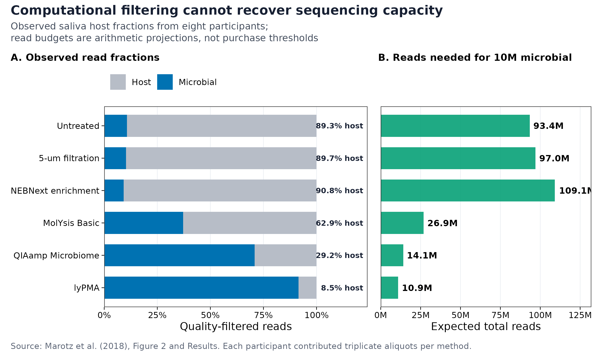
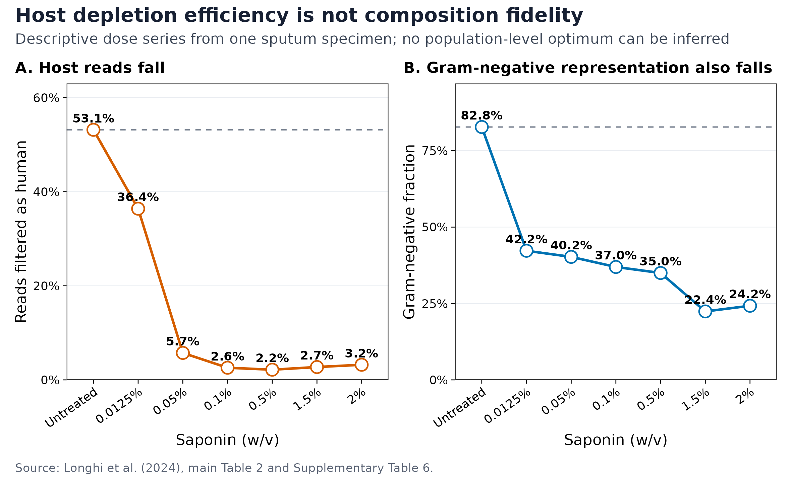
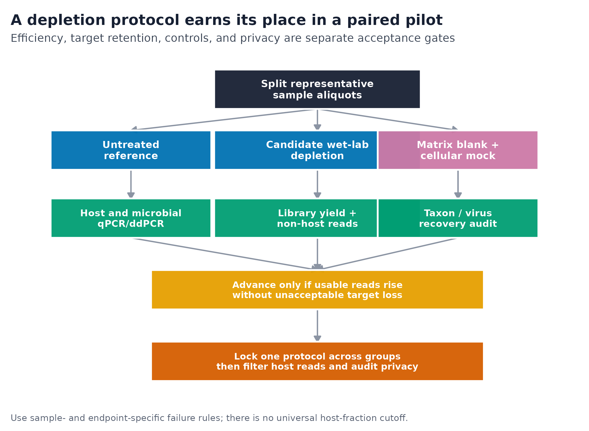

> **学习目标：**把“宿主 reads 太多就去掉”拆成两项不同任务：用湿实验宿主耗竭（wet-lab host depletion）在建库前争取有效测序容量，用计算去宿主（computational host filtering）在分析与共享前清除残留人源序列；同时用配对 aliquot、blank、整细胞 mock、qPCR/ddPCR 和残留人源审计约束靶标损失、污染与隐私风险。  
> **真实数据：**Marotz 等对 8 名受试者的唾液分别进行 6 种处理、每种处理 3 个 aliquots；Longhi 等对同一份痰液做 7 个 saponin 剂量条件。前者用于比较宿主 read fraction 和测序预算，后者只用于展示“宿主比例下降不等于群落保真”的剂量现象，不能推断人群最佳浓度。  
> **预计资源：**读取本文固化小表和重绘三张图通常需要内存低于 1 GB、磁盘低于 100 MB、1 个 CPU、1 分钟以内。真实 paired-end short-read 去宿主建议准备 8 GB RAM、10–20 GB 可用磁盘、8 核，单样本常为 10–60 分钟；长读任务按 Hostile 给出的典型约 13 GB 内存需求，建议至少准备 16 GB RAM。实际耗时随 reads 数、存储和 CPU 改变。没有服务器时，可先在笔记本上处理小样本 pilot，正式队列提交到有访问控制的 HPC 或合规云环境；含潜在人源序列的原始 FASTQ 不应上传到未经授权的在线服务。

## 这一步对应论文里的哪张图 {#sec-target}

### 同样叫“去宿主”，解决的是两个不同分母

假设质控后宿主 read fraction 为 $f_h$，微生物 fraction 为 $f_m=1-f_h$。若目标是获得 $M$ 条微生物 reads，最简单的测序预算投影为：

$$
N_{\text{total}}=\frac{M}{f_m}.
$$

湿实验耗竭发生在建库前，可以提高 $f_m$；计算过滤发生在 reads 已经测完之后，只能删除宿主 reads，不能把已经消耗的 lane 容量换回微生物 reads。

Marotz 等比较唾液宿主耗竭方法时，未经处理样本的宿主 reads 为 89.29%，5-µm filtration 为 89.69%，NEBNext enrichment 为 90.83%，MolYsis Basic 为 62.88%，QIAamp Microbiome 为 29.17%，lyPMA 为 8.53% [@marotz2018hostdepletion]。每位受试者对每种方法均有 3 个 aliquots，因此比较保留了 subject-matched 结构。

| Treatment | Host reads | Microbial reads | Projected total reads for 10M microbial |
|---|---:|---:|---:|
| Untreated | 89.29% | 10.71% | 93.4M |
| 5-µm filtration | 89.69% | 10.31% | 97.0M |
| NEBNext enrichment | 90.83% | 9.17% | 109.1M |
| MolYsis Basic | 62.88% | 37.12% | 26.9M |
| QIAamp Microbiome | 29.17% | 70.83% | 14.1M |
| lyPMA | 8.53% | 91.47% | 10.9M |

lyPMA 相对 untreated 的微生物 read fraction 提高约 8.54 倍；若仅按比例投影，获得 1,000 万条微生物 reads 所需总 reads 从约 9,337 万降到 1,093 万。这个换算只说明 sequencing-capacity gain，不包含文库失败、DNA 产量、物种偏倚、平台最低购买量或研究终点，不能直接作为采购阈值。

{#fig-depletion-efficiency}

Marotz 论文 Figure 2 与 Results 报告了均值及“±”字段，但图注未把该字段明确命名为 SD 或 SEM；固化表因此保留中性列名 `reported_plusminus_pct`，不替作者补写离散度类型。

### 宿主比例最低，不代表微生物组成最可信

Longhi 等对一份痰液做 saponin 剂量系列：untreated 中 53.15% 高质量 reads 被判为人源，Gram-negative bacteria 占细菌组成的 82.75%；0.5% saponin 时，人源比例降到 2.16%，但 Gram-negative representation 也降到 34.98%，仅为 untreated 比例的 42.27% [@longhi2024saponin]。

{#fig-saponin-tradeoff}

这里能下的结论是“需要同时审计 host removal 与 target retention”，而不是“Gram-negative 细胞绝对减少了 57.73%”。后者还需要外部总量标尺、重复样本和相容的 recovery measurement；组成百分比本身不能区分绝对损失与其他类群的相对变化。

{#fig-depletion-decision}

::: {.callout-important title="先确定研究终点，再定义“可接受的宿主比例”"}
做细菌 species profiling、DNA virus discovery、真菌分析、胞外 DNA、耐药基因或 MAG，允许损失的对象并不相同。不存在适用于所有基质和终点的 10%、5% 或 1% 宿主 fraction 及格线；应预先定义“需要多少 usable reads、哪些靶标不得丢、残留人源风险如何检测、失败后怎么处理”。
:::

## 理论：宿主耗竭是选择过程，不是无损净化 {#sec-theory}

### 1. 低生物量要看微生物负荷与宿主背景，不只看总 DNA

“DNA 浓度不低”不代表“微生物量足够”。鼻咽拭子、痰液、组织、血液和活检中的 DNA 可能绝大部分来自宿主；Rajar 等在未耗竭的 pooled nasopharyngeal samples 中观察到约 99% 宿主 DNA，并发现不同提取/耗竭组合的表现依赖具体基质 [@rajar2022lowbiomass]。

项目至少要区分：

- **total dsDNA concentration**：宿主、微生物、胞外 DNA 和污染之和；
- **microbial load**：每单位样本中的 microbial cells、genome equivalents 或 target copies；
- **host-to-microbial ratio**：决定 shotgun reads 中有多少容量可能被宿主占用；
- **library-compatible yield**：真正能进入建库的 DNA 量与片段分布；
- **endpoint-specific recovery**：细菌、真菌、病毒、ARG 或 MAG 是否仍可检出。

低生物量时，reagent contamination 与真实信号的比例升高；只增加 PCR cycles 或测序深度，会同时放大污染和随机性。blank、mock、load measurement 与批次随机化必须从湿实验开始，而不是在差异分析阶段补救。

### 2. 不同耗竭机制有不同“盲区”

| Mechanism | 主要思路 | 容易损失或误判的对象 | pilot 必查 |
|---|---|---|---|
| Size filtration | 按细胞/颗粒大小分离 | 聚团微生物、大细胞真菌、附着在宿主细胞上的微生物 | filter recovery、目标粒径、堵膜 |
| Selective host lysis + nuclease | 先裂宿主细胞，再消化暴露 DNA | 易裂解细菌、受损细胞、胞外 microbial DNA | intact cellular mock、Gram+/Gram− recovery |
| PMA after host lysis | 对可进入受损细胞或游离 DNA 的 PMA 进行光交联 | 受损微生物、胞外 DNA、部分病毒终点 | viability state、DNA virus 与 extracellular target |
| Saponin/detergent | 差异裂解真核细胞 | 某些细菌膜结构、真菌/寄生虫、enveloped viruses | taxon- and virus-specific retention |
| Methylation capture/depletion | 利用宿主与微生物 DNA 修饰差异 | 修饰模式重叠的微生物、目标真核微生物 | mock panel、未分类 reads、功能回收 |
| Computational alignment | 与宿主参考比对后删除 | 与宿主同源的 microbial sequence、参考未覆盖的人源 reads | masked/unmasked sensitivity、independent residual screen |

“更强的耗竭”通常意味着“更强的选择”。若 primary endpoint 包括 DNA viruses、fungi、parasites、cell-free DNA、受损细胞或 host-associated microbes，常规 bacterial depletion pilot 不能自动外推。

### 3. 配对 pilot 同时估计效率与组成保真

设真实微生物绝对量为 $A_i$，候选耗竭流程对 taxon $i$ 的相对保留效率为 $r_i$。耗竭后的组成是：

$$
\widetilde{p}_i
=
\frac{r_i A_i}
{\sum_j r_j A_j}.
$$

即使宿主去除率接近 100%，只要 $r_i$ 在 taxa 间不同，微生物比例仍会改变。一个可判定的 paired pilot 应从同一 homogenized specimen 分 aliquots，并同时比较：

1. untreated reference；
2. 一个或多个 candidate depletion conditions；
3. 跟随全部步骤的 matrix blank；
4. 包含关键 Gram-positive、Gram-negative、fungal/viral targets 的 intact cellular mock；
5. depletion 前后的 host qPCR/ddPCR、microbial qPCR/ddPCR；
6. library yield、non-host read fraction 和 primary endpoint recovery。

推荐用每个受试者或每份标本的 paired contrast，而不是把 untreated 和 depleted 分到不同人。若 pilot 只用一份样本，只能发现明显机制性风险，不能估计人群变异或给出通用剂量。

### 4. 计算去宿主要平衡完整性、微生物保留与隐私

人源过滤的召回率取决于参考是否覆盖真实人群中的结构变异、替代单倍型、HLA 和难组装区域。Bush 等的 benchmark 表明，Bowtie2 与 SNAP 可提供较高精确度，短 reads 还可从两阶段策略获益；他们也在公开 microbial datasets 中发现足以支持人类变异识别的残留 reads [@bush2020humanreads]。

Hostile 将 paired-read 处理、重命名与输出顺序控制整合到宿主过滤流程中 [@constantinides2023hostile]。本文当前基线锁定：

- Hostile `2.0.2`；
- short-read 默认 Bowtie2 `--sensitive` 路径；
- `human-t2t-hla` 索引：T2T-CHM13 `2.0` + IPD-IMGT/HLA `3.51`，发布标识 `2023-07`；
- `--rename --reorder` 保持匿名化后的 paired-read 对应与确定顺序；
- 输入、输出 read pairs、软件版本、索引身份和 checksum 全部进入审计表。

`--very-sensitive-local` 等更敏感设置通常能找出更多宿主 reads，也可能增加与人类相似的 microbial reads 被误删的风险。masked host index 可保护列入 mask 的 bacterial/viral/phage references，却可能让与这些区域相似的人源 reads 留下。两种选择都不是“无风险”；应在同一 mock 和真实 pilot 上报告 retention–privacy sensitivity。

### 5. “去宿主后可以公开”是危险推断

Tomofuji 等显示，即使肠道 metagenome 中只残留少量人源 reads，仍可能重建性别等个人信息；其验证数据中 genetic sex prediction 达到 97.3% [@tomofuji2023privacy]。Guccione 等进一步指出，不完整的人类参考既会产生错误的生物学关联，也会留下可识别信息 [@guccione2025reference]。

因此，clean FASTQ 仍应按潜在人类遗传数据管理：

- 原始与 filtered FASTQ 都置于访问控制、审计和加密策略下；
- 对外发布前进行独立 residual-human screen，而不是只相信过滤工具自己的 log；
- 优先发布无法回推出个体基因型的 aggregate abundance tables；
- 数据共享遵循知情同意、伦理审批、机构政策与数据库受控访问要求；
- 删除本地原始数据不是授权共享的替代品，保留周期也应按审批文件执行。

## 准备工作 {#sec-setup}

<details>
<summary><strong>展开：固定输入、安装环境、下载人源索引并定义作图函数</strong></summary>

### 固化论文表格与校验指纹

`06-marotz-host-depletion-source.tsv` 转录 Marotz 等 Results/Figure 2 的 6 个处理；`06-longhi-saponin-source.tsv` 联结 Longhi 等 main Table 2 与 Supplementary Table 6。许可、字段映射、PMCID、项目 accession 与原始补充文件指纹见 `06-data-NOTICE.txt`。

```{bash}
set -euo pipefail

sha256sum -c <<'CHECKSUMS'
ad1f541cfe72a708f38f81a91d1827e6462d455a1e88f58fb9d91b63f5b99364  data/small/06-marotz-host-depletion-source.tsv
cb2b77c7c34f1866f4666977ba27ad309dee986d11815c42f8e90077d2539396  data/small/06-longhi-saponin-source.tsv
9cc049c3c4149f2c3365ff8a5fdc21d87c3ae52d130cfc61d54020a4301cf4a7  data/small/06-host-filter-contract.tsv
3767e7417595b146946641fcdf5c5e7455722145665bc969d4692e4eec03ff00  data/small/06-data-NOTICE.txt
CHECKSUMS
```

### 轻量复算与作图依赖

```{r}
install.packages(c(
  "ggplot2", "patchwork", "scales",
  "jsonlite", "digest", "knitr"
))
```

### 真实 FASTQ 的固定环境

以下环境用于 paired short reads。版本锁定不是为了宣称它们永久最佳，而是让同一批样本可以复查：

```{bash}
set -euo pipefail

mamba create -n hostfilter-2.0.2 -y \
  -c conda-forge -c bioconda \
  python=3.11 bowtie2=2.5.4 samtools=1.21 seqkit=2.10.0

mamba run -n hostfilter-2.0.2 \
  python -m pip install "hostile==2.0.2"

mamba run -n hostfilter-2.0.2 hostile --version
mamba run -n hostfilter-2.0.2 hostile index fetch \
  --name human-t2t-hla \
  --bowtie2
```

索引下载完成后，把 Hostile 输出的索引路径、所有文件的 SHA-256、下载日期和 release identity 写入项目 manifest。数据库更新会改变过滤结果，不能只记录“human reference”：

```{bash}
set -euo pipefail

index_dir="/path/reported/by/hostile"
find "${index_dir}" -type f -print0 \
  | sort -z \
  | xargs -0 sha256sum \
  > db/human-t2t-hla-2023-07.sha256
```

### 正文内的固定种子与作图函数

```{r}
library(ggplot2)
library(patchwork)
library(scales)
library(jsonlite)
library(digest)
library(knitr)

set.seed(20260719)

pal_pub <- c(
  "#0072B2", "#D55E00", "#009E73", "#CC79A7",
  "#E69F00", "#56B4E9", "#F0E442", "#999999"
)

scale_color_pub <- function(...) {
  scale_color_manual(values = pal_pub, ...)
}

scale_fill_pub <- function(...) {
  scale_fill_manual(values = pal_pub, ...)
}

theme_pub <- function(base_size = 12) {
  theme_bw(base_size = base_size, base_family = "sans") +
    theme(
      panel.grid.minor = element_blank(),
      panel.grid.major = element_line(
        color = "#E8ECF1",
        linewidth = 0.25
      ),
      axis.text = element_text(color = "black"),
      axis.ticks = element_line(color = "black", linewidth = 0.3),
      legend.key = element_blank(),
      legend.background = element_rect(
        fill = alpha("white", 0.75),
        color = NA
      ),
      plot.title.position = "plot"
    )
}

save_pub <- function(
  plot,
  file_base,
  width = 190,
  height = 125,
  units = "mm",
  dpi = 300
) {
  dir.create(
    dirname(file_base),
    recursive = TRUE,
    showWarnings = FALSE
  )
  ggsave(
    paste0(file_base, ".pdf"),
    plot,
    width = width,
    height = height,
    units = units,
    device = grDevices::cairo_pdf
  )
  ggsave(
    paste0(file_base, ".png"),
    plot,
    width = width,
    height = height,
    units = units,
    dpi = dpi,
    bg = "white"
  )
  ggsave(
    paste0(file_base, ".tiff"),
    plot,
    width = width,
    height = height,
    units = units,
    dpi = dpi,
    compression = "lzw",
    bg = "white"
  )
  invisible(plot)
}
```

</details>

::: {.callout-warning title="人源索引和 FASTQ 的存放位置"}
人源参考本身不是患者数据，但原始 metagenomic FASTQ 可能包含可识别的人类遗传信息。正式运行目录、临时文件、scheduler log、对象存储和备份都要纳入访问控制；不要为了省服务器资源把 FASTQ 发送到未经伦理或数据管理批准的网页工具。
:::

## 可复制代码：先做配对 pilot，再清除残留宿主 reads {#sec-code}

### 1. 从论文原值重算 read budget 与剂量权衡

```{r}
marotz <- read.delim(
  "data/small/06-marotz-host-depletion-source.tsv",
  check.names = FALSE,
  stringsAsFactors = FALSE,
  na.strings = c("NA", "")
)

longhi <- read.delim(
  "data/small/06-longhi-saponin-source.tsv",
  check.names = FALSE,
  stringsAsFactors = FALSE
)

stopifnot(
  nrow(marotz) == 6L,
  nrow(longhi) == 7L,
  identical(
    marotz$host_mean_pct,
    c(89.29, 89.69, 90.83, 62.88, 29.17, 8.53)
  ),
  identical(
    longhi$host_filtered_pct,
    c(53.15, 36.38, 5.73, 2.58, 2.16, 2.73, 3.21)
  ),
  all(abs(
    longhi$gram_positive_pct +
      longhi$gram_negative_pct - 100
  ) < 1e-8)
)

target_microbial_reads <- 1e7

marotz$microbial_pct <- 100 - marotz$host_mean_pct
marotz$microbial_yield_fold_vs_untreated <-
  marotz$microbial_pct /
  marotz$microbial_pct[marotz$method_code == "raw"]
marotz$total_reads_for_10m_microbial <-
  target_microbial_reads / (marotz$microbial_pct / 100)
marotz$total_reads_for_10m_microbial_millions <-
  marotz$total_reads_for_10m_microbial / 1e6

untreated_host <-
  longhi$host_filtered_pct[longhi$saponin_pct == 0]
untreated_gram_negative <-
  longhi$gram_negative_pct[longhi$saponin_pct == 0]

longhi$host_reduction_percentage_points <-
  untreated_host - longhi$host_filtered_pct
longhi$gram_negative_retention_vs_untreated_pct <-
  100 * longhi$gram_negative_pct / untreated_gram_negative
longhi$observed_nonhuman_fraction_pct <-
  100 * longhi$nonhuman_reads / longhi$high_quality_reads

stopifnot(
  max(abs(
    longhi$observed_nonhuman_fraction_pct -
      (100 - longhi$host_filtered_pct)
  )) < 0.01
)

write.table(
  marotz,
  "data/small/06-host-depletion-read-budget.tsv",
  sep = "\t",
  row.names = FALSE,
  quote = FALSE,
  na = "NA"
)

write.table(
  longhi,
  "data/small/06-saponin-tradeoff.tsv",
  sep = "\t",
  row.names = FALSE,
  quote = FALSE,
  na = "NA"
)

summary06 <- list(
  article = 6L,
  seed = 20260719L,
  marotz_methods = nrow(marotz),
  marotz_participants = unique(marotz$participants),
  untreated_host_percent =
    marotz$host_mean_pct[marotz$method_code == "raw"],
  lypma_host_percent =
    marotz$host_mean_pct[marotz$method_code == "lypma"],
  lypma_microbial_yield_fold =
    marotz$microbial_yield_fold_vs_untreated[
      marotz$method_code == "lypma"
    ],
  longhi_saponin_conditions = nrow(longhi),
  longhi_specimens = 1L,
  longhi_lowest_host_saponin_percent =
    longhi$saponin_pct[which.min(longhi$host_filtered_pct)],
  longhi_lowest_host_percent = min(longhi$host_filtered_pct),
  longhi_gram_negative_at_lowest_host_percent =
    longhi$gram_negative_pct[which.min(longhi$host_filtered_pct)]
)

dir.create("results", showWarnings = FALSE)
write_json(
  summary06,
  "results/06-host-depletion-summary.json",
  pretty = TRUE,
  auto_unbox = TRUE,
  digits = 12
)

head(marotz)
head(longhi)
```

### 2. 把湿实验 pilot 做成可判定表

每个候选条件保留 paired specimen ID，而不是只汇总成组均值。下面的字段是最小审计合同：

```text
specimen_id
aliquot_id
treatment
depletion_reagent
reagent_lot
operator
processing_batch
input_mass_or_volume
host_copies_before
host_copies_after
microbial_copies_before
microbial_copies_after
library_ng
read_pairs_input
read_pairs_nonhost
blank_reads
mock_expected_taxon
mock_observed_taxon
primary_target_recovered
pass_fail_reason
```

推荐预注册四类指标，而不是只排序 host fraction：

```{r}
pilot <- read.delim(
  "pilot/host-depletion-paired.tsv",
  check.names = FALSE,
  stringsAsFactors = FALSE
)

required <- c(
  "specimen_id", "aliquot_id", "treatment",
  "host_copies_before", "host_copies_after",
  "microbial_copies_before", "microbial_copies_after",
  "library_ng", "read_pairs_input", "read_pairs_nonhost",
  "blank_reads", "primary_target_recovered"
)
stopifnot(all(required %in% names(pilot)))

pilot$host_log10_reduction <-
  log10(pilot$host_copies_before) -
  log10(pilot$host_copies_after)
pilot$microbial_retention_pct <-
  100 * pilot$microbial_copies_after /
  pilot$microbial_copies_before
pilot$nonhost_read_pct <-
  100 * pilot$read_pairs_nonhost /
  pilot$read_pairs_input

# 示例门槛必须换成你的预注册终点，不是通用阈值。
pilot$pass <- with(
  pilot,
  microbial_retention_pct >= prespecified_retention_pct &
    primary_target_recovered &
    blank_reads <= prespecified_blank_limit &
    library_ng >= prespecified_library_ng
)
```

若 qPCR/ddPCR 出现 zero、低于 LOD 或低于 LOQ，不要直接加一个任意 pseudocount 再算 log reduction。应保留 censor flag，并按 assay validation 中定义的 LOD/LOQ 报告区间或下限。

### 3. 对 paired-end short reads 做当前计算去宿主

文件名映射先单独保存；用于分析与共享的输出使用不包含姓名、病历号或采样日期的 `sample_id`。

```{bash}
set -euo pipefail

sample_id="S001"
r1="fastq/${sample_id}_R1.fastq.gz"
r2="fastq/${sample_id}_R2.fastq.gz"
outdir="host_filtered/${sample_id}"
mkdir -p "${outdir}" "results/host_filter"

mamba run -n hostfilter-2.0.2 seqkit stats \
  -T "${r1}" "${r2}" \
  > "results/host_filter/${sample_id}.input.seqkit.tsv"

mamba run -n hostfilter-2.0.2 hostile clean \
  --fastq1 "${r1}" \
  --fastq2 "${r2}" \
  --index human-t2t-hla \
  --rename \
  --reorder \
  -t 8 \
  --out-dir "${outdir}"

clean_r1="${outdir}/${sample_id}_R1.clean.fastq.gz"
clean_r2="${outdir}/${sample_id}_R2.clean.fastq.gz"

test -s "${clean_r1}"
test -s "${clean_r2}"

mamba run -n hostfilter-2.0.2 seqkit stats \
  -T "${clean_r1}" "${clean_r2}" \
  > "results/host_filter/${sample_id}.clean.seqkit.tsv"

mamba run -n hostfilter-2.0.2 hostile --version \
  > "results/host_filter/${sample_id}.hostile-version.txt"
sha256sum "${clean_r1}" "${clean_r2}" \
  > "results/host_filter/${sample_id}.clean.sha256"
```

不同 Hostile 版本的输出命名可能改变。首次正式运行前，以锁定环境中的 `hostile clean --help` 为准确认输出路径，再把实际路径写入 workflow；不要用通配符自动挑选“最新的两个 FASTQ”。

成对数据的统计单位是 **read pair**。若任一 mate 命中宿主，保守策略通常是整对删除；不能把两个 mate 独立过滤后再按行强行拼回。`--reorder` 用于稳定输出顺序，但仍要检查 R1/R2 数量相等、read IDs 成对且没有空文件。

### 4. 把残留人源筛查作为独立发布门

独立审计应使用另一套完整的人类参考构建流程或另一种检测器；若只是把同一命令再跑一次，无法发现共同盲点。下面展示“只输出汇总计数”的原则，审计中命中的 reads 不进入公开产物：

```{bash}
set -euo pipefail

sample_id="S001"
clean_r1="host_filtered/${sample_id}/${sample_id}_R1.clean.fastq.gz"
clean_r2="host_filtered/${sample_id}/${sample_id}_R2.clean.fastq.gz"
audit_index="db/independent-human-audit.mmi"
audit_bam="secure_tmp/${sample_id}.residual-human.bam"

mkdir -p secure_tmp results/host_filter

minimap2 -t 8 -ax sr "${audit_index}" \
  "${clean_r1}" "${clean_r2}" \
  | samtools view -@ 4 -b -F 12 - \
  | samtools sort -@ 4 -o "${audit_bam}" -

residual_alignments="$(
  samtools view -c "${audit_bam}"
)"
printf '%s\t%s\n' \
  "${sample_id}" "${residual_alignments}" \
  > "results/host_filter/${sample_id}.residual-human-count.tsv"

# audit BAM 含潜在人源序列，只保留在受控临时区；
# 是否删除及保留多久遵循伦理审批和机构策略。
```

`-F 12` 统计“至少一个 mate 已比对”的 alignment records，不等同于唯一人源 fragments，也不是统一隐私阈值。正式 audit 应定义 denominator、secondary/supplementary alignment、MAPQ、pair policy、重复序列和人工复核规则，并用含已知人源/微生物 reads 的 benchmark 校准。

### 5. 比较 masked 与 unmasked host index 的敏感性

若 primary endpoint 容易与宿主参考交叉，可在 pilot 上增加 masked index：

```{bash}
set -euo pipefail

mamba run -n hostfilter-2.0.2 hostile index fetch \
  --name \
  human-t2t-hla.argos-bacteria-985_rs-viral-202401_ml-phage-202401 \
  --bowtie2

# 只在 pilot 副本上运行；正式队列仍由预注册结果决定使用哪一个索引。
mamba run -n hostfilter-2.0.2 hostile clean \
  --fastq1 pilot/S001_R1.fastq.gz \
  --fastq2 pilot/S001_R2.fastq.gz \
  --index \
  human-t2t-hla.argos-bacteria-985_rs-viral-202401_ml-phage-202401 \
  --rename \
  --reorder \
  -t 8 \
  --out-dir pilot/masked
```

对两套输出同时比较：

- 已知 human-positive reads 的去除召回；
- cellular mock 与关键病毒/真菌 target retention；
- 未分类 reads、species、pathway、ARG 和 assembly yield；
- 独立 residual-human audit；
- pairs retained、CPU time 和峰值 RAM。

## 审计与升级：从历史复现到当前基线 {#sec-audit}

### 忠实复现 Marotz 2018 的计算定义

Marotz 等使用 Atropos `1.1.5` 处理 adapters/quality，再以 Bowtie2 `2.3.0`、`--very-sensitive-local` 对 GRCh38.p7 做宿主比对 [@marotz2018hostdepletion]。若目标是忠实复现论文 Figure 2，应保留这套工具、参考与参数；换成 T2T/HLA 后得到的是升级分析，不能继续标作原图原值。

| Layer | Historical reproduction | Current baseline | 为什么升级 |
|---|---|---|---|
| Trimming | Atropos 1.1.5 | 锁定项目 QC 工具与参数 | 软件版本与 read retention 可审计 |
| Host reference | GRCh38.p7 | T2T-CHM13 2.0 + HLA 3.51 | 减少未覆盖区域与 HLA 缺口 |
| Host aligner | Bowtie2 2.3.0 | Hostile 2.0.2 paired Bowtie2 workflow | 固化 pair、rename、reorder 与 log |
| Sensitivity | `--very-sensitive-local` | 默认 sensitive + pilot sensitivity | 避免未验证地最大化 off-target loss |
| Retention audit | 以 taxonomic change 为主 | cellular mock + viruses/fungi + endpoint | 将“宿主低”与“靶标保留”分开 |
| Privacy gate | 未独立定义 | second detector/reference + controlled access | 过滤 log 不能证明不可识别 |

### 当前标准要补上的六项

1. **reference completeness**：记录 assembly、HLA、mask 集合、release 和 checksum；
2. **pair policy**：明确一个 mate 命中后是否整对删除；
3. **target-retention panel**：按 primary endpoint 选择细菌、真菌、病毒、胞外 DNA 与受损细胞；
4. **negative controls**：耗竭试剂和额外操作本身可能引入 kitome；
5. **batch lock**：病例与对照不能使用不同耗竭条件，试剂 lot 和 operator 要交叉；
6. **privacy validation**：filtered FASTQ 仍受控，发布前有独立 residual screen。

::: {.callout-note title="论文原值与当前重分析要并排报告"}
历史复现回答“作者当时得到什么”；当前基线回答“今天用更完整参考和显式隐私门会得到什么”。两者都应保留，不能悄悄替换工具后仍声称忠实复现，也不能因为工具较新就忽略原论文的 paired biological design。
:::

## 出版级美化：同时画效率、代价和适用边界 {#sec-polish}

第一张图将宿主/微生物 fraction 与达到固定 microbial-read target 的总 read budget 并排。所有文字为英文，避免把 projected budget 误读为测序公司采购建议：

```{r}
method_levels <- rev(marotz$method_label)
marotz$method_label <- factor(
  marotz$method_label,
  levels = method_levels
)

fraction_long <- rbind(
  data.frame(
    method_label = marotz$method_label,
    fraction = "Host",
    percent = marotz$host_mean_pct
  ),
  data.frame(
    method_label = marotz$method_label,
    fraction = "Microbial",
    percent = marotz$microbial_pct
  )
)
fraction_long$fraction <- factor(
  fraction_long$fraction,
  levels = c("Host", "Microbial")
)

p_fraction <- ggplot(
  fraction_long,
  aes(percent, method_label, fill = fraction)
) +
  geom_col(width = 0.68) +
  geom_text(
    data = marotz,
    aes(
      x = 122,
      y = method_label,
      label = sprintf("%.1f%% host", host_mean_pct)
    ),
    inherit.aes = FALSE,
    hjust = 1,
    color = "#172033",
    fontface = "bold",
    size = 2.7
  ) +
  scale_fill_manual(
    values = c("Host" = "#B7BDC7", "Microbial" = "#0072B2")
  ) +
  scale_x_continuous(
    limits = c(0, 124),
    breaks = seq(0, 100, 25),
    labels = function(x) paste0(x, "%"),
    expand = expansion(mult = c(0, 0))
  ) +
  labs(
    title = "A. Observed read fractions",
    x = "Quality-filtered reads",
    y = NULL,
    fill = NULL
  ) +
  theme_pub(10.8) +
  theme(
    panel.grid.major.y = element_blank(),
    legend.position = "top",
    legend.justification = "left",
    plot.title = element_text(face = "bold", size = 10)
  )

p_budget <- ggplot(
  marotz,
  aes(total_reads_for_10m_microbial_millions, method_label)
) +
  geom_col(
    width = 0.68,
    fill = "#009E73",
    alpha = 0.88
  ) +
  geom_text(
    aes(label = sprintf(
      "%.1fM",
      total_reads_for_10m_microbial_millions
    )),
    hjust = -0.12,
    fontface = "bold",
    size = 3.15
  ) +
  scale_x_continuous(
    limits = c(0, 132),
    breaks = c(0, 25, 50, 75, 100, 125),
    labels = function(x) paste0(x, "M"),
    expand = expansion(mult = c(0, 0))
  ) +
  labs(
    title = "B. Reads needed for 10M microbial",
    x = "Expected total reads",
    y = NULL
  ) +
  theme_pub(10.8) +
  theme(
    panel.grid.major.y = element_blank(),
    axis.text.y = element_blank(),
    axis.ticks.y = element_blank(),
    plot.title = element_text(face = "bold", size = 10)
  )

p_efficiency <- p_fraction + p_budget +
  plot_layout(widths = c(1.25, 1)) +
  plot_annotation(
    title =
      "Computational filtering cannot recover sequencing capacity",
    subtitle = paste0(
      "Observed saliva host fractions from eight participants;\n",
      "read budgets are arithmetic projections, ",
      "not purchase thresholds"
    ),
    caption = paste(
      "Source: Marotz et al. (2018), Figure 2 and Results.",
      "Each participant contributed triplicate aliquots per method."
    )
  )

save_pub(
  p_efficiency,
  "figures/06-host-depletion-efficiency",
  width = 216,
  height = 128
)
```

第二张图只把 Longhi 的单标本结果画成 dose-series 描述，不加显著性星号，也不画伪造的置信区间：

```{r}
dose_levels <- longhi$treatment_label
longhi$treatment_label <- factor(
  longhi$treatment_label,
  levels = dose_levels
)

p_host <- ggplot(
  longhi,
  aes(treatment_label, host_filtered_pct, group = 1)
) +
  geom_hline(
    yintercept =
      longhi$host_filtered_pct[longhi$saponin_pct == 0],
    linetype = 2,
    color = "#7B8492"
  ) +
  geom_line(color = "#D55E00", linewidth = 0.85) +
  geom_point(
    shape = 21,
    size = 3.6,
    stroke = 0.8,
    color = "#D55E00",
    fill = "white"
  ) +
  geom_text(
    aes(label = sprintf("%.1f%%", host_filtered_pct)),
    vjust = -0.85,
    size = 3.05,
    fontface = "bold"
  ) +
  scale_y_continuous(
    limits = c(0, 63),
    breaks = seq(0, 60, 20),
    labels = function(x) paste0(x, "%")
  ) +
  labs(
    title = "A. Host reads fall",
    x = "Saponin (w/v)",
    y = "Reads filtered as human"
  ) +
  theme_pub(10.8) +
  theme(
    panel.grid.major.x = element_blank(),
    axis.text.x = element_text(angle = 35, hjust = 1)
  )

p_gram_negative <- ggplot(
  longhi,
  aes(treatment_label, gram_negative_pct, group = 1)
) +
  geom_hline(
    yintercept =
      longhi$gram_negative_pct[longhi$saponin_pct == 0],
    linetype = 2,
    color = "#7B8492"
  ) +
  geom_line(color = "#0072B2", linewidth = 0.85) +
  geom_point(
    shape = 21,
    size = 3.6,
    stroke = 0.8,
    color = "#0072B2",
    fill = "white"
  ) +
  geom_text(
    aes(label = sprintf("%.1f%%", gram_negative_pct)),
    vjust = -0.85,
    size = 3.05,
    fontface = "bold"
  ) +
  scale_y_continuous(
    limits = c(0, 97),
    breaks = c(0, 25, 50, 75),
    labels = function(x) paste0(x, "%")
  ) +
  labs(
    title = "B. Gram-negative representation also falls",
    x = "Saponin (w/v)",
    y = "Gram-negative fraction"
  ) +
  theme_pub(10.8) +
  theme(
    panel.grid.major.x = element_blank(),
    axis.text.x = element_text(angle = 35, hjust = 1)
  )

p_tradeoff <- p_host + p_gram_negative +
  plot_annotation(
    title =
      "Host depletion efficiency is not composition fidelity",
    subtitle = paste(
      "Descriptive dose series from one sputum specimen;",
      "no population-level optimum can be inferred"
    ),
    caption = paste(
      "Source: Longhi et al. (2024), main Table 2",
      "and Supplementary Table 6."
    )
  )

save_pub(
  p_tradeoff,
  "figures/06-saponin-tradeoff",
  width = 200,
  height = 122
)
```

第三张决策图不使用随机布局。节点位置、箭头和文本都是显式坐标，因此重绘不会因 graph layout 改变：

```{r}
boxes <- data.frame(
  xmin = c(
    3.2, 0.35, 3.2, 6.05,
    0.35, 3.2, 6.05, 2.1, 2.1
  ),
  xmax = c(
    6.8, 3.15, 6.8, 8.85,
    3.15, 6.8, 8.85, 7.9, 7.9
  ),
  ymin = c(
    8.25, 6.55, 6.55, 6.55,
    4.65, 4.65, 4.65, 2.65, 0.65
  ),
  ymax = c(
    9.35, 7.65, 7.65, 7.65,
    5.75, 5.75, 5.75, 3.75, 1.75
  ),
  label = c(
    "Split representative\nsample aliquots",
    "Untreated\nreference",
    "Candidate wet-lab\ndepletion",
    "Matrix blank +\ncellular mock",
    "Host and microbial\nqPCR/ddPCR",
    "Library yield +\nnon-host reads",
    "Taxon / virus\nrecovery audit",
    paste(
      "Advance only if usable reads rise",
      "without unacceptable target loss",
      sep = "\n"
    ),
    paste(
      "Lock one protocol across groups",
      "then filter host reads and audit privacy",
      sep = "\n"
    )
  ),
  type = c(
    "start", "branch", "branch", "control",
    "measure", "measure", "measure", "decision", "finish"
  )
)

arrows <- data.frame(
  x = c(
    5, 5, 5, 7.45, 1.75, 5,
    7.45, 1.75, 5, 7.45, 5
  ),
  y = c(
    8.25, 8.25, 8.25, 6.55, 6.55, 6.55,
    6.55, 4.65, 4.65, 4.65, 2.65
  ),
  xend = c(
    1.75, 5, 7.45, 7.45, 1.75, 5,
    7.45, 5, 5, 5, 5
  ),
  yend = c(
    7.65, 7.65, 7.65, 5.75, 5.75, 5.75,
    5.75, 3.75, 3.75, 3.75, 1.75
  )
)

box_colors <- c(
  "start" = "#172033",
  "branch" = "#0072B2",
  "control" = "#CC79A7",
  "measure" = "#009E73",
  "decision" = "#E69F00",
  "finish" = "#D55E00"
)

p_workflow <- ggplot() +
  geom_segment(
    data = arrows,
    aes(x = x, y = y, xend = xend, yend = yend),
    color = "#8B94A3",
    linewidth = 0.6,
    arrow = grid::arrow(
      length = grid::unit(2.1, "mm"),
      type = "closed"
    )
  ) +
  geom_rect(
    data = boxes,
    aes(
      xmin = xmin,
      xmax = xmax,
      ymin = ymin,
      ymax = ymax,
      fill = type
    ),
    color = "white",
    linewidth = 0.8
  ) +
  geom_text(
    data = boxes,
    aes(
      x = (xmin + xmax) / 2,
      y = (ymin + ymax) / 2,
      label = label
    ),
    color = "white",
    size = 3.1,
    lineheight = 0.93,
    fontface = "bold"
  ) +
  scale_fill_manual(values = box_colors) +
  coord_cartesian(
    xlim = c(0.1, 9.1),
    ylim = c(0.35, 9.6),
    clip = "off"
  ) +
  labs(
    title =
      "A depletion protocol earns its place in a paired pilot",
    subtitle = paste(
      "Efficiency, target retention, controls, and privacy",
      "are separate acceptance gates"
    ),
    caption = paste(
      "Use sample- and endpoint-specific failure rules;",
      "there is no universal host-fraction cutoff."
    )
  ) +
  theme_void(base_size = 11.5, base_family = "sans") +
  theme(
    legend.position = "none",
    plot.title = element_text(face = "bold", color = "#172033"),
    plot.subtitle = element_text(color = "#3D4757"),
    plot.caption = element_text(color = "#596273", hjust = 0)
  )

save_pub(
  p_workflow,
  "figures/06-host-depletion-decision",
  width = 198,
  height = 145
)
```

正式图同时保留 PDF、300-dpi PNG 和 300-dpi LZW TIFF。caption 必须区分 observed、derived 与 illustrative：Marotz host fractions 是 observed；10M read budget 是 derived；流程图是 decision framework。

## 常见坑：审稿人会追问什么 {#sec-pitfalls}

::: {.callout-caution title="把计算过滤当成湿实验耗竭"}
计算删除发生在测序之后，不能恢复被宿主 reads 占用的 lane，也不能补救因宿主过高而失败的低丰度物种、assembly 或 MAG。Methods 要分别写 wet-lab treatment 和 computational reference filtering。
:::

::: {.callout-caution title="只按最低 host fraction 选方案"}
最强耗竭可能同时损失易裂解细菌、真菌、病毒、胞外 DNA 或受损细胞。候选方案必须同时报告 microbial load retention、mock recovery 和 primary endpoint。
:::

::: {.callout-caution title="用总 DNA 浓度定义低生物量"}
宿主 DNA 可让 Qubit 浓度很高，而 microbial molecules 极少。至少增加 microbial/host qPCR 或 ddPCR、non-host fraction 和 per-unit-sample load。
:::

::: {.callout-caution title="untreated 与 depleted 来自不同受试者"}
个体差异会与处理效应混在一起。应从同一 homogenized specimen 分 paired aliquots，并保留 specimen-level paired analysis。
:::

::: {.callout-caution title="耗竭试剂没有 blank"}
额外裂解、洗涤、离心和酶反应都会增加污染入口。matrix blank/extraction blank 要走完整处理，并与样本共享 reagent lot、plate 和 sequencing batch。
:::

::: {.callout-caution title="DNA mock 被用来证明 differential lysis 无偏"}
提取后加入的裸 DNA 没有细胞膜、细胞壁或病毒衣壳，不能检验 selective lysis。应使用 intact cellular mock，并补充与研究终点匹配的病毒/真菌材料。
:::

::: {.callout-caution title="病例和对照使用不同耗竭策略"}
当疾病状态与 protocol、lot、operator 或日期重合时，生物差异不可辨识。pilot 结束后锁定一套方案，并把病例/对照交叉分配到批次。
:::

::: {.callout-caution title="把 local-sensitive 当作永远更安全"}
更敏感的局部比对可能提高人源召回，也可能误删与宿主相似的 microbial reads。用 human-positive benchmark 和 mock 画 sensitivity–retention trade-off，再决定参数。
:::

::: {.callout-caution title="过滤完成后直接公开 FASTQ"}
过滤 log 不是隐私证明。参考缺口、变异和同源区域都可能留下人源 reads；filtered FASTQ 仍应受控，并通过独立 residual-human audit。
:::

::: {.callout-caution title="报告百分比，却不报告分母和 pair policy"}
“去掉 90% 宿主 reads”必须说明分母是 reads、read pairs 还是 bases，以及一个 mate 命中时如何处理整对。不同定义不能直接比较。
:::

## 这段 Methods 怎么写 {#sec-methods}

### 忠实复现 Marotz 2018 的英文模板

> Saliva samples from eight participants were split into triplicate aliquots for each host-depletion condition. Host DNA depletion was performed using untreated, 5-µm filtration, NEBNext Microbiome DNA Enrichment, MolYsis Basic, QIAamp DNA Microbiome, and lyPMA workflows as described by Marotz et al. (2018). Adapter and quality trimming used Atropos v1.1.5. Reads were aligned to GRCh38.p7 with Bowtie2 v2.3.0 using `--very-sensitive-local`, and the host-aligned fraction was calculated from quality-filtered reads. The values reproduced here were transcribed from the published Results and Figure 2; the dispersion field was retained as reported because the article did not explicitly identify the displayed “±” statistic as SD or SEM.

### 当前 paired short-read 队列的英文模板

> Before cohort-wide processing, `[N]` representative `[MATRIX]` specimens spanning the prespecified host-to-microbial load range were homogenized and divided into untreated and candidate-depletion aliquots. Each batch included a matrix blank and an intact cellular mock containing `[TARGET PANEL]`. Host and microbial loads before and after treatment were measured by `[qPCR/ddPCR ASSAYS, TARGETS, LOD/LOQ]`; library yield, non-host read-pair fraction, mock taxon recovery, viral/fungal target retention, and blank signal were evaluated against prespecified acceptance rules. `[PROTOCOL, REAGENT LOT, CONCENTRATION, INCUBATION, NUCLEASE AND STOPPING CONDITIONS]` was selected before cohort processing and applied identically across randomized case and control samples.

> Paired-end reads were filtered using Hostile v2.0.2 with Bowtie2 v2.5.4 and the `human-t2t-hla` index (T2T-CHM13 v2.0 plus IPD-IMGT/HLA v3.51; index release 2023-07; index SHA-256 manifest `[FILE/HASH]`). Hostile was run with its short-read sensitive baseline, `--rename`, `--reorder`, and eight threads. If either mate was classified as host, the read pair was excluded. Input and retained read-pair counts, tool versions, command lines, index identity, peak memory, runtime, and output checksums were recorded per sample. Filtered reads remained under controlled access and were screened with `[INDEPENDENT TOOL AND COMPLETE REFERENCE, VERSION/HASH]` before any data release. Aggregate microbial profiles, rather than residual FASTQ, were used for open dissemination unless controlled-access approval explicitly permitted sequence sharing.

### 若使用 masked index，额外写清

> A masked host-reference sensitivity analysis used `human-t2t-hla.argos-bacteria-985_rs-viral-202401_ml-phage-202401` (`[INDEX HASH]`). The unmasked and masked outputs were compared for recall on known human-positive reads, retention of the cellular microbial/viral mock, residual-human alignments under an independent audit, and effects on `[PRIMARY ENDPOINT]`. The production index was chosen using prespecified privacy and target-retention criteria and was not selected after inspecting case-control associations.

Methods 还必须给出：

- specimen matrix、原始质量/体积、保存与 time-to-processing；
- 分 aliquot 与 homogenization 规则；
- wet-lab reagent、catalog、lot、浓度、时间、温度与 nuclease stop；
- blank/mock 的组成、加入阶段、每批数量和失败规则；
- host/microbial assay target、标准曲线、LOD/LOQ 与 inhibition；
- FASTQ 质控、pair policy、Hostile/aligner/参考完整版本；
- masked regions 或 protected references 的精确清单；
- reads/pairs/bases 中使用哪个分母；
- residual-human audit、数据访问等级与公开产物边界。

## 换成你自己的数据怎么做 {#sec-own-data}

### 1. 先写 endpoint–risk 表

| Primary endpoint | 湿实验最担心的损失 | 计算过滤最担心的损失 | 必加对照 |
|---|---|---|---|
| Bacterial species | 易裂解或受损细菌 | 与宿主同源片段 | Gram+/Gram− cellular mock |
| DNA virome | free/enveloped viral DNA | host-integrated/同源病毒区域 | enveloped + non-enveloped virus panel |
| Mycobiome/parasites | 真核靶标被当作宿主处理 | 与人类保守区比对 | fungal/eukaryotic mock |
| ARG/gene catalog | extracellular/low-copy genes | conserved domains 被误删 | known-copy gene/cell controls |
| MAG/assembly | 有效覆盖和长片段损失 | pair/coverage 缺口 | assembly mock + coverage audit |
| Cell-free DNA | PMA/nuclease 直接消除终点 | 短片段 mapping ambiguity | fragment-size-matched DNA control |

若同一项目同时研究细菌、病毒和真菌，可能没有一套强耗竭流程能保护所有终点。更稳妥的设计是从同一 homogenate 预先分实验线，每条线独立记录 protocol、controls、unit 与分析边界。

### 2. 选择代表性 pilot 样本

至少覆盖：

- 预期 host fraction 的低、中、高区间；
- microbial load 的低、中、高区间；
- 主要病例与对照 strata；
- 不同黏度、炎症、血液/组织成分或采样中心；
- 预计最难保留的 primary targets；
- 每种候选条件的 paired untreated aliquot。

单一 pooled sample 可用于早期排雷，不能替代 biological replicates。正式选择要看 subject-level paired effect 和变异范围，而不是只看总体均值。

### 3. 预先定义四类失败规则

| Gate | 示例指标 | 失败后动作 |
|---|---|---|
| Capacity | non-host read-pair gain、library success | 调整耗竭强度或增加输入 |
| Retention | microbial copies、mock taxa、virus/fungus recovery | 降低强度、改机制或拆实验线 |
| Contamination | blank reads、kitome taxa、index bleed | 重做该批、换 lot、调查批次 |
| Privacy | residual-human screen、human-positive recall | 改参考/参数、维持受控访问 |

阈值应按 primary endpoint 和 assay validation 设定。例如 MAG 可能需要最低 coverage breadth，virus discovery 可能要求某组 reference materials 全部恢复；不要把某篇唾液论文的 8.53% 直接复制成你的痰液、组织或宫颈样本阈值。

### 4. 锁定后再进入正式队列

pilot 完成后冻结：

- wet-lab SOP、reagent lot 管理和 operator training；
- sample randomization 与 plate map；
- blank/mock frequency；
- host reference、mask、aligner 与参数；
- pair handling、file naming 和 secure temporary storage；
- residual-human audit 与发布决策；
- 失败、重做、排除与 protocol deviation 记录。

若中途因 reagent 停产必须换 protocol，应把 bridge specimens 用两套方法并行处理，量化 batch/protocol shift；不能把旧病例与新对照直接合并后仅加一个 covariate。

### 5. 发布时优先共享审计充分的派生产物

建议发布：

- sample × species/pathway/ARG abundance tables；
- host/non-host read-pair counts与分母定义；
- wet-lab treatment、batch、lot、blank/mock QC；
- software、reference、index checksum 和命令；
- retention–privacy sensitivity summary；
- 不含人类比对片段的聚合统计与图。

raw/filtered FASTQ 是否开放不由“宿主比例很低”决定，而由 consent、伦理审批、机构政策、独立审计和仓库访问模式共同决定。

## 小结

1. 湿实验宿主耗竭在建库前提高 microbial fraction；计算去宿主在测序后清除残留人源 reads，不能恢复已损失的测序容量。
2. Marotz 的唾液配对实验中，lyPMA 将平均宿主 fraction 从 89.29% 降到 8.53%；这证明该条件在该基质中有效，不是所有样本的通用处方。
3. Longhi 的单份痰液剂量系列显示，人源比例下降可伴随 Gram-negative representation 大幅改变，因此“宿主最低”不能单独决定最佳方案。
4. 低生物量项目必须联合 microbial load、host ratio、blank、intact mock 和 primary-target retention，不能只看 Qubit 或总 reads。
5. 完整人类参考、明确 pair policy、masked/unmasked sensitivity 与独立残留人源审计共同构成当前计算基线；filtered FASTQ 仍可能需要受控访问。

## 参考 {#sec-references}

- Marotz CA, Sanders JG, Zuniga C, et al. Improving saliva shotgun metagenomics by chemical host DNA depletion. *Microbiome*. 2018. [doi:10.1186/s40168-018-0426-3](https://doi.org/10.1186/s40168-018-0426-3)
- Longhi G, Argentini C, Fontana F, et al. Saponin treatment for eukaryotic DNA depletion alters the microbial DNA profiles by reducing the abundance of Gram-negative bacteria in metagenomics analyses. *Microbiome Research Reports*. 2024. [doi:10.20517/mrr.2023.02](https://doi.org/10.20517/mrr.2023.02)
- Rajar P, Dhariwal A, Salvadori G, et al. Microbial DNA extraction of high-host content and low biomass samples: optimized protocol for nasopharynx metagenomic studies. *Frontiers in Microbiology*. 2022. [doi:10.3389/fmicb.2022.1038120](https://doi.org/10.3389/fmicb.2022.1038120)
- Bush SJ, Connor TR, Peto TEA, et al. Evaluation of methods for detecting human reads in microbial sequencing datasets. *Microbial Genomics*. 2020. [doi:10.1099/mgen.0.000393](https://doi.org/10.1099/mgen.0.000393)
- Constantinides B, Hunt M, Crook DW. Hostile: accurate decontamination of microbial host sequences. *Bioinformatics*. 2023. [doi:10.1093/bioinformatics/btad728](https://doi.org/10.1093/bioinformatics/btad728)
- Tomofuji Y, Sonehara K, Kishikawa T, et al. Reconstruction of the personal information from human genome reads in gut metagenome sequencing data. *Nature Microbiology*. 2023. [doi:10.1038/s41564-023-01381-3](https://doi.org/10.1038/s41564-023-01381-3)
- Guccione C, Patel L, Tomofuji Y, et al. Incomplete human reference genomes can drive false sex biases and expose patient-identifying information in metagenomic data. *Nature Communications*. 2025. [doi:10.1038/s41467-025-56077-5](https://doi.org/10.1038/s41467-025-56077-5)
