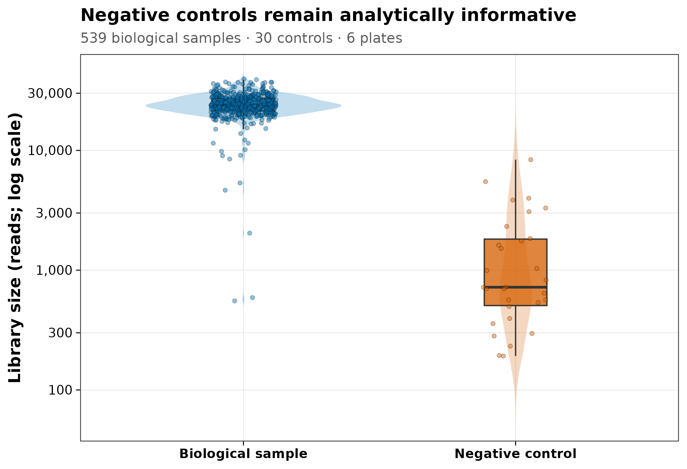
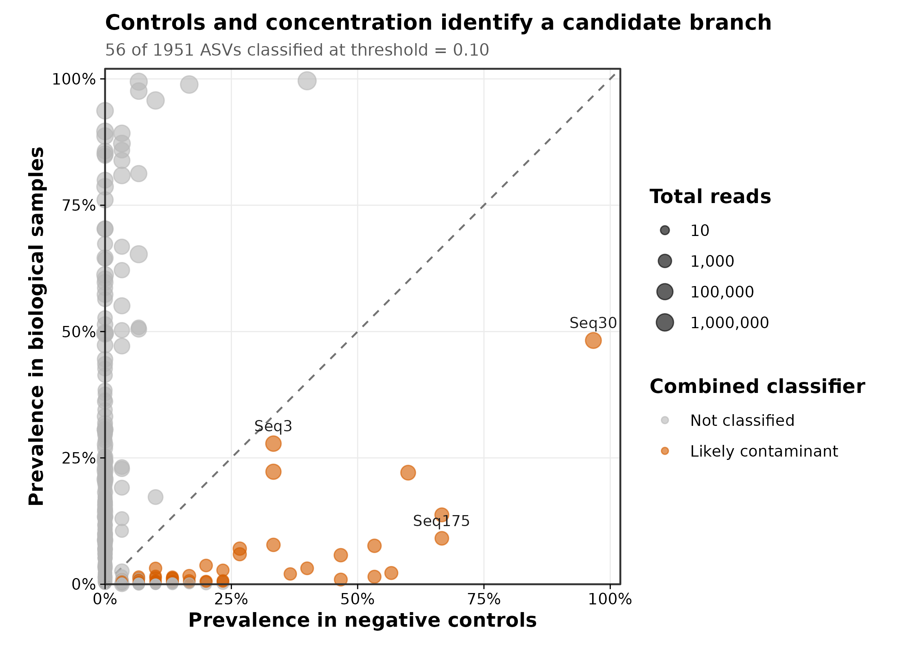
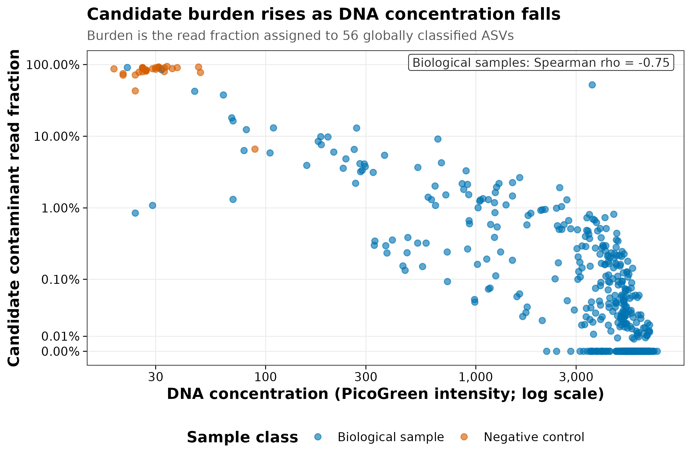
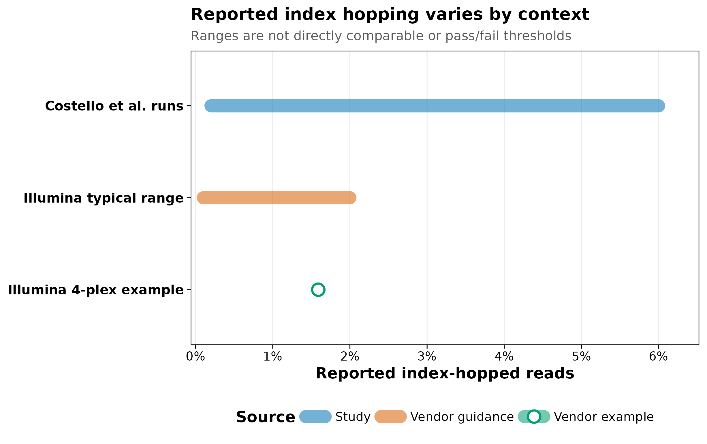

> **学习目标：**把“去污染”拆成四道可审计的门：用 field/collection/extraction blank 和阳性对照定位流程问题；用 `decontam` 的 frequency、prevalence 与 combined 证据标记候选 feature；用逐样本污染 burden 决定样本是否仍可解释；用 unique dual indexes（UDI）、index-pair matrix、lane 信息和 donor library 排查 index hopping。  
> **真实数据：**shotgun 机制锚点来自 Salter 等对纯培养 *Salmonella bongori* 连续稀释并用四种 DNA extraction kits 处理的 metagenomic experiment；统计演示使用 `decontam 1.24.0` 官方 `MUClite.rds` 导出的真实 16S V4 三件套，含 1,951 个 ASV、539 个口腔生物样本和 30 个阴性对照。前者证明 shotgun 也受 kit/reagent DNA 影响，后者用于真实执行分类器；ASV 结果不冒充 shotgun 物种谱。  
> **预计资源：**本文计算在普通笔记本上通常需 1 个 CPU、内存低于 1 GB、磁盘约 20 MB、1–3 分钟；无需服务器。真实项目的 blank、mock 和 UDI 成本应在送测前进入预算。若数据量太大，可先把 FASTQ 统一转成 sample × feature 原始计数表，再在登录节点或笔记本运行本章统计；不要把受控人源样本上传到未经授权的在线工具。

## 这一步对应论文里的哪张图 {#sec-target}

### Salter Figure 3：低生物量时，kit DNA 会压过真实 shotgun 信号

Salter 等从约 $10^8$ 个 *S. bongori* cells 起做连续十倍稀释，把同一系列分别交给四种商业 DNA extraction kits，再做 whole-genome shotgun sequencing [@salter2014contamination]。论文 Figure 3 和 Results 给出两个直接结论：

1. 随输入生物量降低，映射到 *S. bongori* reference genome 的 reads 比例在四种 kit 中都下降；
2. 到第四次稀释、约 $10^4$ 个输入 cells 时，污染在每种 kit 的结果中都成为主要部分；
3. 非 *Salmonella* reads 的 family profile 随 kit 改变，说明“同一实验室出现了同一种背景”不是唯一解释；
4. 该 $10^4$-cell 位置只属于这套纯培养、kit、建库和测序实验，不是所有样本的低生物量阈值。

```{r}
#| label: tbl-salter-shotgun
salter_evidence <- read.delim(
  "data/small/07-salter-shotgun-evidence.tsv",
  check.names = FALSE,
  stringsAsFactors = FALSE
)
knitr::kable(
  salter_evidence[, c(
    "KitCode",
    "DilutionWhereContaminationPredominated",
    "ApproximateInputSalmonellaCells",
    "ReportedNonSalmonellaProfile"
  )],
  col.names = c(
    "Kit",
    "Dilution",
    "Approximate input cells",
    "Reported non-Salmonella profile"
  ),
  caption = paste(
    "Qualitative transcription of Salter et al. Results/Figure 3;",
    "no abundance was extracted from image pixels."
  )
)
```

这组真实 shotgun 证据说明：污染 DNA 不是 marker-gene PCR 才有的问题。PCR-free shotgun 不扩增 16S，也仍会把提取试剂带入的 DNA 建库、测序并分类。

### `decontam` Figure 逻辑：空白、浓度和样本负担必须同时看

下面三张图从 `decontam` 官方真实对象重算。阴性对照的 median library size 只有 720.5 reads，生物样本为 23,956 reads；低 reads 没有让 blank 失效，反而提供了 prevalence 参照。

::: {layout-ncol=2}
{#fig-control-library}

{#fig-contaminant-prevalence}
:::

{#fig-contaminant-burden}

全体 539 个生物样本中，候选污染 read fraction 的 median 为 0.0189%，mean 为 1.093%，但 maximum 达到 90.97%。只报告“总体删除 0.73% reads”会遮住少数已经接近污染主导的样本。

### Costello 与 UDI：index hopping 不是 decontam 的另一种名字

Costello 等在 HiSeq X、HiSeq 4000/3000 和 NovaSeq 的异质实验中报告 0.2%–6% 的 index swapping range，并证明 non-redundant dual indexing 能识别和过滤意外组合 [@costello2018index]。Illumina 当前 guidance 把 patterned-flow-cell systems 的 typical range 描述为 0.1%–2%，并给出一个 4-plex PCR-free worked example 的 1.59%；这些数字依赖 library type、quality、free adapter 和 handling，不能直接比较，也不能当项目统一阈值。

{#fig-index-hopping}

::: {.callout-important title="四种证据不互相代替"}
- blank 说明流程在没有生物样本时出现了什么；
- DNA concentration 说明 feature 是否随总 DNA 增加而相对稀释；
- candidate burden 说明某个样本删完候选 feature 后是否仍有解释空间；
- UDI/index-pair audit 说明 reads 是否被分配给错误样本。

来自高生物量 donor library 的真实微生物 reads 可能不出现在 blank，也不随 recipient 的 DNA concentration 呈标准反比，因此 `decontam` 不保证识别 index hopping。
:::

## 理论：先分清污染从哪一步进入 {#sec-theory}

### 1. 观测表是多种来源的叠加

对样本 $s$ 和 feature $i$，可以把进入 feature table 的 reads 简化为：

$$
Y_{is}
=
B_{is}
+R_{ib(s)}
+C_{is}
+H_{is}
+\epsilon_{is},
$$

其中：

- $B_{is}$：真实 biological signal；
- $R_{ib(s)}$：与 kit lot、extraction plate 或实验环境相关的 reagent/laboratory background；
- $C_{is}$：孔间、建库池或测序索引造成的 cross-sample signal；
- $H_{is}$：未充分清除的 host/非目标 reads 被误分类后的贡献；
- $\epsilon_{is}$：抽样、建库、测序与分类误差。

一个函数无法从最终 taxonomy name 唯一反推这五部分。可靠策略是让每个来源在设计阶段留下可辨认的控制或 metadata。

### 2. blank 是一条定位链，不是一个名为“blank”的样本

| Control | 从哪一步开始 | 主要监测 | 不能单独排除 |
|---|---|---|---|
| Field blank | 采样现场 | 空气、器具、运输、保存 | 下游 kit 与 index 问题 |
| Collection blank | 采样操作 | swab、buffer、容器 | 采样现场之外的全部来源 |
| Extraction blank | DNA 提取 | kit/reagent、板和操作环境 | 采样阶段与 donor cross-talk |
| Library blank | 建库 | adapter、PCR/建库试剂、plate | 提取前污染 |
| Mock community | 已知组成 | recovery、bias、流程失败 | 未知环境中的所有真实 taxa |
| Alien positive control | 生态位中不应出现的对象 | carry-over、cross-talk、index bleed | 与真实 taxa 同名的污染 |

每个关键 kit lot、extraction batch 和 library plate 都需要同时出现 biological samples 与相应 controls。把所有 blanks 集中在最后一块板，会让“blank vs sample”与“最后一板 vs 前几板”完全混杂。

### 3. kitome 不是固定的属名黑名单

“kitome”是试剂盒和实验室背景中反复检出的 DNA 集合，不是一张跨项目永久有效的 taxonomy blacklist。*Ralstonia*、*Pseudomonas*、*Sphingomonas* 或 *Burkholderia* 既可能来自试剂，也可能是真实生态位成员；同一个 genus 中还可能同时存在真实 strain 与污染 strain。

按属名整列删除会带来三类错误：

- 把真实生物学信号误删；
- 把只在某个 batch 出现的污染扩展到全部批次；
- 把 strain/sequence-level 差异压成一个无法审计的 taxonomy decision。

应优先在尽可能细的 feature 层结合 blank、浓度、batch、plate position、mock 和 index evidence。若只能获得 species/genus aggregate，应把分辨率损失写入结论边界。

### 4. `decontam` 的三条统计证据

`decontam` 接受 sample × feature 的 integer abundance matrix；默认先把每个样本归一化为频率 [@davis2018decontam]。

**Frequency method**

若某污染 feature 的绝对 DNA 量近似固定，它在低 DNA 样本中的相对频率通常更高，在高 DNA 样本中被真实 DNA 稀释。该方法需要等摩尔混样前、与建库输入相对应的正数 DNA quantitation。Qubit/PicoGreen total DNA 在宿主含量很高时未必等于 microbial biomass，解释时必须保留这一限制。

**Prevalence method**

若 feature 在 sequenced negative controls 中比 biological samples 更常检出，它更符合污染模式。Extraction blanks 通常比只从 PCR 才开始的 NTC 更能代表提取阶段背景。

**Combined method**

combined 用 Fisher 方法合并 frequency 与 prevalence probability。本文主分析使用：

```r
method = "combined"
threshold = 0.10
```

`threshold = 0.10` 是拒绝“非污染 feature”零假设的分类概率阈值，不是 10% FDR，也不是 10% abundance cutoff。阈值升高会更宽松地标记 feature：本对象在 0.05、0.10、0.20 下分别标记 49、56、67 个。

### 5. index hopping 的识别对象是“索引组合”，不是 taxonomy

Multiplex sequencing 要用 i7/i5 indexes 把 pooled reads 分回样本。若 free adapter 或 cluster chemistry 导致 index switching，read 本身仍可能来自一个完全真实、高丰度的 donor organism，只是被分配给错误样本。

UDI 让每个 library 拥有不与其他 library 共享的 i7 和 i5 组合。一次单端 index hop 会形成预期表之外的组合，可进入 `Undetermined` 或被专门统计；combinatorial dual indexing 中，跳换后的组合可能恰好也是另一个合法 library，事后更难识别 [@kircher2012doubleindex; @costello2018index]。

因此要保留：

- 原始 `SampleSheet.csv` 与每个 library 的 i7/i5；
- demultiplexing software、版本、mismatch policy；
- expected 与 unexpected index-pair matrix；
- lane、pool、library preparation batch；
- 同 lane 高生物量 donor libraries；
- `Undetermined` reads 与 index quality；
- alien/mock control 在非目标样本中的 reads。

## 准备工作 {#sec-setup}

<details>
<summary><strong>展开：固定环境、真实三件套与作图函数</strong></summary>

精确复算使用 R 4.4.1、Bioconductor 3.19 和 `decontam 1.24.0`。仓库用户直接恢复 lock：

```{r}
#| eval: false
install.packages(
  "renv",
  repos = "https://cloud.r-project.org"
)
renv::restore(
  lockfile = "env/renv.lock",
  prompt = FALSE
)
```

独立安装当前 release：

```{r}
#| eval: false
install.packages(c(
  "BiocManager",
  "ggplot2",
  "scales",
  "digest",
  "jsonlite",
  "knitr"
))
BiocManager::install(
  "decontam",
  ask = FALSE,
  update = FALSE
)
```

截至 2026-07-19，Bioconductor release 3.23 提供 `decontam 1.32.0` 并对应 R 4.6；精确复算仍固定 1.24.0，因为官方 `MUClite.rds`、SHA-256 和验证结果均来自该版本。升级后应重新生成 classifier audit，而不是只改 Methods 里的版本号。

官方对象导出为：

```text
data/small/07-decontam/
├── otutab.tsv       # 1,951 features × 569 samples
├── taxonomy.tsv     # feature taxonomy
├── metadata.tsv     # controls, plate, concentration, subject, habitat
└── source_summary.json
```

`MUClite.rds` SHA-256 为：

```text
801456d5780d5f51308d04c23f4477102cc5fbe9543ffa62fad2240a99c43d62
```

三张表的来源、hash、license、Salter 转录边界与 index-hopping evidence date 见 `data/small/07-data-NOTICE.txt`。

```{r}
#| label: setup
library(decontam)
library(ggplot2)

stopifnot(
  identical(
    as.character(utils::packageVersion("decontam")),
    "1.24.0"
  )
)
set.seed(20260719)

pal_pub <- c(
  "#0072B2",
  "#D55E00",
  "#009E73",
  "#CC79A7",
  "#E69F00",
  "#56B4E9",
  "#F0E442",
  "#999999"
)

scale_color_pub <- function(...) {
  ggplot2::scale_color_manual(
    values = pal_pub,
    ...
  )
}

scale_fill_pub <- function(...) {
  ggplot2::scale_fill_manual(
    values = pal_pub,
    ...
  )
}

theme_pub <- function(base_size = 11) {
  ggplot2::theme_bw(
    base_size = base_size,
    base_family = "sans"
  ) +
    ggplot2::theme(
      panel.grid.minor = ggplot2::element_blank(),
      panel.grid.major = ggplot2::element_line(
        color = "grey92",
        linewidth = 0.3
      ),
      axis.text = ggplot2::element_text(color = "black"),
      axis.ticks = ggplot2::element_line(
        color = "black",
        linewidth = 0.3
      ),
      legend.key = ggplot2::element_blank(),
      legend.background = ggplot2::element_rect(
        fill = scales::alpha("white", 0.8),
        color = NA
      )
    )
}

save_pub <- function(
  plot,
  file_base,
  width = 174,
  height = 118,
  units = "mm",
  dpi = 350
) {
  dir.create(
    dirname(file_base),
    recursive = TRUE,
    showWarnings = FALSE
  )
  ggplot2::ggsave(
    paste0(file_base, ".pdf"),
    plot,
    width = width,
    height = height,
    units = units,
    device = grDevices::cairo_pdf
  )
  ggplot2::ggsave(
    paste0(file_base, ".png"),
    plot,
    width = width,
    height = height,
    units = units,
    dpi = dpi,
    bg = "white"
  )
  ggplot2::ggsave(
    paste0(file_base, ".tiff"),
    plot,
    width = width,
    height = height,
    units = units,
    dpi = dpi,
    compression = "lzw",
    bg = "white"
  )
  invisible(plot)
}
```

独立阅读时，上面代码块已经给出全部依赖和作图函数；整仓库用户也可使用内容一致的 `R/theme_pub.R`。

</details>

## 可复制代码：从 controls 到四道审计门 {#sec-code}

### 1. 读取三件套并锁定 byte-level lineage

```{r}
#| label: read-validate-data
data_dir <- "data/small/07-decontam"

expected_hashes <- c(
  otutab = paste0(
    "45a093f93a1e9f83e341788c04317488",
    "2142c91a27b409ff2b01d2696d83624f"
  ),
  taxonomy = paste0(
    "da5da1ec8b56b516056457edfd1758db",
    "57044bcf3cf7de2caef1bf5a809fcc0a"
  ),
  metadata = paste0(
    "e180f70324eb87cebdfb53b6ede10cf2",
    "79a15a4e0124e82eda6d79c0d64344f2"
  )
)

input_paths <- c(
  otutab = file.path(data_dir, "otutab.tsv"),
  taxonomy = file.path(data_dir, "taxonomy.tsv"),
  metadata = file.path(data_dir, "metadata.tsv")
)
observed_hashes <- vapply(
  input_paths,
  function(path) {
    digest::digest(
      file = path,
      algo = "sha256",
      serialize = FALSE
    )
  },
  character(1)
)
stopifnot(identical(observed_hashes, expected_hashes))

read_keyed_table <- function(path, key_name) {
  x <- read.delim(
    path,
    check.names = FALSE,
    stringsAsFactors = FALSE
  )
  stopifnot(
    identical(colnames(x)[[1]], key_name),
    !anyDuplicated(x[[1]])
  )
  rownames(x) <- x[[1]]
  x[[1]] <- NULL
  x
}

otutab_df <- read_keyed_table(
  input_paths[["otutab"]],
  "FeatureID"
)
taxonomy <- read_keyed_table(
  input_paths[["taxonomy"]],
  "FeatureID"
)
metadata <- read_keyed_table(
  input_paths[["metadata"]],
  "SampleID"
)

otutab <- as.matrix(otutab_df)
storage.mode(otutab) <- "numeric"
metadata$IsNegative <- as.logical(metadata$IsNegative)
metadata$PlateNumber <- factor(metadata$PlateNumber)

stopifnot(
  identical(rownames(otutab), rownames(taxonomy)),
  identical(colnames(otutab), rownames(metadata)),
  all(otutab >= 0),
  all(otutab == floor(otutab)),
  all(colSums(otutab) > 0),
  all(metadata$quant_reading > 0),
  !anyNA(metadata$IsNegative)
)

dim(otutab)
otutab[1:5, 1:5]
taxonomy[1:5, , drop = FALSE]
head(metadata)
```

feature table 在文件中是 feature × sample，而 `isContaminant()` 需要 sample × feature，因此后面必须转置。不要仅凭矩阵维度猜方向，应同时核对 feature IDs、sample IDs、taxonomy 与 metadata。

### 2. 审计每块板是否同时有样本和对照

```{r}
#| label: control-layout
control_by_plate <- with(
  metadata,
  table(PlateNumber, IsNegative)
)
control_by_plate

stopifnot(
  nrow(otutab) == 1951L,
  ncol(otutab) == 569L,
  sum(!metadata$IsNegative) == 539L,
  sum(metadata$IsNegative) == 30L,
  nlevels(metadata$PlateNumber) == 6L,
  all(control_by_plate[, "TRUE"] == 5L),
  all(control_by_plate[, "FALSE"] > 0L)
)
```

每块板都有 5 个阴性对照，这使 plate-aware sensitivity analysis 可识别。539 个口腔生物样本来自重复 subject/site；它们可用于样本级污染判定，却不代表后续疾病统计有 539 个独立个体。

先生成 sample QC：

```{r}
#| label: sample-qc
sample_qc <- data.frame(
  SampleID = rownames(metadata),
  SampleClass = factor(
    ifelse(
      metadata$IsNegative,
      "Negative control",
      "Biological sample"
    ),
    levels = c(
      "Biological sample",
      "Negative control"
    )
  ),
  Plate = metadata$PlateNumber,
  DNAConcentration = metadata$quant_reading,
  LibrarySize = colSums(otutab),
  stringsAsFactors = FALSE
)

library_summary <- do.call(
  rbind,
  lapply(
    split(
      sample_qc$LibrarySize,
      sample_qc$SampleClass
    ),
    function(x) {
      data.frame(
        N = length(x),
        Minimum = min(x),
        Median = median(x),
        Maximum = max(x)
      )
    }
  )
)
library_summary
```

阴性对照的 reads 少是预期结果，不是删除理由。只有让 controls 经过同一 feature calling/classification pipeline，才能比较 prevalence。

### 3. 分开运行 frequency、prevalence 与 combined

```{r}
#| label: run-decontam
seqtab <- t(otutab)
is_negative <- metadata[
  rownames(seqtab),
  "IsNegative"
]
dna_concentration <- metadata[
  rownames(seqtab),
  "quant_reading"
]

stopifnot(
  identical(rownames(seqtab), rownames(metadata)),
  identical(colnames(seqtab), rownames(taxonomy))
)

contam_frequency <- decontam::isContaminant(
  seqtab,
  method = "frequency",
  conc = dna_concentration,
  threshold = 0.10
)
contam_prevalence <- decontam::isContaminant(
  seqtab,
  method = "prevalence",
  neg = is_negative,
  threshold = 0.10
)
contam_combined <- decontam::isContaminant(
  seqtab,
  method = "combined",
  conc = dna_concentration,
  neg = is_negative,
  threshold = 0.10
)

classifier_summary <- data.frame(
  Method = c(
    "Frequency",
    "Prevalence",
    "Global combined"
  ),
  Threshold = 0.10,
  ClassifiedFeatures = c(
    sum(contam_frequency$contaminant),
    sum(contam_prevalence$contaminant),
    sum(contam_combined$contaminant)
  )
)
classifier_summary
```

frequency、prevalence 和 global combined 分别标记 58、124 和 56 个 ASV。Prevalence 数量更大不代表它“更好”：两种方法回答的证据不同，combined 也不是两组 feature 的简单并集。

### 4. 把 plate-aware 结果作为敏感性分析

```{r}
#| label: batch-sensitivity
contam_batch <- decontam::isContaminant(
  seqtab,
  method = "combined",
  conc = dna_concentration,
  neg = is_negative,
  batch = metadata[
    rownames(seqtab),
    "PlateNumber"
  ],
  batch.combine = "minimum",
  threshold = 0.10
)

batch_comparison <- table(
  GlobalCombined = contam_combined$contaminant,
  PlateAware = contam_batch$contaminant
)
batch_comparison

data.frame(
  Global = sum(contam_combined$contaminant),
  PlateAware = sum(contam_batch$contaminant),
  Shared = sum(
    contam_combined$contaminant &
      contam_batch$contaminant
  )
)
```

全局 combined 标记 56 个，按 `PlateNumber` 独立判定并以 `minimum` 合并后标记 47 个，共有 41 个。主分析与敏感性分析不完全一致，意味着 batch strategy 是结论的一部分，不能在 Methods 中省略。

### 5. 预先检查 threshold sensitivity

```{r}
#| label: threshold-sensitivity
thresholds <- c(0.05, 0.10, 0.20)
threshold_sensitivity <- do.call(
  rbind,
  lapply(
    thresholds,
    function(threshold) {
      fit <- if (threshold == 0.10) {
        contam_combined
      } else {
        decontam::isContaminant(
          seqtab,
          method = "combined",
          conc = dna_concentration,
          neg = is_negative,
          threshold = threshold
        )
      }
      data.frame(
        Threshold = threshold,
        ClassifiedFeatures = sum(fit$contaminant)
      )
    }
  )
)
threshold_sensitivity
```

这里不根据差异分析是否“更漂亮”选择 threshold。可以在 protocol 中指定 0.10 为主分析、0.05/0.20 为 sensitivity，然后检查主要 biological conclusion 是否稳定。

### 6. 生成 feature-level 完整判定表

```{r}
#| label: feature-audit
negative_prevalence <- colMeans(
  seqtab[is_negative, , drop = FALSE] > 0
)
biological_prevalence <- colMeans(
  seqtab[!is_negative, , drop = FALSE] > 0
)
total_feature_reads <- colSums(seqtab)

contaminant_audit <- data.frame(
  FeatureID = rownames(taxonomy),
  taxonomy,
  NegativePrevalence = negative_prevalence,
  BiologicalPrevalence = biological_prevalence,
  TotalReads = total_feature_reads,
  FrequencyP = contam_frequency$p,
  PrevalenceP = contam_prevalence$p,
  CombinedFrequencyP = contam_combined$p.freq,
  CombinedPrevalenceP = contam_combined$p.prev,
  CombinedP = contam_combined$p,
  FrequencyContaminant = (
    contam_frequency$contaminant
  ),
  PrevalenceContaminant = (
    contam_prevalence$contaminant
  ),
  GlobalCombinedContaminant = (
    contam_combined$contaminant
  ),
  PlateCombinedContaminant = (
    contam_batch$contaminant
  ),
  check.names = FALSE
)

contaminant_ids <- contaminant_audit$FeatureID[
  contaminant_audit$GlobalCombinedContaminant
]

contaminant_audit[
  order(contaminant_audit$CombinedP),
  c(
    "FeatureID",
    "Family",
    "Genus",
    "NegativePrevalence",
    "BiologicalPrevalence",
    "CombinedP",
    "GlobalCombinedContaminant",
    "PlateCombinedContaminant"
  )
][1:10, ]
```

分类名只是注释列，不是删除依据。判定表必须保留 raw scores、两种证据、batch sensitivity 与 feature ID，才能在 threshold 或 taxonomy database 改变后复审。

### 7. 计算逐样本 candidate burden

```{r}
#| label: sample-burden
library_size <- colSums(otutab)
contaminant_reads <- colSums(
  otutab[contaminant_ids, , drop = FALSE]
)

sample_burden <- data.frame(
  SampleID = colnames(otutab),
  SampleClass = sample_qc$SampleClass,
  Plate = sample_qc$Plate,
  Subject = metadata$Subject,
  Habitat = metadata$Habitat,
  DNAConcentration = sample_qc$DNAConcentration,
  LibrarySize = library_size,
  ContaminantReads = contaminant_reads,
  ContaminantFraction = (
    contaminant_reads / library_size
  ),
  stringsAsFactors = FALSE
)

burden_summary <- do.call(
  rbind,
  lapply(
    split(
      sample_burden$ContaminantFraction,
      sample_burden$SampleClass
    ),
    function(x) {
      data.frame(
        Minimum = min(x),
        Median = median(x),
        Mean = mean(x),
        Maximum = max(x)
      )
    }
  )
)
burden_summary

biological_rows <- (
  sample_burden$SampleClass == "Biological sample"
)
burden_correlation <- cor.test(
  sample_burden$ContaminantFraction[
    biological_rows
  ],
  sample_burden$DNAConcentration[
    biological_rows
  ],
  method = "spearman",
  exact = FALSE
)
burden_correlation
```

生物样本 candidate burden 与 DNA concentration 的 Spearman $\rho=-0.751$，$P=7.28\times10^{-99}$。阴性对照的 median candidate fraction 为 86.96%；生物样本 median 只有 0.0189%，但最大值 90.97%。这说明 feature filtering 与 sample exclusion 是两个独立决策。

### 8. 导出过滤后三件套，同时保留原始 controls

```{r}
#| label: export-filtered-triad
biological_ids <- rownames(metadata)[
  !metadata$IsNegative
]
kept_features <- setdiff(
  rownames(otutab),
  contaminant_ids
)

otutab_filtered <- otutab[
  kept_features,
  biological_ids,
  drop = FALSE
]
taxonomy_filtered <- taxonomy[
  kept_features,
  ,
  drop = FALSE
]
metadata_filtered <- metadata[
  biological_ids,
  ,
  drop = FALSE
]

stopifnot(
  identical(
    rownames(otutab_filtered),
    rownames(taxonomy_filtered)
  ),
  identical(
    colnames(otutab_filtered),
    rownames(metadata_filtered)
  ),
  all(colSums(otutab_filtered) > 0)
)

biological_reads_before <- sum(
  otutab[, biological_ids, drop = FALSE]
)
biological_reads_after <- sum(otutab_filtered)
biological_reads_removed <- (
  1 -
    biological_reads_after /
      biological_reads_before
)

filter_summary <- data.frame(
  InputFeatures = nrow(otutab),
  RemovedFeatures = length(contaminant_ids),
  OutputFeatures = nrow(otutab_filtered),
  BiologicalSamples = ncol(otutab_filtered),
  BiologicalReadsRemoved = biological_reads_removed
)
filter_summary
```

删除 56 个候选 feature 后保留 1,895 个 feature 和 539 个 biological samples；候选 feature 占所有生物样本 reads 的加权比例为 0.730%。原始三件套、controls 和完整 classifier output 不能被覆盖。

```{r}
#| label: write-audit-files
write_keyed_table <- function(
  x,
  key_name,
  path
) {
  out <- data.frame(
    setNames(list(rownames(x)), key_name),
    x,
    check.names = FALSE
  )
  write.table(
    out,
    path,
    sep = "\t",
    quote = FALSE,
    row.names = FALSE,
    na = ""
  )
}

result_dir <- "results/07-contamination"
dir.create(
  result_dir,
  recursive = TRUE,
  showWarnings = FALSE
)

write.table(
  contaminant_audit,
  file.path(
    result_dir,
    "contaminant-classification.tsv"
  ),
  sep = "\t",
  quote = FALSE,
  row.names = FALSE,
  na = ""
)
write.table(
  sample_burden,
  file.path(
    result_dir,
    "sample-contamination-burden.tsv"
  ),
  sep = "\t",
  quote = FALSE,
  row.names = FALSE,
  na = ""
)
write.table(
  threshold_sensitivity,
  file.path(
    result_dir,
    "threshold-sensitivity.tsv"
  ),
  sep = "\t",
  quote = FALSE,
  row.names = FALSE,
  na = ""
)
write_keyed_table(
  otutab_filtered,
  "FeatureID",
  file.path(result_dir, "otutab.filtered.tsv")
)
write_keyed_table(
  taxonomy_filtered,
  "FeatureID",
  file.path(result_dir, "taxonomy.filtered.tsv")
)
write_keyed_table(
  metadata_filtered,
  "SampleID",
  file.path(result_dir, "metadata.filtered.tsv")
)
```

### 9. 在送测前审计 UDI，在收数后索要 index-pair matrix

下面的检查针对真实 `SampleSheet.csv`，不构造示例 index matrix。UDI 设计中，同一 pool 内每个 `index`、每个 `index2` 和完整 pair 都应唯一；若测序中心采用了其他经过验证的 indexing strategy，应把该例外写入 protocol。

```{python}
#| eval: false
import csv
from collections import Counter
from pathlib import Path

sample_sheet = Path("metadata/SampleSheet.csv")
rows = []
in_data = False

with sample_sheet.open(encoding="utf-8-sig") as handle:
    for raw in handle:
        line = raw.rstrip("\n")
        if line.strip() == "[Data]":
            in_data = True
            header = None
            continue
        if not in_data or not line.strip():
            continue
        if header is None:
            header = next(csv.reader([line]))
            continue
        values = next(csv.reader([line]))
        rows.append(dict(zip(header, values)))

required = {"Sample_ID", "index", "index2"}
assert rows and required.issubset(rows[0])

pairs = [(x["index"], x["index2"]) for x in rows]
i7 = [x["index"] for x in rows]
i5 = [x["index2"] for x in rows]

def duplicates(values):
    return sorted(
        value
        for value, count in Counter(values).items()
        if count > 1
    )

audit = {
    "libraries": len(rows),
    "duplicate_pairs": duplicates(pairs),
    "reused_i7": duplicates(i7),
    "reused_i5": duplicates(i5),
}
print(audit)

assert not audit["duplicate_pairs"]
assert not audit["reused_i7"]
assert not audit["reused_i5"]
```

收数后向测序中心索要或自行导出：

```text
demultiplexing/
├── SampleSheet.csv
├── demultiplex_stats.csv
├── index_pair_counts.tsv
├── index_quality_by_cycle.tsv
├── undetermined_index_counts.tsv
└── lane_pool_manifest.tsv
```

对于 UDI，`index_pair_counts.tsv` 至少应包含 observed i7、observed i5、read count、expected pair、assigned sample 和 lane。先计算 unexpected pair fraction，再按 donor library、free-adapter/cleanup、index quality、mismatch allowance 和 plate/pool layout 解释。不要把厂商 0.1%–2% 或 Costello 0.2%–6% 直接设成自己的 pass/fail gate。

## 审计与升级：忠实复现之后，今天还要补什么 {#sec-audit}

### 1. 忠实复现的边界

本文的可执行分类器保持以下固定条件：

- R 4.4.1；
- Bioconductor 3.19；
- `decontam 1.24.0`；
- `MUClite.rds` 的 SHA-256 固定；
- global combined、`threshold = 0.10` 为主分析；
- `PlateNumber` + `batch.combine = "minimum"` 为 sensitivity；
- seed 20260719；
- 原始 controls 和 classifier scores 全部保留。

官方对象是 16S V4 ASV 数据。`decontam` 的软件适用范围包括 marker-gene 和 metagenomic feature tables，但本对象的 56 个 ASV 不能被解释成 shotgun taxa、genes 或 MAGs。Shotgun 污染机制由 Salter 的真实 whole-genome experiment 锚定。

### 2. 当前 release 与验证 release 要分开写

截至 2026-07-19，Bioconductor release 3.23 的 `decontam` 为 1.32.0；本文结果仍由 1.24.0 产生。升级时至少重新核对：

- `isContaminant()` 参数与默认值；
- package NEWS 中的模型或 batch change；
- 同一固定输入的 feature IDs、scores 和 binary calls；
- threshold sensitivity；
- Figure 与 Methods 数值；
- `sessionInfo()` 和新的 lockfile。

“用了最新版”不能替代版本验证；“为了复现用旧版”也不能假装旧版仍是当前软件。

### 3. Shotgun feature table 要换分辨率，不换证据逻辑

| Shotgun object | 推荐输入 | 主要限制 |
|---|---|---|
| Taxonomic profile | 每样本 marker/classified raw read counts | species aggregate 可能合并真实与污染 strain |
| Gene family/ARG | 每样本 assigned-read counts | conserved genes 易受 ambiguous mapping 影响 |
| Contig | mapped read counts | 稀疏、长度和 assembly batch 影响 prevalence |
| MAG | mapped read counts或有验证的 integer abundance | 多个 bin 可能共享污染 contig；先过 MAG QC |
| Virus/vOTU | mapped read counts | controls 中低丰度病毒与 reagent sequence 难区分 |

`isContaminant()` 文档要求 integer abundance matrix。不要把 TPM、CPM、relative percentage 或 coverage breadth 随意取整后声称等价；优先回到未归一化 assigned-read counts，并保留同一分母下的 library size。若只能获得连续 abundance，应先验证方法假设或改用明确支持该数据类型的模型。

### 4. 把浓度从“总 DNA”升级为 endpoint-relevant load

PicoGreen/Qubit 测的是总 dsDNA；高宿主样本中，它可能主要反映 human DNA。更强的设计可同时记录：

- total dsDNA concentration；
- microbial 16S/18S/gene copies by qPCR/ddPCR；
- flow cytometry cells；
- spike-in recovery；
- post-host-depletion library-compatible yield；
- non-host read fraction。

这些量不必全部塞进一个 classifier。它们用于判断 frequency assumption 是否合理，并解释某个样本为什么在低总量或高宿主背景下异常。

### 5. 用 negative、positive 与 alien controls 组成闭环

阴性对照能发现背景，却不能证明目标对象被正确恢复；positive mock 能测 recovery，却未必定位 kit contamination；alien control 可追踪 carry-over，却不能代表所有真实 taxa。稳妥设计至少让三者各司其职：

1. 每批 process blanks；
2. truth-known cellular mock；
3. 与研究生态位明确不重叠的 alien control；
4. 如需绝对定量，再加入位置明确的 whole-cell 或 DNA spike-in。

### 6. 样本排除规则必须在看结局前锁定

本对象的 maximum candidate burden 达 90.97%，但不存在适用于所有研究的“超过 20% 就删”规则。可预注册一个多证据 gate，例如同时考虑：

- candidate contaminant fraction；
- microbial load 与 library size；
- mock/alien control 表现；
- sample 是否处于异常 plate/pool；
- 删除候选 feature 后的 remaining information；
- threshold/batch sensitivity；
- primary endpoint 是否仍可计算。

任何排除都要输出 sample ID、指标、阈值、理由、批准人/日期和 sensitivity result。不能在病例与对照分开看完后再选择不同规则。

### 7. Index hopping 还要与 wet-lab cross-contamination 区分

UDI unexpected pairs 能直接支持 index misassignment，但“donor taxon 随高丰度样本扩散”也可能来自 extraction plate、library plate aerosol、pipetting 或 carry-over。可结合：

- plate adjacency；
- extraction/library batch；
- index-pair validity；
- lane co-membership；
- donor abundance；
- alien control；
- fragment length/insert signature；
- strain/SNV identity。

若 recipient 与 donor 共享完全一致 strain/SNV 且同 lane、出现 unexpected UDI pair，index hopping 证据更强；若只在相邻孔、expected indexes 正常，则 wet-lab cross-contamination 更值得调查。

## 出版级美化：每张图只回答一个审计问题 {#sec-polish}

### 1. Controls 的 library size

```{r}
#| label: fig-control-library
sample_colors <- c(
  "Biological sample" = "#0072B2",
  "Negative control" = "#D55E00"
)

p_library <- ggplot(
  sample_qc,
  aes(
    x = SampleClass,
    y = LibrarySize,
    fill = SampleClass
  )
) +
  geom_violin(
    width = 0.72,
    trim = FALSE,
    alpha = 0.24,
    color = NA
  ) +
  geom_boxplot(
    width = 0.23,
    outlier.shape = NA,
    alpha = 0.76,
    linewidth = 0.42
  ) +
  geom_point(
    position = position_jitter(
      width = 0.12,
      height = 0,
      seed = 20260719
    ),
    shape = 21,
    size = 1.25,
    stroke = 0.18,
    alpha = 0.45
  ) +
  scale_fill_manual(
    values = sample_colors,
    guide = "none"
  ) +
  scale_y_log10(
    breaks = c(
      100,
      300,
      1000,
      3000,
      10000,
      30000
    ),
    labels = scales::label_number(
      big.mark = ","
    )
  ) +
  labs(
    title = paste(
      "Negative controls remain",
      "analytically informative"
    ),
    subtitle = paste0(
      sum(!metadata$IsNegative),
      " biological samples · ",
      sum(metadata$IsNegative),
      " controls · ",
      nlevels(metadata$PlateNumber),
      " plates"
    ),
    x = NULL,
    y = "Library size (reads; log scale)"
  ) +
  theme_pub() +
  theme(
    plot.title = element_text(
      face = "bold",
      size = 12
    ),
    plot.subtitle = element_text(
      color = "grey35",
      size = 9.5
    ),
    axis.title.y = element_text(face = "bold"),
    axis.text.x = element_text(face = "bold")
  )

p_library
save_pub(
  p_library,
  "figures/07-control-library-size",
  width = 164,
  height = 112
)
```

### 2. Feature prevalence 与 combined classification

```{r}
#| label: fig-feature-prevalence
prevalence_plot <- transform(
  contaminant_audit,
  Classification = factor(
    ifelse(
      GlobalCombinedContaminant,
      "Likely contaminant",
      "Not classified"
    ),
    levels = c(
      "Not classified",
      "Likely contaminant"
    )
  )
)
classification_colors <- c(
  "Not classified" = "#B8B8B8",
  "Likely contaminant" = "#D55E00"
)
label_features <- intersect(
  c("Seq30", "Seq175", "Seq3"),
  prevalence_plot$FeatureID
)

p_prevalence <- ggplot(
  prevalence_plot,
  aes(
    x = NegativePrevalence,
    y = BiologicalPrevalence,
    color = Classification,
    size = TotalReads
  )
) +
  geom_abline(
    slope = 1,
    intercept = 0,
    linetype = "dashed",
    color = "grey45",
    linewidth = 0.5
  ) +
  geom_point(alpha = 0.62) +
  geom_text(
    data = prevalence_plot[
      prevalence_plot$FeatureID %in%
        label_features,
      ,
      drop = FALSE
    ],
    aes(label = FeatureID),
    size = 3.0,
    color = "grey10",
    nudge_y = 0.035,
    show.legend = FALSE
  ) +
  scale_color_manual(
    values = classification_colors,
    name = "Combined classifier"
  ) +
  scale_size_continuous(
    trans = "log10",
    range = c(0.8, 4.4),
    breaks = c(
      10,
      1000,
      100000,
      1000000
    ),
    labels = scales::label_number(
      big.mark = ","
    ),
    name = "Total reads"
  ) +
  scale_x_continuous(
    limits = c(0, 1),
    breaks = seq(0, 1, 0.25),
    labels = scales::percent_format(
      accuracy = 1
    ),
    expand = expansion(
      mult = c(0, 0.02)
    )
  ) +
  scale_y_continuous(
    limits = c(0, 1),
    breaks = seq(0, 1, 0.25),
    labels = scales::percent_format(
      accuracy = 1
    ),
    expand = expansion(
      mult = c(0, 0.02)
    )
  ) +
  coord_equal(clip = "off") +
  labs(
    title = paste(
      "Controls and concentration identify",
      "a candidate branch"
    ),
    subtitle = paste0(
      length(contaminant_ids),
      " of ",
      nrow(contaminant_audit),
      " ASVs classified at threshold = 0.10"
    ),
    x = "Prevalence in negative controls",
    y = "Prevalence in biological samples"
  ) +
  theme_pub() +
  theme(
    plot.title = element_text(
      face = "bold",
      size = 12
    ),
    plot.subtitle = element_text(
      color = "grey35",
      size = 9.3
    ),
    axis.title = element_text(face = "bold"),
    legend.position = "right",
    legend.title = element_text(face = "bold"),
    plot.margin = margin(8, 10, 8, 8)
  )

p_prevalence
save_pub(
  p_prevalence,
  "figures/07-contaminant-prevalence",
  width = 180,
  height = 128
)
```

虚线表示两类样本 prevalence 相等；虚线下方只说明 control prevalence 更高。combined 还加入 frequency evidence，因此不能用“在虚线下方”替代 classifier score。

### 3. Sample burden 与 DNA concentration

```{r}
#| label: fig-sample-burden
rho_label <- sprintf(
  "Biological samples: Spearman rho = %.2f",
  unname(burden_correlation$estimate)
)

p_burden <- ggplot(
  sample_burden,
  aes(
    x = DNAConcentration,
    y = ContaminantFraction,
    color = SampleClass
  )
) +
  geom_point(
    alpha = 0.62,
    size = 1.8
  ) +
  scale_color_manual(
    values = sample_colors,
    name = "Sample class"
  ) +
  scale_x_log10(
    labels = scales::label_number(
      big.mark = ","
    )
  ) +
  scale_y_continuous(
    trans = scales::pseudo_log_trans(
      base = 10,
      sigma = 0.0001
    ),
    breaks = c(
      0,
      0.0001,
      0.001,
      0.01,
      0.1,
      1
    ),
    labels = scales::percent_format(
      accuracy = 0.01
    ),
    limits = c(0, 1)
  ) +
  annotate(
    "label",
    x = Inf,
    y = Inf,
    label = rho_label,
    hjust = 1.04,
    vjust = 1.25,
    size = 3.1,
    label.size = 0.25,
    fill = scales::alpha(
      "white",
      0.86
    ),
    color = "grey15"
  ) +
  labs(
    title = paste(
      "Candidate burden rises as",
      "DNA concentration falls"
    ),
    subtitle = paste0(
      "Burden is the read fraction assigned to ",
      length(contaminant_ids),
      " globally classified ASVs"
    ),
    x = paste(
      "DNA concentration",
      "(PicoGreen intensity; log scale)"
    ),
    y = paste(
      "Candidate contaminant",
      "read fraction"
    )
  ) +
  theme_pub() +
  theme(
    plot.title = element_text(
      face = "bold",
      size = 12
    ),
    plot.subtitle = element_text(
      color = "grey35",
      size = 9.3
    ),
    axis.title = element_text(face = "bold"),
    legend.position = "bottom",
    legend.title = element_text(face = "bold")
  ) +
  guides(
    color = guide_legend(
      nrow = 1,
      byrow = TRUE
    )
  )

p_burden
save_pub(
  p_burden,
  "figures/07-contaminant-burden",
  width = 176,
  height = 118
)
```

### 4. Index-hopping evidence plot

```{r}
#| label: fig-index-evidence
index_evidence <- read.delim(
  "data/small/07-index-hopping-evidence.tsv",
  check.names = FALSE,
  stringsAsFactors = FALSE,
  na.strings = c("", "NA")
)
stopifnot(
  nrow(index_evidence) == 3L,
  !any(index_evidence$DirectlyComparable)
)

index_evidence$DisplayLabel <- factor(
  index_evidence$DisplayLabel,
  levels = rev(index_evidence$DisplayLabel)
)
source_colors <- c(
  "Peer-reviewed study" = "#0072B2",
  "Vendor guidance" = "#D55E00",
  "Vendor worked example" = "#009E73"
)

p_index <- ggplot(
  index_evidence,
  aes(
    y = DisplayLabel,
    color = SourceType
  )
) +
  geom_segment(
    aes(
      x = LowerPercent,
      xend = UpperPercent,
      yend = DisplayLabel
    ),
    linewidth = 4.4,
    alpha = 0.55,
    lineend = "round",
    na.rm = TRUE
  ) +
  geom_point(
    data = index_evidence[
      !is.na(index_evidence$PointPercent),
      ,
      drop = FALSE
    ],
    aes(x = PointPercent),
    shape = 21,
    fill = "white",
    size = 3.4,
    stroke = 1.1
  ) +
  scale_color_manual(
    values = source_colors,
    labels = c(
      "Peer-reviewed study" = "Study",
      "Vendor guidance" = "Vendor guidance",
      "Vendor worked example" = "Vendor example"
    ),
    name = "Source"
  ) +
  scale_x_continuous(
    limits = c(0, 6.4),
    breaks = 0:6,
    labels = function(x) paste0(x, "%"),
    expand = expansion(
      mult = c(0.01, 0.02)
    )
  ) +
  labs(
    title = paste(
      "Reported index hopping varies",
      "by context"
    ),
    subtitle = paste(
      "Ranges are not directly comparable",
      "or pass/fail thresholds"
    ),
    x = "Reported index-hopped reads",
    y = NULL
  ) +
  theme_pub() +
  theme(
    plot.title = element_text(
      face = "bold",
      size = 12
    ),
    plot.subtitle = element_text(
      color = "grey35",
      size = 9.3
    ),
    axis.title.x = element_text(face = "bold"),
    axis.text.y = element_text(
      face = "bold",
      size = 9.3
    ),
    legend.position = "bottom",
    legend.title = element_text(face = "bold"),
    panel.grid.major.y = element_blank()
  ) +
  guides(
    color = guide_legend(
      nrow = 1,
      byrow = TRUE
    )
  )

p_index
save_pub(
  p_index,
  "figures/07-index-hopping-evidence",
  width = 178,
  height = 112
)
```

四张图全部使用英文图内文字，并同时导出 editable PDF、网页/公众号 PNG 和 350 dpi LZW-TIFF。主文图注必须写明 assay、control count、classifier、threshold、batch strategy 和 evidence boundary。

## 常见坑：审稿人会追问什么 {#sec-pitfalls}

::: {.callout-caution title="最常见的十二个污染控制漏洞"}
1. **只写“设置了 blank”。** 没写 field、collection、extraction 还是 library blank，也没写每批数量。
2. **对照没有进入 sequencing。** 没有同一 feature table，就不能做 prevalence comparison。
3. **先按低 reads 删除 blanks。** 这会直接丢掉最有价值的背景证据。
4. **所有 blanks 在一个 batch。** blank status 与 batch 完全混杂，无法代表其他 lot/plate。
5. **用 kitome 属名黑名单删除。** 同名 taxon 可能是真实成员，taxonomy 不能替代实验内证据。
6. **把 `threshold = 0.10` 写成 10% FDR。** 它是分类 probability threshold。
7. **只报删除 feature 数。** 没有逐样本 burden，就看不到少数被污染主导的样本。
8. **把本例 56 个 ASV 当 shotgun 黑名单。** MUClite 是真实 16S V4 对象，feature IDs 不可迁移。
9. **把总 DNA 当 microbial load。** 高宿主样本中 Qubit/PicoGreen 可能主要测到 human DNA。
10. **认为 decontam 会抓住 index hopping。** donor reads 可能不出现在 blanks，也不满足 frequency pattern。
11. **只记录 sample index pair，不保留 unexpected pairs。** 没有 index matrix 就无法量化 UDI 过滤证据。
12. **看完病例—对照结果再删样本。** 排除规则和 sensitivity 必须预先规定并完整留痕。
:::

::: {.callout-warning title="没有阴性对照，也没有浓度数据怎么办"}
不能从 taxonomy 名称可靠重建污染来源。可以做 plate、batch、library size、donor-lane、strain identity 和公开背景的 sensitivity audit，并弱化结论；这不等价于真实 blanks。若 primary signal 只在低生物量样本出现、又与 batch 或 kit lot 重合，应把研究定位为 exploratory，并在独立批次重新采样验证。
:::

::: {.callout-note title="阴性对照不是生物学零组"}
Blanks 用于过程监测，不能作为健康/环境 control 参与 alpha diversity、PERMANOVA 或 differential abundance。污染判定完成后应保留 controls 的审计文件，但从 biological inference matrix 中移除。
:::

## 这段 Methods 怎么写 {#sec-methods}

### Shotgun 项目的英文模板

> **Contamination controls and feature-level screening.** Field/collection blanks, extraction blanks, library blanks, and truth-known positive controls were processed alongside biological specimens as applicable. Each extraction batch and library-preparation plate contained [number and type] controls. DNA was quantified using [assay] before pooling, and [microbial-load assay] was recorded when available. Negative controls were retained through read processing and feature quantification. Candidate contaminants were identified using `decontam` version [version] with the [frequency/prevalence/combined] method, `normalize = [TRUE/FALSE]`, a classification threshold of [threshold], and [pooled/batch-specific] inference using [batch variable and batch.combine]. Input comprised unnormalized [taxonomic marker/gene/MAG/vOTU assigned-read] counts with samples as rows and features as columns. Feature-level scores, control prevalence, biological prevalence, taxonomy, and batch sensitivity were retained. Candidate contaminant read fractions were calculated per sample; samples were excluded only under the prespecified rule [rule], and threshold/batch sensitivity analyses were reported.

> **Index misassignment audit.** Libraries were prepared using [UDI kit and version], with unique i7 and i5 sequences within each pool. Demultiplexing was performed with [software version] using [index mismatch policy]. We retained the SampleSheet, lane/pool manifest, index-quality metrics, expected and unexpected index-pair counts, and undetermined-index counts. Unexpected UDI combinations represented [x%] of indexed reads. Potential cross-sample transfer was evaluated against lane co-membership, donor-library abundance, plate position, mock/alien controls, and [strain/SNV evidence]. Index-pair evidence was analyzed separately from reagent-contaminant classification.

### 本次可执行演示的实写

> **Worked classifier audit.** We analyzed the checksum-locked `MUClite.rds` export distributed with `decontam` 1.24.0 under R 4.4.1 and Bioconductor 3.19. The object contained 1,951 16S V4 ASVs from 539 biological oral samples and 30 sequenced negative controls, with five controls on each of six plates. PicoGreen fluorescence (`quant_reading`) was used as the concentration variable. Global combined frequency–prevalence inference at `threshold = 0.10` classified 56 ASVs. Plate-aware combined inference with `PlateNumber` and `batch.combine = "minimum"` classified 47 ASVs, of which 41 overlapped the global set. Global candidates accounted for 0.730% of reads across biological samples; the per-sample candidate fraction had a median of 0.0189% and a maximum of 90.97%. Candidate burden was inversely associated with concentration (Spearman $\rho=-0.751$, $P=7.28\times10^{-99}$). The original controls, unfiltered triad, classifier scores, sample burdens, and threshold sensitivity results were retained.

这段 worked example 必须写明“16S V4”，不能因它出现在 shotgun 教程中就改成 metagenomic species。换成真实 shotgun 数据后，再把 ASV 改成实际 feature object 与单位。

## 换成你自己的数据怎么做 {#sec-own-data}

### 1. 送样前先补齐 controls 与 metadata

最低 metadata 建议：

| Column | 类型 | 作用 |
|---|---|---|
| `SampleID` | character | 全流程唯一主键 |
| `IsNegative` | logical | 阴性过程对照 |
| `ControlType` | factor | Field/collection/extraction/library |
| `DNAConcentration` | numeric | 混样前正数定量 |
| `MicrobialLoad` | numeric | qPCR/ddPCR/cells，可为空但要说明 |
| `ExtractionBatch` | factor | kit lot/提取板 |
| `LibraryPlate` | factor | 建库板 |
| `PlateRow`, `PlateColumn` | factor/integer | 邻孔审计 |
| `SequencingRun`, `Lane`, `Pool` | factor | 测序结构 |
| `IndexI7`, `IndexI5` | character | UDI/index-pair 审计 |
| `SubjectID` | factor | 独立生物单位 |
| `PrimaryEndpoint` | factor/character | 决定失败规则 |

病例和对照必须跨关键 batch 随机分布；controls 也要跨 batch。若同一 subject 多时间点或多部位，污染识别可在 sample level 运行，生物学检验仍要按 repeated-measures design 建模。

### 2. 把 shotgun 结果整理成 integer count matrix

标准输入：

```text
your_data/
├── feature_counts.tsv     # feature × sample, integer assigned reads
├── feature_annotation.tsv # same feature IDs
├── metadata.tsv           # same sample IDs
├── SampleSheet.csv
└── index_pair_counts.tsv
```

读取后先做严格对齐：

```{r}
#| eval: false
counts <- read.delim(
  "your_data/feature_counts.tsv",
  row.names = 1,
  check.names = FALSE
)
annotation <- read.delim(
  "your_data/feature_annotation.tsv",
  row.names = 1,
  check.names = FALSE
)
metadata <- read.delim(
  "your_data/metadata.tsv",
  row.names = 1,
  check.names = FALSE
)

counts <- as.matrix(counts)
storage.mode(counts) <- "numeric"

stopifnot(
  identical(rownames(counts), rownames(annotation)),
  identical(colnames(counts), rownames(metadata)),
  all(counts >= 0),
  all(counts == floor(counts)),
  all(colSums(counts) > 0),
  is.logical(metadata$IsNegative)
)
```

若工具只输出 relative abundance，应回到 marker/assigned reads 或保留能证明等深度和 `normalize = FALSE` 合理性的原始数据；不要把百分比乘 100、四舍五入成“counts”。

### 3. 根据现有证据选择方法

```{r}
#| eval: false
seqtab <- t(counts)

# 同时有正数 concentration 和 sequenced blanks
fit_combined <- decontam::isContaminant(
  seqtab,
  method = "combined",
  conc = metadata$DNAConcentration,
  neg = metadata$IsNegative,
  batch = metadata$ExtractionBatch,
  batch.combine = "minimum",
  threshold = 0.10,
  normalize = TRUE
)

# 只有 sequenced blanks
fit_prevalence <- decontam::isContaminant(
  seqtab,
  method = "prevalence",
  neg = metadata$IsNegative,
  batch = metadata$ExtractionBatch,
  batch.combine = "minimum",
  threshold = 0.10
)

# 只有可靠的正数 concentration
fit_frequency <- decontam::isContaminant(
  seqtab,
  method = "frequency",
  conc = metadata$DNAConcentration,
  batch = metadata$ExtractionBatch,
  batch.combine = "minimum",
  threshold = 0.10
)
```

不要为运行 combined 伪造 blank 标签或给 concentration 填任意常数。若某些 batch 没有 controls，先在 design audit 中标记不可识别边界。

### 4. 给每个样本一个可追溯结论

建议输出：

```text
results/contamination/
├── feature-classification.tsv
├── sample-contamination-burden.tsv
├── sample-exclusion-log.tsv
├── threshold-sensitivity.tsv
├── batch-sensitivity.tsv
├── feature_counts.filtered.tsv
├── feature_annotation.filtered.tsv
├── metadata.filtered.tsv
└── sessionInfo.txt
```

`sample-exclusion-log.tsv` 至少包含 `SampleID`、candidate fraction、microbial load、library size、batch、mock/alien status、decision、reason、rule version 与 review date。即使一个样本保留，也要有 `decision = retain`，避免只记录被删除对象。

### 5. 让主要生物学结果通过三轮 sensitivity

至少比较：

1. global vs batch-aware classification；
2. threshold 0.05/0.10/0.20；
3. 保留 vs 排除高-burden samples。

若病例—对照差异只在某一个 threshold 或删掉某一块板后出现，应把结果降级为 batch/contamination-sensitive，而不是只展示最显著版本。

### 6. 把 UDI audit 独立写进交付清单

在合同或送测单中明确要求：

- unique dual indexes，而不是只写“dual index”；
- i7/i5 sequences 与 orientation；
- demultiplexing version 和 mismatch policy；
- expected/unexpected pair counts；
- `Undetermined` index counts；
- lane/pool manifest；
- index quality by cycle；
- library cleanup/free-adapter QC。

如果 sequencing provider 无法返回 index-pair matrix，至少保留 SampleSheet、UDI certificate、demultiplex summary、Undetermined counts 和 lane pool。此时不能声称“已经排除 index hopping”，只能写“使用 UDI 降低并允许部分识别风险”。

## 小结

1. Salter 的真实 shotgun dilution experiment 证明，输入生物量下降时 reagent/kit DNA 可成为主要信号，而且不同 kits 带来不同背景。
2. Blanks 必须按污染进入路径分层，并与 biological samples 同批处理、同样测序、暂时保留到 feature classification 完成。
3. `decontam` 的 frequency、prevalence 和 combined 是不同证据；`threshold = 0.10` 不是 10% FDR。
4. 本次真实 MUClite 复算标记 56 个 global candidates；总体只占 0.730% biological reads，却有单个样本达到 90.97%，所以 feature 与 sample gate 必须分开。
5. Kitome taxonomy blacklist 不能替代本实验的 control、concentration、batch 和 sequence-level evidence。
6. Index hopping 需要 UDI/index-pair/lane/donor audit；它不是 `decontam` 自动覆盖的污染类型。
7. 所有筛选、样本排除和 sensitivity 都应在看 primary outcome 前预注册，并保留可逆的审计轨迹。

## 参考 {#sec-references}

- Salter SJ, Cox MJ, Turek EM, et al. Reagent and laboratory contamination can critically impact sequence-based microbiome analyses. *BMC Biology*. 2014;12:87. [doi:10.1186/s12915-014-0087-z](https://doi.org/10.1186/s12915-014-0087-z)
- Davis NM, Proctor DM, Holmes SP, Relman DA, Callahan BJ. Simple statistical identification and removal of contaminant sequences in marker-gene and metagenomics data. *Microbiome*. 2018;6:226. [doi:10.1186/s40168-018-0605-2](https://doi.org/10.1186/s40168-018-0605-2)
- Eisenhofer R, Minich JJ, Marotz C, Cooper A, Knight R, Weyrich LS. Contamination in low microbial biomass microbiome studies: issues and recommendations. *Trends in Microbiology*. 2019;27:105–117. [doi:10.1016/j.tim.2018.11.003](https://doi.org/10.1016/j.tim.2018.11.003)
- Karstens L, Asquith M, Davin S, et al. Controlling for contaminants in low-biomass 16S rRNA gene sequencing experiments. *mSystems*. 2019;4:e00290-19. [doi:10.1128/mSystems.00290-19](https://doi.org/10.1128/mSystems.00290-19)
- Minich JJ, Zhu Q, Janssen S, et al. KatharoSeq enables high-throughput microbiome analysis from low-biomass samples. *mSystems*. 2018;3:e00218-17. [doi:10.1128/mSystems.00218-17](https://doi.org/10.1128/mSystems.00218-17)
- Costello M, Fleharty M, Abreu J, et al. Characterization and remediation of sample index swaps by non-redundant dual indexing on massively parallel sequencing platforms. *BMC Genomics*. 2018;19:332. [doi:10.1186/s12864-018-4703-0](https://doi.org/10.1186/s12864-018-4703-0)
- Kircher M, Sawyer S, Meyer M. Double indexing overcomes inaccuracies in multiplex sequencing on the Illumina platform. *Nucleic Acids Research*. 2012;40:e3. [doi:10.1093/nar/gkr771](https://doi.org/10.1093/nar/gkr771)
- Illumina. Index Hopping: minimize index hopping in multiplexed runs. Accessed 2026-07-19. [Official guidance](https://www.illumina.com/techniques/sequencing/ngs-library-prep/multiplexing/index-hopping.html)
- Bioconductor. `decontam`: identify contaminants in marker-gene and metagenomics sequencing data. Release 3.23, version 1.32.0 checked 2026-07-19. [Package page](https://bioconductor.org/packages/release/bioc/html/decontam.html)
