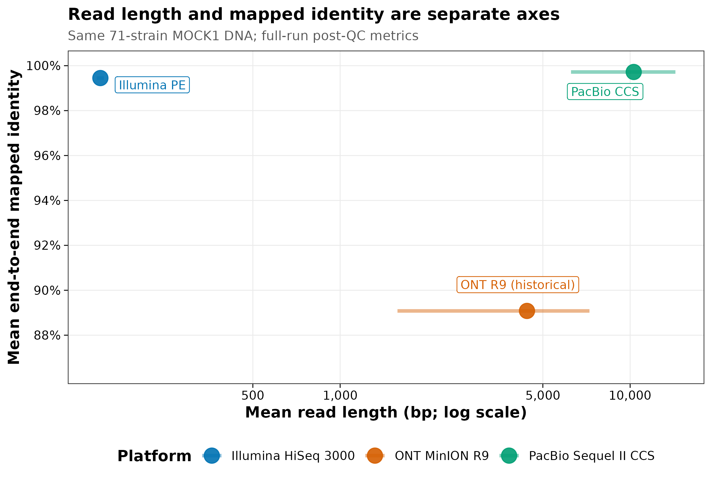
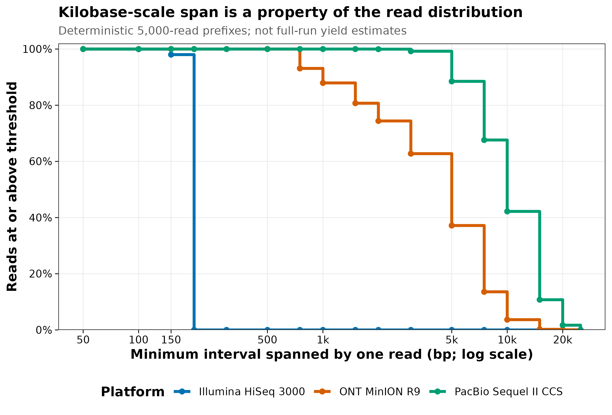
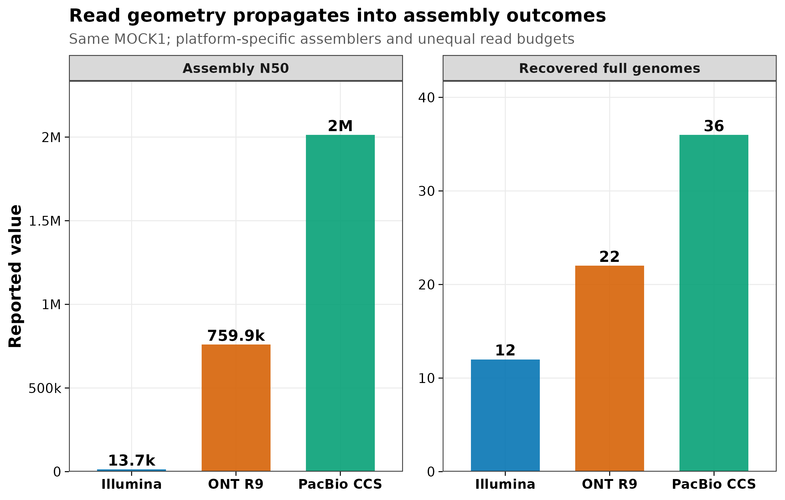

> **学习目标：**能逐行检查 FASTQ，正确解码 Phred+33，区分 reads、read pairs、bases、read length 与 insert size；能把短读、Nanopore 与 PacBio HiFi 看成不同的“分子观测结构”，而不是只比较单价；能为 read profiling、组装、MAG、菌株和移动元件终点选择数据路线，并保留各平台原生容器。  
> **真实数据：**Meslier 等把同一份由 71 个 microbial strains DNA 构成的 MOCK1 分别交给 Illumina HiSeq 3000、ONT MinION R9 与 PacBio Sequel II CCS [@meslier2022platforms]。全量 read、mapping 与 assembly 指标来自论文 Tables 1–3 和 ENA project `PRJEB52977`；FASTQ 语法与长度分布审计来自三个 run 各自前 5,000 条完整 records。这个确定性文件前缀不是随机抽样，也不是当前平台规格。  
> **预计资源：**读取固化的 15,000 行指标、重画三张图通常需 1 个 CPU、内存低于 1 GB、磁盘约 20 MB、1–2 分钟。若下载四个完整 ENA FASTQ，压缩文件合计约 10.8 GB，建议预留 25–40 GB scratch、2–4 核和 30–120 分钟用于网络与完整性/QC；组装所需资源远高于本章。没有服务器时先运行固化小表和 streaming QC，完整 FASTQ 放到 HPC、机构对象存储或合规云端，不要提交进 Git。

## 这一步对应论文里的哪张图 {#sec-target}

### 同一份 MOCK1，把“长度”和“准确度”拆成两条轴

Meslier 等构建了三套复杂 synthetic DNA mocks；其中 MOCK1 含 71 个 strains，并被所有七种测序技术覆盖。这里选取一组常见短读与两种长读路线：

| Platform | Official run used | Layout | ENA reads | ENA bases |
|---|---|---|---:|---:|
| Illumina HiSeq 3000 | `ERR9765746` | Paired | 41,195,050 | 6,136,710,329 |
| ONT MinION R9 | `ERR9765780` | Single | 696,944 | 3,125,920,499 |
| PacBio Sequel II CCS | `ERR9765783` | Single | 524,805 | 5,400,038,744 |

Illumina 的 `41,195,050 reads` 是单条 reads 计数，不是 read pairs；paired layout 对应约 20.60 million pairs。三个 run 的 reads 数不同，不能只比较“有多少条”而忽略每条长度与总 bases。

论文对质控后 reads 的报告把两件事清楚分开：

- 平均 read length：Illumina 149 bp、历史 ONT R9 4,408.41 bp、PacBio CCS 10,289.7 bp；
- 对 reference 的 mean end-to-end mapped identity：99.45%、89.08%、99.72%。

{#fig-read-geometry}

这张图不支持“ONT 现在只有 89% identity”。它只记录 2022 论文中的 R9 experiment。Pore、kit、basecaller 和 model 持续变化，当前项目必须报告实际 chemistry 与 basecalling model，不能把历史 benchmark 当成采购规格。

### FASTQ 前缀只回答“这些 reads 能跨多长”

从每个 checksum-identified ENA 文件流式读取前 5,000 条完整 records 后，Illumina R1 的 median length 为 150 bp；ONT R9 为 4,033.5 bp；PacBio CCS 为 9,204 bp。至少 5 kb 的比例分别为 0%、37.18% 和 88.50%；至少 10 kb 的比例为 0%、3.66% 和 42.20%。

{#fig-span-survival}

“read 能跨过 5 kb”不等于“能无歧义组装一个 5-kb repeat”。还要看 repeat 两侧是否有唯一序列、目标物种 coverage、read accuracy、strain mixture 与 assembler graph。长度只是必要条件之一。

### 平台差异会传到 assembly，但 benchmark 不是单因素实验

论文在 platform-specific workflow 下报告：

| Platform | Assembly input | Assembly N50 | Largest contig | Genome fraction | Recovered full genomes |
|---|---|---:|---:|---:|---:|
| Illumina | 10 million read pairs | 13,707 bp | 1,599,668 bp | 61.897% | 12 |
| ONT R9 | 0.696 million reads | 759,940 bp | 4,324,150 bp | 44.955% | 22 |
| PacBio CCS | 0.524 million reads | 2,013,697 bp | 7,147,004 bp | 68.197% | 36 |

{#fig-assembly-impact}

::: {.callout-important title="不要把三根柱子解释成平台的纯因果效应"}
输入 read budgets、read accuracy、size selection、assembler、polishing 与参数都随平台变化。图能证明“读取结构与配套 workflow 会改变 assembly outcome”，不能证明换平台本身必然产生同样倍数的 N50 或完整基因组。
:::

## 理论：FASTQ 是四行记录，平台选择是证据设计 {#sec-theory}

### 1. 一个 FASTQ record 必须满足四行语法

FASTQ 把 sequence 与每个碱基的 quality score 放在同一条 record 中 [@cock2010fastq]：

```text
@read_identifier optional description
ACGT...
+
quality characters...
```

最小结构约束是：

1. header 以 `@` 开始；
2. sequence 占一行；
3. separator 以 `+` 开始；
4. quality 字符数必须与 sequence 长度完全相等。

“文件能解压”不代表 FASTQ 完整。截断文件可能在最后一个 record 中少一到三行；错误拼接可能让 R1/R2 行数相同但 read IDs 或顺序已经错位。正式质控要分别验证 compression、四行 grammar、record count、sequence/quality length 和 paired synchronization。

### 2. Phred score 是错误概率的对数，不是比对 identity

在 Phred+33 编码中，quality character 的 ASCII code 减 33 得到 $Q$：

$$
Q=-10\log_{10}(P_{\mathrm{error}}),
\qquad
P_{\mathrm{error}}=10^{-Q/10}.
$$

因此：

| Q | 单碱基模型错误概率 | 模型准确率 |
|---:|---:|---:|
| 10 | 0.1 | 90% |
| 20 | 0.01 | 99% |
| 30 | 0.001 | 99.9% |
| 40 | 0.0001 | 99.99% |

一条 read 的平均 Q 不能直接取字符 Q 的算术平均后再解释成错误概率。更稳妥的汇总是先把每个位点 $Q_j$ 还原为 $p_j=10^{-Q_j/10}$，求平均错误概率，再转换回：

$$
Q_{\mathrm{mean\ error}}
=
-10\log_{10}\left(
\frac{1}{L}\sum_{j=1}^{L}10^{-Q_j/10}
\right).
$$

FASTQ quality 是 basecaller 的置信模型；mapped identity 是 read 与选定 reference、在选定 aligner 和过滤条件下的观测一致率。参考不完整、真实 strain divergence、alignment clipping 和 indel policy 都会改变 identity。两者不能互换。

### 3. reads、pairs、bases、cycles 和 insert size 是五个量

对 paired-end 数据：

- **read**：R1 或 R2 中的一条序列；
- **read pair**：共享同一原始 fragment 的 R1 + R2；
- **read length**：单条 read 的碱基数；
- **insert size / fragment length**：建库片段从一端到另一端的长度；
- **sequenced bases**：所有 reads 长度之和。

若平均 read length 为 $L$、有 $N_{\mathrm{pair}}$ 个完整 pairs，总 sequenced bases 约为：

$$
B \approx 2N_{\mathrm{pair}}L.
$$

但 paired-end 的物理 span 更接近 insert size，而不是 $2L$。本数据 Illumina mean insert size 为 433.47 bp，read length 约 149 bp；两端可提供方向与距离约束，中间部分不一定被直接测序。

对 single long reads，没有 R1/R2 pairing；一个 read 本身就是连续 span。把 long-read 文件硬复制成 `_1.fastq.gz` 和 `_2.fastq.gz` 不会创造 paired information。

### 4. Repeat、strain 和 mobile element 决定“长”能带来什么

短 reads 在下列结构中容易产生 assembly graph ambiguity：

- 长于 read/insert span 的 repeats；
- 多拷贝 rRNA operons；
- 相近 strains 共享的核心区域；
- plasmid、phage 与 chromosome 间共享片段；
- biosynthetic gene cluster 或 AMR cassette 的重复单元。

长 read 若能从一个 unique flank 连续跨过 repeat 到另一个 unique flank，就能提供 graph path。长读 metagenome assembler 因此专门处理 uneven abundance 与 intra-species heterogeneity；metaFlye 是代表性方法之一 [@kolmogorov2020metaflye]。但 low-abundance genome coverage 不足、DNA 已剪碎或 strains 极其相近时，读长优势仍可能无法兑现。

### 5. “长读”至少要分 ONT 与 PacBio HiFi 两条路线

**ONT**

- 直接观测单分子通过 nanopore 的电流信号；
- 可获得很长 reads，读长高度依赖 high-molecular-weight DNA 和 size distribution；
- 原始信号保存在 POD5；
- Dorado 当前默认输出 basecalled BAM，`--emit-fastq` 才输出 FASTQ；
- chemistry、pore、kit、basecaller version 和 model name 是 Methods 必填项。

**PacBio HiFi**

- polymerase 多次绕行 circularized SMRTbell template；
- 多次 subreads 合成一条 circular consensus sequence；
- 同时追求 kilobase-scale length 与高 consensus accuracy [@wenger2019hifi]；
- information-rich delivery 通常是 unaligned HiFi BAM，FASTQ 是可选交换层；
- chemistry、SMRT Link/CCS version、passes/QV policy、size selection 与 barcode processing 必须记录。

把 ONT 和 HiFi 都写成“第三代长读，平均 10 kb”会丢掉错误结构、原生信号、共识形成方式和工具链差异。长读分析还需使用与数据类型匹配的 mapper、assembler、polisher 与 QC [@amarasinghe2020longreads]。

### 6. FASTQ 是最低共同表示，不是完整档案

| Platform | Information-rich upstream object | FASTQ 的角色 | FASTQ 外容易丢失 |
|---|---|---|---|
| Illumina | BCL/CBCL + run metadata | 主要可移植 reads 交换格式 | flow-cell、demultiplex、lane/index context |
| ONT | POD5 + basecalled BAM | 可选的 sequence/quality export | raw signal、model/read-group、moves、modified-base tags |
| PacBio | subreads BAM + HiFi BAM | 可选的 sequence/quality export | PacBio tags、read group、passes/barcode context |

只保留 FASTQ 会让 sequence 与 per-base quality 仍可用，却可能失去重新 basecall、调用 modified bases、核对 consensus provenance 或按 read group 追踪批次的能力。数据保留策略应是：

1. 原生容器只读归档；
2. BAM/FASTQ 作为分析输入；
3. checksum、软件与 model manifest；
4. 派生文件可重建，不覆盖原件。

## 准备工作 {#sec-setup}

<details>
<summary><strong>展开：固定输入、安装依赖、校验指纹与作图函数</strong></summary>

### 轻量复算环境

仓库锁定 R 4.4.1、Quarto 1.9.38 和 `env/renv.lock`。恢复环境：

```{r}
#| eval: false
install.packages(
  "renv",
  repos = "https://cloud.r-project.org"
)
renv::restore(
  lockfile = "env/renv.lock",
  prompt = FALSE
)
```

单独安装本次轻量依赖：

```{r}
#| eval: false
install.packages(c(
  "digest",
  "ggplot2",
  "jsonlite",
  "knitr",
  "scales"
))
```

FASTQ 命令行检查建议固定 `seqkit`：

```{bash}
#| eval: false
set -euo pipefail

mamba create -n fastq-audit-2.10.0 -y \
  -c conda-forge -c bioconda \
  seqkit=2.10.0 pigz=2.8 coreutils=9.5

mamba run -n fastq-audit-2.10.0 seqkit version
```

### 固定小数据及 SHA-256

```{bash}
#| eval: false
set -euo pipefail

sha256sum -c <<'CHECKSUMS'
96638ae0d16ce5953760b596887c9f8f443c1dc33e0f82bef2e6ac040e69d962  data/small/08-ena-fastq-sources.tsv
4f5db378ec40b0e7ca16579aa3aadec770bba4bdd097c3bd8fa9ee826e7e7bf1  data/small/08-platform-benchmark.tsv
26ddd05a1f56df7d13a5769090241b87ed264399b0a9044076ce0467fa351af8  data/small/08-native-format-contract.tsv
6c426e0c89a95b1c1cc7ec631629e3635a7fd83c61c90d4086801b28495b5a61  data/small/08-read-prefix-metrics.tsv
591c7a7387232da0aa48c0cba7a3e1bd8d8a8b9b92ef6a0ed1f58e427199b62b  data/small/08-fastq-anatomy.tsv
f7bc59e303f26f723aacb2ff8a1d065411c1dcface225ce6d16969baefa66d2d  data/small/08-prefix-source-summary.json
4d6a7c572d9a42629c9c76c5f1e8ce43603b35845fa27f6fb134fc12b80eddb2  data/small/08-data-NOTICE.txt
CHECKSUMS
```

`08-read-prefix-metrics.tsv` 只保存每条 read 的长度、GC、N、quality 汇总与 read ID；`08-fastq-anatomy.tsv` 只保留第一条 record 的 60-base/quality display prefix 和全长序列/quality SHA-256。原始 FASTQ 没有进入仓库。

### 内联作图函数

```{r}
#| label: setup-article08
set.seed(20260719)
options(stringsAsFactors = FALSE)

dir.create(
  "results/08-platform",
  recursive = TRUE,
  showWarnings = FALSE
)
dir.create(
  "figures",
  recursive = TRUE,
  showWarnings = FALSE
)

pal_pub <- c(
  "#0072B2",
  "#D55E00",
  "#009E73",
  "#CC79A7",
  "#E69F00",
  "#56B4E9",
  "#F0E442",
  "#999999"
)

platform_colors <- c(
  Illumina = "#0072B2",
  ONT = "#D55E00",
  PacBio = "#009E73"
)

scale_color_pub <- function(...) {
  ggplot2::scale_color_manual(
    values = pal_pub,
    ...
  )
}

scale_fill_pub <- function(...) {
  ggplot2::scale_fill_manual(
    values = pal_pub,
    ...
  )
}

theme_pub <- function(base_size = 11) {
  ggplot2::theme_bw(
    base_size = base_size,
    base_family = "sans"
  ) +
    ggplot2::theme(
      panel.grid.minor = ggplot2::element_blank(),
      panel.grid.major = ggplot2::element_line(
        color = "grey92",
        linewidth = 0.3
      ),
      axis.text = ggplot2::element_text(color = "black"),
      axis.ticks = ggplot2::element_line(
        color = "black",
        linewidth = 0.3
      ),
      legend.key = ggplot2::element_blank(),
      legend.background = ggplot2::element_rect(
        fill = scales::alpha("white", 0.8),
        color = NA
      )
    )
}

save_pub <- function(
  plot,
  file_base,
  width = 174,
  height = 118,
  units = "mm",
  dpi = 350
) {
  ggplot2::ggsave(
    paste0(file_base, ".pdf"),
    plot,
    width = width,
    height = height,
    units = units,
    device = grDevices::cairo_pdf
  )
  ggplot2::ggsave(
    paste0(file_base, ".png"),
    plot,
    width = width,
    height = height,
    units = units,
    dpi = dpi,
    bg = "white"
  )
  ggplot2::ggsave(
    paste0(file_base, ".tiff"),
    plot,
    width = width,
    height = height,
    units = units,
    dpi = dpi,
    compression = "lzw",
    bg = "white"
  )
  invisible(plot)
}

read_tsv <- function(path) {
  utils::read.delim(
    path,
    check.names = FALSE,
    stringsAsFactors = FALSE,
    na.strings = c("", "NA")
  )
}

write_tsv <- function(x, path) {
  utils::write.table(
    x,
    path,
    sep = "\t",
    quote = FALSE,
    row.names = FALSE,
    na = ""
  )
}

format_compact <- function(x) {
  labels <- ifelse(
    x >= 1e6,
    sprintf("%.1fM", x / 1e6),
    ifelse(
      x >= 1e3,
      sprintf("%.1fk", x / 1e3),
      format(
        round(x),
        scientific = FALSE,
        trim = TRUE
      )
    )
  )
  sub("\\.0([kM])$", "\\1", labels)
}
```

</details>

## 可复制代码：从四行语法到平台级审计 {#sec-code}

### 1. 先验证 bytes，再读取对象

```{r}
#| label: audit-input-hashes
input_paths <- c(
  metrics = "data/small/08-read-prefix-metrics.tsv",
  anatomy = "data/small/08-fastq-anatomy.tsv",
  source_summary = "data/small/08-prefix-source-summary.json",
  benchmark = "data/small/08-platform-benchmark.tsv",
  sources = "data/small/08-ena-fastq-sources.tsv",
  native_contract = "data/small/08-native-format-contract.tsv",
  notice = "data/small/08-data-NOTICE.txt"
)

expected_hashes <- c(
  metrics = "6c426e0c89a95b1c1cc7ec631629e3635a7fd83c61c90d4086801b28495b5a61",
  anatomy = "591c7a7387232da0aa48c0cba7a3e1bd8d8a8b9b92ef6a0ed1f58e427199b62b",
  source_summary = "f7bc59e303f26f723aacb2ff8a1d065411c1dcface225ce6d16969baefa66d2d",
  benchmark = "4f5db378ec40b0e7ca16579aa3aadec770bba4bdd097c3bd8fa9ee826e7e7bf1",
  sources = "96638ae0d16ce5953760b596887c9f8f443c1dc33e0f82bef2e6ac040e69d962",
  native_contract = "26ddd05a1f56df7d13a5769090241b87ed264399b0a9044076ce0467fa351af8",
  notice = "4d6a7c572d9a42629c9c76c5f1e8ce43603b35845fa27f6fb134fc12b80eddb2"
)

observed_hashes <- vapply(
  input_paths,
  function(path) {
    digest::digest(
      file = path,
      algo = "sha256",
      serialize = FALSE
    )
  },
  character(1)
)

stopifnot(identical(observed_hashes, expected_hashes))
data.frame(
  File = basename(input_paths),
  SHA256 = observed_hashes,
  Status = "PASS",
  row.names = NULL
) |>
  knitr::kable(
    caption = "Byte-level lineage checks for Article 08 inputs"
  )
```

读取六个结构化输入：

```{r}
#| label: read-article08-inputs
metrics <- read_tsv(input_paths[["metrics"]])
anatomy <- read_tsv(input_paths[["anatomy"]])
benchmark <- read_tsv(input_paths[["benchmark"]])
sources <- read_tsv(input_paths[["sources"]])
native_contract <- read_tsv(
  input_paths[["native_contract"]]
)
source_summary <- jsonlite::read_json(
  input_paths[["source_summary"]],
  simplifyVector = TRUE
)

platform_order <- c("Illumina", "ONT", "PacBio")
run_contract <- c(
  Illumina = "ERR9765746",
  ONT = "ERR9765780",
  PacBio = "ERR9765783"
)

stopifnot(
  nrow(metrics) == 15000L,
  all(table(metrics$PlatformKey) == 5000L),
  nrow(anatomy) == 4L,
  nrow(benchmark) == 3L,
  nrow(sources) == 4L,
  nrow(native_contract) == 3L,
  identical(unique(metrics$SampleAccession), "SAMEA14435832"),
  identical(unique(benchmark$SampleAccession), "SAMEA14435832"),
  identical(unique(sources$SampleAccession), "SAMEA14435832"),
  identical(source_summary$source_project, "PRJEB52977"),
  isFALSE(source_summary$raw_fastq_stored),
  isTRUE(source_summary$illumina_prefix_mates_synchronized),
  !anyDuplicated(
    paste(
      metrics$PlatformKey,
      metrics$ReadIndex,
      sep = "::"
    )
  )
)

sources[, c(
  "PlatformLabel",
  "RunAccession",
  "Mate",
  "ENAReportedMD5",
  "ENABytes"
)] |>
  knitr::kable(
    caption = "Official ENA files used for deterministic streaming"
  )
```

### 2. 把第一条真实 record 拆开看

```{r}
#| label: fastq-anatomy
decode_phred33 <- function(quality_string) {
  utf8ToInt(quality_string) - 33L
}

decoded_first12 <- vapply(
  anatomy$QualityPrefix60,
  function(x) {
    paste(
      decode_phred33(substr(x, 1, 12)),
      collapse = ","
    )
  },
  character(1)
)

stopifnot(
  all(startsWith(anatomy$Header, "@")),
  all(startsWith(anatomy$Separator, "+")),
  all(nchar(anatomy$SequencePrefix60) == 60L),
  all(nchar(anatomy$QualityPrefix60) == 60L),
  identical(
    unname(decoded_first12),
    anatomy$DecodedPhredFirst12
  ),
  all(nchar(anatomy$FullSequenceSHA256) == 64L),
  all(nchar(anatomy$FullQualitySHA256) == 64L)
)

anatomy_display <- anatomy[, c(
  "PlatformKey",
  "Mate",
  "Header",
  "SequencePrefix60",
  "Separator",
  "QualityPrefix60",
  "DecodedPhredFirst12",
  "FullReadLength"
)]
anatomy_display$Header <- sub(
  "^@",
  "\\\\@",
  anatomy_display$Header
)
knitr::kable(
  anatomy_display,
  caption = paste(
    "First complete FASTQ record from each stream;",
    "sequence and quality are displayed as 60-character prefixes"
  )
)
```

第一条 Illumina read 的 quality 以 `AAFFFJJ...` 开始，对应 $Q=32,32,37,37,37,41,\ldots$；第一条 ONT R9 record 以较低且波动更大的 Q 值开始；PacBio archive FASTQ 中可出现 `~`，Phred+33 解码为 93。`Q=93` 是 archive FASTQ 中该字符的编码上限表现，不应被口头改写为“该平台所有碱基真实准确率为若干个 9”。

把每条 record 的全长 sequence/quality hash 留在 audit 表，可以证明展示前缀来自哪条完整 record，同时避免把长序列整段塞进正文：

```{r}
#| label: write-anatomy-audit
anatomy_audit <- data.frame(
  PlatformKey = anatomy$PlatformKey,
  PlatformLabel = anatomy$PlatformLabel,
  RunAccession = anatomy$RunAccession,
  Mate = anatomy$Mate,
  HeaderStartsAt = startsWith(anatomy$Header, "@"),
  SeparatorStartsPlus = startsWith(
    anatomy$Separator,
    "+"
  ),
  DisplaySequenceCharacters = nchar(
    anatomy$SequencePrefix60
  ),
  DisplayQualityCharacters = nchar(
    anatomy$QualityPrefix60
  ),
  FullReadLength = anatomy$FullReadLength,
  FullSequenceSHA256 = anatomy$FullSequenceSHA256,
  FullQualitySHA256 = anatomy$FullQualitySHA256
)
write_tsv(
  anatomy_audit,
  "results/08-platform/fastq-anatomy-audit.tsv"
)
```

### 3. Paired-end 要同时审计 ID、数量和顺序

第一条 R1/R2 header 只在末尾 `/1` 与 `/2` 不同：

```{r}
#| label: first-pair-audit
illumina_headers <- anatomy[
  anatomy$PlatformKey == "Illumina",
  c("Mate", "Header")
]
illumina_headers_display <- illumina_headers
illumina_headers_display$Header <- sub(
  "^@",
  "\\\\@",
  illumina_headers_display$Header
)
knitr::kable(illumina_headers_display)

normalized_pair_headers <- sub(
  "/[12]$",
  "",
  illumina_headers$Header
)
stopifnot(
  length(normalized_pair_headers) == 2L,
  length(unique(normalized_pair_headers)) == 1L
)
```

one-time streaming builder 还逐条验证了前 5,000 个 normalized IDs 和顺序完全一致。对自己的完整数据，可用以下检查：

```{bash}
#| eval: false
set -euo pipefail

r1="data/raw/sample_R1.fastq.gz"
r2="data/raw/sample_R2.fastq.gz"

gzip -t "${r1}"
gzip -t "${r2}"

seqkit stats -a -T "${r1}" "${r2}" \
  > results/fastq/sample.seqkit-stats.tsv
seqkit fqchk -q 30 "${r1}" \
  > results/fastq/sample.R1.fqchk.txt
seqkit fqchk -q 30 "${r2}" \
  > results/fastq/sample.R2.fqchk.txt

paste \
  <(seqkit seq -n "${r1}" | sed -E 's#/1$##') \
  <(seqkit seq -n "${r2}" | sed -E 's#/2$##') |
awk -F '\t' '
  BEGIN { bad = 0 }
  NF != 2 || $1 != $2 {
    bad++
    if (bad <= 10) {
      print "MISMATCH", NR, $1, $2 > "/dev/stderr"
    }
  }
  END {
    if (bad > 0) {
      print bad " mismatched pairs" > "/dev/stderr"
      exit 1
    }
  }
'
```

`seqkit stats` 显示相同行数仍不够：如果 R1 少了一条、R2 又在别处多了一条，总数可相同，后续 pairing 却整体错位。逐位 ID audit 才能发现。

### 4. 完整下载必须跟官方 MD5 绑定

四个文件总计约 10.8 GB。以下命令不在网页渲染时运行：

```{bash}
#| eval: false
set -euo pipefail

mkdir -p data/raw/meslier-mock1
cd data/raw/meslier-mock1

curl -fL --retry 5 --continue-at - \
  -o ERR9765746_1.fastq.gz \
  "https://ftp.sra.ebi.ac.uk/vol1/fastq/ERR976/006/ERR9765746/ERR9765746_1.fastq.gz"
curl -fL --retry 5 --continue-at - \
  -o ERR9765746_2.fastq.gz \
  "https://ftp.sra.ebi.ac.uk/vol1/fastq/ERR976/006/ERR9765746/ERR9765746_2.fastq.gz"
curl -fL --retry 5 --continue-at - \
  -o ERR9765780.fastq.gz \
  "https://ftp.sra.ebi.ac.uk/vol1/fastq/ERR976/000/ERR9765780/ERR9765780.fastq.gz"
curl -fL --retry 5 --continue-at - \
  -o ERR9765783.fastq.gz \
  "https://ftp.sra.ebi.ac.uk/vol1/fastq/ERR976/003/ERR9765783/ERR9765783.fastq.gz"

md5sum -c <<'MD5SUMS'
ed0e6e0ee846542531c742a45181cd6f  ERR9765746_1.fastq.gz
5b60ac93cb69dff77ae38cfa501afd06  ERR9765746_2.fastq.gz
33eb90ac7437b0039180f03e7a697269  ERR9765780.fastq.gz
02ec4bc541b4e1ec5d0f58e4a519f2cb  ERR9765783.fastq.gz
MD5SUMS

gzip -t ./*.fastq.gz
seqkit stats -a -T ./*.fastq.gz \
  > ../../../results/08-platform/full-fastq-stats.tsv
```

下载重试后必须重新跑 MD5 和 `gzip -t`；“文件大小看起来差不多”不是完整性证据。ENA MD5 适合核对下载 bytes，项目内部派生文件再使用 SHA-256。

### 5. 从每条 read 计算长度、GC 与 error-probability mean Q

streaming builder 对每条 read 计算：

```{r}
#| label: validate-read-metrics
stopifnot(
  all(metrics$ReadLength > 0),
  all(metrics$NCount >= 0),
  all(metrics$MinimumBaseQ >= 0),
  all(metrics$MaximumBaseQ <= 93),
  all(metrics$ExpectedAccuracyPercent >= 0),
  all(metrics$ExpectedAccuracyPercent <= 100),
  all(metrics$GCPercent >= 0),
  all(metrics$GCPercent <= 100)
)

metrics[1:6, c(
  "PlatformKey",
  "RunAccession",
  "ReadIndex",
  "ReadID",
  "ReadLength",
  "GCPercent",
  "NCount",
  "MinimumBaseQ",
  "MaximumBaseQ",
  "ErrorProbabilityMeanQ",
  "ExpectedErrors"
)] |>
  knitr::kable(
    digits = 3,
    caption = "First six deterministic per-read audit rows"
  )
```

在 Python 中，quality 汇总的核心计算是：

```{python}
#| eval: false
import math
import statistics

q_values = [ord(char) - 33 for char in quality]
error_probabilities = [10 ** (-q / 10) for q in q_values]
mean_error = statistics.fmean(error_probabilities)
error_probability_mean_q = -10 * math.log10(mean_error)
expected_errors = sum(error_probabilities)
```

`expected_errors` 是 basecaller probabilities 的和，不是把 read 对 reference 比对后数出的实际 mismatch 数。

### 6. 汇总确定性 prefix，并显式保留选择偏差

```{r}
#| label: summarize-read-prefixes
read_n50 <- function(lengths) {
  ordered <- sort(lengths, decreasing = TRUE)
  ordered[
    which(
      cumsum(ordered) >= sum(ordered) / 2
    )[1]
  ]
}

prefix_summary <- do.call(
  rbind,
  lapply(
    platform_order,
    function(platform) {
      x <- metrics[
        metrics$PlatformKey == platform,
        ,
        drop = FALSE
      ]
      data.frame(
        PlatformKey = platform,
        DisplayLabel = unique(x$PlatformLabel),
        RunAccession = unique(x$RunAccession),
        PrefixRecords = nrow(x),
        MinimumReadLengthBp = min(x$ReadLength),
        MedianReadLengthBp = stats::median(
          x$ReadLength
        ),
        MeanReadLengthBp = mean(x$ReadLength),
        P95ReadLengthBp = unname(
          stats::quantile(
            x$ReadLength,
            0.95,
            type = 7
          )
        ),
        MaximumReadLengthBp = max(x$ReadLength),
        ReadN50Bp = read_n50(x$ReadLength),
        MedianErrorProbabilityMeanQ = stats::median(
          x$ErrorProbabilityMeanQ
        ),
        MeanGCPercent = mean(x$GCPercent),
        FractionAtLeast1kb = mean(
          x$ReadLength >= 1000
        ),
        FractionAtLeast5kb = mean(
          x$ReadLength >= 5000
        ),
        FractionAtLeast10kb = mean(
          x$ReadLength >= 10000
        ),
        FractionAtLeast20kb = mean(
          x$ReadLength >= 20000
        )
      )
    }
  )
)

stopifnot(
  identical(
    prefix_summary$PrefixRecords,
    rep(5000L, 3)
  ),
  prefix_summary$MedianReadLengthBp[
    prefix_summary$PlatformKey == "Illumina"
  ] == 150,
  prefix_summary$MedianReadLengthBp[
    prefix_summary$PlatformKey == "ONT"
  ] == 4033.5,
  prefix_summary$MedianReadLengthBp[
    prefix_summary$PlatformKey == "PacBio"
  ] == 9204
)

write_tsv(
  prefix_summary,
  "results/08-platform/read-prefix-summary.tsv"
)

prefix_summary[, c(
  "DisplayLabel",
  "PrefixRecords",
  "MedianReadLengthBp",
  "P95ReadLengthBp",
  "ReadN50Bp",
  "FractionAtLeast5kb",
  "FractionAtLeast10kb"
)] |>
  knitr::kable(
    digits = 4,
    caption = paste(
      "Deterministic file-prefix summary;",
      "not a random full-run estimate"
    )
  )
```

read N50 与 assembly N50 是不同统计量。前者在 reads 按长度排序后达到总 read bases 一半的位置；后者在 contigs 按长度排序后达到总 assembly bases 一半的位置。两个数字同名，不应跨对象直接比较。

生成 span survival table：

```{r}
#| label: compute-span-survival
span_thresholds <- c(
  50, 100, 150, 200, 300, 500, 750,
  1000, 1500, 2000, 3000, 5000,
  7500, 10000, 15000, 20000, 25000
)

span_survival <- do.call(
  rbind,
  lapply(
    platform_order,
    function(platform) {
      lengths <- metrics$ReadLength[
        metrics$PlatformKey == platform
      ]
      data.frame(
        PlatformKey = platform,
        DisplayLabel = unique(
          metrics$PlatformLabel[
            metrics$PlatformKey == platform
          ]
        ),
        ThresholdBp = span_thresholds,
        FractionSpanning = vapply(
          span_thresholds,
          function(threshold) {
            mean(lengths >= threshold)
          },
          numeric(1)
        )
      )
    }
  )
)

write_tsv(
  span_survival,
  "results/08-platform/span-survival.tsv"
)
```

### 7. 把论文全量指标与 prefix 指标分表保存

```{r}
#| label: audit-full-benchmark
stopifnot(
  identical(
    setNames(
      benchmark$RunAccession,
      benchmark$PlatformKey
    )[platform_order],
    run_contract
  ),
  benchmark$ENAReadCount[
    benchmark$PlatformKey == "Illumina"
  ] == 41195050,
  benchmark$MeanMappedIdentityPercent[
    benchmark$PlatformKey == "ONT"
  ] == 89.08,
  benchmark$AssemblyN50Bp[
    benchmark$PlatformKey == "PacBio"
  ] == 2013697,
  benchmark$RecoveredFullGenomes[
    benchmark$PlatformKey == "PacBio"
  ] == 36
)

illumina_read_length <- benchmark$MeanReadLengthBp[
  benchmark$PlatformKey == "Illumina"
]
illumina_assembly_n50 <- benchmark$AssemblyN50Bp[
  benchmark$PlatformKey == "Illumina"
]

benchmark_audit <- benchmark
benchmark_audit$MeanReadLengthFoldVsIllumina <- (
  benchmark$MeanReadLengthBp /
    illumina_read_length
)
benchmark_audit$AssemblyN50FoldVsIllumina <- (
  benchmark$AssemblyN50Bp /
    illumina_assembly_n50
)
benchmark_audit$AccessionSource <- (
  "ENA API checked 2026-07-19"
)

write_tsv(
  benchmark_audit,
  "results/08-platform/platform-benchmark-audit.tsv"
)
write_tsv(
  native_contract,
  "results/08-platform/native-format-audit.tsv"
)

benchmark_audit[, c(
  "DisplayLabel",
  "RunAccession",
  "LibraryLayout",
  "ENAReadCount",
  "ENABaseCount",
  "MeanReadLengthBp",
  "MeanMappedIdentityPercent",
  "AssemblyN50Bp",
  "RecoveredFullGenomes"
)] |>
  knitr::kable(
    digits = 2,
    caption = paste(
      "Full-run post-QC and workflow-level assembly",
      "metrics from Meslier et al. and ENA"
    )
  )
```

### 8. 重绘长度—准确度图

```{r}
#| label: plot-read-geometry
#| include: false
benchmark$PlatformKey <- factor(
  benchmark$PlatformKey,
  levels = platform_order
)

platform_labels <- c(
  Illumina = "Illumina HiSeq 3000",
  ONT = "ONT MinION R9",
  PacBio = "PacBio Sequel II CCS"
)
geometry_labels <- c(
  Illumina = "Illumina PE",
  ONT = "ONT R9 (historical)",
  PacBio = "PacBio CCS"
)
benchmark$GeometryLabel <- unname(
  geometry_labels[
    as.character(benchmark$PlatformKey)
  ]
)
benchmark$LabelX <- c(
  Illumina = 225,
  ONT = 4100,
  PacBio = 8200
)[as.character(benchmark$PlatformKey)]
benchmark$LabelY <- c(
  Illumina = 99.15,
  ONT = 90.25,
  PacBio = 98.85
)[as.character(benchmark$PlatformKey)]

p_geometry <- ggplot2::ggplot(
  benchmark,
  ggplot2::aes(
    x = MeanReadLengthBp,
    y = MeanMappedIdentityPercent,
    color = PlatformKey
  )
) +
  ggplot2::geom_segment(
    ggplot2::aes(
      x = pmax(
        MeanReadLengthBp - ReadLengthSDBp,
        1
      ),
      xend = MeanReadLengthBp + ReadLengthSDBp,
      yend = MeanMappedIdentityPercent
    ),
    linewidth = 1.2,
    alpha = 0.45
  ) +
  ggplot2::geom_point(
    size = 4.8,
    alpha = 0.9
  ) +
  ggplot2::geom_label(
    ggplot2::aes(
      x = LabelX,
      y = LabelY,
      label = GeometryLabel
    ),
    size = 3.05,
    linewidth = 0.22,
    fill = scales::alpha("white", 0.9),
    show.legend = FALSE
  ) +
  ggplot2::scale_x_log10(
    breaks = c(
      100, 500, 1000, 5000, 10000
    ),
    labels = scales::label_number(
      big.mark = ","
    )
  ) +
  ggplot2::scale_y_continuous(
    limits = c(86.5, 100),
    breaks = c(
      88, 90, 92, 94, 96, 98, 100
    ),
    labels = scales::percent_format(
      scale = 1,
      accuracy = 1
    )
  ) +
  ggplot2::scale_color_manual(
    values = platform_colors,
    labels = platform_labels,
    name = "Platform"
  ) +
  ggplot2::labs(
    title = paste(
      "Read length and mapped identity",
      "are separate axes"
    ),
    subtitle = paste(
      "Same 71-strain MOCK1 DNA;",
      "full-run post-QC metrics"
    ),
    x = "Mean read length (bp; log scale)",
    y = "Mean end-to-end mapped identity"
  ) +
  theme_pub() +
  ggplot2::theme(
    plot.title = ggplot2::element_text(
      face = "bold",
      size = 12
    ),
    plot.subtitle = ggplot2::element_text(
      color = "grey35",
      size = 9.4
    ),
    axis.title = ggplot2::element_text(
      face = "bold"
    ),
    legend.position = "bottom",
    legend.title = ggplot2::element_text(
      face = "bold"
    )
  ) +
  ggplot2::guides(
    color = ggplot2::guide_legend(
      nrow = 1,
      byrow = TRUE
    )
  )

save_pub(
  p_geometry,
  "figures/08-read-geometry",
  width = 180,
  height = 122
)
```

### 9. 重绘 span survival

```{r}
#| label: plot-span-survival
#| include: false
span_survival$PlatformKey <- factor(
  span_survival$PlatformKey,
  levels = platform_order
)

p_span <- ggplot2::ggplot(
  span_survival,
  ggplot2::aes(
    x = ThresholdBp,
    y = FractionSpanning,
    color = PlatformKey,
    group = PlatformKey
  )
) +
  ggplot2::geom_step(
    linewidth = 1.15,
    direction = "hv"
  ) +
  ggplot2::geom_point(size = 1.7) +
  ggplot2::scale_x_log10(
    breaks = c(
      50, 100, 150, 500,
      1000, 5000, 10000, 20000
    ),
    labels = c(
      "50", "100", "150", "500",
      "1k", "5k", "10k", "20k"
    )
  ) +
  ggplot2::scale_y_continuous(
    limits = c(0, 1),
    breaks = seq(0, 1, 0.2),
    labels = scales::percent_format(
      accuracy = 1
    ),
    expand = ggplot2::expansion(
      mult = c(0, 0.02)
    )
  ) +
  ggplot2::scale_color_manual(
    values = platform_colors,
    labels = platform_labels,
    name = "Platform"
  ) +
  ggplot2::labs(
    title = paste(
      "Kilobase-scale span is a property",
      "of the read distribution"
    ),
    subtitle = paste(
      "Deterministic 5,000-read prefixes;",
      "not full-run yield estimates"
    ),
    x = paste(
      "Minimum interval spanned by one read",
      "(bp; log scale)"
    ),
    y = "Reads at or above threshold"
  ) +
  theme_pub() +
  ggplot2::theme(
    plot.title = ggplot2::element_text(
      face = "bold",
      size = 12
    ),
    plot.subtitle = ggplot2::element_text(
      color = "grey35",
      size = 9.4
    ),
    axis.title = ggplot2::element_text(
      face = "bold"
    ),
    legend.position = "bottom",
    legend.title = ggplot2::element_text(
      face = "bold"
    )
  ) +
  ggplot2::guides(
    color = ggplot2::guide_legend(
      nrow = 1,
      byrow = TRUE
    )
  )

save_pub(
  p_span,
  "figures/08-span-survival",
  width = 180,
  height = 122
)
```

### 10. 重绘 assembly outcome，并写机器可读摘要

```{r}
#| label: plot-assembly-impact
#| include: false
assembly_long <- rbind(
  data.frame(
    PlatformKey = benchmark$PlatformKey,
    Metric = "Assembly N50",
    Value = benchmark$AssemblyN50Bp,
    Display = format_compact(
      benchmark$AssemblyN50Bp
    )
  ),
  data.frame(
    PlatformKey = benchmark$PlatformKey,
    Metric = "Recovered full genomes",
    Value = benchmark$RecoveredFullGenomes,
    Display = as.character(
      benchmark$RecoveredFullGenomes
    )
  )
)
assembly_long$Metric <- factor(
  assembly_long$Metric,
  levels = c(
    "Assembly N50",
    "Recovered full genomes"
  )
)

p_assembly <- ggplot2::ggplot(
  assembly_long,
  ggplot2::aes(
    x = PlatformKey,
    y = Value,
    fill = PlatformKey
  )
) +
  ggplot2::geom_col(
    width = 0.66,
    alpha = 0.88
  ) +
  ggplot2::geom_text(
    ggplot2::aes(label = Display),
    vjust = -0.35,
    size = 3.5,
    fontface = "bold"
  ) +
  ggplot2::facet_wrap(
    ~Metric,
    scales = "free_y",
    nrow = 1
  ) +
  ggplot2::scale_x_discrete(
    labels = c(
      Illumina = "Illumina",
      ONT = "ONT R9",
      PacBio = "PacBio CCS"
    )
  ) +
  ggplot2::scale_y_continuous(
    labels = format_compact,
    expand = ggplot2::expansion(
      mult = c(0, 0.16)
    )
  ) +
  ggplot2::scale_fill_manual(
    values = platform_colors,
    guide = "none"
  ) +
  ggplot2::labs(
    title = paste(
      "Read geometry propagates into",
      "assembly outcomes"
    ),
    subtitle = paste(
      "Same MOCK1; platform-specific assemblers",
      "and unequal read budgets"
    ),
    x = NULL,
    y = "Reported value"
  ) +
  theme_pub() +
  ggplot2::theme(
    plot.title = ggplot2::element_text(
      face = "bold",
      size = 12
    ),
    plot.subtitle = ggplot2::element_text(
      color = "grey35",
      size = 9.4
    ),
    axis.title.y = ggplot2::element_text(
      face = "bold"
    ),
    axis.text.x = ggplot2::element_text(
      face = "bold"
    ),
    strip.text = ggplot2::element_text(
      face = "bold"
    ),
    panel.spacing = grid::unit(10, "pt")
  )

save_pub(
  p_assembly,
  "figures/08-assembly-impact",
  width = 182,
  height = 116
)

value_for <- function(table, platform, column) {
  unname(
    table[
      table$PlatformKey == platform,
      column
    ][[1]]
  )
}

article08_summary <- list(
  source_project = "PRJEB52977",
  source_sample = "SAMEA14435832",
  source_mock = "MOCK1; 71-strain synthetic metagenome",
  platforms = 3,
  source_fastq_files = 4,
  prefix_records_per_platform = 5000,
  prefix_metric_rows = nrow(metrics),
  anatomy_records = nrow(anatomy),
  raw_fastq_stored = FALSE,
  illumina_mates_synchronized = TRUE,
  illumina_run = "ERR9765746",
  ont_run = "ERR9765780",
  pacbio_run = "ERR9765783",
  illumina_full_mean_read_length_bp = value_for(
    benchmark,
    "Illumina",
    "MeanReadLengthBp"
  ),
  ont_full_mean_read_length_bp = value_for(
    benchmark,
    "ONT",
    "MeanReadLengthBp"
  ),
  pacbio_full_mean_read_length_bp = value_for(
    benchmark,
    "PacBio",
    "MeanReadLengthBp"
  ),
  illumina_full_mapped_identity_percent = value_for(
    benchmark,
    "Illumina",
    "MeanMappedIdentityPercent"
  ),
  ont_full_mapped_identity_percent = value_for(
    benchmark,
    "ONT",
    "MeanMappedIdentityPercent"
  ),
  pacbio_full_mapped_identity_percent = value_for(
    benchmark,
    "PacBio",
    "MeanMappedIdentityPercent"
  ),
  illumina_assembly_n50_bp = value_for(
    benchmark,
    "Illumina",
    "AssemblyN50Bp"
  ),
  ont_assembly_n50_bp = value_for(
    benchmark,
    "ONT",
    "AssemblyN50Bp"
  ),
  pacbio_assembly_n50_bp = value_for(
    benchmark,
    "PacBio",
    "AssemblyN50Bp"
  ),
  illumina_recovered_full_genomes = value_for(
    benchmark,
    "Illumina",
    "RecoveredFullGenomes"
  ),
  ont_recovered_full_genomes = value_for(
    benchmark,
    "ONT",
    "RecoveredFullGenomes"
  ),
  pacbio_recovered_full_genomes = value_for(
    benchmark,
    "PacBio",
    "RecoveredFullGenomes"
  ),
  ont_prefix_fraction_at_least_5kb = value_for(
    prefix_summary,
    "ONT",
    "FractionAtLeast5kb"
  ),
  pacbio_prefix_fraction_at_least_5kb = value_for(
    prefix_summary,
    "PacBio",
    "FractionAtLeast5kb"
  ),
  ont_prefix_fraction_at_least_10kb = value_for(
    prefix_summary,
    "ONT",
    "FractionAtLeast10kb"
  ),
  pacbio_prefix_fraction_at_least_10kb = value_for(
    prefix_summary,
    "PacBio",
    "FractionAtLeast10kb"
  ),
  metrics_sha256 = observed_hashes[["metrics"]],
  anatomy_sha256 = observed_hashes[["anatomy"]],
  selection_bias_note = paste(
    "Deterministic file prefixes support format and",
    "span auditing; they are not random full-run",
    "samples or current platform specifications."
  ),
  random_seed = 20260719
)

jsonlite::write_json(
  article08_summary,
  "results/08-platform-summary.json",
  auto_unbox = TRUE,
  pretty = TRUE,
  digits = 15
)
```

## 审计与升级：忠实复现之后，今天还要补什么 {#sec-audit}

### 1. 先修正 accession lineage，不篡改论文

Meslier paper Table 4 把 Illumina MOCK1 accession 印为 `ERR9765446`；截至 2026-07-19，该 identifier 在官方 ENA project metadata 中没有对应 run。ENA 将同一 MOCK1 的 HiSeq 3000 paired run 标为 `ERR9765746`，并给出四个 FASTQ URL、MD5、reads 和 bases。

处理方式不是静默替换，而是同时保留：

- `PublishedTableAccession = ERR9765446`；
- `OfficialENAAccession = ERR9765746`；
- 查询日期；
- official URL、MD5、bytes；
- 差异说明为 source-table accession typo。

只有这样，读者才能解释为什么复制论文 accession 下载失败，也能从当前官方记录复现。

### 2. 把历史 ONT R9 放回历史语境

论文的 ONT 数据来自 MinION R9，mean mapped identity 为 89.08%，substitutions 3.37%、indels 7.55%。这些值不能被写成“Nanopore 固有错误率”，更不能替代当前 run 的 `sequencing_summary`、Dorado model、duplex/simplex 和 alignment QC。

升级后的报告至少包含：

```text
device / flow cell / pore
library preparation kit
Dorado version
exact model name
simplex or duplex
minimum Q policy
POD5 retained: yes/no
basecalled BAM retained: yes/no
modified-base model, if used
```

跨代比较时，应该写 `ONT MinION R9 in Meslier 2022`，而不是只写 `ONT`。

### 3. 论文的 Sequel II 与 ENA 的 Sequel 字段并列报告

论文 Methods/Table 将实验写作 PacBio Sequel II CCS；ENA `instrument_model` 字段写作 `Sequel`。在缺少更细 archive field 时，不把 ENA 值擅自扩成 Sequel II，也不因 archive 粒度较粗而否认论文描述。

项目自己的 run 应保存 instrument run report、SMRT Link/CCS version、chemistry、movie/read group、HiFi QV definition 和 barcode workflow，让这种歧义不再发生。

### 4. 不把 FASTQ Q 当作 reference identity

prefix 中 PacBio `MedianErrorProbabilityMeanQ` 约为 38.59，论文 full-run mapped identity 为 99.72%；这两个值来源、单位与聚合方法都不同。直接做 $1-10^{-38.59/10}$ 并与 99.72% 对比，会同时混入 quality calibration、read selection、reference divergence 与 alignment policy。

推荐分别报告：

- FASTQ/BAM quality distribution；
- mapped fraction；
- uniquely mapped fraction；
- identity、substitution、insertion、deletion；
- unmapped/unaligned reads 的原因；
- mock truth recovery 或 independent reference-free QC。

### 5. Assembly comparison 被多个 workflow 因素混杂

论文 short-read input 是 10 million read pairs；ONT 与 PacBio 分别使用约 0.696 和 0.524 million reads。不同 assembler 适配不同 error model。N50 和 recovered full genomes 同时受以下因素影响：

- total bases 与 per-genome coverage；
- abundance distribution；
- read-length distribution；
- extraction fragmentation 与 size selection；
- per-base error structure；
- assembler、版本和 parameters；
- polishing 与 reference evaluation；
- strain heterogeneity。

更接近单因素比较的 benchmark 应对齐总 bases或目标 genome coverage，统一 truth set 与评价器，分别做 full data 和 matched-budget sensitivity；仍不能把 library preparation bias 消除掉。

### 6. 长读定量也受 high-molecular-weight extraction 选择

同一混合 DNA 不等于不同平台获得完全相同的分子样本。size selection 会偏向长且完整的 molecules；某些 taxa 的 DNA 更易剪切或提取不足。若 primary endpoint 包括 relative abundance，不能只看 assembly contiguity，还要用 mock expected composition 检查 taxon-specific recovery、GC/length bias 与 dropout。

复杂 clinical/environmental samples 更应在同一 homogenized extract 或配对 aliquots 中比较平台，记录 input mass、DIN、fragment distribution 与 size-selection cutoff。

### 7. 原生文件保留是可升级性的前提

当前官方格式说明支持以下边界：

| Platform | 当前保存优先级 | 为什么 |
|---|---|---|
| Illumina | BCL/CBCL 若可得 + SampleSheet + FASTQ | 可重做 demultiplexing 并追踪 lane/index |
| ONT | POD5 + basecalled BAM + summary + optional FASTQ | 可重新 basecall、保留 model/read tags 与 signal |
| PacBio | subreads BAM + HiFi BAM + reports + optional FASTQ | 保留 consensus/read-group/barcode provenance |

供应商只交 FASTQ 时，应在 Methods 写“native signal/container unavailable”，不要暗示 modified-base reanalysis 或 re-basecalling 仍可完成。

### 8. 按研究终点决定平台，而不是按口号决定

| Primary endpoint | 数据路线起点 | 主要理由 | 必须承认的边界 |
|---|---|---|---|
| 大队列 species/pathway association | 高质量 paired short reads | throughput、成熟数据库与成本可控 | strain/repeat/novel genome 受限 |
| 高完整度 MAG、operon、BGC | HiFi 或高质量 long reads | 连续 span + consensus accuracy | HMW DNA、成本与低丰度 coverage |
| plasmid/phage linkage、超长结构 | ONT long/ultralong | 单分子 span 与灵活 run | error/model、DNA 完整性、polishing |
| 既要队列定量又要高连续组装 | 部分样本 long + 全队列 short | discovery reference + cohort profiling | 平台批次与映射偏差需桥接 |
| 极低生物量 host-rich 样本 | 先做 paired pilot | 有效微生物 bases 比平台名更重要 | host depletion、污染、隐私 |

“全队列都做最高规格长读”不是自动最佳。常见稳健设计是：代表性 discovery subset 做 long-read assembly，建立 study-specific genomes/gene catalog，再让全部样本用一致 short-read profiling；桥接样本同时上两平台，用来估计 platform effect。

## 出版级美化：让三张图分别回答三个问题 {#sec-polish}

### 1. Read geometry 图只放长度与 mapped identity

横轴使用 log scale，否则 149 bp 会被 10 kb 压在原点；ONT 标注必须带 `R9 (historical)`。误差横线只表示 paper-reported read-length SD，不把 identity 的未报告误差条画出来。

### 2. Span survival 图把选择规则写进 subtitle

曲线 subtitle 明确写 `Deterministic 5,000-read prefixes`，图注再说明 non-random。这样一张容易传播的图离开正文后仍保留证据边界。

### 3. Assembly 图把混杂因素写进图内

subtitle 直接保留 `platform-specific assemblers and unequal read budgets`，避免读者只截图柱高。两个 facet 使用 free y scale，因为 N50 与 genome count 单位不同；facet title 与 data labels 全为英文。

三张图都以 PDF、350-dpi PNG 和 LZW TIFF 导出。PDF 用于矢量排版，PNG 用于网页和公众号预览，TIFF 用于要求位图的期刊投稿。图内标题、坐标、图例、分组与数字标注均使用英文。

## 常见坑：审稿人会追问什么 {#sec-pitfalls}

::: {.callout-caution title="把 reads 当成 read pairs"}
ENA/SRA 的 `read_count` 常按单条 reads 计数。paired run 的 pairs 通常约为 reads/2，但只能在 R1/R2 counts 相等且 IDs 同步后成立。Methods 要写 `20.6 million read pairs` 或 `41.2 million reads`，不要混用。
:::

::: {.callout-caution title="只跑 gzip -t 就宣布 FASTQ 合格"}
`gzip -t` 只验证压缩流；四行 grammar、sequence/quality 等长、字符范围、record count 和 mate synchronization 仍要单独检查。
:::

::: {.callout-caution title="把平均 Q 与平均 identity 画成同一种准确率"}
Quality 是 basecaller probability；identity 是对特定 reference 的 alignment outcome。必须分列报告，并说明聚合和过滤方法。
:::

::: {.callout-caution title="只看平均 read length"}
两个 run 的均值可以相同，却有完全不同的 short-read tail、N50、P95 和能跨过 5/10/20 kb 的比例。组装设计至少报告 length distribution、read N50、total bases 和 Q distribution。
:::

::: {.callout-caution title="把历史 R9 结果写成当前 ONT 性能"}
必须保留 pore/flow cell、kit、Dorado version 与 model。没有这些字段，`Nanopore` 不是可复现的方法描述。
:::

::: {.callout-caution title="只保留 FASTQ，删除 POD5/BAM"}
这样会失去重新 basecall、modified-base、read-group 或 consensus provenance。存储预算应在送样前包含原生容器，而不是分析结束后才发现无法升级。
:::

::: {.callout-caution title="N50 高就等于 MAG 质量高"}
N50 只描述 contiguity，不检查 contamination、chimerism、consensus errors、completeness 或 taxonomic consistency。MAG 仍需独立质量、嵌合与 MIMAG 审计。
:::

::: {.callout-caution title="把 mock assembly 排名直接外推到真实群落"}
真实样本的 abundance range、novelty、strain diversity、host DNA 和 extraction fragmentation 都不同。Mock 是管线校准，不是所有生态位的胜负榜。
:::

## 这段 Methods 怎么写 {#sec-methods}

### 可套用的英文模板

> Shotgun metagenomic libraries were prepared from [input mass] of DNA extracted using [method and version]. Short-read libraries were sequenced on an [instrument] using [flow cell/kit] in [single-end or paired-end] mode with [cycle/read length] and an intended insert size of [range] bp. Long-read libraries were sequenced on [ONT device, flow cell, pore and kit; or PacBio instrument and chemistry] after [size-selection method/cutoff]. ONT raw signal was retained as POD5 and basecalled with Dorado [version] using model [exact model] in [simplex/duplex] mode with a minimum Q score of [value]. PacBio HiFi reads were generated with [SMRT Link/CCS version and parameters] and retained in [BAM filename/type] with [QV/pass] criteria. FASTQ files used Phred+33 encoding. File integrity was verified using archive MD5 and local SHA-256 checksums; compression, record grammar, sequence–quality length, read counts, length/quality distributions, and paired-read identifier order were audited with [tools and versions]. Native POD5/BAM files, run reports, SampleSheet/index metadata, software versions, and checksums were retained. Run accessions were [accessions].

### 本次公开演示的实写

> The same 71-strain synthetic MOCK1 DNA sample (SAMEA14435832; PRJEB52977) was represented by Illumina HiSeq 3000 paired-end reads (ERR9765746), historical Oxford Nanopore MinION R9 reads (ERR9765780), and PacBio Sequel II CCS reads as described by Meslier et al. (ERR9765783). Official ENA URLs, compressed byte counts, and MD5 values were checked on 19 July 2026. The first 5,000 complete records from each checksum-identified file were streamed without storing raw FASTQ in the repository; Illumina R1 and R2 identifiers were verified in order, while platform-level metrics used R1, ONT, and PacBio reads, yielding 15,000 audit rows. FASTQ records were validated for four-line structure, equal sequence and quality lengths, and Phred+33-compatible quality characters. Prefix-derived length and quality summaries were reported only as deterministic format/span audits. Full-run read, mapping, and platform-specific assembly outcomes were transcribed from Meslier et al. Tables 1–3 and linked to official ENA run totals. All analysis used seed 20260719, and input/output SHA-256 values were retained.

Methods 还应补一句 accession discrepancy：

> The Illumina MOCK1 accession printed as ERR9765446 in the source paper table was not present in the official ENA project metadata checked on 19 July 2026; ERR9765746, including its paired FASTQ URLs, MD5 values, read count, and base count, was therefore used and the discrepancy was retained in the provenance record.

## 换成你自己的数据怎么做 {#sec-own-data}

### 1. 先建一份 run manifest

最低字段：

| Column | 例子 | 用途 |
|---|---|---|
| `SampleID` | `S01` | 生物样本主键 |
| `LibraryID` | `L01` | 建库单位 |
| `RunID`, `Lane` | instrument run/lane | 批次与重跑 |
| `Platform` | Illumina/ONT/PacBio | 技术路线 |
| `InstrumentModel` | exact model | 可复现硬件 |
| `LibraryLayout` | paired/single | 正确解释 counts |
| `R1`, `R2`, `BAM`, `POD5` | paths | 文件角色 |
| `ReadCycles` | `2 × 150` | short-read geometry |
| `InsertSize` | mean/range | paired physical span |
| `FlowCell`, `Kit`, `Chemistry` | exact product | 平台代际 |
| `Basecaller`, `Model` | exact version/name | long-read error model |
| `SizeSelection` | method/cutoff | length/recovery bias |
| `ArchiveAccession` | ERR/SRR/DRR | 公开 lineage |
| `MD5`, `SHA256` | checksum | byte identity |
| `NativeRetained` | yes/no + path | 未来升级能力 |

一行对应一个 library × run，而不是一行对应患者。若同一 library 跨 lane 或重跑，应保留多行，再由 manifest 指定合并规则。

### 2. 先跑文件门，再做 biological QC

推荐输出：

```text
results/fastq/
├── checksum-audit.tsv
├── compression-audit.tsv
├── record-grammar-audit.tsv
├── paired-id-audit.tsv
├── seqkit-stats.tsv
├── quality-summary.tsv
├── length-survival.tsv
└── decision-log.tsv
```

只有 checksum、compression、grammar、pairing 全部通过，才进入 adapter/quality trimming、host removal 和 profiling。失败文件先重下载或让测序方重交，不能用 `head -n -1` 等方式悄悄删掉尾部。

### 3. 按平台保留原件和分析副本

```text
data/
├── native/
│   ├── illumina_bcl_or_run_archive/
│   ├── ont_pod5/
│   └── pacbio_subreads_and_hifi_bam/
├── reads/
│   ├── short/S01_R1.fastq.gz
│   ├── short/S01_R2.fastq.gz
│   ├── ont/S01.bam
│   └── hifi/S01.hifi_reads.bam
└── manifests/
    ├── run_manifest.tsv
    ├── software_versions.tsv
    └── checksums.sha256
```

所有转换写到新目录；原生文件设为只读。FASTQ 转 BAM、BAM 转 FASTQ 或重新 basecall 都要记录命令、version 和 input/output checksum。

### 4. 用 endpoint matrix 做平台决策

给每个候选方案预先打分：

| Criterion | Weight | Short reads | ONT | HiFi | Hybrid |
|---|---:|---:|---:|---:|---:|
| Cohort-wide abundance precision | project-specific |  |  |  |  |
| MAG contiguity | project-specific |  |  |  |  |
| Strain separation | project-specific |  |  |  |  |
| Plasmid/phage linkage | project-specific |  |  |  |  |
| Low-abundance coverage | project-specific |  |  |  |  |
| HMW DNA feasibility | project-specific |  |  |  |  |
| Host/low-biomass burden | project-specific |  |  |  |  |
| Per-sample budget | project-specific |  |  |  |  |
| Native-data storage | project-specific |  |  |  |  |

先定权重，再看报价。若先看喜欢的平台再调权重，decision matrix 只是在为既定选择背书。

### 5. 用桥接样本分离 biological 与 platform effects

混合平台队列至少选择一批代表性样本同时上两条路线，覆盖：

- high/medium/low microbial load；
- 主要 phenotype groups；
- 关键 extraction batches；
- 预期 high/low diversity；
- 已知难组装 taxa 或 mobile elements；
- 一个真实 mock 和各批次 blanks。

桥接分析分别比较 taxon/pathway abundance、unclassified fraction、length/quality、assembly graph、MAG recovery 与 strain calls。没有 bridge，platform 常与 phenotype 或 batch 混杂，后续统计很难补救。

### 6. 把选择转成预先写好的停止与失败规则

示例：

- paired short reads：R1/R2 IDs 任何错位即失败；有效 non-host bases 低于预设 endpoint threshold 则重测；
- ONT：POD5 缺失或 exact model 不明时标记 provenance incomplete；read N50/target yield 未达 pilot rule 时补 run；
- HiFi：HiFi yield、read length、QV 与 barcode audit 未达 run contract 时不进入 assembly；
- hybrid：long-read assembly 与 short-read polishing/profile 的 sample IDs、extract lineage 与 checksum 必须一一对应；
- 所有平台：blank、mock、host/privacy 与 contamination gates 独立执行，不因 reads 更长而豁免。

## 小结

1. FASTQ record 是 header、sequence、separator、quality 四行；compression 通过不等于 grammar 与 pairing 通过。
2. Phred score 表示 basecaller error probability，mapped identity 表示相对某个 reference 的 alignment outcome，两者不能互换。
3. Illumina paired reads、ONT single long reads 与 PacBio consensus long reads 携带不同的 span、error 和 provenance 结构。
4. 同一 MOCK1 中，论文报告的 mean read lengths 为 149、4,408.41 和 10,289.7 bp；ONT 的 89.08% identity 明确属于历史 R9 experiment。
5. 确定性 5,000-read prefixes 中，至少 10 kb 的比例为 Illumina 0%、ONT 3.66%、PacBio 42.20%；这些比例不代表全 run 或当前产品。
6. Assembly N50 和 recovered genomes 会随 read geometry 变化，但 source benchmark 同时混入 assembler 与 read-budget differences。
7. Illumina 应保留 run/index context，ONT 应保留 POD5 与 basecalled BAM，PacBio 应保留 subreads/HiFi BAM；FASTQ 是交换层，不是完整档案。
8. 平台选择要从 primary endpoint、HMW DNA、low-abundance coverage、队列规模和预算反推，并用跨平台 bridge samples 校准。

## 参考 {#sec-references}

- Meslier V, Quinquis B, Da Silva K, et al. Benchmarking second and third-generation sequencing platforms for microbial metagenomics. *Scientific Data*. 2022;9:694. [doi:10.1038/s41597-022-01762-z](https://doi.org/10.1038/s41597-022-01762-z)
- Cock PJA, Fields CJ, Goto N, Heuer ML, Rice PM. The Sanger FASTQ file format for sequences with quality scores, and the Solexa/Illumina FASTQ variants. *Nucleic Acids Research*. 2010;38:1767–1771. [doi:10.1093/nar/gkp1137](https://doi.org/10.1093/nar/gkp1137)
- Wenger AM, Peluso P, Rowell WJ, et al. Accurate circular consensus long-read sequencing improves variant detection and assembly of a human genome. *Nature Biotechnology*. 2019;37:1155–1162. [doi:10.1038/s41587-019-0217-9](https://doi.org/10.1038/s41587-019-0217-9)
- Amarasinghe SL, Su S, Dong X, Zappia L, Ritchie ME, Gouil Q. Opportunities and challenges in long-read sequencing data analysis. *Genome Biology*. 2020;21:30. [doi:10.1186/s13059-020-1935-5](https://doi.org/10.1186/s13059-020-1935-5)
- Kolmogorov M, Bickhart DM, Behsaz B, et al. metaFlye: scalable long-read metagenome assembly using repeat graphs. *Nature Methods*. 2020;17:1103–1110. [doi:10.1038/s41592-020-00971-x](https://doi.org/10.1038/s41592-020-00971-x)
- European Nucleotide Archive. `PRJEB52977`, `SAMEA14435832`, and run records `ERR9765746`, `ERR9765780`, `ERR9765783`; metadata checked 2026-07-19. [ENA project](https://www.ebi.ac.uk/ena/browser/view/PRJEB52977)
- Illumina. FASTQ quality-score encoding guidance; Phred+33 conventions checked 2026-07-19. [Official knowledge article](https://knowledge.illumina.com/software/general/software-general-reference_material-list/000002211)
- Oxford Nanopore Technologies. Dorado basecalling overview; POD5 input, BAM default output, and optional `--emit-fastq` checked 2026-07-19. [Official documentation](https://software-docs.nanoporetech.com/dorado/latest/basecaller/basecall_overview/)
- Pacific Biosciences. PacBio BAM format specification; HiFi read and file-type conventions checked 2026-07-19. [Official file-format documentation](https://pacbiofileformats.readthedocs.io/en/12.0/BAM.html)
