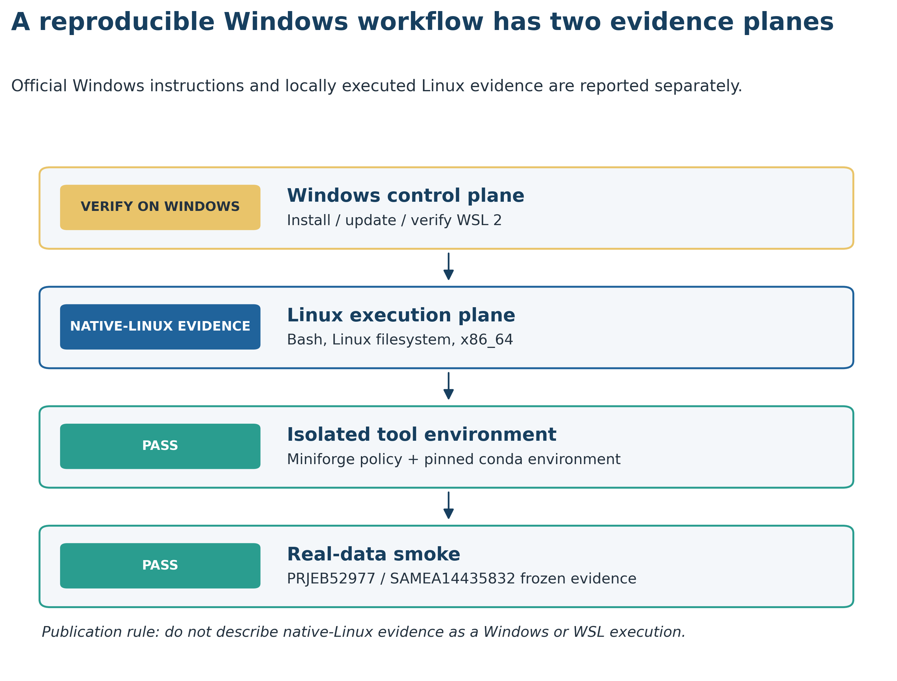
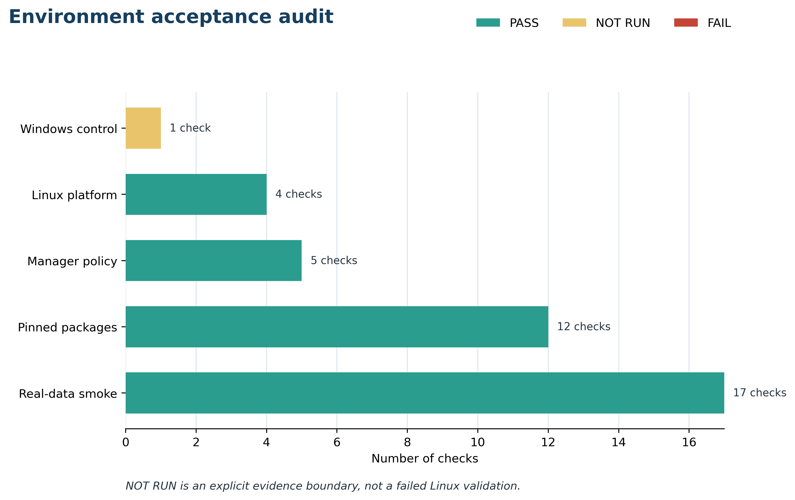

> **学习目标：**在 Windows 10/11 上建立 WSL2 Linux 执行层；分清 PowerShell、Ubuntu Bash、`base` 与命名环境；把项目放在 Linux 文件系统；用版本固定的 Miniforge、`conda`/`mamba`、环境 YAML 和 Linux 平台 explicit spec 管理软件；最后用真实公开数据证明“命令能运行、输入身份正确、结果可审计”。  
> **真实数据：**环境冒烟读取 Meslier 等 71-strain MOCK1 的已固化 ENA 证据 [@meslier2022platforms]：project `PRJEB52977`、sample `SAMEA14435832`、4 个 checksum-identified FASTQ sources，以及 Illumina、历史 ONT R9、PacBio CCS 各 5,000 条 records 的 15,000 行指标。原始 FASTQ 不进入 Git。  
> **预计资源：**WSL2 与 Ubuntu 首次安装通常需 10–25 分钟并重启 Windows；Miniforge 和本文环境的求解/下载时间取决于网络与缓存。一次原生 Linux 实测解析为 71 个包，环境占用约 409 MB；验证约需 1 核、低于 1 GB RAM、1–2 分钟。若要继续完整 short-read QC 与 profiling，建议从 8 核、16–32 GB RAM、至少 200 GB Linux 侧可用磁盘起步；组装、分箱和大型数据库常需更高配置，必须按第 10–11 篇重新估算。没有服务器时，先用本章固化表完成学习和审计，把完整 FASTQ、数据库与组装任务提交到 HPC 或合规云环境。

## 这一步对应论文里的哪张图 {#sec-target}

### 环境证据应该出现在 Methods 和 Supplementary workflow

环境搭建不产生生物学效应值，却决定论文中的命令能否被第三方重跑。它通常对应：

1. Methods 的 **Computational environment**，报告 host/guest 操作系统、软件环境、版本和文件系统；
2. Supplementary Methods 的 **reproducibility workflow**，说明 Windows、WSL2、Linux、环境管理器、工具和数据的层次；
3. 代码仓库中的 machine-readable audit，保存环境文件 hash、包 build、输入 hash 和验收状态。

关键不是截一张“终端没有报错”的图，而是把两个证据平面分开：

- **Windows control plane**：`wsl.exe --install`、`wsl.exe --update`、distribution 是否为 `VERSION 2`；
- **Linux execution plane**：Linux kernel、架构、文件系统、`conda`/`mamba`、命名环境、命令入口和真实输入。

{#fig-wsl2-layer-map}

这条边界非常重要。本仓库在原生 Ubuntu Linux 上执行了环境和数据审计，不能据此写成“已在 Windows 11 + WSL2 实测”。Windows 用户应在自己的 PowerShell 中补齐 `wsl.exe` 证据，再在 Ubuntu 中运行同一套 Linux 侧验证。

### 一次完整验收包含通过、失败和明确未运行

2026-07-19 的本地审计得到：

| Evidence group | PASS | NOT RUN | FAIL | 解释 |
|---|---:|---:|---:|---|
| Windows control | 0 | 1 | 0 | 本机不是 Windows/WSL host |
| Linux platform | 4 | 0 | 0 | Linux、x86_64、ext4 与 storage boundary |
| Manager policy | 5 | 0 | 0 | conda/mamba、channel、priority、solver |
| Pinned packages | 12 | 0 | 0 | YAML、4 个直接依赖、命令入口、explicit spec |
| Real-data smoke | 17 | 0 | 0 | 三个输入 hash、accession、行数、平台平衡等 |

{#fig-environment-validation}

::: {.callout-important title="NOT RUN 不能改写成 PASS，也不等于整套验证失败"}
原生 Linux 已证明命令合同可以在 Linux x86_64 执行；它没有证明 Windows 版本、虚拟化开关、WSL release、distribution version 或 `.wslconfig`。Methods 应逐项报告真实证据，不用一个“environment validated”掩盖不同层级。
:::

## 理论：WSL2、conda 与 mamba 分别解决什么问题 {#sec-theory}

### 1. WSL2 是 Linux 执行层，不是 Windows 版 Bash 主题

WSL2 在轻量虚拟机中运行真实 Linux kernel。常见路径是：

```text
Windows 10/11
├── PowerShell / Windows Terminal
│   └── wsl.exe: install, update, list, shutdown
└── WSL2 virtual machine
    └── Ubuntu
        ├── Bash and Linux filesystem
        ├── Miniforge / conda / mamba
        ├── named bioinformatics environments
        └── project data, results and logs
```

因此同一个屏幕上可能出现两种命令：

```powershell
# Windows PowerShell
wsl.exe --list --verbose
```

```bash
# Ubuntu / WSL2 Bash
uname -srm
conda --version
```

PowerShell 不直接执行 Linux ELF 二进制；Ubuntu Bash 也不把 PowerShell cmdlet 当作 Linux 命令。复制代码前先看提示符和代码块语言。

### 2. WSL1 与 WSL2 不是可忽略的版本号

Microsoft 当前的一键安装路线要求 Windows 10 version 2004（build 19041）或更高版本，或 Windows 11；新安装默认使用 WSL2。最终仍要用：

```powershell
wsl.exe --list --verbose
```

确认目标 distribution 的 `VERSION` 为 `2`。只看到 Ubuntu 名称或能打开 Bash，不足以证明正在使用 WSL2。

### 3. 计算靠近 Linux 文件系统，查看可以留在 Windows

Microsoft 对跨文件系统工作的建议很直接：若使用 Linux command line，就把活动项目放在 WSL Linux 文件系统，例如：

```text
/home/<linux-user>/projects/metagenomics-best-practices
```

不要把 I/O-heavy 项目主目录放在：

```text
/mnt/c/Users/<windows-user>/Desktop/metagenomics-best-practices
```

FASTQ 解压、临时排序、数据库索引、组装图和数万个小文件会放大跨文件系统开销。Windows Explorer 仍可通过 `\\wsl$` 或在 Ubuntu 目录运行 `explorer.exe .` 查看 Linux 文件。

“项目在 Linux 文件系统”与“备份只存在 WSL 虚拟磁盘”是两件事。代码应进 Git；小表、环境文件和日志应版本化；大型 FASTQ/数据库应放在有备份策略的存储，而不是只依赖一份动态扩展的 WSL 虚拟磁盘。

### 4. conda 管隔离环境，mamba 加速同一套求解

Conda 环境把不同版本的 Python、R 和命令行工具隔离到命名目录。Mamba 使用相同的包生态与环境概念，重点改善依赖求解和下载体验。两者不是两套互不兼容的环境：

```bash
mamba env create --file env/platform-smoke.yml
conda run -n metagenome-platform-smoke-2026.07 seqkit version
```

这里的职责分工是：

| Component | 负责 | 不负责 |
|---|---|---|
| WSL2 | 提供 Windows 上的 Linux kernel/guest | 不锁生信软件版本 |
| Miniforge | 提供 conda、mamba 与 conda-forge 基线 | 不替项目选择工具链 |
| `environment.yml` | 声明环境名、channels、直接依赖 | 不固定数据库 release |
| mamba | 求解与安装依赖 | 不证明工具对真实输入可用 |
| validator | 验证版本、命令、输入与输出合同 | 不替代完整科学分析 |

### 5. `base` 是管理器，不是宏基因组百宝箱

Mamba 官方文档建议从 Miniforge 开始，并明确提醒不要把分析软件安装进 `base`。`base` 应主要维护 `conda`/`mamba` 本身；具体项目使用命名环境：

```text
base
├── metagenome-platform-smoke-2026.07
├── future-biobakery-<validated-release>
├── future-assembly-<validated-release>
└── future-r-<validated-release>
```

把 MetaPhlAn、HUMAnN、Kraken2、GTDB-Tk、CheckM2、R 和深度学习包全塞进一个环境，短期看似省事，长期会把版本冲突、升级和 Methods 追踪绑在一起。第 11 篇会在真实运行后分别固定 bioBakery 与 assembly toolchains；本章不提前宣称它们已安装。

### 6. channel 是依赖合同的一部分

Bioconda 通常依赖 conda-forge。channel 顺序、是否混入 `defaults`、priority 是否 `strict` 都会改变 solve。本文的最小 YAML 使用：

```yaml
channels:
  - conda-forge
  - bioconda
  - nodefaults
```

`nodefaults` 阻止环境文件隐式引入 Anaconda default channels；host manager 同时审计：

```text
channels: conda-forge
channel_priority: strict
solver: libmamba
```

不要为了解决一次冲突不断追加 channels。正确做法是先确认官方推荐顺序、操作系统、架构和包兼容区间，再决定拆环境或换 release。

### 7. 环境 YAML、explicit spec 和容器解决不同强度的问题

| Artifact | 优点 | 局限 | 适合用途 |
|---|---|---|---|
| From-history YAML | 简洁、可读、较可移植 | transitive dependency 可能随时间变化 | 人类维护与跨机器重求解 |
| 完整 environment YAML | 可声明 direct pins 与 channels | build 仍可能变化 | 项目主合同 |
| `conda list --explicit` | 固定 Linux 平台每个包 URL/build | 平台相关，不可直接移植到 macOS/Windows | 同架构恢复与审计 |
| Container image digest | 固定 runtime filesystem | 数据库、CPU/GPU 驱动和外部挂载仍需记录 | HPC/云端执行 |

本文同时保留可读 YAML 与 `explicit-linux-64.txt`。后者是 Linux x86_64 平台锁，不应拿去创建 Windows-native environment。WSL2 中运行的 Ubuntu 使用 Linux packages，因此与 Linux HPC 更接近，而不是与 Windows-native conda 更接近。

### 8. “安装成功”至少有五层证据

1. **platform**：Linux、架构、文件系统；
2. **manager**：conda/mamba 可调用，channels/priority/solver 正确；
3. **packages**：请求版本与实际 package metadata 一致；
4. **entrypoints**：真实运行 `python`、`seqkit`、`pigz`、Matplotlib import；
5. **data smoke**：固定公开输入的 hash、accession、行数和结构全部正确。

只运行 `conda env list` 只能证明目录存在；只运行 `which seqkit` 只能证明 PATH 中有同名入口；只有真实输入冒烟才能发现“环境看起来正常，但读错了数据或工作目录”的问题。

## 准备工作 {#sec-setup}

<details>
<summary>展开：系统条件、固定输入、环境文件与作图函数</summary>

### Windows 侧最低条件

- Windows 10 version 2004（build 19041）或更高，或 Windows 11；
- BIOS/UEFI virtualization 可用，单位管控电脑需管理员或 IT 支持；
- 安装阶段可在 Administrator PowerShell 中运行 `wsl.exe`；
- Windows 磁盘为 Ubuntu、环境、项目与数据库保留足够空间；
- 计划做大规模组装时，提前申请 HPC，不把 WSL2 当成无限内存服务器。

### Ubuntu 侧基础命令

```bash
sudo apt-get update
sudo apt-get install -y ca-certificates curl git bzip2
```

这些命令只安装下载与版本控制基础。宏基因组软件由命名环境管理，不用 `sudo pip install` 混入系统 Python。

### 本章固定输入

```text
env/platform-smoke.yml
data/small/09-environment-contract.tsv
data/small/09-data-NOTICE.txt
data/small/08-ena-fastq-sources.tsv
data/small/08-prefix-source-summary.json
data/small/08-read-prefix-metrics.tsv
scripts/validate_article09_environment.py
```

前三个真实数据输入来自同一 MOCK1：

```bash
head -n 5 data/small/08-ena-fastq-sources.tsv
python - <<'PY'
import json
from pathlib import Path

summary = json.loads(
    Path("data/small/08-prefix-source-summary.json").read_text()
)
print(summary["source_project"])
print(summary["sample_accession"])
print(summary["metrics_rows"])
print(summary["raw_fastq_stored"])
PY
```

预期关键字段：

```text
PRJEB52977
SAMEA14435832
15000
False
```

### 固定环境文件

```yaml
name: metagenome-platform-smoke-2026.07
channels:
  - conda-forge
  - bioconda
  - nodefaults
dependencies:
  - python=3.12.13
  - seqkit=2.10.0
  - pigz=2.8
  - matplotlib-base=3.10.5
```

文件 SHA-256：

```text
8f758b6ffdcf1561ece7d187ff34bc3f5a174fd8c6da66a101b206fcc869d20c
```

### 内联出版作图函数

验证脚本已包含图形实现。若单独从审计表作图，可复用以下 Python 接口；图内标签必须使用英文。

```python
from pathlib import Path
import random
import matplotlib.pyplot as plt

random.seed(20260719)

pal_pub = {
    "blue": "#20639B",
    "teal": "#2A9D8F",
    "orange": "#E9C46A",
    "red": "#C44536",
    "ink": "#24323F",
}

def scale_color_pub(levels):
    return [pal_pub[level] for level in levels]

def scale_fill_pub(levels):
    return [pal_pub[level] for level in levels]

def theme_pub(ax):
    ax.spines[["top", "right"]].set_visible(False)
    ax.grid(axis="x", color="#DDE5EC", linewidth=0.8)
    ax.set_axisbelow(True)
    return ax

def save_pub(fig, stem, width=10.2, height=6.2):
    out = Path("figures")
    out.mkdir(parents=True, exist_ok=True)
    fig.set_size_inches(width, height)
    fig.savefig(out / f"{stem}.pdf", bbox_inches="tight")
    fig.savefig(out / f"{stem}.png", dpi=350, bbox_inches="tight")
    fig.savefig(
        out / f"{stem}.tiff",
        dpi=350,
        bbox_inches="tight",
        pil_kwargs={"compression": "tiff_lzw"},
    )
```

这里虽然固定了随机种子，但正式验证没有随机抽样：所有 15,000 行都是 checksum-identified 文件的确定性前缀衍生指标。

</details>

## 可复制代码 {#sec-code}

### 步骤 1：在 Administrator PowerShell 安装并确认 WSL2

先打开“以管理员身份运行”的 PowerShell：

```powershell
wsl.exe --install
```

完成后重启 Windows，首次启动 Ubuntu 时创建 Linux username/password。若 WSL 已安装但没有目标 distribution：

```powershell
wsl.exe --list --online
wsl.exe --install -d Ubuntu
```

更新 WSL 并查看状态：

```powershell
wsl.exe --update
wsl.exe --status
wsl.exe --version
wsl.exe --list --verbose
```

验收目标是 Ubuntu 所在行的 `VERSION` 为 `2`。若为 `1`：

```powershell
wsl.exe --set-default-version 2
wsl.exe --set-version Ubuntu 2
wsl.exe --list --verbose
```

::: {.callout-warning title="转换 distribution 前先确认备份与磁盘空间"}
已有大型 WSL1 distribution 的转换会消耗时间和临时空间。不要在不知道 distribution 中有什么数据时执行 unregister、删除虚拟磁盘或手工压缩操作。
:::

### 步骤 2：在 Ubuntu 验证 Linux 执行层

以下命令必须在 Ubuntu Bash 中运行：

```bash
set -euo pipefail

uname -srm
cat /etc/os-release
printf 'shell=%s\n' "$SHELL"
printf 'home=%s\n' "$HOME"
```

WSL2 guest 的 `/proc/version` 通常含 Microsoft/WSL 标记：

```bash
grep -Ei 'microsoft|wsl' /proc/version || true
```

若在机构 Linux 服务器上运行，grep 没有结果是正常的；此时应报告 native Linux，而不是 WSL2。

### 步骤 3：把项目放进 Linux 文件系统

```bash
mkdir -p "$HOME/projects"
cd "$HOME/projects"

git clone https://github.com/petemeng/metagenomics-best-practices.git
cd metagenomics-best-practices

pwd
findmnt -T . -no FSTYPE,TARGET
```

在 WSL2 中增加路径门：

```bash
case "$PWD" in
  /mnt/[A-Za-z]/*)
    echo "ERROR: move the active project to the WSL Linux filesystem" >&2
    exit 1
    ;;
  *)
    echo "PASS: project is not under a Windows-mounted drive"
    ;;
esac
```

用 Windows Explorer 查看当前 Linux 目录：

```bash
explorer.exe .
```

这只是查看入口，不是把项目复制回 `C:\Users\...\Desktop` 后继续跑重型 I/O。

### 步骤 4：下载并校验固定 Miniforge 安装器

先确认架构：

```bash
test "$(uname -m)" = "x86_64"
```

固定 release 与 asset：

```bash
MINIFORGE_VERSION="26.3.2-2"
INSTALLER="Miniforge3-${MINIFORGE_VERSION}-Linux-x86_64.sh"
URL="https://github.com/conda-forge/miniforge/releases/download/${MINIFORGE_VERSION}/${INSTALLER}"
EXPECTED_SHA256="42260ffe3830fb953d5eee1bbb32229ff06aa7c3833c1ed7a9a0420a95685d94"

curl -fL --retry 3 --output "$INSTALLER" "$URL"
printf '%s  %s\n' "$EXPECTED_SHA256" "$INSTALLER" | sha256sum -c -
```

只有看到：

```text
Miniforge3-26.3.2-2-Linux-x86_64.sh: OK
```

才执行安装：

```bash
bash "$INSTALLER" -b -p "$HOME/miniforge3"
"$HOME/miniforge3/bin/conda" init bash
exec bash
```

不要使用未经校验的 `curl ... | bash`。若未来改用新 release，必须同时更新 asset name、SHA-256、环境验证日期和 Methods；不能把本章 checksum 套在未来的 `latest` 文件上。

### 步骤 5：审计 manager 与 channel policy

```bash
conda --version
mamba --version
conda config --show channels channel_priority solver
```

新 Miniforge 应以 conda-forge 为基线。设置求解策略：

```bash
conda config --set channel_priority strict
conda config --set solver libmamba
```

若输出中出现 `defaults`，先查看来源：

```bash
conda config --show-sources
```

这个命令可能暴露用户路径、内部 channel、proxy 或 token。它只用于本机排错，不直接复制到论文、issue 或公开日志。本文 validator 只读取 `channels`、`channel_priority`、`solver` 三个安全字段。

### 步骤 6：从 YAML 创建命名环境

先校验环境文件身份：

```bash
sha256sum env/platform-smoke.yml
```

预期：

```text
8f758b6ffdcf1561ece7d187ff34bc3f5a174fd8c6da66a101b206fcc869d20c  env/platform-smoke.yml
```

创建环境：

```bash
mamba env create --file env/platform-smoke.yml
```

若环境已存在且 YAML 没有变化，不需要重复创建。若 YAML 有受控更新：

```bash
mamba env update --file env/platform-smoke.yml
```

先做 dry run 可查看求解计划：

```bash
mamba env create --dry-run --file env/platform-smoke.yml
```

不要用 `mamba install ...` 临时修补后忘记更新 YAML。交互历史不是环境合同。

### 步骤 7：不依赖 activation，直接验证命令入口

```bash
ENV_NAME="metagenome-platform-smoke-2026.07"

conda run -n "$ENV_NAME" python --version
conda run -n "$ENV_NAME" seqkit version
conda run -n "$ENV_NAME" pigz --version
conda run -n "$ENV_NAME" python -c \
  'import matplotlib; print(matplotlib.__version__)'
```

固定结果：

```text
Python 3.12.13
seqkit v2.10.0
pigz 2.8
3.10.5
```

实际 package builds 为：

| Package | Version | Build | Channel |
|---|---:|---|---|
| python | 3.12.13 | `hd63d673_0_cpython` | conda-forge |
| seqkit | 2.10.0 | `he881be0_1` | bioconda |
| pigz | 2.8 | `h421ea60_2` | conda-forge |
| matplotlib-base | 3.10.5 | `py312he3d6523_0` | conda-forge |

这些 build 是 2026-07-19 Linux x86_64 实测结果；未来重新求解若 build 变化，应生成新的 explicit spec 和 QA 证据，不静默覆盖旧 Methods。

### 步骤 8：用真实公开数据运行完整审计

```bash
ENV_NAME="metagenome-platform-smoke-2026.07"

conda run -n "$ENV_NAME" python \
  scripts/validate_article09_environment.py \
  --project-root . \
  --output-dir results/09-wsl2-conda \
  --figure-dir figures
```

输出合同：

```text
results/09-wsl2-conda/
├── environment-audit.tsv
├── package-audit.tsv
├── data-smoke.tsv
├── environment-summary.json
├── environment-validation.log
└── explicit-linux-64.txt

figures/
├── 09-wsl2-layer-map.{pdf,png,tiff}
└── 09-environment-validation.{pdf,png,tiff}
```

一次原生 Linux 实测摘要：

```json
{
  "status": "passed",
  "validation_scope": "native-linux",
  "windows_control_plane_validated": false,
  "linux_execution_plane_validated": true,
  "environment_name": "metagenome-platform-smoke-2026.07",
  "package_count": 71,
  "environment_checks": {"NOT_RUN": 1, "PASS": 21},
  "data_checks": {"PASS": 17},
  "project_accession": "PRJEB52977",
  "sample_accession": "SAMEA14435832",
  "metrics_rows": 15000,
  "raw_fastq_stored": false
}
```

在 WSL2 guest 中，`validation_scope` 应变为 `wsl-linux-execution-plane`；Windows control 仍需 PowerShell 的独立证据。

### 步骤 9：在 Windows 保存 WSL control-plane 证据

在 PowerShell 中进入一个不含敏感信息的报告目录：

```powershell
$Evidence = "$HOME\wsl2-environment-evidence.txt"
wsl.exe --status | Out-File -Encoding utf8 $Evidence
wsl.exe --version | Out-File -Encoding utf8 -Append $Evidence
wsl.exe --list --verbose | Out-File -Encoding utf8 -Append $Evidence
Get-Content $Evidence
```

公开前检查文件，不要附带 Windows username、内部路径、企业 policy、IP 或其他 distribution 中的敏感名称。论文只需报告实际使用的 distribution、WSL version 和 `VERSION 2` 证据。

### 步骤 10：记录环境指纹

可读 YAML 用于维护，explicit spec 用于同平台重建：

```bash
conda env export -n metagenome-platform-smoke-2026.07 \
  --from-history > results/09-wsl2-conda/from-history.yml

conda list --explicit \
  -n metagenome-platform-smoke-2026.07 \
  > results/09-wsl2-conda/explicit-linux-64.txt
```

检查 direct dependencies 与总 resolved packages：

```bash
conda list -n metagenome-platform-smoke-2026.07 \
  python seqkit pigz matplotlib-base

conda list -n metagenome-platform-smoke-2026.07 --json \
  | conda run -n metagenome-platform-smoke-2026.07 python -c \
    'import json,sys; print(len(json.load(sys.stdin)))'
```

本次为 4 个 direct pins、71 个 resolved packages。Methods 应报告直接依赖和锁文件；不需要在正文堆出 71 个包名。

## 审计与升级 {#sec-audit}

### 1. 忠实区分本机事实与推荐路线

本次证据机的事实是：

| Field | Observed |
|---|---|
| Validation scope | Native Linux |
| OS | Ubuntu 22.04.5 LTS |
| Kernel | Linux 6.8.0-49-generic |
| Architecture | x86_64 |
| Project filesystem | ext4 |
| Existing distribution | Miniconda-based manager |
| conda / mamba | 26.1.1 / 2.5.0 |
| Environment | 71 packages, about 409 MB |
| Windows/WSL control plane | Not run |

新读者仍推荐 Miniforge，是因为 Mamba 官方当前推荐 fresh Miniforge install，并提醒避免 defaults 与 `base` 污染；不是因为本次证据机下载并执行过该安装器。审计明确记录：

```text
miniforge_installer_downloaded_on_host: false
```

把“推荐什么”与“本机实际用了什么”分开，Methods 才不会把安装说明冒充运行证据。

### 2. 更新安装器时，checksum 和兼容性一起升级

`26.3.2-2` 是 2026-07-19 固定的 release，不是永久的“最新版”。升级步骤应是：

1. 阅读新 release notes；
2. 选择与 `uname -m` 对应的 asset；
3. 从同一 release 获取 checksum；
4. 在干净环境 dry run；
5. 运行版本、真实数据与图形审计；
6. 新建 manifest/QA 版本，不覆盖旧证据。

只把 URL 中的版本号改掉而保留旧 SHA-256，会正确地失败；这是校验门在工作。

### 3. YAML 可重求解不等于今天和明天字节相同

YAML 固定直接依赖版本，但 channel 中 transitive builds 仍可能变化。论文归档时同时保留：

- `env/platform-smoke.yml` 与 SHA-256；
- `results/09-wsl2-conda/explicit-linux-64.txt`；
- `package-audit.tsv`；
- container digest（若正式流程使用）；
- 数据库 release、manifest 与文件 checksum。

Explicit spec 适合相同 Linux platform；跨架构或跨操作系统应重新求解并重新验收，不能强行安装错误平台的二进制。

### 4. 数据库版本不能藏在 conda 环境里

MetaPhlAn marker database、HUMAnN nucleotide/protein databases、Kraken2 library、GTDB、CheckM2、CARD 等都可能比环境本身大几个数量级。Methods 至少要分开记录：

```text
Tool package version
Database name and release
Download URL / manifest
Checksum or file inventory
Build command and date
```

“MetaPhlAn installed”不证明数据库存在；“Kraken2 ran”也不说明使用的是 Standard、PlusPF、GTDB-derived 还是自建 library。第 11 篇会把工具与数据库分层锁定。

### 5. 不把所有软件塞进同一个环境

建议按冲突域拆分：

| Environment family | 典型任务 | 拆分理由 |
|---|---|---|
| platform smoke | Python、SeqKit、pigz、审计图 | 验证基础平台 |
| read profiling | MetaPhlAn/HUMAnN 等 | Python 与数据库依赖集中 |
| k-mer profiling | Kraken2/Bracken | 独立数据库与命令栈 |
| assembly/binning | assembler、binner、CoverM | C/C++/Rust 与高算力工具 |
| MAG QC/taxonomy | CheckM2、GUNC、GTDB-Tk | 大模型/数据库与版本耦合 |
| downstream R | curatedMetagenomicData、统计与绘图 | Bioconductor/CRAN 生命周期 |

环境之间通过 TSV/BIOM/FASTA/BAM/JSON 等明确文件接口连接，而不是通过同一个被不断修改的 `base`。

### 6. WSL2 资源配置要给 Windows 留余量

`.wslconfig` 位于 Windows `%UserProfile%`，作用于 WSL2 VM，而 `/etc/wsl.conf` 位于 distribution 内部，负责另一组 guest 设置。二者不能互换。

对一台 32 GB RAM、12 logical-CPU 的个人工作站，一个仅供评估的例子可能是：

```ini
[wsl2]
memory=24GB
processors=8
swap=8GB
```

这不是通用配置。小于 32 GB 的机器不能照抄 24 GB；需要同时给 Windows、浏览器、编辑器和文件缓存留空间。修改后按 Microsoft 文档使用：

```powershell
wsl.exe --shutdown
```

再启动 Ubuntu。当前 WSL Settings 提供图形化管理入口，优先使用官方当前界面与文档。若任务实际需要 64–256 GB RAM 或长期多样本并行，迁移到 HPC 比不断挤压个人电脑更可靠。

### 7. 公开审计只输出必要字段

以下内容经常出现在 `conda info --all`、`.condarc`、shell environment 或完整日志中：

- username 与 home path；
- 内部 filesystem mount；
- proxy URL 与用户名；
- private channel token；
- 云凭证；
- 内部 hostname/IP。

本文日志用 `<PROJECT_ROOT>`、`<HOME>` 与 `<PROXY_REDACTED>` 归一化路径/代理，只查询安全的 channel 字段，不公开完整 `.condarc`。这不是为了美化日志，而是最小化不必要的信息泄漏。

### 8. 真实数据冒烟防止“环境正确、输入错误”

环境 validator 不只检查版本，还锁定三个输入 SHA-256，并验证：

- project `PRJEB52977`；
- sample `SAMEA14435832`；
- 4 行 FASTQ source metadata；
- 15,000 行 metrics；
- Illumina/ONT/PacBio 各 5,000 行；
- `raw_fastq_stored == false`；
- Illumina prefix mate IDs 同步。

这道门会捕获同名文件被替换、工作目录错误、表被截断、平台丢失或 raw-data boundary 漂移。后续每个工具环境也应有自己的真实输入与预期输出，而不是只复用本章的基础冒烟。

### 9. 当前标准下还应补什么

正式投稿项目应在本章基础上增加：

1. Windows 侧 WSL status/version 证据；
2. Ubuntu distribution release 与 WSL kernel；
3. host CPU/RAM 与 `.wslconfig`（若使用）；
4. 每个分析环境的 YAML、explicit lock 或 container digest；
5. 数据库 release/checksum；
6. workflow engine version、命令与配置；
7. 每个步骤的 CPU、wall time、peak RSS、scratch；
8. 失败重试、日志、输入输出 checksum；
9. CI 或独立机器 smoke test。

本章通过的是平台 smoke contract，不是 bioBakery、assembly、MAG 或整项研究的验收。

## 出版级美化 {#sec-polish}

### 1. 环境图要展示证据层级

图 @fig-wsl2-layer-map 用四层结构替代终端截图：

- 黄色明确标识 “VERIFY ON WINDOWS”；
- 蓝色标识本机真实的 “NATIVE-LINUX EVIDENCE”；
- 绿色只用于已执行并通过的环境和数据；
- 图注再次限制 inference boundary。

这种表达比“安装成功”截图更适合 Supplementary Methods，因为读者能立即看出哪些结论有执行证据，哪些仍待另一台主机补齐。

### 2. 审计图保留 NOT RUN

图 @fig-environment-validation 不把 `NOT RUN` 归为 `FAIL`，也不把它抹掉。审计状态推荐固定为：

```text
PASS      observed == expected
FAIL      observed != expected, blocks continuation
NOT RUN   outside the current evidence scope
```

不要使用模糊的绿色 “OK” 同时覆盖三种情况。

### 3. 输出格式

验证脚本一次生成：

- PDF：矢量文字与形状，适合论文排版；
- PNG：350 dpi，适合网页与公众号；
- TIFF：350 dpi、LZW compression，适合期刊提交。

图内所有文字为英文；中文解释留在正文与图注。路径、username、proxy 和 host-specific mount target 不进入图中。

## 常见坑 {#sec-pitfalls}

::: {.callout-caution title="坑 1：把 PowerShell 命令粘进 Ubuntu"}
**症状：**`wsl.exe --install`、`Get-Content` 或 `Out-File` 报 command not found。  
**原因：**当前 shell 是 Bash。  
**检查：**`printf '%s\n' "$SHELL"`；PowerShell 中查看 `$PSVersionTable`。  
**修复：**Windows control commands 回到 PowerShell；Linux commands 留在 Ubuntu。
:::

::: {.callout-caution title="坑 2：Ubuntu 能打开，但 distribution 仍是 WSL1"}
**症状：**命令能跑，却没有预期的 WSL2 行为。  
**检查：**在 PowerShell 执行 `wsl.exe --list --verbose`。  
**修复：**确认目标 distribution 的 `VERSION 2`；转换前先备份并确认磁盘空间。
:::

::: {.callout-caution title="坑 3：项目放在 /mnt/c"}
**症状：**解压、数据库、组装和大量小文件明显变慢。  
**检查：**`pwd` 与 `findmnt -T .`。  
**修复：**把活动项目放到 `/home/<user>/projects`；Windows 用 `\\wsl$` 查看。
:::

::: {.callout-caution title="坑 4：把所有包安装进 base"}
**症状：**升级一个工具后另一个入口消失，或 `conda` 自身依赖被改变。  
**检查：**`conda info --envs` 与 `conda list -n base`。  
**修复：**保持 `base` 只负责 manager；按工具族创建命名环境。
:::

::: {.callout-caution title="坑 5：channel 混入 defaults 或顺序漂移"}
**症状：**同一 YAML 在不同机器 solve 出不同来源，或出现 ABI conflict。  
**检查：**`conda config --show channels channel_priority solver`。  
**修复：**使用 conda-forge → bioconda → nodefaults 合同与 strict priority；先查 config 来源，不盲目追加 channel。
:::

::: {.callout-caution title="坑 6：conda activate 报 shell not initialized"}
**症状：**`CommandNotFoundError: Your shell has not been properly configured`。  
**修复：**

```bash
"$HOME/miniforge3/bin/conda" init bash
exec bash
```

自动化脚本优先用 `conda run -n <env> ...`，减少交互 shell 状态依赖。
:::

::: {.callout-caution title="坑 7：which 找到的是错误环境"}
**症状：**版本命令与 YAML 不一致。  
**检查：**

```bash
command -v conda
command -v python
conda run -n metagenome-platform-smoke-2026.07 \
  python -c 'import sys; print(sys.executable)'
```

公开日志中不要保留真实 home prefix；验证器会归一化本地路径。
:::

::: {.callout-caution title="坑 8：YAML 能解但无法复现旧 build"}
**症状：**direct versions 相同，transitive packages 或图形输出却变化。  
**修复：**归档 YAML hash、package audit 与 `conda list --explicit`；重大升级新建环境名并重跑真实数据验收。
:::

::: {.callout-caution title="坑 9：WSL2 OOM 或 Windows 同时卡死"}
**症状：**Linux process 被杀，Windows 也失去响应。  
**检查：**Ubuntu 中查看 `free -h`、`dmesg`；Windows 查看 WSL Settings/`.wslconfig`。  
**修复：**降低并行度、给 Windows 留余量、扩大受控 swap；若任务超过个人机等级，提交 HPC。
:::

::: {.callout-caution title="坑 10：虚拟磁盘和数据库把 C: 盘占满"}
**症状：**environment solve、数据库解压或 assembly 中途失败。  
**检查：**`df -h`、`du -sh ~/miniforge3 ~/projects/*`，以及 Windows 可用空间。  
**修复：**数据/数据库分层、清理前先审计、建立备份与迁移方案。不要在不理解内容时删除整个 conda cache、distribution 或 VHDX。
:::

::: {.callout-caution title="坑 11：脚本出现 bash\\r"}
**症状：**`/usr/bin/env: 'bash\\r': No such file or directory`。  
**原因：**Windows CRLF line endings。  
**修复：**

```bash
git config --global core.autocrlf input
sed -i 's/\r$//' path/to/script.sh
```

只对确认是文本脚本的文件执行转换。
:::

::: {.callout-caution title="坑 12：为排错公开完整 .condarc 或 proxy"}
**症状：**issue/log 中出现内部 URL、用户名或 token。  
**修复：**只报告必要的 channels、priority、solver；发布前查找 `proxy`、`token`、home path 和 hostname，并进行脱敏。
:::

## 这段 Methods 怎么写 {#sec-methods}

### Windows + WSL2 版本

> Computational analyses were executed in Ubuntu [distribution release] under Windows Subsystem for Linux 2 (WSL version [version]; the target distribution reported VERSION 2), rather than with Windows-native bioinformatics binaries. Active project files were stored in the WSL Linux filesystem rather than under `/mnt/c`. Miniforge 26.3.2-2 was installed from the Linux x86_64 installer after SHA-256 verification (`42260ffe...85d94`). Environments were resolved with mamba [version] using conda-forge and Bioconda with strict channel priority. The platform smoke environment (`metagenome-platform-smoke-2026.07`; YAML SHA-256 `8f758b6f...69d20c`) pinned Python 3.12.13, SeqKit 2.10.0, pigz 2.8, and Matplotlib 3.10.5; an exact Linux-64 package specification was archived. Windows control-plane status and Linux execution-plane checks were retained separately. Input identity and command availability were tested against frozen evidence derived from ENA project PRJEB52977, sample SAMEA14435832.

将方括号替换为该项目真实的 Windows/WSL/Ubuntu/manager 版本。若正式分析使用了其他环境、container、数据库或 HPC，必须继续追加实际版本与 digest，不能只引用 smoke environment。

### Native Linux 验证版本

> The portable Linux execution-plane contract was validated on native Ubuntu 22.04.5 LTS (Linux 6.8.0-49-generic, x86_64, ext4) using conda 26.1.1 and mamba 2.5.0. The named environment resolved 71 packages and passed 21 environment checks plus 17 real-data checks. Windows/WSL control-plane execution was not performed on this host and was recorded as NOT RUN. Full conda configuration, local prefixes, and proxy values were excluded from the public audit.

这段只描述本章证据，不应原样当作未来生物学项目的 Methods。未来项目应报告真正执行样本分析的机器、环境、数据库和 workflow。

::: {.callout-warning title="Methods 不能只写 conda environment was used"}
至少补充环境文件/hash、direct tool versions、channel policy、platform、数据库 release、容器 digest（若有）、数据输入和验收方式。只写“用了 conda”无法重建分析。
:::

## 换成你自己的数据怎么做 {#sec-own-data}

### 1. 先建立项目目录与存储合同

在 WSL2：

```bash
PROJECT="$HOME/projects/my-metagenome"
mkdir -p "$PROJECT"/{data/raw,data/manifest,db,env,logs,results,scripts}
cd "$PROJECT"

pwd
findmnt -T . -no FSTYPE,TARGET
df -h .
```

建议目录：

```text
my-metagenome/
├── data/
│   ├── raw/          # FASTQ，不进 Git
│   └── manifest/     # accession、checksum、sample sheet，可进 Git
├── db/               # 大数据库，不进 Git
├── env/              # YAML/lock，可进 Git
├── logs/             # 脱敏后归档
├── results/
└── scripts/
```

### 2. 为原始 FASTQ 建身份表

```bash
mkdir -p data/manifest

sha256sum data/raw/*.fastq.gz \
  > data/manifest/fastq.sha256

conda run -n metagenome-platform-smoke-2026.07 \
  pigz -t data/raw/sample_R1.fastq.gz

conda run -n metagenome-platform-smoke-2026.07 \
  pigz -t data/raw/sample_R2.fastq.gz

conda run -n metagenome-platform-smoke-2026.07 \
  seqkit stats -a -T \
  data/raw/sample_R1.fastq.gz \
  data/raw/sample_R2.fastq.gz \
  > data/manifest/seqkit-stats.tsv
```

至少记录：

| Field | Example |
|---|---|
| SampleID | `case_001` |
| Run accession | `ERR...` / `SRR...` |
| Layout | paired / single |
| R1/R2 path | project-relative path |
| SHA-256 / MD5 | source-appropriate checksum |
| Consent/access | public / controlled |
| Host content risk | yes/no/unknown |
| Planned endpoint | profiling / assembly / MAG / virus |

`pigz -t` 证明 gzip stream 可解压；`seqkit stats` 证明基本序列统计。它们不替代 R1/R2 ID 同步、adapter/quality、host privacy 或 downstream QC。

### 3. 改环境时新建版本，不覆盖旧证据

复制环境文件并修改 name：

```bash
cp env/platform-smoke.yml env/my-project-smoke-2026.07.yml
```

例如加入 `fastp` 时，同时固定版本、更新文件 hash、重新 solve 和验证：

```yaml
name: my-project-smoke-2026.07
channels:
  - conda-forge
  - bioconda
  - nodefaults
dependencies:
  - python=3.12.13
  - seqkit=2.10.0
  - pigz=2.8
  - matplotlib-base=3.10.5
  - fastp=<validated-version>
```

不要把 `<validated-version>` 当作可执行内容；先在第 13 篇的真实 FASTQ QC 中锁定实际 release、build、参数和输出。

### 4. 把 smoke acceptance 写成表

| Gate | PASS 条件 | FAIL 后动作 |
|---|---|---|
| Windows control | target distribution = VERSION 2 | 修复 WSL installation/version |
| Storage | WSL active project 不在 `/mnt/c` | 移动项目并重测 I/O |
| Manager | channel/priority/solver 符合合同 | 清理 config 来源后重求解 |
| Environment | requested = installed versions | 新建环境，不修补 base |
| FASTQ identity | checksum 与 manifest 一致 | 停止分析，重新获取输入 |
| Compression | `pigz -t` exit 0 | 重新下载/传输 |
| Structure | records 与 pairing 合理 | 审计 truncation/order |
| Privacy | host-removal/share gate 明确 | 不外发潜在人源 reads |

### 5. 何时离开 WSL2

出现以下任一情况，应优先使用 HPC/云，而不是继续在个人电脑堆并行：

- 单任务峰值内存超过 Windows 可稳定让给 WSL2 的范围；
- 数据库与 scratch 超过本地备份/磁盘能力；
- 多样本需要 scheduler、失败重试和长期运行；
- 受控人源数据要求机构存储、审计与访问控制；
- 组装、分箱、GTDB-Tk、CheckM2 等需要大型数据库或长 wall time。

迁移时保留同一 Linux 环境合同、输入 manifest 与结果接口；第 10 篇将补充 SLURM、Apptainer、资源估算和云端边界。

## 参考 {#sec-references}

1. Microsoft. [Install WSL](https://learn.microsoft.com/en-us/windows/wsl/install). 一键安装前提、`wsl --install`、更新与 VERSION 检查。
2. Microsoft. [What is the Windows Subsystem for Linux?](https://learn.microsoft.com/en-us/windows/wsl/about). WSL2 Linux kernel 与虚拟化架构。
3. Microsoft. [Working across Windows and Linux file systems](https://learn.microsoft.com/en-us/windows/wsl/filesystems). Linux workload 的文件系统放置建议。
4. Microsoft. [Advanced settings configuration in WSL](https://learn.microsoft.com/en-us/windows/wsl/wsl-config). `.wslconfig`、`wsl.conf` 与资源设置边界。
5. QuantStack and mamba contributors. [Mamba Installation](https://mamba.readthedocs.io/en/stable/installation/mamba-installation.html). Fresh Miniforge、避免 defaults 与不向 `base` 安装分析软件的建议。
6. conda-forge. [Miniforge release 26.3.2-2](https://github.com/conda-forge/miniforge/releases/tag/26.3.2-2). 本章固定的 Linux x86_64 installer release。
7. conda. [Managing environments](https://docs.conda.io/projects/conda/en/stable/user-guide/tasks/manage-environments.html). 命名环境、environment file 与环境导出。
8. Bioconda. [Usage](https://bioconda.github.io/). conda-forge/Bioconda channel 与生信包生态。
9. Meslier V, Quinquis B, Da Silva K, et al. Benchmarking second and third-generation sequencing platforms for microbial metagenomics. *Scientific Data*. 2022;9:694. doi:[10.1038/s41597-022-01762-z](https://doi.org/10.1038/s41597-022-01762-z).
