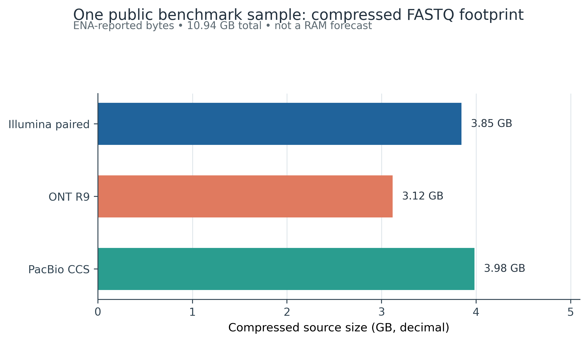
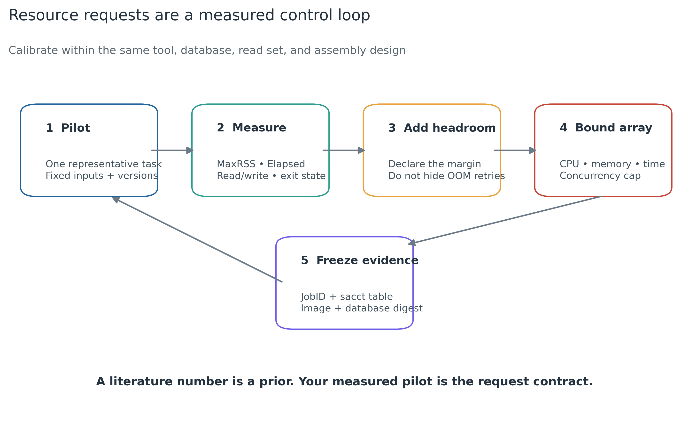

> **学习目标：**把“机器够不够”拆成 CPU、RAM、wall time、scratch、共享存储、数据库、网络与并发八个可审计量；用代表性任务实测峰值资源；决定本地工作站、机构 HPC 或合规云；用 Apptainer 固定运行环境；用 SLURM job array、任务级 scratch、原子输出和 checksum sentinel 让失败后只补跑缺失任务。  
> **真实数据：**盘点 Meslier 等 71-strain MOCK1 的同一样本 `SAMEA14435832` [@meslier2022platforms]。ENA 报告的 Illumina paired、历史 ONT R9 与 PacBio CCS 四个压缩 FASTQ 合计 `10,944,966,814` bytes；本地冒烟读取各平台前 5,000 条真实 records 的 15,000 行固化指标。三种平台用于资源合同示范，不会被合并成一个生物学分析输入。  
> **本章验证资源：**约 2 核、4 GB RAM、5 GB 临时空间、1–2 分钟；实际本地任务远低于这个申请。完整 read profiling、组装、分箱、GTDB-Tk 或大型数据库任务不能沿用该 smoke 配置，必须在同一工具、数据库、参数和代表性输入上重新测量。没有服务器时，可在个人电脑完成 manifest、少量 reads 冒烟和下游表分析，把组装及 genome-resolved 任务送到机构 HPC；云端只用于预算、合规、持久化和失败恢复均已设计好的任务。

## 这一步对应论文里的哪张图 {#sec-target}

### 资源图不是硬件购物清单

Zhang 等对 metagenome assemblers 的系统比较在 Figure 5 同时报告 real time 与 resident set size（RSS）；同一批 CAMI 数据上，不同 assembler 的耗时和峰值内存差异很大，部分组合超过服务器内存上限，另有运行超过 7 天 [@zhang2023assembly]。这张图最重要的结论不是“买多少 GB”，而是：

1. 资源消耗是 **tool × version × input × parameter × hardware** 的联合结果；
2. 运行成功所需 RAM 与压缩 FASTQ 大小不是固定倍数；
3. co-assembly、长读组装和多轮 polishing 会改变计算图，不能从 read profiling 外推；
4. Methods 应报告实测 `MaxRSS`、`Elapsed`、CPU、I/O 和失败状态，而不是只写服务器型号。

本次重绘先展示可直接核对的输入事实。一个公开 benchmark sample 的四个压缩 FASTQ 共 10.945 GB，其中 Illumina paired 为 3.845 GB、历史 ONT R9 为 3.117 GB、PacBio CCS 为 3.983 GB。

{#fig-input-resource-budget}

随后把资源申请变成闭环：代表性 pilot → 计量 → 显式余量 → 有上限的并发 → 保存 accounting 与环境指纹。

{#fig-resource-control-loop}

### 本地验证、容器运行和调度运行是三个证据平面

2026-07-19 的验证结果是：

| Evidence plane | Observed | Status | 可以支持的结论 |
|---|---|---|---|
| Native Linux host | Ubuntu 22.04.5, x86_64, 72 logical / 36 physical cores, ext4 | PASS | 本地执行层可盘点、可运行小任务 |
| Real-data task body | 3 × 5,000 records completed | PASS | 输入映射、scratch、输出校验能工作 |
| Resume contract | second run skipped 3/3 valid outputs | PASS | checksum sentinel 能阻止重复计算 |
| Current Apptainer CLI | absent | NOT RUN | 不能声称 Apptainer 已在本机执行 |
| Legacy Singularity | 3.7.2; SIF build passed, exec failed | EXPECTED FAIL | 暴露旧安装的 runtime 边界 |
| SLURM `sbatch` / `sacct` | absent | NOT RUN | 不能声称作业进入过调度器 |

{#fig-restart-safe-array}

::: {.callout-important title="本地跑过 shell script，不等于 SLURM 已验证"}
`#SBATCH` 行在普通 Bash 中只是注释。只有 `sbatch` 返回 JobID、任务进入 partition、`sacct` 能给出 State/ExitCode/MaxRSS/Elapsed 等记录，才有 scheduler 证据。本地语法检查和任务 body 冒烟很有价值，但必须保留 `NOT RUN` 标签。
:::

## 理论：怎样把算力变成可估计的合同 {#sec-theory}

### 1. 一次作业至少有八个资源维度

| 维度 | 常用观测 | 申请或约束 | 常见误判 |
|---|---|---|---|
| CPU | `AllocCPUS`, `TotalCPU` | `--cpus-per-task` | 核数翻倍就必然快一倍 |
| RAM | `MaxRSS` | `--mem` 或 `--mem-per-cpu` | 压缩 FASTQ × 固定倍数 |
| Wall time | `Elapsed` | `--time` | 把 CPU time 当 wall time |
| Scratch | peak temporary bytes | `$SLURM_TMPDIR` quota | 只算最终结果 |
| Shared storage | input/output/database bytes | project quota | 把 scratch 当永久存储 |
| I/O | read/write bytes, throughput | array concurrency | 只看 CPU utilization |
| Network | transfer size/retry/checksum | staging window | 用链路标称带宽算交付时间 |
| Scheduler | queue、partition、limits | array cap/QoS | 一次提交无上限数组 |

GPU 是第九个维度，但不是 shotgun workflow 的默认答案。只有工具明确支持并经真实任务证明加速、显存足够、CPU/I/O 不成为瓶颈时才申请 GPU。

### 2. 压缩输入大小只回答传输和最低存储

本次 10.945 GB 是 **compressed source footprint**。真正运行时还可能同时存在：

```text
compressed FASTQ
├── validated/staged copy
├── decompression stream or temporary FASTQ
├── host-depleted reads
├── alignment / name-sorted BAM
├── assembly graph + contigs
├── mapping indexes and depth matrices
├── bins / MAGs / annotations
└── container + database cache
```

因此 scratch 预算应逐项相加：

\[
S_{\text{request}} =
(S_{\text{inputs}} + S_{\text{intermediates,peak}} + S_{\text{outputs}} +
S_{\text{cache}})\times (1+h_S)
\]

`h_S` 是显式余量，不是隐藏的“经验倍数”。中间产物峰值必须由 pilot 或工具日志获得；不知道时就写 `unknown` 并先跑子集，不能拿 FASTQ 大小直接代入组装内存。

### 3. RAM 和 wall time 从代表性任务校准

对同一工具合同，初始申请可写成：

\[
M_{\text{request}} = \lceil M_{\text{peak,pilot}}\times(1+h_M)\rceil
\]

\[
T_{\text{request}} = \lceil T_{\text{pilot}}\times r_{\text{scale}}\times(1+h_T)\rceil
\]

其中：

- `M_peak,pilot` 是 `MaxRSS`，不是虚拟内存；
- `r_scale` 只在输入复杂度、参数、线程和数据库相近时估计；
- `h_M`、`h_T` 要写进资源合同；
- OOM 或 timeout 后的升级请求与重试次数要进入日志。

如果 pilot 是 1/20 reads，不能默认 assembly 时间和 RAM 都线性放大 20 倍。de Bruijn graph、重复序列、群落复杂度和 coverage 会造成非线性。

### 4. 核数、线程、任务和数组不能混用

典型单进程多线程工具：

```text
--ntasks=1
--cpus-per-task=16
tool --threads "$SLURM_CPUS_PER_TASK"
```

三个独立样本并不是 `--ntasks=3` 的同一个并行程序，而通常是三个 array elements。并发上限取四个瓶颈的最小值：

\[
C_{\max} =
\min\left(
\left\lfloor\frac{M_{\text{usable}}}{M_{\text{task}}}\right\rfloor,
\left\lfloor\frac{CPU_{\text{usable}}}{CPU_{\text{task}}}\right\rfloor,
\left\lfloor\frac{S_{\text{usable}}}{S_{\text{task}}}\right\rfloor,
C_{\text{scheduler}}
\right)
\]

`--array=1-100%8` 的 `%8` 是 I/O 与公平性合同，不只是防止内存爆掉。

### 5. 本地、HPC 与云的选择依据

| 场景 | 优先平台 | 原因 | 先确认什么 |
|---|---|---|---|
| 小型表分析、图形、少量 read smoke | Linux/WSL2 workstation | 反馈快、无需排队 | RAM、备份、Linux filesystem |
| 多样本 profiling、组装、分箱、大数据库 | institutional HPC | 大内存节点、共享数据库、scheduler | partition、quota、scratch、module |
| 受控人源数据 | approved institutional platform | 权限、审计、数据驻留 | DUA/IRB/访问控制 |
| 短期弹性大内存、可中断批处理 | compliant cloud | 按需扩缩 | 全生命周期预算、持久化、egress |
| co-assembly / 超大长读组装 | calibrated HPC/cloud | 单任务可能需要大内存与长 wall time | 代表性 pilot、checkpoint、配额 |

云端 Spot/抢占式实例只适合可恢复工作。AWS 的官方文档说明 Spot interruption notice 通常只有两分钟且为 best effort [@awsSpotNotice]；因此“价格更低”不能替代任务级 checkpoint、持久化输出和中断演练。本文不固定任何云价格：region、机型、磁盘、快照、对象存储、egress 与折扣会变化，提交前应生成带日期的成本清单。

### 6. 为什么共享 HPC 常用 Apptainer

Apptainer 源于面向 shared HPC 的容器模型：运行时默认保持宿主用户身份，使用单文件 SIF，适合 scheduler 管理的节点，不要求每个用户启动 Docker daemon [@kurtzer2017singularity]。当前官方 release 为 `1.5.2`（2026-06-23）。

容器固定了 user-space 软件，却没有固定：

- host kernel、CPU 指令集、GPU driver；
- scheduler、filesystem 与 site policy；
- bind-mounted 数据库内容；
- OCI tag 指向的未来内容；
- 线程数、随机种子与分析参数。

所以应同时记录 OCI digest、生成后 SIF SHA-256、Apptainer version、数据库 release/checksum 和实际命令。

### 7. SLURM 负责资源与状态，不负责科学正确性

SLURM `sbatch` 接受 CPU、memory、time 和 array 请求；job arrays 用 `%A`/`%a` 区分主 JobID 和 task ID [@slurmArray; @slurmSbatch]。`sacct` 可输出 `State`、`ExitCode`、`MaxRSS`、`Elapsed`、`MaxDiskRead` 和 `MaxDiskWrite` 等字段 [@slurmSacct]。

但 scheduler 不知道：

- 输入 checksum 是否正确；
- R1/R2 是否同步；
- output 是否完整；
- 数据库是否匹配 Methods；
- 一个 exit 0 的空表是否合理。

这些必须由任务 body 的验收条件补齐。

### 8. 可恢复不是“反复重跑直到不报错”

安全的任务状态只有三类：

```text
missing output
  └── run task in task-specific scratch
valid output + matching checksum sentinel
  └── skip
output exists but checksum/acceptance fails
  └── stop and audit; never silently skip
```

最终文件先在 scratch 生成并验证，再原子移动到结果区，最后写 `.done` checksum。收到 signal 或进程失败时不写 sentinel。重提 array 后只补算缺失任务。

## 准备工作 {#sec-setup}

<details>
<summary><strong>展开：软件、真实输入、脚本、checksum 与内联作图接口</strong></summary>

### 最低命令

```bash
for cmd in bash awk sha256sum python3 /usr/bin/time; do
  command -v "$cmd" || exit 1
done
```

本地复核使用第 09 篇建立的固定环境：

```bash
conda run -n metagenome-platform-smoke-2026.07 \
  python --version
```

在目标集群先查询 site-provided modules，不要照抄别的集群 module 名称：

```bash
module spider apptainer 2>&1 | head -n 40
module spider slurm 2>&1 | head -n 40
apptainer version
sinfo --version
```

### 固定真实输入

```text
data/small/
├── 08-ena-fastq-sources.tsv
├── 08-read-prefix-metrics.tsv
├── 10-job-array.tsv
├── 10-runtime-contract.tsv
├── 10-container-smoke.log
└── 10-data-NOTICE.txt

scripts/
├── article10_task.py
├── 10_slurm_array_smoke.sh
└── validate_article10_compute.py
```

关键输入 SHA-256：

```text
08-ena-fastq-sources.tsv
96638ae0d16ce5953760b596887c9f8f443c1dc33e0f82bef2e6ac040e69d962

08-read-prefix-metrics.tsv
6c426e0c89a95b1c1cc7ec631629e3635a7fd83c61c90d4086801b28495b5a61

10-job-array.tsv
368baec61944a605305723971f0442f8fc568ce6f7107452d44299e4cb76776f

10-runtime-contract.tsv
dad2c5154b3e1f703bab76698adc04607668a4ba0bcc136b53191143cab62e6a

10-container-smoke.log
aeb469f3084bb8062d8c9538a8585deb0aa6ec90db1ff3f7563e5ac1662d6750

10-data-NOTICE.txt
be50d3a7fb4432c20c198452c73328d5109efac72354de5073c559cb921475e6
```

检查：

```bash
sha256sum \
  data/small/08-ena-fastq-sources.tsv \
  data/small/08-read-prefix-metrics.tsv \
  data/small/10-job-array.tsv \
  data/small/10-runtime-contract.tsv \
  data/small/10-container-smoke.log \
  data/small/10-data-NOTICE.txt
```

### 内联出版作图函数

验证脚本包含完整图形实现。单独从结果表作图时，可复用以下 Python 接口：

```python
from pathlib import Path
import random
import matplotlib.pyplot as plt

random.seed(20260719)

pal_pub = {
    "blue": "#20639B",
    "teal": "#2A9D8F",
    "orange": "#E9A23B",
    "red": "#C44536",
    "purple": "#6C5CE7",
    "ink": "#24323F",
}

def scale_color_pub(levels):
    return [pal_pub[level] for level in levels]

def scale_fill_pub(levels):
    return [pal_pub[level] for level in levels]

def theme_pub(ax):
    ax.spines["top"].set_visible(False)
    ax.spines["right"].set_visible(False)
    ax.grid(axis="x", color="#DDE5EA", linewidth=0.7)
    ax.set_axisbelow(True)
    return ax

def save_pub(fig, stem):
    stem = Path(stem)
    fig.savefig(stem.with_suffix(".pdf"), bbox_inches="tight")
    fig.savefig(stem.with_suffix(".png"), dpi=350, bbox_inches="tight")
    fig.savefig(
        stem.with_suffix(".tiff"),
        dpi=350,
        bbox_inches="tight",
        pil_kwargs={"compression": "tiff_lzw"},
    )
```

</details>

## 可复制代码 {#sec-code}

### 步骤 1：先核对真实输入 footprint

```python
import csv
from collections import defaultdict

path = "data/small/08-ena-fastq-sources.tsv"
grouped = defaultdict(int)

with open(path, encoding="utf-8", newline="") as handle:
    for row in csv.DictReader(handle, delimiter="\t"):
        grouped[row["PlatformKey"]] += int(row["ENABytes"])

for platform in ("Illumina", "ONT", "PacBio"):
    print(platform, grouped[platform], grouped[platform] / 1e9)

assert grouped["Illumina"] == 3_845_199_421
assert grouped["ONT"] == 3_117_261_341
assert grouped["PacBio"] == 3_982_506_052
assert sum(grouped.values()) == 10_944_966_814
```

这里的 Illumina 数值含 R1 + R2；另外两种平台各一条单端/long-read FASTQ。它们来自同一样本的跨平台 benchmark，不应当相加后送给同一个 assembler。

### 步骤 2：盘点当前执行层，不泄露路径

```bash
uname -srm
lscpu | sed -n '1,20p'
free -b
df -BT .
command -v apptainer || true
command -v singularity || true
command -v sbatch || true
command -v sacct || true
```

公开报告保留 OS、kernel、architecture、logical/physical cores、total memory、filesystem type 和容量即可；删除 hostname、用户名、绝对项目路径、proxy、token 与内部 partition 名。

一次本地盘点观察到 Ubuntu 22.04.5、x86_64、72 logical / 36 physical cores、约 1 TiB total memory 与 ext4。它只描述验证机，不是读者的最低配置。

### 步骤 3：运行真实数据与作业合同审计

```bash
mkdir -p .cache/matplotlib

MPLCONFIGDIR="$PWD/.cache/matplotlib" \
conda run -n metagenome-platform-smoke-2026.07 \
  python scripts/validate_article10_compute.py \
    --project-root . \
    --output-dir results/10-computing-hpc-cloud \
    --figure-dir figures
```

输出：

```text
results/10-computing-hpc-cloud/
├── host-inventory.tsv
├── input-footprint.tsv
├── probe-telemetry.tsv
├── scheduler-template-audit.tsv
├── container-runtime-audit.tsv
├── resume-audit.tsv
├── compute-audit.tsv
├── compute-summary.json
├── compute-validation.log
└── array-output/
    ├── 01-illumina.json{,.done}
    ├── 02-ont.json{,.done}
    └── 03-pacbio.json{,.done}

figures/
├── 10-input-resource-budget.{pdf,png,tiff}
├── 10-resource-control-loop.{pdf,png,tiff}
└── 10-restart-safe-array.{pdf,png,tiff}
```

验收摘要：

```json
{
  "status": "passed",
  "validation_scope": "native-linux-local-smoke",
  "performance_scope": "workflow-plumbing-smoke-not-assembler-benchmark",
  "source_compressed_bytes": 10944966814,
  "array_task_count": 3,
  "first_run_completed": 3,
  "second_run_skipped": 3,
  "metric_rows_validated": 15000,
  "container": {
    "recommended_apptainer_release": "1.5.2",
    "local_apptainer_version": "NOT_FOUND",
    "local_singularity_version": "3.7.2",
    "legacy_sif_exec": "EXPECTED_FAIL"
  },
  "scheduler": {
    "slurm_control_plane_validated": false,
    "template_bash_syntax_validated": true,
    "template_local_body_validated": true
  }
}
```

### 步骤 4：用 GNU time 做本地 pilot

最小命令：

```bash
/usr/bin/time -v python3 scripts/article10_task.py \
  --metrics data/small/08-read-prefix-metrics.tsv \
  --platform Illumina \
  --run-accession ERR9765746 \
  --expected-rows 5000 \
  --seed 20260719 \
  --output /tmp/illumina-smoke.json
```

重点字段：

```text
Elapsed (wall clock) time
Maximum resident set size (kbytes)
File system inputs
File system outputs
Exit status
```

本地一次三任务实测均低于 1 秒，`MaxRSS` 约 18 MiB。这个数字只证明 4.6 MB 固化表的 task plumbing，不代表 10.945 GB FASTQ，更不代表 assembly。

### 步骤 5：在 SLURM 上提交有上限的 array

先建立日志目录；SLURM 在打开 `--output` 前不会替你创建它：

```bash
mkdir -p logs results/10-computing-hpc-cloud/array-output
bash -n scripts/10_slurm_array_smoke.sh
```

生产模式必须提供固定 SIF 及其本地 SHA-256：

```bash
export PROJECT_ROOT="$PWD"
export RUN_MODE=container
export APPTAINER_IMAGE="$PWD/containers/metagenome-tools.sif"
export APPTAINER_IMAGE_SHA256="<sha256-of-the-exact-sif-file>"

sbatch scripts/10_slurm_array_smoke.sh
```

模板的关键头部：

```bash
#!/usr/bin/env bash
#SBATCH --job-name=mg-compute-smoke
#SBATCH --array=1-3%3
#SBATCH --ntasks=1
#SBATCH --cpus-per-task=2
#SBATCH --mem=4G
#SBATCH --time=00:10:00
#SBATCH --output=logs/10-smoke-%A_%a.out
#SBATCH --error=logs/10-smoke-%A_%a.err
#SBATCH --signal=B:USR1@120

set -euo pipefail
```

`1-3%3` 只对应当前三条真实 prefix 任务。换成自己的样本后，数组上限应与任务表行数一致，并根据 memory、CPU、scratch、I/O 和 site limit 重新决定 `%N`。

### 步骤 6：任务内使用 scratch、原子移动和 sentinel

核心模式：

```bash
set -euo pipefail

task_id="${SLURM_ARRAY_TASK_ID:?}"
task_scratch="${SLURM_TMPDIR}/task-${SLURM_JOB_ID}-${task_id}"
mkdir -p "$task_scratch"

cleanup() {
  rm -rf "$task_scratch"
}
on_signal() {
  echo "Interrupted; no final sentinel written" >&2
  exit 99
}
trap cleanup EXIT
trap on_signal USR1 TERM INT

# 1. stage input
# 2. run in task-specific scratch
# 3. validate the complete output
# 4. move atomically
tmp_final="${final_json}.tmp.${SLURM_JOB_ID}.${task_id}"
cp "$scratch_json" "$tmp_final"
mv "$tmp_final" "$final_json"

# 5. sentinel comes last
final_sha="$(sha256sum "$final_json" | cut -d ' ' -f 1)"
printf '%s  %s\n' "$final_sha" "$(basename "$final_json")" > "${final_json}.done"
```

重跑前：

```bash
expected_sha="$(cut -d ' ' -f 1 "${final_json}.done")"
observed_sha="$(sha256sum "$final_json" | cut -d ' ' -f 1)"
[[ "$expected_sha" == "$observed_sha" ]] && exit 0
```

存在结果但 checksum 不匹配时必须停止审计，不能覆盖后假装恢复成功。

### 步骤 7：固定 OCI digest，再记录 SIF artifact hash

当前 smoke payload：

```bash
OCI_REF='docker://alpine@sha256:eafc1edb577d2e9b458664a15f23ea1c370214193226069eb22921169fc7e43f'

apptainer pull containers/alpine-3.22.1-amd64.sif "$OCI_REF"
sha256sum containers/alpine-3.22.1-amd64.sif \
  > containers/alpine-3.22.1-amd64.sif.sha256
apptainer version
```

运行时只绑定必要路径：

```bash
apptainer exec \
  --cleanenv \
  --bind "$PWD:/work:ro,$SLURM_TMPDIR:/scratch:rw" \
  --pwd /work \
  containers/alpine-3.22.1-amd64.sif \
  /bin/sh -c 'cat /etc/alpine-release'
```

OCI digest 标识上游 payload；SIF SHA-256 标识你实际运行的文件。不同时间重新转换 OCI → SIF 时，SIF build metadata 可能改变，因此不能先假定新 SIF 必然与旧 SIF 字节相同。

::: {.callout-warning title="本机容器实测边界"}
本机只有 legacy Singularity 3.7.2。一次 `singularity pull alpine:3.22.1` 生成了 3,727,360-byte SIF，SHA-256 为 `5dd8b9d8…b76902d8`；`singularity exec --cleanenv` 随后因本地安装缺少 setuid/unprivileged runtime 支持而失败。该结果记录为 `EXPECTED_FAIL`。固定 OCI payload 另由 Docker digest smoke 验证为 Alpine 3.22.1，但这不构成 Apptainer 运行证据。
:::

### 步骤 8：提交后用 sacct 反推下一次申请

```bash
JOB_ID="<job-id-returned-by-sbatch>"

sacct -j "$JOB_ID" -X \
  --format=JobID,JobName%24,State,ExitCode,AllocCPUS,ReqMem,MaxRSS,Elapsed

sacct -j "$JOB_ID" \
  --format=JobID,State,ExitCode,MaxRSS,Elapsed,TotalCPU,MaxDiskRead,MaxDiskWrite
```

同时保存：

```bash
scontrol show job "$JOB_ID" > "results/job-${JOB_ID}-scontrol.txt"
sacct -j "$JOB_ID" --json > "results/job-${JOB_ID}-sacct.json"
```

若 cluster 不支持 `sacct --json`，用固定 `--parsable2 --noheader --format=...` 输出 TSV，并记录 SLURM version。`MaxRSS` 为空可能是 accounting plugin/site configuration 的限制，不等于内存为 0。

### 步骤 9：并发前先计算最小瓶颈

```python
from math import floor

usable_memory_gib = 220
usable_cpus = 48
usable_scratch_gib = 900
scheduler_cap = 12

per_task_memory_gib = 32
per_task_cpus = 8
per_task_scratch_gib = 120

max_concurrency = min(
    floor(usable_memory_gib / per_task_memory_gib),
    floor(usable_cpus / per_task_cpus),
    floor(usable_scratch_gib / per_task_scratch_gib),
    scheduler_cap,
)
print(max_concurrency)
```

这些数只是公式演示。替换为当前 partition 的可用资源和同一 pipeline pilot 的实测请求，不把示例值写入 Methods。

### 步骤 10：云端任务先写生命周期预算

至少列出：

```text
compute instance-hours
boot / image conversion time
block storage GB-month
scratch / local SSD
snapshots
object storage requests
data ingress / egress
public IP / NAT if applicable
failed or preempted attempts
logs and monitoring
retention and deletion date
```

Spot/抢占式实例只接收能从 task/checkpoint 恢复的步骤。raw FASTQ、数据库 manifest、容器 digest、有效结果与 sentinel 放持久化存储；node-local scratch 随实例消失。

## 审计与升级 {#sec-audit}

### 1. 忠实复现资源 benchmark，但不搬运数字

Zhang 等 Figure 5 证明 assembler 资源差异显著。今天复现时应保留：

- dataset、read type、depth 与 complexity；
- assembler/version/parameters；
- hardware、threads、memory limit、wall-time limit；
- successful、OOM、timeout 与 skipped combinations；
- assembly quality 与 resource cost 同时比较。

不能从论文的一台服务器复制“推荐 RAM”，再用于不同数据库、co-assembly 或长读数据。

### 2. 先校准单样本，再决定 co-assembly

单样本 assembly 通常能形成天然 job array；co-assembly 把多个样本汇入一个更大的 graph，可能提高目标群体的 coverage，也会增加 RAM、I/O 和失败成本。是否 co-assemble 是生物学设计与算力设计共同决定的，不是“服务器大就全混”。

nf-core/mag 的当前文档同样把 individual assembly 与 co-binning/co-assembly 分开，并为 retryable failure 提供资源递增重试 [@nfcoreMagUsage]。自动重试仍需保存每次 attempt 的申请值和 exit state。

### 3. 把 MaxRSS 放回 job step 语义

SLURM accounting 可能同时出现：

```text
12345
12345.batch
12345.extern
12345_7
12345_7.batch
```

报告哪个 record 的 `MaxRSS` 必须写清。多进程程序还要确认 site 的聚合方式；不要把一个 step 的最大 task RSS 误写成整节点总内存。

### 4. CPU efficiency 低不一定是“核申请少了”

近似指标：

\[
E_{CPU} =
\frac{TotalCPU}{Elapsed\times AllocCPUS}
\]

低效率可能来自：

- 单线程阶段；
- shared filesystem I/O；
- gzip 解压；
- database random access；
- thread oversubscription；
- 等待其他 pipeline process；
- NUMA 或 memory bandwidth。

先 profile，再增加 threads。过量核心会延长排队、浪费配额，还可能让多个 array tasks 同时压垮存储。

### 5. scratch 需要峰值计量和清理策略

优先使用 site-provided `$SLURM_TMPDIR`。它通常快，但可能在 job 结束后自动删除。输入先校验再 stage；输出验证后再搬回共享项目区。`trap cleanup EXIT` 只清理任务私有目录，不能对共享 scratch 根目录做递归删除。

### 6. 容器与数据库分离

镜像中放工具和轻量 runtime；MetaPhlAn、Kraken2、GTDB、CheckM2、CARD 等大数据库放版本化共享路径。容器命令显式 bind database，并记录：

```text
container URI/digest
SIF SHA-256
database name/release
database manifest/checksum
bind source/destination
tool-reported database version
```

仅锁 image 不锁 database，仍无法复现生物学结果。

### 7. 从旧 Singularity 升级到当前 Apptainer

本机旧 Singularity 能转换 SIF，却不能执行，说明“命令存在”不是验收。目标集群应由管理员提供受支持的 Apptainer module，并至少验证：

```bash
apptainer version
apptainer inspect --json image.sif
apptainer exec --cleanenv image.sif tool --version
apptainer exec --cleanenv --bind ... image.sif real-data-smoke
```

Apptainer 安全修复应用于最新 release；生产集群应跟踪官方 security advisories，而不是永久冻结一个无维护 runtime [@apptainerSecurity].

### 8. 只重试可恢复故障

| 故障 | 是否自动重试 | 先做什么 |
|---|---|---|
| transient node failure | 可以，有限次数 | 保留 attempt 与 node state |
| scheduler preemption | 可以 | 检查 checkpoint/sentinel |
| OOM | 调整后重试 | 记录 MaxRSS/exit，增加显式 memory |
| timeout | 调整后重试 | 检查进度与 wall time |
| checksum mismatch | 不可以 | 停止并重新获取输入 |
| invalid parameters | 不可以 | 修正合同并新建 run ID |
| empty biological output | 不应盲重试 | 检查输入、数据库、acceptance |

### 9. workflow `-resume` 不是永久证据

Nextflow/nf-core 的 `-resume` 依赖 `work/` cache 与 input/process hash [@nfcoreMagUsage]。删除 work directory、修改输入或命令会触发重算。最终发布仍要把关键产物、版本、参数、checksums 和 acceptance 提取到独立结果区；不能把临时 cache 当归档。

### 10. 云端要把中断和删除当正常事件

在使用 Spot 前主动模拟一次中断：

1. task 是否在 signal 后停止写 final output；
2. partial file 是否不会获得 sentinel；
3. 新实例能否从持久化 manifest 找回缺失 task；
4. 完成后是否清理磁盘、snapshot、IP 和无用 object；
5. 账单与实际 JobID/run ID 能否对应。

受控数据必须先通过机构审批；“加密云盘”本身不自动满足 consent、data residency、access logging 与删除证明。

## 出版级美化 {#sec-polish}

### 1. 图内只展示可比较量

- 数据 footprint 用 decimal GB 并在轴标签注明单位；
- resource loop 不混入未经实测的 RAM 数字；
- PASS、NOT RUN、EXPECTED FAIL 用不同语义，不把黄色画成失败；
- 图内全部英文，中文解释留在正文。

### 2. 不用服务器截图代替结构化表

终端截图难搜索、难脱敏、难比较。公开图来自 TSV/JSON；原始 `sacct`、`scontrol` 和日志作为补充证据。

### 3. 导出合同

```bash
file figures/10-*.pdf figures/10-*.png figures/10-*.tiff
identify -format '%f\t%wx%h\t%x x %y\t%[compression]\n' \
  figures/10-*.tiff
```

本次三组图均有 PDF、PNG 与 350 dpi LZW TIFF。

## 常见坑 {#sec-pitfalls}

::: {.callout-caution title="坑 1：把 compressed GB 当作 RAM 公式"}
压缩率、streaming、index、graph 和数据库内存模型各不相同。FASTQ bytes 只能先约束传输和存储，RAM 要用同一工具 pilot 的 MaxRSS 校准。
:::

::: {.callout-caution title="坑 2：只写服务器有多少内存，不写任务申请多少"}
Methods 需要 node/partition context、`--mem`、threads、wall time、MaxRSS 和 exit state。整机 1 TiB 不代表你的 job 获得了 1 TiB。
:::

::: {.callout-caution title="坑 3：同时使用 --mem 与 --mem-per-cpu"}
二者语义不同且在 SLURM 中互斥。单进程多线程工具通常更容易用 `--mem=<per-node total>` 表达；以所在集群配置为准。
:::

::: {.callout-caution title="坑 4：工具 threads 大于 SLURM_CPUS_PER_TASK"}
这会 oversubscribe 节点并污染 benchmark。让工具读取 `SLURM_CPUS_PER_TASK`，并在日志中打印实际 thread 参数。
:::

::: {.callout-caution title="坑 5：array 没有 %N 并发上限"}
大量任务可能同时读数据库或写共享 filesystem。并发上限应同时满足 RAM、CPU、scratch、I/O 与 site policy。
:::

::: {.callout-caution title="坑 6：在 shared home 解压数据库或放 container cache"}
home quota 常小且 metadata 性能有限。查询项目、scratch 与 cache policy，把大型数据库放管理员批准的共享路径。
:::

::: {.callout-caution title="坑 7：用 latest tag，不保存 digest"}
同一个 tag 以后可能指向不同内容。固定 OCI digest；生成 SIF 后再记录实际 artifact SHA-256。
:::

::: {.callout-caution title="坑 8：容器里能看到宿主所有环境变量"}
使用 `--cleanenv`，显式传递必要变量，限制 bind paths。proxy、token、`LD_LIBRARY_PATH` 和用户 site packages 都可能污染结果或泄露信息。
:::

::: {.callout-caution title="坑 9：程序一启动就写 .done"}
sentinel 必须在输出完成、结构验收、checksum 生成之后最后写入；中断任务不得留下“完成”标记。
:::

::: {.callout-caution title="坑 10：partial output 存在就跳过"}
跳过条件应是 output + acceptance + matching checksum sentinel。只有文件名存在不代表结果完整。
:::

::: {.callout-caution title="坑 11：MaxRSS 空白就填 0"}
accounting plugin、采样周期或 job-step 选择可能导致空值。报告为 unavailable，并用管理员认可的计量方法补测。
:::

::: {.callout-caution title="坑 12：Spot 任务没有 checkpoint 和持久化"}
抢占通知短且不保证送达。没有 task-level recovery 的 assembly 不应为了价格直接放到 Spot。
:::

::: {.callout-caution title="坑 13：自动升级资源直到成功，却不保存失败 attempt"}
OOM/timeout 是方法证据。保存每次 request、State、ExitCode 与最终采用值，避免 Methods 只报告幸运成功的最后一次。
:::

## 这段 Methods 怎么写 {#sec-methods}

### 本地 smoke 的诚实版本

> Compute-planning and restart semantics were validated on a native Ubuntu 22.04.5 Linux host (x86_64). The checksum-identified public benchmark input comprised four ENA compressed FASTQ files totaling 10,944,966,814 bytes (PRJEB52977; SAMEA14435832). Three deterministic 5,000-record task strata were executed with seed 20260719 using task-specific temporary directories, output validation, atomic publication, and SHA-256 completion sentinels. All three tasks completed on the first local run and were skipped after checksum verification on the second run. This smoke test evaluated workflow plumbing only and was not used to infer full-FASTQ or assembly resource requirements. Neither an Apptainer runtime nor a SLURM control plane was available on the validation host.

### 真正 SLURM + Apptainer 运行的模板

把方括号全部替换为真实值：

> Metagenomic tasks were submitted to the [cluster and partition] SLURM environment ([SLURM version]) as bounded job arrays (`--array=[range]%[concurrency]`). Each task requested [CPUs] CPUs, [memory] memory, and [wall time], staged inputs to node-local scratch, and published validated outputs atomically before writing SHA-256 completion sentinels. Software was executed with Apptainer [version] using the immutable OCI reference [registry/repository@sha256:digest]; the executed SIF artifact had SHA-256 [digest]. Databases were mounted read-only and fixed to [database release and checksum]. Job accounting was collected with `sacct`; the reported records included JobID, State, ExitCode, AllocCPUS, ReqMem, MaxRSS, Elapsed, MaxDiskRead, and MaxDiskWrite. Resource requests were calibrated on representative tasks under the same tool, database, parameter, and input contract, with a prespecified [memory/time/scratch] headroom.

### 云端补充句

> Cloud tasks ran in [provider, region, instance type, image ID] under an approved data-governance environment. Interruptible capacity was restricted to task-level restartable steps; raw inputs, manifests, checkpoints, validated outputs, and completion sentinels were stored on persistent encrypted storage. Compute, persistent storage, snapshots, object requests, data transfer, failed attempts, and retention/deletion dates were included in the run-level cost and provenance record.

## 换成你自己的数据怎么做 {#sec-own-data}

### 1. 先做输入 manifest

每条文件至少包含：

| Field | Example |
|---|---|
| SampleID | `case_001` |
| Run accession | `ERR...` / `SRR...` |
| Platform/layout | Illumina paired |
| R1/R2 path | project-relative path |
| Compressed bytes | integer |
| MD5/SHA-256 | source-appropriate checksum |
| Controlled data | yes/no |
| Planned endpoint | profiling / assembly / MAG |

先求和 raw input、数据库、已有中间产物与长期保留结果；scratch 另算。

### 2. 选择代表性 pilot，而不是最小文件

至少覆盖：

- 最大或接近上四分位的 library；
- 高 host fraction / 高 microbial complexity；
- short、long、hybrid 分支；
- 计划中的实际数据库；
- single-sample 与 co-assembly 的不同计算图。

pilot 太容易会系统性低估生产申请。

### 3. 建 task table

```text
TaskID
SampleID
R1
R2
ExpectedInputSHA256
ExpectedOutput
ExpectedAcceptance
ResourceClass
```

TaskID 必须连续并和 `SLURM_ARRAY_TASK_ID` 一一对应。路径含空格时不要用脆弱的 `cut`；优先 TSV parser 或 workflow engine。

### 4. 每个 resource class 单独校准

不要给 QC、MetaPhlAn、HUMAnN、assembly、mapping、binning、GTDB-Tk 同一个 request。按 step 收集：

```text
tool/version
database release
input bytes/reads/bases
threads
ReqMem/MaxRSS
requested/elapsed time
scratch peak
read/write
State/ExitCode
attempt
```

### 5. 用 pilot 更新 array cap

根据 memory、CPU、scratch、I/O 与 scheduler cap 取最小并发。共享数据库随机读很重时，即使 RAM 允许，也应降低并发并与管理员确认 cache 策略。

### 6. 在目标集群补齐控制面验收

```bash
apptainer version
sinfo --version
sinfo -o '%P %c %m %l %a'
sbatch scripts/10_slurm_array_smoke.sh
squeue -j "<job-id>"
sacct -j "<job-id>" -X \
  --format=JobID,State,ExitCode,AllocCPUS,ReqMem,MaxRSS,Elapsed
```

把 JobID 和脱敏 accounting 输出加入 result manifest。没有这些证据时继续写 `NOT RUN`。

### 7. 先模拟失败，再扩大队列

- 向一个 task 发送 signal；
- 确认没有 `.done`；
- 重提 array；
- 确认有效 task 跳过、缺失 task 补算；
- 对 checksum mismatch 确认 hard fail；
- 对云端 Spot 模拟 preemption。

### 8. 冻结发布合同

最终归档：

```text
input manifest + checksums
task table
SLURM script / workflow config
container URI + OCI digest + SIF checksum
database manifest
per-attempt accounting
validated outputs + checksums
failure/retry log
cost and retention record
Methods snapshot
```

## 参考 {#sec-references}

1. Zhang Z, Yang C, Veldsman WP, Fang X, Zhang L. Benchmarking genome assembly methods on metagenomic sequencing data. *Briefings in Bioinformatics*. 2023;24(2):bbad087. doi:[10.1093/bib/bbad087](https://doi.org/10.1093/bib/bbad087). Figure 5 同时报告 assembler real time 与 RSS。
2. Meslier V, Quinquis B, Da Silva K, et al. Benchmarking second and third-generation sequencing platforms for microbial metagenomics. *Scientific Data*. 2022;9:694. doi:[10.1038/s41597-022-01762-z](https://doi.org/10.1038/s41597-022-01762-z).
3. Kurtzer GM, Sochat V, Bauer MW. Singularity: Scientific containers for mobility of compute. *PLOS ONE*. 2017;12(5):e0177459. doi:[10.1371/journal.pone.0177459](https://doi.org/10.1371/journal.pone.0177459).
4. Apptainer contributors. [Apptainer v1.5.2 release](https://github.com/apptainer/apptainer/releases/tag/v1.5.2). 当前固定 release 与发布日期。
5. Apptainer contributors. [Apptainer 1.5 `exec` reference](https://apptainer.org/docs/user/1.5/cli/apptainer_exec.html). `--cleanenv`、`--bind`、`--pwd` 与 SIF/OCI 运行接口。
6. Apptainer contributors. [Security in Apptainer](https://apptainer.org/docs/user/1.5/security.html). Shared-system privilege model 与 security release policy。
7. SchedMD. [SLURM Job Array Support](https://slurm.schedmd.com/job_array.html). array index、并发与 `%A`/`%a` 日志占位符。
8. SchedMD. [`sbatch` reference](https://slurm.schedmd.com/sbatch.html). CPU、memory、time、dependency 与 array 资源请求。
9. SchedMD. [`sacct` reference](https://slurm.schedmd.com/sacct.html). State、ExitCode、MaxRSS、Elapsed 与 disk accounting 字段。
10. nf-core. [nf-core/mag usage](https://nf-co.re/mag/latest/docs/usage/). individual/co-assembly、container profiles、resource retry 与 `-resume` 边界。
11. Amazon Web Services. [Spot Instance interruption notices](https://docs.aws.amazon.com/AWSEC2/latest/UserGuide/spot-instance-termination-notices.html). 两分钟 best-effort interruption notice 与 fault-tolerant workload 要求。
