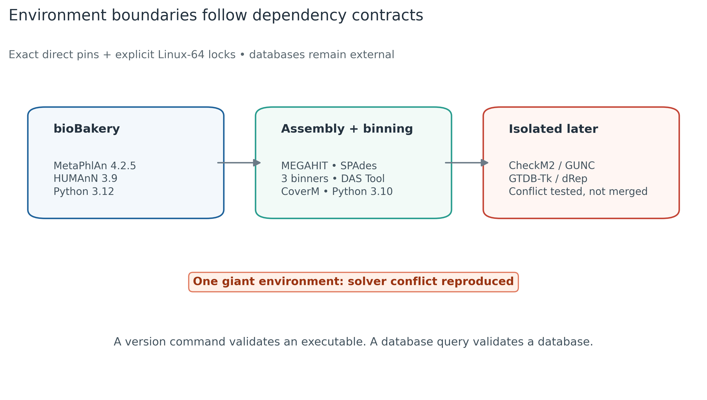
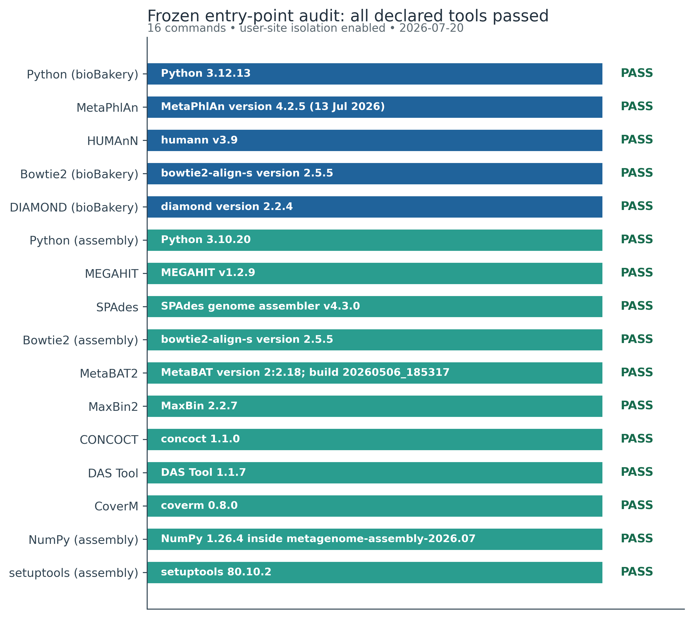
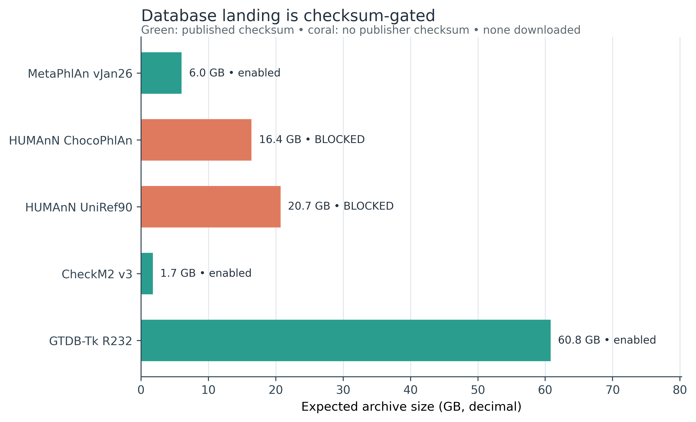

> **学习目标：**把“装软件”拆成可重建的直接依赖、Linux-64 完整锁、可执行入口、内置安装测试、数据库 release、checksum、落盘路径和数据库依赖型验证；建立 `bioBakery` 与组装分箱两个环境，并在依赖冲突出现时按功能边界拆分，而不是放松所有版本。  
> **本章真实证据：**2026-07-19 至 2026-07-20 在 native Linux 上实际求解并安装 `metagenome-biobakery-2026.07` 与 `metagenome-assembly-2026.07`。组装环境逐个启动 8 个直接工具，MEGAHIT 与 SPAdes 内置测试均通过；CONCOCT 暴露 user-site NumPy 污染和 `setuptools 83` 移除 `pkg_resources` 的故障，锁为 `setuptools<81` 后复测通过。bioBakery 环境又发现 HUMAnN 3.9 链接的内置 Bowtie2 2.2.3/DIAMOND 2.0.15 覆盖了环境元数据声明的 2.5.5/2.2.4；按精确版本重链接后，五个入口和 HUMAnN 单元测试通过。  
> **算力门槛：**只创建环境建议 4 核、16 GB RAM、10 GB 可用磁盘和稳定网络；真正的数据库远大于软件包。当前 manifest 中 MetaPhlAn vJan26 归档为 6.014 GB，CheckM2 v3 为 1.735 GB，GTDB-Tk R232 为 60.806 GB 且解压后约 100 GB；HUMAnN 手册给出的 ChocoPhlAn 与 UniRef90 约为 16.4 GB 和 20.7 GB。没有服务器时可先在 Linux/WSL2 完成环境和内置测试，把数据库统一落在机构 HPC 的只读共享目录；不要在笔记本重复下载每位用户一份。

## 这一步对应论文里的哪张图 {#sec-target}

### 把论文工作流图变成可以执行的边界

bioBakery 3 的主工作流把 MetaPhlAn 分类、HUMAnN 核酸比对、蛋白翻译比对和通路重建连接起来 [@beghini2021biobakery]；MetaPhlAn 4 又把未培养物种级 genome bins 纳入 marker catalog [@blancomiguez2023metaphlan4]。在 genome-resolved 分支，MEGAHIT、metaSPAdes、MetaBAT2、MaxBin2、CONCOCT 与 DAS Tool 分别承担组装、分箱和整合 [@li2015megahit; @nurk2017metaspades; @kang2019metabat2; @wu2016maxbin2; @alneberg2014concoct; @sieber2018dastool]。

论文图中的箭头隐藏了三个工程事实：

1. 两条分析分支的 Python、R、C/C++ 和系统库依赖并不相同；
2. 同名命令能启动，不代表它读取了 Methods 声明的数据库；
3. 数据库升级会改变 marker、SGB、参考基因与分类树，因此也是模型参数。

本次将依赖按分析合同拆成三块。前两块已安装并保存完整 Linux-64 锁；CheckM2、GUNC、GTDB-Tk 与 dRep 留到各自章节的隔离环境，避免把已复现的 solver 冲突带进组装环境。

{#fig-environment-boundaries}

### 入口检查比“environment created”多走一步

conda transaction 成功后，实际入口审计覆盖：

| Environment | Declared entry points | Installation test | Evidence |
|---|---:|---|---|
| `metagenome-biobakery-2026.07` | Python, MetaPhlAn, HUMAnN, Bowtie2, DIAMOND | `humann_test` | frozen live command evidence |
| `metagenome-assembly-2026.07` | Python, MEGAHIT, SPAdes, MetaBAT2, MaxBin2, CONCOCT, DAS Tool, CoverM | `megahit --test`, `spades.py --test` | frozen live command evidence |
| full reference databases | 5 manifest rows | database-specific query | **NOT RUN** |

{#fig-toolchain-entrypoints}

::: {.callout-important title="三次绿色测试仍不等于数据库已验证"}
MEGAHIT、SPAdes 和 HUMAnN 的内置测试确认软件安装完整。MetaPhlAn vJan26 profile、HUMAnN full database、CheckM2 v3 testrun 与 GTDB-Tk R232 `check_install` 需要数 GB 至约 100 GB 外部数据，本次没有下载，状态保持 `NOT_DOWNLOADED` / `NOT_RUN`。
:::

### 数据库先过身份门，再过容量门

五个数据库条目中，MetaPhlAn vJan26、CheckM2 v3 与 GTDB R232 有 release-specific URL 和官方 MD5，可以进入下载队列。HUMAnN 的两个 full endpoint 在官方手册中没有发布 release checksum，因此默认阻断。

{#fig-database-storage-contract}

## 理论：一个可复现安装究竟锁什么 {#sec-theory}

### 1. 环境 YAML 与完整锁解决不同问题

`env/assembly.yml` 记录人类可审阅的直接意图：

```text
MEGAHIT = 1.2.9
SPAdes = 4.3.0
MetaBAT2 = 2.18
...
```

但同一组直接版本仍可能在未来解析到不同的 Python patch、C library、R package build 或编译器 runtime。Linux-64 explicit lock 则记录求解后每个归档的精确 URL、build 与哈希：

```text
human-readable YAML
  └── solver on linux-64
        └── complete explicit transaction
              └── executable entry-point audit
```

因此二者都要保存：

- YAML 用于审阅、跨平台重新求解和升级；
- explicit lock 用于同平台重建已验证 transaction；
- 入口日志用于证明程序真正启动；
- 内置测试用于发现动态链接、Python import 和配套资源故障。

Bioconda 提供生命科学软件分发，但并不会替 Methods 自动决定工具版本或数据库 release [@gruning2018bioconda]。

### 2. “全部塞进一个环境”会扩大故障半径

本地 dry solve 将 assembly core 与 CheckM2 1.1.0 合并时失败：CheckM2 的 Python/TensorFlow/zlib 约束与 CoverM 的 zlib 约束无法形成同一个 transaction。继续尝试以下做法会破坏审计：

- 删除版本号让 solver 任意降级；
- 混入 `defaults` 后只看命令是否出现；
- 用 `pip install --upgrade` 覆盖 conda 文件；
- 把 solver warning 当作无关紧要。

更稳的结构是：

```text
read profiling       -> bioBakery environment
assembly + binning   -> assembly environment
MAG quality          -> isolated CheckM2/GUNC environment
MAG taxonomy         -> isolated GTDB-Tk environment
```

文件表、FASTA、BAM 和 TSV 是环境间接口。它们比共享一个 Python site-packages 更容易审核。

### 3. 环境外的 Python 也可能污染结果

首次直接运行 CONCOCT 时，宿主 user site 的 NumPy 2.2.6 抢在环境 NumPy 1.26.4 前被导入，触发 C extension ABI 错误。设置：

```bash
export PYTHONNOUSERSITE=1
unset PYTHONPATH
```

后才看见环境内部的第二个真实故障：`setuptools 83` 已不提供 CONCOCT 依赖的 `pkg_resources`。将直接依赖锁为 `setuptools<81`，实际解析到 80.10.2 后，CONCOCT 1.1.0 正常启动。

这说明“激活了环境”仍要检查：

```bash
python -c 'import sys, numpy; print(sys.executable); print(numpy.__version__); print(numpy.__file__)'
```

### 4. 数据库是统计模型的一部分

MetaPhlAn 4 根据 marker database 将 reads 分配到 SGB；HUMAnN 根据 ChocoPhlAn 与 UniRef 将 reads 分配到物种特异基因家族和未分类蛋白；CheckM2 的模型依赖其 DIAMOND reference；GTDB-Tk 的 ANI、marker alignment 与 tree placement 依赖 GTDB release [@chklovski2023checkm2; @chaumeil2020gtdbtk]。

因此 Methods 至少要同时写：

\[
\text{software version}
+ \text{database release}
+ \text{archive checksum}
+ \text{runtime parameter}
\]

只写 “MetaPhlAn 4” 无法判断使用 vJun23、vJan25 还是 vJan26。2026-07-15 官方 `mpa_latest` 已指向 `mpa_vJan26_CHOCOPhlAnSGB_202605`；若脚本运行时解析 `latest`，同一命令在四天前后会读取不同参考。

### 5. checksum 解决完整性，release 解决语义

checksum 相同意味着字节相同，不意味着数据库适用于当前软件。反过来，只写 release 名也不能发现传输截断。下载门要同时验证：

1. URL 是否包含不可变 release；
2. checksum 是否来自官方发布方；
3. archive bytes 是否匹配；
4. 解压路径是否独立且只读；
5. 软件是否报告预期 database release；
6. 小型 validation query 是否通过。

GTDB-Tk 是典型例子：2.7.x 对应 R232，官方兼容表将 R226 的最大软件版本限制为 2.6.1。把 GTDB-Tk 2.7.2 与 R226 拼在一起，即使文件完整，也不是受支持合同。

当前 manifest 还固定 CheckM2 v3 的 MD5 `07c10655620843b517d0df0c160d911f` 与 GTDB R232 的 MD5 `25a59e0352b1fd150c589f56559767d4`。这些值只授权下载和字节验收；数据库特异测试仍保持未运行。

### 6. 没有官方 checksum 时应停下来

HUMAnN 3.9 的 `humann_databases` 入口推荐：

```bash
humann_databases --download chocophlan full INSTALL_LOCATION
humann_databases --download uniref uniref90_diamond INSTALL_LOCATION
```

其代码将两条下载分别解析为 `full_chocophlan.v201901_v31.tar.gz` 和 `uniref90_annotated_v201901b_full.tar.gz`；手册给出约 16.4 GB 和 20.7 GB 的大小，并要求同一目录内数据库版本一致。但发布方没有为这两个归档给出 checksum，带版本的文件名本身也不能证明远端字节不可变。正确动作不是填一个猜测值，而是：

1. 管理员下载到 staging；
2. 保存 retrieval time、最终 URL、HTTP headers 和文件长度；
3. 计算本地 SHA-256；
4. 将归档复制到机构控制的 immutable object/path；
5. 用该内部 URL 与 SHA-256 更新 manifest；
6. 第二位执行者重新下载并复核。

在完成之前，自动下载器返回非零退出码。

### 7. 容量预算按归档、解压、临时副本和并发相加

数据库落地的最低共享盘预算为：

\[
S_{\text{landing}} =
S_{\text{archive}}
+ S_{\text{unpacked}}
+ S_{\text{temporary}}
+ S_{\text{next release}}
\]

保留旧 release 直到新 release 通过 validation query，才能回滚。GTDB R232 归档本身 60.806 GB，官方文档给出约 100 GB reference data；若下载、解压和保留上一版同时发生，不能只申请 100 GB。

## 准备工作 {#sec-setup}

<details>
<summary><strong>展开：硬件、文件、安装命令与内联作图接口</strong></summary>

### 安装与数据库任务的资源门槛

| Task | CPU | RAM | Free disk | Typical wall time | 本次状态 |
|---|---:|---:|---:|---:|---|
| Solve + install bioBakery | 2–4 | 8–16 GB | 5–10 GB | 10–60 min | executed |
| Solve + install assembly/binning | 2–4 | 8–16 GB | 5–10 GB | 10–60 min | executed |
| Built-in install tests | 4 | 8 GB | 5 GB scratch | <10 min | executed |
| MetaPhlAn vJan26 archive | 1 | 2 GB | >7.3 GB staging | network-dependent | not downloaded |
| HUMAnN full pair | 1 | 2 GB | >45 GB archive staging | network-dependent | blocked |
| CheckM2 v3 archive | 1 | 2 GB | >2.1 GB staging | network-dependent | not downloaded |
| GTDB R232 | 1 | 2 GB | >73 GB archive; ~100 GB unpacked | hours | not downloaded |

这些是安装门槛，不是样本分析资源。组装、分箱和 GTDB classification 的 CPU/RAM 需按第 10 篇的代表性任务重新测量。

### 固定文件

```text
env/
├── biobakery.yml
├── biobakery-linux-64.lock
├── relink-biobakery-entrypoints.sh
├── assembly.yml
└── assembly-linux-64.lock

data/small/
├── 11-environment-evidence.tsv
├── 11-install-self-tests.log
├── 11-solver-audit.tsv
├── 11-database-manifest.tsv
└── 11-data-NOTICE.txt

db/download_db.sh
scripts/validate_article11_installation.py
```

先核对源码：

```bash
sha256sum \
  env/biobakery.yml \
  env/assembly.yml \
  env/biobakery-linux-64.lock \
  env/assembly-linux-64.lock \
  env/relink-biobakery-entrypoints.sh \
  data/small/11-database-manifest.tsv

head -n 6 data/small/11-database-manifest.tsv
head -n 4 data/small/11-environment-evidence.tsv
cat data/small/11-install-self-tests.log
column -t -s $'\t' data/small/11-solver-audit.tsv
db/download_db.sh audit
```

### 创建环境

```bash
mamba env create \
  --file env/biobakery.yml \
  --strict-channel-priority

env/relink-biobakery-entrypoints.sh \
  metagenome-biobakery-2026.07

mamba env create \
  --file env/assembly.yml \
  --channel-priority flexible
```

`assembly.yml` 明确使用 `nodefaults`，且完整 explicit lock 会记录实际 channel/build；不能删除 lock 后仍宣称是同一个已验证环境。

### 内联作图函数

```{r}
set.seed(20260719)

pal_pub <- c(
  "bioBakery" = "#20639B",
  "Assembly" = "#2A9D8F",
  "Blocked" = "#E07A5F",
  "Pass" = "#176B4D"
)

scale_color_pub <- function(...) {
  ggplot2::scale_color_manual(values = pal_pub, ...)
}

scale_fill_pub <- function(...) {
  ggplot2::scale_fill_manual(values = pal_pub, ...)
}

theme_pub <- function(base_size = 10) {
  ggplot2::theme_classic(base_size = base_size) +
    ggplot2::theme(
      plot.title.position = "plot",
      plot.title = ggplot2::element_text(face = "bold"),
      axis.title = ggplot2::element_text(color = "#24323F"),
      legend.position = "bottom"
    )
}

save_pub <- function(plot, stem, width = 7.2, height = 4.8) {
  ggplot2::ggsave(paste0(stem, ".pdf"), plot, width = width, height = height)
  ggplot2::ggsave(
    paste0(stem, ".png"), plot,
    width = width, height = height, dpi = 350, bg = "white"
  )
  ggplot2::ggsave(
    paste0(stem, ".tiff"), plot,
    width = width, height = height, dpi = 350,
    compression = "lzw", bg = "white"
  )
}
```

验证器用同一颜色语义输出三种格式；其 Python 确定性入口显式设置：

```python
import random
random.seed(20260719)
```

</details>

## 可复制代码 {#sec-code}

### 1. 先拒绝隐形 channel 与 user site

```bash
conda config --show channels
conda config --show channel_priority

export PYTHONNOUSERSITE=1
unset PYTHONPATH
```

查看环境中真正被导入的解释器和 NumPy：

```bash
conda run -n metagenome-assembly-2026.07 \
  env PYTHONNOUSERSITE=1 PYTHONPATH= \
  python - <<'PY'
import numpy
import sys

print("python", sys.executable)
print("numpy_version", numpy.__version__)
print("numpy_path", numpy.__file__)
PY
```

路径应位于 `metagenome-assembly-2026.07` 内。若出现 `~/.local`，先解决污染再运行工具。

### 2. 审计 bioBakery 入口

```bash
env_name=metagenome-biobakery-2026.07

conda run -n "${env_name}" env PYTHONNOUSERSITE=1 PYTHONPATH= \
  python --version
conda run -n "${env_name}" env PYTHONNOUSERSITE=1 PYTHONPATH= \
  metaphlan --version
conda run -n "${env_name}" env PYTHONNOUSERSITE=1 PYTHONPATH= \
  humann --version
conda run -n "${env_name}" bowtie2 --version 2>&1 |
  grep -m1 ' version '
conda run -n "${env_name}" diamond version
```

本次期望直接版本：

```text
Python 3.12.13
MetaPhlAn 4.2.5
HUMAnN 3.9
Bowtie2 2.5.5
DIAMOND 2.2.4
```

`conda list` 曾显示 Bowtie2 2.5.5 和 DIAMOND 2.2.4，但第一次直接运行却返回 2.2.3 与 2.0.15。原因是 HUMAnN 3.9 的发布归档也拥有 `bin/bowtie2*` 和 `bin/diamond`；HUMAnN 最后链接时覆盖了独立软件包文件。创建或按 explicit lock 重建环境后，必须执行：

```bash
env/relink-biobakery-entrypoints.sh \
  metagenome-biobakery-2026.07
```

脚本只按原 channel 合同强制重链接 `bowtie2=2.5.5` 与 `diamond=2.2.4`，随后检查真实入口字符串。只看 `conda list` 无法发现这种同路径覆盖。

随后运行不依赖 full database 的官方测试：

```bash
conda run -n "${env_name}" env PYTHONNOUSERSITE=1 PYTHONPATH= \
  humann_test
```

### 3. 审计组装与分箱入口

```bash
env_name=metagenome-assembly-2026.07
run_clean() {
  conda run -n "${env_name}" \
    env PYTHONNOUSERSITE=1 PYTHONPATH= PYTHONHASHSEED=0 "$@"
}

run_clean python --version
run_clean megahit --version
run_clean spades.py --version
run_clean metabat2 -h 2>&1 | head -n 3
run_clean run_MaxBin.pl -v
run_clean concoct --version
run_clean DAS_Tool --version
run_clean coverm --version
```

MetaBAT2 不接受 `--version`；误用该参数会抛出 `unknown_option`。其版本位于 `metabat2 -h` 的头部。本次观测为：

```text
MetaBAT ... (version 2:2.18; 20260506_185317)
```

再执行两个内置安装测试：

```bash
test_root="$(mktemp -d "${TMPDIR:-/tmp}/article11-tests.XXXXXX")"
trap 'rm -rf "${test_root}"' EXIT
cd "${test_root}"

run_clean megahit --test
run_clean spades.py --test
```

验收标志分别是 `ALL DONE` 与 `TEST PASSED CORRECTLY`。内置数据不是宏基因组 benchmark，不能从日志中的时间或内存外推真实项目。

### 4. 修复 CONCOCT 的已复现入口故障

若出现：

```text
ModuleNotFoundError: No module named 'pkg_resources'
```

先确认 YAML 包含：

```yaml
- setuptools<81
```

再按声明更新，而不是单独 `pip install`：

```bash
mamba install -n metagenome-assembly-2026.07 \
  -c conda-forge -c bioconda \
  --override-channels \
  --channel-priority flexible \
  "setuptools<81"

conda run -n metagenome-assembly-2026.07 \
  env PYTHONNOUSERSITE=1 PYTHONPATH= \
  concoct --version
```

本次解析到 `setuptools 80.10.2`，CONCOCT 返回 `concoct 1.1.0`。该 ceiling 是对当前旧入口的兼容性补丁；CONCOCT 上游若移除 `pkg_resources` 依赖，应在新环境重做全套测试后升级。

### 5. 导出两层锁

```bash
conda env export \
  -n metagenome-biobakery-2026.07 \
  --from-history > biobakery.from-history.yml

conda list \
  -n metagenome-biobakery-2026.07 \
  --explicit > env/biobakery-linux-64.lock

conda env export \
  -n metagenome-assembly-2026.07 \
  --from-history > assembly.from-history.yml

conda list \
  -n metagenome-assembly-2026.07 \
  --explicit > env/assembly-linux-64.lock
```

同平台重建：

```bash
mamba create \
  -n metagenome-assembly-from-lock \
  --file env/assembly-linux-64.lock
```

explicit lock 只适用于其记录的平台。macOS、ARM64 或不同 glibc 环境要从 YAML 重新求解并形成自己的锁与入口证据。

### 6. 审计数据库 manifest

```bash
db/download_db.sh list
db/download_db.sh audit
```

关键列：

```text
database_id
tool_version
release_id
archive_url
checksum_algorithm
expected_checksum
expected_compressed_bytes
download_gate
validation_status
```

`download_gate=enabled` 只表示具备 release-specific URL 与官方 checksum。当前所有 `validation_status` 仍是 `NOT_DOWNLOADED`。

### 7. 先盘点共享盘，再显式下载

```bash
export DB_ROOT=/shared/databases/metagenome

df -h "${DB_ROOT}"
mkdir -p "${DB_ROOT}"

DB_ROOT="${DB_ROOT}" db/download_db.sh download metaphlan-vJan26
DB_ROOT="${DB_ROOT}" db/download_db.sh download checkm2-v3
DB_ROOT="${DB_ROOT}" db/download_db.sh download gtdbtk-r232
```

脚本行为：

1. 拒绝 Git 仓库内的 `DB_ROOT`；
2. 拒绝 mutable `/latest/` URL；
3. 在已知 archive size 时预留 20% staging 余量；
4. 下载到 `.part`；
5. 校验官方 MD5；
6. 原子重命名；
7. 写 release/checksum sentinel。

例：只复核已下载的 GTDB R232：

```bash
DB_ROOT="${DB_ROOT}" db/download_db.sh verify gtdbtk-r232
```

### 8. HUMAnN full database 保持 fail-closed

下面的命令应失败，而且必须在询问 `DB_ROOT` 前失败：

```bash
db/download_db.sh download humann-chocophlan-full
# ERROR: humann-chocophlan-full is fail-closed:
# blocked-no-upstream-checksum
```

管理员完成 staging 与本地 SHA-256 后，更新 manifest 的 immutable URL、checksum algorithm、checksum、精确 bytes 和 retrieval date，双人复核，再将 gate 改为 `enabled`。不要在个人分析脚本里绕过 gate。

### 9. 解压后仍要运行数据库特异验收

MetaPhlAn：

```bash
export METAPHLAN_DB="${DB_ROOT}/metaphlan/mpa_vJan26_CHOCOPhlAnSGB_202605"
conda run -n metagenome-biobakery-2026.07 \
  metaphlan --version

# 用官方或明确公开的小 FASTQ 真正跑一次后，检查 profile header：
grep '^#' sample_profile.tsv
```

HUMAnN：

```bash
conda run -n metagenome-biobakery-2026.07 \
  humann_config --update database_folders nucleotide \
  "${DB_ROOT}/humann/chocophlan/<frozen-release>"

conda run -n metagenome-biobakery-2026.07 \
  humann_config --update database_folders protein \
  "${DB_ROOT}/humann/uniref90/<frozen-release>"

conda run -n metagenome-biobakery-2026.07 humann_config --print
```

CheckM2 与 GTDB-Tk 放在各自隔离环境后：

```bash
export CHECKM2DB="${DB_ROOT}/checkm2/zenodo-14897628-v3/uniref100.KO.1.dmnd"
checkm2 testrun

export GTDBTK_DATA_PATH="${DB_ROOT}/gtdbtk/R232"
gtdbtk check_install
```

只有上述命令通过，才能将 manifest 状态从 `NOT_DOWNLOADED` 改为 `VALIDATED`。

### 10. 复核固化证据与三张图

```bash
conda run -n metagenome-platform-smoke-2026.07 python \
  scripts/validate_article11_installation.py \
  --project-root . \
  --output-dir results/11-install-biobakery-assembly \
  --figure-dir figures

cat results/11-install-biobakery-assembly/installation-summary.json
```

例行验证只读 frozen locks/evidence，执行 downloader 的 `audit` 与 fail-closed negative control，并生成三张图；不会下载数据库。

## 审计与升级 {#sec-audit}

### 审计 1：以当日官方指针为准，但运行时不用指针

MetaPhlAn 4.2 发布时的主数据库是 vJan25；2026-07-14 又出现 vJan26，次日 `mpa_latest` 已切换。安装教程若长期写“下载 latest”，旧项目重跑会静默改变 marker catalog。本合同把：

```text
mpa_vJan26_CHOCOPhlAnSGB_202605
MD5 7162b0c3493663dce9abef08ccc06aea
6,014,095,360 bytes
```

同时写入 manifest。

### 审计 2：软件 release 与数据库 release 不做模糊配对

| Tool | Software | Database contract | Current status |
|---|---|---|---|
| MetaPhlAn | 4.2.5 | vJan26 / published MD5 | archive not downloaded |
| HUMAnN | 3.9 | full ChocoPhlAn + UniRef90 | blocked: upstream checksum unpublished |
| CheckM2 | 1.1.0 | Zenodo record 14897628, version 3 | archive not downloaded |
| GTDB-Tk | 2.7.2 | R232 / official MD5 | archive not downloaded |

CheckM2 v3 页面还明确限定 DIAMOND 2.1.11。未来建立 CheckM2 环境时，不能因为 assembly 环境已有 DIAMOND 2.2.4 就复用它。

### 审计 3：入口失败应进入证据，而不是从日志删除

CONCOCT 初次失败揭示了两层问题：

1. user site NumPy 污染；
2. `setuptools 83` 与旧 `pkg_resources` 入口不兼容。

固化日志同时保留 CONCOCT 与 HUMAnN 文件冲突的 `EXPECTED_FAIL`，以及两次修复后的 `PASS`。这比只展示最终绿色结果更能支持版本 ceiling 与重链接步骤的来源。

### 审计 4：flexible channel priority 要用完整锁补偿

assembly core 在本次已验证 transaction 中使用 flexible priority，以满足较老的 R/Perl-based binner/refinement 依赖。代价是跨 channel 选择空间更大，因此：

- `nodefaults` 禁止隐式第三 channel；
- 所有直接版本固定；
- Linux-64 explicit lock 完整保存；
- 入口和内置测试是发布门；
- 升级任一直接工具时重做全部入口，而非覆盖原环境。

### 审计 5：数据库不进入 Git，也不进入常规 CI

将 60.8 GB GTDB archive 放进 Git LFS 仍然不是合理分发。更稳的职责分离是：

```text
Git
  └── manifest + downloader + checksum + Methods

shared storage / object store
  └── immutable archive + unpacked release + validation sentinel

workflow
  └── read-only bind + explicit release path
```

常规 CI 验证 manifest、checksum 格式、URL 可变性规则和 negative control；计划性数据库维护任务才执行大下载。

### 审计 6：安装测试不替代真实数据正控与负控

内置测试回答“程序能否完成开发者给定的小流程”。正式分析还需要：

- 已知组成 mock 或官方 demo positive control；
- 空输入/负对照行为；
- 输出 schema 与非空阈值；
- database release 写入输出 header/log；
- 真实项目代表性子集的资源实测；
- 旧 release 与新 release 的差异报告。

## 出版级美化 {#sec-polish}

三张图使用同一语义：

- 蓝色：read-based bioBakery；
- 绿色：assembly/binning 与 checksum-enabled；
- 珊瑚色：冲突或 fail-closed；
- 所有图中文字、轴和状态均为英文；
- PDF 用于矢量排版，PNG 用于网页/公众号，350 dpi LZW TIFF 用于期刊。

重绘：

```bash
MPLCONFIGDIR=.matplotlib \
conda run -n metagenome-platform-smoke-2026.07 python \
  scripts/validate_article11_installation.py \
  --project-root . \
  --output-dir results/11-install-biobakery-assembly \
  --figure-dir figures
```

发表前检查：

```bash
file figures/11-environment-boundaries.*
file figures/11-toolchain-entrypoints.*
file figures/11-database-storage-contract.*
```

## 常见坑 {#sec-pitfalls}

::: {.callout-caution title="坑 1：只保存 environment.yml，不保存 explicit lock"}
未来 solver 仍可能解析到不同 build。YAML 是意图，explicit lock 才是已验证 Linux-64 transaction。
:::

::: {.callout-caution title="坑 2：把 `conda env create` 的 exit 0 当成全部入口通过"}
本次 CONCOCT 就是在 transaction 成功后才暴露 import 故障。逐个执行 `--version`/`-h`，再跑内置测试。
:::

::: {.callout-caution title="坑 3：宿主 `~/.local` 抢先导入"}
如果 `numpy.__file__` 不在目标环境，任何 ABI 结果都不可信。固定 `PYTHONNOUSERSITE=1` 并清空 `PYTHONPATH`。
:::

::: {.callout-caution title="坑 4：为了 CheckM2 把整个 assembly 环境降级"}
一个工具的 TensorFlow/Python/zlib 约束不应改变全部 assembler 与 binner。拆成独立环境，以文件作为接口。
:::

::: {.callout-caution title="坑 5：写 `mpa_latest` 或 GTDB `latest`"}
可变指针适合发现新 release，不适合 Methods 和复现。先解析一次，再把 release-specific URL 与 checksum 固化。
:::

::: {.callout-caution title="坑 6：看到 MD5 就以为数据库兼容"}
MD5 只确认 bytes。仍需核对 tool/database compatibility table，并运行数据库特异 test/query。
:::

::: {.callout-caution title="坑 7：HUMAnN endpoint 没 checksum 仍自动放行"}
大小近似值不能替代 checksum。先 staging、计算 SHA-256、复制到不可变内部位置、双人复核，再启用。
:::

::: {.callout-caution title="坑 8：把数据库复制到每个环境目录"}
软件环境应小而可重建；数据库应集中、只读、按 release 分目录，并由路径或环境变量显式绑定。
:::

::: {.callout-caution title="坑 9：删除旧数据库后再测试新数据库"}
新 release 若失败就无法回滚。为 archive、解压目录、上一版和临时空间同时预留容量。
:::

::: {.callout-caution title="坑 10：用内置 assembler test 的 10 秒耗时申请项目资源"}
内置数据极小，只验证安装。项目资源必须用同一工具、参数和代表性真实输入重新计量。
:::

## 这段 Methods 怎么写 {#sec-methods}

只有相应 database validation 已完成时，才把数据库句子放进研究 Methods：

> Software environments were provisioned with Mamba 2.5.0 using only the conda-forge and Bioconda channels. Read-based profiling used MetaPhlAn 4.2.5 and HUMAnN 3.9 under Python 3.12.13; after HUMAnN installation, the exact Bowtie2 2.5.5 and DIAMOND 2.2.4 packages were relinked and their executable versions were re-audited. Assembly and binning used MEGAHIT 1.2.9, SPAdes 4.3.0, MetaBAT2 2.18, MaxBin2 2.2.7, CONCOCT 1.1.0, DAS Tool 1.1.7, and CoverM 0.8.0 under Python 3.10.20; setuptools was constrained to <81 for CONCOCT compatibility. User-site Python packages were disabled. Direct environment specifications, the deterministic relink script, and complete Linux-64 explicit package locks were archived. MetaPhlAn analyses used the mpa_vJan26_CHOCOPhlAnSGB_202605 database (archive MD5: 7162b0c3493663dce9abef08ccc06aea). All external databases were installed in release-specific, read-only directories and verified against publisher-provided checksums before analysis. The exact database paths, checksums, command lines, and validation-query logs were retained with the workflow outputs.

若 HUMAnN full archive 只记录了本地 SHA-256，补充：

> Because the upstream HUMAnN endpoint did not publish a release checksum, the archive was staged on [retrieval date], its final URL, HTTP metadata, byte count, and SHA-256 were recorded, and the checksum-identified archive was copied to an immutable institutional location before use.

不要写：

```text
MetaPhlAn and HUMAnN were run with default databases.
```

## 换成你自己的数据怎么做 {#sec-own-data}

安装本身不读取样本，但你的分析合同会决定需要哪些环境与数据库。

### 只做 read-based taxonomic profiling

需要：

- `env/biobakery.yml`；
- MetaPhlAn release-specific database；
- QC 后的 FASTQ；
- 一个已知 mock 或官方 positive control；
- profile header 中的 database identity。

HUMAnN 可以不装 full database，除非需要功能 profile。

### 做 HUMAnN 功能分析

额外需要：

- checksum-frozen ChocoPhlAn；
- checksum-frozen UniRef90 或明示选择的替代；
- 两者 release 一致性记录；
- Bowtie2、DIAMOND 与 MetaCyc/pathway mapping 版本；
- demo/positive control 的非空 gene-family 与 pathway 输出。

### 做短读组装与 MAG

先安装 assembly environment；随后按章节分别建立：

- CheckM2/GUNC 质控环境；
- GTDB-Tk 分类环境；
- dRep 去冗余环境；
- 相应数据库和 checksum sentinel。

不要为了方便让后续环境覆盖已经验证的 assembly environment。

### 共享数据库管理员清单

每个 release 目录至少包含：

```text
README.txt
archive/
archive checksum sentinel
unpacked/
tool-version.txt
database-version.txt
validation-command.txt
validation.log
permissions.txt
```

目录切换前完成：

1. 下载与 checksum；
2. 解压；
3. tool/database compatibility；
4. validation query；
5. 代表性样本对照；
6. 只读权限；
7. workflow 显式路径更新；
8. rollback 演练。

## 参考 {#sec-references}

- bioBakery 3、MetaPhlAn 4 及 HUMAnN 工作流：[@beghini2021biobakery; @blancomiguez2023metaphlan4]
- 组装与分箱方法：[@li2015megahit; @nurk2017metaspades; @kang2019metabat2; @wu2016maxbin2; @alneberg2014concoct; @sieber2018dastool]
- Bioconda 软件分发：[@gruning2018bioconda]
- CheckM2 与 GTDB-Tk：[@chklovski2023checkm2; @chaumeil2020gtdbtk]
- [MetaPhlAn official releases](https://github.com/biobakery/MetaPhlAn/releases)
- [MetaPhlAn official database index](https://cmprod1.cibio.unitn.it/biobakery4/metaphlan_databases/)
- [HUMAnN official user manual](https://github.com/biobakery/humann)
- [CheckM2 database version 3, Zenodo 14897628](https://doi.org/10.5281/zenodo.14897628)
- [GTDB-Tk 2.7.2 installation and reference compatibility](https://ecogenomics.github.io/GTDBTk/installing/index.html)
