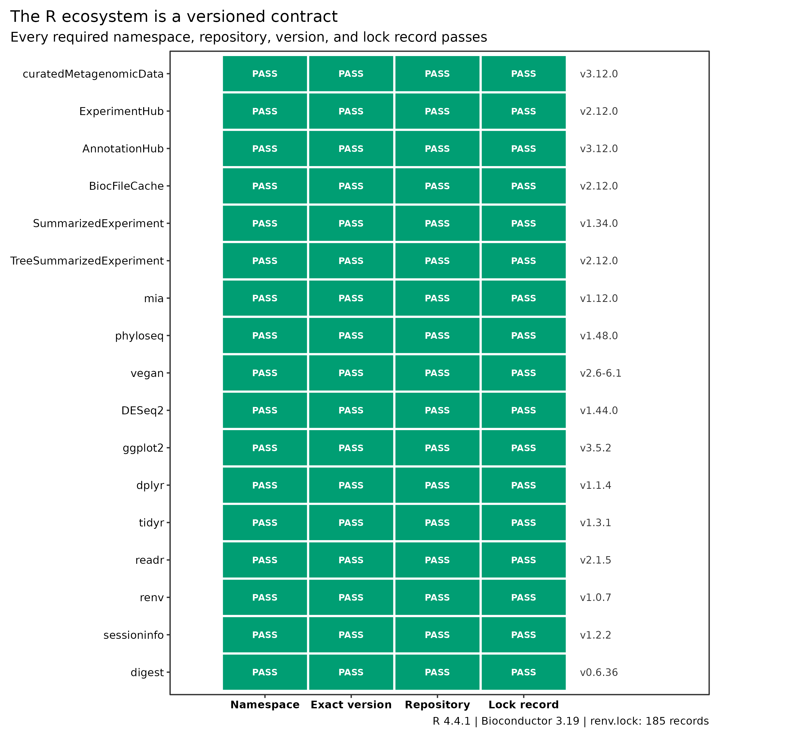
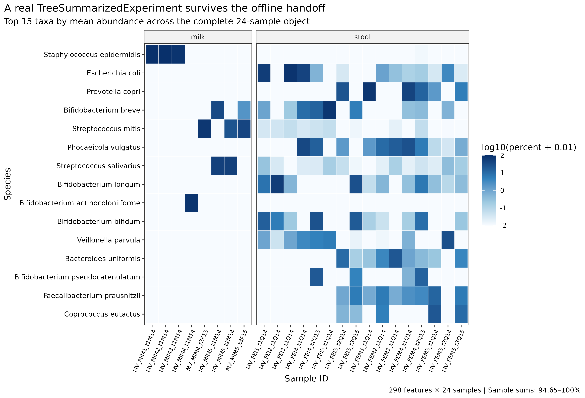

> **学习目标：**固定 R 与 Bioconductor 的配套代际，安装 `curatedMetagenomicData` 及宏基因组下游所需的对象、生态统计、差异分析、作图和锁环境包；用官方 `AsnicarF_2017.relative_abundance` 资源完成一次真实下载，核对 `TreeSummarizedExperiment` 的行、列、assay、分类信息、样本信息和单位，再证明同一缓存可以离线重放。  
> **真实数据：**官方 ExperimentHub 资源 `EH7091`，标题为 `2021-10-14.AsnicarF_2017.relative_abundance`。对象来自 Asnicar 等的母婴菌株传播研究 [@asnicar2017transmission]，包含 298 个分类特征、24 个样本、15 位受试者和 SRA accession `SRR4052021`–`SRR4052044`。  
> **预计资源：**建议 2 核、8 GB RAM、2 GB 项目可用磁盘；首次安装通常 15–60 分钟，本文 18,187-byte Hub 资源的实际取回低于 1 分钟。共享服务器上应把 Hub cache 放进可写的项目或 scratch 路径；没有服务器时，可在本地 Linux、macOS 或 WSL2 完成这一步，后续大型 FASTQ 和数据库仍放到 HPC。

## 这一步对应论文里的哪张图 {#sec-target}

### 从资源总览图落到一个可以审核的 R 对象

`curatedMetagenomicData` 最初把公开人类宏基因组的统一处理结果通过 ExperimentHub 暴露给 R [@pasolli2017cmd]。cMD3 进一步汇总 22,710 个宏基因组、94 个数据集和 42 个国家，并用统一的 MetaPhlAn 3 / HUMAnN 3 谱支持跨队列分析 [@manghi2026cmd3]。资源论文 Figure 1 一类的总览图回答“有哪些队列、经过怎样的标准化”；真正开始统计前，还要回答“本机拿到的是哪个资源、什么对象、哪种单位”。

这一步可以拆成五道不可互相替代的证据：

1. `Rscript` 能启动；
2. 指定版本的 namespace 能加载；
3. ExperimentHub 能发现候选资源；
4. 候选资源的字节已经下载并进入 cache；
5. 新会话不访问网络也能恢复同一对象。

{#fig-r-data-access-boundaries}

### 包生态按职责分层

R 包不应只列成一串安装命令。本文固定的 17 个关键包分为五类：

| Layer | Core packages | 负责 |
|---|---|---|
| Resource access | `curatedMetagenomicData`, `ExperimentHub`, `AnnotationHub`, `BiocFileCache` | 查询、下载和缓存官方资源 |
| Data containers | `SummarizedExperiment`, `TreeSummarizedExperiment` | 对齐 assay、feature metadata、sample metadata 与树 |
| Microbiome analysis | `mia`, `phyloseq`, `vegan`, `DESeq2` | 对象转换、生态统计与 count-scale 模型 |
| Tables and graphics | `dplyr`, `tidyr`, `readr`, `ggplot2` | 整理表格和出版图 |
| Reproducibility | `renv`, `sessioninfo`, `digest` | 锁包、记录会话和校验文件 |

{#fig-package-role-contract}

### 本次真实对象长什么样

对象的 assay 是 **relative abundance（相对丰度）**，以约 0–100 的百分比尺度保存。图中展示按全体样本平均丰度排序的前 15 个真实物种；milk 与 stool 分面只是数据结构检查，不是母婴传播效应检验。

{#fig-cmd-object-contract}

::: {.callout-important title="这不是 MetaPhlAn 4 的直接输出"}
本系列上游使用 MetaPhlAn 4，而 cMD3 的标准化分类谱来自 MetaPhlAn 3、功能谱来自 HUMAnN 3。二者不能在 Methods 中写成同一 profiling pipeline，也不应把跨版本差异解释成生物学变化。
:::

## 理论：包、Hub、对象与单位为什么要分开验收 {#sec-theory}

### 1. R 与 Bioconductor 是配套 release

Bioconductor 包依赖同一代的 S4 类、annotation infrastructure 和编译接口。本文复现的是固定历史环境：

```text
R 4.4.1
└── Bioconductor 3.19
    ├── curatedMetagenomicData 3.12.0
    ├── ExperimentHub 2.12.0
    ├── TreeSummarizedExperiment 2.12.0
    └── mia 1.12.0
```

`install.packages("curatedMetagenomicData")` 不是正确安装路径；CRAN 并不知道应为当前 R 选择哪一代 Bioconductor。应先用 `BiocManager::install(version = "3.19")` 固定 release，再安装 Bioconductor 包。

对于今天新开的项目，可以选择当前受支持的 R/Bioconductor release；但一旦升级，就要生成新的 lock、重新取回资源、重新执行对象与结果 QA，不能继续引用本文的 3.19 验证结论。

### 2. `dryrun`、download 与 cache 是三种状态

调用：

```r
curatedMetagenomicData(
  "AsnicarF_2017.relative_abundance",
  dryrun = TRUE
)
```

只查询 metadata，返回可匹配的资源标题。本文实际看到两个日期版本：

```text
2021-03-31.AsnicarF_2017.relative_abundance
2021-10-14.AsnicarF_2017.relative_abundance
```

将 `dryrun = FALSE` 后，函数才解析匹配项、选择最新资源并触发 ExperimentHub 下载。再次使用同一 cache 时，`LOCAL = TRUE` 才能验证离线复用。把这三步混在一起，最常见的误判就是“查询成功，因此数据已经可复现”。

### 3. Hub 标题会更新，资源身份必须锁到字节

只记录模式 `AsnicarF_2017.relative_abundance` 不够，因为同一模式已经对应两个日期标题。本文保留：

| Field | Locked value |
|---|---|
| Pattern | `AsnicarF_2017.relative_abundance` |
| Selected title | `2021-10-14.AsnicarF_2017.relative_abundance` |
| ExperimentHub ID | `EH7091` |
| Raw cache SHA-256 | `ad631532…4d69db27` |
| Snapshot SHA-256 | `29527747…06564b2` |
| Retrieval UTC | `2026-07-20T00:42:46Z` |

Hub ID 和日期说明语义身份；SHA-256 说明本地字节身份。二者缺一不可。

### 4. `TreeSummarizedExperiment` 的行列方向是统计合同

`TreeSummarizedExperiment` 在 `SummarizedExperiment` 的 assay/metadata 对齐基础上加入层级树 [@huang2021tse]：

```text
                       columns = samples
                 ┌──────────────────────────┐
rows = features  │ assay: relative_abundance│
                 └──────────────────────────┘
                    │                   │
                 rowData             colData
              taxonomy ranks      clinical metadata
                    │
                 rowTree
              taxonomy hierarchy
```

本文对象的合同为：

- `298 × 24`，即 298 个 taxonomic features × 24 个 samples；
- 一个 assay：`relative_abundance`；
- `rowData` 有 `superkingdom` 到 `species` 七列；
- `colData` 有 22 列，包括 `subject_id`、`body_site`、`number_reads` 和 `NCBI_accession`；
- `rowTree` 有 298 个与 feature 对齐的 tips。

如果把矩阵转置后仍强行拼 metadata，代码可能继续运行，但距离、模型和图的意义全部颠倒。每次读入都要断言：

```r
identical(rownames(assay(x)), rownames(rowData(x)))
identical(colnames(assay(x)), rownames(colData(x)))
```

### 5. 百分比不是原始 reads

本文 assay 的列和为 `94.65166`–`100.00003`，而不是整数 read counts。轻微高于 100 来自数值舍入；个别低于 100 是 cMD 构造层级树时移除了没有匹配 tree tip 的 taxon。`colData(x)$number_reads` 是整份样本的测序深度 metadata，并不是每个 taxon 的原始 read count。

`curatedMetagenomicData(..., counts = TRUE)` 会结合相对丰度与 `number_reads` 重建并取整近似 counts。它不是从原始 alignment 恢复的 feature-level counts，因此不能在不说明构造方式的情况下拿去替代原始 marker counts。

单位决定方法：

| Input | 合适操作 | 不应直接做 |
|---|---|---|
| Relative abundance (%) | composition plots、Bray–Curtis、适当变换后的关联模型 | 宣称为原始 reads |
| Reconstructed counts | 明确标注重建规则后的敏感性分析 | 假装是 profiler 原始整数输出 |
| Raw feature counts | count-aware model，连同 library size/filter contract | 当成已闭合百分比 |
| `number_reads` metadata | 深度审计、协变量或纳入标准 | 广播成每个 feature 的 count |

### 6. 24 个样本不等于 24 个独立受试者

本对象只有 15 个 `subject_id`，部分受试者有多个时间点。把每一列都当独立生物学重复会产生伪重复（pseudoreplication）。正式推断至少要选择：

- 每位受试者一个预先定义时间点；
- 受试者内汇总；
- 或用 mixed model / subject-level blocking 显式建模重复测量。

milk 与 stool 还是不同 body site，组成差异巨大。若研究问题不是体位比较，应分层分析，不能把 body site 当作普通无关协变量。

### 7. 数据谱系卡片先于统计模型

| Item | 本文对象 |
|---|---|
| Study | `AsnicarF_2017` |
| Public accessions | SRA `SRR4052021`–`SRR4052044` |
| Raw reads available | Yes |
| Profile source | curatedMetagenomicData / ExperimentHub `EH7091` |
| Profiler generation | cMD3 standardized taxonomic profile; MetaPhlAn 3 lineage |
| Feature type | Long-form species-level taxonomy paths |
| Unit | Relative abundance, approximately 0–100% |
| Normalization | Profiler-derived percentage; no extra rarefaction |
| Original publication | Asnicar et al. 2017 [@asnicar2017transmission] |
| Local transformation | Complete TSE snapshot only; no biological filtering |

这张卡片阻止两类越界：把 cMD3 谱写成本教程 MetaPhlAn 4 产生的结果，或把百分比矩阵写成原始 counts。

## 准备工作 {#sec-setup}

<details>
<summary><strong>展开：资源门槛、安装命令、固定输入与内联作图函数</strong></summary>

### 资源门槛

| Task | CPU | RAM | Free disk | Typical wall time | Network |
|---|---:|---:|---:|---:|---|
| R/Bioconductor package install | 2 | 8 GB | 2 GB | 15–60 min | required once |
| EH7091 first retrieval | 1 | <2 GB | <10 MB | <1 min observed | required once |
| Object audit + plots | 1–2 | <2 GB | <100 MB | 1–3 min | not required |
| `renv::restore()` from empty cache | 2 | 8 GB | 2–5 GB | network-dependent | required |

包编译失败时，优先使用与 R 4.4 对应的系统开发库或 Bioconductor binary，不要混装另一代 R 的包目录。

### 安装固定代际

```r
options(repos = c(CRAN = "https://cloud.r-project.org"))

install.packages(c("BiocManager", "renv"))

stopifnot(
  getRversion() >= "4.4.0",
  getRversion() < "4.5.0"
)

BiocManager::install(version = "3.19", ask = FALSE)
BiocManager::install(
  c(
    "curatedMetagenomicData",
    "ExperimentHub",
    "TreeSummarizedExperiment",
    "mia",
    "phyloseq",
    "DESeq2"
  ),
  ask = FALSE,
  update = FALSE
)

install.packages(
  c(
    "vegan", "ggplot2", "dplyr", "tidyr", "readr",
    "sessioninfo", "digest", "jsonlite"
  )
)
```

在完整仓库中恢复本文验证过的 185 条依赖记录：

```r
renv::restore(
  lockfile = "env/renv.lock",
  prompt = FALSE
)
```

固定历史结果与升级新项目应分成两条环境线。不要在已经恢复的 Bioconductor 3.19 library 内运行无边界的 `update.packages()`。

### 给 ExperimentHub 一个明确可写的 cache

```r
cache_dir <- normalizePath(
  ".cache/R/ExperimentHub",
  mustWork = FALSE
)
dir.create(cache_dir, recursive = TRUE, showWarnings = FALSE)
stopifnot(file.access(cache_dir, 2) == 0)

ExperimentHub::setExperimentHubOption("CACHE", cache_dir)
```

共享计算节点上默认 `$HOME/.cache` 可能只读、配额过小或不适合大量并发。项目 cache 便于记录和清理；大型共享资源可由管理员放入版本化只读 cache，再通过权限和备份策略管理。

### 固定输入

```text
env/renv.lock
data/small/12-package-contract.tsv
data/small/12-cmd-resource-manifest.tsv
data/small/12-cmd-asnicarf-2017-relative-abundance.rds
data/small/12-resource-retrieval.log
data/small/12-data-NOTICE.txt
scripts/retrieve_article12_cmd.R
scripts/validate_article12_r_cmd.R
```

先核对关键字节：

```bash
sha256sum \
  env/renv.lock \
  data/small/12-cmd-asnicarf-2017-relative-abundance.rds

column -t -s $'\t' data/small/12-cmd-resource-manifest.tsv
head -n 18 data/small/12-package-contract.tsv
```

预期：

```text
cf448ad154eb7412d7c069cbb9ea5c5bcef8c48a047a775409d9982f513d540e  env/renv.lock
2952774730bff2af9e13c9c40058320aed524dc2dc7408b44dc6e697c06564b2  data/small/12-cmd-asnicarf-2017-relative-abundance.rds
```

### 加载包并固定随机数

```{r}
set.seed(20260720)

library(curatedMetagenomicData)
library(ExperimentHub)
library(SummarizedExperiment)
library(TreeSummarizedExperiment)
library(mia)
library(phyloseq)
library(vegan)
library(DESeq2)
library(ggplot2)
library(dplyr)
library(tidyr)
library(readr)
```

本文的下载和对象审计本身没有随机步骤；显式 seed 用于后续抽样、置换和图形标签调整时保持结果稳定。

### 内联作图函数

```{r}
pal_pub <- c(
  "Access" = "#20639B",
  "Container" = "#6A4C93",
  "Analysis" = "#2A9D8F",
  "Graphics" = "#E9C46A",
  "Reproducibility" = "#E76F51",
  "Milk" = "#3A86FF",
  "Stool" = "#8338EC",
  "Pass" = "#176B4D",
  "Not reached" = "#B7BDC4"
)

scale_color_pub <- function(...) {
  ggplot2::scale_color_manual(values = pal_pub, ...)
}

scale_fill_pub <- function(...) {
  ggplot2::scale_fill_manual(values = pal_pub, ...)
}

theme_pub <- function(base_size = 10) {
  ggplot2::theme_bw(base_size = base_size, base_family = "sans") +
    ggplot2::theme(
      panel.grid = ggplot2::element_blank(),
      axis.text = ggplot2::element_text(color = "black"),
      axis.title = ggplot2::element_text(color = "black"),
      plot.title.position = "plot",
      plot.title = ggplot2::element_text(face = "bold"),
      plot.caption.position = "plot",
      legend.position = "bottom",
      legend.key = ggplot2::element_blank(),
      strip.background = ggplot2::element_rect(
        fill = "#F2F2F2",
        color = "#666666",
        linewidth = 0.3
      )
    )
}

save_pub <- function(plot, stem, width = 7.4, height = 4.8) {
  ggplot2::ggsave(
    paste0(stem, ".pdf"),
    plot = plot,
    width = width,
    height = height,
    device = grDevices::cairo_pdf,
    bg = "white"
  )
  ggplot2::ggsave(
    paste0(stem, ".png"),
    plot = plot,
    width = width,
    height = height,
    dpi = 350,
    bg = "white"
  )
  ggplot2::ggsave(
    paste0(stem, ".tiff"),
    plot = plot,
    width = width,
    height = height,
    dpi = 350,
    compression = "lzw",
    bg = "white"
  )
}
```

</details>

## 可复制代码 {#sec-code}

### 1. 先验收运行时和精确包版本

```r
r_version <- paste(R.version$major, R.version$minor, sep = ".")
bioc_version <- as.character(BiocManager::version())

stopifnot(
  identical(r_version, "4.4.1"),
  identical(bioc_version, "3.19"),
  identical(
    as.character(packageVersion("curatedMetagenomicData")),
    "3.12.0"
  ),
  identical(
    as.character(packageVersion("TreeSummarizedExperiment")),
    "2.12.0"
  ),
  identical(as.character(packageVersion("mia")), "1.12.0"),
  identical(as.character(packageVersion("phyloseq")), "1.48.0")
)

sessioninfo::session_info(
  pkgs = c(
    "curatedMetagenomicData", "ExperimentHub",
    "TreeSummarizedExperiment", "mia", "phyloseq",
    "vegan", "DESeq2"
  )
)
```

再检查 lock 是否包含同一版本，而不是只看当前 library：

```r
lock <- jsonlite::read_json(
  "env/renv.lock",
  simplifyVector = FALSE
)

stopifnot(
  identical(lock$R$Version, "4.4.1"),
  identical(
    lock$Bioconductor$Version,
    "3.19"
  ),
  identical(
    lock$Packages$curatedMetagenomicData$Version,
    "3.12.0"
  )
)
```

### 2. 用 `dryrun` 发现候选资源

```r
resource_pattern <- "AsnicarF_2017.relative_abundance"

candidate_titles <- curatedMetagenomicData(
  resource_pattern,
  dryrun = TRUE
)
candidate_titles
```

实际输出：

```text
[1] "2021-03-31.AsnicarF_2017.relative_abundance"
[2] "2021-10-14.AsnicarF_2017.relative_abundance"
```

此时只证明 Hub metadata 可查询，尚未证明第二个资源的 18,187 bytes 已进入本地 cache。

### 3. 第一次联网取回真实对象

```r
cache_dir <- normalizePath(
  ".cache/R/ExperimentHub",
  mustWork = FALSE
)
dir.create(cache_dir, recursive = TRUE, showWarnings = FALSE)

ExperimentHub::setExperimentHubOption("CACHE", cache_dir)
ExperimentHub::setExperimentHubOption("LOCAL", FALSE)

cmd_online <- curatedMetagenomicData(
  resource_pattern,
  dryrun = FALSE,
  counts = FALSE,
  rownames = "long"
)

stopifnot(
  length(cmd_online) == 1L,
  identical(
    names(cmd_online),
    "2021-10-14.AsnicarF_2017.relative_abundance"
  )
)

cmd <- cmd_online[[1L]]
stopifnot(methods::is(cmd, "TreeSummarizedExperiment"))
```

`rownames = "long"` 保留从 kingdom 到 species 的完整分类路径，避免不同属中的同名或模糊末级标签在后续合并时碰撞。

### 4. 把资源标题解析到 ExperimentHub ID

```r
hub <- ExperimentHub::ExperimentHub(localHub = FALSE)
hit <- AnnotationHub::query(
  hub,
  "2021-10-14.AsnicarF_2017.relative_abundance"
)
hit <- hit[
  ExperimentHub::package(hit) %in% "curatedMetagenomicData"
]

stopifnot(
  length(hit) == 1L,
  identical(names(hit), "EH7091")
)

as.data.frame(S4Vectors::mcols(hit)) |>
  dplyr::select(title, rdataclass, rdatapath, sourceurl)
```

锁定结果：

```text
ExperimentHub ID  EH7091
resource title    2021-10-14.AsnicarF_2017.relative_abundance
rdataclass        matrix
sourceurl         https://www.ncbi.nlm.nih.gov/sra
```

Hub 内部资源以 matrix 存储；`curatedMetagenomicData()` 将 assay、样本 metadata 和 taxonomy tree 组装为 `TreeSummarizedExperiment` 返回。

### 5. 检查对象方向、metadata 与真实内容

```r
assay_names <- SummarizedExperiment::assayNames(cmd)
abundance <- SummarizedExperiment::assay(
  cmd,
  "relative_abundance"
)
taxa <- as.data.frame(SummarizedExperiment::rowData(cmd))
samples <- as.data.frame(SummarizedExperiment::colData(cmd))
taxonomy_tree <- TreeSummarizedExperiment::rowTree(cmd)

stopifnot(
  identical(dim(cmd), c(298L, 24L)),
  identical(assay_names, "relative_abundance"),
  identical(dim(abundance), c(298L, 24L)),
  identical(rownames(abundance), rownames(taxa)),
  identical(colnames(abundance), rownames(samples)),
  length(taxonomy_tree$tip.label) == 298L,
  anyDuplicated(rownames(cmd)) == 0L,
  anyDuplicated(colnames(cmd)) == 0L
)
```

展示 taxonomy：

```r
taxa |>
  dplyr::select(
    superkingdom, phylum, class, order,
    family, genus, species
  ) |>
  head(3)
```

实际前三行：

```text
superkingdom  phylum          genus              species
Bacteria      Proteobacteria  Escherichia         Escherichia coli
Bacteria      Actinobacteria  Bifidobacterium     Bifidobacterium bifidum
Bacteria      Actinobacteria  Bifidobacterium     Bifidobacterium longum
```

展示样本来源：

```r
samples |>
  dplyr::select(
    subject_id, body_site, study_condition,
    disease, number_reads, NCBI_accession
  ) |>
  head(3)
```

实际前三行：

```text
sample_id       subject_id  body_site  condition  reads     accession
MV_FEI1_t1Q14   MV_FEI1     stool      control    27553455  SRR4052021
MV_FEI2_t1Q14   MV_FEI2     stool      control    32197545  SRR4052022
MV_FEI3_t1Q14   MV_FEI3     stool      control    32310216  SRR4052033
```

### 6. 审计 assay 的数值和单位

```r
sample_sums <- colSums(abundance)

stopifnot(
  is.numeric(abundance),
  all(is.finite(abundance)),
  all(abundance >= 0),
  max(abundance) <= 100,
  min(sample_sums) >= 90,
  max(sample_sums) <= 100.1,
  sum(abundance %% 1 != 0) > 0
)

range(sample_sums)
median(sample_sums)
```

实际结果：

```text
range   94.65166 100.00003
median  99.999995
```

这里最后一个断言专门证明矩阵含大量非整数值，防止后续代码把它误送入要求原始整数 counts 的接口。

建立每个样本的单位审计表：

```r
sample_audit <- tibble::tibble(
  sample_id = colnames(cmd),
  subject_id = samples$subject_id,
  body_site = samples$body_site,
  number_reads = samples$number_reads,
  assay_sum_percent = sample_sums,
  unrepresented_percent = pmax(0, 100 - sample_sums)
)

sample_audit |>
  dplyr::arrange(assay_sum_percent) |>
  head()
```

### 7. 保存完整对象和 SHA-256

```r
snapshot <- file.path(
  "data",
  "small",
  "12-cmd-asnicarf-2017-relative-abundance.rds"
)

saveRDS(
  cmd,
  snapshot,
  version = 3L,
  compress = "xz"
)

snapshot_sha256 <- digest::digest(
  file = snapshot,
  algo = "sha256",
  serialize = FALSE
)

stopifnot(
  identical(
    snapshot_sha256,
    "2952774730bff2af9e13c9c40058320aed524dc2dc7408b44dc6e697c06564b2"
  )
)
```

RDS 保存的是完整 S4 对象，不只是 assay。读取后仍可恢复 `rowData`、`colData` 和 `rowTree`。

### 8. 证明同一 cache 可以离线重放

```r
ExperimentHub::setExperimentHubOption("LOCAL", TRUE)

cmd_offline <- curatedMetagenomicData(
  resource_pattern,
  dryrun = FALSE,
  counts = FALSE,
  rownames = "long"
)

stopifnot(
  length(cmd_offline) == 1L,
  identical(names(cmd_offline), names(cmd_online)),
  identical(cmd_offline[[1L]], cmd_online[[1L]])
)
```

`LOCAL = TRUE` 会拒绝用远程请求补齐缺失资源。若本地 cache 不完整，这一步应失败，而不是悄悄联网。

正式重复 QA 可以完全跳过 Hub client，只读 SHA-256 锁定的快照：

```r
cmd_frozen <- readRDS(
  "data/small/12-cmd-asnicarf-2017-relative-abundance.rds"
)

stopifnot(
  methods::is(cmd_frozen, "TreeSummarizedExperiment"),
  identical(dim(cmd_frozen), c(298L, 24L))
)
```

### 9. 转成 phyloseq 前后做守恒检查

```r
ps <- mia::makePhyloseqFromTreeSummarizedExperiment(
  cmd_frozen,
  assay.type = "relative_abundance"
)

stopifnot(
  phyloseq::ntaxa(ps) == nrow(cmd_frozen),
  phyloseq::nsamples(ps) == ncol(cmd_frozen),
  max(
    abs(
      phyloseq::sample_sums(ps) -
        colSums(
          SummarizedExperiment::assay(
            cmd_frozen,
            "relative_abundance"
          )
        )
    )
  ) == 0
)
```

转换成功不等于单位改变：`ps` 中仍是百分比相对丰度，不能因为对象类叫 `phyloseq` 就改写为 counts。

### 10. 运行离线验收器

```bash
mkdir -p results/12-install-r-cmd figures

R_LIBS_USER="$PWD/.r-lib:$HOME/R/library" \
Rscript --vanilla scripts/validate_article12_r_cmd.R \
  --project-root "$PWD" \
  --output-dir results/12-install-r-cmd \
  --figure-dir figures
```

验收摘要：

```text
Article 12 validation passed:
121/121 checks
298 features × 24 samples
ExperimentHub EH7091
no network used
```

输出包括包版本、lock、资源、对象、样本 metadata 和 R session 六类审计表/日志，以及三张 PDF、PNG 和 350 dpi LZW TIFF 图。

## 审计与升级 {#sec-audit}

### 忠实复现：固定 cMD3 的已验证环境

本文先按 Bioconductor 3.19 官方包版本执行，而不是把今天的最新版包硬套到 2024 release：

- R `4.4.1`；
- Bioconductor `3.19`；
- curatedMetagenomicData `3.12.0`；
- ExperimentHub `EH7091`；
- `counts = FALSE`、`rownames = "long"`；
- 完整对象 SHA-256 固定；
- 在线取回与 `LOCAL = TRUE` 重放逐对象 `identical()`。

这是重现当前证据的保守路线。

### 当前升级 1：把 profiler lineage 写进每张分析表

cMD3 的分类和功能资源统一到 MetaPhlAn 3 / HUMAnN 3 [@manghi2026cmd3]。本系列第 15 篇将使用 MetaPhlAn 4，marker catalog 和 SGB 空间已经变化。合并两类结果前应选择一种策略：

1. 全部队列用同一 MetaPhlAn release 重跑；
2. 只在相同 cMD3 profile lineage 内做 meta-analysis；
3. 将不同 profiler 版本作为不可直接逐 feature 拼接的数据层，分别分析后合并效应量。

不能把 profiler version 当成可以用普通 batch correction 消掉的技术列；feature universe 本身可能已经改变。

### 当前升级 2：Hub 资源与分析快照分层保存

ExperimentHub 适合发现与缓存资源，但正式分析还应建立 immutable snapshot：

```text
Hub pattern + title + EH ID
          ↓
raw cache path + checksum
          ↓
complete analysis object + checksum
          ↓
renv.lock + session info
          ↓
statistical outputs + figures
```

当 Hub metadata 或包 constructor 更新时，旧 RDS 仍可恢复；当对象内部 schema 变化时，resource manifest 可以解释两次对象为何不同。

### 当前升级 3：基础对象层与方法层分环境验收

`vegan` 接受 numeric community matrix，`DESeq2` 要求非负整数 counts，不同差异方法还对零、offset 和 compositionality 有不同假设。安装成功不能替代输入合同：

| Method family | Input gate |
|---|---|
| Bray–Curtis / ordination | 明确 feature × sample 方向、非负值和 preprocessing |
| CLR / Aitchison | 明确零值策略、闭合方式和 log-ratio reference |
| DESeq2 | 原始或有明确来源的整数 counts；不能直接用本文百分比 |
| Mixed models | subject ID、重复测量和 covariate missingness |
| Cross-cohort ML | study-level split；禁止 sample-level leakage |

因此包合同只证明接口存在；每个统计章节还要重新验收数据语义。

### 当前升级 4：cMD 不是 raw-data provenance 的替代品

cMD 让下游从标准化表开始，但不能回答：

- 原始 read-level QC 是否适合你的阈值；
- 去宿主、去污染和 profiler 参数如何影响某个样本；
- MetaPhlAn 4、Kraken2/Bracken 或自建数据库会产生什么结果；
- 某个 feature 的 read alignment 是否可信；
- 绝对丰度或活菌负荷是多少。

若结论依赖这些问题，应回到 SRA accession 和固定上游 pipeline 重跑，而不是从 cMD 百分比反推不存在的 read-level evidence。

### 当前升级 5：新项目升级 release 时做差异审计

升级 R/Bioconductor 后至少比较：

```r
audit_upgrade <- tibble::tibble(
  item = c(
    "resource title",
    "ExperimentHub ID",
    "object class",
    "dimensions",
    "assay names",
    "metadata names",
    "feature IDs",
    "sample IDs",
    "assay checksum"
  ),
  old = NA_character_,
  new = NA_character_
)
```

只有 schema、ID 和数值差异被解释后，才能把新环境的输出替代旧环境。不要只比较最终 P 值。

## 出版级美化 {#sec-polish}

### 1. 数据访问边界图

```r
access <- tibble::tribble(
  ~step, ~evidence, ~status,
  1, "R starts", "Pass",
  2, "Namespaces load", "Pass",
  3, "Hub discovers candidates", "Pass",
  4, "EH7091 bytes retrieved", "Pass",
  5, "Offline object replay", "Pass"
) |>
  dplyr::mutate(
    evidence = factor(evidence, levels = rev(evidence))
  )

p_access <- ggplot(
  access,
  aes(x = 1, y = evidence, fill = status)
) +
  geom_tile(width = 0.72, height = 0.68, color = "white") +
  geom_text(aes(label = paste0("Gate ", step)), color = "white") +
  scale_fill_manual(values = c("Pass" = pal_pub[["Pass"]])) +
  scale_x_continuous(NULL, breaks = NULL) +
  labs(
    y = NULL,
    title = "Data access is a five-gate contract",
    caption = "Discovery alone does not prove retrieval or offline reuse."
  ) +
  theme_pub() +
  theme(legend.position = "none")

save_pub(
  p_access,
  "figures/12-r-data-access-boundaries",
  width = 7.4,
  height = 4.0
)
```

### 2. 包职责矩阵

```r
package_contract <- readr::read_tsv(
  "data/small/12-package-contract.tsv",
  show_col_types = FALSE
)

role_map <- package_contract |>
  dplyr::mutate(
    layer = dplyr::case_when(
      package %in% c(
        "curatedMetagenomicData", "ExperimentHub",
        "AnnotationHub", "BiocFileCache"
      ) ~ "Access",
      package %in% c(
        "SummarizedExperiment", "TreeSummarizedExperiment"
      ) ~ "Container",
      package %in% c(
        "mia", "phyloseq", "vegan", "DESeq2"
      ) ~ "Analysis",
      package %in% c(
        "ggplot2", "dplyr", "tidyr", "readr"
      ) ~ "Graphics",
      TRUE ~ "Reproducibility"
    ),
    package = factor(package, levels = rev(package)),
    present = 1
  )

p_packages <- ggplot(
  role_map,
  aes(x = layer, y = package, fill = layer)
) +
  geom_tile(color = "white", linewidth = 0.4) +
  geom_text(aes(label = expected_version), size = 2.8) +
  scale_fill_pub() +
  labs(
    x = NULL,
    y = NULL,
    title = "Each package has an explicit role and version",
    caption = "Numbers inside tiles are fixed package versions."
  ) +
  theme_pub() +
  theme(
    legend.position = "none",
    axis.text.x = element_text(angle = 30, hjust = 1)
  )

save_pub(
  p_packages,
  "figures/12-package-role-contract",
  width = 8.2,
  height = 6.0
)
```

### 3. 真实对象热图

```r
cmd <- readRDS(
  "data/small/12-cmd-asnicarf-2017-relative-abundance.rds"
)
abundance <- SummarizedExperiment::assay(
  cmd,
  "relative_abundance"
)
taxa <- as.data.frame(SummarizedExperiment::rowData(cmd))
samples <- as.data.frame(SummarizedExperiment::colData(cmd))

top_ids <- names(
  sort(rowMeans(abundance), decreasing = TRUE)
)[seq_len(15)]

heatmap_data <- as.data.frame(abundance[top_ids, , drop = FALSE]) |>
  tibble::rownames_to_column("feature_id") |>
  tidyr::pivot_longer(
    -feature_id,
    names_to = "sample_id",
    values_to = "relative_abundance"
  ) |>
  dplyr::left_join(
    tibble::rownames_to_column(samples, "sample_id") |>
      dplyr::select(sample_id, body_site),
    by = "sample_id"
  ) |>
  dplyr::mutate(
    species = taxa[feature_id, "species"],
    body_site = dplyr::recode(
      body_site,
      "milk" = "Milk",
      "stool" = "Stool"
    ),
    species = factor(
      species,
      levels = rev(taxa[top_ids, "species"])
    )
  )

p_heatmap <- ggplot(
  heatmap_data,
  aes(
    x = sample_id,
    y = species,
    fill = log10(relative_abundance + 0.01)
  )
) +
  geom_tile(color = "white", linewidth = 0.12) +
  facet_grid(. ~ body_site, scales = "free_x", space = "free_x") +
  scale_fill_viridis_c(
    option = "C",
    name = expression(log[10] * "(relative abundance + 0.01)")
  ) +
  labs(
    x = "Sample",
    y = "Species",
    title = "AsnicarF 2017 relative-abundance object",
    subtitle = "Top 15 taxa by mean abundance; 24 public metagenomes"
  ) +
  theme_pub(9) +
  theme(
    axis.text.x = element_text(angle = 60, hjust = 1, vjust = 1),
    legend.position = "right"
  )

save_pub(
  p_heatmap,
  "figures/12-cmd-object-contract",
  width = 10.2,
  height = 6.6
)
```

颜色表示连续丰度，不用离散组别色模拟数值梯度；物种名和样本 ID 保留英文，PDF 用于矢量编辑，PNG/TIFF 用于网页和期刊位图提交。

## 常见坑 {#sec-pitfalls}

::: {.callout-caution title="坑 1：R 与 Bioconductor release 不配套"}
R 4.4 对应 Bioconductor 3.19/3.20 代际，而不是任意旧包目录。先报告 `R.version.string` 与 `BiocManager::version()`，再安装包；不要复制另一个 R minor 的 library。
:::

::: {.callout-caution title="坑 2：默认 ExperimentHub cache 不可写"}
错误常出现在 sqlite lock 或 `BiocFileCache` 初始化，而不是数据下载。先创建项目 cache，并用 `file.access(cache_dir, 2) == 0` 验证写权限。
:::

::: {.callout-caution title="坑 3：把 dryrun 当作下载成功"}
`dryrun = TRUE` 只返回匹配标题。必须保留实际 cache 文件、字节数、hash 和一次 `LOCAL = TRUE` 重放证据。
:::

::: {.callout-caution title="坑 4：只记录查询 pattern"}
同一 pattern 已匹配 2021-03-31 和 2021-10-14 两个资源。Methods 至少写 selected title、EH ID、retrieval date 和本地 snapshot checksum。
:::

::: {.callout-caution title="坑 5：矩阵方向颠倒"}
cMD 对象是 feature × sample。任何 `as.data.frame()`、`t()` 或对象转换后，都核对 assay 行列名与 `rowData`/`colData` 的一致性。
:::

::: {.callout-caution title="坑 6：把百分比送进 count model"}
本文 assay 包含非整数值，单位约为 0–100%。`DESeq2` 需要 count-scale 输入；不能通过简单乘 100 或四舍五入制造“原始 counts”。
:::

::: {.callout-caution title="坑 7：忽略 metadata 缺失和重复测量"}
24 列只有 15 位受试者，并混合 milk 与 stool。分析前审计每个协变量的缺失、每位受试者样本数和 body site；训练/测试拆分也必须按 subject 或 study，而不是按列随机。
:::

::: {.callout-caution title="坑 8：把 Hub 网络状态放进日常发布门"}
远程服务短暂不可用不应使已锁定结果无法渲染。一次性 retrieval 与日常离线 QA 分开；只有明确升级资源时才重新访问 Hub。
:::

## 这段 Methods 怎么写 {#sec-methods}

可直接改写的英文模板：

> **R environment and public metagenomic profiles.** Analyses were performed in R 4.4.1 with Bioconductor 3.19. Package dependencies were restored from an `renv` lockfile containing 185 package records (SHA-256: `cf448ad154eb7412d7c069cbb9ea5c5bcef8c48a047a775409d9982f513d540e`). Public taxonomic profiles were accessed with curatedMetagenomicData 3.12.0 through ExperimentHub 2.12.0. The query `AsnicarF_2017.relative_abundance` resolved to the date-stamped resource `2021-10-14.AsnicarF_2017.relative_abundance` (ExperimentHub ID `EH7091`; retrieved 20 July 2026). The complete returned TreeSummarizedExperiment was frozen as an RDS snapshot (SHA-256: `2952774730bff2af9e13c9c40058320aed524dc2dc7408b44dc6e697c06564b2`) containing 298 taxonomic features and 24 samples. The assay contained MetaPhlAn-derived relative abundances on an approximately 0–100% scale and was not treated as raw feature counts. Feature identifiers, sample identifiers, taxonomy, sample metadata, tree tips, finite non-negative values, and assay sums were validated before analysis. Routine validation read the checksum-locked snapshot without network access; an independent local-cache replay was object-identical to the initial online retrieval.

若换成其他数据集，再追加：

- profiler、profiler version 与 database release；
- selected cMD resource title / EH ID；
- feature rank 与 `rownames` 形式；
- `counts` 参数和单位；
- 受试者、重复测量、body site 和纳入排除规则；
- package version、lock hash 和对象 hash。

不要只写“data were downloaded from curatedMetagenomicData”，因为它没有标识具体资源或处理谱系。

## 换成你自己的数据怎么做 {#sec-own-data}

### 路线 A：换成另一个 cMD 队列

先只做 metadata discovery：

```r
all_candidates <- curatedMetagenomicData(
  "relative_abundance",
  dryrun = TRUE
)

grep(
  "YourStudyName",
  all_candidates,
  value = TRUE
)
```

确定 study 和 data type 后再精确查询：

```r
your_pattern <- "YourStudyName.relative_abundance"

your_list <- curatedMetagenomicData(
  your_pattern,
  dryrun = FALSE,
  counts = FALSE,
  rownames = "long"
)

stopifnot(length(your_list) >= 1L)
your_object <- your_list[[length(your_list)]]
```

不要默认 `[[1]]` 永远是最新版；先打印 `names(your_list)`，记录选择规则、标题和 EH ID。

最少审计：

```r
stopifnot(
  methods::is(your_object, "TreeSummarizedExperiment"),
  nrow(your_object) > 0,
  ncol(your_object) > 0,
  anyDuplicated(rownames(your_object)) == 0,
  anyDuplicated(colnames(your_object)) == 0,
  identical(
    rownames(SummarizedExperiment::assay(your_object)),
    rownames(SummarizedExperiment::rowData(your_object))
  ),
  identical(
    colnames(SummarizedExperiment::assay(your_object)),
    rownames(SummarizedExperiment::colData(your_object))
  )
)
```

### 路线 B：从自己的 MetaPhlAn 表构建标准对象

至少需要：

| Input | Rows | Columns | 必需字段 |
|---|---|---|---|
| abundance matrix | taxa | samples | numeric values + unit |
| taxonomy table | taxa | ranks | feature IDs 与矩阵完全一致 |
| sample metadata | samples | variables | sample ID、subject ID、group、batch |
| lineage card | one row per dataset | provenance | profiler/database/release/unit |

读入并对齐：

```r
abundance <- readr::read_tsv(
  "your_data/metaphlan_relative_abundance.tsv",
  show_col_types = FALSE
) |>
  tibble::column_to_rownames("feature_id") |>
  as.matrix()

taxonomy <- readr::read_tsv(
  "your_data/taxonomy.tsv",
  show_col_types = FALSE
) |>
  tibble::column_to_rownames("feature_id")

metadata <- readr::read_tsv(
  "your_data/sample_metadata.tsv",
  show_col_types = FALSE
) |>
  tibble::column_to_rownames("sample_id")

stopifnot(
  identical(rownames(abundance), rownames(taxonomy)),
  setequal(colnames(abundance), rownames(metadata))
)

metadata <- metadata[colnames(abundance), , drop = FALSE]
stopifnot(identical(colnames(abundance), rownames(metadata)))
```

没有可信层级树时，先构建 `SummarizedExperiment`，不要伪造 `rowTree`：

```r
your_se <- SummarizedExperiment::SummarizedExperiment(
  assays = list(relative_abundance = abundance),
  rowData = S4Vectors::DataFrame(taxonomy),
  colData = S4Vectors::DataFrame(metadata)
)
```

只有在 taxonomy path 能稳定映射到一棵显式树、且 tip 与 feature 一一对应时，再升级为 `TreeSummarizedExperiment`。

### 路线 C：从 HUMAnN 表开始

HUMAnN gene-family abundance、pathway abundance 和 pathway coverage 是不同 assay 语义。还要先决定：

- 使用 stratified 还是 unstratified rows；
- abundance 是否已转换为 CPM/relative abundance；
- pathway coverage 是否与 abundance 分开保存；
- `UNMAPPED`、`UNINTEGRATED`、`UNCLASSIFIED` 如何报告；
- feature IDs 对应 UniRef、MetaCyc reaction 还是 pathway。

不要把 pathway coverage 与 pathway abundance 放进同一个数值矩阵后统一归一化。它们应是不同 assay 或不同对象，并分别写单位合同。

## 参考 {#sec-references}

- curatedMetagenomicData 初版资源与 ExperimentHub 接口：[@pasolli2017cmd]。
- curatedMetagenomicData 3 数据资源与统一 profiling：[@manghi2026cmd3]。
- TreeSummarizedExperiment 对象设计：[@huang2021tse]。
- 本文示例队列与母婴菌株传播研究：[@asnicar2017transmission]。
- [curatedMetagenomicData 3.12.0（Bioconductor 3.19）](https://bioconductor.org/packages/3.19/data/experiment/html/curatedMetagenomicData.html)
- [curatedMetagenomicData reference manual](https://bioconductor.org/packages/3.19/data/experiment/manuals/curatedMetagenomicData/man/curatedMetagenomicData.pdf)
- [ExperimentHub 2.12.0](https://bioconductor.org/packages/3.19/bioc/html/ExperimentHub.html)
- [Bioconductor release announcements](https://bioconductor.org/about/release-announcements/)
- [R installation and administration](https://cran.r-project.org/doc/manuals/r-release/R-admin.html)
- [renv documentation](https://rstudio.github.io/renv/)
