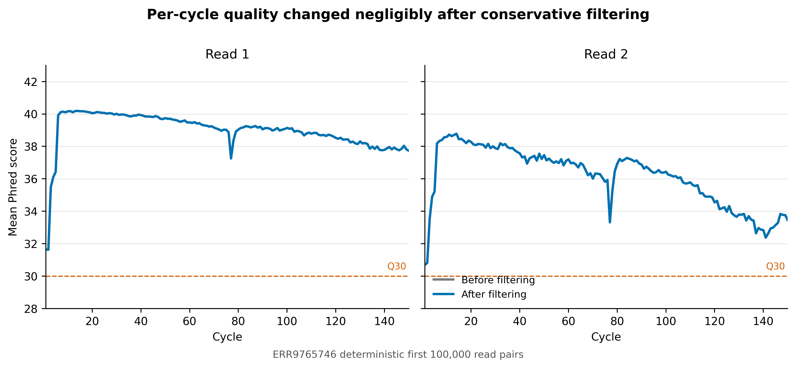
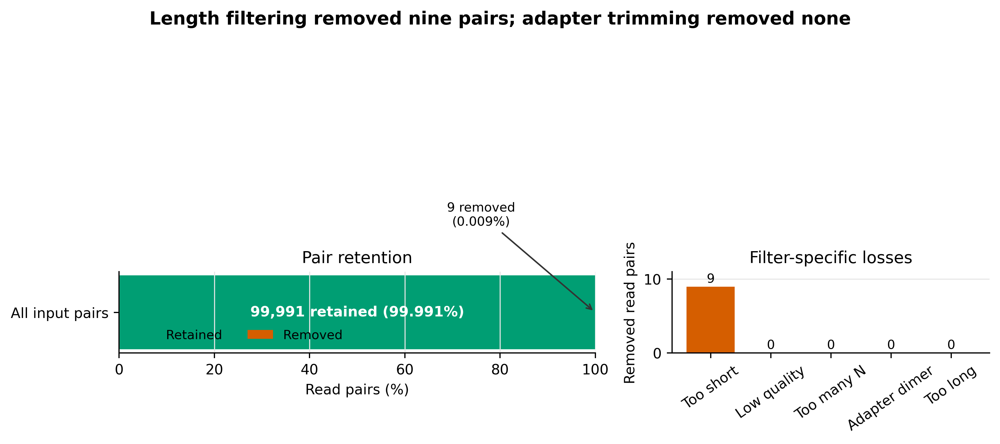
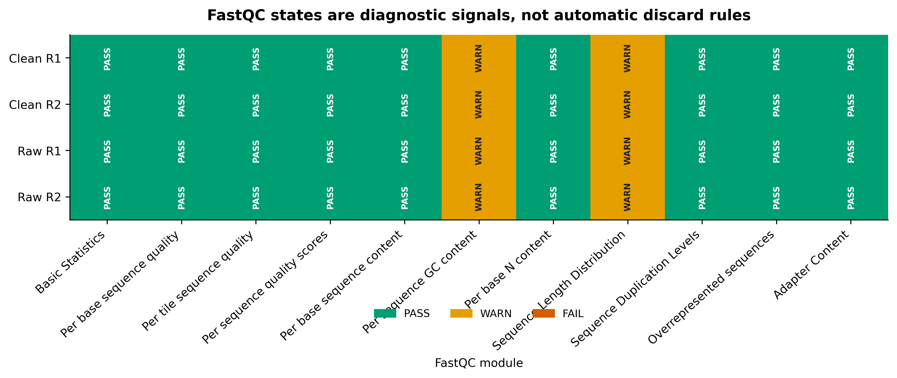

> **学习目标：**把 FastQC、fastp 与 MultiQC 放回各自正确的位置；先检查原始成对 FASTQ，再用显式、保守的规则过滤，核对 reads 与 read pairs 两套账本，复查 clean FASTQ，并判断 WARN 是技术异常、样本生物学，还是通用模型与宏基因组不匹配。  
> **真实数据：**Meslier 等构建的 71-strain MOCK1 DNA，ENA project `PRJEB52977`、sample `SAMEA14435832`、Illumina HiSeq 3000 paired-end run `ERR9765746` [@meslier2022platforms]。本文确定性使用官方 R1/R2 文件各自最前面的 100,000 条完整记录；它是可核验的文件前缀，不是随机抽样，也不代表全量 run。  
> **预计资源：**建议 4 核、4 GB RAM、2 GB scratch；本文实际运行中 fastp 用时 1 分 17.91 秒、峰值 1,580,964 KB，四份 FastQC 合计低于 9 秒，MultiQC 用时 2.37 秒。全量 FASTQ 的官方压缩体积约 1.62 GiB（R1）与 1.96 GiB（R2），应在 HPC/scratch 或云盘处理；没有服务器时可先运行本文 100,000-pair 前缀。

## 这一步对应论文里的哪张图 {#sec-target}

### 论文给了比较终点，质控还需要独立账本

Meslier 等用同一组复杂 mock DNA 比较七种测序平台。Figure 1 展示 mock 中跨 29 个 phyla、GC 含量约 27%–69% 的基因组背景，Table 1 给出平台与读长，后续 Figure 2、Figure 3 比较测序深度与物种丰度偏差 [@meslier2022platforms]。这些比较成立的前提，是每个平台的 reads 先经过可解释的质量处理。

原论文的 Illumina/MGI short-read QC 使用 fastp 0.20.0；Illumina 提供 TruSeq adapters，过滤后最短长度为 45 nt，含一个 `N` 的 reads 和失去配对的 reads 被移除。本文使用同一公开 Illumina run，但目标不是伪装成对原论文统计图的逐像素复现，而是把论文图之前容易被压缩成一句 Methods 的步骤展开成三张可审计证据图：

1. 每个 cycle 的质量在过滤前后是否真正改变；
2. 100,000 个 read pairs 到底保留、损失了多少，损失由哪条规则造成；
3. raw/clean × R1/R2 的 FastQC module 状态是否一致，WARN 是否有生物学解释。

### 结果一：保守过滤没有“制造”质量改善

{#fig-per-cycle-quality}

R1、R2 各 cycle 的 raw 与 clean 曲线几乎重合。fastp 没有为追求更漂亮的曲线启用 5′/3′ sliding-window trimming；只有极少数天然短 reads 触发长度门槛。**图没有明显变好，恰恰说明输入本来就好。**

### 结果二：损失集中在一条可解释规则

{#fig-read-pair-fate}

fastp JSON 以 **reads** 计数：输入 200,000 reads，保留 199,982 reads，`too_short = 18`。只有在确认输出仍为同步 paired-end、所有分类计数均为偶数且 reads 账本守恒后，才能除以二写成 100,000、99,991 和 9 个 **read pairs**。

::: {.callout-important title="零条 adapter-trimmed reads 是有效结果"}
`--detect_adapter_for_pe` 已实际运行；fastp 报告 `adapter_trimmed_reads = 0`。这表示该前缀中没有达到工具证据门槛的 adapter overlap，不表示漏跑了接头检查。硬写 adapter 序列或加大修剪强度，不能把“零”变成更可信的结果。
:::

### 结果三：WARN 不等于失败

{#fig-fastqc-module-states}

四份 FastQC 报告合计 36 PASS、8 WARN、0 FAIL。每份报告的两个 WARN 都没有在过滤后消失：

- **Per sequence GC content：**FastQC 的通用期望更接近单一基因组或形状简单的文库；71 个基因组组成的 mock 本来就可能形成复杂 GC 分布。
- **Sequence Length Distribution：**原始前缀的 read length 为 47–150 bp，clean 为 50–150 bp；变长不是文件损坏，而是文库与处理结果的真实结构。

如果 WARN 来自污染或接头残留，通常还应看到 overrepresented sequences、adapter content、taxonomic control 或 blank 中的相互支持证据。这里只有孤立颜色，不足以推出污染。

## 理论：质控是在管理证据，不是在追求全绿 {#sec-theory}

### 1. 三个工具回答三个不同问题

| Tool | 输入 | 核心问题 | 会不会改 FASTQ |
|---|---|---|---|
| FastQC | 单个 FASTQ | 这个文件的质量、组成、长度、重复和接头信号长什么样？ | No |
| fastp | paired/single FASTQ | 哪些 reads 触发了明确过滤或修剪规则？ | Yes |
| MultiQC | 多个工具的 reports/logs | 多文件、多样本结果能否放在同一界面比较？ | No |

MultiQC [@ewels2016multiqc] 是汇总器，不会重新分析 FASTQ，也不会替 FastQC 或 fastp 判断一个 WARN 是否可接受。FastQC 是文件级诊断，不负责保持 pair 同步。fastp [@chen2018fastp] 才是本文实际写出 clean FASTQ 的工具。

### 2. Phred 分数是错误概率的对数

Phred quality score 定义为：

$$
Q = -10 \log_{10}(P_{\mathrm{error}})
$$

因此：

| Q score | Estimated base-call error probability | Expected errors per base |
|---:|---:|---:|
| Q20 | $10^{-2}$ | 1 in 100 |
| Q30 | $10^{-3}$ | 1 in 1,000 |
| Q40 | $10^{-4}$ | 1 in 10,000 |

`--qualified_quality_phred 20` 并不是“保留所有 Q20 bases”。它把 Q20 设为合格 base 的边界，再由 `--unqualified_percent_limit 40` 判断一条 read 中不合格 bases 的比例是否过高。两个参数必须一起报告。

### 3. 单端合格不等于成对数据合格

对 paired-end 数据，最低限度的账本是：

$$
N_{\mathrm{input\ reads}}
= N_{\mathrm{passed\ reads}}
+ N_{\mathrm{low\ quality}}
+ N_{\mathrm{too\ many\ N}}
+ N_{\mathrm{too\ short}}
+ N_{\mathrm{too\ long}}
$$

本文为：

$$
200{,}000
=199{,}982+0+0+18+0
$$

但 read-level 等式还不够。还要确认：

1. clean R1 与 clean R2 记录数相同；
2. 每一行 normalized read ID 相同且顺序一致；
3. 每个失败类别在当前 paired policy 下可成对解释；
4. 下游程序拿到的仍是 `--in1/--in2` 对应输出，而不是两个独立过滤文件。

本文 clean paired-ID 序列的 SHA-256 为：

```text
457cef6e9d603790dfbc26b716b0498169b54c31bc903d067d449d8dcc86770d
```

### 4. “末端下降”不自动等于“应该剪掉”

短 reads 的信息量、可唯一比对性和 assembly k-mer 支持都会随长度下降。盲目从两端修剪可能：

- 把原本仍高于 Q30 的 bases 删除；
- 增加小于最短长度阈值的 reads；
- 让 strain-level variants 和低丰度基因的覆盖继续下降；
- 造成不同测序批次因质量曲线不同而接受不同程度的信息损失。

更稳妥的顺序是：先查看 per-cycle distribution，再选择最少必要操作；若要改变 trimming policy，应在代表性样本上比较 retention、mapping、taxonomic profile 和 assembly outcome，而不是只比较 FastQC 颜色。

### 5. duplication 是信号，不是自动去重指令

fastp 报告的 duplication rate 为 1.513%，本文只记录，没有使用 `--dedup`。在 shotgun metagenome 中，相同 reads 可能来自：

- PCR duplicates；
- 高丰度基因组的真实重复抽样；
- 多拷贝 rRNA、mobile elements 或保守基因；
- 多个近缘基因组共享的序列。

没有 UMI 或定位信息时，sequence-level deduplication 很难区分这些来源。直接删重复 reads 会优先改变高丰度 taxa 和高拷贝功能的计数结构。若文库是 PCR-free，更不应仅凭 FastQC duplication WARN 就去重。

### 6. FastQC 的参考模型未必适合复杂群落

FastQC 的 module 状态是规则化诊断。宏基因组中的多峰 GC、不同 organism 的起始 motif、真实高丰度序列和多样 read length 都可能触发 WARN。解释时应把多个证据层合在一起：

```text
FastQC signal
    ├── instrument / library expectation
    ├── adapter and overrepresented-sequence identity
    ├── negative and positive controls
    ├── host / taxonomic classification
    └── downstream mapping or assembly impact
```

单独一个 module 的颜色只能提出问题，不能替代答案。

### 7. 文件前缀可复现，但不是随机代表样本

本文固定“官方 checksum-identified 文件的前 100,000 个完整 records”，优点是任何人能复核相同字节和相同结果；局限是 Illumina FASTQ 的顺序可能保留 lane/tile 等技术结构。它适合教学、软件验收和回归测试，不适合估计全量 run 的失败率置信区间。

全量项目至少应：

- 每个 sample 运行 raw 与 clean QC；
- 比较样本间的 retention、Q30、length 和 duplication；
- 按 lane、batch、body site 和 extraction batch 检查异常；
- 对关键过滤参数做代表性样本敏感性分析；
- 把排除样本的规则写在看结果之前。

## 准备工作 {#sec-setup}

<details>
<summary><strong>展开：算力、固定环境、数据谱系与内联作图函数</strong></summary>

### 算力门槛

| Task | CPU | RAM | Scratch | Observed wall time on 100k pairs |
|---|---:|---:|---:|---:|
| Stream deterministic prefix | 1 | <1 GB | 20 MB | network-dependent |
| FastQC raw pair | 2 | 0.40 GiB peak | 20 MB + reports | 4.39 s |
| fastp paired filtering | 4 | 1.51 GiB peak | 40 MB | 1 min 17.91 s |
| FastQC clean pair | 2 | 0.41 GiB peak | reports only | 4.42 s |
| MultiQC aggregation | up to 4 | 0.22 GiB peak | <10 MB | 2.37 s |

这些是本机实测值，不是全量 FASTQ 的线性预算。全量数据应先用一个代表性样本在目标 scratch 上 benchmark；同时跑多个样本时，内存和 I/O 会按并发数叠加。

没有服务器时，先用本文前缀完成参数和报告结构验收。真正分析队列时，把 raw/clean FASTQ 放到不参与 Git 同步的 scratch；只把 manifest、参数、报告、审计表与最终 figures 带回项目目录。

### 建立版本锁定环境

完整环境定义为 `env/read-qc.yml`，Linux-64 transaction 固定在 `env/read-qc-linux-64.lock`：

```bash
mamba env create --file env/read-qc.yml
export READ_QC_ENV_PREFIX="${HOME}/miniconda3/envs/metagenome-read-qc-2026.07"

"${READ_QC_ENV_PREFIX}/bin/fastqc" --version
"${READ_QC_ENV_PREFIX}/bin/fastp" --version
"${READ_QC_ENV_PREFIX}/bin/multiqc" --version
"${READ_QC_ENV_PREFIX}/bin/python" --version

sha256sum env/read-qc.yml env/read-qc-linux-64.lock
```

应得到：

```text
FastQC v0.12.1
fastp 1.3.6
multiqc, version 1.35
Python 3.14.6
```

环境文件与 explicit lock 的 SHA-256 分别是：

```text
3d94a0e5e8a8b1ba2bf58de1d1c15be06824ae7163965559fce48ce632e94759  env/read-qc.yml
19bd7992dd9480fbd0fea34fda676da866c3775648a693fc6822636da64f2368  env/read-qc-linux-64.lock
```

如果要逐字节恢复 Linux-64 transaction，可使用：

```bash
mamba create \
  --name metagenome-read-qc-2026.07 \
  --file env/read-qc-linux-64.lock
```

### 核对公开数据身份

`data/small/13-source-manifest.tsv` 的每一行是一端 FASTQ：

```bash
column -t -s $'\t' data/small/13-source-manifest.tsv | less -S
sha256sum data/small/13-source-manifest.tsv
```

关键字段：

| Field | Locked value |
|---|---|
| Study | `PRJEB52977` |
| Sample | `SAMEA14435832` |
| Run | `ERR9765746` |
| Layout | paired |
| Instrument | Illumina HiSeq 3000 |
| Read geometry | 2 × 150 bp nominal |
| Selection | first 100,000 complete records per mate |
| Source manifest SHA-256 | `e0556ff…8042a` |

完整 ENA archive 的 MD5 与 byte count 是远端身份信息。streaming prefix 没有下载完整文件，不能声称重新验证了完整 MD5。本文另为所用 prefix 计算未压缩 FASTQ SHA-256 和确定性 gzip SHA-256。

### 内联 R 作图环境与函数

网页直接使用已经审计的三格式图；若要把自己的 QC 汇总表画成同款图，可安装：

```r
install.packages(
  c("ggplot2", "dplyr", "tidyr", "readr", "scales", "ragg")
)
```

并在当前脚本内定义：

```r
library(ggplot2)
library(dplyr)
library(tidyr)
library(readr)

set.seed(20260720)

pal_pub <- c(
  "Raw" = "#7A7A7A",
  "Clean" = "#0072B2",
  "PASS" = "#009E73",
  "WARN" = "#E69F00",
  "FAIL" = "#D55E00",
  "Removed" = "#D55E00"
)

scale_color_pub <- function(...) {
  scale_color_manual(values = pal_pub, ...)
}

scale_fill_pub <- function(...) {
  scale_fill_manual(values = pal_pub, ...)
}

theme_pub <- function(base_size = 12) {
  theme_classic(base_size = base_size) +
    theme(
      plot.title = element_text(face = "bold", hjust = 0),
      plot.subtitle = element_text(color = "#555555"),
      axis.title = element_text(face = "bold"),
      legend.position = "bottom",
      legend.title = element_blank(),
      strip.background = element_blank(),
      strip.text = element_text(face = "bold"),
      plot.margin = margin(8, 12, 8, 8)
    )
}

save_pub <- function(
  plot,
  stem,
  width = 9,
  height = 5.5,
  dpi = 350
) {
  dir.create("figures", recursive = TRUE, showWarnings = FALSE)
  ggsave(
    file.path("figures", paste0(stem, ".pdf")),
    plot, width = width, height = height,
    device = cairo_pdf
  )
  ggsave(
    file.path("figures", paste0(stem, ".png")),
    plot, width = width, height = height,
    dpi = dpi, bg = "white"
  )
  ggsave(
    file.path("figures", paste0(stem, ".tiff")),
    plot, width = width, height = height,
    dpi = dpi, compression = "lzw", bg = "white"
  )
}
```

</details>

## 可复制代码 {#sec-code}

### 1. 一次性建立同步 FASTQ 前缀

原始数据只写入 ignored scratch：

```bash
set -euo pipefail

export READ_QC_ENV_PREFIX="${HOME}/miniconda3/envs/metagenome-read-qc-2026.07"
export RAW_DIR="${SCRATCH:-$PWD/data/raw}/article13"

mkdir -p "${RAW_DIR}"

"${READ_QC_ENV_PREFIX}/bin/python" \
  scripts/build_article13_fastq_subset.py \
  --manifest data/small/13-source-manifest.tsv \
  --output-dir "${RAW_DIR}"

sed -n '1,220p' "${RAW_DIR}/subset-summary.json"
```

builder 会逐条检查：

- FASTQ header 以 `@` 开头、separator 以 `+` 开头；
- sequence 与 quality 长度一致；
- bases 只含 `A/C/G/T/N`；
- quality 与 Phred+33 范围兼容；
- 每端恰有 100,000 条完整记录且 normalized ID 不重复；
- R1/R2 normalized ID 与顺序逐条相同。

本文原始 prefix 的证据为：

```text
Pairs: 100000
First ID: ERR9765746.1
Last ID:  ERR9765746.100000
R1 length: 47–150 bp
R2 length: 47–150 bp
Paired-ID SHA-256:
050dd3a5426c09ecc024adc9a0e89f8852cca005fb24cec625bb1810f52d3b63
```

### 2. 先跑 raw FastQC

```bash
set -euo pipefail

RAW_R1="${RAW_DIR}/ERR9765746_prefix100k_R1.fastq.gz"
RAW_R2="${RAW_DIR}/ERR9765746_prefix100k_R2.fastq.gz"
FROZEN_DIR="data/small/13-qc-frozen"

mkdir -p \
  "${FROZEN_DIR}/raw_fastqc" \
  "${FROZEN_DIR}/logs"

/usr/bin/time -v \
  -o "${FROZEN_DIR}/logs/fastqc-before.resources.txt" \
  "${READ_QC_ENV_PREFIX}/bin/fastqc" \
  --noextract \
  --threads 2 \
  --memory 512 \
  --svg \
  --outdir "${FROZEN_DIR}/raw_fastqc" \
  "${RAW_R1}" "${RAW_R2}" \
  > "${FROZEN_DIR}/logs/fastqc-before.log" 2>&1
```

保留 `.zip` 很重要：HTML 方便人工浏览，zip 内的 `fastqc_data.txt` 与 `summary.txt` 才是可机器审计的 module-level 结果。

```bash
unzip -p \
  "${FROZEN_DIR}/raw_fastqc/ERR9765746_prefix100k_R1_fastqc.zip" \
  '*/summary.txt'

unzip -p \
  "${FROZEN_DIR}/raw_fastqc/ERR9765746_prefix100k_R1_fastqc.zip" \
  '*/fastqc_data.txt' |
  sed -n '1,55p'
```

### 3. 用显式的 paired-end 规则运行 fastp

```bash
set -euo pipefail

CLEAN_R1="${RAW_DIR}/ERR9765746_clean_R1.fastq.gz"
CLEAN_R2="${RAW_DIR}/ERR9765746_clean_R2.fastq.gz"

mkdir -p "${FROZEN_DIR}/fastp"

/usr/bin/time -v \
  -o "${FROZEN_DIR}/logs/fastp.resources.txt" \
  "${READ_QC_ENV_PREFIX}/bin/fastp" \
  --in1 "${RAW_R1}" \
  --in2 "${RAW_R2}" \
  --out1 "${CLEAN_R1}" \
  --out2 "${CLEAN_R2}" \
  --json "${FROZEN_DIR}/fastp/ERR9765746_fastp.json" \
  --html "${FROZEN_DIR}/fastp/ERR9765746_fastp.html" \
  --report_title "ERR9765746 first 100,000 pairs" \
  --thread 4 \
  --compression 6 \
  --detect_adapter_for_pe \
  --qualified_quality_phred 20 \
  --unqualified_percent_limit 40 \
  --n_base_limit 5 \
  --length_required 50 \
  --disable_trim_poly_g \
  --overrepresentation_analysis \
  --overrepresentation_sampling 20 \
  --dont_overwrite \
  > "${FROZEN_DIR}/logs/fastp.log" 2>&1
```

这里有意没有启用：

```text
--cut_front
--cut_tail
--cut_right
--correction
--dedup
--low_complexity_filter
```

HiSeq 3000 使用四通道 chemistry，不属于 poly-G tail 最典型的二通道平台，因此明确 `--disable_trim_poly_g`，避免环境默认行为或跨平台配置漂移。若你的数据来自 NextSeq/NovaSeq 等平台，应根据实际 chemistry、报告中的 poly-G pattern 和 negative control 决定，而不是照搬这个选项。

### 4. 从 JSON 建立 reads 账本，再解释成 pairs

先保留工具原始单位：

```bash
jq '{
  fastp_version,
  before: .summary.before_filtering,
  after: .summary.after_filtering,
  filtering_result,
  adapter_cutting,
  duplication: .duplication.rate,
  insert_size_peak: .insert_size.peak
}' \
  "${FROZEN_DIR}/fastp/ERR9765746_fastp.json"
```

本文关键值：

| Metric | Tool unit | Observed |
|---|---|---:|
| Input | reads | 200,000 |
| Passed | reads | 199,982 |
| Low quality | reads | 0 |
| Too many N | reads | 0 |
| Too short | reads | 18 |
| Too long | reads | 0 |
| Adapter trimmed | reads | 0 |

机器检查账本：

```bash
jq -e '
  .summary.before_filtering.total_reads
  ==
  (
    .summary.after_filtering.total_reads
    + .filtering_result.low_quality_reads
    + .filtering_result.too_many_N_reads
    + .filtering_result.too_short_reads
    + .filtering_result.too_long_reads
  )
' "${FROZEN_DIR}/fastp/ERR9765746_fastp.json"
```

只有 clean R1/R2 同步检查也通过，才把偶数 read counts 除以二：

```text
Input pairs:     100000
Retained pairs:   99991
Too-short pairs:      9
Retention:        99.991%
```

### 5. 对 clean FASTQ 再跑 FastQC

```bash
set -euo pipefail

mkdir -p "${FROZEN_DIR}/clean_fastqc"

/usr/bin/time -v \
  -o "${FROZEN_DIR}/logs/fastqc-after.resources.txt" \
  "${READ_QC_ENV_PREFIX}/bin/fastqc" \
  --noextract \
  --threads 2 \
  --memory 512 \
  --svg \
  --outdir "${FROZEN_DIR}/clean_fastqc" \
  "${CLEAN_R1}" "${CLEAN_R2}" \
  > "${FROZEN_DIR}/logs/fastqc-after.log" 2>&1
```

raw 与 clean 报告都要保留。只看 clean 会失去“这条规则究竟改变了什么”的反事实；只看 raw 则无法发现过滤器写空文件、破坏配对或引入意外长度分布。

### 6. 用 MultiQC 汇总，但保留 before/after 身份

```bash
set -euo pipefail

mkdir -p "${FROZEN_DIR}/multiqc"

/usr/bin/time -v \
  -o "${FROZEN_DIR}/logs/multiqc.resources.txt" \
  "${READ_QC_ENV_PREFIX}/bin/multiqc" \
  --force \
  --no-version-check \
  --module fastqc \
  --module fastp \
  --require-logs \
  --dirs \
  --dirs-depth 1 \
  --fullnames \
  --data-dir \
  --data-format json \
  --title "ERR9765746 read QC: raw versus clean" \
  --filename "13-multiqc-report.html" \
  --outdir "${FROZEN_DIR}/multiqc" \
  "${FROZEN_DIR}/raw_fastqc" \
  "${FROZEN_DIR}/clean_fastqc" \
  "${FROZEN_DIR}/fastp" \
  > "${FROZEN_DIR}/logs/multiqc.log" 2>&1
```

`--dirs --dirs-depth 1 --fullnames` 让 sample 名带上 `raw_fastqc` 或 `clean_fastqc` 前缀，避免同名 R1/R2 在聚合时覆盖。验收目标是四个 FastQC reports 与一个 fastp report：

```text
FastQC: 4
fastp:  1
```

### 7. 一条命令执行完整的一次性流程

上面的步骤已封装为：

```bash
bash scripts/run_article13_read_qc.sh \
  --project-root "$PWD" \
  --environment-prefix "${READ_QC_ENV_PREFIX}" \
  --raw-dir "${RAW_DIR}" \
  --frozen-dir data/small/13-qc-frozen
```

为避免悄悄混入两次运行的文件，脚本拒绝覆盖非空 frozen directory。需要重跑时，应创建新的版本化目录，验收通过后再明确替换旧 evidence bundle。

### 8. 日常离线验证冻结产物

```bash
mkdir -p results/13-read-qc-fastp figures

"${READ_QC_ENV_PREFIX}/bin/python" \
  scripts/validate_article13_read_qc.py \
  --project-root "$PWD" \
  --environment-prefix "${READ_QC_ENV_PREFIX}" \
  --frozen-dir data/small/13-qc-frozen \
  --output-dir results/13-read-qc-fastp \
  --figure-dir figures
```

该验证不访问 ENA，并检查：

- `data/small/13-qc-frozen/run-summary.json` 中的一次性运行结论；
- `data/small/13-qc-frozen/file-checksums.sha256` 中的完整 frozen payload 身份；
- 57 个 frozen payload 文件的 SHA-256；
- 工具版本、171-row explicit lock 与输入 manifest；
- fastp 参数存在/缺席、read ledger 与 clean pair 同步；
- 四个 FastQC zip、每份 11 个 modules 与 sequence counts；
- MultiQC 的 4 + 1 reports 和唯一 sample names；
- 三张图的 PDF、PNG 与 350 dpi LZW TIFF。

本次结果：

```text
checks_passed:      74
checks_failed:       0
checksum_failures:   0
qa_network_access: false
```

公开 frozen bundle 中的本机绝对路径会规范化为
`${PROJECT_ROOT}`、`${RAW_DIR}`、`${FROZEN_DIR}`、
`${READ_QC_ENV_PREFIX}` 与 `${TMPDIR}`；指标、参数、文件名和报告内容不变。
常规验证同时断言没有宿主路径或一次性临时目录残留。

## 审计与升级 {#sec-audit}

### 先区分论文复现参数与当前处理参数

| Decision | Meslier et al. Illumina QC | 本文当前合同 | 为什么不同 |
|---|---|---|---|
| fastp version | 0.20.0 | 1.3.6 | 固定当前已验证 release，同时保留历史版本 |
| Adapter | supplied TruSeq adapter | paired overlap detection | 先让数据证明该 prefix 是否有 adapter signal |
| Minimum length | 45 nt | 50 bp | 当前下游最小信息量合同 |
| N threshold | any `N` discarded | at most 5 `N` | 避免单个不确定 base 自动丢整对 |
| Pair policy | unpaired removed | paired outputs only | 两端同步与 ledger 进入机器断言 |
| Sliding trimming | not fully enumerated in paper | disabled | 不用隐藏默认值“修绿”报告 |

原论文参数回答“论文当时如何比较七个平台”；本文参数回答“当前软件下如何建立一条保守、显式、可审计的 short-read QC 基线”。如果要忠实重跑原论文，必须另建 fastp 0.20.0 环境并按原文提供 TruSeq adapter、45-nt 和 zero-N policy，不能把本文结果写成原参数重现。

### FastQC 版本也要作为结果条件

不同 FastQC 版本可能改变 module、阈值或解析行为。本文四份报告都记录 `FastQC 0.12.1`，每份恰有 11 个 module states。不要在 Methods 只写“FastQC was used”，也不要拿不同版本的 PASS/WARN 数直接比较批次。

### 对真实队列增加样本级门槛

单个 mock prefix 只能验证工具链。真实项目还应产生一行一个 sample 的 QC table：

| Required field | 作用 |
|---|---|
| input/passed pairs | 发现低产出与异常损失 |
| Q20/Q30 before and after | 区分原始质量与处理影响 |
| length distribution | 保护短 read 信息边界 |
| adapter-trimmed reads/bases | 确认 adapter policy 是否实际工作 |
| duplication estimate | 识别文库复杂度异常，不自动去重 |
| overrepresented sequences | 连接 adapter/control/taxonomic 检查 |
| FastQC module states | 保留诊断上下文 |
| host fraction | 判断人体样本可用微生物 read budget |
| exclusion decision and reason | 防止看组间结果后删样本 |

排除阈值应结合样本类型与研究终点。低生物量样本、biopsy、saliva 和 stool 不应共享一个武断的 passed-pair 或 duplication 阈值。

### 参数敏感性应该看下游，不只看 QC 图

至少选择高质量、中位质量和低质量样本，比较：

```text
Conservative policy
    vs
More aggressive end trimming
    ├── retained paired reads
    ├── host-removal yield
    ├── mapping / classification rate
    ├── species profile distance
    ├── pathway profile distance
    └── assembly N50 / mapped fraction
```

若激进 trimming 只让 FastQC 更绿，却降低 paired retention、unique mapping 或 assembly recovery，就没有升级价值。

### clean reads 还不是分析输入终点

本文只处理 sequence-quality、N、length 与 adapter evidence。人体来源 shotgun reads 还要进入宿主去除，并在 clean/non-host 层继续检查复杂度、重复和生物安全边界。不要把 `passed_filter_reads` 写成“microbial reads”；它仍可能包含 human、PhiX 或其他非目标序列。

## 出版级美化 {#sec-polish}

### 一张图只回答一个判断

三张图采用不同视觉语法：

- line plot 回答 per-cycle quality 是否改变；
- retention bar + loss counts 回答 reads 去哪里了；
- module matrix 回答 WARN 出现在哪个 stage/mate/module。

不把 MultiQC 整页截图当主图。整页 HTML 适合交付审计，论文主图需要把与结论有关的字段重绘，并保留机器可读表作为补充材料。

### 用差异而不是颜色变化制造结论

Raw 与 clean 曲线几乎重叠时，应让两条线同轴绘制，并给出 Q30 reference line；不能分别缩放 y 轴放大微小变化。retention 为 99.991% 时，用 0–100% 轴并单独标注 9 个 removed pairs，既保留比例事实，也不让小数被像素吞掉。

### 图注必须锁定分母与数据边界

合格图注至少写明：

- `ERR9765746`；
- deterministic first 100,000 read pairs；
- read 还是 read-pair 分母；
- raw/clean 的工具与版本；
- WARN 是 module state，不是 sample exclusion；
- prefix 不是随机或 full-run estimate。

三种导出用途：

| Format | 用途 |
|---|---|
| PDF | 矢量文字与期刊排版 |
| PNG | 网页、公众号与快速审阅 |
| 350 dpi LZW TIFF | 需要 raster TIFF 的投稿系统 |

图内只使用英文，避免服务器字体差异，也便于直接进入英文论文。

## 常见坑 {#sec-pitfalls}

::: {.callout-caution title="坑 1：只看 MultiQC 的颜色"}
MultiQC 把很多日志放在一页，但不会判断 WARN 的原因。必须回到 FastQC module、fastp JSON、control 与样本背景。
:::

::: {.callout-caution title="坑 2：把 reads 写成 read pairs"}
fastp JSON 默认报告 reads。paired-end 下不能未经同步和守恒检查就除以二，更不能把 `too_short_reads = 18` 写成损失 18 pairs。
:::

::: {.callout-caution title="坑 3：R1、R2 分别截取或分别过滤"}
两个文件记录数相同不代表 ID 和顺序相同。应逐条规范化 read ID，再验证全序列一致。
:::

::: {.callout-caution title="坑 4：为了全绿启用所有 trimming"}
同时打开 front/tail/right cutting、correction、length filter 和 low-complexity filter，会让每一种信息损失难以归因。先设最小规则，再逐项做敏感性分析。
:::

::: {.callout-caution title="坑 5：把 GC 或 duplication WARN 直接叫污染"}
复杂 mock 和真实群落会产生复杂 GC 与真实重复抽样。污染判断需要 blank、sequence identity、taxonomic classification 和 batch pattern 支持。
:::

::: {.callout-caution title="坑 6：把 100,000-pair prefix 当随机抽样"}
固定文件前缀用于回归验收很强，用于估计总体比例很弱。全量决策必须重跑每个样本，并检查 lane/tile 与批次结构。
:::

::: {.callout-caution title="坑 7：before/after 同名导致 MultiQC 覆盖"}
目录前缀或明确 sample naming 必须保留。汇总后断言应看到四个唯一 FastQC samples，而不是两个。
:::

::: {.callout-caution title="坑 8：只保存 HTML"}
HTML 方便看，却不适合作为唯一审计证据。至少同时保留 FastQC zip、fastp JSON、MultiQC data directory、命令、版本、resource logs 和 SHA-256 manifest。
:::

## 这段 Methods 怎么写 {#sec-methods}

下面模板与本文实际执行一致：

> Raw-read quality was assessed with FastQC v0.12.1. A deterministic prefix comprising the first 100,000 complete synchronized read pairs from the Illumina HiSeq 3000 run ERR9765746 (ENA project PRJEB52977; sample SAMEA14435832) was processed with fastp v1.3.6 using paired-end adapter detection, a qualified-base threshold of Q20, a maximum unqualified-base fraction of 40%, a maximum of five ambiguous bases per read, and a minimum retained length of 50 bp. Poly-G trimming, sliding-window end trimming, overlap correction, sequence-level deduplication, and low-complexity filtering were disabled. Both mates were discarded when a pair failed filtering. Clean reads were reassessed with FastQC v0.12.1, and four FastQC reports plus the fastp report were aggregated with MultiQC v1.35. Read-count conservation and R1/R2 identifier synchronization were verified programmatically. The input contained 100,000 pairs, of which 99,991 (99.991%) were retained; nine pairs failed only the minimum-length criterion and no reads were adapter-trimmed. Software dependencies were fixed in a 171-package Linux-64 explicit conda specification.

若分析完整队列，把 prefix 句替换为每个样本的 accession/文件身份，并补充：

- sequencing center、instrument、read geometry 与 demultiplexing；
- 是否先合并 lanes，何时合并；
- sample exclusion thresholds 及其预设依据；
- fastp 每个非默认参数；
- raw/clean report 的保存位置；
- passed/non-host 分母如何传递给后续 abundance；
- 是否做参数敏感性分析。

不要只写：

> Reads were quality controlled using default parameters.

这句话无法恢复 adapter policy、pair policy、quality denominator、最短长度、工具版本或实际损失。

## 换成你自己的数据怎么做 {#sec-own-data}

### 输入合同

每个样本至少准备：

```text
sample_id
R1_path
R2_path
library_id
lane
instrument_model
read_length
library_kit
adapter_sequence_or_auto_detection_policy
negative_control_status
positive_control_status
expected_host
```

先验证 manifest：

```bash
while IFS=$'\t' read -r sample r1 r2; do
  [[ "${sample}" == "sample_id" ]] && continue
  test -s "${r1}"
  test -s "${r2}"
done < samples.tsv
```

### 先用三个代表性样本选择策略

选择 raw Q30 较高、中位和较低的三个样本，至少比较：

1. 不做 sliding trimming 的保守策略；
2. 经过依据说明的 end-trimming 策略；
3. retention、length、mapping、profile 与 assembly 的变化。

先固定策略，再批量运行。不要逐样本看图后临时改参数，否则 treatment group、batch 与 trimming intensity 可能发生混杂。

### 批量运行时给每个样本独立输出目录

```bash
set -euo pipefail

THREADS=4

while IFS=$'\t' read -r sample r1 r2; do
  [[ "${sample}" == "sample_id" ]] && continue

  out="results/qc/${sample}"
  mkdir -p "${out}/raw_fastqc" "${out}/clean_fastqc" "${out}/fastp"

  fastqc \
    --noextract \
    --threads 2 \
    --outdir "${out}/raw_fastqc" \
    "${r1}" "${r2}"

  fastp \
    --in1 "${r1}" \
    --in2 "${r2}" \
    --out1 "${out}/${sample}_clean_R1.fastq.gz" \
    --out2 "${out}/${sample}_clean_R2.fastq.gz" \
    --json "${out}/fastp/${sample}.json" \
    --html "${out}/fastp/${sample}.html" \
    --thread "${THREADS}" \
    --detect_adapter_for_pe \
    --qualified_quality_phred 20 \
    --unqualified_percent_limit 40 \
    --n_base_limit 5 \
    --length_required 50 \
    --disable_trim_poly_g \
    --overrepresentation_analysis

  fastqc \
    --noextract \
    --threads 2 \
    --outdir "${out}/clean_fastqc" \
    "${out}/${sample}_clean_R1.fastq.gz" \
    "${out}/${sample}_clean_R2.fastq.gz"
done < samples.tsv

multiqc \
  --dirs \
  --dirs-depth 2 \
  --fullnames \
  --data-dir \
  --outdir results/qc/multiqc \
  results/qc
```

若平台可能产生 poly-G tails，应把 `--disable_trim_poly_g` 替换为经过 platform-specific 证据支持的策略。若已知 adapter 序列，记录 kit/version 并显式提供；auto-detection 不能替代实验元数据。

### 批次验收清单

- [ ] 每个 input sample 恰有 raw R1/R2、clean R1/R2 和一个 fastp JSON
- [ ] input = passed + 各失败类别，所有 sample 的 ledger delta 为 0
- [ ] clean R1/R2 normalized IDs 和顺序一致
- [ ] MultiQC sample names 保留 raw/clean 与 mate 身份
- [ ] 没有样本因单个 FastQC WARN 被自动排除
- [ ] negative controls 与 biological samples 使用同一报告流程
- [ ] 参数、工具版本、environment lock 和数据库外部依赖均进入 Methods
- [ ] clean reads 与后续去宿主步骤的输入 SHA-256 对接

## 参考 {#sec-references}

- Meslier V, Quinquis B, Da Silva K, et al. Benchmarking second and third-generation sequencing platforms for microbial metagenomics. *Scientific Data*. 2022;9:694. [doi:10.1038/s41597-022-01762-z](https://doi.org/10.1038/s41597-022-01762-z). [@meslier2022platforms]
- Chen S, Zhou Y, Chen Y, Gu J. fastp: an ultra-fast all-in-one FASTQ preprocessor. *Bioinformatics*. 2018;34:i884–i890. [doi:10.1093/bioinformatics/bty560](https://doi.org/10.1093/bioinformatics/bty560). [@chen2018fastp]
- Ewels P, Magnusson M, Lundin S, Käller M. MultiQC: summarize analysis results for multiple tools and samples in a single report. *Bioinformatics*. 2016;32:3047–3048. [doi:10.1093/bioinformatics/btw354](https://doi.org/10.1093/bioinformatics/btw354). [@ewels2016multiqc]
- Babraham Bioinformatics. [FastQC official project](https://www.bioinformatics.babraham.ac.uk/projects/fastqc/), version 0.12.1.
- OpenGene. [fastp v1.3.6 release](https://github.com/OpenGene/fastp/releases/tag/v1.3.6).
- MultiQC. [MultiQC v1.35 release](https://github.com/MultiQC/MultiQC/releases/tag/v1.35).
- European Nucleotide Archive. [PRJEB52977 study records](https://www.ebi.ac.uk/ena/browser/view/PRJEB52977).
- 公开来源、prefix hashes、环境、参数、结果与证据边界汇总于仓库相对路径 `data/small/13-data-NOTICE.txt`。
