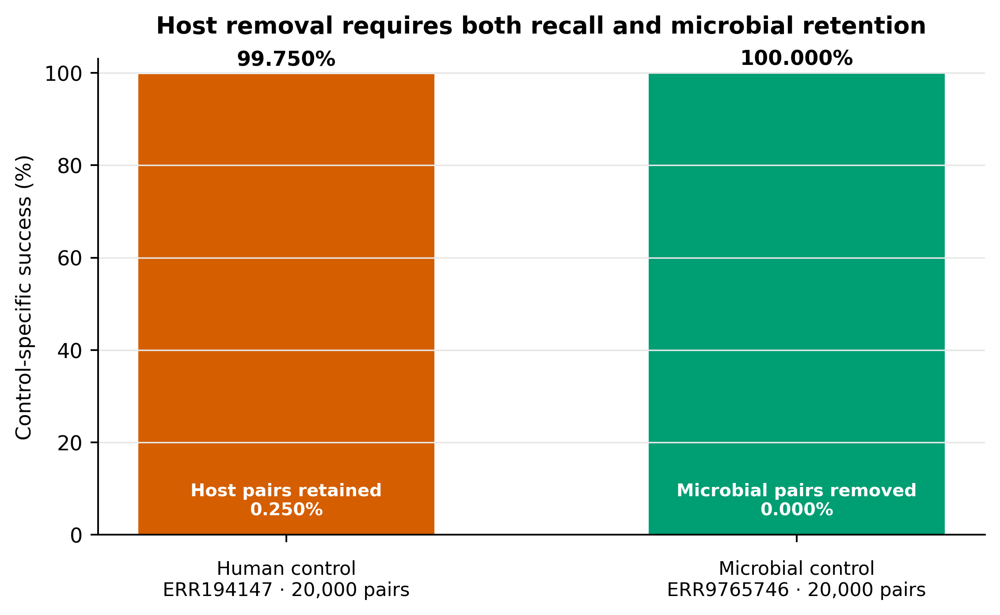
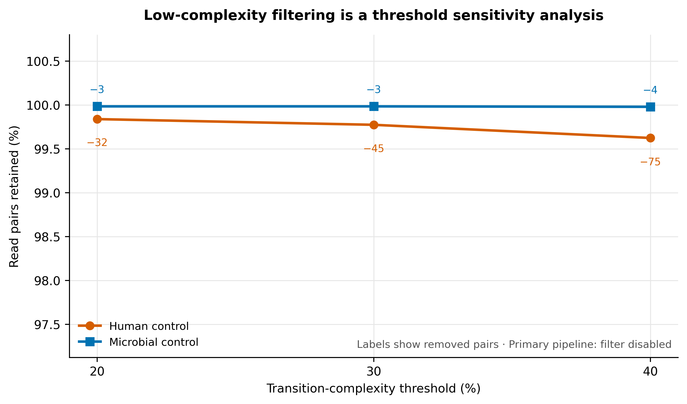
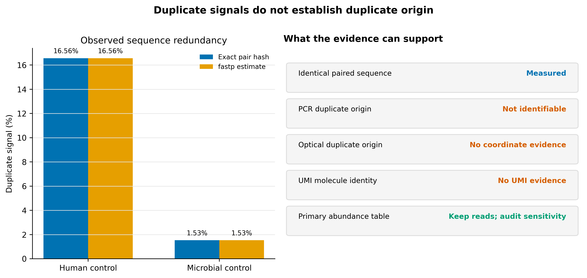

> **学习目标：**把去宿主、低复杂度和重复 reads 拆成三条独立证据链；用完整且锁版本的人类参考执行 paired-end 去宿主；同时用真实人源阳性控制和真实微生物保留控制验收；只把复杂度过滤与去重作为敏感性分支，避免在没有定位或 UMI 证据时改变丰度结构。  
> **真实数据：**人源阳性控制为 Hostile 论文列出的 NA12878 Illumina paired-end run `ERR194147`，ENA project `PRJEB3381`、sample `SAMEA1573618` [@constantinides2023hostile]；微生物保留控制为 71-strain MOCK1 run `ERR9765746`，project `PRJEB52977`、sample `SAMEA14435832` [@meslier2022platforms]。两组各使用官方 R1/R2 文件最前面的 20,000 个完整同步 pairs。  
> **预计资源：**建议 8 核、8 GB RAM、至少 12 GB scratch。`human-t2t-hla.tar` 为 3,934,284,979 bytes（3.66 GiB），六个 Bowtie2 文件解包后共 4.24 GiB。本文 20,000-pair 控制中，Hostile 峰值内存为 1.05–1.16 GiB、用时 0.94–1.51 秒；真实全量样本仍应按官方建议为 Bowtie2 去宿主预留约 4 GB RAM，并先在目标存储上实测 I/O。

## 这一步对应论文里的哪张图 {#sec-target}

### 锚定 Hostile Table 1，但把双控制变成同一次验收

Hostile 论文的 Table 1 同时报告两个方向：真实人类 reads 的残留率，以及模拟 bacterial/mycobacterial reads 的保留率。论文对 NA12878 10×、2 × 100 bp 全量数据报告 human retention 为 0.132%，并以 985 个 FDA-ARGOS 完整细菌基因组的模拟 reads 评估 microbial retention [@constantinides2023hostile]。

这里不把 20,000-pair 文件前缀伪装成全量 Table 1 复现。它回答的是更窄、但可机器验收的问题：

1. 同一个完整 `human-t2t-hla` 索引能否删除真实人类 reads；
2. 同一流程是否保留真实复杂 mock community reads；
3. paired policy 是否让输入、保留和删除三本账完全守恒；
4. 复杂度与重复信号是否被独立记录，而没有混入主流程。

### 结果一：删除人源和保留微生物必须同时成立

{#fig-host-removal-controls}

只报告“删掉多少 host”会掩盖过度过滤；只报告“微生物保留很好”又不能证明隐私边界。双控制结果为：

| Control | Input pairs | Retained pairs | Removed pairs | Control-specific success |
|---|---:|---:|---:|---:|
| Human · `ERR194147` | 20,000 | 50 | 19,950 | 99.750% removed |
| Microbial · `ERR9765746` | 20,000 | 20,000 | 0 | 100.000% retained |

Hostile JSON 的原始单位是 **reads**：human control 为 `40,000 = 100 + 39,900`，microbial control 为 `40,000 = 40,000 + 0`。只有输出 R1/R2 数量、normalized IDs 与顺序均通过同步检查，才把这些偶数除以二解释为 pairs。

::: {.callout-important title="50 个残留 human-control pairs 不是“已证明非人源”"}
`99.750% removed` 是方法阳性控制结果，不是公开数据许可，也不是患者样本匿名性证明。对真实人源样本，剩余 reads 仍应处于受控访问环境，并按伦理、法规和项目治理要求追加隐私审计；不能因为文件名写着 `nonhost` 就直接上传公共库。
:::

### 结果二：低复杂度阈值只进入敏感性分析

{#fig-complexity-sensitivity}

三个阈值都由 fastp 实际运行，并由独立 Python 实现逐 read 复算。六个分支的 fastp 输出 pair 数与独立计数完全一致：

| Control | Threshold | Retained pairs | Removed pairs | Retention |
|---|---:|---:|---:|---:|
| Human | 20% | 19,968 | 32 | 99.840% |
| Human | 30% | 19,955 | 45 | 99.775% |
| Human | 40% | 19,925 | 75 | 99.625% |
| Microbial | 20% | 19,997 | 3 | 99.985% |
| Microbial | 30% | 19,997 | 3 | 99.985% |
| Microbial | 40% | 19,996 | 4 | 99.980% |

这些损失在两个控制前缀上都很小，但“小”不等于“所有研究都应该删”。对低丰度病毒、短 insert、重复区域、低复杂度蛋白或 assembly 终点，几条 reads 也可能改变检出与拼接。主流程因此保持 `low_complexity_filter = false`。

### 结果三：相同序列不等于已识别 PCR duplicate

{#fig-duplicate-decision}

| Control | Input pairs | Exact unique pairs | Exact duplicate pairs | Maximum multiplicity | fastp estimate |
|---|---:|---:|---:|---:|---:|
| Human | 20,000 | 16,687 | 3,313 | 52 | 16.565% |
| Microbial | 20,000 | 19,694 | 306 | 4 | 1.530% |

`fastp --dedup` 敏感性分支分别保留 16,687 与 19,694 pairs，与精确 paired-sequence hash 的 unique count 一致。但这仍只说明“两端序列组合相同”，不能说明它来自 PCR、光学成像重复或同一原始分子。主流程保持 `deduplication = false`。

## 理论：三种清理对象需要三种证据 {#sec-theory}

### 1. 去宿主是参考比对与成对处置问题

对 paired-end reads，本文采用：

$$
\mathrm{retain\ pair}
\iff
\mathrm{R1\ unmapped}\ \land\ \mathrm{R2\ unmapped}
$$

Hostile 2.0.2 的 paired Bowtie2 流中，Samtools `-f 12` 要求 read 与 mate 的 unmapped flags 都存在。任何一端命中人类参考，整对都不进入微生物输出。这样做有两个理由：

- mate 本身可能包含宿主信息，即使另一端没有可靠比对；
- 保留 orphan 会让下游把 paired library 当成两端完整，破坏 insert、mapping 与 assembly 假设。

`--rename` 把输出 read headers 改成递增整数，`--reorder` 固定输出顺序。改名降低 header 泄露与文件体积，但不替代序列层面的去宿主。

### 2. 参考完整性属于隐私与特异性合同

本文固定的 `human-t2t-hla` 由：

- T2T-CHM13 v2.0；
- IPD-IMGT/HLA v3.51；
- Hostile release 2023-07；
- Hostile 2.0.2 官方 Bowtie2 archive

组成。官方 archive SHA-256 为：

```text
5b584f5c28abeec5dba78bd37b53fa476dd42af57051d2fb7d2f2098e3a2df13
```

参考不完整时，一部分真实人类序列可能因缺失区域或高度多态区域而漏过；仅使用一个未说明版本的 primary assembly，既不利于结果复现，也可能放大隐私风险 [@guccione2025reference]。另一方面，人类参考与微生物序列存在同源区，过宽松的 host filter 又可能误删微生物 reads。因此必须同时验收 human recall 和 microbial retention。

### 3. 低复杂度不是低质量的同义词

fastp 的 transition complexity 定义为相邻碱基发生变化的比例：

$$
C_{\mathrm{transition}}
=
\frac{
\sum_{i=1}^{L-1}
\mathbb{1}(b_i \neq b_{i+1})
}{
L-1
}
\times 100\%
$$

例如：

```text
AAAAAAAAAA  ->  0% transition complexity
ACACACACAC  ->  100% transition complexity
```

它回答的是碱基变化模式，不是 Phred quality，也不是 Shannon entropy，更不是 taxonomic identity。homopolymer、短周期序列、真实低复杂度生物区域、残余接头与测序错误都可能改变这个指标，原因需要另查。

paired filtering 下，只要一个 mate 低于阈值，整对被移除。工具报告仍以 reads 计数，所以要同时检查：

$$
N_{\mathrm{input\ reads}}
=
N_{\mathrm{passed\ reads}}
+
N_{\mathrm{low\ complexity\ reads}}
$$

以及输出 R1/R2 的 pair 同步。

### 4. “duplicate”至少有四种含义

| Evidence | 能观察到什么 | 不能自动推出什么 |
|---|---|---|
| Exact paired sequence | R1+R2 序列组合相同 | PCR origin、optical origin |
| Mapping coordinates | 两端比对起止与方向相同 | 没有 UMI 时的原始分子身份 |
| Illumina tile/x/y | 空间距离符合 optical duplicate 规则 | PCR duplicate |
| UMI family | 同一 UMI/位置支持同一分子家族 | UMI 本身无错误、无碰撞 |

`samtools markdup` 需要 coordinate-sorted alignments；要识别 optical duplicates，还要保留可解析的 instrument/tile/x/y read names。若前一步已经 `--rename`，这类坐标证据就不存在。UMI 文库则要先 extract、group、校正 UMI error，再决定 consensus 或 dedup [@smith2017umitools]。

### 5. 宏基因组的真实丰度会制造重复序列

在 shotgun community 中，以下来源都可能生成相同 reads：

- 高丰度 organism 被真实重复抽样；
- rRNA、transposon、phage、plasmid 或其他多拷贝区域；
- 多个近缘 strains 共享保守序列；
- 文库 PCR amplification；
- optical duplicate；
- UMI collision 或 UMI sequencing error。

sequence-level dedup 会优先减少高丰度 taxa 与高拷贝功能，改变相对丰度和 coverage。若研究终点是 assembly、variant calling 或复制数，影响还会继续传递。没有更强证据时，正确动作是**记录、分层、做敏感性分析**。

### 6. 处理顺序决定还能回答什么

建议顺序为：

```text
Conservative read QC
    ↓
Paired host removal
    ↓
Non-host pair ledger and privacy boundary
    ↓
Complexity / duplicate diagnostics
    ↓
Primary analysis without automatic dedup
    └── sensitivity branches when justified
```

若 UMI 位于 read 或 index 中，应在任何会删除或改写 UMI 信息的步骤之前提取。若计划用 optical coordinates，必须在 `--rename` 之前完成 coordinate-aware 标记，并把含原始 headers 的中间文件留在受控环境。

### 7. 公开人类 benchmark 仍是人类基因组数据

`ERR194147` 的公开可下载性只支持把它用作已引用的方法控制。这里不发布其 FASTQ、不保留原始 read IDs、不推断表型或个体遗传信息；冻结 bundle 只含聚合统计、哈希、参数、版本和已规范化路径。真实患者或研究参与者的 raw/non-host FASTQ 是否可共享，必须依据 consent、伦理批件、数据使用协议与当地法规判断 [@tomofuji2023privacy]。

## 准备工作 {#sec-setup}

<details>
<summary><strong>展开：算力、固定环境、双控制谱系、索引身份与内联作图函数</strong></summary>

### 算力与存储门槛

| Task | CPU | RAM | Scratch / database | Observed on 20k pairs |
|---|---:|---:|---:|---:|
| Download official index | 1–16 connections | <1 GB | 3.66 GiB archive | network-dependent |
| Extract Bowtie2 index | 1 | <1 GB | 4.24 GiB installed | 33.5 s |
| Hostile human control | 8 | 1.05 GiB peak | output <1 MB | 1.51 s |
| Hostile MOCK1 control | 8 | 1.16 GiB peak | output ≈ input | 0.94 s |
| One fastp branch | 4 | about 1.1 GiB peak | a few MB | about 1 s |

索引 archive 与解包文件并存时已需约 7.90 GiB，另要为下载临时文件、日志和真实 FASTQ 留空间。建议数据库盘至少留 12 GB 空闲；全量队列另按 raw + QC + non-host FASTQ 的并存体积估算。

没有服务器时，可以先用两个 20,000-pair 前缀验收命令和账本。真实患者样本不应为了省算力上传到未经批准的在线工具；可使用机构 HPC、合规云或先在数据产生机构完成 client-side 去宿主。

### 建立版本锁定环境

```bash
mamba env create --file env/host-removal.yml
export HOST_REMOVAL_ENV_PREFIX="${HOME}/miniconda3/envs/metagenome-host-removal-2026.07"

"${HOST_REMOVAL_ENV_PREFIX}/bin/hostile" --version
"${HOST_REMOVAL_ENV_PREFIX}/bin/bowtie2" --version | head -n 1
"${HOST_REMOVAL_ENV_PREFIX}/bin/samtools" --version | head -n 1
"${HOST_REMOVAL_ENV_PREFIX}/bin/fastp" --version
"${HOST_REMOVAL_ENV_PREFIX}/bin/seqkit" version
"${HOST_REMOVAL_ENV_PREFIX}/bin/python" --version
```

锁定结果：

```text
Hostile  2.0.2
Bowtie2  2.5.4
Samtools 1.21
fastp    1.3.6
SeqKit   2.10.0
Python   3.11.15
```

环境定义与 Linux-64 explicit transaction 的 SHA-256：

```text
e4cba4b08e702e94020f854287d023f47edc313b393631725f8829faed4bf3f3  env/host-removal.yml
295a9351bba9e9f627bad21696ab2d0c028a41a3836d047a1a3dff29b2cc613a  env/host-removal-linux-64.lock
```

逐字节恢复 transaction：

```bash
mamba create \
  --name metagenome-host-removal-2026.07 \
  --file env/host-removal-linux-64.lock
```

### 核对双控制数据身份

`data/small/14-source-manifest.tsv` 每个 control 各有 R1、R2 两行：

| Control | Project | Sample | Run | Instrument | Prefix |
|---|---|---|---|---|---:|
| Human positive | `PRJEB3381` | `SAMEA1573618` | `ERR194147` | HiSeq 2000 | 20,000 pairs |
| Microbial retention | `PRJEB52977` | `SAMEA14435832` | `ERR9765746` | HiSeq 3000 | 20,000 pairs |

```bash
column -t -s $'\t' data/small/14-source-manifest.tsv | less -S
sha256sum data/small/14-source-manifest.tsv data/small/14-data-NOTICE.txt
```

应得到：

```text
00c73ea625ded3e4079611c1d7862fb90afca7bea3b7a482e4350c53a38a6afa  data/small/14-source-manifest.tsv
86e59f2927f6d6d3e2703832eb4911b32a84ab9a8b37815c0035a1f2bf2affc7  data/small/14-data-NOTICE.txt
```

manifest 中的 ENA MD5 是**完整远端 archive 身份**。streaming prefix 没有下载全文件，因此不声称重新计算完整 MD5；所用前缀另有确定性 gzip、未压缩 FASTQ、sequence-only 与 paired-ID SHA-256。

### 核对完整人类索引

```bash
column -t -s $'\t' data/small/14-index-manifest.tsv
sha256sum db/hostile-cache/2.0.2/downloads/human-t2t-hla.tar
```

必须同时满足：

```text
Archive bytes: 3934284979
Archive SHA-256:
5b584f5c28abeec5dba78bd37b53fa476dd42af57051d2fb7d2f2098e3a2df13
Reference: T2T-CHM13v2.0 + IPD-IMGT/HLA v3.51
Release: 2023-07
```

六个解包文件还要逐文件核对 `data/small/14-host-removal-frozen/index-files.sha256`。仅验证 tar 不验证解包产物，或只写 `hg38` 不写组件和 release，都不足以定位分析所用参考。

### 内联 R 作图环境与函数

```r
install.packages(
  c("ggplot2", "dplyr", "tidyr", "readr", "scales", "ragg")
)
```

```r
library(ggplot2)
library(dplyr)
library(tidyr)
library(readr)

set.seed(20260720)

pal_pub <- c(
  "Human control" = "#D55E00",
  "Microbial control" = "#0072B2",
  "Retained" = "#009E73",
  "Removed" = "#D55E00",
  "Exact pair hash" = "#0072B2",
  "fastp estimate" = "#E69F00"
)

scale_color_pub <- function(...) {
  scale_color_manual(values = pal_pub, ...)
}

scale_fill_pub <- function(...) {
  scale_fill_manual(values = pal_pub, ...)
}

theme_pub <- function(base_size = 12) {
  theme_classic(base_size = base_size) +
    theme(
      plot.title = element_text(face = "bold", hjust = 0),
      plot.subtitle = element_text(color = "#555555"),
      axis.title = element_text(face = "bold"),
      legend.position = "bottom",
      legend.title = element_blank(),
      strip.background = element_blank(),
      strip.text = element_text(face = "bold"),
      plot.margin = margin(8, 12, 8, 8)
    )
}

save_pub <- function(
  plot,
  stem,
  width = 9,
  height = 5.5,
  dpi = 350
) {
  dir.create("figures", recursive = TRUE, showWarnings = FALSE)
  ggsave(
    file.path("figures", paste0(stem, ".pdf")),
    plot, width = width, height = height,
    device = cairo_pdf
  )
  ggsave(
    file.path("figures", paste0(stem, ".png")),
    plot, width = width, height = height,
    dpi = dpi, bg = "white"
  )
  ggsave(
    file.path("figures", paste0(stem, ".tiff")),
    plot, width = width, height = height,
    dpi = dpi, compression = "lzw", bg = "white"
  )
}
```

</details>

## 可复制代码 {#sec-code}

### 1. 一次性建立两个同步 FASTQ 控制前缀

```bash
set -euo pipefail

export HOST_REMOVAL_ENV_PREFIX="${HOME}/miniconda3/envs/metagenome-host-removal-2026.07"
export RAW_DIR="${SCRATCH:-$PWD/data/raw}/article14"
mkdir -p "${RAW_DIR}"

"${HOST_REMOVAL_ENV_PREFIX}/bin/python" \
  scripts/build_article14_fastq_controls.py \
  --manifest data/small/14-source-manifest.tsv \
  --output-dir "${RAW_DIR}"

sed -n '1,260p' "${RAW_DIR}/controls-summary.json"
```

builder 对每条记录检查 FASTQ 四行结构、sequence/quality 长度、Phred+33、R1/R2 normalized ID 与顺序；只把聚合指标和 ID digest 带入 frozen bundle。两个 pair-ID digests 为：

```text
ERR194147:
f6006da01154f735c5d80dce94be41711c58e33fd1c0b4290c7fbe734a8b9a18

ERR9765746:
d8ccb5bd01cd5ab8205f08d56fda62cc9ab4d2e779faa6b250bceaa67c242033
```

### 2. 下载、校验并解包官方 Bowtie2 索引

```bash
set -euo pipefail

INDEX_ROOT="${SCRATCH:-$PWD/db}/hostile-cache/2.0.2"
ARCHIVE_DIR="${INDEX_ROOT}/downloads"
ARCHIVE="${ARCHIVE_DIR}/human-t2t-hla.tar"
URL="https://objectstorage.uk-london-1.oraclecloud.com/n/lrbvkel2wjot/b/human-genome-bucket/o/human-t2t-hla.tar"

mkdir -p "${ARCHIVE_DIR}"

aria2c \
  --continue=true \
  --max-connection-per-server=16 \
  --split=16 \
  --min-split-size=8M \
  --file-allocation=none \
  --dir="${ARCHIVE_DIR}" \
  --out="human-t2t-hla.tar" \
  "${URL}"

test "$(stat -c '%s' "${ARCHIVE}")" = "3934284979"
printf '%s  %s\n' \
  "5b584f5c28abeec5dba78bd37b53fa476dd42af57051d2fb7d2f2098e3a2df13" \
  "${ARCHIVE}" |
  sha256sum --check -

tar \
  --extract \
  --file "${ARCHIVE}" \
  --directory "${INDEX_ROOT}" \
  --no-same-owner \
  --no-same-permissions

for suffix in 1 2 3 4 rev.1 rev.2; do
  test -s "${INDEX_ROOT}/human-t2t-hla.${suffix}.bt2"
done
```

也可用 Hostile 官方入口：

```bash
export HOSTILE_CACHE_DIR="${INDEX_ROOT}"
"${HOST_REMOVAL_ENV_PREFIX}/bin/hostile" index fetch \
  --name human-t2t-hla \
  --bowtie2
```

无论采用哪一种入口，都应在使用前记录官方 archive hash 和解包后六个文件的 hash。数据库不进入 Git。

### 3. 用 paired policy 运行 Hostile

```bash
set -euo pipefail

export HOSTILE_CACHE_DIR="${INDEX_ROOT}"
WORK_DIR="${RAW_DIR}/work"
mkdir -p "${WORK_DIR}/hostile/human" "${WORK_DIR}/hostile/mock"

"${HOST_REMOVAL_ENV_PREFIX}/bin/hostile" clean \
  --fastq1 "${RAW_DIR}/ERR194147_prefix20k_R1.fastq.gz" \
  --fastq2 "${RAW_DIR}/ERR194147_prefix20k_R2.fastq.gz" \
  --aligner bowtie2 \
  --index human-t2t-hla \
  --rename \
  --reorder \
  --threads 8 \
  --airplane \
  --output "${WORK_DIR}/hostile/human" \
  --force \
  > human-hostile.json

"${HOST_REMOVAL_ENV_PREFIX}/bin/hostile" clean \
  --fastq1 "${RAW_DIR}/ERR9765746_prefix20k_R1.fastq.gz" \
  --fastq2 "${RAW_DIR}/ERR9765746_prefix20k_R2.fastq.gz" \
  --aligner bowtie2 \
  --index human-t2t-hla \
  --rename \
  --reorder \
  --threads 8 \
  --airplane \
  --output "${WORK_DIR}/hostile/mock" \
  --force \
  > mock-hostile.json
```

`--airplane` 强制离线使用已经校验的缓存索引，防止运行时悄悄换 reference。没有给 `--aligner-args`，因此使用 Bowtie2 默认 sensitive preset；Hostile 在 Linux 下把 `--reorder` 传给 Bowtie2。

### 4. 先核对去宿主 reads 账本，再转换为 pairs

```bash
jq -e '
  .[0]
  | (.version == "2.0.2")
    and (.aligner == "bowtie2")
    and (.index == "human-t2t-hla")
    and (.options == ["rename", "reorder"])
    and (.reads_in == (.reads_out + .reads_removed))
    and ((.reads_in % 2) == 0)
    and ((.reads_out % 2) == 0)
' human-hostile.json mock-hostile.json
```

再对输出 FASTQ 做记录级配对检查。下面的函数不会打印 read ID，只返回 pair 数与 ordered-ID digest：

```python
import gzip
import hashlib

def normalize_id(header):
    token = header[1:].split()[0]
    return token[:-2] if token.endswith(("/1", "/2")) else token

def next_record(handle):
    header = handle.readline()
    if header == "":
        return None
    sequence = handle.readline()
    plus = handle.readline()
    quality = handle.readline()
    if "" in (sequence, plus, quality):
        raise ValueError("truncated FASTQ")
    header, sequence, plus, quality = [
        value.rstrip("\r\n")
        for value in (header, sequence, plus, quality)
    ]
    if not header.startswith("@") or not plus.startswith("+"):
        raise ValueError("malformed FASTQ")
    if len(sequence) != len(quality):
        raise ValueError("sequence/quality length mismatch")
    return header, sequence

def audit_pair(read1_path, read2_path):
    digest = hashlib.sha256()
    pairs = 0
    with gzip.open(read1_path, "rt") as r1, gzip.open(read2_path, "rt") as r2:
        while True:
            a = next_record(r1)
            b = next_record(r2)
            if a is None and b is None:
                break
            if a is None or b is None:
                raise ValueError("mate counts differ")
            id1, id2 = normalize_id(a[0]), normalize_id(b[0])
            if id1 != id2:
                raise ValueError("mate IDs or order differ")
            pairs += 1
            digest.update(id1.encode("ascii") + b"\n")
    return {
        "pairs": pairs,
        "mates_synchronized": True,
        "ordered_id_sha256": digest.hexdigest(),
    }
```

### 5. 把低复杂度设为三个显式敏感性分支

先构造没有 quality、length、adapter、poly-G 或 dedup 操作的 baseline；每个分支只改变 complexity policy：

```bash
set -euo pipefail

R1="${RAW_DIR}/ERR9765746_prefix20k_R1.fastq.gz"
R2="${RAW_DIR}/ERR9765746_prefix20k_R2.fastq.gz"
FASTP="${HOST_REMOVAL_ENV_PREFIX}/bin/fastp"

for threshold in 20 30 40; do
  "${FASTP}" \
    --in1 "${R1}" \
    --in2 "${R2}" \
    --out1 "${WORK_DIR}/mock-complexity-${threshold}_R1.fastq.gz" \
    --out2 "${WORK_DIR}/mock-complexity-${threshold}_R2.fastq.gz" \
    --json "${WORK_DIR}/mock-complexity-${threshold}.json" \
    --html "${WORK_DIR}/mock-complexity-${threshold}.html" \
    --thread 4 \
    --compression 6 \
    --disable_adapter_trimming \
    --disable_quality_filtering \
    --disable_length_filtering \
    --disable_trim_poly_g \
    --low_complexity_filter \
    --complexity_threshold="${threshold}"
done
```

独立复算单条 read 的 transition complexity：

```python
def transition_complexity(sequence):
    if len(sequence) < 2:
        return 0.0
    changes = sum(
        left != right
        for left, right in zip(sequence, sequence[1:])
    )
    return 100.0 * changes / (len(sequence) - 1)

def pair_passes(sequence1, sequence2, threshold):
    return (
        transition_complexity(sequence1) >= threshold
        and transition_complexity(sequence2) >= threshold
    )
```

主分析不要复用这些 filtered FASTQ；先比较 taxonomic profile、functional profile、assembly 和低丰度检出是否稳定，再决定项目级 policy。

### 6. 精确计算 paired-sequence redundancy

```python
import hashlib
from collections import Counter

def exact_pair_key(sequence1, sequence2):
    digest = hashlib.sha256()
    digest.update(sequence1.upper().encode("ascii"))
    digest.update(b"\0")
    digest.update(sequence2.upper().encode("ascii"))
    return digest.hexdigest()

pair_counts = Counter(
    exact_pair_key(sequence1, sequence2)
    for sequence1, sequence2 in paired_sequences
)

input_pairs = sum(pair_counts.values())
unique_pairs = len(pair_counts)
duplicate_pairs = input_pairs - unique_pairs
duplicate_fraction = duplicate_pairs / input_pairs
maximum_multiplicity = max(pair_counts.values(), default=0)
```

fastp dedup branch只作为反事实：

```bash
"${FASTP}" \
  --in1 "${R1}" \
  --in2 "${R2}" \
  --out1 "${WORK_DIR}/mock-dedup_R1.fastq.gz" \
  --out2 "${WORK_DIR}/mock-dedup_R2.fastq.gz" \
  --json "${WORK_DIR}/mock-dedup.json" \
  --html "${WORK_DIR}/mock-dedup.html" \
  --thread 4 \
  --compression 6 \
  --disable_adapter_trimming \
  --disable_quality_filtering \
  --disable_length_filtering \
  --disable_trim_poly_g \
  --dedup \
  --dup_calc_accuracy=1
```

`dup_calc_accuracy=1` 对 20,000-pair 控制已足够并把内存固定在约 1 GB 量级；全量数据若提高 accuracy，内存会增加。这个分支的输出不是主分析输入。

### 7. 一条命令执行完整一次性流程

```bash
bash scripts/run_article14_host_removal.sh \
  --project-root "$PWD" \
  --environment-prefix "${HOST_REMOVAL_ENV_PREFIX}" \
  --raw-dir "${RAW_DIR}" \
  --index-archive "${ARCHIVE}" \
  --index-dir "${INDEX_ROOT}" \
  --frozen-dir data/small/14-host-removal-frozen
```

脚本拒绝覆盖非空 frozen 或 work directory，避免两次运行的日志、JSON 与 FASTQ 混合。raw、non-host、complexity 与 dedup FASTQ 都留在 ignored scratch；frozen bundle 只保留报告、聚合表、资源日志、命令、版本和 hashes。

### 8. 日常离线验证冻结证据

```bash
mkdir -p results/14-host-removal-complexity-duplicates figures

"${HOST_REMOVAL_ENV_PREFIX}/bin/python" \
  scripts/validate_article14_host_removal.py \
  --project-root "$PWD" \
  --environment-prefix "${HOST_REMOVAL_ENV_PREFIX}" \
  --frozen-dir data/small/14-host-removal-frozen \
  --output-dir results/14-host-removal-complexity-duplicates \
  --figure-dir figures
```

日常 QA 不访问 ENA 或 Hostile object storage，检查：

- `data/small/14-host-removal-frozen/run-summary.json` 中的一次性运行结论；
- `data/small/14-host-removal-frozen/file-checksums.sha256` 中的完整 frozen payload 身份；
- 47 个 frozen payload 文件的 SHA-256；
- 六个索引组件与官方 archive 身份；
- 双控制的 20,000-pair 输入、paired output 与两套守恒账本；
- Hostile 版本、aligner、index、`rename/reorder` policy；
- 六个复杂度分支与独立 transition-complexity 计数；
- 两个 exact-pair hashes 与 fastp dedup 反事实；
- frozen bundle 中无 FASTQ、无原始 read ID、无本机绝对路径；
- 三张图的 PDF、PNG 与 350 dpi LZW TIFF。

本次结果：

```text
checks_passed:       52
checks_failed:        0
checksum_files:      47
checksum_failures:    0
qa_network_access: false
```

## 审计与升级 {#sec-audit}

### 先区分论文全量 benchmark 与确定性前缀控制

| Dimension | Hostile paper | 当前控制 |
|---|---|---|
| Human data | NA12878 10× 2 × 100 bp full benchmark | `ERR194147` first 20,000 pairs |
| Human retained | 0.132% | 0.250% |
| Microbial data | simulated FDA-ARGOS genomes | real 71-strain MOCK1 prefix |
| Software | early Hostile release used in paper | Hostile 2.0.2 |
| Purpose | method performance study | locked workflow acceptance |

前缀结果不估计全量 run 的残留率，也不否定论文全量结果。FASTQ 排序可保留 lane/tile 技术结构；固定前缀适合回归测试，真实项目必须逐样本全量运行。

### 残留率达标不等于隐私风险归零

人源阳性控制仍保留 50 pairs。真实样本应把以下内容写进数据治理：

1. 原始与 non-host FASTQ 的访问级别；
2. reference release 与去宿主日志；
3. residual-host second-pass 或独立 classifier 的策略；
4. 公开发布前的隐私风险评估；
5. 原始 headers、BAM、temporary files 与云端日志的清理期限。

人体宏基因组 reads 可用于重建个体信息；仅删掉“多数”人源 reads 不能自动满足匿名化 [@tomofuji2023privacy]。

### 默认参考不是所有生物学问题的最优参考

未 mask 的 `human-t2t-hla` 给出清晰保守基线。若研究重点是与人类同源性较高的目标细菌、Mycobacterium、病毒或 phage，可评估 Hostile 的 masked indexes；但 masked reference 会改变 human removal 与 microbial retention，两项都要重新验收。不能只因为目标 reads 保留更多，就忽略新增 host leakage。

### 复杂度阈值应连接下游终点

当前 MOCK1 在 20%、30%、40% 下只损失 3、3、4 pairs。升级前仍应在代表性真实样本比较：

```text
No complexity filter
    vs
20% / 30% / 40%
    ├── non-host paired retention
    ├── taxonomic Bray–Curtis distance
    ├── pathway abundance distance
    ├── low-abundance detection
    ├── assembly N50 and mapped fraction
    └── viral / plasmid recovery
```

只有当技术伪影明确减少、主要终点稳定且低丰度信号不被选择性削弱，才考虑把阈值放进主合同。

### 重复处理要按文库证据分流

| Library/evidence | Recommended action |
|---|---|
| Ordinary shotgun FASTQ only | report duplication; keep primary reads |
| Coordinate-preserving mapped library | audit coordinate duplicates; compare abundance/coverage before and after |
| Optical coordinates present | use documented pixel-distance policy; do not rename first |
| Validated UMI library | extract/group/error-correct UMI, then consensus or dedup |
| PCR-free library | investigate unexpected high signal; do not automatically delete |

`samtools markdup` 更适合 coordinate-aware audit，不应拿来给未比对 FASTQ 的 sequence equality 强行贴 PCR 标签。UMI-tools 的 grouping 与 error model也不能被普通 `--dedup` 替代 [@smith2017umitools]。

### 先去宿主，再讨论人源控制中的重复率

人源控制的 exact duplicate signal 为 16.565%，明显高于 MOCK1 的 1.530%。这个差异来自不同 run、文库、深度和固定前缀，不能解释成“人类 reads 更容易 PCR duplication”。它在这里只证明 duplicate 计算器能识别两种不同 redundancy burden；微生物丰度决策应以目标样本、文库设计和下游终点为依据。

## 出版级美化 {#sec-polish}

### 两根柱子不能偷换同一个分子

第一张图的左柱是 human **removed** fraction，右柱是 microbial **retained** fraction。若纵轴只写 `Retention (%)` 或 `Removal (%)`，就会让一根柱子的含义错误。使用 `Control-specific success (%)`，并在柱内标出互补失败比例。

### 高保留率也要给绝对损失

复杂度图以百分比画趋势，同时在每个点标 `−32`、`−3` 等 removed pairs。只画 99.6%–100.0% 会把小损失藏掉；只画 loss count 又难比较不同深度样本。真实队列应同时给 fraction、count 与 input denominator。

### duplicate 图必须把“观察”与“起因”分开

左侧画 exact hash 和 fastp estimate，右侧列证据边界。图题不使用 `PCR duplicate rate`，因为这里没有 PCR-origin 证据。图注应写清 sequence equality、paired denominator、是否有 UMI、是否保留 instrument coordinates。

### 导出格式

| Format | Use |
|---|---|
| PDF | vector text and journal layout |
| PNG | website, WeChat, rapid review |
| 350 dpi LZW TIFF | raster submission systems |

三张图内文字均为英文，配色同时依赖文字和形状，不靠红绿差异单独传递结论。

## 常见坑 {#sec-pitfalls}

::: {.callout-caution title="坑 1：只验证 host removal，不验证 microbial retention"}
一个过度宽松的比对器也能把 human control 删得很干净。必须用真实或高质量模拟的 microbial control 测误删。
:::

::: {.callout-caution title="坑 2：R1、R2 独立去宿主"}
一端命中 host、另一端未命中时保留后者，会留下潜在宿主 mate 并制造 orphan。paired policy 应整对保留或整对删除。
:::

::: {.callout-caution title="坑 3：把 `nonhost.fastq` 当成匿名数据"}
去宿主不是完美分类。残留 human-like reads、headers、临时 BAM 与日志都可能进入隐私边界，公开前需要独立治理。
:::

::: {.callout-caution title="坑 4：索引只写 hg38"}
assembly 名不足以确定 alt/HLA、patch、masking 和 build。记录组件、release、archive hash 与解包文件 hash。
:::

::: {.callout-caution title="坑 5：把低复杂度、低质量和接头混成一类"}
三个信号的算法、原因和修复不同。一次只改变一个 policy，并保留独立损失账本。
:::

::: {.callout-caution title="坑 6：看到 duplication rate 就启用 `--dedup`"}
sequence-identical reads 可能来自真实高丰度或多拷贝区域。先比较 abundance、coverage、assembly 和 variant 终点。
:::

::: {.callout-caution title="坑 7：改名后再声称识别 optical duplicates"}
`--rename` 会移除 instrument/tile/x/y。没有原始坐标，不能使用 optical-distance 证据。
:::

::: {.callout-caution title="坑 8：UMI 文库按普通 FASTQ 去重"}
UMI 要先提取、group 并校正 sequencing error。普通 sequence dedup 会混淆 UMI collision、PCR family 和真实相同片段。
:::

::: {.callout-caution title="坑 9：把 prefix 结果当全量比例"}
固定前缀适合软件验收，不是随机抽样。论文数字、全量项目数字和本文前缀数字必须分开报告。
:::

## 这段 Methods 怎么写 {#sec-methods}

> Paired-end reads were screened against the Hostile `human-t2t-hla` Bowtie2 index (release 2023-07; T2T-CHM13v2.0 plus IPD-IMGT/HLA v3.51; archive SHA-256 `5b584f5c28abeec5dba78bd37b53fa476dd42af57051d2fb7d2f2098e3a2df13`) using Hostile v2.0.2, Bowtie2 v2.5.4, and Samtools v1.21. Read pairs were retained only when both mates were unmapped to the human reference. Output records were deterministically reordered and renamed. Workflow performance was verified with a real human positive control (ENA ERR194147; deterministic first 20,000 pairs) and a real 71-strain microbial retention control (ENA ERR9765746; deterministic first 20,000 pairs). The observed human-pair removal and microbial-pair retention rates were 99.750% and 100.000%, respectively. Low-complexity filtering was disabled in the primary workflow; paired sensitivity analyses were performed with fastp v1.3.6 at transition-complexity thresholds of 20%, 30%, and 40%. Deduplication was also disabled in the primary workflow. Sequence-exact paired redundancy was quantified by SHA-256 hashing of concatenated R1/R2 sequences, without inferring PCR or optical duplicate origin. Raw, non-host, and sensitivity-branch FASTQ files remained in controlled scratch storage; only aggregate, path-normalized, checksum-locked evidence was retained for routine quality assurance.

若真实项目使用 masked reference、二次 privacy screen、UMI 或 optical duplicate policy，应把相应 index hash、工具版本、距离/UMI 参数和 before/after 终点继续写入 Methods。

## 换成你自己的数据怎么做 {#sec-own-data}

### 输入合同

每个样本至少准备：

| Field | Required content |
|---|---|
| `sample_id` | stable, non-identifying analysis ID |
| `r1`, `r2` | synchronized paired FASTQ paths |
| `library_type` | PCR-free, PCR-amplified, UMI, other |
| `instrument` | platform and chemistry |
| `read_header_schema` | whether tile/x/y coordinates are present |
| `expected_host` | human or another explicit host |
| `reference_id` | assembly/components/release/hash |
| `consent_tier` | allowed storage and release boundary |
| `primary_endpoint` | profile, assembly, strain, virus, variant, other |

### 先用双控制和三个代表性样本定策略

除了 human positive 与 microbial retention control，还应选择：

- host fraction 高的真实样本；
- 中位 host fraction 的真实样本；
- 低生物量或低质量边界样本。

对每个候选 policy 比较 pair ledger、residual-host audit、microbial retention 和主终点。阈值应在查看 case/control 差异之前写入项目合同。

### 批量去宿主

```bash
set -euo pipefail

while IFS=$'\t' read -r sample_id r1 r2; do
  [[ "${sample_id}" == "sample_id" ]] && continue

  output="${SCRATCH}/hostile/${sample_id}"
  report="${SCRATCH}/hostile/${sample_id}.json"
  mkdir -p "${output}"

  "${HOST_REMOVAL_ENV_PREFIX}/bin/hostile" clean \
    --fastq1 "${r1}" \
    --fastq2 "${r2}" \
    --aligner bowtie2 \
    --index human-t2t-hla \
    --rename \
    --reorder \
    --threads 8 \
    --airplane \
    --output "${output}" \
    > "${report}"
done < samples.tsv
```

不要在共享 shell history、公开日志或图中写患者标识。每个 sample 的 JSON 先转换为 aggregate QC table，再进入项目级异常检测。

### 项目级验收表

| Metric | Why it matters |
|---|---|
| input/retained/removed pairs | ledger conservation |
| host removed fraction | host burden and method behavior |
| residual-host second-pass | privacy boundary |
| microbial-control retention | false-removal control |
| complexity losses by threshold | policy sensitivity |
| exact-sequence redundancy | diagnostic signal |
| coordinate/optical/UMI evidence | duplicate-origin support |
| profile/assembly distance | downstream stability |
| reference and tool hashes | reproducibility |
| exclusion decision and reason | protection from outcome-driven filtering |

### 不同研究终点的升级

- **Read-based profile：**以 abundance 与 pathway distance 验证 complexity/dedup policy。
- **Assembly/MAG：**比较 non-host mapping、N50、assembled bases、bin recovery 与 completeness；不要只比较 read retention。
- **Strain/variant：**去重可能改变 allele depth；必须保留 before/after coverage 和 variant concordance。
- **Virus/phage：**优先评估 virus-aware masked reference，检查是否误删 human-homologous viral reads。
- **UMI library：**保留 UMI 原始位置与 extraction 日志，使用 UMI-aware grouping/consensus。
- **临床或受控数据：**把 raw、temporary、non-host、reports 与公开汇总分别定义访问级别和保留期限。

## 参考 {#sec-references}

- Hostile 方法、真实人类 benchmark 与 human/microbial 双向准确性：[@constantinides2023hostile]
- `ERR194147` 官方 run record：[ENA ERR194147](https://www.ebi.ac.uk/ena/browser/view/ERR194147)
- Hostile 2.0.2 官方源码与 index manifest：[GitHub release tree](https://github.com/bede/hostile/tree/2.0.2)
- `human-t2t-hla` 官方对象存储与 SHA-256：[Hostile index manifest](https://objectstorage.uk-london-1.oraclecloud.com/n/lrbvkel2wjot/b/human-genome-bucket/o/manifest.json)
- 71-strain MOCK1 设计与 `ERR9765746`：[@meslier2022platforms]
- fastp 与 transition-complexity/dedup 实现基础：[@chen2018fastp]
- coordinate 与 optical duplicate 处理：[Samtools markdup manual](https://www.htslib.org/doc/samtools-markdup.html)
- UMI grouping 与 error correction：[@smith2017umitools]
- 人体宏基因组中的个体信息重建风险：[@tomofuji2023privacy]
- 不完整人类参考造成隐私与偏倚风险：[@guccione2025reference]
