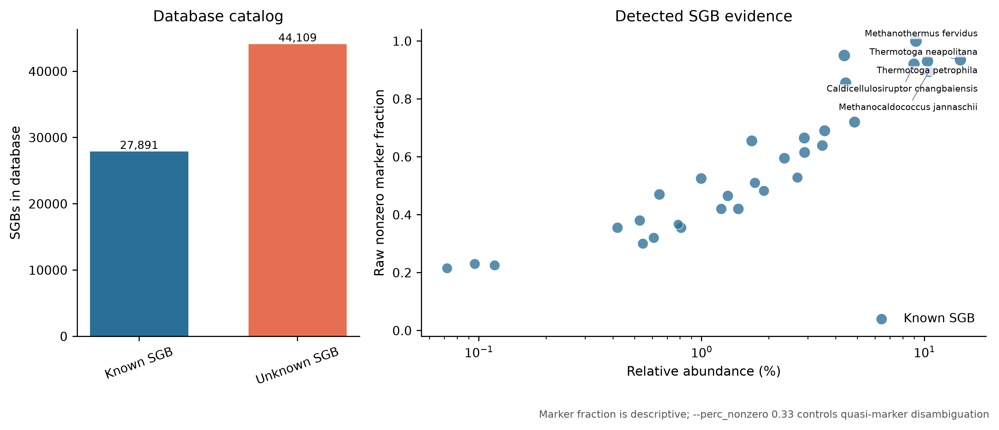
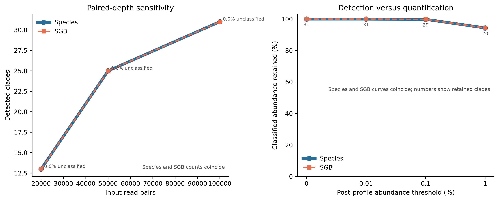

> **学习目标：**从 clean paired FASTQ 生成可审计的 MetaPhlAn 4 species/SGB profile；分清 raw marker hits、marker-derived coverage、estimated reads 与 relative abundance；保留默认 `UNCLASSIFIED` 分母；正确解释 known/unknown SGB；用 marker、测序深度和 post-profile 阈值敏感性约束低丰度结论。  
> **真实数据：**71-strain MOCK1 DNA 的 Illumina HiSeq 3000 run `ERR9765746`，ENA project `PRJEB52977`、sample `SAMEA14435832` [@meslier2022platforms]。输入为第 13 篇固定 fastp 分支保留的 99,991 个同步 pairs；R1/R2 的压缩与未压缩 SHA-256、records、bases 和 paired-ID hash 都与上游账本逐项相等。  
> **预计资源：**官方文档给 MetaPhlAn 4 的最低内存为 30 GB，建议使用 8–16 核、48–64 GB RAM，并在数据库盘预留至少 120 GB。当前 release 分成 5.60 GiB marker-metadata archive 与 38.88 GiB Bowtie2-index archive；下载、归档、解包索引和 mapout 并存时，磁盘需求远高于环境本身。没有服务器时可用官方 toy 数据库检查命令语法，但 toy profile 不能替代完整数据库的生物学结果；正式分析应提交到机构 HPC 或合规云。

## 这一步对应论文里的哪张图 {#sec-target}

### 锚定 MetaPhlAn 4 Figure 1 的四步证据链

MetaPhlAn 4 论文 Figure 1b 把 profiling 拆成四步：reads 比对到 SGB-specific markers、过滤低质量比对、计算每个 SGB 的 robust marker coverage、再跨 SGB 归一化为相对丰度 [@blancomiguez2023metaphlan4]。这张流程图比一张堆积柱状图更重要，因为它限定了每个数字能说明什么：

```text
FASTQ reads
    ↓ Bowtie2 against SGB-specific markers
high-quality read-to-marker mapout
    ↓ marker length + read length + quasi-marker disambiguation
usable marker evidence
    ├── robust tavg_g coverage → classified relative abundance
    └── positive-marker mean × genome length → estimated clade reads
                                                   ↓ denominator policy
                                      default abundance + UNCLASSIFIED
```

论文 Figure 1 对应的是 2023 年发布时的数据库：26,970 个可 profiling 的 SGB 与约 5.1 million markers，其中 4,992 个为 uSGB。当前分析固定的是 2026 年发布的 `mpa_vJan26_CHOCOPhlAnSGB_202605`；其 PKL 中有 72,000 个 SGB（27,891 known、44,109 unknown）和 13,907,686 个 marker records。数据库规模已经变化，不能把论文旧 catalog 数字写成当前 release 的 manifest。

### 结果一：组成图必须保留未分类分母

{#fig-metaphlan-composition}

`UNCLASSIFIED` 不是一个物种，也不是“所有没比对上的 reads”逐条分类后的简单计数。MetaPhlAn 先从 marker coverage 外推各 clade 的 estimated reads，再以 profiling read denominator 估计未解释比例。因此结果表同时保留：

| Field | Unit | Interpretation |
|---|---:|---|
| `relative_abundance` | % | marker-derived community composition under the selected denominator |
| `coverage` | ×-like marker coverage | robust summary across usable markers |
| `estimated_number_of_reads_from_the_clade` | reads | genome-length extrapolation from marker coverage |
| raw mapout records | alignments | high-quality reads hitting marker sequences |
| `UNCLASSIFIED` | % / estimated reads | estimated fraction not explained by reported clades |

::: {.callout-important title="Raw marker hits 不能直接当成 taxon reads"}
一个 SGB 只用一小组特异 marker 代表整张基因组。命中 marker 的 raw reads 是证据样本；`estimated reads` 会按 marker coverage 与 clade genome length 外推。两者数值可以相差几个数量级，不能互相替换。
:::

本次完整输入的分母账本如下。所有数字均来自 checksum-locked profile、mapout
footer 与冻结审计表：

| Evidence | Observed value |
|---|---:|
| Clean input | 99,991 pairs / 199,982 reads |
| Reads entering profiling | 199,929 |
| Raw read-to-marker records | 12,739 |
| Estimated reads from detected terminal clades | 261,721 |
| Detected species / SGBs | 31 / 31 |
| Known / unknown SGBs | 31 / 0 |
| Default estimated `UNCLASSIFIED` | 0.000% |

::: {.callout-warning title="0% UNCLASSIFIED 不等于每条 read 都被分类"}
这里 31 个 terminal clades 的 estimated reads 合计为 261,721，高于 199,929 条
profiling reads；MetaPhlAn 将 mapped fraction 截断为 1，因此 `UNCLASSIFIED` 为
0%。但 mapout 中只有 12,739 条直接 marker alignments。这个结果表示模型外推已
触及分母上限，不表示 199,929 条 reads 都逐条获得了 taxonomy，也不能写成
“100% reads classified”。由于 $F=1$，本样本的 default 与 classified-only
relative abundance 恰好相同；这不是所有样本都会出现的性质。
:::

### 结果二：SGB 名称与 marker 证据放在同一张图

{#fig-sgb-marker-support}

known SGB（kSGB）有可用物种级分类标签；unknown SGB（uSGB）的 species component 含 `_SGB`，只保留 genome-bin cluster 身份。`t__SGBxxxxx` 是固定 database release 内的 SGB 层级标签，而不是菌株名称；跨 release 仍要审计 split、merge 与 rename。

marker 图中的 `Raw nonzero marker fraction` 是：

$$
B_j =
\frac{\#\{m \in M_j : n_m > 0\}}
{\# M_j}
$$

其中 $M_j$ 是数据库分配给 SGB $j$ 的 markers，$n_m$ 是 mapout 中命中 marker $m$ 的 reads 数。它用于查看 evidence breadth，但没有替代 MetaPhlAn 的 robust coverage 与 quasi-marker disambiguation。

::: {.callout-note title="mapout 中并非每个索引命中都会进入 SGB profile"}
当前 Bowtie2 archive 同时包含 PKL 中的有效 SGB marker、`VDB|...` viral marker，
以及少量仍能被索引命中、但不在 PKL 有效 marker dictionary 中的 SGB-formatted
序列。MetaPhlAn 4.2.5 在建树后会跳过后两类 SGB profile 无法消费的 marker；本次
审计也复现这个边界：VDB names/hits 与 metadata-excluded SGB names/hits 分别记账，
二者都不混入 $B_j$ 的分子或分母，剩余无法解释的 marker name 必须为零。本章不据
VDB raw hits 报告病毒类群，病毒证据链留到病毒组章节。
:::

完整深度下丰度最高的 5 个 SGB 均为 known SGB；raw breadth 和 hit count 只用来
描述 marker 证据，不替代 MetaPhlAn 的 robust coverage：

| Species | SGB | Abundance (%) | Nonzero / total markers | Raw marker hits |
|---|---|---:|---:|---:|
| *Thermotoga neapolitana* | SGB19176 | 14.51883 | 187 / 200 | 941 |
| *Methanocaldococcus jannaschii* | SGB648 | 10.48936 | 179 / 200 | 804 |
| *Thermotoga petrophila* | SGB19175 | 10.33244 | 186 / 200 | 924 |
| *Methanothermus fervidus* | SGB722 | 9.16649 | 200 / 200 | 1,717 |
| *Caldicellulosiruptor changbaiensis* | SGB8548 | 8.98371 | 184 / 200 | 888 |

非 PKL SGB-profile marker 的命中也保留了独立账本：
冻结表中的对应列为 `ViralMarkerNamesInMapout`、`ViralMarkerHitsInMapout`、
`MetadataExcludedSGBMarkerNamesInMapout`、
`MetadataExcludedSGBMarkerHitsInMapout` 与 `UnexpectedMarkerNamesInMapout`。

| Input pairs | VDB names / hits | Metadata-excluded SGB names / hits | SGB label | Unexpected names |
|---:|---:|---:|---|---:|
| 20,000 | 8 / 26 | 2 / 3 | SGB6011 | 0 |
| 50,000 | 12 / 49 | 5 / 8 | SGB6011 | 0 |
| 99,991 | 23 / 85 | 12 / 28 | SGB6011 | 0 |

### 结果三：检出与定量用两种敏感性回答

{#fig-metaphlan-sensitivity}

测序深度分支回答“同一输入变浅时，检出和丰度是否稳定”；post-profile threshold 分支回答“删去低丰度行会损失多少 clades 和多少组成质量”。二者都不是通用检出限：

- 深度分支只代表这一个固定 MOCK1 prefix；
- 阈值分支不重新比对、不改变 marker evidence，只是在已生成 profile 上删行；
- MOCK1 的已知配方也不等于当前 SGB catalog 的一一对应真值。

实测深度结果显示 species 与 SGB 行数在三个深度完全重合，但检出数随深度明显
增加：

| Input pairs | Profiling reads | Raw marker records | Species | SGBs | Top species abundance (%) |
|---:|---:|---:|---:|---:|---:|
| 20,000 | 39,993 | 2,637 | 13 | 13 | 20.43279 |
| 50,000 | 99,974 | 6,420 | 25 | 25 | 15.41145 |
| 99,991 | 199,929 | 12,739 | 31 | 31 | 14.51883 |

完整深度 profile 中，0.01% 阈值仍保留 31 个 clades；0.1% 保留 29 个和
99.832% classified abundance；1% 只保留 20 个，但仍保留 94.375% classified
abundance。检出数量和组成质量因此必须分开报告。

## 理论：从 marker 命中到组成比例 {#sec-theory}

### 1. 为什么用 clade-specific markers，而不是整库所有序列

整基因组数据库包含大量保守区、水平转移基因、移动元件和近缘物种共享序列。把 reads 对这些序列的任何命中都当作物种证据，会放大多重比对和数据库大小偏倚。MetaPhlAn 选择在目标 clade 中常见、同时对其他 clades 尽量特异的 marker genes，再用多个 marker 的一致覆盖支持 taxon。

这带来三个直接后果：

1. 未命中 marker 不等于该 read 没有微生物来源；
2. 少数 marker hits 不等于整个基因组有稳定覆盖；
3. marker database release 改变会改变可检出的 SGB 与 marker 集合。

### 2. coverage 是跨 marker 的稳健汇总

对 marker $m$，一个简化的长度校正 coverage 可写成：

$$
c_m =
\frac{n_m}
{|L_m - \bar{L}_{read}| + 1}
$$

`--stat tavg_g --stat_q 0.2` 使用 global truncated average：按 coverage 排序后截去两端分位的 markers，再汇总剩余 read counts 与有效长度。这样能降低单个重复 marker、局部高覆盖和异常 marker 的影响，但不能修复错误数据库或污染。

`--perc_nonzero 0.33` 常被误读为“至少 33% markers 阳性才报物种”。在 4.2.5 实现中，它参与 quasi-marker disambiguation：当 marker 也可能来自 external clade 时，检查 external clade 的 nonzero-marker fraction。它不是这张 marker 图的横线，也不是通用 detection threshold。

### 3. estimated reads 不是 raw hit count

对通过 quasi-marker disambiguation 的 marker 集合 $M_j$，MetaPhlAn 4.2.5
只用其中 $n_m>0$ 的 marker 估计 clade reads。若数据库代表 genome length
为 $G_j$、平均 read length 为 $\bar L$，源码中的计算可写为：

$$
\widehat N_j =
\left\lfloor
G_j
\times
\operatorname{mean}_{m \in M_j,\ n_m>0}
\left(
\frac{n_m}{|L_m-\bar L|+1}
\right)
\right\rfloor
$$

它与 `tavg_g` robust coverage 使用同一批过滤后的 marker evidence，但不是把
coverage 字段直接乘 $G_j$；内部节点的 estimated reads 还会由子节点求和。
raw mapout 只含直接命中 marker 的高质量 reads；$\widehat N_j$ 试图估计来自
整个 clade genome 的 reads。论文或报告应把它写成 *estimated number of reads
from the clade*，不能写成“有多少 reads 被分类到该物种”。

### 4. 两种丰度分母不能混用

先在 classified clades 内得到：

$$
a_j = \frac{C_j}{\sum_{k \in \mathcal L} C_k}
$$

MetaPhlAn 4.2 默认把检测到的 terminal clades（记作 $\mathcal L$）的
estimated reads 相加，再计算：

$$
F = \min\left(
\frac{\sum_{j \in \mathcal L} \widehat N_j}{N_{profile}}, 1
\right)
$$

这里不能把 all-rank 输出表逐行相加：同一 terminal clade 的组成会沿 taxonomy
路径在多个 rank 重复出现。源码只在有 coverage 的叶节点累加 estimated reads，
内部节点的值用于按 rank 报告，不再进入分母一次。

默认输出：

$$
p_j^{default} = 100 F a_j,
\qquad
p_{unclassified} = 100(1-F)
$$

加入 `--skip_unclassified_estimation` 后：

$$
p_j^{classified\ only} = 100 a_j
$$

coverage 和 estimated reads 不变，变化的是 relative-abundance scale。默认 profile 适合保留“样本中有多少组成未被 catalog 解释”的信息；classified-only profile 适合只比较已报告 clades 内部组成。不能把两种表横向合并后当同一单位。

### 5. species 与 SGB 是相邻但不同的层级

MetaPhlAn lineage 的末端通常为：

```text
k__...|p__...|c__...|o__...|f__...|g__...|s__...|t__SGBxxxxx
```

- `s__Genus_species|t__SGBxxxxx`：known SGB，可显示物种名和 SGB ID；
- `s__Something_SGBxxxxx|t__SGBxxxxx`：unknown SGB，不补造物种名；
- 一个历史 species label 可能被拆成多个 SGB；
- 多个难区分或误命名 species labels 也可能合入同一 SGB。

因此 species table 和 SGB table 的行数不必相同。跨研究合并前要固定 database release，并明确统计单位是 species 还是 SGB。

### 6. paired-end 只在下采样时保留配对关系

MetaPhlAn 接收 `R1.fastq.gz,R2.fastq.gz`，但 short-read profiling 把两端当独立 reads 映射；它不使用 insert size、proper-pair 或 mate concordance。paired 信息只在 `--subsampling_paired` 选择相同 read IDs 时使用。

这不构成错误：marker profiling 的基本证据单位本来就是单条 read-to-marker alignment。但输入端仍必须先验证 R1/R2 record 数、ID 和顺序，因为 paired subsampling 假设两个文件同序。

### 7. detection、quantification、activity 与 strain 是四个问题

| Claim | Minimum evidence in this analysis | What is still missing |
|---|---|---|
| SGB detected | multiple marker evidence + positive robust coverage | negative controls, cohort replication |
| relative composition | marker coverage + explicit denominator | absolute microbial load |
| absolute abundance | external load/cell/spike-in measurement | not supplied by MetaPhlAn alone |
| viability/activity | RNA, culture, PMA or other activity evidence | DNA profile is insufficient |
| strain identity/transmission | strain-resolved marker variants and epidemiology | species/SGB presence is insufficient |

这套结果只支持 taxonomic composition。菌株与传播问题需要 StrainPhlAn、inStrain 或其他 strain-resolved workflow；第 50–53 篇再单独建立相应证据链。

## 准备工作 {#sec-setup}

<details>
<summary><strong>展开：算力、版本锁、真实输入、完整数据库与内联作图函数</strong></summary>

### 算力与存储门槛

| Task | CPU | RAM | Disk | Notes |
|---|---:|---:|---:|---|
| Download metadata archive | 1–16 connections | <1 GB | 5.60 GiB | official MD5 locked |
| Download Bowtie2 archive | 1–16 connections | <1 GB | 38.88 GiB | official MD5 locked |
| Extract database | 1 | low | tens of GiB additional | archive and extracted files coexist |
| Load vJan26 PKL | 1 | several GiB | read-only | 13.9 M marker records |
| Map 199,929 reads | 8 | ≥30 GB available | mapout + temp | Bowtie2 large index |
| Routine QA | 1–4 | <2 GB | small frozen bundle | no FASTQ/database/network |

官方文档明确给出最低 30 GB RAM。生产队列还要避免多个任务在同一节点同时加载完整 Bowtie2 index，除非实测内存允许；调度器中的 `--mem` 是总作业内存，不是每核内存。

当前主机上的一次性运行日志给出以下实测值。它们用于估算调度资源，不是对其他
存储系统或 CPU 的性能承诺：

| Task | Elapsed time | Maximum RSS | Mean CPU reported by GNU time |
|---|---:|---:|---:|
| Extract Bowtie2 archive | 0:43.37 | 0.002 GiB | 99% |
| 20,000-pair branch | 5:30.78 | 33.97 GiB | 140% |
| 50,000-pair branch | 5:46.99 | 33.97 GiB | 143% |
| Full 99,991-pair profile | 4:08.46 | 33.97 GiB | 159% |
| Classified-only mapout replay | 2:12.83 | 8.85 GiB | 105% |

三个 mapping 分支都需要约 34 GiB 峰值内存；小数据减少的是比对工作量，不会消除
大索引的加载成本。`classified-only` 分支复用 mapout，所以内存和时间明显下降。

### 固定软件环境

```bash
mamba create \
  --name metagenome-biobakery-2026.07 \
  --file env/biobakery-linux-64.lock

export BIOBAKERY_ENV_PREFIX="${HOME}/miniconda3/envs/metagenome-biobakery-2026.07"
export PATH="${BIOBAKERY_ENV_PREFIX}/bin:${PATH}"

metaphlan --version
bowtie2 --version | head -n 1
python --version
sha256sum env/biobakery.yml env/biobakery-linux-64.lock
```

固定结果：

```text
MetaPhlAn 4.2.5
Bowtie2  2.5.5
Python   3.12.13

a314c7d33025e2057ab609f4f1e101b6ab3921338e55c587d318cf2d6d65f874  env/biobakery.yml
d2884ede2be3ae1c27300505d5a1b6c784a4b30a9f259a3efd9b628a66d302d2  env/biobakery-linux-64.lock
```

explicit lock 含 554 个 Linux-64 packages，其中精确固定 `metaphlan-4.2.5`、`bowtie2-2.5.5`、`python-3.12.13`、`matplotlib-base-3.11.0`、`pillow-12.3.0` 与 `numpy-2.5.1`。

### 核对真实 clean paired input

`data/small/15-source-manifest.tsv` 连接 ENA 原始 archive、第 13 篇 deterministic prefix 与当前 clean FASTQ：

| Mate | Records | Bases | Compressed bytes | Reads <70 bp |
|---|---:|---:|---:|---:|
| R1 | 99,991 | 14,974,589 | 8,661,319 | 22 |
| R2 | 99,991 | 14,835,184 | 10,045,722 | 31 |

```bash
sha256sum \
  data/raw/article13/ERR9765746_clean_R1.fastq.gz \
  data/raw/article13/ERR9765746_clean_R2.fastq.gz
```

应得到：

```text
ce438de2814a6e605cc24b00e53b697d018f325bc2a9694cece5be158ff32101  ERR9765746_clean_R1.fastq.gz
207d080cd5dc98bd10fd4af8c492fb3f2000f73e1458a9d1d77e57347f4fe459  ERR9765746_clean_R2.fastq.gz
```

两端共有 199,982 条输入 reads。`--read_min_len 70` 排除 53 条 50–69 bp reads，因此 profile 和 mapout 的 denominator 是 199,929，不是 199,982。输入账本和建模账本都要保留。

::: {.callout-note title="为什么这里从 clean FASTQ 而不是 non-host FASTQ 起步"}
MOCK1 是不含设计人源成分的 71-strain DNA mock。第 14 篇在同一 run 的前
20,000 个 pairs 上观察到 100% microbial retention，但这不能替代对完整
99,991-pair 输入的去宿主审计；因此当前 profile 明确从第 13 篇 clean FASTQ
起步，不把局部控制写成整份文件已经 host-filtered。人体来源样本必须改用经过
完整人参考、成对守恒与隐私检查的 non-host FASTQ。
:::

### 下载并核对完整 vJan26 数据库

```bash
set -euo pipefail

release="mpa_vJan26_CHOCOPhlAnSGB_202605"
archive_dir="db/metaphlan-cache/archives/metaphlan-vJan26"
db_dir="db/metaphlan-cache/${release}"
mkdir -p "${archive_dir}" "${db_dir}"

# 可选的共享盘/运维入口：同一 manifest 会同时审计 MD5、SHA-256 和字节数。
# DB_ROOT 必须是 Git 仓库外的绝对路径。
DB_MANIFEST="$PWD/data/small/15-database-manifest.tsv" \
  db/download_db.sh audit

# 例如在共享盘逐个下载并校验：
# DB_MANIFEST="$PWD/data/small/15-database-manifest.tsv" \
#   DB_ROOT=/shared/metaphlan-vJan26 \
#   db/download_db.sh download marker_metadata
# DB_MANIFEST="$PWD/data/small/15-database-manifest.tsv" \
#   DB_ROOT=/shared/metaphlan-vJan26 \
#   db/download_db.sh download bowtie2_index

aria2c \
  --max-connection-per-server=16 \
  --split=16 \
  --continue=true \
  --max-tries=10 \
  --retry-wait=5 \
  --connect-timeout=30 \
  --timeout=60 \
  --lowest-speed-limit=1K \
  --file-allocation=none \
  --dir="${archive_dir}" \
  "https://cmprod1.cibio.unitn.it/biobakery4/metaphlan_databases/${release}.tar"

aria2c \
  --max-connection-per-server=16 \
  --split=16 \
  --continue=true \
  --max-tries=10 \
  --retry-wait=5 \
  --connect-timeout=30 \
  --timeout=60 \
  --lowest-speed-limit=1K \
  --file-allocation=none \
  --dir="${archive_dir}" \
  "https://cmprod1.cibio.unitn.it/biobakery4/metaphlan_databases/bowtie2_indexes/${release}_bt2.tar"

printf '%s  %s\n' \
  '7162b0c3493663dce9abef08ccc06aea' \
  "${archive_dir}/${release}.tar" \
  | md5sum --check --strict

printf '%s  %s\n' \
  'ac93e1e9c0829629266f5b6ab19c318d' \
  "${archive_dir}/${release}_bt2.tar" \
  | md5sum --check --strict

tar -xf "${archive_dir}/${release}.tar" -C "${db_dir}"
tar -xf "${archive_dir}/${release}_bt2.tar" -C "${db_dir}"

metaphlan \
  --install \
  --db_dir "${db_dir}" \
  --index "${release}" \
  --offline
```

官方硬锁：

| Asset | Exact bytes | Official MD5 |
|---|---:|---|
| marker metadata tar | 6,014,095,360 | `7162b0c3493663dce9abef08ccc06aea` |
| Bowtie2 index tar | 41,742,510,080 | `ac93e1e9c0829629266f5b6ab19c318d` |

只下载 5.60 GiB metadata tar 不足以跑 short-read profiling；真正的 Bowtie2 index 在独立 38.88 GiB archive 中。两个 archive、解包文件和 mapout 都在 `.gitignore` 覆盖的目录，Git 只保留逐文件 SHA-256 manifest 与小型聚合证据。

### 内联 R 作图环境与函数

```r
install.packages(
  c("ggplot2", "dplyr", "tidyr", "readr", "stringr", "scales", "ragg")
)
```

```r
library(ggplot2)
library(dplyr)
library(tidyr)
library(readr)
library(scales)

set.seed(20260721)

pal_pub <- c(
  "Known SGB" = "#2A6F97",
  "Unknown SGB" = "#E76F51",
  "Unclassified" = "#D9D9D9",
  "Other classified" = "#8D99AE"
)

scale_color_pub <- function(...) {
  scale_color_manual(values = pal_pub, drop = FALSE, ...)
}

scale_fill_pub <- function(...) {
  scale_fill_manual(values = pal_pub, drop = FALSE, ...)
}

theme_pub <- function(base_size = 10) {
  theme_classic(base_size = base_size) +
    theme(
      text = element_text(family = "sans", colour = "#222222"),
      axis.text = element_text(colour = "#222222"),
      plot.title.position = "plot",
      plot.caption = element_text(hjust = 0, colour = "#555555"),
      legend.position = "right"
    )
}

save_pub <- function(plot, stem, width, height) {
  dir.create("figures", recursive = TRUE, showWarnings = FALSE)
  ggsave(
    file.path("figures", paste0(stem, ".pdf")),
    plot, width = width, height = height, device = cairo_pdf
  )
  ggsave(
    file.path("figures", paste0(stem, ".png")),
    plot, width = width, height = height, dpi = 350,
    bg = "white"
  )
  ragg::agg_tiff(
    file.path("figures", paste0(stem, ".tiff")),
    width = width, height = height, units = "in",
    res = 350, compression = "lzw", background = "white"
  )
  print(plot)
  dev.off()
}
```

</details>

## 可复制代码 {#sec-code}

### 一次性完整运行

运行脚本先验证 FASTQ、环境与两个 archives，再执行完整 mapping、classified-only reprofile 和两个 paired-depth 分支；任何非空 frozen 目录都会触发拒绝覆盖。

```bash
scripts/run_article15_metaphlan4.sh \
  --project-root "$PWD" \
  --environment-prefix "${BIOBAKERY_ENV_PREFIX}" \
  --raw-dir data/raw/article15 \
  --metadata-archive \
    db/metaphlan-cache/archives/metaphlan-vJan26/mpa_vJan26_CHOCOPhlAnSGB_202605.tar \
  --bowtie2-archive \
    db/metaphlan-cache/archives/metaphlan-vJan26/mpa_vJan26_CHOCOPhlAnSGB_202605_bt2.tar \
  --database-dir \
    db/metaphlan-cache/mpa_vJan26_CHOCOPhlAnSGB_202605 \
  --frozen-dir data/small/15-metaphlan-frozen
```

### 主 profile：显式固定每一个会改变语义的参数

```bash
release="mpa_vJan26_CHOCOPhlAnSGB_202605"
db_dir="db/metaphlan-cache/${release}"
r1="data/raw/article13/ERR9765746_clean_R1.fastq.gz"
r2="data/raw/article13/ERR9765746_clean_R2.fastq.gz"
work="data/raw/article15/work"

mkdir -p \
  "${work}/tmp" \
  data/small/15-metaphlan-frozen/logs

/usr/bin/time -v \
  -o data/small/15-metaphlan-frozen/logs/metaphlan-full.resources.txt \
  metaphlan \
  "${r1},${r2}" \
  --input_type fastq \
  --db_dir "${db_dir}" \
  --index "${release}" \
  --offline \
  --bowtie2_exe "${BIOBAKERY_ENV_PREFIX}/bin/bowtie2" \
  --mapout "${work}/ERR9765746-full.mapout.bz2" \
  --tmp_dir "${work}/tmp" \
  --nproc 8 \
  --read_min_len 70 \
  --perc_nonzero 0.33 \
  --stat tavg_g \
  --stat_q 0.2 \
  -t rel_ab_w_read_stats \
  --tax_lev a \
  --sample_id ERR9765746_MOCK1 \
  --output_file data/small/15-metaphlan-frozen/profile-all.tsv
```

为什么不只用默认参数：

- `--index` 阻止 `latest` 随时间漂移；
- `--offline` 阻止运行时访问服务器；
- `--mapout` 保留 read-to-marker evidence 与 denominator；
- `rel_ab_w_read_stats` 同时给 abundance、coverage 和 estimated reads；
- `--read_min_len 70` 把 53 条短 reads 明确记入损失账本；
- `--perc_nonzero`、`--stat`、`--stat_q` 写进 Methods，而不是依赖未来默认值。

### 用同一个 mapout 重算 classified-only 分母

```bash
metaphlan \
  "${work}/ERR9765746-full.mapout.bz2" \
  --input_type mapout \
  --db_dir "${db_dir}" \
  --index "${release}" \
  --offline \
  --mapout "${work}/classified-reprofile-unused.mapout" \
  --nproc 8 \
  --perc_nonzero 0.33 \
  --stat tavg_g \
  --stat_q 0.2 \
  -t rel_ab_w_read_stats \
  --tax_lev a \
  --skip_unclassified_estimation \
  --sample_id ERR9765746_MOCK1_CLASSIFIED_ONLY \
  --output_file \
    data/small/15-metaphlan-frozen/profile-classified-only.tsv
```

4.2.5 的参数检查要求即便输入已经是 `mapout`，仍需出现 `--mapout` 或 `--no_map`；上面的 dummy path 不会产生文件。这个行为与官方 wiki 的 mapout 示例不一致，所以脚本会在精确版本下实测，而不是假定下一版仍相同。

### 固定 paired-depth 敏感性

```bash
for pairs in 20000 50000; do
  # MetaPhlAn 4.2.5 实测参数按两端 read 总数解释；
  # 40,000 生成 20,000 个同步 pairs。
  paired_read_argument="$((pairs * 2))"

  metaphlan \
    --input_type fastq \
    -1 "${r1}" \
    -2 "${r2}" \
    --subsampling_paired "${paired_read_argument}" \
    --subsampling_seed 20260721 \
    --subsampling_output "${work}/subsample-${pairs}.fastq.gz" \
    --db_dir "${db_dir}" \
    --index "${release}" \
    --offline \
    --mapout "${work}/ERR9765746-depth-${pairs}.mapout.bz2" \
    --tmp_dir "${work}/tmp" \
    --nproc 8 \
    --read_min_len 70 \
    --perc_nonzero 0.33 \
    --stat tavg_g \
    --stat_q 0.2 \
    -t rel_ab_w_read_stats \
    --tax_lev a \
    --sample_id "ERR9765746_MOCK1_${pairs}_PAIRS" \
    --output_file "${work}/profile-depth-${pairs}.tsv"
done
```

不能只相信参数名。初始化审计会重新读取生成的 R1/R2，要求分别恰有 20,000 或 50,000 records、paired IDs 同步，并把实际 paired-ID SHA-256 冻结进 depth table。

### 从 all-rank profile 提取 species 与 SGB

```r
library(readr)
library(dplyr)
library(stringr)

profile_path <- "data/small/15-metaphlan-frozen/profile-all.tsv"
profile_header <- grep(
  "^#clade_name\\t",
  readLines(profile_path, warn = FALSE),
  fixed = FALSE
)[1]
stopifnot(!is.na(profile_header))

profile <- read_tsv(
  profile_path,
  skip = profile_header - 1,
  show_col_types = FALSE
)
names(profile)[1] <- sub("^#", "", names(profile)[1])
stopifnot("clade_name" %in% names(profile))

species <- profile %>%
  filter(
    clade_name == "UNCLASSIFIED" |
      str_detect(clade_name, "(^|\\|)s__[^|]+$")
  )

sgb <- profile %>%
  filter(str_detect(clade_name, "(^|\\|)t__SGB[0-9]+$")) %>%
  mutate(
    species_label = str_extract(clade_name, "s__[^|]+"),
    sgb_label = str_extract(clade_name, "t__SGB[0-9]+"),
    sgb_class = if_else(
      str_detect(species_label, "_SGB"),
      "Unknown SGB",
      "Known SGB"
    )
  )
```

all-rank profile 的同一个生物量会在 kingdom、phylum、class、order、family、genus、species、SGB 多次出现。整列直接求和没有意义；只能在同一 rank 内检查 classified sum，再加一次 `UNCLASSIFIED`。

### 日常无网络 QA 与出图

可发布证据由以下入口组成：数据库身份与两个 archive 的状态见
`data/small/15-database-manifest.tsv`，输入和解释边界见
`data/small/15-data-NOTICE.txt`，一次性运行摘要见
`data/small/15-metaphlan-frozen/run-summary.json`，固化 payload 的逐文件校验见
`data/small/15-metaphlan-frozen/file-checksums.sha256`。这些小文件不包含 FASTQ、
mapout 或数据库本体。

```bash
mkdir -p results/15-metaphlan4 figures

"${BIOBAKERY_ENV_PREFIX}/bin/python" \
  scripts/validate_article15_metaphlan4.py \
  --project-root "$PWD" \
  --environment-prefix "${BIOBAKERY_ENV_PREFIX}" \
  --frozen-dir data/small/15-metaphlan-frozen \
  --output-dir results/15-metaphlan4 \
  --figure-dir figures
```

日常 QA 不读取 FASTQ、不加载 38.88 GiB index、不访问数据库服务器。它核对：

- source/database manifests 与环境锁的 SHA-256；
- frozen payload 的逐文件 checksum；
- input reads、`read_min_len` 与 mapout/profile denominator；
- default 和 classified-only profile 的 coverage/estimated-read 恒等；
- species/SGB rank sums、known/uSGB 分类和 marker breadth；
- PKL 有效 SGB marker、`VDB|...` viral marker 与 metadata-excluded SGB marker 分账，且没有其他无法解释的 marker name；
- 20k/50k paired subsamples 的 seed、ID hash 与深度表；
- 0/0.01/0.1/1% post-profile sensitivity；
- frozen 文本中没有本机绝对路径；
- 三张图同时存在 PDF、PNG 与 350 dpi LZW TIFF。

## 审计与升级 {#sec-audit}

### 论文数据库不是当前数据库

| Dimension | MetaPhlAn 4 paper | Current locked run |
|---|---|---|
| Publication / release | 2023 method paper | MetaPhlAn 4.2.5, July 2026 |
| Profilable SGBs described | 26,970 | 72,000: 27,891 known + 44,109 unknown |
| Markers described | about 5.1 million | 13,907,686 marker records |
| Database identity | paper generation | `mpa_vJan26_CHOCOPhlAnSGB_202605` |
| Denominator behavior | original implementation | 4.2 default estimated unclassified |

论文 Figure 1 解释算法，不替当前 release 提供版本身份。Methods 应同时引用方法论文、软件版本和数据库 archive checksum。

### 先忠实保留默认 unclassified，再决定分析尺度

MetaPhlAn 4.2 把 unclassified estimation 改为默认。升级流程不是把它删掉，而是同时保存两张表：

1. default：用于观察 catalog 解释比例；
2. `--skip_unclassified_estimation`：用于已分类 clades 内部组成。

做 cohort statistics 时，应整批样本使用同一种分母。若某组样本的 unclassified fraction 系统性更高，classified-only renormalization 会把同样的绝对 marker coverage 放大得更多，形成组间 compositional distortion。

### 4.2.5 的 mapout 参数检查要做回归测试

官方 wiki 展示 `metaphlan existing.mapout --input_type mapout -o profile`；当前 4.2.5 build 实测还要求命令行出现 `--mapout` 或 `--no_map`。运行脚本使用不会写出的 dummy mapout 满足检查，并验证 profile 与主 mapping 的 coverage/estimated reads 完全相等。

升级 MetaPhlAn 时应重新测试：

- mapout 是否无需 dummy 参数；
- 旧 mapout 是否兼容；
- `#nreads` 和 `#avg_read_length` 是否保留；
- unclassified formatting 是否改变；
- all-rank column names 是否改变。

4.2.5 release notes 明确包含 unclassified formatting 与 mapout/no-map 参数检查修复；因此这些不是可以忽略的显示细节。

### paired subsampling 的实测单位优先于参数名猜测

官方文档把参数写作 `<N_PAIRED_READS>`；4.2.5 实测传入 `40000` 才输出 R1/R2 各 20,000 records。为避免把 20,000 reads 写成 20,000 pairs，初始化审计对输出 FASTQ 重新计数并核对 paired IDs。

这个 release-specific doubling 不应封装成永久规则。每次升级先用小 FASTQ 验收 `N` 的单位，再运行正式深度敏感性。

### marker breadth 不是 `--perc_nonzero` 检出阈值

论文方法描述过 marker fraction 参与 taxon presence；当前源码中的 `--perc_nonzero 0.33` 具体用于 external-clade quasi-marker disambiguation。一个 reported SGB 的 raw nonzero-marker fraction 可以低于 0.33。审计因此同时保留：

- raw nonzero markers / total database markers；
- robust coverage；
- estimated reads；
- relative abundance；
- exact `perc_nonzero` 参数及其角色。

不能在图上画 0.33 横线并把线下 taxa 自动判为假阳性。

### MOCK1 有配方，但不是当前 taxonomy 的完美一一真值

71-strain MOCK1 适合检查真实 DNA library、GC 和丰度范围；它不保证：

- 71 个 strain 都有 current vJan26 marker representation；
- 每个 strain 恰好对应一个 species row；
- species label 与 SGB label 一一对应；
- 低丰度 DNA 都能在 199,929 reads 中达到 marker breadth；
- 未声明的 background、cross-mapping 或 reagent signal 为零。

精确 precision/recall benchmark 还需要把 71 个 genomes 映射到当前 SGB catalog，并定义 split、merge、近缘 species group 和不可判定项。第 18 篇的 profiler benchmark 再完成这个任务。

### 低丰度阈值应在 profile 之后透明比较

0.01% 是很多文献常见的展示或过滤阈值，不是所有深度、环境和数据库的生物学检测限。更稳的升级顺序：

```text
Unfiltered profile
    ├── negative / blank controls
    ├── mock expected taxa
    ├── marker breadth and coverage
    ├── sequencing-depth sensitivity
    ├── prevalence across replicates
    └── 0 / 0.01 / 0.1 / 1% post-profile sensitivity
```

阈值必须在查看 case/control association 之前固定。为了让显著性更好看而反复改变阈值，会产生 outcome-driven feature selection。

### 相对丰度不能升级成绝对定量

MetaPhlAn 的 `estimated reads` 仍由 marker model 推断，并不提供每克样本细胞数。要做 absolute abundance，需要外部总负荷：flow cytometry、qPCR、spike-in、DNA mass 与可解释的 extraction model 等。即使加了总负荷，也要明确它测的是 cells、genome copies、16S copies、DNA mass 还是 spike-in recovery。

## 出版级美化 {#sec-polish}

### composition 图保留 denominator，而不是强行堆满“已知物种”

默认 profile 中 `Unclassified` 用中性灰色，classified species-level clades 使用主色，低丰度尾部合并为 `Other classified`。图注写清默认 unclassified estimation。若另画 classified-only 版本，标题必须直接标 `Classified-only composition`，不能仅在 Methods 深处说明。

### 长 species 名称用横向条形而不是旋转 90°

横向条形允许保留完整英文 species label；未知 SGB 只显示 SGB ID 或数据库原 label，不用 `Unknown species 1/2/3` 这种样本内临时编号。数值标签保留足够小数，但不暗示超过算法精度。

### marker 图同时编码 abundance、breadth 与 class

- x：relative abundance，使用 log scale 保留低丰度点；
- y：raw nonzero marker fraction；
- size：raw marker hits，只作为证据量；
- color：Known SGB / Unknown SGB；
- label：只标丰度最高的少数 taxa，避免覆盖。

点大小不写 `reads from taxon`，因为 raw hits 只来自 marker subset。

### sensitivity 图把 clade count 与 retained mass 分开

阈值升高时，clade count 往往下降很快，classified abundance mass 下降较慢。把两个概念画在同一 y 轴会误导。当前右图以 retained abundance 为 y，点旁数字标 retained clades；左图专门画 depth 对 detected clades 的影响。

三张图内文字全部为英文，并同时导出 PDF、PNG 和 350 dpi LZW TIFF。PDF 用于矢量排版，PNG 用于网页与公众号，TIFF 用于要求 raster submission 的期刊系统。

## 常见坑 {#sec-pitfalls}

::: {.callout-caution title="坑 1：只下载 5.60 GiB metadata tar"}
PKL 和 marker FASTA 不能代替 Bowtie2 index。short-read profiling 还需要独立 38.88 GiB `_bt2.tar`。
:::

::: {.callout-caution title="坑 2：命令写 `--index latest`"}
`latest` 会随官方发布漂移。同一 cohort 的样本若跨 release 运行，feature universe 和丰度都可能改变。
:::

::: {.callout-caution title="坑 3：把 99,991 pairs 写成 99,991 reads"}
两端共有 199,982 输入 reads；长度门槛后有 199,929 profiling reads。Methods 要写清每一个分母。
:::

::: {.callout-caution title="坑 4：把 R1/R2 当 proper pairs 比对"}
MetaPhlAn short-read mapping 把两端独立作为 reads；只有 paired subsampling 用配对关系。它不报告 insert-size 或 concordant-pair evidence。
:::

::: {.callout-caution title="坑 5：整张 all-rank 表直接求和"}
同一组成在八个 taxonomy ranks 重复。只能在相同 rank 内求和；默认情况下再加一次 `UNCLASSIFIED` 应接近 100%。
:::

::: {.callout-caution title="坑 6：把 UNCLASSIFIED 当一个微生物类群"}
它是模型估计的未解释分量，不具有一个 organism 的 taxonomy、marker set 或生态解释。
:::

::: {.callout-caution title="坑 7：把 uSGB 强行命名"}
uSGB 表示当前 catalog 中没有可命名 species 的 genome cluster。环境、丰度或最近邻不能自动把它升级为正式物种名。
:::

::: {.callout-caution title="坑 8：把 marker hit count 当绝对丰度"}
marker genes 只覆盖基因组的一小部分。absolute load 还需要独立的测量和校准模型。
:::

::: {.callout-caution title="坑 9：把 `perc_nonzero=0.33` 画成检出线"}
当前参数用于 quasi-marker disambiguation，不是所有 reported taxa 的 minimum breadth。用 frozen marker evidence检查真实 breadth。
:::

::: {.callout-caution title="坑 10：只凭 0.01% 删除低丰度 taxa"}
阈值没有连接 blank、mock、marker breadth、depth 和 prevalence 时，只是任意删行。保留 unfiltered profile 和阈值敏感性。
:::

::: {.callout-caution title="坑 11：把 species/SGB presence 写成 strain transmission"}
同一 SGB 可以包含多个 strains。传播结论需要 strain-resolved variants、时间/接触信息和污染排除。
:::

::: {.callout-caution title="坑 12：合并不同数据库 release 的 profile"}
官方 merge 工具要求相同 database version。即使行名看起来相同，不同 release 的 marker、SGB 边界和 taxonomy 也可能不同。
:::

::: {.callout-caution title="坑 13：把 mapout 的每个 target 都计入 marker breadth"}
Bowtie2 index 可含 `VDB|...` 序列以及不在当前 PKL 有效 marker dictionary 中的
SGB-formatted 序列。MetaPhlAn 会跳过 SGB profile 无法消费的 target；自定义审计
也必须按同一边界分账，不能把它们塞进某个 SGB 的非零 marker 数。
:::

## 这段 Methods 怎么写 {#sec-methods}

> Taxonomic profiling was performed on 99,991 synchronized read pairs retained from a deterministic 100,000-pair prefix of the 71-strain MOCK1 Illumina run ERR9765746 (ENA project PRJEB52977; sample SAMEA14435832). Clean R1 and R2 inputs contained 199,982 reads in total; 53 reads shorter than 70 bp were excluded by the fixed minimum-length rule, leaving 199,929 reads for profiling. Reads were independently aligned to clade-specific markers with MetaPhlAn v4.2.5 and Bowtie2 v2.5.5 using the release-specific `mpa_vJan26_CHOCOPhlAnSGB_202605` database (metadata archive: 6,014,095,360 bytes, MD5 `7162b0c3493663dce9abef08ccc06aea`; Bowtie2 archive: 41,742,510,080 bytes, MD5 `ac93e1e9c0829629266f5b6ab19c318d`). The database index, offline mode, eight mapping threads, a 70-bp minimum read length, `tavg_g` marker aggregation, `stat_q=0.2`, and `perc_nonzero=0.33` were specified explicitly. Profiles were emitted as `rel_ab_w_read_stats`, retaining marker-derived coverage, estimated clade read counts, and relative abundances. Only marker identifiers present in the release-matched PKL marker dictionary contributed to SGB breadth; `VDB|...` targets and SGB-formatted index targets excluded from that dictionary were audited separately and did not contribute to SGB evidence. MetaPhlAn 4.2 default unclassified estimation was retained for the primary profile; a separate classified-only profile was regenerated from the same checksum-locked mapout using `--skip_unclassified_estimation`. Species and SGB ranks were analyzed separately, and SGBs whose species label contained `_SGB` were reported as unknown SGBs without assigning species names. Detection robustness was evaluated using paired 20,000- and 50,000-pair subsamples with seed 20260721 and the full 99,991-pair input, together with post-profile abundance thresholds of 0%, 0.01%, 0.1%, and 1%. Raw and cleaned FASTQ files, database archives, extracted indices, paired subsamples, and mapout files remained in ignored scratch storage; routine quality assurance used only path-normalized, SHA-256-locked aggregate evidence.

真实队列还应补充样本数、body site、collection/storage protocol、host-removal reference、negative controls、batch structure、exclusion rule、database file SHA-256 manifest 和统计模型。若使用 classified-only composition，Methods 和图题必须明确，不能只写“relative abundance”。

## 换成你自己的数据怎么做 {#sec-own-data}

### 输入 sample sheet

每行至少包含：

| Field | Required content |
|---|---|
| `sample_id` | stable non-identifying analysis ID |
| `r1`, `r2` | synchronized clean/non-host FASTQ paths |
| `input_pairs` | audited pair count |
| `cleaning_contract` | QC and host-removal evidence ID |
| `sample_type` | biological, blank, mock, positive control |
| `subject_id` | repeated-measure grouping if applicable |
| `batch` | extraction/library/sequencing batch |
| `expected_load` | low/medium/high or measured external load |
| `release` | exact MetaPhlAn database index |
| `consent_tier` | storage and release boundary |

不要把 raw FASTQ、clean FASTQ 和 non-host FASTQ 混在同一列又靠文件名猜 stage。每一行都连接上游 ledger 和当前 database release。

### 批量运行时共享只读数据库

```bash
set -euo pipefail

release="mpa_vJan26_CHOCOPhlAnSGB_202605"
db_dir="/shared/metaphlan/${release}"
output_root="/scratch/${USER}/metaphlan-${release}"
mkdir -p "${output_root}/profiles" "${output_root}/mapout"

while IFS=$'\t' read -r sample_id r1 r2 _rest; do
  [[ "${sample_id}" == "sample_id" ]] && continue

  metaphlan \
    "${r1},${r2}" \
    --input_type fastq \
    --db_dir "${db_dir}" \
    --index "${release}" \
    --offline \
    --mapout "${output_root}/mapout/${sample_id}.bz2" \
    --nproc 8 \
    --read_min_len 70 \
    --perc_nonzero 0.33 \
    --stat tavg_g \
    --stat_q 0.2 \
    -t rel_ab_w_read_stats \
    --tax_lev a \
    --sample_id "${sample_id}" \
    --output_file "${output_root}/profiles/${sample_id}.tsv"
done < samples.tsv
```

数据库目录设为 read-only，让所有 array tasks 读取同一套 files；不要让每个 job 自动执行 `--install`。高并发节点要按实际 index memory 与 page cache 调整 simultaneous tasks。

### 合并前先验收每个样本

项目级 ledger 至少包含：

| Metric | Why it matters |
|---|---|
| input and profiling reads | length-filter denominator |
| marker-mapped raw records | direct evidence volume |
| estimated mapped reads | model extrapolation |
| unclassified fraction | catalog-explained fraction |
| detected species/SGBs | feature count |
| known/unknown SGBs | naming boundary |
| marker breadth distribution | weak-evidence tail |
| dominant taxa | swaps or gross contamination |
| blank/mock behavior | contamination and recovery |
| depth/threshold sensitivity | robustness |
| database/tool checksums | reproducibility |

只有通过单样本 ledger 后，才把相同 database release、相同 rank、相同 denominator 的 profiles 合并成 feature × sample matrix。

### 针对不同终点调整输出

- **群落组成比较：**保留 default unclassified；检查组间 unclassified shift。
- **已知 taxa 内部组成：**另建 classified-only matrix，不覆盖 default profile。
- **unknown SGB 研究：**以 SGB ID 为主键，保留 release 和 GTDB conversion version；不要靠临时最近邻命名。
- **低生物量：**blank prevalence、DNA load、batch 和 marker breadth必须进入过滤规则。
- **绝对丰度：**把外部 load measurement 与 relative composition 合成新的明确单位。
- **strain/传播：**保留 mapout/marker evidence，转入 StrainPhlAn 或 inStrain；不从 species table 推断。
- **跨队列复用：**优先用同一 release 重跑；若只能使用历史 profile，把 profiler/database generation 当作不可消除的技术层。

### 升级数据库时做双跑桥接

选择 mock、blank、低/中/高 biomass 和主要 phenotype 各若干代表样本，用旧/新 release 双跑，比较：

1. input/profile read denominator 是否相同；
2. species/SGB split/merge 与 renamed labels；
3. unclassified fraction；
4. dominant abundance 与 Bray–Curtis distance；
5. low-abundance detection、marker breadth 和 prevalence；
6. 下游 effect size、FDR 与模型性能。

通过桥接后再切换整个项目，不要在中途给新增样本单独使用新 database。

## 参考 {#sec-references}

- MetaPhlAn 4 的 SGB、marker 设计、Figure 1 算法与 benchmark：[@blancomiguez2023metaphlan4]
- 71-strain MOCK1 与 `ERR9765746`：[@meslier2022platforms]
- MetaPhlAn 4.2 参数变更、unclassified 默认、paired input 与 database memory：[official 4.2 wiki](https://github.com/biobakery/MetaPhlAn/wiki/MetaPhlAn-4.2)
- MetaPhlAn 4.2.5 修复与 release commit：[official release 4.2.5](https://github.com/biobakery/MetaPhlAn/releases/tag/4.2.5)
- vJan26 metadata、marker information、species map 与 database archives：[official database index](https://cmprod1.cibio.unitn.it/biobakery4/metaphlan_databases/)
- vJan26 Bowtie2 archive 与 official MD5：[official Bowtie2 index directory](https://cmprod1.cibio.unitn.it/biobakery4/metaphlan_databases/bowtie2_indexes/)
- `ERR9765746` official run record：[ENA ERR9765746](https://www.ebi.ac.uk/ena/browser/view/ERR9765746)
