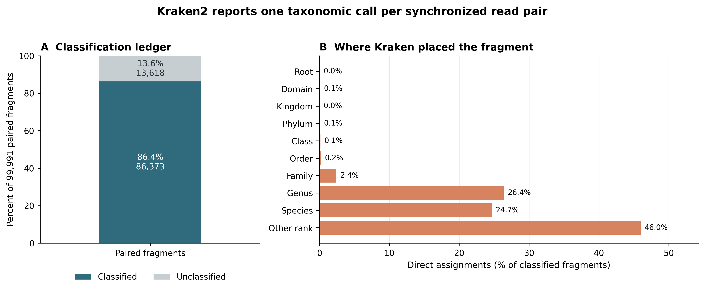
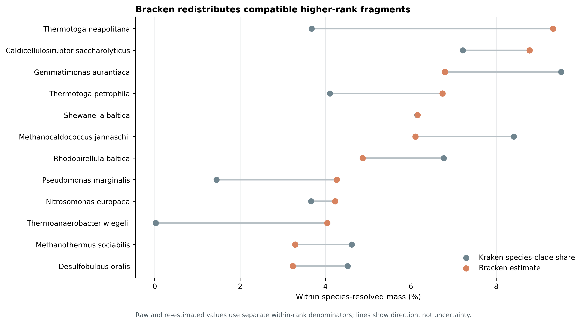
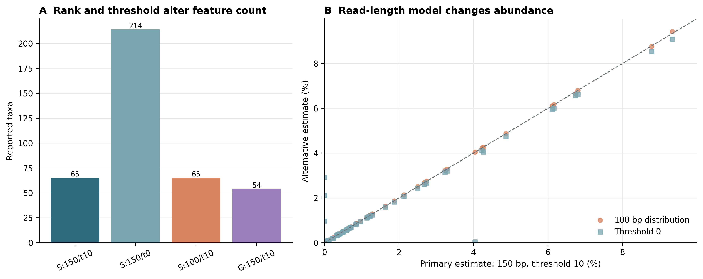

> **学习目标：**从 clean paired FASTQ 生成可审计的 Kraken2 standard report 与 Bracken 物种丰度表；分清 read、paired fragment、direct assignment、clade count 和 abundance estimate；正确选择 Bracken 的 rank、read length 与 threshold；保留数据库、未分类片段和参数敏感性边界。  
> **真实数据：**71-strain MOCK1 DNA 的 Illumina HiSeq 3000 run `ERR9765746`，ENA project `PRJEB52977`、sample `SAMEA14435832` [@meslier2022platforms]。输入是 fastp 后保留的 99,991 个同步 read pairs；R1/R2 分别包含 14,974,589 与 14,835,184 bases，压缩文件 SHA-256、记录数和 pair-ID hash 均在运行前复核。  
> **预计资源：**本次固定的 Standard-8 索引安装后为 8.64 GB，Kraken2 实测峰值内存 7.77 GiB。建议分配 8 核、12–16 GB RAM，并预留至少 20 GB 磁盘同时容纳 5.54 GiB 压缩包、索引和临时输出。完整 Standard 或 `core_nt` 数据库的磁盘与内存需求会高得多，不能套用这里的 8 GB 预算。没有服务器时，可用 Standard-8 在 16 GB 内存工作站运行小样本；生产队列应提交到 HPC 或合规云，并让每个作业独占足以加载索引的内存。

## 这一步对应论文里的哪张图 {#sec-target}

### 两张 Figure 1 定义了两种不同的任务

Kraken2 论文 Figure 1a–c 展示了 `k`-mer、minimizer、spaced-seed mask、compact hash 与 lowest common ancestor（LCA，最低共同祖先）的关系 [@wood2019kraken2]。本次数据库的实际参数是 `k = 35`、`l = 31`：每条 read 产生一串重叠 35-mers，每个 35-mer 由 31 bp minimizer 查询 compact hash table，命中的 taxonomy evidence 再共同决定 read 或 read pair 的分类节点。

Bracken 论文 Figure 1 则从 taxonomy tree 上的 counts 出发：高层级节点上的片段不能直接当作 species abundance，于是利用数据库预计算的 read-length-specific 分布，把 family/genus 等节点的兼容质量向下分到 species，同时把 strain-level 质量向上汇总到 species [@lu2017bracken]。它不重新读取 FASTQ，也不重新比对。

```text
R1 + R2 FASTQ
    ↓ Kraken2: minimizer evidence + taxonomy voting
one call per paired fragment
    ├── unclassified
    └── classified at root / family / genus / species / strain / ...
              ↓ standard Kraken report + database150mers.kmer_distrib
        Bracken: rank-specific probabilistic redistribution
              ↓
     species estimates under an explicit threshold
```

这条链必须保存两张表：Kraken report 回答“片段落在 taxonomy tree 的哪里”，Bracken table 回答“在指定 rank、read length 和 threshold 下，组成质量如何重估”。后者不能覆盖前者。

### 结果一：先守住 pair-level 分类账本

{#fig-kraken-ledger}

Kraken2 日志中的 `99,991 sequences` 指 99,991 个 paired fragments，而不是 199,982 条 mates。每个 pair 在 per-fragment 输出中只有一行，两端的长度和 hit list 以分隔符保留；standard report 的 root clade count 与 per-fragment `C` 行数完全一致。

| Ledger item | Fragments | Percent of all pairs |
|---|---:|---:|
| Classified | 86,373 | 86.3808% |
| Unclassified | 13,618 | 13.6192% |
| Total | 99,991 | 100.0000% |

对 classified fragments，Kraken 最终直接落点并不都在 species：

| Direct assignment rank | Fragments | Percent of classified |
|---|---:|---:|
| Genus | 22,778 | 26.3717% |
| Species | 21,299 | 24.6593% |
| Family | 2,085 | 2.4139% |
| Order or broader named rank | 513 | 0.5940% |
| Other rank | 39,698 | 45.9611% |

::: {.callout-important title="Direct count 与 clade count 是两列，不是两种写法"}
standard report 的第二列是该 clade 及全部 descendants 覆盖的 fragments，第三列才是直接落在当前节点的 fragments。父节点的 clade count 已包含子节点；沿整棵树相加会重复计算同一个 fragment。只有 direct assignment 加上 unclassified 才能做全样本守恒检查。
:::

### 结果二：Bracken 改变的是 rank-level estimate

{#fig-bracken-redistribution}

主分析固定 `rank = S`、`read length = 150`、`threshold = 10`。Kraken report 有 214 个非零 species rows；Bracken 只让 species-clade count **大于 10** 的 65 个 taxa 进入重估。最终逐行整数账本如下：

| Quantity | Fragments / taxa | Interpretation |
|---|---:|---|
| Kraken species rows before threshold | 214 taxa | report 中所有非零 species clades |
| Species retained above threshold | 65 taxa | 进入主模型的 species |
| Kraken-assigned mass retained | 59,991 | 这 65 个 species 的 clade counts |
| Bracken `added_reads` | 24,156 | 最终各行整数化后新增的兼容 fragments |
| Bracken `new_est_reads` | 84,147 | 65 行重估 fragments 合计 |
| Unclassified | 13,618 | 不进入 Bracken composition |

丰度最高的物种并不总是“原本 species count 最高”的物种；近缘 genomes 共享的序列可能先落在 genus/family，再被重新分配：

| Species | Kraken species-clade | Added | New estimate | Bracken fraction |
|---|---:|---:|---:|---:|
| *Thermotoga neapolitana* | 2,205 | 5,651 | 7,856 | 9.333% |
| *Caldicellulosiruptor saccharolyticus* | 4,329 | 3,062 | 7,391 | 8.781% |
| *Gemmatimonas aurantiaca* | 5,712 | 11 | 5,723 | 6.799% |
| *Thermotoga petrophila* | 2,462 | 3,212 | 5,674 | 6.741% |
| *Shewanella baltica* | 3,688 | 1,495 | 5,183 | 6.158% |
| *Methanocaldococcus jannaschii* | 5,047 | 95 | 5,142 | 6.109% |
| *Pseudomonas marginalis* | 867 | 2,722 | 3,589 | 4.264% |
| *Thermoanaerobacter wiegelii* | 15 | 3,387 | 3,402 | 4.042% |

`Thermoanaerobacter wiegelii` 的 15 个 Kraken species-clade fragments 被重估为 3,402，正说明 Bracken 输出不是“Kraken 直接物种 reads”的换列显示。如此大的重分配必须与数据库版本、近缘种结构和其他参数分支一起报告。

Bracken 日志给出 24,182 个 distributed fragments，而最终表中逐行 `added_reads` 合计为 24,156；26 个 fragments 的差异来自逐 taxon 整数化。另有 275 个低于阈值的 species fragments 被丢弃、1,925 个 fragments 因没有合格 descendant 而未分配。13,618 个 unclassified fragments 已经不在 86,373 个 classified fragments 中，不能再从后者重复扣除。正确的 classified-mass 对账是：

$$
86{,}373
= 84{,}147
+ 275
+ 1{,}925
+ 26_{\mathrm{rounding}}.
$$

### 结果三：threshold 比本次 read-length 分支更敏感

{#fig-bracken-sensitivity}

| Configuration | Reported taxa | Kraken mass | Added | Estimated | Total variation from primary |
|---|---:|---:|---:|---:|---:|
| Species, 150 bp, t = 10 | 65 | 59,991 | 24,156 | 84,147 | 0.000000 |
| Species, 150 bp, t = 0 | 214 | 60,266 | 26,016 | 86,282 | 0.066305 |
| Species, 100 bp, t = 10 | 65 | 59,991 | 24,154 | 84,145 | 0.001340 |
| Genus, 150 bp, t = 10 | 54 | 83,642 | 788 | 84,430 | not comparable across ranks |

R1 和 R2 的平均 clean read length 分别为 149.76 与 148.37 bp，范围为 50–150 bp，所以 150 bp distribution 是与建库读长最接近的主模型。换成 100 bp 后物种数不变，物种组成的 total variation distance 只有 0.00134；这说明当前样本对这个分支较稳，不说明 `-r` 可以随意填写。

相反，把 threshold 从 10 改为 0 会把 65 个物种扩展到 214 个，total variation distance 为 0.066305。新增行包含真实低丰度候选、近缘数据库分配尾部与噪声可能性的混合物；`-t 10` 也不是生物学检出限，只是这次主分析采用的稳定性规则。

## 理论：从 minimizer 分类到 rank-level 重估 {#sec-theory}

### 1. Kraken2 查询的是 minimizer evidence

对 read 中每个长度为 $k$ 的窗口，Kraken2 取长度为 $l$ 的 canonical minimizer，经 spaced-seed mask 和 compact hash 查询数据库。数据库将查询键关联到参考序列 taxonomy 的 LCA。简化表示为：

$$
r \longrightarrow \{m_1, m_2, \ldots, m_q\}
\longrightarrow \{t_1, t_2, \ldots, t_q\}
\longrightarrow \widehat t_r,
$$

其中 $m_i$ 是 minimizer query，$t_i$ 是数据库返回的 taxon，$\widehat t_r$ 是综合 root-to-leaf 支持后得到的分类节点。多个相邻 k-mers 可能共享同一 minimizer，所以支持不能简单解释成独立证据条数。

本次显式设定 `--minimum-hit-groups 2`，要求至少两个 hit groups 支撑分类；`--confidence 0.0` 则保留默认 voting boundary。两者控制的是 read-level call，不是 Bracken 的 abundance threshold。

### 2. paired-end 的计数单位是 fragment

使用 `--paired` 时，Kraken2 仍分别扫描两端序列的 minimizers，但把两端 evidence 合并成一个 pair-level call。于是：

- 输入 FASTQ 有 199,982 条 reads；
- Kraken log 和 report 的总量是 99,991 个 paired fragments；
- per-fragment 输出一 pair 一行；
- Bracken 接收 report 后也沿用 fragment counts。

若把结果写成“86,373 reads classified”，读者很可能理解成 86,373 / 199,982，分类率会被错误减半。Methods、结果表和下游 abundance matrix 必须统一写 fragments 或 read pairs。

### 3. standard report 是一棵有重复覆盖的树

Kraken2 standard report 的六列为：

| Column | Meaning |
|---:|---|
| 1 | percent of total fragments covered by this clade |
| 2 | fragments in this clade, including descendants |
| 3 | fragments assigned directly to this taxon |
| 4 | rank code |
| 5 | NCBI taxonomy ID |
| 6 | indented scientific name |

若一个 fragment 直接落在 species，它也会同时进入该 genus、family、order 等祖先节点的 clade count。报告适合沿一条 rank 切片或审计树结构，不适合全表求和。`--use-mpa-style` 会改变 report 形态，不能作为 Bracken 的输入；Bracken 需要完整 standard report。

rank code 也不只 `D/K/P/C/O/F/G/S`。例如 subspecies、strain 与介于主要 rank 之间的节点会使用扩展 code；图中的 `Other rank` 是这些直接落点的合计，而不是“没有 taxonomy”。

### 4. Bracken 估计的是条件分配权重

假设 fragment 被 Kraken 放在高层级节点 $a$，其下有候选目标 taxa $i \in D(a)$。Bracken 利用固定数据库、固定 read length 下预计算的 k-mer assignment distribution，构建非负权重 $w_{i|a}$，满足：

$$
w_{i|a} \ge 0,
\qquad
\sum_{i \in D(a)} w_{i|a} \le 1.
$$

rank-level estimate 可概括为：

$$
\widehat n_i
= n_i^{\mathrm{Kraken\ clade}}
+ \sum_a n_a^{\mathrm{eligible}} w_{i|a}.
$$

权重来自“该数据库中的 genome 经过指定 read length 模拟后，Kraken 倾向把片段放在哪里”的模型，并结合当前样本中 descendants 的 evidence。数据库没有的 organism 不会被 Bracken 创造出来；reference representation 不均衡也会传进权重。

### 5. `-r` 是单条 read length，不是 insert size

Standard-8 随包提供 50、75、100、150、200、250 和 300 bp 的 Bracken distributions。这里的 150 是单端 read 的名义长度，不是两端相加的 300 bp，也不是 fastp 报告的 265 bp insert-size peak。

若 trimming 后长度差异很大，应先画 read-length distribution：

- 长度集中在某个已提供 grid 时，用最接近的 distribution，并做相邻长度敏感性；
- 长度横跨多个 grid 时，可按长度 strata 分别运行再合并 counts，或为研究数据库构建更合适的 distribution；
- 不要因为 paired-end 就把 `-r` 写成 `2 × read length`。

### 6. `-t` 是模型准入阈值，不是测序检出限

Bracken 的 `-t 10` 让当前 rank 上 Kraken-assigned count 超过 10 的 taxa 才进入分配。它会同时影响：

1. 输出 feature 数；
2. 哪些 descendants 能接受高层级 fragments；
3. 未能分配的 fragments 数；
4. 其余 taxa 的归一化比例。

因此不能先在一个 threshold 下运行、再把输出表简单删到另一个 threshold，声称两者等价。阈值应在全队列固定，并在 mock、negative controls 与生物样本上做统一敏感性。

### 7. `fraction_total_reads` 不是全 FASTQ 分母

主输出的 `new_est_reads` 合计为 84,147，而 `fraction_total_reads` 合计为 0.99970。这个 fraction 实际上在被报告的 rank-level estimates 内归一化；13,618 个 unclassified fragments、阈值丢弃和无法分配的质量不在它的分母中。五位小数逐行输出还会产生约 $10^{-3}$ 量级的求和偏差。

因此至少保留三层数据：

```text
all paired fragments = 99,991
├── Kraken unclassified = 13,618
└── Kraken classified = 86,373
    ├── Bracken reported species estimates = 84,147
    └── threshold / no eligible descendant / integer rounding = 2,226
```

跨样本堆积图可以在同一 Bracken rank 内再归一化，但 Methods 必须说明这是一张 classified-and-resolved composition；不能把它写成“占全部 reads 的百分比”。

### 8. 分类、丰度、绝对负载和菌株不是同一个结论

| Claim | This workflow provides | Still required |
|---|---|---|
| taxon-compatible sequence evidence | Kraken minimizer/LCA call | controls and database sensitivity |
| rank-level relative composition | Bracken estimate under fixed model | stable denominator across samples |
| absolute microbial load | no | spike-in, qPCR, flow cytometry or other load measurement |
| viable or active organism | no | culture, RNA, PMA or other activity evidence |
| strain identity/transmission | no | strain-resolved variants, coverage and epidemiology |

主表中有 11 个 `Homo sapiens` species-clade fragments，但这一个数字不能证明样本存在可报告的人源污染：Standard-8 包含 human reference，默认 confidence、近缘/低复杂度 evidence 和 capped database 都可能影响边界。host-removal report、negative control、per-fragment alignment 审计与 database/confidence sensitivity 应共同决定解释，而不是看一个低计数 taxonomy row。

## 准备工作 {#sec-setup}

<details>
<summary><strong>展开：算力、版本锁、数据库下载、真实输入与内联作图函数</strong></summary>

### 算力与存储门槛

| Task | CPU | RAM | Disk | This run |
|---|---:|---:|---:|---:|
| Download archive | 1–16 connections | <1 GB | 5.54 GiB | checksum after resume |
| Extract Standard-8 | 1–2 | <1 GB | 8.64 GB installed | 1:21.49 |
| Kraken2 paired classification | 8 | 12–16 GB recommended | per-fragment output + report | 0:06.77; 7.77 GiB RSS |
| Bracken species estimate | 1 | <1 GB | small tables | 0:00.27; 24 MiB RSS |
| Network-free routine QA | 1–4 | <2 GB | frozen bundle only | 73/73 checks |

一次性运行保留压缩包、解压索引和临时 output 时，20 GB 是实用下限；多样本并行时，最容易超配的是“每个 sample job 都加载一份 8 GB index”。应按节点总内存限制并发数。

本次证据从四个入口核对：`data/small/16-source-manifest.tsv` 固定 clean FASTQ lineage，`data/small/16-kraken-bracken-frozen/run-summary.json` 汇总一次性运行，`data/small/16-kraken-bracken-frozen/file-checksums.sha256` 锁定全部 frozen payloads，`data/small/16-data-NOTICE.txt` 记录数据库、软件与解释边界。任何一个入口改变，都应重新运行验证，而不是只替换图。

### 安装固定环境

```bash
# 推荐：从仓库的 direct-URL lock 重建 187-package 环境
mamba create \
  -p "${HOME}/miniconda3/envs/metagenome-kraken-2026.07" \
  --file env/kraken-linux-64.lock

# 或从可读的版本合同求解
mamba env create -f env/kraken.yml

KRAKEN_ENV_PREFIX="${HOME}/miniconda3/envs/metagenome-kraken-2026.07"
"${KRAKEN_ENV_PREFIX}/bin/kraken2" --version
"${KRAKEN_ENV_PREFIX}/bin/bracken" -v
```

固定环境得到 Kraken2 2.17.1、Bioconda Bracken package 3.1p1、Python 3.12.13。Bracken wrapper 内部的 `VERSION` 仍打印 `Bracken v3.0.1`；这里同时记录 package identity 与 CLI-reported string，不把其中一个静默改写成另一个。

### 下载 release-specific 数据库

```bash
export PROJECT_ROOT="$PWD"
export DB_ROOT=/absolute/path/outside/git/metagenome-kraken2
export DB_MANIFEST=data/small/16-database-manifest.tsv

# 支持续传、全错误重试、低速失败和 checksum-before-promotion
db/download_db.sh audit
db/download_db.sh download kraken2-standard8-20260626
db/download_db.sh verify kraken2-standard8-20260626

ARCHIVE="${DB_ROOT}/archives/kraken2-standard8-20260626/k2_standard_08_GB_20260626.tar.gz"
KRAKEN_DB_DIR="${DB_ROOT}/standard-8-20260626"
mkdir -p "${KRAKEN_DB_DIR}"
tar -xzf "${ARCHIVE}" -C "${KRAKEN_DB_DIR}"

# 先核对 publisher MD5，再核对归档内 17 个文件
printf '%s  %s\n' \
  7685f43cce057c2ca18511c925399b72 "${ARCHIVE}" | md5sum --check
(cd "${KRAKEN_DB_DIR}" && \
  md5sum --check "${PROJECT_ROOT}/data/small/16-standard8-files.md5")
```

固定归档为 5,946,578,575 bytes，MD5 `7685f43cce057c2ca18511c925399b72`，本地再记录 SHA-256 `b17d05ca1459564b49b63d014c4b2ee6ebe1ca0143e6c184e0dfd6d940a55981`。它包含 RefSeq archaea、bacteria、viral、plasmid、human 与 UniVec_Core，但 Kraken hash 被 cap 到 8 GB；官方明确说明小索引以 sensitivity/accuracy 换内存。正式研究不能把它当作 full Standard 或 `core_nt` 的同义词。

### 校验 clean FASTQ lineage

```bash
R1=data/raw/article13/ERR9765746_clean_R1.fastq.gz
R2=data/raw/article13/ERR9765746_clean_R2.fastq.gz

sha256sum "${R1}" "${R2}"
# ce438de2...32101  ERR9765746_clean_R1.fastq.gz
# 207d080c...fe459  ERR9765746_clean_R2.fastq.gz

for fq in "${R1}" "${R2}"; do
  printf '%s\t' "${fq}"
  gzip -cd "${fq}" | awk 'END {print NR/4}'
done
# 每个 mate 都应为 99,991 records
```

完整 paired-ID 检查还要逐行确认 R1/R2 去除 `/1`、`/2` 后的 ID 和顺序一致。这里的 ENA IDs 形如 `ERR9765746.1`；末尾 `.1` 是 accession record number，不能误删成 mate suffix。

### 内联 R 作图环境与函数

```r
packages <- c("readr", "dplyr", "tidyr", "ggplot2", "patchwork", "scales")
missing <- packages[!vapply(packages, requireNamespace, logical(1), quietly = TRUE)]
if (length(missing)) install.packages(missing, repos = "https://cloud.r-project.org")

set.seed(20260721)
pal_pub <- c(
  "#0072B2", "#D55E00", "#009E73", "#CC79A7",
  "#E69F00", "#56B4E9", "#F0E442", "#999999"
)

scale_color_pub <- function(...) {
  ggplot2::scale_color_manual(values = pal_pub, ...)
}

scale_fill_pub <- function(...) {
  ggplot2::scale_fill_manual(values = pal_pub, ...)
}

theme_pub <- function(base_size = 12) {
  ggplot2::theme_bw(base_size = base_size, base_family = "sans") +
    ggplot2::theme(
      panel.grid = ggplot2::element_blank(),
      axis.text = ggplot2::element_text(color = "black"),
      axis.ticks = ggplot2::element_line(color = "black", linewidth = 0.3),
      legend.key = ggplot2::element_blank(),
      legend.background = ggplot2::element_rect(
        fill = scales::alpha("white", 0.7), color = NA
      ),
      plot.title.position = "plot"
    )
}

save_pub <- function(plot, file_base, width = 180, height = 105,
                     units = "mm", dpi = 350, write_tiff = TRUE) {
  dir.create(dirname(file_base), recursive = TRUE, showWarnings = FALSE)
  ggplot2::ggsave(
    paste0(file_base, ".pdf"), plot, width = width, height = height,
    units = units, device = grDevices::cairo_pdf
  )
  ggplot2::ggsave(
    paste0(file_base, ".png"), plot, width = width, height = height,
    units = units, dpi = dpi, bg = "white"
  )
  if (isTRUE(write_tiff)) {
    ggplot2::ggsave(
      paste0(file_base, ".tiff"), plot, width = width, height = height,
      units = units, dpi = dpi, compression = "lzw", bg = "white"
    )
  }
  invisible(plot)
}
```

</details>

## 可复制代码 {#sec-code}

### 1. 用一次性脚本生成完整证据包

原始 FASTQ、5.54 GiB archive、8.64 GB index 和 per-fragment output 都留在 Git 之外；聚合 reports、资源日志、版本、校验表和 figures 才进入小型证据包。

```bash
export PROJECT_ROOT="$PWD"
export KRAKEN_ENV_PREFIX="${HOME}/miniconda3/envs/metagenome-kraken-2026.07"
export DB_ROOT=/absolute/path/outside/git/metagenome-kraken2

bash scripts/run_article16_kraken2_bracken.sh \
  --project-root "${PROJECT_ROOT}" \
  --environment-prefix "${KRAKEN_ENV_PREFIX}" \
  --raw-dir "${PROJECT_ROOT}/data/raw/article16" \
  --database-archive "${DB_ROOT}/archives/kraken2-standard8-20260626/k2_standard_08_GB_20260626.tar.gz" \
  --database-dir "${DB_ROOT}/standard-8-20260626" \
  --frozen-dir "${PROJECT_ROOT}/data/small/16-kraken-bracken-frozen"
```

脚本拒绝覆盖非空的 work/frozen 目录，避免失败重跑把旧结果与新结果混在一起。若只想理解每个命令，下面按执行顺序展开。

### 2. 运行 Kraken2

```bash
set -euo pipefail

R1=data/raw/article13/ERR9765746_clean_R1.fastq.gz
R2=data/raw/article13/ERR9765746_clean_R2.fastq.gz
OUT=data/raw/article16/work
FROZEN=data/small/16-kraken-bracken-frozen
mkdir -p "${OUT}" "${FROZEN}/logs"

export LC_ALL=C
export TZ=UTC
export PYTHONHASHSEED=0

/usr/bin/time -v \
  -o "${FROZEN}/logs/kraken2-full.resources.txt" \
  "${KRAKEN_ENV_PREFIX}/bin/kraken2" \
    --db "${KRAKEN_DB_DIR}" \
    --threads 8 \
    --paired \
    --gzip-compressed \
    --confidence 0.0 \
    --minimum-hit-groups 2 \
    --report "${FROZEN}/kraken-report.tsv" \
    --output "${OUT}/ERR9765746.kraken.output" \
    "${R1}" "${R2}" \
  > "${FROZEN}/logs/kraken2-full.log" 2>&1
```

观察到的日志为：

```text
99991 sequences (29.81 Mbp) processed in 0.950s (6316.9 Kseq/m, 1883.24 Mbp/m).
  86373 sequences classified (86.38%)
  13618 sequences unclassified (13.62%)
```

不要加 `--use-mpa-style`：Bracken 需要 standard Kraken report。per-fragment output 对排错有价值，但可能包含原始 read ID，且本次约 99,991 行，因此只放受控 scratch，不进入公开 bundle。

### 3. 审计 report 的六列与守恒

```bash
# 前 12 行，保留 name 前的 taxonomy indentation
sed -n '1,12p' "${FROZEN}/kraken-report.tsv"

# U 行 + root 行应给出全样本分母
awk -F '\t' '$4=="U" || ($4=="R" && $5==1) {
  printf "rank=%s\tclade=%s\tdirect=%s\ttaxid=%s\tname=%s\n", \
         $4, $2, $3, $5, $6
}' "${FROZEN}/kraken-report.tsv"

# direct assignments 跨所有 report rows 只计一次，应等于 99,991
awk -F '\t' '{sum += $3} END {print sum}' "${FROZEN}/kraken-report.tsv"
```

`kraken2-inspect --skip-counts` 用于固定数据库自身参数：

```bash
"${KRAKEN_ENV_PREFIX}/bin/kraken2-inspect" \
  --db "${KRAKEN_DB_DIR}" \
  --threads 8 \
  --skip-counts \
  > "${FROZEN}/database-inspect.txt"
```

本次得到 `k=35`、`l=31`、59,403 taxonomy nodes、hash table size 1,399,434,069 和 capacity 2,000,000,000。数据库 inspect 结果应与 release manifest 一起归档。

### 4. 运行主 Bracken 模型

```bash
/usr/bin/time -v \
  -o "${FROZEN}/logs/bracken-species-r150-t10.resources.txt" \
  "${KRAKEN_ENV_PREFIX}/bin/bracken" \
    -d "${KRAKEN_DB_DIR}" \
    -i "${FROZEN}/kraken-report.tsv" \
    -o "${FROZEN}/bracken-species-r150-t10.tsv" \
    -w "${FROZEN}/bracken-species-r150-t10.kreport.tsv" \
    -r 150 \
    -l S \
    -t 10 \
  > "${FROZEN}/logs/bracken-species-r150-t10.log" 2>&1
```

输出七列必须保留：

```text
name  taxonomy_id  taxonomy_lvl  kraken_assigned_reads  added_reads  new_est_reads  fraction_total_reads
```

`-w` 产生与重估结果一致的 hierarchy report，适合 Krona 等 tree-aware 展示；统计矩阵则优先使用 tabular output 中稳定的 `taxonomy_id`、`new_est_reads` 和明确记录的 rank。

### 5. 固定三条敏感性分支

```bash
# threshold sensitivity：同一 rank/read length，只改变准入阈值
"${KRAKEN_ENV_PREFIX}/bin/bracken" \
  -d "${KRAKEN_DB_DIR}" -i "${FROZEN}/kraken-report.tsv" \
  -o "${FROZEN}/bracken-species-r150-t0.tsv" \
  -w "${FROZEN}/bracken-species-r150-t0.kreport.tsv" \
  -r 150 -l S -t 0

# read-length sensitivity：同一 rank/threshold，只改变 database distribution
"${KRAKEN_ENV_PREFIX}/bin/bracken" \
  -d "${KRAKEN_DB_DIR}" -i "${FROZEN}/kraken-report.tsv" \
  -o "${FROZEN}/bracken-species-r100-t10.tsv" \
  -w "${FROZEN}/bracken-species-r100-t10.kreport.tsv" \
  -r 100 -l S -t 10

# rank sensitivity：genus 不能与 species 行数或 proportion 逐行硬比较
"${KRAKEN_ENV_PREFIX}/bin/bracken" \
  -d "${KRAKEN_DB_DIR}" -i "${FROZEN}/kraken-report.tsv" \
  -o "${FROZEN}/bracken-genus-r150-t10.tsv" \
  -w "${FROZEN}/bracken-genus-r150-t10.kreport.tsv" \
  -r 150 -l G -t 10
```

若目标是比较 `--confidence` 或数据库，必须重新运行 Kraken2 再运行 Bracken；只改 Bracken 参数无法审计 read-level classifier boundary。

### 6. 聚合审计并重建三张图

```bash
"${KRAKEN_ENV_PREFIX}/bin/python" \
  scripts/validate_article16_kraken2_bracken.py \
  --project-root "$PWD" \
  --environment-prefix "${KRAKEN_ENV_PREFIX}" \
  --frozen-dir data/small/16-kraken-bracken-frozen \
  --output-dir results/16-kraken2-bracken \
  --figure-dir figures
```

routine validation 不读取 FASTQ、不读取大数据库、不联网；它检查 33 个 frozen payload checksums、版本合同、report 算术、四个 Bracken branches、图像尺寸与格式。本次通过 73/73 checks，`results/16-kraken2-bracken/validation-summary.json` 的 `status` 为 `passed`。

### 7. 从冻结表独立重画分类账本

```r
library(readr)
library(dplyr)
library(ggplot2)
library(patchwork)

ledger <- read_tsv(
  "data/small/16-kraken-bracken-frozen/classification-ledger.tsv",
  show_col_types = FALSE
) |>
  mutate(Status = factor(Status, levels = c("Classified", "Unclassified")))

ranks <- read_tsv(
  "data/small/16-kraken-bracken-frozen/rank-assignment.tsv",
  show_col_types = FALSE
) |>
  arrange(PercentOfClassifiedFragments) |>
  mutate(AssignmentRank = factor(AssignmentRank, levels = AssignmentRank))

p_ledger <- ggplot(ledger, aes(x = "Paired fragments", y = Percent, fill = Status)) +
  geom_col(width = 0.62) +
  geom_text(
    aes(label = sprintf("%.1f%%\n%s", Percent, scales::comma(Fragments))),
    position = position_stack(vjust = 0.5), color = "white", size = 3.2
  ) +
  scale_fill_manual(values = c(Classified = "#2F6B7C", Unclassified = "#C7CED1")) +
  labs(x = NULL, y = "Percent of 99,991 paired fragments", fill = NULL,
       title = "A  Classification ledger") +
  theme_pub()

p_rank <- ggplot(
  ranks,
  aes(x = PercentOfClassifiedFragments, y = AssignmentRank)
) +
  geom_col(fill = "#D7835F") +
  geom_text(
    aes(label = sprintf("%.1f%%", PercentOfClassifiedFragments)),
    hjust = -0.08, size = 3
  ) +
  scale_x_continuous(expand = expansion(mult = c(0, 0.15))) +
  labs(x = "Direct assignments (% of classified fragments)", y = NULL,
       title = "B  Where Kraken placed the fragment") +
  theme_pub()

p_classification <- p_ledger + p_rank + plot_layout(widths = c(0.8, 1.3))
save_pub(p_classification, "figures/16-kraken-classification-ledger")
```

### 8. 独立重画 redistribution 与 parameter sensitivity

```r
library(tidyr)

redistribution <- read_tsv(
  "data/small/16-kraken-bracken-frozen/redistribution-audit.tsv",
  show_col_types = FALSE
) |>
  mutate(
    KrakenShare = 100 * KrakenSpeciesCladeFragments /
      sum(KrakenSpeciesCladeFragments),
    BrackenShare = 100 * BrackenFraction
  ) |>
  slice_max(BrackenShare, n = 12, with_ties = FALSE) |>
  arrange(BrackenShare) |>
  mutate(Name = factor(Name, levels = Name))

p_redistribution <- ggplot(redistribution, aes(y = Name)) +
  geom_segment(
    aes(x = KrakenShare, xend = BrackenShare, yend = Name),
    color = "#B7C0C5", linewidth = 0.8
  ) +
  geom_point(aes(x = KrakenShare, color = "Kraken species-clade share"), size = 2.3) +
  geom_point(aes(x = BrackenShare, color = "Bracken estimate"), size = 2.5) +
  scale_color_manual(values = c(
    "Kraken species-clade share" = "#70858F",
    "Bracken estimate" = "#D7835F"
  )) +
  labs(
    x = "Within species-resolved mass (%)", y = NULL, color = NULL,
    title = "Bracken redistributes compatible higher-rank fragments"
  ) +
  theme_pub()

save_pub(
  p_redistribution,
  "figures/16-bracken-redistribution",
  width = 190, height = 125
)

sensitivity <- read_tsv(
  "data/small/16-kraken-bracken-frozen/parameter-sensitivity.tsv",
  show_col_types = FALSE
) |>
  mutate(Configuration = factor(
    Configuration,
    levels = c(
      "species-r150-t10", "species-r150-t0",
      "species-r100-t10", "genus-r150-t10"
    )
  ))

p_taxa <- ggplot(sensitivity, aes(Configuration, Taxa, fill = Configuration)) +
  geom_col(show.legend = FALSE) +
  geom_text(aes(label = Taxa), vjust = -0.35) +
  scale_fill_pub() +
  scale_y_continuous(expand = expansion(mult = c(0, 0.10))) +
  labs(x = NULL, y = "Reported taxa",
       title = "A  Rank and threshold alter feature count") +
  theme_pub() +
  theme(axis.text.x = element_text(angle = 25, hjust = 1))

primary <- read_tsv(
  "data/small/16-kraken-bracken-frozen/bracken-species-r150-t10.tsv",
  show_col_types = FALSE
) |>
  select(taxonomy_id, Primary = fraction_total_reads)

alternatives <- bind_rows(
  read_tsv(
    "data/small/16-kraken-bracken-frozen/bracken-species-r100-t10.tsv",
    show_col_types = FALSE
  ) |>
    transmute(taxonomy_id, Alternative = fraction_total_reads,
              Model = "100 bp distribution"),
  read_tsv(
    "data/small/16-kraken-bracken-frozen/bracken-species-r150-t0.tsv",
    show_col_types = FALSE
  ) |>
    transmute(taxonomy_id, Alternative = fraction_total_reads,
              Model = "Threshold 0")
) |>
  full_join(primary, by = "taxonomy_id") |>
  mutate(across(c(Primary, Alternative), ~ replace_na(.x, 0)))

p_sensitivity <- ggplot(
  alternatives,
  aes(100 * Primary, 100 * Alternative, color = Model, shape = Model)
) +
  geom_abline(slope = 1, intercept = 0, linetype = 2, color = "#6B7377") +
  geom_point(alpha = 0.75, size = 2) +
  scale_color_manual(values = c(
    "100 bp distribution" = "#D7835F", "Threshold 0" = "#7AA6B2"
  )) +
  coord_equal() +
  labs(
    x = "Primary estimate: 150 bp, threshold 10 (%)",
    y = "Alternative estimate (%)", color = NULL, shape = NULL,
    title = "B  Read-length model changes abundance"
  ) +
  theme_pub()

save_pub(
  p_taxa + p_sensitivity + plot_layout(widths = c(0.85, 1.25)),
  "figures/16-bracken-parameter-sensitivity",
  width = 200, height = 105
)
```

## 审计与升级 {#sec-audit}

### 1. 把 2017/2019 算法放进 2026 数据库合同

Kraken2 与 Bracken 的核心问题没有过时：一个负责快速 taxonomy placement，一个负责 rank-level abundance re-estimation。需要升级的是“只报工具名”的做法。当前可复现单位至少包括：

```text
Kraken2 version
+ Bracken package and CLI identity
+ exact database release/date/checksum/content/cap
+ k/l and classification parameters
+ paired-fragment counting unit
+ Bracken rank/read length/threshold
+ unclassified and unresolved mass ledger
```

仅写“Kraken2 + Bracken default parameters”无法重现结果，因为数据库 release、cap、read-length distribution 与 threshold 都能改变 feature space 和 abundance。

### 2. Standard-8 是算力折中，不是默认真值

本次选 Standard-8 是为了在 12–16 GB RAM 范围展示完整流程。它把 hash cap 到 8 GB，官方数据库页明确提示 sensitivity/accuracy 代价。论文主分析至少应在代表性 samples 上比较：

- fixed Standard-8；
- 同日期或明确日期的 full Standard / 更广数据库；
- 与研究问题相关的 custom database；
- negative controls 与 mock community。

比较时必须固定 input、Kraken2 parameters 和 Bracken parameters，按 taxid 做 lineage-aware crosswalk；数据库改名、split/merge 不能被误写成生物变化。

### 3. default confidence 适合展示机制，不足以独立定阳性

当前显式保存 `--confidence 0.0` 与 `--minimum-hit-groups 2`。compact hash、共享 minimizers、reference imbalance 与低复杂度片段都可能在低计数尾部留下候选。升级分析应在同一数据库上比较 confidence grid，并至少报告：

- classified fraction；
- mock expected/unsupported taxa；
- negative-control taxa；
- low-count feature persistence；
- top-taxa abundance stability；
- false discovery boundary 的定义。

不能把 confidence 调高后“行数更少”直接等同于“更准确”；sensitivity 与 precision 需要带真值或 controls 的证据。

### 4. MOCK1 不是可随意扩写的完整 taxonomy truth

`ERR9765746` 是真实 71-strain MOCK1 数据，适合检查流程、守恒和已知成员 recovery；但当前 NCBI taxid、数据库同义名、strain/assembly 可用性与论文配方之间需要专门 crosswalk。这里不把所有 214 个 Kraken species rows 强制贴成 TP/FP，也不从一个样本估计普适灵敏度。

如果要做 benchmark，应冻结一张 machine-readable truth table：strain label、expected abundance、assembly accession、当前 taxid、允许的 ancestor match、数据库是否包含该 genome。未进入数据库的成员不能计作 Bracken 算法本身的错误。

### 5. Bracken 的 package/CLI 版本分歧必须如实保留

Bioconda 包是 `3.1p1`，上游 wrapper 却输出 `Bracken v3.0.1`。这不是分析失败，但只记录 `bracken -v` 会丢掉实际 package identity；只写包版本又会让读者无法复核 CLI。环境 lock、conda metadata、CLI output 三者都保留，Methods 同时写出。

### 6. 给 abundance estimate 加 cohort-level 稳定性

单样本参数分支只说明算法边界。真实队列还应在所有 samples 上计算：

- 每个 taxon 对 read length / threshold / confidence / database 的 prevalence stability；
- abundance 的 per-sample total variation 或 Aitchison distance；
- case/control 结论是否对参数分支一致；
- batch、run、extraction kit 与 database release 是否混杂；
- 低丰度差异是否由 unresolved mass 改变驱动。

只有跨样本结论稳定，才值得进入差异丰度或机器学习模型。

## 出版级美化 {#sec-polish}

三张图分别承担不同证据，不把它们挤成一张“漂亮但不可审计”的堆积图：

1. **classification ledger** 同时显示 classified/unclassified 分母与 direct rank placement；
2. **redistribution lollipop** 显示 Bracken 改动方向，并明确两端使用各自 within-rank denominator；
3. **parameter sensitivity** 把 feature-count instability 与 abundance instability 分开。

图内所有文字使用英文；物种名保留拉丁学名；颜色使用蓝橙主对比，并辅以点形，避免只靠红绿区分。输出同时生成可编辑 PDF、350 dpi PNG 和 LZW-compressed TIFF。lollipop 连线不是 uncertainty interval，图注必须明确；没有 bootstrap 或 replicate 就不画伪误差条。

投稿时还应检查：

- taxonomy labels 是否按 abundance 排序并保持斜体；
- sample denominator 是否出现在轴或图注；
- `Other` 是低丰度 taxa 合并，还是 extended rank codes，二者不可同名；
- Bracken fraction 是否误标为 all-read percentage；
- 图与补充表是否记录 database release、rank、read length、threshold。

## 常见坑方框 {#sec-pitfalls}

::: {.callout-caution title="坑 1：把 paired fragments 写成 reads"}
`--paired` 后日志的 99,991 sequences、report counts 和 Bracken counts 都是 pairs/fragments。原始 mates 是 199,982 条。Results 和 Methods 混用会制造两倍误差。
:::

::: {.callout-caution title="坑 2：把 report 第二列全表相加"}
clade count 沿祖先节点重复覆盖。全表相加没有可解释分母；按一个 rank 切片，或使用 direct count 做全树守恒。
:::

::: {.callout-caution title="坑 3：给 Bracken 输入 MPA-style report"}
Bracken 需要 standard six-column Kraken report。`--use-mpa-style` 的 lineage table 适合另一类展示，不保留 Bracken 所需的完整树计数结构。
:::

::: {.callout-caution title="坑 4：把 -r 写成 paired insert length"}
`-r` 是单条 read 的长度。150 bp paired-end 仍用 `-r 150`，不是 300，也不是 insert-size peak。trimmed length 很分散时需要 sensitivity 或分层运行。
:::

::: {.callout-caution title="坑 5：把 -t 当成生物学检出限"}
threshold 决定哪些 taxa 能接受 redistribution。这里 `t=0` 与 `t=10` 分别得到 214 与 65 个 species；差异包含真实低丰度与模型尾部，不能用单一数字划分“存在/不存在”。
:::

::: {.callout-caution title="坑 6：把 Bracken fraction 当作全部 FASTQ 的比例"}
主表 fraction 在 84,147 个 reported species estimates 内归一化，不含 13,618 个 unclassified 与 2,226 个 unresolved/discarded/rounding fragments。图注必须写清 denominator。
:::

::: {.callout-caution title="坑 7：跨数据库按物种名直接 join"}
名称会改、同名会合并、taxa 会 split。至少用 taxid + lineage + database release；跨 release 先做 taxonomy crosswalk，再判断是否能合并。
:::

::: {.callout-caution title="坑 8：删除 Kraken report，只保留 Bracken 表"}
没有原始 report 就无法重审 unclassified、direct/clade counts、rank placement，也无法在同一 classifier output 上重跑其他 Bracken rank/read-length/threshold 分支。
:::

## 这段 Methods 怎么写 {#sec-methods}

下面模板中的版本、数据库、参数和计数单位与本次真实运行一致；换数据后应同步替换 checksum、样本数、read length 与资源描述。

> **Taxonomic classification and abundance re-estimation.** Quality-controlled paired-end reads were taxonomically classified with Kraken2 v2.17.1 using the release-pinned Standard-8 database dated 26 June 2026 (archive MD5: `7685f43cce057c2ca18511c925399b72`; SHA-256: `b17d05ca1459564b49b63d014c4b2ee6ebe1ca0143e6c184e0dfd6d940a55981`). This capped database contained RefSeq archaeal, bacterial, viral and plasmid sequences together with human and UniVec_Core sequences and used k = 35 and l = 31. Paired mates were processed with `--paired --confidence 0.0 --minimum-hit-groups 2`; Kraken counts were interpreted as paired fragments, and the standard six-column report was retained. Species-level abundances were re-estimated with the Bioconda Bracken package v3.1p1 (wrapper-reported CLI version 3.0.1) using the database-provided 150-bp k-mer distribution, rank S and a minimum Kraken species-clade count threshold of 10 (`-r 150 -l S -t 10`). Unclassified fragments and fragments excluded or unresolved by the Bracken model were reported separately from within-species normalized fractions. Sensitivity analyses repeated Bracken with a zero threshold, a 100-bp distribution and genus-level estimation. Software environments, database checksums, command lines, standard reports and aggregate count-conservation audits were retained.

结果句可以写成：

> Of 99,991 synchronized read pairs, 86,373 paired fragments (86.38%) were classified by Kraken2 and 13,618 (13.62%) remained unclassified. At species rank, Bracken retained 65 taxa above the prespecified threshold, redistributed 24,156 fragments after per-taxon integerization and produced 84,147 reported species-level fragment estimates. Lowering the threshold from 10 to 0 increased the reported feature count from 65 to 214 and changed the within-species composition by a total variation distance of 0.0663.

不要写成：

> “Kraken identified 86,373 reads and Bracken proved that 65 species were present at absolute abundance.”

这句话同时错在计数单位、presence claim 和 absolute abundance。

## 换成你自己的数据怎么做 {#sec-own-data}

### 最少需要什么

| Input | Required fields / checks | Why |
|---|---|---|
| clean FASTQ | one R1/R2 pair per sample; synchronized IDs; checksums | preserve fragment unit |
| sample sheet | sample ID, FASTQ paths, group, batch, controls | avoid filename-derived metadata |
| read-length audit | distribution after trimming, not sequencer specification alone | select Bracken `-r` |
| database manifest | release date, contents, cap, URL, bytes, checksum | make feature space reproducible |
| controls | extraction blanks, library blanks, positive mock where possible | estimate unsupported low-count taxa |
| host-removal ledger | input/retained/removed pairs and reference version | separate host filtering from taxonomy |

### 每个样本独立分类，不要先把 cohort FASTQ 拼起来

```bash
while IFS=$'\t' read -r sample r1 r2; do
  [[ "${sample}" == "sample" ]] && continue
  mkdir -p "results/kraken/${sample}"

  "${KRAKEN_ENV_PREFIX}/bin/kraken2" \
    --db "${KRAKEN_DB_DIR}" \
    --threads 8 \
    --paired \
    --gzip-compressed \
    --confidence 0.0 \
    --minimum-hit-groups 2 \
    --report "results/kraken/${sample}/${sample}.report.tsv" \
    --output "scratch/${sample}.kraken.output" \
    "${r1}" "${r2}"

  "${KRAKEN_ENV_PREFIX}/bin/bracken" \
    -d "${KRAKEN_DB_DIR}" \
    -i "results/kraken/${sample}/${sample}.report.tsv" \
    -o "results/kraken/${sample}/${sample}.bracken.S.tsv" \
    -w "results/kraken/${sample}/${sample}.bracken.S.kreport.tsv" \
    -r 150 -l S -t 10
done < samples.tsv
```

`samples.tsv` 应使用绝对或相对路径，不从 sample name 猜 FASTQ 文件名。正式运行还应给每个 sample 记录 exit status、wall time、maximum RSS、input pairs、classified/unclassified 和 checksum。

### 合并表时保存 counts 与 denominator ledger

按 `taxonomy_id` 合并每个样本的 `new_est_reads`，同时单独保存：

- input paired fragments；
- Kraken classified/unclassified；
- Bracken reported estimates；
- discarded/unresolved/rounding mass；
- rank、read length、threshold、database release。

物种名只作显示列。若 database release 改变，先做 taxid/lineage crosswalk，不在同一矩阵中静默混合。相对丰度图从同一 rank、同一模型的 counts 派生；差异丰度模型是否接受这些 estimated counts，要根据模型假设、零值结构、测序深度和 compositional design 决定，不能把它们无条件当作原始独立计数。

### 在正式比较前固定参数

用代表性 biological samples、所有 negative controls 和 positive mock 预注册：

1. database release 与 cap；
2. Kraken confidence / minimum-hit-groups；
3. Bracken rank / read length / threshold；
4. prevalence 与 abundance filter；
5. unclassified/unresolved 的报告方式；
6. primary 与 sensitivity branches。

参数应在查看 case/control outcome 前固定。若参数选择使用了 outcome 标签，它本身已成为分析步骤，必须进入交叉验证或外部验证，不能再把同一数据上的结果当无偏证据。

## 参考 {#sec-references}

- @wood2019kraken2
- @lu2017bracken
- @lu2022krakensuite
- @meslier2022platforms
- [Kraken2 manual：paired input、standard report、confidence 与 database format](https://github.com/DerrickWood/kraken2/blob/master/docs/MANUAL.html)
- [Kraken2 releases：v2.17.1](https://github.com/DerrickWood/kraken2/releases/tag/v2.17.1)
- [Bracken releases：v3.1](https://github.com/jenniferlu717/Bracken/releases/tag/v3.1)
- [Langmead Lab Kraken2 Index Zone：Standard-8 release、体积、组成与 checksum](https://benlangmead.github.io/aws-indexes/k2)
