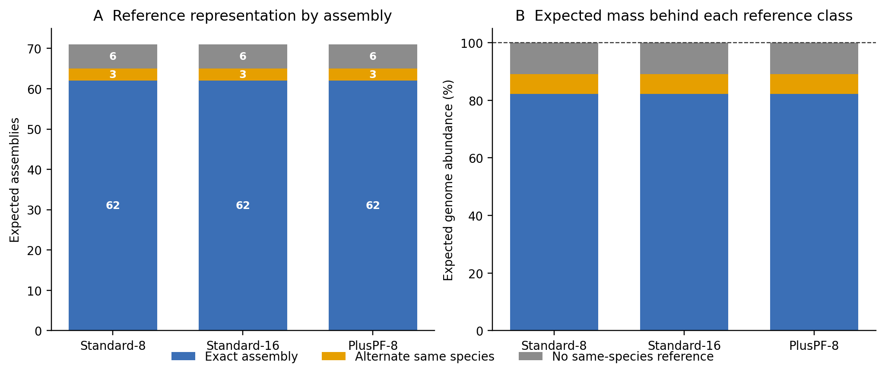
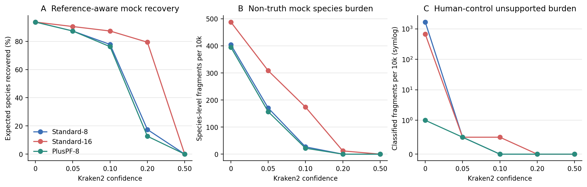
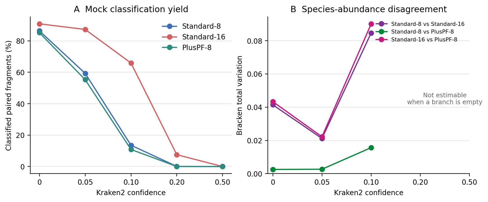
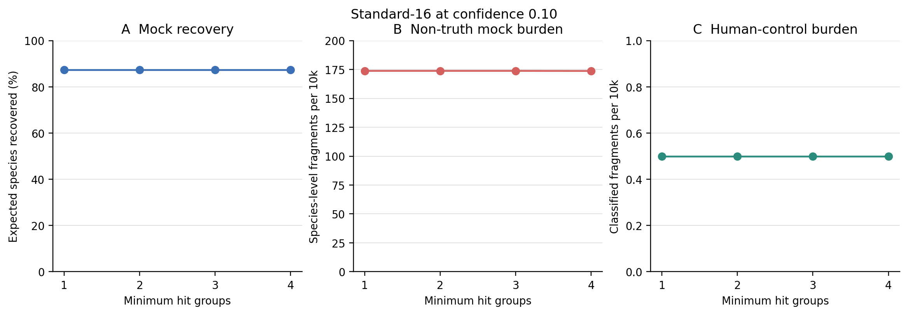

> **学习目标：**把“数据库更大”“数据库内容更多”“confidence 更高”和“minimum hit groups 更多”拆成四个独立问题；用真实阳性真值和有明确边界的方法对照评估召回—非预期调用折中；识别无法进入 Bracken 的高阈值分支；最后把数据库 release、阈值与验证结果写进 Methods。  
> **真实数据：**阳性基准为 71-strain MOCK1 DNA 的 Illumina run `ERR9765746`，使用第 13 篇 fastp 后保留的 99,991 个同步 pairs [@meslier2022platforms]。方法对照为公开人类 WGS `ERR194147` 的确定性前 20,000 个同步 pairs [@constantinides2023hostile]；它不是 extraction blank，也不能给出实验性假阳性率。  
> **预计资源：**三份固定 archive 合计 22.24 GiB，三个解包数据库合计 31.59 GiB，建议预留至少 70 GB 磁盘、8 核和 24 GB RAM；本次 Standard-16 单分支实测峰值为 15,585 MiB RSS。没有服务器时，可直接读取仓库内的 checksum-locked frozen reports 与聚合审计重画结果；要完整复跑三库矩阵，则应使用 HPC 或合规云，不要在 16 GB 笔记本上并行加载多个索引。

## 这一步对应论文里的哪张图 {#sec-target}

### 锚定 Figure 2 与 Figure 4，而不是先找“最佳阈值”

Wright 等的 Figure 2 先问 mock/simulated truth 有多少 taxa 与 reads 被各数据库覆盖，Figure 4 再把数据库和 confidence 放进同一张性能矩阵 [@wright2023defaults]。这个顺序很关键：参考库根本没有的物种不能算分类器“本应检出却漏掉”；不同日期的数据库也不能拿来归因于 content 或 size。

这里做一个更适合普通服务器的受控复现：三库都固定在 **2026-06-26**。

| Contrast | Held constant | Changed | What it can support |
|---|---|---|---|
| Standard-8 vs Standard-16 | release, library content, taxonomy | Kraken hash cap | cap / retained-minimizer sensitivity |
| Standard-8 vs PlusPF-8 | release, approximate 8 GB cap | fungi + protozoa content | content competition under a fixed budget |
| confidence sweep | database, reads, hit groups | `--confidence` | per-fragment evidence stringency |
| hit-group sweep | Standard-16, reads, confidence 0.10 | `--minimum-hit-groups` | minimum independent minimizer-run support |

::: {.callout-important title="这不是把三个名字放进一张柱状图"}
数据库比较必须锁 release date、archive bytes、publisher checksum、解包文件 checksum 和实际 reference crosswalk。否则看到的差异可能来自数据库更新、taxonomy 更新、内容变化、cap 变化或文件损坏，无法归因。
:::

### 结果一：三个库覆盖了相同的 63 个当前物种

{#fig-17-reference-coverage}

71 个 assembly 在当前 NCBI taxonomy 中对应 69 个 species。三份同日期数据库对这批细菌真值给出相同的 reference boundary：62 个 expected assemblies 有 sequence-accession 交集，3 个只有 alternate same-species reference，6 个没有 same-species reference。因此 63/69 个当前物种可在 species 层级被检出，reference-covered expected mass 为 89.013%，另有 10.999% 的源表质量首先受限于参考缺失。

| Database | Exact assemblies | Alternate same species | No same-species reference | Reference-present species | Covered expected mass |
|---|---:|---:|---:|---:|---:|
| Standard-8 | 62 | 3 | 6 | 63/69 | 89.013% |
| Standard-16 | 62 | 3 | 6 | 63/69 | 89.013% |
| PlusPF-8 | 62 | 3 | 6 | 63/69 | 89.013% |

这一步排除了一个常见误读：后续三库召回差异不是“PlusPF 多放了真菌和原生生物，所以多覆盖了本次细菌真值”，也不是 Standard-16 多收了 expected assemblies。三库的 benchmark denominator 相同；变化发生在 capped minimizer table 与查询 evidence。

### 结果二：同一个 confidence 在 8 GB 与 16 GB cap 上不是同一种强度

{#fig-17-confidence-tradeoff}

confidence 从 0 提高后，三库都减少 non-truth MOCK burden，但 8 GB capped indexes 的 species evidence 更快坍缩。以 `confidence = 0.10`、`minimum-hit-groups = 2` 为同一横截面：

| Database | MOCK classified | Reference-aware recovery | Non-truth MOCK / 10k | Bracken mass on truth species | Human unsupported / 10k |
|---|---:|---:|---:|---:|---:|
| Standard-8 | 13.55% | 49/63 = 77.78% | 26.9 | 97.65% | 0.0 |
| Standard-16 | 65.89% | 55/63 = 87.30% | 173.8 | 92.96% | 0.5 |
| PlusPF-8 | 10.87% | 48/63 = 76.19% | 21.9 | 97.58% | 0.0 |

Standard-16 在 `0.20` 仍恢复 50/63 个 reference-present species（79.37%），non-truth burden 降到 12.0/10k，并保留 34 行可估计的 Bracken composition；同一阈值下 Standard-8 与 PlusPF-8 已没有 species 超过 Bracken `-t 10`。到 `0.50`，三库对 MOCK 都没有 classified fragment，不能把“没有结果”写成完美特异。

人类方法对照还揭示了为什么不能用 `classified − Homo sapiens clade` 计算 unsupported burden。Standard-16、confidence 0.10 的 10,728 个 classified fragments 中，69 个属于 *Homo sapiens* clade，10,658 个直接落在 `Homo`、`Hominidae`、`Eukaryota` 等人类 lineage ancestors，只有 1 个落在线系之外；三类与 9,272 个 unclassified fragments 正好守恒到 20,000。ancestor-level call 与人类序列相容，不能冒充 non-human false positive。三库在 confidence ≥ 0.05 时的 unsupported burden 均不超过 0.5/10k；confidence 0 时则从 PlusPF-8 的 1.0/10k 到 Standard-8 的 1,668.5/10k，数据库依赖非常强。

::: {.callout-important title="0.10 是透明的比较点，不是胜出的默认值"}
后文用 Standard-16、confidence 0.10、hit groups 2 作为操作性比较点，因为它同时保留 55/63 的 reference-aware recovery、可估计的 Bracken composition 和 0.5/10k 的 human-control unsupported burden。但它仍有 173.8/10k non-truth MOCK fragments，不能据此声称“最优”，更不能迁移成病原检测、土壤或低生物量样本的通用阈值。
:::

### 结果三：数据库改变的不只是 classified fraction

{#fig-17-database-stability}

在 confidence 0.10，Standard-8、Standard-16 与 PlusPF-8 分别保留 41、49 与 39 个 Bracken species。Standard-8 与 PlusPF-8 的 total variation 为 0.0156，而 Standard-16 分别与它们相差 0.0846 和 0.0900。对这个细菌 mock 而言，在相同日期和当前 capped budget 下，把 Standard cap 从 8 GB 提到 16 GB 比给 8 GB 库加入真菌/原生生物内容带来更大的 composition 变化；这只是本数据上的敏感性结果，不评价 full PlusPF 或其他生态系统。

confidence 0.20 时只有 Standard-16 仍有 Bracken composition，confidence 0.50 时三库都为空。这里的空白是“距离不可估计”，不是两个空组成彼此完全一致；任何用 0 填补的折线都会人为制造稳定性。

### 结果四：本次 hit-group 轴几乎是平的

{#fig-17-hit-group-control}

hit groups 1–4 的 reference-aware recovery 始终为 55/63（87.30%）；MOCK classified fraction 只从 65.8889% 变到 65.8789%，non-truth burden 从 173.8156 变到 173.7156/10k，人类方法对照则始终为 0.5 unsupported fragments/10k。也就是说，在这批 150/101 bp prefixes 与当前操作点上，confidence/database 轴远比 hit groups 1–4 敏感；这不证明 hit groups 对低复杂度、短 reads、病毒或近缘 strain 永远无关。

36 个 Kraken2 branches 的计时账本合计 349.75 秒，单分支最长 14.13 秒；Standard-16 峰值 15,585 MiB，Standard-8 与 PlusPF-8 峰值约 7,946 与 7,936 MiB。36 个 Bracken branches 合计 9.35 秒、峰值 24.19 MiB。以上是本地热存储上的 99,991/20,000-pair 参数审计，只能作为资源下限，不能外推到完整生产队列。

## 理论：四个旋钮控制的是不同边界 {#sec-theory}

### 1. 数据库既是参考集合，也是测量模型

Kraken2 数据库至少有四层身份：

1. **taxonomy snapshot**：taxid、父子关系和名字随时间变化；
2. **reference library**：哪些 assembly/sequence 被纳入；
3. **minimizer table**：参考序列经 `k`、`l`、masking 和 LCA 规则变成哪些查询键；
4. **capacity policy**：`--max-db-size` 会对 reference library 的 minimizers 下采样以适应内存预算。

因此，“Standard”不是一个永久不变的分析条件，“8 GB”也不是“只放了较少物种”的同义词。固定 release 的 Standard-8 与 Standard-16 可以保留同一 reference library，却因保留的 minimizer 密度不同而产生完全不同的高-confidence 行为。PlusPF-8 又在近似相同容量中加入真菌和原生生物；新增内容会竞争有限 hash budget，不能先验假定它在所有细菌 mock 上都优于 Standard-8。

Kraken2 的 compact hash table 是概率数据结构；官方手册明确提醒查询可能返回错误 LCA，confidence scoring 可降低这类边界错误 [@wood2019kraken2]。但数据库污染、错误注释、近缘物种共享序列和 benchmark reference 缺失不是同一种误差，不能用一个 confidence 数字统称解决。

### 2. 先求 truth ∩ reference，再计算 reference-aware recall

设 mock 的 expected species 集为 $T$，某数据库实际包含 same-species reference 的集合为 $R_d$，在参数 $\theta$ 下被 species clade 检出的集合为 $D_{d,\theta}$。本篇报告：

$$
\mathrm{ReferenceAwareRecall}_{d,\theta}
= \frac{|D_{d,\theta} \cap T \cap R_d|}{|T \cap R_d|}.
$$

与此同时单独保留：

$$
\mathrm{MissingReferenceMass}_d
= \sum_{i \in T \setminus R_d} p_i,
$$

其中 $p_i$ 是 Supplementary Table S3 的 expected genome percentage。源表 71 行的印刷数值合计为 **100.01215654459679%**；这里原样保留，不为了得到整齐的 100% 静默重归一。

reference crosswalk 逐 assembly 分三类：

| Reference status | Operational definition | Interpretation |
|---|---|---|
| Exact expected assembly | 至少一个当前 assembly sequence accession 出现在 `seqid2taxid.map` | expected assembly represented |
| Alternate same-species reference | expected sequence accession 未命中，但数据库有同一 NCBI species reference | species 可检出，strain/assembly 不完全匹配 |
| No same-species reference | 数据库没有该 current species ancestor | species-level 漏检首先是 database limitation |

“exact”在这里是 sequence-accession 交集合同，不等价于每个 contig 都完整命中，也不提供 strain identity 结论。

### 3. `--confidence` 不是概率

Kraken2 对候选标签 $i$ 的 confidence score 为：

$$
C_i = \frac{Q_i}{Q},
$$

其中 $Q_i$ 是 LCA 位于 $i$ 的 clade 内的 queried k-mers，$Q$ 是 read 中不含 ambiguous nucleotide、因而实际被查询的 k-mers；数据库中没有命中的 k-mers 仍进入 $Q$ [@wood2019kraken2]。若当前标签不达阈值，标签沿 taxonomy tree 向上退；若连 root 都不达阈值，该 fragment 变为 unclassified。

所以 confidence 提高可能同时发生三件事：

- species call 退到 genus/family；
- classified fragment 退成 unclassified；
- Bracken 在目标 rank 上找不到超过 `-t` 的 entry。

它不是 posterior probability、p-value、FDR，也不是“0.10 表示 90% 正确”。在 minimizer 被强烈下采样的 capped database 中，大量 no-hit k-mers 留在分母，适合 full database 的阈值可能把 8 GB 索引压到几乎无 species evidence。

### 4. `--minimum-hit-groups` 不是 confidence 的另一种写法

hit group 是一段共享同一 minimizer 的相邻 k-mers。`--minimum-hit-groups 2` 要求至少两个 hit groups 才产生 call；它主要避免一小段局部序列或单个 minimizer run 支撑整条 read。confidence 则衡量某个 taxonomy clade 获得的 evidence fraction。

```text
minimum hit groups
    └── evidence 是否足以产生 call

confidence
    └── 产生 call 后，标签能下沉到多细的 rank
```

两者同时改变时，无法知道召回变化来自“没有 call”还是“call 向上退”。本篇主矩阵固定 hit groups 为 2；补充矩阵只在 Standard-16、confidence 0.10 下改变 hit groups 1–4。

### 5. “假阳性”必须先指定判定域

阳性 mock 中，species clade 不属于 truth species 的 fragments 记为 **non-truth mock calls**。它可能来自近缘序列共享、taxonomy 映射、数据库错误、实验杂质或分类错误；只有已知 mock truth 让它具备 benchmark 含义。

人类 WGS 方法对照先分成 *Homo sapiens* clade、直接落在人类 lineage ancestors 上的分类，以及线系外分类；只有第三类记为 **unsupported-control calls**。ancestor-level call 是 confidence 提高后沿 taxonomy 向上退的合法结果，不能从 `classified` 中减掉 *Homo sapiens* clade 后全部算作非人调用。这个指标能测试“几乎全人源序列输入时，这个参数组合留下多少线系外分类”，但不能称为实验性 false-positive rate，因为：

- 它不是 extraction blank 或无模板对照；
- 原始公开 run 可能含真实非人序列、污染或测序伪影；
- human reference 也不是个体基因组的完美全集；
- 这 20,000 pairs 是方法压力测试，不代表你的样本基质。

::: {.callout-warning title="零对照调用也不等于临床特异度为 100%"}
临床或病原体声明需要同批次 extraction blanks、positive controls、独立比对、覆盖广度、序列特异性和预先定义的报告规则。Kraken taxon row 只是候选 evidence，不是确证结果。
:::

### 6. Bracken 是 classifier × database × rank × threshold 的条件结果

Bracken 使用当前数据库、目标 read length 和 Kraken report，把高层级 evidence 重估到目标 rank [@lu2017bracken]。本篇固定 `rank=S`、`threshold=10`，MOCK 用 150 bp distribution，人类 101 bp reads 用最近的 100 bp distribution。

若 confidence 后 species rows 都不超过 10，Bracken 会返回 `Error: no reads found`。这不是“丰度全为零后可以继续归一化”，而是 **该参数组合下没有可估计的 species composition**。正确做法是保留 header-only table、真实 exit status 和明确 outcome；不能回退到低 confidence 的 Bracken 表，也不能把空表插补成均匀组成。

### 7. 阈值选择是多目标约束，不是单列最大化

可把选择写成：

$$
\theta^* = \arg\max_{\theta \in \Theta}
\mathrm{Recall}_{\theta}
\quad \text{subject to} \quad
\mathrm{ControlBurden}_{\theta} \le B,
\quad
\mathrm{CompositionAvailable}_{\theta}=1.
$$

$B$ 必须由研究问题、blank、检出成本和错误后果预先决定。探索阶段也可画 Pareto frontier，而不是给 recall、precision、classified fraction、taxon count 随意加权。不同数据库的 frontier 不同，因此没有可跨 release、样本类型和测序长度迁移的“Kraken2 最佳 confidence”。

## 准备工作 {#sec-setup}

<details>
<summary><strong>展开：算力、固定环境、分层下载、真实输入与内联作图函数</strong></summary>

### 算力与存储门槛

| Stage | CPU | RAM | Disk | Practical note |
|---|---:|---:|---:|---|
| Three archives | 1–16 download connections | <1 GB | 22.24 GiB | `.part` resume + checksum before promotion |
| Three installed indexes | 1–2 | <2 GB | 31.59 GiB | archives and indexes stay outside Git |
| Kraken2 Standard-16 | 8 | 20–24 GB recommended | report + scratch output | one index per process; bound job concurrency |
| Bracken species | 1 | <1 GB | small tables | empty high-confidence branches are valid outcomes |
| Routine QA / redraw | 1–4 | <2 GB | frozen bundle only | network-free; no FASTQ or index required |

同一节点并行十个 sample jobs 不会“共享一份内存预算”；每个常规 Kraken2 process 都可能加载一份 index。队列任务应按节点 RAM 限制并发，或验证 `--memory-mapping` 在本地文件系统上的性能后再采用。Kraken2 官方不建议把高频数据库访问放在慢 NFS 上。

### 安装固定环境

`env/kraken.yml` 是人可读环境合同，`env/kraken-linux-64.lock` 是本次 Linux-64 精确 transaction；正式复跑使用后者，升级软件时两者必须一起更新并重新验收。

```bash
mamba create \
  -p "${HOME}/miniconda3/envs/metagenome-kraken-2026.07" \
  --file env/kraken-linux-64.lock

KRAKEN_ENV_PREFIX="${HOME}/miniconda3/envs/metagenome-kraken-2026.07"
"${KRAKEN_ENV_PREFIX}/bin/kraken2" --version
"${KRAKEN_ENV_PREFIX}/bin/bracken" -v
```

固定入口为 Kraken2 2.17.1、Bracken Bioconda package 3.1p1、wrapper CLI 3.0.1、Python 3.12.13。package version 与 wrapper 打印字符串不同，因此两者同时记录。

### 下载并校验同日期数据库

```bash
export PROJECT_ROOT="$PWD"
export DB_ROOT=/absolute/path/outside/git/metagenome-kraken2
export DB_MANIFEST=data/small/17-database-manifest.tsv

db/download_db.sh audit
db/download_db.sh download kraken2-standard8-20260626
db/download_db.sh download kraken2-standard16-20260626
db/download_db.sh download kraken2-pluspf8-20260626

db/download_db.sh verify kraken2-standard8-20260626
db/download_db.sh verify kraken2-standard16-20260626
db/download_db.sh verify kraken2-pluspf8-20260626
```

下载器优先使用 16 个可续传 HTTP ranges；网络中断后重跑同一命令继续 `.part`，只有 byte count 与 publisher MD5 都通过才转成正式 archive。三个 release-specific 合同为：

| Database | Compressed bytes | Publisher MD5 |
|---|---:|---|
| Standard-8 | 5,946,578,575 | `7685f43cce057c2ca18511c925399b72` |
| Standard-16 | 11,995,707,291 | `f130daa49fd0befa688330b288a623de` |
| PlusPF-8 | 5,933,654,083 | `79a153b99f045bc2ae95e6d57c17a02d` |

archive MD5 通过后还要在每个解包目录运行 `md5sum --check`，逐一核对发布方列出的 17 个内部文件；只验证压缩包文件名或网页日期不够。

### 固定两组 FASTQ 与真值

```bash
MOCK_R1=data/raw/article13/ERR9765746_clean_R1.fastq.gz
MOCK_R2=data/raw/article13/ERR9765746_clean_R2.fastq.gz
HUMAN_R1=data/raw/article14/ERR194147_prefix20k_R1.fastq.gz
HUMAN_R2=data/raw/article14/ERR194147_prefix20k_R2.fastq.gz

sha256sum "${MOCK_R1}" "${MOCK_R2}" "${HUMAN_R1}" "${HUMAN_R2}"
```

MOCK clean FASTQ 来源于第 13 篇明确的“前 100,000 pairs → fastp synchronized filtering”步骤；人类方法对照来源于第 14 篇“checksum-identified ENA mates → 前 20,000 个完整同步 pairs”步骤。`data/small/17-source-manifest.tsv` 固定四个压缩文件的 bytes、records、bases、SHA-256 和 paired-ID SHA-256。

71 行 composition truth 直接来自 Meslier 2022 Supplementary Table S3。原始 XLSX 的 SHA-256 为 `6bb36d2121ff74b0542620e1e15b96d83256c797576f6e9fb192929f1ec3c12f`。NCBI Datasets 18.33.1 在 2026-07-21 一次性查询 assembly 与 sequence reports；原始 JSONL snapshot 和标准化 `data/small/17-mock1-truth.tsv` 一起冻结，常规 QA 不再访问 NCBI。

### 内联 R 作图环境与函数

```r
packages <- c("readr", "dplyr", "tidyr", "ggplot2", "patchwork", "scales")
missing <- packages[!vapply(packages, requireNamespace, logical(1), quietly = TRUE)]
if (length(missing)) install.packages(missing, repos = "https://cloud.r-project.org")

set.seed(20260721)
pal_pub <- c(
  "#0072B2", "#D55E00", "#009E73", "#CC79A7",
  "#E69F00", "#56B4E9", "#F0E442", "#999999"
)

scale_color_pub <- function(...) {
  ggplot2::scale_color_manual(values = pal_pub, ...)
}

scale_fill_pub <- function(...) {
  ggplot2::scale_fill_manual(values = pal_pub, ...)
}

theme_pub <- function(base_size = 12) {
  ggplot2::theme_bw(base_size = base_size, base_family = "sans") +
    ggplot2::theme(
      panel.grid = ggplot2::element_blank(),
      axis.text = ggplot2::element_text(color = "black"),
      axis.ticks = ggplot2::element_line(color = "black", linewidth = 0.3),
      legend.key = ggplot2::element_blank(),
      legend.background = ggplot2::element_rect(
        fill = scales::alpha("white", 0.7), color = NA
      ),
      plot.title.position = "plot"
    )
}

save_pub <- function(plot, file_base, width = 180, height = 105,
                     units = "mm", dpi = 350, write_tiff = TRUE) {
  dir.create(dirname(file_base), recursive = TRUE, showWarnings = FALSE)
  ggplot2::ggsave(
    paste0(file_base, ".pdf"), plot, width = width, height = height,
    units = units, device = grDevices::cairo_pdf
  )
  ggplot2::ggsave(
    paste0(file_base, ".png"), plot, width = width, height = height,
    units = units, dpi = dpi, bg = "white"
  )
  if (isTRUE(write_tiff)) {
    ggplot2::ggsave(
      paste0(file_base, ".tiff"), plot, width = width, height = height,
      units = units, dpi = dpi, compression = "lzw", bg = "white"
    )
  }
  invisible(plot)
}
```

</details>

## 可复制代码 {#sec-code}

### 1. 一次性运行完整矩阵

```bash
export PROJECT_ROOT="$PWD"
export KRAKEN_ENV_PREFIX="${HOME}/miniconda3/envs/metagenome-kraken-2026.07"
export DB_ROOT=/absolute/path/outside/git/metagenome-kraken2

bash scripts/run_article17_kraken2_database_confidence.sh \
  --project-root "${PROJECT_ROOT}" \
  --environment-prefix "${KRAKEN_ENV_PREFIX}" \
  --raw-dir "${PROJECT_ROOT}/data/raw/article17" \
  --database-root "${DB_ROOT}" \
  --frozen-dir "${PROJECT_ROOT}/data/small/17-kraken-database-confidence-frozen"
```

脚本先验证 archives 与全部内部文件，再为每个 branch 写 checksum sentinel。中断后重跑会逐个验证 report、per-fragment output 和 Bracken 表，只跳过内容仍与 sentinel 一致的分支。大型 FASTQ、index 与 per-fragment output 留在 ignored scratch/database；公开 bundle 只保留标准 reports、Bracken tables、交叉表、聚合 audit、规范化命令和 checksum manifest。

完成标志写入 `data/small/17-kraken-database-confidence-frozen/run-summary.json`；公开 payload 的逐文件 SHA-256 列于 `data/small/17-kraken-database-confidence-frozen/file-checksums.sha256`。数据许可、真值转录、人类对照和空 Bracken outcome 的解释边界集中记录在 `data/small/17-data-NOTICE.txt`。

### 2. 看懂主矩阵的一个分支

```bash
DB="${DB_ROOT}/standard-16-20260626"
R1=data/raw/article13/ERR9765746_clean_R1.fastq.gz
R2=data/raw/article13/ERR9765746_clean_R2.fastq.gz
REPORT=data/small/17-kraken-database-confidence-frozen/reports/standard16-mock-c010-h2.kreport.tsv
OUTPUT=data/raw/article17/work/per-fragment/standard16-mock-c010-h2.output

/usr/bin/time -v \
  "${KRAKEN_ENV_PREFIX}/bin/kraken2" \
    --db "${DB}" \
    --threads 8 \
    --paired \
    --gzip-compressed \
    --confidence 0.10 \
    --minimum-hit-groups 2 \
    --report "${REPORT}" \
    --output "${OUTPUT}" \
    "${R1}" "${R2}"

"${KRAKEN_ENV_PREFIX}/bin/bracken" \
  -d "${DB}" \
  -i "${REPORT}" \
  -o data/small/17-kraken-database-confidence-frozen/bracken/standard16-mock-c010-h2.tsv \
  -w data/small/17-kraken-database-confidence-frozen/bracken/standard16-mock-c010-h2.kreport.tsv \
  -r 150 -l S -t 10
```

对人类 101 bp 方法对照只把 `-r` 改成数据库提供的最近 grid `100`。不要把 paired-end 两端相加后写成 200 或 300；`-r` 是单条 read length。

### 3. 展开 30 个主分支

下面给出单个 branch 的完整计算核心。它把数据库目录、输入和 Bracken read-length grid 都显式映射；上面的正式 runner 还在此基础上增加临时文件原子转正、资源账本与 checksum sentinel。

<details>
<summary><strong>展开：可直接运行的 <code>run_kraken_and_bracken</code> 函数</strong></summary>

```bash
RUN_DIR=data/raw/article17/manual-matrix
mkdir -p "${RUN_DIR}"

run_kraken_and_bracken() {
  local database="$1"
  local control="$2"
  local confidence="$3"
  local hit_groups="$4"
  local db r1 r2 read_length confidence_tag branch

  case "${database}" in
    standard8)  db="${DB_ROOT}/standard-8-20260626" ;;
    standard16) db="${DB_ROOT}/standard-16-20260626" ;;
    pluspf8)    db="${DB_ROOT}/pluspf-8-20260626" ;;
    *) echo "Unknown database: ${database}" >&2; return 2 ;;
  esac

  case "${control}" in
    mock)
      r1=data/raw/article13/ERR9765746_clean_R1.fastq.gz
      r2=data/raw/article13/ERR9765746_clean_R2.fastq.gz
      read_length=150
      ;;
    human)
      r1=data/raw/article14/ERR194147_prefix20k_R1.fastq.gz
      r2=data/raw/article14/ERR194147_prefix20k_R2.fastq.gz
      read_length=100
      ;;
    *) echo "Unknown control: ${control}" >&2; return 2 ;;
  esac

  case "${confidence}" in
    0.0)  confidence_tag=c000 ;;
    0.05) confidence_tag=c005 ;;
    0.10) confidence_tag=c010 ;;
    0.20) confidence_tag=c020 ;;
    0.50) confidence_tag=c050 ;;
    *) echo "Unsupported confidence: ${confidence}" >&2; return 2 ;;
  esac

  branch="${database}-${control}-${confidence_tag}-h${hit_groups}"
  local report="${RUN_DIR}/${branch}.kreport.tsv"
  local output="${RUN_DIR}/${branch}.output"
  local table="${RUN_DIR}/${branch}.bracken.tsv"
  local log="${RUN_DIR}/${branch}.bracken.log"

  /usr/bin/time -v -o "${RUN_DIR}/${branch}.kraken.time.txt" \
    "${KRAKEN_ENV_PREFIX}/bin/kraken2" \
      --db "${db}" \
      --threads 8 \
      --paired \
      --gzip-compressed \
      --confidence "${confidence}" \
      --minimum-hit-groups "${hit_groups}" \
      --report "${report}" \
      --output "${output}" \
      "${r1}" "${r2}"

  set +e
  /usr/bin/time -v -o "${RUN_DIR}/${branch}.bracken.time.txt" \
    "${KRAKEN_ENV_PREFIX}/bin/bracken" \
      -d "${db}" -i "${report}" -o "${table}.tmp" \
      -r "${read_length}" -l S -t 10 \
      > "${log}" 2>&1
  local status=$?
  set -e

  if [[ "${status}" -eq 0 ]]; then
    mv "${table}.tmp" "${table}"
  elif [[ "${status}" -eq 1 ]] &&
       grep -Fq "Error: no reads found. Please check your Kraken report" \
         "${log}"; then
    printf 'name\ttaxonomy_id\ttaxonomy_lvl\tkraken_assigned_reads\tadded_reads\tnew_est_reads\tfraction_total_reads\n' \
      > "${table}"
  else
    echo "Bracken failed for ${branch}; inspect ${log}" >&2
    return "${status}"
  fi
}

for database in standard8 standard16 pluspf8; do
  for confidence in 0.0 0.05 0.10 0.20 0.50; do
    for control in mock human; do
      # 每次都重新运行 Kraken2；confidence 不是 Bracken 参数
      run_kraken_and_bracken \
        "${database}" "${control}" "${confidence}" 2
    done
  done
done
```

</details>

主矩阵始终固定 hit groups = 2，不能在某个 database 上悄悄换默认值。这个最小函数把所有结果写入 ignored scratch；只有正式 runner 验证完成的 standard reports、Bracken tables 与聚合审计才进入 frozen bundle。

### 4. 只改变 minimum hit groups

```bash
for hit_groups in 1 2 3 4; do
  for control in mock human; do
    run_kraken_and_bracken \
      standard16 "${control}" 0.10 "${hit_groups}"
  done
done
```

`h2` 已在主矩阵中存在，因此这里只新增 `h1/h3/h4 × 2 controls = 6` 次分类；总计 36 个 unique Kraken runs，而不是 38 个。

### 5. 对账每个 standard report

```bash
awk -F '\t' '
  $4 == "U" && $5 == 0 {unclassified = $2}
  $4 == "R" && $5 == 1 {classified = $2}
  {direct += $3}
  END {
    print "classified", classified
    print "unclassified", unclassified
    print "all direct assignments", direct
    print "classified + unclassified", classified + unclassified
  }
' "${REPORT}"

wc -l "${OUTPUT}"
```

对 paired input，report 与 output 的单位都是 fragment/read pair。每个 branch 必须满足：

$$
N_{\mathrm{classified}} + N_{\mathrm{unclassified}}
= N_{\mathrm{output\ rows}} = N_{\mathrm{input\ pairs}}.
$$

### 6. 正确处理 Bracken 的空分支

```bash
set +e
"${KRAKEN_ENV_PREFIX}/bin/bracken" \
  -d "${DB}" -i "${REPORT}" \
  -o branch.tsv -w branch.kreport.tsv \
  -r 150 -l S -t 10 \
  > branch.bracken.log 2>&1
status=$?
set -e

if [[ "${status}" -eq 1 ]] &&
   grep -Fq "Error: no reads found. Please check your Kraken report" \
     branch.bracken.log; then
  printf 'name\ttaxonomy_id\ttaxonomy_lvl\tkraken_assigned_reads\tadded_reads\tnew_est_reads\tfraction_total_reads\n' \
    > branch.tsv
  printf 'no_eligible_species_above_threshold\n' > branch.outcome
elif [[ "${status}" -ne 0 ]]; then
  exit "${status}"
fi
```

只有精确匹配这个已知 outcome 才被接受；数据库缺文件、格式错误或其他 Bracken 异常仍立即停止。空分支没有伪造的 `-w` report，也不参与 abundance distance。

### 7. 常规离线 QA 与重画四张图

```bash
"${KRAKEN_ENV_PREFIX}/bin/python" \
  scripts/validate_article17_kraken2_database_confidence.py \
  --project-root "$PWD" \
  --environment-prefix "${KRAKEN_ENV_PREFIX}" \
  --frozen-dir data/small/17-kraken-database-confidence-frozen \
  --output-dir results/17-kraken2-database-confidence \
  --figure-dir figures
```

这个入口不读取 FASTQ、不读取三个大型 index、不联网。它验证 frozen checksums、软件锁、设计矩阵、真值行数、对照边界和图像格式，再从聚合表重画 PDF、PNG 与 350 dpi LZW TIFF。

### 8. 从冻结表提取自己的决策表

```r
library(readr)
library(dplyr)

truth <- read_tsv(
  "data/small/17-kraken-database-confidence-frozen/truth-performance.tsv",
  show_col_types = FALSE
)
control <- read_tsv(
  "data/small/17-kraken-database-confidence-frozen/negative-control.tsv",
  show_col_types = FALSE
)

decision <- truth |>
  filter(PrimaryMatrix == "Yes") |>
  select(DatabaseID, Confidence, MinimumHitGroups,
         ReferenceAwareSpeciesRecall, NonTruthSpeciesPer10k,
         BrackenTruthFraction) |>
  left_join(
    control |>
      filter(PrimaryMatrix == "Yes") |>
      select(DatabaseID, Confidence, MinimumHitGroups,
             UnsupportedClassifiedPer10k),
    by = c("DatabaseID", "Confidence", "MinimumHitGroups")
  ) |>
  arrange(DatabaseID, Confidence)

print(decision, n = Inf)
```

## 审计与升级 {#sec-audit}

### 先忠实复现论文问题，再升级成可归因设计

Wright 等在多种 simulated/mock samples 上系统扫描 confidence，并比较八个数据库，核心结论是 tool–parameter–database 的选择取决于研究问题、目标指标和算力，而不是存在一个全局最佳默认值 [@wright2023defaults]。本篇保留这个问题框架，但用三项升级减少归因混乱：

1. 三个预构建库锁在同一发布日期；
2. 先对 71 个 expected assemblies 做 sequence/taxonomy crosswalk；
3. 用 positive truth 与 human-rich method control 同时约束阈值。

### 仍然不能从本次实验得到什么

- 只有一个 microbial mock，不能代表 stool、soil、virome、mycobiome 或病原检测场景；
- 100k clean pairs 适合参数审计，不代表生产深度下的低丰度检出限；
- human-rich control 不是同批次 extraction blank；
- expected genome percentage 不是 cell fraction、absolute load 或活菌丰度；
- species clade evidence 不能替代 strain validation；
- PlusPF-8 的结果只说明“额外内容在 8 GB cap 下如何竞争”，不评价 full PlusPF 或 `core_nt`。

### 今天更稳的生产方案

1. **预注册目标 rank 与损失函数。** 群落组成、低丰度 pathogen screen 和污染监控不应共用同一个最优标准。
2. **用同批次 controls 定阈值。** 至少包括 extraction blank、positive mock；低生物量研究再加入空白矩阵和 spike-in。
3. **先锁数据库，再看分组标签。** 不要在病例/对照差异最大时才决定 database 或 confidence。
4. **保存完整 classified/unclassified ledger。** 只保留相对丰度会隐藏高阈值造成的信息坍缩。
5. **高风险 taxon 做独立确认。** 提取候选 reads 后进行 alignment、竞争参考、coverage breadth/depth、distinct minimizer 与低复杂度审计；必要时使用靶向 PCR、培养或其他正交实验。
6. **报告敏感性。** 主结果至少给相邻 confidence、一个数据库替代方案和 controls 中的变化方向。

::: {.callout-tip title="把 Kraken2 当筛查器，而不是最终裁判"}
群落研究可把固定参数的 Bracken count matrix 用于统一下游；病原体或稀有 taxon 研究则更适合“较宽松筛查 → 候选 read 独立确认 → 预定义报告阈值”的两阶段流程。
:::

## 出版级美化 {#sec-polish}

### 四张图各回答一个问题

| Figure | Visual grammar | Claim it supports |
|---|---|---|
| Reference coverage | stacked counts + expected mass | benchmark denominator is database-aware |
| Confidence trade-off | three aligned line panels | recall and unsupported burden move together |
| Database stability | yield + pairwise total variation | abundance is database-conditional |
| Hit-group control | one-parameter sensitivity panels | hit groups are separate from confidence |

图内数据库顺序固定为 Standard-8、Standard-16、PlusPF-8；同一数据库在四图中保持相同颜色。纵轴明确写 fragments per 10k、percent 或 total variation，不把不同分母都叫 abundance。空 Bracken branch 在 distance 曲线上留空，不用 0 代替“不可估计”。

```r
tradeoff <- readr::read_tsv(
  "data/small/17-kraken-database-confidence-frozen/truth-performance.tsv",
  show_col_types = FALSE
) |>
  dplyr::filter(PrimaryMatrix == "Yes") |>
  dplyr::mutate(
    Database = factor(
      DatabaseID,
      levels = c("standard8", "standard16", "pluspf8"),
      labels = c("Standard-8", "Standard-16", "PlusPF-8")
    )
  )

p <- ggplot2::ggplot(
  tradeoff,
  ggplot2::aes(
    x = Confidence,
    y = 100 * ReferenceAwareSpeciesRecall,
    color = Database
  )
) +
  ggplot2::geom_line(linewidth = 0.7) +
  ggplot2::geom_point(size = 2) +
  scale_color_pub() +
  ggplot2::labs(
    x = "Kraken2 confidence",
    y = "Expected species recovered (%)",
    color = NULL
  ) +
  theme_pub()

save_pub(p, "figures/17-reference-aware-recall", width = 120, height = 90)
```

正文图使用英文标签、DejaVu Sans、白底和颜色之外的 panel/title redundancy。PDF 作为矢量 master，PNG 供网页与公众号，TIFF 以 350 dpi LZW 供期刊提交；不要从公众号截图反向充当论文图。

## 常见坑 {#sec-pitfalls}

::: {.callout-caution title="坑 1：把不同日期的数据库差异归因于 size"}
同名 Standard 在不同月份会改变 reference、taxonomy 和 hash。若 release 不同，不能写“16 GB 比 8 GB 多检出多少”而忽略时间更新。
:::

::: {.callout-caution title="坑 2：把 confidence 当概率或 FDR"}
`0.10` 是 $C/Q$ 的工程阈值，不表示 90% 正确，也不控制跨 taxon 多重检验。Methods 应写参数，不应写“90% confidence”。
:::

::: {.callout-caution title="坑 3：只最大化 classified fraction"}
更多 classified fragments 可能伴随更多 non-truth taxa。反过来，极高 confidence 可能让结果看似“很干净”，其实 species-level evidence 和 Bracken composition 已经消失。
:::

::: {.callout-caution title="坑 4：把 reference 缺失算成算法漏检"}
benchmark 必须先做 truth × database crosswalk。same-genus wrong-species 也不能算 species recall。
:::

::: {.callout-caution title="坑 5：空 Bracken 表自动回退"}
高 confidence 下没有 species 超过 `-t 10` 是一个真实 outcome。静默改用 `-t 0`、低 confidence 表或上一分支结果会制造不可追踪的数据泄漏。
:::

::: {.callout-caution title="坑 6：把人类 WGS 当 extraction blank"}
它只约束 human-rich input 下的 unsupported-control burden；不能据此声称污染率、无菌性、临床特异度或所有 non-human calls 都错误。
:::

::: {.callout-caution title="坑 7：先看病例差异，再调阈值"}
用 outcome labels 选择 database/confidence 会把分析选择变成隐性多重比较。阈值应由 mock、blanks、技术目标和预注册规则决定。
:::

::: {.callout-caution title="坑 8：Bracken read length 写成 insert size"}
paired 2 × 150 bp 不等于 `-r 300`。使用单端 read length 对应的 database distribution，并在 trimming 后长度跨多个 grid 时做敏感性。
:::

## 这段 Methods 怎么写 {#sec-methods}

> Taxonomic classification was performed with Kraken2 v2.17.1 using release-specific prebuilt databases from 26 June 2026. We compared Standard-8 (`k2_standard_08_GB_20260626`; 5,946,578,575 bytes; MD5 `7685f43cce057c2ca18511c925399b72`), Standard-16 (`k2_standard_16_GB_20260626`; 11,995,707,291 bytes; MD5 `f130daa49fd0befa688330b288a623de`), and PlusPF-8 (`k2_pluspf_08_GB_20260626`; 5,933,654,083 bytes; MD5 `79a153b99f045bc2ae95e6d57c17a02d`). Publisher checksums for all unpacked database files were verified before analysis. Paired-end fragments were classified with eight threads, `--minimum-hit-groups 2`, and confidence thresholds of 0, 0.05, 0.10, 0.20, and 0.50. A secondary sensitivity analysis varied minimum hit groups from 1 to 4 while holding Standard-16 and confidence 0.10 fixed. Species abundance was re-estimated with Bracken package v3.1p1 (wrapper-reported CLI v3.0.1), rank S and threshold 10, using the 150-bp distribution for the MOCK1 reads and the 100-bp distribution for the 101-bp human-control reads. Positive-control performance was evaluated on 99,991 quality-filtered read pairs from the 71-assembly MOCK1 sample ERR9765746. Expected assemblies were intersected with each database's sequence-to-taxonomy map before reference-aware species recall was calculated. Unsupported calls were also summarized for a deterministic 20,000-pair subset of human WGS run ERR194147 after excluding fragments assigned within the *Homo sapiens* clade or directly to an ancestor on the human taxonomic lineage; this input was treated as a human-rich method control rather than an extraction blank or an experimental false-positive standard. Parameter selection considered reference-aware recall, non-truth mock burden, unsupported-control burden, classified fraction, and availability of a Bracken species estimate. No confidence or hit-group threshold was interpreted as universally optimal.

投稿前把模板中的数据库名称替换成你真实使用的 release；若使用自建库，还要补 reference sources、assembly levels、masking、`k/l/s`、build command、taxonomy date、library hash 和最终 `hash.k2d` checksum。若用 `--memory-mapping`、不同 `-t` 或不同 read-length distribution，也必须逐项写明。

## 换成你自己的数据怎么做 {#sec-own-data}

### 最小输入清单

| Input | Minimum requirement | If absent |
|---|---|---|
| Biological FASTQ | synchronized, post-QC/post-host-filter pairs | cannot profile |
| Positive mock | known taxa; ideally quantitative composition | no empirical recall/abundance accuracy |
| Extraction blank | same kit, batch and sequencing process | no experimental contamination boundary |
| Database manifest | immutable release, URL, checksum, content | result cannot be reproduced |
| Metadata | batch, kit, lane, read length, host fraction | cannot audit technical structure |

### 先定义目标，再选矩阵

- **一般群落组成：**比较一个可负担主库、相邻 confidence 和固定 Bracken rank；强调 composition stability。
- **低生物量样本：**增加 extraction blank、空白矩阵、batch-aware prevalence/burden audit；阈值不能替代 contaminant model。
- **病原体筛查：**数据库要覆盖目标与近缘 species/host；预定义 minimum evidence、coverage breadth 和独立确认规则。
- **真菌/原生生物问题：**比较 Standard 与 PlusPF/full custom library，同时确认目标 species 是否真的进入 reference；不要仅凭“PlusPF”名称推断覆盖。

### 推荐执行顺序

```text
lock FASTQ lineage and database release
    ↓
truth/reference crosswalk
    ↓
database × confidence matrix on mock + blanks
    ↓
choose an operating point without biological group labels
    ↓
freeze parameters and profile the full cohort
    ↓
confirm high-consequence taxa independently
    ↓
report the primary result plus sensitivity branches
```

若没有 quantitative mock，可以比较 taxon recovery 与 controls burden，但不要声称 abundance accuracy；若没有 extraction blank，可以报告计算方法对照，却不能把它包装成实验污染率。生产队列的参数一旦锁定，所有样本必须使用同一数据库文件、confidence、hit groups、Bracken rank/read length/threshold 与归一化规则。

## 参考 {#sec-references}

- Kraken2 方法与 compact hash / confidence 定义：[@wood2019kraken2]
- Bracken species abundance re-estimation：[@lu2017bracken]
- Kraken 软件套件实践协议：[@lu2022krakensuite]
- database × parameter 系统比较及 Figure 2 / Figure 4：[@wright2023defaults]
- 71-strain MOCK1 数据与 Supplementary Table S3：[@meslier2022platforms]
- 人类方法对照来源及 host-removal 边界：[@constantinides2023hostile]
- 固定 Kraken2 数据库与发布方 checksum：[Langmead Lab AWS Index Zone](https://benlangmead.github.io/aws-indexes/k2)
- Kraken2 confidence 与 hit-group 官方定义：[Kraken2 manual](https://github.com/DerrickWood/kraken2/blob/master/docs/MANUAL.markdown)
- NCBI assembly/sequence snapshot 工具：[NCBI Datasets genome summary](https://www.ncbi.nlm.nih.gov/datasets/docs/v2/reference-docs/command-line/datasets/summary/genome/)
- MOCK composition 原表：[Supplementary Table S3](https://static-content.springer.com/esm/art%3A10.1038%2Fs41597-022-01762-z/MediaObjects/41597_2022_1762_MOESM3_ESM.xlsx)
- 方法对照 run record：[ENA ERR194147](https://www.ebi.ac.uk/ena/browser/view/ERR194147)
