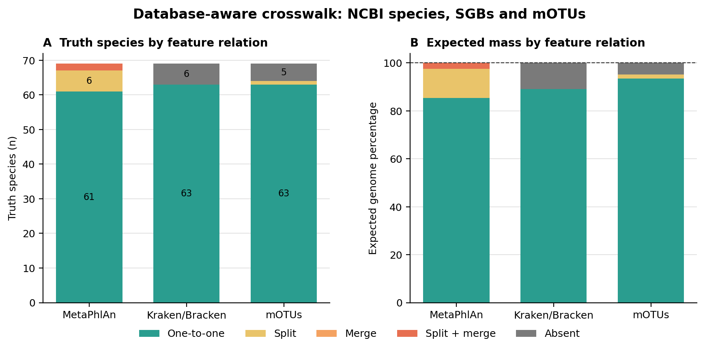
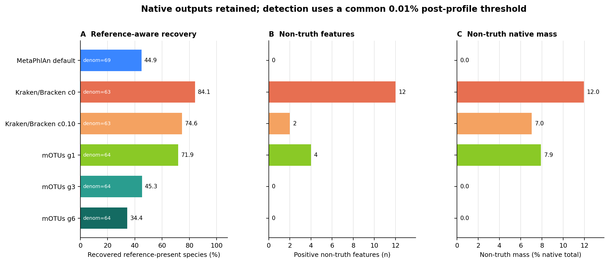
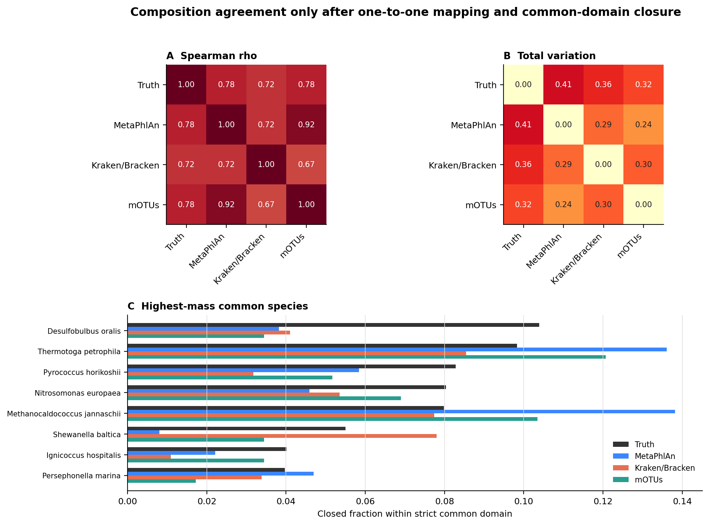
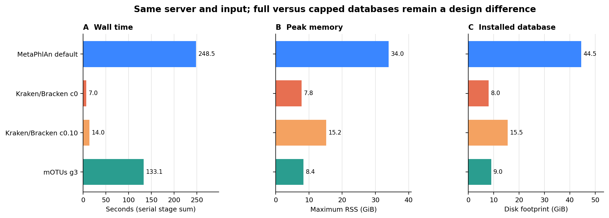

> **学习目标：**识别 MetaPhlAn SGB、Kraken/Bracken NCBI species 与 mOTU 不是同一种 feature；先求每个数据库真正覆盖的真值集合，再用共同的一对一物种域比较检出和组成；最后按研究问题、样本生态、假阳性成本与资源预算选择工具，而不是背一张“排行榜”。  
> **真实数据：**71-strain MOCK1 DNA 的 Illumina run `ERR9765746`，使用 fastp 后保留的 99,991 个同步 pairs [@meslier2022platforms]。三套输入的压缩 FASTQ SHA-256 与 normalized pair-ID hash 完全相同。真值来自 Supplementary Table S3 的 71 个 assembly，经固定 NCBI snapshot 解析为 69 个 current species；原表比例合计 100.0121565%，不静默改成整齐的 100%。  
> **预计资源：**只复跑 mOTUs 建议 8 核、12 GB RAM、20 GB 可用磁盘，实测主流程 133.1 秒、峰值 8.4 GiB；同时重建三套数据库与全部谱，建议至少 8 核、40 GB RAM、140 GB 可用磁盘。没有大内存服务器时，直接读取 checksum-locked profile、crosswalk 与聚合表即可重画结果；大型 FASTQ、BAM 和数据库索引不需要进入个人电脑。

## 这一步对应论文里的哪张图 {#sec-target}

### 锚定 benchmarking 的 performance panel，但先补上 feature-space panel

分类器 benchmark 常把 recall、precision、F1 或 abundance error 放在一张图里；Wright 等进一步展示了数据库和参数选择足以改变 Kraken2 的结论 [@wright2023defaults]。但 MetaPhlAn、Kraken/Bracken 与 mOTUs 的横评还有更早的一层：三者测量对象不同。

| Profiler | Native feature | Reference logic | Native abundance output |
|---|---|---|---|
| MetaPhlAn 4 | species-level genome bin, SGB；species row 为其聚合 | clade-specific marker genes，含 characterized 与 uncharacterized SGB | clade relative abundance；estimated reads 是内部估计量 |
| Kraken2 + Bracken | NCBI taxonomy node；这里评估 species | minimizer/LCA classification，再按数据库与 read length 重分配 | paired-fragment classification + Bracken estimated species reads |
| mOTUs 4 | marker-gene operational taxonomic unit, mOTU | 10 个 universal single-copy marker gene families 的 MGC evidence | `INSERT_SCALED` marker-gene insert counts |

如果直接按 species name 做 outer join，`Pseudomonas_E alloputida`、`Pseudomonas putida`、SGB 与 `mOTUv4.0_*` 会被误当成互不相干或一一对应的标签。正确顺序是：**数据库参考覆盖 → feature split/merge → 原生检出 → 共同域组成**。

### 结果一：69 个真值物种最后只剩 52 个严格共同一对一物种

{#fig-18-feature-space-crosswalk}

| Tool space | One-to-one | Split | Split + merge | Absent | One-to-one expected mass |
|---|---:|---:|---:|---:|---:|
| MetaPhlAn SGB | 61 | 6 | 2 | 0 | 85.355% |
| Kraken/Bracken NCBI species | 63 | 0 | 0 | 6 | 89.013% |
| mOTU | 63 | 1 | 0 | 5 | 93.482% |

MetaPhlAn vJan26 metadata能把 69 个 current truth species 都连到至少一个 SGB，但 8 个物种对应多个 SGB，或与其他 truth species 共享合并关系。Kraken Standard 数据库有 6 个物种没有 same-species reference。mOTUs genome catalog 用 exact GCA/GCF accession 命中 66/71 个 expected assemblies，覆盖 64/69 个物种；其中 *Methanococcus maripaludis* 的两个 expected assemblies 落入两个 mOTUs，因此属于 split。

三套映射同时为 one-to-one 的交集只有 **52 个物种**，承载 **70.738%** 的 expected genome mass。后面的跨工具丰度相关与距离只在这个集合内重新闭合；其余 17 个物种不是“删掉不好看的结果”，而是无法无歧义横向相减的测量对象。

::: {.callout-important title="Reference-present 与 name-compatible 不是同义词"}
`Chlorobium phaeovibrioides` 和 *Akkermansia muciniphila* 可在 mOTUs taxonomy 中找到同名候选，但 expected assembly accession 没有进入当前 genome catalog。它们被保留为 name-only annotation，不扩大 mOTUs 的严格 reference denominator。模糊名称匹配更不能证明同一物种或同一株。
:::

### 结果二：默认参数改变的是召回—非真值折中，不是同一把尺子的高低

{#fig-18-recovery-nontruth}

| Profile branch | Reference denominator | Recovered | Non-truth features | Non-truth native mass |
|---|---:|---:|---:|---:|
| MetaPhlAn default | 69 | 31 (44.9%) | 0 | 0.00% |
| Kraken/Bracken Standard-8, c0 | 63 | 53 (84.1%) | 12 | 11.95% |
| Kraken/Bracken Standard-16, c0.10 | 63 | 47 (74.6%) | 2 | 7.04% |
| mOTUs g1 | 64 | 46 (71.9%) | 4 | 7.89% |
| mOTUs g3 default | 64 | 29 (45.3%) | 0 | 0.00% |
| mOTUs g6 | 64 | 22 (34.4%) | 0 | 0.00% |

Kraken/Bracken 的 native `confidence=0` 分支召回最多，同时留下 12 个 non-truth species features。换到第 17 篇用人类方法对照选择的 Standard-16、`confidence=0.10` 后，non-truth features 从 12 降到 2，Bracken composition 中恢复的 reference-present truth species 也从 53 降到 47。

这里的 47/63 与 Kraken report 本身的 55/63 不矛盾：55 是 species clade 是否得到 paired-fragment evidence，47 是经过 Bracken `S/r150/t10` 后仍进入丰度表的 truth species。**classifier detection 与 abundance estimator output 是两个 endpoint。**

mOTUs 的 `g` 是一个非常直观的敏感性旋钮：只要求 1 个 marker gene 时恢复 46/64，但有 4 个 non-truth mOTUs；默认要求 3 个 marker genes 后恢复 29/64，严格 non-truth burden 归零；要求 6 个 marker genes 后进一步降到 22/64。零 non-truth 只对这一个高生物量 mock、当前 crosswalk 和 0.01% 阈值成立，不能写成临床特异度 100%。

MetaPhlAn 默认恢复 31/69，且没有 strict non-truth SGB。它的 marker specificity 换来了较少的检出；“feature 少”既不自动等于漏检严重，也不自动等于结果更真，必须结合研究 endpoint 与独立验证判断。

### 结果三：共同域中，相关高不代表绝对误差小

{#fig-18-composition-agreement}

三个默认分支在共同域内对 truth 的结果为：

| Profiler | Spearman rho vs truth | Total variation vs truth |
|---|---:|---:|
| MetaPhlAn default | 0.778 | 0.405 |
| Kraken/Bracken c0 | 0.724 | 0.363 |
| mOTUs g3 | 0.781 | 0.323 |

mOTUs g3 在这个 mock 的 common domain 中 TV 最小；MetaPhlAn 与 mOTUs 彼此的 rho 为 0.92、TV 为 0.24。这个结果不能外推为“mOTUs 全面最好”：严格域已经排除了 mOTUs 没有 exact expected assembly 的物种，默认 `g=3` 还没有检出 35 个 reference-present truth species。一个工具可以在检出的高丰度物种上排序很好，同时在全真值集合上召回较低。

Spearman 只看排序，无法告诉你质量被移动了多少。Total variation 定义为：

$$
\mathrm{TV}(p,q)=\frac{1}{2}\sum_{i=1}^{S}|p_i-q_i|,
$$

取值 0–1。比如 MetaPhlAn 与 mOTUs 的 rho 很高，但 TV 仍为 0.24；两者对 *Thermotoga petrophila*、*Methanocaldococcus jannaschii* 等高丰度物种的质量分配并不相同。报告相关系数时应同时给出 composition distance、漏检数和比较域大小。

### 结果四：速度差异很大，但数据库设计也不同

{#fig-18-resource-footprint}

| Pipeline | Wall time | Peak RSS | Installed database |
|---|---:|---:|---:|
| MetaPhlAn default | 248.5 s | 34.0 GiB | 44.5 GiB |
| Kraken/Bracken Standard-8 c0 | 7.0 s | 7.8 GiB | 8.0 GiB |
| Kraken/Bracken Standard-16 c0.10 | 14.0 s | 15.2 GiB | 15.5 GiB |
| mOTUs g3 | 133.1 s | 8.4 GiB | 9.0 GiB |

Kraken/Bracken 在这批短 reads 上明显更快。MetaPhlAn 的数据库与峰值内存最大；mOTUs 的 wall time 主要来自一次 `map_tax`，同一 BAM/MGC 再计算 `g=1/3/6` 各只需约 10 秒。以上测试没有随机化 cold/warm filesystem cache，也没有把 full Kraken database 与 capped index 等同，因此只能作为当前服务器上的作业预算，不能写成跨硬件的算法复杂度结论。

## 理论：为什么三个工具必然给出不同结果 {#sec-theory}

### 1. 一个“物种名”背后至少有四种边界

把 profiler 输出变成论文表格前，要同时回答：

1. **reference boundary**：当前 database 是否包含 expected assembly 或 same-species reference？
2. **taxonomy boundary**：使用 NCBI taxonomy、GTDB 哪一版，还是 profiler 自己的 clade catalog？
3. **feature boundary**：一个 NCBI species 是否 split 成多个 SGB/mOTUs，或多个 species merge 到一个 feature？
4. **evidence boundary**：全基因组 minimizer、clade-specific marker 与 universal marker gene evidence 的检出条件是什么？

MetaPhlAn 4 把已表征与未表征 genome bins 纳入 SGB 空间 [@blancomiguez2023metaphlan4]。Kraken2 对查询 minimizer 的 LCA 进行分类，Bracken 再根据 database-specific k-mer distribution 与 read length 把高层级 evidence 重估到目标 rank [@wood2019kraken2; @lu2017bracken]。mOTUs 则以 universal single-copy marker gene clusters 定义 mOTU，并通过至少 `g` 个 marker genes 的 evidence 调节检出 [@ruscheweyh2022motus]。

因此三者不是对同一个 feature table 使用三种统计方法，而是三套不同的测量模型。

### 2. Reference-aware recovery 先把数据库缺失从算法漏检中拆开

令 $T$ 为 69 个 truth species，$R_j$ 为 profiler/database $j$ 有严格参考证据的 truth species，$D_j$ 为超过统一 post-profile threshold 的检出集合。报告：

$$
\mathrm{ReferenceAwareRecovery}_j
=\frac{|D_j \cap T \cap R_j|}{|T \cap R_j|}.
$$

这里三套分母分别是 69、63 与 64。若强行都除以 69，会把 Kraken/mOTUs 的 reference absence 算成 classifier false negative；若只除以各自检出的 feature 数，又会人为抬高 recall。

Strict reference evidence 的优先级为：

```text
MetaPhlAn: NCBI species taxid in database taxonomy → SGB relation
Kraken:    expected sequence accession / same-species NCBI reference
mOTUs:     exact GCA/GCF accession encoded in genome catalog → mOTU

exact cross-release taxonomy name → annotation only
fuzzy name similarity             → never establishes reference presence
```

### 3. 共同丰度域必须排除 split、merge 与 absent

令 $C$ 是三套 feature mapping 都为 one-to-one 的 truth species 交集。本次 $|C|=52$。对每个 profiler，把属于 $C$ 的 native feature 聚合到 species，再在 $C$ 内闭合：

$$
\tilde p_{ij}=\frac{a_{ij}}{\sum_{k\in C}a_{kj}}, \qquad i\in C.
$$

这一步只为回答“在三者都能无歧义测量的物种中，组成有多一致”。它不能回答全样本有多少 reads 被分类，也不能替代对 excluded species 的漏检审计。共同域覆盖的 expected mass 必须与 rho、TV 一起报告，否则读者不知道结论只适用于真值的哪一部分。

### 4. 三套“未解析量”没有共同分母

| Quantity | Observed | Correct interpretation |
|---|---:|---|
| MetaPhlAn `estimated_reads_mapped_to_known_clades` | 261,721 | terminal-clade abundance/length estimator；可大于 199,929 profiling reads |
| Kraken native classified fragments | 86,373/99,991 | paired fragments with a Kraken classification under Standard-8 c0 |
| mOTUs marker-aligned reads | 1,122/199,982 | individual reads aligned to marker genes |
| mOTUs aligned inserts | 673 | paired/single insert evidence entering MGC calculation |
| mOTUs g3 unassigned | 1/81 scaled counts | unassigned mass within marker-derived output, not all input reads |

所以不能把 `1 - unassigned/81 = 98.8%` 写成 mOTUs read classification rate。实际只有 0.5611% 的 input reads 对齐到 marker database；marker profiler 本来就只需要一小部分高特异性 loci 来估计组成。MetaPhlAn 的 estimated mapped reads 同样不是逐 read 守恒账本。

### 5. `g`、confidence 与 Bracken threshold 控制不同环节

- mOTUs `g`：一个 mOTU 至少要多少个不同 marker genes 支持；`g=1` 偏 recall，`g=6` 偏 precision。
- Kraken `--confidence`：候选 clade 获得的 queried k-mer evidence fraction；提高后标签可向祖先退或变为 unclassified。
- Kraken `--minimum-hit-groups`：至少需要多少段相邻 minimizer evidence 才产生 call。
- Bracken `-t`：目标 rank 的最低 read evidence；它决定 feature 是否进入 abundance model。

这些旋钮不能折算成一个共同“严格度”。横评必须保留 native/default branch，再单列 sensitivity branches。

## 准备工作 {#sec-setup}

<details>
<summary><strong>展开：算力、固定环境、数据库下载、真实输入与内联作图函数</strong></summary>

### 算力与存储门槛

| Stage | CPU | RAM | Disk | Typical action |
|---|---:|---:|---:|---|
| mOTUs archive + installed DB | 1–16 download connections | <1 GB install | 5.17 + 9.03 GiB | resume, checksum, extract outside Git |
| mOTUs `map_tax` | 8 | 10–12 GB | BAM + scratch | map once |
| mOTUs `calc_mgc` | 1 | 5–6 GB | small MGC table | deterministic multimapper handling |
| MetaPhlAn metadata crosswalk | 1 | 8–10 GB | existing metadata pickle | one-time taxonomy extraction |
| Full three-profiler rerun | 8 | 40 GB | ≥140 GB free | use HPC or a large cloud VM |
| Routine redraw/QA | 1–4 | <2 GB | frozen small tables | no FASTQ, database or network |

数据库和 FASTQ 应放在本地 SSD 或节点 scratch。多个 Kraken jobs 会分别消耗 index 级内存；不要因为单样本 8 GB 就在 64 GB 节点上无约束并发十个任务。

### 安装固定 mOTUs 环境

`env/motus.yml` 记录跨平台环境意图，`env/motus-linux-64.lock` 固定本次 Linux-64 transaction；其中包括 mOTUs 4.1.0、BWA 0.7.19-r1273、VSEARCH 2.31.0、Python 3.12.13 与作图依赖 [@motus410release]。

```bash
mamba create \
  -p "${HOME}/miniconda3/envs/metagenome-motus-2026.07" \
  --file env/motus-linux-64.lock

MOTUS_ENV_PREFIX="${HOME}/miniconda3/envs/metagenome-motus-2026.07"
"${MOTUS_ENV_PREFIX}/bin/motus" --version
"${MOTUS_ENV_PREFIX}/bin/bwa" 2>&1 | head
```

不要把 mOTUs 3.x、4.0 与 4.1 的 software/database 混搭。当前输出 feature ID 仍以 `mOTUv4.0_` 开头，**ID 前缀不是 database version**；版本应读 profile header 与 `mOTUsv4.1.db`。

### 下载并核验 mOTUs database 4.1

数据库固定为 Zenodo record `20322482` [@motus41database]：archive 5,552,983,255 bytes，publisher MD5 `471ea128f0c0839f5c4629b949ea5f8a`，本地 SHA-256 `7d2d6382...375`。下载器先写 `.part`、支持断点续传，只有 checksum 通过才晋升为正式 archive。

```bash
DB_ROOT="${HOME}/metagenome-databases"

DB_MANIFEST=data/small/18-database-manifest.tsv \
DB_ROOT="${DB_ROOT}" \
  db/download_db.sh download motus-mgdb-4.1

archive="${DB_ROOT}/archives/motus-mgdb-4.1/db_mOTU.tar.gz"
install_root="${DB_ROOT}/installed/motus-mgdb-4.1"
mkdir -p "${install_root}"
tar -xzf "${archive}" -C "${install_root}"
touch "${install_root}/db_mOTU/db_mOTU.downloaded"

md5sum "${archive}"
head -n 12 "${install_root}/db_mOTU/mOTUsv4.1.db"
zcat "${install_root}/db_mOTU/mOTUsv4.1.gtdb.taxonomy.80mv.tsv.gz" | head
```

两个 taxonomy 文件实际都声明 **GTDB R226**。若外层说明文字仍写 R220，应以随 archive 发布的文件内容为准，并在 Methods 记录这种差异。

### 核对同一输入与三套冻结谱

```bash
sed -n '1,160p' data/small/18-data-NOTICE.txt
column -t -s $'\t' data/small/18-source-manifest.tsv
sha256sum \
  data/raw/article13/ERR9765746_clean_R1.fastq.gz \
  data/raw/article13/ERR9765746_clean_R2.fastq.gz

cat data/small/18-profiler-benchmark-frozen/run-summary.json
sha256sum -c \
  data/small/18-profiler-benchmark-frozen/file-checksums.sha256

head data/small/15-metaphlan-frozen/sgb-profile.tsv
head data/small/16-kraken-bracken-frozen/bracken-species-r150-t10.tsv
head data/small/18-profiler-benchmark-frozen/motus-profile-g3.tsv
```

主比较必须是相同 `ERR9765746` clean R1/R2、99,991 pairs。MetaPhlAn 输入时过滤掉 53 条短于 70 bp 的单 reads，但 source pair set 不变；应把“原始输入一致”和“profiler 内部 eligible read 数不同”同时写清。

### 内联出版级作图函数

```r
library(readr)
library(dplyr)
library(ggplot2)
library(scales)

pal_pub <- c(
  metaphlan = "#3A86FF",
  kraken = "#E76F51",
  kraken_control = "#F4A261",
  motus = "#2A9D8F",
  truth = "#333333"
)

scale_color_pub <- function(...) {
  scale_color_manual(values = pal_pub, ...)
}

scale_fill_pub <- function(...) {
  scale_fill_manual(values = pal_pub, ...)
}

theme_pub <- function(base_size = 10, base_family = "sans") {
  theme_classic(base_size = base_size, base_family = base_family) +
    theme(
      plot.title = element_text(face = "bold"),
      axis.title = element_text(color = "black"),
      axis.text = element_text(color = "black"),
      legend.title = element_blank(),
      panel.grid.major.y = element_line(color = "grey88", linewidth = 0.25)
    )
}

save_pub <- function(plot, stem, width, height) {
  ggsave(paste0(stem, ".pdf"), plot, width = width, height = height,
         units = "in", device = cairo_pdf)
  ggsave(paste0(stem, ".png"), plot, width = width, height = height,
         units = "in", dpi = 350, bg = "white")
  ggsave(paste0(stem, ".tiff"), plot, width = width, height = height,
         units = "in", dpi = 350, compression = "lzw", bg = "white")
}
```

</details>

## 可复制代码 {#sec-code}

### 1. 先冻结 profiler design，不让默认与升级分支混在一起

```bash
column -t -s $'\t' \
  data/small/18-profiler-benchmark-frozen/profiler-design.tsv
```

主结果保留三个 default/native branches：MetaPhlAn default、Kraken/Bracken Standard-8 `confidence=0`、mOTUs `g=3`。Standard-16 `confidence=0.10`、mOTUs `g=1/6` 只回答参数敏感性，不替换原生结果。

### 2. mOTUs 只映射一次

```bash
set -euo pipefail
export LC_ALL=C
export TZ=UTC
export PYTHONHASHSEED=0
export PYTHONNOUSERSITE=1
export PATH="${MOTUS_ENV_PREFIX}/bin:${PATH}"

r1="data/raw/article13/ERR9765746_clean_R1.fastq.gz"
r2="data/raw/article13/ERR9765746_clean_R2.fastq.gz"
motus_db="${DB_ROOT}/installed/motus-mgdb-4.1"
work="${TMPDIR:-/tmp}/article18-motus"
mkdir -p "${work}"

motus map_tax \
  -f "${r1}" \
  -r "${r2}" \
  -db "${motus_db}" \
  -l 75 \
  -t 8 \
  -o "${work}/ERR9765746.motus.bam"

motus calc_mgc \
  -i "${work}/ERR9765746.motus.bam" \
  -db "${motus_db}" \
  -l 75 \
  -o "${work}/ERR9765746.mgc"

for g in 1 3 6; do
  motus calc_motu \
    -i "${work}/ERR9765746.mgc" \
    -db "${motus_db}" \
    -n ERR9765746_MOCK1 \
    -g "${g}" \
    -y INSERT_SCALED \
    -o "${work}/motus-profile-g${g}.tsv"
done
```

`map_tax` 实测对齐 580 条 R1 与 542 条 R2，共 1,122/199,982 reads；`calc_mgc` 得到 673 个 aligned inserts，27 个是 multimappers，其中 10 个丢弃、17 个进入计算。该 profiling、crosswalk、聚合和重画链路不含随机过程；同时固定 `PYTHONHASHSEED=0`，并保留完整日志与退出状态。

### 3. 完整的一次性 builder：版本、数据库、资源、crosswalk 一起固化

MetaPhlAn crosswalk 需要 vJan26 的 compressed metadata pickle；它只在初始化时读取一次。下面的 builder 会验证 mOTUs archive 与内部 MD5，把 BAM/MGC 留在 scratch，只提交小型 profile、crosswalk、资源和 checksum manifest。

```bash
bash scripts/run_article18_profiler_benchmark.sh \
  --project-root "$PWD" \
  --environment-prefix "${MOTUS_ENV_PREFIX}" \
  --work-dir "${TMPDIR:-/tmp}/article18-official" \
  --motus-database-root "${DB_ROOT}/installed/motus-mgdb-4.1" \
  --motus-database-archive \
    "${DB_ROOT}/archives/motus-mgdb-4.1/db_mOTU.tar.gz" \
  --metaphlan-database-pkl \
    "${METAPHLAN_DB_DIR}/mpa_vJan26_CHOCOPhlAnSGB_202605.pkl" \
  --frozen-dir \
    data/small/18-profiler-benchmark-frozen
```

输出中的 `truth-feature-crosswalk.tsv` 每个 truth species 一行，核心字段是：

```r
crosswalk <- read_tsv(
  "data/small/18-profiler-benchmark-frozen/truth-feature-crosswalk.tsv",
  show_col_types = FALSE
)

crosswalk |>
  count(MetaPhlAnStatus, KrakenBrackenStatus, mOTUsStatus) |>
  arrange(desc(n))

crosswalk |>
  filter(CommonOneToOne == "Yes") |>
  summarise(
    species = n(),
    expected_mass = sum(ExpectedGenomePercent)
  )
```

### 4. 原生结果与 harmonized result 分表

```r
native <- read_tsv(
  "data/small/18-profiler-benchmark-frozen/native-profile-summary.tsv",
  show_col_types = FALSE
)
performance <- read_tsv(
  "data/small/18-profiler-benchmark-frozen/benchmark-performance.tsv",
  show_col_types = FALSE
)
harmonized <- read_tsv(
  "data/small/18-profiler-benchmark-frozen/harmonized-profile.tsv",
  show_col_types = FALSE
)

performance |>
  select(
    ProfileID, ReferenceTruthSpecies, ThresholdedTruthSpecies,
    NonTruthFeaturesAt0.01Pct, NonTruthNativeMassPct,
    CommonDomainSpecies, CommonDomainSpearmanVsTruth,
    CommonDomainTVVsTruth
  )

harmonized |>
  group_by(ProfileID) |>
  summarise(
    species = n(),
    closed_sum = sum(EstimatedFraction),
    expected_sum = sum(ExpectedGenomeFraction),
    .groups = "drop"
  )
```

`NativeMassTotal` 只能在同一 profiler 内解释。`harmonized-profile.tsv` 才能跨工具相减，但它已经明确改变了比较域并重新闭合；论文 Methods 必须写出这一步。

### 5. 日常离线 QA 与三格式重画

```bash
"${MOTUS_ENV_PREFIX}/bin/python" \
  scripts/validate_article18_profiler_benchmark.py \
  --project-root "$PWD" \
  --environment-prefix "${MOTUS_ENV_PREFIX}" \
  --frozen-dir data/small/18-profiler-benchmark-frozen \
  --output-dir results/18-profiler-benchmark \
  --figure-dir figures
```

这个入口不读 FASTQ、不解压 MetaPhlAn pickle、不读 mOTUs 大数据库，也不联网。它验证 28 个 frozen payload 的 SHA-256，重新计算 crosswalk、profile、agreement 与 resource 守恒，再导出 PDF、PNG 和 350 dpi LZW TIFF。

## 审计与升级：从“工具排名”升级为测量模型审计 {#sec-audit}

### 1. 忠实保留默认结果，再增加预先声明的敏感性分支

benchmark 若只调到自己喜欢的参数，会把 tuning advantage 冒充工具优势。推荐表格至少分成：

| Layer | Required report |
|---|---|
| Native/default | vendor/default or study-prespecified parameters |
| Database sensitivity | release、content、cap/full status |
| Evidence sensitivity | MetaPhlAn threshold；Kraken confidence/hit groups；mOTUs `g` |
| Harmonized comparison | crosswalk version、one-to-one domain、closure、threshold |

第 17 篇的 Kraken `c0.10` 是基于人类方法对照选出的操作点，不是 Kraken 原生默认值；因此这里保留 `c0` 与 `c0.10` 两行。mOTUs 同理保留 `g=3` default，并单列 `g=1/6`。

### 2. 当前 mOTUs archive 内有两组可复现但不能静默修正的计数差异

数据库版本文件写：

```text
motus: 124295
assigned_motus: 124299
unassigned_motus: 1
genomes: 3897967
```

运行时 loader 报告 124,300 mOTUs，等于 `assigned_motus + unassigned_motus`；`genomes.tsv.gz` 实际有 3,897,966 个数据行，比版本文件的 `genomes` 少 1。archive 的 publisher MD5、整包 SHA-256 和 7 个内部发布 MD5 全部通过，所以这不是本地损坏证据。正确做法是同时报告 **header count 与 observed count**，并锁 archive checksum；不要为得到一致数字而改文件。

### 3. GTDB 版本要读交付文件，不从工具论文年份猜

mOTUs database 4.1 的两个 taxonomy tables 均声明 GTDB R226。GTDB 更新可能带来 genus rename、species split/merge 与 representative genome 变化；本次已见：

- `Pseudomonas putida` expected assembly 对应 `Pseudomonas_E alloputida`；
- `Pseudomonas fluorescens` 对应 `Pseudomonas_E petroselini`；
- *Salinispora tropica* 在 GTDB 路径中落入 *Micromonospora tropica*；
- 两个 *Methanococcus maripaludis* assemblies 落入不同 mOTUs。

这些不是简单 `gsub("_", " ")` 能解决的名字格式问题。

### 4. 单样本工业 mock 不能代表人体、土壤、病毒与低生物量场景

MOCK1 包含细菌与古菌的高质量 isolate genomes，适合审计 species/reference mapping，却缺少至少四类困难：

- 真实群落的大量未知物种与 strain microdiversity；
- 极近缘病原体和水平转移区域；
- 真菌、原生生物与病毒；
- extraction blank、低 biomass 与批次污染。

MetaPhlAn 4 的 unknown SGB 与 mOTUs 的 environment-derived genomes 在真实环境样本中可能增加覆盖 [@blancomiguez2023metaphlan4; @ruscheweyh2022motus]；Kraken full/PlusPF/custom databases 也可能改变召回。这里的数字只给出当前 MOCK1 × 当前 release × 当前参数的性能切片。

### 5. Genome percentage 不是 cell fraction 或 read fraction

真值表给的是 expected genome percentage。实际 reads 还受 genome length、GC、提取、建库与测序偏差影响；marker profilers又只观察特定基因区域。若要评价 absolute cell abundance，应加入细胞数/拷贝数可追溯的 spike-in 或 flow cytometry，不应把 composition correlation 冒充绝对定量准确度。

::: {.callout-warning title="审稿人最容易攻击的结论"}
“Kraken 检出最多，所以最好”“mOTUs 没有假阳性，所以最准确”“MetaPhlAn feature 最少，所以最保守”都缺少必要条件。至少同时报告 reference denominator、non-truth burden、共同域质量、abundance distance、参数分支与独立控制。
:::

## 出版级美化 {#sec-polish}

图内只保留英文，并让颜色编码 tool family：MetaPhlAn 蓝、Kraken 橙、mOTUs 绿、truth 深灰。不要在一张图上用截断 y 轴放大 1–2 个物种的差异；检出图从 0 起点，distance matrix 写出数值，resource plot 标明 full/capped database 边界。

```r
performance <- read_tsv(
  "data/small/18-profiler-benchmark-frozen/benchmark-performance.tsv",
  show_col_types = FALSE
) |>
  mutate(
    RecoveryPct = 100 * ReferenceAwareRecoveryAt0.01Pct,
    ToolFamily = case_when(
      grepl("metaphlan", ProfileID) ~ "metaphlan",
      ProfileID == "kraken-bracken-control-aware" ~ "kraken_control",
      grepl("kraken", ProfileID) ~ "kraken",
      TRUE ~ "motus"
    )
  )

p <- ggplot(
  performance,
  aes(x = reorder(ProfileID, RecoveryPct), y = RecoveryPct, fill = ToolFamily)
) +
  geom_col(width = 0.68) +
  geom_text(aes(label = sprintf("%.1f", RecoveryPct)), hjust = -0.15) +
  coord_flip(clip = "off") +
  scale_fill_pub() +
  scale_y_continuous(
    limits = c(0, 105),
    breaks = seq(0, 100, 20),
    expand = expansion(mult = c(0, 0.02))
  ) +
  labs(
    x = NULL,
    y = "Recovered reference-present species (%)",
    title = "Reference-aware profiler recovery"
  ) +
  theme_pub()

save_pub(p, "figures/my-profiler-recovery", width = 7.2, height = 4.8)
```

## 常见坑 {#sec-pitfalls}

::: {.callout-caution title="坑 1：按 species name 直接 join"}
NCBI/GTDB rename、SGB/mOTU split/merge 和 unresolved label 会产生假缺失与假一致。先保存稳定 ID、taxonomy release 和 database crosswalk；name 只用于展示。
:::

::: {.callout-caution title="坑 2：三套 recall 都除以 69"}
数据库没有参考的物种不属于相同可检出域。报告 overall truth recovery 可以，但必须另给 reference-aware recovery，并把 absent expected mass 单列。
:::

::: {.callout-caution title="坑 3：把 unassigned 当成 input reads 的补集"}
mOTUs g3 的 1/81 是 marker-derived scaled count；MetaPhlAn estimated reads 也是模型量。只有 Kraken per-fragment ledger 在当前设置下可直接与 99,991 pairs 守恒。
:::

::: {.callout-caution title="坑 4：为公平而强行统一参数"}
`confidence=0.10`、`g=3` 和 MetaPhlAn marker threshold 没有共同统计含义。公平来自公开 native settings、同一输入、明确 endpoint 与 sensitivity analysis，不来自创造一个看似相同的数字。
:::

::: {.callout-caution title="坑 5：只给 rho"}
大量共同零值、少数高丰度物种和 rank preservation 都可能制造高相关。至少同时给 TV/Aitchison sensitivity、漏检、non-truth、共同域大小和 expected mass。
:::

::: {.callout-caution title="坑 6：把一次资源测试写成软件固有速度"}
数据库大小、cap/full、filesystem cache、线程、压缩输入、CPU 与存储都会影响时间。记录 command、database bytes、threads、RSS 和 cache boundary。
:::

::: {.callout-caution title="坑 7：看到 `mOTUv4.0_` 就说用了旧数据库"}
database 4.1 仍沿用 `mOTUv4.0_*` feature IDs。版本证据来自 profile header、version file、archive DOI 与 checksum，不来自 feature prefix。
:::

## 这段 Methods 怎么写 {#sec-methods}

> Taxonomic profiles were generated from the same 99,991 synchronized, quality-filtered read pairs of the ERR9765746 71-strain MOCK1 community. MetaPhlAn v4.2.5 was run against mpa_vJan26_CHOCOPhlAnSGB_202605 using eight threads. Kraken2 v2.17.1 was evaluated with the Standard-8 database released on 26 June 2026 at confidence 0 and a minimum of two hit groups; species abundances were re-estimated with Bracken package v3.1p1 using the 150-bp distribution and a minimum threshold of 10 reads. A control-aware sensitivity branch used the same-date Standard-16 database and Kraken2 confidence 0.10. mOTUs v4.1.0 was run against marker-gene database v4.1 (Zenodo record 20322482; database date 26 January 2026; taxonomy tables: GTDB R226) with a minimum alignment length of 75 bp and eight mapping threads. One alignment and one marker-gene-cluster table were reused to calculate INSERT_SCALED profiles requiring 1, 3, or 6 marker genes; g=3 was the default branch. Expected community composition comprised 71 assemblies resolving to 69 current NCBI species. Reference-aware recovery used profiler-specific database denominators. Cross-profiler abundance comparisons were restricted to 52 truth species with one-to-one NCBI species–SGB–mOTU mappings, representing 70.738% of the expected genome mass, and each profile was closed within this common domain. Detection used a prespecified post-profile threshold of 0.01% of resolved native abundance. Agreement was summarized by Spearman's rho and total-variation distance. Software environments, database archives, profiles, crosswalks, resource logs, and frozen outputs were checksum-locked; large FASTQ, indexes, BAM, and per-read outputs were retained outside version control.

Methods 还应在补充材料给出：

- 两个 FASTQ SHA-256 与 normalized pair-ID hash；
- MetaPhlAn、Kraken 与 mOTUs database release/checksum；
- `g`、confidence、hit groups、Bracken rank/read length/threshold；
- strict crosswalk 与 excluded species 表；
- native/default 与 sensitivity branches 的完整结果；
- wall time、maximum RSS、threads、database bytes 和运行硬件。

## 换成你自己的数据怎么做 {#sec-own-data}

### 最少需要什么

1. 每个样本同一份去宿主、质控后的 paired FASTQ；
2. 三套 profiler 的 software version、database release 与 checksum；
3. 样本 metadata、blank、positive mock 和批次信息；
4. 保留 native feature IDs 的未过滤 profile；
5. 若做性能声明，还需要可追溯 truth；没有 truth 时只能报告 concordance，不能报告 accuracy。

### 把单样本 benchmark 升级为队列级比较

对每个 sample 保留三套 native tables，先做数据库 crosswalk，再产生三个层级：

```text
native tables
├── discovery: each profiler's full native feature space
├── harmonized: strict one-to-one common species only
└── discordance audit: absent / split / merge / name-only features
```

队列级结果不要只比较每样本 feature count。至少评估：

- prevalence 与 abundance threshold sensitivity；
- blank/control burden 与批次效应；
- alpha/beta diversity conclusion stability；
- disease association 的 effect direction、FDR 与 leave-one-cohort-out stability；
- 关键 taxa 的独立 read alignment、coverage breadth 或 qPCR/ddPCR 验证。

### 如何选择主工具

| Primary goal | Sensible starting point | Required safeguard |
|---|---|---|
| 大型人体队列、标准化 species/SGB composition | MetaPhlAn 或 mOTUs | database coverage 与 unknown-feature boundary |
| 广谱病原候选、非细菌内容、自定义参考 | Kraken2 + carefully built database | blanks、coverage、confirmatory alignment、contamination audit |
| 环境样本、未知微生物较多 | 至少比较两种 reference strategies | unknown reference coverage、assembly/MAG complement |
| 关键生物标志物投稿 | 一个主 profiler + 一个独立敏感性 profiler | prespecified consensus/discordance rule |

工具选择应在看疾病标签和显著性之前预先声明。若两个 profiler 对关键结论分歧，优先解释 reference/feature/evidence 边界，并回到 reads 与 coverage；不要挑出最显著的那套结果当主分析。

## 参考 {#sec-references}

- MOCK1 数据与期望组成：Meslier et al. [@meslier2022platforms]
- MetaPhlAn 4 方法与 SGB 扩展：Blanco-Míguez et al. [@blancomiguez2023metaphlan4]
- Kraken2 与 Bracken：Wood et al.、Lu et al. [@wood2019kraken2; @lu2017bracken; @lu2022krakensuite]
- 数据库和参数选择对 Kraken 结果的影响：Wright et al. [@wright2023defaults]
- mOTUs profiler 与环境 genome 扩展：Ruscheweyh et al. [@ruscheweyh2022motus]
- mOTUs database 资源：Dmitrijeva et al. 与 database 4.1 archive [@dmitrijeva2025motusdb; @motus41database]
