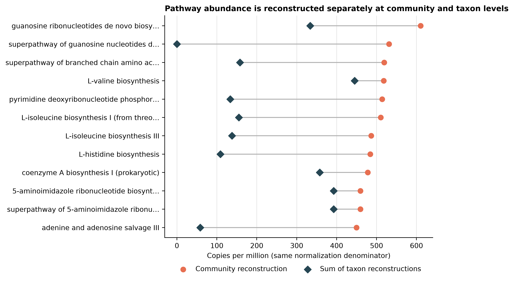
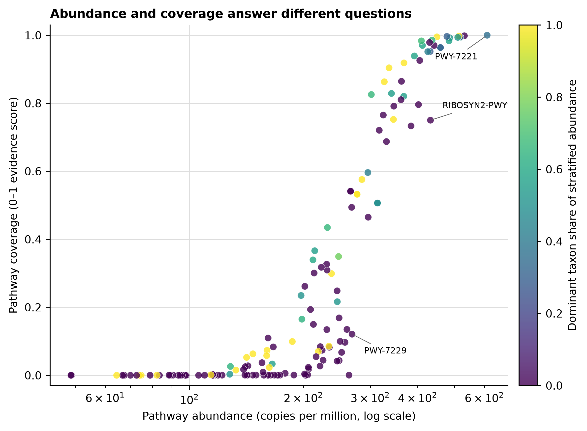

> **学习目标：**区分 HUMAnN 的 gene-family abundance、regrouped reaction abundance、pathway abundance 与 pathway coverage；用同一 read denominator 审计 nucleotide、translated 和 unmapped 三种命运；理解 gene family 与按 sum regroup 的 reaction 可由 taxa strata 相加，一对多 regroup 会改变 feature space，而 pathway abundance 必须把 community reconstruction 与 taxon reconstructions 分开解释。  
> **真实数据：**Meslier 等的 71-strain MOCK1 Illumina run `ERR9765746`，使用第 13 篇 fastp 后保留的 99,991 个同步 read pairs [@meslier2022platforms]。R1/R2 分别含 14,974,589 与 14,835,184 bases；两个压缩文件的 SHA-256 和 normalized pair-ID hash 均被固定。HUMAnN 按官方 paired-end 约定读取顺序串接后的 199,982 条 individual reads，不把 mates overlap-merge 成 fragments。  
> **预计资源：**完整复跑建议 8 核、64 GB RAM、至少 200 GB 可用 SSD；四个数据库归档合计 63.4 GB（59.0 GiB），分段下载文件、解包数据库、临时 sample-specific Bowtie2 index 与 DIAMOND 中间文件会同时占盘。归档完整性和 SHA-256 全部通过后清理 range parts，稳定占用可降到约 150 GB。当前 100k-pair MOCK1 的 HUMAnN 主流程实测为 **31 分 01 秒**、峰值 **6.62 GiB RSS**。没有服务器时，可直接读取 checksum-locked 小表重画结果；换成全深度人体或环境队列时，应在 HPC/云节点逐样本运行，并把大数据库放在共享只读存储。

## 这一步对应论文里的哪张图 {#sec-target}

### 对应 bioBakery 3 的 functional-profiling panel，但要把主表与 regroup feature space 拆开读

bioBakery 3 将物种组成、gene family、pathway abundance 和 pathway coverage 串成同一分析体系 [@beghini2021biobakery]。发表图常把“哪些功能多”“哪些物种贡献这些功能”“通路是否完整”并排展示；真正进入统计前，必须先回答每一列到底是什么量。

| Output | Native quantity | Community–strata relationship | Safe first question |
|---|---|---|---|
| Gene families | length-normalized RPK | community row = sum of taxonomic strata | 哪些 UniRef90 gene families 丰度高，由谁贡献？ |
| Regrouped reactions | UniRef90 RPK regrouped by sum | community row = sum of taxonomic strata；一对多映射可扩大总量 | 哪些 MetaCyc reactions 获得 gene-family evidence？ |
| Pathway abundance | pathway copy-like abundance reconstructed from reactions | community 与每个 taxon 分别重建，通常不相加 | 哪些 MetaCyc pathways 的完整 abundance 高？ |
| Pathway coverage | 0–1 reaction-evidence score | 不是 abundance，也不做 closure | 一个 pathway 的必要反应证据覆盖得有多充分？ |

{#fig-19-read-flow}

当前真实运行中，63,968 条 reads 在 ChocoPhlAn nucleotide search 被接受，3,033 条在余下 reads 中由 UniRef90 translated search 接受，132,981 条在两级检索后仍未匹配。三者严格守恒到 199,982；这个分母不能换成 99,991 pairs，也不能从 `UNMAPPED` RPK 反推。

{#fig-19-gene-family-stratification}

{#fig-19-pathway-contributions}

{#fig-19-abundance-coverage}

## 理论：从 reads 到四种功能量 {#sec-theory}

### 1. Taxonomic prescreen 决定 sample-specific nucleotide database

HUMAnN 先使用 MetaPhlAn profile 选出超过 `0.01%` 的物种，再从 ChocoPhlAn 中抽取对应 pangenomes，构建当前样本的 nucleotide index。这里的 profile 不是可随意替换的普通两列表：HUMAnN 3.9 的 prescreen parser 只接受其识别的 MetaPhlAn database generation。

本次已安装的第 15 篇 profile 来自更新的 `mpa_vJan26_CHOCOPhlAnSGB_202605`。把它直接传给未修改的 HUMAnN 3.9 会按预期非零退出，因为该版本只识别 v3 或 vJun23 header。正确处理是：

1. 对同一 clean FASTQ 另跑 MetaPhlAn 4.2.5 + `mpa_vJun23_CHOCOPhlAnSGB_202403`；
2. 把 vJun23 profile 作为真实 HUMAnN prescreen；
3. 保留 vJan26 profile，只比较两个 release 在 `0.01%` 阈值下选择了哪些 species；
4. 记录预期拒绝日志，不改 header、不 patch HUMAnN 源码。

两个 release 分别选择 32 与 31 个 species，共同选择 29 个；另有 3 个仅 vJun23、2 个仅 vJan26。release 差异会改变进入 sample-specific ChocoPhlAn index 的候选物种，因此必须写进 Methods。

vJun23 profile header 记录 199,929 reads processed，因为 MetaPhlAn 的 `--read_min_len 70` 排除了 53 条短 reads；HUMAnN 功能流程仍从全部 199,982 条 clean reads 起步。prescreen eligible reads 与 functional-search input 是两个都要保留的分母。

### 2. Nucleotide 与 translated search 是串行补充，不是两个独立分母

通过 prescreen 后，Bowtie2 先把 reads 对到物种 pangenomes；未匹配 reads 再翻译搜索 UniRef90。设输入 reads 为 \(N\)，nucleotide、translated 与最终 unmapped 数分别为 \(N_n\)、\(N_t\)、\(N_u\)，则：

\[
N = N_n + N_t + N_u.
\]

translated fraction 应写成 \(N_t/N\) 或在明确条件下写成 \(N_t/(N-N_n)\)。不能把二者混用，也不能将 paired-end mates 当成一个 fragment 后仍沿用 199,982 的分母。

### 3. Gene-family RPK 先校正 reference length，再按 mapping evidence 聚合

HUMAnN 的 native gene-family output 是 reads per kilobase（RPK）。它适合在同一样本内比较不同 reference lengths 已校正后的 gene-family abundance，但不是 raw reads，也不是绝对 copies。对同一个普通 gene family \(g\)：

\[
RPK_{g,community} = \sum_s RPK_{g,s},
\]

其中 \(s\) 是 species 或 unclassified stratum。当前 11,776 个 ordinary community gene families 中，违反该恒等式的 feature 数为 **0**。

`humann_renorm_table --units cpm --mode community` 将 unstratified community denominator 归一到 1,000,000；`--units relab` 归一到 1。CPM 仍是 compositional abundance，不是每细胞绝对拷贝数。

### 4. Regroup 是 feature-space 变换，不是把 UniRef90 改名

`humann_regroup_table --groups uniref90_rxn --function sum` 将 UniRef90 gene families 映射到 MetaCyc reactions。一个 UniRef90 cluster 可以支持多个 reactions，因此 regroup 后的 ordinary reaction RPK 总量不必等于输入 ordinary gene-family RPK；这不是 read 数增加，而是同一份 gene-family evidence 在另一个 feature space 中被一对多展开。

当前输入 ordinary gene-family RPK 总量为 130,579.936，其中 113,812.639 留在 `UNGROUPED`，所以实际进入至少一个 reaction 的 source RPK 为 16,767.298。1,402 个 ordinary reactions 合计 32,446.099 RPK，相对 mapped source 扩展 **1.935×**；reaction 加 `UNGROUPED` 后为 source ordinary RPK 的 **1.120×**。`UNMAPPED` 以 protected row 原值保留。正确顺序是先在 native RPK 上 regroup，再对 reaction table 单独做 CPM/relative-abundance closure；不能拿 gene-family CPM 直接映射后仍沿用原分母。

### 5. Pathway abundance 要重建 pathway structure，天然可能不加和

MetaCyc pathway abundance 不是把成员 gene families 简单求和。HUMAnN 先由 reactions 与 pathway structure 推断完整 pathway abundance，并分别在：

- 全 community 的 reaction pool；
- 每个 taxon 自己的 reaction pool

上求解。cross-taxon complementation、reaction bottleneck、MinPath parsimony 和 gap filling 都可能让 community reconstruction 与 taxa reconstructions 之和不同。当前 147 个 ordinary pathways 中，147 个表现为非加和；这正是算法语义，不是需要“修平”的 QA 失败。

### 6. Pathway coverage 是证据完整度分数，不是另一种 abundance

coverage 衡量 pathway reactions 相对样本背景是否有足够证据，范围为 0–1。它不满足总和为 1，不做 CPM，也不等于“检测到的基因比例”或 presence/absence。`UNMAPPED`、`UNINTEGRATED` 在 coverage 表中是流水线 sentinel；数值 1 不代表一个真实 pathway 达到 100% 完整。

::: {.callout-important title="先决定问题，再选表"}
问“功能有多少”读 gene-family/pathway abundance；问“reaction evidence 落在哪些反应”读 regrouped reaction table；问“谁贡献”读 stratified abundance；问“通路证据覆盖程度”读 pathway coverage。把这些输出拼进同一个 differential-abundance matrix，会同时混合 feature space、单位、分母和推断层级。
:::

## 准备工作 {#sec-setup}

<details>
<summary><strong>展开：硬件、固定环境、数据库 acquisition、真实输入与内联作图函数</strong></summary>

### 算力与存储门槛

| Stage | CPU | RAM | Disk | Expected action |
|---|---:|---:|---:|---|
| Four archive downloads | 1–16 connections | <1 GB | 63.4 GB / 59.0 GiB archives | resumable `.part` download + exact byte/checksum gate |
| Database extraction/inventory | 1–4 | 2–8 GB | archives + installed copies | tar integrity + per-file SHA-256 |
| MetaPhlAn vJun23 prescreen | 8 | 18.8 GiB | 21.4 GiB index + mapout | 146.4 s; one compatible taxonomic profile |
| HUMAnN nucleotide + translated | 8 | 6.62 GiB | temporary index + alignments | 1,861.48 s; one sample; `--memory-use minimum` |
| Routine redraw/QA | 1–4 | <2 GB | frozen small tables | no FASTQ, database or network |

大型数据库应放在共享只读 SSD；每个样本把临时目录放到节点 scratch。集群并发时先按单任务峰值 RSS 计算 array concurrency，不要让每个 job 都无约束读取同一网络文件系统。

### 安装固定 bioBakery 环境

`env/biobakery.yml` 记录环境意图，`env/biobakery-linux-64.lock` 固定当前 554-package Linux-64 transaction。HUMAnN、MetaPhlAn、Bowtie2 与 DIAMOND entrypoints 必须来自同一个 prefix。

```bash
mamba create \
  -p "${HOME}/miniconda3/envs/metagenome-biobakery-2026.07" \
  --file env/biobakery-linux-64.lock

BIOBAKERY_ENV_PREFIX="${HOME}/miniconda3/envs/metagenome-biobakery-2026.07"
bash env/relink-biobakery-entrypoints.sh "${BIOBAKERY_ENV_PREFIX}"

"${BIOBAKERY_ENV_PREFIX}/bin/humann" --version
"${BIOBAKERY_ENV_PREFIX}/bin/metaphlan" --version
"${BIOBAKERY_ENV_PREFIX}/bin/bowtie2" --version | head -n 1
"${BIOBAKERY_ENV_PREFIX}/bin/diamond" version
```

本次固定版本为 HUMAnN 3.9、MetaPhlAn 4.2.5、Bowtie2 2.5.5、DIAMOND 2.2.4 与 Python 3.12.13。

### 分层下载并验证四个数据库归档

MetaPhlAn vJun23 metadata 与 Bowtie2 index 分别有发布者 MD5。ChocoPhlAn 和 UniRef90 的版本化上游端点未发布 checksum；首次获取必须保存最终 HTTPS URL、服务器 `Content-Length`、获取时间、完整 tar traversal 和本地 SHA-256。后续运行再用 `data/small/19-database-manifest.tsv` 中的 exact bytes + SHA-256 fail closed。

```bash
HUMANN_CACHE_ROOT="${HOME}/metagenome-databases/humann3-article19"

bash scripts/bootstrap_article19_humann_databases.sh \
  --project-root "$PWD" \
  --cache-root "${HUMANN_CACHE_ROOT}" \
  download

column -t -s $'\t' \
  "${HUMANN_CACHE_ROOT}/manifests/bootstrap-results.tsv"

DB_MANIFEST=data/small/19-database-manifest.tsv \
DB_ROOT="${HUMANN_CACHE_ROOT}" \
  db/download_db.sh audit

for database_id in \
  metaphlan-vjun23-metadata \
  metaphlan-vjun23-bowtie2 \
  humann-chocophlan-full \
  humann-uniref90-full; do
  DB_MANIFEST=data/small/19-database-manifest.tsv \
  DB_ROOT="${HUMANN_CACHE_ROOT}" \
    db/download_db.sh verify "${database_id}"
done

bash scripts/bootstrap_article19_humann_databases.sh \
  --project-root "$PWD" \
  --cache-root "${HUMANN_CACHE_ROOT}" \
  extract

bash scripts/bootstrap_article19_humann_databases.sh \
  --project-root "$PWD" \
  --cache-root "${HUMANN_CACHE_ROOT}" \
  inventory
```

两个 HUMAnN SHA-256 是 **retrieval lock**，不是 publisher checksum。换镜像、重新发布或上游文件发生变化时，不应自动接受新 hash；先核对 archive 内容和 release provenance，再显式更新 manifest。

Globus 对普通 GET 不向 aria2 暴露可分片总长时，bootstrap 会调用 `scripts/download_ranged_archive.sh`：以 HEAD 锁定的 `Content-Length` 切成 16 个不重叠 ranges，要求每段返回 HTTP 206 并达到精确字节数，再按序组装。已完成 ranges 可在重试时复用。

### 核对输入 lineage

```bash
sed -n '1,200p' data/small/19-data-NOTICE.txt
column -t -s $'\t' data/small/19-source-manifest.tsv

sha256sum \
  data/raw/article13/ERR9765746_clean_R1.fastq.gz \
  data/raw/article13/ERR9765746_clean_R2.fastq.gz

cat data/small/13-qc-frozen/run-summary.json
cat data/small/19-humann3-frozen/run-summary.json
column -t -s $'\t' \
  data/small/19-humann3-frozen/database-audit.tsv
sha256sum -c data/small/19-humann3-frozen/file-checksums.sha256
```

输入必须同时满足：两端各 99,991 records、pair-ID hash 相同、R1/R2 SHA-256 与第 13 篇一致。只有文件名相同不构成 lineage 证据。

### 内联出版级作图函数

```r
library(readr)
library(dplyr)
library(ggplot2)
library(scales)

set.seed(20260722)

pal_pub <- c(
  nucleotide = "#2A9D8F",
  translated = "#457B9D",
  unmapped = "#B7B7A4",
  community = "#E76F51",
  strata = "#264653"
)

scale_color_pub <- function(...) {
  scale_color_manual(values = pal_pub, ...)
}

scale_fill_pub <- function(...) {
  scale_fill_manual(values = pal_pub, ...)
}

theme_pub <- function(base_size = 10, base_family = "sans") {
  theme_classic(base_size = base_size, base_family = base_family) +
    theme(
      plot.title = element_text(face = "bold"),
      axis.title = element_text(color = "black"),
      axis.text = element_text(color = "black"),
      legend.title = element_blank(),
      panel.grid.major.y = element_line(color = "grey88", linewidth = 0.25)
    )
}

save_pub <- function(plot, stem, width, height) {
  ggsave(paste0(stem, ".pdf"), plot, width = width, height = height,
         units = "in", device = cairo_pdf)
  ggsave(paste0(stem, ".png"), plot, width = width, height = height,
         units = "in", dpi = 350, bg = "white")
  ggsave(paste0(stem, ".tiff"), plot, width = width, height = height,
         units = "in", dpi = 350, compression = "lzw", bg = "white")
}
```

</details>

## 可复制代码 {#sec-code}

### 1. 串接 mates，但先核对 199,982 条唯一 read IDs

HUMAnN 不使用 pairing information；paired-end reads 应放进同一个输入文件。这里解压两个 gzip members 后重新写成一个 deterministic gzip，避免下游 reader 是否支持 multi-member gzip 成为隐性条件。

```bash
set -euo pipefail
export LC_ALL=C
export TZ=UTC
export PYTHONHASHSEED=0
export PYTHONNOUSERSITE=1

r1="data/raw/article13/ERR9765746_clean_R1.fastq.gz"
r2="data/raw/article13/ERR9765746_clean_R2.fastq.gz"
work="${TMPDIR:-/tmp}/article19-humann3"
mkdir -p "${work}"/{metaphlan,humann,logs,tmp}

gzip -cd "${r1}" "${r2}" | gzip -n \
  > "${work}/ERR9765746_clean_all_reads.fastq.gz"

"${BIOBAKERY_ENV_PREFIX}/bin/python" - \
  "${work}/ERR9765746_clean_all_reads.fastq.gz" <<'PY'
import gzip
import sys

records = 0
identifiers = set()
with gzip.open(sys.argv[1], "rt", encoding="utf-8") as handle:
    while True:
        header = handle.readline()
        if not header:
            break
        sequence = handle.readline()
        plus = handle.readline()
        quality = handle.readline()
        if not sequence or not plus or not quality:
            raise SystemExit("Truncated FASTQ")
        records += 1
        identifiers.add(header[1:].strip().replace(" ", ""))

assert records == 199982
assert len(identifiers) == 199982
print(records, len(identifiers))
PY
```

`/1` 与 `/2` 保留在 header 中，所以每条 individual read 的 ID 唯一；pair matching 仍由 frozen PairIDHash 单独证明。

### 2. 为 HUMAnN 3.9 生成兼容的 vJun23 profile

```bash
mpa_dir="${HUMANN_CACHE_ROOT}/installed/metaphlan-vjun23"
mpa_index="mpa_vJun23_CHOCOPhlAnSGB_202403"

"${BIOBAKERY_ENV_PREFIX}/bin/metaphlan" \
  "${r1},${r2}" \
  --input_type fastq \
  --db_dir "${mpa_dir}" \
  --index "${mpa_index}" \
  --offline \
  --bowtie2_exe "${BIOBAKERY_ENV_PREFIX}/bin/bowtie2" \
  --mapout "${work}/metaphlan/ERR9765746-vJun23.mapout.bz2" \
  --tmp_dir "${work}/tmp" \
  --nproc 8 \
  --read_min_len 70 \
  --perc_nonzero 0.33 \
  --stat tavg_g \
  --stat_q 0.2 \
  -t rel_ab \
  --sample_id ERR9765746_MOCK1_vJun23 \
  --output_file \
    "${work}/metaphlan/ERR9765746-vJun23-profile.tsv"

grep -m 1 'vJun23' \
  "${work}/metaphlan/ERR9765746-vJun23-profile.tsv"
```

### 3. 完整运行 nucleotide + translated workflow

`choco_dir` 应包含 `g__*.v201901_v31.ffn.gz`，`uniref_dir` 应包含 annotated UniRef90 `v201901b` DIAMOND database。Bowtie2 显式固定 `--seed 20260722`；HUMAnN 本身没有抽样，但同时固定 `PYTHONHASHSEED=0`，避免 hash-order 漂移。

```bash
choco_dir="${HUMANN_CACHE_ROOT}/installed/humann-chocophlan-v201901-v31"
uniref_dir="${HUMANN_CACHE_ROOT}/installed/humann-uniref90-v201901b"
export ARTICLE19_METAPHLAN_REAL="${BIOBAKERY_ENV_PREFIX}/bin/metaphlan"

"${BIOBAKERY_ENV_PREFIX}/bin/humann" \
  --input "${work}/ERR9765746_clean_all_reads.fastq.gz" \
  --output "${work}/humann" \
  --threads 8 \
  --taxonomic-profile \
    "${work}/metaphlan/ERR9765746-vJun23-profile.tsv" \
  --metaphlan "$PWD/scripts/humann39-compat-bin" \
  --nucleotide-database "${choco_dir}" \
  --protein-database "${uniref_dir}" \
  --search-mode uniref90 \
  --prescreen-threshold 0.01 \
  --bowtie-options '--very-sensitive --seed 20260722' \
  --memory-use minimum \
  --pathways metacyc \
  --minpath on \
  --gap-fill on \
  --log-level DEBUG \
  --o-log "${work}/logs/ERR9765746-humann3.log" \
  --output-basename ERR9765746_MOCK1 \
  --output-format tsv
```

提供 `--taxonomic-profile` 后，HUMAnN 不会重复运行 MetaPhlAn，但 3.9 仍先解析 `metaphlan --version`。MetaPhlAn 4.2.5 在版本行后新增 database-status 行，会触发旧 parser；`scripts/humann39-compat-bin/metaphlan` 只在 `--version` 时保留第一行，其余调用原样委托给锁定 binary。它不改 profile、不改 HUMAnN，也不启用会把整个 ChocoPhlAn 合并进样本库的 `--bypass-prescreen`。Bowtie2 与 DIAMOND 不再重复用 CLI path 覆盖，因为 builder 已把锁定 environment prefix 放在 `PATH` 首位；额外 prepending 会反过来遮蔽 version wrapper。这条命令不加 `--remove-temp-output`，因为初始化审计需要从 nucleotide 与 translated unaligned FASTA 重建 read fate。公开 frozen bundle 不包含这些逐 read 中间文件。

### 4. 先在 native RPK regroup，再分别派生 CPM 与 relative abundance

```bash
renorm="${BIOBAKERY_ENV_PREFIX}/bin/humann_renorm_table"
regroup="${BIOBAKERY_ENV_PREFIX}/bin/humann_regroup_table"

"${renorm}" \
  --input "${work}/humann/ERR9765746_MOCK1_genefamilies.tsv" \
  --units cpm --mode community --special y --update-snames \
  --output "${work}/humann/ERR9765746_MOCK1_genefamilies-cpm.tsv"

"${renorm}" \
  --input "${work}/humann/ERR9765746_MOCK1_genefamilies.tsv" \
  --units relab --mode community --special y --update-snames \
  --output "${work}/humann/ERR9765746_MOCK1_genefamilies-relab.tsv"

"${regroup}" \
  --input "${work}/humann/ERR9765746_MOCK1_genefamilies.tsv" \
  --groups uniref90_rxn \
  --function sum \
  --ungrouped Y \
  --protected Y \
  --output "${work}/humann/ERR9765746_MOCK1_reactions-rpk.tsv"

"${renorm}" \
  --input "${work}/humann/ERR9765746_MOCK1_reactions-rpk.tsv" \
  --units cpm --mode community --special y --update-snames \
  --output "${work}/humann/ERR9765746_MOCK1_reactions-cpm.tsv"

"${renorm}" \
  --input "${work}/humann/ERR9765746_MOCK1_reactions-rpk.tsv" \
  --units relab --mode community --special y --update-snames \
  --output "${work}/humann/ERR9765746_MOCK1_reactions-relab.tsv"

"${renorm}" \
  --input "${work}/humann/ERR9765746_MOCK1_pathabundance.tsv" \
  --units cpm --mode community --special y --update-snames \
  --output "${work}/humann/ERR9765746_MOCK1_pathabundance-cpm.tsv"

"${renorm}" \
  --input "${work}/humann/ERR9765746_MOCK1_pathabundance.tsv" \
  --units relab --mode community --special y --update-snames \
  --output "${work}/humann/ERR9765746_MOCK1_pathabundance-relab.tsv"
```

`uniref90_rxn` 使用 HUMAnN 3.9 包内的 `metacyc_reactions_level4ec_only.uniref.bz2`；本次文件为 57,511,575 bytes，SHA-256 为 `8419ce78a62ca9130914f2c347a9708111cedc7de52ba274659ce51ec7de7752`。reaction table 独立 closure，不继承 gene-family denominator。coverage 表保持原值；没有 `humann_renorm_table --units coverage` 这一步。

### 5. 一次性 builder 与日常离线 QA

完整 builder 会验证四个 archives、定位解包目录、记录预期 vJan26 拒绝、运行 vJun23 prescreen 与 HUMAnN、固化小表及规范化日志。若中途被调度器终止，可在保留 work directory 后加 `--resume`；它不会覆盖已存在的 frozen bundle。

```bash
bash scripts/run_article19_humann3.sh \
  --project-root "$PWD" \
  --environment-prefix "${BIOBAKERY_ENV_PREFIX}" \
  --cache-root "${HUMANN_CACHE_ROOT}" \
  --raw-dir "${TMPDIR:-/tmp}/article19-humann3-official" \
  --frozen-dir data/small/19-humann3-frozen
```

日常 QA 不读 FASTQ、不读大数据库、不联网：

```bash
"${BIOBAKERY_ENV_PREFIX}/bin/python" \
  scripts/validate_article19_humann3.py \
  --project-root "$PWD" \
  --environment-prefix "${BIOBAKERY_ENV_PREFIX}" \
  --frozen-dir data/small/19-humann3-frozen \
  --output-dir results/19-humann3 \
  --figure-dir figures
```

它逐项验证 frozen payload SHA-256、software lock、database acquisition、source lineage、read conservation、gene/reaction additivity、regroup mapping 指纹、`UNGROUPED`、一对多 expansion、pathway non-additivity、coverage range、各 feature space 的 CPM/relative-abundance closure，以及 PDF/PNG/LZW TIFF。

### 6. 从表读起，不从上一章的内存对象起步

```r
gene_rpk <- read_tsv(
  "data/small/19-humann3-frozen/genefamilies-rpk.tsv",
  comment = "",
  show_col_types = FALSE
)
gene_cpm <- read_tsv(
  "data/small/19-humann3-frozen/genefamilies-cpm.tsv",
  comment = "",
  show_col_types = FALSE
)
path_cpm <- read_tsv(
  "data/small/19-humann3-frozen/pathabundance-cpm.tsv",
  comment = "",
  show_col_types = FALSE
)
reaction_rpk <- read_tsv(
  "data/small/19-humann3-frozen/reactions-rpk.tsv",
  comment = "",
  show_col_types = FALSE
)
regroup_audit <- read_tsv(
  "data/small/19-humann3-frozen/regroup-audit.tsv",
  show_col_types = FALSE
)
path_coverage <- read_tsv(
  "data/small/19-humann3-frozen/pathcoverage.tsv",
  comment = "",
  show_col_types = FALSE
)

head(gene_rpk, 5)
head(reaction_rpk, 5)
regroup_audit
head(path_cpm, 5)
head(path_coverage, 5)
```

原始 HUMAnN header 以 `#` 开头，是列名而不是注释；实际批量读表时应先保留第一行，或使用能识别 HUMAnN 格式的 parser。这里的 frozen audit 表另外提供解析后的 `FeatureID`、`FeatureName` 与 `Stratum` 字段，避免按展示名称 join。

## 审计与升级：把“功能表”升级成可追溯测量模型 {#sec-audit}

### 1. 兼容性要由 parser 与数据库版本共同证明

“MetaPhlAn 4 输出”并不自动等于“任何 HUMAnN 3 都能读”。本次 unmodified HUMAnN 3.9 对 vJan26 profile 的预期拒绝状态与错误文本被固化；主结果重新生成 vJun23 profile。若以后升级 HUMAnN，应重新验证：

- 接受哪些 MetaPhlAn profile generations；
- ChocoPhlAn 与 UniRef release 是否仍匹配；
- pathway mapping database 是否变化；
- 相同 FASTQ 的 prescreen、mapped fraction 与 feature space 是否漂移。

不要靠改 header 绕过检查：header 合法不等于 SGB IDs、taxonomy 与 pangenome files 真正兼容。

### 2. Database checksum 证据分两级写

| Asset | Verification evidence | Claim boundary |
|---|---|---|
| MetaPhlAn vJun23 metadata | exact bytes + publisher MD5 + local SHA-256 | publisher checksum verified |
| MetaPhlAn vJun23 Bowtie2 index | exact bytes + publisher MD5 + local SHA-256 | publisher checksum verified |
| ChocoPhlAn full v201901_v31 | HTTPS final URL + Content-Length + tar traversal + retrieval SHA-256 | retrieval locked; no publisher checksum claimed |
| UniRef90 annotated v201901b full | HTTPS final URL + Content-Length + tar traversal + retrieval SHA-256 | retrieval locked; no publisher checksum claimed |

“能解压”只排除部分损坏，不能替代 provenance；“本地算了 SHA-256”也不应改写成“官方 SHA-256”。

### 3. Regroup 后总量变化是 feature-space 属性

本次 `uniref90_rxn` 映射保留 1,402 个 ordinary reactions、`UNGROUPED` 与 protected `UNMAPPED`。reaction community–strata 加和违例仍为 0，但 mapped expansion 为 1.935×、含 `UNGROUPED` 的 total expansion 为 1.120×。因此 reaction RPK 只能在 reaction feature space 内解释；不能与 source UniRef90 RPK 逐列相减，也不能把扩展倍数叫作新增 reads、提高 mapping rate 或 pathway copy gain。

升级 HUMAnN 或 mapping release 时，应把映射文件 basename、bytes、SHA-256、grouping function、`--ungrouped` 与 `--protected` 一起作为 feature-space contract。若映射变化，reaction tables 应视为新的 analysis batch。

### 4. Gene-family additivity 是 QA invariant，pathway non-additivity 是方法属性

当前 frozen evidence 中 gene-family violations 为 0；若换数据后出现非零，应先检查 table parsing、feature/stratum separator、special rows 和 renormalization mode。

pathway abundance 恰好相反：147/147 个 ordinary pathways 的 community 值与 taxa 之和不同。若强制要求全相等，反而说明把 pathway reconstruction 错当成 gene-family aggregation。

### 5. `UNMAPPED`、`UNGROUPED` 与 `UNINTEGRATED` 是解释边界

- `UNMAPPED`：没有进入已知 gene-family evidence 的 abundance；
- `UNGROUPED`：进入 gene-family table、但没有映射到目标 reaction group 的 abundance；
- `UNINTEGRATED`：已分配 gene families 中未纳入 pathway reconstruction 的 abundance；
- coverage 表中的同名 rows：sentinel，而非 MetaCyc biological pathways。

差异分析可以按问题决定是否排除 special rows，但必须先报告其样本分布。删除后再 renormalize 会改变其他 feature 的 compositional denominator。

### 6. DNA functional potential 不是 expression、activity 或 flux

MOCK1 的 pathway profile 说明 reference-mapped DNA 中有哪些 potential functions。它不能证明：

- 基因在当前条件下表达；
- enzyme 有活性；
- pathway 具有净代谢通量；
- 某一个 species 在体内执行该通路；
- 100k-pair industrial mock 的 ranking 能代表人体疾病群落。

要回答 activity 应加入 metatranscriptomics/proteomics；要回答 exchange 与 flux 需要培养、代谢物或约束代谢模型。UniRef cluster 与 MetaCyc pathway release 也必须随结果报告 [@suzek2007uniref; @caspi2023metacyc]。

::: {.callout-warning title="审稿人最容易攻击的结论"}
“coverage=1 所以通路丰度高”“某 pathway 的 strata 相加不到 community，所以数据有错”“UNMAPPED 很低所以全部 reads 都被解释”“DNA 中检出 pathway 所以代谢活跃”都跨越了测量边界。
:::

## 出版级美化 {#sec-polish}

图内只用英文，并把颜色固定到证据层级：nucleotide 绿、translated 蓝、unmapped 灰；community reconstruction 橙、taxon reconstructions 深蓝。read-flow 图从 0 开始并写 denominator；abundance 用 log x 轴时保留零值处理说明；coverage y 轴固定 0–1，不能通过自由缩放制造“完整度差异”。

```r
pathway <- read_tsv(
  "data/small/19-humann3-frozen/pathway-contributions.tsv",
  show_col_types = FALSE
) |>
  filter(CommunityCPM > 0)

p <- ggplot(
  pathway,
  aes(
    x = CommunityCPM,
    y = Coverage,
    color = DominantFractionOfStrata
  )
) +
  geom_point(size = 2.2, alpha = 0.82) +
  scale_x_log10(labels = label_number()) +
  scale_color_viridis_c(
    option = "D",
    limits = c(0, 1),
    name = "Dominant taxon share"
  ) +
  scale_y_continuous(limits = c(0, 1), breaks = seq(0, 1, 0.2)) +
  labs(
    x = "Pathway abundance (copies per million, log scale)",
    y = "Pathway coverage (0–1 evidence score)",
    title = "Abundance and coverage answer different questions"
  ) +
  theme_pub()

save_pub(
  p,
  "figures/my-abundance-coverage",
  width = 7.2,
  height = 4.8
)
```

## 常见坑 {#sec-pitfalls}

::: {.callout-caution title="坑 1：把 R1/R2 当成 HUMAnN 的 paired fragment"}
HUMAnN 对本流程使用 individual reads；两端串接后分母是 199,982。不要 overlap merge 后仍引用原 read count，也不要把 mates 的方向当成 pathway evidence。
:::

::: {.callout-caution title="坑 2：把 vJan26 header 改成 vJun23"}
这只能骗过字符串检查，不能让 SGB IDs、taxonomy 与 ChocoPhlAn pangenomes 匹配。用兼容 release 重跑 prescreen，或升级整套经过验证的软件/数据库。也不要用 `--bypass-prescreen` 绕开 executable version check：该开关会忽略 supplied profile 的物种筛选，把整个 ChocoPhlAn 合并成样本库。
:::

::: {.callout-caution title="坑 3：把 RPK 当 raw reads"}
RPK 已按 reference length 调整。要画 read fate，应从 mapping/intermediate evidence 重建；不要拿 `UNMAPPED` RPK 与 FASTQ reads 相减。
:::

::: {.callout-caution title="坑 4：把 CPM 当绝对 copies"}
CPM 是 community denominator 下的 closure。样本总 microbial load 改变时，相同 CPM 不代表相同每克样本 copies；absolute abundance 需要 spike-in、qPCR、flow cytometry 或其他总量锚点。
:::

::: {.callout-caution title="坑 5：regroup 后仍假定 gene-family denominator 不变"}
UniRef90→reaction 是一对多映射，不是 feature rename。应先 regroup native RPK，再对 reaction table 单独 closure；保留 `UNGROUPED`，并报告映射文件与 expansion audit。
:::

::: {.callout-caution title="坑 6：强求 pathway strata 加回 community"}
gene family 可加和，pathway abundance 通常不可加和。community 与 taxa 是分别基于 reaction evidence 重建的两个结果层。
:::

::: {.callout-caution title="坑 7：对 coverage 做 CPM 或求和"}
coverage 是每个 pathway 的 0–1 score，没有总和为 1 的约束。coverage 与 abundance 应并列报告，而不是互相归一化。
:::

::: {.callout-caution title="坑 8：删 special rows 后不记录 denominator"}
保留与排除 `UNMAPPED`/`UNGROUPED`/`UNINTEGRATED` 会改变相对丰度。Methods 应写 `--special y/n`、normalization mode 以及统计表是否含 special rows。
:::

::: {.callout-caution title="坑 9：把一次 mock profile 写成疾病机制"}
MOCK1 适合验证软件、数据库和单位合同，不含真实人体生态、饮食暴露、未知物种、宿主协变量与临床结局。
:::

## 这段 Methods 怎么写 {#sec-methods}

> Functional profiles were generated from 99,991 synchronized, fastp-filtered read pairs (199,982 individual reads) of the ERR9765746 71-strain MOCK1 community. The R1 and R2 files were concatenated without overlap merging, and their compressed SHA-256 hashes, record counts, base counts, and normalized pair-identifier hash were verified before analysis. A compatible taxonomic prescreen was generated with MetaPhlAn v4.2.5 and mpa_vJun23_CHOCOPhlAnSGB_202403 using eight threads; 32 profile species exceeded the 0.01% HUMAnN prescreen threshold. HUMAnN alias mapping expanded these to 89 selected database names and incorporated 37 ChocoPhlAn species files into the sample-specific nucleotide database; prescreening was not bypassed. Direct use of the separately generated vJan26 profile was rejected by unmodified HUMAnN v3.9 and was retained only for a release-sensitivity audit. HUMAnN v3.9 consumed the supplied compatible profile; a version-output compatibility wrapper retained the canonical first line of `metaphlan --version` for the legacy HUMAnN parser while delegating all non-version calls unchanged. HUMAnN was run with ChocoPhlAn full v201901_v31 for nucleotide alignment, annotated UniRef90 v201901b for translated alignment, Bowtie2 v2.5.5 (`--very-sensitive --seed 20260722`), DIAMOND v2.2.4, eight threads, `--memory-use minimum`, MetaCyc pathways, MinPath enabled, and gap filling enabled. The two MetaPhlAn archives were verified against publisher MD5 checksums. Because publisher checksums were unavailable for the two versioned HUMAnN archives, their final HTTPS URLs, remote content lengths, retrieval times, complete archive traversals, and locally computed SHA-256 retrieval locks were recorded without labeling them as publisher checksums. Native gene-family and pathway-abundance tables were retained on the RPK/RPK-derived scales and additionally renormalized at the community level to copies per million and relative abundance with special rows retained. UniRef90 gene-family RPKs were also regrouped by sum to MetaCyc reactions with `humann_regroup_table --groups uniref90_rxn --function sum --ungrouped Y --protected Y` before separate reaction-level normalization. The packaged mapping `metacyc_reactions_level4ec_only.uniref.bz2` was 57,511,575 bytes with SHA-256 `8419ce78a62ca9130914f2c347a9708111cedc7de52ba274659ce51ec7de7752`; 1,402 ordinary reactions were retained, mapped source abundance expanded 1.935-fold because of one-to-many assignments, and `UNGROUPED` remained explicit. Pathway coverage remained on its native 0–1 evidence scale and was not renormalized. Gene-family and regrouped-reaction community values were verified against the sum of taxonomic strata; community-level and taxon-level pathway reconstructions were reported separately. The nucleotide, translated, and final unmapped read counts were 63,968, 3,033, and 132,981, respectively. Software locks, database releases, acquisition evidence, normalized logs, result tables, and frozen outputs were checksum-locked; FASTQ files, database indexes, sample-specific indexes, and per-read intermediate files remained outside version control.

补充材料还应给出：

- 两端 FASTQ 的 SHA-256、records、bases 与 PairIDHash；
- software lock、四个 database release、archive bytes 与校验等级；
- MetaPhlAn prescreen threshold、两个 release 的选择差异；
- HUMAnN search/identity/subject-coverage settings 与 threads；
- native RPK、regroup mapping SHA-256/function、CPM/relative-abundance mode、special-row policy；
- reaction feature count、`UNGROUPED` 与 one-to-many expansion audit；
- gene additivity 与 pathway non-additivity 审计；
- wall time、peak RSS、scratch 路径和数据库安装体积。

## 换成你自己的数据怎么做 {#sec-own-data}

### 最少需要什么

1. 每个样本去宿主、质控后的 FASTQ；paired-end 时明确是串接 individual reads 还是做了其他预处理；
2. 与 HUMAnN version 兼容的 taxonomic profile，或让 HUMAnN 在固定 MetaPhlAn/database 下内部生成；
3. 固定 release 的 ChocoPhlAn、UniRef、regroup mapping 与 pathway mapping database；
4. sample metadata、blank、positive mock、批次和总 microbial load 证据；
5. 大数据库的共享路径与每个样本的独立 scratch directory。

### 队列批处理

```bash
while IFS=$'\t' read -r sample r1 r2; do
  sample_work="${SCRATCH_ROOT}/${sample}"
  mkdir -p "${sample_work}"
  gzip -cd "${r1}" "${r2}" | gzip -n \
    > "${sample_work}/${sample}_all_reads.fastq.gz"

  humann \
    --input "${sample_work}/${sample}_all_reads.fastq.gz" \
    --output "${sample_work}/humann" \
    --threads 8 \
    --nucleotide-database "${CHOCO_DIR}" \
    --protein-database "${UNIREF90_DIR}" \
    --search-mode uniref90 \
    --bowtie-options '--very-sensitive --seed 20260722' \
    --pathways metacyc \
    --minpath on \
    --gap-fill on
done < samples.tsv
```

合并样本前分别使用 `humann_join_tables` 处理 gene families、regrouped reactions、pathway abundance 与 pathway coverage；不要把不同 feature spaces 纵向堆叠。每个样本必须先在 native gene-family RPK 上使用同一 mapping regroup，再合并 reaction tables。用于组间统计时，先定义 feature prevalence、special-row policy、normalization、batch/covariates 与 primary endpoint，再查看显著性。

::: {.callout-tip title="队列升级建议"}
先用 positive mock 证明数据库、版本、单位和 strata 逻辑正确，再进入病例–对照统计。每个 software/database release 至少保留一个固定 sentinel sample；升级后先比较 prescreen species、mapped flow、feature counts 与 top pathways，再决定能否与旧批次合并。
:::

## 参考 {#sec-references}

- bioBakery 3 与 HUMAnN 3 的 taxonomic、functional 与 strain-level workflow：[@beghini2021biobakery]
- MetaPhlAn 4 的 SGB 与 marker framework：[@blancomiguez2023metaphlan4]
- UniRef 非冗余 protein clusters：[@suzek2007uniref]
- MetaCyc pathway and enzyme database：[@caspi2023metacyc]
- 71-strain MOCK1 多平台数据集与真值来源：[@meslier2022platforms]
- HUMAnN User Manual：<https://github.com/biobakery/humann/blob/master/readme.md>
- HUMAnN 3.9 source release：<https://pypi.org/project/humann/3.9/>
