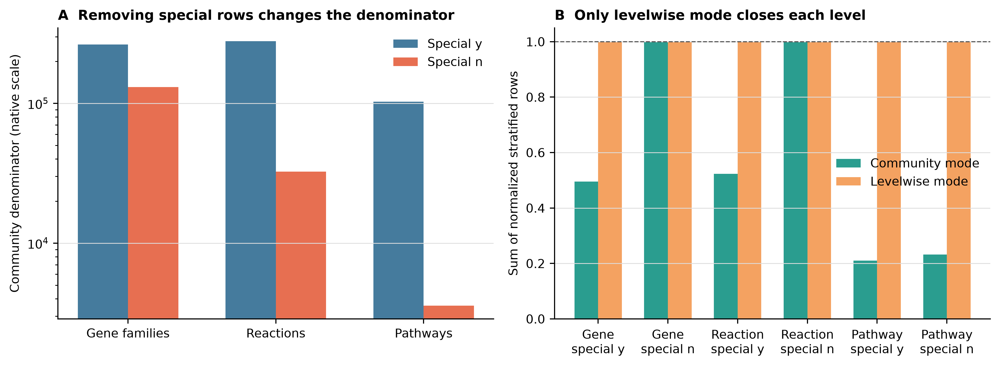
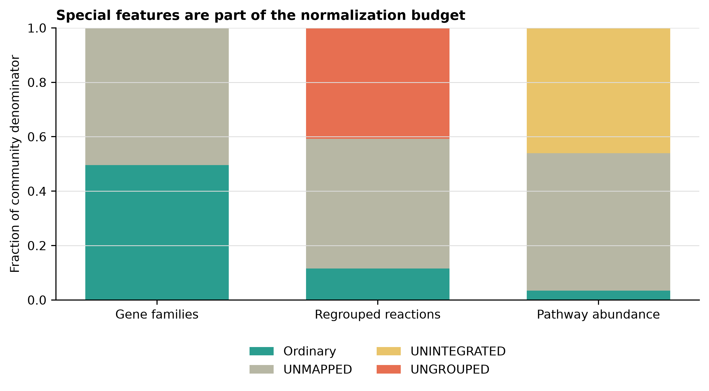
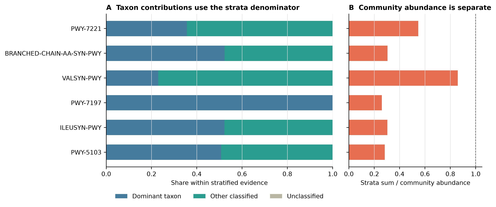
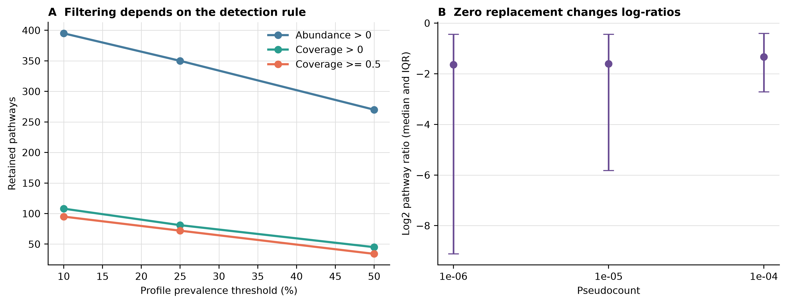

> **学习目标：**明确 CPM 与 relative abundance 只是同一 closure 的两种刻度；区分 `community` 与 `levelwise` 的分母；读懂 `UNMAPPED`、`UNGROUPED`、`UNINTEGRATED` 和 `unclassified`；正确计算物种对 pathway 的贡献；把 pathway coverage 留在 0–1 原生尺度；在真实多样本数据上预先审计 prevalence、zero 和 pseudocount。  
> **真实数据：**第一条证据线使用第 19 篇固化的 `ERR9765746_MOCK1` HUMAnN 3.9 native tables：99,991 个 clean read pairs、11,776 个 ordinary gene families、1,402 个 ordinary reactions、147 个 ordinary pathways。第二条证据线使用 `curatedMetagenomicData 3.12.0` 的 `AsnicarF_2017.pathway_abundance`（ExperimentHub `EH7089`）和 `pathway_coverage`（`EH7090`）：11,173 rows × 24 longitudinal profiles，来自 15 个 subjects [@asnicar2017transmission; @pasolli2017cmd]。  
> **预计资源：**从固化表复算建议 1–2 核、2 GB RAM、50 MB 可用空间，通常十几秒完成；四个代表性 `humann_renorm_table` 分支在本机不足 1 秒。只有从 FASTQ 重建第 19 篇功能谱时才需要约 64 GB RAM、200 GB SSD 和大型数据库。没有服务器时直接使用本文的 checksum-locked 小表即可。

## 这一步对应论文里的哪张图 {#sec-target}

### 它决定每一张 functional heatmap、stacked bar 和 association plot 的分母

bioBakery 3 把 gene family、taxonomic contribution、pathway abundance 和 pathway coverage 放入同一 functional-profiling 框架 [@beghini2021biobakery]。论文中的 pathway heatmap 或 taxon contribution bar 看起来像普通丰度图，真正决定可解释性的却是作图前没有画出来的四个选择：

1. 当前表是 gene family、reaction 还是 pathway feature space；
2. 数值是 native RPK-like、CPM、relative abundance 还是 coverage；
3. stratified rows 使用 community denominator 还是自己的 level denominator；
4. `UNMAPPED`、`UNGROUPED`、`UNINTEGRATED` 是否留在 denominator 中。

{#fig-20-denominators}

在本次 MOCK1 中，保留 special rows 时，gene-family、reaction、pathway community denominators 分别约为 263,561、279,240 和 102,782；删除 special rows 后分别只剩 130,580、32,446 和 3,568。删除后 ordinary features 当然会重新加和到 100%，但这只是**条件组成**变成 100%，不是“所有 reads 都获得了功能解释”。

{#fig-20-special-budget}

ordinary community value 在 gene family、reaction 和 pathway denominators 中分别只占 **49.54%**、**11.62%** 和 **3.47%**。reaction denominator 另含 40.76% `UNGROUPED`；pathway denominator 另含 46.07% `UNINTEGRATED`。这些比例适合审计功能表的解释边界，不可改写成 read mapping rate。

{#fig-20-contributions}

{#fig-20-prevalence-zero}

AsnicarF_2017 的 24 个 profiles 不是 24 个独立受试者，而是 15 个 subjects 的纵向采样。本文只用它演示多样本筛选和零值合同，不检验母婴、时间点或其他生物组差异。

## 理论：归一化其实是在声明分母 {#sec-theory}

### 1. CPM 与 relative abundance 的信息相同，刻度不同

对一个样本、一个选定 denominator (D)，feature (i) 的两种常见输出是：

\[
RA_i = \frac{x_i}{D}, \qquad
CPM_i = 10^6\frac{x_i}{D}.
\]

因此 `CPM = relative abundance × 1,000,000`。二者排序和比例信息完全相同；CPM 只是让很小的小数更易读。这里的 CPM 是 **copies per million** 的相对刻度，不是 raw read count、每细胞拷贝数、每克样本绝对量，也不是代谢通量。

### 2. `community` 与 `levelwise` 回答不同问题

HUMAnN 用 `|` 区分 stratification level：

- level 1：`PWY-7221`，community row；
- level 2：`PWY-7221|g__Thermotoga.s__Thermotoga_neapolitana`，taxon stratum。

设第 (l) 层所有 rows 的总量为 (D_l)。

- `--mode community`：所有层都除以 (D_1)。stratified rows 保留相对 community 的量级，level 2 不必加和到 1；
- `--mode levelwise`：第 (l) 层除以自己的 (D_l)。每层分别加和到 1，适合看层内组成，但不能再把 level-2 数值当作 community abundance。

如果目的是报告“某 pathway 的 taxon contribution”，最稳妥的写法是同时给两个量：

\[
Contribution_{i,s} = \frac{x_{i,s}}{\sum_s x_{i,s}},
\qquad
R_i = \frac{\sum_s x_{i,s}}{x_{i,community}}.
\]

第一个量在 stratified evidence 内闭合；第二个量把 strata 与 community reconstruction 的差距如实留下。不能先把 taxa 强行缩放到 community value，再声称它们是原始 pathway abundance。

### 3. `--special n` 是条件化，不是补全注释

HUMAnN 3.9 的 special base features 是：

- `UNMAPPED`：没有进入已知 gene-family evidence；
- `UNGROUPED`：gene-family evidence 未映射到目标 regroup feature space；
- `UNINTEGRATED`：功能证据没有进入 pathway reconstruction。

`--special n` 会删除这些 base rows 及其 stratified rows，然后用剩余 rows 重算 denominator。ordinary features 因而变大，但被删除的未知量没有消失，只是不再进入当前条件组成。

`unclassified` 完全不同：它是一个 taxonomic stratum，表示当前功能证据未归到特定已知 taxon。它不是 special feature，不能与 `UNMAPPED`、`UNGROUPED` 或 `UNINTEGRATED` 合并成一个“unknown”。

### 4. 三个 abundance feature spaces 必须分别闭合

| Feature space | Native value | Special rows | Denominator boundary |
|---|---|---|---|
| Gene families | RPK | `UNMAPPED` | UniRef90 gene-family space |
| Regrouped reactions | RPK regrouped by sum | `UNMAPPED`, `UNGROUPED` | MetaCyc reaction space；一对多 mapping 可扩大总量 |
| Pathway abundance | RPK-derived reconstruction | `UNMAPPED`, `UNINTEGRATED` | MetaCyc pathway reconstruction space |

正确顺序是 native gene-family RPK → reaction regroup → reaction 独立 renormalization。不能先把 gene families 变成 CPM，再 regroup 后沿用 gene-family denominator。pathway abundance 也有自己的 denominator，不能继承 reaction total。

### 5. Pathway coverage 不参与 closure

coverage 是每个 pathway 的 0–1 reaction-evidence score。它回答“该 pathway 的反应证据覆盖得多充分”，不回答“该 pathway 占总功能的多少”。因此：

- 不做 CPM；
- 不把一列 coverage 加和到 1；
- 不与 abundance 相加；
- 不用 `coverage = 1` 推断表达、活性或 flux；
- 不把 coverage 表中的 special sentinel 当作真实 pathway。

### 6. Zero、prevalence 与 pseudocount 是分析合同的一部分

功能表中的 0 最保守的含义是“当前 profile 中未检出”。它可能来自真实缺失、测序深度、数据库边界、算法阈值或 pathway reconstruction；仅凭一个 0 不能区分这些机制。

prevalence 还依赖 detection rule。本次 445 个 ordinary unstratified pathways，在 24 个 profiles 中要求 prevalence ≥25% 时：

| Detection rule | Retained pathways |
|---|---:|
| Abundance > 0 | 350 |
| Coverage > 0 | 81 |
| Coverage ≥ 0.5 | 72 |

三者都合法，但含义不同。阈值应在看结局关联前预先写入方案，并做 10%、25%、50% sensitivity，而不是挑一个最容易得到显著性的版本。

对含零的 log-ratio，pseudocount (c) 会进入：

\[
\log_2\frac{x_i+c}{x_j+c}.
\]

当 (x_i) 或 (x_j) 接近 0 时，结果可主要由 (c) 决定。因此至少报告一组有数量级差异的 (c)，或使用明确建模 zeros 的组成型方法；不要只展示“最好看”的一个值。

::: {.callout-important title="先写四句话，再开始统计"}
本分析使用哪个 feature space？保留哪些 special rows？使用 community 还是 levelwise denominator？zero 与 prevalence 如何定义？这四句话缺一项，functional association 的数值就无法复核。
:::

## 准备工作 {#sec-setup}

<details>
<summary><strong>展开：环境、真实数据、checksum 与内联作图函数</strong></summary>

### 资源门槛

| Stage | CPU | RAM | Disk | Typical time |
|---|---:|---:|---:|---:|
| 24 normalization branches | 1 | <1 GB | <20 MB | seconds |
| cMD RDA → aligned TSV export | 1 | <2 GB | <5 MB | seconds |
| Full audit + four 350-dpi figures | 1–2 | <2 GB | <50 MB | about 10 s |
| Rebuild HUMAnN from FASTQ | 8 | recommend 64 GB | recommend 200 GB SSD | see Article 19 evidence |

### 固定环境

```bash
mamba create \
  -p "${HOME}/miniconda3/envs/metagenome-biobakery-2026.07" \
  --file env/biobakery-linux-64.lock

BIOBAKERY_ENV_PREFIX="${HOME}/miniconda3/envs/metagenome-biobakery-2026.07"
bash env/relink-biobakery-entrypoints.sh "${BIOBAKERY_ENV_PREFIX}"
"${BIOBAKERY_ENV_PREFIX}/bin/humann" --version
```

真实队列导出需要 R 4.4.1、Bioconductor 3.19 与 `curatedMetagenomicData 3.12.0`。整仓库用户可按 `env/renv.lock` 恢复；只运行这一段也可显式安装：

```r
if (!requireNamespace("BiocManager", quietly = TRUE)) {
  install.packages("BiocManager", repos = "https://cloud.r-project.org")
}
BiocManager::install(
  c("curatedMetagenomicData", "digest"),
  version = "3.19",
  ask = FALSE,
  update = FALSE
)
install.packages(
  c("readr", "dplyr", "tidyr", "ggplot2", "scales"),
  repos = "https://cloud.r-project.org"
)
```

### 下载并锁定两个 cMD 资源

```bash
DOWNLOAD_ARTICLE20_CMD=1 bash data/download.sh

Rscript scripts/prepare_article20_cmd_pathways.R \
  --abundance-rda \
    data/raw/article20-cmd/AsnicarF_2017.pathway_abundance.rda \
  --coverage-rda \
    data/raw/article20-cmd/AsnicarF_2017.pathway_coverage.rda \
  --output-dir data/small/20-cmd-pathway

(cd data/small/20-cmd-pathway && \
  sha256sum -c file-checksums.sha256)

sha256sum \
  data/small/19-humann3-frozen/genefamilies-rpk.tsv \
  data/small/19-humann3-frozen/reactions-rpk.tsv \
  data/small/19-humann3-frozen/pathabundance-rpk.tsv \
  data/small/19-humann3-frozen/pathcoverage.tsv

(cd data/small/20-functional-normalization-frozen && \
  sha256sum -c file-checksums.sha256)
```

原始 payload 的固定指纹是：

| Resource | ExperimentHub | Bytes | SHA-256 |
|---|---|---:|---|
| `pathway_abundance` | EH7089 | 367,712 | `ead7c78c075fec92a7d641b731594e068b2ba2a47479151d081c338f615af121` |
| `pathway_coverage` | EH7090 | 262,967 | `73a1b77b70f88e9028e8707ba3e99b93f0ff99cd91401a3966c4f7a31dbfc3a1` |

两个 R objects 的 pathway ID 集合相同，但原始 row order 不同。导出脚本先按 pathway ID 对齐 coverage，再写表；直接按行号比较会产生静默错配。

### 内联出版级作图函数

```r
library(readr)
library(dplyr)
library(tidyr)
library(ggplot2)
library(scales)

set.seed(20260722)

pal_pub <- c(
  ordinary = "#2A9D8F",
  unmapped = "#B7B7A4",
  unintegrated = "#E9C46A",
  ungrouped = "#E76F51",
  community = "#457B9D",
  levelwise = "#F4A261"
)

scale_color_pub <- function(...) {
  scale_color_manual(values = pal_pub, ...)
}

scale_fill_pub <- function(...) {
  scale_fill_manual(values = pal_pub, ...)
}

theme_pub <- function(base_size = 10, base_family = "sans") {
  theme_classic(base_size = base_size, base_family = base_family) +
    theme(
      plot.title = element_text(face = "bold"),
      axis.title = element_text(color = "black"),
      axis.text = element_text(color = "black"),
      legend.title = element_blank(),
      panel.grid.major.y = element_line(color = "grey88", linewidth = 0.25)
    )
}

save_pub <- function(plot, stem, width, height) {
  ggsave(paste0(stem, ".pdf"), plot, width = width, height = height,
         units = "in", device = cairo_pdf)
  ggsave(paste0(stem, ".png"), plot, width = width, height = height,
         units = "in", dpi = 350, bg = "white")
  ggsave(paste0(stem, ".tiff"), plot, width = width, height = height,
         units = "in", dpi = 350, compression = "lzw", bg = "white")
}
```

</details>

## 可复制代码 {#sec-code}

### 1. 先验证输入，而不是相信文件名

```bash
(cd data/small/19-humann3-frozen && \
  sha256sum -c file-checksums.sha256)

(cd data/small/20-cmd-pathway && \
  sha256sum -c file-checksums.sha256)

column -t -s $'\t' \
  data/small/20-cmd-pathway/resource-manifest.tsv
head -n 5 data/small/20-cmd-pathway/sample-metadata.tsv
```

第一个 manifest 应有 34 个 payload；第二个应有 7 个 payload。metadata 的 24 个 `sample_id` 必须与 abundance 和 coverage 列顺序完全一致，`subject_id` 去重后为 15。
四个实际 renormalization 分支的清单位于 `data/small/20-functional-normalization-frozen/file-checksums.sha256`，其中路径按该目录解释。

### 2. 用真实 HUMAnN 3.9 跑四个代表性分支

```bash
export BIOBAKERY_ENV_PREFIX="${HOME}/miniconda3/envs/metagenome-biobakery-2026.07"
export PYTHONHASHSEED=0

bash scripts/run_article20_humann_normalization.sh

(cd data/small/20-functional-normalization-frozen && \
  sha256sum -c file-checksums.sha256)
```

该脚本从 native `pathabundance-rpk.tsv` 实际运行：

```bash
humann_renorm_table \
  --input pathabundance-rpk.tsv \
  --output pathabundance-relab-community-special-y.tsv \
  --units relab \
  --mode community \
  --special y
```

并将 `mode = community/levelwise` 与 `special = y/n` 的四种组合全部固化。独立 validator 不调用 HUMAnN 的内部函数，而是从 native values 重新计算 denominator；四张工具表与独立结果的最大相对误差为 `4.71e-6`，符合 HUMAnN 六位有效数字输出精度。

### 3. 展开全部 24 个分支

下面的命令完整覆盖三个 feature spaces、两个单位、两个 modes 和两个 special policies。每个输出独立命名，避免下游误读。

```bash
set -euo pipefail
renorm="${BIOBAKERY_ENV_PREFIX}/bin/humann_renorm_table"
input_dir="data/small/19-humann3-frozen"
work="${TMPDIR:-/tmp}/article20-renorm"
mkdir -p "${work}"

for item in \
  "gene:${input_dir}/genefamilies-rpk.tsv" \
  "reaction:${input_dir}/reactions-rpk.tsv" \
  "pathway:${input_dir}/pathabundance-rpk.tsv"; do
  label="${item%%:*}"
  table="${item#*:}"
  for unit in cpm relab; do
    for mode in community levelwise; do
      for special in y n; do
        "${renorm}" \
          --input "${table}" \
          --output \
            "${work}/${label}-${unit}-${mode}-special-${special}.tsv" \
          --units "${unit}" \
          --mode "${mode}" \
          --special "${special}"
      done
    done
  done
done
```

不要把 `pathcoverage.tsv` 放入这个循环。coverage 没有合法的 `cpm` 或 `relab` 分支。

### 4. 一次运行全部离线审计与作图

```bash
"${BIOBAKERY_ENV_PREFIX}/bin/python" \
  scripts/validate_article20_functional_normalization.py \
  --project-root "$PWD" \
  --environment-prefix "${BIOBAKERY_ENV_PREFIX}" \
  --article19-dir data/small/19-humann3-frozen \
  --cohort-dir data/small/20-cmd-pathway \
  --frozen-dir data/small/20-functional-normalization-frozen \
  --output-dir results/20-functional-normalization \
  --figure-dir figures
```

运行成功时，`validation-summary.json` 的关键字段为：

```json
{
  "status": "passed",
  "normalization_branches": 24,
  "normalization_closure_failures": 0,
  "actual_renorm_outputs_verified": 4,
  "coverage_out_of_range": 0,
  "cohort_pathway_rows": 11173,
  "cohort_samples": 24,
  "cohort_subjects": 15,
  "biological_group_tests": 0
}
```

### 5. 从审计表读出 denominator，而不是凭感觉解释

```r
feature_space <- read_tsv(
  "results/20-functional-normalization/feature-space-audit.tsv",
  show_col_types = FALSE
)
branches <- read_tsv(
  "results/20-functional-normalization/normalization-branch-audit.tsv",
  show_col_types = FALSE
)
special <- read_tsv(
  "results/20-functional-normalization/special-feature-audit.tsv",
  show_col_types = FALSE
)

feature_space |>
  select(
    FeatureSpace,
    OrdinaryCommunityFeatures,
    CommunityTotalWithSpecial,
    CommunityTotalWithoutSpecial,
    CanAddStrataToCommunity
  )

branches |>
  filter(Unit == "relab") |>
  select(
    FeatureSpace, Mode, Special,
    CommunityDenominator, StrataDenominator,
    CommunityOutputSum, StrataOutputSum,
    ClosureFailures, ActualToolVerified
  )

special |>
  filter(NativeValue > 0)
```

### 6. 在真实队列中比较 prevalence definitions

```r
abundance <- read_tsv(
  "data/small/20-cmd-pathway/pathway-abundance.tsv.gz",
  show_col_types = FALSE
)
coverage <- read_tsv(
  "data/small/20-cmd-pathway/pathway-coverage.tsv.gz",
  show_col_types = FALSE
)
metadata <- read_tsv(
  "data/small/20-cmd-pathway/sample-metadata.tsv",
  show_col_types = FALSE
)

stopifnot(
  identical(abundance$Pathway, coverage$Pathway),
  identical(names(abundance)[-1], metadata$sample_id),
  identical(names(coverage)[-1], metadata$sample_id),
  n_distinct(metadata$subject_id) == 15
)

ordinary <- !grepl("\\|", abundance$Pathway) &
  !sub(": .*", "", abundance$Pathway) %in%
    c("UNMAPPED", "UNINTEGRATED", "UNGROUPED")

abundance_matrix <- as.matrix(abundance[ordinary, -1])
coverage_matrix <- as.matrix(coverage[ordinary, -1])
storage.mode(abundance_matrix) <- "double"
storage.mode(coverage_matrix) <- "double"

prevalence_count <- function(detected, threshold) {
  sum(rowMeans(detected) >= threshold)
}

bind_rows(lapply(c(0.10, 0.25, 0.50), function(threshold) {
  tibble(
    `Prevalence threshold` = threshold,
    `Abundance > 0` = prevalence_count(
      abundance_matrix > 0, threshold
    ),
    `Coverage > 0` = prevalence_count(
      coverage_matrix > 0, threshold
    ),
    `Coverage >= 0.5` = prevalence_count(
      coverage_matrix >= 0.5, threshold
    )
  )
}))
```

若 analysis unit 是 subject，应先在同一 `subject_id` 的 visits 内按预注册规则合并 detection，再算 subject prevalence。本文同时输出 `Profile` 与 `Subject (any visit)` 两套 sensitivity，主图只展示 profile-level 结果，不把它用于显著性检验。

### 7. 把 pseudocount 当作 sensitivity parameter

validator 用确定性规则选出一个较稀疏 numerator `PWY-7237`（15/24 profiles 为 0）和一个更常见 denominator `PWY-7111`（6/24 profiles 为 0），再比较三种 pseudocount：

```r
zero_audit <- read_tsv(
  "results/20-functional-normalization/zero-pseudocount-audit.tsv",
  show_col_types = FALSE
)

zero_audit |>
  select(
    NumeratorPathway,
    DenominatorPathway,
    Pseudocount,
    MedianLog2Ratio,
    RangeLog2Ratio
  )
```

这一步是方法敏感性示范，不是为 `PWY-7237` 或 `PWY-7111` 提出生物学假设。换成自己的 primary features 时，应在查看 phenotype association 前固定 feature selection 与 pseudocount grid。

## 审计与升级：把“标准化表”升级成可复核分析对象 {#sec-audit}

### 1. 保存 native table，并把每个派生表写进文件名

最少保留：native unit、feature space、mode、special policy、tool/database release 和 parent-table checksum。`pathway_relab.tsv` 这种名字不够；`pathway-relab-community-special-y.tsv` 才能让未来的自己知道 denominator。

### 2. Special rows 先报告，再决定是否排除

本次 special rows 占比很高，尤其 pathway ordinary fraction 仅 3.47%。这是一个工业 mock、固定数据库和 pathway reconstruction 的实例，不是 universal benchmark；但它清楚说明：先删除 special rows，再只展示 ordinary 100% stacked bar，会隐藏绝大部分原 denominator。

推荐同时保存两张表：

- `special y`：用于 QC、跨样本检查 annotation budget；
- `special n`：在明确写成 “among retained ordinary features” 后用于某些组成图或模型。

不能只保存第二张。

### 3. Taxon contribution 与 community abundance 分两列报告

gene-family/reaction strata 可做加和 QA；pathway abundance 不可沿用这条恒等式。本次六个高丰度 pathways 的 `strata/community` 只有 0.26–0.86。投稿表应给 `ShareWithinStratifiedEvidence` 和 `StrataToCommunityRatio`，不要把第一个乘回 community 后冒充 HUMAnN 原始 taxon abundance。

### 4. Abundance、coverage 与 detection rule 做敏感性矩阵

在真实 24-profile 数据中，25% prevalence 下 `abundance > 0` 保留 350 个 pathways，而 `coverage > 0` 只保留 81 个。coverage 更严格并不等于更“正确”；它回答的是另一种 evidence question。分析计划应说明哪个量用于 primary test，另一个量是支持性证据还是 sensitivity branch。

### 5. 重复测量不能当独立样本

AsnicarF_2017 的 24 个 profiles 对应 15 个 subjects。若进入纵向或母婴分析，至少需要 subject/family random effect、配对结构或 subject-level summary；普通两组检验会低估不确定性。本文将 `biological_group_tests` 固定为 0，防止方法示范被误读成生物结论。

### 6. 数据库升级等于 measurement batch 变化

UniRef、MetaCyc、HUMAnN mapping 或 taxonomic prescreen release 变化，会改变 feature IDs、special budget、strata 和 pathway reconstruction。升级后至少重跑固定 sentinel sample，并比较：

- ordinary/special totals；
- feature counts 与 ID overlap；
- community/strata relationship；
- prevalence retention；
- primary feature effect direction。

不能仅凭软件命令相同就把两个数据库 release 的表直接拼接。

::: {.callout-warning title="最危险的漂亮图"}
删除 special rows、做 levelwise closure、再画 100% stacked taxon bars，几乎一定很整齐；但它同时隐藏了 annotation budget、改变了 denominator，并切断了与 community abundance 的量级关系。图可以画，图注必须明确写 “composition within retained stratified evidence”。
:::

## 出版级美化 {#sec-polish}

图内一律使用英文。denominator 图用 log 轴展示数量级，不能截断 y 轴放大小差异；special budget 用固定顺序 `Ordinary → UNMAPPED → UNINTEGRATED → UNGROUPED`；contribution 图把 `Unclassified` 保留在 legend，即使选中的 pathways 中为 0；coverage 的坐标始终固定在 0–1。

```r
prevalence <- read_tsv(
  "results/20-functional-normalization/prevalence-filter-audit.tsv",
  show_col_types = FALSE
) |>
  filter(AnalysisUnit == "Profile")

p <- ggplot(
  prevalence,
  aes(
    x = PrevalenceThreshold * 100,
    y = RetainedPathways,
    color = DetectionRule
  )
) +
  geom_line(linewidth = 0.9) +
  geom_point(size = 2.4) +
  scale_color_manual(values = c(
    "Abundance > 0" = "#457B9D",
    "Coverage > 0" = "#2A9D8F",
    "Coverage >= 0.5" = "#E76F51"
  )) +
  scale_x_continuous(breaks = c(10, 25, 50)) +
  labs(
    x = "Profile prevalence threshold (%)",
    y = "Retained pathways",
    title = "Filtering depends on the detection rule"
  ) +
  theme_pub()

save_pub(
  p,
  "figures/my-pathway-prevalence-sensitivity",
  width = 6.8,
  height = 4.5
)
```

## 常见坑 {#sec-pitfalls}

::: {.callout-caution title="坑 1：把 CPM 写成 reads per million"}
HUMAnN 这里的 CPM 从 length-normalized abundance closure 得到，不是 FASTQ read ledger。read fate 应回到 mapping logs；不要用 CPM 反推 reads。
:::

::: {.callout-caution title="坑 2：先 CPM，再做 reaction regroup"}
UniRef90→reaction 可一对多展开。必须从 native gene-family RPK regroup，然后在 reaction feature space 单独 renormalize。
:::

::: {.callout-caution title="坑 3：混用 community 与 levelwise"}
levelwise 的 taxon strata 加和为 1，不再保留 community 量级。不能把它和 community-mode samples 拼成同一个矩阵。
:::

::: {.callout-caution title="坑 4：删 special rows 后声称注释率 100%"}
100% 只是 ordinary retained features 的条件组成。原 special budget 必须另表报告。
:::

::: {.callout-caution title="坑 5：把 unclassified 当成 UNMAPPED"}
`unclassified` 是 taxon stratum；`UNMAPPED` 是 functional special feature。两者处在不同轴上，不能合并。
:::

::: {.callout-caution title="坑 6：强迫 pathway taxa 加回 community"}
pathways 在 community 与各 taxa 内分别重建。先算 within-strata contribution，再另报 strata/community ratio。
:::

::: {.callout-caution title="坑 7：对 coverage 做 relative abundance"}
coverage 是逐 pathway 的 0–1 evidence score，没有列和约束。归一化会破坏其原始含义。
:::

::: {.callout-caution title="坑 8：把 0 当成生物学缺失"}
0 只能写成当前 pipeline/profile 未检出。数据库、深度、threshold 与 reconstruction 都可能造成 0。
:::

::: {.callout-caution title="坑 9：看到结果后再挑 prevalence 或 pseudocount"}
这相当于隐性多重尝试。先预注册 primary choice，再报告固定 sensitivity grid。
:::

::: {.callout-caution title="坑 10：把 24 profiles 当成 24 个独立 subjects"}
当前真实资源只有 15 个 subjects。若做推断，模型必须保留纵向、家庭或配对结构。
:::

## 这段 Methods 怎么写 {#sec-methods}

> Functional normalization was audited using checksum-locked HUMAnN v3.9 outputs from the ERR9765746 71-strain MOCK1 profile generated from 99,991 synchronized quality-controlled read pairs. Native gene-family RPKs, MetaCyc reaction abundances regrouped by sum from native gene-family RPKs, and RPK-derived MetaCyc pathway abundances were treated as three separate feature spaces. Within each feature space, copies per million and relative-abundance tables were generated with `humann_renorm_table` under both community and levelwise modes and with special features either retained or excluded, yielding 24 prespecified branches. Community mode used the unstratified level-1 total for all rows, whereas levelwise mode normalized each stratification level independently. Exclusion of `UNMAPPED`, `UNINTEGRATED`, and `UNGROUPED` removed the corresponding base features and strata before recomputing the denominator; resulting sums were interpreted as compositions conditional on retained ordinary features and not as read-level annotation rates. Four pathway relative-abundance branches were executed directly with HUMAnN v3.9 and matched an independent denominator implementation with a maximum relative discrepancy of (4.71\times10^{-6}), consistent with six-significant-digit output formatting. Taxonomic pathway contributions were normalized only within the observed stratified evidence, while the ratio of stratified abundance sum to the separately reconstructed community abundance was reported without enforcing additivity. Pathway coverage remained on its native 0–1 evidence scale and was not renormalized.
>
> Prevalence and zero-value sensitivity analyses used curatedMetagenomicData v3.12.0 resources EH7089 (`AsnicarF_2017.pathway_abundance`) and EH7090 (`AsnicarF_2017.pathway_coverage`), whose raw SHA-256 checksums were `ead7c78c075fec92a7d641b731594e068b2ba2a47479151d081c338f615af121` and `73a1b77b70f88e9028e8707ba3e99b93f0ff99cd91401a3966c4f7a31dbfc3a1`, respectively. Pathway identifiers and the 24 sample identifiers were explicitly aligned across matrices and metadata; the profiles represented 15 subjects. Analyses were restricted to 445 unstratified ordinary pathways. Retention was compared at 10%, 25%, and 50% prevalence using three prespecified detection definitions: abundance (>0), coverage (>0), and coverage (ge0.5). Log-ratio sensitivity was evaluated using pseudocounts (10^{-6}), (10^{-5}), and (10^{-4}). No biological group-comparison test was performed. All random-state hooks were fixed to seed 20260722, routine QA was network-free, and figures were exported as PDF, PNG, and 350-dpi LZW-compressed TIFF files.

补充材料还应给出：

- native tables 与所有派生 tables 的 checksum；
- feature space、unit、mode、special policy 的完整 24-branch manifest；
- special-row abundance 与 fraction；
- community/strata relationship 和 contribution denominator；
- coverage 的原生范围检查；
- prevalence definition、analysis unit、threshold grid；
- zero definition、pseudocount grid 与 sensitivity results；
- subject/repeated-measure structure；
- software、UniRef、MetaCyc 与 cMD resource versions。

## 换成你自己的数据怎么做 {#sec-own-data}

### 最少需要什么

1. 每个样本的 native HUMAnN gene-family、pathway-abundance 与 pathway-coverage tables；
2. 若需要 reaction space，使用同一 mapping release 从 native gene-family RPK 统一 regroup；
3. sample metadata，至少含 `sample_id`、`subject_id`、group、batch 与关键 covariates；
4. 每个 software/database release 的版本和 checksum；
5. 预先定义的 feature space、special policy、normalization、prevalence、zero 与 primary endpoint。

### 合并队列前先统一合同

```bash
humann_join_tables \
  --input humann_outputs \
  --file_name pathabundance \
  --output cohort-pathabundance-native.tsv

humann_renorm_table \
  --input cohort-pathabundance-native.tsv \
  --output cohort-pathabundance-relab-community-special-y.tsv \
  --units relab \
  --mode community \
  --special y
```

gene family、reaction、pathway abundance 与 coverage 分别 join；不要纵向堆成一张“功能总表”。若各样本来自不同 HUMAnN/database releases，先将其标成 measurement batches，比较 feature-ID overlap 和 sentinel sample，不要直接补零后合并。

### 推荐的分析前决策表

| Decision | Primary choice example | Required sensitivity |
|---|---|---|
| Feature space | Pathway abundance | Gene family or reaction only if biologically justified |
| Special policy | Retain for QC; exclude for ordinary-feature model | Report both denominators |
| Normalization | Community relative abundance | Explicit compositional model / alternative scale |
| Prevalence | Abundance > 0 in ≥25% profiles | 10% and 50%; subject-level if repeated |
| Zero handling | Prespecified model or pseudocount | At least two orders of magnitude |
| Repeated measures | Subject-aware model | Subject-level summary |

::: {.callout-tip title="把 denominator 写进结果对象"}
每张结果表至少增加 `feature_space`、`native_unit`、`renorm_unit`、`mode`、`special_policy`、`software_release`、`database_release` 和 `parent_sha256`。这样换人、换机器或半年后重跑时，仍能判断两张表是否可比较。
:::

## 参考 {#sec-references}

- bioBakery 3 与 HUMAnN functional profiling：[@beghini2021biobakery]；[HUMAnN 官方手册](https://github.com/biobakery/humann/blob/master/readme.md)。
- UniRef 与 MetaCyc 数据库：[@suzek2007uniref; @caspi2023metacyc]。
- curatedMetagenomicData 资源与处理：[@pasolli2017cmd]；[官方 pipeline 文档](https://waldronlab.io/curatedMetagenomicDataAnalyses/articles/pipeline.html)。
- AsnicarF_2017 纵向母婴队列：[@asnicar2017transmission]。
- 组成型数据解释边界：Gloor GB 等，*Microbiome datasets are compositional: and this is not optional*，Frontiers in Microbiology，2017，doi: [10.3389/fmicb.2017.02224](https://doi.org/10.3389/fmicb.2017.02224)。
