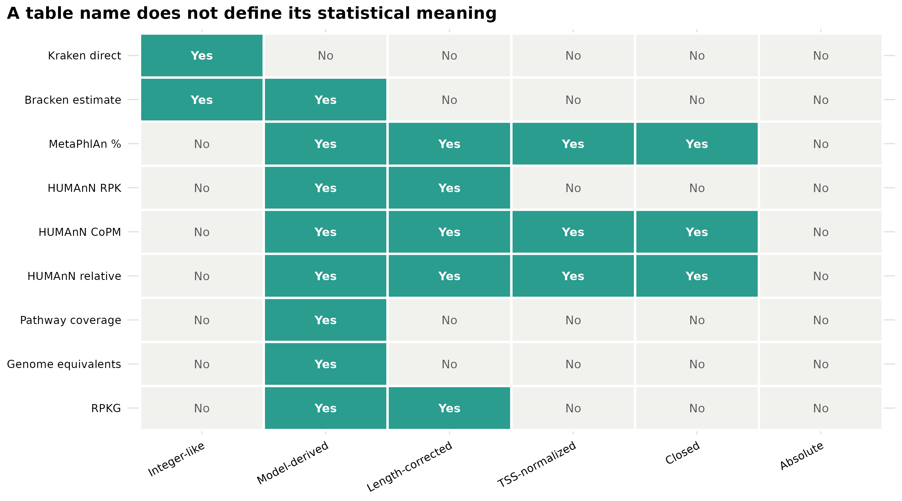
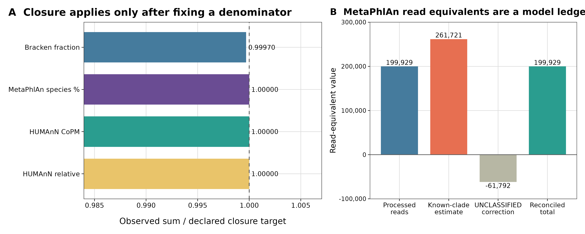
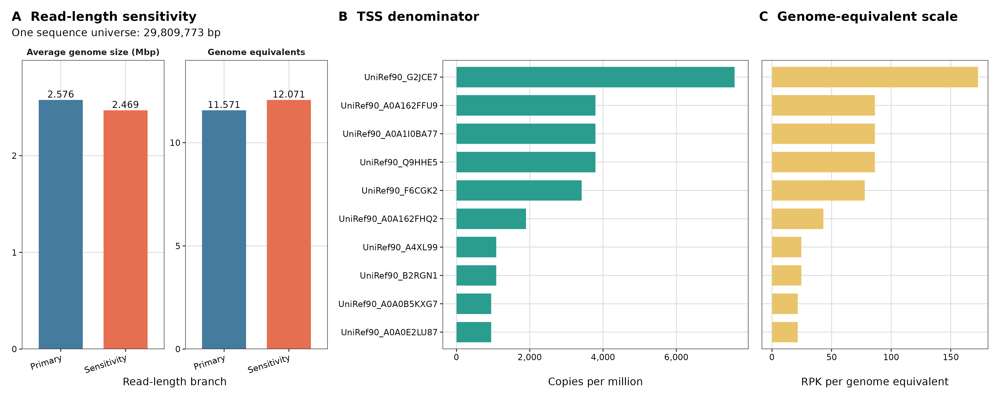
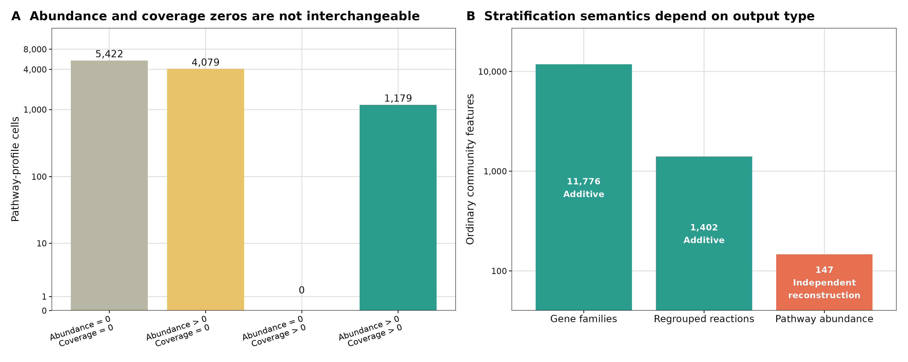

> **学习目标：**拿到任意宏基因组表时，先写清 measurement object、feature space、correction、denominator、closure 和 zero，再决定能否求和、归一化、取对数、做 count model 或跨样本比较；区分 observed counts、model-estimated counts、RPK、CoPM、relative abundance、coverage、genome equivalents 与 RPKG。  
> **真实数据：**分类证据来自同一份 <code>ERR9765746_MOCK1</code> clean library 的 MetaPhlAn 4.2.5 与 Kraken2 2.17.1 / Bracken 3.1p1 固化输出；功能证据来自同一文库的 HUMAnN 3.9，以及 curatedMetagenomicData 3.12.0 的 <code>AsnicarF_2017</code> pathway abundance / coverage 24 profiles。genome-equivalent 标尺使用 MicrobeCensus tag v1.1.1 的真实运行结果。  
> **预计资源：**读取 checksum-locked 小表、重算全部账本并生成四张图，普通笔记本用 1–2 核、低于 2 GB RAM 和 50 MB 空间即可。MicrobeCensus 的两个一次性分支实测分别用时 49.73 s / 37.67 s，最大 RSS 约 625 / 583 MiB；从 FASTQ 重建 MetaPhlAn、Kraken2 或 HUMAnN 仍需对应数据库和服务器资源。

## 这一步对应论文里的哪张图 {#sec-target}

### 它不是某一张结果图，而是所有 abundance 图之前的测量合同

MicrobeCensus 论文用 average genome size（AGS）校正宏基因组之间的基因丰度比较，并把 genome equivalents 定义为总测序碱基数除以估计 AGS [@nayfach2015microbecensus]。MetaPhlAn 4 用 clade-specific marker 与基因组模型估计分类组成 [@blancomiguez2023metaphlan4]；Bracken 再分配 Kraken 分类证据得到 rank-specific abundance estimate [@lu2017bracken]；HUMAnN 则输出 gene-family RPK、CoPM、relative abundance、pathway abundance 与 pathway coverage [@beghini2021biobakery]。这些数都能出现在纵轴上，却不是同一种随机变量。

{#fig-21-unit-map}

{#fig-21-closure}

{#fig-21-ge}

{#fig-21-zero-strata}

这四张图给出一个实用顺序：**先识别数是什么，再识别除过什么，最后才选择统计方法。** 整数外观不能证明它是 raw count；列和等于 1 也不能证明它是绝对量；不闭合到 1 更不等于结果错误。

## 理论：一张表至少要回答六个问题 {#sec-theory}

### 1. Measurement object：每个数在数什么

先把“count”拆成三类：

1. **Observed event count：**例如 Kraken report 中某节点的 direct paired-fragment assignments。它仍受数据库与分类规则影响，但每个整数对应一次离散分配事件。
2. **Redistributed estimate：**Bracken 的 <code>new_est_reads</code> 等于 <code>kraken_assigned_reads + added_reads</code>。整数化以后看起来像 raw counts，实质包含数据库与 read-length 模型重新分配的质量。
3. **Model-derived read equivalent：**MetaPhlAn 的 <code>estimated_number_of_reads_from_the_clade</code> 来自 marker、coverage 与 genome-size 模型。不同 clades 的估计可以先超过 processed reads，再用 UNCLASSIFIED correction 对账；它不能回写成 read-level event。

因此“能不能用负二项 count model”不是看文件里有没有整数列，而是看生成机制、重复样本、library-size offset 和估计不确定性是否与模型假设相容。

### 2. Feature space：行是否能相加

同一 taxonomy report 里的 kingdom、phylum、genus 与 species 是嵌套层级；把所有等级一起求和会重复计算。closure 只能在固定 rank 内检查。功能表也一样：UniRef90 gene families、MetaCyc reactions 与 pathways 是不同 feature spaces，不能拼成一个矩阵后共同归一化。

HUMAnN stratified rows还要分两种关系：

- gene-family 与 regrouped-reaction community values 可在数值误差内等于各 taxa strata 之和；
- pathway community abundance 与 taxon-specific pathway abundance 是分别重建的结果。本次 147 个 ordinary pathways 全部保留非加和差异，不能用比例缩放把它们伪造成守恒。

### 3. Correction：数值已经校正过什么

设 feature \(i\) 的 alignment-derived quantity 为 \(n_i\)，参考长度为 \(L_i\) kb。概念上的 length correction 是

\[
RPK_i = \frac{n_i}{L_i}.
\]

HUMAnN native gene-family table已经提供 RPK-like value；不要再除一次基因长度。MetaPhlAn 的相对丰度已经包含 marker 与 genome 模型；也不能把百分比乘 processed reads 后称为原始 read counts。

### 4. Denominator 与 closure：除数是什么

对选定的 community gene-family RPK denominator \(D=\sum_j RPK_j\)：

\[
CoPM_i = 10^6\frac{RPK_i}{D},
\qquad
RA_i = \frac{RPK_i}{D}.
\]

HUMAnN 文档中的 CPM 是 **copies per million（CoPM）**，不是 raw counts per million。本文真实表中 community gene-family CoPM 总和为 999,999.97064，relative abundance 总和为 0.99999997064，逐行满足 <code>CoPM = relative abundance × 1e6</code>，最大误差低于 \(10^{-12}\)。

closure 总是相对于一个声明的 denominator：

- Bracken <code>fraction_total_reads</code> 在输出 species estimates 内约闭合到 1；
- MetaPhlAn relative abundance 在固定 species rank 内闭合到 100；
- HUMAnN CoPM / relative abundance 在所选 feature level 与 special-row policy 下闭合；
- pathway coverage 没有列和目标，不应做 TSS。

### 5. Coverage：0–1 证据分数不是组成

HUMAnN pathway coverage 是 pathway reaction evidence 的 0–1 score。不同 pathways 的 coverage 可同时接近 1，所以一列 coverage 的总和没有“总功能量”含义。本次 MOCK1 的 147 个 ordinary community pathways coverage 合计 45.417；这不是 closure 失败。

abundance 与 coverage 的 zero 也不同。AsnicarF_2017 的 445 × 24 ordinary cells 中：

| Abundance state | Coverage state | Cells | 保守解释 |
|---|---|---:|---|
| 0 | 0 | 5,422 | 两类 pipeline evidence 均未检出 |
| >0 | 0 | 4,079 | 有 abundance reconstruction，但 coverage evidence 为 0 |
| 0 | >0 | 0 | 本数据中未出现，不能推广为永不出现 |
| >0 | >0 | 1,179 | 两类 evidence 均检出 |

任何一种 zero 都不能单独证明生物学缺失；它还可能来自深度、数据库、阈值、feature reconstruction 或样本处理。

### 6. Genome equivalents：测序覆盖标尺，不是细胞计数

MicrobeCensus 用保守单拷贝 marker 的覆盖估计 average genome size。对同一份 clean sequence universe：

\[
GE = \frac{\text{total sequenced bp}}{\widehat{AGS}},
\qquad
RPKG_i = \frac{RPK_i}{GE}.
\]

本次 150 bp 主分支得到 \(\widehat{AGS}=2{,}576{,}205.26\) bp，因而

\[
GE=\frac{29{,}809{,}773}{2{,}576{,}205.26}=11.5711948566.
\]

这表示该文库含约 11.57 个“平均微生物基因组深度”等价的序列量，不是 11.57 个 cells、organisms、genomes per gram、biomass 或 absolute concentration。要做真正绝对定量，仍需 spike-in、flow cytometry、qPCR/ddPCR 或其他外部定量参照。

::: {.callout-important title="把六列 data dictionary 写进分析方案"}
每个输入表至少记录：measurement object、feature space、native unit、correction、denominator、closure target 与 zero meaning。若其中任意一项写不清，先回到工具文档和原始输出，不要直接进入差异分析。
:::

## 准备工作 {#sec-setup}

<details>
<summary><strong>展开：环境、真实数据、checksum、MicrobeCensus 一次性运行与内联作图函数</strong></summary>

### 资源门槛

| Stage | CPU | RAM | Disk | Observed / expected time |
|---|---:|---:|---:|---:|
| Frozen-table checksum + audit | 1–2 | <2 GB | <50 MB | seconds |
| Four R figures | 1–2 | <2 GB | <50 MB | usually <1 min |
| MicrobeCensus 150 bp branch | 8 | 625 MiB max RSS | temporary files <1 GB | 49.73 s observed |
| MicrobeCensus 100 bp sensitivity | 8 | 583 MiB max RSS | temporary files <1 GB | 37.67 s observed |
| Rebuild profiling from FASTQ | 8–16 | tool/database dependent | tens to hundreds of GB | see the profiling chapters |

没有服务器时，从本文随仓库提供的 checksum-locked 表格开始即可。MicrobeCensus 运行只负责建立一次性校准证据；常规渲染和 QA 不读取 FASTQ、不下载数据库、也不访问网络。

### R 环境

整仓库可用 <code>env/renv.lock</code> 恢复 R 4.4.1 / Bioconductor 3.19。只运行本文可显式安装：

```{r}
#| eval: false
install.packages(
  c("digest", "readr", "dplyr", "tidyr", "ggplot2", "scales", "patchwork"),
  repos = "https://cloud.r-project.org"
)
```

### 校验六组固化输入

```{bash}
(cd data/small/13-qc-frozen && sha256sum -c file-checksums.sha256)
(cd data/small/15-metaphlan-frozen && sha256sum -c file-checksums.sha256)
(cd data/small/16-kraken-bracken-frozen && sha256sum -c file-checksums.sha256)
(cd data/small/19-humann3-frozen && sha256sum -c file-checksums.sha256)
(cd data/small/20-cmd-pathway && sha256sum -c file-checksums.sha256)
(cd data/small/21-table-semantics-frozen && sha256sum -c file-checksums.sha256)
```

### 一次性重跑 MicrobeCensus

先取得第 13 篇生成的两份 clean FASTQ；其 SHA-256 必须分别为
<code>ce438de2814a6e605cc24b00e53b697d018f325bc2a9694cece5be158ff32101</code> 和
<code>207d080cd5dc98bd10fd4af8c492fb3f2000f73e1458a9d1d77e57347f4fe459</code>。然后固定官方源码：

```{bash}
#| eval: false
mamba create \
  -p "$HOME/miniconda3/envs/metagenome-biobakery-2026.07" \
  --file env/biobakery-linux-64.lock

git clone https://github.com/snayfach/MicrobeCensus.git \
  data/raw/article21/MicrobeCensus

git -C data/raw/article21/MicrobeCensus checkout v1.1.1
test "$(git -C data/raw/article21/MicrobeCensus rev-parse HEAD)" = \
  "dfc42d356bfd7943633cde6c0fbfc0b116f29ae2"

export MICROBECENSUS_ROOT="$PWD/data/raw/article21/MicrobeCensus"
export BIOBAKERY_ENV_PREFIX="$HOME/miniconda3/envs/metagenome-biobakery-2026.07"
bash scripts/run_article21_microbecensus.sh
```

tag v1.1.1 源码内部仍报告 version 1.1.0；该上游不一致被原样保留。Python 3 wrapper 只把 RAPsearch2 2.15 preflight 的 bytes 解码为 text，marker data、alignment command、threshold、weight、AGS 估计与 total-base 计算均调用固定 commit 的上游实现。主分支用 150 bp，敏感性分支用 100 bp；<code>nreads=100000000</code> 只是让这个 199,982-read 小文库不被顺序截断，并不制造额外 reads。

### 内联出版级作图函数

```{r}
library(digest)
library(readr)
library(dplyr)
library(tidyr)
library(ggplot2)
library(scales)
library(patchwork)

set.seed(20260722)

pal_pub <- c(
  blue = "#457B9D",
  orange = "#E76F51",
  teal = "#2A9D8F",
  gold = "#E9C46A",
  purple = "#6A4C93",
  grey = "#B7B7A4"
)

scale_color_pub <- function(...) {
  ggplot2::scale_color_manual(values = pal_pub, ...)
}

scale_fill_pub <- function(...) {
  ggplot2::scale_fill_manual(values = pal_pub, ...)
}

theme_pub <- function(base_size = 11) {
  ggplot2::theme_bw(base_size = base_size, base_family = "sans") +
    ggplot2::theme(
      panel.grid.minor = ggplot2::element_blank(),
      panel.grid.major = ggplot2::element_line(
        color = "#DDDDDD",
        linewidth = 0.35
      ),
      axis.text = ggplot2::element_text(color = "black"),
      axis.ticks = ggplot2::element_line(color = "black", linewidth = 0.3),
      strip.background = ggplot2::element_blank(),
      strip.text = ggplot2::element_text(face = "bold"),
      legend.key = ggplot2::element_blank(),
      plot.title.position = "plot",
      plot.title = ggplot2::element_text(face = "bold")
    )
}

save_pub <- function(
  plot,
  file_base,
  width = 260,
  height = 115,
  units = "mm",
  dpi = 350
) {
  dir.create(dirname(file_base), recursive = TRUE, showWarnings = FALSE)
  ggplot2::ggsave(
    paste0(file_base, ".pdf"),
    plot,
    width = width,
    height = height,
    units = units,
    device = grDevices::cairo_pdf
  )
  ggplot2::ggsave(
    paste0(file_base, ".png"),
    plot,
    width = width,
    height = height,
    units = units,
    dpi = dpi,
    bg = "white"
  )
  ggplot2::ggsave(
    paste0(file_base, ".tiff"),
    plot,
    width = width,
    height = height,
    units = units,
    dpi = dpi,
    compression = "lzw",
    bg = "white"
  )
  invisible(plot)
}
```

</details>

## 可复制代码：从表头重建统计语义 {#sec-code}

### 第 1 步：先验 checksum，再读数据

```{r}
verify_sha256_manifest <- function(directory) {
  manifest <- file.path(directory, "file-checksums.sha256")
  lines <- readLines(manifest, warn = FALSE)
  lines <- lines[nzchar(lines) & !startsWith(lines, "#")]

  expected <- sub("[[:space:]].*$", "", lines)
  relative <- sub("^[0-9a-f]{64}[[:space:]]+[*]?", "", lines)
  paths <- file.path(directory, relative)
  stopifnot(all(file.exists(paths)))

  observed <- vapply(
    paths,
    function(path) digest::digest(file = path, algo = "sha256"),
    character(1)
  )
  stopifnot(identical(unname(observed), expected))
  length(lines)
}

input_dirs <- c(
  article13 = "data/small/13-qc-frozen",
  article15 = "data/small/15-metaphlan-frozen",
  article16 = "data/small/16-kraken-bracken-frozen",
  article19 = "data/small/19-humann3-frozen",
  cohort = "data/small/20-cmd-pathway",
  article21 = "data/small/21-table-semantics-frozen"
)

checksum_entries <- vapply(
  input_dirs,
  verify_sha256_manifest,
  integer(1)
)

checksum_entries
stopifnot(identical(
  unname(checksum_entries),
  c(57L, 23L, 33L, 34L, 7L, 9L)
))
```

### 第 2 步：用各工具的原生列名读取，不先改成统一的 abundance

```{r}
read_metaphlan <- function(path) {
  lines <- readLines(path, warn = FALSE)
  header_index <- grep("^#clade_name\t", lines)
  stopifnot(length(header_index) == 1L)
  payload <- c(
    sub("^#", "", lines[header_index]),
    lines[(header_index + 1L):length(lines)]
  )
  con <- textConnection(payload)
  on.exit(close(con))
  read.delim(
    con,
    check.names = FALSE,
    stringsAsFactors = FALSE,
    quote = ""
  )
}

read_humann <- function(path) {
  tab <- read.delim(
    path,
    check.names = FALSE,
    stringsAsFactors = FALSE,
    comment.char = "",
    quote = ""
  )
  stopifnot(ncol(tab) == 2L)
  names(tab) <- c("Feature", "Value")
  tab$Value <- as.numeric(tab$Value)
  tab
}

bracken <- read.delim(
  "data/small/16-kraken-bracken-frozen/bracken-species-r150-t10.tsv",
  check.names = FALSE
)
metaphlan <- read_metaphlan(
  "data/small/15-metaphlan-frozen/profile-all.tsv"
)
gene_rpk <- read_humann(
  "data/small/19-humann3-frozen/genefamilies-rpk.tsv"
)
gene_copm <- read_humann(
  "data/small/19-humann3-frozen/genefamilies-cpm.tsv"
)
gene_relative <- read_humann(
  "data/small/19-humann3-frozen/genefamilies-relab.tsv"
)
path_coverage <- read_humann(
  "data/small/19-humann3-frozen/pathcoverage.tsv"
)
microcensus <- read.delim(
  "data/small/21-table-semantics-frozen/microbecensus-read-length-sensitivity.tsv",
  check.names = FALSE
)

head(bracken[, c(
  "name", "kraken_assigned_reads", "added_reads",
  "new_est_reads", "fraction_total_reads"
)], 4)
head(metaphlan[, c(
  "clade_name", "relative_abundance",
  "estimated_number_of_reads_from_the_clade"
)], 4)
head(gene_rpk, 4)
microcensus[, c(
  "Branch", "ReadLengthBp", "ReadsSampledForAGS",
  "AverageGenomeSizeBp", "TotalBases", "GenomeEquivalents"
)]
```

保留原始列名的价值是：<code>kraken_assigned_reads</code>、<code>added_reads</code> 和 <code>new_est_reads</code> 不会在导入时被粗暴合并成一个 <code>Count</code>；HUMAnN 的 RPK、CoPM 与 relative abundance 也不会因共同改名为 <code>Abundance</code> 而丢失分母。

### 第 3 步：审计 counts、model estimates 与 closure

```{r}
stopifnot(
  nrow(bracken) == 65L,
  all(
    bracken$new_est_reads ==
      bracken$kraken_assigned_reads + bracken$added_reads
  ),
  sum(bracken$kraken_assigned_reads) == 59991L,
  sum(bracken$added_reads) == 24156L,
  sum(bracken$new_est_reads) == 84147L,
  abs(sum(bracken$fraction_total_reads) - 0.9997) < 1e-12
)

species <- metaphlan |>
  filter(grepl("(^|\\|)s__[^|]+$", clade_name))

meta_lines <- readLines(
  "data/small/15-metaphlan-frozen/profile-all.tsv",
  warn = FALSE
)
processed_reads <- as.numeric(sub(
  "^#([0-9]+) reads processed$",
  "\\1",
  grep("^#[0-9]+ reads processed$", meta_lines, value = TRUE)
))
known_estimate <- as.numeric(sub(
  "^#Estimated reads mapped to known clades: ([0-9]+)$",
  "\\1",
  grep(
    "^#Estimated reads mapped to known clades:",
    meta_lines,
    value = TRUE
  )
))
unclassified_correction <- metaphlan |>
  filter(clade_name == "UNCLASSIFIED") |>
  pull(estimated_number_of_reads_from_the_clade)

stopifnot(
  nrow(species) == 31L,
  abs(sum(species$relative_abundance) - 99.99996) < 1e-10,
  processed_reads == 199929,
  known_estimate == 261721,
  unclassified_correction == -61792,
  known_estimate + unclassified_correction == processed_reads
)

gene_rpk_community <- gene_rpk |>
  filter(!grepl("|", Feature, fixed = TRUE))
gene_copm_community <- gene_copm |>
  filter(!grepl("|", Feature, fixed = TRUE))
gene_relative_community <- gene_relative |>
  filter(!grepl("|", Feature, fixed = TRUE))

copm_index <- match(
  gene_rpk_community$Feature,
  gene_copm_community$Feature
)
relative_index <- match(
  gene_rpk_community$Feature,
  gene_relative_community$Feature
)
stopifnot(!anyNA(copm_index), !anyNA(relative_index))

copm_aligned <- gene_copm_community$Value[copm_index]
relative_aligned <- gene_relative_community$Value[relative_index]
copm_relative_error <- max(abs(
  copm_aligned - relative_aligned * 1e6
))

ordinary_coverage <- path_coverage |>
  filter(
    !grepl("|", Feature, fixed = TRUE),
    !Feature %in% c("UNMAPPED", "UNINTEGRATED", "UNGROUPED")
  )

closure_audit <- data.frame(
  Metric = c(
    "Bracken fraction",
    "MetaPhlAn species %",
    "HUMAnN CoPM",
    "HUMAnN relative",
    "Pathway coverage"
  ),
  ObservedSum = c(
    sum(bracken$fraction_total_reads),
    sum(species$relative_abundance),
    sum(copm_aligned),
    sum(relative_aligned),
    sum(ordinary_coverage$Value)
  ),
  ClosureTarget = c(1, 100, 1e6, 1, NA),
  Interpretation = c(
    "Reported species-estimate denominator",
    "One declared taxonomic rank",
    "Community gene-family RPK denominator",
    "Community gene-family RPK denominator",
    "No closure target"
  )
)

closure_audit
stopifnot(
  abs(sum(copm_aligned) - 999999.97064) < 1e-6,
  abs(sum(relative_aligned) - 0.99999997064) < 1e-12,
  copm_relative_error < 1e-9,
  nrow(ordinary_coverage) == 147L,
  all(ordinary_coverage$Value >= 0 & ordinary_coverage$Value <= 1),
  abs(sum(ordinary_coverage$Value) - 45.4171887098) < 1e-10
)
```

### 第 4 步：把“是否闭合”与 MetaPhlAn model ledger 分开画

```{r}
closure_plot_data <- closure_audit |>
  filter(!is.na(ClosureTarget)) |>
  mutate(
    Ratio = ObservedSum / ClosureTarget,
    Metric = factor(
      Metric,
      levels = rev(c(
        "Bracken fraction",
        "MetaPhlAn species %",
        "HUMAnN CoPM",
        "HUMAnN relative"
      ))
    )
  )

p_closure <- ggplot(
  closure_plot_data,
  aes(x = Ratio, y = Metric, fill = Metric)
) +
  geom_col(width = 0.72, show.legend = FALSE) +
  geom_vline(xintercept = 1, linetype = 2, color = "grey35") +
  geom_text(
    aes(label = sprintf("%.5f", Ratio)),
    hjust = -0.08,
    size = 3
  ) +
  scale_fill_manual(values = c(
    "Bracken fraction" = unname(pal_pub["blue"]),
    "MetaPhlAn species %" = unname(pal_pub["purple"]),
    "HUMAnN CoPM" = unname(pal_pub["teal"]),
    "HUMAnN relative" = unname(pal_pub["gold"])
  )) +
  scale_x_continuous(
    breaks = seq(0.985, 1.005, 0.005)
  ) +
  coord_cartesian(xlim = c(0.985, 1.006)) +
  labs(
    x = "Observed sum / declared closure target",
    y = NULL,
    title = "A  Closure applies only after fixing a denominator"
  ) +
  theme_pub()

ledger <- data.frame(
  Component = factor(
    c(
      "Processed\nreads",
      "Known-clade\nestimate",
      "UNCLASSIFIED\ncorrection",
      "Reconciled\ntotal"
    ),
    levels = c(
      "Processed\nreads",
      "Known-clade\nestimate",
      "UNCLASSIFIED\ncorrection",
      "Reconciled\ntotal"
    )
  ),
  Value = c(
    processed_reads,
    known_estimate,
    unclassified_correction,
    known_estimate + unclassified_correction
  )
)

p_ledger <- ggplot(
  ledger,
  aes(x = Component, y = Value, fill = Component)
) +
  geom_col(width = 0.75, show.legend = FALSE) +
  geom_hline(yintercept = 0, color = "grey35", linewidth = 0.4) +
  geom_text(
    aes(
      label = scales::comma(Value),
      vjust = ifelse(Value >= 0, -0.35, 1.25)
    ),
    size = 3
  ) +
  scale_fill_manual(values = unname(c(
    pal_pub["blue"],
    pal_pub["orange"],
    pal_pub["grey"],
    pal_pub["teal"]
  ))) +
  scale_y_continuous(
    labels = scales::label_comma(),
    expand = expansion(mult = c(0.12, 0.12))
  ) +
  labs(
    x = NULL,
    y = "Read-equivalent value",
    title = "B  MetaPhlAn read equivalents are a model ledger"
  ) +
  theme_pub(base_size = 10) +
  theme(axis.text.x = element_text(size = 8.5))

p_denominator <- p_closure + p_ledger +
  plot_layout(widths = c(1.15, 1))

save_pub(
  p_denominator,
  "figures/21-denominator-closure",
  width = 270,
  height = 108
)
```

### 第 5 步：从同一 sequence universe 计算 genome equivalents 与 RPKG

```{r}
stopifnot(
  nrow(microcensus) == 2L,
  all(microcensus$ReadsInSequenceUniverse == 199982L),
  all(microcensus$TotalBases == 29809773L),
  max(abs(
    microcensus$GenomeEquivalents -
      microcensus$TotalBases / microcensus$AverageGenomeSizeBp
  )) < 1e-12
)

primary_ge <- microcensus |>
  filter(Branch == "Primary") |>
  pull(GenomeEquivalents)

ordinary_genes <- gene_rpk_community |>
  filter(Feature != "UNMAPPED") |>
  arrange(desc(Value)) |>
  slice_head(n = 10)

top_copm_index <- match(
  ordinary_genes$Feature,
  gene_copm_community$Feature
)
top_relative_index <- match(
  ordinary_genes$Feature,
  gene_relative_community$Feature
)

gene_scale_audit <- data.frame(
  GeneFamily = ordinary_genes$Feature,
  NativeRPK = ordinary_genes$Value,
  CoPM = gene_copm_community$Value[top_copm_index],
  RelativeAbundance =
    gene_relative_community$Value[top_relative_index],
  GenomeEquivalents = primary_ge
) |>
  mutate(RPKG = NativeRPK / GenomeEquivalents)

gene_scale_audit
stopifnot(
  abs(primary_ge - 11.571194856644642) < 1e-12,
  max(abs(
    gene_scale_audit$RPKG -
      gene_scale_audit$NativeRPK / primary_ge
  )) < 1e-12
)
```

读法要保持两条分母线：

- CoPM：每个 gene-family RPK 占 community gene-family RPK 总和的份额，乘 \(10^6\)；
- RPKG：每个 gene-family RPK 除以同一文库的 genome equivalents。

二者都不是每克样本的绝对 copies。CoPM 是 closed composition；RPKG 引入 AGS calibration 后不要求 feature 总和闭合，但仍缺少采样体积、提取回收率和微生物负荷。

```{r}
ge_long <- microcensus |>
  transmute(
    Branch = factor(Branch, levels = c("Primary", "Sensitivity")),
    AverageGenomeSizeMbp = AverageGenomeSizeBp / 1e6,
    GenomeEquivalents = GenomeEquivalents
  ) |>
  pivot_longer(
    -Branch,
    names_to = "Metric",
    values_to = "Value"
  ) |>
  mutate(Metric = recode(
    Metric,
    AverageGenomeSizeMbp = "Average genome size (Mbp)",
    GenomeEquivalents = "Genome equivalents"
  ))

p_ge_sensitivity <- ggplot(
  ge_long,
  aes(x = Branch, y = Value, fill = Branch)
) +
  geom_col(width = 0.68, show.legend = FALSE) +
  geom_text(aes(label = sprintf("%.3f", Value)), vjust = -0.35, size = 2.8) +
  facet_wrap(~Metric, scales = "free_y", nrow = 1) +
  scale_fill_manual(values = c(
    "Primary" = unname(pal_pub["blue"]),
    "Sensitivity" = unname(pal_pub["orange"])
  )) +
  scale_y_continuous(expand = expansion(mult = c(0, 0.16))) +
  labs(
    x = "Read-length branch",
    y = NULL,
    title = "A  Read-length sensitivity",
    subtitle = "One sequence universe: 29,809,773 bp"
  ) +
  theme_pub(base_size = 9) +
  theme(axis.text.x = element_text(angle = 18, hjust = 1))

gene_scale_audit$GeneFamily <- factor(
  gene_scale_audit$GeneFamily,
  levels = rev(gene_scale_audit$GeneFamily)
)

p_copm <- ggplot(
  gene_scale_audit,
  aes(x = CoPM, y = GeneFamily)
) +
  geom_col(fill = pal_pub["teal"], width = 0.72) +
  scale_x_continuous(labels = scales::label_comma()) +
  labs(
    x = "Copies per million",
    y = NULL,
    title = "B  TSS denominator"
  ) +
  theme_pub(base_size = 9)

p_rpkg <- ggplot(
  gene_scale_audit,
  aes(x = RPKG, y = GeneFamily)
) +
  geom_col(fill = pal_pub["gold"], width = 0.72) +
  scale_x_continuous(labels = scales::label_number(accuracy = 1)) +
  labs(
    x = "RPK per genome equivalent",
    y = NULL,
    title = "C  Genome-equivalent scale"
  ) +
  theme_pub(base_size = 9) +
  theme(axis.text.y = element_blank(), axis.ticks.y = element_blank())

p_genome_equivalent <- p_ge_sensitivity + p_copm + p_rpkg +
  plot_layout(widths = c(1.35, 1.35, 1))

save_pub(
  p_genome_equivalent,
  "figures/21-genome-equivalent-calibration",
  width = 300,
  height = 120
)
```

150 bp 改为 100 bp 后，AGS 降低 4.14%，GE 升高 4.32%。这不是选择“更好看参数”的理由，而是提示：小文库的 genome-equivalent calibration 必须报告 read length、usable reads 与 sensitivity。这里 150 bp 分支只有 180,995 reads 进入 AGS 估计，明显少于工具 README 所说通常能给出良好精度的默认 2,000,000 reads，因此只把它当方法校准，不把小数点后多位解释成生态精度。

### 第 6 步：按 pathway ID 对齐后再审计 zero

```{r}
abundance <- read.delim(
  gzfile("data/small/20-cmd-pathway/pathway-abundance.tsv.gz"),
  check.names = FALSE,
  stringsAsFactors = FALSE
)
coverage <- read.delim(
  gzfile("data/small/20-cmd-pathway/pathway-coverage.tsv.gz"),
  check.names = FALSE,
  stringsAsFactors = FALSE
)

coverage_index <- match(abundance$Pathway, coverage$Pathway)
stopifnot(
  nrow(abundance) == 11173L,
  nrow(coverage) == 11173L,
  ncol(abundance) - 1L == 24L,
  !anyNA(coverage_index)
)
coverage_aligned <- coverage[coverage_index, , drop = FALSE]
stopifnot(
  identical(abundance$Pathway, coverage_aligned$Pathway),
  identical(names(abundance)[-1], names(coverage_aligned)[-1])
)

ordinary_pathway <- (
  !grepl("|", abundance$Pathway, fixed = TRUE) &
    !abundance$Pathway %in%
      c("UNMAPPED", "UNINTEGRATED", "UNGROUPED")
)
stopifnot(sum(ordinary_pathway) == 445L)

abundance_matrix <- data.matrix(
  abundance[ordinary_pathway, -1, drop = FALSE]
)
coverage_matrix <- data.matrix(
  coverage_aligned[ordinary_pathway, -1, drop = FALSE]
)

state_levels <- c(
  "Abundance = 0\nCoverage = 0",
  "Abundance > 0\nCoverage = 0",
  "Abundance = 0\nCoverage > 0",
  "Abundance > 0\nCoverage > 0"
)
state <- ifelse(
  abundance_matrix > 0 & coverage_matrix > 0,
  state_levels[4],
  ifelse(
    abundance_matrix > 0,
    state_levels[2],
    ifelse(coverage_matrix > 0, state_levels[3], state_levels[1])
  )
)
zero_counts <- as.data.frame(table(
  factor(state, levels = state_levels)
))
names(zero_counts) <- c("State", "Cells")
zero_counts$State <- factor(
  zero_counts$State,
  levels = state_levels
)

zero_counts
stopifnot(
  sum(zero_counts$Cells) == 10680L,
  identical(
    as.integer(zero_counts$Cells),
    c(5422L, 4079L, 0L, 1179L)
  )
)
```

对齐必须按 pathway ID，而不是按原始 row number。两个 cMD objects 的 feature 集合相同，但有 6 个 row-order positions 不同；跳过 <code>match()</code> 会产生没有报错的 abundance–coverage 错配。

### 第 7 步：分层关系按 output type 审计

```{r}
strata <- read.delim(
  "data/small/19-humann3-frozen/stratification-audit.tsv",
  check.names = FALSE,
  stringsAsFactors = FALSE
) |>
  mutate(
    Output = factor(
      Output,
      levels = c(
        "Gene families",
        "Regrouped reactions",
        "Pathway abundance"
      )
    ),
    Semantics = ifelse(
      Output == "Pathway abundance",
      "Independent reconstruction",
      "Additive"
    ),
    DisplayHeight = log10(Features) - log10(40),
    LabelHeight = pmax(0.15, DisplayHeight / 2)
  )

stopifnot(
  identical(strata$Features, c(11776L, 1402L, 147L)),
  all(strata$Violations == 0L),
  strata$NonadditiveFeatures[3] == 147L
)

p_zero <- ggplot(
  zero_counts,
  aes(x = State, y = Cells, fill = State)
) +
  geom_col(width = 0.8, show.legend = FALSE) +
  geom_text(
    aes(y = pmax(Cells, 1), label = scales::comma(Cells)),
    vjust = -0.45,
    size = 3
  ) +
  scale_fill_manual(values = unname(c(
    pal_pub["grey"],
    pal_pub["gold"],
    pal_pub["purple"],
    pal_pub["teal"]
  ))) +
  scale_y_continuous(
    trans = scales::pseudo_log_trans(base = 10),
    breaks = c(0, 1, 10, 100, 1000, 4000, 8000),
    labels = scales::label_comma(),
    expand = expansion(mult = c(0, 0.13))
  ) +
  labs(
    x = NULL,
    y = "Pathway-profile cells",
    title = "A  Abundance and coverage zeros are not interchangeable"
  ) +
  theme_pub(base_size = 9) +
  theme(axis.text.x = element_text(angle = 18, hjust = 1))

p_strata <- ggplot(
  strata,
  aes(x = Output, y = DisplayHeight, fill = Semantics)
) +
  geom_col(width = 0.8) +
  geom_text(
    aes(
      y = LabelHeight,
      label = paste(
        scales::comma(Features),
        ifelse(
          Semantics == "Additive",
          "Additive",
          "Independent\nreconstruction"
        ),
        sep = "\n"
      )
    ),
    color = "white",
    fontface = "bold",
    size = 2.7
  ) +
  scale_fill_manual(values = c(
    "Additive" = unname(pal_pub["teal"]),
    "Independent reconstruction" = unname(pal_pub["orange"])
  )) +
  scale_y_continuous(
    breaks = log10(c(100, 1000, 10000)) - log10(40),
    labels = scales::comma(c(100, 1000, 10000)),
    expand = expansion(mult = c(0, 0.05))
  ) +
  coord_cartesian(
    ylim = c(0, log10(20000) - log10(40))
  ) +
  labs(
    x = NULL,
    y = "Ordinary community features",
    title = "B  Stratification semantics depend on output type"
  ) +
  theme_pub(base_size = 9) +
  theme(
    legend.position = "none",
    axis.text.x = element_text(size = 8.5)
  )

p_zero_strata <- p_zero + p_strata +
  plot_layout(widths = c(1.05, 1))

save_pub(
  p_zero_strata,
  "figures/21-zero-strata-semantics",
  width = 280,
  height = 112
)
```

### 第 8 步：把 data dictionary 变成机器可读表

```{r}
semantics <- tibble::tribble(
  ~Table, ~Measurement, ~FeatureSpace, ~NativeUnit,
  ~Correction, ~Denominator, ~Closure, ~ZeroMeaning,
  "Kraken direct", "Direct assignment", "One taxonomy node",
  "Paired fragments", "None", "All input fragments", "No",
  "No direct assignment",
  "Bracken new_est_reads", "Redistributed estimate", "One rank",
  "Estimated paired fragments", "Read-length/database model",
  "Reported rank estimates", "No", "No rank estimate",
  "MetaPhlAn", "Marker-model composition", "One rank",
  "Percent", "Marker/genome model", "Terminal clades at rank",
  "100", "Not detected or modelled",
  "HUMAnN RPK", "Alignment-derived quantity", "Gene family",
  "RPK", "Feature length", "None", "No", "No RPK evidence",
  "HUMAnN CoPM", "RPK-derived composition", "Gene family",
  "Copies per million", "Length plus TSS", "Community RPK sum",
  "1,000,000", "Zero after pipeline",
  "HUMAnN relative", "RPK-derived composition", "Gene family",
  "Fraction", "Length plus TSS", "Community RPK sum",
  "1", "Zero after pipeline",
  "Pathway coverage", "Reaction evidence", "Pathway",
  "0-1 score", "Pathway reconstruction", "Independent pathway",
  "No", "No coverage evidence",
  "Genome equivalents", "Library calibration", "Sample",
  "Genome coverage", "Total bp / AGS", "Same sequence universe",
  "No", "Not a feature-level zero",
  "RPKG", "GE-scaled gene quantity", "Gene family",
  "RPK per GE", "Length plus AGS", "Same-library GE",
  "No", "No gene evidence"
)

semantics
stopifnot(nrow(semantics) == 9L)
```

这张表应随分析对象保存，而不是只存在于论文 Methods。后续脚本可据此 fail closed：例如 coverage 出现在要求 closure 的分支时直接报错；Bracken estimates 被标为 raw observations 时阻止运行。

```{r}
unit_flags <- tibble::tribble(
  ~Table, ~IntegerLike, ~ModelDerived, ~LengthCorrected,
  ~TSSNormalized, ~Closed, ~Absolute,
  "Kraken direct", TRUE, FALSE, FALSE, FALSE, FALSE, FALSE,
  "Bracken estimate", TRUE, TRUE, FALSE, FALSE, FALSE, FALSE,
  "MetaPhlAn %", FALSE, TRUE, TRUE, TRUE, TRUE, FALSE,
  "HUMAnN RPK", FALSE, TRUE, TRUE, FALSE, FALSE, FALSE,
  "HUMAnN CoPM", FALSE, TRUE, TRUE, TRUE, TRUE, FALSE,
  "HUMAnN relative", FALSE, TRUE, TRUE, TRUE, TRUE, FALSE,
  "Pathway coverage", FALSE, TRUE, FALSE, FALSE, FALSE, FALSE,
  "Genome equivalents", FALSE, TRUE, FALSE, FALSE, FALSE, FALSE,
  "RPKG", FALSE, TRUE, TRUE, FALSE, FALSE, FALSE
) |>
  pivot_longer(
    -Table,
    names_to = "Property",
    values_to = "Present"
  ) |>
  mutate(
    Table = factor(Table, levels = rev(unique(Table))),
    Property = recode(
      Property,
      IntegerLike = "Integer-like",
      ModelDerived = "Model-derived",
      LengthCorrected = "Length-corrected",
      TSSNormalized = "TSS-normalized"
    ),
    Property = factor(
      Property,
      levels = c(
        "Integer-like", "Model-derived", "Length-corrected",
        "TSS-normalized", "Closed", "Absolute"
      )
    )
  )

p_unit_map <- ggplot(
  unit_flags,
  aes(x = Property, y = Table, fill = Present)
) +
  geom_tile(color = "white", linewidth = 0.8) +
  geom_text(
    aes(label = ifelse(Present, "Yes", "No")),
    color = ifelse(unit_flags$Present, "white", "grey35"),
    fontface = ifelse(unit_flags$Present, "bold", "plain"),
    size = 3
  ) +
  scale_fill_manual(
    values = c(
      "FALSE" = "#F1F1ED",
      "TRUE" = unname(pal_pub["teal"])
    ),
    guide = "none"
  ) +
  labs(
    x = NULL,
    y = NULL,
    title = "A table name does not define its statistical meaning"
  ) +
  theme_pub(base_size = 10) +
  theme(
    panel.grid = element_blank(),
    panel.border = element_blank(),
    axis.ticks = element_blank(),
    axis.text.x = element_text(angle = 28, hjust = 1)
  )

save_pub(
  p_unit_map,
  "figures/21-table-unit-map",
  width = 230,
  height = 128
)
```

## 审计与升级：从“作者用了什么列”到“今天允许什么运算” {#sec-audit}

### 1. 忠实复现先于统一格式

第一遍复现保留每个工具的原生 feature IDs、special rows、rank、unit 与 denominator，不先做“统一 abundance 表”。只有当语义合同已经建立，才把不同表转换成长表或 SummarizedExperiment。否则一个通用的 <code>Value</code> 列会掩盖最重要的差异。

### 2. 整数 estimate 不能自动继承 count likelihood

Bracken <code>new_est_reads</code> 可用于 rank-aware abundance 描述，也可在充分说明估计来源后作为 count-like input 做敏感性分析；但负二项模型会把这些数当成观测计数，并忽略 Bracken redistribution 的不确定性。主分析若能使用原始 read assignments、相对丰度专用方法或 bootstrap uncertainty，应与整数 estimate 分支并报。

### 3. 组成型分析必须先固定 denominator

MetaPhlAn percentages、Bracken fractions 与 HUMAnN relative abundance 都是 closed compositions，增加一个 feature 的份额必然压低其他 features [@gloor2017compositional]。CLR/ALR、pseudocount、prevalence filter 与 reference choice 都要预先声明；不同 taxonomic ranks、不同 special-row policies 或不同 feature spaces 不能直接拼接。

### 4. Genome-equivalent scaling 不是绝对定量替代品

GE/RPKG 可以缓解 average-genome-size 与 sequencing-effort 的一部分影响，但不能恢复样本进入提取前的细胞数。若论文要写“absolute abundance increased”，应增加外部 microbial-load 参照，并把 spike-in 添加阶段、回收率和 host-DNA fraction 纳入账本。

### 5. 小文库只用于校准工作流

MicrobeCensus 150/100 bp 两分支共享 199,982 reads 与 29,809,773 bp，排除了 sequence-universe 差异；但 usable reads 远低于 2M 默认值。本文报告 4.32% 的 GE sensitivity，不把 11.571 的多位小数当作真实生态精度。正式队列应预先固定 read length，检查每个样本可用 marker reads，并报告低深度样本的 sensitivity 或排除规则。

### 6. Zero 要按生成环节分层

至少区分：

- no direct taxonomic assignment；
- no rank-specific estimate；
- no marker-model detection；
- no gene-family alignment evidence；
- no pathway abundance reconstruction；
- no pathway coverage evidence；
- filtered below prevalence / abundance threshold。

把这些状态都改成一个 0，会把技术 censored value 与生物缺失混为一谈。若必须加 pseudocount，报告取值和数量级敏感性。

::: {.callout-note title="本次升级后的最小合法运算"}
固定 rank 后检查 MetaPhlAn / Bracken closure；在同一 HUMAnN feature level 和 special-row policy 下做 TSS；coverage 保持原生 0–1；按 pathway ID 对齐 abundance 与 coverage；RPKG 只用同一 clean sequence universe 的 GE；任何 absolute claim 另加外部定量参照。
:::

## 出版级美化 {#sec-polish}

四张图均使用英文轴、图例和可见注释；正文保留中文解释。建议：

1. 主文优先用 89 mm 单栏或 183 mm 双栏尺寸；本文多面板图采用约 230–300 mm 宽供网页阅读，投稿前按期刊版心缩放。
2. 矢量母版保存 PDF；公众号使用白底 PNG；要求位图时交 350 dpi、LZW TIFF。
3. closure 图不要截掉 1.0 reference line；负 correction 必须保留零线。
4. 对数轴明确标注，zero 使用 pseudo-log 或单独类别，不能偷偷删除。
5. genome-equivalent 图同时展示 AGS、total bp、read-length branch 和 GE，避免只给一个没有来源的小数。
6. 配色之外保留 panel title、文字标签与正负方向，保证灰度打印仍可读。

## 常见坑方框 {#sec-pitfalls}

::: {.callout-caution title="审稿人最容易追问的十个问题"}
1. **把 Bracken <code>new_est_reads</code> 写成 raw reads。** 它包含 model-added fragments。
2. **把 MetaPhlAn read equivalents 当 read assignments。** 本次 known-clade estimate 261,721 大于 199,929 processed reads，靠 −61,792 correction 对账。
3. **混合 taxonomy ranks 后检查 100%。** kingdom、phylum、species 是嵌套层级，会重复计数。
4. **把 HUMAnN CPM 展开成 counts per million。** 官方语义是 RPK 的 copies-per-million / TSS analog。
5. **对 RPK 再除一次 feature length。** native table 已做 length correction。
6. **把 coverage 做 CPM 或要求列和为 1。** coverage 是逐 pathway 0–1 evidence score。
7. **按 row number 合并 abundance 与 coverage。** 本次真实 cMD 两表有 6 个位置顺序不同，必须按 ID 匹配。
8. **强制 pathway strata 加回 community row。** pathway community 与 taxa strata 是独立 reconstruction。
9. **把 genome equivalents 写成 cell counts 或 genomes per gram。** 它只标定文库中的 sequence coverage。
10. **把 24 profiles 当 24 个独立 subjects。** AsnicarF_2017 实际只有 15 个 subjects；本文没有做任何生物组间显著性检验。
:::

## 这段 Methods 怎么写 {#sec-methods}

下面模板可直接替换样本量和版本；不要省略 unit 与 denominator：

> Taxonomic and functional tables were analysed in their native measurement spaces. Kraken 2 direct assignments were treated as paired-fragment classification events, whereas Bracken v3.1p1 <code>new_est_reads</code> values were retained as rank-specific redistributed estimates and were not described as raw observations. MetaPhlAn v4.2.5 relative abundances were evaluated within the species rank using the mpa_vJan26_CHOCOPhlAnSGB_202605 database; model-derived clade read equivalents were not used as read-level assignments. HUMAnN v3.9 UniRef90 v201901b gene-family abundances were read as RPK, copies per million (CoPM), or relative abundance according to the native output, and pathway coverage was retained on its 0–1 scale without total-sum normalization. Community and stratified rows were audited separately, and pathway abundance strata were not forced to sum to the community reconstruction.
>
> Genome-equivalent calibration used MicrobeCensus source tag v1.1.1 (commit dfc42d356bfd7943633cde6c0fbfc0b116f29ae2; bundled RAPsearch2 v2.15) on the same 199,982 quality-controlled reads comprising 29,809,773 bp. The primary 150-bp branch estimated an average genome size of 2,576,205.26 bp and 11.5712 genome equivalents; a 100-bp sensitivity branch yielded 2,469,448.80 bp and 12.0714 genome equivalents. Gene RPKG was calculated as native HUMAnN RPK divided by same-library genome equivalents. Genome equivalents were interpreted as sequence-coverage calibration and not as cell counts, biomass, or absolute concentration. All feature joins used stable IDs, all visible figure text was in English, and deterministic plotting used seed 20260722.

如果有外部定量，还要追加：

> Absolute microbial loads were anchored using [spike-in / flow cytometry / qPCR / ddPCR], added at [sampling / lysis / extraction / library] stage, with recovery and host-DNA fractions reported per sample.

## 换成你自己的数据怎么做 {#sec-own-data}

### 必需输入

| Input | Minimum columns / metadata | 先检查什么 |
|---|---|---|
| Taxonomy table | sample, feature ID, rank, value | direct / estimate / fraction；database and rank |
| Functional abundance | sample, feature ID, value, unit | RPK / CoPM / relative；special rows；strata |
| Pathway coverage | sample, pathway ID, 0–1 value | range、ID alignment、zero rule |
| Sequence ledger | clean reads, total bp, host fraction | 是否与 AGS/GE 使用同一 sequence universe |
| Sample metadata | subject, condition, batch, time | repeated measures、confounding、missingness |
| Absolute anchor, if claimed | spike amount or load measurement | 添加阶段、回收率、单位、LOD/LOQ |

### 建议执行顺序

1. 原样保存工具输出和命令；不要先在 Excel 中改列名或删除 special rows。
2. 为每列填写本文的 measurement / feature / unit / correction / denominator / closure / zero 字典。
3. 用 checksum 固定输入，逐样本检查 count/estimate ledger 与声明的 closure。
4. taxonomy 先固定 rank；HUMAnN 先固定 feature level、community/levelwise mode 和 special-row policy。
5. abundance 与 coverage 用 feature ID 和 sample ID 双重对齐，并对不匹配项 fail closed。
6. GE/RPKG 只使用同一 QC、去宿主、抽样版本的 reads；报告 AGS read-length sensitivity。
7. 绝对丰度问题加入外部 load anchor；没有 anchor 时，把结果写成 relative、coverage-calibrated 或 genome-equivalent-scaled。
8. 在看 phenotype association 前固定 prevalence、zero、pseudocount、multiple-testing 和 repeated-measure 方案。

::: {.callout-tip title="交付前最后一问"}
随机抽取论文主图中的任意一个数，能否沿着 feature ID、sample ID、native unit、correction、denominator、软件/数据库版本一路追到原始表？如果不能，先补数据谱系，再做统计。
:::

## 参考 {#sec-references}

- MicrobeCensus 的 AGS 与 genome-equivalent 定义：[@nayfach2015microbecensus]；固定源码为 [v1.1.1](https://github.com/snayfach/MicrobeCensus/tree/v1.1.1)。
- MetaPhlAn 4 的 marker/SGB 模型：[@blancomiguez2023metaphlan4]。
- Kraken 2 与 Bracken 的分类和重分配框架：[@wood2019kraken2; @lu2017bracken]。
- HUMAnN / bioBakery 3 的功能谱框架：[@beghini2021biobakery]；单位细节见 [HUMAnN User Manual](https://github.com/biobakery/humann/blob/3.9/humann/tools/README.md)。
- 组成型数据解释：[@gloor2017compositional]。
- 真实人体 pathway profiles：[@asnicar2017transmission; @pasolli2017cmd]。
