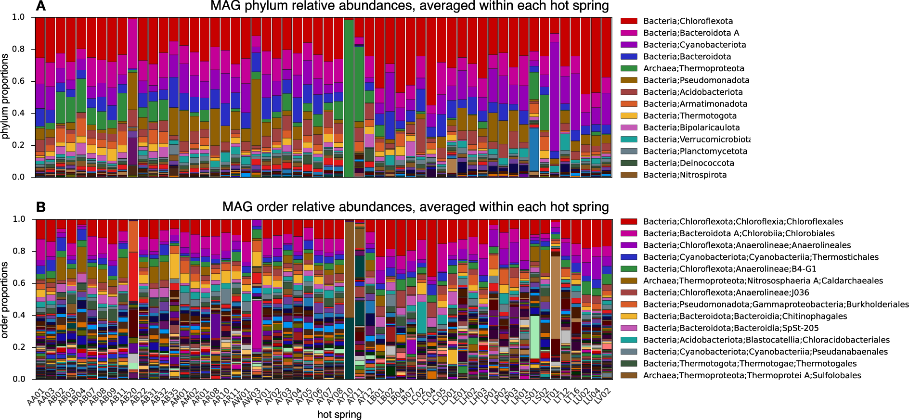
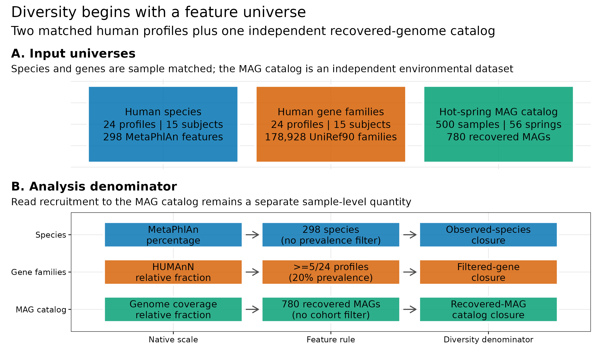
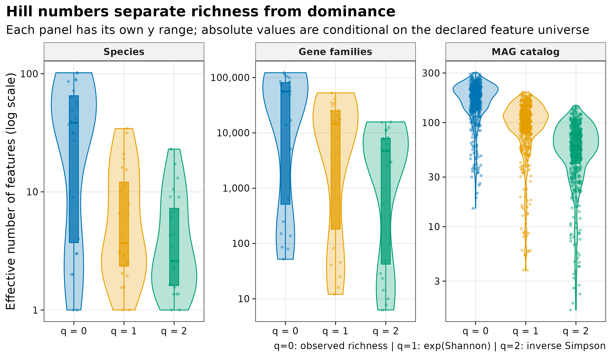
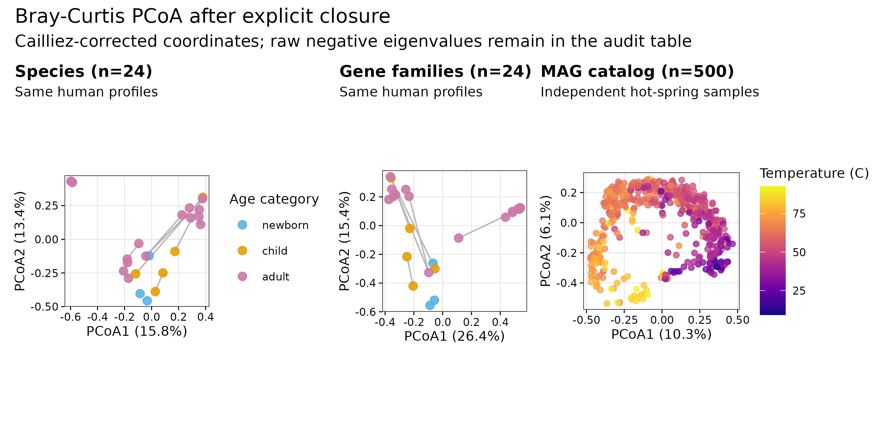
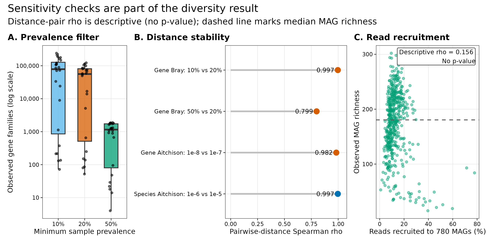

> **学习目标：**先声明 feature universe、native scale、filter、closure 与 zero，再计算 Hill \(q=0/1/2\)、Bray–Curtis、binary Jaccard 和 Aitchison；区分样本匹配的人体 species / gene-family profiles 与独立的温泉 MAG catalog；把重复采样、负特征值、零值替换和 MAG reads recruitment 保留在解释边界内。  
> **真实数据：**人体分支来自 curatedMetagenomicData 3.12.0 的 <code>AsnicarF_2017.relative_abundance</code>（ExperimentHub <code>EH7091</code>）与同批 24 profiles 的 <code>gene_families</code>（<code>EH7086</code>），对应 15 位受试者 [@asnicar2017transmission; @pasolli2017cmd]。MAG 分支来自美国西部 56 个温泉的 500 个 metagenomes 与 780 个 recovered MAGs，固定到 Figshare 30284068 v2 [@korchagina2026hotsprings; @louca2026hotsprings]。  
> **预计资源：**常规复算读取 12 MB checksum-locked 输入，不访问网络；1–2 核、建议 4 GB RAM，实测约 30 s。一次性源数据下载约 58 MB；不需要重跑 MetaPhlAn、HUMAnN、assembly、binning 或 read mapping。

## 这一步对应论文里的哪张图 {#sec-target}

### 原图锚点：Figure 5 的 MAG composition 只在 recovered catalog 内闭合

Korchagina 等对每个样本的质控 reads 竞争性比对到 780 个 MAG，以每个 MAG 的平均 genome coverage 除以该样本全部 MAG coverages 之和，得到 catalog 内 relative abundance。论文 Figure 5A–B 再按 phylum / order 汇总这些比例 [@korchagina2026hotsprings]。

{#fig-22-anchor}

同一论文另算了 quality-filtered reads 对全部 MAG 的 recruitment：平均 12.98%，范围 0.816%–77.896%。因此 MAG composition 每列约等于 100%，只表示“**已经进入 780-MAG catalog 的 coverage 怎样分配**”，不能写成“780 个 MAG 覆盖了全部群落”。

人体分支的论文关注母婴菌株传播 [@asnicar2017transmission]；这里利用 cMD 统一处理后的 MetaPhlAn species 与 HUMAnN gene-family profiles，把同一批样本投影到两个不同 feature spaces。它们可以做样本匹配的几何对照，却不能因为行数不同就比较“哪层更丰富”。

{#fig-22-boundary}

{#fig-22-alpha}

{#fig-22-beta}

{#fig-22-sensitivity}

## 理论：多样性首先是“在哪个宇宙里数” {#sec-theory}

### 1. Alpha 是一个样本内的有效特征数

对已经固定 feature universe 且闭合为 \(p_i\) 的样本，Hill number 为 [@jost2006entropy]：

\[
{}^qD=
\begin{cases}
\left(\sum_i p_i^q\right)^{1/(1-q)}, & q\neq 1\\
\exp\left(-\sum_i p_i\log p_i\right), & q=1.
\end{cases}
\]

三个常用阶数具有同一单位“effective number of features”：

- \(q=0\)：observed richness，只看 \(p_i>0\)，最受检出阈值和过滤影响；
- \(q=1\)：\(\exp(\mathrm{Shannon})\)，按丰度加权常见特征；
- \(q=2\)：inverse Simpson \(1/\sum_i p_i^2\)，更强调优势特征。

同一样本应满足 \({}^0D\ge{}^1D\ge{}^2D\)。但 56,066 个 gene families、38.5 个 species 与 180.5 个 MAGs 的中位 richness 并不是一场“谁更高”的竞赛：UniRef90 family、MetaPhlAn species 和 recovered MAG 是不同观测单位，行数上限与 zero 生成机制也不同。

### 2. 三种表先经过三种 denominator 合同

| Feature space | Native values | Primary feature rule | Diversity denominator |
|---|---|---|---|
| Species | MetaPhlAn percentage；原列和 94.65166–100.00003 | 保留 298 个 species-level features | 每个样本 observed species 内 closure |
| Gene families | HUMAnN relative fraction | 去掉 taxon-stratified 与特殊行；prevalence ≥5/24 | 过滤后 ordinary UniRef90 families 内 closure |
| MAG catalog | genome-coverage relative fraction；原列和 0.999989–1.000011 | 保留 780 个 recovered MAGs | recovered-MAG catalog closure |

gene-family 原对象有 2,704,846 行。community-level ordinary UniRef90 families 为 1,140,842；冻结表保留至少在 3/24 profiles 检出的 415,581 行，主分析再固定为至少 5/24 profiles 的 178,928 行。50% 门槛只剩 1,896 行，说明 q=0 不是过滤之外的“生物真值”。

### 3. Beta 的三种距离回答不同问题

对样本 \(x,y\)：

\[
d_{\mathrm{Bray}}(x,y)=
\frac{\sum_i|x_i-y_i|}{\sum_i(x_i+y_i)}.
\]

Bray–Curtis 保留 abundance 变化 [@bray1957ordination]。当两行都闭合到 1 时，分母固定为 2；这不消除组成约束，只让 denominator 明确。

binary Jaccard 先把数值变成 presence / absence：

\[
d_J=1-\frac{|A\cap B|}{|A\cup B|}.
\]

它回答“检出的 feature membership 是否相同”，不回答丰度差多少。因此 detection threshold 也是模型的一部分。

Aitchison distance 则在 centered log-ratio（CLR）空间求 Euclidean distance [@gloor2017compositional]：

\[
\operatorname{clr}(p)_i=
\log(p_i+\delta)-\frac{1}{D}\sum_j\log(p_j+\delta),
\qquad
d_A(x,y)=\|\operatorname{clr}(x)-\operatorname{clr}(y)\|_2.
\]

零值使对数未定义，所以必须先过滤并声明 \(\delta\)。species 使用 \(10^{-6}\) 对 \(10^{-5}\)，gene families 使用 \(10^{-8}\) 对 \(10^{-7}\) 做 sensitivity。MAG catalog 没有强行做 Aitchison：低 recruitment 下，unrecovered genomes 不只是矩阵里的普通 sampling zero。

### 4. PCoA 是坐标，不是显著性检验

Bray–Curtis 可能不是严格 Euclidean distance，PCoA 会产生负特征值。直接隐藏负值会让坐标看似无问题；这里先记录 raw negative eigenvalues，再用 Cailliez additive constant 得到可绘制坐标 [@cailliez1983additive]。species、gene-family 与 MAG 分支分别有 3、1 与 165 个 raw negative eigenvalues。

PCoA 中“看起来分开”不等于显著。PERMANOVA 还需要 exchangeability、重复样本 block、dispersion 与多重检验合同；这些检验不在本篇执行。

::: {.callout-important title="先给每个数写一句带分母的定义"}
推荐写法是“within-filtered-gene-family Hill q=1”或“within-recovered-MAG-catalog Bray-Curtis”，而不是只写“Shannon”或“beta diversity”。分母进入名字以后，很多过度解释会自动消失。
:::

## 准备工作 {#sec-setup}

<details>
<summary><strong>展开：环境、下载校验、冻结输入与内联作图函数</strong></summary>

### 资源门槛

| Stage | CPU | RAM | Disk | Time |
|---|---:|---:|---:|---:|
| Frozen checksum + diversity audit | 1–2 | recommend 4 GB | inputs 12 MB | about 30 s observed |
| Four PDF/PNG/TIFF redraws | 1–2 | included above | tens of MB | included above |
| One-time cMD + Figshare download | 1 | <1 GB | about 58 MB raw | network dependent |
| Rebuild profiles / MAG recruitment | 8–32 | database / assembly dependent | tens to hundreds of GB | hours to days |

普通电脑直接从冻结谱表开始。只有要改变 MetaPhlAn / HUMAnN release、MAG catalog 或 mapping rule 时，才需要回到原始 reads 和服务器。

### R 环境

整仓库可用 <code>env/renv.lock</code> 恢复锁定的 R 4.4.1 依赖；只运行本文也可显式安装下列包：

```{r}
#| eval: false
install.packages(
  c(
    "Matrix", "vegan", "ape", "ggplot2", "patchwork",
    "scales", "digest", "jsonlite", "magick"
  ),
  repos = "https://cloud.r-project.org"
)
```

### 一次性下载与源文件锁定

```{bash}
#| eval: false
mkdir -p data/raw/article22

curl -fL -o data/raw/article22/AsnicarF_2017.gene_families.rda \
  https://mghp.osn.xsede.org/bir190004-bucket01/ExperimentHub/curatedMetagenomicData/2021-10-14/AsnicarF_2017/2021-10-14.AsnicarF_2017.gene_families.rda

curl -fL -o data/raw/article22/hot-spring-sample-metadata.tsv \
  https://ndownloader.figshare.com/files/61153429
curl -fL -o data/raw/article22/hot-spring-mag-table.biom \
  https://ndownloader.figshare.com/files/61153444
curl -fL -o data/raw/article22/hot-spring-recruitment.tsv \
  https://ndownloader.figshare.com/files/61153471
```

下载后核对：

```text
EH7086 gene_families.rda
  bytes   55739524
  MD5     49caa4e88cbd51e7f5700cbcf4590e55
  SHA256  f171e511667a5d265c529d731b81407af22da3be27db2ba8587cbc6bc159257a

Figshare 61153444 MAG BIOM
  MD5     0c1762f31a5c4473dec78571a7b74287
Figshare 61153429 sample metadata
  MD5     402095b04e2c5518cbec462f41528d4f
Figshare 61153471 recruitment
  MD5     51288407e9927f23a25b210edcda7b47
```

一次性制备命令：

```{bash}
#| eval: false
Rscript scripts/prepare_article22_diversity_data.R \
  --species-rds data/small/12-cmd-asnicarf-2017-relative-abundance.rds \
  --gene-rda data/raw/article22/AsnicarF_2017.gene_families.rda \
  --mag-biom data/raw/article22/hot-spring-mag-table.biom \
  --mag-metadata data/raw/article22/hot-spring-sample-metadata.tsv \
  --mag-recruitment data/raw/article22/hot-spring-recruitment.tsv \
  --output-dir data/small/22-diversity-inputs \
  --notice data/small/22-data-NOTICE.txt
```

常规分析只校验 9 个冻结 payload：

```{bash}
(cd data/small/22-diversity-inputs && sha256sum -c file-checksums.sha256)
```

### 内联依赖与作图函数

```{r}
library(Matrix)
library(vegan)
library(ape)
library(ggplot2)
library(patchwork)
library(scales)
library(digest)

set.seed(20260722)

pal_pub <- c(
  blue = "#0072B2",
  orange = "#D55E00",
  green = "#009E73",
  purple = "#CC79A7",
  gold = "#E69F00",
  sky = "#56B4E9",
  grey = "#999999"
)

scale_color_pub <- function(...) {
  ggplot2::scale_color_manual(values = pal_pub, ...)
}

scale_fill_pub <- function(...) {
  ggplot2::scale_fill_manual(values = pal_pub, ...)
}

theme_pub <- function(base_size = 10) {
  ggplot2::theme_bw(base_size = base_size, base_family = "sans") +
    ggplot2::theme(
      panel.grid.minor = ggplot2::element_blank(),
      panel.grid.major = ggplot2::element_line(
        color = "grey90",
        linewidth = 0.25
      ),
      axis.text = ggplot2::element_text(color = "black"),
      axis.ticks = ggplot2::element_line(
        color = "black",
        linewidth = 0.3
      ),
      strip.background = ggplot2::element_rect(
        fill = "grey95",
        color = "grey45"
      ),
      strip.text = ggplot2::element_text(face = "bold"),
      legend.key = ggplot2::element_blank(),
      plot.title.position = "plot",
      plot.title = ggplot2::element_text(face = "bold")
    )
}

save_pub <- function(
  plot,
  file_base,
  width = 180,
  height = 105,
  dpi = 350
) {
  ggplot2::ggsave(
    paste0(file_base, ".pdf"),
    plot,
    width = width,
    height = height,
    units = "mm",
    device = grDevices::cairo_pdf,
    bg = "white"
  )
  ggplot2::ggsave(
    paste0(file_base, ".png"),
    plot,
    width = width,
    height = height,
    units = "mm",
    dpi = dpi,
    bg = "white"
  )
  ggplot2::ggsave(
    paste0(file_base, ".tiff"),
    plot,
    width = width,
    height = height,
    units = "mm",
    dpi = dpi,
    compression = "lzw",
    bg = "white"
  )
  invisible(plot)
}
```

</details>

## 可复制代码：从谱表得到 Alpha、Beta 与审计表 {#sec-code}

### 第 1 步：读入三种谱表并对齐 metadata

```{r}
input_dir <- "data/small/22-diversity-inputs"

read_wide_profile <- function(path, annotation_columns) {
  tab <- read.delim(
    gzfile(path),
    check.names = FALSE,
    quote = "",
    comment.char = "",
    stringsAsFactors = FALSE
  )
  stopifnot(all(annotation_columns %in% names(tab)))
  sample_columns <- setdiff(names(tab), annotation_columns)
  abundance <- t(data.matrix(tab[, sample_columns, drop = FALSE]))
  rownames(abundance) <- sample_columns
  colnames(abundance) <- as.character(
    tab[[annotation_columns[[1]]]]
  )
  list(
    abundance = abundance,
    annotation = tab[, annotation_columns, drop = FALSE]
  )
}

species_input <- read_wide_profile(
  file.path(input_dir, "species-relative-abundance.tsv.gz"),
  c("Feature", "Species")
)
gene_input <- read_wide_profile(
  file.path(input_dir, "gene-family-prevalence10.tsv.gz"),
  "GeneFamily"
)
mag_input <- read_wide_profile(
  file.path(input_dir, "mag-relative-abundance.tsv.gz"),
  c("MAG", "Taxonomy")
)

human_metadata <- read.delim(
  file.path(input_dir, "human-sample-metadata.tsv"),
  check.names = FALSE
)
mag_metadata <- read.delim(
  file.path(input_dir, "hot-spring-sample-metadata.tsv"),
  check.names = FALSE
)
mag_recruitment <- read.delim(
  file.path(input_dir, "mag-recruitment.tsv"),
  check.names = FALSE
)

species_percent <- species_input$abundance
gene10_native <- gene_input$abundance
mag_native <- mag_input$abundance

stopifnot(
  identical(dim(species_percent), c(24L, 298L)),
  identical(dim(gene10_native), c(24L, 415581L)),
  identical(dim(mag_native), c(500L, 780L)),
  identical(rownames(species_percent), human_metadata$sample_id),
  identical(rownames(gene10_native), human_metadata$sample_id),
  identical(rownames(mag_native), mag_metadata$sample),
  identical(rownames(mag_native), mag_recruitment$sample_id),
  length(unique(human_metadata$subject_id)) == 15L,
  length(unique(mag_metadata$hotspring)) == 56L
)

head(species_input$annotation, 4)
head(human_metadata[, c(
  "sample_id", "subject_id", "family_role",
  "visit_number", "age_category"
)], 6)
head(mag_metadata[, c(
  "sample", "hotspring", "temperature",
  "pH", "metagenome_SRR"
)], 4)
```

### 第 2 步：过滤后再 closure

```{r}
close_rows <- function(x) {
  denominator <- rowSums(x)
  stopifnot(
    all(is.finite(x)),
    min(x) >= 0,
    all(is.finite(denominator)),
    all(denominator > 0)
  )
  x / denominator
}

species_native_sum <- rowSums(species_percent)
mag_native_sum <- rowSums(mag_native)

gene_prevalence <- colMeans(gene10_native > 0)
gene_matrices <- list(
  "10%" = close_rows(
    gene10_native[, gene_prevalence >= 0.10, drop = FALSE]
  ),
  "20%" = close_rows(
    gene10_native[, gene_prevalence >= 0.20, drop = FALSE]
  ),
  "50%" = close_rows(
    gene10_native[, gene_prevalence >= 0.50, drop = FALSE]
  )
)

species <- close_rows(species_percent)
gene <- gene_matrices[["20%"]]
mag <- close_rows(mag_native)

denominator_audit <- data.frame(
  FeatureSpace = c(
    "Species",
    "Gene families 10%",
    "Gene families 20%",
    "Gene families 50%",
    "MAG catalog"
  ),
  Features = c(
    ncol(species),
    ncol(gene_matrices[["10%"]]),
    ncol(gene_matrices[["20%"]]),
    ncol(gene_matrices[["50%"]]),
    ncol(mag)
  ),
  NativeSumMin = c(
    min(species_native_sum),
    NA, NA, NA,
    min(mag_native_sum)
  ),
  NativeSumMax = c(
    max(species_native_sum),
    NA, NA, NA,
    max(mag_native_sum)
  ),
  ClosedSumMaxDeviation = c(
    max(abs(rowSums(species) - 1)),
    max(abs(rowSums(gene_matrices[["10%"]]) - 1)),
    max(abs(rowSums(gene_matrices[["20%"]]) - 1)),
    max(abs(rowSums(gene_matrices[["50%"]]) - 1)),
    max(abs(rowSums(mag) - 1))
  )
)

denominator_audit
stopifnot(
  identical(denominator_audit$Features, c(
    298L, 415581L, 178928L, 1896L, 780L
  )),
  max(denominator_audit$ClosedSumMaxDeviation) < 1e-12
)
```

不要把 species percentage 乘 <code>number_reads</code> 反推 pseudo-counts，也不要把 MAG catalog proportion 当作 read recruitment。两者都已经是模型或 coverage 派生的 composition。

### 第 3 步：统一计算 Hill q=0/1/2

```{r}
hill_values <- function(x) {
  richness <- rowSums(x > 0)
  q1 <- exp(-rowSums(ifelse(x > 0, x * log(x), 0)))
  q2 <- 1 / rowSums(x^2)
  data.frame(q0 = richness, q1 = q1, q2 = q2)
}

hill_long <- function(x, feature_space, dataset) {
  h <- hill_values(x)
  n <- nrow(h)
  data.frame(
    Dataset = dataset,
    FeatureSpace = feature_space,
    SampleID = rep(rownames(h), times = 3),
    Q = rep(0:2, each = n),
    Metric = rep(
      c(
        "Observed richness",
        "exp(Shannon)",
        "Inverse Simpson"
      ),
      each = n
    ),
    Value = c(h$q0, h$q1, h$q2)
  )
}

alpha <- rbind(
  hill_long(species, "Species", "AsnicarF_2017"),
  hill_long(gene, "Gene families", "AsnicarF_2017"),
  hill_long(mag, "MAG catalog", "Western US hot springs")
)

alpha_summary <- aggregate(
  Value ~ FeatureSpace + Q,
  alpha,
  function(x) c(
    Min = min(x),
    Median = median(x),
    Max = max(x)
  )
)
alpha_summary

for (space in unique(alpha$FeatureSpace)) {
  part <- alpha[alpha$FeatureSpace == space, ]
  wide <- reshape(
    part[, c("SampleID", "Q", "Value")],
    idvar = "SampleID",
    timevar = "Q",
    direction = "wide"
  )
  stopifnot(
    all(wide$Value.0 >= wide$Value.1),
    all(wide$Value.1 >= wide$Value.2)
  )
}
```

主分析中位数为：

| Feature space | q=0 richness | q=1 exp(Shannon) | q=2 inverse Simpson |
|---|---:|---:|---:|
| Species | 38.5 | 3.73 | 2.60 |
| Gene families, prevalence ≥20% | 56,066.5 | 14,759.3 | 4,683.2 |
| Recovered MAG catalog | 180.5 | 105.3 | 59.6 |

同一行内从 q=0 到 q=2 的下降表示 dominance；跨行的数量级差异首先来自 feature definition 和 filtering。

### 第 4 步：Bray、binary Jaccard 与 Aitchison 分开算

```{r}
aitchison_distance <- function(x, pseudocount) {
  logx <- log(x + pseudocount)
  clr <- logx - rowMeans(logx)
  dist(clr, method = "euclidean")
}

distances <- list(
  species_bray = vegan::vegdist(species, method = "bray"),
  species_jaccard = vegan::vegdist(
    species > 0,
    method = "jaccard",
    binary = TRUE
  ),
  species_aitchison_1e6 = aitchison_distance(
    species,
    1e-6
  ),
  species_aitchison_1e5 = aitchison_distance(
    species,
    1e-5
  ),
  gene_bray = vegan::vegdist(gene, method = "bray"),
  gene_jaccard = vegan::vegdist(
    gene > 0,
    method = "jaccard",
    binary = TRUE
  ),
  gene_aitchison_1e8 = aitchison_distance(gene, 1e-8),
  gene_aitchison_1e7 = aitchison_distance(gene, 1e-7),
  mag_bray = vegan::vegdist(mag, method = "bray"),
  mag_jaccard = vegan::vegdist(
    mag > 0,
    method = "jaccard",
    binary = TRUE
  )
)

distance_audit <- function(
  feature_space,
  metric,
  variant,
  features,
  d
) {
  values <- as.vector(d)
  data.frame(
    FeatureSpace = feature_space,
    Distance = metric,
    Variant = variant,
    Features = features,
    Samples = attr(d, "Size"),
    Pairs = length(values),
    Min = min(values),
    Median = median(values),
    Max = max(values)
  )
}

beta_audit <- rbind(
  distance_audit(
    "Species", "Bray-Curtis", "Primary",
    ncol(species), distances$species_bray
  ),
  distance_audit(
    "Species", "Binary Jaccard", "Presence/absence",
    ncol(species), distances$species_jaccard
  ),
  distance_audit(
    "Species", "Aitchison", "Pseudocount 1e-06",
    ncol(species), distances$species_aitchison_1e6
  ),
  distance_audit(
    "Species", "Aitchison", "Pseudocount 1e-05",
    ncol(species), distances$species_aitchison_1e5
  ),
  distance_audit(
    "Gene families", "Bray-Curtis", "Prevalence >=20%",
    ncol(gene), distances$gene_bray
  ),
  distance_audit(
    "Gene families", "Binary Jaccard", "Prevalence >=20%",
    ncol(gene), distances$gene_jaccard
  ),
  distance_audit(
    "Gene families", "Aitchison", "Pseudocount 1e-08",
    ncol(gene), distances$gene_aitchison_1e8
  ),
  distance_audit(
    "Gene families", "Aitchison", "Pseudocount 1e-07",
    ncol(gene), distances$gene_aitchison_1e7
  ),
  distance_audit(
    "MAG catalog", "Bray-Curtis", "Catalog closure",
    ncol(mag), distances$mag_bray
  ),
  distance_audit(
    "MAG catalog", "Binary Jaccard", "Presence/absence",
    ncol(mag), distances$mag_jaccard
  )
)

beta_audit
stopifnot(
  all(beta_audit$Pairs[beta_audit$Samples == 24] == 276),
  all(beta_audit$Pairs[beta_audit$Samples == 500] == 124750),
  min(beta_audit$Min) >= 0
)
```

这里的 276 或 124,750 个 distances 是 sample pairs，不是 276 或 124,750 个独立生物重复。因此 distance-vector rho 只用于 sensitivity，不附 p-value。

### 第 5 步：保留 raw negative eigenvalues，再画 PCoA

```{r}
pcoa_scores <- function(d, feature_space, dataset) {
  fit <- ape::pcoa(d, correction = "cailliez")
  coordinates <- if (!is.null(fit$vectors.cor)) {
    fit$vectors.cor
  } else {
    fit$vectors
  }
  relative <- if ("Rel_corr_eig" %in% names(fit$values)) {
    fit$values$Rel_corr_eig
  } else {
    fit$values$Relative_eig
  }
  raw_eigen <- fit$values$Eigenvalues
  data.frame(
    Dataset = dataset,
    FeatureSpace = feature_space,
    SampleID = rownames(coordinates),
    Axis1 = coordinates[, 1],
    Axis2 = coordinates[, 2],
    Axis1Variance = relative[[1]],
    Axis2Variance = relative[[2]],
    NegativeEigenvalues = sum(raw_eigen < -1e-10),
    NegativeEigenvalueMass = sum(
      abs(raw_eigen[raw_eigen < -1e-10])
    ),
    Correction = "Cailliez",
    CorrectionNote = fit$note
  )
}

ordination <- rbind(
  pcoa_scores(
    distances$species_bray,
    "Species",
    "AsnicarF_2017"
  ),
  pcoa_scores(
    distances$gene_bray,
    "Gene families",
    "AsnicarF_2017"
  ),
  pcoa_scores(
    distances$mag_bray,
    "MAG catalog",
    "Western US hot springs"
  )
)

ordination$SubjectID <- human_metadata$subject_id[
  match(ordination$SampleID, human_metadata$sample_id)
]
ordination$AgeCategory <- human_metadata$age_category[
  match(ordination$SampleID, human_metadata$sample_id)
]
ordination$DaysFromFirstCollection <-
  human_metadata$days_from_first_collection[
    match(ordination$SampleID, human_metadata$sample_id)
  ]
ordination$HotSpring <- mag_metadata$hotspring[
  match(ordination$SampleID, mag_metadata$sample)
]
ordination$Temperature <- mag_metadata$temperature[
  match(ordination$SampleID, mag_metadata$sample)
]

unique(ordination[, c(
  "FeatureSpace",
  "Axis1Variance",
  "Axis2Variance",
  "NegativeEigenvalues",
  "NegativeEigenvalueMass",
  "Correction"
)])
```

PCoA1 / PCoA2 对 corrected geometry 的解释率分别为 species 15.8% / 13.4%、gene families 26.4% / 15.4%、MAG 10.3% / 6.1%。这些百分比只描述各自距离矩阵，不能跨 panel 当作模型优劣。

### 第 6 步：过滤、零值与 recruitment sensitivity

```{r}
gene_bray10 <- vegan::vegdist(
  gene_matrices[["10%"]],
  method = "bray"
)
gene_bray50 <- vegan::vegdist(
  gene_matrices[["50%"]],
  method = "bray"
)

stability <- data.frame(
  Comparison = c(
    "Gene Bray: 10% vs 20%",
    "Gene Bray: 50% vs 20%",
    "Gene Aitchison: 1e-8 vs 1e-7",
    "Species Aitchison: 1e-6 vs 1e-5"
  ),
  Rho = c(
    cor(
      as.vector(gene_bray10),
      as.vector(distances$gene_bray),
      method = "spearman"
    ),
    cor(
      as.vector(gene_bray50),
      as.vector(distances$gene_bray),
      method = "spearman"
    ),
    cor(
      as.vector(distances$gene_aitchison_1e8),
      as.vector(distances$gene_aitchison_1e7),
      method = "spearman"
    ),
    cor(
      as.vector(distances$species_aitchison_1e6),
      as.vector(distances$species_aitchison_1e5),
      method = "spearman"
    )
  )
)

mag_hill <- hill_values(mag)
mag_recruitment_rho <- cor(
  mag_hill$q0,
  mag_recruitment$total_hit_rate,
  method = "spearman"
)

stability
mag_recruitment_rho
stopifnot(
  abs(stability$Rho[[1]] - 0.9967597494) < 1e-8,
  abs(stability$Rho[[2]] - 0.7991429344) < 1e-8,
  abs(mag_recruitment_rho - 0.1560190862) < 1e-8
)
```

10% 对 20% gene Bray 的 rho 为 0.997，但 50% 对 20% 降到 0.799；Aitchison pseudocount sensitivity 为 gene 0.982、species 0.997。高 rho 只表示这批样本 pair 的排序较稳定，不证明任一门槛“正确”。

### 第 7 步：把重复结构写进账本

```{r}
human_repeat_audit <- do.call(
  rbind,
  lapply(
    split(human_metadata, human_metadata$subject_id),
    function(part) {
      data.frame(
        Unit = "Human subject",
        UnitID = part$subject_id[[1]],
        Profiles = nrow(part),
        Repeated = nrow(part) > 1,
        SampleIDs = paste(part$sample_id, collapse = ";")
      )
    }
  )
)

spring_repeat_audit <- do.call(
  rbind,
  lapply(
    split(mag_metadata, mag_metadata$hotspring),
    function(part) {
      data.frame(
        Unit = "Hot spring",
        UnitID = part$hotspring[[1]],
        Profiles = nrow(part),
        Repeated = nrow(part) > 1,
        SampleIDs = paste(part$sample, collapse = ";")
      )
    }
  )
)

table(human_repeat_audit$Profiles)
sum(human_repeat_audit$Profiles)
sum(spring_repeat_audit$Profiles)

stopifnot(
  nrow(human_repeat_audit) == 15L,
  sum(human_repeat_audit$Profiles) == 24L,
  nrow(spring_repeat_audit) == 56L,
  sum(spring_repeat_audit$Profiles) == 500L
)
```

15 位人体 subject 中，9 位只有 1 个 profile、3 位有 2 个、3 位有 3 个。温泉样本也按 56 个 sites 聚集。后续若检验 group effect，permutation 或模型结构必须保留这些层级。

### 第 8 步：生成四组出版图

以下代码直接使用前述对象；所有可见文字为英文。

```{r}
#| output: false
pal_space <- c(
  "Species" = "#0072B2",
  "Gene families" = "#D55E00",
  "MAG catalog" = "#009E73"
)
pal_q <- c(
  "q = 0" = "#0072B2",
  "q = 1" = "#E69F00",
  "q = 2" = "#009E73"
)

cards <- data.frame(
  FeatureSpace = c("Species", "Gene families", "MAG catalog"),
  X = 1:3,
  Y = 1,
  Label = c(
    "Human species\n24 profiles | 15 subjects\n298 MetaPhlAn features",
    "Human gene families\n24 profiles | 15 subjects\n178,928 UniRef90 families",
    "Hot-spring MAG catalog\n500 samples | 56 springs\n780 recovered MAGs"
  )
)

p_cards <- ggplot(cards, aes(X, Y, fill = FeatureSpace)) +
  geom_tile(
    width = 0.90,
    height = 0.72,
    color = "white",
    linewidth = 1,
    alpha = 0.84
  ) +
  geom_text(aes(label = Label), size = 3.15, lineheight = 1.05) +
  scale_fill_manual(values = pal_space, guide = "none") +
  scale_x_continuous(limits = c(0.45, 3.55), expand = c(0, 0)) +
  scale_y_continuous(limits = c(0.58, 1.42), expand = c(0, 0)) +
  labs(
    title = "A. Input universes",
    subtitle = paste(
      "Species and genes are sample matched;",
      "the MAG catalog is an independent environmental dataset"
    ),
    x = NULL,
    y = NULL
  ) +
  theme_pub(9) +
  theme(
    panel.grid = element_blank(),
    panel.border = element_blank(),
    axis.text = element_blank(),
    axis.ticks = element_blank()
  )

flow <- data.frame(
  FeatureSpace = rep(
    c("Species", "Gene families", "MAG catalog"),
    each = 3
  ),
  Stage = rep(1:3, times = 3),
  Label = c(
    "MetaPhlAn\npercentage",
    "298 species\n(no prevalence filter)",
    "Observed-species\nclosure",
    "HUMAnN\nrelative fraction",
    ">=5/24 profiles\n(20% prevalence)",
    "Filtered-gene\nclosure",
    "Genome coverage\nrelative fraction",
    "780 recovered MAGs\n(no cohort filter)",
    "Recovered-MAG\ncatalog closure"
  )
)
flow$FeatureSpace <- factor(
  flow$FeatureSpace,
  levels = rev(c("Species", "Gene families", "MAG catalog"))
)
arrows <- expand.grid(
  FeatureSpace = levels(flow$FeatureSpace),
  Stage = c(1.46, 2.46)
)
arrows$FeatureSpace <- factor(
  arrows$FeatureSpace,
  levels = levels(flow$FeatureSpace)
)

p_flow <- ggplot(flow, aes(Stage, FeatureSpace, fill = FeatureSpace)) +
  geom_tile(
    width = 0.88,
    height = 0.68,
    color = "white",
    linewidth = 0.8,
    alpha = 0.82
  ) +
  geom_segment(
    data = arrows,
    aes(
      x = Stage,
      xend = Stage + 0.08,
      y = FeatureSpace,
      yend = FeatureSpace
    ),
    inherit.aes = FALSE,
    arrow = grid::arrow(length = grid::unit(2.2, "mm")),
    linewidth = 0.45,
    color = "grey30"
  ) +
  geom_text(aes(label = Label), size = 3, lineheight = 0.95) +
  scale_fill_manual(values = pal_space, guide = "none") +
  scale_x_continuous(
    breaks = 1:3,
    labels = c(
      "Native scale",
      "Feature rule",
      "Diversity denominator"
    ),
    limits = c(0.5, 3.5)
  ) +
  labs(
    title = "B. Analysis denominator",
    subtitle = paste(
      "Read recruitment to the MAG catalog remains",
      "a separate sample-level quantity"
    ),
    x = NULL,
    y = NULL
  ) +
  theme_pub(9) +
  theme(panel.grid = element_blank())

p_resolution <- p_cards / p_flow +
  plot_layout(heights = c(0.43, 0.57)) +
  plot_annotation(
    title = "Diversity begins with a feature universe",
    subtitle = paste(
      "Two matched human profiles plus one independent",
      "recovered-genome catalog"
    )
  )

save_pub(
  p_resolution,
  "figures/22-resolution-boundaries",
  width = 190,
  height = 112
)
```

```{r}
#| output: false
alpha_plot <- alpha
alpha_plot$QLabel <- factor(
  paste0("q = ", alpha_plot$Q),
  levels = c("q = 0", "q = 1", "q = 2")
)
alpha_plot$FeatureSpace <- factor(
  alpha_plot$FeatureSpace,
  levels = c("Species", "Gene families", "MAG catalog")
)

p_alpha <- ggplot(
  alpha_plot,
  aes(QLabel, Value, fill = QLabel, color = QLabel)
) +
  geom_violin(
    scale = "width",
    trim = TRUE,
    alpha = 0.28,
    linewidth = 0.35
  ) +
  geom_boxplot(
    width = 0.18,
    outlier.shape = NA,
    alpha = 0.75,
    linewidth = 0.35
  ) +
  geom_jitter(
    width = 0.11,
    height = 0,
    size = 0.55,
    alpha = 0.35
  ) +
  facet_wrap(~FeatureSpace, scales = "free_y", nrow = 1) +
  scale_fill_manual(values = pal_q, guide = "none") +
  scale_color_manual(values = pal_q, guide = "none") +
  scale_y_log10(
    labels = scales::label_number(
      big.mark = ",",
      accuracy = 1
    )
  ) +
  labs(
    title = "Hill numbers separate richness from dominance",
    subtitle = paste(
      "Each panel has its own y range; absolute values are",
      "conditional on the declared feature universe"
    ),
    x = NULL,
    y = "Effective number of features (log scale)",
    caption = paste(
      "q=0: observed richness | q=1: exp(Shannon)",
      "| q=2: inverse Simpson"
    )
  ) +
  theme_pub(10)

save_pub(
  p_alpha,
  "figures/22-alpha-hill-numbers",
  width = 180,
  height = 105
)
```

```{r}
#| output: false
human_ord <- ordination[
  ordination$Dataset == "AsnicarF_2017",
]
human_ord$AgeCategory <- factor(
  human_ord$AgeCategory,
  levels = c("newborn", "child", "adult")
)
pal_age <- c(
  "newborn" = "#56B4E9",
  "child" = "#E69F00",
  "adult" = "#CC79A7"
)

make_human_ordination <- function(space, show_legend = TRUE) {
  dat <- human_ord[human_ord$FeatureSpace == space, ]
  dat <- dat[
    order(dat$SubjectID, dat$DaysFromFirstCollection),
  ]
  x_pct <- 100 * unique(dat$Axis1Variance)[[1]]
  y_pct <- 100 * unique(dat$Axis2Variance)[[1]]
  ggplot(dat, aes(Axis1, Axis2)) +
    geom_path(
      aes(group = SubjectID),
      color = "grey72",
      linewidth = 0.45
    ) +
    geom_point(
      aes(color = AgeCategory),
      size = 2.3,
      alpha = 0.9
    ) +
    scale_color_manual(
      values = pal_age,
      drop = FALSE,
      guide = if (show_legend) "legend" else "none"
    ) +
    coord_equal() +
    labs(
      title = paste0(space, " (n=24)"),
      subtitle = "Same human profiles",
      x = sprintf("PCoA1 (%.1f%%)", x_pct),
      y = sprintf("PCoA2 (%.1f%%)", y_pct),
      color = "Age category"
    ) +
    theme_pub(9)
}

mag_ord <- ordination[
  ordination$FeatureSpace == "MAG catalog",
]
mag_x_pct <- 100 * unique(mag_ord$Axis1Variance)[[1]]
mag_y_pct <- 100 * unique(mag_ord$Axis2Variance)[[1]]

p_mag_ord <- ggplot(
  mag_ord,
  aes(Axis1, Axis2, color = Temperature)
) +
  geom_point(size = 1.45, alpha = 0.75) +
  scale_color_viridis_c(option = "C", na.value = "grey75") +
  coord_equal() +
  labs(
    title = "MAG catalog (n=500)",
    subtitle = "Independent hot-spring samples",
    x = sprintf("PCoA1 (%.1f%%)", mag_x_pct),
    y = sprintf("PCoA2 (%.1f%%)", mag_y_pct),
    color = "Temperature (C)"
  ) +
  theme_pub(9)

p_beta <- make_human_ordination("Species", TRUE) +
  make_human_ordination("Gene families", FALSE) +
  p_mag_ord +
  plot_layout(widths = c(1, 1, 1.08)) +
  plot_annotation(
    title = "Bray-Curtis PCoA after explicit closure",
    subtitle = paste(
      "Cailliez-corrected coordinates; raw negative",
      "eigenvalues remain in the audit table"
    )
  )

save_pub(
  p_beta,
  "figures/22-beta-ordination",
  width = 210,
  height = 100
)
```

```{r}
#| output: false
gene_threshold_alpha <- do.call(
  rbind,
  lapply(names(gene_matrices), function(threshold) {
    out <- hill_long(
      gene_matrices[[threshold]],
      "Gene families",
      "AsnicarF_2017"
    )
    out$Threshold <- threshold
    out
  })
)
gene_q0 <- gene_threshold_alpha[
  gene_threshold_alpha$Q == 0,
]
gene_q0$Threshold <- factor(
  gene_q0$Threshold,
  levels = c("10%", "20%", "50%")
)

p_filter <- ggplot(
  gene_q0,
  aes(Threshold, Value, fill = Threshold)
) +
  geom_boxplot(
    width = 0.52,
    outlier.shape = NA,
    alpha = 0.75
  ) +
  geom_jitter(width = 0.10, size = 1, alpha = 0.55) +
  scale_fill_manual(
    values = c(
      "10%" = "#56B4E9",
      "20%" = "#D55E00",
      "50%" = "#009E73"
    ),
    guide = "none"
  ) +
  scale_y_log10(labels = scales::label_number(big.mark = ",")) +
  labs(
    title = "A. Prevalence filter",
    x = "Minimum sample prevalence",
    y = "Observed gene families (log scale)"
  ) +
  theme_pub(9)

stability$Comparison <- factor(
  stability$Comparison,
  levels = rev(stability$Comparison)
)
stability$FeatureSpace <- c(
  "Gene families",
  "Gene families",
  "Gene families",
  "Species"
)

p_stability <- ggplot(
  stability,
  aes(Rho, Comparison, color = FeatureSpace)
) +
  geom_segment(
    aes(
      x = 0,
      xend = Rho,
      yend = Comparison
    ),
    color = "grey75",
    linewidth = 1
  ) +
  geom_point(size = 3) +
  geom_text(
    aes(label = sprintf("%.3f", Rho)),
    hjust = 1.2,
    size = 2.8,
    color = "black"
  ) +
  scale_color_manual(values = pal_space, guide = "none") +
  scale_x_continuous(
    limits = c(0, 1.03),
    breaks = seq(0, 1, 0.25)
  ) +
  labs(
    title = "B. Distance stability",
    x = "Pairwise-distance Spearman rho",
    y = NULL
  ) +
  theme_pub(9)

mag_richness <- data.frame(
  Recruitment = mag_recruitment$total_hit_rate,
  Richness = mag_hill$q0
)

p_recruit <- ggplot(
  mag_richness,
  aes(100 * Recruitment, Richness)
) +
  geom_point(
    size = 1.2,
    alpha = 0.45,
    color = "#009E73"
  ) +
  geom_hline(
    yintercept = median(mag_richness$Richness),
    color = "grey35",
    linetype = "dashed",
    linewidth = 0.55
  ) +
  annotate(
    "label",
    x = Inf,
    y = Inf,
    label = sprintf(
      "Descriptive rho = %.3f\nNo p-value",
      mag_recruitment_rho
    ),
    hjust = 1.05,
    vjust = 1.15,
    size = 2.8,
    label.size = 0.25
  ) +
  labs(
    title = "C. Read recruitment",
    x = "Reads recruited to 780 MAGs (%)",
    y = "Observed MAG richness"
  ) +
  theme_pub(9)

p_sensitivity <- p_filter + p_stability + p_recruit +
  plot_layout(widths = c(0.82, 1.18, 1)) +
  plot_annotation(
    title = "Sensitivity checks are part of the diversity result",
    subtitle = paste(
      "Distance-pair rho is descriptive (no p-value);",
      "dashed line marks median MAG richness"
    )
  )

save_pub(
  p_sensitivity,
  "figures/22-sensitivity-recruitment",
  width = 220,
  height = 110
)
```

## 审计与升级：把“多样性指数”升级成 measurement contract {#sec-audit}

### 忠实保留数据提供方的量

温泉论文的 MAG abundance 按下面顺序产生 [@korchagina2026hotsprings]：

1. quality-filtered reads 竞争性比对到 780 MAGs；
2. 只保留 MAPQ ≥30；
3. 每个 sample / MAG 计算逐位点 depth 后取整条 MAG 的平均 coverage；
4. 每个 MAG coverage 除以同一样本 780 个 MAG coverages 之和。

这里不把它改写为 read counts，不对相对比例 rarefy，也不把 100% closure 当作 whole-community coverage。独立的 recruitment 表才回答多少 reads 进入 catalog。

人体分支保留 cMD 的 MetaPhlAn / HUMAnN 标度 [@manghi2026cmd3; @beghini2021biobakery]。species 原百分比先存档再 closure；gene families 先去掉 stratified / special rows、固定 prevalence，再在每个样本内 closure。community 与 taxon-stratified rows 不会重复进入 richness。

### 今天应增加的六项审计

1. **Hill profile，而非单个 Shannon：**q=0、1、2 同时报告，区分 richness 与 dominance。
2. **feature filter sensitivity：**gene prevalence 10% / 20% / 50% 分支全部保留。
3. **distance meaning：**Bray、binary Jaccard、Aitchison 不互相替代。
4. **zero sensitivity：**Aitchison 至少比较两个预声明 pseudocount。
5. **ordination eigen audit：**原始负特征值数量与质量写入表，再声明 correction。
6. **design ledger：**human subject 与 hot-spring site 层级在进入推断前保留。

真实结果显示，gene richness 中位数会从 10% 门槛的 78,850 降到 20% 的 56,066.5，再降到 50% 的 1,160.5；相应 Bray distance rank rho 从 0.997（10% vs 20%）降到 0.799（50% vs 20%）。如果只报告一个门槛，读者无法判断结果依赖的是生物结构还是 feature universe。

::: {.callout-note title="为什么本篇没有 PERMANOVA p-value"}
人体 24 profiles 只对应 15 subjects；500 个环境样本聚集在 56 个 hot springs。未经 block 的自由置换会破坏 exchangeability。PERMANOVA 还要与 dispersion 审计配套；这些属于下一步推断合同，不应由 PCoA 图形替代。
:::

## 出版级美化 {#sec-polish}

### 视觉规则

- 图内全部使用英文；
- species / gene families / MAG catalog 固定为 blue / orange / green；
- q=0 / q=1 / q=2 同时使用颜色与明确文字；
- Alpha panel 使用独立 y 范围并明确标注，避免假装跨 feature spaces 可直接比较；
- 人体 PCoA 用灰线连接同一 subject 的重复 profiles；
- MAG PCoA 用连续温度色标，不把人为分箱伪装成天然组别；
- sensitivity 图把 rho 写在轴内，不显示 p-value；
- 原始论文图与重绘图分开标注，避免把二次分析误写成作者原结果。

四张重绘图均导出 PDF master、PNG 和 350 dpi LZW TIFF。尺寸为：

| Figure | Width × height |
|---|---:|
| Resolution boundaries | 190 × 112 mm |
| Alpha Hill numbers | 180 × 105 mm |
| Beta ordination | 210 × 100 mm |
| Sensitivity / recruitment | 220 × 110 mm |

## 常见坑 {#sec-pitfalls}

::: {.callout-caution title="坑 1：把 relative abundance 当 raw counts 后 rarefy"}
MetaPhlAn percentage、HUMAnN relative fraction 和 MAG coverage proportion 都不是原始 read-event matrix。乘 library size 得到的 pseudo-count 不能恢复 marker、length、mapping 或 catalog uncertainty。
:::

::: {.callout-caution title="坑 2：gene-family community 与 stratified rows 一起计数"}
同一个 UniRef90 family 的 community row 与 taxon-specific rows 同时进入 q=0，会重复定义 feature universe。先只留 community-level ordinary rows。
:::

::: {.callout-caution title="坑 3：把 MAG column sum=1 写成全部 reads 被解释"}
本数据平均只有 12.98% quality-filtered reads 被 780 个 MAG 招募。column sum=1 只是 catalog 内 coverage closure。
:::

::: {.callout-caution title="坑 4：用一个 prevalence 门槛决定“真实基因丰富度”"}
本数据 10% / 20% / 50% 门槛分别保留 415,581 / 178,928 / 1,896 个 gene families。q=0 必须与门槛绑定报告。
:::

::: {.callout-caution title="坑 5：把所有距离叫 beta diversity 后挑最好看的"}
Bray 看 abundance，binary Jaccard 看 detected membership，Aitchison 看 log-ratio。它们不一致时应解释 measurement difference，而不是挑一个最分离的 panel。
:::

::: {.callout-caution title="坑 6：对 pairwise distances 做普通相关显著性检验"}
24 个样本产生 276 个 pairs，但 pairs 共享样本并不独立。本文只报告 geometry sensitivity rho，不报告基于 276 个“重复”的 p-value。
:::

::: {.callout-caution title="坑 7：PCoA 分开就写显著"}
PCoA 是描述性坐标。组效应还需要受设计约束的 permutation、PERMDISP 与预先声明的模型；负特征值和 correction 也必须报告。
:::

::: {.callout-caution title="坑 8：忽略 subject / site 的重复结构"}
24 个人体 profiles 不是 24 位独立受试者，500 个温泉样本也不是 500 个独立 sites。把它们自由置换会夸大有效样本量。
:::

## 这段 Methods 怎么写 {#sec-methods}

> **Diversity analysis.** Taxonomic and gene-family profiles for 24 longitudinal stool metagenomes from 15 participants were obtained from curatedMetagenomicData 3.12.0 (AsnicarF_2017; ExperimentHub EH7091 and EH7086). The species table contained 298 MetaPhlAn-derived percentage features. For gene-family analysis, taxon-stratified rows and UNMAPPED, UNGROUPED, and UNINTEGRATED entries were excluded; UniRef90 families detected in at least 5 of 24 profiles (20% prevalence; 178,928 families) were retained, with 10% and 50% thresholds evaluated as sensitivity analyses. An independent environmental branch used the 780-MAG by 500-sample abundance matrix, metadata, and read-recruitment table from Figshare record 30284068 v2 (files 61153444, 61153429, and 61153471). MAG abundances were interpreted as genome-coverage proportions closed within the recovered-MAG catalog; the fraction of quality-filtered reads recruited to the catalog was retained separately (mean 12.98%). Within each declared feature universe, non-negative abundances were closed per sample and Hill numbers q=0, q=1, and q=2 were calculated as observed richness, exp(Shannon entropy), and inverse Simpson concentration, respectively. Bray–Curtis and binary Jaccard distances were computed with vegan 2.6.6.1. Aitchison distances were calculated for prefiltered human species and gene-family compositions after additive zero replacement; pseudocounts of 10^-6 versus 10^-5 (species) and 10^-8 versus 10^-7 (gene families) were compared without pairwise-distance p-values. Bray–Curtis PCoA was performed with ape 5.8; raw negative eigenvalues were audited and Cailliez-corrected coordinates were plotted. Repeated participants and hot-spring sites were retained in a design ledger. No biological group test or permutation was performed in this descriptive analysis. Analyses used R 4.4.1 with Matrix 1.6.5 and ggplot2 3.5.2; random seed 20260722 was fixed before plotting.

投稿时再补三项：

- frozen input 的 SHA-256 manifest 与取得日期；
- gene prevalence 和 pseudocount 的预注册理由；
- 若继续做 PERMANOVA，补 permutation block、dispersion test 与 contrasts。

## 换成你自己的数据怎么做 {#sec-own-data}

### 你至少需要什么

1. 非负的 <code>features × samples</code> abundance table；
2. 唯一且完全匹配的 sample IDs；
3. feature 类型、native unit、数据库和版本；
4. subject / site / batch / time 等重复结构；
5. 对 gene profile 的 stratification 与 special-row policy；
6. 对 MAG table 的 catalog 定义和每样本 reads recruitment；
7. 预声明 prevalence 与 zero-replacement sensitivity。

### 最小适配模板

```{r}
#| eval: false
# abundance.tsv: first column is Feature; remaining columns are samples
your_table <- read.delim(
  "your_data/abundance.tsv",
  check.names = FALSE
)
your_metadata <- read.delim(
  "your_data/sample-metadata.tsv",
  check.names = FALSE
)

your_feature_id <- your_table[[1]]
your_matrix <- t(data.matrix(your_table[, -1, drop = FALSE]))
colnames(your_matrix) <- your_feature_id

stopifnot(
  identical(rownames(your_matrix), your_metadata$sample_id),
  all(is.finite(your_matrix)),
  min(your_matrix) >= 0
)

# Example only: choose this threshold before inspecting group separation.
minimum_profiles <- ceiling(0.20 * nrow(your_matrix))
keep <- colSums(your_matrix > 0) >= minimum_profiles
your_filtered <- your_matrix[, keep, drop = FALSE]
your_closed <- close_rows(your_filtered)

your_hill <- hill_values(your_closed)
your_bray <- vegan::vegdist(your_closed, method = "bray")
your_jaccard <- vegan::vegdist(
  your_closed > 0,
  method = "jaccard",
  binary = TRUE
)
your_aitchison_1 <- aitchison_distance(
  your_closed,
  pseudocount = 1e-6
)
your_aitchison_2 <- aitchison_distance(
  your_closed,
  pseudocount = 1e-5
)
```

如果输入是真正的 integer read counts，先单独处理 library-size / coverage 标准化问题；不要为了复用这段代码而先 TSS 后再声称做 count inference。如果输入是 MAG catalog 且没有 recruitment 或 unmapped-read ledger，只能把结果写成“within-catalog diversity”，不能外推到 whole-community richness。

## 参考 {#sec-references}

- Hill numbers 与 effective diversity：[@jost2006entropy]。
- Bray–Curtis dissimilarity：[@bray1957ordination]。
- 组成数据与 log-ratio 几何：[@gloor2017compositional]。
- Cailliez additive correction：[@cailliez1983additive]。
- curatedMetagenomicData 与 AsnicarF_2017：[@pasolli2017cmd; @manghi2026cmd3; @asnicar2017transmission]。
- HUMAnN / MetaPhlAn 统一处理背景：[@beghini2021biobakery]。
- 温泉 MAG 数据论文与 Figshare v2：[@korchagina2026hotsprings; @louca2026hotsprings]。
