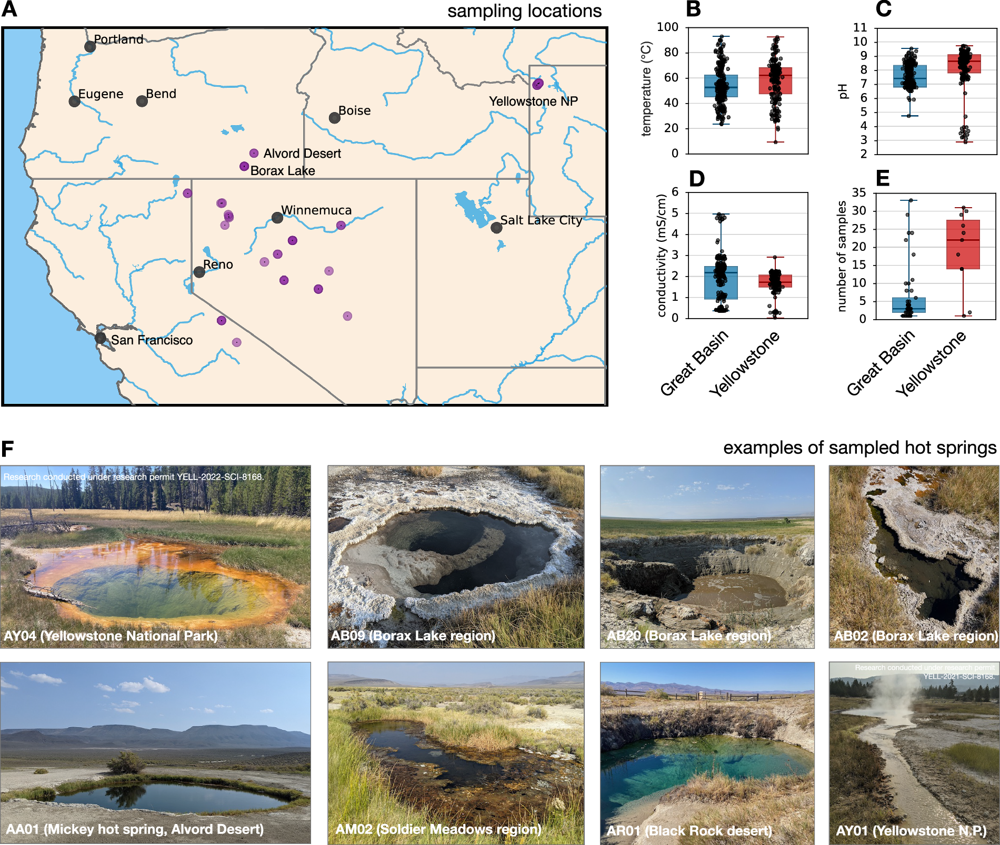
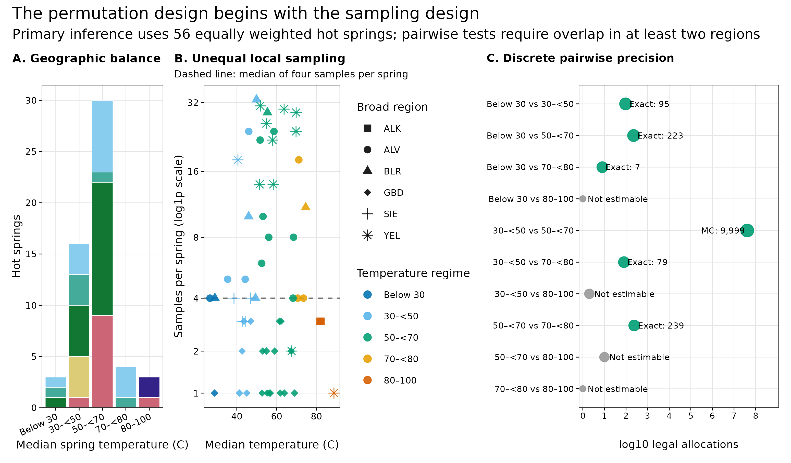
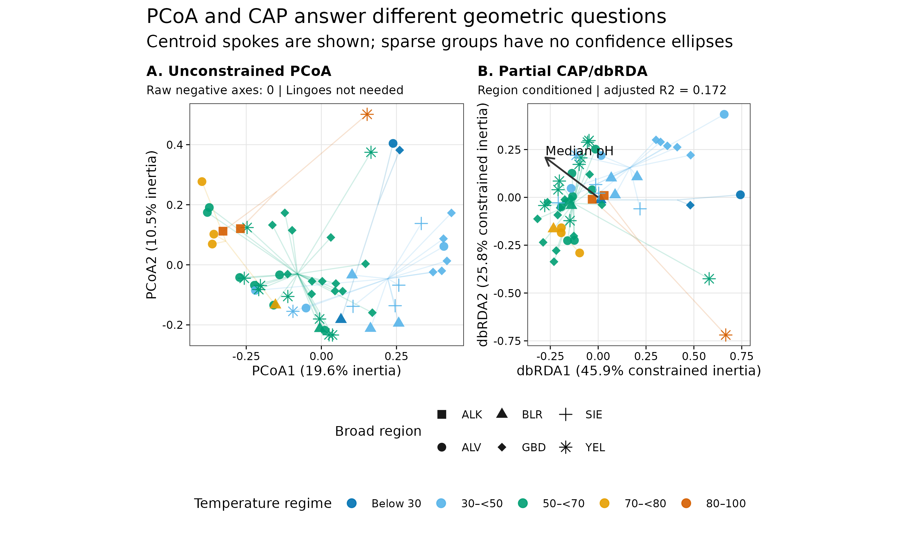
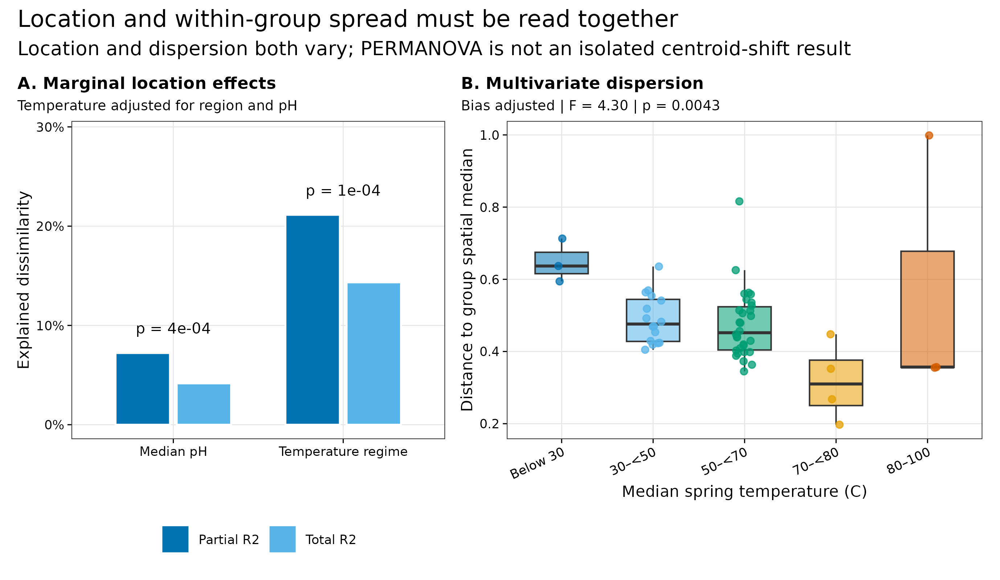
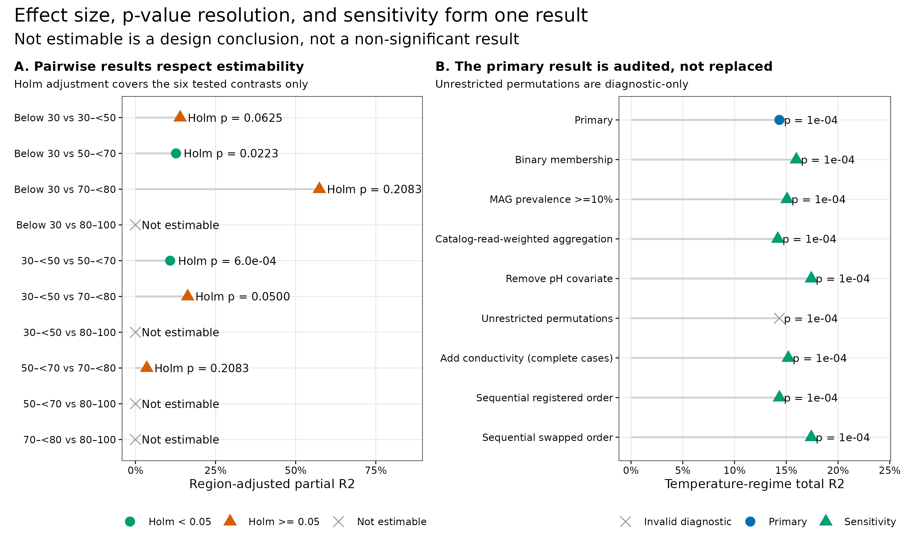

> **学习目标：**把 PCoA、partial CAP/dbRDA、PERMANOVA 与 PERMDISP 分成四个不同问题；先确定推断单位和 exchangeability，再写 distance、formula、marginal / sequential sums of squares、permutation block、effect size 和 multiple-testing 合同；对没有足够 region overlap 的对比返回 **not estimable**，而不是一个虚假的“不显著”。  
> **真实数据：**Korchagina 等公开的美国西部温泉调查，共 500 个 metagenomes、56 个 hot springs 和 780 个 recovered MAGs，固定到 Figshare 30284068 v2 [@korchagina2026hotsprings; @louca2026hotsprings]。  
> **推断边界：**该研究为捕获局部多样性而取样，各 spring 有 1–33 个样本，不是空间平衡的概率抽样。主分析因此把每个 hot spring 作为一个等权单位；MAG 数值只在 recovered-genome catalog 内闭合，不代表全群落。

## 这一步对应论文里的哪张图 {#sec-target}

### 原图锚点：Figure 1 先暴露了取样结构

论文 Figure 1A 给出 Great Basin 和 Yellowstone 的取样位置，B–D 展示 sample-level temperature、pH 与 conductivity，E 直接显示不同 spring 的样本数不等 [@korchagina2026hotsprings]。这些 panel 不是 PERMANOVA 结果，却决定了 PERMANOVA 应该怎么做。

{#fig-23-anchor}

论文没有报告本文的 PCoA/CAP、PERMANOVA 或 PERMDISP。下面的检验是在公开数据上先锁定合同、再执行的新审计，不应写成“复现了论文的 PERMANOVA”。

{#fig-23-design}

{#fig-23-ordination}

{#fig-23-location-dispersion}

{#fig-23-pairwise}

## 理论：四个工具，四个问题 {#sec-theory}

### 1. PCoA 是“距离的地图”

先在 <em>n</em> 个样本上得到距离矩阵 <em>D</em>，PCoA 对其 double-centered 形式做特征分解，把样本放进低维坐标。它没有 formula，也没有自带的 group <em>p</em> 值。因此：

- 点靠近：在当前 distance 下更相似；
- 前两轴是低维摘要，不是全部变异；
- 眼睛看见分组不能替代置换检验。

本数据 spring-level Bray-Curtis 没有 raw negative eigenvalues，所以预声明的 Lingoes policy 被检查但无需施加；PCoA1/2 分别表示 19.6% 和 10.5% 的 inertia。“未需校正”应如实记录，不应为了与方案名字一致而伪称已施加 correction。

### 2. CAP/dbRDA 是“被 formula 约束的距离地图”

partial CAP/dbRDA 用

```text
TemperatureRegime + scale(MedianPH) + Condition(BroadRegion)
```

只展示与 temperature regime 和 pH 共变、且已把 broad-region 结构 partial out 的轴 [@anderson2003cap]。该约束部分 R² = 0.2158，adjusted R² = 0.1720。dbRDA1/2 的 45.9% 与 25.8% 是“约束部分内”的比例，不能写成全群落 45.9% 和 25.8%。

### 3. PERMANOVA 检验 centroid location，但置换结构是模型的一部分

PERMANOVA 用 distance-based sums of squares 比较组间与组内变异 [@anderson2001permanova]。本文主模型锁定为：


```text
Bray-Curtis distance ~ BroadRegion + scale(MedianPH) + TemperatureRegime
```

主结论只读取 <code>TemperatureRegime</code> 的 **marginal** sums of squares：在 region 和 pH 都已纳入时，该项独立解释多少 distance variation。顺序型 <code>by = "terms"</code> 仍保留为审计：当 temperature 放在 pH 之前时，其 total R² 从 0.1434 变为 0.1742，这正是 non-orthogonal predictors 下 formula order 会改变序贯分摊的证据。

置换只允许 56 个 spring units 在同一 <code>BroadRegion</code> 内交换。这保留大区域结构，但仍假定“在 broad region 内，在给定模型后的单位可交换”。这个假定不会自动消除更细空间相关或未测环境混杂。

### 4. PERMDISP 检验 spread，不检验 centroid

<code>betadisper</code> 把每个 spring 到其 temperature-group spatial median 的距离拿出来，再检验各组 spread 是否一致 [@anderson2006dispersion]。本数据得到 <em>F</em>(4, 51) = 4.296、<em>p</em> = 0.0043。因此 PERMANOVA 的 temperature signal 与 dispersion difference 同时存在；它可以被报告为“Bray-Curtis composition 与 temperature regime 相关”，但不能被缩写为“只有 centroid 改变” [@warton2012distance]。

::: {.callout-important title="先确定单位，再谈 permutations"}
如果直接对 500 个局部样本做无限制置换，样本数最多的 spring 会得到最大权重，同一 spring 内的相关还会被伪装成额外生物重复。把 permutation 数从 999 增加到 99,999 不能修复错误的推断单位。
:::

## 准备工作 {#sec-setup}

<details>
<summary><strong>展开：环境、数据固化、checksum 与内联作图函数</strong></summary>

### 资源门槛

| Stage | CPU | RAM | Disk | Time |
|---|---:|---:|---:|---:|
| Frozen input checksum + all statistics | 1–2 | recommend 2 GB | inputs 476 KB | tens of seconds |
| Four PDF/PNG/350-dpi TIFF redraws | 1–2 | included above | about 3 MB | about 1 min total |
| One-time Figshare source download | 1 | <1 GB | about 2.2 MB raw | network dependent |
| Rebuild 780 MAG profiles from reads | 16–64 | database / mapping dependent | tens to hundreds of GB | hours to days |

普通电脑直接从冻结的 spring-level 谱表开始。只有要改 MAG catalog、mapping rule 或 coverage denominator 时，才需要回到 reads 和服务器。

### R 环境

整仓库可用 <code>env/renv.lock</code> 恢复锁定依赖；只运行本文可显式安装：

```{r}
#| eval: false
install.packages(
  c(
    "vegan", "ape", "ggplot2", "patchwork",
    "scales", "digest", "jsonlite", "magick"
  ),
  repos = "https://cloud.r-project.org"
)
```

### 一次性下载与源文件校验

```{bash}
#| eval: false
mkdir -p data/raw/article23

curl -fL -C - --retry 8 --retry-all-errors \
  -o data/raw/article23/hot-spring-sample-metadata.tsv \
  https://ndownloader.figshare.com/files/61153429
curl -fL -C - --retry 8 --retry-all-errors \
  -o data/raw/article23/hot-spring-mag-table.biom \
  https://ndownloader.figshare.com/files/61153444
curl -fL -C - --retry 8 --retry-all-errors \
  -o data/raw/article23/hot-spring-recruitment.tsv \
  https://ndownloader.figshare.com/files/61153471
```

Figshare 公布的 MD5 依次为：

```text
61153429 metadata     402095b04e2c5518cbec462f41528d4f
61153444 MAG BIOM     0c1762f31a5c4473dec78571a7b74287
61153471 recruitment  51288407e9927f23a25b210edcda7b47
```

已经完成第 22 篇数据冻结时，可直接生成 spring-level 输入：

```{bash}
#| eval: false
Rscript scripts/prepare_article23_ordination_data.R \
  --source-dir data/small/22-diversity-inputs \
  --output-dir data/small/23-ordination-permanova \
  --notice data/small/23-data-NOTICE.txt

(cd data/small/23-ordination-permanova && \
  sha256sum -c file-checksums.sha256)
```

完整统计、审计表与四种格式出图使用同一命令：

```{bash}
#| eval: false
Rscript scripts/validate_article23_ordination_permanova.R \
  --project-root . \
  --input-dir data/small/23-ordination-permanova \
  --output-dir results/23-ordination-permanova \
  --figure-dir figures
```

### 内联依赖、确定性与作图函数

```{r}
library(vegan)
library(ape)
library(ggplot2)
library(patchwork)
library(scales)
library(digest)
library(jsonlite)

RNGkind("Mersenne-Twister", "Inversion", "Rejection")
set.seed(20260723)

pal_pub <- c(
  blue = "#0072B2",
  sky = "#56B4E9",
  green = "#009E73",
  gold = "#E69F00",
  orange = "#D55E00",
  purple = "#CC79A7",
  grey = "#999999"
)

scale_color_pub <- function(...) {
  ggplot2::scale_color_manual(values = pal_pub, ...)
}

scale_fill_pub <- function(...) {
  ggplot2::scale_fill_manual(values = pal_pub, ...)
}

theme_pub <- function(base_size = 10) {
  ggplot2::theme_bw(base_size = base_size, base_family = "sans") +
    ggplot2::theme(
      panel.grid.minor = ggplot2::element_blank(),
      panel.grid.major = ggplot2::element_line(
        color = "grey90",
        linewidth = 0.25
      ),
      axis.text = ggplot2::element_text(color = "black"),
      axis.ticks = ggplot2::element_line(
        color = "black",
        linewidth = 0.3
      ),
      strip.background = ggplot2::element_rect(
        fill = "grey95",
        color = "grey45"
      ),
      strip.text = ggplot2::element_text(face = "bold"),
      legend.key = ggplot2::element_blank(),
      plot.title.position = "plot",
      plot.title = ggplot2::element_text(face = "bold")
    )
}

save_pub <- function(
  plot,
  file_base,
  width = 190,
  height = 110,
  dpi = 350
) {
  ggplot2::ggsave(
    paste0(file_base, ".pdf"), plot,
    width = width, height = height, units = "mm",
    device = grDevices::cairo_pdf, bg = "white"
  )
  ggplot2::ggsave(
    paste0(file_base, ".png"), plot,
    width = width, height = height, units = "mm",
    dpi = dpi, bg = "white"
  )
  ggplot2::ggsave(
    paste0(file_base, ".tiff"), plot,
    width = width, height = height, units = "mm",
    dpi = dpi, compression = "lzw", bg = "white"
  )
  invisible(plot)
}
```

</details>

## 可复制代码：从 spring-level MAG 谱表到可审计推断 {#sec-code}

### 第 1 步：读入谱表，并确认 56 个推断单位

```{r}
input_dir <- "data/small/23-ordination-permanova"

read_wide_profile <- function(path) {
  tab <- read.delim(
    gzfile(path),
    check.names = FALSE,
    quote = "",
    comment.char = "",
    stringsAsFactors = FALSE
  )
  stopifnot(identical(names(tab)[1:2], c("MAG", "Taxonomy")))
  unit_columns <- names(tab)[-(1:2)]
  abundance <- t(data.matrix(tab[, unit_columns, drop = FALSE]))
  rownames(abundance) <- unit_columns
  colnames(abundance) <- tab$MAG
  list(
    abundance = abundance,
    taxonomy = tab[, c("MAG", "Taxonomy")]
  )
}

primary_input <- read_wide_profile(file.path(
  input_dir,
  "spring-mag-relative-abundance.tsv.gz"
))
weighted_input <- read_wide_profile(file.path(
  input_dir,
  "spring-mag-recruitment-weighted.tsv.gz"
))
spring_metadata <- read.delim(
  file.path(input_dir, "spring-metadata.tsv"),
  check.names = FALSE
)
analysis_contract <- read.delim(
  file.path(input_dir, "analysis-contract.tsv"),
  check.names = FALSE
)

mag <- primary_input$abundance
mag_weighted <- weighted_input$abundance
spring_metadata <- spring_metadata[
  match(rownames(mag), spring_metadata$Spring),
]
rownames(spring_metadata) <- spring_metadata$Spring

regime_levels <- c(
  "Below 30", "30–<50", "50–<70", "70–<80", "80–100"
)
spring_metadata$TemperatureRegime <- factor(
  spring_metadata$TemperatureRegime,
  levels = regime_levels
)
spring_metadata$BroadRegion <- factor(
  spring_metadata$BroadRegion
)

stopifnot(
  identical(dim(mag), c(56L, 780L)),
  identical(dim(mag_weighted), c(56L, 780L)),
  identical(rownames(mag), spring_metadata$Spring),
  max(abs(rowSums(mag) - 1)) < 1e-12,
  max(abs(rowSums(mag_weighted) - 1)) < 1e-12,
  !anyNA(spring_metadata$MedianPH),
  !anyNA(spring_metadata$MedianTemperatureC)
)

table(
  spring_metadata$BroadRegion,
  spring_metadata$TemperatureRegime
)
head(spring_metadata[, c(
  "Spring", "BroadRegion", "Samples",
  "MedianTemperatureC", "MedianPH",
  "TemperatureRegime", "MeanRecruitment"
)], 6)
```

主 composition 不是将所有 reads 池化。它先对每个 spring 内的 sample-relative MAG profiles 等权求均，再重新闭合到 1；因而 1 个样本的 spring 和 33 个样本的 spring 在主检验里各占一个单位。<code>mag_weighted</code> 用 filtered sequences × recruitment 作权重，只是 sensitivity branch。

### 第 2 步：生成 9,999 个 region-restricted 唯一置换

```{r}
make_block_permutations <- function(block, nset, seed) {
  block <- factor(block)
  identity <- seq_along(block)
  out <- matrix(
    NA_integer_,
    nrow = nset,
    ncol = length(block)
  )
  seen <- new.env(hash = TRUE, parent = emptyenv())
  set.seed(seed)
  i <- 0L

  while (i < nset) {
    candidate <- identity
    for (level in levels(block)) {
      idx <- which(block == level)
      candidate[idx] <- sample(idx, length(idx))
    }
    if (identical(candidate, identity)) next

    key <- paste(candidate, collapse = ",")
    if (exists(key, envir = seen, inherits = FALSE)) next
    assign(key, TRUE, envir = seen)

    i <- i + 1L
    out[i, ] <- candidate
  }
  out
}

permutation_matrix <- make_block_permutations(
  spring_metadata$BroadRegion,
  nset = 9999L,
  seed = 20260723L
)

stopifnot(
  identical(dim(permutation_matrix), c(9999L, 56L)),
  nrow(unique(permutation_matrix)) == 9999L,
  !any(apply(
    permutation_matrix,
    1,
    function(x) identical(as.integer(x), 1:56)
  )),
  all(apply(
    permutation_matrix,
    1,
    function(x) all(
      spring_metadata$BroadRegion[x] ==
        spring_metadata$BroadRegion
    )
  ))
)

digest::digest(
  permutation_matrix,
  algo = "sha256",
  serialize = TRUE
)
```

该矩阵的锁定 SHA-256 为 <code>94119a47186a7a786bc389917c0c57661a2a7b3488a6d2386b918bc71a4951b6</code>。有限置换的 Monte Carlo <em>p</em> 值使用“观测排列 + 9,999 个非原位排列”，因而最小分辨率是 1/10,000 = 0.0001，不会得到 <em>p</em> = 0。

### 第 3 步：把 marginal 主检验与 sequential 审计分开

```{r}
bray <- vegan::vegdist(mag, method = "bray")

permanova_primary <- vegan::adonis2(
  bray ~ BroadRegion + scale(MedianPH) + TemperatureRegime,
  data = spring_metadata,
  permutations = permutation_matrix,
  by = "margin",
  parallel = 1
)

permanova_registered_order <- vegan::adonis2(
  bray ~ BroadRegion + scale(MedianPH) + TemperatureRegime,
  data = spring_metadata,
  permutations = permutation_matrix,
  by = "terms",
  parallel = 1
)

permanova_swapped_order <- vegan::adonis2(
  bray ~ BroadRegion + TemperatureRegime + scale(MedianPH),
  data = spring_metadata,
  permutations = permutation_matrix,
  by = "terms",
  parallel = 1
)

permanova_primary
rbind(
  registered_temperature =
    permanova_registered_order["TemperatureRegime", ],
  swapped_temperature =
    permanova_swapped_order["TemperatureRegime", ]
)
```

主结果为：

| Term | Df | Total R² | Partial R² | Pseudo-F | Restricted p |
|---|---:|---:|---:|---:|---:|
| Broad region | 5 | 0.2020 | 0.2741 | 3.399 | 0.0150 |
| Median pH | 1 | 0.0416 | 0.0722 | 3.499 | 0.0004 |
| Temperature regime | 4 | **0.1434** | **0.2114** | **3.016** | **0.0001** |

<code>BroadRegion</code> 既是公式协变量，又是 permutation block；它用来保护主要 temperature inference，不在这个限制置换设计里被宣称为独立的地理因果效应。

### 第 4 步：PCoA 与 partial CAP 共用同一 Bray-Curtis 几何

```{r}
pcoa_fit <- ape::pcoa(
  bray,
  correction = "lingoes"
)
pcoa_raw_eigen <- pcoa_fit$values$Eigenvalues

cap_fit <- vegan::dbrda(
  bray ~ TemperatureRegime +
    scale(MedianPH) +
    Condition(BroadRegion),
  data = spring_metadata,
  add = "lingoes"
)

cap_test <- anova(
  cap_fit,
  permutations = permutation_matrix,
  by = "margin",
  parallel = 1
)

list(
  raw_negative_axes = sum(pcoa_raw_eigen < -1e-10),
  pcoa_note = pcoa_fit$note,
  cap_r2 = vegan::RsquareAdj(cap_fit),
  cap_marginal_test = cap_test
)
```

PCoA 展示所有 Bray-Curtis variation；CAP 只展示公式指定的 constrained variation。两张图可以互相补充，不能互相替代。

### 第 5 步：PERMDISP 使用 spatial median 和同一置换矩阵

```{r}
dispersion_fit <- vegan::betadisper(
  bray,
  spring_metadata$TemperatureRegime,
  type = "median",
  bias.adjust = TRUE,
  add = "lingoes"
)

dispersion_test <- vegan::permutest(
  dispersion_fit,
  permutations = permutation_matrix,
  parallel = 1
)

dispersion_test
aggregate(
  dispersion_fit$distances,
  list(TemperatureRegime = spring_metadata$TemperatureRegime),
  function(x) c(
    N = length(x),
    Mean = mean(x),
    Median = median(x)
  )
)
```

极端温度组只有 3–4 个 springs，bias adjustment 不会把小样本变成稳定估计。因此除了 global <em>p</em> = 0.0043，还要同时给出每组 <em>n</em> 和原始 distance distribution。

### 第 6 步：pairwise 先算“能不能检验”，再算 *p*

<details>
<summary><strong>展开：穷举/抽样 region 内的唯一标签分配</strong></summary>

```{r}
safe_combinations <- function(indices, size) {
  if (size == 0L) return(list(integer()))
  if (size == length(indices)) return(list(indices))
  combn(indices, size, simplify = FALSE)
}

make_label_allocations <- function(meta, nset, seed) {
  region_indices <- split(
    seq_len(nrow(meta)),
    meta$BroadRegion
  )
  combinations <- lapply(region_indices, function(indices) {
    n_a <- sum(meta$Group[indices] == levels(meta$Group)[1])
    safe_combinations(indices, n_a)
  })
  radices <- vapply(combinations, length, integer(1))
  possible <- prod(as.numeric(radices))
  nonidentity <- possible - 1
  used <- min(nset, nonidentity)

  if (used == 0L) {
    return(list(
      matrix = matrix(integer(), 0, nrow(meta)),
      possible = possible,
      exact = TRUE
    ))
  }

  codes <- if (nonidentity <= nset) {
    seq_len(nonidentity)
  } else {
    set.seed(seed)
    sample.int(nonidentity, used)
  }

  out <- matrix(
    rep(seq_len(nrow(meta)), each = used),
    nrow = used,
    byrow = FALSE
  )

  for (row_i in seq_along(codes)) {
    code <- codes[row_i]
    for (region_i in seq_along(region_indices)) {
      state <- code %% radices[region_i]
      code <- code %/% radices[region_i]
      destination <- region_indices[[region_i]]
      source_a <- combinations[[region_i]][[state + 1L]]
      source_b <- setdiff(destination, source_a)
      destination_a <- destination[
        meta$Group[destination] == levels(meta$Group)[1]
      ]
      destination_b <- destination[
        meta$Group[destination] == levels(meta$Group)[2]
      ]
      out[row_i, destination_a] <- sort(source_a)
      out[row_i, destination_b] <- sort(source_b)
    }
  }

  list(
    matrix = out,
    possible = possible,
    exact = nonidentity <= nset
  )
}

bray_matrix <- as.matrix(bray)
pairwise_rows <- list()
contrast_index <- 0L

for (i in 1:(length(regime_levels) - 1L)) {
  for (j in (i + 1L):length(regime_levels)) {
    contrast_index <- contrast_index + 1L
    group_a <- regime_levels[i]
    group_b <- regime_levels[j]
    keep <- spring_metadata$TemperatureRegime %in%
      c(group_a, group_b)

    pair_meta <- droplevels(
      spring_metadata[keep, , drop = FALSE]
    )
    pair_meta$Group <- factor(
      as.character(pair_meta$TemperatureRegime),
      levels = c(group_a, group_b)
    )
    pair_meta <- pair_meta[
      order(
        pair_meta$BroadRegion,
        pair_meta$Group,
        pair_meta$Spring
      ),
    ]
    pair_meta$BroadRegion <- droplevels(
      pair_meta$BroadRegion
    )

    shared_regions <- sum(vapply(
      split(
        as.character(pair_meta$Group),
        pair_meta$BroadRegion
      ),
      function(x) length(unique(x)) == 2L,
      logical(1)
    ))
    allocation <- make_label_allocations(
      pair_meta,
      nset = 9999L,
      seed = 20260723L + contrast_index
    )
    estimable <- shared_regions >= 2L

    result <- data.frame(
      Contrast = paste(group_a, "vs", group_b),
      SharedRegions = shared_regions,
      Possible = allocation$possible,
      Permutations = if (estimable) {
        nrow(allocation$matrix)
      } else {
        0L
      },
      Status = if (estimable) "Estimable" else "Not estimable",
      R2Partial = NA_real_,
      PValue = NA_real_
    )

    if (estimable) {
      pair_distance <- as.dist(bray_matrix[
        pair_meta$Spring,
        pair_meta$Spring
      ])
      fit <- vegan::adonis2(
        pair_distance ~ BroadRegion + Group,
        data = pair_meta,
        permutations = allocation$matrix,
        by = "terms",
        parallel = 1
      )
      ss <- fit["Group", "SumOfSqs"]
      residual_ss <- fit["Residual", "SumOfSqs"]
      result$R2Partial <- ss / (ss + residual_ss)
      result$PValue <- fit["Group", "Pr(>F)"]
    }
    pairwise_rows[[contrast_index]] <- result
  }
}

pairwise_result <- do.call(rbind, pairwise_rows)
estimable <- pairwise_result$Status == "Estimable"
pairwise_result$PAdjustedHolm <- NA_real_
pairwise_result$PAdjustedHolm[estimable] <- p.adjust(
  pairwise_result$PValue[estimable],
  method = "holm"
)

pairwise_result
```

</details>

六个可估对比统一做 Holm correction。其中：

- <code>Below 30 vs 50–&lt;70</code>：exact <em>p</em> = 1/224 = 0.004464，Holm <em>p</em> = 0.02232；
- <code>30–&lt;50 vs 50–&lt;70</code>：9,999 次 Monte Carlo，<em>p</em> = 0.0001，Holm <em>p</em> = 0.0006；
- <code>30–&lt;50 vs 70–&lt;80</code>：exact <em>p</em> = 1/80 = 0.0125，Holm <em>p</em> = 0.0500；预定义规则是 <em>p</em> &lt; 0.05，因此不列为 rejection；
- 所有涉及 <code>80–100</code> 的对比都因 shared regions 少于 2 而 not estimable。

pairwise 主检验只调整 broad region，以便使用精确/有限的 factor-label allocations；pH 不平衡另表报告。例如 <code>Below 30 vs 50–&lt;70</code> 的 pH standardized difference 为 -0.595。所以 pairwise 只是从 omnibus 之后的受限描述，不能升格为温度的因果阈值。

### 第 7 步：不用“更显著”选 sensitivity branch

```{r}
run_temperature_term <- function(
  distance,
  metadata,
  permutations,
  include_ph = TRUE
) {
  fit <- if (include_ph) {
    vegan::adonis2(
      distance ~ BroadRegion +
        scale(MedianPH) +
        TemperatureRegime,
      data = metadata,
      permutations = permutations,
      by = "margin",
      parallel = 1
    )
  } else {
    vegan::adonis2(
      distance ~ BroadRegion + TemperatureRegime,
      data = metadata,
      permutations = permutations,
      by = "margin",
      parallel = 1
    )
  }
  fit["TemperatureRegime", c("Df", "R2", "F", "Pr(>F)")]
}

jaccard <- vegan::vegdist(
  mag > 0,
  method = "jaccard",
  binary = TRUE
)

keep_prevalent <- colSums(mag > 0) >= 6L
mag_prevalent <- mag[, keep_prevalent, drop = FALSE]
mag_prevalent <- mag_prevalent / rowSums(mag_prevalent)
bray_prevalent <- vegan::vegdist(
  mag_prevalent,
  method = "bray"
)

bray_weighted <- vegan::vegdist(
  mag_weighted,
  method = "bray"
)

sensitivity_core <- rbind(
  primary = run_temperature_term(
    bray, spring_metadata, permutation_matrix, TRUE
  ),
  binary_jaccard = run_temperature_term(
    jaccard, spring_metadata, permutation_matrix, TRUE
  ),
  prevalence_10pct = run_temperature_term(
    bray_prevalent, spring_metadata, permutation_matrix, TRUE
  ),
  catalog_read_weighted = run_temperature_term(
    bray_weighted, spring_metadata, permutation_matrix, TRUE
  ),
  remove_ph = run_temperature_term(
    bray, spring_metadata, permutation_matrix, FALSE
  )
)

sensitivity_core
sum(keep_prevalent)
```

九个预声明分支的 temperature total R² 介于 0.1419–0.1742，所有置换 <em>p</em> 都落在 0.0001 分辨率上；这表明主要 association 不只由某一个 distance、prevalence filter 或 aggregation weight 驱动。但是：

- binary Jaccard 与主 Bray 的 pairwise-distance Spearman ρ = 0.913，二者不是同一问题；
- recruitment-weighted 与主 Bray 的 ρ = 0.948，不应反过来取代等权主单位；
- conductivity 只有 54 个 complete-case springs，纳入它后 total R² = 0.1520；
- unrestricted permutations 也得到 0.0001，但它破坏了地理 exchangeability，不因结果相同而变成合法主检验。

## 审计与升级：从“看起来分开”到可发表的结论 {#sec-audit}

### 忠实于数据设计：不让局部样本数决定权重

论文数据的价值在于它捕获了同一 spring 内的局部异质性；但“局部多取几个样本”不等于“新增几个独立 spring”。主分析使用 spring-level equal-sample mean，实际上回答：

> 在给每个被调查 hot spring 相同权重时，recovered-MAG catalog 内的组成是否与 spring-median temperature regime 相关？

它不回答“美国西部所有温泉的总体效应”，因为取样不是概率样本，也不回答 spring 内微尺度样点差异。

### 升级 1：marginal effect 是主结论，sequential effect 是敏感性

主 temperature R² = 0.1434 是占 total Bray-Curtis inertia 的比例；partial R² = 0.2114 是相对于“temperature term + residual”的比例。两个分母不同，不应混写。

当 temperature 在 sequential formula 中先于 pH 进入，它会先分到共享的 sums of squares，R² 上升到 0.1742。如果只挑较大的那个数，就是用 formula order 挑选效应量。

### 升级 2：location 与 dispersion 必须并列

PERMANOVA 温度项为 <em>p</em> = 0.0001，PERMDISP 为 <em>p</em> = 0.0043。更稳妥的结论是：

> Spring-level recovered-MAG Bray-Curtis composition differed among temperature regimes after adjustment for broad region and median pH; multivariate dispersion also differed, so the PERMANOVA signal cannot be attributed solely to centroid separation.

这句话比“五个温度组显著分开”长，但它没有把两个检验偷换成一个故事。

### 升级 3：not estimable 是信息，不是失败

80–100 °C 的 3 个 springs 来自 ALK 和 YEL，与其他组缺少至少两个 shared broad regions。在当前设计下，它与所有其他温度组的 pairwise 都不可估。这不是“没有差异”，而是“温度与地理没有足够交叉，数据不能分开它们”。

### 升级 4：从关联到机制还缺一层数据

温度是连续环境梯度，分组便于展示和有限置换，但会丢失组内信息。真正的机制升级可以是：

- 预注册连续 temperature 的线性或 spline response，而不是观察结果后改 cutpoints；
- 在同一 broad region 中增加高温与低温的交叉取样；
- 记录 sulfide、redox、dissolved oxygen 等共变环境因子；
- 用时间重复或操纵实验区分 temperature effect 与稳定 site identity。

::: {.callout-warning title="审稿人会问：为什么不直接用 500 个样本加 strata = spring？"}
因为分组变量是 spring-median temperature regime，在 spring 内不变。如果 permutation 严格限制在 spring 内，温度组标签无法交换，对该 effect 没有有效置换空间；如果把样本跨 spring 交换，又破坏层级结构。所以这里把 spring 先聚合为一个推断单位。对有完整重复时间设计的新研究，则应用与设计匹配的 mixed / repeated-measures distance model。
:::

## 出版级美化 {#sec-polish}

### 给 PCoA 和 CAP 相同的编码，但不给它们相同的解释

- temperature regime 在所有 panel 里使用固定、色盲友好的蓝–绿–橙色序列；
- broad region 用 shape，temperature 用 color，不用两套相互冲突的颜色；
- 连线只连到 group centroid，不把它画成 trajectory；
- (n=3) 或 (n=4) 的组不画置信椭圆；
- PCoA 轴报告 total inertia，CAP 轴报告 constrained inertia，两者标签不混用；
- location 和 dispersion 放在同一张图，避免读者只看见显著的 PERMANOVA。

导出使用【准备工作】中内联的 <code>save_pub()</code>，同时生成 PDF、350 dpi PNG 和 LZW TIFF。正文图的轴、图例、标题和统计标注全部使用英文。

## 常见坑 {#sec-pitfalls}

::: {.callout-caution title="坑 1：看 PCoA 就下“显著分开”结论"}
PCoA 是可视化。没有明确 formula、permutation unit、block、effect size 和 dispersion audit，就没有可审计的组间推断。
:::

::: {.callout-caution title="坑 2：把 500 个局部样本当作 500 个独立重复"}
同一 spring 内的样本共享 site identity，且各 spring 取样数差 33 倍。这种伪重复通常会让 <em>p</em> 值过于乐观，并让取样最密的 spring 主导结果。
:::

::: {.callout-caution title="坑 3：不声明 marginal 还是 sequential sums of squares"}
non-orthogonal covariates 下，<code>by = "terms"</code> 会把共享变异先分给公式前面的变量。只交换 pH 和 temperature 的顺序，temperature total R² 就从 14.34% 变为 17.42%。
:::

::: {.callout-caution title="坑 4：只报 PERMANOVA，不报 PERMDISP"}
本数据 dispersion <em>p</em> = 0.0043。忽略这一结果后写“组中心显著分离”，会隐去当前 distance 下 spread 也在变化的事实。
:::

::: {.callout-caution title="坑 5：把 not estimable 写成 non-significant"}
没有 region overlap 时，temperature 与 geography 无法分开；<em>p</em> 值不存在。填 1、填 NA 后当作“没差异”，或强行用 unrestricted permutations，都在回答错误问题。
:::

::: {.callout-caution title="坑 6：报 p = 0 或过度小数"}
9,999 次 Monte Carlo 的最小 <em>p</em> 是 0.0001。只有 7 个非原位精确分配时，最小 <em>p</em> 就是 0.125；软件显示更多小数也不会增加信息。
:::

::: {.callout-caution title="坑 7：把 catalog-closed MAG 结果写成完整群落结果"}
输入每个 spring 都闭合为 100%，但原研究对 780 MAGs 的 sample-level mean read recruitment 约为 13%。这个 100% 是 recovered catalog 内的分母，不是全部 reads 或全群落。
:::

## 这段 Methods 怎么写 {#sec-methods}

> Sample-level relative-abundance profiles for 780 recovered metagenome-assembled genomes were obtained from Figshare record 30284068 v2 (files 61153444, 61153429, and 61153471). Because 500 local samples were unevenly distributed across 56 hot springs (1–33 samples per spring), profiles were averaged with equal sample weights within each spring and reclosed to unit sum; the hot spring was the inferential unit. Springs were assigned to five preregistered temperature regimes using median in situ temperature (<30, 30–<50, 50–<70, 70–<80, and 80–100 °C). Bray–Curtis dissimilarities were calculated in vegan 2.6-6.1 under R 4.4.1. Unconstrained PCoA used a prespecified Lingoes policy; no correction was applied because the spring-level distance matrix had no negative eigenvalues. Partial distance-based redundancy analysis constrained composition by temperature regime and standardized median pH while conditioning on broad region. The primary PERMANOVA fitted broad region, standardized median pH, and temperature regime in that order and tested the marginal temperature-regime term with 9,999 unique non-identity permutations restricted within broad region (seed 20260723). Total and partial R², pseudo-<em>F</em>, and permutation <em>p</em> values were reported. Multivariate dispersion was tested around bias-adjusted spatial medians using the same restricted permutation matrix. Pairwise temperature contrasts were tested only when both groups occurred in at least two broad regions; region-adjusted factor-label allocations were exhaustively enumerated when fewer than 9,999 non-identity allocations existed and otherwise sampled without replacement. Holm correction was applied across the six estimable contrasts, and pH imbalance was reported separately. Abundance-weighted Bray–Curtis, binary Jaccard, a 10% spring-prevalence filter, catalog-read-weighted aggregation, covariate, formula-order, conductivity complete-case, and unrestricted-permutation diagnostic branches were retained as sensitivity analyses.

正文结果可紧接一句：

> Temperature regime explained 14.34% of total Bray–Curtis variation (partial R² = 0.211, pseudo-<em>F</em>(4, 45) = 3.016, restricted <em>p</em> = 0.0001); however, multivariate dispersion also differed among regimes (<em>F</em>(4, 51) = 4.296, <em>p</em> = 0.0043), so the association was not interpreted as an isolated centroid shift.

## 换成你自己的数据怎么做 {#sec-own-data}

### 先准备三个对象

1. **Feature table**：行是生物推断单位，列是 species / pathways / MAGs；数值非负，分母和 filtering rule 已写清。
2. **Metadata**：与 feature table 同顺序，包含 group、协变量、batch / site / subject / plot 等可交换结构。
3. **Analysis contract**：在跑结果前锁定 distance、filter、formula order、marginal / sequential、permutation block、<code>n_perm</code>、dispersion、pairwise family、multiple correction 和 seed。

### 根据研究设计选 inference unit

| 设计 | 常见推断单位 | Permutation 原则 |
|---|---|---|
| 独立个体的 case–control | subject | 在预声明 strata 内交换 subject |
| 同一 subject 纵向重复 | subject-level contrast 或完整 repeated unit | 保留 subject 内配对/时间结构 |
| 多个局部样点嵌套于 site | site，或明确层级模型 | 不把 site 内 subsamples 当新 site |
| 随机区组实验 | randomized experimental unit | 精确模拟实验的随机化方式 |

<code>strata</code> 不是“加一个看起来合理的列”。它必须回答：在零假设下，哪些完整生物单位真的可以交换？

### 开跑前做可估性检查

```{r}
#| eval: false
# x: units x features; meta: one row per unit
stopifnot(
  identical(rownames(x), rownames(meta)),
  all(is.finite(x)),
  min(x) >= 0,
  all(rowSums(x) > 0)
)

# 检查 group 在 block 中是否有交叉
with(meta, table(PermutationBlock, Group))

# 检查模型是否满秩
X <- model.matrix(
  ~ Covariate1 + Covariate2 + Group,
  data = meta
)
stopifnot(qr(X)$rank == ncol(X))
```

::: {.callout-tip title="一个可投稿的最小结果包"}
至少保留：输入 checksum、推断单位数、分组×block 平衡表、distance 定义、formula、marginal / sequential 设定、permutation matrix checksum、可用置换数、最小 <em>p</em> 分辨率、PERMANOVA total/partial R²、PERMDISP、pairwise estimability、multiplicity correction、sensitivity branches 与机器可读的审计表。
:::

## 参考 {#sec-references}

- 温泉 genome-resolved data descriptor：[@korchagina2026hotsprings]
- Figshare 30284068 v2 数据集：[@louca2026hotsprings]
- PERMANOVA：[@anderson2001permanova]
- CAP / constrained principal coordinates：[@anderson2003cap]
- Distance-based homogeneity of dispersion：[@anderson2006dispersion]
- Location–dispersion confounding audit：[@warton2012distance]
- Bray–Curtis dissimilarity：[@bray1957ordination]
