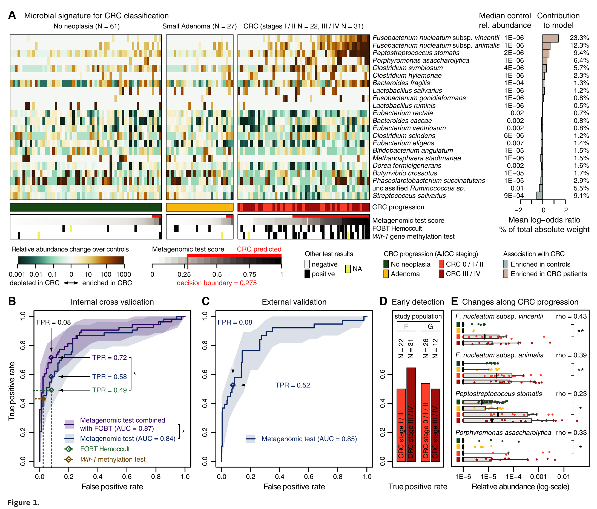
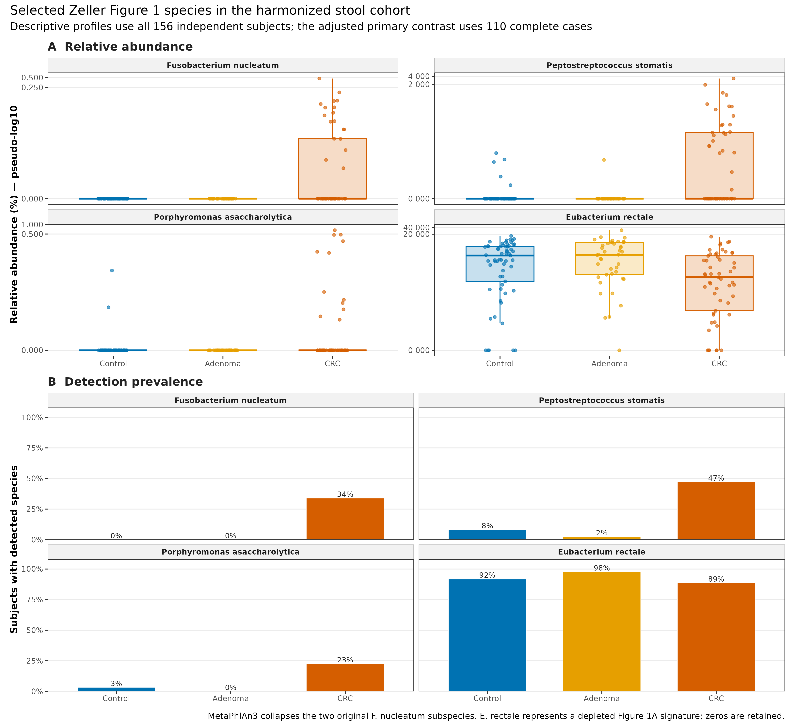
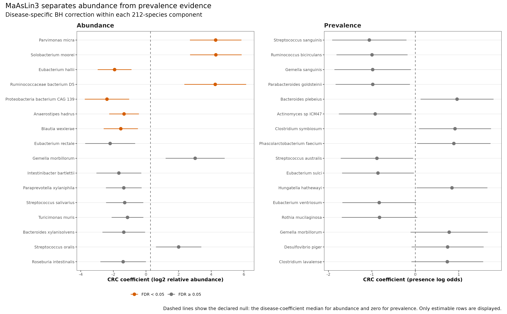
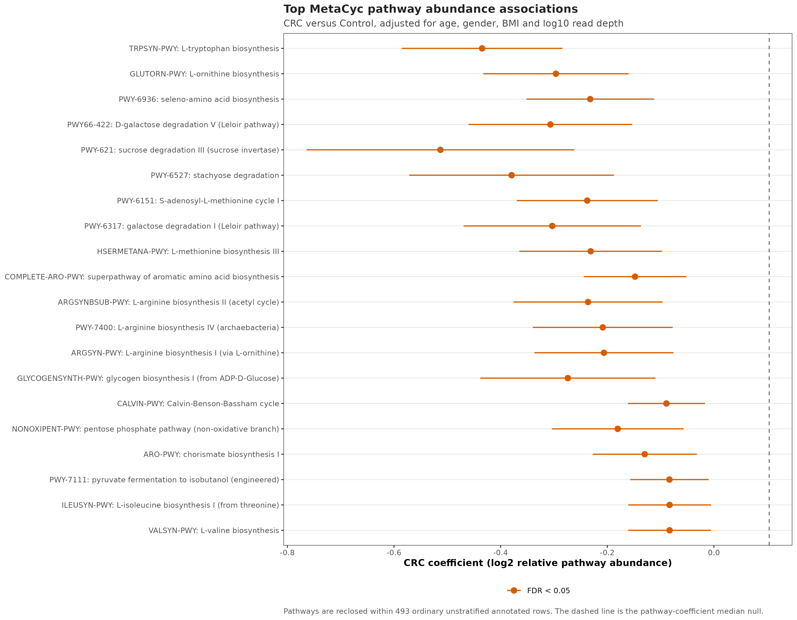
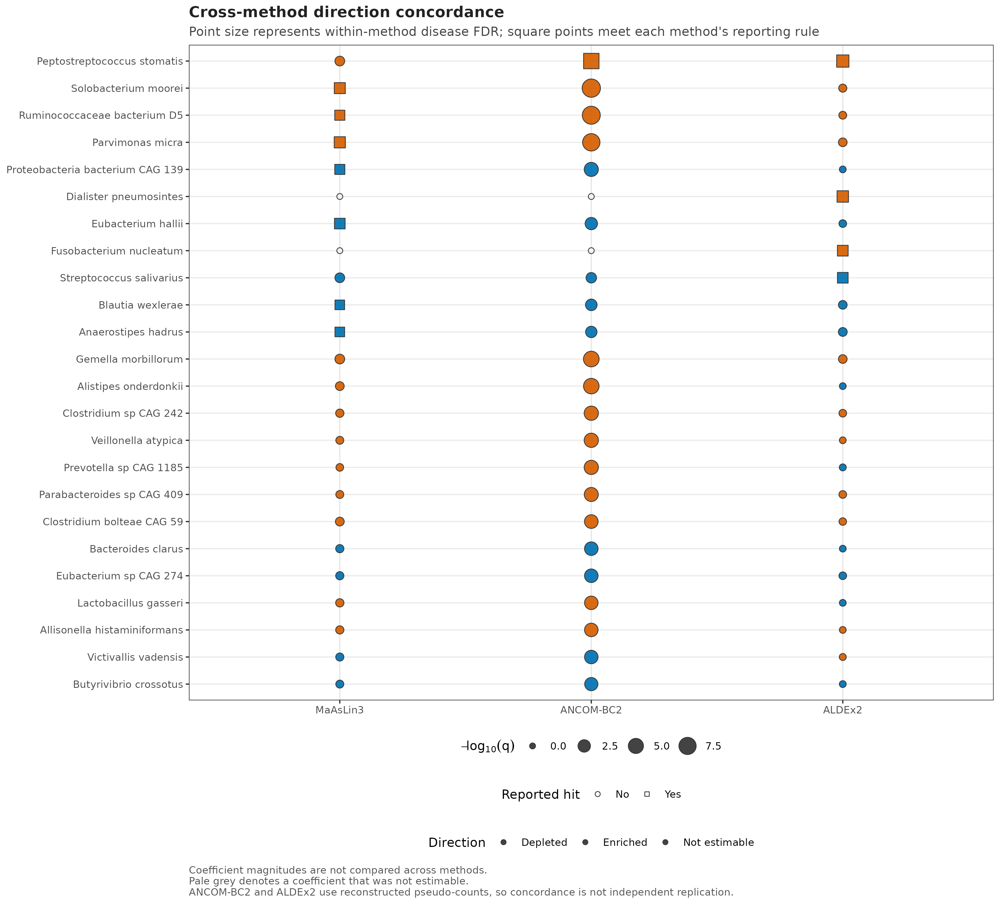

> **学习目标：**把“差异丰度”拆成输入单位、分析全集、模型问题、效应尺度和 FDR family；用 MaAsLin3 分开解释非零样本中的 abundance 与是否检出的 prevalence；把 ANCOM-BC2、ALDEx2 放在正确的 count-like 输入边界内，而不是让三个软件多数投票。  
> **真实数据：**`curatedMetagenomicData` 3.12.0 中 2021-03-31 发布的 `ZellerG_2014` MetaPhlAn3 物种谱、HUMAnN3 通路谱和临床元数据 [@zeller2014crc; @pasolli2017cmd]。  
> **推断边界：**主模型是 110 名有完整年龄、性别、BMI 和测序深度的独立受试者，比较 CRC 与 Control。Adenoma 不混入二分类对照；所有结果都是调整后的横断面相对组成关联，不是绝对丰度或因果证据。

## 这一步对应论文里的哪张图 {#sec-target}

Zeller 等的 Figure 1A 把 22 个物种组成的 CRC signature、临床检测结果和分类分数放在同一张热图里；Figure 1E 再展示两个 *Fusobacterium nucleatum* 亚种、*Peptostreptococcus stomatis* 和 *Porphyromonas asaccharolytica* 随肿瘤进展的丰度变化。Figure 4 转向功能层，提出 CRC 粪便微生物组从膳食纤维利用向宿主来源底物和氨基酸利用偏移 [@zeller2014crc]。

{#fig-24-anchor}

当前公开资源经过统一重处理，分辨率和原论文不完全相同：MetaPhlAn3 物种谱把原图中的两个 *F. nucleatum* 亚种合并为一个 species row；`Adenoma` 的 42 人也不等同于原图单列的 27 名 small adenoma。所以下图是对原论文生物学问题的**同队列、当前流程重分析**，不是每个数值和每个亚种都一一复刻。

{#fig-24-marker}

{#fig-24-two-part}

{#fig-24-function}

{#fig-24-concordance}

## 理论：先定义问题，再选择差异方法 {#sec-theory}

### 1. “差异”至少有两个生物学问题

一个稀疏物种可以通过两种方式与 CRC 相关：

- **abundance association：**在已经检出的样本中，它的相对丰度是否变化；
- **prevalence association：**它被检出的概率是否变化。

把零值加上任意 pseudocount 后只做一个线性模型，会把“是否出现”和“出现后有多少”压成同一效应。MaAsLin3 的两部分模型分别拟合这两个分量，并提供 joint test 检验至少一个分量是否偏离声明的原假设 [@nickols2026maaslin3]。joint 显著不代表两个分量都显著，正文仍应报告各自的系数、可估性和 q 值。

本文的 abundance 分量使用 TSS 后的 log transform，并启用 `median_comparison_abundance = TRUE`。因此单个 disease coefficient 的检验原假设不是 0，而是这一 metadata term 在全部物种中的 coefficient median；当前物种全集的 null 为 0.2757。prevalence 分量仍以 0 log odds 为原假设。

### 2. 稀疏模型先过“可估性门”，再看 p 值

如果某物种只在 CRC 组检出，logistic model 会发生 complete separation；如果某组只有几个非零样本，conditional abundance 也会极不稳定。本文预先规定：

- abundance 结论要求 Control 和 CRC 各至少 10 个非零样本；
- prevalence 结论要求两组都各至少 10 个 present 和 10 个 absent；
- 不满足条件的行仍保留在结果表，但标记为 `Estimable = FALSE`，不能进入结论。

这道门让“模型算出了一个巨大系数”和“数据支持稳定估计”成为两件事。本数据 212 个入选物种中，181 个可报告 abundance，144 个可报告 prevalence。

### 3. 三种方法的系数不在同一把尺子上

| Method | Primary question here | Input used here | Reported effect | Main restriction |
|---|---|---|---|---|
| MaAsLin3 1.5.3 | abundance + prevalence | relative fractions | log2 relative coefficient; presence log odds | primary method |
| ANCOM-BC2 2.12.0 | bias-corrected mean abundance | reconstructed pseudo-count | natural-log coefficient | robust sensitivity only |
| ALDEx2 1.42.0 | CLR difference under Monte Carlo sampling | reconstructed pseudo-count | expected CLR log2 coefficient | denominator sensitivity |

ANCOM-BC2 对 sampling fraction 与 compositional bias 建模 [@lin2024ancombc2]；ALDEx2 用 Dirichlet Monte Carlo 实例估计 CLR effect [@fernandes2014aldex2]。但这里没有原始 taxon read counts：pseudo-count 是

```text
round(species relative fraction × whole-metagenome read depth)
```

它既不是测序仪直接观察到的物种 reads，也不是绝对微生物负荷。因此 ANCOM-BC2 与 ALDEx2 只能回答“在这个重构规则下，方向和显著性是否敏感”，不能给 MaAsLin3 盖章，也不能把共识升级成独立验证。

### 4. FDR family 必须在看结果前写死

本文把 BH 校正分开做：species abundance、species prevalence、species joint、pathway abundance、pathway prevalence 和 pathway joint 各是一个 family。跨物种与通路混成一个 family 会回答另一个问题；从 package-reported q 与 disease-only q 中挑较小者则是结果驱动选择。结果表同时保存两者，但正文固定使用 disease contrast 内的 BH。

::: {.callout-important title="方向一致不等于三次独立重复"}
三个方法使用同一批 110 人；其中两法还使用同一张 reconstructed pseudo-count 表。它们共享样本、上游谱和误差来源。方法重叠只能写作 **cross-method concordance**，不能写作 independent replication、majority vote 或 ground truth。
:::

## 准备工作 {#sec-setup}

<details>
<summary><strong>展开：资源门槛、环境、数据下载与内联作图函数</strong></summary>

### 资源门槛

| Stage | CPU | RAM | Disk | Time |
|---|---:|---:|---:|---:|
| Read frozen inputs + tables | 1 | <2 GB | <10 MB | seconds |
| MaAsLin3 primary + sensitivities | 1 | recommend 4 GB | temporary output <1 GB | about 1–2 min |
| ANCOM-BC2 two branches | 1 | recommend 8 GB | included above | about 6 min |
| ALDEx2, 128 MC × two denominators | 1 | recommend 8 GB | included above | about 2–3 min |
| Four PDF/PNG/350-dpi TIFF figures | 1 | included above | a few MB | under 1 min |

普通笔记本可以读取冻结结果和重画图。完整重拟合建议留 8 GB RAM；无需 HPC，也不需要下载 MetaPhlAn/HUMAnN 大数据库。只有从 FASTQ 重新生成谱表时，才回到第 15 和第 19 篇的服务器流程。

### 锁定统计环境

```{bash}
#| eval: false
conda create -n metagenome-da-2026.07 \
  --file env/differential-abundance-linux-64.lock

conda run -n metagenome-da-2026.07 \
  Rscript env/install-differential-abundance-r.R
```

该锁对应 Linux-64、R 4.5.2、MaAsLin3 1.5.3、ANCOM-BC2 2.12.0 与 ALDEx2 1.42.0。MaAsLin3 固定到 commit `3a194ece449ef249354df394b58bfe3e6f951ca3`，源归档 SHA-256 为 `358f35e094e03026c8d694d731c0d1e1e6c9a15dec3c466649b9db9329ca1f07`。

### 一次性下载真实资源

```{bash}
#| eval: false
mkdir -p data/raw/article24

curl -fL -C - --retry 8 --retry-all-errors \
  -o data/raw/article24/2021-03-31.ZellerG_2014.relative_abundance.rda \
  https://mghp.osn.xsede.org/bir190004-bucket01/ExperimentHub/curatedMetagenomicData/2021-03-31/ZellerG_2014/2021-03-31.ZellerG_2014.relative_abundance.rda

curl -fL -C - --retry 8 --retry-all-errors \
  -o data/raw/article24/2021-03-31.ZellerG_2014.pathway_abundance.rda \
  https://mghp.osn.xsede.org/bir190004-bucket01/ExperimentHub/curatedMetagenomicData/2021-03-31/ZellerG_2014/2021-03-31.ZellerG_2014.pathway_abundance.rda

curl -fL -C - --retry 8 --retry-all-errors \
  -o data/raw/article24/maaslin3-3a194ece449ef249354df394b58bfe3e6f951ca3.tar.gz \
  https://codeload.github.com/biobakery/maaslin3/tar.gz/3a194ece449ef249354df394b58bfe3e6f951ca3

md5sum data/raw/article24/*.rda
sha256sum data/raw/article24/*.rda data/raw/article24/*.tar.gz
```

两个源文件的固定身份是：

| Payload | Bytes | MD5 | SHA-256 |
|---|---:|---|---|
| relative abundance | 147,044 | `a03686e5adc99d03ca1f026591bfcc84` | `d8e0f3fd00b2339b1aa929197ca0869c43990ff885a04fc675e70d4aff5604b2` |
| pathway abundance | 4,503,559 | `43e0f9599d8ec62aec6ffa0350351e7b` | `bf333a90b36cf875960d584500be6ce1dabb0240981f797493fd98ff1dc60bf6` |
| MaAsLin3 source | 677,967 | — | `358f35e094e03026c8d694d731c0d1e1e6c9a15dec3c466649b9db9329ca1f07` |

冻结成小表后，逐文件复核：

```{bash}
#| eval: false
Rscript scripts/prepare_article24_differential_data.R \
  --species-rda data/raw/article24/2021-03-31.ZellerG_2014.relative_abundance.rda \
  --pathway-rda data/raw/article24/2021-03-31.ZellerG_2014.pathway_abundance.rda \
  --output-dir data/small/24-differential-abundance

(cd data/small/24-differential-abundance && \
  sha256sum -c file-checksums.sha256)
```

### 内联依赖、确定性与作图函数

```{r}
#| eval: false
library(maaslin3)
library(ANCOMBC)
library(ALDEx2)
library(ggplot2)
library(patchwork)
library(scales)

RNGkind("Mersenne-Twister", "Inversion", "Rejection")
set.seed(20260724)

pal_pub <- c(
  Control = "#0072B2",
  Adenoma = "#E69F00",
  CRC = "#D55E00",
  Depleted = "#0072B2",
  Enriched = "#D55E00",
  Neutral = "#BDBDBD"
)

scale_color_pub <- function(...) {
  ggplot2::scale_color_manual(values = pal_pub, ...)
}

scale_fill_pub <- function(...) {
  ggplot2::scale_fill_manual(values = pal_pub, ...)
}

theme_pub <- function(base_size = 10) {
  ggplot2::theme_bw(base_size = base_size, base_family = "sans") +
    ggplot2::theme(
      panel.grid.minor = ggplot2::element_blank(),
      panel.grid.major.x = ggplot2::element_blank(),
      axis.text = ggplot2::element_text(color = "black"),
      axis.title = ggplot2::element_text(face = "bold"),
      strip.background = ggplot2::element_rect(
        fill = "grey95", color = "grey70"
      ),
      strip.text = ggplot2::element_text(face = "bold"),
      legend.position = "bottom",
      plot.title = ggplot2::element_text(face = "bold")
    )
}

save_pub <- function(
  plot,
  file_base,
  width = 190,
  height = 120,
  dpi = 350
) {
  ggplot2::ggsave(
    paste0(file_base, ".pdf"), plot,
    width = width, height = height, units = "mm",
    device = grDevices::cairo_pdf, bg = "white"
  )
  ggplot2::ggsave(
    paste0(file_base, ".png"), plot,
    width = width, height = height, units = "mm",
    dpi = dpi, bg = "white"
  )
  ggplot2::ggsave(
    paste0(file_base, ".tiff"), plot,
    width = width, height = height, units = "mm",
    dpi = dpi, compression = "lzw", bg = "white"
  )
  invisible(plot)
}
```

</details>

## 可复制代码：从谱表到三种方法 {#sec-code}

### 第 1 步：读表并锁定 110 名独立受试者

```{r}
input_dir <- "data/small/24-differential-abundance"

read_species_profile <- function(path) {
  tab <- read.delim(
    gzfile(path), check.names = FALSE,
    quote = "", comment.char = ""
  )
  stopifnot(identical(names(tab)[1:2], c("Feature", "Species")))
  abundance <- data.matrix(tab[, -(1:2), drop = FALSE])
  rownames(abundance) <- sprintf("SP%04d", seq_len(nrow(tab)))
  list(
    abundance = abundance,
    map = data.frame(
      FeatureID = rownames(abundance),
      Feature = tab$Feature,
      Species = tab$Species
    )
  )
}

read_pathway_profile <- function(path) {
  tab <- read.delim(
    gzfile(path), check.names = FALSE,
    quote = "", comment.char = ""
  )
  stopifnot(identical(names(tab)[1], "Pathway"))
  abundance <- data.matrix(tab[, -1, drop = FALSE])
  rownames(abundance) <- sprintf("PW%04d", seq_len(nrow(tab)))
  list(
    abundance = abundance,
    map = data.frame(
      FeatureID = rownames(abundance),
      Pathway = tab$Pathway
    )
  )
}

species_input <- read_species_profile(file.path(
  input_dir, "species-relative-abundance.tsv.gz"
))
pseudocount_input <- read_species_profile(file.path(
  input_dir, "species-pseudocounts.tsv.gz"
))
pathway_input <- read_pathway_profile(file.path(
  input_dir, "pathway-relative-abundance.tsv.gz"
))
metadata_all <- read.delim(
  file.path(input_dir, "sample-metadata.tsv"),
  check.names = FALSE
)

stopifnot(
  identical(dim(species_input$abundance), c(661L, 156L)),
  identical(dim(pathway_input$abundance), c(493L, 156L)),
  identical(
    colnames(species_input$abundance),
    metadata_all$sample_id
  ),
  length(unique(metadata_all$subject_id)) == 156L,
  max(abs(colSums(species_input$abundance) - 1)) < 2e-6,
  max(abs(colSums(pathway_input$abundance) - 1)) < 2e-7
)

primary_raw <- metadata_all[metadata_all$primary_complete_case, ]
primary_ids <- primary_raw$sample_id
stopifnot(
  nrow(primary_raw) == 110L,
  identical(
    as.integer(table(factor(
      primary_raw$analysis_group,
      levels = c("Control", "CRC")
    ))),
    c(59L, 51L)
  )
)

head(metadata_all[, c(
  "sample_id", "subject_id", "analysis_group",
  "age", "gender", "BMI", "number_reads"
)])
```

这里最容易犯的错误是把源 taxonomic matrix 的七个 rank 一起闭合。源文件 1,019 行、每列总和约 700%；只保留 `|s__` 行后得到 661 个 species、每列才约 100%。功能谱也先删除 stratified rows 和 `UNMAPPED/UNGROUPED/UNINTEGRATED`，再在 493 条 ordinary unstratified pathways 内重闭合。这个 pathway 分母不代表“全部微生物代谢潜力”。

### 第 2 步：协变量、参考水平和 feature universe

```{r}
z_score <- function(x) as.numeric(scale(as.numeric(x)))

primary_metadata <- data.frame(
  disease = factor(
    primary_raw$analysis_group,
    levels = c("Control", "CRC")
  ),
  z_age = z_score(primary_raw$age),
  gender = factor(
    primary_raw$gender,
    levels = c("female", "male")
  ),
  z_BMI = z_score(primary_raw$BMI),
  z_log10_reads = z_score(log10(primary_raw$number_reads)),
  row.names = primary_ids,
  check.names = FALSE
)

species_all <- species_input$abundance[, primary_ids, drop = FALSE]
pathway_all <- pathway_input$abundance[, primary_ids, drop = FALSE]
pseudo_all <- pseudocount_input$abundance[, primary_ids, drop = FALSE]

species_keep <- rowMeans(species_all > 0.0001) >= 0.10
pathway_keep <- rowMeans(pathway_all > 0.00001) >= 0.20

species <- species_all[species_keep, , drop = FALSE]
pathways <- pathway_all[pathway_keep, , drop = FALSE]
pseudo <- pseudo_all[species_keep, , drop = FALSE]

stopifnot(
  nrow(species) == 212L,
  nrow(pathways) == 394L,
  qr(model.matrix(
    ~ disease + z_age + gender + z_BMI + z_log10_reads,
    primary_metadata
  ))$rank == 6L
)

c(
  subjects = nrow(primary_metadata),
  species = nrow(species),
  pathways = nrow(pathways)
)
```

阈值的单位是 fraction：`0.0001` 等于 0.01%，`0.00001` 等于 0.001%。阈值在 110 人主集合内一次性应用，不能看完 volcano plot 再改。

### 第 3 步：MaAsLin3 两部分主模型

```{r}
#| eval: false
set.seed(20260724)

fit_species <- maaslin3::maaslin3(
  input_data = as.data.frame(t(species), check.names = FALSE),
  input_metadata = primary_metadata,
  output = "results/24-differential-abundance/maaslin3-species-work",
  formula = "~ disease + z_age + gender + z_BMI + z_log10_reads",
  min_abundance = 0,
  min_prevalence = 0,
  max_prevalence = 1.01,
  zero_threshold = 0,
  min_variance = 0,
  normalization = "TSS",
  transform = "LOG",
  correction = "BH",
  standardize = FALSE,
  median_comparison_abundance = TRUE,
  median_comparison_prevalence = FALSE,
  subtract_median = FALSE,
  augment = TRUE,
  cores = 1,
  save_models = FALSE,
  plot_summary_plot = FALSE,
  plot_associations = FALSE,
  verbosity = "ERROR"
)

extract_disease <- function(component, label) {
  x <- as.data.frame(component$results)
  x <- x[x$metadata == "disease", ]
  x$Component <- label
  error_free <- is.na(x$error) | !nzchar(trimws(x$error))
  p <- ifelse(error_free, x$pval_individual, NA_real_)
  x$QDiseaseBH <- p.adjust(p, method = "BH")
  x
}

maaslin_species <- rbind(
  extract_disease(fit_species$fit_data_abundance, "Abundance"),
  extract_disease(fit_species$fit_data_prevalence, "Prevalence")
)

# Pathway 使用同一个模型合同；FDR 在 pathway component 内另算。
set.seed(20260724)
fit_pathway <- maaslin3::maaslin3(
  input_data = as.data.frame(t(pathways), check.names = FALSE),
  input_metadata = primary_metadata,
  output = "results/24-differential-abundance/maaslin3-pathway-work",
  formula = "~ disease + z_age + gender + z_BMI + z_log10_reads",
  min_abundance = 0,
  min_prevalence = 0,
  max_prevalence = 1.01,
  zero_threshold = 0,
  min_variance = 0,
  normalization = "TSS",
  transform = "LOG",
  correction = "BH",
  standardize = FALSE,
  median_comparison_abundance = TRUE,
  median_comparison_prevalence = FALSE,
  subtract_median = FALSE,
  augment = TRUE,
  cores = 1,
  save_models = FALSE,
  plot_summary_plot = FALSE,
  plot_associations = FALSE,
  verbosity = "ERROR"
)
```

`QDiseaseBH` 是本文主报告列；MaAsLin3 自带的 package-reported q 仍原样保存以便审计。对 prevalence，还要把每组 present/absent 计数与结果合并，只允许四个格子都至少为 10 的行进入正文。

### 第 4 步：ANCOM-BC2 与 pseudo-count sensitivity

```{r}
#| eval: false
ancom_metadata <- primary_metadata[, c(
  "disease", "z_age", "gender", "z_BMI"
)]

stopifnot(
  all(pseudo >= 0),
  max(abs(pseudo - round(pseudo))) == 0
)

set.seed(20260724)
fit_ancom <- ANCOMBC::ancombc2(
  data = pseudo,
  taxa_are_rows = TRUE,
  aggregate_data = pseudo,
  meta_data = ancom_metadata,
  fix_formula = "disease + z_age + gender + z_BMI",
  rand_formula = NULL,
  p_adj_method = "BH",
  pseudo = 0,
  pseudo_sens = TRUE,
  prv_cut = 0,
  lib_cut = 0,
  s0_perc = 0.05,
  group = NULL,
  struc_zero = FALSE,
  neg_lb = FALSE,
  alpha = 0.05,
  n_cl = 1,
  verbose = FALSE,
  global = FALSE,
  pairwise = FALSE,
  dunnet = FALSE,
  trend = FALSE
)

ancom <- fit_ancom$res
ancom_result <- data.frame(
  FeatureID = ancom$taxon,
  Coefficient = ancom$lfc_diseaseCRC,
  PValue = ancom$p_diseaseCRC,
  QDiseaseBH = p.adjust(ancom$p_diseaseCRC, "BH"),
  PassedPseudoSensitivity = ancom$passed_ss_diseaseCRC,
  RobustHit = ancom$diff_robust_diseaseCRC
)
```

主结论只把 `diff_robust_diseaseCRC` 记为 ANCOM-BC2 hit。`pseudo_sens = TRUE` 失败的显著项不能绕过 robustness gate。这里不加入 `z_log10_reads`，因为 ANCOM-BC2 已把 sampling fraction 当作模型的一部分；年龄、性别和 BMI 与主模型保持一致。

### 第 5 步：ALDEx2 与 denominator sensitivity

```{r}
#| eval: false
aldex_model <- model.matrix(
  ~ disease + z_age + gender + z_BMI,
  data = ancom_metadata
)

set.seed(20260724)
clr_all <- ALDEx2::aldex.clr(
  round(pseudo),
  aldex_model,
  mc.samples = 128,
  denom = "all",
  verbose = FALSE,
  useMC = FALSE
)
aldex_glm <- ALDEx2::aldex.glm(
  clr_all,
  verbose = FALSE,
  fdr.method = "BH"
)

aldex_result <- data.frame(
  FeatureID = rownames(aldex_glm),
  Coefficient = aldex_glm[, "diseaseCRC:Est"],
  PValue = aldex_glm[, "diseaseCRC:pval"],
  QDiseaseBH = p.adjust(
    aldex_glm[, "diseaseCRC:pval"],
    method = "BH"
  ),
  QPackageBH = aldex_glm[, "diseaseCRC:pval.padj"]
)
```

ALDEx2 1.42.0 的 `QPackageBH` 是先在每个 Monte Carlo instance 内对 disease p 值做 BH、再对 128 次结果取期望；本文的 `QDiseaseBH` 则先对 p 值取期望、再在 disease feature family 内做 BH。由于“先校正后求期望”与“先求期望后校正”不可交换，两列不必相等。两者都保存，主文只读预声明的 `QDiseaseBH`。IQLR 分支先在 Control、CRC 和全体中分别找处于 CLR variance 四分位区间的 features，再取交集；本数据得到 62 个 denominator features。直接把 `denom = "iqlr"` 与 model matrix 混用会在该版本触发下标错误，显式 feature vector 才能保持同一定义。

### 第 6 步：读取冻结结果并只汇报可报告行

```{r}
result_dir <- "results/24-differential-abundance"

summary24 <- jsonlite::fromJSON(file.path(
  result_dir, "validation-summary.json"
))
summary_table <- data.frame(
  Metric = c(
    "Primary subjects", "Species universe",
    "Pathway universe", "Estimable species prevalence",
    "MaAsLin3 species abundance hits",
    "MaAsLin3 species prevalence hits",
    "MaAsLin3 pathway abundance hits",
    "ANCOM-BC2 robust hits", "ALDEx2 hits",
    "Reported by all three methods"
  ),
  Value = c(
    summary24$primary_samples,
    summary24$species_features,
    summary24$pathway_features,
    summary24$species_prevalence_estimable,
    summary24$maaslin3_species_abundance_hits,
    summary24$maaslin3_species_prevalence_hits,
    summary24$maaslin3_pathway_abundance_hits,
    summary24$ancombc2_robust_hits,
    summary24$aldex2_hits,
    summary24$all_three_reported_hits
  )
)
knitr::kable(summary_table, align = c("l", "r"))
```

```{r}
species_results <- read.delim(
  gzfile(file.path(result_dir, "maaslin3-species.tsv.gz")),
  check.names = FALSE
)
top_species <- subset(
  species_results,
  Component == "Abundance" & Reportable & is.finite(QDiseaseBH)
)
top_species <- top_species[order(top_species$QDiseaseBH), ]
top_species <- head(top_species[, c(
  "Label", "Coefficient", "NullHypothesis",
  "FoldChangeOrOddsRatio", "QDiseaseBH"
)], 8)
names(top_species)[1] <- "Species"
top_species[, -1] <- lapply(top_species[, -1], signif, digits = 3)
knitr::kable(top_species, align = c("l", rep("r", 4)))
```

`Parvimonas micra` 与 `Solobacterium moorei` 是当前 abundance model 最靠前的 CRC-enriched species；`Eubacterium hallii`、`Anaerostipes hadrus` 和 `Blautia wexlerae` 为 depleted。这里的 `2^Coefficient` 是相对尺度上的组间 fold change；p 值检验的却是 coefficient 是否偏离 0.2757 的 median null，不能把虚线误读为零。

prevalence 的最小 disease-only q 为 0.457，因而 144 个可估物种中没有 FDR < 0.05 的 prevalence hit。这个“0”是结果，不应通过放松 present/absent 门槛或只报 nominal p 来消除。

```{r}
pathway_results <- read.delim(
  gzfile(file.path(result_dir, "maaslin3-pathways.tsv.gz")),
  check.names = FALSE
)
top_pathways <- subset(
  pathway_results,
  Component == "Abundance" & Reportable & is.finite(QDiseaseBH)
)
top_pathways <- top_pathways[order(top_pathways$QDiseaseBH), ]
top_pathways <- head(top_pathways[, c(
  "Label", "Coefficient", "NullHypothesis", "QDiseaseBH"
)], 8)
names(top_pathways)[1] <- "MetaCyc pathway"
top_pathways[, -1] <- lapply(top_pathways[, -1], signif, digits = 3)
knitr::kable(top_pathways, align = c("l", rep("r", 3)))
```

当前分析有 50 条 pathway abundance associations。最靠前的是 `TRPSYN-PWY: L-tryptophan biosynthesis`，其 coefficient 为 −0.435、q = 5.68 × 10^-7；但这是 ordinary-pathway closure 下的相对功能潜力，不是转录活性、代谢物流量或宿主血液代谢物浓度。

## 审计与升级：从“差异菌名单”到证据合同 {#sec-audit}

### 原论文结论与当前重分析不能混写

原论文使用当时的物种/基因处理、feature selection 和分类流程，报告了内部 AUC 0.84、外部 AUC 0.85，并围绕 CRC marker species 与 KEGG/CAZy 功能变化展开 [@zeller2014crc]。本文使用同一研究的 cMD 统一重处理谱，但更换了 feature universe、协变量模型、分类分辨率、功能数据库表和统计方法。因此可以写“以 Figure 1/4 为问题锚点进行当前重分析”，不能写“精确复现 Figure 1/4 数值”。

*F. nucleatum* 在当前 cMD 表中只有一个 species row，而且 Control 中 0/61、CRC 中 18/53 被检出。它通过预声明的 0.01% × 10% filter，却因 Control 没有非零值而无法估计 conditional abundance，也不满足每组至少 10 present/10 absent 的 prevalence gate。ALDEx2 给出 q = 0.00575，只能作为 reconstructed pseudo-count 下的 CLR sensitivity，不能覆盖前两项可估性失败。

### 三种方法没有形成“共同真值”

主分析得到：

- MaAsLin3 species abundance：7 个 FDR hits；prevalence：0 个；
- ANCOM-BC2：只有 *Peptostreptococcus stomatis* 通过 package significance 与 pseudo-sensitivity robustness gate；
- ALDEx2：4 个 disease-only BH hits；
- 三法方向一致的 species 有 125/212，但被三法同时报告为 hit 的 species 为 0。

*P. stomatis* 很能说明为什么不能投票：ANCOM-BC2 robust、ALDEx2 q = 0.000214，而 MaAsLin3 abundance q = 0.139。它不是“2 票对 1 票所以为真”，而是三种 estimand 与输入假设给出不同证据强度。

### 预声明敏感性分支

```{r}
sensitivity <- read.delim(file.path(
  result_dir, "sensitivity-audit.tsv"
), check.names = FALSE)

sensitivity_show <- sensitivity[, c(
  "Method", "Variant", "Units", "Features",
  "SignificantFDR05", "EffectSpearmanWithPrimary",
  "DirectionAgreementWithPrimary"
)]
sensitivity_show$EffectSpearmanWithPrimary <- round(
  sensitivity_show$EffectSpearmanWithPrimary, 3
)
sensitivity_show$DirectionAgreementWithPrimary <- round(
  sensitivity_show$DirectionAgreementWithPrimary, 3
)
knitr::kable(sensitivity_show, align = c("l", "l", rep("r", 5)))
```

MaAsLin3 关闭 median comparison 后从 7 个变为 5 个 hits；把物种 filter 提到 20% prevalence 后，149 个 features 中有 3 个 hits；去掉 BMI 后纳入 114 人，仍有 7 个；把 Control/Adenoma/CRC 固定编码为 0/1/2 的线性趋势模型，在 151 名完整病例中有 8 个。最后一个分支只检验等距线性趋势，不能自动证明 adenoma 是 CRC 的连续中间态。

ANCOM-BC2 不做预声明 filter 时在 634 个非全零物种中得到 2 个 robust hits；ALDEx2 把 denominator 从 all features 改为 62-feature IQLR 后仍为 4 个 hits，效应 Spearman 相关为 1.000，但有 1.4% 的非零方向发生变化。它们说明主结果对若干选择较稳定，也同时量化了结论对 filter、null 和 denominator 的依赖。

::: {.callout-warning title="功能显著不等于功能发生"}
HUMAnN pathway abundance 是 DNA 层面的编码潜力。若要写“通路被激活”“代谢通量升高”或“宿主暴露增加”，至少还需要 metatranscriptomics、metabolomics、绝对负荷或实验验证。横断面调整模型也不能区分肿瘤导致微生态改变，还是微生态参与肿瘤发生。
:::

## 出版级美化 {#sec-polish}

差异结果最适合画“效应 + 不确定性 + FDR”，不是只画 −log10(p)：

1. abundance 与 prevalence 分成两个 panel，不共用 x 轴标题；
2. coefficient 点配 95% Wald interval，颜色标记预声明 FDR；
3. abundance 的虚线画 median null，prevalence 的虚线画 0；
4. 稀疏原始值保留零，显示时用 pseudo-log，不为作图改分析数据；
5. 跨方法图只编码方向、q 和 hit gate，不横向比较三种 coefficient 大小；
6. 所有可见文字用英文，PDF/PNG/350-dpi LZW TIFF 同时导出。

```{r}
#| eval: false
plot_data <- subset(
  species_results,
  Component == "Abundance" & Reportable & is.finite(StdError)
)
plot_data <- head(plot_data[order(plot_data$QDiseaseBH), ], 16)
plot_data$Lower <- plot_data$Coefficient - 1.96 * plot_data$StdError
plot_data$Upper <- plot_data$Coefficient + 1.96 * plot_data$StdError
plot_data$FDR <- ifelse(
  plot_data$QDiseaseBH < 0.05,
  "FDR < 0.05", "FDR ≥ 0.05"
)
plot_data$Label <- factor(plot_data$Label, rev(plot_data$Label))

p <- ggplot(
  plot_data,
  aes(y = Label, x = Coefficient, colour = FDR)
) +
  geom_vline(
    xintercept = median(plot_data$NullHypothesis),
    linetype = 2, colour = "grey40"
  ) +
  geom_segment(aes(x = Lower, xend = Upper, yend = Label)) +
  geom_point(size = 2.4) +
  scale_colour_manual(values = c(
    "FDR < 0.05" = "#D55E00",
    "FDR ≥ 0.05" = "#777777"
  )) +
  labs(
    x = "CRC coefficient (log2 relative abundance)",
    y = NULL, colour = NULL
  ) +
  theme_pub()

save_pub(p, "figures/24-species-abundance-forest")
```

## 常见坑 {#sec-pitfalls}

::: {.callout-caution title="坑 1：把七个 taxonomy ranks 混进一张 composition"}
cMD taxonomic source 的每个 rank 都各自约为 100%，所以原矩阵列和约 700%。必须先固定 species-level rows；否则同一生物量被重复七次。
:::

::: {.callout-caution title="坑 2：把 reconstructed pseudo-count 写成 raw taxon count"}
`round(relative_fraction × number_reads)` 只是一种方便变换。`number_reads` 是 whole metagenome depth，不是已归到每个物种的原始 reads；Methods、表头和图注都要保留这个限制。
:::

::: {.callout-caution title="坑 3：把 abundance 与 prevalence 系数合并"}
一个是非零样本中的 log2 relative coefficient，一个是 presence log odds。方向可以不同，joint p 也不能替代两个 component 的结果。
:::

::: {.callout-caution title="坑 4：complete separation 仍硬报巨大 OR"}
某组全零时，有限 coefficient 可能只是优化器或正则化的产物。先报 present/absent 四格计数，再执行可估性门。
:::

::: {.callout-caution title="坑 5：看结果后改 filter 或 FDR family"}
把 10% 改成 20%、去掉 BMI、换 denominator 都可以做，但只能作为带标签的 sensitivity branch。不要从多个版本里选 q 最小的一张图。
:::

::: {.callout-caution title="坑 6：把三法交集称为独立验证"}
同一队列、同一 feature table 不是独立 replication。真正的验证需要另一个独立队列，并在外部测试前锁定 feature mapping、方向和阈值。
:::

::: {.callout-caution title="坑 7：把相对通路丰度写成代谢通量"}
重闭合后的 MetaCyc pathway 只在 493 条 ordinary annotated rows 内解释。缺少转录、代谢物和绝对负荷时，不写 activation、production 或 flux。
:::

## 这段 Methods 怎么写 {#sec-methods}

> Species-level relative-abundance and ordinary unstratified MetaCyc pathway profiles were obtained from the 2021-03-31 ZellerG_2014 release of curatedMetagenomicData v3.12.0. The primary analysis included 110 independent subjects with complete age, sex, BMI, and whole-metagenome read-depth data (59 controls and 51 colorectal-cancer cases); adenoma samples were excluded from the binary contrast. Species were retained when their relative abundance exceeded 0.01% in at least 10% of subjects, and pathways were retained when they exceeded 0.001% of the ordinary-pathway denominator in at least 20% of subjects. MaAsLin3 v1.5.3 (commit 3a194ece449ef249354df394b58bfe3e6f951ca3) was fitted with TSS normalization, log transformation, a compositional median null for abundance, a zero null for prevalence, and fixed effects for disease, standardized age, sex, standardized BMI, and standardized log10 read depth. Disease-term p values were adjusted by the Benjamini–Hochberg procedure separately within each feature space and model component. Prevalence associations were reported only when each disease group contained at least 10 present and 10 absent subjects. ANCOM-BC2 v2.12.0 with pseudo-count sensitivity enabled and ALDEx2 v1.42.0 with 128 Monte Carlo instances were used as sensitivity analyses on reconstructed pseudo-counts defined as rounded species relative abundance multiplied by whole-metagenome read depth; these values were not interpreted as observed taxon counts or absolute abundance. All stochastic steps used seed 20260724.

cMD 的 2021-03-31 payload 是本文可核验的数据 release。它继承了 cMD 统一重处理所用的 MetaPhlAn3、HUMAnN3 与数据库映射；本文没有本地重跑数据库，也没有从 payload 中恢复出更细的 marker/MetaCyc database build identifier。投稿时应把这项 provenance limitation 原样写入 Methods 或 Data availability，不能自行补一个未核实的数据库版本。

## 换成你自己的数据怎么做 {#sec-own-data}

你至少需要两张表：

- `species_relative.tsv`：行是同一 taxonomy release 下的 species，列是独立生物样本，值是 0–1 fraction；
- `metadata.tsv`：每行一个样本，含 sample ID、subject ID、主分组、预声明混杂因素和测序深度。

如果有 HUMAnN 通路表，先决定分析 `pathabundance` 的 community total 还是 stratified contributions；不要把两者混在同一 feature universe。如果有真实 taxon counts，ANCOM-BC2/ALDEx2 可以升级为主分析，但仍要说明 feature assignment、library denominator 和过滤规则。如果另有 spike-in、flow cytometry、qPCR 或每克粪便总微生物负荷，可同时报告 absolute abundance；不要从 relative composition 反推绝对变化。

开始拟合前先写下：

1. 哪一行是独立受试者，重复测量如何进入 random effect；
2. case、reference 和需要排除的中间状态；
3. 协变量、缺失值策略和是否可能受结局影响；
4. abundance/prevalence 的阈值与可估性门；
5. 每个 feature space、component 和 contrast 的 FDR family；
6. 主方法、敏感性方法、效应尺度和输入单位；
7. 预声明 sensitivity branches，而不是看结果后再挑参数；
8. 外部队列如何做 feature mapping 和真正的 holdout replication。

完整运行与审计命令为：

```{bash}
#| eval: false
conda run -n metagenome-da-2026.07 \
  Rscript scripts/validate_article24_differential_abundance.R \
    --project-root . \
    --input-dir data/small/24-differential-abundance \
    --output-dir results/24-differential-abundance \
    --figure-dir figures \
    --maaslin-archive data/raw/article24/maaslin3-3a194ece449ef249354df394b58bfe3e6f951ca3.tar.gz
```

输出表保留模型报错、可估性、两套 q 值、效应尺度和 input boundary；把这些列一起交给合作者，比只交一张“显著菌 Excel”更能抵抗审稿追问。

## 参考 {#sec-references}

- Zeller 等的 CRC signature、Figure 1 与功能改变：[@zeller2014crc]
- curatedMetagenomicData 的可访问、统一整理资源：[@pasolli2017cmd]
- MaAsLin3 两部分 multivariable association framework：[@nickols2026maaslin3]
- ANCOM-BC2 的 covariate-adjusted compositional inference：[@lin2024ancombc2]
- ALDEx2 的 compositional Monte Carlo framework：[@fernandes2014aldex2]
