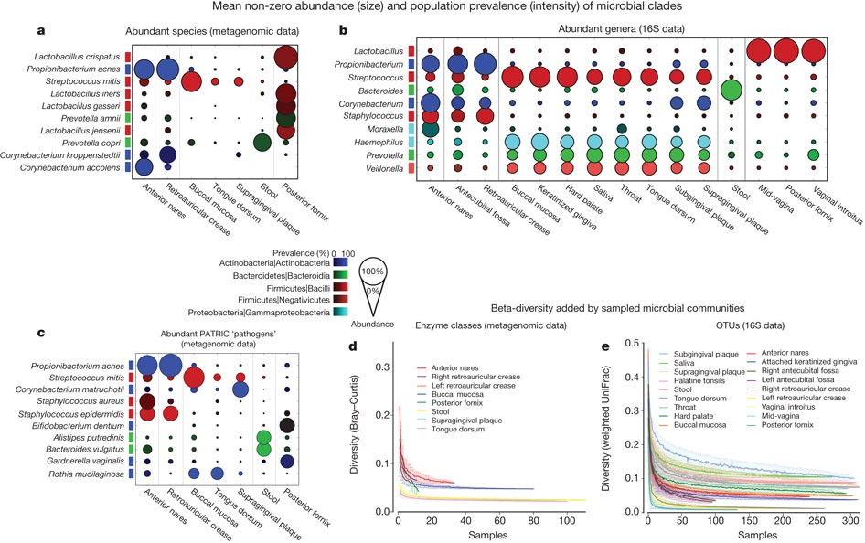
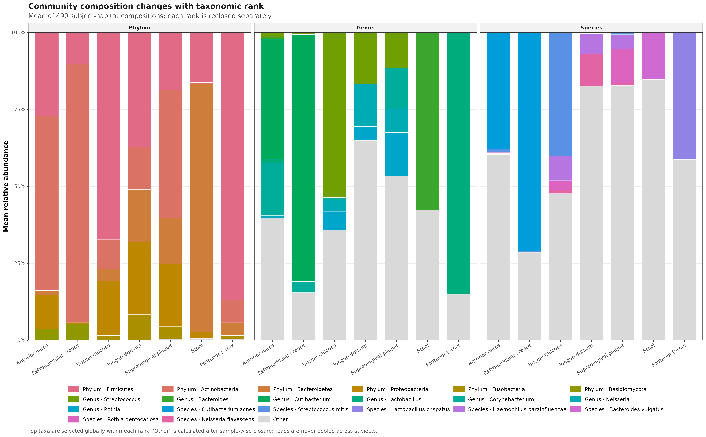
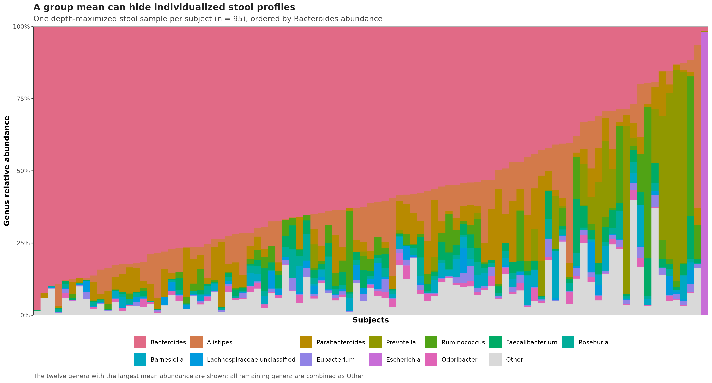
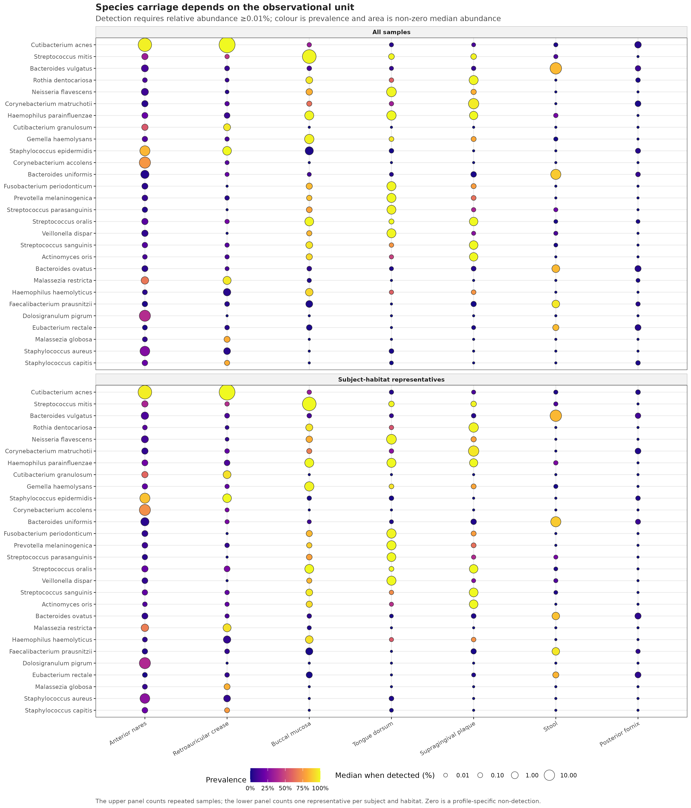
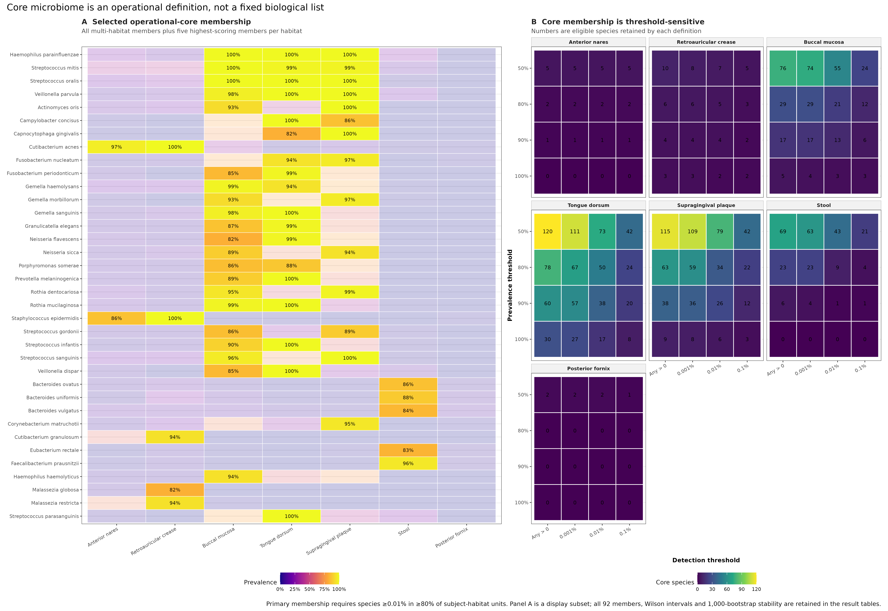

> **学习目标：**把“组成”拆成分类层级、样本闭合与个体异质性；把“核心微生物组”写成可审计的 detection threshold × prevalence threshold 规则，并用 Wilson 区间、受试者 bootstrap 和阈值网格报告不确定性。  
> **真实数据：**`curatedMetagenomicData` 3.12.0 中 2021-03-31 发布的 `HMP_2012` MetaPhlAn3 相对丰度谱与临床元数据 [@pasolli2017cmd; @beghini2021biobakery]。  
> **推断边界：**结果描述健康 HMP 队列中 7 个具体 body habitats 的相对组成和检出模式；它们不是绝对微生物负荷、培养学存在证明、疾病效应或因果效应。

## 这一步对应论文里的哪张图 {#sec-target}

Human Microbiome Project 的 Figure 3 把两个经常被堆叠柱图混在一起的问题分开了：颜色深浅表示人群检出率，圆点面积表示检出后的平均非零丰度。Figure 3a 和 3c 的 shotgun panels 使用 7 个具体 habitat，而 Figure 3b 的 16S panel 才扩展到更多亚位点 [@hmp2012structure]。

{#fig-25-anchor}

这里沿用 Figure 3a/3c 的 7 个 shotgun habitats：anterior nares、retroauricular crease、buccal mucosa、tongue dorsum、supragingival plaque、stool 和 posterior fornix。公开资源经过统一的 bioBakery 3 重处理，分类数据库、物种命名与原论文分析年代不同；因此下面是**同队列、同图形问题的当前流程重分析**，不是逐像素复刻。一个明显例子是原图的 *Propionibacterium acnes* 在当前分类中显示为 *Cutibacterium acnes*。

{#fig-25-multirank}

{#fig-25-individual}

{#fig-25-carriage}

{#fig-25-core}

## 理论：组成、检出和核心是三个不同对象 {#sec-theory}

### 1. 每个分类层级都要单独闭合

MetaPhlAn 的完整 lineage table 同时含 kingdom、phylum、class、order、family、genus 和 species。把所有行直接当成同一张组成表，会让一个样本中的同一批 reads 沿谱系重复出现。本文只提取 terminal token 分别为 `p__`、`g__` 和 `s__` 的行，然后在每个 rank 内重闭合：

$$
x_{ijs}^{(r)}=
\frac{a_{ijs}^{(r)}}{\sum_{k \in r}a_{kjs}^{(r)}} ,
\qquad
\sum_{i \in r}x_{ijs}^{(r)}=1.
$$

这里 $r$ 是分类层级，$i$ 是 taxon，$j$ 是样本。phylum、genus、species 柱子各自和为 100%，但三者不能拼成一个共同分母，也不能用不同 rank 的柱高比较“谁更多”。

### 2. 先闭合每个样本，再求组均值

组组成采用 sample-wise closed composition 的算术均值：

$$
\bar{x}_{ih}=\frac{1}{n_h}\sum_{j \in h}x_{ij}.
$$

这让每个受试者-habitat 单位权重相同。先把所有人的 reads 加总再计算比例，会让测序更深的样本获得更大权重，得到的是 pooled-library composition，而不是“典型受试者的平均组成”。均值堆叠图适合比较群体中心，却会隐藏图 @fig-25-individual 中的个体异质性，所以发表时至少补一张 individual composition、ordination 或分布图。

### 3. prevalence 和 abundance 要分开编码

给定 detection threshold $t$，taxon $i$ 在 habitat $h$ 的检出率定义为：

$$
\hat{\pi}_{ih}(t)=\frac{1}{n_h}
\sum_{j \in h}I(x_{ij}\ge t).
$$

本文主阈值 $t=0.0001$，即 0.01% relative abundance。圆点面积使用检出样本中的中位丰度，而不是把零值一起平均。这样“大而浅”表示少数携带者中丰度高，“小而深”表示普遍出现但每次丰度低。

谱表中的零只表示“在当前样本、数据库、软件版本和阈值下未检出”。它不能证明生物学缺失。测序深度、宿主污染、参考数据库覆盖和物种可分辨性都会改变零的含义。

### 4. 核心微生物组必须带定义

本文的 operational core 是：

$$
C_h(t,p)=\left\{i:\hat{\pi}_{ih}(t)\ge p\right\},
$$

主分支取 $t=0.01\%$、$p=80\%$。文献中的 abundance 与 occurrence thresholds 差异很大，并不存在脱离 habitat、采样强度和研究问题的唯一“核心名单” [@shade2012core; @neu2021core]。因此结果必须同时写出：

- taxonomic rank；
- detection threshold 及其单位；
- prevalence threshold；
- 分母中的独立观察单位；
- 未分类 taxa 的处理；
- 对阈值与抽样误差的敏感性。

### 5. 点估计过线，不等于成员稳定

prevalence 是二项比例。本文为每个比例保存 Wilson 95% interval，并在每个 habitat 内以受试者为单位做 1,000 次 bootstrap。某 species 的 bootstrap inclusion frequency 是它在多少次重抽样中仍满足 80% 门槛。

例如 retroauricular crease 只有 17 个独立单位；*Malassezia globosa* 检出 14 次，点 prevalence 为 82.4%，但 Wilson 95% interval 为 59.0%–93.8%，bootstrap core inclusion frequency 只有 64.5%。它满足主点阈值，却不属于本文预声明的 stable core（inclusion frequency ≥80%）。

::: {.callout-important title="Habitat 不能先合并成宽泛 body site"}
Buccal mucosa、tongue dorsum 和 supragingival plaque 都属于 oral cavity，但它们是不同生态位。先合并成 Oral cavity 再算 prevalence，会把“同一物种偏好不同口腔亚位点”误写成“重复采样造成的个体差异”。主分析必须以具体 habitat 为单位；宽泛 body site 只能用于明确标注的描述性概览。
:::

## 准备工作 {#sec-setup}

<details>
<summary><strong>展开：资源门槛、安装、真实数据下载与内联作图函数</strong></summary>

### 资源门槛

| Stage | CPU | RAM | Disk | Time |
|---|---:|---:|---:|---:|
| Read frozen rank tables | 1 | <1 GB | <1 MB | seconds |
| Wilson + 1,000 bootstraps + 112 sensitivity branches | 1 | <2 GB | <10 MB | about 15 s |
| Four PDF/PNG/350-dpi TIFF figures | 1 | included above | about 10 MB | a few seconds |

普通笔记本即可复算，不需要 MetaPhlAn 数据库或 HPC。只有从原始 FASTQ 重新生成物种谱时，才需要第 15 篇所述的数据库、服务器内存与运行时间。

### 安装 R 依赖

```{r}
#| eval: false
install.packages(c(
  "ggplot2", "patchwork", "scales",
  "jsonlite", "digest", "knitr"
))

if (!requireNamespace("BiocManager", quietly = TRUE)) {
  install.packages("BiocManager")
}
BiocManager::install("curatedMetagenomicData")

stopifnot(
  packageVersion("curatedMetagenomicData") == "3.12.0"
)
```

验证环境为 R 4.4.1、ggplot2 3.5.2、patchwork 1.3.2、scales 1.3.0、jsonlite 1.8.8 和 digest 0.6.36。

### 一次性下载并冻结真实资源

```{bash}
#| eval: false
mkdir -p data/raw/article25

curl -fL -C - --retry 8 --retry-all-errors \
  -o data/raw/article25/2021-03-31.HMP_2012.relative_abundance.rda \
  https://mghp.osn.xsede.org/bir190004-bucket01/ExperimentHub/curatedMetagenomicData/2021-03-31/HMP_2012/2021-03-31.HMP_2012.relative_abundance.rda

md5sum data/raw/article25/2021-03-31.HMP_2012.relative_abundance.rda
sha256sum data/raw/article25/2021-03-31.HMP_2012.relative_abundance.rda
```

源文件大小为 424,734 bytes，MD5 为 `d47b98d77b5b6bc6d3fe950e5d961974`，SHA-256 为 `f42713b0d59d15f65172ead2375c2ea2c1b6309b44cb2b29231edb190e56ab23`。把源对象转成体积较小、rank-specific、sample-aligned 的冻结表：

```{bash}
#| eval: false
Rscript scripts/prepare_article25_composition_core.R \
  --source-rda data/raw/article25/2021-03-31.HMP_2012.relative_abundance.rda \
  --output-dir data/small/25-composition-core \
  --notice data/small/25-data-NOTICE.txt

(cd data/small/25-composition-core && \
  sha256sum -c file-checksums.sha256)
```

源 RDA 是 1,188 lineage rows × 748 samples，数值单位为 percent。冻结后得到 18 phyla、232 genera 和 749 species；每个 rank 单独转为 fraction 并重闭合。`sample-selection-audit.tsv` 保留 748 个样本的选择理由，稀疏亚位点没有从审计账本消失。

### 内联确定性与作图函数

```{r}
#| eval: false
library(ggplot2)
library(patchwork)
library(scales)

RNGkind("Mersenne-Twister", "Inversion", "Rejection")
set.seed(20260725)

pal_pub <- c(
  "Anterior nares" = "#0072B2",
  "Retroauricular crease" = "#56B4E9",
  "Buccal mucosa" = "#009E73",
  "Tongue dorsum" = "#E69F00",
  "Supragingival plaque" = "#D55E00",
  "Stool" = "#CC79A7",
  "Posterior fornix" = "#6A51A3"
)

scale_color_pub <- function(...) {
  ggplot2::scale_color_manual(values = pal_pub, ...)
}

scale_fill_pub <- function(...) {
  ggplot2::scale_fill_manual(values = pal_pub, ...)
}

theme_pub <- function(base_size = 10) {
  ggplot2::theme_bw(base_size = base_size, base_family = "sans") +
    ggplot2::theme(
      panel.grid.minor = ggplot2::element_blank(),
      panel.grid.major.x = ggplot2::element_blank(),
      axis.text = ggplot2::element_text(color = "black"),
      axis.title = ggplot2::element_text(face = "bold"),
      strip.background = ggplot2::element_rect(
        fill = "grey95", color = "grey70"
      ),
      strip.text = ggplot2::element_text(face = "bold"),
      legend.position = "bottom",
      plot.title = ggplot2::element_text(face = "bold")
    )
}

save_pub <- function(
  plot, file_base,
  width = 190, height = 120, dpi = 350
) {
  ggplot2::ggsave(
    paste0(file_base, ".pdf"), plot,
    width = width, height = height, units = "mm",
    device = grDevices::cairo_pdf, bg = "white"
  )
  ggplot2::ggsave(
    paste0(file_base, ".png"), plot,
    width = width, height = height, units = "mm",
    dpi = dpi, bg = "white"
  )
  ggplot2::ggsave(
    paste0(file_base, ".tiff"), plot,
    width = width, height = height, units = "mm",
    dpi = dpi, compression = "lzw", bg = "white"
  )
  invisible(plot)
}
```

</details>

## 可复制代码：从 rank 表到 operational core {#sec-code}

### 第 1 步：读表并锁定观察单位

```{r}
input_dir <- "data/small/25-composition-core"

read_profile <- function(path) {
  tab <- read.delim(
    gzfile(path), check.names = FALSE,
    quote = "", comment.char = ""
  )
  metadata_columns <- c(
    "FeatureID", "Rank", "Label",
    "Lineage", "Phylum", "CoreEligible"
  )
  stopifnot(
    identical(names(tab)[seq_along(metadata_columns)], metadata_columns)
  )
  sample_ids <- names(tab)[-(seq_along(metadata_columns))]
  abundance <- data.matrix(tab[, sample_ids, drop = FALSE])
  rownames(abundance) <- tab$FeatureID
  list(
    abundance = abundance,
    features = tab[, metadata_columns, drop = FALSE],
    sample_ids = sample_ids
  )
}

profiles <- list(
  Phylum = read_profile(file.path(
    input_dir, "phylum-relative-abundance.tsv.gz"
  )),
  Genus = read_profile(file.path(
    input_dir, "genus-relative-abundance.tsv.gz"
  )),
  Species = read_profile(file.path(
    input_dir, "species-relative-abundance.tsv.gz"
  ))
)
metadata <- read.delim(
  file.path(input_dir, "sample-metadata.tsv"),
  check.names = FALSE
)

habitat_levels <- c(
  "Anterior nares", "Retroauricular crease",
  "Buccal mucosa", "Tongue dorsum",
  "Supragingival plaque", "Stool", "Posterior fornix"
)
metadata$Habitat <- factor(metadata$Habitat, levels = habitat_levels)
representative_ids <- metadata$SampleID[metadata$Representative]

stopifnot(
  identical(dim(profiles$Phylum$abundance), c(18L, 748L)),
  identical(dim(profiles$Genus$abundance), c(232L, 748L)),
  identical(dim(profiles$Species$abundance), c(749L, 748L)),
  length(unique(metadata$SubjectID)) == 103L,
  length(representative_ids) == 490L,
  identical(
    as.integer(table(metadata$Habitat[metadata$Representative])),
    c(74L, 17L, 84L, 90L, 88L, 95L, 42L)
  ),
  all(vapply(
    profiles,
    function(x) max(abs(colSums(x$abundance) - 1)) < 1e-12,
    logical(1)
  ))
)

head(metadata[, c(
  "SampleID", "SubjectID", "BroadBodySite",
  "BodySubsite", "Habitat", "NumberReads", "Representative"
)])
```

代表样本规则是：在每个 subject × selected habitat 内保留 `number_reads` 最大的样本，若相同则按 `sample_id` 字典序决胜。左右 retroauricular crease 先合并为同一 habitat，再执行选择。该规则固定分析单位，不代表高深度样本在生物学上“更典型”。

### 第 2 步：逐 rank 计算等权组成

```{r}
rank_composition_rows <- list()
cursor <- 1L

for (rank_name in names(profiles)) {
  profile <- profiles[[rank_name]]
  for (habitat in habitat_levels) {
    ids <- metadata$SampleID[
      metadata$Representative & metadata$Habitat == habitat
    ]
    x <- profile$abundance[, ids, drop = FALSE]
    rank_composition_rows[[cursor]] <- data.frame(
      Rank = rank_name,
      Habitat = habitat,
      Subjects = ncol(x),
      FeatureID = profile$features$FeatureID,
      Label = profile$features$Label,
      MeanRelativeAbundance = rowMeans(x),
      MedianRelativeAbundance = apply(x, 1, median),
      DetectionPrevalence = rowMeans(x > 0)
    )
    cursor <- cursor + 1L
  }
}

rank_composition <- do.call(rbind, rank_composition_rows)
closure_check <- aggregate(
  MeanRelativeAbundance ~ Rank + Habitat,
  rank_composition,
  sum
)
stopifnot(max(abs(closure_check$MeanRelativeAbundance - 1)) < 1e-12)

rank_audit <- read.delim(
  file.path(input_dir, "rank-closure-audit.tsv"),
  check.names = FALSE
)
knitr::kable(rank_audit, digits = 6)
```

下面是图 @fig-25-multirank 的完整 top-taxa + Other 逻辑。top taxa 在该 rank 的 490 个代表单位中按全局均值选择；每个 habitat 使用同一组 taxa，避免每根柱子换一套图例。

```{r}
#| eval: false
top_n <- c(Phylum = 6L, Genus = 7L, Species = 7L)
plot_rows <- list()
cursor <- 1L

for (rank_name in names(profiles)) {
  profile <- profiles[[rank_name]]
  global_mean <- rowMeans(
    profile$abundance[, representative_ids, drop = FALSE]
  )
  top_ids <- profile$features$FeatureID[
    head(order(global_mean, decreasing = TRUE), top_n[[rank_name]])
  ]

  for (habitat in habitat_levels) {
    z <- subset(
      rank_composition,
      Rank == rank_name & Habitat == habitat
    )
    shown <- z[match(top_ids, z$FeatureID), ]
    plot_rows[[cursor]] <- data.frame(
      Rank = rank_name,
      Habitat = habitat,
      Taxon = paste0(rank_name, " · ", shown$Label),
      MeanRelativeAbundance = shown$MeanRelativeAbundance
    )
    cursor <- cursor + 1L
    plot_rows[[cursor]] <- data.frame(
      Rank = rank_name,
      Habitat = habitat,
      Taxon = "Other",
      MeanRelativeAbundance =
        max(0, 1 - sum(shown$MeanRelativeAbundance))
    )
    cursor <- cursor + 1L
  }
}

composition_plot_data <- do.call(rbind, plot_rows)
composition_plot_data$Habitat <- factor(
  composition_plot_data$Habitat,
  levels = habitat_levels
)
taxa <- c(
  setdiff(unique(composition_plot_data$Taxon), "Other"),
  "Other"
)
taxon_palette <- c(
  setNames(hcl.colors(length(taxa) - 1, "Dark 3"), head(taxa, -1)),
  Other = "#D9D9D9"
)

p_composition <- ggplot(
  composition_plot_data,
  aes(Habitat, MeanRelativeAbundance, fill = Taxon)
) +
  geom_col(width = 0.76, color = "white", linewidth = 0.18) +
  facet_wrap(~Rank, nrow = 1) +
  scale_fill_manual(values = taxon_palette) +
  scale_y_continuous(labels = label_percent(), expand = c(0, 0)) +
  labs(
    x = NULL, y = "Mean relative abundance", fill = NULL,
    title = "Community composition changes with taxonomic rank"
  ) +
  theme_pub() +
  theme(axis.text.x = element_text(angle = 32, hjust = 1))

save_pub(
  p_composition,
  "figures/25-multirank-mean-composition",
  width = 360, height = 224
)
```

### 第 3 步：把 prevalence、非零丰度和区间放在同一张表

```{r}
wilson_interval <- function(successes, total, confidence = 0.95) {
  z <- qnorm(1 - (1 - confidence) / 2)
  p <- successes / total
  denominator <- 1 + z^2 / total
  center <- (p + z^2 / (2 * total)) / denominator
  half_width <- z * sqrt(
    p * (1 - p) / total + z^2 / (4 * total^2)
  ) / denominator
  lower <- pmax(0, center - half_width)
  upper <- pmin(1, center + half_width)
  lower[successes == 0] <- 0
  upper[successes == total] <- 1
  cbind(Lower = lower, Upper = upper)
}

primary_detection <- 1e-4
primary_prevalence <- 0.80
species <- profiles$Species
eligible <- species$features$CoreEligible

summarize_carriage <- function(sample_ids, habitat, unit_set) {
  x <- species$abundance[, sample_ids, drop = FALSE]
  detected <- x >= primary_detection
  successes <- rowSums(detected)
  interval <- wilson_interval(successes, ncol(x))
  median_when_detected <- vapply(
    seq_len(nrow(x)),
    function(i) {
      values <- x[i, detected[i, ], drop = TRUE]
      if (length(values) == 0) 0 else median(values)
    },
    numeric(1)
  )
  data.frame(
    UnitSet = unit_set,
    Habitat = habitat,
    Units = ncol(x),
    FeatureID = species$features$FeatureID,
    Label = species$features$Label,
    CoreEligible = eligible,
    Detected = successes,
    Prevalence = successes / ncol(x),
    WilsonLower = interval[, "Lower"],
    WilsonUpper = interval[, "Upper"],
    MeanRelativeAbundance = rowMeans(x),
    MedianWhenDetected = median_when_detected,
    OperationalCore = eligible &
      successes / ncol(x) >= primary_prevalence
  )
}

carriage_rows <- list()
cursor <- 1L
for (habitat in habitat_levels) {
  all_ids <- metadata$SampleID[
    metadata$PrimaryHabitatIncluded & metadata$Habitat == habitat
  ]
  representative_habitat_ids <- metadata$SampleID[
    metadata$Representative & metadata$Habitat == habitat
  ]
  carriage_rows[[cursor]] <- summarize_carriage(
    all_ids, habitat, "All samples"
  )
  cursor <- cursor + 1L
  carriage_rows[[cursor]] <- summarize_carriage(
    representative_habitat_ids,
    habitat,
    "Subject-habitat representatives"
  )
  cursor <- cursor + 1L
}

carriage <- do.call(rbind, carriage_rows)
primary_core <- subset(
  carriage,
  UnitSet == "Subject-habitat representatives"
)
stopifnot(
  all(primary_core$WilsonLower <= primary_core$Prevalence),
  all(primary_core$WilsonUpper >= primary_core$Prevalence),
  all(primary_core$WilsonLower >= 0),
  all(primary_core$WilsonUpper <= 1)
)
```

图 @fig-25-carriage 的候选 species 是每个 habitat 按 `prevalence × sqrt(mean abundance)` 排名前 6 的并集；图形筛选只控制可读性，不改变 749 species 的核心检验全集。

```{r}
#| eval: false
primary_core$SelectionScore <- with(
  primary_core,
  Prevalence * sqrt(MeanRelativeAbundance)
)
candidate_ids <- unique(unlist(lapply(
  habitat_levels,
  function(habitat) {
    z <- subset(
      primary_core,
      Habitat == habitat & CoreEligible
    )
    z <- z[order(
      -z$OperationalCore,
      -z$SelectionScore,
      z$Label
    ), ]
    head(z$FeatureID, 6)
  }
)))
candidate_ids <- head(candidate_ids, 28)

bubble_data <- subset(carriage, FeatureID %in% candidate_ids)
bubble_data$Habitat <- factor(
  bubble_data$Habitat, levels = habitat_levels
)
bubble_data$UnitSet <- factor(
  bubble_data$UnitSet,
  levels = c("All samples", "Subject-habitat representatives")
)

p_carriage <- ggplot(
  bubble_data,
  aes(
    Habitat, Label,
    size = MedianWhenDetected * 100,
    fill = Prevalence
  )
) +
  geom_point(shape = 21, color = "#333333", stroke = 0.35) +
  facet_wrap(~UnitSet, ncol = 1) +
  scale_fill_viridis_c(
    option = "C", limits = c(0, 1), labels = label_percent()
  ) +
  scale_size_continuous(
    range = c(1.2, 9), trans = "sqrt",
    breaks = c(0.01, 0.1, 1, 10)
  ) +
  labs(
    x = NULL, y = NULL,
    fill = "Prevalence",
    size = "Median when detected (%)",
    title = "Species carriage depends on the observational unit"
  ) +
  theme_pub() +
  theme(axis.text.x = element_text(angle = 30, hjust = 1))

save_pub(
  p_carriage,
  "figures/25-prevalence-abundance",
  width = 300, height = 350
)
```

### 第 4 步：bootstrap 稳定性与阈值网格

```{r}
RNGkind("Mersenne-Twister", "Inversion", "Rejection")
set.seed(20260725)
bootstrap_replicates <- 1000L

bootstrap_rows <- list()
for (i in seq_along(habitat_levels)) {
  habitat <- habitat_levels[[i]]
  ids <- metadata$SampleID[
    metadata$Representative & metadata$Habitat == habitat
  ]
  x <- species$abundance[eligible, ids, drop = FALSE]
  detected <- x >= primary_detection
  n_units <- ncol(detected)

  weights <- rmultinom(
    bootstrap_replicates,
    size = n_units,
    prob = rep(1 / n_units, n_units)
  )
  bootstrap_counts <- detected %*% weights
  bootstrap_rows[[i]] <- data.frame(
    Habitat = habitat,
    FeatureID = species$features$FeatureID[eligible],
    CoreInclusionFrequency = rowMeans(
      bootstrap_counts / n_units >= primary_prevalence
    )
  )
}
bootstrap_stability <- do.call(rbind, bootstrap_rows)

primary_core$BootstrapInclusionFrequency <-
  bootstrap_stability$CoreInclusionFrequency[match(
    paste(primary_core$Habitat, primary_core$FeatureID),
    paste(
      bootstrap_stability$Habitat,
      bootstrap_stability$FeatureID
    )
  )]
primary_core$StableCore <- with(
  primary_core,
  OperationalCore & BootstrapInclusionFrequency >= 0.80
)

detection_thresholds <- c(0, 1e-5, 1e-4, 1e-3)
prevalence_thresholds <- c(0.50, 0.80, 0.90, 1.00)
sensitivity_rows <- list()
cursor <- 1L

for (habitat in habitat_levels) {
  ids <- metadata$SampleID[
    metadata$Representative & metadata$Habitat == habitat
  ]
  x <- species$abundance[eligible, ids, drop = FALSE]
  for (detection_threshold in detection_thresholds) {
    prevalence <- rowMeans(
      if (detection_threshold == 0) {
        x > 0
      } else {
        x >= detection_threshold
      }
    )
    for (prevalence_threshold in prevalence_thresholds) {
      keep <- prevalence >= prevalence_threshold
      core_mass <- if (any(keep)) {
        colSums(x[keep, , drop = FALSE])
      } else {
        rep(0, ncol(x))
      }
      sensitivity_rows[[cursor]] <- data.frame(
        Habitat = habitat,
        Units = ncol(x),
        DetectionThreshold = detection_threshold,
        PrevalenceThreshold = prevalence_threshold,
        CoreSpecies = sum(keep),
        MeanCoreMass = mean(core_mass),
        MedianCoreMass = median(core_mass)
      )
      cursor <- cursor + 1L
    }
  }
}
sensitivity <- do.call(rbind, sensitivity_rows)
stopifnot(nrow(sensitivity) == 112L)
```

`bootstrap weights` 对同一次重抽样中的所有 species 共用，因而保留了 taxa 之间的相关结构。不能为每个 species 各自生成一套独立的“受试者抽样”。

### 第 5 步：锁定结果并输出审计表

```{r}
site_counts <- aggregate(
  cbind(
    OperationalCore = as.integer(primary_core$OperationalCore),
    StableCore = as.integer(primary_core$StableCore)
  ) ~ Habitat,
  primary_core,
  sum
)
site_counts <- site_counts[
  match(habitat_levels, site_counts$Habitat),
]
site_counts$Units <- as.integer(table(
  factor(
    metadata$Habitat[metadata$Representative],
    levels = habitat_levels
  )
))
primary_mass <- subset(
  sensitivity,
  DetectionThreshold == primary_detection &
    PrevalenceThreshold == primary_prevalence
)
site_counts$MeanCoreMass <- primary_mass$MeanCoreMass[
  match(site_counts$Habitat, primary_mass$Habitat)
]

stopifnot(
  identical(site_counts$OperationalCore, c(2L, 5L, 21L, 50L, 34L, 9L, 0L)),
  identical(site_counts$StableCore, c(2L, 4L, 20L, 45L, 30L, 6L, 0L))
)

site_counts$MeanCoreMass <- scales::percent(
  site_counts$MeanCoreMass,
  accuracy = 0.1
)
knitr::kable(
  site_counts,
  col.names = c(
    "Habitat", "Primary core", "Stable core",
    "Independent units", "Mean primary-core mass"
  ),
  align = c("l", "r", "r", "r", "r")
)
```

主定义下，tongue dorsum 有 50 个 core species，posterior fornix 为 0。后者不等于阴道微生物群“没有核心”：当 prevalence 门槛降到 50% 时有 2 个 species；80% 门槛下，队列中没有任何单一 species 覆盖至少 34/42 个独立单位。对常见的互斥优势型群落，单一 taxon core 本来就可能为空。

完整审计一次生成所有表和三种图形格式：

```{bash}
#| eval: false
Rscript scripts/validate_article25_composition_core.R \
  --project-root . \
  --input-dir data/small/25-composition-core \
  --output-dir results/25-composition-core \
  --figure-dir figures
```

该运行固定通过 97 项检查，包括输入 SHA-256、样本顺序、rank closure、观察单位唯一性、Wilson 边界、bootstrap 频率、112 个阈值分支、结果漂移和 PDF/PNG/TIFF 完整性。

## 审计与升级：从 2012 图形语法到可报告的核心定义 {#sec-audit}

### 忠实保留的部分

当前重分析保留了原 Figure 3 最重要的三个设计选择：

1. 使用相同的 7 个 shotgun habitats，而不是先合并成口腔、皮肤、肠道、阴道；
2. 用颜色表示 prevalence，用圆点面积表示检出后的 abundance；
3. 把 species carriage 与更高分类层级的组成概览分开解释。

### 不能假装完全复刻的部分

| Boundary | 2012 paper | Current reanalysis |
|---|---|---|
| Taxonomic processing | original study pipeline and database | uniform bioBakery 3 / MetaPhlAn3 resource |
| Public object used here | not applicable | 2021-03-31 cMD release |
| Available ledger | original study analysis set | 748 samples, 103 subjects |
| Species naming | historical names, including *P. acnes* | current resource labels, including *C. acnes* |
| Abundance symbol | paper-specific mean non-zero abundance | median when detected for robustness |
| Repeated observations | not the focus of the original panel | explicitly audited and reduced to one subject-habitat unit |

所以图形可以复现问题和视觉语法，却不能把不同分类数据库得到的圆点大小或物种名单当作逐项相等。

### 今天应补上的四项审计

**第一，观察单位审计。** 7 个 habitats 的原始样本数为 93、27、119、136、127、147、62；独立代表单位为 74、17、84、90、88、95、42。若直接把重复样本当成独立人，749 × 7 个 species-habitat comparisons 中有 9 个会跨过 80% core 门槛；最大 prevalence 偏移为 8.71%。

**第二，区间与稳定性。** 点定义得到 2、5、21、50、34、9、0 个核心成员；要求 bootstrap inclusion frequency ≥80% 后变为 2、4、20、45、30、6、0。靠近门槛的成员必须写作 threshold-dependent，不能只给一个 TRUE/FALSE 列。

**第三，阈值网格。** 4 个 detection thresholds（任意非零、0.001%、0.01%、0.1%）与 4 个 prevalence thresholds（50%、80%、90%、100%）在 7 个 habitats 中形成 112 个预声明分支。图 @fig-25-core 清楚显示 tongue dorsum 在最宽松定义下有 120 个 species，在 0.1% + 100% 下只剩 8 个。

**第四，核心成员与核心质量分开。** Stool 的主核心只有 9 个 species，平均却只覆盖 35.4% 的组成；retroauricular crease 的 5 个 species 平均覆盖 92.0%。成员数多不等于解释的 community mass 多，二者应同时报告。

::: {.callout-warning title="相对组成无法证明绝对稳定"}
某 species 的 relative abundance 可以因为其他 species 减少而上升。若“核心”要支持定量生物标志物、定植稳定或跨时间持久性，应加入 spike-in、qPCR、flow cytometry 或其他 absolute-load 信息，并使用纵向重复采样验证。
:::

## 出版级美化 {#sec-polish}

一张可投稿的组成图至少做到：

- 图内只用英文 habitat、taxon、轴标题和图例；
- 每个 rank 在自己的分母内闭合，并在 caption 解释 Other；
- 所有 habitat 使用同一 taxon 顺序和颜色映射；
- categorical palette 使用色盲友好颜色，连续 prevalence 使用 perceptually uniform viridis；
- 圆点面积而不是半径映射 abundance，避免视觉夸大；
- PDF 保存文字与矢量几何，PNG/TIFF 至少 300 dpi；
- 图中只展示有预声明规则的 taxa 子集，完整检验全集另存表格。

图 @fig-25-core 的左面板没有把 92 个 species 全塞进一页，而是展示全部 25 个跨 habitat 成员，再补每个 habitat 按 `prevalence × sqrt(mean abundance)` 最高的 5 个成员，去重后共 36 个。`core-display-selection.tsv` 保存每个展示成员的进入理由，避免“为了图好看手挑 taxa”。

## 常见坑 {#sec-pitfalls}

::: {.callout-caution title="坑 1：把多 rank lineage table 当成一张组成表"}
kingdom 到 species 会重复计算同一批 reads。先按 terminal rank 拆表，再分别闭合；检查每个样本每个 rank 的列和是否为 1。
:::

::: {.callout-caution title="坑 2：每个组各画自己的 top 10"}
这样同一种颜色会在不同柱子代表不同 taxa，跨组比较失效。先在全体预声明单位中选统一 top taxa，再在每个组计算它们的均值和 Other。
:::

::: {.callout-caution title="坑 3：把 pooled reads 当平均组成"}
先合并 reads 会按测序深度加权。要描述受试者层面的平均 composition，应先让每个样本闭合，再对独立单位等权求均值。
:::

::: {.callout-caution title="坑 4：把谱表零值写成 absent"}
推荐使用 not detected，并报告 profiler、database version、detection threshold 和 sequencing-depth context。不同流程的零不能直接比较。
:::

::: {.callout-caution title="坑 5：核心名单不写阈值"}
“核心菌包括 A、B、C”不可复核。必须写成“在某 habitat、某 rank、丰度至少 t、独立单位 prevalence 至少 p”。
:::

::: {.callout-caution title="坑 6：重复样本冒充独立个体"}
同一受试者同一 habitat 的多个样本会缩窄不确定性并改变 prevalence。预先指定代表规则，或使用显式的 subject-level / longitudinal model。
:::

::: {.callout-caution title="坑 7：把空 core 解释成没有共同生态功能"}
Taxonomic core 可以为空，而多个互斥 species 仍执行相似功能。补充 pathway prevalence、guild 或 functional redundancy 分析，再讨论 functional core。
:::

## 这段 Methods 怎么写 {#sec-methods}

> Taxonomic relative-abundance profiles and sample metadata for the HMP_2012 cohort were obtained from curatedMetagenomicData v3.12.0 (resource release 2021-03-31). The source profile had been generated using a uniform bioBakery 3 workflow. Terminal MetaPhlAn lineages were extracted separately at the phylum, genus and species ranks and reclosed to unit sum within each rank and sample. Analyses focused on the seven shotgun habitats shown in HMP Figure 3: anterior nares, retroauricular crease, buccal mucosa, tongue dorsum, supragingival plaque, stool and posterior fornix. Left and right retroauricular crease samples were combined. To avoid pseudoreplication, one sample per participant and habitat was retained by maximizing the reported read count, with sample identifier used as a deterministic tie-break, yielding 490 participant–habitat units. Group compositions were calculated as equally weighted means of sample-wise closed compositions. Species detection was defined as relative abundance ≥0.01%, and the primary operational core required detection in ≥80% of independent units within a habitat. Wilson 95% confidence intervals were calculated for prevalence. Core stability was assessed using 1,000 participant-level bootstrap resamples, with a fixed seed of 20260725; stable members had a bootstrap inclusion frequency ≥80%. Sensitivity was evaluated across four detection thresholds (>0, 0.001%, 0.01% and 0.1%) and four prevalence thresholds (50%, 80%, 90% and 100%). Zeros were interpreted as profile-specific non-detections rather than confirmed biological absences. Analyses were performed in R v4.4.1; figures were generated with ggplot2 v3.5.2 and exported as PDF and 350-dpi PNG/TIFF files.

若实际数据不是健康横断面队列，应在这段后补充 disease、treatment、time point、site、batch 和 subject 的具体处理，不能沿用“描述性 habitat composition”的推断边界。

## 换成你自己的数据怎么做 {#sec-own-data}

至少准备两张表：

1. **taxa × samples 相对丰度表**：明确 fraction 还是 percent；保留稳定的 feature ID、完整 lineage 和 terminal rank；
2. **sample metadata**：至少含 `sample_id`、`subject_id`、`habitat`、测序深度，以及 disease/time/batch 等设计变量。

替换时按以下顺序锁定分析合同：

1. 明确 taxonomic rank，删除或拆分混合 rank 行；
2. 检查 sample IDs 一一对齐、丰度非负、每列闭合；
3. 把中文分组重编码成英文图内标签；
4. 预声明独立单位；有重复采样时选择固定代表规则、subject-level 聚合或层级模型；
5. 结合测序深度和阴性对照预声明 detection threshold；
6. 同时报告 prevalence、非零 abundance、Wilson interval 和单位数；
7. 预声明 primary core，再运行 detection × prevalence sensitivity grid；
8. 用 subject-level bootstrap 或独立队列验证成员稳定性；
9. 保存完整 core table、图形展示筛选表和软件/数据库版本。

如果目标是跨疾病组比较 core，先在每组内用相同阈值估计 prevalence，再对 prevalence difference 建模；不要把“只在病例组越过 80%”直接当作显著差异。若目标是纵向稳定核心，bootstrap 单位必须是受试者，且同一受试者的全部时间点应一起重抽样。

::: {.callout-tip title="从 MetaPhlAn 输出接入"}
保留完整 lineage 作为审计列，按最后一个 taxonomic token 选择 rank；在每个 rank 内重闭合后再进入本章代码。若不同样本由不同 MetaPhlAn database builds 生成，先统一重跑，不能只靠合并 feature names 修补版本差异。
:::

## 参考 {#sec-references}

- Human Microbiome Project Consortium 的健康人体微生物组结构与 Figure 3 [@hmp2012structure]。
- `curatedMetagenomicData` 队列资源与统一重处理 [@pasolli2017cmd; @beghini2021biobakery]。
- core microbiome 的 habitat、sampling effort 与定义问题 [@shade2012core; @neu2021core]。
