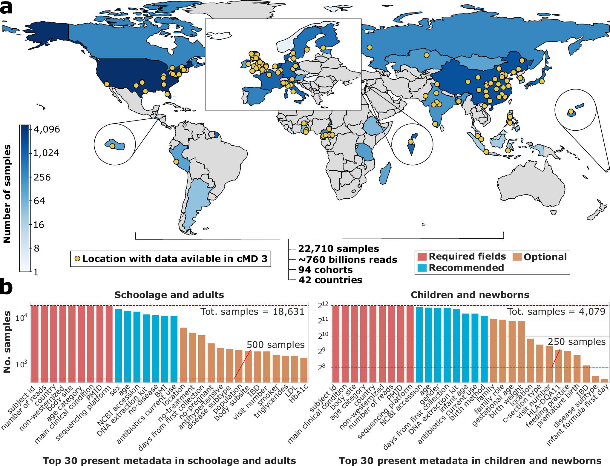
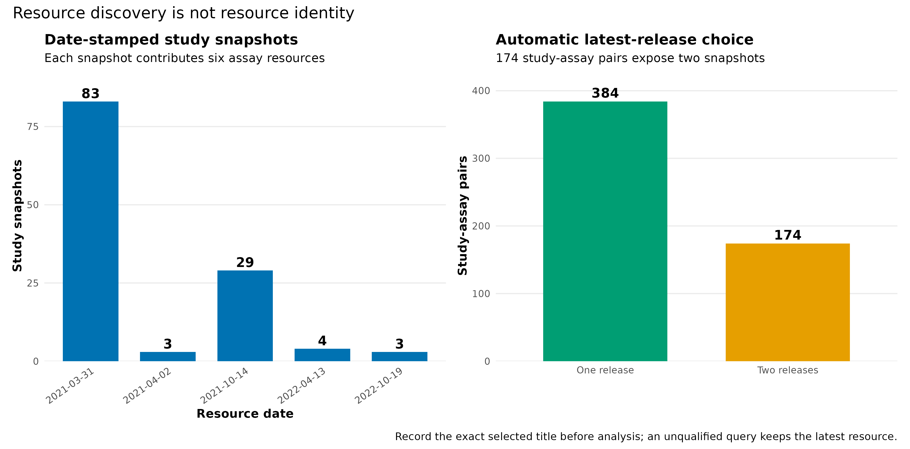
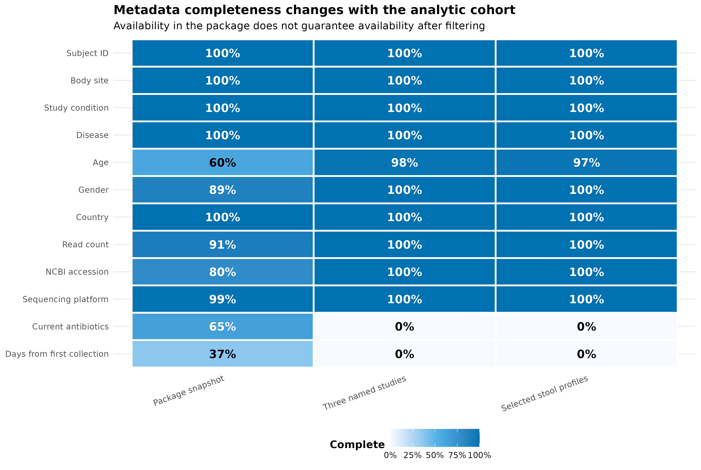
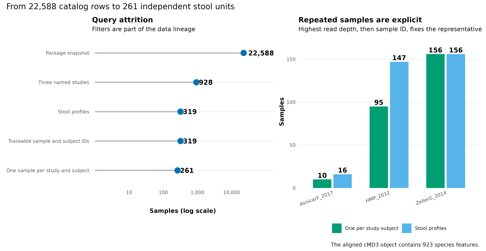
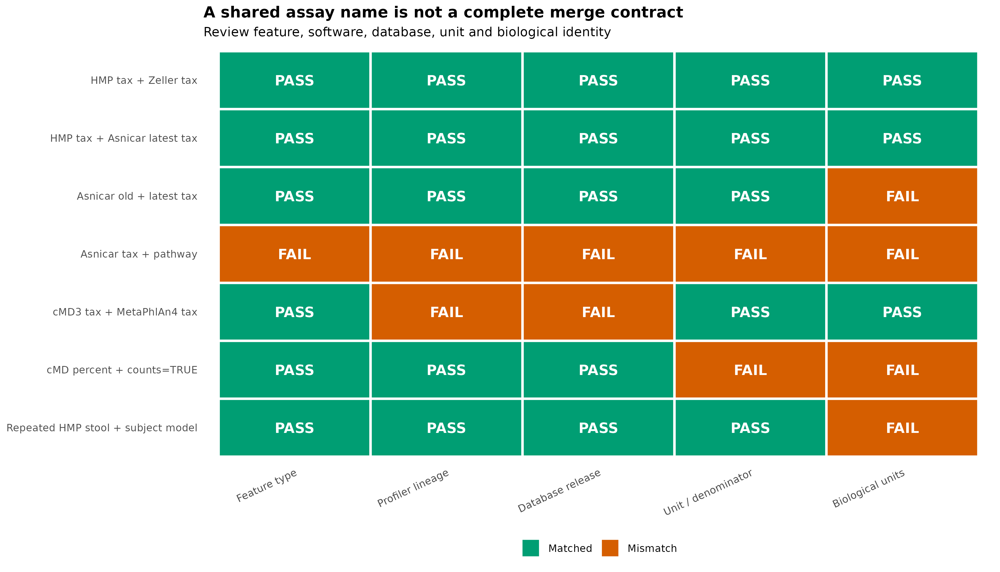

> **学习目标：**把“我从 cMD 下载了一张表”升级成可审核的数据合同：先发现并锁定资源，再筛选样本、限定独立观察单位、核对 feature 与单位，最后为每个 dataset × assay × release 保存数据谱系卡（data lineage card）。  
> **真实数据：**`curatedMetagenomicData` 3.12.0 的完整 `sampleMetadata` 和资源标题目录，以及 `HMP_2012`、`ZellerG_2014`、`AsnicarF_2017` 的 MetaPhlAn 3 / HUMAnN 3 统一重处理结果 [@pasolli2017cmd]。  
> **推断边界：**本章审核的是数据身份、可合并性与观察单位，不检验疾病关联；谱表是相对组成，不能替代绝对微生物负荷或原始 feature-level read counts。

## 这一步对应论文里的哪张图 {#sec-target}

curatedMetagenomicData 3（cMD3）论文 Figure 1a 把公开 raw reads、bioBakery 3 统一处理、手工整理的样本元数据和 R/Bioconductor 访问接口放在同一条资源链上；Figure 1b 则展示不同元数据字段的可用程度 [@manghi2026cmd3]。它提醒我们：跨队列分析的起点不是一张 abundance matrix，而是“样本、谱表和处理版本能否彼此追溯”。

{#fig-26-anchor}

论文分析集合与本机软件快照必须分开记账。`curatedMetagenomicData` 3.12.0 的 `sampleMetadata` 恰有 **22,588 个样本、93 个 study 和 141 个字段**；论文在此基础上另加入尚未进入包快照的 `HeQ_2017` 122 个样本，因此论文集合是 **22,710 个样本、94 个 cohorts** [@manghi2026cmd3]。这两个数字都正确，但不能混写成同一个资源版本。

{#fig-26-releases}

{#fig-26-completeness}

{#fig-26-attrition}

{#fig-26-compatibility}

## 理论：资源、样本、谱表和分析单位是四层身份 {#sec-theory}

### 1. 资源标题是三元组，不只是 study 名

cMD 资源标题采用：

$$
\text{ResourceID}=
(\text{release date},\ \text{study name},\ \text{data type}).
$$

例如 `2021-10-14.AsnicarF_2017.relative_abundance` 包含发布日期、研究名和数据类型。`curatedMetagenomicData(pattern, dryrun = TRUE)` 返回所有匹配标题；`dryrun = FALSE` 遇到同一个 study × data type 的多个日期时，会自动保留最新日期。自动选择很方便，却意味着只记录查询字符串 `AsnicarF_2017.relative_abundance` 仍不足以复现：资源更新后，同一字符串可能解析到不同字节。

3.12.0 包中有 732 个标题，来自 122 个 date-stamped study snapshots；每个 snapshot 都有六种 data types：

- `relative_abundance`：MetaPhlAn 3 分类相对丰度；
- `marker_abundance` 与 `marker_presence`：marker 层证据；
- `gene_families`：HUMAnN 3 gene-family profile；
- `pathway_abundance` 与 `pathway_coverage`：通路丰度和覆盖。

去掉日期后是 93 个 study × 6 个 assay，即 558 个 study-assay pairs。其中 174 个 pair 有两版资源。图 @fig-26-releases 中的 732 不是 732 个独立研究，也不是 732 个独立样本集。

### 2. `sampleMetadata` 先定义人群，再触碰 abundance

`sampleMetadata` 是 cMD 的“购物目录”：`study_name` 决定去哪些 study 取资源，`sample_id` 决定从资源中保留哪些列。推荐顺序是：

1. 在 metadata 中写清纳入和排除标准；
2. 检查关键协变量缺失和取值；
3. 确定 subject、time point、household 等独立性结构；
4. 最后调用 `returnSamples()` 取回匹配的 assay。

这个顺序避免先下载大量矩阵，再用临时条件挑样本。图 @fig-26-completeness 还显示，metadata availability 必须在最终分析人群内重算；全包中某字段很完整，不代表你的病例子集里也完整。

::: {.callout-important title="sample_id 只在 study 内安全"}
3.12.0 快照中有 177 个 `sample_id` 同时出现在两个研究里，例如 `MH0001` 同时属于 `LeChatelierE_2013` 和 `NielsenHB_2014`。跨队列主键应写成 `study_name::sample_id`。`returnSamples()` 会在发生冲突时把 study 名追加到列名，但设计表、临床表和外部结果也必须使用同样的限定规则。
:::

### 3. `returnSamples()` 与 `mergeData()` 解决的问题不同

`returnSamples(filtered_metadata, dataType)` 适合从多个研究挑出一组具体样本。它会：

- 根据 metadata 中的 `study_name` 查找资源；
- 调用 `curatedMetagenomicData()` 取得指定 `dataType`；
- 通过 `mergeData()` 对齐 feature；
- 只保留 metadata 中的 `sample_id`；
- 用筛选后的 metadata 重建 `colData`，因此自行添加的协变量也能保留。

`mergeData(resource_list)` 则适合把已经取回的同一 data type 对象拼接起来。它只要求所有元素具有同一个 `assayNames()`，对 feature 做 full join，并把缺失单元填为 0。它**不会检查 profiler 版本、数据库 release、单位或样本是否重复**。所以函数运行成功只表示对象结构可以拼，不表示科学上可以直接比较。

### 4. 数据谱系卡是 dataset × assay × release 级对象

每张谱系卡至少记录 12 个字段：

| Field | Question answered |
|---|---|
| Study | Which biological cohort? |
| Accession | Which project, sample or run IDs? |
| Raw reads available | Can the profile be regenerated? |
| Profile source | Which exact resource title or file? |
| Profiler | MetaPhlAn, HUMAnN or another tool? |
| Profiler version | Which software generation and patch? |
| Database release | Which taxonomy or functional universe? |
| Feature type | Species, SGB, gene family or pathway? |
| Unit | Percent, fraction, CPM or counts? |
| Normalization | Which denominator and transformation? |
| Original publication | Which biological study? |
| Reprocessed or author-provided | Who generated this profile and how? |

无法从资源中恢复的精确版本应写 `not encoded in resource metadata`，不能用“最新版”补空。cMD3 论文明确给出分类谱来自 MetaPhlAn 3、CHOCOPhlAn 201901，功能谱来自 HUMAnN 3 [@manghi2026cmd3; @beghini2021biobakery]；ExperimentHub 标题却不编码具体 patch version，因此谱系卡如实保留这一缺口。

### 5. 相同单位也可能没有相同 feature universe

三份 cMD3 taxonomic profiles 都是 percent，也都来自 MetaPhlAn 3 / CHOCOPhlAn 201901，经过物种行对齐后可以条件性合并。第 15 篇的 MOCK1 profile 同样是 percent，却来自 MetaPhlAn 4.2.5 与 `mpa_vJan26_CHOCOPhlAnSGB_202605`；它引入 SGB、不同 marker catalog 和不同分类命名，不能因为数值范围相同就直接追加到 cMD3 矩阵。

可合并性至少是五个布尔合同的交集：

$$
M = F \cap P \cap D \cap U \cap B,
$$

其中 $F$ 是 feature type 一致，$P$ 是 profiler lineage 一致，$D$ 是数据库 release 一致，$U$ 是单位与分母一致，$B$ 是 biological units 不重复。任何一项失败，都要分开建模、显式 harmonize，或从 raw reads 统一重处理。

### 6. `counts = TRUE` 不是找回原始 taxon reads

对 `relative_abundance`，cMD 的便利转换是：

$$
\widetilde{c}_{ij}=
\operatorname{round}
\left(\frac{a_{ij}}{100}\times N_j\right),
$$

其中 $a_{ij}$ 是 MetaPhlAn percent，$N_j$ 是 metadata 中的 total reads。$\widetilde{c}_{ij}$ 是从组成和总 reads 重建的 pseudo-count；它没有恢复 reads-to-marker alignment，也不是绝对菌量。AsnicarF_2017 的 24 个样本中，进入分类树对象的物种行总和为 94.65166%–100.00003%；未匹配 tree tips 的行被移除，再叠加 rounding，pseudo-count 总和便可能明显低于 `number_reads`。因此 Methods 必须把它称为 reconstructed counts。

## 准备工作 {#sec-setup}

<details>
<summary><strong>展开：资源门槛、安装、冻结数据与内联作图函数</strong></summary>

### 资源门槛

| Stage | CPU | RAM | Disk | Time |
|---|---:|---:|---:|---:|
| Read frozen catalog and metadata | 1 | <1 GB | <2 MB | seconds |
| Validate 923 × 261 merged profile | 1 | <1 GB | <5 MB | seconds |
| Four PDF/PNG/350-dpi TIFF figures | 1 | <2 GB | about 12 MB | <10 s |
| Live `returnSamples()` retrieval | 1 | 2–8 GB | assay-dependent | minutes to hours |

冻结输入可以在普通笔记本复算。实时请求 `gene_families` 或许多研究时，下载量和内存会显著增加；先用 `dryrun = TRUE` 检查资源，再缩小 metadata 人群。

### 安装固定代际

```{r}
#| eval: false
if (!requireNamespace("BiocManager", quietly = TRUE)) {
  install.packages("BiocManager")
}
BiocManager::install(version = "3.19")
BiocManager::install(c(
  "curatedMetagenomicData",
  "TreeSummarizedExperiment",
  "SummarizedExperiment"
))
install.packages(c(
  "ggplot2", "patchwork", "scales",
  "digest", "jsonlite", "knitr"
))

stopifnot(
  packageVersion("curatedMetagenomicData") == "3.12.0"
)
```

### 一次性生成冻结目录

```{bash}
#| eval: false
Rscript scripts/prepare_article26_cmd_lineage.R \
  --hmp-rda downloads/article25/2021-03-31.HMP_2012.relative_abundance.rda \
  --zeller-rda downloads/article24/2021-03-31.ZellerG_2014.relative_abundance.rda \
  --asnicar-rds data/small/12-cmd-asnicarf-2017-relative-abundance.rds \
  --asnicar-pathway-rda data/small/20-cmd-pathway/AsnicarF_2017.pathway_abundance.rda \
  --metaphlan4-profile data/small/15-metaphlan-frozen/species-profile.tsv \
  --output-dir data/small/26-cmd-lineage \
  --notice data/small/26-data-NOTICE.txt

(cd data/small/26-cmd-lineage && \
  sha256sum -c file-checksums.sha256)
```

冻结目录保存完整资源标题、21 个常用 metadata 字段、177 个重名 ID 的限定方式、319 个候选 stool profiles、261 个代表样本、合并谱和谱系卡。raw FASTQ 与大型 ExperimentHub cache 不进入 Git。

### 加载依赖、固定随机状态并内联作图函数

```{r}
library(curatedMetagenomicData)
library(ggplot2)
library(patchwork)
library(scales)
library(knitr)

RNGkind("Mersenne-Twister", "Inversion", "Rejection")
set.seed(20260725)

pal_pub <- c(
  blue = "#0072B2", orange = "#E69F00",
  green = "#009E73", red = "#D55E00",
  purple = "#7A5195", sky = "#56B4E9",
  grey = "#7A7A7A", light = "#E8EEF3"
)

scale_color_pub <- function(...) {
  ggplot2::scale_color_manual(values = pal_pub, ...)
}

scale_fill_pub <- function(...) {
  ggplot2::scale_fill_manual(values = pal_pub, ...)
}

theme_pub <- function(base_size = 10) {
  ggplot2::theme_minimal(base_size = base_size, base_family = "sans") +
    ggplot2::theme(
      panel.grid.minor = ggplot2::element_blank(),
      panel.grid.major.x = ggplot2::element_blank(),
      axis.title = ggplot2::element_text(face = "bold"),
      legend.title = ggplot2::element_text(face = "bold"),
      legend.position = "bottom",
      strip.text = ggplot2::element_text(face = "bold"),
      plot.title = ggplot2::element_text(face = "bold")
    )
}

save_pub <- function(
  plot, file_base,
  width = 190, height = 120, dpi = 350
) {
  ggplot2::ggsave(
    paste0(file_base, ".pdf"), plot,
    width = width, height = height, units = "mm",
    device = grDevices::cairo_pdf, bg = "white"
  )
  ggplot2::ggsave(
    paste0(file_base, ".png"), plot,
    width = width, height = height, units = "mm",
    dpi = dpi, bg = "white"
  )
  ggplot2::ggsave(
    paste0(file_base, ".tiff"), plot,
    width = width, height = height, units = "mm",
    dpi = dpi, compression = "lzw", bg = "white"
  )
  invisible(plot)
}
```

</details>

## 可复制代码：从资源发现到可审核跨队列对象 {#sec-code}

### 第 1 步：用 `dryrun` 发现资源，再锁定自动选择

`dryrun` 只读取包内标题，不下载 assay。下面把现场查询与冻结目录逐项对照：

```{r}
input_dir <- "data/small/26-cmd-lineage"

resource_catalog <- read.delim(
  file.path(input_dir, "resource-catalog.tsv"),
  check.names = FALSE, quote = ""
)
query_resolution <- read.delim(
  file.path(input_dir, "asnicar-query-resolution.tsv"),
  check.names = FALSE, quote = ""
)

dryrun_titles <- curatedMetagenomicData(
  "AsnicarF_2017", dryrun = TRUE
)

stopifnot(
  nrow(resource_catalog) == 732L,
  length(unique(resource_catalog$Study)) == 93L,
  length(unique(resource_catalog$DataType)) == 6L,
  all(table(resource_catalog$DataType) == 122L),
  identical(
    sort(dryrun_titles),
    sort(query_resolution$ResourceTitle)
  ),
  nrow(query_resolution) == 12L,
  sum(query_resolution$LatestForStudyType) == 6L
)

query_resolution[, c(
  "ResourceTitle", "LatestForStudyType",
  "UnqualifiedQuerySelection"
)]
```

AsnicarF_2017 有 2021-03-31 与 2021-10-14 两组、每组六种 assay。下面的实时取回会自动得到 2021-10-14 版本；正式分析还要把返回 list 的名字和文件 SHA-256 写入 manifest。

```{r}
#| eval: false
asnicar_tax <- curatedMetagenomicData(
  "^AsnicarF_2017\\.relative_abundance$",
  dryrun = FALSE,
  counts = FALSE,
  rownames = "long"
)

names(asnicar_tax)
# 2021-10-14.AsnicarF_2017.relative_abundance
```

资源发布日期的审计图来自同一目录，而不是手工录入：

```{r}
release_summary <- read.delim(
  file.path(input_dir, "resource-release-summary.tsv"),
  check.names = FALSE
)
release_totals <- aggregate(
  Resources ~ ReleaseDate, release_summary, sum
)
release_totals$StudySnapshots <- release_totals$Resources / 6

pair_catalog <- unique(resource_catalog[, c(
  "Study", "DataType", "ReleaseCountForStudyType"
)])
multiplicity <- as.data.frame(
  table(pair_catalog$ReleaseCountForStudyType)
)
names(multiplicity) <- c("Releases", "StudyAssayPairs")
multiplicity$Label <- ifelse(
  multiplicity$Releases == "1",
  "One release", "Two releases"
)

stopifnot(
  identical(release_totals$StudySnapshots, c(83, 3, 29, 4, 3)),
  identical(as.integer(multiplicity$StudyAssayPairs), c(384L, 174L))
)

p_release <- ggplot(
  release_totals,
  aes(factor(ReleaseDate, levels = ReleaseDate), StudySnapshots)
) +
  geom_col(fill = pal_pub[["blue"]], width = 0.72) +
  geom_text(
    aes(label = StudySnapshots),
    vjust = -0.35, fontface = "bold"
  ) +
  scale_y_continuous(expand = expansion(mult = c(0, 0.12))) +
  labs(
    title = "Date-stamped study snapshots",
    subtitle = "Each snapshot contributes six assay resources",
    x = "Resource date", y = "Study snapshots"
  ) +
  theme_pub() +
  theme(axis.text.x = element_text(angle = 35, hjust = 1))

p_multiplicity <- ggplot(
  multiplicity,
  aes(Label, StudyAssayPairs, fill = Label)
) +
  geom_col(width = 0.68) +
  geom_text(
    aes(label = StudyAssayPairs),
    vjust = -0.4, fontface = "bold"
  ) +
  scale_fill_manual(values = c(
    "One release" = pal_pub[["green"]],
    "Two releases" = pal_pub[["orange"]]
  )) +
  scale_y_continuous(expand = expansion(mult = c(0, 0.12))) +
  labs(
    title = "Automatic latest-release choice",
    subtitle = "174 study-assay pairs expose two snapshots",
    x = NULL, y = "Study-assay pairs"
  ) +
  theme_pub() +
  theme(legend.position = "none")

p_resources <- p_release + p_multiplicity +
  plot_annotation(
    title = "Resource discovery is not resource identity",
    caption = paste(
      "Record the exact selected title before analysis;",
      "an unqualified query keeps the latest resource."
    )
  )

save_pub(
  p_resources,
  "figures/26-resource-release-audit",
  width = 267, height = 132
)
```

### 第 2 步：检查 metadata 完整性与跨 study 主键

```{r}
sample_catalog <- read.delim(
  gzfile(file.path(input_dir, "sample-catalog.tsv.gz")),
  check.names = FALSE, quote = ""
)
sample_id_collisions <- read.delim(
  file.path(input_dir, "sample-id-collisions.tsv"),
  check.names = FALSE, quote = ""
)
metadata_completeness <- read.delim(
  file.path(input_dir, "metadata-completeness.tsv"),
  check.names = FALSE, quote = ""
)

stopifnot(
  nrow(sample_catalog) == 22588L,
  length(unique(sample_catalog$study_name)) == 93L,
  !anyDuplicated(sample_catalog$StudySampleKey),
  nrow(sample_id_collisions) == 177L,
  all(sample_id_collisions$Occurrences == 2L),
  nrow(metadata_completeness) == 36L
)

head(sample_id_collisions[, c(
  "SampleID", "Studies", "QualifiedIDs"
)])
```

metadata completeness 是“非缺失且非空”的描述量，不等于字段值正确，也不等于缺失可忽略。尤其不能把 `antibiotics_current_use = NA` 自动改成 `no`；缺失机制需要结合研究设计和原论文审计。

```{r}
field_labels <- c(
  subject_id = "Subject ID",
  body_site = "Body site",
  study_condition = "Study condition",
  disease = "Disease",
  age = "Age", gender = "Gender", country = "Country",
  number_reads = "Read count",
  NCBI_accession = "NCBI accession",
  sequencing_platform = "Sequencing platform",
  antibiotics_current_use = "Current antibiotics",
  days_from_first_collection = "Days from first collection"
)

metadata_completeness$FieldLabel <- factor(
  unname(field_labels[metadata_completeness$Field]),
  levels = rev(unname(field_labels))
)
metadata_completeness$Context <- factor(
  metadata_completeness$Context,
  levels = c(
    "Package snapshot",
    "Three named studies",
    "Selected stool profiles"
  )
)

p_completeness <- ggplot(
  metadata_completeness,
  aes(Context, FieldLabel, fill = Completeness)
) +
  geom_tile(color = "white", linewidth = 0.8) +
  geom_text(
    aes(label = percent(Completeness, accuracy = 1)),
    color = ifelse(
      metadata_completeness$Completeness >= 0.62,
      "white", "black"
    ),
    fontface = "bold"
  ) +
  scale_fill_gradientn(
    colours = c("#F7FBFF", pal_pub[["sky"]], pal_pub[["blue"]]),
    limits = c(0, 1), labels = label_percent(accuracy = 1)
  ) +
  labs(
    title = "Metadata completeness changes with the analytic cohort",
    subtitle = paste(
      "Availability in the package does not guarantee",
      "availability after filtering"
    ),
    x = NULL, y = NULL, fill = "Complete"
  ) +
  theme_pub() +
  theme(axis.text.x = element_text(angle = 20, hjust = 1))

save_pub(
  p_completeness,
  "figures/26-metadata-completeness",
  width = 239, height = 160
)
```

### 第 3 步：把观察单位写进样本查询

示例保留 `AsnicarF_2017`、`HMP_2012`、`ZellerG_2014` 的 stool samples，并要求 `NCBI_accession` 与 `subject_id` 可追溯。HMP 与 Asnicar 含重复采样，所以在每个 study × subject 内按 `number_reads` 最大、再按 `sample_id` 字典序选择一个代表样本。

```{r}
present <- function(x) {
  !is.na(x) & nzchar(trimws(as.character(x)))
}

selected_studies <- c(
  "AsnicarF_2017", "HMP_2012", "ZellerG_2014"
)

query_pool <- subset(
  sample_catalog,
  study_name %in% selected_studies &
    body_site == "stool" &
    present(NCBI_accession) &
    present(subject_id)
)
query_pool$NumberReadsNumeric <- as.numeric(query_pool$number_reads)
read_sort <- query_pool$NumberReadsNumeric
read_sort[!is.finite(read_sort)] <- -1

query_pool <- query_pool[order(
  match(query_pool$study_name, selected_studies),
  query_pool$subject_id,
  -read_sort,
  query_pool$sample_id
), ]

subject_key <- paste(
  query_pool$study_name,
  query_pool$subject_id,
  sep = "::"
)
query_pool$Representative <- !duplicated(subject_key)
sample_query <- query_pool[query_pool$Representative, ]

selected_metadata <- read.delim(
  gzfile(file.path(
    input_dir, "selected-sample-metadata.tsv.gz"
  )),
  check.names = FALSE, quote = ""
)

stopifnot(
  nrow(query_pool) == 319L,
  nrow(sample_query) == 261L,
  identical(sample_query$sample_id, selected_metadata$sample_id),
  identical(
    as.integer(table(factor(
      sample_query$study_name,
      levels = selected_studies
    ))),
    c(10L, 95L, 156L)
  )
)

head(sample_query[, c(
  "study_name", "sample_id", "subject_id",
  "body_site", "NumberReadsNumeric", "NCBI_accession"
)])
```

实时取回时只需保留 `study_name` 和 `sample_id`，但建议把模型需要的协变量一起传入；它们会进入返回对象的 `colData`。

```{r}
#| eval: false
query_tse <- returnSamples(
  sampleMetadata = sample_query,
  dataType = "relative_abundance",
  counts = FALSE,
  rownames = "long"
)

query_tse
# TreeSummarizedExperiment: aligned species x selected samples
```

本次已从三个 checksum-locked cMD3 资源真实构建同类对象并执行 `mergeData()`；渲染读取其表格化快照：

```{r}
merged_profile <- read.delim(
  gzfile(file.path(
    input_dir,
    "merged-species-relative-abundance.tsv.gz"
  )),
  check.names = FALSE, quote = ""
)
merged_contract <- read.delim(
  file.path(input_dir, "merged-object-contract.tsv"),
  check.names = FALSE, quote = ""
)

profile_sample_ids <- names(merged_profile)[-(1:2)]
profile_matrix <- data.matrix(
  merged_profile[, profile_sample_ids, drop = FALSE]
)

stopifnot(
  identical(dim(profile_matrix), c(923L, 261L)),
  identical(profile_sample_ids, selected_metadata$sample_id),
  !anyDuplicated(merged_profile$Lineage),
  all(is.finite(profile_matrix)),
  min(profile_matrix) >= 0,
  min(colSums(profile_matrix)) > 98,
  max(colSums(profile_matrix)) < 101
)

merged_contract
```

原始 cMD3 树中没有匹配 tip 的 species lineages 会在构造 `TreeSummarizedExperiment` 时被丢弃，因此 HMP、Zeller 和 Asnicar 的实际对象分别有 740、652 和 298 个物种行；full join 后是 923 行。这个数字来自已锁定的 cMD3 taxonomy universe，不应外推成其他 MetaPhlAn release 的“物种总数”。

```{r}
attrition <- read.delim(
  file.path(input_dir, "query-attrition.tsv"),
  check.names = FALSE
)
selection_audit <- read.delim(
  gzfile(file.path(
    input_dir, "sample-selection-audit.tsv.gz"
  )),
  check.names = FALSE
)

attrition$Step <- factor(
  attrition$Step, levels = rev(attrition$Step)
)

p_attrition <- ggplot(attrition, aes(Samples, Step)) +
  geom_segment(
    aes(x = 1, xend = Samples, yend = Step),
    color = "grey75", linewidth = 1.1
  ) +
  geom_point(size = 4.2, color = pal_pub[["blue"]]) +
  geom_text(
    aes(label = comma(Samples)),
    hjust = -0.18, fontface = "bold"
  ) +
  scale_x_log10(
    breaks = c(10, 100, 1000, 10000),
    labels = label_comma(),
    expand = expansion(mult = c(0.02, 0.2))
  ) +
  labs(
    title = "Query attrition",
    subtitle = "Filters are part of the data lineage",
    x = "Samples (log scale)", y = NULL
  ) +
  theme_pub()

candidate_counts <- as.data.frame(
  table(selection_audit$study_name)
)
names(candidate_counts) <- c("Study", "Samples")
candidate_counts$Stage <- "Stool profiles"

representative_counts <- as.data.frame(
  table(selected_metadata$study_name)
)
names(representative_counts) <- c("Study", "Samples")
representative_counts$Stage <- "One per study-subject"

study_counts <- rbind(candidate_counts, representative_counts)
study_counts$Study <- factor(
  study_counts$Study, levels = selected_studies
)

p_study <- ggplot(
  study_counts,
  aes(Study, Samples, fill = Stage)
) +
  geom_col(
    position = position_dodge(width = 0.72),
    width = 0.65
  ) +
  geom_text(
    aes(label = Samples),
    position = position_dodge(width = 0.72),
    vjust = -0.35, fontface = "bold"
  ) +
  scale_fill_manual(values = c(
    "Stool profiles" = pal_pub[["sky"]],
    "One per study-subject" = pal_pub[["green"]]
  )) +
  scale_y_continuous(expand = expansion(mult = c(0, 0.14))) +
  labs(
    title = "Repeated samples are explicit",
    subtitle = paste(
      "Highest read depth, then sample ID,",
      "fixes the representative"
    ),
    x = NULL, y = "Samples", fill = NULL
  ) +
  theme_pub() +
  theme(axis.text.x = element_text(angle = 20, hjust = 1))

p_query <- p_attrition + p_study +
  plot_annotation(
    title = "From 22,588 catalog rows to 261 independent stool units",
    caption = "The aligned cMD3 object contains 923 species features."
  )

save_pub(
  p_query,
  "figures/26-query-attrition",
  width = 284, height = 147
)
```

### 第 4 步：在 `mergeData()` 前执行五项合同

下面是两个完整 study 对象的标准接口。只有当它们来自同一 profiler/database lineage、同一 rank 和同一单位时，才允许进入 `mergeData()`。

```{r}
#| eval: false
study_list <- curatedMetagenomicData(
  paste0(
    "^(HMP_2012|ZellerG_2014)\\.",
    "relative_abundance$"
  ),
  dryrun = FALSE,
  counts = FALSE,
  rownames = "long"
)

stopifnot(
  length(unique(vapply(
    study_list,
    function(x) assayNames(x)[[1]],
    character(1)
  ))) == 1L
)

merged_tse <- mergeData(study_list)
```

真实谱系卡给出比 `assayNames()` 更严格的检查：

```{r}
lineage_cards <- read.delim(
  file.path(input_dir, "lineage-cards.tsv"),
  check.names = FALSE, quote = ""
)
compatibility <- read.delim(
  file.path(input_dir, "merge-compatibility.tsv"),
  check.names = FALSE, quote = ""
)

required_lineage_fields <- c(
  "Study", "Accession", "RawReadsAvailable",
  "ProfileSource", "Profiler", "ProfilerVersion",
  "DatabaseRelease", "FeatureType", "Unit",
  "Normalization", "OriginalPublication",
  "ReprocessedOrAuthorProvided", "ProfileFileSHA256"
)

stopifnot(
  identical(names(lineage_cards), required_lineage_fields),
  nrow(lineage_cards) == 5L,
  all(nchar(lineage_cards$ProfileFileSHA256) == 64L),
  nrow(compatibility) == 7L
)

kable(compatibility[, c(
  "Comparison", "Verdict", "RequiredAction"
)])
```

完整卡片很宽，审核单个对象时可转成长表。这里查看 HMP taxonomy card：

```{r}
hmp_card <- lineage_cards[
  lineage_cards$Study == "HMP_2012",
]
hmp_long <- data.frame(
  Field = setdiff(names(hmp_card), "Study"),
  Value = unname(unlist(
    hmp_card[, setdiff(names(hmp_card), "Study"), drop = FALSE],
    use.names = FALSE
  )),
  check.names = FALSE
)
kable(hmp_long)
```

```{r}
criterion_columns <- c(
  "SameFeatureType", "SameProfilerLineage",
  "SameDatabaseRelease", "SameUnitAndDenominator",
  "DisjointBiologicalUnits"
)
criterion_labels <- c(
  SameFeatureType = "Feature type",
  SameProfilerLineage = "Profiler lineage",
  SameDatabaseRelease = "Database release",
  SameUnitAndDenominator = "Unit / denominator",
  DisjointBiologicalUnits = "Biological units"
)

compatibility_long <- do.call(
  rbind,
  lapply(seq_len(nrow(compatibility)), function(i) {
    data.frame(
      Comparison = compatibility$Comparison[[i]],
      Criterion = criterion_columns,
      Match = as.logical(unlist(
        compatibility[i, criterion_columns, drop = FALSE],
        use.names = FALSE
      ))
    )
  })
)
compatibility_long$Criterion <- factor(
  unname(criterion_labels[compatibility_long$Criterion]),
  levels = unname(criterion_labels)
)
compatibility_long$Comparison <- factor(
  compatibility_long$Comparison,
  levels = rev(compatibility$Comparison)
)
compatibility_long$Status <- ifelse(
  compatibility_long$Match, "Matched", "Mismatch"
)
compatibility_long$Mark <- ifelse(
  compatibility_long$Match, "PASS", "FAIL"
)

p_compatibility <- ggplot(
  compatibility_long,
  aes(Criterion, Comparison, fill = Status)
) +
  geom_tile(color = "white", linewidth = 0.9) +
  geom_text(
    aes(label = Mark),
    color = "white", fontface = "bold"
  ) +
  scale_fill_manual(values = c(
    "Matched" = pal_pub[["green"]],
    "Mismatch" = pal_pub[["red"]]
  )) +
  labs(
    title = "A shared assay name is not a complete merge contract",
    subtitle = paste(
      "Review feature, software, database, unit",
      "and biological identity"
    ),
    x = NULL, y = NULL, fill = NULL
  ) +
  theme_pub() +
  theme(
    axis.text.x = element_text(angle = 25, hjust = 1),
    panel.grid = element_blank()
  )

save_pub(
  p_compatibility,
  "figures/26-lineage-compatibility",
  width = 274, height = 157
)
```

### 第 5 步：把 `counts = TRUE` 限定为重建值

```{r}
counts_boundary <- read.delim(
  file.path(input_dir, "counts-boundary.tsv"),
  check.names = FALSE
)

stopifnot(
  nrow(counts_boundary) == 24L,
  all(!counts_boundary$ExactRawFeatureCountsRecovered),
  any(counts_boundary$PseudoCountMinusNumberReads != 0),
  all(counts_boundary$RelativeAbundanceSumPct > 94),
  all(counts_boundary$RelativeAbundanceSumPct <= 100.001)
)

head(counts_boundary[, c(
  "SampleID", "NumberReads",
  "RelativeAbundanceSumPct", "PseudoCountSum",
  "PseudoCountMinusNumberReads"
)])
```

如果下游方法要求 observed counts，应回到能够输出 marker/read assignment 的上游流程，或改用接受 composition 的模型。不能把 reconstructed pseudo-count 的整数外观当成测量层证据。

### 第 6 步：运行离线验收器

```{bash}
#| eval: false
Rscript scripts/validate_article26_cmd_lineage.R \
  --project-root . \
  --input-dir data/small/26-cmd-lineage \
  --output-dir results/26-cmd-lineage \
  --figure-dir figures \
  --chapter chapters/26-curated-metagenomic-data-lineage.qmd
```

验收器重新核对 16 个冻结 payload 的 SHA-256、资源与 metadata 计数、重名 ID、确定性样本选择、合并矩阵、pseudo-count 边界、12 字段谱系卡、原图许可与四张三格式图片。

## 审计与升级：从“包里能取到”到“跨队列可解释” {#sec-audit}

### 忠实保留 cMD3 的访问语义

以下行为与 cMD 3.12.0 接口一致：

- `dryrun = TRUE` 返回所有正则匹配的 date-stamped titles；
- `dryrun = FALSE` 自动保留每个 study × data type 的最新日期；
- taxonomy 返回 `TreeSummarizedExperiment`，function 返回 `SummarizedExperiment`；
- `returnSamples()` 以筛选后的 metadata 为入口，并保留自定义 metadata columns；
- `mergeData()` 对 feature 做 full join，对缺失单元补 0；
- `counts = TRUE` 以相对丰度和 `number_reads` 重建并四舍五入。

这些便利接口适合资源发现和对象组装，但不能替代研究级 provenance 审核。

### 升级 1：自动最新版必须转成固定标题与 checksum

AsnicarF_2017 的不带日期查询会自动从 2021-03-31 升到 2021-10-14。探索阶段可以接受自动选择，冻结分析时应同时保存：

1. query pattern；
2. 实际返回的完整 title；
3. ExperimentHub ID；
4. cache payload 或分析快照的 SHA-256；
5. retrieval date 与 package version。

重复发布是同一批或高度重叠生物样本的不同资源快照，不能把旧版和新版纵向追加后当作样本量翻倍。

### 升级 2：`mergeData()` 成功后还要做 lineage gate

`mergeData()` 的结构检查核心是 assay 名一致；它不会读取谱系卡。对两个都叫 `relative_abundance` 的对象，至少再断言 profiler generation、database release、rank、unit/denominator 与 sample identity。不同 cMD3 studies 的 taxonomic profiles 可在这些条件满足后对齐，但模型仍需保留 `study_name`，不能把 batch/study effect 交给矩阵拼接自动消失。

同一 pipeline 内，某 feature 在一个 study 没有行时补 0 可表示该 study 未报告该 feature；跨数据库时，缺行也可能表示 feature 不在旧 catalog。后者不能安全地补成“生物学未检出”。

### 升级 3：metadata 更新与 assay 字节分层冻结

cMD 的 sample metadata 会持续改进，assay payload 与 metadata 不一定同步变化。建议保存三层证据：

- 原始 Hub 标题与 cache payload；
- 当次 `sampleMetadata` 的必要字段快照；
- 最终纳入样本及排除理由。

这样将来 metadata 修订时，可以区分“谱表变化”“临床注释变化”和“纳入标准变化”。

### 升级 4：论文集合、软件集合与最终模型集合分别命名

本章使用三个集合名：

- `cMD3_package_3.12.0`：22,588 samples / 93 studies；
- `Manghi2026_analysis`：22,710 samples / 94 cohorts，额外含 HeQ_2017；
- `three_study_stool_query`：319 profiles / 261 study-subject units。

Methods、流程图和结果表都使用明确集合名，就不会把论文总样本量误写成当前包对象维度。

### 升级 5：MetaPhlAn 3 与 MetaPhlAn 4 只能明确 harmonize

cMD3 taxonomy 的已知 lineage 是 MetaPhlAn 3 / CHOCOPhlAn 201901；本系列上游使用 MetaPhlAn 4.2.5 / vJan26 SGB database。优先级从高到低是：

1. 从 raw reads 用同一 profiler 与数据库统一重处理所有队列；
2. 在共同、稳定、明确映射的层级建立 mapping，并报告丢失率与一对多关系；
3. 分开分析，在 effect-size 层做 meta-analysis；
4. 最差做法是删除版本 header 后按字符串 row name 直接合并。

## 出版级美化 {#sec-polish}

图 @fig-26-releases 把“日期快照数”和“study-assay release multiplicity”分成两个 panel，避免用 732 根资源条目制造虚假的研究规模。图 @fig-26-completeness 在每个 tile 直接写百分比，读者不必从颜色反推精确值；颜色只承担快速定位低完整度字段的功能。

图 @fig-26-attrition 的总样本轴使用 log scale，因为 22,588 到 261 横跨两个数量级；study panel 保留原始数值，避免小队列被压扁。图 @fig-26-compatibility 只用绿色 `PASS` 和红色 `FAIL` 表示合同是否匹配，最终操作写入伴随表格，而不让颜色本身代替决策。

所有图内标题、轴、图例和注释均为英文；PDF 供排版编辑，PNG 供网页，350-dpi LZW TIFF 供期刊投稿。颜色采用蓝、橙、绿、朱红的色觉友好组合，不用红绿渐变表达连续数值。

## 常见坑 {#sec-pitfalls}

::: {.callout-caution title="坑 1：把 dryrun 的 12 行当成 12 个独立 Asnicar assays"}
12 行是两个日期 × 六种 assay。实时不带日期取回只会选择每种 assay 的最新版本。资源计数必须先按 release、study 和 data type 拆开。
:::

::: {.callout-caution title="坑 2：只保存 study_name，不保存实际 resource title"}
study 名不会标识日期版本。正式结果至少记录完整 title、Hub ID、package version、retrieval date 和 checksum。
:::

::: {.callout-caution title="坑 3：sample_id 直接作为跨研究主键"}
本快照有 177 个跨 study 重名 ID。任何外部临床表、fold assignment 和预测结果都应使用 `study_name::sample_id`；只在 abundance 列名冲突后补后缀太晚。
:::

::: {.callout-caution title="坑 4：mergeData 没报错就认为可比较"}
相同 assay name 只通过对象结构门槛。MetaPhlAn 3 与 4、taxonomy 与 pathway、percent 与 pseudo-count、旧版与新版重复样本都可能“能拼但不能解释”。
:::

::: {.callout-caution title="坑 5：把全部 sample rows 当成独立受试者"}
三队列有 319 个 stool profiles，却只有 261 个 study-subject units。应预先选固定 time point/代表样本，或在模型中加入 subject random effect、GEE 或 blocked permutation。
:::

::: {.callout-caution title="坑 6：把 NA 暴露状态补成 no"}
`antibiotics_current_use`、time point 和其他协变量的缺失可能来自研究未收集，而非“没有暴露”。将未知编码为对照会造成系统性误分类。
:::

::: {.callout-caution title="坑 7：把 counts = TRUE 交给原始 count 模型后不说明来源"}
这些整数来自 percent × total reads 后 rounding，不是 taxon-specific observed reads。若使用它们，必须报告构造公式并做敏感性分析；更稳妥的是选用适合相对组成的模型。
:::

::: {.callout-caution title="坑 8：用论文 22,710 替代包内 22,588 做对象断言"}
HeQ_2017 的 122 个样本进入论文分析，却不在 3.12.0 包快照。对象 QA 应断言当前资源，论文 Methods 则说明额外集合，不能为了对齐摘要数字修改数据。
:::

## 这段 Methods 怎么写 {#sec-methods}

> **Public metagenomic resource discovery and lineage control.** Public shotgun metagenomic profiles and harmonized sample metadata were accessed with curatedMetagenomicData 3.12.0 under Bioconductor 3.19 (package git commit `c5711e9`) in R 4.4.1. The package snapshot contained 22,588 sample records from 93 studies and 141 metadata fields, distinct from the 22,710-sample, 94-cohort collection analyzed by Manghi et al., which additionally included 122 HeQ_2017 samples. We audited 732 date-stamped ExperimentHub titles spanning six assay types and recorded the exact title selected for each study-assay pair; 174 of 558 study-assay pairs had two available releases. Taxonomic cMD3 profiles were assigned to the MetaPhlAn 3 / CHOCOPhlAn 201901 lineage, whereas functional profiles were assigned to HUMAnN 3; exact patch versions not encoded in the resource metadata were reported as unavailable. The worked cohort comprised stool samples from AsnicarF_2017, HMP_2012 and ZellerG_2014 with non-missing NCBI accession and subject identifiers. One sample per study-subject was selected deterministically by maximal reported read count, with lexical sample ID as the tie-break, yielding 261 independent units from 319 profiles. Study objects were aligned with curatedMetagenomicData::mergeData into a 923-feature × 261-sample relative-abundance matrix on a percentage scale (frozen table SHA-256: `38bb7535ecdab3a6e9e647fd19e55516950da9e3584a820324b5b9d83cc25cff`). Study labels were retained for downstream modeling. Counts reconstructed with `counts = TRUE` were treated as rounded pseudo-counts derived from relative abundance and total read depth, not observed feature-level counts. All resource, metadata, sample-selection and lineage-card outputs were checksum-validated; deterministic operations used seed 20260725.

只写“data were obtained from curatedMetagenomicData”缺少资源日期、处理谱系、单位和最终样本选择。若实际分析使用不同 study、assay 或 release，应替换模板中的对象维度、完整 title、SHA-256、筛选条件和数据库信息。

## 换成你自己的数据怎么做 {#sec-own-data}

### 路线 A：换成另一个 cMD 人群

先在 metadata 中建立 analysis-ready cohort，再用 study-qualified ID 固定选择：

```{r}
#| eval: false
your_metadata <- subset(
  curatedMetagenomicData::sampleMetadata,
  body_site == "stool" &
    age >= 18 &
    study_condition %in% c("control", "CRC") &
    !is.na(subject_id)
)

your_metadata$StudySampleKey <- paste(
  your_metadata$study_name,
  your_metadata$sample_id,
  sep = "::"
)

your_titles <- curatedMetagenomicData(
  paste(unique(your_metadata$study_name), collapse = "|"),
  dryrun = TRUE
)

your_tse <- returnSamples(
  your_metadata,
  dataType = "relative_abundance",
  counts = FALSE,
  rownames = "long"
)
```

若研究问题是 meta-analysis，应保留每个 study 独立估计 effect size；若是 mega-analysis，把对象合并后仍需在模型中编码 study，并按 study 或 subject 设计验证 folds。

### 路线 B：为自己的谱表建立同样的 12 字段卡

```{r}
#| eval: false
your_lineage_card <- data.frame(
  Study = "YourStudy_2026",
  Accession = "PRJNAxxxxxx / SRRxxxxxx",
  RawReadsAvailable = "Yes; repository and checksum recorded",
  ProfileSource = "profiles/metaphlan_species.tsv",
  Profiler = "MetaPhlAn",
  ProfilerVersion = "4.2.5",
  DatabaseRelease = "mpa_vJan26_CHOCOPhlAnSGB_202605",
  FeatureType = "Species / SGB relative abundance",
  Unit = "Percent",
  Normalization = "rel_ab_w_read_stats; UNCLASSIFIED retained",
  OriginalPublication = "DOI or pre-registration",
  ReprocessedOrAuthorProvided = "Reprocessed from raw reads",
  ProfileFileSHA256 = digest::digest(
    file = "profiles/metaphlan_species.tsv",
    algo = "sha256", serialize = FALSE
  ),
  check.names = FALSE
)
```

### 路线 C：在代码里做 fail-closed lineage gate

```{r}
#| eval: false
assert_same_lineage <- function(cards) {
  required <- c(
    "Profiler", "ProfilerVersion", "DatabaseRelease",
    "FeatureType", "Unit", "Normalization"
  )
  stopifnot(all(required %in% names(cards)))

  incompatible <- vapply(
    cards[required],
    function(x) length(unique(x)) != 1L,
    logical(1)
  )
  if (any(incompatible)) {
    stop(
      "Lineage mismatch: ",
      paste(names(incompatible)[incompatible], collapse = ", ")
    )
  }
  invisible(TRUE)
}

assert_same_lineage(cards_to_merge)
stopifnot(!anyDuplicated(cards_to_merge$StudySampleKey))
```

若 feature mapping 是研究目标的一部分，不要用这个严格函数强行通过；应另建 cross-release mapping table，报告 mapped、one-to-many、unmapped feature 数量以及 abundance mass loss，再决定升到 genus、分开估计，还是统一重跑。

## 参考 {#sec-references}

- curatedMetagenomicData 初版资源与 ExperimentHub 接口：[@pasolli2017cmd]。
- cMD3 资源范围、统一处理、metadata 和论文分析集合：[@manghi2026cmd3]。
- bioBakery 3、MetaPhlAn 3 与 HUMAnN 3 处理框架：[@beghini2021biobakery]。
- HMP_2012 原始研究：[@hmp2012structure]。
- AsnicarF_2017 母婴传播研究：[@asnicar2017transmission]。
- ZellerG_2014 结直肠癌研究：[@zeller2014crc]。
- [curatedMetagenomicData 3.12.0（Bioconductor 3.19）](https://bioconductor.org/packages/3.19/data/experiment/html/curatedMetagenomicData.html)
- [curatedMetagenomicData reference manual](https://bioconductor.org/packages/3.19/data/experiment/manuals/curatedMetagenomicData/man/curatedMetagenomicData.pdf)
- [cMD3 Nature Communications article](https://doi.org/10.1038/s41467-025-66888-1)
