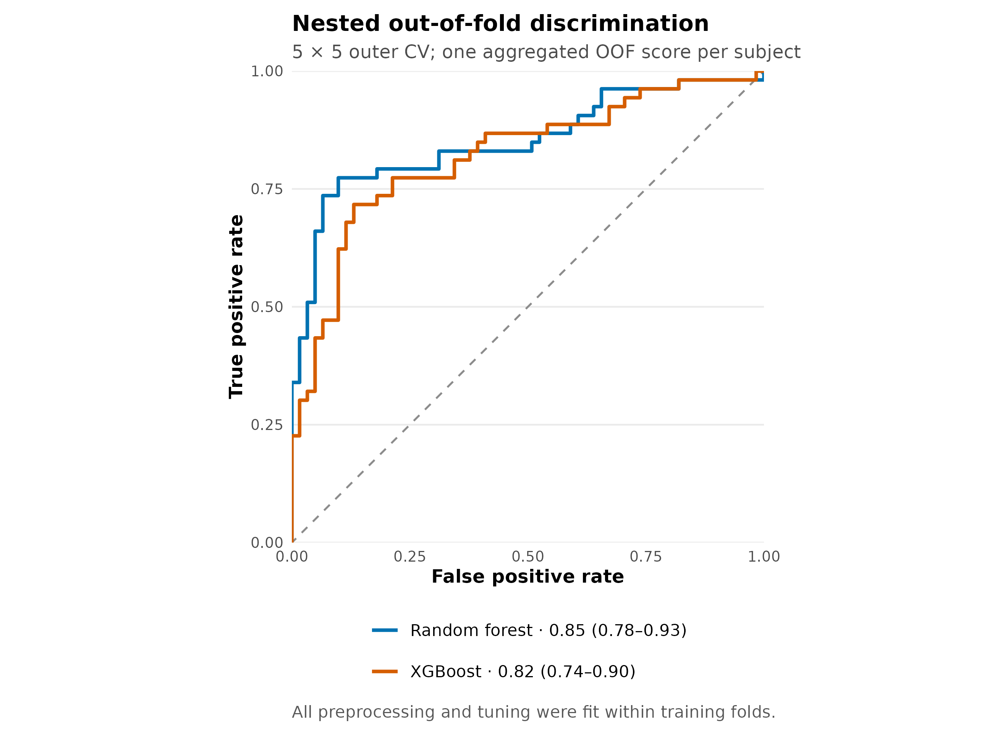
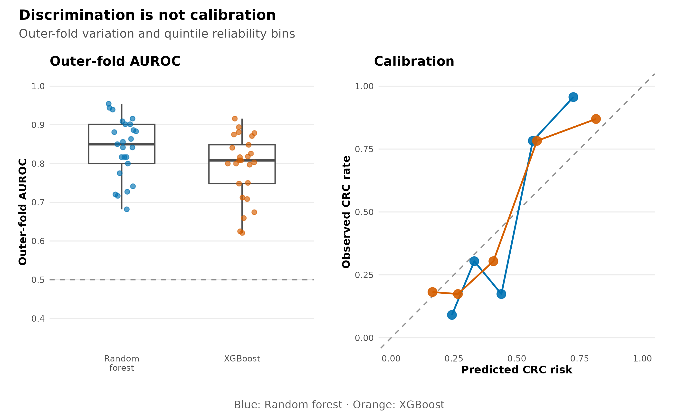
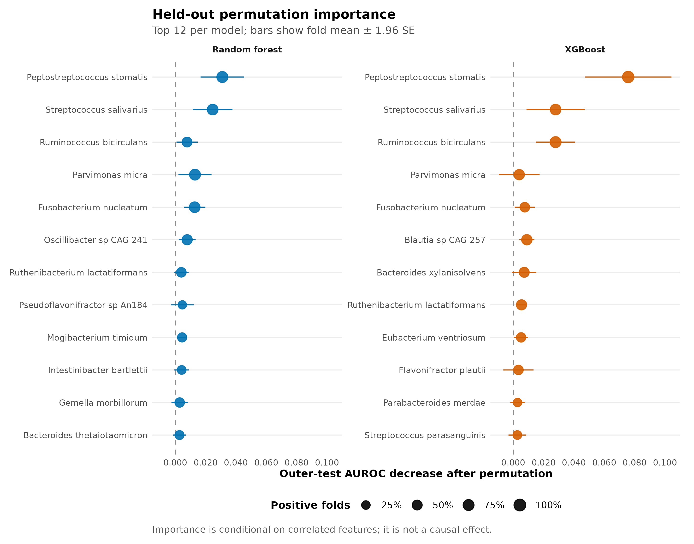
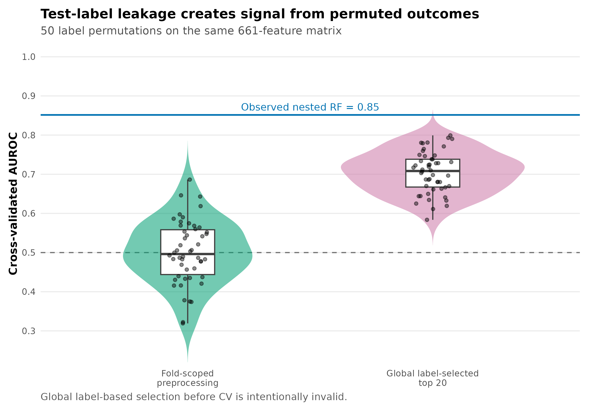

> **学习目标：**把“训练一个分类器”拆成可审核的预测任务：先锁定独立观察单位和阳性类，再把特征筛选、变换与调参全部放进训练折，最后同时报告判别、校准、模型差异和 held-out permutation importance。  
> **真实数据：**curatedMetagenomicData 3.12.0 中 `ZellerG_2014` 的统一重处理物种谱；纳入 61 名 Control 与 53 名 CRC，排除 adenoma，合计 **114 名独立受试者、661 个物种特征**。分类谱来自 MetaPhlAn 3 / CHOCOPhlAn 201901 [@zeller2014crc]。  
> **推断边界：**本章估计的是单队列、统一处理谱上的内部泛化误差。它不是独立队列验证，不是临床诊断性能，也不能证明高重要性物种具有因果作用。

```{r}
#| label: load-article27-results
#| include: false
result_dir <- "../results/27-machine-learning"
if (!dir.exists(result_dir)) result_dir <- "results/27-machine-learning"

read_tsv27 <- function(name) {
  utils::read.delim(
    file.path(result_dir, name), check.names = FALSE,
    quote = "", comment.char = "", stringsAsFactors = FALSE
  )
}

performance27 <- read_tsv27("performance-summary.tsv")
comparison27 <- read_tsv27("model-comparison.tsv")
leakage27 <- read_tsv27("leakage-permutation-summary.tsv")
preprocessing27 <- read_tsv27("preprocessing-audit.tsv")
importance27 <- read_tsv27("permutation-importance-summary.tsv")

metric27 <- function(model, column, digits = 3) {
  value <- performance27[[column]][performance27$Algorithm == model]
  formatC(value, format = "f", digits = digits)
}
```

## 这一步对应论文里的哪张图 {#sec-target}

Zeller 等人的 Figure 1 将德国发现队列、法国验证队列和粪便宏基因组分类器放在同一张图里。历史分析使用重复嵌套验证的 LASSO 模型；论文报告德国队列内部 AUROC 约 0.84，并在法国独立队列得到约 0.85 [@zeller2014crc]。这张图真正值得复现的不是一条漂亮 ROC，而是“特征构建、模型选择和误差估计必须分层”的验证结构。

{#fig-27-anchor}

这里不把旧版作者谱和新版统一重处理谱混为一谈。冻结输入来自 2021-03-31 的 cMD 资源，使用 MetaPhlAn 3 / CHOCOPhlAn 201901；模型也改为两个预先指定的树集成：Random forest 与 XGBoost。因而下文是对 Figure 1 **验证逻辑**的当前标准复算，而不是对原论文数值或像素的逐项宣称。

{#fig-27-roc}

本次冻结复算中，Random forest 的 AUROC 为 `r metric27("Random forest", "AUROC")`（DeLong 95% CI `r metric27("Random forest", "AUROCLower95")`–`r metric27("Random forest", "AUROCUpper95")`），XGBoost 为 `r metric27("XGBoost", "AUROC")`（`r metric27("XGBoost", "AUROCLower95")`–`r metric27("XGBoost", "AUROCUpper95")`）。这些区间描述当前 114 名受试者的条件判别不确定性；它们不包含换医院、换国家、换测序批次后的 domain shift。

## 理论：预测性能属于整条流水线，不只属于模型 {#sec-theory}

### 1. 先写清预测任务与分析单位

二分类器估计：

$$
\widehat p_i=P(Y_i=\mathrm{CRC}\mid \mathbf{x}_i),
$$

其中 $\mathbf{x}_i$ 是第 $i$ 名受试者的物种相对丰度，阳性类固定为 CRC。样本不是天然独立：同一个人的多个时间点、同一家庭成员或技术重复不能跨到训练折和测试折两边。本数据经审计后每个 `subject_id` 只有一个样本，所以 fold unit 仍显式写为 subject；换成重复测量数据时，应对 subject 或 household 做 group-wise split。

adenoma 既不是健康对照，也不是已确诊 CRC。本二分类任务将其排除，而不是重标为 Control。若科学问题是筛查癌前病变，应预先另定义三分类任务或 ordinal task。

### 2. 外层估计误差，内层只负责选择

普通 $K$ 折交叉验证若同时用于选超参数和报告性能，测试折已经参与了选择，结果会乐观。nested cross-validation（嵌套交叉验证）把两个角色分开：

$$
\underbrace{\mathcal D^{(r,k)}_{\mathrm{test}}}_{\text{outer error estimation}}
\quad\perp\quad
\underbrace{\operatorname*{arg\,max}_{\lambda}
\widehat{\mathrm{AUROC}}_{\mathrm{inner}}(\lambda)}_{\text{model selection}}.
$$

本章固定 5 次重复、每次 5 个分层外折；每个外层训练集内部再做 4 折分层调参。两个算法 × 25 个外折共拟合 50 个最终外层模型。每名受试者每个算法得到 5 个 out-of-fold（OOF）概率，最后取均值形成一个独立 subject-level score。置信区间、模型比较和校准都基于这 114 个聚合分数，不能把 570 条重复预测当成 570 个独立样本。

### 3. “预处理没看标签”仍可能 data leakage

data leakage（数据泄漏）是任何测试折信息进入拟合过程的情形，不只包括把 `Outcome` 明着放进特征。下面这些操作都属于模型的一部分：

- 根据全数据 prevalence 或最大丰度筛物种；
- 用全数据均值、方差或分位数做标准化；
- 在全数据上挑差异最显著的 top features；
- 看完测试折表现后选择模型、阈值或超参数；
- 先做全队列批次校正，再切分训练与测试。

本章在每个 inner-train 和 outer-train 内重新拟合两条无标签阈值：非零 prevalence ≥10%，且最大相对丰度 ≥$10^{-4}$；随后加固定伪计数 $10^{-6}$ 并作 $\log_{10}$ 变换。即便 prevalence filter 不读取 $Y$，若先用全体样本计算，它仍让测试折决定了 feature universe。

### 4. Random forest 与 XGBoost 回答的是同一问题

Random forest 对 bootstrap 样本生长许多去相关树，再平均类别概率；关键复杂度参数是每次分裂候选变量数 `mtry` 和叶节点最小样本数。`ranger` 提供适合高维数据的实现 [@wright2017ranger]。

XGBoost 顺序添加弱树以拟合当前损失的梯度；本章调节树深、学习率和迭代轮数，并固定 row/column subsampling。它更容易用交互和非线性换取训练拟合度，也更需要把选择锁在内层 [@chen2016xgboost]。

两种模型都在看到结果前预先指定，且无论胜负都报告。若尝试 30 种算法后只展示最好的一种，算法本身就成了未嵌套的超参数。

### 5. AUROC、AUPRC 与 Brier 各看一面

AUROC 可写为随机抽取一名 CRC 和一名 Control 时，模型给前者更高分的概率：

$$
\mathrm{AUROC}=P(\widehat p_{\mathrm{CRC}}>\widehat p_{\mathrm{Control}}).
$$

它不依赖某一个 cutoff，但也不直接回答阳性预测值。AUPRC 在这里以 average precision 计算，聚焦 precision–recall 权衡；其无信息基线等于阳性比例，本数据为 $53/114=0.465$。Brier score 衡量概率误差：

$$
\mathrm{Brier}=\frac{1}{n}\sum_{i=1}^{n}(y_i-\widehat p_i)^2,
$$

越低越好。一个排序正确却把所有概率压在 0.45–0.55 的模型，可以有不错 AUROC，但概率并不适合临床决策。因此同时给 ROC、AUPRC、Brier、固定 0.5 阈值的 sensitivity/specificity 和 reliability bins [@robin2011proc]。

### 6. 重要性不是效应量，更不是因果证据

impurity importance 会偏向可切分点多或高频的变量，也是在训练数据上计算。本章对每个 outer-test fold 逐物种置换，记录：

$$
\Delta_j=\mathrm{AUROC}_{\mathrm{baseline}}-
\mathrm{AUROC}_{\mathrm{permute}(j)}.
$$

正值表示破坏该物种后 held-out discrimination 下降。若两个物种高度相关，置换其中一个可能由另一个补偿；负值也可能来自测试折很小和抽样波动。因此图上同时展示跨折均值、近似误差条和正值折比例，不把 rank 当作稳定 biomarker 清单。

## 准备工作 {#sec-setup}

<details>
<summary><strong>展开：安装、冻结数据、硬件门槛与内联作图函数</strong></summary>

### 资源门槛

| Stage | CPU | RAM | Disk | Time |
|---|---:|---:|---:|---:|
| Read frozen tables and audit checksums | 1 | <1 GB | <20 MB | seconds |
| Full nested CV + held-out importance | 1 | 2–4 GB | <500 MB | about 15–30 min |
| 50-label leakage audit | 1 | 2–4 GB | <100 MB | a few minutes |
| Render from frozen results | 1 | <2 GB | about 20 MB | seconds |

`num.threads = 1` 与 `nthread = 1` 让固定种子在不同机器上更容易得到一致结果。想加速可并行 outer resamples，但必须给每个任务分配可追踪的独立 seed，并在合并后验证 fold assignments 和结果哈希。

### 安装固定版本

```{r}
#| eval: false
if (!requireNamespace("renv", quietly = TRUE)) {
  install.packages("renv")
}
renv::restore(lockfile = "env/machine-learning-renv.lock")

# 不使用 renv 时可显式安装同一组直接依赖：
install.packages(c(
  "ranger", "xgboost", "pROC",
  "ggplot2", "patchwork", "scales",
  "jsonlite", "digest", "knitr"
))

stopifnot(
  packageVersion("ranger") == "0.16.0",
  packageVersion("xgboost") == "1.7.8.1",
  packageVersion("pROC") == "1.18.5"
)
```

`env/machine-learning-renv.lock` 独立锁定本分析的 10 条直接与传递依赖记录（SHA-256 `24436d6eabe7e2d9e50558cc0ae1c9a746c7aeeb2d6122fcfeb6a262e4955363`），不改写第 12 篇已审计的全项目 185-record 快照。

### 生成并核验冻结输入

```{bash}
#| eval: false
Rscript scripts/prepare_article27_machine_learning.R \
  --source-species data/small/24-differential-abundance/species-relative-abundance.tsv.gz \
  --source-metadata data/small/24-differential-abundance/sample-metadata.tsv \
  --output-dir data/small/27-machine-learning \
  --notice data/small/27-data-NOTICE.txt

(cd data/small/27-machine-learning && \
  sha256sum -c file-checksums.sha256)
```

冻结目录保留全部 661 个物种，避免在切分前做任何 label-informed selection；`analysis-contract.tsv` 则固定 outcome、阳性类、fold unit、阈值、伪计数、调参指标和置换次数。原始 FASTQ 和 ExperimentHub cache 不进入 Git。

### 加载依赖、固定随机状态并内联作图函数

```{r}
library(ranger)
library(xgboost)
library(pROC)
library(ggplot2)
library(patchwork)
library(scales)

RNGkind("Mersenne-Twister", "Inversion", "Rejection")
set.seed(20260727)

pal_pub <- c(
  `Random forest` = "#0072B2",
  XGBoost = "#D55E00",
  `Fold-scoped preprocessing` = "#009E73",
  `Global label-selected top 20` = "#CC79A7",
  grey = "#7A7A7A", light = "#E8EEF3"
)

scale_color_pub <- function(...) {
  ggplot2::scale_color_manual(values = pal_pub, ...)
}

scale_fill_pub <- function(...) {
  ggplot2::scale_fill_manual(values = pal_pub, ...)
}

theme_pub <- function(base_size = 10) {
  ggplot2::theme_minimal(base_size = base_size, base_family = "sans") +
    ggplot2::theme(
      panel.grid.minor = ggplot2::element_blank(),
      panel.grid.major.x = ggplot2::element_blank(),
      axis.title = ggplot2::element_text(face = "bold"),
      legend.title = ggplot2::element_text(face = "bold"),
      legend.position = "bottom",
      strip.text = ggplot2::element_text(face = "bold"),
      plot.title = ggplot2::element_text(face = "bold")
    )
}

save_pub <- function(
  plot, file_base,
  width = 190, height = 130, dpi = 350
) {
  ggplot2::ggsave(
    paste0(file_base, ".pdf"), plot,
    width = width, height = height, units = "mm",
    device = grDevices::cairo_pdf, bg = "white"
  )
  ggplot2::ggsave(
    paste0(file_base, ".png"), plot,
    width = width, height = height, units = "mm",
    dpi = dpi, bg = "white"
  )
  ggplot2::ggsave(
    paste0(file_base, ".tiff"), plot,
    width = width, height = height, units = "mm",
    dpi = dpi, compression = "lzw", bg = "white"
  )
  invisible(plot)
}
```

</details>

## 可复制代码 {#sec-code}

### 1. 从物种表与样本表读起

```{r}
#| label: read-article27-data
input_dir <- "../data/small/27-machine-learning"
if (!dir.exists(input_dir)) input_dir <- "data/small/27-machine-learning"

species <- utils::read.delim(
  gzfile(file.path(input_dir, "species-relative-abundance.tsv.gz")),
  check.names = FALSE, quote = "", comment.char = ""
)
metadata <- utils::read.delim(
  file.path(input_dir, "sample-metadata.tsv"),
  check.names = FALSE, quote = "", comment.char = ""
)
contract <- utils::read.delim(
  file.path(input_dir, "analysis-contract.tsv"),
  check.names = FALSE, quote = "", comment.char = ""
)

sample_id <- metadata$sample_id
x <- t(as.matrix(species[, sample_id, drop = FALSE]))
storage.mode(x) <- "double"
colnames(x) <- species$Species
rownames(x) <- sample_id
y <- factor(metadata$Outcome, levels = c("Control", "CRC"))

stopifnot(
  identical(rownames(x), metadata$sample_id),
  nrow(x) == 114L,
  ncol(x) == 661L,
  identical(as.integer(table(y)), c(61L, 53L)),
  !anyDuplicated(metadata$subject_id),
  max(abs(rowSums(x) - 1)) < 2e-6
)

knitr::kable(head(metadata[, c(
  "sample_id", "subject_id", "Outcome", "study_name", "body_site"
)]))
```

### 2. 只在训练折拟合 feature filter 与变换

```{r}
#| eval: false
make_stratified_folds <- function(y, k, seed) {
  set.seed(seed)
  fold <- integer(length(y))
  for (level in levels(y)) {
    index <- sample(which(y == level))
    fold[index] <- rep(seq_len(k), length.out = length(index))
  }
  fold
}

fit_preprocessor <- function(x_train) {
  keep <- colMeans(x_train > 0) >= 0.10 &
    apply(x_train, 2, max) >= 1e-4
  stopifnot(any(keep))
  list(features = colnames(x_train)[keep], pseudocount = 1e-6)
}

apply_preprocessor <- function(object, x_new) {
  out <- log10(x_new[, object$features, drop = FALSE] + object$pseudocount)
  storage.mode(out) <- "double"
  out
}
```

不要在这里先写 `x <- x[, prevalence(x) > 0.1]`，再把 `x` 送进 CV。正确对象是 `fit_preprocessor(x_train)`，其 feature 名单原封不动应用于 `x_validation` 和 `x_test`。

### 3. 在内层选择超参数，在外层只预测

下面是核心循环的可运行骨架。正式复算还会保存每一折的调参表、预处理表、OOF 概率和 held-out importance，以便逐项审核。

```{r}
#| eval: false
auc_score <- function(truth, score) {
  as.numeric(pROC::auc(
    response = truth, predictor = score,
    levels = c(FALSE, TRUE), direction = "<", quiet = TRUE
  ))
}

mtry_value <- function(specification, p) {
  value <- switch(
    specification,
    sqrt = floor(sqrt(p)), fifth = floor(p / 5), third = floor(p / 3)
  )
  max(1L, min(p, as.integer(value)))
}

fit_model <- function(algorithm, x, y, params, seed) {
  if (algorithm == "Random forest") {
    ranger::ranger(
      x = x, y = factor(y, levels = c("Control", "CRC")),
      probability = TRUE, num.trees = 750,
      mtry = mtry_value(params$mtry_spec, ncol(x)),
      min.node.size = as.integer(params$min_node),
      importance = "none", num.threads = 1, seed = seed
    )
  } else {
    set.seed(seed)  # R xgboost uses R's RNG; do not pass a seed parameter
    xgboost::xgboost(
      data = x, label = as.integer(y == "CRC"),
      objective = "binary:logistic", eval_metric = "auc",
      max_depth = as.integer(params$max_depth),
      eta = as.numeric(params$eta),
      nrounds = as.integer(params$nrounds),
      min_child_weight = 1, subsample = 0.8,
      colsample_bytree = 0.8, nthread = 1,
      verbosity = 0, verbose = 0
    )
  }
}

predict_model <- function(algorithm, model, newx) {
  if (algorithm == "Random forest") {
    as.numeric(predict(model, data = newx)$predictions[, "CRC"])
  } else {
    as.numeric(predict(model, newx))
  }
}

rf_grid <- expand.grid(
  mtry_spec = c("sqrt", "fifth", "third"),
  min_node = c(3L, 10L), stringsAsFactors = FALSE
)
xgb_grid <- expand.grid(
  nrounds = c(50L, 150L), max_depth = c(1L, 2L),
  eta = c(0.03, 0.10), stringsAsFactors = FALSE
)

tune_model <- function(algorithm, x, y, folds, seed) {
  grid <- if (algorithm == "Random forest") rf_grid else xgb_grid
  score <- numeric(nrow(grid))
  for (candidate in seq_len(nrow(grid))) {
    inner_oof <- rep(NA_real_, length(y))
    params <- as.list(grid[candidate, , drop = FALSE])
    for (fold in sort(unique(folds))) {
      train <- folds != fold
      validation <- !train
      prep <- fit_preprocessor(x[train, , drop = FALSE])
      train_x <- apply_preprocessor(prep, x[train, , drop = FALSE])
      validation_x <- apply_preprocessor(prep, x[validation, , drop = FALSE])
      model <- fit_model(
        algorithm, train_x, y[train], params,
        seed + candidate * 100L + fold
      )
      inner_oof[validation] <- predict_model(algorithm, model, validation_x)
    }
    score[candidate] <- auc_score(y == "CRC", inner_oof)
  }
  grid$InnerAUROC <- score
  best <- which.max(score)
  list(params = as.list(grid[best, , drop = FALSE]), audit = grid)
}

outer_predictions <- list()
row_out <- 0L
for (repeat_id in 1:5) {
  outer_fold <- make_stratified_folds(y, 5, 20260727 + repeat_id * 1000L)
  for (fold_id in 1:5) {
    outer_train <- outer_fold != fold_id
    outer_test <- !outer_train

    inner_fold <- make_stratified_folds(
      droplevels(y[outer_train]), 4,
      20260727 + repeat_id * 10000L + fold_id * 100L
    )
    for (algorithm_index in 1:2) {
      algorithm <- c("Random forest", "XGBoost")[[algorithm_index]]
      seed_base <- 20260727 + algorithm_index * 1000000L +
        repeat_id * 10000L + fold_id * 100L
      tuned <- tune_model(
        algorithm, x[outer_train, , drop = FALSE],
        y[outer_train], inner_fold, seed_base
      )

      prep <- fit_preprocessor(x[outer_train, , drop = FALSE])
      train_x <- apply_preprocessor(prep, x[outer_train, , drop = FALSE])
      test_x <- apply_preprocessor(prep, x[outer_test, , drop = FALSE])
      model <- fit_model(
        algorithm, train_x, y[outer_train],
        tuned$params, seed_base + 999L
      )

      row_out <- row_out + 1L
      outer_predictions[[row_out]] <- data.frame(
        SampleID = rownames(x)[outer_test],
        SubjectID = metadata$subject_id[outer_test],
        Outcome = as.character(y[outer_test]),
        Repeat = repeat_id, OuterFold = fold_id,
        Algorithm = algorithm,
        ProbabilityCRC = predict_model(algorithm, model, test_x)
      )
    }
  }
}
outer_predictions <- do.call(rbind, outer_predictions)
```

完整网格、seed 派生规则、2000 次 paired bootstrap、测试折逐特征置换和 50 次泄漏审计由同一个验证命令执行：

```{bash}
#| eval: false
R_LIBS_USER="$PWD/.r-lib:$HOME/R/library" \
Rscript scripts/validate_article27_machine_learning.R \
  --project-root "$PWD" \
  --input-dir "$PWD/data/small/27-machine-learning" \
  --output-dir "$PWD/results/27-machine-learning" \
  --figure-dir "$PWD/figures" \
  --chapter "$PWD/chapters/27-machine-learning-roc.qmd"
```

### 4. 同时读取五类性能证据

```{r}
#| label: show-article27-performance
display_performance <- performance27[, c(
  "Algorithm", "AUROC", "AUROCLower95", "AUROCUpper95",
  "AUPRC", "Brier", "SensitivityAt0.5", "SpecificityAt0.5"
)]
names(display_performance) <- c(
  "Model", "AUROC", "AUROC 2.5%", "AUROC 97.5%",
  "AUPRC", "Brier", "Sensitivity at 0.5", "Specificity at 0.5"
)
knitr::kable(display_performance, digits = 3)
```

Random forest 的 AUPRC 为 `r metric27("Random forest", "AUPRC")`、Brier 为 `r metric27("Random forest", "Brier")`；XGBoost 分别为 `r metric27("XGBoost", "AUPRC")` 和 `r metric27("XGBoost", "Brier")`。paired subject bootstrap 给出的 AUROC 差（RF − XGBoost）为 `r formatC(comparison27$AUROCDifference, format = "f", digits = 3)`，95% 区间为 `r formatC(comparison27$BootstrapLower95, format = "f", digits = 3)`–`r formatC(comparison27$BootstrapUpper95, format = "f", digits = 3)`。模型排名若改变，并不会推翻流水线；它只说明当前数据不足以支持“某算法普遍更优”的结论。

{#fig-27-performance}

### 5. 在外层测试折做 permutation importance

```{r}
#| label: show-article27-importance
top_importance <- importance27[
  importance27$Rank <= 6,
  c("Algorithm", "Species", "MeanDeltaAUROC", "Lower95", "Upper95", "PositiveFoldFraction")
]
knitr::kable(top_importance, digits = 3)
```

每个物种只在它出现于相应 outer-train feature set 时才有可用折；因此结果表同时保存 `OuterFoldsAvailable`。正式候选 biomarker 至少还应检查跨重复的 rank stability、相关 feature clusters、混杂校正和独立队列方向一致性。

{#fig-27-importance}

### 6. 用置换标签专门攻击泄漏

安全分支在每个训练折拟合 prevalence/abundance filters。故意无效的分支先使用**全体置换标签**挑选相关性最大的 20 个物种，再做 5 折 CV；测试标签已经参与特征选择。两条分支使用同一个真实 661-feature matrix，各运行 50 次 subject-label permutations。

```{r}
#| label: show-article27-leakage
knitr::kable(
  leakage27[, c(
    "Pipeline", "Permutations", "MedianAUROC", "Lower95", "Upper95",
    "LabelInformationFromTestFold"
  )],
  digits = 3
)
```

安全分支的 null median AUROC 为 `r formatC(leakage27$MedianAUROC[leakage27$Pipeline == "Fold-scoped preprocessing"], format = "f", digits = 3)`；全局 label-selected 分支升至 `r formatC(leakage27$MedianAUROC[leakage27$Pipeline == "Global label-selected top 20"], format = "f", digits = 3)`。这里的高分没有任何生物信号：标签已经被随机打乱，剩下的只有 data leakage。

{#fig-27-leakage}

## 审计与升级 {#sec-audit}

### 忠实保留：重复嵌套验证与独立外测

Zeller 2014 的关键设计是重复嵌套特征选择，并用另一国家的队列做外部验证 [@zeller2014crc]。这一结构今天仍然正确：内层回答“选哪个模型”，外层回答“在同分布新受试者上表现如何”，外部队列再回答“换研究后还能否工作”。

### 当前升级 1：把所有数据依赖步骤纳入 resampling object

本复算把 prevalence、最大丰度、log transform、超参数搜索和算法拟合全部视为 pipeline。`preprocessing-audit.tsv` 记录每个 outer fold 保留的 feature 数；范围为 `r min(preprocessing27$FeaturesKept)`–`r max(preprocessing27$FeaturesKept)`，说明 filter 确实随训练集改变，而不是偷偷使用一个全局名单。

### 当前升级 2：不只展示最佳 AUROC

SIAMCAT 的跨疾病、跨研究基准指出，队列结构和研究特异信号可显著影响 microbiome classifier；单次 split 或单一指标很容易给出过度乐观叙事 [@wirbel2021siamcat]。因此这里同时展示：

- 25 个 outer-fold AUROC 的完整分布；
- 聚合 subject score 的 AUROC 与 DeLong CI；
- AUPRC 和 Brier；
- 固定阈值 sensitivity/specificity；
- reliability bins；
- 两算法的 paired subject bootstrap 差异。

### 当前升级 3：把泄漏变成可证伪的负对照

“我们没有泄漏”不能只靠流程图。标签置换建立了明确 null：正确流水线应回到 chance；如果置换后仍持续高分，就应检查 feature selection、normalization、batch correction、重复受试者和样本主键。这个负对照不能证明所有泄漏都不存在，但能抓住最常见的 label-informed preprocessing 错误。

### 尚未解决：external validity 与临床效用

内部 nested CV 无法模拟 country、center、DNA extraction、sequencer、profiler database 或 case-mix 的变化。下一层证据应锁定模型后，在完全独立队列只运行一次；若有多个队列，再做 leave-one-dataset-out。真正的筛查研究还需与年龄、性别、FIT/FOBT 等临床基线比较，并报告 decision curve、预先指定阈值和前瞻性校准，而不只是 AUROC。

## 出版级美化 {#sec-polish}

四张复算图采用同一视觉语法：Random forest 固定蓝色，XGBoost 固定橙色；安全 pipeline 用绿色，故意泄漏的 pipeline 用洋红色。图内文字全部为英文，避免字体缺失并可直接进入英文稿件。

ROC 图必须保留 $(0,0)$、$(1,1)$ 和 chance diagonal，坐标等比例；图例同时写模型、AUROC 与 CI。outer-fold 图展示全部点而非只有均值。importance 图以零线区分“破坏后下降”和“置换后反而改善”，并在 caption 里明确它不是因果效应。泄漏图保留每次 permutation，而不是只给两个箱线图。

```{r}
#| eval: false
roc <- utils::read.delim("results/27-machine-learning/roc-curves.tsv")
perf <- utils::read.delim("results/27-machine-learning/performance-summary.tsv")

perf$Legend <- sprintf(
  "%s · %.2f (%.2f–%.2f)",
  perf$Algorithm, perf$AUROC, perf$AUROCLower95, perf$AUROCUpper95
)
roc$Legend <- perf$Legend[match(roc$Model, perf$Algorithm)]

p <- ggplot(roc, aes(FPR, TPR, color = Legend)) +
  geom_abline(slope = 1, intercept = 0, linetype = 2, color = "grey55") +
  geom_step(linewidth = 0.9) +
  coord_equal(xlim = c(0, 1), ylim = c(0, 1), expand = FALSE) +
  scale_x_continuous(
    breaks = seq(0, 1, 0.25),
    labels = function(x) sprintf("%.2f", x)
  ) +
  scale_y_continuous(
    breaks = seq(0, 1, 0.25),
    labels = function(x) sprintf("%.2f", x)
  ) +
  scale_color_manual(
    values = c("#0072B2", "#D55E00"),
    guide = guide_legend(nrow = 2, byrow = TRUE)
  ) +
  labs(
    x = "False positive rate", y = "True positive rate",
    color = NULL, title = "Nested out-of-fold discrimination",
    subtitle = "5 × 5 outer CV; one aggregated OOF score per subject",
    caption = "All preprocessing and tuning were fit within training folds."
  ) +
  theme_pub()

save_pub(p, "figures/27-nested-roc", width = 190, height = 140)
```

PDF 作为矢量主文件，PNG 服务网页和公众号，350-dpi LZW TIFF 用于期刊投稿；不得把低分辨率网页截图放大后冒充 300 dpi。

## 常见坑 {#sec-pitfalls}

::: {.callout-caution title="先筛差异物种，再交叉验证"}
这是最典型的 target leakage。哪怕下游 CV 代码写得完全正确，测试标签已通过 feature list 进入训练。差异筛选必须在每个 inner-train 中重做；若只是想解释最终模型，也不能用全数据差异结果替代 held-out importance。
:::

::: {.callout-caution title="把五次 OOF 概率当成五名受试者"}
重复 CV 产生的是同一 subject 的相关预测。把 570 条记录直接送进 DeLong CI 或普通 bootstrap 会伪造样本量。本章先按 subject 聚合，再重采样 114 个 subject；fold-level variability 另图展示。
:::

::: {.callout-caution title="用训练集 ROC 或 OOB 分数替代外层测试"}
训练 AUROC 衡量拟合，不能估计新样本性能。Random forest 的 OOB prediction 可用于某些内部选择，但当 preprocessing 和算法比较也要调节时，仍需统一的 untouched outer folds。
:::

::: {.callout-caution title="看完 ROC 再挑 cutoff"}
在同一 OOF 数据上最大化 Youden index，再把对应 sensitivity/specificity 当作确认性结果，会引入二次选择偏差。阈值应由临床代价或 inner-training data 预先选择，并在外部队列固定评估。本章只报告未调优的 0.5 阈值作为审计量。
:::

::: {.callout-caution title="高 importance 被写成致病菌"}
permutation importance 衡量对当前模型预测的贡献，受共线性、队列结构和 profiler feature universe 影响。它既不是 differential abundance effect，也不是干预效应；需要关联模型、机制实验和跨队列验证分别补证据。
:::

::: {.callout-warning title="AUROC 很高，却不能部署"}
病例对照研究的 prevalence、采样场景和真实筛查人群不同；AUROC 对 class prevalence 不敏感，但 PPV、NPV 和 calibration 会改变。部署前必须在目标人群重新校准并做前瞻性效用评估。
:::

## 这段 Methods 怎么写 {#sec-methods}

> Species-level relative-abundance profiles were obtained from the 2021-03-31 `ZellerG_2014` resource in curatedMetagenomicData v3.12.0 (MetaPhlAn 3; CHOCOPhlAn 201901). The binary analysis included 114 independent stool samples (61 controls and 53 colorectal cancer cases); adenoma samples were excluded. Random-forest probability models (ranger v0.16.0) and gradient-boosted trees (XGBoost v1.7.8.1) were prespecified. Performance was estimated using five repeats of stratified five-fold nested cross-validation, with four inner folds for hyperparameter selection. The split unit was the subject. Within every training fold, species were retained at nonzero prevalence ≥10% and maximum relative abundance ≥0.01%, followed by a $\log_{10}(x+10^{-6})$ transformation; the fitted feature set was applied unchanged to validation and test folds. Each subject's five outer-fold probabilities were averaged. Discrimination was summarized by AUROC with DeLong 95% confidence intervals (pROC v1.18.5) and AUPRC calculated as average precision; probability accuracy was summarized by the Brier score and five equal-frequency calibration bins. Model AUROCs were compared using 2,000 paired subject-level bootstrap replicates. Feature importance was defined as the decrease in outer-test AUROC after within-fold feature permutation. A negative-control audit compared fold-scoped preprocessing with deliberately invalid global label-based feature selection across 50 subject-label permutations. All stochastic operations used seed 20260727; tree fitting used one thread. Analyses were conducted in R v4.4.1.

Methods 里还应写明 cohort accession、原始读段处理、排除规则、阳性类、fold stratification、grouping variable、全部调参网格和缺失值策略。若阈值、模型或特征是在看过外层结果后改变的，应把新结果标为 exploratory，并重新建立独立测试集。

## 换成你自己的数据怎么做 {#sec-own-data}

至少准备两张表：

1. `features × samples` 的 abundance matrix，feature 名唯一、样本列可与 metadata 精确对齐，并记录 profiler、database、单位和零值含义；
2. 每个样本一行的 metadata，至少含 `sample_id`、outcome、`subject_id`，以及 center、batch、time point、household、年龄、性别等潜在 grouping/confounders。

然后依次回答：

- **预测场景是什么？**诊断现患病、筛查未来发病，还是区分亚型？时间方向决定 split 方法。
- **独立单位是什么？**若一人多样本，按 subject 分折；多中心模型可按 center 做外层 group CV，并保留一个完全外部中心。
- **哪些步骤依赖数据？**imputation、normalization、batch correction、feature selection、dimension reduction 和 calibration 都应纳入训练折。
- **基线模型是什么？**至少与 prevalence-only、临床变量模型及简单正则化线性模型比较，避免只证明复杂模型胜过 chance。
- **class imbalance 多严重？**不要只看 accuracy；报告 AUPRC、sensitivity、specificity、PPV/NPV 与目标 prevalence 下的 calibration。
- **何时锁模？**完成内部 nested CV 后冻结 feature mapping、预处理、超参数和 cutoff；外部测试只运行一次。

如果样本来自多个研究，不要把 `study` 当普通协变量后随机混合分折。随机 CV 可能主要学习 study-specific signatures；更合适的是 leave-one-study-out、按队列分层的 external validation，或在部署队列上预注册前瞻性测试 [@wirbel2021siamcat]。

## 参考 {#sec-references}

- Zeller G, Tap J, Voigt AY, et al. Potential of fecal microbiota for early-stage detection of colorectal cancer. *Molecular Systems Biology*. 2014;10:766. [@zeller2014crc]
- Wirbel J, Zych K, Essex M, et al. Microbiome meta-analysis and cross-disease comparison enabled by the SIAMCAT machine learning toolbox. *Genome Biology*. 2021;22:93. [@wirbel2021siamcat]
- Wright MN, Ziegler A. ranger: A fast implementation of random forests for high dimensional data in C++ and R. *Journal of Statistical Software*. 2017;77(1):1–17. [@wright2017ranger]
- Chen T, Guestrin C. XGBoost: A scalable tree boosting system. *Proceedings of KDD*. 2016:785–794. [@chen2016xgboost]
- Robin X, Turck N, Hainard A, et al. pROC: an open-source package for R and S+ to analyze and compare ROC curves. *BMC Bioinformatics*. 2011;12:77. [@robin2011proc]

数据与图件来源：cMD 资源 `2021-03-31.ZellerG_2014.relative_abundance`；冻结输入的 SHA-256 清单见 `data/small/27-machine-learning/file-checksums.sha256`，数据说明见 `data/small/27-data-NOTICE.txt`，逐折输出与验证清单见 `results/27-machine-learning/`。
