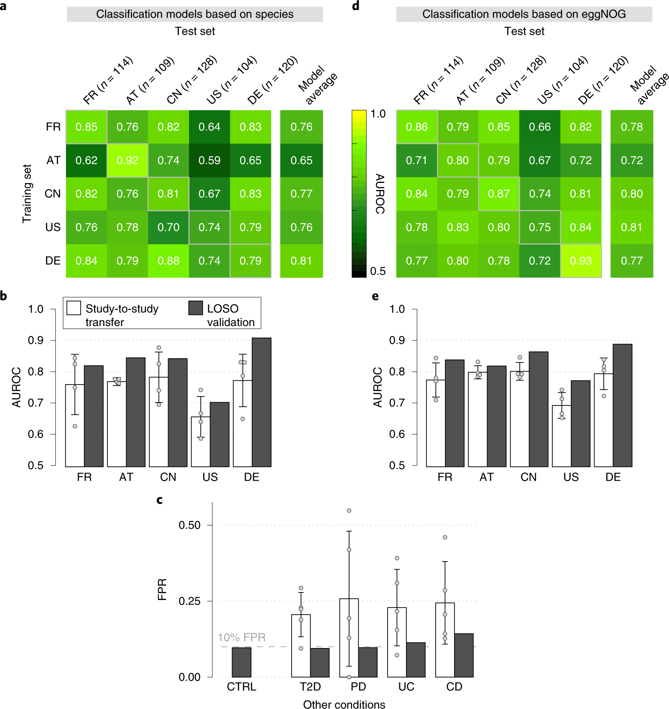
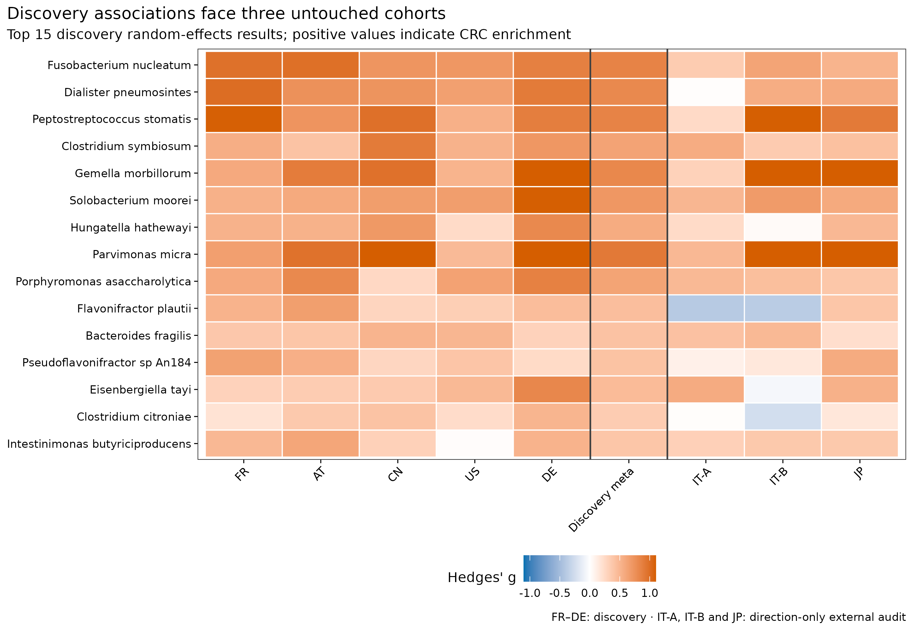
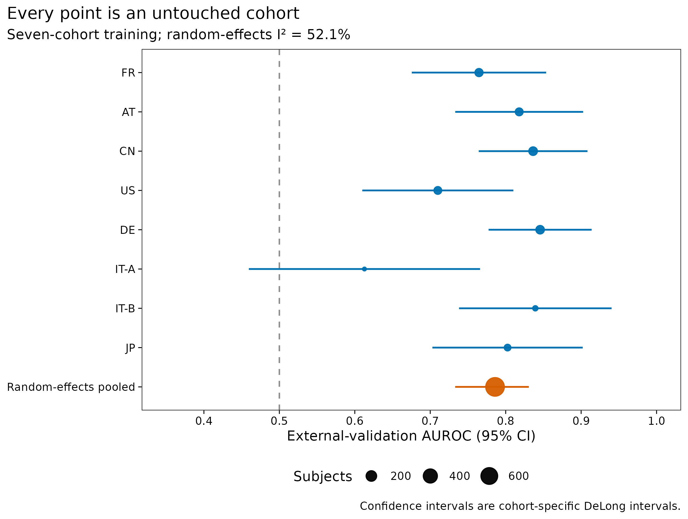
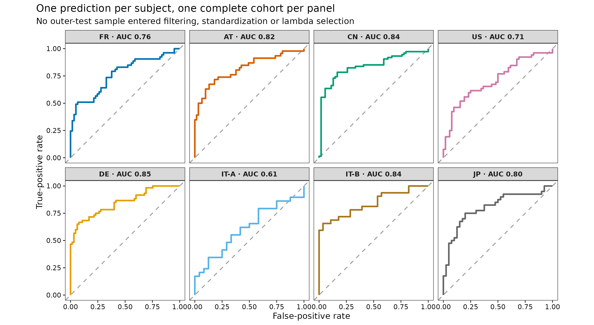
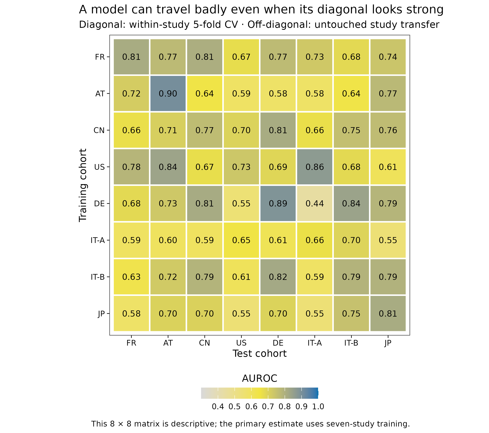
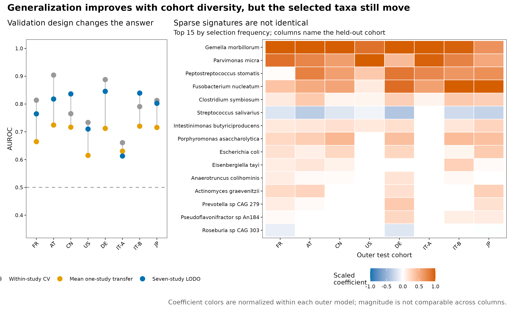

> **学习目标：**把“跨队列验证”拆成两个不同问题：先用 study-specific effect 做随机效应 meta 分析，再用真正的 N−1（N−1 cohorts train, one complete cohort tests）估计模型迁移；同时保留单队列迁移矩阵、队列异质性和 signature 稳定性。  
> **真实数据：**curatedMetagenomicData 3.12.0 中 8 个 stool shotgun CRC 队列，共 **771 名独立受试者、385 名 Control、386 名 CRC、897 个物种**；adenoma、术后史与未标注样本不重标为对照。  
> **推断边界：**结果衡量统一重处理物种谱在既有病例–对照队列之间的可迁移性，不是筛查人群 PPV、前瞻性临床效用或因果效应。

```{r}
#| label: load-article28-results
#| include: false
result_dir28 <- "results/28-cross-cohort"
input_dir28 <- "data/small/28-cross-cohort"
if (!dir.exists(result_dir28)) result_dir28 <- "../results/28-cross-cohort"
if (!dir.exists(input_dir28)) input_dir28 <- "../data/small/28-cross-cohort"

read_tsv28 <- function(directory, name) {
  utils::read.delim(
    file.path(directory, name), check.names = FALSE,
    quote = "", comment.char = "", stringsAsFactors = FALSE
  )
}

performance28 <- read_tsv28(result_dir28, "lodo-performance.tsv")
performance_meta28 <- read_tsv28(result_dir28, "performance-meta-analysis.tsv")
bootstrap28 <- read_tsv28(result_dir28, "hierarchical-bootstrap-summary.tsv")
signature28 <- read_tsv28(result_dir28, "meta-signature-validation.tsv")
stability28 <- read_tsv28(result_dir28, "lodo-coefficient-stability.tsv")
gap28 <- read_tsv28(result_dir28, "validation-gap.tsv")
cohort28 <- read_tsv28(input_dir28, "cohort-summary.tsv")

stopifnot(
  nrow(performance28) == 8L,
  sum(performance28$Samples) == 771L,
  nrow(cohort28) == 8L,
  performance_meta28$Cohorts == 8L,
  bootstrap28$Replicates == 2000L
)

fmt28 <- function(x, digits = 3L) {
  formatC(x, format = "f", digits = digits)
}
metric28 <- function(cohort, column, digits = 3L) {
  fmt28(performance28[[column]][performance28$Cohort == cohort], digits)
}
q_sig28 <- signature28[is.finite(signature28$QValue) & signature28$QValue < 0.05, ]
validated_three28 <- sum(
  q_sig28$ValidationCohorts == 3L &
    q_sig28$ConcordantValidationCohorts == 3L
)
```

## 这一步对应论文里的哪张图 {#sec-target}

Wirbel 等人在 2019 年汇总 8 个地理和技术背景不同的 CRC shotgun 队列。Figure 3a 先逐一训练单队列模型：对角线是同队列交叉验证，非对角线是 study-to-study transfer；Figure 3b 再把其余 4 个 discovery studies 合并训练，在第 5 个完整队列上做 leave-one-study-out（LOSO）外测。原文报告，species-level LOSO AUROC 为 0.71–0.91，多队列训练相对单队列迁移平均提高约 0.076 [@wirbel2019crc]。

{#fig-28-anchor}

原研究用 MOCAT2 去宿主、mOTU profiler 2.0.0 建 species profile、SIAMCAT 1.1.0 训练 LASSO；5 个 discovery studies 共有 849 个过滤后物种，模型用 10 次重复 × 10 折 CV。当前冻结数据则是 cMD 2021-03-31 release 的 **MetaPhlAn 3 / CHOCOPhlAn 201901** 统一重处理谱 [@beghini2021biobakery; @manghi2026cmd3]。AT 与 DE 的样本口径也和历史论文略有不同，当前 8 队列合计 771 人，而非原论文 768 人。因此下面复现的是 Figure 3 的验证问题，并按当前标准升级；不宣称逐格复刻原数值。

原图中 “LOSO” 已经是 N−1，但旧草稿只取两个队列互相预测，实质仍是一对一迁移。这里主分析轮流留出 **8 个完整队列**：每轮用其余七个完整队列训练，只在第八个队列评估一次。这才是本文所说的真正的 N−1。

## 理论：meta 分析与外部验证回答不同问题 {#sec-theory}

### 1. association reproducibility 不等于 prediction transportability

对单个物种，问题是 CRC–Control 差异是否在多个研究中方向一致。设第 $s$ 个研究的标准化均值差为 $\hat g_s$，抽样方差为 $v_s$，随机效应模型写成：

$$
\hat g_s=\mu+u_s+\epsilon_s,
\qquad
u_s\sim N(0,\tau^2),
\qquad
\epsilon_s\sim N(0,v_s).
$$

权重不再只是 $1/v_s$，而是 $w_s=1/(v_s+\tau^2)$。$\tau^2$ 表示研究间真实差异；$I^2$ 近似表示总变异中由异质性而非抽样误差解释的比例 [@viechtbauer2010metafor]。固定效应模型把所有队列视为共享一个真值，通常不适合跨国家、提取方法与测序流程的微生物组资料。

预测问题则问：一个由多个物种共同构成的函数

$$
\widehat P(Y=\mathrm{CRC}\mid\mathbf x)
=\operatorname{logit}^{-1}
\left(\beta_0+\sum_{j=1}^{p}\beta_jx_j\right)
$$

能否迁移到未见研究。某物种可有稳定 marginal association，却因共线性不被 LASSO 选择；反过来，一个 predictive feature 也可能只是队列结构的代理。association table、model coefficients 与外部 AUROC 必须分开解释。

### 2. 单队列迁移矩阵不是 N−1

训练集合决定 estimand：

| Design | Training data | Test data | 回答的问题 |
|---|---|---|---|
| Within-study CV | one study | random folds from the same study | 对同源样本的内部泛化 |
| Study-to-study transfer | one complete study | another complete study | 一个来源能否直接迁移 |
| N−1 / LOSO | all but one complete study | the omitted complete study | 多来源训练能否适应新 study |

8×8 矩阵的 56 个非对角格很有诊断价值，但每格只利用一个训练来源。真正的 N−1 每轮汇集 7 个来源，模型有机会学习跨研究重复出现的 signal，并降低某个大队列独占拟合的风险。

### 3. 外层按 study 留出，内层也必须尊重 study

若外层留出一个 study，内层却把其余样本随机分成 10 折，$\lambda$ 仍按“同批次新样本”选择。本文的内层验证再次轮流留出一个 training cohort：对每个候选 $\lambda$，都在 7 个未见 training cohorts 上分别得到 AUROC；随后按 mean AUROC 的 one-standard-error rule 选择最大的合格 $\lambda$。较大的 $\lambda$ 让模型更稀疏，避免为不到 0.01 的内层均值优势换取大量不稳定特征 [@friedman2010glmnet]。

### 4. cohort-balanced weights 防止大队列替全体发言

合并 7 个训练队列后，直接给每名受试者等权，会让样本量最大的队列贡献最多 loss。这里先让每个训练队列贡献相同总权重，再在队列内把 CRC 与 Control 各分一半：

$$
w_i=\frac{1}{2K\,n_{s(i),y(i)}},
$$

其中 $K=7$，$n_{s,y}$ 是 study $s$ 中类别 $y$ 的人数。这个权重不消除 batch effect，但能阻止单一队列或多数类支配 pooled model。

### 5. 外部 AUROC 也有异质性

8 个外测 AUROC 不是同一总体的 8 次技术重复。本文先在每个 untouched cohort 内计算 DeLong 95% CI [@robin2011proc]，再对 logit(AUROC) 做 REML random-effects synthesis；另以 2,000 次 cohort-and-class-stratified hierarchical bootstrap 估计未加权 macro AUROC 区间。前者按估计精度加权，后者把“随机换一个队列”纳入不确定性，两者 estimand 不同。

## 准备工作 {#sec-setup}

<details>
<summary><strong>展开：数据、环境、资源门槛与内联作图函数</strong></summary>

### 资源门槛

| Stage | CPU | RAM | Disk | Time |
|---|---:|---:|---:|---:|
| Verify six frozen payloads | 1 | <1 GB | <10 MB | seconds |
| Discovery species meta-analysis | 1 | 2–4 GB | <100 MB | about 10–30 s |
| 8 outer LODO + inner cohort tuning | 1 | 2–4 GB | <500 MB | about 1–3 min |
| 8×8 transfer + 2,000 bootstraps + figures | 1 | 2–4 GB | <500 MB | about 1–2 min |
| Render from validated tables | 1 | <2 GB | about 30 MB | seconds |

这里不需要下载 FASTQ 或 MetaPhlAn 数据库。8 份 cMD RDA 源文件已按 SHA-256 锁定，Git 内只保留约 0.35 MB 的 species fraction table、metadata、cohort summary、resource manifest 与 feature audit。若机器很慢，可先只执行 render；正式分析应保留完整 8 个 outer cohorts，不能用删队列换速度。

### 安装固定版本

```{r}
#| eval: false
if (!requireNamespace("renv", quietly = TRUE)) {
  install.packages("renv")
}
renv::restore(lockfile = "env/cross-cohort-renv.lock")

# 不使用 renv 时，至少固定这些直接依赖：
install.packages(c(
  "glmnet", "metafor", "pROC", "ggplot2",
  "patchwork", "scales", "jsonlite", "digest", "knitr"
))

stopifnot(
  packageVersion("glmnet") == "4.1.8",
  packageVersion("metafor") == "4.6.0",
  packageVersion("pROC") == "1.18.5"
)
```

`env/cross-cohort-renv.lock` 固定 51 条直接与传递依赖记录，SHA-256 为 `4a57a15f566055cdc36aa2a1e3d68a384f599d895690960d3a673c816ca3659f`；它独立于全项目 `env/renv.lock`，不会改写其他章节已经验证的 R 快照。

### 核验冻结输入并完整复算

```{bash}
#| eval: false
# 若需要从八份 checksum-locked ExperimentHub RDA 重建 Git 内小表：
R_LIBS_USER="$PWD/.r-lib:$HOME/R/library" \
Rscript scripts/prepare_article28_cross_cohort.R \
  --source-dir downloads/article28 \
  --output-dir data/small/28-cross-cohort \
  --notice data/small/28-data-NOTICE.txt

(cd data/small/28-cross-cohort && \
  sha256sum -c file-checksums.sha256)

R_LIBS_USER="$PWD/.r-lib:$HOME/R/library" \
Rscript scripts/validate_article28_cross_cohort.R \
  --project-root . \
  --input-dir data/small/28-cross-cohort \
  --output-dir results/28-cross-cohort \
  --figure-dir figures \
  --chapter chapters/28-cross-cohort-validation.qmd
```

源资源、release、原始单位、冻结单位和 SHA-256 均在 `resource-manifest.tsv`，预先约定的 outer/inner validation、筛选、权重和不确定性规则在 `analysis-contract.tsv`。冻结矩阵把各 RDA 中的 species percentage 除以 100，转成每个样本和为 1 的 fraction；不同队列未出现的 database feature 填结构零。这个零表示“同一分类数据库下未报告该 species row”，不能解释成生物学不存在。

### 加载包、固定随机状态并内联作图函数

```{r}
#| eval: false
library(glmnet)
library(metafor)
library(pROC)
library(ggplot2)
library(patchwork)

RNGkind("Mersenne-Twister", "Inversion", "Rejection")
set.seed(20260728)

pal_pub <- c(
  "#0072B2", "#D55E00", "#009E73", "#CC79A7",
  "#E69F00", "#56B4E9", "#A6761D", "#666666"
)
scale_color_pub <- function(...) scale_color_manual(values = pal_pub, ...)
scale_fill_pub <- function(...) scale_fill_manual(values = pal_pub, ...)

theme_pub <- function(base_size = 12) {
  theme_bw(base_size = base_size, base_family = "sans") +
    theme(
      panel.grid = element_blank(),
      axis.text = element_text(color = "black"),
      axis.ticks = element_line(color = "black", linewidth = 0.3),
      legend.key = element_blank(),
      plot.title.position = "plot"
    )
}

save_pub <- function(plot, file_base, width = 180, height = 130,
                     units = "mm", dpi = 350) {
  ggsave(paste0(file_base, ".pdf"), plot, width = width, height = height,
         units = units, device = cairo_pdf)
  ggsave(paste0(file_base, ".png"), plot, width = width, height = height,
         units = units, dpi = dpi, bg = "white")
  ggsave(paste0(file_base, ".tiff"), plot, width = width, height = height,
         units = units, dpi = dpi, compression = "lzw", bg = "white")
  invisible(plot)
}
```

</details>

## 可复制代码：从 8 张谱表到整队列外测 {#sec-code}

### 1. 先审计观察单位和队列角色

```{r}
#| label: table-article28-cohorts
cohort_display28 <- cohort28[, c(
  "Cohort", "Study", "Role", "Samples", "Controls", "CRC",
  "IndependentSubjects", "SpeciesAtSource"
)]
knitr::kable(
  cohort_display28,
  caption = "Eight CRC cohorts in the frozen analysis contract."
)
```

5 个 discovery/meta-analysis 队列用于物种 association discovery；IT-A、IT-B、JP 只做该 association 的方向验证。预测主分析则让 8 个队列各自轮流成为 untouched outer test，因此每名受试者只得到一次外测概率。两套角色并不冲突：前者保留明确的 discovery/validation 时间顺序，后者估计“任一已知 study 成为新域”时的 transportability。

```{r}
#| eval: false
species <- read.delim(
  gzfile("data/small/28-cross-cohort/species-relative-abundance.tsv.gz"),
  check.names = FALSE
)
meta <- read.delim(
  "data/small/28-cross-cohort/sample-metadata.tsv",
  check.names = FALSE
)

sample_id <- meta$sample_id
x <- t(as.matrix(species[, sample_id, drop = FALSE]))
storage.mode(x) <- "double"
colnames(x) <- species$Feature
rownames(x) <- sample_id
y <- factor(meta$Outcome, levels = c("Control", "CRC"))
study <- factor(meta$Cohort, levels = c(
  "FR", "AT", "CN", "US", "DE", "IT-A", "IT-B", "JP"
))

stopifnot(
  dim(x)[1] == 771L, dim(x)[2] == 897L,
  identical(as.integer(table(y)), c(385L, 386L)),
  !anyDuplicated(meta$subject_id),
  max(abs(rowSums(x) - 1)) < 2e-6,
  all(is.finite(x)), min(x) >= 0, max(x) <= 1
)
```

::: {.callout-important title="sample_id 不能脱离 study 语境"}
cMD 全库中 raw `sample_id` 可能跨 study 重名。冻结阶段以 `study_name::sample_id` 审计全局唯一性，再确认当前 771 个 ID 没有碰撞。合并更多研究时，matrix column name、metadata key 和 subject grouping 都应使用 study-qualified key；不能只凭裸 ID `match()`。
:::

### 2. discovery-only 随机效应物种 meta 分析

先在 5 个 discovery cohorts 内做无标签 prevalence gate：总体 non-zero prevalence ≥10%、最大 abundance ≥$10^{-4}$，且至少 3 个 discovery studies 的 prevalence ≥5%。这一步留下 251 个候选 species。每个 study 内对 $\log_{10}(x+10^{-6})$ 计算 CRC–Control Hedges' $g$，再用 REML 合并；BH correction 只在成功拟合的候选 species 间进行。

```{r}
#| eval: false
hedges_g <- function(values, outcome) {
  case <- values[outcome == "CRC"]
  ctrl <- values[outcome == "Control"]
  if (sd(case) == 0 && sd(ctrl) == 0) return(c(NA_real_, NA_real_))
  es <- metafor::escalc(
    measure = "SMD",
    m1i = mean(case), sd1i = sd(case), n1i = length(case),
    m2i = mean(ctrl), sd2i = sd(ctrl), n2i = length(ctrl)
  )
  c(effect = as.numeric(es$yi), variance = as.numeric(es$vi))
}

discovery <- c("FR", "AT", "CN", "US", "DE")
validation <- c("IT-A", "IT-B", "JP")
prevalence_by_discovery <- vapply(
  discovery,
  function(s) colMeans(x[study == s, , drop = FALSE] > 0),
  numeric(ncol(x))
)
eligible <- colMeans(x[study %in% discovery, , drop = FALSE] > 0) >= 0.10 &
  rowSums(prevalence_by_discovery >= 0.05) >= 3L &
  apply(x[study %in% discovery, , drop = FALSE], 2, max) >= 1e-4

effect_rows <- list()
index <- 0L
for (feature in colnames(x)[eligible]) {
  abundance <- log10(x[, feature] + 1e-6)
  for (s in levels(study)) {
    index <- index + 1L
    es <- hedges_g(abundance[study == s], y[study == s])
    effect_rows[[index]] <- data.frame(
      Feature = feature, Cohort = s,
      HedgesG = es[[1]], Variance = es[[2]]
    )
  }
}
effects <- do.call(rbind, effect_rows)

meta_rows <- lapply(split(effects, effects$Feature), function(z) {
  d <- z[z$Cohort %in% discovery & is.finite(z$Variance), ]
  fit <- metafor::rma.uni(yi = d$HedgesG, vi = d$Variance, method = "REML")
  data.frame(
    Feature = z$Feature[[1]], PooledHedgesG = as.numeric(fit$b),
    Lower95 = fit$ci.lb, Upper95 = fit$ci.ub,
    PValue = fit$pval, TauSquared = fit$tau2, I2Percent = fit$I2
  )
})
species_meta <- do.call(rbind, meta_rows)
species_meta$QValue <- p.adjust(species_meta$PValue, method = "BH")
```

当前复算中，251 个候选 species 有 56 个达到 discovery BH $q<0.05$；其中 **`r validated_three28` 个**在 IT-A、IT-B、JP 三个独立队列都与 pooled direction 一致。`Fusobacterium nucleatum` 的 pooled Hedges' $g$ 为 `r fmt28(signature28$PooledHedgesG[signature28$Species == "Fusobacterium nucleatum"], 2)`，三个验证队列均同向；但“同向”不是独立显著性检验，也不应被包装成 100% replication rate。

{#fig-28-meta-signature}

图中 `Flavonifractor plautii` 等物种在验证队列出现反向色块，说明显著 pooled effect 不等于每个地点同质。主表保留 $\tau^2$、$I^2$ 与逐队列 effect，而不是只输出一列 q-value。

### 3. 训练折内拟合 feature gate、变换和权重

下面三段函数是外层泄漏边界。`fit_preprocessor()` 只查看当前 training cohorts；outer test 既不决定 feature universe，也不贡献 mean/SD。`glmnet` 的 standardization 参数在训练数据拟合，`predict()` 对外部矩阵复用同一参数 [@friedman2010glmnet]。

```{r}
#| eval: false
fit_preprocessor <- function(x_train, cohort_train) {
  cohort_train <- as.character(cohort_train)
  cohort_levels <- sort(unique(cohort_train))
  prevalence <- colMeans(x_train > 0)
  maximum <- apply(x_train, 2, max)
  by_cohort <- vapply(
    cohort_levels,
    function(s) colMeans(x_train[cohort_train == s, , drop = FALSE] > 0),
    numeric(ncol(x_train))
  )
  support_required <- ceiling(length(cohort_levels) / 2)
  keep <- prevalence >= 0.10 & maximum >= 1e-4 &
    rowSums(by_cohort >= 0.05) >= support_required &
    apply(x_train, 2, sd) > 0
  stopifnot(sum(keep) >= 2L)
  list(
    features = colnames(x_train)[keep],
    pseudocount = 1e-6,
    support_required = support_required
  )
}

apply_preprocessor <- function(prep, new_x) {
  log10(new_x[, prep$features, drop = FALSE] + prep$pseudocount)
}

balanced_weights <- function(cohort_train, outcome_train) {
  cohort_train <- as.character(cohort_train)
  outcome_train <- as.character(outcome_train)
  cohorts <- sort(unique(cohort_train))
  w <- numeric(length(outcome_train))
  for (s in cohorts) {
    for (class in c("Control", "CRC")) {
      i <- which(cohort_train == s & outcome_train == class)
      w[i] <- 1 / (2 * length(cohorts) * length(i))
    }
  }
  stopifnot(abs(sum(w) - 1) < 1e-12)
  w
}
```

### 4. 内层 leave-one-training-cohort-out 选择 $\lambda$

预先固定 41 个 $\lambda$，从 1 到 $10^{-4}$。对某个 outer test cohort，剩余 7 个 training cohorts 再轮流留出；每条 regularization path 产生 7 个 inner-cohort AUROC。one-standard-error rule 先找最佳 mean，再选择均值不低于“最佳均值减其 SE”的**最大** $\lambda$。

```{r}
#| eval: false
lambda_grid <- exp(seq(log(1), log(1e-4), length.out = 41L))

auc_rank <- function(y, score) {
  y <- as.integer(y)
  n1 <- sum(y == 1L); n0 <- sum(y == 0L)
  r <- rank(score, ties.method = "average")
  (sum(r[y == 1L]) - n1 * (n1 + 1) / 2) / (n1 * n0)
}

fit_path <- function(x_train, y_train, cohort_train, lambda = lambda_grid) {
  glmnet::glmnet(
    x = x_train, y = as.integer(y_train == "CRC"),
    family = "binomial", alpha = 1, lambda = lambda,
    weights = balanced_weights(cohort_train, y_train),
    standardize = TRUE, thresh = 1e-8, maxit = 100000L
  )
}

choose_one_se <- function(auc_matrix) {
  mean_auc <- colMeans(auc_matrix)
  se_auc <- apply(auc_matrix, 2, sd) / sqrt(nrow(auc_matrix))
  best <- which.max(mean_auc)
  eligible <- mean_auc >= mean_auc[best] - se_auc[best]
  selected <- which(eligible)[which.max(lambda_grid[eligible])]
  list(index = selected, lambda = lambda_grid[selected])
}

tune_by_cohort <- function(outer_test) {
  training_cohorts <- setdiff(levels(study), outer_test)
  auc_matrix <- matrix(NA_real_, nrow = 7L, ncol = length(lambda_grid))
  for (i in seq_along(training_cohorts)) {
    inner_test <- study == training_cohorts[[i]]
    inner_train <- !study %in% c(outer_test, training_cohorts[[i]])
    prep <- fit_preprocessor(x[inner_train, ], study[inner_train])
    model <- fit_path(
      apply_preprocessor(prep, x[inner_train, ]),
      y[inner_train], study[inner_train]
    )
    probability <- as.matrix(predict(
      model,
      newx = apply_preprocessor(prep, x[inner_test, ]),
      type = "response", s = lambda_grid
    ))
    auc_matrix[i, ] <- vapply(
      seq_along(lambda_grid),
      function(j) auc_rank(y[inner_test] == "CRC", probability[, j]),
      numeric(1)
    )
  }
  choose_one_se(auc_matrix)
}
```

### 5. 外层 8 次整队列留出

```{r}
#| eval: false
lodo_predictions <- list()
lodo_metrics <- list()

for (outer_test in levels(study)) {
  test <- study == outer_test
  train <- !test
  selected <- tune_by_cohort(outer_test)

  prep <- fit_preprocessor(x[train, ], study[train])
  model <- fit_path(
    apply_preprocessor(prep, x[train, ]),
    y[train], study[train], lambda = selected$lambda
  )
  probability <- as.numeric(predict(
    model,
    newx = apply_preprocessor(prep, x[test, ]),
    type = "response", s = selected$lambda
  ))

  roc_object <- pROC::roc(
    y[test], probability,
    levels = c("Control", "CRC"), direction = "<", quiet = TRUE
  )
  ci <- as.numeric(pROC::ci.auc(roc_object, method = "delong"))
  lodo_predictions[[outer_test]] <- data.frame(
    SampleID = rownames(x)[test], Cohort = outer_test,
    Outcome = y[test], ProbabilityCRC = probability
  )
  lodo_metrics[[outer_test]] <- data.frame(
    Cohort = outer_test, Samples = sum(test),
    FeaturesKept = length(prep$features),
    SelectedLambda = selected$lambda,
    AUROC = as.numeric(pROC::auc(roc_object)),
    AUROCLower95 = ci[[1]], AUROCUpper95 = ci[[3]],
    AUROCVariance = as.numeric(pROC::var(roc_object, method = "delong")),
    Brier = mean((as.integer(y[test] == "CRC") - probability)^2)
  )
}

lodo_predictions <- do.call(rbind, lodo_predictions)
lodo_metrics <- do.call(rbind, lodo_metrics)
stopifnot(
  nrow(lodo_predictions) == 771L,
  !anyDuplicated(lodo_predictions$SampleID),
  nrow(lodo_metrics) == 8L
)
```

当前 8 个 outer models 各用 643–718 名训练受试者，training-only gate 保留 240–252 个候选 species；1-SE 选择的 $\lambda$ 为 0.0398–0.0794。外测结果如下：

```{r}
#| label: table-article28-lodo
performance_display28 <- performance28[, c(
  "Cohort", "Samples", "FeaturesKept", "SelectedLambda",
  "AUROC", "AUROCLower95", "AUROCUpper95", "AUPRC", "Brier"
)]
for (column in c(
  "SelectedLambda", "AUROC", "AUROCLower95", "AUROCUpper95",
  "AUPRC", "Brier"
)) {
  performance_display28[[column]] <- round(performance_display28[[column]], 3)
}
knitr::kable(
  performance_display28,
  caption = "True N−1 external validation: seven complete cohorts train, one complete cohort tests."
)
```

FR、AT、CN、US、DE、IT-B、JP 的 point AUROC 均高于 0.70；IT-A 只有 `r metric28("IT-A", "AUROC")`，DeLong 95% CI 为 `r metric28("IT-A", "AUROCLower95")`–`r metric28("IT-A", "AUROCUpper95")`，包含 0.5。删掉 IT-A 会让故事更漂亮，却会系统性低估新中心失败的概率。

{#fig-28-lodo-forest}

Random-effects pooled AUROC 为 `r fmt28(performance_meta28$PooledAUROC)`（95% CI `r fmt28(performance_meta28$Lower95)`–`r fmt28(performance_meta28$Upper95)`），$I^2=`r fmt28(performance_meta28$I2Percent, 1)`%$，heterogeneity $P=`r fmt28(performance_meta28$HeterogeneityP)`$。未加权 macro AUROC 为 `r fmt28(bootstrap28$Estimate)`，2,000 次 hierarchical bootstrap 95% CI 为 `r fmt28(bootstrap28$Lower95)`–`r fmt28(bootstrap28$Upper95)`。两个 pooled number 接近，不代表可以省略逐队列结果。

{#fig-28-lodo-roc}

### 6. 8×8 单队列迁移是诊断图，不是主估计

为贴近 Figure 3a，次要分析对每个 source study 做分层 5-fold CV 选择 $\lambda$，随后把锁定模型应用到其他 7 个 studies。对角线重复使用该 study 的 CV 预测，非对角线是真外测。这个矩阵可定位“谁训练谁失败”，但对角线复用了同一 CV 做调参与评估，仍比 nested estimate 乐观；因此不拿它替代 N−1 forest。

{#fig-28-transfer}

以 test cohort 为单位，7 个单来源模型的 mean transfer AUROC 为 0.615–0.724；N−1 相对这个均值在 7/8 队列提高 0.087–0.133，唯独 IT-A 降低 0.017。结论不是“多队列训练必胜”，而是它通常提高迁移，同时 domain-specific failure 仍必须原样呈现。

### 7. 性能合并、hierarchical bootstrap 与 signature 稳定性

```{r}
#| eval: false
# Random-effects synthesis on the logit-AUROC scale
yi <- qlogis(lodo_metrics$AUROC)
sei <- sqrt(lodo_metrics$AUROCVariance) /
  (lodo_metrics$AUROC * (1 - lodo_metrics$AUROC))
auc_meta <- metafor::rma.uni(yi = yi, sei = sei, method = "REML")
c(
  pooled = plogis(as.numeric(auc_meta$b)),
  lower = plogis(auc_meta$ci.lb),
  upper = plogis(auc_meta$ci.ub),
  I2 = auc_meta$I2
)

# Cohort-and-class-stratified hierarchical bootstrap
set.seed(20260728 + 800000L)
boot_macro_auc <- replicate(2000L, {
  sampled_studies <- sample(levels(study), 8L, replace = TRUE)
  mean(vapply(sampled_studies, function(s) {
    z <- lodo_predictions[lodo_predictions$Cohort == s, ]
    control <- which(z$Outcome == "Control")
    crc <- which(z$Outcome == "CRC")
    rows <- c(
      sample(control, length(control), replace = TRUE),
      sample(crc, length(crc), replace = TRUE)
    )
    auc_rank(z$Outcome[rows] == "CRC", z$ProbabilityCRC[rows])
  }, numeric(1)))
})
quantile(boot_macro_auc, c(0.025, 0.5, 0.975), type = 6)
```

LASSO coefficient 不应只从一个“全数据最终模型”截屏。8 个 outer models 中，`Gemella morbillorum`、`Parvimonas micra`、`Peptostreptococcus stomatis`、`Fusobacterium nucleatum` 和 `Clostridium symbiosum` 在 **8/8** 次均被选中且方向一致；9 个 species 至少出现在 6/8 模型。其余 taxa 随 outer test 改变，说明 feature list 本身也有 domain uncertainty。

{#fig-28-stability}

## 审计与升级 {#sec-audit}

### 先忠实复现作者问题，再说明改了什么

| Component | Wirbel et al. 2019 | 当前复算 | 解释边界 |
|---|---|---|---|
| Taxonomic profile | mOTU profiler 2.0.0 | MetaPhlAn 3 / CHOCOPhlAn 201901 | feature universe 不同 |
| Discovery cohorts | 5 studies, historical sample set | FR/AT/CN/US/DE in cMD release | AT、DE control 口径不同 |
| External validation | IT1/IT2/JP in later figure | IT-A/IT-B/JP association direction audit; all 8 enter outer LODO | 不宣称原数值复刻 |
| Classifier | SIAMCAT 1.1.0 LASSO | glmnet 4.1.8 LASSO | 同为 L1 logistic，调参 contract 不同 |
| Inner selection | repeated 10×10 sample CV; AUPRC constraint | leave-one-training-cohort-out; mean AUROC 1-SE | 当前选择目标更贴近跨 study 迁移 |
| Outer validation | 4-study train / 1-study test | 7-study train / 1-study test | 当前有 8 个完整 outer tests |

原研究的 repeated CV 训练 100 个模型并平均 holdout prediction，且要求至少 5 个 non-zero coefficients [@wirbel2019crc]。当前版本选择一个 cohort-aware $\lambda$ 后在全部 outer-training data 重拟合，更接近部署时的 single locked model。两者都是合理 workflow，但 numerical equality 没有定义。

### 当前升级 1：association discovery 与预测完全解耦

discovery meta-analysis 只用 5 个预先指定 studies，并把 3 个 validation studies 留到方向审计；LODO classifier 的 feature gate 完全不使用 label，更没有先拿 meta-analysis top taxa 筛选模型输入。若把 56 个显著 taxa 先选好再做 outer validation，outer labels 已经通过 discovery step 泄漏——除非 discovery studies 与 outer test 永远严格分离。

### 当前升级 2：报告 heterogeneity，不用 pooled AUROC 掩盖失败

$I^2=52.1\%$ 且 Q-test $P=0.041$ 表明 performance heterogeneity 不能忽略。IT-A 的 point estimate 接近 0.61，固定 0.5 阈值 sensitivity 仅 `r metric28("IT-A", "SensitivityAt05")`；这同时暴露 discrimination 与 calibration/threshold transport 的问题。当前分析不在 outer test 上重新找 cutoff，因为那会把外测变成 tuning set。

### 当前升级 3：批次校正必须区分 inductive 与 transductive

ComBat、MMUPHin 和 percentile normalization 都可用于 batch sensitivity analysis [@johnson2007combat; @ma2022mmuphin; @gibbons2018batch]，但它们不自动适合部署：

- 如果把 outer test 与 train 合在一起估计 ComBat 参数，模型已经读取新队列的 feature distribution；这是 transductive sensitivity analysis，不是单样本 inductive prediction。
- 如果 batch 与 outcome 严重不平衡，校正可能删掉真实 disease signal，或保留伪 signal。
- 新医院若没有一批可用 controls，就无法复现 control-referenced percentile normalization。
- 把 `study` 作为普通哑变量也不能解决问题，因为全新的 study level 在训练时不存在。

```{r}
#| eval: false
# 不能作为本文 primary LODO：outer-test distribution 参与了校正参数估计
combined_log <- cbind(t(x_train_log), t(x_outer_test_log))
batch <- c(as.character(training_study), rep("NEW_STUDY", nrow(x_outer_test_log)))
combat_transductive <- sva::ComBat(
  dat = combined_log, batch = batch,
  par.prior = TRUE, prior.plots = FALSE
)

# 若运行，必须标为 sensitivity-only，并和完全 untouched primary result 并列报告。
```

本文 primary model 不做 joint train–test batch correction；它依靠 uniform profiler lineage、training-only transform、cohort-balanced weights 和 study-level validation直接测量剩余 domain shift。更进一步的 online domain adaptation 必须能对单个未来样本应用冻结参数，并在新的完整队列上再次验证。

### 尚未解决：case mix、临床基线与前瞻性校准

年龄在 8 队列较完整，BMI、药物、肿瘤 stage、FIT/FOBT、结肠镜指征和提取 kit 并不齐全。因而不能证明模型独立于这些 confounders，也不能把病例–对照 AUROC 当筛查效用。下一阶段应预先锁定 classifier 与 threshold，在目标筛查人群比较 age/sex/FIT baseline、报告 calibration slope/intercept、PPV/NPV、decision curve，并用 prospective temporal cohort 做最后一次测试。

## 出版级美化 {#sec-polish}

五张复算图使用统一语义：CRC enrichment/positive coefficient 用橙色，control enrichment/negative coefficient 用蓝色；8 个 cohorts 的色彩在 ROC panels 中固定；chance line 均为灰色虚线。所有轴、图例、标题和注释为英文，可直接进入英文稿件。

热图必须在格内写 AUROC，否则相近色阶难以精确比较；颜色范围固定，不按每个 panel 单独拉伸。forest plot 同时展示 point、95% CI、sample size 和 pooled estimate，不能只给一根平均柱。ROC 不跨队列 pooled，避免大队列遮住小队列失败。coefficient heatmap 在每个 outer model 内缩放，因此只比较方向与相对权重，不跨列比较绝对大小。

```{r}
#| eval: false
forest <- read.delim("results/28-cross-cohort/lodo-performance.tsv")
p <- ggplot(forest, aes(AUROC, reorder(Cohort, AUROC))) +
  geom_vline(xintercept = 0.5, linetype = 2, color = "grey55") +
  geom_errorbarh(
    aes(xmin = AUROCLower95, xmax = AUROCUpper95),
    height = 0, linewidth = 0.6, color = "#0072B2"
  ) +
  geom_point(aes(size = Samples), color = "#0072B2") +
  scale_x_continuous(
    breaks = seq(0.4, 1, 0.1),
    labels = function(x) sprintf("%.1f", x)
  ) +
  coord_cartesian(xlim = c(0.35, 1)) +
  labs(
    x = "External-validation AUROC (95% CI)", y = NULL,
    size = "Subjects", title = "Every point is an untouched cohort"
  ) +
  theme_pub()

save_pub(p, "figures/28-lodo-forest", width = 175, height = 132)
```

PDF 是矢量主文件，PNG 用于网页和公众号，350-dpi LZW TIFF 用于投稿。原论文锚点保留原始像素，不重绘、不改色，并单独声明版权边界。

## 常见坑 {#sec-pitfalls}

::: {.callout-caution title="把两队列互测叫 leave-one-dataset-out"}
两个队列时，A→B 仍是 single-study transfer；没有“其余多个 datasets”可合并。N−1 必须明确列出每轮 training studies 和完整 outer test study。本文的 audit table 对每轮保存 7 个训练队列名，并断言外测队列不在其中。
:::

::: {.callout-caution title="在全 8 队列上筛物种，再轮流外测"}
即便 prevalence filter 不看 label，它仍让 outer test 决定 feature universe。筛选、pseudo-count transform、centering/scaling、imputation、batch correction、feature selection 与 calibration 都是模型的一部分，必须在每轮 training data 内重拟合。
:::

::: {.callout-caution title="内层随机分样本，却宣称按队列泛化"}
random inner CV 会偏好在已见 batch 上表现好的超参数。外层可诚实估计最终 performance，但 tuning target 与 deployment target 不一致。样本量允许时，内层也应按 study/center 留出；队列太少时要承认超参数选择不稳定，并做 sensitivity grid。
:::

::: {.callout-caution title="先联合 ComBat，再把测试队列切出来"}
outer labels 即使没进 ComBat，test feature distribution 也进入参数估计。这是 transductive use；若真实部署是一名患者一次预测，它不可复现。可以作为明确标注的 sensitivity analysis，但不能替代 untouched primary result。
:::

::: {.callout-caution title="只给 pooled AUROC，不给 I² 和最差队列"}
平均数可掩盖 IT-A 这类失败。至少报告逐队列 estimate/CI、macro summary、random-effects summary、$\tau^2/I^2$、heterogeneity test，并讨论最差域的 case mix 和技术差异。
:::

::: {.callout-caution title="把 8 次 LASSO 入选当 8 个独立生物学重复"}
8 个 outer models 的训练数据高度重叠，selection fraction 是稳定性诊断，不是 binomial replication P-value。还应与 study-specific association effects、外部 direction、profiler database sensitivity 和实验机制证据交叉验证。
:::

::: {.callout-warning title="高 AUROC 仍不是可部署诊断"}
病例–对照 sampling 改变 prevalence 和 spectrum；AUROC 不直接给 PPV/NPV。固定 0.5 cutoff 在 IT-A 的 sensitivity 很低，说明 probability scale 没有自动跨域校准。临床使用需要目标人群前瞻性验证和阈值锁定。
:::

## 这段 Methods 怎么写 {#sec-methods}

> Species-level relative-abundance profiles and harmonized metadata were obtained from eight stool shotgun-metagenomic colorectal cancer cohorts in curatedMetagenomicData v3.12.0 (resource release 2021-03-31; MetaPhlAn 3; CHOCOPhlAn 201901). The analysis included one profile per independent subject (771 total; 385 controls and 386 CRC cases); adenoma, post-surgery and unlabeled profiles were excluded. For univariate discovery, species were retained when their non-zero prevalence was at least 10% across the five discovery cohorts, their maximum relative abundance was at least $10^{-4}$, and prevalence reached 5% in at least three discovery cohorts. Hedges' standardized mean differences on $\log_{10}(x+10^{-6})$ abundance were estimated within each discovery cohort and combined using REML random-effects models in metafor v4.6.0; P values were adjusted by the Benjamini–Hochberg method. Directional concordance was assessed without refitting in three independent validation cohorts. For prediction, an L1-penalized binomial logistic model was fitted with glmnet v4.1.8. Eight outer leave-one-dataset-out iterations each trained on seven complete cohorts and evaluated once on the omitted cohort. Feature filtering and log transformation were fitted only on the current training cohorts. Each training cohort contributed equal total model weight, with equal weight assigned to CRC and control classes within cohort. The regularization parameter was selected from 41 prespecified values between 1 and $10^{-4}$ using leave-one-training-cohort-out validation and the one-standard-error rule on mean inner-cohort AUROC. Cohort-specific AUROCs and DeLong 95% confidence intervals were calculated with pROC v1.18.5. External AUROCs were synthesized by REML on the logit scale; an unweighted macro AUROC interval was additionally estimated using 2,000 cohort- and class-stratified hierarchical bootstrap replicates. A secondary 8-by-8 analysis compared within-study five-fold cross-validation with single-study external transfer. No joint train–test batch correction was applied. All stochastic operations used seed 20260728. Analyses were conducted in R v4.4.1.

Methods 还需写明 8 个 study accession、排除流程、positive class、fraction 单位、结构零规则、完整 $\lambda$ grid、cohort/class weight、CI 方法、bootstrap 层级和 batch correction policy。若查看 outer results 后改变阈值、特征规则或模型，应把新分析标为 exploratory，并另找 untouched cohort。

## 换成你自己的数据怎么做 {#sec-own-data}

至少准备：

1. `features × samples` 的同谱系 abundance matrix；feature ID 唯一，单位、零值、profiler 和 database release 明确；
2. 每个 profile 一行的 metadata，至少含 `study_id`、`sample_id`、`subject_id`、outcome，并尽量补全 country、center、extraction kit、sequencer、age、sex、BMI、medication、stage；
3. 每个 study 两个 outcome classes 都有足够样本；若某 study 只有 cases 或 controls，它无法单独给 AUROC，也会让 study 与 label 完全混杂；
4. 预先写好的 cohort role：哪些用于 discovery，哪些只用于 validation，未来部署域是什么。

接着按下面顺序锁定 contract：

- **定义独立单位。**一人多时间点时，outer split 和 inner split 都以 subject 为组；同家庭、同病房或同批次也可能需要更高层 grouping。
- **决定 outer domain。**目标是跨医院就留医院，跨国家就留国家，跨测序中心就留中心；不能先看哪个分组 AUC 更好。
- **在每轮训练内重做所有 data-dependent steps。**包括 taxonomy harmonization 后的 prevalence gate、变换、scale、feature selection、batch correction、tuning 和 calibration。
- **给各 study 合理权重。**默认可等 study、再等 class；若目标人群分布已知，可预先定义 target-weighted estimand，但不能按 outer performance 反推权重。
- **分别报告三类稳定性。**逐 study association effect、outer performance/heterogeneity、outer-model coefficient frequency；三者一致时证据最强，但仍不是因果证明。
- **冻结最后模型。**LODO 用于设计和预期误差；真正部署前，用全部 discovery data 重拟合一次、锁定 feature mapping/$\lambda$/cutoff，再在一个从未参与任何选择的 prospective cohort 运行一次。

如果只有 2 个 studies，可以报告双向 transfer，但不要把它写成多队列 meta-learning；如果只有 3 个，outer N−1 可做，但 inner cohort tuning 只剩 2 个 study，SE 和超参数都很不稳。此时更适合预先固定简单模型参数，把重点放在逐队列效应、透明不确定性和补充数据。

## 参考 {#sec-references}

- Wirbel J, Pyl PT, Kartal E, et al. Meta-analysis of fecal metagenomes reveals global microbial signatures that are specific for colorectal cancer. *Nature Medicine*. 2019;25:679–689. [@wirbel2019crc]
- Wirbel J, Zych K, Essex M, et al. Microbiome meta-analysis and cross-disease comparison enabled by the SIAMCAT machine learning toolbox. *Genome Biology*. 2021;22:93. [@wirbel2021siamcat]
- Manghi P, Antonello G, Schiffer L, et al. Meta-analysis of 22,710 human microbiome metagenomes defines an oral-to-gut microbial enrichment score and associations with host health and disease. *Nature Communications*. 2026. [@manghi2026cmd3]
- Pasolli E, Schiffer L, Manghi P, et al. Accessible, curated metagenomic data through ExperimentHub. *Nature Methods*. 2017;14:1023–1024. [@pasolli2017cmd]
- Friedman J, Hastie T, Tibshirani R. Regularization Paths for Generalized Linear Models via Coordinate Descent. *Journal of Statistical Software*. 2010;33(1):1–22. [@friedman2010glmnet]
- Viechtbauer W. Conducting Meta-Analyses in R with the metafor Package. *Journal of Statistical Software*. 2010;36(3):1–48. [@viechtbauer2010metafor]
- Robin X, Turck N, Hainard A, et al. pROC: an open-source package for R and S+ to analyze and compare ROC curves. *BMC Bioinformatics*. 2011;12:77. [@robin2011proc]
- Ma S, Shungin D, Mallick H, et al. Population structure discovery in meta-analyzed microbial communities and inflammatory bowel disease using MMUPHin. *Genome Biology*. 2022;23:208. [@ma2022mmuphin]
- Gibbons SM, Duvallet C, Alm EJ. Correcting for batch effects in case-control microbiome studies. *PLOS Computational Biology*. 2018;14:e1006102. [@gibbons2018batch]

数据与图件来源：随章 `resource-manifest.tsv` 记录 8 份 `2021-03-31.*.relative_abundance` 资源及其 SHA-256，`file-checksums.sha256` 覆盖冻结 payload；逐队列 prediction、meta effect、inner tuning、bootstrap、coefficient stability 与 112 项验证记录均随发布包固化。
