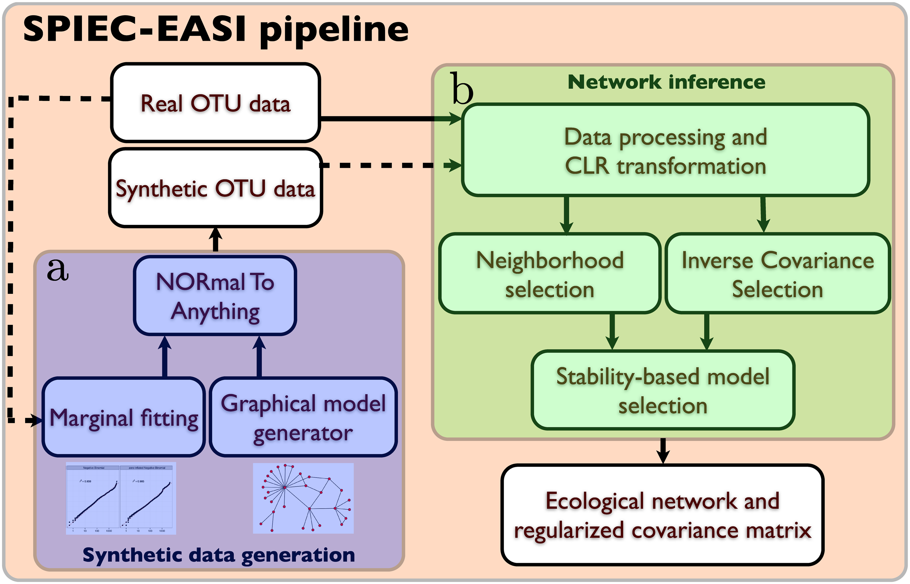
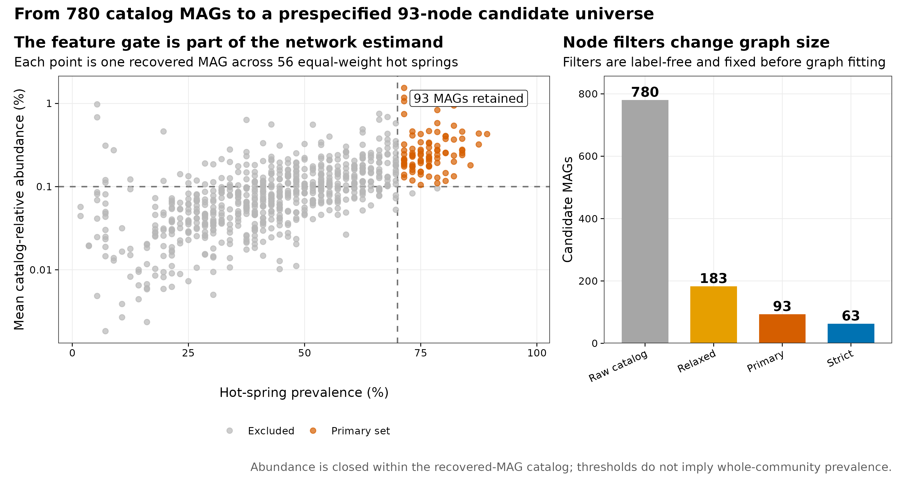
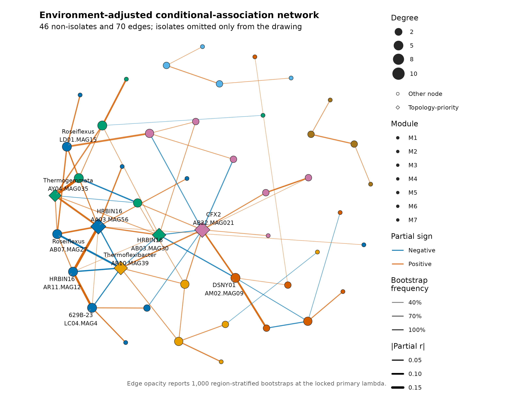
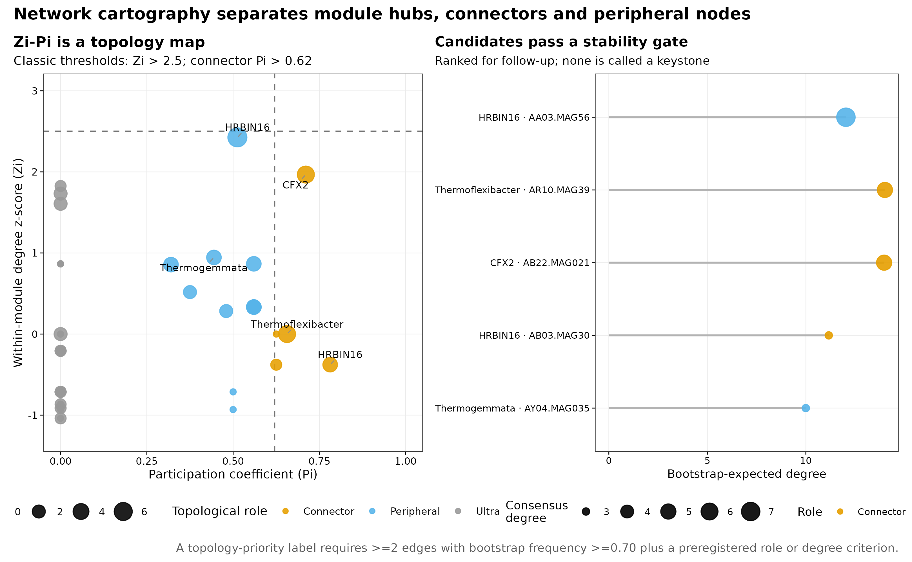
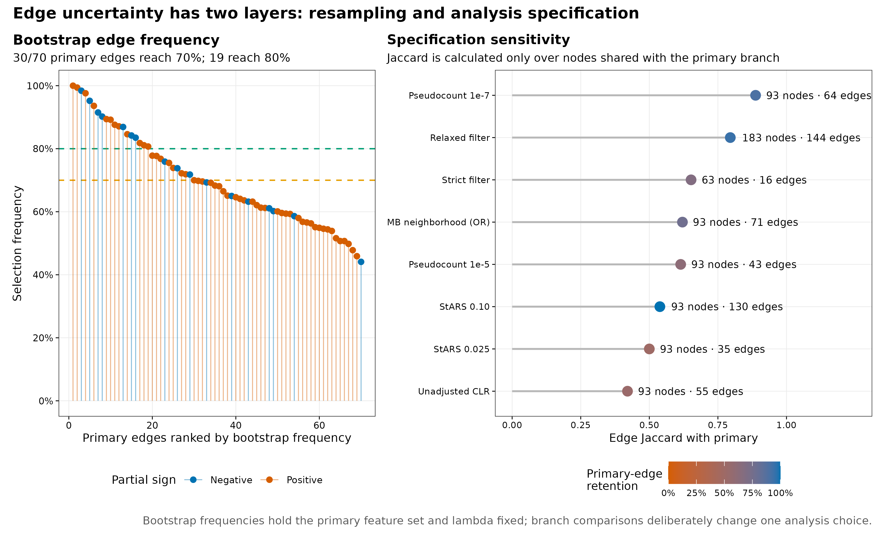
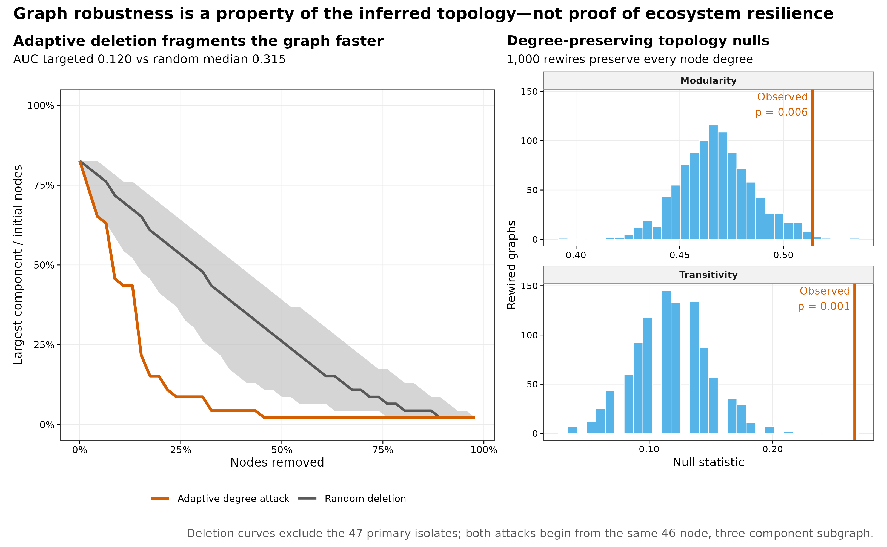

> **学习目标：**把“共现网络”升级成一套可审计的条件关联分析：先固定独立单位与节点过滤，再处理 compositionality 和 habitat filtering，用稀疏图模型选择边，分别量化 resampling uncertainty 与 specification uncertainty；最后用 Zi-Pi、度保持零模型和删点曲线描述拓扑，但不把中心节点直接命名为生态 keystone。  
> **真实数据：**Korchagina 等公开的美国西部温泉调查，共 500 个 shotgun metagenomes、56 个 hot springs 和 780 个 recovered MAGs，固定到 Figshare 30284068 v2 [@korchagina2026hotsprings; @louca2026hotsprings]。  
> **推断边界：**MAG abundance 只在 recovered-genome catalog 内闭合，样本平均 recruitment 约 13%；网络来自横断面 observational data，边没有方向，也不等于直接、因果或已验证的生态互作。

```{r}
#| label: load-article29-results
#| include: false
result_dir29 <- "results/29-network"
input_dir29 <- "data/small/29-network"
if (!dir.exists(result_dir29)) result_dir29 <- "../results/29-network"
if (!dir.exists(input_dir29)) input_dir29 <- "../data/small/29-network"

read_tsv29 <- function(directory, name) {
  utils::read.delim(
    file.path(directory, name), check.names = FALSE,
    quote = "", comment.char = "", stringsAsFactors = FALSE
  )
}

network_summary29 <- read_tsv29(result_dir29, "primary-network-summary.tsv")
primary_edges29 <- read_tsv29(result_dir29, "primary-edges.tsv")
node_roles29 <- read_tsv29(result_dir29, "node-roles.tsv")
candidates29 <- read_tsv29(result_dir29, "topology-candidates.tsv")
sensitivity29 <- read_tsv29(result_dir29, "network-sensitivity.tsv")
null_summary29 <- read_tsv29(result_dir29, "degree-preserving-null-summary.tsv")
robustness29 <- read_tsv29(result_dir29, "deletion-robustness-summary.tsv")
filter_audit29 <- read_tsv29(input_dir29, "feature-filter-audit.tsv")

stopifnot(
  network_summary29$Springs == 56L,
  network_summary29$CandidateMAGs == 93L,
  network_summary29$Edges == 70L,
  nrow(primary_edges29) == 70L,
  nrow(node_roles29) == 46L,
  nrow(candidates29) == 5L,
  nrow(sensitivity29) == 9L
)

fmt29 <- function(x, digits = 3L) {
  formatC(x, format = "f", digits = digits)
}
branch29 <- function(name, column, digits = 3L) {
  value <- sensitivity29[[column]][sensitivity29$Branch == name]
  if (is.numeric(value)) fmt29(value, digits) else value
}
```

## 这一步对应论文里的哪张图 {#sec-target}

Kurtz 等的 SPIEC-EASI Figure 2b 把网络推断拆成三步：先对 compositional table 做 centered log-ratio（CLR）处理，再选择 neighborhood selection 或 inverse-covariance selection，最后用 StARS 从 regularization path 中选一个稀疏、较稳定的图 [@kurtz2015spieceasi]。

{#fig-29-anchor}

本文复现的是 Figure 2b 的 **glasso branch**，不是作者 American Gut 网络的数值：输入换成真实温泉 MAG 谱；在 CLR 后增加 region、temperature 和 pH 的线性残差化；用 `huge 1.5.1` 显式执行 graphical lasso 与 StARS；再加入 1,000 次 bootstrap、分析分支、Zi-Pi、degree-preserving null 和 deletion robustness [@zhao2012huge]。因此 Methods 应写“CLR + graphical lasso + StARS implemented with `huge`”，不能写成调用了 `SpiecEasi::spiec.easi()`。

{#fig-29-filter}

## 理论：网络中的一条线究竟是什么 {#sec-theory}

### 1. pairwise correlation 会把间接路径也画成边

若 A 与 C 都同 B 变化，A–C 可以有很高的 Pearson/Spearman correlation，即使它们之间没有直接关系。Gaussian graphical model 用 precision matrix

$$
\Theta=\Sigma^{-1}
$$

编码 conditional dependence：在 multivariate-normal 假设下，$\Theta_{ij}=0$ 表示给定其余变量后，$i$ 与 $j$ 条件独立。非零项可转成 signed partial correlation：

$$
\rho_{ij\mid -ij}
=-\frac{\Theta_{ij}}{\sqrt{\Theta_{ii}\Theta_{jj}}}.
$$

它比简单 correlation 更接近“不能被其余已测节点线性解释的关联”，但仍不是 biological interaction。遗漏的环境变量、共同底物、空间邻近、测量误差和未纳入 catalog 的生物都能留下边 [@berry2014network]。

### 2. 相对丰度在 simplex 中，零值处理会进入模型

每个 spring 的 780 个 MAG fraction 和为 1；一个分量升高会机械压低其余分量。直接对 relative abundance 做 Pearson correlation 会产生 closure artifact [@gloor2017compositional]。主分析先在预选 93 个 MAG 上重新闭合，再加固定 fraction $10^{-6}$，随后做

$$
\operatorname{clr}(x_i)
=\log(x_i)-\frac{1}{p}\sum_{j=1}^{p}\log(x_j).
$$

伪计数不是无害常数：它决定零与低丰度之间的 log-ratio 距离。本文因此预先保留 $10^{-7}$ 和 $10^{-5}$ 两个 sensitivity branches。若有 raw counts 与 library size，Bayesian zero replacement、multinomial model 或 SPRING 这类 rank-based method 都值得并列比较 [@yoon2019spring]。

### 3. $p>n$ 时，稀疏性是结构假设，不是事实

这里只有 56 个 springs、93 个候选 MAGs；经验 covariance 不可逆。Graphical lasso 求解

$$
\widehat\Theta
=\arg\max_{\Theta\succ0}
\left\{
\log\det(\Theta)-\operatorname{tr}(S\Theta)
-\lambda\lVert\Theta\rVert_1
\right\},
$$

以 $L_1$ penalty 换取稀疏 precision matrix [@friedman2008glasso]。较大 $\lambda$ 产生更少边，较小 $\lambda$ 产生更密图。StARS 在重复 subsampling 中计算边选择的不稳定度，再选仍满足阈值的最小 regularization [@liu2010stars]。它控制的是模型选择稳定性，不是 edge-wise FDR，也不会让每条入选边自动变成“显著”。

### 4. habitat filtering 会伪装成共现

温度和 pH 同时筛选多个 MAG 时，它们会随同一环境梯度共变。Berry 与 Widder 的模拟显示，habitat filtering 增强后，共现网络对真实 interaction 的可解释性会显著下降，并可在 hub 周围制造局部伪关联 [@berry2014network]。主分析因此对每个 CLR feature 拟合：

```text
CLR abundance ~ BroadRegion + z(MedianTemperatureC) + z(MedianPH)
```

随后在 feature-wise residuals 上建网。它只去掉已测协变量的线性、加性部分；非线性温度响应、temperature × pH、微尺度水化学和地理自相关仍可能残留。未校正 CLR 网络必须作为 sensitivity，而不能与主网络混写。

### 5. 两类不确定性不能混成一个数

- **Resampling uncertainty：**固定 93 个节点和主 $\lambda$，在每个 `BroadRegion` 内 bootstrap springs，重新做 CLR、协变量残差化与 fixed-$\lambda$ glasso；统计每条边 1,000 次的 selection frequency。
- **Specification uncertainty：**改变 pseudocount、环境校正、glasso/MB、feature filter 或 StARS threshold，比较完整 edge set 的 Jaccard similarity。

前者回答“相似的 springs 重抽时这条边还在吗”；后者回答“合理的分析决策改变时整个网络还像不像”。只做其中之一会低估不确定性。

### 6. Zi-Pi 是角色坐标，不是 keystone 检验

给定模块划分，节点 $i$ 的 within-module degree z-score 为

$$
Z_i=\frac{k_{i,s}-\bar{k}_s}{\sigma_{k_s}},
$$

participation coefficient 为

$$
P_i=1-\sum_s\left(\frac{k_{i,s}}{k_i}\right)^2.
$$

$Z_i>2.5$ 常被称为 module hub，$P_i>0.62$ 的 non-hub 常被称为 connector [@guimera2005cartography]。这些阈值描述 link placement；生态 keystone 的核心定义是移除后对 community 产生不成比例的影响。没有 perturbation、纵向动力学或实验验证时，Zi-Pi、高 degree 和高 betweenness 都只能产生候选假说。

### 7. robustness 和 null model 也只在图层面成立

删点曲线把 inferred graph 中的节点按 adaptive degree 或 random order 删除，再追踪 largest connected component（LCC）。度保持 rewiring 则保留每个节点的 degree，建立 modularity 和 transitivity 的 topology reference。这两种分析都在“已推断的边是真的且静态”这一条件下工作；它们衡量 graph fragmentation，不等于真实生态系统的 resistance、resilience 或 functional redundancy。

::: {.callout-important title="先锁单位，再锁节点，再估边"}
500 个局部 metagenomes 来自 56 个 springs，每个 spring 有 1–33 个样本。若直接把 500 行当独立重复，样本最多的 spring 会主导 covariance，且同一 spring 内的空间相关被当成额外证据。主分析先对每个 spring 的 sample-relative profiles 等权求均并闭合，56 个 springs 各占一个单位。
:::

## 准备工作 {#sec-setup}

<details>
<summary><strong>展开：环境、冻结数据、完整复算命令与内联作图函数</strong></summary>

### 资源门槛

| Stage | CPU | RAM | Disk | Time |
|---|---:|---:|---:|---:|
| Input checksum + 93-feature primary StARS | 1 process | recommend 2–4 GB | <100 MB | about 40 s |
| 1,000 stratified bootstraps + topology null + deletion | 1 process | 2–4 GB | <200 MB | about 40 s |
| Eight sensitivity branches | 1 process | 2–4 GB | <500 MB | about 6 min |
| Five PDF/PNG/350-dpi TIFF redraws | 1 process | included above | about 5 MB | <1 min |
| Render from validated tables | 1 | <2 GB | about 1 MB | seconds |

普通电脑可以直接读取 Git 内约 0.3 MB 的冻结表与已验证结果。最慢的是 relaxed-filter 的 183-node StARS 分支，因为候选 node pairs 从 4,278 增至 16,653；它是必要的 specification audit，不应用降低节点数来换取更好看的稳定性。

### 固定 R 环境

```{r}
#| eval: false
if (!requireNamespace("renv", quietly = TRUE)) install.packages("renv")
renv::restore(lockfile = "env/network-renv.lock")

# 不使用 renv 时，至少固定直接依赖：
install.packages(c(
  "huge", "igraph", "ggplot2", "patchwork",
  "ggrepel", "scales", "jsonlite", "digest", "knitr"
))

stopifnot(
  packageVersion("huge") == "1.5.1",
  packageVersion("igraph") == "2.1.2",
  packageVersion("ggplot2") == "3.5.2"
)
```

`env/network-renv.lock` 固定 41 条直接与传递依赖记录，SHA-256 为 `3120e26a05160f296a376d0a8084b725af9463d44b7104af9f4d2cc5b7dcb7de`。它只服务本篇网络分析，不改写其他章节已经冻结的 R 环境。

### 数据来源、冻结与 checksum

本文直接从 `data/small/29-network/spring-mag-relative-abundance.tsv.gz` 和 `spring-metadata.tsv` 起步。前者由 Figshare 30284068 v2 的 500 × 780 MAG BIOM 表生成：先转换为 sample-relative fraction，再在每个 spring 内等权求均，最后重新闭合；生成脚本、source hash、`feature-filter-audit.tsv` 和 `analysis-contract.tsv` 均随表保存。

如需从公开 payload 重建，先下载并验证三份源文件：

```{bash}
#| eval: false
mkdir -p data/raw/article29

curl -fL -C - --retry 8 --retry-all-errors \
  -o data/raw/article29/hot-spring-mag-table.biom \
  https://ndownloader.figshare.com/files/61153444
curl -fL -C - --retry 8 --retry-all-errors \
  -o data/raw/article29/hot-spring-sample-metadata.tsv \
  https://ndownloader.figshare.com/files/61153429
curl -fL -C - --retry 8 --retry-all-errors \
  -o data/raw/article29/hot-spring-recruitment.tsv \
  https://ndownloader.figshare.com/files/61153471
```

Figshare 公布的 MD5 分别为 `0c1762f31a5c4473dec78571a7b74287`、`402095b04e2c5518cbec462f41528d4f`、`51288407e9927f23a25b210edcda7b47`。仓库重建先用 `prepare_article22_diversity_data.R` 将 BIOM 固化为 sample table，再用 `prepare_article23_ordination_data.R` 生成 56 个 spring profiles；第 29 篇只复制两个锁定产物并生成自己的 lineage card：

```{bash}
#| eval: false
Rscript scripts/prepare_article29_network_data.R \
  --source-dir data/small/23-ordination-permanova \
  --output-dir data/small/29-network \
  --notice data/small/29-data-NOTICE.txt

(cd data/small/29-network && sha256sum -c file-checksums.sha256)

Rscript scripts/validate_article29_network.R \
  --project-root . \
  --input-dir data/small/29-network \
  --output-dir results/29-network \
  --figure-dir figures \
  --chapter chapters/29-cooccurrence-network.qmd
```

### 随机状态与内联作图函数

```{r}
#| eval: false
library(huge)
library(igraph)
library(ggplot2)
library(patchwork)
library(ggrepel)

RNGkind("Mersenne-Twister", "Inversion", "Rejection")
set.seed(20260729)

pal_pub <- c(
  blue = "#0072B2", orange = "#D55E00",
  green = "#009E73", purple = "#CC79A7",
  gold = "#E69F00", sky = "#56B4E9",
  brown = "#A6761D", grey = "#777777"
)

scale_color_pub <- function(...) {
  scale_color_manual(values = pal_pub, ...)
}
scale_fill_pub <- function(...) {
  scale_fill_manual(values = pal_pub, ...)
}
theme_pub <- function(base_size = 10) {
  theme_bw(base_size = base_size, base_family = "sans") +
    theme(
      panel.grid.minor = element_blank(),
      panel.grid.major = element_line(color = "grey92", linewidth = 0.25),
      axis.text = element_text(color = "black"),
      axis.ticks = element_line(color = "black", linewidth = 0.3),
      legend.key = element_blank(),
      plot.title.position = "plot",
      plot.title = element_text(face = "bold")
    )
}
save_pub <- function(plot, file_base, width = 210, height = 140, dpi = 350) {
  ggsave(paste0(file_base, ".pdf"), plot, width = width, height = height,
         units = "mm", device = cairo_pdf, bg = "white")
  ggsave(paste0(file_base, ".png"), plot, width = width, height = height,
         units = "mm", dpi = dpi, bg = "white")
  ggsave(paste0(file_base, ".tiff"), plot, width = width, height = height,
         units = "mm", dpi = dpi, compression = "lzw", bg = "white")
  invisible(plot)
}
```

</details>

## 可复制代码：从 56 个 spring profiles 到可审计网络 {#sec-code}

### 1. 读表、对齐 56 个推断单位并展示结构

```{r}
#| label: article29-read-input
profile29 <- read.delim(
  gzfile(file.path(input_dir29, "spring-mag-relative-abundance.tsv.gz")),
  check.names = FALSE, quote = "", comment.char = ""
)
metadata29 <- read.delim(
  file.path(input_dir29, "spring-metadata.tsv"),
  check.names = FALSE, quote = "", comment.char = ""
)

spring_ids29 <- names(profile29)[-(1:2)]
mag29 <- t(as.matrix(profile29[, spring_ids29, drop = FALSE]))
storage.mode(mag29) <- "double"
rownames(mag29) <- spring_ids29
colnames(mag29) <- profile29$MAG
metadata29 <- metadata29[match(rownames(mag29), metadata29$Spring), ]
metadata29$BroadRegion <- factor(metadata29$BroadRegion)

stopifnot(
  identical(dim(mag29), c(56L, 780L)),
  identical(rownames(mag29), metadata29$Spring),
  !anyDuplicated(colnames(mag29)),
  all(is.finite(mag29)), min(mag29) >= 0,
  max(abs(rowSums(mag29) - 1)) < 1e-12,
  !anyNA(metadata29[, c(
    "BroadRegion", "MedianTemperatureC", "MedianPH"
  )])
)

head(metadata29[, c(
  "Spring", "BroadRegion", "Samples",
  "MedianTemperatureC", "MedianPH", "MeanRecruitment"
)], 6)
```

`Samples` 是每个 spring 中被平均的局部 metagenomes 数，不是主模型权重。`MeanRecruitment` 说明 recovered MAG catalog 覆盖了 reads 的哪一部分；把 catalog-relative abundance 写成“全微生物群绝对丰度”会改变结论对象。

### 2. 用 outcome-free 规则锁定节点

```{r}
prevalence29 <- colMeans(mag29 > 0)
mean_abundance29 <- colMeans(mag29)

keep_primary29 <- prevalence29 >= 0.70 &
  mean_abundance29 >= 0.001
keep_relaxed29 <- prevalence29 >= 0.60 &
  mean_abundance29 >= 0.001
keep_strict29 <- prevalence29 >= 0.70 &
  mean_abundance29 >= 0.002

stopifnot(
  sum(keep_primary29) == 93L,
  sum(keep_relaxed29) == 183L,
  sum(keep_strict29) == 63L
)

mag_primary29 <- mag29[, keep_primary29, drop = FALSE]
head(filter_audit29[filter_audit29$PrimaryFilter, c(
  "MAG", "Taxonomy", "NonzeroSprings",
  "Prevalence", "MeanRelativeAbundance"
)], 6)
```

过滤完全不看环境组或任何 outcome，因此不会因“想保留显著 taxa”而直接泄漏标签；但它仍改变 composition subspace 和候选边集合。主、relaxed、strict 三个网络回答的是相邻但不完全相同的问题。

### 3. CLR 后残差化已测 habitat structure

```{r}
#| eval: false
transform_network_data <- function(
  x, metadata, pseudocount = 1e-6, adjust = TRUE
) {
  x <- sweep(x, 1, rowSums(x), "/")
  logged <- log(x + pseudocount)
  clr <- logged - rowMeans(logged)

  if (adjust) {
    design <- model.matrix(
      ~ BroadRegion +
        scale(MedianTemperatureC) +
        scale(MedianPH),
      data = metadata
    )
    stopifnot(qr(design)$rank == ncol(design))
    clr <- qr.resid(qr(design), clr)
  }

  transformed <- scale(clr)
  stopifnot(
    all(is.finite(transformed)),
    all(apply(transformed, 2, sd) > 0)
  )
  transformed
}

z29 <- transform_network_data(
  mag_primary29, metadata29,
  pseudocount = 1e-6,
  adjust = TRUE
)
```

设计矩阵 rank 为 8，因而 residual degrees of freedom 为 56 − 8 = 48。这里做的是 feature-wise linear residualization，不是把 region、temperature 或 pH 节点放进同一 precision matrix；后者会产生 microbe–environment edges，但也需要单独定义变量尺度和缺失机制。

### 4. 用 graphical lasso + StARS 选择主图

```{r}
#| eval: false
set.seed(20260729)
path29 <- huge::huge(
  z29,
  method = "glasso",
  nlambda = 30,
  lambda.min.ratio = 0.05,
  scr = FALSE,
  verbose = FALSE
)

stars29 <- huge::huge.select(
  path29,
  criterion = "stars",
  stars.thresh = 0.05,
  stars.subsample.ratio = 0.80,
  rep.num = 100,
  verbose = FALSE
)

adjacency29 <- as.matrix(stars29$refit != 0)
adjacency29 <- adjacency29 | t(adjacency29)
diag(adjacency29) <- FALSE
dimnames(adjacency29) <- list(colnames(z29), colnames(z29))

precision29 <- as.matrix(stars29$opt.icov)
partial29 <- -precision29 /
  outer(sqrt(diag(precision29)), sqrt(diag(precision29)))
diag(partial29) <- 0

c(
  selected_lambda = stars29$opt.lambda,
  path_index = stars29$opt.index,
  edges = sum(adjacency29[upper.tri(adjacency29)]),
  nonisolates = sum(rowSums(adjacency29) > 0)
)
```

100 次 StARS subsampling 选择第 5/30 个 path point，$\lambda=$ `r fmt29(network_summary29$SelectedLambda, 4)`，对应 instability `r fmt29(network_summary29$SelectedStARSVariability, 4)`。93 个候选 MAG 中，46 个进入非孤立子图，47 个在这个 $\lambda$ 下没有边；共得到 70 条边，其中 53 条正 partial association、17 条负 partial association。

{#fig-29-network}

不应为了画面简洁从分析对象中删掉 47 个 isolates：它们是“在当前 filter、covariate、estimator 和 $\lambda$ 下没有入选边”，而不是“数据中不存在”。图形可以省略 isolates，但结果表必须报告。

### 5. 1,000 次分区 bootstrap 估边选择频率

```{r}
#| eval: false
region_indices29 <- split(
  seq_len(nrow(metadata29)),
  metadata29$BroadRegion
)
edge_count29 <- matrix(
  0L, ncol(z29), ncol(z29),
  dimnames = list(colnames(z29), colnames(z29))
)

set.seed(20260729 + 1000L)
for (b in seq_len(1000L)) {
  index <- unlist(lapply(
    region_indices29,
    function(i) sample(i, length(i), replace = TRUE)
  ), use.names = FALSE)

  z_boot <- transform_network_data(
    mag_primary29[index, , drop = FALSE],
    metadata29[index, , drop = FALSE],
    pseudocount = 1e-6,
    adjust = TRUE
  )
  fit_boot <- huge::huge(
    z_boot,
    method = "glasso",
    lambda = stars29$opt.lambda,
    scr = FALSE,
    verbose = FALSE
  )
  a_boot <- as.matrix(fit_boot$path[[1]] != 0)
  diag(a_boot) <- FALSE
  edge_count29 <- edge_count29 + (a_boot | t(a_boot))
}

edge_frequency29 <- edge_count29 / 1000
```

bootstrap 固定 primary nodes 和 primary $\lambda$，只重抽 springs 并重拟合环境残差。70 条主边中，30 条 selection frequency ≥70%，19 条 ≥80%；最低的主边约为 44%。因此图中所有 70 条边都可用于描述 selected graph，但强结论应优先落在高稳定边，并同时报告完整 frequency。

### 6. Zi-Pi 角色与 topology-priority gate

```{r}
#| eval: false
g29 <- igraph::graph_from_adjacency_matrix(
  adjacency29, mode = "undirected", diag = FALSE
)
g29 <- induced_subgraph(g29, V(g29)[degree(g29) > 0])

set.seed(20260729 + 2000L)
community29 <- cluster_louvain(
  g29, weights = rep(1, ecount(g29))
)
module29 <- membership(community29)

within_degree29 <- vapply(V(g29)$name, function(node) {
  neighbor_names <- neighbors(g29, node)$name
  sum(module29[neighbor_names] == module29[[node]])
}, numeric(1))

zi29 <- ave(
  within_degree29,
  module29,
  FUN = function(x) {
    if (length(x) >= 3 && sd(x) > 0) (x - mean(x)) / sd(x) else rep(0, length(x))
  }
)
pi29 <- vapply(V(g29)$name, function(node) {
  neighbor_modules <- table(module29[neighbors(g29, node)$name])
  1 - sum(neighbor_modules^2) / degree(g29, node)^2
}, numeric(1))
```

主图分为 7 个 modules；46 个非孤立节点中有 30 个 ultra-peripheral、11 个 peripheral、5 个 connector，**没有节点越过 $Z_i>2.5$ 的 formal hub threshold**。五个 follow-up candidates 均先满足至少两条 bootstrap-frequency ≥70% 的 incident edges，再满足 connector、top-decile degree 或 Zi hub 条件。

```{r}
#| label: article29-candidate-table
candidate_display29 <- candidates29[, c(
  "MAG", "Phylum", "Genus", "Module", "Degree",
  "StableDegree70", "BootstrapExpectedDegree", "Zi", "Pi", "Role"
)]
candidate_display29$BootstrapExpectedDegree <- round(
  candidate_display29$BootstrapExpectedDegree, 2
)
candidate_display29$Zi <- round(candidate_display29$Zi, 2)
candidate_display29$Pi <- round(candidate_display29$Pi, 2)
knitr::kable(
  candidate_display29,
  caption = "Stability-gated topology-priority candidates; none is labeled an ecological keystone."
)
```

AA03.MAG56（HRBIN16）degree 最高且有 7 条 consensus incident edges，但 $Z_i=2.43$，仍低于 hub threshold；AR10.MAG39、AB22.MAG021 与 AB03.MAG30 的 $P_i>0.62$，属于 connector。这里最重要的结果不是“找到了五个 keystones”，而是 **没有任何 MAG 能凭当前网络获得 keystone 结论**。

{#fig-29-zippi}

### 7. specification sensitivity：不要只挑最像主图的分支

```{r}
#| label: article29-sensitivity-table
sensitivity_display29 <- sensitivity29[, c(
  "Branch", "Features", "Edges", "Nonisolates",
  "EdgeJaccardWithPrimary", "PrimaryEdgeRetention"
)]
sensitivity_display29$EdgeJaccardWithPrimary <- round(
  sensitivity_display29$EdgeJaccardWithPrimary, 3
)
sensitivity_display29$PrimaryEdgeRetention <- round(
  sensitivity_display29$PrimaryEdgeRetention, 3
)
knitr::kable(
  sensitivity_display29,
  caption = "Prespecified network branches; Jaccard uses only nodes shared with the primary graph."
)
```

改变伪计数到 $10^{-7}$ 时，edge Jaccard 仍为 `r branch29("Pseudocount 1e-7", "EdgeJaccardWithPrimary")`；增至 $10^{-5}$ 后降到 `r branch29("Pseudocount 1e-5", "EdgeJaccardWithPrimary")`。取消环境校正仅保留主边的 `r fmt29(100 * sensitivity29$PrimaryEdgeRetention[sensitivity29$Branch == "Unadjusted CLR"], 1)`%，Jaccard 为 `r branch29("Unadjusted CLR", "EdgeJaccardWithPrimary")`，说明 habitat structure 对网络定义有实质影响。MB-OR 与 glasso Jaccard 为 `r branch29("MB neighborhood (OR)", "EdgeJaccardWithPrimary")`；StARS threshold 从 0.025 放宽到 0.10 时，边数由 35 增至 130。

{#fig-29-stability}

### 8. topology null 与 deletion robustness

```{r}
#| eval: false
set.seed(20260729 + 10000L)
null_stats29 <- replicate(1000L, {
  g_null <- rewire(
    g29,
    with = keeping_degseq(
      niter = 20 * ecount(g29), loops = FALSE
    )
  )
  set.seed(sample.int(.Machine$integer.max, 1))
  c(
    modularity = modularity(
      cluster_louvain(g_null, weights = rep(1, ecount(g_null)))
    ),
    transitivity = transitivity(g_null, type = "global")
  )
})

# Adaptive attack 每一步重新计算 degree；random attack 重复 1,000 个顺序。
# LCC 始终除以最初的 46 个 non-isolate nodes，而不是当前剩余节点数。
```

Observed modularity 为 `r fmt29(network_summary29$Modularity)`，度保持 null 的 upper-tail empirical $p=$ `r fmt29(null_summary29$EmpiricalUpperP[null_summary29$Metric == "Modularity"])`；observed transitivity 为 `r fmt29(network_summary29$Transitivity)`，相应 $p=$ `r fmt29(null_summary29$EmpiricalUpperP[null_summary29$Metric == "Transitivity"])`。这说明当前图比相同 degree sequence 的随机 rewires 更模块化、三角闭合更多；它不证明 modules 对应代谢 guild。

46-node 非孤立子图一开始已分成 3 个 components，LCC 为 38。Adaptive-degree deletion 的 normalized LCC AUC 为 `r fmt29(robustness29$TargetedAUC)`，1,000 个 random orders 的 median 为 `r fmt29(robustness29$RandomMedianAUC)`（95% reference interval `r fmt29(robustness29$RandomLower95AUC)`–`r fmt29(robustness29$RandomUpper95AUC)`）。中心节点删除确实更快打碎 **这张图**，但未测量微生物丰度恢复、功能补偿或生态稳态。

{#fig-29-robustness}

## 审计与升级 {#sec-audit}

### 先忠实保留 SPIEC-EASI 的方法问题，再说明实现差异

| Component | Kurtz et al. 2015 | 当前复算 | 解释边界 |
|---|---|---|---|
| Data | American Gut 16S OTUs | Western US hot-spring shotgun MAGs | feature 与生态系统不同 |
| Composition handling | CLR with zero replacement | 93-MAG subcomposition + $10^{-6}$ + CLR | pseudocount 进入 sensitivity |
| Graph estimator | MB or glasso in SPIEC-EASI | glasso in `huge 1.5.1`; MB-OR sensitivity | 不宣称调用 SpiecEasi package |
| Sparsity selection | StARS | 30-point path, threshold 0.05, 100 subsamples | 不是 edge-wise FDR |
| Habitat structure | 未作为本文数据的具体合同 | region + temperature + pH residuals | 仅线性 measured adjustment |
| Uncertainty | synthetic benchmark + stability | 1,000 bootstraps + 8 branches + topology null | 无 independent ecosystem replication |

主实现保留“CLR + sparse conditional graph + StARS”这一核心问题，但把每个统计决定显式展开。这样可以核对：到底使用什么 pseudocount、哪些节点、哪个 residual design、哪条 lambda path、哪种 StARS threshold，以及边权来自 precision matrix 的哪个公式。

### 升级 1：把 edge stability 和 edge significance 分开

30/70 条边达到 bootstrap frequency 70%，19/70 达到 80%。这些阈值是预定义的审计标签，不是 $q<0.05$。若论文需要正式 edge-wise error control，应选能定义 null distribution/FDR 的方法，或在完全独立数据集上锁定节点和参数后验证；不能把 selection frequency 偷换成 P value。

### 升级 2：环境校正是主分析，但 raw network 仍需展示

Unadjusted CLR 与主图 edge Jaccard 只有 `r branch29("Unadjusted CLR", "EdgeJaccardWithPrimary")`。这不是“校正后更正确”的自动证明，而是结果对 habitat structure 敏感的证据。更完整的升级包括 spline temperature、temperature × pH、conductivity complete-case、geographic eigenvectors 或 spatial model；所有新增项都应先于看图锁定，并报告 lost degrees of freedom。

### 升级 3：没有 Zi hub 是可报告结果

最高 Zi 为 2.43，低于 2.5；因此不应移动阈值直到出现“hub”。本文的五个 topology-priority candidates 来自预定义的 stability + connector/top-degree gate，它们适合决定下一步做谁的培养、co-culture、metatranscriptomics、spatial co-localization 或 targeted perturbation，不适合直接写“keystone species”。

### 升级 4：正负号不能直接翻译成合作与竞争

正 partial association 可能来自共同资源或相似 niche，负值可能来自相反 habitat preference、replacement artifact 或 compositional competition。要支持 cooperation/competition，至少应补充 absolute abundance、time-lag、metabolic complementarity、培养或扰动证据；有 direction 的 ecological model 也必须明确时间尺度和 process assumptions。

### 升级 5：模块与鲁棒性要有 reference distribution

只报告 modularity 0.514 不知道它是否超出 degree sequence 自带的结构。度保持 null 显示 observed modularity 和 transitivity 都落在上尾，但 null 仍没有保存 taxonomy、geography、edge signs 或 measurement uncertainty。删除曲线也条件于 selected graph；不能将 targeted AUC 0.120 写成“温泉微生物群抗扰动能力低”。

## 出版级美化 {#sec-polish}

网络图最容易因装饰遮住统计事实。本文固定以下视觉语义：positive partial association 用橙色，negative 用蓝色；edge opacity 映射 bootstrap frequency，width 映射 $|\rho_{partial}|$；node fill 只表示 module，菱形只表示 topology-priority。Layout seed 固定为 20260729 + 50,000，不能靠反复刷新挑最像“生物模块”的摆法。

主图标题、坐标、图例、节点标签和注释全部为英文。MAG label 仅给十个预先排序节点，避免 46 个标签互相覆盖；完整 node table 另存。PDF 用作矢量主文件，PNG 用于网页和公众号，350-dpi LZW TIFF 用于投稿。网络原始 edge list、layout coordinates、node roles 和每条边 frequency 都进入结果目录，审稿人无需从图片反推数值。

```{r}
#| eval: false
edge_table <- read.delim("results/29-network/network-edges-layout.tsv")
node_table <- read.delim("results/29-network/network-layout.tsv")

ggplot() +
  geom_segment(
    data = edge_table,
    aes(
      x = X, y = Y, xend = Xend, yend = Yend,
      color = Sign,
      alpha = SelectionFrequency,
      linewidth = AbsolutePartialCorrelation
    )
  ) +
  geom_point(
    data = node_table,
    aes(X, Y, fill = Module, size = Degree, shape = TopologyPriority)
  ) +
  scale_color_manual(values = c(
    Positive = "#D55E00", Negative = "#0072B2"
  )) +
  coord_equal() +
  labs(
    color = "Partial sign",
    alpha = "Bootstrap frequency",
    linewidth = "|Partial r|",
    size = "Degree"
  ) +
  theme_void(base_family = "sans")
```

## 常见坑 {#sec-pitfalls}

::: {.callout-caution title="把 Spearman |r| > 0.6 当成 interaction network"}
Pairwise threshold 同时忽略 closure、间接路径、$p>n$ 和 habitat filtering。若只是 exploratory correlation heatmap，应如实命名 relevance network；若要讨论 conditional association，使用能处理 composition 和高维稀疏性的模型，并给稳定性审计。
:::

::: {.callout-caution title="对 500 个局部样本直接建网"}
同一 spring 的重复不是 500 个独立 ecosystems。若研究问题是跨 springs 的网络，应先在 spring 层聚合或用 multilevel model；若问题是 spring 内空间网络，则需要显式 spatial coordinates 和 within-spring design，不能混成同一个 covariance matrix。
:::

::: {.callout-caution title="先看网络，再调 prevalence 和 lambda"}
节点过滤和 regularization 都会改变 edge universe。为了让某个熟悉物种成为 hub 而改阈值属于结果导向选择。主规则、StARS threshold、pseudocount 和 sensitivity grid 应在拟合前写进 contract。
:::

::: {.callout-caution title="只画非孤立节点，却不报告 isolates"}
本例 93 个候选节点中有 47 个 isolates。只展示 46-node 图会让读者误以为所有候选 MAG 都参与网络。正文、caption 和 summary table 都应同时给 candidate、non-isolate 和 isolate 数。
:::

::: {.callout-caution title="把 bootstrap 70% 写成显著性阈值"}
Selection frequency 依赖固定节点、固定 $\lambda$、resampling scheme 和 estimator；它不是 P value，也没有自动控制 FDR。应写“selected in 70% of stratified bootstrap fits”，不要写“显著边”。
:::

::: {.callout-caution title="把正边叫互利、负边叫竞争"}
边的 sign 是 CLR residual partial association。共同 habitat、底物、捕食者、遗漏节点和零值处理都能产生相同 sign。生态机制必须靠独立 evidence layer 支持。
:::

::: {.callout-caution title="把 degree、betweenness 或 Zi-Pi 当 keystone 证明"}
拓扑中心性只描述 selected graph。Keystone 要求 removal 后出现不成比例的 community effect；至少需要 perturbation、time series、absolute abundance 或机制实验。本文只使用 topology-priority candidate 这一表述。
:::

::: {.callout-warning title="删点曲线不是生态恢复曲线"}
Graph deletion 不模拟 abundance dynamics、功能冗余、物种迁入或 environmental feedback。它可比较 topology 对攻击顺序的敏感度，但不能给 resistance、resilience、collapse threshold 或 intervention efficacy。
:::

## 这段 Methods 怎么写 {#sec-methods}

> MAG relative-abundance profiles were obtained from 500 shotgun metagenomes collected across 56 western US hot springs (Figshare record 30284068 v2; Korchagina et al., 2026). Sample-relative profiles were averaged with equal weight within each hot spring and reclosed, making the hot spring the inferential unit. Abundances were interpreted within the 780-recovered-MAG catalog rather than as whole-community fractions. MAGs were retained when their non-zero prevalence was at least 70% across springs and their mean catalog-relative abundance was at least 0.1%, yielding 93 candidate nodes. The retained subcomposition was reclosed; a fixed fraction of $10^{-6}$ was added before natural-log centered log-ratio transformation. To reduce measured habitat filtering, each CLR feature was residualized against broad region, standardized median temperature and standardized median pH, and residuals were centered and scaled. A sparse inverse-covariance network was estimated by graphical lasso using huge v1.5.1. Thirty regularization values with a minimum lambda ratio of 0.05 were evaluated; the graph was selected by StARS with an instability threshold of 0.05, a subsample ratio of 0.80 and 100 subsamples. Edge weights were signed partial correlations derived from the selected precision matrix. Edge-selection frequencies were estimated using 1,000 broad-region-stratified bootstrap resamples, refitting the transformation, covariate adjustment and graphical lasso at the locked primary lambda. Sensitivity analyses varied the pseudocount, environmental adjustment, graphical-model estimator, feature gate and StARS threshold. Louvain modules and classic unweighted Zi-Pi roles were computed on the non-isolate graph with igraph v2.1.2. Modularity and transitivity were compared with 1,000 degree-preserving rewired graphs. Topological robustness was summarized by the largest-connected-component curve under adaptive highest-degree deletion and 1,000 random deletion orders. All stochastic operations used seed 20260729. Analyses were conducted in R v4.4.1.

Methods 还需列出 source file IDs/checksums、spring 聚合规则、fraction 单位、过滤前后节点数、zero replacement、协变量 design、完整 $\lambda$ path、StARS 版本与 subsample ratio、bootstrap 分层、edge sign 公式、module algorithm、Zi-Pi 阈值、null rewiring 次数和所有 sensitivity branches。结果中应同时报告 isolates、edge stability 与失败分支，不能只给最终 PNG。

## 换成你自己的数据怎么做 {#sec-own-data}

至少准备三张表：

1. `features × samples` 的 abundance/count table；feature ID 唯一，并明确是 reads、relative fraction、coverage 还是 copies per mass；
2. 每个独立单位一行的 metadata，至少含 sample/subject/site/batch，以及要调整的环境或临床变量；
3. feature taxonomy/annotation table，用于结果解释，不参与看图后筛边。

然后按研究设计锁定：

- **推断单位。**同一受试者、site、household 或 reactor 的重复测量不可默认独立；纵向数据应使用 time-series/dynamic network，而不是把时间点堆进横断面 covariance。
- **feature gate。**用不看 outcome 的 prevalence/abundance rule，并至少准备一松一严两个分支；节点集合不同的网络只在 shared nodes 上比较 edge Jaccard。
- **composition 与 zero policy。**relative table 至少用 log-ratio 思路；raw counts 可比较 SPIEC-EASI、SPRING、proportionality 或合适的 count model。伪计数必须写进 Methods。
- **confounding contract。**预先列出 batch、site、age/diet、temperature/pH 等变量；若同一 covariate 同时决定采样和微生物，考虑 nonlinear/spatial/multilevel model。
- **sparsity selection。**固定 estimator、lambda grid、StARS threshold/subsample ratio/replicates；样本少时减少节点，不要用更密图掩盖 $n$ 不足。
- **两层稳定性。**做 clustered/stratified bootstrap，并改变合理的分析 specification；独立 cohort/site 的 locked replication 比同一数据重抽更强。
- **候选升级。**将 stable edge、module role、MAG metabolism、spatial co-localization、metatranscriptomics、absolute abundance 和 perturbation evidence 合并成证据梯度；只有 removal effect 支持时才使用 keystone。

如果研究目标是 intervention 或 direction，应转向 longitudinal absolute abundance、generalized Lotka–Volterra、dynamic Bayesian network 或 perturbation experiment。横断面条件关联网络适合生成可检验假说，不负责替代机制实验。

## 参考 {#sec-references}

- Kurtz ZD, Müller CL, Miraldi ER, et al. Sparse and compositionally robust inference of microbial ecological networks. *PLOS Computational Biology*. 2015;11:e1004226. [@kurtz2015spieceasi]
- Liu H, Roeder K, Wasserman L. Stability Approach to Regularization Selection (StARS) for high-dimensional graphical models. *NeurIPS*. 2010;23:1432–1440. [@liu2010stars]
- Friedman J, Hastie T, Tibshirani R. Sparse inverse covariance estimation with the graphical lasso. *Biostatistics*. 2008;9:432–441. [@friedman2008glasso]
- Berry D, Widder S. Deciphering microbial interactions and detecting keystone species with co-occurrence networks. *Frontiers in Microbiology*. 2014;5:219. [@berry2014network]
- Guimerà R, Nunes Amaral LA. Functional cartography of complex metabolic networks. *Nature*. 2005;433:895–900. [@guimera2005cartography]
- Yoon G, Gaynanova I, Müller CL. Microbial Networks in SPRING. *Frontiers in Genetics*. 2019;10:516. [@yoon2019spring]
- Korchagina A, et al. Genome-resolved metagenomic survey of microbial diversity in hot springs across the western United States. *Scientific Data*. 2026. [@korchagina2026hotsprings]
