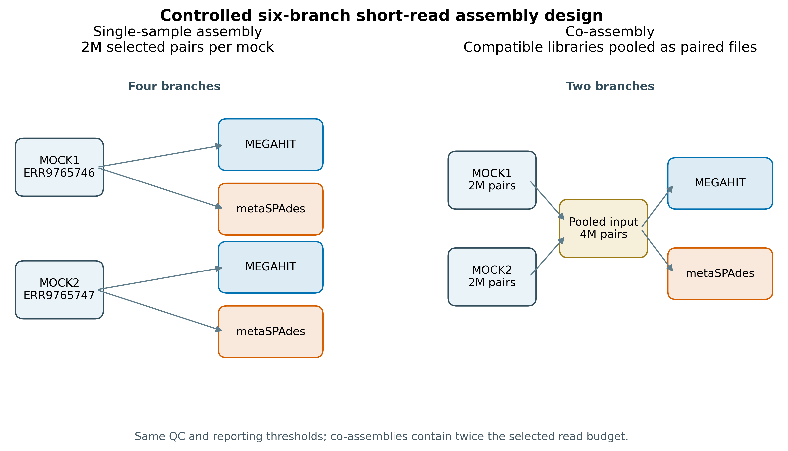
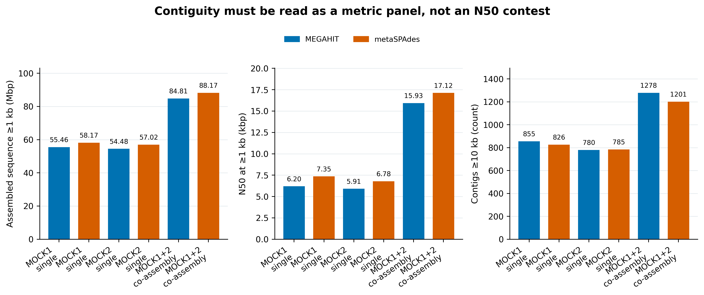
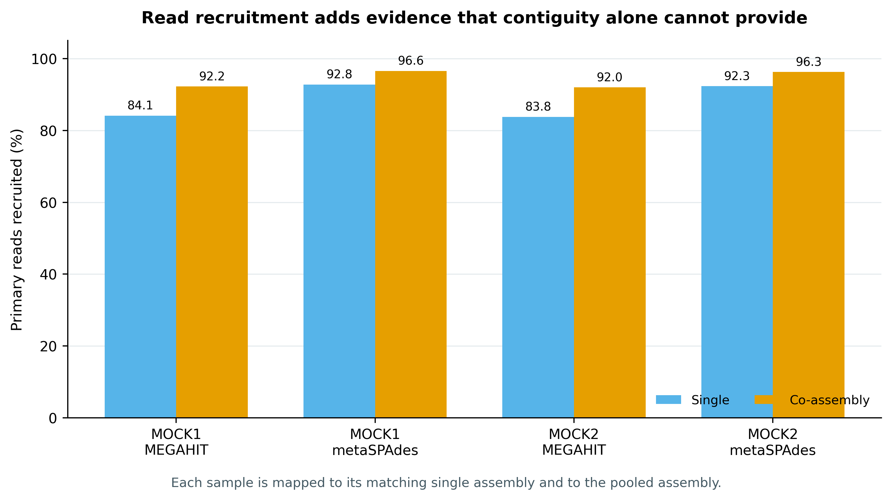

> **学习目标：**理解短读长 metagenome assembly 的 de Bruijn graph 逻辑；在相同 QC、contig threshold 和资源账本下运行 MEGAHIT 与 metaSPAdes；区分 single-sample assembly 与 co-assembly 的收益、混杂和适用边界；用 assembled bases、Nx/Lx、长 contig 数、read recruitment、wall time 和 peak RAM 联合选方案。  
> **真实数据：**Meslier 等构建的不均一微生物 DNA mock：MOCK1 含 71 strains（SAMEA14435832；ERR9765746），MOCK2 含 87 strains（SAMEA14435833；ERR9765747），项目 PRJEB52977 [@meslier2022platforms]。  
> **结论边界：**每个 mock 从 200 万 selected pairs 开始；fastp 后 single branches 分别输入 1,999,853 与 1,999,888 clean pairs，co-assembly 合并为 3,999,741 pairs。co branch 的 read budget 约为 single 的两倍，而且两种 mock 的组成不同。因此这是受控的 workflow comparison，**不是算法单因素 benchmark，也不代表普适赢家**。Reference-aware correctness、misassembly 与 genome fraction 在第 33 篇用 MetaQUAST 独立审计。

## 这一步对应论文里的哪张图 {#sec-target}

Meslier 等的 **Table 3: Mock1 metaQUAST assembly report** 把组装评价从“有没有 contig”推进到 genome fraction、完整基因组数、misassembly 和每 100 kb 错误等参考感知指标；文章同时给出了可用于 assembler benchmark 的复杂真实 mock，而不是 in silico reads [@meslier2022platforms]。本节先复现 Table 3 前一层的决策：在进入 reference-aware QA 之前，固定输入、运行六个短读长组装分支，并把 reference-free contiguity、reads 回帖率和算力代价放在一起。

Delgado 与 Andersson 对 124 个 Baltic Sea metagenomes 的研究解释了为什么 single 与 co-assembly 不存在脱离任务的冠军：合并样本可把低丰度基因推过覆盖度门槛，却也会混入更多近缘菌株变异，使 de Bruijn graph 出现更多替代路径；他们最终发现 individual 与 co-assembly 的组合方案更适合其 gene-catalogue 目标 [@delgado2022assembly]。这正是本节四张图的阅读框架。

{#fig-30-design}

::: {.callout-important title="先把比较问题写对"}
这套设计同时改变了 **assembler、assembly strategy、read budget 和 community composition**。可回答的是“在这两个真实 mock 和这套固定预算下，六条工作流各产出什么、花费多少”；不能回答“某工具在所有生态位都更准”或“co-assembly 必然优于 single assembly”。
:::

## 理论：短 reads 如何变成 contigs {#sec-theory}

### 1. de Bruijn graph 把 reads 改写成 k-mer 邻接问题

设 read 被切成长度为 $k$ 的 k-mers。相邻 k-mer 共享 $k-1$ 个碱基；组装器把这种前后缀关系编码成图，再寻找可压缩的非分叉路径。直观上：

- 小 $k$ 更容易让低覆盖序列进入图，但重复序列和近缘菌株更容易混在一起；
- 大 $k$ 更能拆开重复，却要求足够覆盖，低丰度基因组容易断裂；
- 测序错误形成低频 tips、bubbles 和短支路；
- 宏基因组的物种丰度跨多个数量级，同一套深度阈值不可能同时适合所有基因组。

MEGAHIT 用 succinct de Bruijn graph 和迭代 k-mer 方案压低大型 metagenome 的内存负担 [@li2015megahit]。metaSPAdes 在 SPAdes graph 上加入面向 metagenome 的 graph simplification 与 repeat resolution，重点处理不均一覆盖和近缘菌株 [@nurk2017metaspades]。它们优化目标和 pruning 规则不同，输出差异不能压缩成“谁的 N50 大谁更好”。

### 2. single assembly 与 co-assembly 交换的是覆盖度和图复杂度

**Single-sample assembly（单样本组装）**只使用本样本 reads。优势是菌株混合较少、计算任务容易并行、样本特异序列不会被其他样本稀释；代价是低丰度基因组可能覆盖不足，跨样本还会得到大量冗余 contigs。

**Co-assembly（混合组装）**把生物学相近、建库兼容的一组样本共同建图。低丰度但跨样本反复出现的序列可能积累到可组装覆盖度，而且一个共同 contig catalog 便于后续 differential coverage binning。代价是 RAM、磁盘和时间上升；若样本包含多个近缘 strains，图中分叉会增多，可能造成 fragmentation、consensus collapse 或错误路径 [@delgado2022assembly]。

::: {.callout-warning title="co-assembly 不是把所有项目 FASTQ 倒进一个目录"}
只合并生态背景、实验设计和建库性质相容的样本。跨宿主部位、跨环境、跨极端 read length/insert-size、跨严重 batch 的“大锅组装”，通常把更多异质性带进图，却不给目标基因组提供有用覆盖。
:::

### 3. N50 描述长度分布，不描述正确性

把 contig 长度从大到小排序为 $l_1\ge l_2\ge\cdots\ge l_n$，当累计长度第一次达到总长度 50% 时，对应 contig 长度是 N50，所需 contig 数是 L50：

$$
N50=l_j\quad\text{where}\quad
\sum_{i=1}^{j-1}l_i < 0.5\sum_{i=1}^{n}l_i
\le \sum_{i=1}^{j}l_i.
$$

两个错误拼接的超长 contigs 会把 N50 拉高；大量真实、低丰度的短 contigs 会把 N50 拉低。本文统一在 `≥1 kb` contigs 上报告 total assembled bp、largest、N50/L50、N90/L90 和 GC%，另报 `≥10 kb` contig 数。正确性必须再看 reference alignment、misassembly、genome fraction、gene completeness 或 MAG recovery [@mikheenko2016metaquast]。

### 4. read-back mapping 是一致性证据，仍不是正确性证明

每个 clean sample 分别回帖到其 matching single assembly 和 pooled assembly。本文用 Bowtie2 2.5.5 `--very-sensitive --seed 20260730`，统计 primary reads mapped、both-mapped pairs、proper pairs、discordant pairs 和 singletons [@langmead2012bowtie2]。

高 recruitment 表示更多输入 reads 能被 assembly 表示；但重复序列、保守基因和错误 consensus 也能吸附 reads。反过来，低 recruitment 可能源于真实低复杂度过滤、未组装的稀有序列或严格 alignment scoring。它应与 contiguity、reference-aware accuracy 和下游 MAG/gene recovery 联读。

## 准备工作 {#sec-setup}

### 算力门槛

| 项目 | 本节固定运行 | 处理你自己的常规 shotgun 数据 |
|---|---:|---:|
| CPU | 16 核 | 16–32 核；增加到更多核通常不是线性提速 |
| RAM | 64 GiB 声明上限 | 单样本建议 64–128 GiB；大型 co-assembly 常需 256 GiB–1 TiB |
| 磁盘 | 至少 150 GB 可用 | 预留压缩 FASTQ 总量的 5–10 倍，并把临时目录放在高速盘 |
| 耗时 | 约 1–3 小时，依节点与 I/O 而变 | 深度、复杂度和样本数增加后可从数小时到数天 |

没有 64 GB 服务器时，优先选择学校 HPC 的大内存节点，或租用按小时计费的云实例；先把每个样本下采样到 10–50 万 pairs 做子集演示，确认命令、目录和输出合同，再申请正式资源。不要在内存不足时直接对全队列 co-assembly：被 OOM 杀死的半成品不能用于分析。

<details>
<summary>点开：安装环境、下载命令与内联出版主题</summary>

```bash
# 精确重建已锁定的 Linux-64 环境
mamba create -n metagenome-assembly-2026.07 \
  --file env/assembly-linux-64.lock
mamba create -n metagenome-read-qc-2026.07 \
  --file env/read-qc-linux-64.lock

# 版本必须一致
conda run -n metagenome-assembly-2026.07 megahit --version
conda run -n metagenome-assembly-2026.07 metaspades.py --version
conda run -n metagenome-assembly-2026.07 bowtie2 --version
conda run -n metagenome-read-qc-2026.07 fastp --version
```

```bash
# 原始归档进入 data/raw/，不进 Git；脚本先查 ENA bytes + MD5，支持续传
bash scripts/download_article30_assembly_reads.sh . data/raw/article30
```

```{r}
# 只想在 R 里重画结果图时安装
install.packages(c("ggplot2", "dplyr", "readr", "scales", "patchwork"))

library(ggplot2)
pal_pub <- c(
  MEGAHIT = "#0072B2", metaSPAdes = "#D55E00",
  Single = "#56B4E9", `Co-assembly` = "#E69F00"
)
scale_color_pub <- function(...) scale_color_manual(values = pal_pub, ...)
scale_fill_pub  <- function(...) scale_fill_manual(values = pal_pub, ...)

theme_pub <- function(base_size = 12) {
  theme_bw(base_size = base_size) +
    theme(
      panel.grid.minor = element_blank(),
      panel.grid.major.x = element_blank(),
      axis.text = element_text(color = "black"),
      strip.background = element_rect(fill = "#EEF3F5", color = NA),
      legend.key = element_blank(),
      plot.title.position = "plot"
    )
}

save_pub <- function(plot, file_base, width = 180, height = 110,
                     units = "mm", dpi = 350) {
  ggsave(paste0(file_base, ".pdf"), plot, width = width, height = height,
         units = units, device = cairo_pdf)
  ggsave(paste0(file_base, ".png"), plot, width = width, height = height,
         units = units, dpi = dpi, bg = "white")
  ggsave(paste0(file_base, ".tiff"), plot, width = width, height = height,
         units = units, dpi = dpi, compression = "lzw", bg = "white")
  invisible(plot)
}
```

</details>

### 数据身份与固定抽样

四个 ENA archives 合计约 8.4 GB。下载脚本逐个核对官方 byte count 与 MD5，然后完整流过两个 runs，各自用 `20260730:MOCK1` / `20260730:MOCK2` 作为 RNG namespace，做 one-pass exact sequential sampling without replacement，精确保留 2,000,000 个同步 pairs。被选 records 保持原 run 顺序；R1/R2 ID hash、压缩与解压 SHA-256、Python/zlib 版本写入 selection summary。

::: {.callout-note title="论文 accession 与官方 archive 有一处错位"}
Meslier 论文 Table 4 印刷为 `ERR9765446/ERR9765447`；2026-07-25 核对 ENA project metadata 后，MOCK1/MOCK2 的官方 Illumina runs 是 `ERR9765746/ERR9765747`。本节以 ENA URL、byte count、MD5、read count 和 base count 为准，并在 `30-data-NOTICE.txt` 保留这条差异。
:::

```bash
column -ts $'\t' data/small/30-source-manifest.tsv
```

预期表头：

```text
Mock  RunAccession  SampleAccession  Mate  HTTPSURL  ENAReportedMD5  ENABytes  ENAReadCount  ENABaseCount
```

## 可复制代码：六个 assembly branches 与八次回帖 {#sec-code}

### 第 1 步：固定 200 万同步 pairs

下载器会自动调用以下抽样命令。`--total-pairs` 是 ENA `read_count / 2`，不是压缩文件行数，也不是凭文件大小估计。

```bash
python3 scripts/select_article30_read_pairs.py \
  --r1 data/raw/article30/full/ERR9765746_R1.fastq.gz \
  --r2 data/raw/article30/full/ERR9765746_R2.fastq.gz \
  --output-r1 data/raw/article30/selected/ERR9765746_selected2m_R1.fastq.gz \
  --output-r2 data/raw/article30/selected/ERR9765746_selected2m_R2.fastq.gz \
  --summary data/raw/article30/selected/ERR9765746_selection-summary.json \
  --sample MOCK1 --run-accession ERR9765746 \
  --total-pairs 20597525 --target-pairs 2000000 --seed 20260730

python3 scripts/select_article30_read_pairs.py \
  --r1 data/raw/article30/full/ERR9765747_R1.fastq.gz \
  --r2 data/raw/article30/full/ERR9765747_R2.fastq.gz \
  --output-r1 data/raw/article30/selected/ERR9765747_selected2m_R1.fastq.gz \
  --output-r2 data/raw/article30/selected/ERR9765747_selected2m_R2.fastq.gz \
  --summary data/raw/article30/selected/ERR9765747_selection-summary.json \
  --sample MOCK2 --run-accession ERR9765747 \
  --total-pairs 23173964 --target-pairs 2000000 --seed 20260730
```

### 第 2 步：paired fastp，保持两个 mock 的过滤合同一致

```bash
READ_QC_ENV_PREFIX="${HOME}/miniconda3/envs/metagenome-read-qc-2026.07"
RAW=data/raw/article30
mkdir -p "${RAW}/clean" "${RAW}/work/fastp"

"${READ_QC_ENV_PREFIX}/bin/fastp" \
  --in1 "${RAW}/selected/ERR9765746_selected2m_R1.fastq.gz" \
  --in2 "${RAW}/selected/ERR9765746_selected2m_R2.fastq.gz" \
  --out1 "${RAW}/clean/ERR9765746_clean_R1.fastq.gz" \
  --out2 "${RAW}/clean/ERR9765746_clean_R2.fastq.gz" \
  --json "${RAW}/work/fastp/MOCK1.json" \
  --html "${RAW}/work/fastp/MOCK1.html" \
  --thread 16 --compression 6 --detect_adapter_for_pe \
  --qualified_quality_phred 20 --unqualified_percent_limit 40 \
  --n_base_limit 5 --length_required 50 --disable_trim_poly_g \
  --overrepresentation_analysis --overrepresentation_sampling 20 \
  --dont_overwrite

"${READ_QC_ENV_PREFIX}/bin/fastp" \
  --in1 "${RAW}/selected/ERR9765747_selected2m_R1.fastq.gz" \
  --in2 "${RAW}/selected/ERR9765747_selected2m_R2.fastq.gz" \
  --out1 "${RAW}/clean/ERR9765747_clean_R1.fastq.gz" \
  --out2 "${RAW}/clean/ERR9765747_clean_R2.fastq.gz" \
  --json "${RAW}/work/fastp/MOCK2.json" \
  --html "${RAW}/work/fastp/MOCK2.html" \
  --thread 16 --compression 6 --detect_adapter_for_pe \
  --qualified_quality_phred 20 --unqualified_percent_limit 40 \
  --n_base_limit 5 --length_required 50 --disable_trim_poly_g \
  --overrepresentation_analysis --overrepresentation_sampling 20 \
  --dont_overwrite
```

paired mode 会整对处理；不能把 JSON 的 `total_reads` 误写成 read pairs，pairs 应除以 2。

### 第 3 步：MEGAHIT 1.2.9 三个分支

```bash
ASSEMBLY_ENV_PREFIX="${HOME}/miniconda3/envs/metagenome-assembly-2026.07"
export PATH="${ASSEMBLY_ENV_PREFIX}/bin:${READ_QC_ENV_PREFIX}/bin:/usr/bin:/bin"
export PYTHONHASHSEED=0 PYTHONNOUSERSITE=1 LC_ALL=C TZ=UTC
WORK=data/raw/article30/work
R1_M1=data/raw/article30/clean/ERR9765746_clean_R1.fastq.gz
R2_M1=data/raw/article30/clean/ERR9765746_clean_R2.fastq.gz
R1_M2=data/raw/article30/clean/ERR9765747_clean_R1.fastq.gz
R2_M2=data/raw/article30/clean/ERR9765747_clean_R2.fastq.gz

/usr/bin/time -v -o "${WORK}/resources/assemble-megahit-single-MOCK1.txt" \
  "${ASSEMBLY_ENV_PREFIX}/bin/megahit" \
  -1 "${R1_M1}" -2 "${R2_M1}" \
  --presets meta-sensitive --min-contig-len 500 \
  --num-cpu-threads 16 --memory 68719476736 \
  -o "${WORK}/assemblies/megahit-single-MOCK1"

/usr/bin/time -v -o "${WORK}/resources/assemble-megahit-single-MOCK2.txt" \
  "${ASSEMBLY_ENV_PREFIX}/bin/megahit" \
  -1 "${R1_M2}" -2 "${R2_M2}" \
  --presets meta-sensitive --min-contig-len 500 \
  --num-cpu-threads 16 --memory 68719476736 \
  -o "${WORK}/assemblies/megahit-single-MOCK2"

/usr/bin/time -v -o "${WORK}/resources/assemble-megahit-coassembly.txt" \
  "${ASSEMBLY_ENV_PREFIX}/bin/megahit" \
  -1 "${R1_M1},${R1_M2}" -2 "${R2_M1},${R2_M2}" \
  --presets meta-sensitive --min-contig-len 500 \
  --num-cpu-threads 16 --memory 68719476736 \
  -o "${WORK}/assemblies/megahit-coassembly"
```

MEGAHIT 的 `--memory` 在大于 1 时按 bytes 解释；`68719476736` 就是固定 64 GiB。写成 `0.1` 会随主机总内存变化，不适合作为跨节点的参数合同。

### 第 4 步：metaSPAdes 4.3.0 三个分支

```bash
/usr/bin/time -v -o "${WORK}/resources/assemble-metaspades-single-MOCK1.txt" \
  "${ASSEMBLY_ENV_PREFIX}/bin/metaspades.py" --only-assembler \
  -1 "${R1_M1}" -2 "${R2_M1}" -t 16 -m 64 \
  -o "${WORK}/assemblies/metaspades-single-MOCK1"

/usr/bin/time -v -o "${WORK}/resources/assemble-metaspades-single-MOCK2.txt" \
  "${ASSEMBLY_ENV_PREFIX}/bin/metaspades.py" --only-assembler \
  -1 "${R1_M2}" -2 "${R2_M2}" -t 16 -m 64 \
  -o "${WORK}/assemblies/metaspades-single-MOCK2"

# metaSPAdes 只接受一个 paired-end library；同一建库体系的多个文件
# 用重复 -1/-2 进入这个 library，并保持 left/right 文件顺序一一对应。
/usr/bin/time -v -o "${WORK}/resources/assemble-metaspades-coassembly.txt" \
  "${ASSEMBLY_ENV_PREFIX}/bin/metaspades.py" --only-assembler \
  -1 "${R1_M1}" -1 "${R1_M2}" \
  -2 "${R2_M1}" -2 "${R2_M2}" \
  -t 16 -m 64 \
  -o "${WORK}/assemblies/metaspades-coassembly"
```

::: {.callout-caution title="metaSPAdes 多文件语法先在小数据上验证"}
把两个样本声明为 `--pe-1 1 ... --pe-1 2 ...` 会形成两个 paired libraries，而 metaSPAdes 4.3.0 会拒绝这种模式。上面的重复 `-1/-2` 已用真实 20,000-pair 子集冒烟，日志应只出现 **Library number: 1**，其 left/right reads 各有两个路径。若两批数据 insert-size 或建库方式明显不同，不应强塞进一个 library。
:::

### 第 5 步：每个 sample 回帖到 matching single 与 pooled assembly

每个 assembly 先建 Bowtie2 index；六个 indexes 应各有六个 `.bt2`/`.bt2l` files。以下展示一个 mapping branch，另七个只替换 sample 与 index。SAM 直接流入计数脚本，不保存多 GB 中间文件。

```bash
bowtie2-build --threads 16 \
  "${WORK}/assemblies/megahit-single-MOCK1/final.contigs.fa" \
  "${WORK}/indexes/megahit-single-MOCK1"

CLEAN_MOCK1_PAIRS="$(
  "${ASSEMBLY_ENV_PREFIX}/bin/python" -c \
    'import json,sys; print(json.load(open(sys.argv[1]))["summary"]["after_filtering"]["total_reads"]//2)' \
    "${WORK}/fastp/MOCK1.json"
)"

/usr/bin/time -v \
  -o "${WORK}/resources/map-MOCK1__megahit-single-MOCK1.txt" \
  bowtie2 --very-sensitive --seed 20260730 -p 16 \
  -x "${WORK}/indexes/megahit-single-MOCK1" \
  -1 "${R1_M1}" -2 "${R2_M1}" \
  2> "${WORK}/logs/map-MOCK1__megahit-single-MOCK1.log" \
  | "${ASSEMBLY_ENV_PREFIX}/bin/python" \
      scripts/summarize_article30_sam.py \
      --output "${WORK}/mapping/MOCK1__megahit-single-MOCK1.json" \
      --sample MOCK1 --assembly-branch megahit-single-MOCK1 \
      --expected-pairs "${CLEAN_MOCK1_PAIRS}"
```

不要加 `--no-unal`：计数器需要每条 primary record 才能证明 `total primary reads = 2 × clean pairs`。`--seed 20260730` 固定同分 alignments 的选择；secondary/supplementary records 不进入分母。

### 第 6 步：一次性运行、冻结并离线验收

```bash
bash scripts/run_article30_short_read_assembly.sh \
  --project-root . \
  --assembly-prefix "${ASSEMBLY_ENV_PREFIX}" \
  --read-qc-prefix "${READ_QC_ENV_PREFIX}" \
  --raw-dir data/raw/article30 \
  --frozen-dir data/small/30-short-read-assembly-frozen

MPLCONFIGDIR=/tmp/article30-matplotlib PYTHONNOUSERSITE=1 \
  conda run -n metagenome-platform-smoke-2026.07 python \
  scripts/validate_article30_short_read_assembly.py \
  --project-root . \
  --assembly-prefix "${ASSEMBLY_ENV_PREFIX}" \
  --read-qc-prefix "${READ_QC_ENV_PREFIX}" \
  --frozen-dir data/small/30-short-read-assembly-frozen \
  --output-dir results/30-short-read-assembly \
  --figure-dir figures \
  --chapter chapters/30-short-read-assembly.qmd
```

固化区只保留六套 `≥1 kb` contigs、aggregated tables、fastp JSON、规范化日志、GNU `time -v` 资源记录、命令和 checksums；full/selected/clean FASTQ、assembler work directories、indexes 与 SAM 不进入 Git。

### 固化结果长什么样

```bash
column -ts $'\t' data/small/30-short-read-assembly-frozen/assembly-metrics.tsv
column -ts $'\t' data/small/30-short-read-assembly-frozen/read-recruitment.tsv
column -ts $'\t' data/small/30-short-read-assembly-frozen/resource-usage.tsv
sha256sum --check \
  data/small/30-short-read-assembly-frozen/file-checksums.sha256
```

六个分支在统一 `≥1 kb` 报告门下得到：

| Branch | Sequence ≥1 kb (Mbp) | N50 ≥1 kb (kbp) | Contigs ≥10 kb | Wall time (min) | Peak RSS (GiB) |
|---|---:|---:|---:|---:|---:|
| MEGAHIT · MOCK1 single | 55.46 | 6.20 | 855 | 18.3 | 0.74 |
| metaSPAdes · MOCK1 single | 58.17 | 7.35 | 826 | 9.1 | 8.62 |
| MEGAHIT · MOCK2 single | 54.48 | 5.91 | 780 | 18.7 | 0.75 |
| metaSPAdes · MOCK2 single | 57.02 | 6.78 | 785 | 9.4 | 8.60 |
| MEGAHIT · MOCK1+2 co | 84.81 | 15.93 | 1,278 | 27.5 | 1.44 |
| metaSPAdes · MOCK1+2 co | 88.17 | 17.12 | 1,201 | 16.6 | 8.76 |

回帖率显示的是 reads 被 assembly 表示的比例：

| Sample | Assembler | Single (%) | Co-assembly (%) |
|---|---|---:|---:|
| MOCK1 | MEGAHIT | 84.14 | 92.23 |
| MOCK1 | metaSPAdes | 92.75 | 96.58 |
| MOCK2 | MEGAHIT | 83.79 | 91.99 |
| MOCK2 | metaSPAdes | 92.31 | 96.28 |

在这套输入和节点上，metaSPAdes 的 `≥1 kb` 总长度、N50 与回帖率均高于对应的 MEGAHIT 分支，而且 wall time 更短；代价是 peak RSS 从 MEGAHIT 的 0.74–1.44 GiB 增至 8.60–8.76 GiB。它并未在所有分支产生更多 `≥10 kb` contigs：MOCK1 single 和 co-assembly 都是 MEGAHIT 更多。co-assembly 的 contiguity 与回帖率在两种工具中都升高，但输入 reads 翻倍且 mock 组成改变；这些结果既不是算法单因素比较，也不证明哪个 assembly 更正确。

## 审计与升级 {#sec-audit}

### 先忠实说明锚定论文做了什么

Meslier 等对 Illumina HiSeq 3000 reads 使用 fastp 0.20.0，随后以 SPAdes 3.14.1 `--meta` 和 `k=21,33,55,77` 组装；用 MetaQUAST 4.6.3 对已知 mock references 评价 genome fraction、misassembly 和错误率 [@meslier2022platforms]。因此论文 Table 3 的强项是 reference-aware correctness，不是单纯比较 N50。

本节保留其真实 mock 与“多指标评价”思想，但问题改成两个正交的工作流选择：MEGAHIT 1.2.9 vs metaSPAdes 4.3.0，以及 single vs pooled assembly。为让真实运行适合教学节点，每个 mock 固定抽取 200 万 pairs；结果不能冒充论文 full-depth Table 3 的数值复现。

### 按当前标准补上的四层审计

1. **输入身份：**四个 full ENA archives 必须同时通过 byte count 和 MD5；抽样后再锁 pair-ID hash 与 R1/R2 SHA-256。
2. **比较合同：**两个 assemblers 使用相同 clean reads、16 threads、64 GiB 声明内存、500 bp 输出门和 1 kb 报告门；co-assembly 的两倍 read budget 单独标注。
3. **结果合同：**同时报告 assembled bases、N50/L50、N90/L90、≥10 kb contigs、read recruitment 与资源；N50 不作正确性代理。
4. **证据合同：**每个 heavy command 保存版本、command、exit status、wall time、peak RSS、normalized log 和最终 checksum；常规 QA 不重新下载 FASTQ，也不重跑 assembler。

### 今天还应继续升级什么

- 已知 mock 应在第 33 篇加入 MetaQUAST/QUAST 的 genome fraction、misassembly、mismatch 与 indel；自然样本则加入 ALE/VALET 类 read-consistency 证据和 MAG/gene recovery。
- assembler 的优劣会随 read length、insert size、depth、community complexity、strain heterogeneity、k-mer policy 与 pruning 改变。更换工具或 preset 后，应完整重跑比较，而不是沿用本节排序 [@zhang2023assembly]。
- 大队列不要只在“全 co-assembly”和“全 single”间二选一。按生态位/宿主/时间组分层 co-assemble，或并行做 single + grouped co-assembly 后对 genes/MAGs dereplicate，常更稳 [@delgado2022assembly]。
- 短 reads 对 repeats、plasmids、phages 与 strain mixtures 有结构性限制。若核心问题是闭环基因组、移动元件或菌株分辨率，应把 long-read/hybrid assembly 纳入实验设计，而不是继续追 N50。

::: {.callout-warning title="没有 reference-aware QA 时可以写什么"}
可以写“assembly A produced more sequence ≥1 kb”“sample reads recruited at a higher fraction”“branch B used less peak RAM”。不能写“更准确”“错误更少”“恢复了更多完整 genomes”，除非已有 reference alignment、gene/MAG quality 或 orthogonal validation。
:::

## 出版级美化 {#sec-polish}

### 图 1：不要只画 N50

{#fig-30-contiguity}

这张图的三个面板回答不同问题：总长度接近“有多少 sequence 被保留下来”，N50 描述长度加权分布，≥10 kb contig 数更接近后续 gene neighborhood 与 binning 可利用的长片段数量。三个指标一起变好仍不等于无 misassembly。

```{r}
library(readr)
library(dplyr)
library(ggplot2)
library(patchwork)

assembly <- read_tsv(
  "data/small/30-short-read-assembly-frozen/assembly-metrics.tsv",
  show_col_types = FALSE
) %>%
  mutate(
    Input = recode(InputMocks,
      MOCK1 = "MOCK1 single", MOCK2 = "MOCK2 single",
      `MOCK1+MOCK2` = "MOCK1+2 co-assembly"
    ),
    Input = factor(Input, levels = c(
      "MOCK1 single", "MOCK2 single", "MOCK1+2 co-assembly"
    ))
  )

p_total <- ggplot(assembly, aes(Input, TotalBpGE1000 / 1e6, fill = Assembler)) +
  geom_col(position = position_dodge(width = 0.75), width = 0.68) +
  scale_fill_pub() +
  labs(x = NULL, y = "Assembled sequence ≥1 kb (Mbp)") +
  theme_pub() + theme(axis.text.x = element_text(angle = 25, hjust = 1))

p_n50 <- ggplot(assembly, aes(Input, N50GE1000 / 1e3, fill = Assembler)) +
  geom_col(position = position_dodge(width = 0.75), width = 0.68) +
  scale_fill_pub() +
  labs(x = NULL, y = "N50 at ≥1 kb (kbp)") +
  theme_pub() + theme(axis.text.x = element_text(angle = 25, hjust = 1))

p_long <- ggplot(assembly, aes(Input, ContigsGE10000, fill = Assembler)) +
  geom_col(position = position_dodge(width = 0.75), width = 0.68) +
  scale_fill_pub() +
  labs(x = NULL, y = "Contigs ≥10 kb (count)") +
  theme_pub() + theme(axis.text.x = element_text(angle = 25, hjust = 1))

p_contiguity <- (p_total | p_n50 | p_long) +
  plot_annotation(title = "Contiguity must be read as a metric panel, not an N50 contest") +
  plot_layout(guides = "collect")
save_pub(p_contiguity, "figures/30-contiguity-output", width = 290, height = 110)
```

### 图 2：把 assembly 表示能力单列

{#fig-30-recruitment}

```{r}
recruitment <- read_tsv(
  "data/small/30-short-read-assembly-frozen/read-recruitment.tsv",
  show_col_types = FALSE
) %>%
  mutate(
    Strategy = factor(Strategy, levels = c("Single", "Co-assembly")),
    Group = paste(Sample, Assembler, sep = "\n")
  )

p_recruit <- ggplot(
  recruitment,
  aes(Group, 100 * MappedReadFraction, fill = Strategy)
) +
  geom_col(position = position_dodge(width = 0.72), width = 0.64) +
  geom_text(
    aes(label = sprintf("%.1f", 100 * MappedReadFraction)),
    position = position_dodge(width = 0.72), vjust = -0.35, size = 3
  ) +
  scale_fill_pub() +
  coord_cartesian(ylim = c(0, 105), clip = "off") +
  labs(x = NULL, y = "Primary reads recruited (%)", fill = "Assembly strategy") +
  theme_pub()
save_pub(p_recruit, "figures/30-recruitment-tradeoff", width = 190, height = 115)
```

### 图 3：把算力也放进结论

{#fig-30-resource}

资源图应给精确的输入规模、threads、memory flag 和机器背景。wall time 受共享文件系统与节点负载影响，不能把一次运行的分钟数当成工具固有常数；peak RSS 更适合做下次作业的最低申请依据，再留 20–30% 安全余量。

### 导出检查

四张图均输出 PDF、PNG 和 LZW TIFF；图内文字全英文，PNG/TIFF 以 350 dpi 导出。提交前同时打开矢量 PDF 和 TIFF，检查长标签、单位、图例顺序和颜色区分；Methods 中保留原始数值表，图上不堆过多小数。

## 常见坑方框 {#sec-pitfalls}

::: {.callout-caution title="审稿人最常追问的十个组装问题"}
1. **只报 N50。** 至少联报 total assembled bp、Nx/Lx、长 contig 数、read recruitment 和 reference-aware accuracy；N50 不是正确性。
2. **把 co-assembly 的更大输出归因于算法。** 本节 co branch 有两倍 selected pairs；read budget 与 community composition 都是混杂。
3. **把所有样本无差别混合。** 生态位和建库不兼容会增加 strain variation、batch 和 insert-size 异质性。
4. **R1/R2 顺序错位。** 多文件 co-assembly 时 left/right 列表必须一一对应；先核 pair IDs，再运行 assembler。
5. **metaSPAdes 建了多个 paired libraries。** meta mode 4.3.0 只接受一个 paired-end library；兼容文件用重复 `-1/-2` 加入同一 library。
6. **把 `--memory 0.1` 写成 0.1 GB。** MEGAHIT 对 0–1 按主机内存比例解释；固定预算应用 bytes，并在 Methods 换算成 GiB。
7. **不同工具用不同 contig cutoff。** 组装器输出门可统一 500 bp，正式比较再从同一 1 kb threshold 重算所有指标。
8. **回帖时加 `--no-unal` 再用 SAM 行数做分母。** unmapped records 被删后无法审计总 reads；分母必须来自完整 primary-record ledger。
9. **删除失败目录后静默重跑，却不留日志。** 每个 branch 保存 command、exit status、wall time、peak RSS 和版本；部分产物不得伪装成成功。
10. **在自然样本中写“恢复率/准确率”。** 没有已知 reference 时只能写 consistency、contiguity、gene/MAG recovery 等操作性指标，并承认 unknown truth。
:::

## 这段 Methods 怎么写 {#sec-methods}

> Illumina HiSeq 3000 paired-end reads from two uneven synthetic microbial DNA communities (PRJEB52977; ERR9765746 and ERR9765747) were downloaded from the European Nucleotide Archive. Archive byte counts and MD5 checksums were verified against ENA metadata. For a bounded workflow comparison, exactly 2,000,000 synchronized read pairs per run were sampled without replacement using a one-pass sequential algorithm with seed 20260730; these subsets, rather than the full runs, were analyzed. Host removal was not applied because the inputs were defined microbial DNA mocks. Reads were filtered in paired mode with fastp v1.3.6 (`--qualified_quality_phred 20`, `--unqualified_percent_limit 40`, `--n_base_limit 5`, `--length_required 50`, paired-end adapter detection), retaining 1,999,853 and 1,999,888 pairs from MOCK1 and MOCK2, respectively. Each mock was assembled separately, and the two compatible libraries from the same benchmark study were pooled as one paired-end library for co-assembly. MEGAHIT v1.2.9 (`--presets meta-sensitive`, minimum output contig 500 bp, 16 threads, 64 GiB) and metaSPAdes/SPAdes v4.3.0 (`--only-assembler`, 16 threads, 64 GiB) yielded six assembly branches. Clean reads from each mock were aligned to the corresponding single-sample and pooled assemblies with Bowtie2 v2.5.5 (`--very-sensitive`, seed 20260730). Assembly statistics were recalculated at 0.5, 1 and 10 kb thresholds; primary-read recruitment, wall-clock time and peak resident memory were recorded. Branches were run sequentially on a dual-socket Intel Xeon E5-2686 v4 node (72 logical CPUs and 1,007.8 GiB installed RAM) using a local ext4 volume exposed through a PERC H730 Mini RAID controller. Assembly wall times ranged from 9.1 to 27.5 min and peak resident memory from 0.74 to 8.76 GiB. Contiguity and recruitment were treated as workflow metrics rather than evidence of assembly correctness. Reference-aware accuracy was not evaluated in this comparison.

迁移到自己的研究时，把模板中的以下信息替换为项目实况：

- 是否使用 host removal，以及宿主 reference build 与去除后 pair counts；
- full dataset 还是 subsample；若下采样，算法、seed 和精确 pairs；
- co-assembly grouping rule，不能只写“samples were pooled”；
- 后续 MetaQUAST、gene prediction、binning 与 MAG QC 的版本和 reference/database release。

## 换成你自己的数据怎么做 {#sec-own-data}

### 先做一张 assembly design sheet

| 字段 | 必填内容 |
|---|---|
| Sample | 唯一且不含空格的 sample ID |
| R1 / R2 | clean、去宿主后的绝对路径；同一行必须同步 |
| Biological group | 宿主部位、环境、时间、处理等 co-assembly 依据 |
| Library | read length、insert size、建库批次、测序平台 |
| Clean pairs / bases | fastp 后精确数量，不用原始文件大小代替 |
| Strategy | single / grouped co-assembly / both |
| Resource request | threads、RAM、scratch、time limit |
| Primary endpoint | genes、MAGs、viruses、plasmids 或 strain resolution |

### 一个可执行的选择顺序

1. 先从最小样本各抽 10–50 万 pairs，跑 MEGAHIT 与 metaSPAdes 命令冒烟，验证 paired IDs、PATH、temporary directory 和输出名。
2. 对 3–5 个代表样本做 full-depth single assemblies，记录 peak RSS 与 wall time；它们决定 HPC request，不用网上的通用数字拍脑袋。
3. 若目标是 sample-specific variants、phages 或高 strain heterogeneity，优先 single assembly；若目标是跨样本低丰度 MAG/gene recovery，再建立生物学相近的 grouped co-assemblies。
4. 预先写下共同 reporting threshold。若 binning 要求 `≥1.5 kb`，评价表也应增加该 threshold，不能在看到结果后挑最有利门槛。
5. 每个 sample 回帖到候选 assemblies，随后用相同 reference/database 做 MetaQUAST 或自然样本的 gene/MAG recovery；最终选择以论文问题为准，不以一个长度指标为准。
6. 将 commands、tool versions、environment lock、input/output checksums、logs、resource records 和 grouping sheet 一起归档。

::: {.callout-tip title="若预算只够跑一个 assembler"}
大型复杂队列通常先用 MEGAHIT 做资源可控的 baseline；在代表性子集上用 metaSPAdes 做敏感性比较。若两者在 reference-aware accuracy、gene/MAG recovery 上结论一致，主分析可选择资源更可承受者；若不一致，应围绕目标 endpoint 解释，而不是挑更漂亮的 N50。
:::

## 参考 {#sec-references}

- MEGAHIT 方法与官方 1.2.9 实现：[@li2015megahit]
- metaSPAdes 方法：[@nurk2017metaspades]
- 本节真实 mock、ENA project 与原论文 assembly report：[@meslier2022platforms]
- single、co-assembly 与 mix-assembly 的任务依赖权衡：[@delgado2022assembly]
- reference-aware metagenome assembly evaluation：[@mikheenko2016metaquast]
- read-back aligner：[@langmead2012bowtie2]
- fastp paired-read QC：[@chen2018fastp]
- 多 assembler benchmark 与指标依赖：[@zhang2023assembly]
