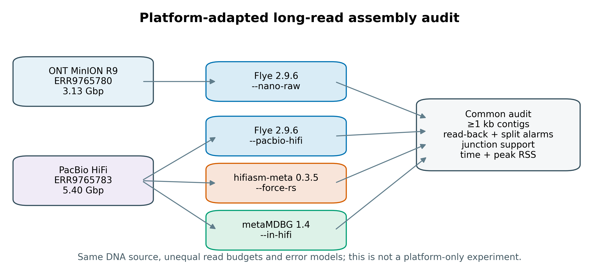
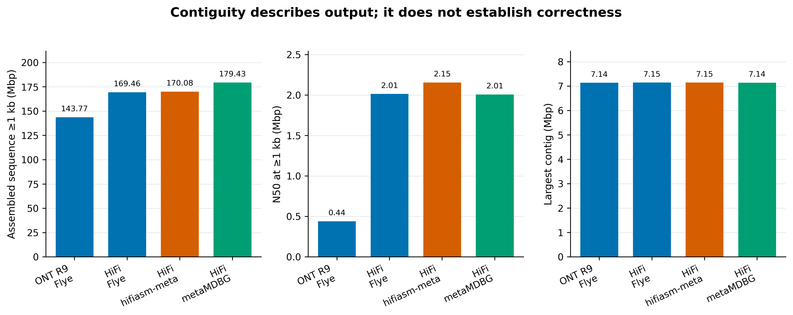
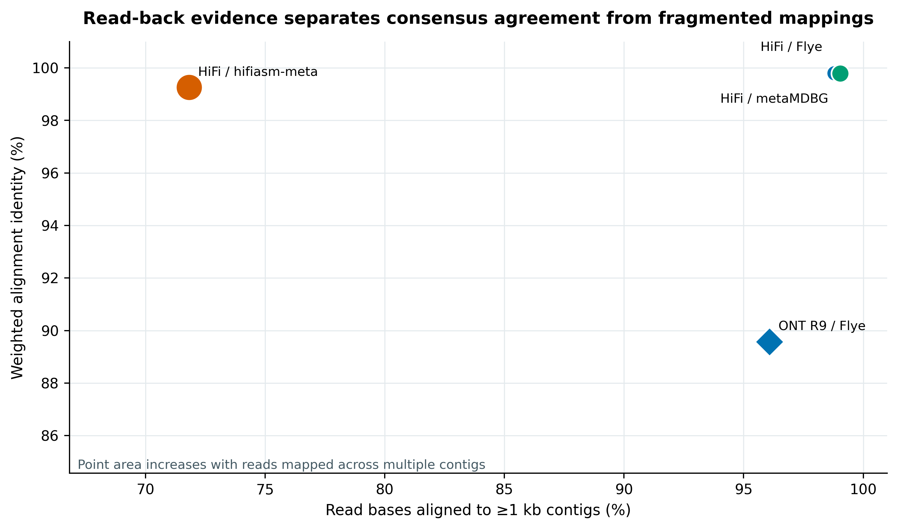
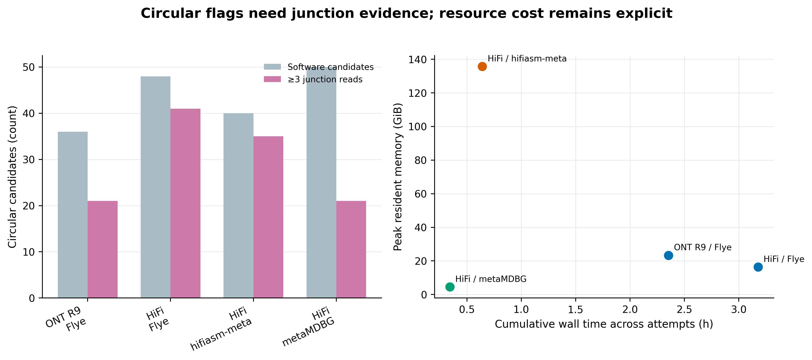

> **学习目标：**把 HMW DNA、basecalling、平台误差模型、assembler preset、polishing、环状证据和 methylation provenance 连成一条可审计链；能运行 Flye、hifiasm-meta 与 metaMDBG；能联合解释 contiguity、read-back、split-alignment、junction support、wall time 与 peak RAM。  
> **真实数据：**Meslier 等构建的 71-strain 不均一 MOCK1 DNA，项目 `PRJEB52977`、样本 `SAMEA14435832`；历史 ONT MinION R9 run `ERR9765780` 含 696,944 reads / 3,125,920,499 bases，PacBio Sequel II CCS/HiFi run `ERR9765783` 含 524,805 reads / 5,400,038,744 bases [@meslier2022platforms]。  
> **结论边界：**两个 runs 来自同一份 DNA，却没有固定 read bases、读长、建库过程、chemistry 与错误模型。因此这是 **platform-adapted workflow audit**，不是平台单因素因果实验；HiFi 三分支也只代表这份数据和锁定参数，**不代表普适赢家**。N50、read-back 与 circular flag 都不等同于正确性；reference-aware misassembly 留到第 33 篇。

## 这一步对应论文里的哪张图 {#sec-target}

Meslier 等的 **Table 3** 把同一 MOCK1 上的短读、历史 ONT R9 与 PacBio CCS assembly 放在共同参考下评价。原研究对 ONT 与 PacBio 使用 metaFlye 2.8.1：两者都启用 `--meta --plasmids --min-overlap 2000`，ONT 使用 `--nano-raw`，PacBio 使用 `--pacbio-hifi --hifi-error 0.003`；随后以 MetaQUAST 4.6.3 计算 genome fraction、错误率和完整基因组回收数 [@meslier2022platforms]。

| Published MOCK1 outcome | ONT MinION R9 | PacBio CCS/HiFi |
|---|---:|---:|
| Assembly input | 0.696 million reads | 0.524 million reads |
| Assembly N50 (bp) | 759,940 | 2,013,697 |
| Largest contig (bp) | 4,324,150 | 7,147,004 |
| Genome fraction (%) | 44.955 | 68.197 |
| Recovered full genomes | 22 | 36 |
| Mismatches / 100 kb | 339.99 | 18.30 |
| Indels / 100 kb | 764.45 | 11.76 |

这张表同时给出连续性和参考感知错误，不能只摘 N50。它也不能被简化为“HiFi 天生优于 ONT”：原始 basecalling、read budget、长度分布与错误结构均不同，而且这里的 ONT 明确是历史 R9 数据。

当前重跑保留完整两个 ENA archives，并建立四个分支：历史 ONT R9 用 Flye 2.9.6 `--nano-raw`；HiFi 分别用 Flye 2.9.6、hifiasm-meta 0.3.5 与 metaMDBG 1.4。Flye 2.9.6 的 `--plasmids` 仅为向后兼容而保留、已标为 unused，因此忠实记录原论文参数但不把这个空开关带入当前命令。四条分支统一在 `≥1 kb` 门槛下汇总，使用 minimap2 2.31 做平台匹配的 read-back，并单独检查软件声明的 circular candidate 是否有跨越首尾 junction 的 reads 支持。

{#fig-31-design}

::: {.callout-important title="先定义长读比较能回答什么"}
同一份 DNA 控制了 mock composition，却没有控制进入 assembler 的信息量。ONT 与 HiFi 的 assembled bases、N50、mapping identity 或 circular count 有差异时，应写成“在各自完整归档与适配工作流下观察到”，不能归因成单一平台效应。
:::

## 理论：长 reads 改变了什么，又没有改变什么 {#sec-theory}

### 1. HMW DNA 决定可被跨越的结构上限

长读的价值不只是 read length 均值更大，而是单分子能从一个 unique flank 穿过 repeat、rRNA operon、BGC、CRISPR-Cas locus 或 ARG–MGE junction，再落到另一个 unique flank。若提取时 DNA 已经剪成 5 kb，assembler 无法凭空恢复 20 kb 的分子连接。因而 high-molecular-weight DNA（HMW DNA，高分子量 DNA）的完整性、size selection 和物种间裂解偏倚，都是 assembly design 的一部分 [@trigodet2022hmw]。

对复杂群落尤其要同时守住两件事：

- **span：**分子足够长，能跨过目标重复与移动元件；
- **coverage：**低丰度成员仍有足够 reads 形成可信 overlap/graph path。

只追求更长的 size selection 可能损失总产量和低丰度 taxa；只追求总 bases 又可能留下大量短分子。正式实验应预注册目标 read N50、最低 yield、目标结构尺度与失败后的补 run 规则。

### 2. ONT 与 HiFi 不是同一种“长读”

**ONT reads**来自 nanopore current signal 的 basecalling。错误结构随 pore、kit、basecaller 和 model 变化；历史 R9、当前 R10 simplex 与 duplex 不能共享一个含糊的 `Nanopore` 标签。本数据的原研究使用 Guppy 2.3.1 和 SQK-LSK109/EXP-NBD103，mapped identity 为 89.08%；Flye 2.9.6 因此使用旧化学体系的 `--nano-raw`，不能套当前 R10 的 `--nano-hq`。

**PacBio HiFi reads**由同一 SMRTbell molecule 的多次 passes 形成 circular consensus sequence（CCS）。其单 read 通常比早期 CLR 准确，适合精确 overlap、菌株分离和无需短读纠错的 assembly；代价是 yield、插入片段长度和建库要求与 ONT 不同 [@wenger2019hifi; @kim2022hifimetagenomics]。

::: {.callout-warning title="preset 必须跟实际 chemistry/error model 走"}
文件名里写着 `nanopore.fastq.gz` 并不足以选择 `--nano-raw` 或 `--nano-hq`。先查 flow cell/pore、kit、basecaller、exact model、Q-score 与 mapping QC；PacBio 也要区分 CLR、corrected reads 与 HiFi/CCS。
:::

### 3. 三类 assembler 解决问题的方式不同

Flye/metaFlye 用 repeat graph 组织 noisy long-read overlaps，并在 `--meta` 模式下适应不均一覆盖 [@kolmogorov2020metaflye]。同一程序可以接 ONT 与 HiFi，但必须给对 read type。

hifiasm-meta 面向 HiFi metagenome，在 overlap/error-correction、read selection 与 metagenome graph cleaning 上处理高冗余和群落异质性；本次将 `--force-rs` 预先定义为 high-redundancy read-selection 的参数敏感性分支，而不是默认参数 [@feng2022hifiasmmeta]。metaMDBG 则把长且准确的 reads 压缩为稀疏 k-min-mer 表示，通过 multi-k assembly 改善复杂 HiFi metagenome 的速度、内存和连续性 [@benoit2024metamdbg]。

三者的 graph cleaning、低覆盖过滤、bubble 处理和 circular 标注不同。输出更长可能来自真实 repeat resolution，也可能来自 strain collapse、错误 join 或更激进过滤；输出更短也可能是在近缘菌株分叉处更保守。

### 4. 长读特有错误会伪装成“完整”

长读降低了许多 short-read graph 断裂，却带来一组必须单独审计的问题 [@amarasinghe2020longreads; @trigodet2026assemblyerrors]：

- basecalling error 与 homopolymer/indel error 会破坏 CDS、移码和功能注释；
- chimeric molecules 或 adapter 未切净可制造跨物种 overlap；
- 高度相近 strains 会被折叠成 mosaic consensus，或在 graph 中反复分叉；
- 低覆盖 contigs 可能只由少数 reads 支撑，长并不等于稳；
- plasmid、phage 和 repeat-rich regions 可能被重复、丢失或错误并入 chromosome；
- read ends 大量 soft clipping、同一 read 分到多个 contigs、或出现 ≥1 kb internal gap，都是需要继续定位的 alarm，不是自动 misassembly verdict。

### 5. polishing 要匹配原始误差，不能机械叠加

Flye 对原始 ONT 分支执行内部 polishing；其轮数必须记录。若使用当前 ONT 数据，额外 polishing 应匹配 exact basecaller/model，并以独立 reads、蛋白编码完整性或已知 mock reference 证明收益，不能因为 N50 不变就默认 consensus 已正确。

HiFi assembly 通常已利用高准确 reads。未经验证地再用短 reads 反复 polish，可能把真实 strain variants 拉向多数等位基因。需要短读准确性与长读 span 的 hybrid assembly/polishing 在第 32 篇单独处理。

### 6. circular flag 是候选证据，不是终点

assembler 声明 `circular`，通常意味着 graph path 首尾可连接或 contig 命名带有 circular 状态。本文对每条长度至少 10 kb 的 circular candidate 构造 `last 5 kb + first 5 kb` junction target，再要求至少 3 条独立 primary reads：

1. alignment 跨过 junction 中心两侧各至少 1 kb；
2. mapQ ≥20；
3. ONT identity ≥75%，HiFi identity ≥95%。

这只是首尾连接支持。**circular candidate 不等于完整基因组**：仍要看 assembly graph 的 bubble/repeat、覆盖连续性、序列冗余、MAG completeness/contamination、rRNA/tRNA、分类一致性，以及是否可能是 plasmid/phage。

### 7. methylation 不在普通 FASTQ 里

ONT methylation 由 signal-aware modified-base model 推断，Dorado 把结果写入 BAM/CRAM 的 `MM`/`ML` tags；raw signal 位于 POD5 [@doradoDocs2026; @doradoMods2026]。PacBio methylation 也依赖 kinetics/相应 BAM 信息。只留下 FASTQ 就只剩 sequence 与 quality，不能事后“从碱基串恢复甲基化”。

```bash
# 当前 ONT 项目示意：必须把实际 model、Dorado 版本与 POD5 checksum 锁进清单
dorado basecaller /path/to/exact_model/ pod5/ \
  --modified-bases 5mC 6mA --emit-moves --device cuda:0 \
  > calls.with_mods.bam 2> dorado.log

samtools view -H calls.with_mods.bam > calls.header.sam
samtools view calls.with_mods.bam | awk '$0 ~ /MM:Z:/ && $0 ~ /ML:B:C/' | head
```

不同 model 支持的 modification 集合不同。上面的命令是 provenance 模板；应先用该版本 `dorado basecaller --help` 和 model list 核对。本文的 ENA FASTQ 没有 POD5 或 kinetics BAM，因此不报告 methylation 结果。

## 准备工作 {#sec-setup}

### 算力门槛

| 项目 | 本文完整 MOCK1 运行 | 处理自己的复杂样本 |
|---|---:|---:|
| CPU | 32 核 | 32–64 核；不同阶段并不线性扩展 |
| RAM | hifiasm-meta 实测峰值 135.72 GiB；建议申请 256 GiB | 代表样本先实测；大型 metagenome 常需 256 GiB–1 TiB |
| 磁盘 | 至少 250 GB 可用高速 scratch | 预留压缩 reads 的 10–20 倍；POD5/BAM 另算 |
| 预计耗时 | 四个 assembly branches 的累计 wall time 为 6.52 小时；read-back、junction 与冻结另算 | 深度、microdiversity 与 assembler 可把任务拉长到数天 |

没有大内存服务器时，优先使用学校 HPC 或按小时计费的云节点。先取固定的 1% reads 做子集演示，只用于检查命令、路径和输出合同；正式结论仍用完整 reads。Flye 的 `--deterministic` 会把初始 disjointig assembly 设为单线程，因此不能根据开头 CPU 利用率误判卡死。

<details>
<summary>点开：锁环境、下载完整归档与内联出版主题</summary>

```bash
# 104 条 Linux-64 package URLs 已锁定
mamba create -n metagenome-long-read-2026.07 \
  --file env/long-read-assembly-linux-64.lock

LONG_READ_ENV_PREFIX="${HOME}/miniconda3/envs/metagenome-long-read-2026.07"
"${LONG_READ_ENV_PREFIX}/bin/flye" --version
"${LONG_READ_ENV_PREFIX}/bin/metaMDBG"
"${LONG_READ_ENV_PREFIX}/bin/minimap2" --version

# hifiasm-meta 官方 release 只有源码；脚本核对 tag archive SHA-256 后再编译
bash scripts/bootstrap_article31_hifiasm_meta.sh \
  --project-root . \
  --env-prefix "${LONG_READ_ENV_PREFIX}" \
  --raw-dir data/raw/article31

# 两个完整 ENA FASTQ 共约 7.10 GB compressed；支持续传并强制 bytes + MD5 双门禁
DOWNLOAD_ARTICLE31_LONG_READ=1 bash data/download.sh
```

```{r}
install.packages(c("ggplot2", "dplyr", "readr", "tidyr", "scales", "patchwork"))

library(ggplot2)
library(dplyr)
library(readr)
library(tidyr)
library(scales)
library(patchwork)

pal_pub <- c(
  Flye = "#0072B2",
  `hifiasm-meta` = "#D55E00",
  metaMDBG = "#009E73",
  Candidate = "#A9BBC5",
  Supported = "#CC79A7"
)
scale_color_pub <- function(...) scale_color_manual(values = pal_pub, ...)
scale_fill_pub  <- function(...) scale_fill_manual(values = pal_pub, ...)

theme_pub <- function(base_size = 12) {
  theme_bw(base_size = base_size) +
    theme(
      panel.grid.minor = element_blank(),
      panel.grid.major.x = element_blank(),
      axis.text = element_text(color = "black"),
      strip.background = element_rect(fill = "#EEF3F5", color = NA),
      legend.key = element_blank(),
      plot.title.position = "plot"
    )
}

save_pub <- function(plot, file_base, width = 180, height = 110,
                     units = "mm", dpi = 350) {
  ggsave(paste0(file_base, ".pdf"), plot, width = width, height = height,
         units = units, device = cairo_pdf)
  ggsave(paste0(file_base, ".png"), plot, width = width, height = height,
         units = units, dpi = dpi, bg = "white")
  ggsave(paste0(file_base, ".tiff"), plot, width = width, height = height,
         units = units, dpi = dpi, compression = "lzw", bg = "white")
  invisible(plot)
}
```

</details>

### 数据身份与口径

```bash
column -ts $'\t' data/small/31-source-manifest.tsv
```

`ENAReadCount` 与 `ENABaseCount` 描述原始归档；`StudyReportedMeanReadLengthBp` 描述论文处理后统计。以 ONT 为例，论文均值是 4,408.41 bp，而 ENA 原始 `base_count / read_count` 是 4,485.18 bp。冻结器会完整流过 FASTQ，另外生成 `ObservedReadCount`、`ObservedBaseCount`、read N50、最短/最长 read 与 SHA-256；两种口径不互相覆盖。

主分析不下采样。低丰度成员最容易因丢掉 reads 而消失，因而 1% 子集只能做命令冒烟：

```bash
LONG_READ_ENV_PREFIX="${HOME}/miniconda3/envs/metagenome-long-read-2026.07"
mkdir -p data/raw/article31/smoke
"${LONG_READ_ENV_PREFIX}/bin/seqkit" sample -p 0.01 -s 20260731 \
  data/raw/article31/full/ERR9765780.fastq.gz \
  -o data/raw/article31/smoke/ERR9765780.seed20260731.p01.fastq.gz
```

## 可复制代码：四条 assembly branches 与共同审计 {#sec-code}

### 第 1 步：建立确定性运行环境

```bash
PROJECT_ROOT="$PWD"
RAW="${PROJECT_ROOT}/data/raw/article31"
WORK="${RAW}/work"
LONG_READ_ENV_PREFIX="${HOME}/miniconda3/envs/metagenome-long-read-2026.07"

export PATH="${LONG_READ_ENV_PREFIX}/bin:/usr/bin:/bin"
export LC_ALL=C TZ=UTC PYTHONHASHSEED=0 PYTHONNOUSERSITE=1
export OMP_NUM_THREADS=32
export TMPDIR="${WORK}/tmp"
export XDG_CACHE_HOME="${WORK}/.cache"
export MPLCONFIGDIR="${WORK}/.matplotlib"
mkdir -p "${WORK}"/{assemblies,logs,resources,mapping,junction-mapping,normalized,tmp}

ONT="${RAW}/full/ERR9765780.fastq.gz"
HIFI="${RAW}/full/ERR9765783.fastq.gz"
HIFIASM_META="${RAW}/tools/bin/hifiasm_meta"
```

在提交任务前重查完整归档，不能只因文件存在就开始组装：

```bash
test "$(stat -c %s "${ONT}")"  = 3117261341
test "$(stat -c %s "${HIFI}")" = 3982506052
printf '%s  %s\n' \
  33eb90ac7437b0039180f03e7a697269 "${ONT}" \
  02ec4bc541b4e1ec5d0f58e4a519f2cb "${HIFI}" | md5sum -c -
```

### 第 2 步：Flye 2.9.6 的历史 ONT R9 与 HiFi 分支

```bash
# 历史 R9：旧化学体系的 raw-error model；2 轮内部 polishing
/usr/bin/time -v -o "${WORK}/resources/assemble-flye-ont-r9.txt" \
  flye --nano-raw "${ONT}" \
    --out-dir "${WORK}/assemblies/flye-ont-r9" \
    --threads 32 --meta --min-overlap 2000 --iterations 2 --deterministic \
  > "${WORK}/logs/assemble-flye-ont-r9.log" 2>&1

# HiFi：高准确读模型；1 轮 polishing
/usr/bin/time -v -o "${WORK}/resources/assemble-flye-hifi.txt" \
  flye --pacbio-hifi "${HIFI}" \
    --out-dir "${WORK}/assemblies/flye-hifi" \
    --threads 32 --meta --min-overlap 2000 --iterations 1 --deterministic \
  > "${WORK}/logs/assemble-flye-hifi.log" 2>&1
```

若中断且 `flye.log`/stage 目录完整，用完全相同参数追加 `--resume`。不要把不同参数的旧目录拿来 resume；先换新输出目录。

### 第 3 步：HiFi 专用的 hifiasm-meta 0.3.5 与 metaMDBG 1.4

```bash
mkdir -p "${WORK}/assemblies/hifiasm-meta-hifi"

# 官方 tag hamtv0.3.5；把强制 read selection 作为显式参数分支；t-SNE seed 固定
/usr/bin/time -v -o "${WORK}/resources/assemble-hifiasm-meta-hifi.txt" \
  "${HIFIASM_META}" -t 32 --force-rs --tsne-seed 20260731 \
    -o "${WORK}/assemblies/hifiasm-meta-hifi/asm" "${HIFI}" \
  > "${WORK}/logs/assemble-hifiasm-meta-hifi.log" 2>&1

# metaMDBG 1.4 当前只把 --in-ont 用于 R10.4+；历史 R9 不进入该分支
/usr/bin/time -v -o "${WORK}/resources/assemble-metamdbg-hifi.txt" \
  metaMDBG asm \
    --out-dir "${WORK}/assemblies/metamdbg-hifi" \
    --in-hifi "${HIFI}" --threads 32 \
    --min-contig-length 50 --min-contig-coverage 1 \
  > "${WORK}/logs/assemble-metamdbg-hifi.log" 2>&1
```

官方 hifiasm-meta release 页面标为 0.3.5 (r81)，但该 tag 源码的 runtime strings 仍是 `hamt 0.3-r079 / hifiasm base 0.13-r308`。同一 tag 的简版 `-h` 没列出 `--tsne-seed`，但 `CommandLines.cpp` 明确解析该参数并把默认值设为 42；本文仍显式设为 `20260731`。Methods 同时记录 tag、commit、source archive SHA-256、binary SHA-256 和两个 runtime strings，不把内部字符串差异隐藏掉。

官方 README 的默认命令不含 `--force-rs`；只有 high-redundancy 数据才建议考虑强制 read selection，并明确指出 mock 是否需要取决于数据。本次把它作为一个预先声明的**参数敏感性分支**，不是“hifiasm-meta 的普遍默认”。日志记录它保留 349,873 / 524,805 reads（66.67%）；后面的全输入 read-back 因而是必需的失真检查。

metaMDBG 1.4 的 CLI 没有暴露随机种子参数，不能虚构 `--seed`。本文固定完整输入、版本、线程数与全部参数，并冻结每条输出 contig 的 sequence SHA-256；相同环境重跑若序列 hash 漂移，应作为复现失败调查，而不是静默覆盖。

### 第 4 步：统一 contig 门槛并做 read-back

先把 hifiasm primary GFA 的 `S` records 转为 FASTA，再从四条分支计算 `0 / 1 kb / 10 kb / 100 kb / 1 Mb` 五套长度统计：

```bash
python3 scripts/prepare_article31_assemblies.py --work-dir "${WORK}"
column -ts $'\t' "${WORK}/normalized/assembly-metrics.tsv" | head -n 12
```

read-back 让每个平台的原始 reads 只回帖到由自身 reads 产生、并统一过滤为 `≥1 kb` 的 assembly reference。这样 metaMDBG 的短 contigs 不会凭额外靶序列抬高 recruitment。每个 mapping summary 还记录 `ReferenceBytes` 与 `ReferenceSHA256`，离线验收时与冻结 assembly 解压后的字节流逐一核对。`-c` 强制执行 base-level alignment 并写出 CIGAR/NM；否则 PAF 第 10/11 列不能被当作精确碱基 identity。`--secondary=no` 排除 secondary hits，但保留 primary chain/split 结构；ONT 用 `map-ont`，HiFi 用 `map-hifi` [@li2018minimap2]。

```bash
minimap2 -c -x map-ont -t 32 -K 1g -I 8G --secondary=no \
  -o "${WORK}/mapping/flye-ont-r9.paf" \
  "${WORK}/normalized/flye-ont-r9.ge1000.fasta" "${ONT}"

minimap2 -c -x map-hifi -t 32 -K 1g -I 8G --secondary=no \
  -o "${WORK}/mapping/flye-hifi.paf" \
  "${WORK}/normalized/flye-hifi.ge1000.fasta" "${HIFI}"

minimap2 -c -x map-hifi -t 32 -K 1g -I 8G --secondary=no \
  -o "${WORK}/mapping/hifiasm-meta-hifi.paf" \
  "${WORK}/normalized/hifiasm-meta-hifi.primary.fasta" "${HIFI}"

minimap2 -c -x map-hifi -t 32 -K 1g -I 8G --secondary=no \
  -o "${WORK}/mapping/metamdbg-hifi.paf" \
  "${WORK}/assemblies/metamdbg-hifi/contigs.fasta.gz" "${HIFI}"
```

每条 read 的 query intervals 先取 union，避免 split records 重复计算 aligned bases；同时汇总 mapped reads、mapQ≥20、weighted identity、median aligned fraction、multi-segment/multi-contig、≥1 kb end clipping 与 ≥1 kb internal query gap。

```bash
python3 scripts/summarize_article31_paf.py \
  --paf "${WORK}/mapping/flye-ont-r9.paf" \
  --output "${WORK}/mapping/flye-ont-r9.json" \
  --branch flye-ont-r9 --assembler Flye --platform "ONT R9" \
  --expected-reads 696944 --expected-bases 3125920499 \
  --reference-threshold-bp 1000 \
  --reference-fasta "${WORK}/normalized/flye-ont-r9.ge1000.fasta"

# 其余三个 HiFi PAF 使用 expected-reads 524805、expected-bases 5400038744；
# 完整四分支调用由下面的运行器逐项执行并写入资源账本。
```

::: {.callout-note title="read-back 能发现 alarm，但不能宣布正确"}
高 aligned-base fraction 表示 assembly 能表示较多输入序列；高 identity 表示读段与 assembly consensus 较一致。重复序列和错误 consensus 也可能吸附 reads，而真实 strain branches 也会产生 split mapping。它们是定位候选问题的筛查指标，不是 misassembly truth。
:::

### 第 5 步：核对 circular junction

```bash
# prepare 脚本已为每个 ≥10 kb circular candidate 建 last5kb+first5kb target
minimap2 -c -x map-ont -t 32 -K 1g -I 8G --secondary=no \
  -o "${WORK}/junction-mapping/flye-ont-r9.paf" \
  "${WORK}/normalized/flye-ont-r9.junctions.fasta" "${ONT}"

# 三个 HiFi 分支同理，preset 改为 map-hifi
python3 scripts/summarize_article31_junctions.py --work-dir "${WORK}"
column -ts $'\t' "${WORK}/normalized/junction-support.tsv" | head
```

若候选少于 10 kb，本文不把它纳入 5 kb + 5 kb junction 检查；若候选有 ≥3 条 supporting reads，也只把状态写为 `SupportedByGE3Reads=TRUE`，不改名为 complete genome。

### 第 6 步：断点运行、冻结与离线验收

```bash
bash scripts/run_article31_long_read_assembly.sh \
  --project-root . \
  --env-prefix "${LONG_READ_ENV_PREFIX}" \
  --raw-dir data/raw/article31 \
  --frozen-dir data/small/31-long-read-assembly-frozen

python3 scripts/validate_article31_long_read_assembly.py \
  --project-root . \
  --env-prefix "${LONG_READ_ENV_PREFIX}" \
  --frozen-dir data/small/31-long-read-assembly-frozen \
  --output-dir results/31-long-read-assembly \
  --figure-dir figures \
  --chapter chapters/31-long-read-assembly.qmd
```

运行器只在完整输出与 `.article31-complete` sentinel 同时存在时跳过分支；每次尝试单独保留 `/usr/bin/time -v`、日志和 attempt number。冻结目录不接受覆盖：要重做时写入新目录，比较 checksum 后再决定是否替换正式证据。

### 固化结果长什么样

```bash
column -ts $'\t' data/small/31-long-read-assembly-frozen/source-audit.tsv | head -n 3
column -ts $'\t' data/small/31-long-read-assembly-frozen/assembly-metrics.tsv | head -n 10
column -ts $'\t' data/small/31-long-read-assembly-frozen/readback-metrics.tsv
column -ts $'\t' data/small/31-long-read-assembly-frozen/junction-support.tsv | head
column -ts $'\t' data/small/31-long-read-assembly-frozen/resource-usage.tsv
```

四个分支在统一 `≥1 kb` 门槛下得到：

| Branch | Sequence (Mbp) | Contigs | N50 (Mbp) | Largest (Mbp) | Aligned read bases (%) | Base-level identity (%) | Multi-contig reads (%) |
|---|---:|---:|---:|---:|---:|---:|---:|
| ONT R9 · Flye | 143.77 | 2,423 | 0.441 | 7.137 | 96.08 | 89.57 | 1.32 |
| HiFi · Flye | 169.46 | 806 | 2.014 | 7.147 | 98.79 | 99.799 | 0.29 |
| HiFi · hifiasm-meta `--force-rs` | 170.08 | 885 | 2.155 | 7.147 | 71.82 | 99.261 | 3.08 |
| HiFi · metaMDBG | 179.43 | 1,249 | 2.007 | 7.144 | 99.04 | 99.792 | 0.68 |

HiFi/Flye 的 N50 为 2,013,697 bp，与论文 Table 3 的值相同，largest contig 只相差 3 bp；这说明连续性结果高度接近，但不能替代论文基于已知 references 的错误率与 genome fraction。历史 ONT R9/Flye 的 weighted base-level identity 为 89.57%，也与论文报告的 read identity 量级一致；ONT 与 HiFi 仍保留不同 read budget、建库和误差结构，不能据此做平台因果推断。

hifiasm-meta 的 N50 在本次四分支中最高，但强制 read selection 后只有 71.82% 的完整输入 bases 回帖，且 multi-contig alarm 为 3.08%。这不是“更长就更完整”，而是 `--force-rs` 参数分支丢失输入表示度的直接信号。metaMDBG 保留最多 `≥1 kb` sequence、read-back 也最高，却不能因此宣布闭环最多或错误最少。

circular flag 与跨首尾证据分开统计：

| Branch | Circular candidates ≥10 kb | Supported by ≥3 junction reads | Support fraction (%) |
|---|---:|---:|---:|
| ONT R9 · Flye | 25 | 21 | 84.0 |
| HiFi · Flye | 43 | 41 | 95.3 |
| HiFi · hifiasm-meta `--force-rs` | 38 | 35 | 92.1 |
| HiFi · metaMDBG | 46 | 21 | 45.7 |

metaMDBG 的总体 read-back 为 99.04%，但 46 个 ≥10 kb circular candidates 中只有 21 个通过保守 junction 门。全局表示度高与某条 contig 首尾连接有支持是两个问题；未通过者应回到 graph、coverage 和 read alignments，而不是把阈值放宽到“看起来闭环”。

实际 assembly 资源如下。`Cumulative wall` 汇总同一步骤的全部 attempts，`Final wall` 只描述最后一次 attempt；peak RSS 取全部 attempts 的最大值：

| Branch | Attempts | Cumulative wall (h) | Final wall (h) | Peak RSS (GiB) |
|---|---:|---:|---:|---:|
| ONT R9 · Flye | 2 | 2.35 | 0.64 | 23.23 |
| HiFi · Flye | 1 | 3.18 | 3.18 | 16.35 |
| HiFi · hifiasm-meta `--force-rs` | 1 | 0.64 | 0.64 | 135.72 |
| HiFi · metaMDBG | 1 | 0.34 | 0.34 | 4.50 |

ONT/Flye 的首次 attempt 在 consensus 阶段因执行环境不允许本地 multiprocessing IPC 而退出，随后用相同参数 `--resume` 完成；这次基础设施失败保留在累计资源与日志中，不归因成 VPN 或 assembler 精度问题。hifiasm-meta 的 135.72 GiB 实测峰值已经超过 128 GiB 节点的名义容量，因此完整数据应申请 256 GiB，而不能照搬小型 smoke test 的内存。

`file-checksums.sha256` 覆盖环境、脚本、版本、来源审计、所有表、规范化日志、资源记录、graph summary 和四套 `≥1 kb` 压缩 assemblies。FASTQ、PAF 与庞大工作目录留在 Git-ignored `data/raw/`，不随仓库分发。

## 审计与升级 {#sec-audit}

### 先忠实说明锚定论文做了什么

原研究在同一 MOCK1 DNA 上获得多个平台 reads；MinION R9 reads 用 Guppy 2.3.1 basecall/quality trim，ONT 与 PacBio reads 去除短于 500 nt 的序列，再用 metaFlye 2.8.1 的平台匹配模式组装。MetaQUAST 4.6.3 将 assemblies 对齐已知 mock references，Table 3 同时报告 contiguity、genome fraction、misassembly/error 和完整基因组回收 [@meslier2022platforms]。

这套设计的强项是：真实复杂 mock、已知成员和 reference-aware evaluation 同时存在。它比自然样本上只比较 N50 更接近 assembly correctness。

### 当前重跑补上的六层审计

1. **归档身份：**完整 ENA bytes + MD5，另算 SHA-256、FASTQ grammar、reads/bases 与长度分布。
2. **chemistry-aware preset：**历史 R9 明确使用 `--nano-raw`；不把当前 R10 参数倒灌给旧数据。
3. **HiFi assembler sensitivity：**同一完整 HiFi run 分别进入 Flye、hifiasm-meta 和 metaMDBG；工具版本、tag/commit 与环境 lock 固定。
4. **共同 reporting threshold：**每条分支都同时保存原始输出统计与 `≥1 kb` 主比较，不在看到结果后挑阈值。
5. **read-back alarms：**minimap2 `-c` 的 CIGAR/NM 先通过门禁，再联合呈现 aligned query bases、base-level identity、multi-contig、end clipping 和 internal gap。
6. **circular evidence + resources：**软件 flag 与 junction-spanning reads 分列；wall time、peak RSS、失败尝试和完整日志保留。

### 今天还应继续升级什么

- **参考感知 correctness：**对这个 mock 使用同一 reference set、同一 contig threshold 和 MetaQUAST/自定义 truth mapping，报告 misassembly、genome fraction、duplication 与每 100 kb errors；第 33 篇完成。
- **按 strain/taxon 分层：**总 assembly 指标可能被高丰度菌支配，应按 expected abundance、GC、genome size 和 relatedness 检查 dropout 与 strain collapse。
- **graph-level circular QA：**检查 bubble、repeat、coverage discontinuity、重复首尾和 contaminant joins；junction reads 只是必要证据之一。
- **功能完整性：**在 consensus 评价中加入 intact CDS、frameshift、rRNA operon、BGC、CRISPR-Cas 和 ARG–MGE linkage，而不是只看碱基长度。
- **独立 validation reads：**条件允许时用未参与 assembly 的 reads，或正交短读/另一平台数据做验证，减少“用训练输入评价训练结果”的乐观性。
- **当前 ONT 重测：**历史 R9 结果不能代表 R10.4.1、当前 Dorado model 或 duplex；新研究需重新 benchmark，不能只改 Methods 年份。

::: {.callout-caution title="没有 reference 的自然样本，结论要更保守"}
自然样本没有完整 truth 时，可联合看 graph、coverage、read-back、gene/MAG recovery、taxonomy coherence 和 replicate consistency，但仍不能把“最长、回帖最高、环状最多”直接改写为“最准确”。
:::

## 出版级美化 {#sec-polish}

### 图 1：把连续性拆成三个问题

{#fig-31-contiguity}

```{r}
frozen <- "data/small/31-long-read-assembly-frozen"
branch_levels <- c(
  "flye-ont-r9", "flye-hifi", "hifiasm-meta-hifi", "metamdbg-hifi"
)
branch_labels <- c(
  "flye-ont-r9" = "ONT R9\nFlye",
  "flye-hifi" = "HiFi\nFlye",
  "hifiasm-meta-hifi" = "HiFi\nhifiasm-meta",
  "metamdbg-hifi" = "HiFi\nmetaMDBG"
)

assembly <- read_tsv(file.path(frozen, "assembly-metrics.tsv"),
                     show_col_types = FALSE) |>
  filter(ThresholdBp == 1000) |>
  mutate(Branch = factor(Branch, levels = branch_levels))

make_length_panel <- function(data, field, divisor, y_label) {
  ggplot(data, aes(x = Branch, y = .data[[field]] / divisor, fill = Assembler)) +
    geom_col(width = 0.72) +
    geom_text(aes(label = sprintf("%.2f", .data[[field]] / divisor)),
              vjust = -0.35, size = 3.1) +
    scale_x_discrete(labels = branch_labels) +
    scale_fill_pub() +
    scale_y_continuous(expand = expansion(mult = c(0, 0.15))) +
    labs(x = NULL, y = y_label) +
    theme_pub() +
    theme(axis.text.x = element_text(angle = 25, hjust = 1),
          legend.position = "none")
}

p_contiguity <-
  make_length_panel(assembly, "TotalBp", 1e6,
                    "Assembled sequence >=1 kb (Mbp)") |
  make_length_panel(assembly, "N50Bp", 1e6,
                    "N50 at >=1 kb (Mbp)") |
  make_length_panel(assembly, "LargestBp", 1e6,
                    "Largest contig (Mbp)")

save_pub(p_contiguity, "figures/31-long-read-contiguity",
         width = 285, height = 110)
```

### 图 2：把表示能力、共识一致性和 split alarm 放在一起

{#fig-31-readback}

```{r}
readback <- read_tsv(file.path(frozen, "readback-metrics.tsv"),
                     show_col_types = FALSE) |>
  mutate(
    Branch = factor(Branch, levels = branch_levels),
    Label = recode(as.character(Branch), !!!branch_labels),
    LabelX = AlignedQueryBasePct + case_when(
      Branch %in% c("flye-hifi", "metamdbg-hifi") ~ -0.35,
      TRUE ~ 0.55
    ),
    LabelY = WeightedAlignmentIdentityPct + case_when(
      Branch == "flye-hifi" ~ 0.28,
      Branch == "metamdbg-hifi" ~ -0.28,
      TRUE ~ 0.25
    ),
    LabelHjust = if_else(
      Branch %in% c("flye-hifi", "metamdbg-hifi"), 1, 0
    )
  )

p_readback <- ggplot(
  readback,
  aes(x = AlignedQueryBasePct, y = WeightedAlignmentIdentityPct,
      color = Assembler, size = MultiContigPctOfMapped,
      shape = Platform)
) +
  geom_point(alpha = 0.9, stroke = 0.8) +
  geom_text(aes(x = LabelX, y = LabelY,
                label = gsub("\\n", " / ", Label), hjust = LabelHjust),
            size = 3, show.legend = FALSE, check_overlap = FALSE) +
  scale_color_pub() +
  scale_shape_manual(values = c("ONT R9" = 18, "PacBio HiFi" = 16)) +
  scale_size_continuous(name = "Multi-contig reads (%)", range = c(3.5, 9)) +
  labs(
    x = "Read bases aligned to >=1 kb contigs (%)",
    y = "Weighted alignment identity (%)",
    color = "Assembler", shape = "Platform"
  ) +
  theme_pub()

save_pub(p_readback, "figures/31-long-read-readback",
         width = 190, height = 125)
```

### 图 3：circular flag 与算力必须进入同一审计

{#fig-31-circular-resource}

```{r}
junction <- read_tsv(file.path(frozen, "junction-support.tsv"),
                     show_col_types = FALSE)
resource <- read_tsv(file.path(frozen, "resource-usage.tsv"),
                     show_col_types = FALSE)

circular_counts <- junction |>
  summarise(
    Candidate = n(),
    Supported = sum(SupportedByGE3Reads),
    .by = Branch
  ) |>
  complete(Branch = branch_levels,
           fill = list(Candidate = 0L, Supported = 0L)) |>
  pivot_longer(c(Candidate, Supported), names_to = "Evidence", values_to = "Count") |>
  mutate(Branch = factor(Branch, levels = branch_levels))

p_circular <- ggplot(circular_counts,
                     aes(x = Branch, y = Count, fill = Evidence)) +
  geom_col(position = position_dodge(width = 0.78), width = 0.7) +
  scale_x_discrete(labels = branch_labels) +
  scale_fill_pub() +
  labs(x = NULL, y = "Circular candidates (count)", fill = NULL) +
  theme_pub() +
  theme(axis.text.x = element_text(angle = 25, hjust = 1))

assembly_resource <- resource |>
  filter(startsWith(Step, "assemble-")) |>
  mutate(
    Branch = sub("^assemble-", "", Step),
    Assembler = recode(
      Branch,
      "flye-ont-r9" = "Flye",
      "flye-hifi" = "Flye",
      "hifiasm-meta-hifi" = "hifiasm-meta",
      "metamdbg-hifi" = "metaMDBG"
    ),
    Branch = factor(Branch, levels = branch_levels),
    WallHours = WallSeconds / 3600,
    PeakRSSGiB = PeakRSSKiB / 1024^2,
    Label = recode(as.character(Branch), !!!branch_labels)
  )

p_resource <- ggplot(assembly_resource,
                     aes(x = WallHours, y = PeakRSSGiB, color = Assembler)) +
  geom_point(size = 4) +
  geom_text(aes(label = gsub("\\n", " / ", Label)),
            nudge_x = 0.03, nudge_y = 0.15, size = 3,
            show.legend = FALSE, check_overlap = TRUE) +
  scale_color_pub() +
  labs(x = "Cumulative wall time across attempts (h)",
       y = "Peak resident memory across attempts (GiB)",
       color = "Assembler") +
  theme_pub()

save_pub(p_circular | p_resource,
         "figures/31-circular-resource-audit", width = 275, height = 115)
```

### 导出检查

四张图均输出矢量 PDF、350 dpi PNG 与 350 dpi LZW TIFF。图内轴、图例、分组和注释全部使用英文；颜色不单独承担信息，platform 同时由形状或标签编码。提交前打开 PDF 与 TIFF，检查长标签、单位、空白 panel、点面积图例和颜色区分。

## 常见坑方框 {#sec-pitfalls}

::: {.callout-caution title="审稿人最容易抓住的十一个问题"}
1. **把所有 ONT 都写成 `--nano-raw` 或 `--nano-hq`。** 必须按 pore/kit/basecaller/model 与实际 error QC 选 preset。
2. **只留 FASTQ。** ONT 丢 POD5/basecalled BAM，PacBio 丢 HiFi/kinetics BAM 后，modified bases、signal/kinetics 与完整 provenance 无法恢复。
3. **HMW 只写 DNA 浓度。** 还应报告 extraction、fragment distribution、size-selection 和目标 read N50/yield。
4. **比较时强行等 read 数。** 同样数量的 ONT/HiFi reads 不等于同样 bases、span、coverage 或信息量；若下采样，要预注册按 reads 还是 bases，并做 depth curve。
5. **把 N50 当正确性。** 错误 join 会抬高 N50；同时报告 largest、total、L50/L90、reference-aware errors 或 graph/read evidence。
6. **把高 read-back 当正确。** 保守区域、repeat 与错误 consensus 都可能吸附 reads；read-back 只是一层一致性证据。
7. **直接把无 `-c` 的 PAF 第 10/11 列当精确 identity。** minimap2 必须执行 base-level alignment，并验证 `cg`/`NM` tags；否则链级近似值会制造荒谬但能计算的百分比。
8. **把 `circular=yes` 改写成 complete genome。** 至少补 junction reads、graph、coverage、序列去冗余、MAG/virus/plasmid 身份与质量检查。
9. **在 HiFi assembly 后机械短读 polishing。** 先证明错误率/CDS 完整性改善且没有抹平真实 strain variants。
10. **忽略 strain mixture。** 近缘 strains 可能 collapse、mosaic 或 fragment；总 assembly 指标看不见 taxon-specific failure。
11. **工具版本只写名字。** Flye preset、metaMDBG filters、hifiasm-meta release/embedded strings 都会变；保留 environment lock、tag/commit、commands 与 checksums。
:::

## 这段 Methods 怎么写 {#sec-methods}

可直接套用的英文模板如下；方括号字段替换为自己的实际记录：

> High-molecular-weight DNA was extracted using [method] and evaluated using [concentration and fragment-size assays]. Long-read libraries were prepared with [platform, kit, size-selection procedure and version]. Oxford Nanopore signal data were retained as checksum-identified POD5 files and basecalled with Dorado [version] using the exact model [model], [simplex/duplex] mode and a minimum Q score of [value]; modified bases were [not called/called with model(s), with MM/ML tags retained in BAM]. PacBio HiFi reads were generated with [instrument, chemistry, SMRT Link/CCS version and parameters], and the native HiFi BAM and run reports were retained. Archive byte counts, MD5 values, read counts and base counts were verified before assembly.

本文真实运行可写为：

> Complete long-read archives from the same 71-strain synthetic MOCK1 DNA sample (SAMEA14435832; PRJEB52977) were used without subsampling: historical ONT MinION R9 reads (ERR9765780; 696,944 reads; 3,125,920,499 bases) and PacBio Sequel II CCS/HiFi reads (ERR9765783; 524,805 reads; 5,400,038,744 bases). The compressed ENA byte counts and MD5 digests were verified, and the complete FASTQ streams were independently audited for record and base counts. The ONT data were assembled with Flye 2.9.6-b1802 using `--nano-raw --meta --min-overlap 2000 --iterations 2 --deterministic`; the HiFi data were assembled with Flye 2.9.6-b1802 (`--pacbio-hifi --meta --min-overlap 2000 --iterations 1 --deterministic`), hifiasm-meta official release 0.3.5 (r81; tag `hamtv0.3.5`, commit `e4e24f5158091ad901c1ff6f68278559bd41a6b5`; `--force-rs --tsne-seed 20260731`) and metaMDBG 1.4 (`--in-hifi`). Each branch used 32 threads where supported. Assembly statistics were reported at prespecified thresholds of 0, 1 kb, 10 kb, 100 kb and 1 Mb, with 1 kb used for the primary comparison. Source reads were mapped back to their matching assemblies after applying the same 1-kb contig threshold to every branch, using minimap2 2.31-r1302 with `-c`, `map-ont` or `map-hifi`, and `--secondary=no`; exact PAF matching and alignment-block bases were used for identity only after CIGAR/NM tags were verified. The byte count and SHA-256 of each mapping reference were verified against the corresponding frozen assembly. Query-aligned bases were unioned per read before recruitment was calculated. Software-declared circular contigs of at least 10 kb were further evaluated against synthetic 5-kb end/start junctions; support required at least three primary reads spanning 1 kb on both sides at mapping quality ≥20 and alignment identity ≥75% for ONT or ≥95% for HiFi. Commands, software/source versions, environment locks, checksums, normalized logs, wall time and maximum resident memory were retained. Reference-aware assembly correctness was not inferred from N50, read recruitment or circular flags.

四个 assembly branches 的累计 wall time 范围为 0.34–3.18 小时，peak RSS 范围为 4.50–135.72 GiB。`resource-usage.tsv` 的 `WallSeconds`/`PeakRSSKiB` 是跨全部 attempts 的累计时间与最大峰值，`FinalWallSeconds`/`FinalPeakRSSKiB` 只描述最后一次 attempt；服务器物理内存不写成 peak RSS，累计重试时间也不冒充一次干净成功运行。环境、脚本、版本、命令、规范化日志、结果表与四套 `≥1 kb` assemblies 均由 `file-checksums.sha256` 覆盖。

## 换成你自己的数据怎么做 {#sec-own-data}

### 先建一张 long-read lineage sheet

| 字段 | 最少记录内容 |
|---|---|
| Biological source | 样本、提取 aliquot、host fraction、预期复杂度 |
| HMW QC | 输入量、纯度、fragment distribution、size selection |
| ONT | device、flow cell/pore、kit、Dorado version、exact model、simplex/duplex、POD5/BAM |
| PacBio | instrument、chemistry、SMRT Link/CCS version、passes/QV、HiFi/kinetics BAM |
| Read budget | reads、bases、read N50、length/Q distribution、过滤前后数量 |
| Assembly | assembler/version、preset、完整 command、threads、seed、scratch |
| Primary endpoint | complete MAG、plasmid/phage、BGC、ARG–MGE、strain、gene catalog |
| Validation | reference/mock、independent reads、graph、coverage、MAG/gene QA |

### 一个可执行的选择顺序

1. 先按 biological endpoint 决定所需 span：完整 chromosome、plasmid/phage、rRNA operon、BGC 和 strain resolution 对 read length/accuracy 的要求不同。
2. 在 1% 固定 seed 子集上冒烟；确认 FASTQ/BAM、preset、临时目录、checkpoint 和输出名，结果不进入论文。
3. 对一个代表性完整样本各跑 1–2 个候选 assembler，实测 wall time、peak RSS 与 scratch，再提交全队列资源申请。
4. 预先固定 contig thresholds 与主指标；至少同时保留 contiguity、read-back alarms、graph/circular evidence 和算力。
5. 有 mock/reference 时做 reference-aware truth；自然样本则联合 taxon-stratified coverage、MAG/gene recovery、graph 与独立 reads。
6. 若 ONT consensus error 影响 CDS，先选择与 exact model 匹配的 polishing，并证明错误/frameshift 改善；若要混合短读，转入 hybrid design，而非临时追加一次 Pilon。
7. 若研究 methylation，从测序开始保留 POD5 或 kinetics BAM、model 与 tags；只有 FASTQ 时把该终点标为 unavailable。
8. 归档 input/output checksums、environment lock、source tag/commit、commands、all attempts、logs、resource records、graph 和最终 assembly。

::: {.callout-tip title="预算有限时的实用设计"}
可先在代表性 discovery subset 做长读 assembly，建立 study-specific MAG/gene/virus catalog；再让全队列短 reads 回帖到同一 catalog。至少保留若干 bridge samples 同时上长读与短读，用于估计平台、提取和 profiling 差异。
:::

## 参考 {#sec-references}

- 同一复杂 mock 的平台、basecalling、assembly 与 Table 3：[@meslier2022platforms]
- long-read repeat-graph metagenome assembly：[@kolmogorov2020metaflye]
- HiFi metagenome assembly 与完整基因组回收：[@feng2022hifiasmmeta; @kim2022hifimetagenomics]
- metaMDBG 的长准确 read assembly：[@benoit2024metamdbg]
- long-read 数据分析机会与错误边界：[@amarasinghe2020longreads; @trigodet2026assemblyerrors]
- HMW DNA extraction：[@trigodet2022hmw]
- HiFi/CCS 原理：[@wenger2019hifi]
- minimap2 read-back alignment：[@li2018minimap2]
- ONT POD5、BAM 与 modified-base tags：[@doradoDocs2026; @doradoMods2026]
