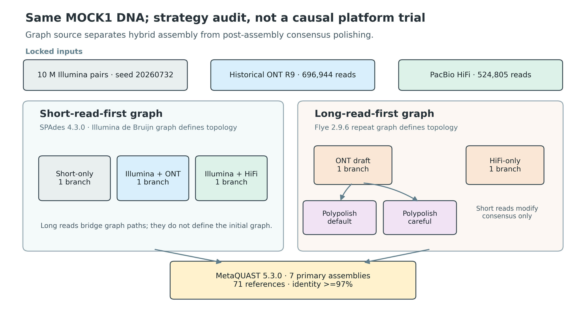
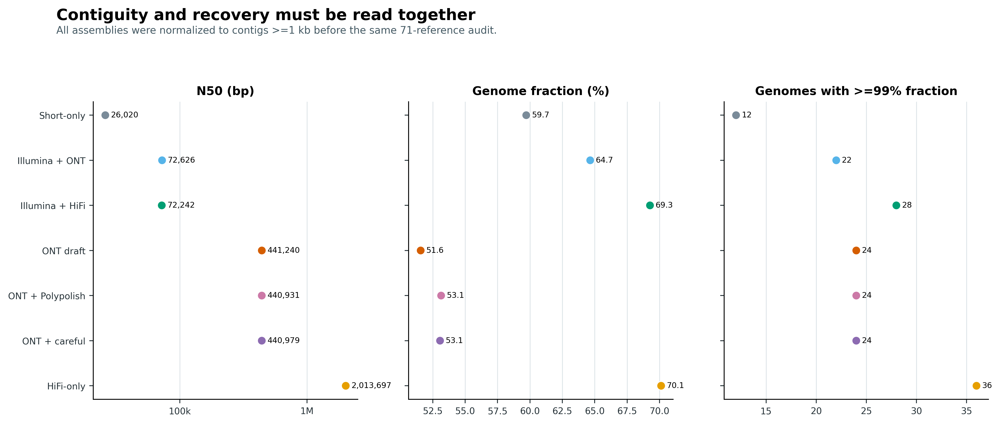
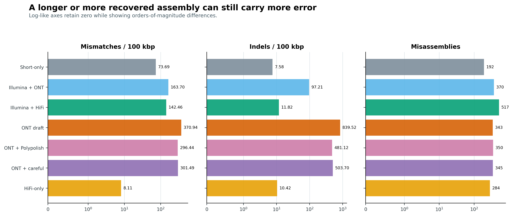
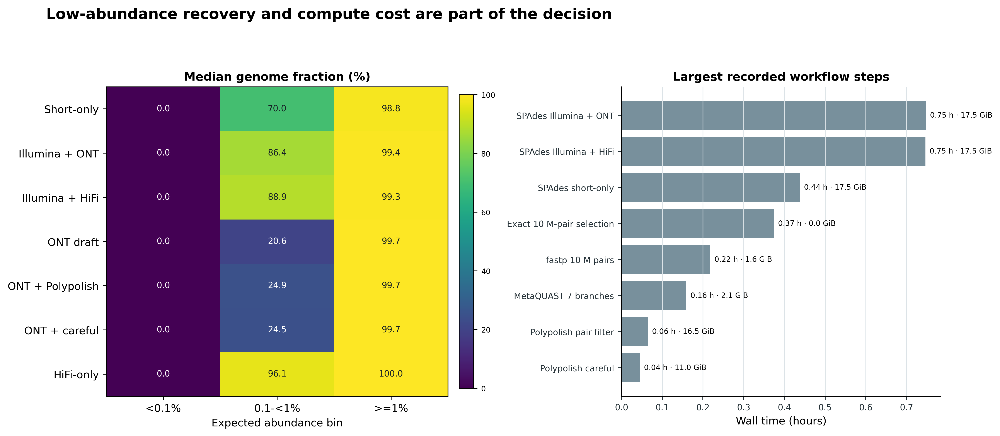

> **学习目标：**区分 short-read-first hybrid assembly（短读优先混合组装）与 long-read-first polishing（长读优先后抛光）；能把 ONT/HiFi 作为 SPAdes supplementary reads，也能用 `BWA-MEM -a` + Polypolish 审计长读 draft；最终同时用 recovery、contiguity、mismatch、indel、misassembly、低丰度回收和资源账本作决策。  
> **真实数据：**Meslier 等的 71-strain 不均一 MOCK1 DNA，项目 `PRJEB52977`、样本 `SAMEA14435832`。Illumina `ERR9765746` 固定抽取 10,000,000 对 reads；完整历史 ONT R9 `ERR9765780` 含 696,944 reads，完整 PacBio CCS/HiFi `ERR9765783` 含 524,805 reads [@meslier2022platforms]。  
> **结论边界：**同一份 DNA 没有把平台 yield、read length、chemistry、basecaller 与误差模型配平。这里比较的是**锁定输入与参数下的 assembly strategy**，不是平台单因素实验。`>=99% genome fraction` 是预先定义的操作性回收阈值，不是“无误差闭环基因组”的证明。

## 这一步对应论文里的哪张图 {#sec-target}

锚定结果是 Meslier 等的 **Table 3** 与 **Supplementary Table S2**。原研究在 MOCK1 上固定 10 million Illumina read pairs，用 SPAdes 3.14.1 的 `--nanopore` 或 `--pacbio` 建立 short-read-first hybrid assembly；ONT-only 与 HiFi-only 则使用 metaFlye 2.8.1。所有分支再由 MetaQUAST 4.6.3 对已知 mock references 评价 [@meslier2022platforms]。

| Published MOCK1 branch | Contigs | N50 (bp) | Genome fraction (%) | Mismatches / 100 kbp | Indels / 100 kbp | Full genomes (>=99%) |
|---|---:|---:|---:|---:|---:|---:|
| Illumina-only | 40,147 | 13,707 | 61.897 | 47.55 | 3.53 | 12 |
| Illumina + ONT | 16,923 | 77,301 | 66.357 | 192.42 | 98.36 | 22 |
| ONT-only | 1,283 | 759,940 | 44.955 | 339.99 | 764.45 | 22 |
| Illumina + HiFi | 12,932 | 85,671 | 70.630 | 129.90 | 7.95 | 27 |
| HiFi-only | 437 | 2,013,697 | 68.197 | 18.30 | 11.76 | 36 |

原表已经推翻了“hybrid 必然最好”这个简化结论：Illumina + ONT 的 N50、genome fraction 与完整基因组数都高于 Illumina-only，但 mismatch 与 indel 同时升高；HiFi-only 回收 36 个完整基因组，高于 Illumina + HiFi 的 27 个。连续性、回收率和碱基准确性不是同一个指标。

当前审计把工具升级为 SPAdes 4.3.0 与 MetaQUAST 5.3.0，同时增加一个独立问题：先用完整历史 ONT R9 组装，再用同一 Illumina 子集做 Polypolish 0.6.1，结果究竟是修正 consensus，还是在 strain-rich metagenome 的保守区引入新错误。七条分支统一过滤到 `>=1 kb` 后进入同一个 71-reference、identity `>=97%` 的评价合同。

MetaQUAST 5.3.0 的 reference alignment 实际调用随 QUAST 源包提供的 minimap2 2.28-r1209；环境中另装的 standalone minimap2 2.31 不参与这张主表。报告版本时要把二者分开，避免只看 `PATH` 里的 `minimap2 --version` 就误记评价引擎。

{#fig-32-design}

::: {.callout-important title="先说清楚 hybrid 的方向"}
“同时有短读和长读”不足以描述方法。必须写清 assembly graph 由谁建立：SPAdes hybrid 是短读图优先、长读辅助跨越；Flye + Polypolish 是长读图优先、短读只修 consensus。二者对 strain collapse、重复区、结构连接和小变异的风险不同。
:::

## 理论：混合的是信息，不是把两种 reads 倒进同一个桶 {#sec-theory}

### 1. short-read-first 与 long-read-first 是两种因果顺序

短读准确，却无法唯一跨过比 insert size 更长的 repeat。长读可以把两个 unique flanks 连接起来，却可能带有平台和 chemistry 特异的 residual errors。Hybrid strategy 的关键不是文件有两种，而是**哪一种数据定义 graph topology，哪一种只提供补充证据** [@antipov2016hybridspades; @wick2022polypolish]。

- **short-read-first：**先由 short-read k-mers 建 de Bruijn graph；long reads 对 graph path、repeat traversal 或 scaffolding 提供约束；
- **long-read-first：**先由 long-read overlaps/repeat graph 决定 contig structure；short reads 随后只在已有结构上投票修 consensus；
- **metagenome-aware hybrid：**除读长互补，还要显式面对丰度差、近缘 strains、mobile elements 与跨物种保守区；OPERA-MS 的设计包含 metagenome clustering、repeat-aware scaffolding 与 strain resolution [@bertrand2019operams]。

只写“hybrid assembly was performed”会让审稿人无法判断结构错误来自哪里，也无法复现。

### 2. SPAdes 的 long reads 是 supplementary evidence

SPAdes 的 `--nanopore` 与 `--pacbio` 接受未经纠错的 long reads，但 assembly 主干仍从 Illumina paired-end reads 的多 k-mer graph 出发。Long reads 能帮助选择 repeat 中的 traversal、连接短读 contigs，却不会让一个低丰度物种自动获得足够短读 k-mer coverage [@nurk2017metaspades; @antipov2016hybridspades]。

这带来三个直接后果：

1. long reads 改善 N50 时，仍要检查是否把相似 strains 错连；
2. 低丰度成员没有足够 short-read graph 支撑时，长读补充不能保证完整回收；
3. `--pacbio` 是输入类型，不表示“用 HiFi-only 的最佳算法建图”。

### 3. polishing 只应改 consensus，不该替 structure 兜底

Polypolish 面向 long-read bacterial genome assemblies，利用 short-read alignments 修复 small-scale errors，特别关注 repeat 中标准单一最佳比对遗漏的证据 [@wick2022polypolish]。它要求 BWA-MEM 输出 all-per-read alignments；因此 `-a` 不是速度选项，而是算法合同的一部分。

```bash
# 两个 mates 必须分别比对；不要把 -a 漏掉
bwa mem -t 32 -a draft.fasta clean_R1.fastq.gz > alignments_R1.sam
bwa mem -t 32 -a draft.fasta clean_R2.fastq.gz > alignments_R2.sam

polypolish filter \
  --in1 alignments_R1.sam --in2 alignments_R2.sam \
  --out1 filtered_R1.sam --out2 filtered_R2.sam

polypolish polish draft.fasta filtered_R1.sam filtered_R2.sam \
  > polished.fasta
```

如果 polishing 前后 N50 完全相同，这是正常现象：consensus polisher 不应凭空重排 contigs。真正该看的，是 truth-aware mismatch/indel、frameshift-sensitive gene integrity、已知 SNP/indel、以及是否引入新的局部错误。

### 4. metagenome 的“错误 short-read 证据”来自近缘成员

在 isolate 中，一个 read 的多个高质量位置多半来自同一基因组的 repeats；在 metagenome 中，它还可能来自另一个近缘 strain 或另一物种的保守区域。rRNA、housekeeping genes、transposases 和共享 mobile elements 尤其危险。唾液宏基因组的实证显示，其他成员的 short reads 可错误落到保守 rRNA 区域，并在 polishing 时写入错误 [@baker2022saliva]。

因此本次保留两条 Polypolish 分支：

- **default：**允许 multi-mapping evidence 参与 repeat correction；
- **`--careful`：**忽略 multi-mapping reads，更保守，但同时失去重复区纠错能力。

二者不是“普通版/高级版”。`--careful` 是风险敏感性分析；是否更好必须看 truth-aware error delta。

### 5. strain mixture 会同时污染 structure 与 consensus

设两个 strains 在大部分基因组相同、局部有 structural variation，并以 9:1 丰度共存。Assembler 可能出现：

- 把 minor strain 独有区当低覆盖错误删除；
- 将两个 strains 折叠成 mosaic consensus；
- 在 repeat 两侧选择来自不同 strain 的 flanks；
- polishing 时把 minor allele 拉回 major allele；
- 把真实 microdiversity 报成 assembly error，或反过来。

Mock reference 能揭示已知成员的偏差，但真实样本没有“唯一正确 reference”。真实队列需要用 read-backed allele balance、strain-resolved graph、单菌/合成长读对照、跨样本 coverage consistency 与保守结构检查共同约束。

### 6. 当前高准确 long reads 可能不需要短读 polishing

历史 ONT R9 的 error profile 与当前 R10.4/10.4.1 高准确模型不同。R10.4 metagenome 已有无需 short-read/reference polishing 获得 near-finished microbial genomes 的实证 [@sereika2022r104]；HiFi 本身也把高单分子准确性带入 overlap 与 consensus。不能把“早期 ONT 必须 Illumina polish”写成跨 chemistry 的永久规则。

更稳的决策顺序是：

1. 先锁 pore/kit/basecaller/model 或 CCS generation provenance；
2. 运行 long-read-only baseline；
3. 只在可定义的错误指标上证明 polishing 净收益；
4. 若 short reads 改坏保守区、稀有 allele 或已知 truth，就停止叠加轮次。

### 7. 七个指标回答七类问题

| Metric | 它支持的判断 | 它不能单独证明 |
|---|---|---|
| N50 / largest contig | 连续性 | 连接正确 |
| Genome fraction | reference 被覆盖多少 | strain 没有折叠 |
| Genomes >=99% | 达到操作性回收门槛的成员数 | 完整、闭环、无污染 |
| Mismatches / 100 kbp | substitution burden | 未对齐区没有问题 |
| Indels / 100 kbp | indel burden、潜在 frameshift 风险 | 所有 CDS 都正确 |
| Misassemblies | reference-aware structural alarms | 无 reference 样本的真实结构 |
| Unaligned sequence | reference 外或无法解释序列 | 一定是污染 |

任何“赢家”都应先写目标函数。例如，BGC/ARG–MGE junction 项目可能优先结构 span；strain SNP 或基因功能项目会把 consensus accuracy 放在更高权重。

## 准备工作 {#sec-setup}

### 算力门槛

| 项目 | 完整 MOCK1 审计 | 换成复杂真实样本 |
|---|---:|---:|
| CPU | 32 cores | 32–64 cores；不同工具扩展性不同 |
| RAM | 本次记录阶段峰值 17.49 GiB；作业申请 256 GiB 保留充足余量 | 复杂群落建议先以代表样本实测，常见 256 GiB–1 TiB |
| 磁盘 | 结束时 work 目录约 31 GB；仍建议至少 500 GB fast scratch | 预留压缩 reads 的 15–30 倍，必要时按 contig/bin 分批 polishing |
| 预计耗时 | 不含下载与 Flye 基线重建的成功阶段累计 2.91 h；从 FASTQ 重建全部长读基线预留 1–2 天 | 深度、strain complexity 与 reference 数可把时间拉长到数天 |

没有大内存服务器时，使用 HPC 或按小时计费的云节点。先用固定小子集检查命令和输出合同，但不要用 smoke subset 的 assembly quality 替代完整数据结论。`BWA-MEM -a` 生成的 SAM 可能远大于压缩 FASTQ；把 `TMPDIR`、工作目录和配额放在本地高速 scratch。

<details>
<summary>点开：锁定环境、下载真实数据与内联出版主题</summary>

```bash
# 203 行 Linux-64 explicit lock；工具、绘图栈及其传递依赖都锁到 artifact
mamba create -n metagenome-hybrid-2026.07 \
  --file env/hybrid-assembly-linux-64.lock

HYBRID_ENV_PREFIX="${HOME}/miniconda3/envs/metagenome-hybrid-2026.07"
PYTHONNOUSERSITE=1 PYTHONPATH= \
  "${HYBRID_ENV_PREFIX}/bin/python" -c \
  'import matplotlib, PIL; print(matplotlib.__version__, PIL.__version__)'

# 四个 ENA archives 共约 10.9 GB；同时核对官方仓库 commit 与两个 supplements
DOWNLOAD_ARTICLE32_HYBRID=1 bash data/download.sh
```

```{r}
install.packages(c("ggplot2", "dplyr", "readr", "tidyr", "scales", "patchwork"))

library(ggplot2)
library(dplyr)
library(readr)
library(tidyr)
library(scales)
library(patchwork)

pal_pub <- c(
  `Short-only` = "#7A8B99",
  `Illumina + ONT` = "#56B4E9",
  `Illumina + HiFi` = "#009E73",
  `ONT draft` = "#D55E00",
  `ONT + Polypolish` = "#CC79A7",
  `ONT + careful` = "#8C6BB1",
  `HiFi-only` = "#E69F00"
)
scale_color_pub <- function(...) scale_color_manual(values = pal_pub, ...)
scale_fill_pub  <- function(...) scale_fill_manual(values = pal_pub, ...)

theme_pub <- function(base_size = 12) {
  theme_bw(base_size = base_size) +
    theme(
      panel.grid.minor = element_blank(),
      panel.grid.major.y = element_blank(),
      axis.text = element_text(color = "black"),
      strip.background = element_rect(fill = "#EEF3F5", color = NA),
      legend.key = element_blank(),
      plot.title.position = "plot"
    )
}

save_pub <- function(plot, file_base, width = 190, height = 120,
                     units = "mm", dpi = 350) {
  ggsave(paste0(file_base, ".pdf"), plot, width = width, height = height,
         units = units, device = cairo_pdf)
  ggsave(paste0(file_base, ".png"), plot, width = width, height = height,
         units = units, dpi = dpi, bg = "white")
  ggsave(paste0(file_base, ".tiff"), plot, width = width, height = height,
         units = units, dpi = dpi, compression = "lzw", bg = "white")
  invisible(plot)
}
```

</details>

### 数据身份与真值口径

```bash
column -ts $'\t' data/small/32-source-manifest.tsv
column -ts $'\t' data/small/32-reference-manifest.tsv
column -ts $'\t' data/small/32-branch-contract.tsv

# 作者仓库必须停在锁定提交
git -C data/raw/article32/benchmark_mock rev-parse HEAD
# a429a3724d4593f35b8d7323b20252a6be90e1cd

sha256sum \
  data/raw/article32/benchmark_mock/script_r/Supplementary_Table_S1.xlsx \
  data/raw/article32/Supplementary_Table_S2.xlsx \
  data/raw/article32/benchmark_mock/reference/MOCK_001.fasta.gz
```

`Supplementary Table S1` 定义 MOCK1 成员、预期 abundance 与 GenBank assembly；`Supplementary Table S2` 给出论文原始 assembly 锚点。真值准备脚本要求：恰好 71 个 genome files、合计 310 records / 239,414,479 bp、9 个显式 taxonomy rename aliases，并证明 71 个独立文件与 `MOCK_001.fasta.gz` 的 sequence-hash multiset 完全相同。丰度和为 100.0121565%，来自源表舍入，不被偷偷归一化成 100%。

七行 branch contract 同时锁定 graph source、短读与长读各自承担的角色、输入 accession、`>=1 kb` 评价门槛和抽样 seed。它把“SPAdes 用长读跨越短读图”和“Flye draft 用短读修 consensus”拆成可审计的两类设计。

## 可复制代码：七条 assembly branches 与共同 MetaQUAST {#sec-code}

### 第 1 步：设置确定性运行环境

```bash
PROJECT_ROOT="$PWD"
RAW="${PROJECT_ROOT}/data/raw/article32"
WORK="${RAW}/work"
HYBRID_ENV_PREFIX="${HOME}/miniconda3/envs/metagenome-hybrid-2026.07"

export PATH="${HYBRID_ENV_PREFIX}/bin:/usr/bin:/bin"
export LC_ALL=C TZ=UTC PYTHONHASHSEED=0 PYTHONNOUSERSITE=1
export PYTHONPATH=""
export TMPDIR="${WORK}/tmp"
export XDG_CACHE_HOME="${WORK}/.cache"
export MPLCONFIGDIR="${WORK}/.matplotlib"
mkdir -p "$TMPDIR" "$XDG_CACHE_HOME" "$MPLCONFIGDIR"
```

### 第 2 步：精确抽取 10 million read pairs

不是 `seqkit sample -p 0.485`，因为比例抽样不保证恰好 10 million pairs。顺序 exact sampler 在一次流式读取中保持 mates 同步、保留源顺序，并把 RNG namespace、pair-ID digest、压缩与解压 SHA-256 写入 JSON。

```bash
"${HYBRID_ENV_PREFIX}/bin/python" scripts/select_article32_read_pairs.py \
  --r1 data/raw/article32/sources/ERR9765746_R1.fastq.gz \
  --r2 data/raw/article32/sources/ERR9765746_R2.fastq.gz \
  --output-r1 "${RAW}/selected/ERR9765746_selected10m_R1.fastq.gz" \
  --output-r2 "${RAW}/selected/ERR9765746_selected10m_R2.fastq.gz" \
  --summary "${RAW}/selected/ERR9765746_selection-summary.json" \
  --total-pairs 20597525 --target-pairs 10000000 --seed 20260732
```

固定输出包含 R1 1,497,641,905 bp、R2 1,481,707,773 bp；selected-pair ID SHA-256 为 `c6578b14f0e643406a5d92e4c6f02a653e758f42ce8394bbccbaec6fc41f2e75`。若这些值不同，不进入组装。

### 第 3 步：fastp 后冻结同一短读输入

```bash
"${HYBRID_ENV_PREFIX}/bin/fastp" \
  --in1 "${RAW}/selected/ERR9765746_selected10m_R1.fastq.gz" \
  --in2 "${RAW}/selected/ERR9765746_selected10m_R2.fastq.gz" \
  --out1 "${RAW}/clean/ERR9765746_clean10m_R1.fastq.gz" \
  --out2 "${RAW}/clean/ERR9765746_clean10m_R2.fastq.gz" \
  --json "${WORK}/fastp.json" --html "${WORK}/fastp.html" \
  --thread 32 --compression 6 --detect_adapter_for_pe \
  --qualified_quality_phred 20 --unqualified_percent_limit 40 \
  --n_base_limit 5 --length_required 50 --disable_trim_poly_g \
  --overrepresentation_analysis --overrepresentation_sampling 20 \
  --dont_overwrite
```

fastp 保留 9,999,320 对 reads；只因长度门槛剔除 680 对，after-filter Q30 rate 为 90.006%。压缩 clean R1/R2 分别为 843,284,587 与 1,013,512,874 bytes，SHA-256 分别为 `691e8190af5206a1b748212f8f0f785b2c9bf516b48920a4265250550baf0a52` 与 `f02ad9333d405e0882ecba10dde870facc91fdb43cb1ba778b71244154d4a8ae`；冻结时还逐条复核 FASTQ grammar、mate 数量和 pair-ID hash。三条 SPAdes 分支必须读取同一对 clean FASTQ，不能各自重新抽样。

### 第 4 步：跑 short-only 与两个 short-read-first hybrid branches

```bash
R1="${RAW}/clean/ERR9765746_clean10m_R1.fastq.gz"
R2="${RAW}/clean/ERR9765746_clean10m_R2.fastq.gz"
ONT="${RAW}/sources/ERR9765780.fastq.gz"
HIFI="${RAW}/sources/ERR9765783.fastq.gz"

"${HYBRID_ENV_PREFIX}/bin/spades.py" --meta --only-assembler \
  -1 "$R1" -2 "$R2" -k 21,33,55,77 -t 32 -m 256 \
  -o "${WORK}/assemblies/spades-short-only"

"${HYBRID_ENV_PREFIX}/bin/spades.py" --meta --only-assembler \
  -1 "$R1" -2 "$R2" --nanopore "$ONT" \
  -k 21,33,55,77 -t 32 -m 256 \
  -o "${WORK}/assemblies/spades-illumina-ont"

"${HYBRID_ENV_PREFIX}/bin/spades.py" --meta --only-assembler \
  -1 "$R1" -2 "$R2" --pacbio "$HIFI" \
  -k 21,33,55,77 -t 32 -m 256 \
  -o "${WORK}/assemblies/spades-illumina-hifi"
```

同一输出目录中断后用 `spades.py --continue -o OUTPUT`；不要改变 reads、k-mer list 或主参数再续跑。自动运行器为每次 attempt 单独保留 `/usr/bin/time -v` 和日志，最终成功后才写 `.article32-complete`。

### 第 5 步：建立 long-read-first polishing baseline

完整 ONT R9 与 HiFi 的 Flye 2.9.6 assemblies 来自同一 MOCK1 DNA 的全量运行 [@kolmogorov2020metaflye]；仓库直接提供经过 SHA-256 锁定的 `>=1 kb` 固化基线，不依赖其他章节的工作目录。读取后重新标准化 FASTA，再只对 ONT draft 建 BWA index。

```bash
"${HYBRID_ENV_PREFIX}/bin/python" scripts/prepare_article32_assemblies.py \
  --assembly "flye-ont=data/small/31-long-read-assembly-frozen/assemblies/flye-ont-r9.ge1000.fna.gz" \
  --assembly "flye-hifi=data/small/31-long-read-assembly-frozen/assemblies/flye-hifi.ge1000.fna.gz" \
  --output-dir "${WORK}/normalized/base" --min-length 1000

DRAFT="${WORK}/normalized/base/flye-ont.ge1000.fasta"
"${HYBRID_ENV_PREFIX}/bin/bwa" index "$DRAFT"
```

<details>
<summary>点开：从完整长读 FASTQ 重建两套 Flye 基线</summary>

下面两条命令使用 `env/long-read-assembly-linux-64.lock` 中锁定的 Flye 2.9.6。`--deterministic` 固定随机路径；ONT 与 HiFi 分支分别使用完整的 ERR9765780 和 ERR9765783，而非抽样 reads。运行结束后仍须用上面的标准化脚本统一到 `>=1 kb`，并核对固化文件的 SHA-256。

```bash
LONG_ENV_PREFIX="${HOME}/miniconda3/envs/metagenome-long-read-2026.07"

"${LONG_ENV_PREFIX}/bin/flye" \
  --nano-raw "$ONT" \
  --out-dir "${WORK}/rebuild/flye-ont-r9" \
  --threads 32 --meta --min-overlap 2000 --iterations 2 --deterministic

"${LONG_ENV_PREFIX}/bin/flye" \
  --pacbio-hifi "$HIFI" \
  --out-dir "${WORK}/rebuild/flye-hifi" \
  --threads 32 --meta --min-overlap 2000 --iterations 1 --deterministic

sha256sum \
  data/small/31-long-read-assembly-frozen/assemblies/flye-ont-r9.ge1000.fna.gz \
  data/small/31-long-read-assembly-frozen/assemblies/flye-hifi.ge1000.fna.gz
# a8729310ea74377fa2f343ddf089c2d0ec3b6c73b5548c7e71d3f517458c9a65  flye-ont-r9.ge1000.fna.gz
# f2a3c5482381759887413aeb6a2841b4805d0f3b13f3ed5c3cf6d32075ed6f17  flye-hifi.ge1000.fna.gz
```

</details>

### 第 6 步：BWA `-a`、pair filter 与两种 Polypolish

```bash
"${HYBRID_ENV_PREFIX}/bin/bwa" mem -t 32 -a "$DRAFT" "$R1" \
  > "${WORK}/polish/alignments_R1.sam.partial"
mv "${WORK}/polish/alignments_R1.sam.partial" \
  "${WORK}/polish/alignments_R1.sam"
"${HYBRID_ENV_PREFIX}/bin/bwa" mem -t 32 -a "$DRAFT" "$R2" \
  > "${WORK}/polish/alignments_R2.sam.partial"
mv "${WORK}/polish/alignments_R2.sam.partial" \
  "${WORK}/polish/alignments_R2.sam"

"${HYBRID_ENV_PREFIX}/bin/polypolish" filter \
  --in1 "${WORK}/polish/alignments_R1.sam" \
  --in2 "${WORK}/polish/alignments_R2.sam" \
  --out1 "${WORK}/polish/filtered_R1.sam.partial" \
  --out2 "${WORK}/polish/filtered_R2.sam.partial"
mv "${WORK}/polish/filtered_R1.sam.partial" \
  "${WORK}/polish/filtered_R1.sam"
mv "${WORK}/polish/filtered_R2.sam.partial" \
  "${WORK}/polish/filtered_R2.sam"

"${HYBRID_ENV_PREFIX}/bin/polypolish" polish "$DRAFT" \
  "${WORK}/polish/filtered_R1.sam" "${WORK}/polish/filtered_R2.sam" \
  > "${WORK}/polish/flye-ont-polypolish-default.fasta.partial"
mv "${WORK}/polish/flye-ont-polypolish-default.fasta.partial" \
  "${WORK}/polish/flye-ont-polypolish-default.fasta"

"${HYBRID_ENV_PREFIX}/bin/polypolish" polish --careful "$DRAFT" \
  "${WORK}/polish/filtered_R1.sam" "${WORK}/polish/filtered_R2.sam" \
  > "${WORK}/polish/flye-ont-polypolish-careful.fasta.partial"
mv "${WORK}/polish/flye-ont-polypolish-careful.fasta.partial" \
  "${WORK}/polish/flye-ont-polypolish-careful.fasta"
```

SAM 用 atomic `.partial` 文件写完后再 `mv`。磁盘满时留下半个 SAM，不能靠“文件存在”判完成；必须同时检查非零文件、exit status 和 `.complete` marker。

### 第 7 步：统一七个 FASTA 的评价空间

```bash
"${HYBRID_ENV_PREFIX}/bin/python" scripts/prepare_article32_assemblies.py \
  --assembly "spades-short-only=${WORK}/assemblies/spades-short-only/scaffolds.fasta" \
  --assembly "spades-illumina-ont=${WORK}/assemblies/spades-illumina-ont/scaffolds.fasta" \
  --assembly "spades-illumina-hifi=${WORK}/assemblies/spades-illumina-hifi/scaffolds.fasta" \
  --assembly "flye-ont=${DRAFT}" \
  --assembly "flye-ont-polypolish-default=${WORK}/polish/flye-ont-polypolish-default.fasta" \
  --assembly "flye-ont-polypolish-careful=${WORK}/polish/flye-ont-polypolish-careful.fasta" \
  --assembly "flye-hifi=${WORK}/normalized/base/flye-hifi.ge1000.fasta" \
  --output-dir "${WORK}/normalized/final" --min-length 1000
```

标准化脚本检查 nucleotide alphabet、FASTA ID 唯一性、最短长度，并输出 N50/L50、N90/L90、GC、N bases 与文件 SHA-256。后续不再混用 assembler 自己的 contig length 门槛。

### 第 8 步：71-reference MetaQUAST

```bash
"${HYBRID_ENV_PREFIX}/bin/python" scripts/prepare_article32_truth.py \
  --benchmark-repo "${RAW}/benchmark_mock" \
  --supplement-s2 "${RAW}/Supplementary_Table_S2.xlsx" \
  --output-dir "${WORK}/truth"

REFERENCE_CSV="$(find "${WORK}/truth/references/MOCK1" \
  -maxdepth 1 -type l -name '*.fna.gz' -print | sort | paste -sd, -)"

"${HYBRID_ENV_PREFIX}/bin/metaquast.py" \
  --min-alignment 500 --fragmented --min-identity 97 \
  --split-scaffolds --threads 32 --min-contig 1000 --no-icarus \
  -r "$REFERENCE_CSV" \
  "${WORK}/normalized/final/spades-short-only.ge1000.fasta" \
  "${WORK}/normalized/final/spades-illumina-ont.ge1000.fasta" \
  "${WORK}/normalized/final/spades-illumina-hifi.ge1000.fasta" \
  "${WORK}/normalized/final/flye-ont.ge1000.fasta" \
  "${WORK}/normalized/final/flye-ont-polypolish-default.ge1000.fasta" \
  "${WORK}/normalized/final/flye-ont-polypolish-careful.ge1000.fasta" \
  "${WORK}/normalized/final/flye-hifi.ge1000.fasta" \
  --labels spades-short-only,spades-illumina-ont,spades-illumina-hifi,flye-ont,flye-ont-polypolish-default,flye-ont-polypolish-careful,flye-hifi \
  -o "${WORK}/metaquast"
```

七个 FASTA 与七个 labels 按相同顺序显式列出，避免 shell glob 造成 label 错位。完整运行推荐直接执行封装脚本：

```bash
scripts/run_article32_hybrid_assembly.sh \
  --project-root "$PROJECT_ROOT" \
  --hybrid-prefix "$HYBRID_ENV_PREFIX" \
  --raw-dir "$RAW"
```

`--split-scaffolds` 忠实保留原研究的评价设置；若 scaffold 含连续 `N`，MetaQUAST 会另加 `*_broken` 列。七分支主表只读取原始 label，`*_broken` 单列为 gap-splitting sensitivity，不能悄悄混成额外 assembly branch。某个 reference 未被某分支命中时，物理 per-reference report 可能不含该列；汇总器把该 `reference × branch` 的 genome fraction 明确记为 0，mismatch/indel 因没有对齐分母保留为 `NA`，并保存 `BranchReportPresent` 审计字段。

### 第 9 步：汇总、固化与离线复核

```bash
"${HYBRID_ENV_PREFIX}/bin/python" scripts/freeze_article32_hybrid_assembly.py \
  --project-root "$PROJECT_ROOT" \
  --env-prefix "$HYBRID_ENV_PREFIX" \
  --raw-dir "$RAW" --work-dir "$WORK" \
  --frozen-dir data/small/32-hybrid-assembly-polishing-frozen

PYTHONNOUSERSITE=1 PYTHONPATH= MPLCONFIGDIR=/tmp/article32-mpl \
  "${HYBRID_ENV_PREFIX}/bin/python" scripts/validate_article32_hybrid_assembly.py \
  --project-root "$PROJECT_ROOT" \
  --env-prefix "$HYBRID_ENV_PREFIX" \
  --frozen-dir data/small/32-hybrid-assembly-polishing-frozen \
  --output-dir results/32-hybrid-assembly-polishing \
  --figure-dir figures \
  --chapter chapters/32-hybrid-assembly-polishing.qmd
```

固化目录保留七套 `>=1 kb` assemblies、71 个 truth references、1 份 combined 与所有实际生成的 per-reference MetaQUAST transposed reports、完整的 497 行 `reference × branch` 标准化表、Polypolish 前后 canonical contig ID/顺序/序列哈希审计（显式核对工具在 FASTA 描述栏追加的 `polypolish` 标记）、两个 supplements、选择/QC 摘要、工具版本、可移植日志、资源账本与全文件 SHA-256；原始 FASTQ 和巨型 SAM 不进 Git。

## 审计与升级：论文做法放到今天，哪里要改 {#sec-audit}

### 1. 先忠实复现论文的输入预算与方向

论文的 10 million Illumina pairs、`--nanopore`/`--pacbio` 方向、ONT-only/HiFi-only baseline 和 reference-aware 指标都被保留。升级部分只改变软件版本、增加明确门槛与证据：SPAdes 4.3.0、MetaQUAST 5.3.0、exact sampler、每个 reference 的 recovery、Polypolish default/careful 与 `/usr/bin/time -v`。

在锁定的 10,000,000 对 clean Illumina reads、完整 ONT R9/HiFi reads、`>=1 kb` 统一门槛与 71-reference 合同下，得到以下结果。`>=90%` 与 `>=99%` 两列都是 71 个 truth genomes 中达到相应 genome-fraction 门槛的数量。

| Assembly branch | Contigs >=1 kb | N50 (bp) | Genome fraction (%) | Mismatches / 100 kbp | Indels / 100 kbp | Misassemblies | Genomes >=90% | Genomes >=99% |
|---|---:|---:|---:|---:|---:|---:|---:|---:|
| Short-only | 20,647 | 26,020 | 59.717 | 73.69 | 7.58 | 192 | 37 | 12 |
| Illumina + ONT | 11,064 | 72,626 | 64.653 | 163.70 | 97.21 | 370 | 40 | 22 |
| Illumina + HiFi | 9,751 | 72,242 | 69.266 | 142.46 | 11.82 | 517 | 42 | 28 |
| ONT draft | 2,423 | 441,240 | 51.572 | 370.94 | 839.52 | 343 | 32 | 24 |
| ONT + Polypolish | 2,423 | 440,931 | 53.149 | 296.44 | 481.12 | 350 | 34 | 24 |
| ONT + careful | 2,423 | 440,979 | 53.066 | 301.49 | 503.70 | 345 | 34 | 24 |
| HiFi-only | 806 | 2,013,697 | 70.125 | 8.11 | 10.42 | 284 | 43 | 36 |

Short-read-first hybrid 确实改变了“能跨多远、能回收多少”，却没有同步保证“每个碱基更对”。Illumina + ONT 相对 short-only 将 N50 提高到 2.79 倍、将 `>=99%` genomes 从 12 个提高到 22 个；同时 mismatch 升到 2.22 倍、indel 升到 12.82 倍，misassembly alarms 从 192 增到 370。Illumina + HiFi 进一步把 genome fraction 提到 69.266%、回收 28 个 `>=99%` genomes，但 517 个 misassembly alarms 是七分支中最高。

HiFi-only 在这个锁定设计下是最强的综合候选：N50 为 2.01 Mb，genome fraction 为 70.125%，36 个 genomes 达到 `>=99%`，mismatch 和 indel 分别仅 8.11 与 10.42 / 100 kbp。与 Illumina + HiFi 相比，它多回收 8 个 `>=99%` genomes，misassembly alarms 少 233 个，同时避免了 short-read cross-mapping 这一层额外证据冲突。这是本 mock、本次 yield 和历史 chemistry 下的 strategy result，不能外推成对任意平台和真实样本的因果排名。

Polypolish 改善了 ONT R9 draft 的 consensus，但没有改变结构回收上限。Default 模式将 mismatch 降低 20.1%、indel 降低 42.7%，genome fraction 增加 1.577 个百分点；`--careful` 分别降低 18.7%、40.0% 和增加 1.494 个百分点。两者都把 `>=90%` genomes 从 32 个提高到 34 个，但 `>=99%` genomes 仍为 24。Default 与 careful 分别改动 2,317 与 2,294 条 contigs，同时保留了全部 2,423 个 canonical IDs 及顺序；MetaQUAST misassembly alarm 的小幅变化可由 consensus 改变对 reference alignment 分割的影响造成，不应误读为 polisher 重排了 contig topology。

::: {.callout-important title="本次结果的决策句"}
目标若是同时获得连续性、高回收和低碱基错误，本次 HiFi-only 优于两条 short-read-first hybrid；只有历史 ONT R9 draft 时，Polypolish 值得作为经 truth-aware 验证的 consensus 修正，但不能代替长读组装和结构 QA。
:::

{#fig-32-recovery}

{#fig-32-error}

### 2. Polypolish 的适用范围必须降一格表达

Polypolish 原论文验证的是 bacterial genome assemblies，不是 71-strain metagenome 的通用 consensus theorem [@wick2022polypolish]。Default branch 的 multi-mapping 能救 repeat error，也可能让另一个 strain 的 reads 参与投票；`--careful` 减少这种风险，却可能把 repeat error 留下。因而正式表述应是“在本 mock 和参数下观察到的净变化”，不能写“Polypolish 保证提升准确性”。

### 3. OPERA-MS 是方法学参照，不是未经审计的当前默认

OPERA-MS 证明了 metagenome-aware hybrid clustering、repeat-aware scaffolding 和 strain resolution 的价值，并在定义良好的 mock/真实 gut 数据上展示 rare-species 与 mobile-element recovery [@bertrand2019operams]。但其公开工作流长期绑定较老的 MEGAHIT、SPAdes、minimap2、Racon、Pilon 与 Samtools 组合。使用前应在当前 OS、数据库、read chemistry 和代表样本上做容器化验收；不能仅因论文结论优秀就把旧依赖栈直接列为 2026 默认。

### 4. HiFi-only 必须进入候选集

当 high-accuracy long reads 已能同时承担 span 与 consensus，额外 Illumina 可能增加成本、跨 strain mapping 与流程复杂度。至少比较 HiFi-only 与 short-read-first HiFi hybrid；如果 HiFi-only 在完整基因组回收和 error burden 上更好，就没有义务为了“hybrid”这个标签再混合。

### 5. 低丰度结果必须单列

全体 genome fraction 可能被高丰度成员主导。预先按 expected abundance 分为 `<0.1%`、`0.1–<1%`、`>=1%`，分别汇报 median genome fraction、`>=90%` 与 `>=99%` recovery。真实样本没有 expected abundance 时，可改用 read-based abundance 或覆盖深度分层，但不得用 assembly-derived abundance 同时定义层级和评价同一 assembly。

实测中，13 个 `<0.1%` 成员在七个分支的 median genome fraction 均为 0，也没有任何成员达到 `>=90%`。在 28 个 `0.1–<1%` 成员中，HiFi-only 的 median genome fraction 为 96.100%，其中 16 个达到 `>=90%`、10 个达到 `>=99%`；Illumina + HiFi 分别为 88.881%、13 个和 5 个。对 30 个 `>=1%` 成员，所有分支的 median genome fraction 均超过 98.7%。这说明全局表的差异主要发生在中低丰度区间，而最低丰度成员仍受输入信息量的硬约束。

本次不含下载与 Flye 基线重建的成功阶段累计耗时 2.91 h。三条 SPAdes 分支分别用时 26.27、44.84 和 44.78 min，峰值 RSS 都约 17.49 GiB；Polypolish pair filter 用时 3.89 min、峰值 16.45 GiB，default/careful polishing 各约 2.6 min、11.0 GiB；MetaQUAST 用时 9.52 min、2.10 GiB。这些数字只是本次输入、节点与 I/O 的资源账本，它们适合用于下次作业申请并留安全余量，不是工具的固有速度。

{#fig-32-abundance}

## 出版级美化：让 trade-off 一眼可见 {#sec-polish}

一个七分支表很难让读者同时看出 recovery 与 error。主图分工如下：

1. flow diagram 先解释分支方向，避免把两种 hybrid 混称；
2. 三联点图放 N50、genome fraction、`>=99%` genomes；
3. 同顺序三联图放 mismatch、indel 与 misassembly；
4. abundance heatmap 与 wall time/peak RAM 说明“低丰度收益”和“代价”。

下面的 R 代码可从固化表直接重画 recovery panel；图内 labels 全部保持英文。

```{r}
branch_order <- c(
  "spades-short-only", "spades-illumina-ont", "spades-illumina-hifi",
  "flye-ont", "flye-ont-polypolish-default",
  "flye-ont-polypolish-careful", "flye-hifi"
)
branch_labels <- c(
  "Short-only", "Illumina + ONT", "Illumina + HiFi", "ONT draft",
  "ONT + Polypolish", "ONT + careful", "HiFi-only"
)

metrics <- readr::read_tsv(
  "data/small/32-hybrid-assembly-polishing-frozen/branch-metrics.tsv",
  show_col_types = FALSE
) |>
  mutate(
    Branch = factor(Branch, levels = branch_order, labels = branch_labels)
  )

p_recovery <- metrics |>
  select(Branch, N50Bp, GenomeFractionPct, FullGenomesGe99Pct) |>
  pivot_longer(-Branch, names_to = "Metric", values_to = "Value") |>
  mutate(
    Metric = recode(
      Metric,
      N50Bp = "N50 (bp)",
      GenomeFractionPct = "Genome fraction (%)",
      FullGenomesGe99Pct = "Genomes with >=99% fraction"
    )
  ) |>
  ggplot(aes(Value, Branch, color = Branch)) +
  geom_point(size = 2.8) +
  facet_wrap(~Metric, scales = "free_x", nrow = 1) +
  scale_color_pub(guide = "none") +
  labs(x = NULL, y = NULL, title = "Contiguity and recovery must be read together") +
  theme_pub()

save_pub(p_recovery, "figures/32-recovery-contiguity-r", width = 260, height = 125)
```

期刊若允许矢量图，正文首选 PDF；PNG 用于网页与公众号，TIFF-LZW 用于要求位图的投稿系统。三种格式使用同一尺寸、顺序、颜色与数据表，不在 Illustrator 手工改数字。

## 常见坑 {#sec-pitfalls}

::: {.callout-caution title="坑 1：把所有 long-read 参数都叫 hybrid"}
必须写清 short-read-first graph、long-read-first graph 或 post-assembly polishing。只报输入文件不能重建算法方向。
:::

::: {.callout-caution title="坑 2：BWA 忘了 -a，或把 mates 一起比对"}
Polypolish 需要 all-per-read alignments，R1/R2 分别映射后再由 `polypolish filter` 配对。漏 `-a` 会改变 repeat evidence；将 paired reads 直接喂给普通单最佳比对也不等价。
:::

::: {.callout-caution title="坑 3：看 corrected bases 数就宣布成功"}
修改多不代表修对。至少比较 polishing 前后 mismatch、indel、misassembly、未对齐序列与 frameshift-sensitive annotation；已知 mock 必须对 truth。
:::

::: {.callout-caution title="坑 4：同一份 reads 被不一致地过滤或下采样"}
三条 SPAdes 与两条 Polypolish 必须引用同一确定性 clean FASTQ。每个分支重新随机抽样会把 sampling noise 混进算法差异。
:::

::: {.callout-caution title="坑 5：把历史 ONT R9 结果外推到当前 chemistry"}
记录 pore、kit、basecaller、model 与 exact run。历史 R9 的 polishing 收益不能直接代表 R10.4.1 simplex/duplex；当前 high-accuracy reads 先跑 long-only baseline。
:::

::: {.callout-caution title="坑 6：让临时 SAM 撑爆系统盘"}
`bwa mem -a` 的 all-alignment SAM 可达数十到数百 GB。提前估算 inode/配额，把工作目录放到 scratch，使用 atomic `.partial` 与 completion marker，并在固化摘要后清理巨型中间文件。
:::

::: {.callout-caution title="坑 7：用 N50 给 strain-resolved 下结论"}
N50 变大可能来自正确 repeat resolution，也可能来自 strain collapse 或 chimeric join。至少同时报告每参考 genome fraction、misassembly 与 error burden；真实样本还要看 coverage/allele consistency。
:::

## 这段 Methods 怎么写 {#sec-methods}

> Illumina HiSeq 3000 paired-end reads (ERR9765746), historical Oxford Nanopore MinION R9 reads (ERR9765780), and PacBio Sequel II CCS/HiFi reads (ERR9765783) originated from the same 71-strain MOCK1 DNA sample (SAMEA14435832; PRJEB52977). Exactly 10,000,000 synchronized Illumina read pairs were selected without replacement using a one-pass sequential sampler (MT19937 namespace `20260732:MOCK1:ERR9765746`) and processed with fastp v1.3.6. Short-read-only and short-read-first hybrid assemblies were generated with SPAdes v4.3.0 in metagenomic mode using k = 21, 33, 55, and 77; complete ONT or HiFi reads were supplied through `--nanopore` or `--pacbio`, respectively. The long-read-first ONT draft generated with Flye v2.9.6 was polished once with Polypolish v0.6.1 after mates were aligned separately with BWA-MEM v0.7.19 using all-per-read alignments (`-a`). Paired alignments were filtered with automatic orientation and the default 0.1/99.9 insert-size percentiles; polishing used the v0.6.1 defaults (minimum depth, 5; maximum alignment errors, 10; invalid/valid allele fractions, 0.2/0.5), with default and `--careful` modes retained as prespecified sensitivity branches. A Flye v2.9.6 HiFi-only assembly was included as a high-accuracy long-read comparator. Assemblies were filtered to sequences >=1,000 bp and evaluated with MetaQUAST v5.3.0 (bundled minimap2 v2.28-r1209) against 71 MOCK1 references (minimum alignment, 500 bp; minimum identity, 97%; `--split-scaffolds`). Original assembly labels defined the seven primary branches, whereas `*_broken` outputs were retained only as a prespecified gap-splitting sensitivity analysis. Genome fraction >=99% was used as an operational full-genome recovery threshold. Reference membership and abundance were obtained from Supplementary Table S1, published assembly anchors from Supplementary Table S2, and the author repository was fixed at commit `a429a3724d4593f35b8d7323b20252a6be90e1cd`. Runtime and peak resident memory were recorded with GNU time v1.9.

> Because platform yield, read length, chemistry, basecalling, and error profiles were not balanced, the analysis was interpreted as a locked-input assembly-strategy comparison rather than a causal platform comparison. Polypolish was treated as an isolate-oriented consensus method under metagenomic stress testing, and a genome fraction of at least 99% was used only as an operational recovery endpoint, not as evidence of a closed, error-free, or contamination-free genome.

## 换成你自己的数据怎么做 {#sec-own-data}

### 必需输入

| Input | 最低要求 | 需要锁定的 provenance |
|---|---|---|
| Short reads | 同一样本、paired FASTQ、QC 后仍有足够低丰度覆盖 | run accession、read length、insert、QC 参数、checksum |
| Long reads | 同一 DNA aliquot 优先，能跨目标 repeat/BGC/MGE | platform、pore/chemistry、kit、basecaller/CCS model、read N50、yield |
| Sample metadata | 采样、提取、建库批次 | 是否同一 aliquot、HMW extraction、host depletion |
| Evaluation target | mock truth、isolate references 或无真值审计 | reference version、strain relationship、评价阈值 |

### 决策顺序

1. **先跑 long-only baseline。** 当前 HiFi 或高准确 ONT 可能已满足目标；
2. **再定义主要目标。** 结构连接、完整 MAG、strain SNP、ARG context 或 CDS accuracy 的权重不同；
3. **short-read-first 与 polishing 至少选一个匹配问题的方向。** Repeat traversal 不要只靠 polisher，consensus error 不要只靠 N50；
4. **固定同一输入预算。** 所有候选分支读取同一 clean reads，并锁 seed；
5. **设置停止规则。** 例如 polishing 若新增 truth errors、保守区异常或 minor-strain allele loss，即使总修改数很大也停止；
6. **保留无真值证据。** read-backed variants、coverage breaks、graph ambiguity、coding completeness、rRNA/tRNA、MAG QC 与 taxonomy consistency。

若目标是复杂群落的 strain-resolved hybrid assembly，可把 OPERA-MS、metaMDBG/HiFi、当前 metagenome-aware long-read assembler 与自建 short-read polishing branch 一起放进代表样本 benchmark。先容器化并验证旧依赖，再扩到全队列；不要在所有样本上盲跑多个重型流程后才决定评价标准。

## 参考 {#sec-references}

- Meslier 等的真实 mock 数据、平台与原始 assembly benchmark [@meslier2022platforms]。
- metaSPAdes 与 hybridSPAdes 的 short-read-first graph / long-read bridging 方法 [@nurk2017metaspades; @antipov2016hybridspades]。
- metaFlye 的 long-read repeat-graph 宏基因组组装方法 [@kolmogorov2020metaflye]。
- fastp 的 reads 质控与 BWA 的短读比对方法 [@chen2018fastp; @li2009bwa]。
- OPERA-MS 的 metagenome-aware hybrid、strain 与 mobile-element 设计 [@bertrand2019operams]。
- Polypolish 的 all-per-read alignment 与 short-read polishing 原理 [@wick2022polypolish]。
- MetaQUAST 的多参考宏基因组 assembly 评价框架 [@mikheenko2016metaquast]。
- metagenomic short-read polishing 在保守 rRNA 区域的跨物种误映射风险 [@baker2022saliva]。
- 当前 R10.4 long-read-only near-finished microbial genomes 的适用边界 [@sereika2022r104]。
- 长读宏基因组 assembly error 的系统化排查 [@trigodet2026assemblyerrors]。
