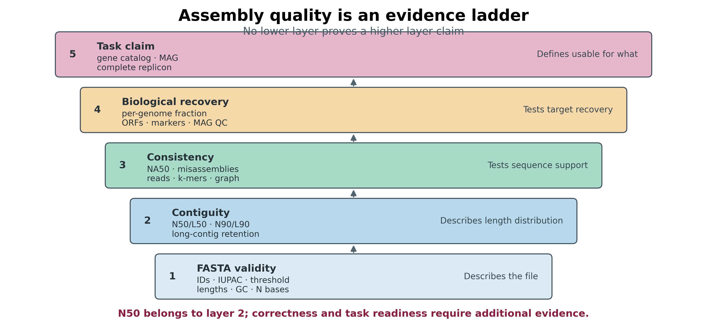
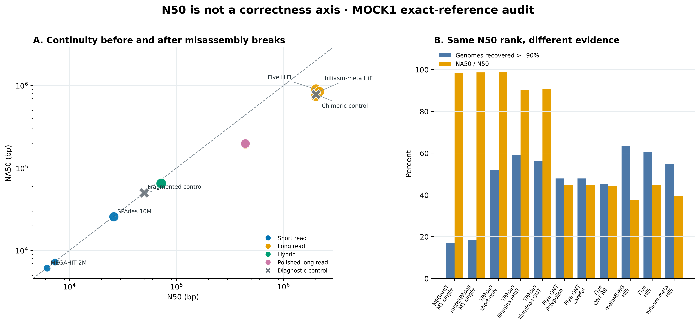
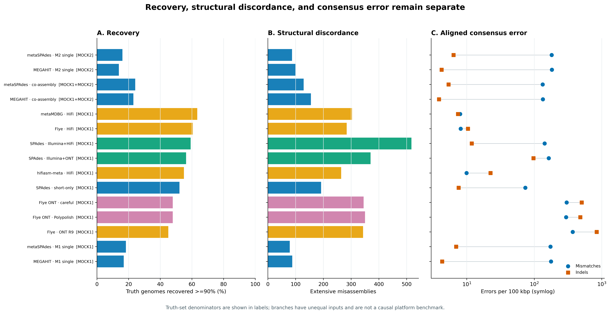
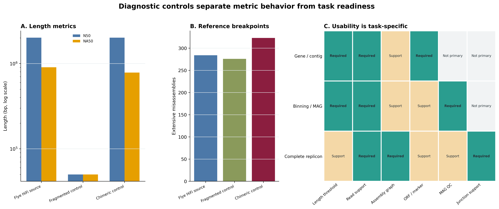

> **学习目标：**会读 QUAST/MetaQUAST 的 contig、N50/L50、NA50/LA50、genome fraction、duplication ratio、misassembly、mismatch/indel 与 unaligned 指标；能区分 reference-free 描述和 reference-aware correctness；能根据 gene-centric、binning/MAG 或完整 replicon 目标制定不同的可用性门槛。  
> **真实数据：**Meslier 等的 `PRJEB52977` 不均一 DNA mocks：MOCK1 含 71 strains，MOCK2 含 87 strains。输入是 15 个 checksum-identified assemblies：6 个短读 single/co、4 个长读、5 个 short/hybrid/polished 分支 [@meslier2022platforms]。  
> **结论边界：**这些 workflows 的 read budget、平台、组装器和 community composition 并不相同；它们用于展示指标如何改变决策，不构成平台或算法的单因素因果比较。两个由真实 HiFi assembly 派生的诊断正控只检验指标语义，不能参与生物学排名。

## 这一步对应论文里的哪张图 {#sec-target}

锚定结果是 Meslier 等的 **Table 3: Mock1 metaQUAST assembly report** 与 **Supplementary Table S2**。原研究在同一已知 mock references 下同时报告 contig 数、N50、genome fraction、misassembly、每 100 kb mismatch/indel 和接近完整基因组数，避免用一项 contiguity 指标替代正确性 [@meslier2022platforms]。本文沿用它的多参考评价思路，再把三个容易被忽略的问题拆开：统一 `>=1 kb` 报告门槛、N50 与 NA50 的差别，以及没有精确 reference 时还缺什么证据。

QUAST 同时支持无 reference 与有 reference 两种模式；MetaQUAST 再为多基因组混合物提供 combined-reference 和 per-reference 报告 [@gurevich2013quast; @mikheenko2016metaquast]。四张重绘图来自锁定的 QUAST 5.3.0 输出，不复制论文图。

{#fig-33-ladder}

::: {.callout-important title="先给结论：可用性必须带任务宾语"}
“这个 assembly 可用”不是完整结论。至少要补成“可用于 `>=1 kb` ORF catalog”“可进入 differential-coverage binning”“支持某个候选完整 replicon”，并为该任务列出仍需通过的 read、reference、gene、graph 或 MAG 证据。
:::

## 理论：N50、NA50 与 correctness 各回答什么 {#sec-theory}

### 1. N50/L50 是 assembly 自身的长度分布

把通过共同门槛的 contig 长度从大到小排列为 $l_1\ge l_2\ge\cdots\ge l_n$。当累计长度第一次达到 assembly 总长度的一半时：

$$
N50=l_j,\qquad
L50=j,\qquad
\sum_{i=1}^{j-1}l_i<0.5\sum_{i=1}^{n}l_i\le\sum_{i=1}^{j}l_i.
$$

N50 越大表示一半 assembly bases 集中在更长的 contigs；L50 越小表达同一件事的另一面。它们不读取 reference、reads、基因或 taxonomy，因此无法知道长 contig 是否拼错、是否重复、是否来自污染物，也无法知道未组装基因组有多少。

门槛是指标的一部分。`--min-contig 500` 与 `--min-contig 1000` 可能产生不同 total length、N50 和 GC；比较前必须统一过滤规则，Methods 也必须写出门槛。本文所有主指标固定为 `>=1,000 bp`，并另报 `>=10 kb`、`>=100 kb` retained bases。

### 2. NG50 需要 reference size；NA50 会在错误处打断 alignment blocks

**NG50** 的分母是 reference length，而不是 assembly length。若 assembly 覆盖不到 reference 的 50%，NG50 可以是未定义；这正是信息，不应改填 0 或 N50。

**NA50** 先把 contigs 在 extensive misassembly breakpoints 处切成 aligned blocks，再对 blocks 算 N50；**NGA50** 进一步用 reference length 作分母。于是：

- N50 高、NA50 也高：长 contig 在当前 reference/参数下大体保持长 alignment blocks；
- N50 高、NA50 大幅下降：continuity 被 reference-aware breakpoints 折损；
- N50 低、base error 低：可能只是 assembly 被打碎，不等于 consensus 不准；
- reference 不匹配：真实 structural variation 也可能被记成 misassembly。

QUAST 5.3.0 默认把相邻 flank 在 reference 上相距或重叠超过 1 kb、方向不一致、落到不同 chromosome，或在 MetaQUAST 中落到不同 reference genome 的 breakpoint 计入 extensive misassembly；这些语义依赖版本和参数，不能跨报告盲比。

### 3. genome fraction、duplication 与错误率不能互相替代

**Genome fraction** 是 reference 被至少一个 assembly alignment 覆盖的比例；它可以由多个碎片共同达到 99%，所以 `>=99%` 只是 operational recovery threshold，不证明单 contig、闭环、无错或无污染。

**Duplication ratio** 比较 aligned assembly bases 与 covered reference bases。大于 1 可能来自重叠 contigs、重复 haplotype/strain paths 或真正 duplication；小于或接近 1 也不能证明没有 collapse。

**Mismatches/indels per 100 kbp** 只在 aligned denominator 内计算。完全未对齐的 contigs 不会自动让这一错误率升高，因此必须同时看 unaligned length。相反，assembly 与近缘但非同一株 reference 的真实差异也会进入 mismatch/indel。

### 4. combined report 与 per-reference report 是两个层级

Combined-reference report 适合看整个 mock 的 assembled length、结构错误和总体错误率；per-reference report 才能回答低丰度 genome 是否恢复、哪个 genome 达到 `>=90%` 或 `>=99%`。MetaQUAST 可能不为完全未命中的 reference/branch 写物理列；标准化长表必须补出 `reference × branch` 的显式 0 recovery，错误率则因没有对齐分母保留 `NA`。

### 5. 没有 ground truth 时，QUAST 只能完成证据的一部分

自然群落通常没有完全匹配的 reference set。此时 reference-free contig/Nx/GC/N 统计仍有用，但 correctness 要由 reads 回帖、insert/coverage 异常、assembly graph、k-mer consistency、gene/marker recovery、MAG completeness/contamination/chimera 等正交证据补齐 [@olson2019assemblyvalidation]。让 MetaQUAST 自动找“近似 reference”可以辅助探索，但不能把物种内真实结构差异静默改名为 assembler error。

<details>
<summary>点开：两个确定性正控为什么能拆穿 N50 误读</summary>

诊断源是同一份真实 Flye HiFi assembly。

- **Fragmented control：**每 50,000 bp 固定切开，末段不足 1 kb 时并回前一段。全部 bases 保留，N50 明显下降；这检验“低 N50 是否必然意味着碱基更错”。
- **Chimeric control：**按 length-descending/name-ascending 固定选 20 条最长 eligible contigs，在每条中央取 100,000 bp block，并在 20 条 contigs 间循环置换。总 base multiset 与完整 contig-length multiset 不变，所以 N50 精确不变；reference adjacency 被主动破坏。

这不是模拟新的 community，也不进入 15 个 biological workflows 的 correlation 或排名。其唯一用途是对指标做阳性控制。

</details>

## 准备工作 {#sec-setup}

### 算力门槛

| 项目 | 本次统一评价 | 处理你自己的常规 assembly |
|---|---:|---:|
| CPU | 32 核 | 8–32 核；多个 assemblies/references 可受益于并行 |
| RAM | 建议 32–64 GB | reference-free 通常较低；多参考、大量 contigs 建议 64 GB 起 |
| 磁盘 | 冻结输入之外至少 40 GB | 预留 assemblies + references 的 3–5 倍；关闭不需要的 plots/Icarus |
| 耗时 | 以真实资源账本为准 | 从数分钟到数小时，取决于 contig 与 reference 数量 |

没有服务器时，先运行 reference-free QUAST；对已知 mock 只选 2–3 个 branches 检查命令。日常复核读取 checksum-locked 小表与图片，不重新对齐 245 个 reference evaluation units。自然样本不要为了“省算力”随便选一个近缘 reference 并把所有差异解释为错误。

<details>
<summary>点开：锁定环境、参考数据与内联出版主题</summary>

```bash
# QUAST/MetaQUAST 5.3.0、Python 3.10.20 与 bundled minimap2 均由 lock 固定
mamba create -n metagenome-hybrid-2026.07 \
  --file env/hybrid-assembly-linux-64.lock

conda run -n metagenome-hybrid-2026.07 quast.py --version
conda run -n metagenome-hybrid-2026.07 metaquast.py --version
```

```bash
# 只取官方 reference/code；assemblies 已在 checksum-locked frozen bundles
bash scripts/download_article33_qc_sources.sh . data/raw/article33
```

```{r}
install.packages(c("ggplot2", "dplyr", "readr", "scales", "patchwork"))

library(ggplot2)
library(dplyr)
library(readr)

set.seed(20260733)

pal_pub <- c(
  `Short read` = "#0072B2", `Long read` = "#E69F00",
  Hybrid = "#009E73", `Polished long read` = "#CC79A7",
  `Diagnostic control` = "#6C757D"
)
scale_color_pub <- function(...) scale_color_manual(values = pal_pub, ...)
scale_fill_pub  <- function(...) scale_fill_manual(values = pal_pub, ...)

theme_pub <- function(base_size = 12) {
  theme_bw(base_size = base_size) +
    theme(
      panel.grid.minor = element_blank(),
      panel.grid.major.x = element_blank(),
      axis.text = element_text(color = "black"),
      strip.background = element_rect(fill = "#EEF3F5", color = NA),
      legend.key = element_blank(),
      plot.title.position = "plot"
    )
}

save_pub <- function(plot, file_base, width = 180, height = 120,
                     units = "mm", dpi = 350) {
  ggsave(paste0(file_base, ".pdf"), plot, width = width, height = height,
         units = units, device = cairo_pdf)
  ggsave(paste0(file_base, ".png"), plot, width = width, height = height,
         units = units, dpi = dpi, bg = "white")
  ggsave(paste0(file_base, ".tiff"), plot, width = width, height = height,
         units = units, dpi = dpi, compression = "lzw", bg = "white")
  invisible(plot)
}
```

</details>

### 输入身份与比较分母

`input-lineage.tsv` 对每个 compressed FASTA 先核对上游 checksum manifest，再记录 canonical sequence hash。15 个 biological branches 分为三个独立 truth universes：

```bash
column -t -s $'\t' data/small/33-source-manifest.tsv
column -t -s $'\t' data/small/33-software-releases.tsv
```

| Evaluation set | Biological branches | Diagnostic controls | Truth genomes | 允许的比较 |
|---|---:|---:|---:|---|
| MOCK1 | 11 | 2 | 71 | 同一 71-genome denominator 下的描述性 workflow audit |
| MOCK2 | 2 | 0 | 87 | 两个 2M-pair single-sample short-read workflows |
| MOCK1+MOCK2 | 2 | 0 | 87 | 两个 4M-pair co-assembly workflows；union 等于 MOCK2 membership |

MOCK1 是 MOCK2 的严格子集。Co-assembly 的 abundance-bin 图用两份 mock 预期 DNA 百分比的算术均值描述输入难度；它不是实测 coverage，也不能与 single branch 的 abundance 直接合并建模。

## 可复制代码：从 FASTA 到 17 条统一 QC 记录 {#sec-code}

### 第 1 步：核对上游 bundle，不读取 FASTQ

```bash
cd /path/to/metagenomics-best-practices

for bundle in \
  data/small/30-short-read-assembly-frozen \
  data/small/31-long-read-assembly-frozen \
  data/small/32-hybrid-assembly-polishing-frozen; do
  (cd "$bundle" && sha256sum -c file-checksums.sha256)
done
```

输入准备器只选择 15 个非重复 biological FASTA。Flye ONT 与 Flye HiFi 在两个上游 bundle 中序列相同，只保留一份；随后生成两个 diagnostic controls，并证明其 base/length invariants。

```bash
PROJECT_ROOT="$PWD"
QC_ENV_PREFIX="$HOME/miniconda3/envs/metagenome-hybrid-2026.07"
BENCHMARK_REPO="data/raw/article33/benchmark_mock"
WORK="data/raw/article33/work"

"${QC_ENV_PREFIX}/bin/python" scripts/prepare_article33_qc_inputs.py \
  --project-root "$PROJECT_ROOT" \
  --benchmark-repo "$BENCHMARK_REPO" \
  --work-dir "$WORK"

column -t -s $'\t' "$WORK/summary/input-lineage.tsv" | head
```

### 第 2 步：先跑 reference-free QUAST

```bash
mapfile -t BRANCHES < <(
  "${QC_ENV_PREFIX}/bin/python" -c \
  'import csv,sys; print("\n".join(r["Branch"] for r in csv.DictReader(open(sys.argv[1]), delimiter="\t")))' \
  "$WORK/summary/input-lineage.tsv"
)

ASSEMBLIES=()
for branch in "${BRANCHES[@]}"; do
  ASSEMBLIES+=("$WORK/assemblies/${branch}.fasta")
done
LABELS="$(IFS=,; printf '%s' "${BRANCHES[*]}")"

"${QC_ENV_PREFIX}/bin/quast.py" \
  --threads 32 --min-contig 1000 \
  --no-icarus --no-plots --space-efficient --report-all-metrics \
  --labels "$LABELS" \
  "${ASSEMBLIES[@]}" \
  -o "$WORK/quast"
```

`--report-all-metrics` 让机器解析时行集合保持稳定；`--no-plots --no-icarus` 只关闭不进入出版物的内置图，不改变表格指标。保留 `report.tsv` 与 `transposed_report.tsv`，不要只截图 HTML。

### 第 3 步：按 truth universe 分三次运行 MetaQUAST

```bash
for EVAL_SET in MOCK1 MOCK2 'MOCK1+MOCK2'; do
  SAFE_SET="${EVAL_SET//+/_}"

  mapfile -t GROUP_BRANCHES < <(
    "${QC_ENV_PREFIX}/bin/python" -c \
    'import csv,sys; print("\n".join(r["Branch"] for r in csv.DictReader(open(sys.argv[1]), delimiter="\t") if r["EvaluationSet"] == sys.argv[2]))' \
    "$WORK/summary/input-lineage.tsv" "$EVAL_SET"
  )

  GROUP_ASSEMBLIES=()
  for branch in "${GROUP_BRANCHES[@]}"; do
    GROUP_ASSEMBLIES+=("$WORK/assemblies/${branch}.fasta")
  done
  GROUP_LABELS="$(IFS=,; printf '%s' "${GROUP_BRANCHES[*]}")"
  REFERENCE_CSV="$(find "$WORK/truth/references/$EVAL_SET" \
    -maxdepth 1 -type l -name '*.fna.gz' -print | sort | paste -sd, -)"

  "${QC_ENV_PREFIX}/bin/metaquast.py" \
    --min-alignment 500 --fragmented --min-identity 97 \
    --split-scaffolds --threads 32 --min-contig 1000 \
    --no-icarus --no-plots --space-efficient --report-all-metrics \
    -r "$REFERENCE_CSV" \
    "${GROUP_ASSEMBLIES[@]}" \
    --labels "$GROUP_LABELS" \
    -o "$WORK/metaquast/$SAFE_SET"
done
```

`--fragmented` 告诉 QUAST 某些 reference genomes 自身由多个 scaffolds 构成，避免把 reference fragment 边界全部当成 assembly error。`--split-scaffolds` 产生的 `*_broken` 列只进入 sensitivity 表，不能混成额外 biological branch。

### 第 4 步：展开所有 reference × branch 组合

```bash
"${QC_ENV_PREFIX}/bin/python" scripts/summarize_article33_assembly_qc.py \
  --work-dir "$WORK" \
  --output-dir "$WORK/summary"

column -t -s $'\t' "$WORK/summary/branch-metrics.tsv" | head
column -t -s $'\t' "$WORK/summary/diagnostic-control-effects.tsv"
```

汇总器要求 17 条 branch metrics 与 1,271 条 `reference × branch` 记录：`13×71 + 2×87 + 2×87`。物理 per-reference report 缺列时，recovery 明确补 0，mismatch/indel 留 `NA`。

### 第 5 步：完整运行、一次性固化与日常离线复核

服务器上的正式运行直接调用同一个封装入口；它用完成标记复用已成功的 QUAST/MetaQUAST 目录，并在每次重计算前删除 `.partial` 目录：

```bash
scripts/run_article33_assembly_qc.sh \
  --project-root "$PROJECT_ROOT" \
  --qc-prefix "$QC_ENV_PREFIX" \
  --benchmark-repo "$BENCHMARK_REPO" \
  --work-dir "$WORK" \
  --threads 32
```

完整运行通过后，只固化小表、报告、可移植日志、资源账本与脚本；原始 FASTQ、准备后的 assemblies 和完整 QUAST 工作目录不进入 Git。仓库已提供的 `data/small/33-assembly-qc-frozen` 不应被覆盖，因此从头复算时写入一个新的候选目录，验收后再由维护者替换版本：

```bash
FROZEN_CANDIDATE="data/small/33-assembly-qc-frozen-rebuilt"
test ! -e "$FROZEN_CANDIDATE"

"${QC_ENV_PREFIX}/bin/python" scripts/freeze_article33_assembly_qc.py \
  --project-root "$PROJECT_ROOT" \
  --env-prefix "$QC_ENV_PREFIX" \
  --benchmark-repo "$BENCHMARK_REPO" \
  --work-dir "$WORK" \
  --frozen-dir "$FROZEN_CANDIDATE"

PYTHONNOUSERSITE=1 PYTHONPATH= MPLCONFIGDIR=/tmp/article33-mpl \
  "${QC_ENV_PREFIX}/bin/python" scripts/validate_article33_assembly_qc.py \
  --project-root "$PROJECT_ROOT" \
  --env-prefix "$QC_ENV_PREFIX" \
  --frozen-dir data/small/33-assembly-qc-frozen \
  --output-dir results/33-assembly-qc \
  --figure-dir figures \
  --chapter chapters/33-assembly-qc.qmd
```

日常复核只需最后一条验证命令：它重新核对 45 个 payload checksums、15 个上游 compressed FASTA identities、锁定指标、正控不变量、正文合同和 12 个图文件，不重跑 MetaQUAST，也不访问网络。

### 真实结果

同一 71-genome MOCK1 denominator 下，N50 最大的是 hifiasm-meta HiFi（2,154,824 bp），但它不是 recovery 最大的分支：metaMDBG HiFi 的总体 genome fraction 为 72.573%，恢复 45/71 个 `>=90%` genomes；Flye HiFi 恢复 43/71，却有最多的 `>=99%` genomes（36/71）。三者分别回答“最长”“总体恢复最多”“接近完整成员最多”，不能合并为一个冠军。

| MOCK1 biological workflow | N50 (bp) | NA50 (bp) | Genome fraction (%) | Misassemblies | Mismatch / 100 kbp | Indel / 100 kbp | Genomes >=90% | Genomes >=99% |
|---|---:|---:|---:|---:|---:|---:|---:|---:|
| MEGAHIT · M1 single, 2M | 6,197 | 6,110 | 24.072 | 88 | 177.22 | 4.31 | 12 | 4 |
| metaSPAdes · M1 single, 2M | 7,353 | 7,255 | 25.350 | 79 | 173.77 | 6.94 | 13 | 5 |
| SPAdes · short-only, 10M | 26,020 | 25,703 | 59.717 | 192 | 73.69 | 7.58 | 37 | 12 |
| SPAdes · Illumina+ONT | 72,626 | 65,930 | 64.653 | 370 | 163.70 | 97.21 | 40 | 22 |
| SPAdes · Illumina+HiFi | 72,242 | 65,182 | 69.266 | 517 | 142.46 | 11.82 | 42 | 28 |
| Flye · ONT R9 | 441,240 | 194,794 | 51.572 | 343 | 370.94 | 839.52 | 32 | 24 |
| Flye ONT · Polypolish | 440,931 | 198,296 | 53.149 | 350 | 296.44 | 481.12 | 34 | 24 |
| Flye ONT · careful | 440,979 | 198,300 | 53.066 | 345 | 301.49 | 503.70 | 34 | 24 |
| Flye · HiFi | 2,013,697 | 903,979 | 70.125 | 284 | 8.11 | 10.42 | 43 | 36 |
| hifiasm-meta · HiFi | 2,154,824 | 847,090 | 68.678 | 264 | 9.93 | 22.47 | 39 | 28 |
| metaMDBG · HiFi | 2,007,072 | 749,991 | 72.573 | 303 | 7.98 | 7.40 | 45 | 33 |

这 11 条 workflows 的描述性 Spearman 相关也说明 N50 不是 correctness 代理：N50 与 NA50 的 $\rho=0.964$，但与 genome fraction、`>=90%` recovery 和 misassembly 的 $\rho$ 分别只有 0.609、0.560 和 0.227。输入预算和工具链同时变化，因此这些相关只描述当前 workflow set，不是平台因果效应。

MOCK2 single 与 co-assembly 使用 87-genome denominator。Co branches 的输入从单个 mock 的 2M pairs 增至两份 mock 合计 4M pairs，community composition 也随之改变；只能把它们读作工作流结果。

| Short-read workflow | Evaluation set | N50 (bp) | Genome fraction (%) | Misassemblies | Genomes >=90% | Genomes >=99% |
|---|---|---:|---:|---:|---:|---:|
| MEGAHIT · M2 single | MOCK2 | 5,906 | 19.275 | 100 | 12/87 | 4/87 |
| metaSPAdes · M2 single | MOCK2 | 6,781 | 20.286 | 87 | 14/87 | 5/87 |
| MEGAHIT · co-assembly | MOCK1+MOCK2 | 15,928 | 29.523 | 155 | 20/87 | 6/87 |
| metaSPAdes · co-assembly | MOCK1+MOCK2 | 17,124 | 30.953 | 129 | 21/87 | 5/87 |

两个正控提供了更直接的反例。Fragmentation 把 N50 从 2,013,697 bp 降到 50,000 bp，却保留全部 169,457,769 bases、43 个 `>=90%` 和 36 个 `>=99%` genomes；总体 genome fraction 仍为 70.129%。Chimeric rotation 让 N50/L50 精确保持 2,013,697 bp/22，genome fraction 与 mismatch/indel 也几乎不动，但 misassemblies 从 284 增到 323，NA50 从 903,979 bp 降到 783,687 bp（−13.3%）。这正是“同一个 N50，可以更错”的确定性证据。

| Evaluation step | Wall time | Peak RAM |
|---|---:|---:|
| Reference-free QUAST, 17 branches | 2:22 | 1.46 GiB |
| MetaQUAST, MOCK1 | 9:47 | 2.03 GiB |
| MetaQUAST, MOCK2 | 3:09 | 2.29 GiB |
| MetaQUAST, MOCK1+MOCK2 | 3:26 | 2.36 GiB |

四次评价合计 18:45，Article 33 工作目录最终约 2.8 GB；这个数字不含三个上游 frozen assembly bundles。三次 MetaQUAST 均为 0 warning、0 non-fatal error。

{#fig-33-n50-na50}

{#fig-33-tradeoff}

## 审计与升级：从“跑出 QUAST”到可投稿证据 {#sec-audit}

### 1. 忠实保留原研究的多参考逻辑

原研究用 MetaQUAST 4.6.3、`--min-alignment 500 --fragmented --min-identity 97 --split-scaffolds` 评价 MOCK1，并在 Table 3 同时展示 contiguity、recovery、misassembly 与 consensus error [@meslier2022platforms]。当前重算升级到 QUAST/MetaQUAST 5.3.0，但保留这些核心语义；所有版本、bundled aligner 与参数写进 Methods。

### 2. 统一 1 kb threshold，并把 500 bp 差异公开

论文原命令使用 500 bp；这里的 15 个冻结 assemblies 已在 1 kb 共同门槛标准化。这样可避免某个分支保留更多 500–999 bp contigs 而改变分母，也与后续 gene/contig 工作流衔接。它不是“1 kb 为普适优质 contig”的声明；`length-threshold-sensitivity.tsv` 另存 10 kb/100 kb retained bases。

### 3. 不以一个 nearby reference 宣判自然样本

Known mock 可以把 exact source genomes 当 truth。临床或环境样本常只有 same-species/nearby strain reference；此时 translocation、inversion 和 mismatch 可能是生物差异。升级方案是：

1. reference-free QUAST 固定 FASTA/长度/N 指标；
2. reads 回帖检查 coverage drop、discordant pairs、soft clips 与 k-mer consistency；
3. 用 assembly graph 核对争议 junction；
4. 根据目标报告 ORF/marker、bin/MAG、virus/plasmid 或 complete-replicon 证据；
5. 若用 reference，明确 exact、same-strain、same-species 还是 distant，并做多 reference sensitivity。

### 4. 用 diagnostic controls 验证指标，而不是为图制造效果

Fragmented control 保留全部 bases，却主动降低 N50；chimeric block-rotation control 保留总 bases 与完整 length multiset，使 N50 不变，却破坏 reference adjacency。只有在这些预期方向通过时，才说明解析器与图真正区分了 continuity 和 correctness。

### 5. 任务门槛必须预注册

| Target | 最低起点 | 不能省略的升级证据 | 禁止的捷径 |
|---|---|---|---|
| Gene / contig-centric | 明确 contig threshold；检查 partial ORFs | read support、ORF yield、annotation coverage、短 contig sensitivity | 只因 N50 高就认为 gene catalog 更完整 |
| Binning / MAG | 与分箱器一致的最短 contig；coverage matrix | differential coverage、composition、CheckM2、GUNC、graph/人工检查 | 把 assembly N50 当 MAG completeness |
| Complete replicon | 候选 contig span 与 topology | junction-spanning reads、均匀 coverage、无冲突 graph、base polishing、taxonomy | `circular=true` 或 genome fraction 99% 就称 complete |

{#fig-33-gates}

## 出版级美化：让读者一眼看出“长”和“对”不是同一轴 {#sec-polish}

### 1. N50 与 NA50 用同一 log scale，不画双轴

N50/NA50 跨 3 个数量级，用相同的 log10 axes 和 `y=x` 参照线。点的颜色表示 workflow family，形状区分 biological/diagnostic；点大小承载 genome fraction。不要用双 y 轴把 recovery 与 N50 强行叠在一起。

### 2. 错误率和 recovery 分面，不组成总分

Genome fraction 越高越好，misassembly/mismatch/indel 越低越好，方向不同且量纲不同。主图使用分面或并列 panel，保留原单位；不做未经验证的加权“assembly quality score”。

### 3. 所有图内标签固定英文

图内只使用 `N50 (bp)`、`NA50 (bp)`、`Genome fraction (%)`、`Misassemblies`、`Mismatches per 100 kbp`、`Indels per 100 kbp`、`Biological workflow`、`Diagnostic control` 等英文。分支名缩短用于作图，完整工具/版本/输入预算保留在表格与 Methods。

### 4. 同时导出 PDF、PNG 与 TIFF

四张图固定白底、colorblind-safe palette、300 dpi 以上；PDF 用于矢量排版，PNG 用于网页，LZW TIFF 用于投稿。图片验收同时检查尺寸、DPI、RGB/RGBA、英文字符与边界裁切。

## 常见坑：审稿人会从哪里攻击 {#sec-pitfalls}

::: {.callout-caution title="坑 1：按 N50 选冠军"}
错误拼接可以抬高 N50；真实低丰度碎片可以拉低 N50。至少同时给 NA50、misassembly、genome fraction、unaligned length 与 aligned consensus error。
:::

::: {.callout-caution title="坑 2：不同 min-contig 门槛直接横比"}
500 bp、1 kb、1.5 kb 或 2.5 kb 会改变 contig 数、total length、N50、GC 和 downstream ORFs。统一主门槛，另做 sensitivity，并在 Methods 写清过滤发生在 QUAST 前还是由 `--min-contig` 完成。
:::

::: {.callout-caution title="坑 3：把 99% genome fraction 写成完整闭环基因组"}
99% 可以由多个 contigs、重复 alignments 或含错误的序列共同达到。完整 replicon 还需单一 span、末端/junction 证据、coverage、graph 与 consensus 审计。
:::

::: {.callout-caution title="坑 4：只报 combined reference"}
总体 genome fraction 会被高丰度 genomes 主导。必须保留每个 reference 的 recovery，尤其单列 `<0.1%`、`0.1–<1%` 与 `>=1%` 难度层。
:::

::: {.callout-caution title="坑 5：把未对齐序列排除在错误叙事之外"}
Mismatch/indel rate 只对 aligned bases 有分母。一个分支可以 aligned error 很低，却留下大量 fully unaligned contigs；同时报告 unaligned contigs/length 与 reference suitability。
:::

::: {.callout-caution title="坑 6：用近缘 reference 把真实 SV 当错误"}
Reference-aware misassembly 是“与当前 reference/参数不一致”，只有 exact truth 才接近 assembler correctness。自然样本必须说明 reference 距离，并用 reads 与 graph 辅助判定。
:::

::: {.callout-caution title="坑 7：把 co-assembly 的额外 community 当 contamination"}
若只给 MOCK1 references，MOCK1+MOCK2 co-assembly 中合法的 MOCK2-only contigs 会变成 unaligned。本文用 87-genome union 评价 co branches，并始终显示 denominator。
:::

## 这段 Methods 怎么写 {#sec-methods}

> Fifteen checksum-identified biological metagenome assemblies derived from the uneven PRJEB52977 MOCK1 and MOCK2 DNA communities were evaluated. The input set comprised six short-read single/co-assemblies, four long-read assemblies, and five non-duplicated short-read, hybrid, or polished assemblies. Compressed FASTA SHA-256 values were verified against their frozen source-bundle manifests before decompression. All primary statistics used contigs >=1,000 bp. Two prespecified diagnostic transformations of the real Flye HiFi assembly were evaluated separately and excluded from biological workflow comparisons: deterministic fragmentation at 50,000 bp and rotation of one central 100,000-bp block among the 20 longest eligible contigs (seed namespace 20260733). The latter preserved the complete contig-length and base multisets.
>
> Reference-free metrics were computed with QUAST 5.3.0. Reference-aware evaluation used MetaQUAST 5.3.0 and its bundled minimap2 2.28-r1209 with `--min-alignment 500`, `--min-identity 97`, `--fragmented`, `--split-scaffolds`, `--min-contig 1000`, `--report-all-metrics`, and 32 threads. MOCK1 assemblies were evaluated against 71 exact source genomes; MOCK2 single assemblies and MOCK1+MOCK2 co-assemblies were evaluated against 87 exact source genomes. MOCK1 membership was verified as a strict subset of MOCK2, and per-genome reference sequence multisets were required to equal the official combined FASTA files from benchmark repository commit a429a3724d4593f35b8d7323b20252a6be90e1cd. Primary summaries retained original assembly labels; scaffold-split columns were reported only as sensitivity analyses. Missing reference-by-assembly report entries were encoded as zero genome recovery, while mismatch and indel rates remained missing when no aligned denominator existed. Genome recovery thresholds of >=90% and >=99% were operational reporting criteria and were not interpreted as proof of complete, closed, or error-free replicons. N50, NA50, genome fraction, duplication ratio, misassemblies, unaligned sequence, mismatches, and indels were reported separately; no composite score or universal usability threshold was applied.

请把方括号内容替换为你的 cohort、样本、assembler、read budget、contig threshold、reference provenance、QUAST 版本、线程和任务门槛。若没有 exact truth，删去“correctness”措辞，改写为 reference-free/read-supported validation，并报告 reference 与样本的关系。

## 换成你自己的数据怎么做 {#sec-own-data}

### 1. 先写目标，再选门槛

```text
Primary target: gene catalog | binning/MAG | complete replicon | virus/plasmid
Assembly unit: per sample | biologically matched co-assembly
Minimum contig for QC: ____ bp
Minimum contig for downstream tool: ____ bp
Exact truth available: yes | no
Read evidence retained: paired short | ONT | HiFi | none
Reference relationship: exact | same strain | same species | distant | none
```

### 2. 建立 assembly manifest

```tsv
SampleID	Assembly	Assembler	Version	InputReads	MinContigBp	SHA256
S01	assemblies/S01.fasta	MEGAHIT	1.2.9	clean/S01_R1.fastq.gz;clean/S01_R2.fastq.gz	1000	...
```

不要从目录 glob 推断 label 顺序；FASTA 与 `--labels` 用同一 manifest 生成。记录组装前后的过滤门槛，避免把 assembler native output 与二次过滤混为一谈。

### 3. 没有 exact truth 的最小证据包

- QUAST reference-free：contigs、total length、largest、N50/L50、N90/L90、GC、N、length-threshold sensitivity；
- Reads：mapped fraction、proper/discordant、coverage distribution、zero-coverage regions、soft clips 或 k-mer consistency；
- Graph：争议 junction、repeat/strain bubbles、circular junction；
- Gene/MAG：与主要目标匹配的 ORF/marker recovery，或 CheckM2 + GUNC + contig/coverage/graph 记录；
- Provenance：FASTA SHA-256、assembler/版本、参数、数据库/reference release、资源账本。

### 4. 何时停止继续“优化 N50”

若 N50 上升但 NA50、read consistency、gene recovery 或 MAG quality 不升反降，应停止把 graph simplification 调得更激进。最终选择应服务预注册的 downstream target，并保留至少一个替代 assembly 作为敏感性分析，而不是不断调参直到某一项指标最好看。

## 参考 {#sec-references}

- Meslier 等的真实 mock、Table 3、Supplementary Table S2 与公开 accession：[@meslier2022platforms]
- QUAST 的 assembly 评价框架：[@gurevich2013quast]
- MetaQUAST 的多参考宏基因组评价：[@mikheenko2016metaquast]
- 无精确真值时的 metagenome assembly validation 证据框架：[@olson2019assemblyvalidation]
- QUAST 5.3.0 manual：<https://quast.sourceforge.net/docs/manual.html>
- Author benchmark repository（commit `a429a3724d4593f35b8d7323b20252a6be90e1cd`）：<https://forgemia.inra.fr/metagenopolis/benchmark_mock>
