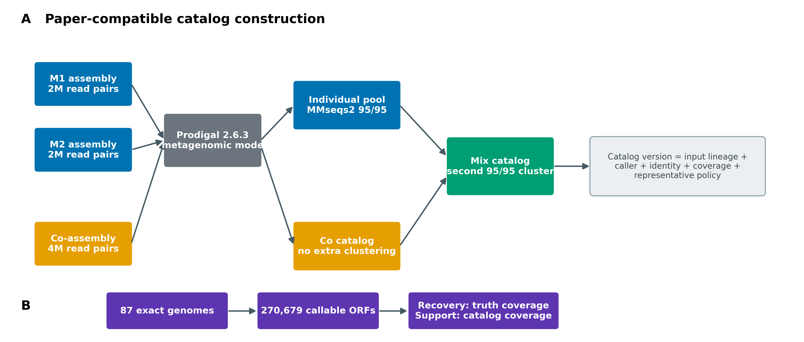
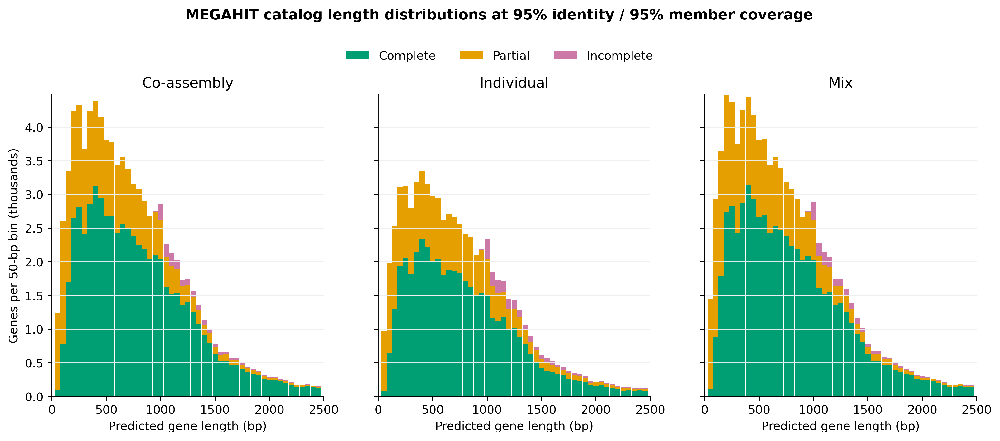
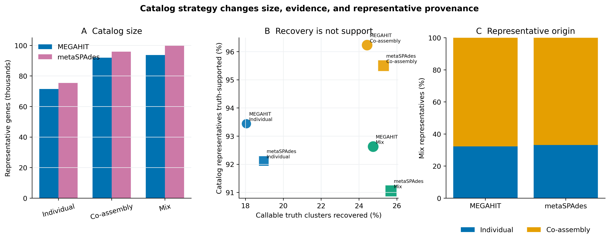
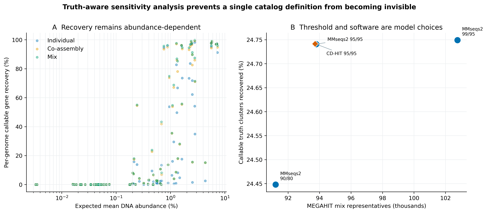

> **学习目标：**从组装 contigs 预测蛋白编码基因，建立可追溯的 individual、co-assembly 与 mix 非冗余基因目录；准确解释 amino-acid identity、member coverage、代表序列和 Prodigal partial code；用精确参考基因组区分“真值恢复率”与“目录序列有真值支持的比例”。  
> **真实数据：**Meslier 等公开的 `PRJEB52977` 不均一 DNA mocks。每个组装器都有 MOCK1、MOCK2 两个约 2M read-pair 单样本 assembly，以及同样约 4M pairs 总预算的联合 assembly；共 96,275 条 `>=1 kb` contigs、398,103,372 bp [@meslier2022platforms]。  
> **结论边界：**这是一套受控的双样本技术 mock 重构，用于验证目录定义与审计方法。它不是 Delgado 与 Andersson 124 个 Baltic Sea 样本、数千万基因结果的数值复现，也不能据此宣布某种 assembly strategy 在自然群落中普遍最优。

## 这一步对应论文里的哪张图 {#sec-target}

锚定论文是 Delgado 与 Andersson 对三种宏基因组基因目录策略的比较 [@delgado2022assembly]：

- **Fig. 1** 比较 co-assembly、individual assembly 和 mix assembly 的基因长度分布；
- **Table 1** 同时报总碱基、非冗余基因数，以及 complete、partial、incomplete 三类 Prodigal 预测；
- **Fig. 5** 追踪 mix 目录中代表基因来自 individual 还是 co-assembly。

论文以 124 个 Baltic Sea 样本构建目录，报告约 50 M individual、45 M co-assembly 和 67 M mix genes；mix 在该数据集里最大。论文的主要逻辑不是“多拼一次就一定更好”，而是 individual assembly 可能避开跨样本 strain variation，co-assembly 可能救回单样本覆盖不足的基因，最后再合并两类信息。

本文按论文的 Prodigal 2.6.3 metagenomic mode 和 MMseqs2 9.d36de 两阶段聚类定义重建小规模实验，同时增加精确真值、阈值敏感性和软件敏感性。下图是流程重绘，不复制论文图片。

{#fig-34-workflow}

::: {.callout-important title="先给结论：目录版本必须包含定义，不能只有一个 FASTA"}
至少同时锁定输入 assembly checksums、ORF caller/模式、蛋白或核酸层级、identity、coverage 的方向、聚类模式、代表序列政策、两阶段展开关系和输出 FASTA checksum。`catalog.faa` 这个名字不足以让结果可比较。
:::

## 理论：从 contig 到“非冗余基因”究竟发生了什么 {#sec-theory}

### 1. Prodigal 预测的是 ORF，不是真实基因的最终证明

Prodigal 的 `-p meta` 使用面向匿名宏基因组片段的模型，在每条 contig 上预测 coding sequence（CDS）和翻译蛋白 [@hyatt2010prodigal]。输出 header 中的 `partial` 两位码非常重要：

| Prodigal code | 本文标签 | 含义 |
|---|---|---|
| `00` | Complete | 同时预测到起始与终止边界 |
| `01` / `10` | Partial | 一端越过 contig 边界或边界未确定 |
| `11` | Incomplete | 两端均未确定 |

“Complete”只表示调用器找到两个边界，不代表蛋白功能正确、没有 frameshift，也不代表其来源 contig 没有误拼。短 contig 更容易产生 partial ORF；若在聚类前全部删掉 partial genes，会系统性改变低丰度成员和不同 assembly strategy 的可见部分。

### 2. 95% identity 与 95% coverage 是两个条件

两个蛋白进入同一 cluster，至少要同时满足：

$$
I=\frac{\text{aligned identical residues}}{\text{alignment denominator}}\ge0.95,
$$

以及 MMseqs2 `--cov-mode 1` 下的 member/target coverage：

$$
C_{member}=\frac{\text{aligned residues}}{\text{target member length}}\ge0.95.
$$

这里 query 是候选 representative，target 是待吸收的 member。允许一个较长 representative 覆盖较短、可能 partial 的 member，但要求 member 的 95% 被覆盖；它不等于双向 95% 全长覆盖。参数写成“95% identity”而省略 coverage 方向，会让别人无法重建同一目录。

### 3. `--cluster-mode 2` 选择较长种子，不生成 consensus

MMseqs2 的 greedy incremental clustering 按长度组织候选，并以较长序列作为 cluster seed [@steinegger2017mmseqs2]。最终 representative 是输入中的一条真实预测序列，不是对 cluster members 做多序列比对后生成的 consensus。较长代表通常有利于减少片段成为代表，但也可能优先保留异常延长、错误融合或错误起始位点，因此必须保留 cluster membership 和代表来源。

### 4. 三种 strategy 的分母不同

设两个单样本 ORF 集合为 $G_1,G_2$，联合组装 ORF 为 $G_c$，聚类操作为 $K(\cdot)$：

$$
G_{individual}=K(G_1\cup G_2),
$$

$$
G_{co}=G_c,
$$

$$
G_{mix}=K(G_{individual}\cup G_c).
$$

这里 co 目录直接使用 co-assembly 的 Prodigal genes，因为同一联合 assembly 中不会因“样本重复”再产生一份相同 contig；这不代表 co genes 在生物学上完全无冗余。Mix 不是把三份 raw ORFs 一次聚类：论文先压缩 individual genes，再把第一阶段 representatives 与 co genes 聚类。若丢掉第一阶段 membership，就无法把 mix cluster 展开回原始 216,191 个 MEGAHIT ORFs。

### 5. Recovery 与 support 的分母相反

本文先在 87 个 exact MOCK2 source genomes 上逐基因组运行 Prodigal 2.6.3，再按同一 95%/95% 规则得到 260,868 个 callable truth clusters。随后做两次 catalog-to-truth 搜索：

$$
\text{Truth recovery}=\frac{\#\text{truth clusters hit at target coverage}\ge95\%}{260{,}868},
$$

$$
\text{Catalog support}=\frac{\#\text{catalog representatives hit at query coverage}\ge95\%}{\#\text{catalog representatives}}.
$$

前者问“精确参考中的 callable gene space 找回多少”，后者问“目录里的代表序列有多少能被精确参考支持”。目录可以 recovery 更高、同时 support 更低，因为它增加了参考外序列、装配/调用误差或未被当前 truth 定义覆盖的真实变异。二者不能相减组成“净得分”。

<details>
<summary>点开：为什么真值也叫 callable truth，而不是全部真实生物学基因</summary>

精确基因组能提供来源明确的 DNA 序列，但本文 denominator 仍由同一版本 Prodigal `-p meta` 生成。它只衡量“在当前 prokaryotic caller 定义下可被调用和聚类的 ORFs”，不会发现 caller 系统性漏掉的基因，也不评价真核基因、非编码 RNA、移码基因或 alternative start。对自然群落，目录中没有 exact-genome hit 的序列也不能直接叫 false positive。

</details>

## 准备工作 {#sec-setup}

### 算力门槛

| 项目 | 本次受控重算 | 真实 cohort 建议 |
|---|---:|---:|
| CPU | 16 核 | 16–64 核；按样本并行 Prodigal，控制并发总线程 |
| RAM | 建议 32 GB | 与总蛋白 residues、MMseqs2 sensitivity 和并发数相关；大型目录常需 64–256 GB |
| 磁盘 | frozen inputs 之外预留 12 GB | 至少预留输入 FASTA/FAA 的 5–10 倍；数千万蛋白常需数百 GB |
| 耗时 | 资源账本见下文 | 从几十分钟到数天；不要在登录节点运行 |

没有服务器时，直接读取 `data/small/34-nonredundant-gene-catalog-frozen/`：其中包含 93,782 条 MEGAHIT mix representative proteins/nucleotides、展开后的 membership、汇总表、日志和精确环境锁。若只练命令，可从一个 assembly 截取少量 contigs，但不能把子集数值解释成完整目录结论。

<details>
<summary>点开：锁定环境、公开来源与内联出版主题</summary>

```bash
# exact explicit lock；不要让 solver 静默换成新版 MMseqs2
mamba create -n metagenome-gene-catalog-2026.07 \
  --file env/gene-catalog-linux-64.lock

GC_ENV_PREFIX="$HOME/miniconda3/envs/metagenome-gene-catalog-2026.07"
"${GC_ENV_PREFIX}/bin/prodigal" -v
"${GC_ENV_PREFIX}/bin/mmseqs" version
"${GC_ENV_PREFIX}/bin/cd-hit" -h | head
```

```bash
# 下载/核对论文 XML、benchmark commit 与 exact references；支持断点重试
bash scripts/download_article34_gene_catalog_sources.sh . data/raw/article34
```

```{r}
install.packages(c("ggplot2", "dplyr", "readr", "scales", "patchwork"))

library(ggplot2)
library(dplyr)
library(readr)

set.seed(20260734)

pal_pub <- c(
  Individual = "#0072B2", `Co-assembly` = "#E69F00", Mix = "#009E73",
  Complete = "#009E73", Partial = "#E69F00", Incomplete = "#CC79A7",
  MMseqs2 = "#0072B2", `CD-HIT` = "#D55E00"
)
scale_color_pub <- function(...) scale_color_manual(values = pal_pub, ...)
scale_fill_pub  <- function(...) scale_fill_manual(values = pal_pub, ...)

theme_pub <- function(base_size = 12) {
  theme_bw(base_size = base_size) +
    theme(
      panel.grid.minor = element_blank(),
      panel.grid.major.x = element_blank(),
      axis.text = element_text(color = "black"),
      strip.background = element_rect(fill = "#EEF3F5", color = NA),
      legend.key = element_blank(),
      plot.title.position = "plot"
    )
}

save_pub <- function(plot, file_base, width = 180, height = 120,
                     units = "mm", dpi = 350) {
  ggsave(paste0(file_base, ".pdf"), plot, width = width, height = height,
         units = units, device = cairo_pdf)
  ggsave(paste0(file_base, ".png"), plot, width = width, height = height,
         units = units, dpi = dpi, bg = "white")
  ggsave(paste0(file_base, ".tiff"), plot, width = width, height = height,
         units = units, dpi = dpi, compression = "lzw", bg = "white")
  invisible(plot)
}
```

</details>

### 输入身份、预算与 truth universe

两种组装器都使用同一实验设计。单样本路线分别处理 MOCK1 和 MOCK2，各约 2M clean pairs；联合路线处理两者合计约 4M pairs。这样 individual 与 co 在每个组装器内有相同的总 read budget，但 strain composition 和 graph construction 仍然不同。

| Assembler | Individual inputs | Co-assembly input | Contigs | Assembly bases |
|---|---|---|---:|---:|
| MEGAHIT 1.2.9 | MOCK1 + MOCK2, separate | MOCK1+MOCK2 | 47,959 | 194,751,061 |
| metaSPAdes 4.3.0 | MOCK1 + MOCK2, separate | MOCK1+MOCK2 | 48,316 | 203,352,311 |

`input-lineage.tsv` 记录六个 compressed source FASTA 的 SHA-256、上游 manifest、标准化 FASTA hash、contig 数、bases 与 read pairs。MOCK1 的 71 个 genomes 经 workbook、作者列表和 FASTA sequence multiset 三方验证为 MOCK2 87 genomes 的严格子集；truth 总计 399 条 reference sequences、292,802,018 bp。

## 可复制代码：从六套 assemblies 到九个受审计目录 {#sec-code}

### 第 1 步：准备输入并核对来源

```bash
cd /path/to/metagenomics-best-practices

PROJECT_ROOT="$PWD"
GC_ENV_PREFIX="$HOME/miniconda3/envs/metagenome-gene-catalog-2026.07"
WORK="data/raw/article34/work"
BENCHMARK_REPO="data/raw/article34/benchmark_mock"

"${GC_ENV_PREFIX}/bin/python" scripts/prepare_article34_gene_catalog_inputs.py \
  --project-root "$PROJECT_ROOT" \
  --benchmark-repo "$BENCHMARK_REPO" \
  --work-dir "$WORK"

column -t -s $'\t' "$WORK/summary/input-lineage.tsv"
```

准备器先执行 Article 30 bundle 的 `file-checksums.sha256`，再为 contig ID 加上 assembler/sample namespace，防止合池后 ID 冲突。精确参考不是按模糊文件名拼接，而是由 Supplementary Table S1 accession 映射到锁定 commit 中的 87 份 GenBank assemblies。

### 第 2 步：逐 assembly 预测 ORFs

```bash
for branch in \
  megahit-m1 megahit-m2 megahit-co \
  metaspades-m1 metaspades-m2 metaspades-co; do
  "${GC_ENV_PREFIX}/bin/prodigal" \
    -i "$WORK/assemblies/${branch}.fna" \
    -a "$WORK/genes/${branch}.faa" \
    -d "$WORK/genes/${branch}.fna" \
    -o "$WORK/genes/${branch}.gff" \
    -f gff -p meta -q
done
```

蛋白 FASTA 用于聚类，核酸 FASTA 用于后续 reads 回比和功能/丰度工作流，GFF 保留坐标、方向与 parent contig。三者的首字段 gene ID 必须一一对应。

同样的命令要对 87 个 truth genomes **分别**运行，再按 accession 排序合并。不要把 87 个独立复制子直接拼成一条匿名 mega-contig；否则跨基因组边界和 training behavior 会改变调用结果。

```bash
head -n 8 data/small/34-nonredundant-gene-catalog-frozen/gene-prediction-summary.tsv
head -n 12 data/small/34-nonredundant-gene-catalog-frozen/catalog/megahit-mix-primary.head.faa
```

六套 assemblies 共预测 441,407 条 ORFs。87 个 exact genomes 共预测 270,679 条 callable ORFs；其中 270,314 条为 `partial=00`，325 条为单端 partial，40 条为双端 incomplete。

### 第 3 步：运行论文兼容的 MMseqs2 聚类

MMseqs2 9.d36de 的低层命令明确展示 DB、cluster membership 和 representative FASTA；这比只保留一条 `easy-cluster` 命令更容易审计旧版结果。

```bash
MMSEQS="${GC_ENV_PREFIX}/bin/mmseqs"
INPUT="$WORK/pools/megahit/individual.raw.faa"
OUT="$WORK/catalogs/megahit/individual-primary"
mkdir -p "$OUT/tmp"

"$MMSEQS" createdb "$INPUT" "$OUT/sequenceDB"
"$MMSEQS" cluster \
  "$OUT/sequenceDB" "$OUT/clusterDB" "$OUT/tmp" \
  --min-seq-id 0.95 \
  -c 0.95 \
  --cov-mode 1 \
  --cluster-mode 2 \
  --alignment-mode 3 \
  --threads 16

"$MMSEQS" createtsv \
  "$OUT/sequenceDB" "$OUT/sequenceDB" "$OUT/clusterDB" \
  "$OUT/membership.tsv"

# 旧版 MMseqs2 的 sequence/header DB 分开；两者都要建立 representative sub-DB
"$MMSEQS" createsubdb \
  "$OUT/clusterDB" "$OUT/sequenceDB" "$OUT/representativeDB"
"$MMSEQS" createsubdb \
  "$OUT/clusterDB" "$OUT/sequenceDB_h" "$OUT/representativeDB_h"
"$MMSEQS" convert2fasta \
  "$OUT/representativeDB" "$OUT/representatives.faa"
```

`--alignment-mode 3` 固定旧版的精确序列一致性计算语义；若迁移到新版 MMseqs2，先用同一输入比较 cluster 数、representative intersection 和 co-cluster pairs，再决定是否更新目录版本。

### 第 4 步：按两阶段规则建立 mix

```bash
# Stage 1: 两个 individual assemblies 的 raw proteins 已聚类
cat \
  "$WORK/catalogs/megahit/individual-primary/representatives.faa" \
  "$WORK/genes/megahit-co.faa" \
  > "$WORK/pools/megahit/mix-stage2-primary.faa"

# Stage 2: 对 individual representatives + 所有 co genes 再跑同一 95/95 聚类
# 命令与上一步相同，输出到 catalogs/megahit/mix-primary/
```

MEGAHIT 第一阶段把 124,206 个 individual ORFs 压缩为 71,520 个 representatives；它们与 91,985 个 co-assembly ORFs 合成 163,505 条第二阶段输入，最终得到 93,782 个 mix representatives。展开第一阶段 membership 后，主目录覆盖的 raw universe 是 216,191 条 ORFs，而不是 163,505。

### 第 5 步：用双向 coverage 定义审计

```bash
CATALOG_DB="$WORK/truth-audit/megahit-mix-primary/catalogDB"
TRUTH_DB="$WORK/truth/nonredundant-primary/sequenceDB"
AUDIT="$WORK/truth-audit/megahit-mix-primary"

"$MMSEQS" createdb \
  "$WORK/catalogs/megahit/mix-primary/representatives.faa" \
  "$CATALOG_DB"

# Recovery: 要求 truth target/member 的 95% 被 catalog query 覆盖
"$MMSEQS" search "$CATALOG_DB" "$TRUTH_DB" \
  "$AUDIT/catalog-to-truth-recoveryDB" "$AUDIT/tmp-recovery" \
  --min-seq-id 0.95 -c 0.95 --cov-mode 1 \
  --alignment-mode 3 --max-seqs 100 --threads 16

# Support: 要求 catalog query 的 95% 被 truth target 覆盖
"$MMSEQS" search "$CATALOG_DB" "$TRUTH_DB" \
  "$AUDIT/catalog-to-truth-supportDB" "$AUDIT/tmp-support" \
  --min-seq-id 0.95 -c 0.95 --cov-mode 2 \
  --alignment-mode 3 --max-seqs 100 --threads 16
```

两次搜索的 query/target 不变，只改变 coverage denominator。`--max-seqs 100` 防止重复家族只留下任意一条 target；汇总时对 truth gene、truth cluster 与 catalog representative 分别去重。

### 第 6 步：完整运行、汇总、固化与离线复核

```bash
"${GC_ENV_PREFIX}/bin/python" scripts/run_article34_gene_catalog.py \
  --project-root "$PROJECT_ROOT" \
  --env-prefix "$GC_ENV_PREFIX" \
  --work-dir "$WORK" \
  --threads 16

"${GC_ENV_PREFIX}/bin/python" scripts/summarize_article34_gene_catalog.py \
  --work-dir "$WORK"

FROZEN_CANDIDATE="data/small/34-nonredundant-gene-catalog-frozen-rebuilt"
test ! -e "$FROZEN_CANDIDATE"
"${GC_ENV_PREFIX}/bin/python" scripts/freeze_article34_gene_catalog.py \
  --project-root "$PROJECT_ROOT" \
  --work-dir "$WORK" \
  --benchmark-repo "$BENCHMARK_REPO" \
  --paper-xml data/raw/article34/PMC9074274.fullTextXML \
  --output-dir "$FROZEN_CANDIDATE"

PYTHONNOUSERSITE=1 PYTHONPATH= \
  python3 scripts/validate_article34_gene_catalog.py \
  --project-root "$PROJECT_ROOT"
```

运行器为每一步保存 command、输入 checksum、输出 checksum、GNU time 和完成标记；失败重启只复用合同完全相同且输出非空的步骤。日常 QA 只核对 frozen bundle、重算表内不变量并生成四张图，不重跑 Prodigal/MMseqs2，也不访问网络。

### 真实结果

六个 primary catalogs 使用相同 ORF caller 和策略定义。Co-assembly 列是直接 Prodigal yield；Individual 与 Mix 列是 MMseqs2 95% amino-acid identity、95% member coverage 的 representatives。

| Assembler | Individual genes | Co-assembly genes | Mix genes | Mix raw universe |
|---|---:|---:|---:|---:|
| MEGAHIT | 71,520 | 91,985 | 93,782 | 216,191 |
| metaSPAdes | 75,434 | 95,972 | 100,002 | 225,216 |

在 MEGAHIT 分支中，Individual、Co-assembly、Mix 分别恢复 18.043%、24.420%、24.741% 的 260,868 个 callable truth clusters；对应 catalog support 为 93.444%、96.233%、92.633%。Mix 比 Co 多恢复 0.321 个百分点，却把代表序列支持率降低 3.600 个百分点：增加目录范围与保持每条代表可被当前 exact truth 支持，是两个不同目标。

| Assembler | Strategy | Callable truth recovery (%) | Catalog support (%) | Complete representatives (%) |
|---|---|---:|---:|---:|
| MEGAHIT | Individual | 18.043 | 93.444 | 66.061 |
| MEGAHIT | Co-assembly | 24.420 | 96.233 | 70.197 |
| MEGAHIT | Mix | 24.741 | 92.633 | 69.149 |
| metaSPAdes | Individual | 18.967 | 92.118 | 67.492 |
| metaSPAdes | Co-assembly | 25.293 | 95.503 | 70.769 |
| metaSPAdes | Mix | 25.690 | 91.056 | 69.150 |

两个组装器都出现同一方向：Mix 的 truth recovery 高于各自 Co-assembly，但 support 更低。这仍不是 strategy 的普适排序，因为 assembly graph、工具和 mock composition 都会改变边界；它只说明“目录更大”必须同时接受 denominator-aware 审计。MEGAHIT 与 metaSPAdes mix representatives 中，来自 co-assembly 的比例分别为 67.703% 和 66.870%，其余来自 individual 第一阶段。

阈值与软件敏感性没有改变“约 9.4 万条代表”的量级，却揭示了 feature identity 的差异：

| MEGAHIT mix definition | Representatives | Truth recovery (%) | Catalog support (%) |
|---|---:|---:|---:|
| MMseqs2 90% identity / 80% coverage | 91,206 | 24.448 | 93.252 |
| MMseqs2 95% / 95% primary | 93,782 | 24.741 | 92.633 |
| MMseqs2 99% / 95% | 102,761 | 24.749 | 93.079 |
| CD-HIT local 95% / 95% | 93,721 | 24.742 | 92.663 |

99% identity 相比主定义多保留 8,979 条 representatives，但 truth recovery 只增加 0.008 个百分点。CD-HIT 与 MMseqs2 的 cluster 数只差 61，co-cluster pair F1 也达到 0.9961；然而 representative Jaccard 只有 0.6139。也就是说，汇总规模近似不代表 feature IDs 可以无损替换，下游丰度矩阵必须绑定具体 catalog FASTA。

资源账本含 193 个 exit-0 steps。所有步骤的 task wall time 相加为 3:14:24；Prodigal 与双向搜索存在并行，因此这个总和大于端到端钟表时间。单任务峰值为 1.75 GiB RAM，完整工作目录为 11 GB。真实 cohort 的规模可增加数百至数千倍，不能用这个小型 mock 的内存值反推大型项目预算。

{#fig-34-lengths}

{#fig-34-strategy}

## 审计与升级：从“去冗余”到可投稿目录合同 {#sec-audit}

### 1. 忠实保留论文的两阶段 mix 定义

Delgado 与 Andersson 使用 Prodigal 2.6.3 `-p meta`，随后用 MMseqs2 9.d36de 将 individual proteins 先聚类，再把其 representatives 与 co-assembly proteins 聚类；identity、member coverage 均为 95%，并用 length-prioritized cluster mode 2 [@delgado2022assembly]。这里保留同一顺序和旧版工具，因为改变顺序或版本都可能改变 representative identity。

### 2. 把“更大”拆成 recovery、support 与 provenance

论文用基因数、完整性、注释和 reads mapping 支持其 Baltic Sea mix catalog。受控 mock 额外提供 exact references，因此先回答两件更基础的事：真值空间覆盖多少，目录本身有多少精确支持。下一篇再用同一目录处理 reads 回比与 abundance denominator；本章不拿 gene count 代替 abundance utility。

### 3. 阈值是生物学分辨率假设，不是默认常数

MEGAHIT mix 另做两组 MMseqs2 sensitivity：90% identity/80% member coverage，以及 99%/95%。阈值放宽会合并更多远缘或片段化 proteins；阈值收紧会保留更多近缘 alleles、paralogs 与技术差异。任何阈值都不能仅凭 cluster 数“看起来合理”选定，应预先说明目录服务于 species-level function、gene family、strain accessory genes 还是 read mapping。

### 4. CD-HIT 是算法敏感性，不是无条件等价替代

CD-HIT 4.8.1 以 `-c 0.95 -G 0 -aS 0.95 -g 1 -n 5` 在相同的 163,505 条第二阶段蛋白上运行 [@fu2012cdhit]。`-G 0` 明确使用 local identity，`-aS` 约束较短 member 的覆盖。即使 nominal thresholds 同为 95%/95%，候选搜索、greedy order、identity denominator 和 tie handling 仍不同，因此同时比较 cluster 数、representative Jaccard 与 co-cluster pair precision/recall，不把两套软件名称互换。

### 5. 保留 partial genes，但把边界状态带到下游

直接删 partial genes 会让短 contig 与低丰度 genomes 更难被看见；直接忽略 partial 状态又可能让 fragment 作为独立 feature 膨胀目录。本文保留全部预测，使用较长 representative 政策，并把 `PartialCode`、长度、cluster size、代表来源写入 metadata。下游功能注释、reads mapping 和差异分析可据此做预注册的 complete-only sensitivity。

### 6. Mock truth 不能替代自然样本外部效度

精确参考只覆盖加入 MOCK1/MOCK2 的菌株，且本次只使用低深度短读 assemblies。自然样本还需要 reads mapping、跨样本 prevalence、功能注释率、frameshift/fusion 检查、污染控制，以及对 viruses、microbial eukaryotes 和 non-coding RNA 的独立工作流。Prodigal 是 prokaryotic caller；不能把疑似真核 contig 上的预测照样解释为完整真核蛋白。

{#fig-34-sensitivity}

## 出版级美化：把目录选择画成多目标问题 {#sec-polish}

### 1. 长度分布固定 bin 和上限

三种 strategy 使用共同的 50-bp bins、相同 x/y scales，并按 Prodigal completeness 堆叠。主图与锚定论文一样只显示 `<=2,500 bp`，但完整数据表保留 `>2,500` bin，避免长基因在统计上消失。

### 2. Recovery 与 support 不用双轴

在同一散点图里，x 轴是 truth recovery、y 轴是 catalog support、点大小是 representative count；颜色标 strategy、形状标 assembler。这样一个点的所有信息仍有清楚分母。不要把百分比和 gene count 画在双 y 轴后声称“综合更好”。

### 3. 丰度—恢复关系使用 log x 轴并展示所有 genomes

预期 DNA abundance 跨多个数量级；log scale 能看清低丰度区域。每个 genome 都保留为点，不只展示达到任意 recovery cutoff 的成员。MOCK1 缺失成员在两样本均值中按 0 处理，这一规则写入表头和 Methods。

### 4. 图内只保留英文并三格式导出

图内固定使用 `Individual`、`Co-assembly`、`Mix`、`Complete`、`Partial`、`Incomplete`、`Callable truth clusters recovered (%)` 等英文。PDF 用于矢量排版，350 dpi PNG 用于网页，350 dpi LZW TIFF 用于投稿；所有图使用白底和色盲友好配色。

## 常见坑：审稿人会从哪里攻击 {#sec-pitfalls}

::: {.callout-caution title="坑 1：只报 identity，不报 coverage 方向"}
`95% identity / 95% coverage` 仍不完整。必须写 query/representative 与 target/member 的定义、`--cov-mode`、alignment/identity mode 和版本。
:::

::: {.callout-caution title="坑 2：把 representative 当 consensus"}
Greedy cluster 的 representative 是输入中的一条序列。它可能最长，但不是多数表决序列；必须保留 membership、来源、长度和 checksum。
:::

::: {.callout-caution title="坑 3：Mix 一次聚类，丢掉两阶段 membership"}
一次聚类 raw individual + co genes 不等价于论文的 cascaded strategy。若只保存第二阶段表，163,505 条输入会掩盖其背后的 216,191 条 raw ORFs。
:::

::: {.callout-caution title="坑 4：在 nucleotide 层聚类却按 protein catalog 解读"}
同义替换在蛋白层会被折叠，移码和 premature stop 会改变蛋白。Methods 必须明确聚类的是 `.faa` 还是 `.fna`，identity 也是 amino-acid 还是 nucleotide。
:::

::: {.callout-caution title="坑 5：为了目录好看删除 partial genes"}
不同 strategy 的 contig fragmentation 不同。先删 partial 会改变比较对象，并可能选择性丢失低丰度成员；应保留状态并做 complete-only sensitivity。
:::

::: {.callout-caution title="坑 6：把 catalog size 写成基因丰富度"}
代表序列数同时受测序深度、组装碎片、strain variation、caller 和阈值影响。它不是样本的基因丰富度，也不能直接用于组间检验。
:::

::: {.callout-caution title="坑 7：只发 FAA，不发核酸与映射关系"}
下一步 reads 回比通常需要代表基因核酸序列；功能注释需要蛋白序列；追踪 contig/样本需要 GFF/metadata；审计去冗余需要 membership。四者缺一，目录很快会变成不可解释的黑箱。
:::

::: {.callout-caution title="坑 8：把 exact-mock support 外推为自然样本 precision"}
自然群落拥有参考库之外的真实基因。没有 exact hit 不等于错误；应结合 read support、prevalence、ORF plausibility 和污染证据分层判断。
:::

## 这段 Methods 怎么写 {#sec-methods}

> Six checksum-identified assemblies derived from the uneven PRJEB52977 MOCK1 and MOCK2 DNA communities were analyzed. For each of MEGAHIT 1.2.9 and metaSPAdes 4.3.0, two approximately 2-million-pair single-sample assemblies and one approximately 4-million-pair MOCK1+MOCK2 co-assembly were used, giving equal total read budgets for the individual and co-assembly strategies within assembler. Only contigs >=1,000 bp were included. The six assemblies comprised 96,275 contigs and 398,103,372 bp. Protein-coding genes were predicted independently for each assembly with Prodigal 2.6.3 in metagenomic mode (`-p meta`); predicted nucleotide sequences, translated proteins, GFF coordinates, and Prodigal partial codes were retained. A total of 441,407 assembly ORFs were called.
>
> Individual-assembly proteins were pooled within assembler and clustered with MMseqs2 9.d36de at >=95% amino-acid identity and >=95% target/member coverage using `--min-seq-id 0.95`, `-c 0.95`, `--cov-mode 1`, `--cluster-mode 2`, and `--alignment-mode 3`. Co-assembly proteins were retained directly as the co catalog. For the mix strategy, individual-cluster representatives were pooled with all co-assembly proteins and subjected to a second clustering step using the same parameters. The primary MEGAHIT mix catalog represented 216,191 raw ORFs by 93,782 protein and nucleotide representatives. Cluster membership from both stages was retained and expanded to the raw-gene universe. All output FASTAs and lineage tables were SHA-256 identified. Deterministic orchestration used seed namespace 20260734; the clustering algorithms themselves did not expose an additional random seed.
>
> Callable reference truth was constructed from 87 exact MOCK2 source genomes at benchmark repository commit a429a3724d4593f35b8d7323b20252a6be90e1cd. Prodigal 2.6.3 was run independently per genome, yielding 270,679 ORFs, which were clustered under the primary MMseqs2 definition into 260,868 truth clusters. Catalog representatives were searched against the truth proteins at >=95% identity and >=95% coverage. Truth recovery required target/truth-member coverage (`--cov-mode 1`), whereas catalog support required query/catalog coverage (`--cov-mode 2`); `--alignment-mode 3` and `--max-seqs 100` were fixed. Sensitivity analyses evaluated MMseqs2 thresholds of 90% identity/80% member coverage and 99%/95%, and CD-HIT 4.8.1 local-identity clustering (`-c 0.95 -G 0 -aS 0.95 -g 1 -n 5`) on the same MEGAHIT mix stage-two input. Callable-truth recovery and exact-reference support were interpreted separately; absence of a truth hit was not treated as proof of a false-positive gene in natural communities.

换成自己的项目时，请替换 cohort、samples、read budget、contig cutoff、assemblers、ORF caller、protein/nucleotide level、identity denominator、coverage direction、cluster mode、代表序列规则、truth/reference provenance、线程、环境 lock 与 FASTA checksums。若没有 exact truth，删去 precision/false-positive 措辞，改报 read support、prevalence、annotation 与 contamination evidence。

## 换成你自己的数据怎么做 {#sec-own-data}

### 1. 先写目录的用途

```text
Primary use: read mapping | functional annotation | gene-family ecology | pangenome
Assembly unit: per sample | biological group | all samples
Sequence level: protein | nucleotide
Resolution target: broad family | species-like | strain/accessory
Partial ORFs: retain | exclude in sensitivity only
Representative policy: longest input sequence | other documented rule
```

如果主要目标是跨队列 reads mapping，阈值过严会保留大量近重复 references 并增加 multi-mapping；若目标是菌株 accessory genes，阈值过宽又会折叠真实差异。先写用途，再预注册阈值和 sensitivity，而不是看 cluster 数后倒推理由。

### 2. 建 assembly manifest

```tsv
SampleID	Assembly	Strategy	Assembler	Version	InputPairs	MinContigBp	SHA256
S01	assemblies/S01.fna	Individual	MEGAHIT	1.2.9	20000000	1000	...
S02	assemblies/S02.fna	Individual	MEGAHIT	1.2.9	20000000	1000	...
COHORT_A	assemblies/cohortA.fna	Co-assembly	MEGAHIT	1.2.9	40000000	1000	...
```

目录和所有 FASTA ID 都从 manifest 生成 namespace；不要依赖目录 glob 顺序，也不要让不同样本的 `NODE_1`、`k141_1` 在合池时相互覆盖。

### 3. 保留最小可投稿资产

- `representatives.faa` 与 `representatives.fna`，ID 完全配对；
- `membership.tsv`，cascaded clustering 必须展开到 raw ORFs；
- gene metadata：sample、contig、coordinates、strand、partial code、length、cluster size、representative origin；
- assembly/input manifest 与所有 SHA-256；
- caller、clusterer、版本、完整参数和 explicit environment lock；
- gene-length/completeness、cluster-size、representative-origin、threshold/software sensitivity；
- 下一步 reads mapping 所需的 index version、multi-mapping policy 与 gene-length normalization 合同。

### 4. 自然样本没有 exact genomes 时怎样审计

1. 抽取每个 cohort 的 reads 回比，报告 mapped、unique/multi-mapped 和 breadth；
2. 检查 representatives 的跨样本 prevalence，识别单样本、单批次和 blank-enriched features；
3. 将 complete/partial、长度、coverage 和功能注释率分层；
4. 对大型/异常长 cluster representatives 检查 contig graph、frameshift 与 fusion；
5. 用另一组 identity/coverage 以及一个替代 clusterer 做敏感性分析；
6. 为病毒、真核与 non-coding RNA 建独立 caller/目录，不把 Prodigal 输出包办全部生物域。

### 5. 何时需要重新发布目录版本

新增样本、改变 assembly、caller、过滤、identity/coverage、软件版本、representative policy 或去除污染序列，都会改变 feature universe，应发布新的 catalog ID 与 checksum。只更新功能注释而序列未变，可以保留 sequence catalog version，另升 annotation release；不要用同一个版本号覆盖两类变化。

## 参考 {#sec-references}

- 三种 assembly strategy、Prodigal/MMseqs2 参数与 BAGS 结果：[@delgado2022assembly]
- PRJEB52977 不均一 DNA mocks、exact reference genomes 与 assemblies：[@meslier2022platforms]
- Prodigal 的原核基因识别方法：[@hyatt2010prodigal]
- MMseqs2 的快速蛋白搜索与聚类框架：[@steinegger2017mmseqs2]
- CD-HIT 的增量式序列聚类方法：[@fu2012cdhit]
- Delgado 与 Andersson full text（PMCID `PMC9074274`）：<https://europepmc.org/articles/PMC9074274>
- Meslier benchmark repository（commit `a429a3724d4593f35b8d7323b20252a6be90e1cd`）：<https://forgemia.inra.fr/metagenopolis/benchmark_mock>
