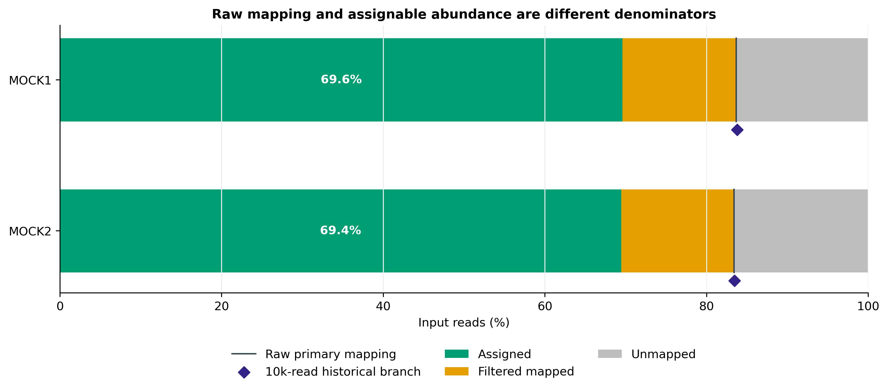
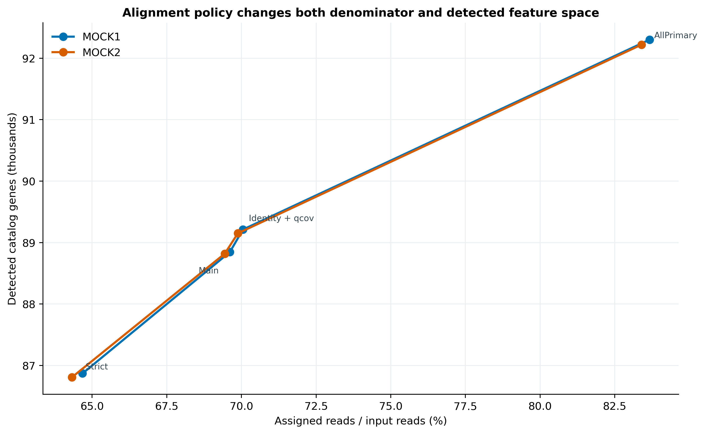
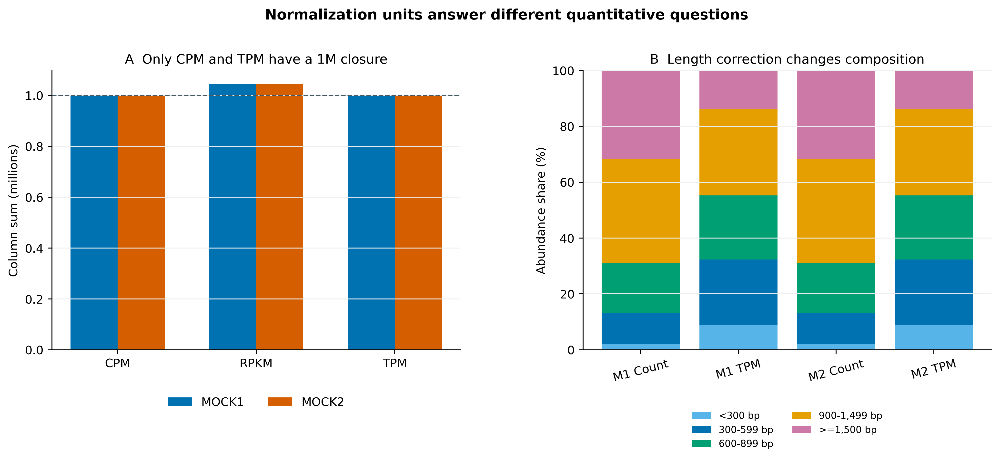
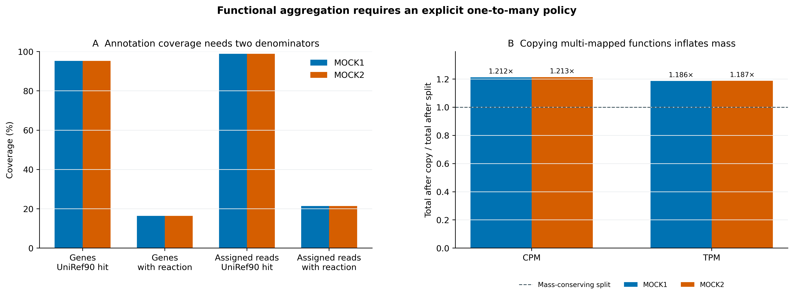

> **学习目标：**把 clean reads 回比非冗余基因目录，建立能闭合的 read ledger；区分 raw mapping rate 与可进入丰度表的 assigned fraction；正确计算 raw count、CPM、RPKM、TPM；将 UniRef90 best hit 汇总到 MetaCyc reaction 时显式处理未注释基因和一对多映射。  
> **真实数据：**Meslier 等公开的 `PRJEB52977` 不均一微生物 DNA mocks：MOCK1（ERR9765746）和 MOCK2（ERR9765747）。每个官方 ENA run 确定性取得 2,000,000 个同步 pairs，经 fastp 1.3.6（Q20、低质量碱基不超过 40%、N 不超过 5、最短 50 bp）后保留 1,999,853 与 1,999,888 clean pairs [@meslier2022platforms; @chen2018fastp]。参考是同一 mocks 的六套真实 short-read assemblies 经 Prodigal 2.6.3 与 MMseqs2 9.d36de 以 95% identity/95% coverage 建立的 93,782-gene MEGAHIT mix catalog [@hyatt2010prodigal; @steinegger2017mmseqs2]；全部 FASTQ 与 catalog 文件身份均在 `input-lineage.tsv` 固定。  
> **结论边界：**两套 mock 用于技术校准，不是生物学重复；它们的 reads 参与过目录构建，因此高 mapping/detection 不能解释成独立预测性能，更不能外推为自然群落的生物效应。

## 这一步对应论文里的哪张图 {#sec-target}

锚定论文是 Delgado 与 Andersson 对 biome-specific gene catalogues 的比较 [@delgado2022assembly]。论文先从 124 个 Baltic Sea 样本建立 individual、co-assembly 和 mix catalog，再用以下证据判断目录是否覆盖 reads 与基因空间：

- **Fig. 3**：每个样本随机抽 10,000 条未经标准化的 forward reads，用 Bowtie2 `--local` 回比目录并统计 mapping percentage；
- **Fig. 5**：从 coverage 与代表序列来源解释 mix catalog 为何同时吸收 individual 和 co-assembly 信息。

原文的 mapping 分支使用 seqtk 1.2（seed 100）、Bowtie2 2.3.4.3、SAMtools 1.9 和 HTSeq 0.11.2。本文先保留这条统计逻辑，再用锁定的新版本重跑；随后增加全量 clean R1+R2、第二候选比对、显式质量门槛和守恒账本。这样可以回答两个不同问题：

1. 论文口径下，随机 10,000 条 forward reads 有多少被目录接住？
2. 构建正式 abundance table 时，有多少 reads 通过了可解释、可审计的分配规则？

{#fig-35-ledger}

::: {.callout-important title="先给结论：mapping rate 不是丰度矩阵的分母"}
MOCK1/MOCK2 的 primary raw mapping rates 是 83.6705%/83.3977%，但通过 `MAPQ >= 10`、`identity >= 95%`、`query coverage >= 80%` 后，进入主计数表的只有 2,784,234/2,777,443 reads，即 69.6110%/69.4400% 的全部输入。报告一个“mapped percent”而不写过滤层，会把两个分母混成一个数字。
:::

## 理论：从 alignment 到 abundance 要经过四道门 {#sec-theory}

### 1. 先定义计数单位：read、fragment 还是 alignment

本次主分支把 R1 与 R2 **分别作为 reads** 输入 `-U`：

$$
N_{input}=N_{R1}+N_{R2}.
$$

因此一对双端 reads 最多贡献两个 read counts。若改用 Bowtie2 `-1/-2` 并按 read pair 或 fragment 计数，分母会约减半，overlap、discordant pair、singleton 和 multi-mapping 的规则也要重新定义。不能把 read counts 的结果口头改称 fragment counts。

SAM 中一条 read 还可能有 primary、secondary 或 supplementary alignments。本文只让 primary alignment 进入 gene count；secondary alignments 单独记账，不把“alignment 行数”当成 read 数 [@li2009samtools]。

### 2. Raw mapped 还不等于 assignable

对每条 primary alignment，本文从 CIGAR 与 `NM` tag 计算：

$$
Q=\frac{M+I}{L_{query}},
$$

$$
I=1-\frac{NM}{M+I+D},
$$

其中 $Q$ 是 query coverage，$I$ 是近似 nucleotide identity；`M/I/D/S` 分别是 alignment match block（包含 match 与 mismatch）、insertion、deletion 与 soft clipping。主策略同时要求：

$$
MAPQ\ge10,\quad I\ge0.95,\quad Q\ge0.80.
$$

于是每个样本都有闭合账本：

$$
N_{input}=N_{assigned}+N_{filtered\ mapped}+N_{unmapped}.
$$

Bowtie2 的 MAPQ 是对“所报告 alignment 为错误最佳选择”的置信编码，不是 percent identity；两者不能互换 [@langmead2012bowtie2]。

### 3. 四种丰度单位回答不同问题

对基因 $g$，令 read count 为 $c_g$，长度为 $L_g$ bp，样本内 assigned reads 为 $N=\sum_g c_g$：

$$
CPM_g=\frac{10^6c_g}{N},
$$

$$
RPKM_g=\frac{10^9c_g}{L_gN},
$$

$$
RPK_g=\frac{c_g}{L_g/1000},\qquad
TPM_g=\frac{10^6RPK_g}{\sum_j RPK_j}.
$$

| Unit | 是否长度校正 | 每样本列和 | 适合用途 | 不应被写成 |
|---|---|---|---|---|
| Raw count | 否 | assigned reads | count-based differential model 的输入 | 相对丰度 |
| CPM | 否 | $10^6$ | 同一计数定义下的 library-size scaling | 长度校正表达量 |
| RPKM | 是 | 不固定 | 历史展示、同一基因跨样本需谨慎 | compositional closure |
| TPM | 是 | $10^6$ | 样本内长度校正后的组成展示 | absolute abundance |

RPKM 的归一化顺序使不同样本的列和不固定；TPM 先做长度校正、再闭合到 $10^6$，更容易比较样本内的组成 [@wagner2012tpm]。不过宏基因组 gene copy number、genome equivalents、extraction efficiency 与 microbial load 都未被 TPM 自动校正，因此 TPM 仍不是 absolute abundance。

### 4. 功能汇总不是简单 `group_by(sum)`

本文以 DIAMOND 对每条 catalog protein 搜索 UniRef90 v201901b，先按 bitscore、E-value、identity 和稳定 ID 顺序确定一个 best hit [@buchfink2021diamond; @suzek2007uniref]。然后用 HUMAnN 3.9 随包的 UniRef90→MetaCyc reaction mapping 建 crosswalk [@beghini2021biobakery; @caspi2023metacyc]。

一个 UniRef90 cluster 可能映射到 $k>1$ 个 reactions。主策略对每个目的 reaction 分配 $1/k$，使质量守恒：

$$
\sum_r A_{gr}=A_g.
$$

敏感性策略则把完整 $A_g$ 复制到每个 reaction；它易于实现，但总量会膨胀。未命中 UniRef90 的基因进入 `NO_UNIREF90_HIT`，已命中但没有 reaction crosswalk 的基因进入 `UNIREF90_NO_REACTION`。若直接删掉两类 missingness，功能表会在无提示的情况下改掉分母。

这里的 UniRef90→reaction 只是一条“如何守恒地汇总丰度”的 crosswalk，不等于完整的 gene-centric 功能注释。KO、COG、GO、protein domain、功能暗物质比例和多数据库一致性需要另行建表，不能从一个 reaction ID 反向补齐。

## 准备工作 {#sec-setup}

### 算力门槛

| 项目 | 本次受控重算 | 真实 cohort 建议 |
|---|---:|---:|
| CPU | 16 核 | 16–64 核；样本级并行时限制总线程 |
| RAM | 实测峰值 7.43 GiB | Bowtie2 常见 8–32 GB；全库蛋白注释建议 32–64 GB |
| 磁盘 | 工作区约 350 MiB；UniRef90 `.dmnd` 36.3 GB | 至少 80 GB；若保留 SAM/BAM 按 FASTQ 的数倍规划 |
| 耗时 | Bowtie2 两样本 4 min 38 s；DIAMOND 1 h 42 min 15 s | 与 reads、目录和数据库近似线性增长，通常数小时到数天 |

没有服务器时，直接读取 `data/small/35-gene-abundance-frozen/`。其中保留完整 gene abundance long table、best-hit annotation、reaction table、mapping/normalization/function ledgers、命令、环境和资源记录；原始 FASTQ、索引、SAM/BAM 与 36.3 GB 数据库不进入 Git。只想练回比时可截取少量 reads，但子集的 detection rate 不能替代全量结果。

<details>
<summary>点开：锁定环境、真实来源和内联出版主题</summary>

```bash
mamba create -n metagenome-gene-abundance-2026.07 \
  --file env/gene-abundance-linux-64.lock

# 只有需要从 ENA 原始子集重建 clean FASTQ 时才需要
mamba create -n metagenome-read-qc-2026.07 \
  --file env/read-qc-linux-64.lock

# 提供锁定的 HUMAnN 3.9 reaction mapping 与数据库 bootstrap 入口
mamba create -n metagenome-biobakery-2026.07 \
  --file env/biobakery-linux-64.lock

GA_ENV_PREFIX="$HOME/miniconda3/envs/metagenome-gene-abundance-2026.07"
"${GA_ENV_PREFIX}/bin/bowtie2" --version
"${GA_ENV_PREFIX}/bin/samtools" --version
"${GA_ENV_PREFIX}/bin/htseq-count" --version
"${GA_ENV_PREFIX}/bin/seqtk" 2>&1 | head -n 2
"${GA_ENV_PREFIX}/bin/diamond" version
```

```bash
# ENA full runs -> deterministic 2M-pair subsets -> paired fastp；可断点恢复
bash scripts/download_article35_gene_abundance_sources.sh \
  . data/raw/article30 \
  "$HOME/miniconda3/envs/metagenome-read-qc-2026.07"

# 约 36.3 GB 的 UniRef90 DIAMOND database 单独下载、解包并审计
bash scripts/bootstrap_article19_humann_databases.sh \
  --project-root . --cache-root db/humann-cache download
bash scripts/bootstrap_article19_humann_databases.sh \
  --project-root . --cache-root db/humann-cache extract-uniref90
```

UniRef90 full database 固定为 HUMAnN `v201901b`，本机 `.dmnd` 必须恰为 36,332,007,356 bytes，SHA-256 为 `67a00a99ead2a00c737b4b9cb7e64ecc9085c2539bbd21a2d0c92913936995a8`。MetaCyc reaction mapping 的 SHA-256 固定为 `8419ce78a62ca9130914f2c347a9708111cedc7de52ba274659ce51ec7de7752`。数据库不写成 `latest`。

```{r}
install.packages(c("ggplot2", "dplyr", "readr", "tidyr", "scales", "patchwork"))

library(ggplot2)
library(dplyr)
library(readr)

set.seed(20260735)

pal_pub <- c(
  MOCK1 = "#0072B2", MOCK2 = "#D55E00",
  Assigned = "#009E73", `Filtered mapped` = "#E69F00",
  Unmapped = "#BDBDBD", Split = "#0072B2", Copy = "#CC79A7"
)
scale_color_pub <- function(...) scale_color_manual(values = pal_pub, ...)
scale_fill_pub  <- function(...) scale_fill_manual(values = pal_pub, ...)

theme_pub <- function(base_size = 12) {
  theme_bw(base_size = base_size) +
    theme(
      panel.grid.minor = element_blank(),
      panel.grid.major.x = element_blank(),
      axis.text = element_text(color = "black"),
      strip.background = element_rect(fill = "#EEF3F5", color = NA),
      legend.key = element_blank(),
      plot.title.position = "plot"
    )
}

save_pub <- function(plot, file_base, width = 180, height = 120,
                     units = "mm", dpi = 350) {
  dir.create(dirname(file_base), recursive = TRUE, showWarnings = FALSE)
  ggsave(paste0(file_base, ".pdf"), plot, width = width, height = height,
         units = units, device = cairo_pdf)
  ggsave(paste0(file_base, ".png"), plot, width = width, height = height,
         units = units, dpi = dpi, bg = "white")
  ggsave(paste0(file_base, ".tiff"), plot, width = width, height = height,
         units = units, dpi = dpi, compression = "lzw", bg = "white")
  invisible(plot)
}
```

</details>

### 输入身份与计数合同

| Sample | ENA run | Clean pairs | Input reads | Catalog |
|---|---|---:|---:|---:|
| MOCK1 | ERR9765746 | 1,999,853 | 3,999,706 | 93,782 genes |
| MOCK2 | ERR9765747 | 1,999,888 | 3,999,776 | 93,782 genes |

`input-lineage.tsv` 逐项记录四份 clean FASTQ、catalog FNA/FAA/metadata、UniRef90 database、reaction mapping 与论文 XML 的 byte count 和 SHA-256。准备器还核对 nucleotide/protein/metadata 的 93,782 个 ID 完全配对、核酸长度与 metadata 一致，再生成每条 sequence 单独作为 CDS 的 GFF。

## 可复制代码：两条回比路线与四种单位 {#sec-code}

### 第 1 步：准备 catalog、GFF 和输入门禁

```bash
ROOT="$PWD"
WORK="data/raw/article35/work"
GA_ENV_PREFIX="$HOME/miniconda3/envs/metagenome-gene-abundance-2026.07"
UNIREF_DB="db/humann-cache/installed/humann-uniref90-v201901b/uniref90_201901b_full.dmnd"
REACTION_MAP="$HOME/miniconda3/envs/metagenome-biobakery-2026.07/lib/python3.12/site-packages/humann/data/pathways/metacyc_reactions_level4ec_only.uniref.bz2"
export PYTHONHASHSEED=0 PYTHONNOUSERSITE=1 PYTHONPATH=
mkdir -p "${WORK}/index" "${WORK}/legacy" "${WORK}/mapping" "${WORK}/annotation" "${WORK}/tmp/diamond"

"${GA_ENV_PREFIX}/bin/python" scripts/prepare_article35_gene_abundance_inputs.py \
  --project-root "${ROOT}" \
  --work-dir "${WORK}" \
  --article30-raw-dir data/raw/article30 \
  --uniref90-db "${UNIREF_DB}" \
  --reaction-map "${REACTION_MAP}" \
  --verify-large-db-sha256
```

完整 SHA-256 会顺序读取 36.3 GB database，耗时明显但只需在首次准备或搬迁后做。日常复核使用冻结 manifest，不会反复读取原始数据库。

::: {.callout-important title="一次性真实重算入口"}
下面三条命令会依次完成论文兼容分支、全量 reads 回比、UniRef90 注释、丰度/功能汇总与 compact bundle 固化，并自动写出完成标记、命令账本、GNU time 资源记录和 checksum manifest。完成这组命令后，不必重复执行随后四小节展开的内部命令。

```bash
"${GA_ENV_PREFIX}/bin/python" scripts/run_article35_gene_abundance.py \
  --project-root "${ROOT}" --env-prefix "${GA_ENV_PREFIX}" \
  --work-dir "${WORK}" --threads 16

"${GA_ENV_PREFIX}/bin/python" scripts/summarize_article35_gene_abundance.py \
  --project-root "${ROOT}" --work-dir "${WORK}" \
  --reaction-map "${REACTION_MAP}"

"${GA_ENV_PREFIX}/bin/python" scripts/freeze_article35_gene_abundance.py \
  --project-root "${ROOT}" --work-dir "${WORK}" \
  --output-dir data/small/35-gene-abundance-frozen
```
:::

### 第 2 步：先复现论文的 10,000-forward-read 口径

```bash
BT2="${WORK}/index/megahit-mix-primary"
REF="${WORK}/reference/megahit-mix-primary.fna"
GFF="${WORK}/reference/megahit-mix-primary.gff"

"${GA_ENV_PREFIX}/bin/bowtie2-build" --threads 16 "${REF}" "${BT2}"

for sample in MOCK1 MOCK2; do
  "${GA_ENV_PREFIX}/bin/seqtk" sample -s100 \
    "${WORK}/inputs/${sample}_R1.fastq.gz" 10000 \
    > "${WORK}/legacy/${sample}.R1.seed100.n10000.fastq"

  "${GA_ENV_PREFIX}/bin/bowtie2" --local --seed 100 -p 16 \
    -x "${BT2}" \
    -U "${WORK}/legacy/${sample}.R1.seed100.n10000.fastq" \
    -S "${WORK}/legacy/${sample}.local.sam"

  "${GA_ENV_PREFIX}/bin/samtools" sort -@ 16 \
    -o "${WORK}/legacy/${sample}.local.sorted.bam" \
    "${WORK}/legacy/${sample}.local.sam"

  "${GA_ENV_PREFIX}/bin/htseq-count" \
    -f bam -r pos -t CDS -i ID -s no -a 0 \
    --secondary-alignments ignore --supplementary-alignments ignore \
    "${WORK}/legacy/${sample}.local.sorted.bam" "${GFF}" \
    > "${WORK}/legacy/${sample}.htseq-counts.tsv"
done
```

锁定版本是 Bowtie2 2.5.5、SAMtools 1.23.1、HTSeq 2.1.2 和 seqtk 1.5。MOCK1/MOCK2 分别分配 8,378/8,345 条 reads；该值接近 raw mapping rate，因为 Bowtie2 默认只报告一个 primary alignment，HTSeq 又使用 `-a 0`。它不能替代显式 multi-mapping 与质量过滤。

### 第 3 步：全量 R1+R2 进入可审计主分支

```bash
for sample in MOCK1 MOCK2; do
  "${GA_ENV_PREFIX}/bin/bowtie2" \
    --very-sensitive-local -k 2 --seed 20260735 --no-unal -p 16 \
    -x "${BT2}" \
    -U "${WORK}/inputs/${sample}_R1.fastq.gz,${WORK}/inputs/${sample}_R2.fastq.gz" \
  | "${GA_ENV_PREFIX}/bin/python" scripts/parse_article35_sam.py \
      --sample "${sample}" \
      --total-reads "$(case "${sample}" in MOCK1) echo 3999706;; MOCK2) echo 3999776;; esac)" \
      --counts "${WORK}/mapping/${sample}.policy-counts.tsv" \
      --summary "${WORK}/mapping/${sample}.mapping-summary.json" \
      --quality-histogram "${WORK}/mapping/${sample}.quality-histogram.tsv"
done
```

`-k 2` 不是要求两条 alignment 都计数，而是让 parser 看见“至少存在第二候选”的信号。四个并行策略共享同一份 SAM stream：

| Policy | MAPQ | Identity | Query coverage | 用途 |
|---|---:|---:|---:|---|
| AllPrimary | 无 | 无 | 无 | raw primary mapping |
| IdentityQcov | 无 | 95% | 80% | 分开看 MAPQ 的影响 |
| Main | 10 | 95% | 80% | 主 abundance table |
| Strict | 20 | 97% | 90% | 参数敏感性 |

{#fig-35-policy}

| Sample | Raw primary mapped | Main assigned | Main assigned (%) | Main detected genes | Strict assigned |
|---|---:|---:|---:|---:|---:|
| MOCK1 | 3,346,575 | 2,784,234 | 69.6110 | 88,845 | 2,586,966 |
| MOCK2 | 3,335,721 | 2,777,443 | 69.4400 | 88,819 | 2,572,767 |

### 第 4 步：从同一 raw count table 计算 CPM、RPKM 与 TPM

```python
from pathlib import Path

import pandas as pd

counts = pd.read_csv(
    "data/raw/article35/work/mapping/MOCK1.policy-counts.tsv", sep="\t"
).rename(columns={"Main": "RawCount"})[["GeneID", "RawCount"]]
lengths = pd.read_csv(
    "data/raw/article35/work/reference/catalog-audit.tsv", sep="\t"
)[["GeneID", "NtLength"]]
abundance = counts.merge(lengths, on="GeneID", validate="one_to_one")

assigned = abundance["RawCount"].sum()
abundance["CPM"] = abundance["RawCount"] * 1e6 / assigned
abundance["RPKM"] = abundance["RawCount"] * 1e9 / (
    abundance["NtLength"] * assigned
)
abundance["RPK"] = abundance["RawCount"] / (abundance["NtLength"] / 1000)
abundance["TPM"] = abundance["RPK"] * 1e6 / abundance["RPK"].sum()

assert abundance["RawCount"].sum() == 2784234
assert abs(abundance["CPM"].sum() - 1e6) < 1e-6
assert abs(abundance["TPM"].sum() - 1e6) < 1e-6
Path("results").mkdir(exist_ok=True)
abundance.to_csv("results/MOCK1-gene-abundance.tsv", sep="\t", index=False)
```

{#fig-35-units}

### 第 5 步：UniRef90 best hit 与 MetaCyc reaction 汇总

```bash
"${GA_ENV_PREFIX}/bin/diamond" blastp \
  --db "${UNIREF_DB}" \
  --query "${WORK}/reference/megahit-mix-primary.faa" \
  --out "${WORK}/annotation/uniref90-top5.tsv" \
  --outfmt 6 qseqid sseqid pident length qlen slen evalue bitscore qcovhsp \
  --threads 16 --iterate faster --sensitive --id 50 --query-cover 80 --evalue 1e-5 \
  --max-target-seqs 5 --masking 1 \
  --tmpdir "${WORK}/tmp/diamond"

```

保留 top 5 的目的不是把同一个 gene 计五次，而是让确定性 best-hit 规则能处理同分和近似命中。汇总器先过滤到已满足 `--id 50`、`--query-cover 80`、`--evalue 1e-5` 的候选，再按 bitscore 降序、E-value 升序、identity 降序和 UniRef90 ID 字典序选择一个 best hit。

`--iterate faster --sensitive` 面向“每条 query 只需要一个最佳标签”的任务：较快阶段已找到合格 hit 的 query 不再进入更敏感阶段。因此这里的 top 5 只服务 best-hit 决胜与审计，不能被当作一份 exhaustive homolog catalogue；若研究问题需要完整同源集合，应关闭 iterative shortcut，并重新评估耗时和命中边界。

| Metric | MOCK1 | MOCK2 |
|---|---:|---:|
| Catalog genes with UniRef90 best hit | 89,339 | 89,339 |
| Genes linked to >=1 MetaCyc reaction | 15,392 | 15,392 |
| Assigned reads linked to reaction (%) | 21.4299 | 21.4047 |
| Copy-policy CPM inflation | 1.212374× | 1.212982× |

<details>
<summary>点开：冻结表的真实表头与 DIAMOND 关键日志</summary>

```bash
gzip -cd data/small/35-gene-abundance-frozen/gene-functional-annotation.tsv.gz \
  | head -n 6
rg 'Running iterated|Aligned [0-9]+/[0-9]+ queries|Total time|Reported' \
  data/small/35-gene-abundance-frozen/logs/annotate-uniref90.stderr.log
```

```text
GeneID                    UniRef90             Pident  QueryCoveragePct  Evalue     Bitscore  ReactionCount  Reactions
megahit-co__c000001_1     UniRef90_A0A1Z4HEF9  76.3    97.9              2.88e-71   235.0     0
megahit-co__c000002_1     UniRef90_A0A1W5CLE9  95.8    100.0             2.14e-232  669.0     0
megahit-co__c000003_1     UniRef90_Q7MAN4      100.0   100.0             3.41e-58   195.0     2              DIHYDROXYISOVALDEHYDRAT-RXN;DIHYDROXYMETVALDEHYDRAT-RXN
megahit-co__c000003_2     UniRef90_A0A3D6E6H3  100.0   100.0             4.56e-109  327.0     0
megahit-co__c000004_1     UniRef90_A0A177XF04  98.0    100.0             0.0        1251.0    0

Running iterated search mode with sensitivity steps: faster, sensitive
Aligned 88370/93782 queries in this iteration, 88370/93782 total.
Aligned 969/93782 queries in this iteration, 89339/93782 total.
Total time = 6135.33s
Reported 342801 pairwise alignments, 342801 HSPs.
```

</details>

## 审计与升级：先忠实复现，再按当前标准加门禁 {#sec-audit}

### 审计 1：10,000-read mapping 适合作为 catalog coverage 诊断，不适合作正式 abundance

论文在每个样本只抽 10,000 条 forward reads，是为公平、快速地比较多个 catalog；它不承诺精确估计低丰度 gene abundance。正式 profiling 应使用完整、经过同一 QC 的输入，并把抽样仅保留为 paper-compatible sensitivity branch。

### 审计 2：默认单一 primary alignment 会遮住 multi-mapping

HTSeq 可以依据 alignment metadata 处理非唯一比对 [@anders2015htseq]，但前提是 aligner 把歧义信息写出来。Bowtie2 默认只报告一个 alignment 时，`-a 0` 不会自动恢复被隐藏的替代位置。本文至少用 `-k 2` 暴露第二候选，并以 MAPQ 门槛保护主表。对高度同源 paralogs、strain-shared genes 或短 reads，还应比较 fractional assignment、EM 分配或按 gene family 聚合。

### 审计 3：阈值改变的不只是 reads 数，还有 feature universe

AllPrimary→Main 在 MOCK1/MOCK2 分别从 92,302/92,220 个 detected genes 降到 88,845/88,819；Strict 又降到 86,871/86,808。任何 downstream diversity、prevalence filter 和 differential abundance 都继承这个 feature universe，必须把 alignment policy 当作模型选择而不是清洗细节。

### 审计 4：count-based 模型必须读取 raw counts

DESeq2、edgeR 或其他 count-based 方法需要 raw integer counts 和相应 library-size/dispersion model。把 RPKM/TPM 四舍五入后送入 count-based model 会破坏 sampling distribution。CPM/TPM 更适合 QC、组成可视化或模型明确接受连续丰度的场景；分析前还要决定低 prevalence、零值与 compositionality 的处理。

### 审计 5：一对多功能映射必须有质量守恒策略

{#fig-35-functions}

equal split 不是唯一正确的生物学分配，只是一个透明、可守恒的主策略。若有 pathway context、gene neighborhood、EC specificity 或 curated evidence，可以使用有依据的权重；但必须输出权重和未分配质量。不能既把一个 gene 复制到多个功能，又把 reaction 总量解释为新的 reads 总数。

### 审计 6：数据库和目录都属于模型版本

UniRef90 v201901b 较旧，但它与 HUMAnN 3.9 的 MetaCyc reaction mapping 是一套锁定、可重建的组合。换成新版 UniRef 或其他功能数据库时，应整套重做 annotation coverage、one-to-many 结构和功能丰度，不能只换数据库文件名。catalog 同样来自被分析的两个 mocks，因此本次结果是 technical calibration；真正外部验证需要用未参与目录构建的新样本。

### 审计 7：相对单位不是 absolute abundance

CPM/TPM 的 closure 会使某个基因上升时其他基因被动下降。若研究问题是“每克粪便有多少 copies”，还需要 spike-in、qPCR、flow cytometry 或总微生物负荷，并清楚传播提取回收率和宿主比例的不确定性。

### 审计 8：预测 CDS 长度不等于真实完整基因长度

RPKM/TPM 的 $L_g$ 来自 catalog 中的预测 CDS。位于 contig 边界的 partial ORF 可能只有真实基因的一部分：它会以较短分母得到较高的 length-normalized abundance，而且 80% query coverage 只表示 hit 覆盖这条**截短 query** 的 80%，不证明功能域或催化位点完整。主表因此保留 `Completeness`；研究完整酶、耐药蛋白或代谢反应时，应对 complete-only CDS 做预声明敏感性分析，而不是把 partial hit 直接写成完整功能。

## 出版级美化：一张图只守一个分母 {#sec-pub}

四张主图遵守同一视觉合同：图内全部英文、Okabe–Ito 兼容配色、白色背景、细网格、PDF + 350 dpi PNG + LZW TIFF。作图时优先显示能被审计的关系：

- ledger 图用 100% stacked bars，让 assigned + filtered mapped + unmapped 必须闭合；
- policy 图同时放 assigned fraction 和 detected genes，避免只汇报一个有利指标；
- units 图将 $10^6$ closure 与 length correction 分面，避免把 CPM 与 TPM 当同义词；
- function 图把 feature coverage、read-weighted coverage 和 copy inflation 分开。

正文、图注和 Methods 都使用同一组术语：`input reads`、`primary mapped reads`、`assigned reads`、`detected genes`。不要把 “reads aligned to catalog” 与 “reads retained in abundance table” 写成同一句。

```bash
# 从 frozen tables 重新验收并导出四张 PDF/PNG/TIFF 主图
PYTHONNOUSERSITE=1 PYTHONPATH= \
MPLCONFIGDIR=/tmp/metagenome-article35-matplotlib \
"$HOME/miniconda3/envs/metagenome-gene-abundance-2026.07/bin/python" \
  scripts/validate_article35_gene_abundance.py --project-root .
```

```{r}
mapping <- read_tsv(
  "data/small/35-gene-abundance-frozen/mapping-policy-summary.tsv",
  show_col_types = FALSE
)

p <- mapping |>
  filter(Policy == "Main") |>
  mutate(
    Assigned = 100 * AssignedReads / InputReads,
    `Filtered mapped` = 100 * FilteredMappedReads / InputReads,
    Unmapped = 100 * UnmappedReads / InputReads
  ) |>
  select(Sample, Assigned, `Filtered mapped`, Unmapped) |>
  tidyr::pivot_longer(-Sample, names_to = "State", values_to = "Percent") |>
  ggplot(aes(Sample, Percent, fill = State)) +
  geom_col(width = 0.68) +
  scale_fill_pub() +
  scale_y_continuous(labels = scales::label_percent(scale = 1)) +
  coord_cartesian(ylim = c(0, 100)) +
  labs(x = NULL, y = "Input reads (%)", fill = NULL) +
  theme_pub()

save_pub(p, "figures/35-read-to-gene-ledger-r")
```

## 常见坑：审稿人会沿着账本追问 {#sec-pitfalls}

::: {.callout-caution title="把 83.7% mapping rate 写成 83.7% functional reads"}
mapping 只说明 read 找到参考位置；通过质量门槛、被唯一/可接受地分配、命中 UniRef90、再映射到 MetaCyc reaction 是连续四层过滤。每层都要有自己的分子和分母。
:::

::: {.callout-caution title="paired reads 既按 fragment 解释，又按两条 reads 计数"}
先在 Methods 写清 count unit。本次是 read-level；若改成 fragment-level，必须重算 input denominator、discordant/singleton policy 和 feature counts，不能只把标签改成 pairs。
:::

::: {.callout-caution title="把 multi-mappers 静默塞给任意一个同源基因"}
共享保守区会把 reads 随机或依实现细节落到 paralog/strain homolog。至少报告 `-k`、MAPQ、secondary policy，并做严格阈值或 family-level sensitivity。
:::

::: {.callout-caution title="以 RPKM/TPM 代替 raw count 做 count-based differential analysis"}
保留整数 raw count matrix；归一化单位是派生表。若只有 RPKM/TPM，无法可靠逆推出原始 sampling denominator。
:::

::: {.callout-caution title="删除 unannotated 后仍声称保留了全部功能质量"}
`NO_UNIREF90_HIT` 与 `UNIREF90_NO_REACTION` 是解释缺口，不是垃圾行。正文至少报告 gene-level 与 read-weighted annotation coverage，并在功能统计中说明是否排除这些桶。
:::

::: {.callout-caution title="用 partial ORF 的短长度放大 TPM，再声称完整功能存在"}
同时查看 `Completeness`、alignment/query coverage 与关键 domain 覆盖；complete-only sensitivity 若改变结论，应把差异作为 assembly/gene-prediction 不确定性报告。
:::

::: {.callout-caution title="把两个 mock 当成 n=2 生物学队列"}
它们是组成不同的技术标准物，用于执行和守恒审计。不能对 MOCK1 vs MOCK2 做疾病差异检验，也不能把它们当独立 replicates 估计人群方差。
:::

## 这段 Methods 怎么写 {#sec-methods}

> Paired-end Illumina reads from two uneven synthetic microbial DNA communities (PRJEB52977; ERR9765746 and ERR9765747) were processed as checksum-locked 2,000,000-pair subsets generated without replacement by a one-pass sequential sampler with seed 20260730 for each full ENA run.  
> fastp v1.3.6 (`--detect_adapter_for_pe --qualified_quality_phred 20 --unqualified_percent_limit 40 --n_base_limit 5 --length_required 50 --disable_trim_poly_g`) retained 1,999,853 and 1,999,888 read pairs for MOCK1 and MOCK2, respectively.  
> The nucleotide reference comprised 93,782 non-redundant MEGAHIT mix-catalog representatives generated from the same mock-community inputs; consequently, this analysis was treated as technical calibration rather than independent prediction. A paper-compatible branch sampled 10,000 forward reads per sample with seqtk v1.5 (`-s100`), aligned them in local mode with Bowtie2 v2.5.5, sorted alignments with SAMtools v1.23.1, and counted CDS features with HTSeq v2.1.2 (`-f bam -r pos -t CDS -i ID -s no -a 0`).  
> For the primary branch, all clean R1 and R2 reads were treated as individual reads and aligned with Bowtie2 v2.5.5 (`--very-sensitive-local -k 2 --seed 20260735`). Primary alignments were retained at MAPQ >= 10, nucleotide identity >= 95%, and query coverage >= 80%; a strict sensitivity branch used MAPQ >= 20, identity >= 97%, and query coverage >= 90%.  
> Raw counts were retained for count-based analyses. CPM, RPKM, and TPM were calculated from the assigned-read denominator and catalog nucleotide lengths; CPM and TPM column sums were required to equal 1,000,000 within numerical tolerance.  
> Catalog proteins were searched against the HUMAnN UniRef90 v201901b full DIAMOND database (SHA-256 `67a00a99ead2a00c737b4b9cb7e64ecc9085c2539bbd21a2d0c92913936995a8`) using DIAMOND v2.2.4 (`--iterate faster --sensitive --id 50 --query-cover 80 --evalue 1e-5 --max-target-seqs 5 --masking 1`).  
> Deterministic best hits were linked to MetaCyc reactions using the HUMAnN v3.9 level4ec mapping (SHA-256 `8419ce78a62ca9130914f2c347a9708111cedc7de52ba274659ce51ec7de7752`). Abundance from one-to-many mappings was divided equally across linked reactions; `NO_UNIREF90_HIT` and `UNIREF90_NO_REACTION` were retained.  
> On the 16-core validation node, the two full Bowtie2 streams required 2:17.47 and 2:20.81, respectively; DIAMOND required 1:42:15 and peaked at 7,794,916 KiB RSS. The compact work directory used approximately 350 MiB, excluding the linked FASTQ inputs and the 36.3-GB UniRef90 database.  
> All command contracts and resource records used seed namespace 20260735.

换成自己的数据时，把 node CPU、RAM、存储类型、实际 wall time 与 peak RSS 替换成项目实测值。若自己的 catalog 来自独立 discovery cohort，也要明确写出 discovery/validation 的样本隔离；若不是，保留“not independent prediction”边界。

## 换成你自己的数据怎么做 {#sec-own-data}

至少准备以下文件：

| 必需输入 | 最小字段/格式 | 上线前门禁 |
|---|---|---|
| Clean FASTQ | 每样本 R1/R2，gzip | pair 同步、样本表一致、checksum、QC 参数一致 |
| Gene catalog nucleotide FASTA | 唯一 stable gene ID | 与 protein/GFF ID 一一对应；版本和 checksum 固定 |
| Gene catalog protein FASTA | 与 nucleotide FASTA 同 ID | translation 长度和 terminal stop policy 可解释 |
| Gene length table | `GeneID`, `NtLength` | 行数与 FASTA 相等，无重复、长度 > 0 |
| Functional database | UniRef/eggNOG/KEGG 等 | release、下载日期、文件 checksum、license |
| Crosswalk | source ID → target function | 一对多比例、未映射桶和版本固定 |
| Sample metadata | sample、group、batch、load 等 | biological replicate 与 technical replicate 分开 |

建议按以下顺序迁移：

1. 在 1–2 个样本上核对 `input = assigned + filtered mapped + unmapped`；
2. 检查 paired/read/fragment 单位是否与研究设计一致；
3. 对 MAPQ、identity、query coverage 和 multi-mapping policy 做敏感性分析；
4. 冻结 raw counts，再派生 CPM/RPKM/TPM，不覆盖原表；
5. 分别报告 feature-level 和 read-weighted annotation coverage；
6. 一对多功能映射先做 mass-conserving 主分析，再把 copy/full-weight 作为敏感性；
7. 若做病例对照统计，使用独立生物学样本并校正 batch、cohort、年龄、性别、BMI、药物等混杂；两套技术 mock 不进入效应检验。

::: {.callout-tip title="最值得加入 CI 的五个断言"}
`input ledger closes`、`gene IDs are unique`、`raw count sum equals assigned reads`、`CPM/TPM each sum to 1e6`、`split functional abundance conserves mass`。这五个断言比肉眼看一张 stacked bar 更早发现分母漂移。
:::

## 参考 {#sec-references}

- 目录策略与论文 mapping 口径：[@delgado2022assembly]
- 真实 mock communities、公开 reads 与 paired QC：[@meslier2022platforms; @chen2018fastp]
- Catalog gene prediction 与 protein clustering：[@hyatt2010prodigal; @steinegger2017mmseqs2]
- Bowtie2 与 SAM/BAM：[@langmead2012bowtie2; @li2009samtools]
- Feature counting：[@anders2015htseq]
- RPKM/TPM 定量边界：[@wagner2012tpm]
- DIAMOND 与 UniRef：[@buchfink2021diamond; @suzek2007uniref]
- DIAMOND iterative search 参数语义：[official command-line documentation](https://github.com/bbuchfink/diamond/wiki/3.-Command-line-options)
- HUMAnN 与 MetaCyc：[@beghini2021biobakery; @caspi2023metacyc]
