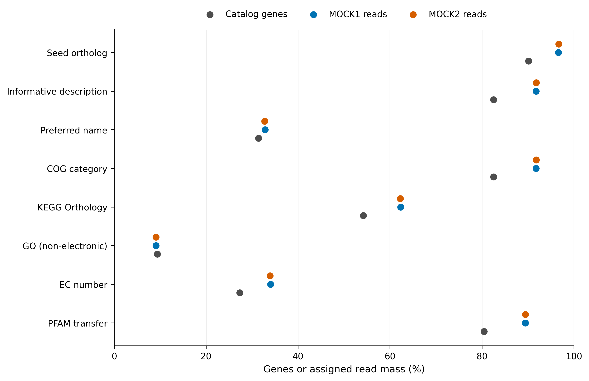
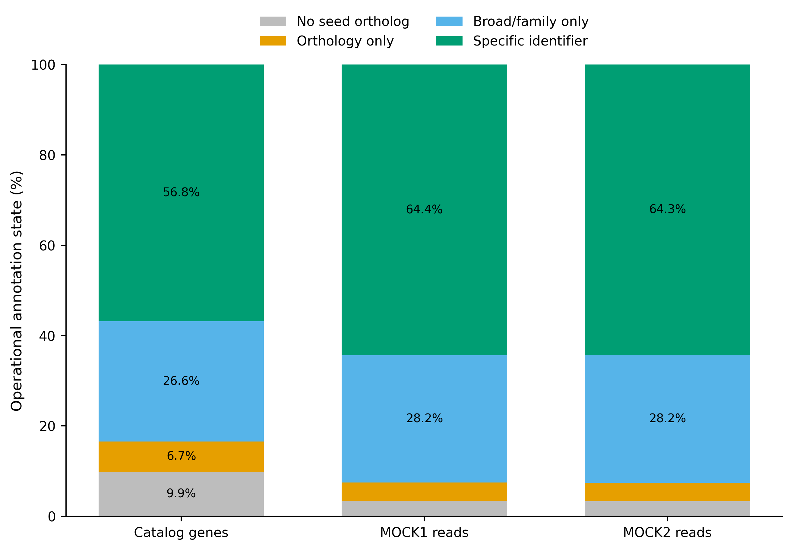
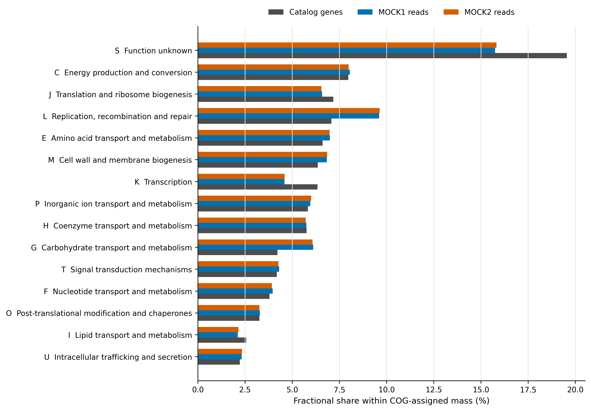
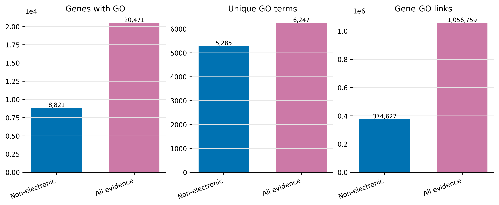

> **学习目标：**从预测蛋白运行 eggNOG-mapper；分清 seed ortholog、COG category、KEGG Orthology（KO）与 Gene Ontology（GO）；建立未命中、仅有 orthology、仅有 broad/family label 与 specific identifier 的守恒账本；用 gene fraction 和 read-weighted fraction 两套分母报告功能暗物质。  
> **真实数据：**输入是 MEGAHIT individual/co-assembly 经 Prodigal 2.6.3 预测、再由 MMseqs2 9.d36de 以 95% amino-acid identity 与 95% target coverage 去冗余所得的 93,782 条代表蛋白。完整序列、长度、ORF completeness 与来源均来自 checksum-locked 的 Article 34 catalog；MOCK1/MOCK2 raw gene counts 来自 Article 35 的 audited read assignment。  
> **结论边界：**KO、GO、COG、EC、PFAM 和 description 都是依赖数据库与转移策略的预测标签。没有标签表示“本次模型没有给出该类标签”，不表示样本中没有该基因、通路或活性；有标签也不等于已用实验验证底物、方向、定位或表达。

## 这一步对应论文里的哪张图 {#sec-target}

锚定论文是 Delgado 与 Andersson 的 Baltic Sea gene catalogue 比较 [@delgado2022assembly]。原研究用 eggNOG-mapper 1.0.3、eggNOG 4.5.1 和 accelerated profile HMM search 注释 mix catalog；Table 3 报告 67,566,251 条基因中 21,593,598 条获得 EggNOG annotation，即 31.9591%。同一张表还把 complete、partial 与 incomplete ORFs 分开记录，而不是只给一个总命中率。

论文 Fig. 3b 展示的是“reads mapping to genes with Pfam annotation”，不是 EggNOG、KO 或 GO coverage。把 Fig. 3b 的 read-weighted Pfam 比例写成“EggNOG annotation rate”，会同时换掉 annotation source 与统计分母。

本文沿用 Table 3 的两个关键思想：

1. catalog 中每条 protein 都必须进入 ledger，包括 no-hit；
2. annotation missingness 必须按 ORF completeness 分层。

主分析升级为 eggNOG-mapper 2.1.15 + eggNOG 5.0.2 + DIAMOND 2.0.15。eggNOG-mapper v2 的 Fig. 1 将流程明确分成 sequence search、orthology inference、taxonomic-scope selection 和 annotation transfer 四步；不同输出字段覆盖不同，不应压成一个模糊的“annotated”布尔值 [@cantalapiedra2021eggnogmapper; @huertacepas2019eggnog]。

{#fig-36-field-coverage}

::: {.callout-important title="先给结论：先报告字段，再定义 annotated"}
84,511 条 proteins（90.11%）获得 seed ortholog，但只有 77,376 条（82.51%）带 COG category、50,800 条（54.17%）带 KO、8,821 条（9.41%）带 non-electronic GO；9,271 条（9.89%）没有 seed，另有 6,243 条（6.66%）只有 orthology evidence。“有 seed ortholog”只说明检出了可用于 orthology inference 的序列匹配；COG 提供 broad category，KO/GO/EC 提供另一层功能标识。Methods 和图注必须写出具体字段，不能只写“X% genes were annotated”。
:::

## 理论：从相似序列到功能标签要过四道门 {#sec-theory}

### 1. Seed ortholog 是入口，不是终点

eggNOG-mapper 先把 query protein 搜索到 eggNOG reference protein，得到 seed ortholog；随后依据该 seed 所在的 orthologous groups、物种树和 taxonomic scope 选择 donor，再转移功能标签 [@huertacepas2017eggnogmapper; @cantalapiedra2021eggnogmapper]。

可把一条 query 的证据链写成：

$$
q \xrightarrow{\text{sequence search}} s
\xrightarrow{\text{orthology inference}} O_q
\xrightarrow{\text{taxonomic scope}} D_q
\xrightarrow{\text{transfer}} A_q,
$$

其中 $s$ 是 seed ortholog，$O_q$ 是候选 ortholog 集，$D_q$ 是允许作为 donor 的集合，$A_q$ 才是最终转移的 annotation terms。只保存 `seed_ortholog` 会丢掉功能字段；只保存最终 KO 又会丢掉匹配质量、转移层级和 missingness。

### 2. COG、KO 与 GO 不是三个同义词

| Field | 主要回答 | 粒度 | 常见多值来源 | 不能单独证明 |
|---|---|---|---|---|
| COG category | 属于哪类 broad cellular function | 字母级大类 | 一条 protein 跨多个 broad roles | 精确反应或底物 |
| KEGG Orthology | 对应哪个 functional ortholog identifier | 常较具体 | 多结构域、多功能或 donor 集 | 通路在样本中完整、活跃 |
| Gene Ontology | 支持哪些 molecular function / biological process / cellular component terms | 层级 ontology | 父子 terms 与多个证据来源 | 实验条件下的功能和方向 |
| EC | 是否可转移 enzyme classification | 反应分类 | 多活性 enzyme | 反应确在样本内发生 |
| PFAM | 是否转移 protein-family/domain label | 结构域/家族 | 多结构域 protein | 全长 protein 的完整功能 |

GO terms 带有 evidence provenance；eggNOG-mapper 的 `--go_evidence non-electronic` 排除 electronic-only transfer，而 `all` 会扩大覆盖 [@geneontology2019resource]。扩大 term 数不等于精度提高，因此本次把 non-electronic 定为主结果，把 all-evidence 作为 sensitivity analysis。

### 3. 功能暗物质必须先写 operational definition

“功能暗物质”不是数据库里的固定字段。本文把 93,782 条 proteins 分成四个互斥状态：

1. **No seed ortholog**：DIAMOND/eggNOG 5.0.2 没有通过 E-value gate 的 seed；
2. **Orthology only**：有 seed，但没有 informative description、preferred name、COG、KO、GO、EC 或 PFAM；
3. **Broad/family only**：有 informative description、COG 或 PFAM，但没有 KO、GO、EC 或 preferred name；
4. **Specific identifier**：至少有 KO、GO、EC 或 preferred name。

设四类 gene counts 为 $n_k$，则必须满足：

$$
\sum_{k=1}^{4} n_k=N_{catalog}=93{,}782.
$$

这是可审计的 missingness 分层，不是“未知功能基因”的自然定律。改数据库、版本、taxonomic scope 或 state definition，比例都会改变。

### 4. Gene fraction 与 read-weighted fraction 回答不同问题

catalog fraction 为：

$$
p_k^{gene}=\frac{n_k}{N_{catalog}}.
$$

对样本 $s$，以 Article 35 的 assigned raw read counts $c_{gs}$ 加权：

$$
p_{ks}^{read}=\frac{\sum_{g\in k}c_{gs}}{\sum_g c_{gs}}.
$$

前者回答“目录里有多少 proteins 落入该状态”，后者回答“已分配到目录的 read mass 中有多少落入该状态”。read-weighted fraction 仍是相对量，不是 microbial load、transcription 或 enzyme activity。

{#fig-36-dark-matter}

### 5. 多标签汇总必须守恒

若 gene $g$ 有 $m_g$ 个 COG categories，把完整的一个 gene 复制到每个 category，会令总量膨胀。主汇总采用 fractional allocation：

$$
w_{gk}=\frac{1}{m_g},\qquad \sum_{k\in C_g}w_{gk}=1.
$$

KO 与 GO 的 top-term 表同样保留 `GenesWithTerm` 与 `FractionalGeneEquivalent` 两列：前者适合描述 overlap，后者用于画组成图。两者不能混称为“gene abundance”。

## 准备工作 {#sec-setup}

### 算力门槛

| 项目 | 本次 93,782-protein 重算 | 真实大型 catalog 建议 |
|---|---:|---:|
| CPU | 32 cores | 32–64 cores；按节点限额设置 `--cpu` |
| RAM | 主分支实测峰值 7.14 GiB | 预留 32–64 GB；`--dbmem` 需远高于此 |
| 磁盘 | eggNOG installed 51.9 GB；archives 12.1 GB；work 0.12 GiB | 至少 80 GB；保留多版本时按版本独立规划 |
| 耗时 | main 11:58.62；GO all-evidence 1:09.89 | 与 query 数、backend、sensitivity、存储吞吐共同变化 |

没有服务器时，直接读取 `data/small/36-eggnog-functional-annotation-frozen/` 中的 complete annotation rows、KO/GO/COG summaries、resource logs 与 four-state ledger。只上传少量 proteins 到 web server 适合检查格式，不适合估计完整 catalog 的 annotation rate。

<details>
<summary>点开：锁定环境、数据库与内联出版主题</summary>

```bash
mamba create -n metagenome-eggnog-2026.07 \
  --file env/eggnog-annotation-linux-64.lock

EGGNOG_ENV="$HOME/miniconda3/envs/metagenome-eggnog-2026.07"
DB_ROOT="/absolute/path/eggnog-5.0.2"
env PATH="${EGGNOG_ENV}/bin:/usr/bin:/bin" \
  "${EGGNOG_ENV}/bin/emapper.py" --version --data_dir "${DB_ROOT}"
```

预期版本行同时包含 `emapper-2.1.15`、`Installed eggNOG DB version: 5.0.2` 和 `diamond version 2.0.15`。只运行 `emapper.py --version` 而不传 `--data_dir`，会检查默认空目录，不能证明目标数据库可用。

```bash
# 约 12.1 GB compressed；安装后约 51.9 GB；支持断点续传并强制 SHA-256
bash scripts/bootstrap_article36_eggnog_database.sh list
bash scripts/bootstrap_article36_eggnog_database.sh download \
  --database-dir "${DB_ROOT}"
bash scripts/bootstrap_article36_eggnog_database.sh audit \
  --database-dir "${DB_ROOT}"
```

`database-manifest.tsv` 锁定 eggNOG 5.0.2 的 `eggnog.db`、taxonomy SQLite/traversal cache 与 DIAMOND index。工具官方 downloader 使用 release-specific HTTP URL；下载脚本因此把 byte count 与 SHA-256 设为硬门禁，而不是把传输成功当作文件身份。

```{r}
install.packages(c("ggplot2", "dplyr", "readr", "tidyr", "forcats", "scales", "patchwork"))

library(ggplot2)
library(dplyr)
library(readr)
library(tidyr)
library(forcats)

set.seed(20260736)

pal_pub <- c(
  `Catalog genes` = "#4D4D4D", `MOCK1 reads` = "#0072B2",
  `MOCK2 reads` = "#D55E00", `No seed ortholog` = "#BDBDBD",
  `Orthology only` = "#E69F00", `Broad/family only` = "#56B4E9",
  `Specific identifier` = "#009E73", `Non-electronic` = "#0072B2",
  `All evidence` = "#CC79A7"
)
scale_color_pub <- function(...) scale_color_manual(values = pal_pub, ...)
scale_fill_pub  <- function(...) scale_fill_manual(values = pal_pub, ...)

theme_pub <- function(base_size = 12) {
  theme_bw(base_size = base_size) +
    theme(
      panel.grid.minor = element_blank(),
      panel.grid.major.y = element_blank(),
      axis.text = element_text(color = "black"),
      strip.background = element_rect(fill = "#EEF3F5", color = NA),
      legend.key = element_blank(),
      plot.title.position = "plot"
    )
}

save_pub <- function(plot, file_base, width = 180, height = 120,
                     units = "mm", dpi = 350) {
  dir.create(dirname(file_base), recursive = TRUE, showWarnings = FALSE)
  ggsave(paste0(file_base, ".pdf"), plot, width = width, height = height,
         units = units, device = cairo_pdf)
  ggsave(paste0(file_base, ".png"), plot, width = width, height = height,
         units = units, dpi = dpi, bg = "white")
  ggsave(paste0(file_base, ".tiff"), plot, width = width, height = height,
         units = units, dpi = dpi, compression = "lzw", bg = "white")
  invisible(plot)
}
```

</details>

### 输入身份与分析合同

| Asset | Rows/sequences | Identity gate | Role |
|---|---:|---|---|
| `megahit-mix-primary.faa.gz` | 93,782 proteins | SHA-256 `3db88f…a3569` | eggNOG queries |
| representative metadata | 93,782 genes | SHA-256 `677479…c09` | length/completeness strata |
| Article 35 abundance | 187,564 gene × sample rows | SHA-256 `8dc7ea…36b` | read-weighted missingness |
| eggNOG annotation SQLite | release 5.0.2 | 41,370,988,544 bytes + SHA-256 | orthology/function transfer |
| eggNOG DIAMOND index | release 5.0.2 | 9,285,439,161 bytes + SHA-256 | seed search |

FAA、metadata 和每个样本的 abundance IDs 必须都是相同的 93,782 个 unique IDs。MOCK1/MOCK2 的 raw counts 分别闭合到 2,784,234 与 2,777,443 assigned reads；它们只用于技术性的 read-weighted missingness，不是生物学重复。

## 可复制代码：从 proteins 到 KO/COG/GO ledger {#sec-code}

### 第 1 步：准备输入并通过身份门禁

```bash
ROOT="$PWD"
WORK="data/raw/article36/work"
EGGNOG_ENV="$HOME/miniconda3/envs/metagenome-eggnog-2026.07"
DB_ROOT="/absolute/path/eggnog-5.0.2"

export PYTHONHASHSEED=0 PYTHONNOUSERSITE=1 PYTHONPATH=

python3 scripts/prepare_article36_eggnog_inputs.py \
  --project-root "${ROOT}" \
  --work-dir "${WORK}" \
  --database-dir "${DB_ROOT}" \
  --env-prefix "${EGGNOG_ENV}"
```

准备器解压真实 FAA、核对 93,782 个 IDs、ORF completeness、两套 raw-count ledgers、四个 database files 与 SQLite release。`--skip-large-hash` 只供开发诊断；正式运行不得用它生成 provenance。

### 第 2 步：运行主注释

```bash
env PATH="${EGGNOG_ENV}/bin:/usr/bin:/bin" \
  "${EGGNOG_ENV}/bin/emapper.py" \
  -i "${WORK}/inputs/catalog.faa" \
  --itype proteins \
  -m diamond \
  --sensmode sensitive \
  --dmnd_iterate yes \
  --outfmt_short \
  --evalue 0.001 \
  --seed_ortholog_evalue 0.001 \
  --tax_scope auto \
  --tax_scope_mode inner_narrowest \
  --target_orthologs all \
  --go_evidence non-electronic \
  --pfam_realign none \
  --md5 \
  --cpu 32 \
  --data_dir "${DB_ROOT}" \
  -o catalog-main \
  --output_dir "${WORK}/annotation/main" \
  --override
```

`--outfmt_short` 只缩短 DIAMOND intermediate hits，因为本次没有 `pident/query_cover/subject_cover` filters；最终 `.emapper.annotations` 仍保留完整字段。对 metagenomic partial ORFs 强制 high subject coverage 会系统性惩罚截短 query，所以本次不把 coverage threshold 偷渡进“未注释”定义。

::: {.callout-important title="一次性真实重算入口"}
下面的 runner 用 `/usr/bin/time -v` 记录峰值 RAM、wall time、I/O 与退出码，并在主搜索结束后自动完成 GO all-evidence sensitivity：

```bash
python3 scripts/run_article36_eggnog_annotation.py \
  --project-root "${ROOT}" \
  --work-dir "${WORK}" \
  --database-dir "${DB_ROOT}" \
  --env-prefix "${EGGNOG_ENV}" \
  --cpu 32
```
:::

### 第 3 步：同一 seed hits 审计 GO evidence policy

```bash
env PATH="${EGGNOG_ENV}/bin:/usr/bin:/bin" \
  "${EGGNOG_ENV}/bin/emapper.py" \
  -m no_search \
  --annotate_hits_table \
    "${WORK}/annotation/main/catalog-main.emapper.seed_orthologs" \
  --seed_ortholog_evalue 0.001 \
  --tax_scope auto \
  --tax_scope_mode inner_narrowest \
  --target_orthologs all \
  --go_evidence all \
  --pfam_realign none \
  --cpu 8 \
  --data_dir "${DB_ROOT}" \
  -o catalog-go-all \
  --output_dir "${WORK}/annotation/go-all" \
  --override
```

这条 sensitivity 不重新搜索 protein database；两个分支共享完全相同的 seed orthologs，差异只来自 GO evidence policy。主结果仍是 non-electronic。

### 第 4 步：把 no-hit 补回 catalog

eggNOG-mapper `.annotations` 只列出通过 seed gate 的 queries。若直接读取该文件计算比例，分母已经偷偷变成 hit genes。汇总器以完整 catalog ID set 左连接 annotations：

```bash
python3 scripts/summarize_article36_eggnog_annotation.py \
  --project-root "${ROOT}" \
  --work-dir "${WORK}"

gzip -cd "${WORK}/summary/gene-functional-annotation.tsv.gz" | \
  sed -n '1,6p'
```

```text
GeneID  Completeness  AaLength  SeedOrtholog  COGCategory  KEGGKO  AnnotationState
megahit-co__c000001_1  Partial     240  103690.17129790  M   ko:K02005  Specific identifier
megahit-co__c000002_1  Incomplete  335  103690.17130193  G   ko:K01191  Specific identifier
megahit-co__c000003_1  Partial      95  273121.WS0130     EG  ko:K01687  Specific identifier
megahit-co__c000003_2  Partial     197  273121.WS0129     S   ko:K07084  Specific identifier
megahit-co__c000004_1  Incomplete  658  216595.PFLU_4357  -   -          Orthology only
```

完整表保留 93,782 行，并为每条 gene 记录 `HasCOG/HasKO/HasGO/HasEC/HasPFAM`、MOCK1/MOCK2 raw counts 与四级 `AnnotationState`。不要在电子表格里手工删掉 `-` 行。

### 第 5 步：冻结一次性结果

```bash
python3 scripts/freeze_article36_eggnog_annotation.py \
  --project-root "${ROOT}" \
  --work-dir "${WORK}" \
  --output-dir data/small/36-eggnog-functional-annotation-frozen

python3 scripts/validate_article36_eggnog_annotation.py \
  --project-root "${ROOT}" \
  --frozen-dir data/small/36-eggnog-functional-annotation-frozen \
  --output-dir results/36-eggnog-functional-annotation \
  --figure-dir figures \
  --chapter chapters/36-eggnog-functional-annotation.qmd
```

冻结包保留 complete main/all-evidence annotation rows、seed orthologs、gene-level ledger、KO/GO/COG summaries、commands、resource logs、environment locks 和 database manifest；约 51.9 GB database 与 raw DIAMOND hits 不进入 Git。

## 审计与升级：先忠实复现，再按当前标准加门禁 {#sec-audit}

### 审计 1：历史比例不能跨版本直接横比

Delgado 与 Andersson 使用 eggNOG-mapper 1.0.3 + eggNOG 4.5.1 + HMM；本次使用 mapper 2.1.15 + eggNOG 5.0.2 + DIAMOND。eggNOG-mapper v2 的参考物种、orthologous groups、annotation sources 和推断引擎均已更新 [@cantalapiedra2021eggnogmapper]。31.9591% 是论文 catalog 在历史模型下的结果，不是本次 93,782-protein mock catalog 的“预期真值”。

截至 2026-07-28，官方仓库把 v3 标为 heavy testing，并明确建议 production 使用 stable v2.1.15；v3 面向 eggNOG v7，v2/v3 databases 不可互换。因此本次不把未正式发布的 v3 结果混入主分析。

### 审计 2：backend 是方法的一部分

原文为 profile HMM；eggNOG-mapper v2 支持 DIAMOND、MMseqs2 与 HMMER。官方 benchmark 指出，DIAMOND 默认在速度与内存间平衡较好，而约 100,000 queries 以内 MMseqs2 可能更快；HMM 可找更远同源，但更慢且需额外 database [@cantalapiedra2021eggnogmapper]。Methods 必须写 backend、sensitivity 和 iterate，不能只写软件名。

### 审计 3：mixed metagenome 不应默认强制 Bacteria

`--tax_scope auto` 为 mixed metagenomic data 选择适配 seed lineage 的 scope。把 catalog 强制为 `Bacteria` 可能丢掉 archaeal、eukaryotic 或 viral queries；反过来，研究对象若已由可靠 taxonomy 限定为某 clade，固定 scope 可减少不合适的 donor。scope 选择应来自研究设计，而不是为了提高命中率。

### 审计 4：partial ORF 的 missingness 要单独报告

complete、partial、incomplete ORFs 的长度与边界质量不同。对 partial ORF 得到 KO 不代表已恢复全长 catalytic architecture；对 partial ORF 无 hit 也可能只是 assembly truncation。`completeness-annotation-summary.tsv` 与 `length-annotation-summary.tsv` 同时保留两种分层，避免把 assembly quality 写成“novel biology”。

### 审计 5：GO evidence policy 不能藏在默认参数里

non-electronic 主策略覆盖 8,821 条 genes、5,285 个 unique GO terms 和 374,627 个 gene–GO links；在完全相同的 84,511 条 seed hits 上，all-evidence 分支扩大到 20,471 条 genes、6,247 个 terms 和 1,056,759 个 links，分别增加 11,650 条 covered genes、962 个 terms 与 682,132 个 links。all-evidence 只作为 sensitivity；这类增加应写成 evidence-policy expansion，不应写成发现了新的 genes。

### 审计 6：PFAM transfer 不等于 de novo domain confirmation

`--pfam_realign none` 使用 ortholog-derived PFAM transfer，计算快，但不是 query 对 PFAM HMM 的直接支持。关键 candidate 若依赖 domain architecture，应另跑 `--pfam_realign realign/denovo` 或独立 InterProScan/HMMER，并保留 GA thresholds 与 domain coordinates。

### 审计 7：functional label 是 prediction，不是 activity

KO/EC 支持的是潜在 biochemical capability。要声称 pathway complete，需要检查必要反应集合；要声称 active，需要 metatranscriptome、metaproteome、metabolite turnover 或实验验证。gene abundance 不能替代这些证据层。

### 审计 8：多标签有 overlap，不得静默复制总量

COG composition 图采用 `1/m` fractional allocation；term prevalence 表保留完整的 genes-with-term overlap。若研究问题允许同一 gene 同时计入多个 mechanisms，可以报告 copied counts，但必须同时报告 expansion factor，不能把膨胀后的总和解释成新增 genes 或 reads。

### 审计 9：database files 与 mapper 一起构成模型版本

`eggnog.db`、taxonomy files 和 DIAMOND index 必须来自同一 5.0.2 release。只记录 “eggNOG v5” 不够；本次 manifest 记录 release-specific URL、compressed/installed bytes 与 SHA-256，并由 SQLite `version` table 再确认 release。

## 出版级美化：让每张图只回答一个分母问题 {#sec-pub}

### 图 1：字段 coverage

`field-coverage-summary.tsv` 把每个字段的 gene fraction、MOCK1 read fraction 与 MOCK2 read fraction并排。点图比堆叠图更适合比较同一 field 的三个分母；x 轴统一为 0–100%。

### 图 2：四级暗物质 ledger

四类互斥状态用 100% stacked bars，三根柱分别代表 catalog genes、MOCK1 assigned reads 与 MOCK2 assigned reads。每根柱必须闭合到 100%，图例顺序从 no seed 到 specific identifier。

### 图 3：COG composition

{#fig-36-cog}

```{r}
frozen <- "data/small/36-eggnog-functional-annotation-frozen"

cog_all <- read_tsv(file.path(frozen, "cog-category-summary.tsv"), show_col_types = FALSE) |>
  filter(FractionalGeneEquivalent > 0) |>
  mutate(Label = paste(COGCategory, Description))

top_labels <- cog_all |>
  slice_max(FractionalGeneEquivalent, n = 15) |>
  pull(Label)

cog <- cog_all |>
  pivot_longer(
    c(FractionalGeneEquivalent, MOCK1FractionalRawReads, MOCK2FractionalRawReads),
    names_to = "Denominator", values_to = "Mass"
  ) |>
  group_by(Denominator) |>
  mutate(Share = 100 * Mass / sum(Mass)) |>
  ungroup() |>
  filter(Label %in% top_labels) |>
  mutate(
    Denominator = recode(
      Denominator,
      FractionalGeneEquivalent = "Catalog genes",
      MOCK1FractionalRawReads = "MOCK1 reads",
      MOCK2FractionalRawReads = "MOCK2 reads"
    ),
    Label = fct_reorder(Label, Share, .fun = max)
  )

p_cog <- ggplot(cog, aes(Share, Label, fill = Denominator)) +
  geom_col(position = position_dodge(width = 0.75), width = 0.68) +
  scale_fill_pub() +
  labs(x = "Fractional share within COG-assigned mass (%)", y = NULL) +
  theme_pub() +
  theme(legend.position = "top")

save_pub(p_cog, "figures/36-cog-category-profile", width = 245, height = 175)
```

归一化分母使用全部 observed COG categories；`top_labels` 只控制展示类别，不改变分母。

### 图 4：GO evidence sensitivity

{#fig-36-go-evidence}

```{r}
go_audit <- read_tsv(file.path(frozen, "go-evidence-audit.tsv"), show_col_types = FALSE) |>
  filter(Metric %in% c("Genes with >=1 GO term", "Unique GO terms", "Gene-GO links")) |>
  pivot_longer(c(NonElectronic, AllEvidence), names_to = "Policy", values_to = "Count") |>
  mutate(
    Policy = recode(Policy, NonElectronic = "Non-electronic", AllEvidence = "All evidence"),
    Metric = recode(Metric, `Genes with >=1 GO term` = "Genes with GO")
  )

p_go <- ggplot(go_audit, aes(Policy, Count, fill = Policy)) +
  geom_col(width = 0.68) +
  geom_text(aes(label = scales::comma(Count)), vjust = -0.25, size = 3) +
  facet_wrap(~Metric, scales = "free_y", nrow = 1) +
  scale_fill_pub(guide = "none") +
  labs(x = NULL, y = "Count") +
  theme_pub()

save_pub(p_go, "figures/36-go-evidence-policy", width = 235, height = 100)
```

所有图内文字保持英文；PDF 用于矢量排版，PNG 与 LZW TIFF 以 350 dpi 导出。长 COG descriptions 采用横向布局，并给左侧留足空间，避免截断。

## 常见坑：审稿人会沿着 annotation chain 追问 {#sec-pitfalls}

::: {.callout-caution title="把 seed ortholog 写成 experimentally validated function"}
seed 是 orthology inference 的入口。必须继续报告转移了哪个字段、使用什么 scope/evidence policy；实验验证需要独立证据。
:::

::: {.callout-caution title="把 COG、KO、GO 三列合并成一个 annotated 布尔值"}
三者粒度和语义不同。至少分别报告 coverage；若定义综合状态，必须把布尔规则写进 Methods。
:::

::: {.callout-caution title="只读取 .emapper.annotations，再把行数当分母"}
该文件通常不含 no-hit queries。应以原始 FAA IDs 左连接 annotation，并验证四类总和等于 93,782。
:::

::: {.callout-caution title="一个 multi-label gene 在每个 COG/KO/GO 中复制完整 abundance"}
复制会膨胀总量。组成图用 fractional allocation；overlap 分析则保留 copied membership，并明确二者的统计含义。
:::

::: {.callout-caution title="为了提高 GO coverage，把 all-evidence 当主结果"}
electronic evidence 扩大覆盖，但不自动提高可信度。主分析、sensitivity 与差值要分开标注。
:::

::: {.callout-caution title="把 eggNOG 4.5、5.0 与 7 的比例直接比较"}
数据库内容和引擎已改变；v2 与 v3 databases 也不可互换。跨版本差异既含 biology，也含 model version。
:::

::: {.callout-caution title="把 transferred PFAM 当成 query-level HMM confirmation"}
关键 domain 应 realign 或 de novo search，并审计 domain coordinates、coverage 和 clan overlap。
:::

::: {.callout-caution title="用两个 mocks 的 read-weighted 差异做生态学推断"}
两套 mocks 是技术校准材料，且参与了 catalog construction。它们不能提供 population variance、condition effect 或外部验证。
:::

## 这段 Methods 怎么写 {#sec-methods}

### Methods template

> Protein-coding sequences were obtained from the checksum-identified 93,782-gene nonredundant catalog. Functional annotation was performed with eggNOG-mapper v2.1.15 against eggNOG v5.0.2 using DIAMOND v2.0.15 in sensitive iterative mode (`--sensmode sensitive --dmnd_iterate yes`; E-value and seed-ortholog E-value, 1 × 10^-3). Annotation transfer used the automatic taxonomic scope with the inner-narrowest scope rule and all ortholog types. Non-electronic GO evidence was retained for the primary analysis; an all-evidence reannotation of the identical seed-ortholog table was used as a sensitivity analysis. PFAM labels were transferred from orthologs without query-level realignment. Queries absent from the eggNOG-mapper annotation table were restored from the complete catalog ID set. Annotation missingness was partitioned into no seed ortholog, orthology only, broad/family only, and specific identifier states. Multi-label COG, KO, and GO summaries used equal fractional allocation for compositional plots. Database release, installed file sizes, SHA-256 checksums, commands, and peak resource use were recorded.

若你改用 MMseqs2/HMMER、固定 taxonomic scope、加入 identity/coverage filter、启用 `pfam_realign` 或把 `go_evidence` 改为 experimental，必须同步替换模板中的 backend、参数、database files 与 primary/sensitivity 定义。

## 换成你自己的数据怎么做 {#sec-own-data}

### 你至少需要什么

- 一份 amino-acid FASTA；每条 header 的第一个 token 必须是 unique stable gene ID；
- protein catalog 的生成方法、聚类阈值与版本；
- database 的 release-specific files、bytes 与 checksums；
- 若要分层 missingness：ORF completeness、protein length、contig/MAG origin；
- 若要 abundance weighting：与 FASTA 使用同一 gene IDs 的 raw-count table；
- 若要比较组间功能：足够的 biological replicates、covariates 与独立统计设计。

### 最短迁移路线

1. 用 `seqkit stats` 与 ID uniqueness gate 检查 FAA；
2. 明确样本可能包含 Bacteria、Archaea、Eukaryota 或 viruses，再决定 `tax_scope`；
3. 先跑一个 100–1,000-protein format smoke；小 query 可用 `--dmnd_algo ctg`，不能把其耗时外推到 full catalog；
4. full run 固定 mapper、backend、database、sensitivity、E-value、scope、GO evidence 与 PFAM policy；
5. 以完整 FAA IDs 左连接 `.emapper.annotations`，保留 no-hit；
6. 分别汇总 COG、KO、GO、EC、PFAM 与 operational dark-matter states；
7. multi-label term table同时保存 genes-with-term 与 fractional mass；
8. 用独立 database/domain search 验证决定论文结论的 candidate functions；
9. 冻结 compact outputs、commands、logs、checksums 与 Methods contract。

::: {.callout-tip title="最值得加入 CI 的六个断言"}
`FASTA unique IDs = annotation rows after left join`；`four states sum to catalog size`；`state raw reads sum to assigned reads per sample`；`non-electronic GO terms are a subset of all-evidence terms`；`fractional COG mass does not inflate`；`database release and SHA-256 match the Methods contract`。
:::

## 参考 {#sec-references}

- Delgado, L. F., & Andersson, A. F. (2022). Evaluating metagenomic assembly approaches for biome-specific gene catalogues. *Microbiome*. [https://doi.org/10.1186/s40168-022-01259-2](https://doi.org/10.1186/s40168-022-01259-2)
- Cantalapiedra, C. P., et al. (2021). eggNOG-mapper v2: Functional annotation, orthology assignments, and domain prediction at the metagenomic scale. *Molecular Biology and Evolution*. [https://doi.org/10.1093/molbev/msab293](https://doi.org/10.1093/molbev/msab293)
- Huerta-Cepas, J., et al. (2019). eggNOG 5.0. *Nucleic Acids Research*. [https://doi.org/10.1093/nar/gky1085](https://doi.org/10.1093/nar/gky1085)
- Buchfink, B., Reuter, K., & Drost, H.-G. (2021). Sensitive protein alignments at tree-of-life scale using DIAMOND. *Nature Methods*. [https://doi.org/10.1038/s41592-021-01101-x](https://doi.org/10.1038/s41592-021-01101-x)
- eggNOG-mapper official repository and production-version guidance. [https://github.com/eggnogdb/eggnog-mapper](https://github.com/eggnogdb/eggnog-mapper)
