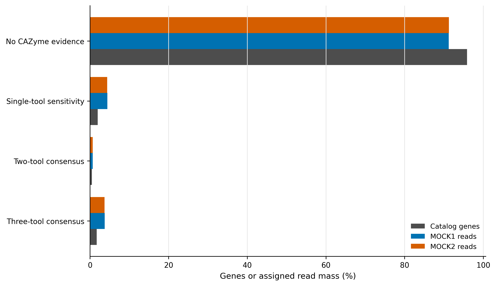
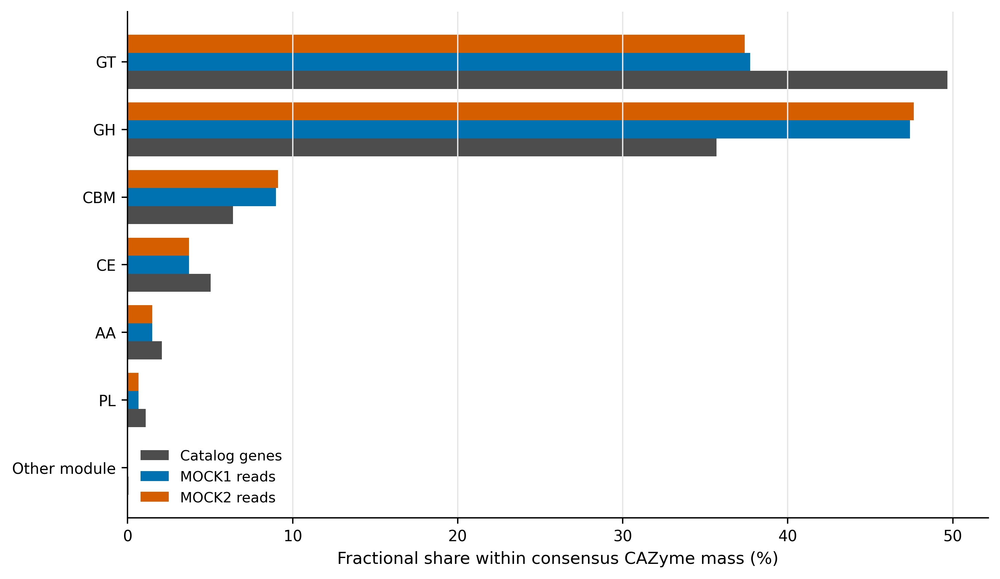
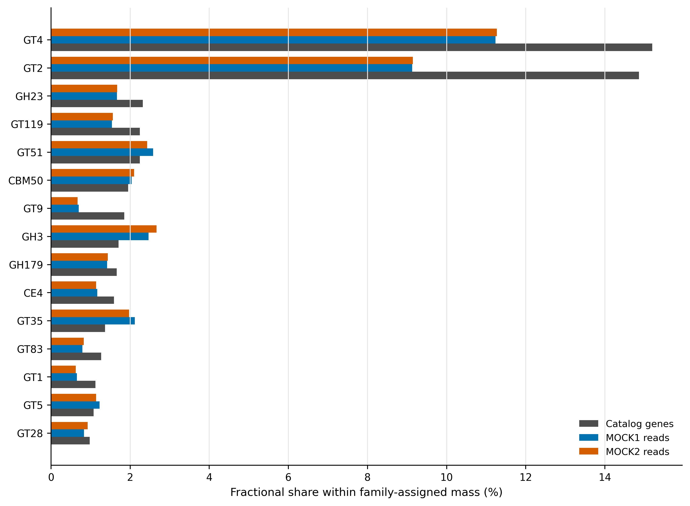
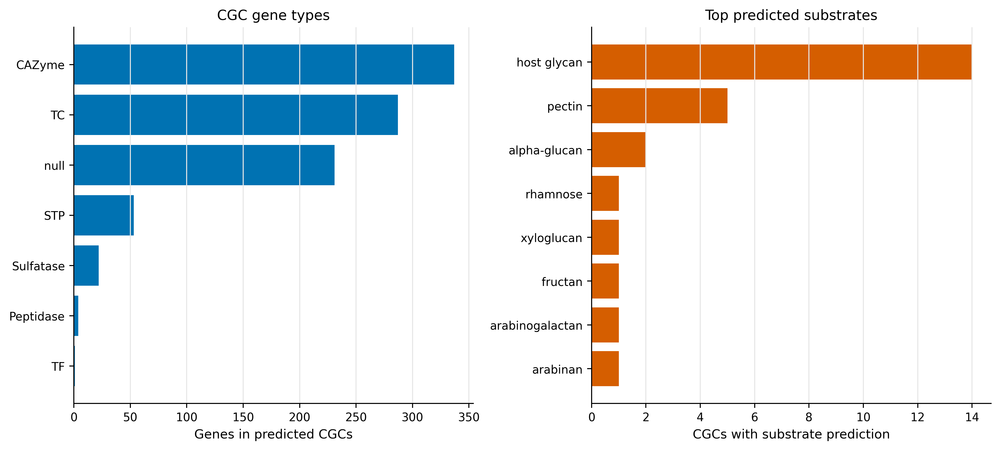

> **学习目标：**用 dbCAN 的三条证据链注释 carbohydrate-active enzymes（CAZymes，碳水化合物活性酶）；把 family、class、substrate 与 carbohydrate gene cluster（CGC，碳水化合物基因簇）分层报告；把一个基因的多标签按比例分配；理解“预测底物”与“实测降解活性”之间的边界。  
> **真实数据：**主输入是 Article 34 生成的 93,782 条非冗余代表蛋白，MOCK1/MOCK2 的 read weights 来自 Article 35 的 2,784,234/2,777,443 条 assigned reads。CGC 正控为 *Bacteroides thetaiotaomicron* VPI-5482（GCA_000011065.1，6,293,399 bp）。  
> **结论边界：**CAZy family 是序列家族标签；dbCAN-sub 和 CGC/PUL 给出的是底物候选。它们不证明样本在研究条件下表达了该酶、真正降解了该底物，也不提供代谢通量。

## 这一步对应论文里的哪张图 {#sec-target}

锚定 dbCAN3 的 Fig. 1：它把 CAZyme family annotation、CGC detection 和 substrate prediction 画成三层流程，并区分 family-to-substrate 与 CGC-to-PUL 两条底物证据 [@zheng2023dbcan3]。dbCAN2 则明确提出组合 HMMER、DIAMOND 与 Hotpep/短保守肽证据，以减少单一检索器的偏差 [@zhang2018dbcan2]。

本文把这一框架落到一个真实 gene catalog：先画三工具证据分层，再画 CAZy class/family 的 gene-weight 与 read-weight 组成，最后用完整参考基因组检验 CGC 和底物输出。CAZy 本身是持续维护的 family classification resource，不是活性实验数据库 [@lombard2014cazy]。

{#fig-37-consensus}

::: {.callout-important title="先给结论：单工具命中不能并入主结果"}
93,782 条 proteins 中，3,899 条至少被一种方法命中；其中 1,605 条得到三工具共识，445 条得到两工具共识，合计 2,050 条构成主 CAZyme 集。其余 1,849 条只有单工具证据。若把后者直接并入，主结果会从 2,050 条膨胀到 3,899 条，且方法特异性错误无法被共识门禁约束。
:::

## 理论：四个问题需要四层证据 {#sec-theory}

### 1. 三个检索器并不重复

| Evidence | 比较对象 | 擅长回答 | 主要风险 |
|---|---|---|---|
| DIAMOND against CAZy | query protein vs reference proteins | 是否接近已有 CAZy sequence | 近邻同源不保证相同底物；数据库偏倚 |
| dbCAN family HMM | query protein vs family profile | 是否保留 family-level domain pattern | partial ORF、domain boundary 与阈值影响命中 |
| dbCAN-sub HMM | query protein vs subfamily profile | 是否落入更细 subfamily、是否有底物线索 | subfamily-to-substrate 仍是转移预测 |

主门禁为：

$$
I_g^{primary}=I\left(\sum_{m\in\{D,H,S\}} I_{gm}\ge 2\right),
$$

其中 $D,H,S$ 分别表示 DIAMOND、dbCAN HMM 和 dbCAN-sub。这个规则提高 specificity，但不是“真值”；因此同时保留单工具 sensitivity ledger。

### 2. CAZy class 与 family 粒度不同

六个常见 class 为 glycoside hydrolases（GH）、glycosyltransferases（GT）、polysaccharide lyases（PL）、carbohydrate esterases（CE）、auxiliary activities（AA）与 carbohydrate-binding modules（CBM）。GT4、GH23 等才是 family。CBM 常与 catalytic domain 共存；同一 protein 可能贡献多个 labels。

若 gene $g$ 有 $m_g$ 个 labels，组成图采用：

$$
w_{gk}=\frac{1}{m_g},\qquad \sum_{k\in L_g}w_{gk}=1.
$$

这样 2,050 条主 CAZyme genes 在 class 层的 fractional gene equivalents 仍精确和为 2,050；`GenesWithLabel` 另行保留，用于描述 overlap。

{#fig-37-class}

### 3. 底物预测分两条证据链

- **Subfamily transfer**：dbCAN-sub 根据亚家族与已知底物映射给出 protein-level candidate substrate。
- **Genomic context**：CGC-Finder 将相邻 CAZyme、transporter（TC）、transcription factor（TF）、signal transduction protein（STP）等组成 CGC，再与实验表征 PUL 或 subfamily evidence 比较。

protein-level substrate 不应自动升级为整个物种的利用能力；CGC 命中也不应自动升级为样本中的表达或通量。

### 4. Gene-weight 与 read-weight 不能混称丰度

对 CAZy class $k$，gene-weight 为 $\sum_g w_{gk}$；样本 $s$ 的 read-weight 为 $\sum_g c_{gs}w_{gk}$。后者的分母是 Article 35 已分配到 catalog 的 reads，不含未比对 reads，也没有经过 spike-in 或细胞数校准。

## 准备工作 {#sec-setup}

### 算力门槛

| 项目 | 本次实跑 | 队列级建议 |
|---|---:|---:|
| CPU | 32 cores | 16–64 cores |
| RAM | catalog peak 5.52 GiB；CGC control 2.98 GiB | 预留 16–32 GB；大批量 CGC 建议 64 GB |
| 磁盘 | database 7.4 GB；临时输出约 1 GB | 至少 30 GB；每个数据库版本独立目录 |
| 耗时 | catalog 20:36；control 7:41 | 随 protein 数、contig 数与存储速度变化 |

没有服务器时，可先读取 `data/small/37-cazymes-dbcan-frozen/` 的完整 93,782-gene ledger、class/family/substrate summaries、CGC 正控表和资源日志；若要重算，只对少量 proteins 做格式检查，不能据此估计全 catalog 的命中率。

<details>
<summary>点开：锁定环境、数据库与内联出版主题</summary>

```bash
mamba create -n metagenome-cazyme-2026.07 \
  --file env/cazyme-linux-64.lock

CAZY_ENV="$HOME/miniconda3/envs/metagenome-cazyme-2026.07"
env PATH="${CAZY_ENV}/bin:/usr/bin:/bin" run_dbcan --help
```

数据库固定为 `db_v5-2-9_5-5-2026`。下载 `data/small/37-dbcan-database-manifest.tsv` 中每个 immutable URL 后，必须逐一核对 bytes 与 SHA-256；13 个 assets 合计约 7.4 GB。`dbCAN_sub.hmm` 需建立兼容名称 `dbCAN-sub.hmm`，二者必须指向同一内容。

```{r}
install.packages(c("ggplot2", "dplyr", "readr", "tidyr", "forcats", "scales", "patchwork"))
library(ggplot2); library(dplyr); library(readr); library(tidyr); library(forcats)
set.seed(20260737)

pal_pub <- c(
  `Catalog genes` = "#4D4D4D", `MOCK1 reads` = "#0072B2", `MOCK2 reads` = "#D55E00",
  `No CAZyme evidence` = "#BDBDBD", `Single-tool sensitivity` = "#E69F00",
  `Two-tool consensus` = "#56B4E9", `Three-tool consensus` = "#009E73"
)
scale_color_pub <- function(...) scale_color_manual(values = pal_pub, ...)
scale_fill_pub  <- function(...) scale_fill_manual(values = pal_pub, ...)
theme_pub <- function(base_size = 12) {
  theme_bw(base_size = base_size) + theme(
    panel.grid.minor = element_blank(), panel.grid.major.y = element_blank(),
    axis.text = element_text(color = "black"), legend.key = element_blank(),
    strip.background = element_rect(fill = "#EEF3F5", color = NA), plot.title.position = "plot"
  )
}
save_pub <- function(plot, file_base, width = 180, height = 120, units = "mm", dpi = 350) {
  dir.create(dirname(file_base), recursive = TRUE, showWarnings = FALSE)
  ggsave(paste0(file_base, ".pdf"), plot, width = width, height = height, units = units, device = cairo_pdf)
  ggsave(paste0(file_base, ".png"), plot, width = width, height = height, units = units, dpi = dpi, bg = "white")
  ggsave(paste0(file_base, ".tiff"), plot, width = width, height = height, units = units, dpi = dpi, compression = "lzw", bg = "white")
  invisible(plot)
}
```

</details>

### 输入身份

| Asset | Identity gate | Role |
|---|---|---|
| Article 34 catalog FAA | 93,782 unique proteins；SHA-256 `3db88f…a3569` | CAZyme queries |
| Article 34 metadata | 93,782 rows；SHA-256 `677479…c09` | length/completeness |
| Article 35 abundance | 187,564 rows；SHA-256 `8dc7ea…36b` | MOCK1/MOCK2 read weights |
| *B. thetaiotaomicron* VPI-5482 | GCA_000011065.1；6,293,399 bp | CGC/substrate control |

## 可复制代码：从 proteins 到共识 CAZyme ledger {#sec-code}

### 第 1 步：准备并核对输入

```bash
ROOT="$PWD"
WORK="work/article37"
DB_ROOT="/absolute/path/dbcan-v5-2-9-20260505"
CAZY_ENV="$HOME/miniconda3/envs/metagenome-cazyme-2026.07"

python3 scripts/prepare_article37_cazymes.py \
  --project-root "${ROOT}" \
  --work-dir "${WORK}" \
  --database-dir "${DB_ROOT}" \
  --env-prefix "${CAZY_ENV}"
```

准备器对 catalog、metadata、abundance、正控和全部数据库 assets 逐项 fail closed；任何一个 ID set、bytes 或 SHA-256 不一致都会终止。

### 第 2 步：运行三工具注释与 CGC 正控

```bash
python3 scripts/run_article37_cazymes.py \
  --work-dir "${WORK}" \
  --database-dir "${DB_ROOT}" \
  --env-prefix "${CAZY_ENV}" \
  --threads 32
```

等价的主 catalog 命令核心参数为：

```bash
run_dbcan CAZyme_annotation \
  --mode protein \
  --input_raw_data "${WORK}/inputs/catalog.faa" \
  --output_dir "${WORK}/catalog" \
  --db_dir "${DB_ROOT}" \
  --methods diamond,hmm,dbCANsub \
  --e_value_threshold 1e-102 \
  --e_value_threshold_dbcan 1e-15 \
  --coverage_threshold_dbcan 0.35 \
  --e_value_threshold_dbsub 1e-15 \
  --coverage_threshold_dbsub 0.35 \
  --threads 32
```

`1e-102` 是 DIAMOND 的严格主门槛；HMM 与 dbCAN-sub 固定 `i-Evalue <=1e-15` 和 HMM coverage `>=0.35`。阈值与数据库 release 必须一起写进 Methods。

### 第 3 步：补回无命中 genes 并按比例分配多标签

```bash
python3 scripts/summarize_article37_cazymes.py \
  --project-root "${ROOT}" \
  --work-dir "${WORK}"

gzip -cd "${WORK}/summary/cazyme-gene-calls.tsv.gz" | sed -n '1,6p'
```

```text
GeneID  Completeness  EvidenceTools  EvidenceTier  RecommendedFamilies  CAZyClasses  PrimaryCAZyme
megahit-co__c000001_1  Partial     0  No CAZyme evidence       -       -      no
megahit-co__c000002_1  Incomplete  3  Primary consensus        GH38    GH     yes
megahit-co__c000003_1  Partial     0  No CAZyme evidence       -       -      no
```

完整表保留 93,782 行；`PrimaryCAZyme=yes` 只由 `EvidenceTools >= 2` 决定。MOCK1/MOCK2 raw counts 在同一行，避免作图时换错 gene universe。

### 第 4 步：读取固化表并复核组成

```{r}
frozen <- "data/small/37-cazymes-dbcan-frozen"
evidence <- read_tsv(file.path(frozen, "evidence-tier-summary.tsv"), show_col_types = FALSE)
classes  <- read_tsv(file.path(frozen, "cazyme-class-summary.tsv"), show_col_types = FALSE)
families <- read_tsv(file.path(frozen, "cazyme-family-summary.tsv"), show_col_types = FALSE)
substrates <- read_tsv(file.path(frozen, "substrate-summary.tsv"), show_col_types = FALSE)

stopifnot(sum(evidence$Genes) == 93782)
stopifnot(abs(sum(classes$FractionalGeneEquivalent) - 2050) < 1e-6)

plot_data <- evidence |>
  select(EvidenceTier, GenePercent, MOCK1ReadPercent, MOCK2ReadPercent) |>
  pivot_longer(-EvidenceTier, names_to = "Weight", values_to = "Percent") |>
  mutate(Weight = recode(Weight,
    GenePercent = "Catalog genes", MOCK1ReadPercent = "MOCK1 reads", MOCK2ReadPercent = "MOCK2 reads"))

p_consensus <- ggplot(plot_data, aes(Percent, fct_rev(EvidenceTier), color = Weight)) +
  geom_point(size = 2.8, position = position_dodge(width = 0.55)) +
  scale_color_pub() + labs(x = "Genes or assigned read mass (%)", y = NULL, color = NULL) + theme_pub()
save_pub(p_consensus, "figures/37-tool-consensus")
```

### 第 5 步：冻结与验收

```bash
python3 scripts/freeze_article37_cazymes.py \
  --project-root "${ROOT}" --work-dir "${WORK}" \
  --output-dir data/small/37-cazymes-dbcan-frozen

python3 scripts/validate_article37_cazymes.py \
  --project-root "${ROOT}" \
  --frozen-dir data/small/37-cazymes-dbcan-frozen \
  --output-dir results/37-cazymes-dbcan \
  --figure-dir figures \
  --chapter chapters/37-cazymes-dbcan.qmd
```

## 审计与升级 {#sec-audit}

### 从“有命中”升级为证据矩阵

3,899 条 candidate genes 不能直接当成 3,899 条同等可信 CAZymes。主结果只保留 2,050 条两工具以上共识，并报告 1,849 条单工具敏感性。单工具层可用于候选发现，但不能与主层合并后继续计算同一个百分比。

### 从“family abundance”升级为守恒汇总

主集合中 GT 的 fractional gene equivalents 为 1,018.17，GH 为 731.67；GT4 与 GT2 是 gene-weight 最大的 families。这里的非整数来自多标签按 $1/m$ 分配，不是半条基因。完整复制多标签会让分子与分母同时失去明确含义。

{#fig-37-family}

### 从“预测底物”升级为可验证假设

730 条主 CAZyme genes 获得至少一个 substrate candidate；alpha-glucan、host glycan、chitin 与 peptidoglycan 位居前列。*B. thetaiotaomicron* 正控识别出 117 个 CGCs，其中 25 个有底物预测，包含 337 个 CAZymes、287 个 transporters 与 53 个 STPs。下一步应以培养底物、转录/蛋白表达、代谢终产物或基因敲除验证，而不是在结果段写“样本降解了某底物”。

{#fig-37-cgc}

## 出版级美化 {#sec-publication}

- 主图把“无证据、单工具、两工具、三工具”完整画出，零命中不能从分母消失。
- class 与 family 分开作图；family 名使用 `GH23`、`GT4` 等英文短标签。
- 同时呈现 gene-weight 和 read-weight 时明确单位；不要把 read counts 标成 activity。
- 底物名称和图例全部使用英文；PDF 用于排版，PNG 用于网页，TIFF 使用 350 dpi LZW。

## 常见坑 {#sec-pitfalls}

::: {.callout-caution title="审稿人最常追问的六件事"}

1. 只写“dbCAN annotated”，没有写三个 methods、阈值和数据库 release。
2. 把单工具命中与两工具共识混在一个主结果里。
3. 删除无命中 genes 后再计算 CAZyme 百分比，悄悄更换分母。
4. 一个多结构域 protein 被完整复制到多个 class/family，导致总量膨胀。
5. 把 dbCAN-sub/CGC substrate prediction 写成实测降解能力或通量。
6. 在短 contigs 上把邻近 genes 当作同一完整 PUL，却没有报告 contig-edge truncation。

:::

## 这段 Methods 怎么写 {#sec-methods}

### Methods template

> Protein sequences from the non-redundant gene catalogue were annotated with dbCAN v5.2.9 using the dbCAN release `db_v5-2-9_5-5-2026`. DIAMOND, dbCAN family HMM and dbCAN-sub searches were run with 32 threads. The DIAMOND E-value threshold was $10^{-102}$; family and subfamily HMM hits required an i-E-value of $10^{-15}$ and HMM coverage of 0.35. A protein was included in the primary CAZyme set when supported by at least two of the three methods; single-method hits were retained as a sensitivity set. Multi-label class, family and substrate summaries used fractional allocation ($1/m$ per label). Read-weighted summaries used the audited raw read assignments from the same catalogue. CGCs and substrate candidates were evaluated on *Bacteroides thetaiotaomicron* VPI-5482 as a positive control. All random-state interfaces were fixed with seed 20260737.

结果段可接：

> Of 93,782 catalogue proteins, 2,050 met the two-method consensus criterion, including 1,605 supported by all three methods. An additional 1,849 proteins were retained only in the single-method sensitivity set. Substrate labels were interpreted as computational hypotheses rather than evidence of in situ activity.

## 换成你自己的数据怎么做 {#sec-own-data}

你需要：预测蛋白 FASTA、每条 protein 的稳定 ID、与这些 IDs 完全一致的 abundance matrix；若做 CGC，还需要尽可能长的 contigs 或 MAGs。执行顺序是：

1. 锁定 dbCAN 与 database release，并保存全部 assets 的 SHA-256。
2. 对 protein catalog 运行三工具分支，预先写明两工具共识为主结果。
3. 将 `overview.tsv` 左连接回完整 catalog，不删除零命中。
4. 多标签使用 fractional allocation，同时保留 `GenesWithLabel`。
5. CGC 结果标注 contig-edge、contig length 和宿主/MAG 归属；短 contig 上的 cluster 只称 candidate。
6. 以培养、转录组、蛋白组、代谢组或遗传实验验证关键底物假设。

## 参考 {#sec-references}

- CAZy database [@lombard2014cazy]
- dbCAN2 multi-tool annotation [@zhang2018dbcan2]
- dbCAN3 substrate and CGC framework [@zheng2023dbcan3]
