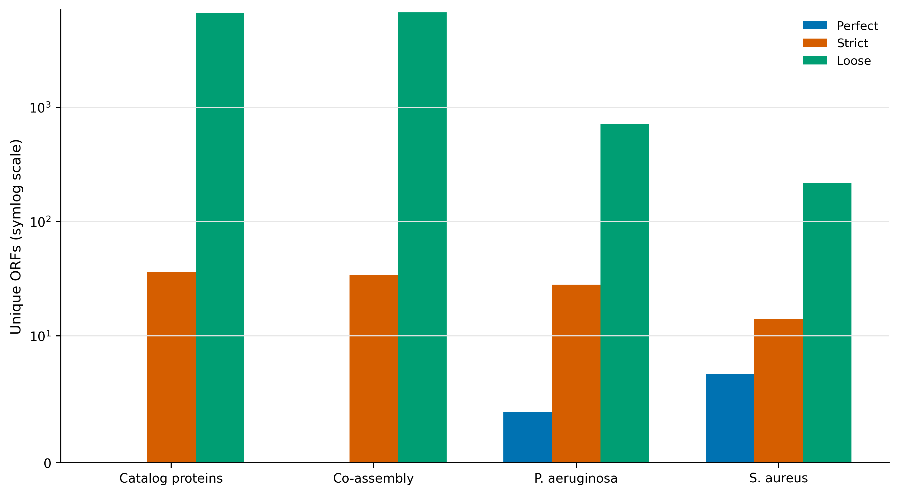
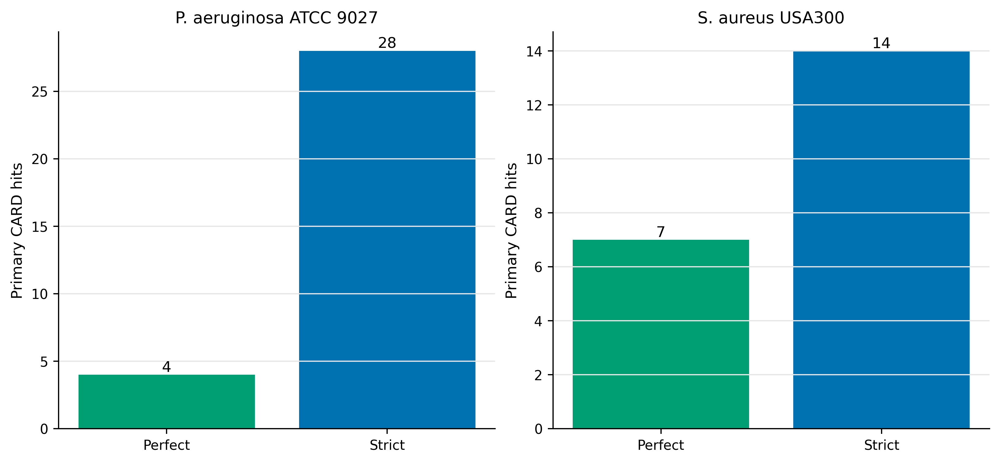
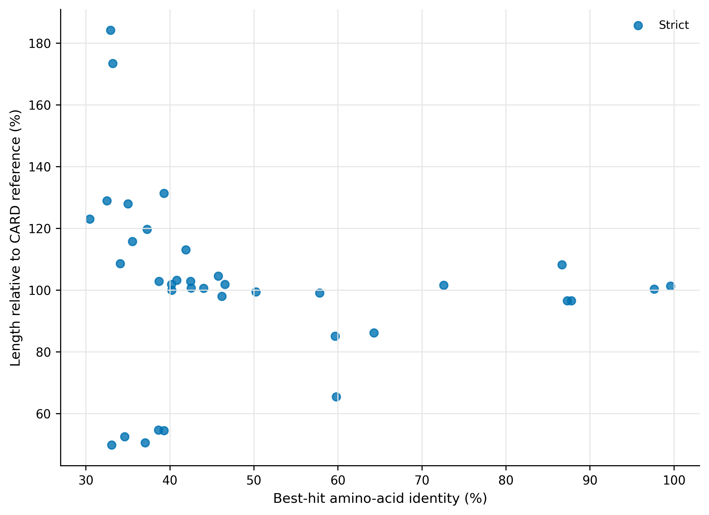
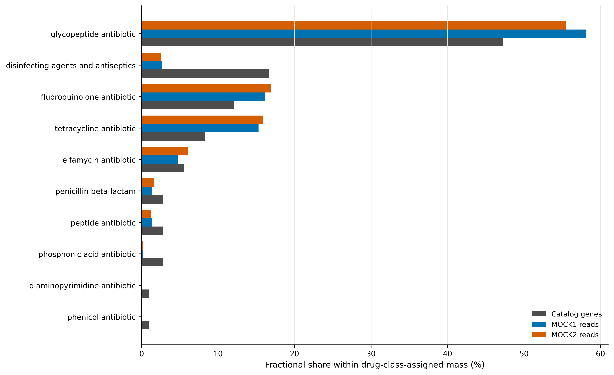

> **学习目标：**用 Resistance Gene Identifier（RGI）调用 Comprehensive Antibiotic Resistance Database（CARD）的 model-aware resistome；分清 Perfect、Strict 与 Loose；理解 protein 与 contig 分支能看见的模型不同；用正控验证流程；把 ARG sequence evidence 与 antimicrobial susceptibility phenotype 分开。  
> **真实数据：**93,782 条 Article 34 catalog proteins、Article 30 的 18,354 条 $≥1$ kb co-assembly contigs（84.81 Mb），以及 *Pseudomonas aeruginosa* ATCC 9027 和 *Staphylococcus aureus* USA300 FPR3757。catalog read weights来自 Article 35。  
> **结论边界：**RGI 命中表示 sequence/model evidence；它不等同于 isolate 的 MIC、临床耐药、基因表达或可移动性。Loose 不进入主 ARG abundance。

::: {.callout-tip title="先确定这一点"}

序列相似性、归属证据与表型结果需要分开；缺少相应验证时，结论停留在抗性相关遗传潜力。

:::

## 检出抗性相关序列，能说明表型耐药吗？ {#sec-target}

锚定 CARD 2023 的数据库/模型框架与在线 RGI 部分：CARD 把 curated reference sequences、Antibiotic Resistance Ontology（ARO）和 detection models 连在一起，不是把所有 ARG 压成一个固定 identity threshold [@alcock2023card]。该论文的 model inventory 也说明 homolog、variant、overexpression 与 rRNA models 的可观测输入并不相同。

DeepARG 使用深度学习从 sequence features 预测 ARG category，适合扩展候选搜索，但原始 DeepARG 1.0.4 的软件与训练数据库已经形成 legacy stack [@arangoargoty2018deeparg]。本文把它放在隔离的 sensitivity environment，不让它替代 CARD-RGI 的 curated model thresholds。

{#fig-38-tiers}

::: {.callout-important title="先给结论：主分析只有 36 条，不是 6,799 条"}
catalog protein 分支共输出 6,799 hits，其中 36 条为 Strict，0 条为 Perfect，6,763 条为 Loose。主 resistome 只包含 Perfect + Strict；Loose 是预先声明的 sensitivity set。若把全部输出行都叫 ARG，结果会被 6,763 个低于 curated model threshold 的候选支配。
:::

## 准备输入与数据库 {#sec-code}


准备器核对两种 catalog FASTA、co-assembly、controls、CARD canonical archive 与 loaded `card.json`；CARD `_version` 必须为 `4.0.1`。

## protein catalog 主分析

### 输入类型决定可观测模型

| Input | 优势 | 主要盲点 |
|---|---|---|
| Protein catalog | 快；可直接连接 gene abundance；适合 protein homolog models | 看不到 rRNA variants；核苷酸位点与 contig context 丢失；partial ORF 可能截断 |
| Nucleotide contigs | 可重新 call ORFs；可捕获部分 nucleotide/variant context；保留邻域 | 短 contig 会截断；宿主/MGE 归属仍需 binning/plasmid/long reads |
| Raw reads | 可减少 assembly loss，适合专用 read-level pipeline | 多重比对、短片段 specificity 与单位定义更困难 |

本次 catalog 与 co-assembly 两条分支并行：protein 主分支用于 gene/read weighting；contig 分支用于检查输入模型与 context sensitivity。它们不是两个独立生物学重复。


`--include_loose` 只为了生成 sensitivity ledger；主筛选仍为 `Cut_Off %in% c("Perfect", "Strict")`。本次不启用 `--include_nudge`，避免将近阈值 Loose 自动改写成 Strict。

### Loose 只回答“候选有多大”

catalog 中 6,763 个 Loose genes 是主集合的 188 倍。报告它们的价值是说明 uncertainty envelope，而不是把 sensitivity 当 discovery yield。若研究目标是新 ARG discovery，Loose 还需结构域、保守位点、synteny、宿主背景和实验功能验证。

## contig 与正控分支


contig 核心参数为 `-t contig --low_quality -g PYRODIGAL`；co-assembly 的 data type 为 `wgs`，完整 controls 为 `chromosome`。`--low_quality` 允许研究 draft contigs，却不能把 partial model 命中解释为完整 resistance cassette。

### 正控验证 pipeline，不验证所有表型

*P. aeruginosa* 正控有 4 Perfect + 28 Strict；*S. aureus* 正控有 7 Perfect + 14 Strict，并检出 `mecA` 等高相似度 hits。正控证明安装、数据库和输入模式能回收已知 sequence evidence；它不替代 AST，也不能证明每个命中的药物类别都在当前培养条件下表达。

{#fig-38-controls}

::: {.callout-caution title="审稿人最常追问的七件事"}

1. 把 RGI 输出的全部行都叫 ARG，不区分 Perfect/Strict/Loose。
2. 用统一 identity cutoff 覆盖 CARD model-specific thresholds。
3. 开启 nudge 却不报告，导致 Loose/Strict 边界不可复现。
4. protein catalog 分支声称捕获 rRNA resistance variants 或完整 nucleotide context。
5. 把 efflux pump、porin、regulator hit 直接写成临床耐药。
6. 将同一多药 gene 完整复制到多个 drug classes，造成 abundance 膨胀。
7. 没有正控、数据库 release、`card.json` SHA-256 或工具版本。

:::

## 补回零命中并构建主/敏感性 ledger

### ARG presence 到 phenotype 还缺三座桥

耐药表型至少取决于：完整且正确的 resistance allele、表达/调控与宿主背景、抗菌药物和实验条件。对 efflux pump、porin、regulator、target mutation 尤其如此。一个 sequence hit 既不能证明 expression，也不能证明 MIC 超过临床 breakpoint。


```text
GeneID  Completeness  EvidenceTier  PrimaryARG  BestHitARO  ModelType  DrugClasses
megahit-co__c000001_1  Partial     No hit  no  -  -  -
megahit-co__c000002_1  Incomplete  No hit  no  -  -  -
megahit-co__c000003_1  Partial     Loose   no  ...  protein homolog model  ...
```

完整表有 93,782 行。36 个主 genes 在 MOCK1/MOCK2 分别承载 1,682/1,778 assigned reads，即约 0.060%/0.064% 的 catalog-assigned read mass；这是相对 read evidence，不是每毫升 ARG copies。

## 读取保存表与结果核对

### 三个 tier 的含义 {#sec-theory}

- **Perfect**：query 与 CARD curated reference model 的预期序列完全匹配；这不是“表型必然耐药”。
- **Strict**：通过相应 CARD detection model 的 curated bit-score/variant rule，但不要求 100% identity。
- **Loose**：有一定相似性，却没有通过该 model 的 Strict 门槛；可用于发现候选，不宜直接作 prevalence 或 abundance 主结果。

因此不存在一个可以替代 RGI model rules 的统一“identity $≥90% 即 ARG”公式。不同 families 的可区分近邻、长度与 resistance-conferring variants 不同。

### 多药类别必须 fractional allocation

一条 ARG 可以对应多个 drug classes。若有 $m_g$ 个 classes，class $k$ 的 gene mass 为 $1/m_g$，read mass 为 $c_{gs}/m_g$。主集合的 fractional gene equivalents 必须闭合到 36，另外保留 `GenesWithLabel` 表示 overlap。

{#fig-38-quality}


### 不再用统一 identity cutoff 代替 model rule {#sec-audit}

36 个 catalog primary genes 全部为 Strict；其 amino-acid identities 和 reference-length ratios 跨越较宽范围。它们通过的是各自 CARD model 的 bit-score/variant contract。图中的 identity 只用于审计，不应反过来造一个全 families 通用门槛。

### 从 gene list 升级为守恒的 drug-class profile

36 个 primary genes 主要落在 target alteration、efflux 与 inactivation 三类 mechanisms；drug classes 以 glycopeptide、disinfectant/antiseptic、fluoroquinolone 和 tetracycline 为主。多药 genes 采用 fractional allocation，因此 class totals 不会凭空超过 36。

{#fig-38-class}

### DeepARG 的合理位置

DeepARG 可作为预先声明的 ML sensitivity branch，但必须记录模型/数据库 snapshot，并与 RGI 主集合画 overlap，而不能将 DeepARG score 与 CARD Strict 混成同一 confidence。原始 DeepARG 1.0.4 的 legacy dependencies 需隔离；若无法完整锁定训练数据库，结果只能用于探索。

## 区分序列检出与表型结论 {#sec-methods}

### Methods template

> Antimicrobial resistance determinants were identified with RGI v6.0.8 and CARD v4.0.1. Protein-catalogue searches used DIAMOND v2.2.4, whereas nucleotide contigs and control genomes were processed in low-quality contig mode with Pyrodigal v3.7.1. Perfect and Strict RGI calls were prespecified as the primary resistome; Loose calls were retained only for sensitivity analysis, and nudging was disabled. Multi-drug annotations were summarized by fractional allocation across drug classes. Gene abundance was calculated from audited raw read assignments to the same 93,782-protein catalogue. *Pseudomonas aeruginosa* ATCC 9027 and *Staphylococcus aureus* USA300 FPR3757 served as positive sequence controls. Software, CARD archive and `card.json` identities were locked by SHA-256; deterministic interfaces used seed 20260738.

结果段可接：

> Thirty-six catalogue proteins met the primary Perfect/Strict criterion, whereas 6,763 additional proteins were classified as Loose and were excluded from primary abundance estimates. Sequence evidence was not interpreted as antimicrobial susceptibility or clinical resistance.

## 换到自己的研究中，先检查哪些条件？ {#sec-own-data}

你需要 protein FASTA 或 contigs、stable IDs、与 gene IDs 对齐的 abundance，以及明确研究目标：surveillance、candidate discovery 还是 phenotype prediction。

1. 固定 RGI、CARD release、alignment backend、input type、Loose 和 nudge policy。
2. protein 与 contig 分支分别记录，不把它们当独立 replicates。
3. Perfect+Strict 作为主集合；Loose 单独报告并做验证优先级排序。
4. variant/rRNA/overexpression models 根据所需 sequence context 选择输入；不要超出输入能力。
5. 需要宿主归属时结合 MAG、plasmid/MGE prediction、coverage linkage 或 long reads。
6. 需要临床结论时加入 isolate-level AST/MIC、表达和 breakpoint 标准；宏基因组 ARG presence 不能替代这些数据。

## 图中应该保留哪些信息？ {#sec-publication}

- Perfect、Strict、Loose 使用固定颜色和独立图例；纵轴跨数量级时标明 symlog/log。
- identity/length 图不绘制伪造的统一 RGI threshold；图注写清真正 gate 是 CARD model。
- drug classes 很长时横向排列，正文报告 top classes，补充表保留全部。
- 所有图只用英文标签；PDF、350 dpi PNG、LZW TIFF 同时导出。

## 回到最初的问题

ARG 不是一个统一 identity cutoff。本文以 RGI 6.0.8 + CARD 4.0.1 实跑 protein catalog、co-assembly 与双阳性对照，严格分开 Perfect/Strict 与 Loose，并解释为什么基因存在不等于耐药表型。

## 参考文献 {#sec-references}

- CARD 2023 and RGI framework [@alcock2023card]
- DeepARG [@arangoargoty2018deeparg]
