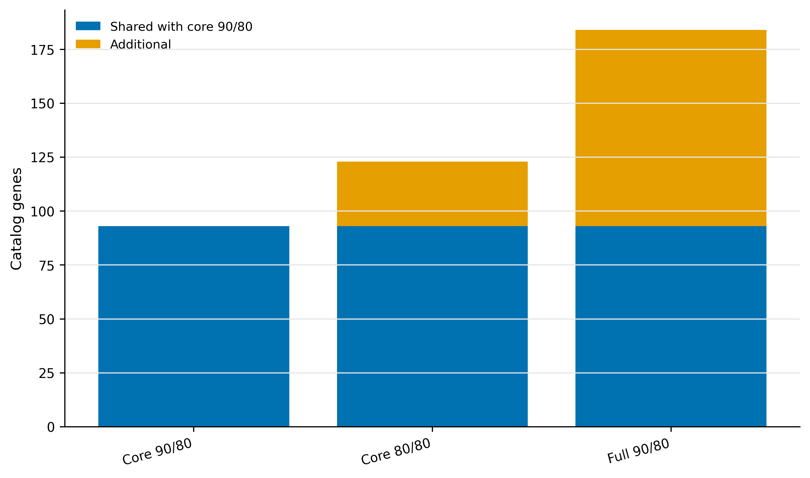
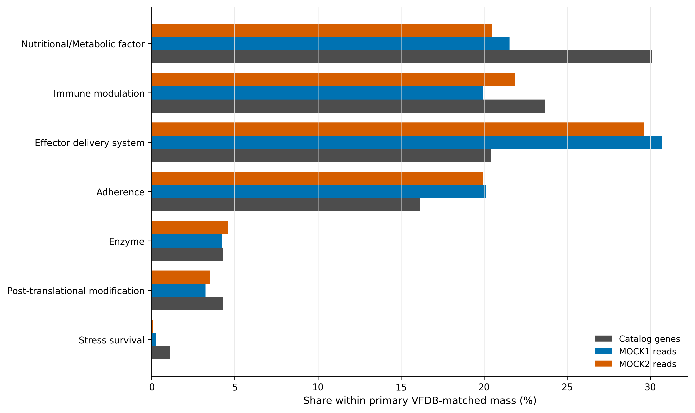
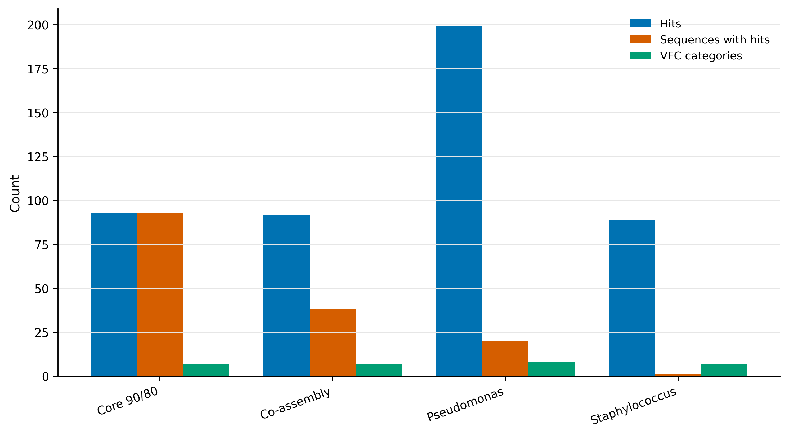
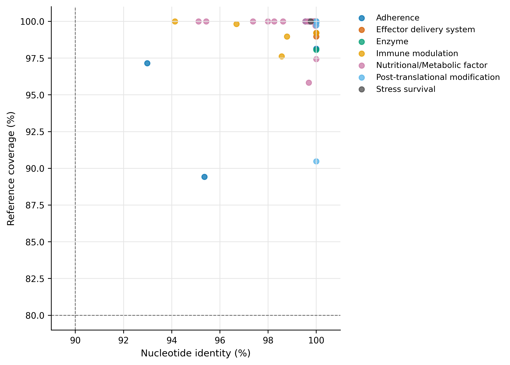

> **学习目标：**构建可审计的 VFDB core/full databases；用 ABRicate 同时锁定 minimum identity 与 reference coverage；把 threshold sensitivity 与 database sensitivity 分开；解析 VFDB general categories；理解 virulence-associated sequence 与 pathogenic phenotype 之间缺失的证据。  
> **真实数据：**Article 34 的 93,782 条代表基因核酸序列、Article 30 的 84.81 Mb co-assembly、Article 35 的 assigned-read ledger，以及 *Pseudomonas aeruginosa* ATCC 9027 和 *Staphylococcus aureus* USA300 FPR3757 正控。  
> **结论边界：**本文的“virulome”指 VFDB-matched sequence repertoire。单个 adhesion、motility、nutritional、regulatory 或 secretion-associated homolog 不能独立证明一个菌株致病，更不能证明样本对宿主造成疾病。

::: {.callout-tip title="先确定这一点"}

同源命中不是功能或疾病效应的证明；解释时必须保留数据库、注释可信度和研究对象的限制。

:::

## 毒力数据库命中，为什么不能直接等同致病能力？ {#sec-target}

锚定 VFDB 2022 的 general classification scheme：该研究把不同病原体的 virulence factors 统一整理到可用于 pan-bacterial/metagenomic analysis 的 VFC categories [@liu2022vfdb]。这正对应本文的 category summary，但数据库作者强调的是知识库和分类框架，不是“检测到一条同源序列即可判定致病”。

VFDB 下载页把 core set A 定义为 experimentally verified virulence factors 的 representative genes，把 full set B 扩展到所有与 known/predicted VFs 相关的 genes。本文因此将 set A 固定为主数据库，把 set B 作为数据库范围敏感性，而不是将两者混用。

{#fig-39-sensitivity}

::: {.callout-important title="先给结论：93、123 和 184 不能任选一个"}
VFDB core set A、identity ≥90%、reference coverage ≥80% 的预设主分支检出 93 条 catalog genes。把 identity 放宽到 80% 增加 30 条；保持 90/80 但换成 full set B 增加 91 条。主结果只能是预先声明的 93 条，另两组用于回答结论对阈值和数据库范围是否敏感。
:::

## 准备并核对真实输入 {#sec-code}


准备器同时核对 raw snapshots、formatted sequences、build manifests、catalog、co-assembly 与 controls。formatted hash 也被锁定，避免同一 raw FASTA 因 header parser 改动产生不同数据库。

## 运行六个预设分支

### Core 与 full 是两个 reference universes

- **Core set A**：代表性的、与实验验证 VF 关联的 genes；更适合作为高 specificity 主筛选。
- **Full set B**：包含更多 known/predicted VF-related genes；提高 recall，也更容易纳入广泛保守的结构、代谢和调控 genes。

数据库差异产生的 91 条 additional hits 不应写成“新发现 91 个毒力基因”；它们首先表明结论依赖 reference scope。


主命令为：


其余分支只改变一个因素：`vfdb-core 80/80` 测 threshold sensitivity，`vfdb-full 90/80` 测 database sensitivity；co-assembly 与两套 controls 均保持 core 90/80。

### ABRicate 的适用范围

ABRicate 是快速 nucleotide screening wrapper [@seemann2026abricate]，适合 exact-ish gene detection 和数据库敏感性审计。对高度发散 homolog、结构域重排、短 reads 或需要 model-specific variant rules 的问题，应改用 profile HMM、protein-level orthology、专用 caller 或实验验证，而不是无限放宽 `--minid`。

## 补回零命中并解析 VFC

### VFC category 仍不是 phenotype

VFC general categories 包含 adherence、effector delivery、immune modulation、motility、biofilm、nutritional/metabolic factor 等。许多类别参与致病过程，但同源 genes 也可能出现在环境菌、共生菌或不具相同调控/基因组背景的菌株中。完整 operon、allele、synteny、host taxonomy、表达和实验模型决定解释强度。


```text
GeneID  CorePrimary  CoreSensitive  FullPrimary  Gene  VirulenceFactor  VFCCategory
megahit-co__c000001_1  no  no  no  -  -  -
megahit-co__c000002_1  no  no  no  -  -  -
megahit-co__c000303_2  no  no  yes pilA Type IV pili Adherence
```

主集合 93 条 genes 在 MOCK1/MOCK2 分别承载 3,469/3,303 assigned reads。表中 `CoreSensitive` 和 `FullPrimary` 是独立 flags，不能用 OR 合并成新的“主 virulome”。

### VFC category 只描述 annotation composition

主集合包括 nutritional/metabolic factor 28、immune modulation 22、effector delivery 19、adherence 15，以及少量 enzyme、post-translational modification 和 stress survival genes。这些 categories 是 VFDB curation labels；“metabolic factor”或“adherence homolog”尤其不能单独用来给样本贴 pathogenic 标签。

{#fig-39-vfc}

::: {.callout-caution title="审稿人最常追问的七件事"}

1. 不写 VFDB 是 core 还是 full，也不写 snapshot date/hash。
2. 只设 identity、不设 reference coverage，短 conserved fragments 大量进入结果。
3. 观察结果后反复调阈值，最后只报告命中最多的一组。
4. 把 set B 的 predicted/related genes 与 set A 主结果混为一个证据等级。
5. 把 motility、adhesion、metabolism 或 regulation homolog 直接称为 pathogen。
6. 将 catalog 与 co-assembly 的 hits 当作独立重复进行显著性检验。
7. 没有 host/strain、operon completeness、expression 或 phenotype，却下疾病风险结论。

:::

## 读取保存证据并复核门槛

### Identity 与 coverage 缺一不可 {#sec-theory}

ABRicate 报告 query/reference nucleotide alignment。设 aligned identical bases 为 $M$，aligned length 为 $L$，reference length 为 $R$：

$$
\text{identity}=100\frac{M}{L},\qquad
\text{reference coverage}=100\frac{L}{R}.
$$

高 identity 的短片段可能只是 conserved domain；高 coverage 的远同源也可能已经改变功能。因此主分支同时要求 90% identity 与 80% reference coverage。它们是 operational screening thresholds，不是病原性判定标准。


### 主结果先固定 reference scope {#sec-audit}

core 90/80 的 93 条主 genes 全部被 core 80/80 和 full 90/80 回收。放宽 identity 新增 30 条，扩大数据库新增 91 条。这个嵌套关系使 sensitivity 可解释：前者衡量 sequence-distance boundary，后者衡量 database-content boundary。

### 正控与 contig context 是解释门，不是表型替代

*P. aeruginosa* 正控得到 199 hits、8 个 VFC categories；*S. aureus* 正控得到 89 hits、7 个 categories。co-assembly 有 92 hits 分布在 38 条 contigs。应进一步查看同一 contig/MAG 上的完整 operon、邻域、移动元件和 host taxonomy；对关键候选，再用 expression、cell model 或 infection phenotype 验证。

{#fig-39-context}

## 保存与结果核对

### Gene 与 contig 两条视角不能混为重复

catalog branch 提供稳定 gene IDs 和 read weights；co-assembly branch保留邻近关系，却可能让同一 contig 上的多个 hits 共用 `SEQUENCE`。本次 93 个 catalog hits 对应 93 条 representative genes，而 co-assembly 的 92 hits 聚集在 38 条 contigs。后者说明 context clustering，不是“只有 38 个毒力基因”。

{#fig-39-quality}


## 限定毒力相关注释的解释范围 {#sec-methods}

### Methods template

> Virulence-associated sequences were screened with ABRicate v1.4.0 and BLAST+ v2.17.0. The primary database was the VFDB core set A snapshot downloaded on 24 July 2026 (4,895 sequences; SHA-256 recorded), and primary hits required at least 90% nucleotide identity and 80% reference-sequence coverage. Two prespecified sensitivity analyses used the core set at 80% identity/80% coverage and the VFDB full set B (35,188 sequences) at 90% identity/80% coverage. Catalogue genes were linked to audited raw read assignments; co-assembly and two control genomes were analysed separately for genomic-context and recovery checks. VFDB general categories were parsed from the original headers. Deterministic interfaces used seed 20260739. Sequence matches were interpreted as virulence-associated annotations, not as evidence of pathogenic phenotype.

结果段可接：

> The primary core 90/80 screen identified 93 catalogue genes. Relaxing identity to 80% added 30 genes, whereas expanding the reference universe to the full VFDB set at the primary thresholds added 91 genes. These branches were retained as sensitivity analyses and were not merged with the primary set.

## 换到自己的研究中，先检查哪些条件？ {#sec-own-data}

你需要 assembled genes/contigs、稳定 IDs、abundance，以及与研究问题匹配的 host/strain/context metadata。

1. 下载并 hash VFDB core/full snapshots；记录访问日期和 sequence counts。
2. 预注册 primary database、identity、coverage 与 sensitivity branches。
3. 将主 hits 左连接回完整 gene universe，保留零命中。
4. 对 contig/MAG 检查 operon completeness、contig edges、host taxonomy 与 mobile context。
5. 若声称 pathogenic potential，至少加入完整 factor combination、strain background 与表达证据。
6. 若声称实际 virulence，加入细胞/动物模型、临床 phenotype 或其他直接功能证据。

## 图中应该保留哪些信息？ {#sec-publication}

- sensitivity 图把 shared 与 additional 分开，避免仅画三个总数造成“数据库越大越好”的暗示。
- identity/coverage 图画出 90/80 operational gates，并在图注声明它们不是 pathogenicity thresholds。
- VFC labels 全部使用英文；长标签横向排列。
- 主图固定 core 90/80；full/80-identity 只用 secondary color。
- 同时导出 PDF、350 dpi PNG 与 LZW TIFF。

## 回到最初的问题

Virulome 最危险的误读，是把 VFDB 同源序列直接叫致病性。本文用 ABRicate 1.4.0 实跑 VFDB core/full、90/80 与 80/80 阈值，并以双物种正控拆开 sequence evidence、genomic context 与 phenotype。

## 参考文献 {#sec-references}

- VFDB general classification [@liu2022vfdb]
- ABRicate software [@seemann2026abricate]
