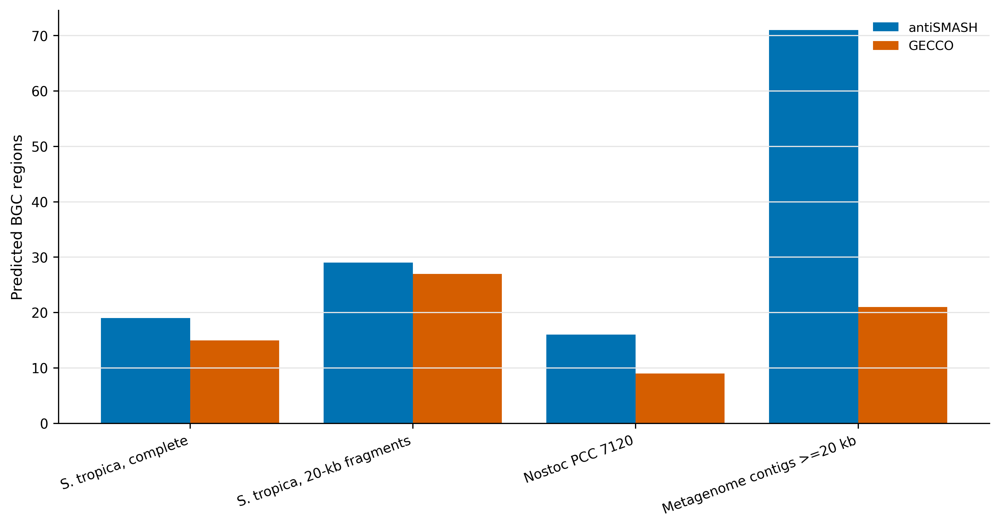
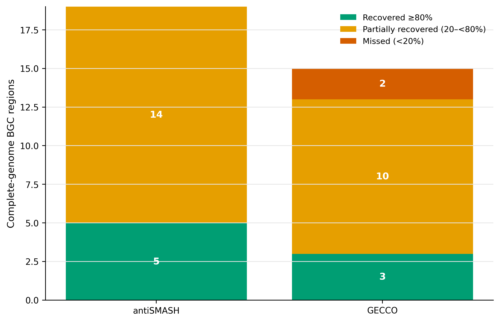
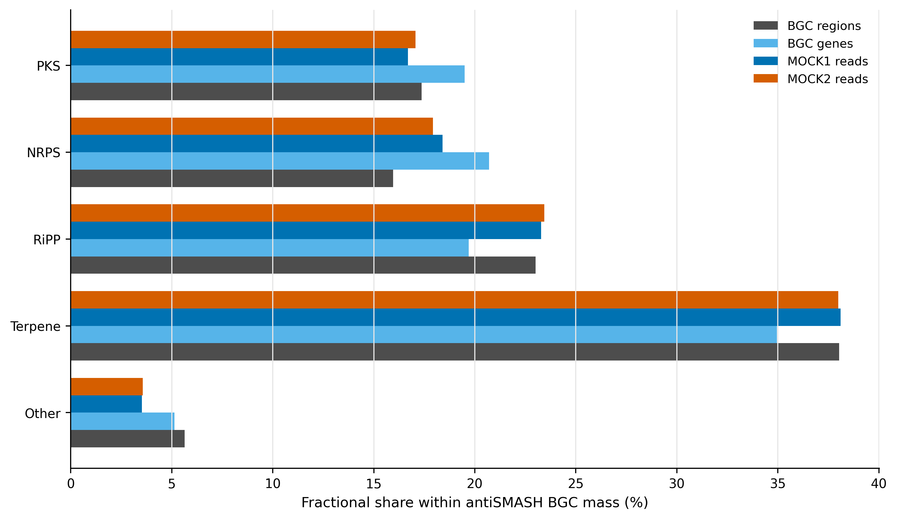
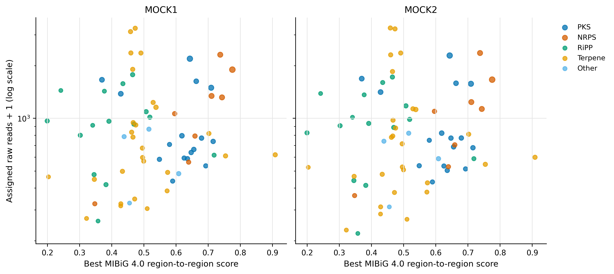

> **先给结论：**BGC（biosynthetic gene cluster，生物合成基因簇）不能靠单个 biosynthetic gene 判定。主分支用 antiSMASH 8.0.4 的 curated rules 定边界，GECCO 0.10.3 作为 de novo cross-check；完整 *Salinispora tropica* CNB-440 分别检出 19/15 个 regions，而把同一染色体切成 20 kb fragments 后变成 29/27 个 calls。以完整基因组 region 为基准，antiSMASH 只有 5/19、GECCO 只有 3/15 保留至少 80% 的边界覆盖。真实共组装的 ≥20 kb contigs 上，antiSMASH/GECCO 分别给出 71/21 个 regions，其中 17 个满足双向 overlap ≥25%。因此，metagenome BGC 的第一不确定性通常不是颜色怎么画，而是 contig fragmentation、工具定义和 reference universe。

::: {.callout-important title="算力与数据边界"}
本次以 32 CPU cores 实跑。完整基因组分支的 peak RAM 为 0.43–0.83 GiB、耗时 12 秒至 7 分 50 秒；39.7 Mb 的真实共组装子集上，antiSMASH 用时 22 分 26 秒、peak 0.77 GiB，GECCO 用时 52 秒、peak 1.77 GiB。建议预留 **16 GB RAM、32 CPU cores、30 GB 可用磁盘和 1 小时**；启用更多 antiSMASH modules、处理大队列或长读长组装时需按输入规模上调。
:::

## 这一步对应论文里的哪张图 {#sec-target}

锚定图是 *S. tropica* CNB-440 基因组论文 Figure 1：环形染色体外圈标出 secondary-metabolite loci [@udwary2007salinispora]。原研究按当时的 domain library 报告 17 个 biosynthetic loci；用 antiSMASH 8.0.4、MIBiG 4.0 重新分析同一条 5,183,331-bp 染色体得到 19 个 regions。两者不是简单“多检出两个”：rule set、边界合并、数据库和 BGC ontology 都已变化。

antiSMASH 8 把可检测 cluster types 从 81 扩到 101，并更新了 terpene、tailoring enzyme、NRPS/PKS 与 MIBiG 4.0 comparison [@blin2025antismash8]。最终要复现的不是网页截图，而是四张可审计的论文图：工具 yield、fragmentation recovery、BGC type composition，以及 MIBiG similarity 与 read abundance 的联合图。

{#fig-40-yield}

## 理论：从一个“命中”到可解释的 BGC {#sec-theory}

### 1. BGC 是邻域证据，不是 gene list

BGC 是一组在基因组上相邻、共同参与 specialized metabolite biosynthesis 的 genes。PKS、NRPS、RiPP precursor、tailoring enzymes、transporters 与 regulators 提供不同证据。单独命中一个 ketosynthase domain，既不能确定完整 cluster，也不能证明样本产生对应化合物。

### 2. Rule-based 与 de novo 模型回答不同问题

antiSMASH 用人工维护的 biosynthetic rules 和 profile HMMs 定义 protoclusters，再把重叠 protoclusters 合并为 regions [@blin2025antismash8]。优点是类别和核心 gene 可解释；代价是新化学空间仍受 rule vocabulary 约束。

GECCO 用 conditional random field 根据相邻 proteins 的 domain evidence 进行 de novo 预测，强调高精度、可扩展和模型可解释性 [@carroll2021gecco]。DeepBGC 则用深度学习序列模型学习 BGC context [@hannigan2019deepbgc]。两类机器学习 scores 不是 antiSMASH rule 的概率版本，也不能直接相加。

### 3. 跨工具共识必须先定义边界重叠

对同一 contig 上的两个 regions (A) 与 (B)，本次把 cross-tool support 预定义为：

\[
\frac{|A\cap B|}{|A|}\ge 0.25
\quad\text{且}\quad
\frac{|A\cap B|}{|B|}\ge 0.25.
\]

双向门槛防止一个很长 region 仅擦到一个很短 region 就被叫作“共识”。25% 是 operational matching rule，不是普适生物学常数；改变它必须作为 sensitivity analysis 报告。

### 4. MIBiG similarity 不是 compound novelty

MIBiG 4.0 是人工整理的 experimentally characterized BGC 集合 [@zdouc2025mibig4]。高 similarity 支持“接近已知 BGC”，低 similarity 只表示当前 sequence/context 与该 reference universe 不近。它不能证明产物新颖，更不能证明结构、产量或活性。

### 5. Read-weighted abundance 要从 BGC 内 genes 守恒汇总

一个 gene 若被多个重叠 regions 包含，先按 region 数量分配权重 (w_{gr}=1/k_g)，再汇总样本 (s) 的 raw reads：

\[
A_{rs}=\sum_{g\in r}w_{gr}C_{gs},
\qquad
P_{rs}=100\frac{A_{rs}}{\sum_g C_{gs}}.
\]

这里 (P_{rs}) 是 catalog-assigned read mass，不是细胞比例，也不等于 metabolite concentration。

## 准备工作 {#sec-setup}

### 算力门槛

| 分支 | 输入规模 | 实跑耗时 | Peak RAM | 建议 |
|---|---:|---:|---:|---:|
| *S. tropica*, complete | 5.18 Mb | antiSMASH 1:34；GECCO 0:21 | 0.61/0.83 GiB | 8 cores, 8 GB RAM |
| *S. tropica*, 20-kb fragments | 5.18 Mb / 260 fragments | antiSMASH 7:50；GECCO 0:12 | 0.43/0.85 GiB | 16 cores, 8 GB RAM |
| *Nostoc* PCC 7120 | 7.21 Mb / 7 records | antiSMASH 1:21；GECCO 0:28 | 0.56/0.87 GiB | 8 cores, 8 GB RAM |
| Co-assembly contigs ≥20 kb | 39.67 Mb / 675 contigs | antiSMASH 22:26；GECCO 0:52 | 0.77/1.77 GiB | 32 cores, 16 GB RAM |

没有服务器时，可直接读取 `data/small/40-bgc-natural-products-frozen/` 的 region ledger、fragmentation table、MIBiG summary、gene-to-BGC mapping 和资源日志。在线 antiSMASH 适合少量完整 genomes；涉及未公开人源样本时，不应上传到公共 web service。

<details>
<summary>点开：锁定两个环境、antiSMASH databases 与内联出版主题</summary>

```bash
mamba create -n metagenome-antismash8-2026.07 \
  --file env/antismash8-linux-64.lock
mamba create -n metagenome-bgc-gecco-2026.07 \
  --file env/bgc-gecco-linux-64.lock

conda activate metagenome-antismash8-2026.07
export DB_ROOT="/absolute/path/antismash8"
db/download_db.sh antismash8-install
db/download_db.sh antismash8-verify
```

数据库审计锁定 PFAM 35.0、MIBiG 4.0 和 MITE 1.3 的七个关键文件；总数据库目录约 9.4 GB。下载器来自 antiSMASH 8.0.4 环境，随后逐文件核对 bytes 与 SHA-256。

```{r}
install.packages(c("ggplot2", "dplyr", "readr", "tidyr", "forcats", "scales", "patchwork"))
library(ggplot2); library(dplyr); library(readr); library(tidyr); library(forcats)
set.seed(20260740)

pal_pub <- c(
  antiSMASH = "#0072B2", GECCO = "#D55E00",
  PKS = "#0072B2", NRPS = "#D55E00", RiPP = "#009E73",
  Terpene = "#E69F00", Saccharide = "#CC79A7", Other = "#7F7F7F",
  `BGC regions` = "#4D4D4D", `BGC genes` = "#56B4E9",
  `MOCK1 reads` = "#0072B2", `MOCK2 reads` = "#D55E00"
)
scale_color_pub <- function(...) scale_color_manual(values = pal_pub, ...)
scale_fill_pub  <- function(...) scale_fill_manual(values = pal_pub, ...)
theme_pub <- function(base_size = 12) {
  theme_bw(base_size = base_size) + theme(
    panel.grid.minor = element_blank(), panel.grid.major.y = element_blank(),
    axis.text = element_text(color = "black"), legend.key = element_blank(),
    strip.background = element_rect(fill = "#EEF3F5", color = NA),
    plot.title.position = "plot"
  )
}
save_pub <- function(plot, file_base, width = 180, height = 120, units = "mm", dpi = 350) {
  dir.create(dirname(file_base), recursive = TRUE, showWarnings = FALSE)
  ggsave(paste0(file_base, ".pdf"), plot, width = width, height = height, units = units, device = cairo_pdf)
  ggsave(paste0(file_base, ".png"), plot, width = width, height = height, units = units, dpi = dpi, bg = "white")
  ggsave(paste0(file_base, ".tiff"), plot, width = width, height = height, units = units, dpi = dpi, compression = "lzw", bg = "white")
  invisible(plot)
}
```

</details>

### 真实数据与 lineage

| 数据 | 标识符 | 角色 |
|---|---|---|
| *S. tropica* CNB-440 | GCA_000016425.1 / CP000667.1；5,183,331 bp | 含 salinosporamide、sporolide、salinilactam 等已知 BGC 的完整基因组正控 [@udwary2007salinispora] |
| *Nostoc* PCC 7120 | GCA_000009705.1 / BA000019.2；chromosome + 6 plasmids | 不同门类的完整基因组正控 [@kaneko2001nostoc] |
| MEGAHIT co-assembly | checksum-locked co-assembly；确定性筛选 675 条 ≥20 kb contigs | 真实 fragmented-metagenome branch |
| Gene membership / abundance | checksum-locked catalog and abundance tables | 将 co-assembly ORFs 映射到 93,782-gene catalog 和两样本 raw reads |

完整序列、数据库和临时 indexes 不进入 git；输入 compressed SHA-256、数据库文件 SHA-256、命令、版本和 compact outputs 进入 frozen evidence。

## 可复制代码：双工具、碎片化正控与 abundance {#sec-code}

### 第 1 步：准备并核对输入

```bash
ROOT="$PWD"
WORK="work/article40"
AS_ENV="$HOME/miniconda3/envs/metagenome-antismash8-2026.07"
GECCO_ENV="$HOME/miniconda3/envs/metagenome-bgc-gecco-2026.07"
AS_DB="/absolute/path/antismash8"

python3 scripts/prepare_article40_bgc.py \
  --project-root "${ROOT}" --work-dir "${WORK}" \
  --antismash-database "${AS_DB}" \
  --antismash-env "${AS_ENV}" --gecco-env "${GECCO_ENV}" \
  --minimum-contig 20000 --fragment-size 20000
```

准备器执行五层 fail-closed 检查：两个完整 genomes、共组装、catalog membership、abundance 的 SHA-256；antiSMASH 七个数据库文件；序列数与总 bp；675 条 contig 子集；`antiSMASH --check-prereqs`。`salinispora-fragment-map.tsv` 固定每个 20 kb fragment 在完整染色体上的坐标。

### 第 2 步：运行八个预设分支

```bash
python3 scripts/run_article40_bgc.py \
  --work-dir "${WORK}" \
  --antismash-database "${AS_DB}" \
  --antismash-env "${AS_ENV}" --gecco-env "${GECCO_ENV}" \
  --threads 32
```

antiSMASH 的固定参数为 bacterial taxon、`--minimal --cc-mibig --cb-knownclusters`；完整 genomes 用 `prodigal`，fragments 与 metagenome contigs 用 `prodigal-m`。GECCO 固定 `--threshold 0.8 --cds 3`。命令、UTC 起止时间、stdout/stderr 与 `/usr/bin/time -v` 全部写入日志。

### 第 3 步：生成 compact evidence

```bash
python3 scripts/summarize_article40_bgc.py \
  --project-root "${ROOT}" --work-dir "${WORK}"

column -t -s $'\t' "${WORK}/summary/tool-yield-summary.tsv"
column -t -s $'\t' "${WORK}/summary/mibig-similarity-summary.tsv"
```

关键输出如下：

| Dataset | antiSMASH | GECCO | antiSMASH supported by GECCO | GECCO supported by antiSMASH |
|---|---:|---:|---:|---:|
| *S. tropica*, complete | 19 | 15 | 14 | 14 |
| *S. tropica*, 20-kb fragments | 29 | 27 | 20 | 20 |
| *Nostoc* PCC 7120 | 16 | 9 | 9 | 9 |
| Co-assembly contigs ≥20 kb | 71 | 21 | 17 | 17 |

### 第 4 步：检查 fragmentation 与已知正控

```{r}
frozen <- "data/small/40-bgc-natural-products-frozen"
fragmentation <- read_tsv(file.path(frozen, "fragmentation-sensitivity.tsv"), show_col_types = FALSE)
positive <- read_tsv(file.path(frozen, "salinispora-positive-control.tsv"), show_col_types = FALSE)

fragmentation |>
  count(Tool, RecoveryClass) |>
  arrange(Tool, factor(RecoveryClass,
    levels = c("Recovered >=80%", "Partial 20-<80%", "Missed <20%")))

positive |>
  filter(str_detect(TopKnownClusterDescription, "salinosporamide|sporolide|salinilactam")) |>
  select(RegionID, Products, TopKnownClusterAccession,
         TopKnownClusterDescription, TopKnownClusterSimilarityPercent)
```

完整染色体上的 salinosporamide A region 得到 90% KnownClusterBlast similarity；切成 20 kb 后最佳对应 fragment 仅为 35%。这不是数据库退化，而是 context 和边界被人为切断。

{#fig-40-fragmentation}

### 第 5 步：把 BGC regions 接回 gene catalog 与 reads

```{r}
bgc <- read_tsv(file.path(frozen, "coassembly-bgc-abundance.tsv"), show_col_types = FALSE)
types <- read_tsv(file.path(frozen, "bgc-type-summary.tsv"), show_col_types = FALSE)

stopifnot(nrow(bgc) == 71)
stopifnot(sum(types$FractionalRegions) == 71)
stopifnot(sum(bgc$MappedFractionalGenes) == 1499)
stopifnot(sum(bgc$MOCK1FractionalRawReads) == 69790)
stopifnot(sum(bgc$MOCK2FractionalRawReads) == 68816)
```

1,499 个 BGC 内 genes 全部找到 catalog membership；其 read mass 占全部 assigned reads 的 2.507%（MOCK1）和 2.478%（MOCK2）。这些比例只描述当前 assembly/catalog 可追踪的 BGC-associated sequence mass。

{#fig-40-types}

### 第 6 步：冻结与验收

```bash
python3 scripts/freeze_article40_bgc.py \
  --project-root "${ROOT}" --work-dir "${WORK}" \
  --output-dir data/small/40-bgc-natural-products-frozen

python3 scripts/validate_article40_bgc.py \
  --project-root "${ROOT}" \
  --frozen-dir data/small/40-bgc-natural-products-frozen \
  --output-dir results/40-bgc-natural-products \
  --figure-dir figures --chapter chapters/40-bgc-natural-products.qmd
```

## 审计与升级 {#sec-audit}

### 从单工具列表升级为“定义 + overlap”

完整 *S. tropica* 上，14/19 个 antiSMASH regions 获得 GECCO support，14/15 个 GECCO regions 获得 antiSMASH support；真实共组装上则只有 17/71 与 17/21。前者说明完整上下文下两个模型大体收敛，后者说明 fragments、短 contigs 和不同边界假设放大分歧。未获共识不等于假阳性；它进入 secondary tier，等待更长 assembly、domain architecture、taxonomy 与实验证据。

### 从 call count 升级为 fragmentation recovery

20 kb fragments 让 antiSMASH calls 从 19 增至 29，看似“发现更多”，但完整 regions 中仅 5 个被覆盖 ≥80%，14 个只部分回收。GECCO 对应为 3 个充分回收、10 个部分、2 个低于 20%。call inflation 与 boundary loss 可以同时发生，所以不能只比较每 Mb 有多少 BGC。

### 从“低 MIBiG 相似”升级为候选优先级

71 个 co-assembly antiSMASH regions 中，best MIBiG region-to-region score 分为 3 个 high（≥0.75）、31 个 intermediate、36 个 low、1 个无 score。低 similarity 且 abundance 高的 region 值得优先做 assembly extension、GCF clustering、domain/synteny 检查与 metabolomics 联合分析；在这些验证之前，表述应是 **distant from characterized MIBiG entries**，不能写成 novel compound。

{#fig-40-mibig}

### DeepBGC 放在何处

DeepBGC 的价值是提供不同于 curated rules 的序列模型 sensitivity branch [@hannigan2019deepbgc]。若加入，应锁定 DeepBGC package、downloaded model 与 classifer hashes，并用相同 reciprocal-overlap rule 对齐 regions。不能把 DeepBGC probability、GECCO probability 和 antiSMASH categories 拼成一个未经校准的“总分”。当前主闭环选择 GECCO，是为了保留可运行的现代 Python 环境、domain-level introspection 和稳定 TSV/GenBank outputs。

### 从单个 regions 升级为 GCF 与 paired omics

队列级 discovery 应进一步用 BiG-SCAPE/BiG-SLiCE 聚成 gene-cluster families（GCFs），按 sample 做 prevalence/abundance，再与 metabolomics features 通过 sample-matched analysis 关联。相关不等于产物归属；确证仍需培养、表达、MS/MS、isotope tracing、heterologous expression 或基因敲除。

## 出版级美化 {#sec-publication}

1. Tool、BGC category 与 recovery state 使用固定、色盲友好色板；图内全部使用英文。
2. Yield 图同时写清输入 context，不把 complete genome 与 metagenome fragment 当同一 denominator。
3. Fragmentation 图以完整 regions 为分母，图注给出 fragment size 和 recovery threshold。
4. Type composition 使用 fractional allocation，避免一个 hybrid PKS/NRPS region 被重复计数两次。
5. Similarity–abundance 图的 y 轴取 log scale，并保留零 abundance（`reads + 1`）；MIBiG score 不改名为 novelty score。
6. 所有主图同时导出 PDF、350-dpi PNG 和 LZW TIFF；PDF 用于排版，PNG 用于网页，TIFF 用于投稿系统。

## 常见坑 {#sec-pitfalls}

::: {.callout-caution title="1. 把 fragment 数增多解释为 BGC richness 上升"}
同一条染色体切成 20 kb 后，antiSMASH 由 19 变成 29 个 calls，但 14/19 完整 regions 只得到部分回收。先做 boundary recovery，再谈 richness。
:::

::: {.callout-caution title="2. 把 MIBiG low similarity 写成 novel natural product"}
MIBiG 只覆盖已表征 BGC 的一部分；low score 也可能来自 assembly truncation、gene-calling error 或 rearrangement。novelty 需要 GCF、结构和实验链条。
:::

::: {.callout-caution title="3. 只保留 antiSMASH HTML"}
HTML 适合浏览，不适合作为唯一数据资产。至少保留 JSON/GenBank、region ledger、命令、版本、database hashes 和 compact summary。
:::

::: {.callout-caution title="4. 混用 complete-genome 与 metagenome gene finder"}
完整 bacterial genome 使用 `prodigal`；碎片化 contigs 使用 `prodigal-m`。更换 gene calls 会改变 domain arrangement 与 BGC boundaries，必须和结果一起版本化。
:::

::: {.callout-caution title="5. BGC presence 等同表达或产物"}
DNA 层面的 region 和 read abundance 都不能回答是否转录、翻译或合成化合物。至少增加 metatranscriptomics 或 metabolomics；机制性结论需要实验验证。
:::

::: {.callout-caution title="6. 把 ML probability 当跨工具可比概率"}
GECCO/DeepBGC 的 scores 来自不同模型、训练集和 calibration；antiSMASH 是 rule evidence。应分别报告，再按坐标 overlap 对齐。
:::

## 这段 Methods 怎么写 {#sec-methods}

### Methods template

> Biosynthetic gene clusters (BGCs) were predicted from bacterial assemblies with antiSMASH v8.0.4 and GECCO v0.10.3. antiSMASH was run with bacterial taxon settings, Prodigal v2.6.3 (`prodigal` for complete genomes and `prodigal-m` for fragmented/metagenomic contigs), minimal core detection, KnownClusterBlast, and ClusterCompare. Databases were checksum-locked to PFAM v35.0, MIBiG v4.0, and MITE v1.3. GECCO used a probability threshold of 0.8 and a minimum of three coding sequences. Cross-tool support required at least 25% reciprocal coordinate overlap on the same sequence. Fragmentation sensitivity was quantified by splitting the 5,183,331-bp *Salinispora tropica* CNB-440 chromosome into deterministic 20-kb fragments and measuring union coverage of complete-genome BGC regions. Metagenomic analyses used 675 checksum-locked co-assembly contigs ≥20 kb (39,665,540 bp). BGC-contained Prodigal genes were linked through the nonredundant gene-catalog membership table and summarized using audited raw read assignments; genes assigned to multiple overlapping regions were fractionally allocated. Random and hashing interfaces used seed 20260740. MIBiG similarity was treated as similarity to characterized references, not as evidence of compound novelty or metabolite production.

### Results template

> antiSMASH and GECCO detected 71 and 21 BGC regions, respectively, on metagenomic contigs ≥20 kb; 17 regions from each tool had reciprocal coordinate support. The 71 antiSMASH regions contained 1,499 gene-catalog members and accounted for 69,790 and 68,816 assigned reads in MOCK1 and MOCK2. In the complete-genome fragmentation control, only 5/19 antiSMASH and 3/15 GECCO regions retained ≥80% coordinate coverage after 20-kb fragmentation, demonstrating substantial boundary sensitivity. Of the metagenomic antiSMASH regions, 3, 31, 36, and 1 had high, intermediate, low, and unavailable best MIBiG 4.0 region-to-region scores, respectively; low similarity was used for candidate prioritization rather than claimed as chemical novelty.

## 换成你自己的数据怎么做 {#sec-own-data}

1. 输入 assembly FASTA；先记录 assembler、版本、minimum contig length、N50 和 circularity。短 reads 研究建议主分析从 ≥10–20 kb contigs 或高质量 MAGs 起步，同时保留全 contig sensitivity branch。
2. 固定 antiSMASH、GECCO/DeepBGC、gene finder 与 database/model versions；把 PFAM、MIBiG、MITE 或 model bundle 的 hashes 写入 manifest。
3. 选一个已知 BGC-rich complete genome 做 positive control，再把它按你的 contig-length distribution 切碎，而不是只用统一 20 kb。
4. 为每个工具导出 `sequence/start/end/type/score/edge` ledger；预注册 reciprocal-overlap threshold，不按结果临时调门槛。
5. 用 gene coordinates 接到 nonredundant catalog membership，再接每个样本的 raw count/CPM；处理 overlapping regions 时做 fractional allocation 或明确优先级。
6. 队列比较使用 GCF abundance/prevalence，并把 batch、body site、sequencing depth、assembly quality 和 host taxonomy 纳入模型。
7. 低 MIBiG similarity 候选先做 contig extension、domain architecture、synteny、GCF clustering 和 contamination 检查，再进入 metabolomics/实验验证。
8. 交付时保留 JSON/GenBank/TSV、compact tables、commands、resource logs、checksums 与三种图形格式。

## 参考 {#sec-references}

- *S. tropica* CNB-440 complete genome 与 secondary metabolome [@udwary2007salinispora]
- *Nostoc* PCC 7120 complete genome [@kaneko2001nostoc]
- antiSMASH 8 [@blin2025antismash8]
- GECCO [@carroll2021gecco]
- DeepBGC [@hannigan2019deepbgc]
- MIBiG 4.0 [@zdouc2025mibig4]
