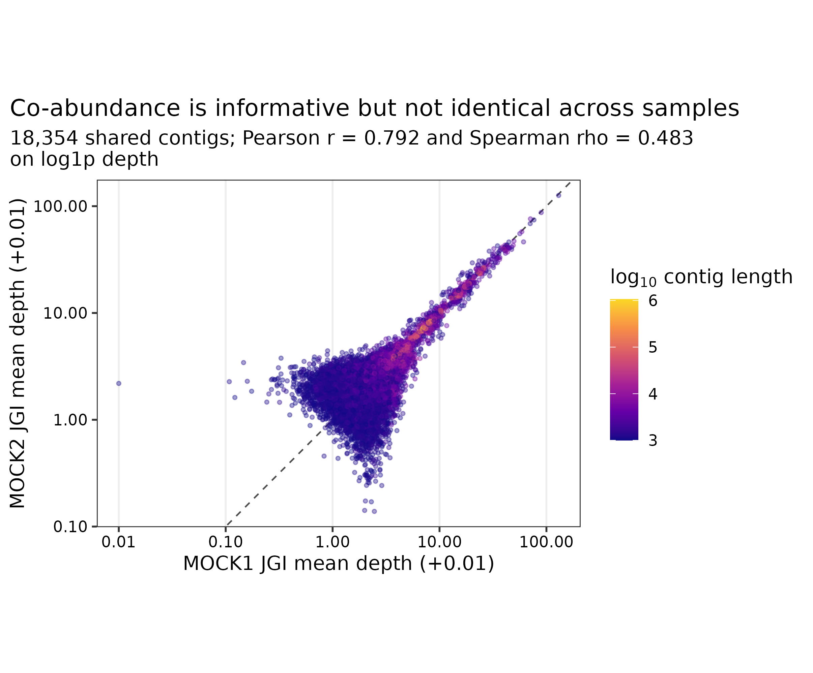
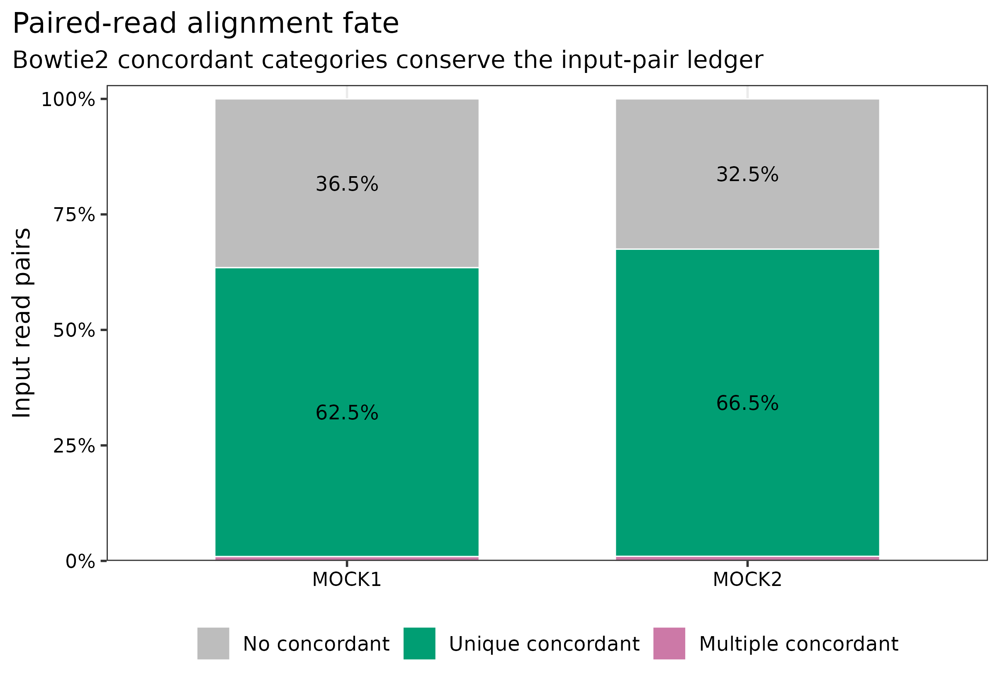
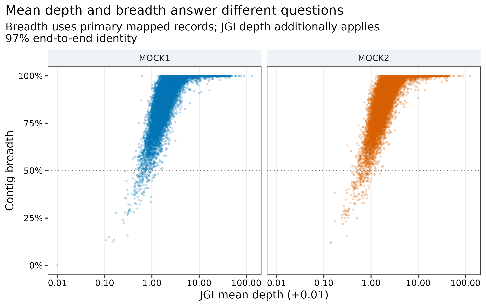

> **先给结论：**回帖率（read recruitment）、覆盖广度（breadth）与平均深度（mean depth）不是同一个指标。两份约 200 万对的真实 mock clean reads 回比同一套 18,354 条、84.81 Mb 的 MEGAHIT 共组装后，Bowtie2 总体比对率为 87.48%/87.25%，组装碱基覆盖广度为 95.30%/95.10%；JGI 以端到端 identity >=97% 汇总后的长度加权平均深度为 5.813x/5.787x。18,353 条 contigs 在两个样本中同时获得正深度，但 `log1p(depth)` 的 Pearson (r=0.792)、Spearman \(\rho=0.483\)。因此，深度矩阵能为分箱提供共丰度信号，却不能替代序列组成，也不能把“检出”误写成“稳定丰度”。

::: {.callout-important title="算力与数据边界"}
本次用 24 CPU cores 建索引、16 cores 比对，两个样本各约 200 万 read pairs。Bowtie2 建索引用时 45 秒、peak RAM 0.58 GiB；每个样本的比对与排序用时 59--63 秒、peak RAM 1.35 GiB；整个工作目录占 769 MB，其中两个 BAM 合计约 554 MB。建议预留 **16 GB RAM、24 CPU cores、20 GB 可用磁盘，预计耗时 30 分钟**。真实队列的 BAM 通常接近或超过压缩 FASTQ 体积，磁盘应按样本数线性预估；没有服务器时，可读取 `data/small/41-read-mapping-depth-frozen/` 中的完整 JGI 矩阵、paired-contig 证据、日志与汇总表。
:::

## 这一步对应论文里的哪张图 {#sec-target}

锚定图是 MetaBAT 原始工作中把 tetranucleotide frequency、coverage profile 与 bin assignment 放在同一坐标系比较的 Figure 2 [@kang2015metabat]。其核心不是“先画一个 coverage 图”，而是让每条 contig 在所有样本上拥有同一顺序的 abundance vector，再与序列组成共同判定是否来自同一 genome。MetaBAT2 延续并改进了这一思路，尤其针对样本少、覆盖变化不足和复杂群落的情况调整距离估计 [@kang2019metabat2]。

本篇先把该 abundance vector 做成可审计的 `contig x sample` 深度矩阵。后续分箱只消费这个固定坐标系，不重新解释 BAM。

{#fig-41-depth}

## 理论：从一条 alignment 到 contig abundance {#sec-theory}

### 1. “比对上”至少有四层分母

1. Bowtie2 的 overall alignment rate：至少一个 mate 获得 alignment 的 reads 比例，包含 concordant、discordant 与 singleton 情况 [@langmead2012bowtie2]。
2. paired alignment fate：read pairs 被分为 concordantly 0 次、恰好 1 次和多次，三类必须闭合到输入 pair 总数。
3. BAM record：经过 SAM flag、MAPQ、identity、alignment length 等策略后真正进入计数的 alignment records [@li2009samtools]。
4. contig depth/breadth：以 assembly bases 或 contigs 为分母聚合，不再以 reads 为分母。

这四个比例数值接近时也不能互换。Methods 必须同时写 numerator、denominator 和过滤策略。

### 2. Mean depth 与 breadth 回答不同问题

对长度为 \(L_c\) 的 contig \(c\)，碱基深度为 \(d_{ci}\)：

\[
\bar d_c=\frac{1}{L_c}\sum_{i=1}^{L_c}d_{ci},
\qquad
B_c=100\frac{\sum_i I(d_{ci}>0)}{L_c}.
\]

一个短重复区吸附大量 reads 时，mean depth 可以很高但 breadth 很低；一个低丰度 genome 的 contig 可能 breadth 很高而 mean depth 只有 1--2x。分箱常用 mean depth 形成多样本 abundance vector，污染审计则应同时看 breadth、MAPQ 和局部深度异常。

### 3. JGI depth 不是 `samtools coverage` 的改名

`jgi_summarize_bam_contig_depths` 会按 contig 和 BAM 汇总平均深度与方差，并可应用端到端 identity、MAPQ 和 contig-edge 规则。主分支固定 `--percentIdentity 97 --minMapQual 0`；`samtools coverage` 则读取已过滤 BAM，作为独立 breadth/mean-depth 账本。两个长度加权 mean depth 相差约 5%，正是统计口径不同的结果，不应强行要求相等。

### 4. 多样本深度只有在坐标和设计一致时才有意义

深度矩阵每一行必须对应同一条 assembly contig，每一列必须对应一个独立 library。不能把不同 assembly 的同名 contig 拼接，也不能把同一 library 的技术拆分伪装成 biological replicates。批次、测序深度、样本组成与 strain sharing 都会改变 depth correlation。

## 准备工作 {#sec-setup}

### 真实数据与 lineage

| 输入 | 标识符 | 角色 |
|---|---|---|
| MOCK1 clean paired reads | PRJEB52977 / ERR9765746；1,999,853 pairs | 含 71 strains 的不均一 DNA mock [@meslier2022platforms] |
| MOCK2 clean paired reads | PRJEB52977 / ERR9765747；1,999,888 pairs | 含 87 strains 的不均一 DNA mock [@meslier2022platforms] |
| MEGAHIT co-assembly | 18,354 contigs >=1 kb；84,811,518 bp；N50 15,928 bp | 两个 mock 的共同 mapping 坐标系 |

FASTQ 来自每个 ENA run 的无放回固定 200 万 pairs 子集，经 fastp Q20/长度过滤；共组装来自相同 clean reads。准备器重新核对四个 FASTQ、压缩 assembly 与解压 assembly 的 SHA-256，并要求 contig 数、总长度和最短长度满足合同。

<details>
<summary>点开：锁定环境、安装命令与内联出版主题</summary>

```bash
mamba create -n metagenome-assembly-2026.07 \
  --file env/assembly-linux-64.lock
conda activate metagenome-assembly-2026.07

bowtie2 --version
samtools --version
jgi_summarize_bam_contig_depths
```

```{r}
install.packages(c("ggplot2", "dplyr", "readr", "tidyr", "scales"))
library(ggplot2); library(dplyr); library(readr); library(tidyr); library(scales)
set.seed(20260741)

pal_pub <- c(
  MOCK1 = "#0072B2", MOCK2 = "#D55E00",
  `No concordant alignment` = "#BDBDBD",
  `Unique concordant alignment` = "#009E73",
  `Multiple concordant alignments` = "#CC79A7"
)
scale_color_pub <- function(...) scale_color_manual(values = pal_pub, ...)
scale_fill_pub  <- function(...) scale_fill_manual(values = pal_pub, ...)
theme_pub <- function(base_size = 12) {
  theme_bw(base_size = base_size) + theme(
    panel.grid.minor = element_blank(), panel.grid.major.y = element_blank(),
    axis.text = element_text(color = "black"), legend.key = element_blank(),
    strip.background = element_rect(fill = "#EEF3F5", color = NA),
    plot.title.position = "plot"
  )
}
save_pub <- function(plot, file_base, width = 180, height = 120,
                     units = "mm", dpi = 350) {
  dir.create(dirname(file_base), recursive = TRUE, showWarnings = FALSE)
  ggsave(paste0(file_base, ".pdf"), plot, width = width, height = height,
         units = units, device = cairo_pdf)
  ggsave(paste0(file_base, ".png"), plot, width = width, height = height,
         units = units, dpi = dpi, bg = "white")
  ggsave(paste0(file_base, ".tiff"), plot, width = width, height = height,
         units = units, dpi = dpi, compression = "lzw", bg = "white")
  invisible(plot)
}
```

</details>

## 可复制代码：共同坐标、BAM 与深度矩阵 {#sec-code}

### 第 1 步：准备 checksum-locked 输入

```bash
ROOT="$PWD"
WORK="work/article41"
ASSEMBLY_ENV="$HOME/miniconda3/envs/metagenome-assembly-2026.07"

python3 scripts/prepare_article41_mapping_depth.py \
  --project-root "${ROOT}" --work-dir "${WORK}" \
  --assembly-env "${ASSEMBLY_ENV}"
```

准备器要求 Bowtie2 2.5.5、SAMtools 1.23.1 和 MetaBAT2 depth utility 2.18。`inputs/samples.tsv` 写入 run accession、clean pair 数和 FASTQ 绝对路径；`input-audit.tsv` 与 `input-lineage.tsv` 保存身份与来源。

### 第 2 步：建立索引并逐样本回比

```bash
python3 scripts/run_article41_mapping_depth.py \
  --work-dir "${WORK}" --assembly-env "${ASSEMBLY_ENV}" \
  --threads 24
```

核心命令展开如下：

```bash
bowtie2 --very-sensitive --seed 20260741 -p 16 \
  -x work/article41/index/megahit-coassembly.ge1000 \
  -1 SAMPLE_R1.fastq.gz -2 SAMPLE_R2.fastq.gz 2> SAMPLE.bowtie2.log |
  samtools view -@ 4 -b -F 3588 -q 0 - |
  samtools sort -@ 8 -m 2G -o SAMPLE.primary.sorted.bam -
samtools index -@ 8 SAMPLE.primary.sorted.bam
```

Bowtie2 默认只报告一个 selected alignment，不启用 `-a/-k`；`-F 3588` 排除 unmapped、QC-fail、duplicate 与 supplementary records。主账本保留 MAPQ 0，让 multi-mapping 的不确定性保持可见；若研究问题需要 strain-resolved SNP，必须改用更严格且预注册的 alignment policy。

### 第 3 步：生成 JGI 多样本矩阵

```bash
jgi_summarize_bam_contig_depths \
  --outputDepth work/article41/depth/jgi-depth.tsv \
  --pairedContigs work/article41/depth/paired-contigs.tsv \
  --percentIdentity 97 --minMapQual 0 \
  --referenceFasta work/article41/inputs/megahit-coassembly.ge1000.fna \
  work/article41/bam/MOCK1.primary.sorted.bam \
  work/article41/bam/MOCK2.primary.sorted.bam
```

`paired-contigs.tsv` 保留 read-pair 支持的 contig linkage；不能只保存 depth table 后删除所有关联证据。JGI 输出中 `contigName/contigLen/totalAvgDepth` 后面每个 BAM 占两列：mean depth 与 variance。

### 第 4 步：建立守恒账本

```bash
python3 scripts/summarize_article41_mapping_depth.py \
  --work-dir "${WORK}"

column -t -s $'\t' "${WORK}/summary/mapping-summary.tsv"
column -t -s $'\t' "${WORK}/summary/depth-summary.tsv"
```

| Sample | Input pairs | Concordant 0 | Concordant once | Concordant multiple | Overall alignment | Assembly breadth |
|---|---:|---:|---:|---:|---:|---:|
| MOCK1 | 1,999,853 | 730,631 | 1,250,638 | 18,584 | 87.48% | 95.30% |
| MOCK2 | 1,999,888 | 650,532 | 1,329,470 | 19,886 | 87.25% | 95.10% |

三类 concordant fate 对每个样本精确闭合到输入 pairs；coverage 与 JGI 表都必须精确覆盖 18,354 条 assembly contigs。任何丢行、重名或长度不一致都会终止汇总。

{#fig-41-fate}

### 第 5 步：读取 compact matrix 并复核

```{r}
frozen <- "data/small/41-read-mapping-depth-frozen"
mapping <- read_tsv(file.path(frozen, "mapping-summary.tsv"), show_col_types = FALSE)
depth <- read_tsv(file.path(frozen, "contig-depth-wide.tsv.gz"), show_col_types = FALSE)
correlation <- read_tsv(file.path(frozen, "depth-correlation.tsv"), show_col_types = FALSE)

stopifnot(nrow(depth) == 18354, !anyDuplicated(depth$Contig))
stopifnot(all(mapping$ReadPairs ==
  mapping$ConcordantZero + mapping$ConcordantOnce + mapping$ConcordantMultiple))
stopifnot(correlation$DetectedInBoth == 18353)
```

{#fig-41-breadth}

### 第 6 步：冻结与验收

```bash
python3 scripts/freeze_article41_mapping_depth.py \
  --project-root "${ROOT}" --work-dir "${WORK}" \
  --output-dir data/small/41-read-mapping-depth-frozen

Rscript scripts/plot_article41_mapping_depth.R \
  --input-dir data/small/41-read-mapping-depth-frozen \
  --output-dir figures

python3 scripts/validate_article41_mapping_depth.py \
  --project-root "${ROOT}" \
  --frozen-dir data/small/41-read-mapping-depth-frozen \
  --output-dir results/41-read-mapping-depth \
  --figure-dir figures --chapter chapters/41-read-mapping-depth.qmd
```

## 审计与升级 {#sec-audit}

### 从一个 mapping rate 升级为分层 ledger

MOCK1 的 87.48% overall alignment 并不等于 62.54% unique concordant pairs，也不等于 95.30% assembly breadth。前者可包含 discordant/singleton alignment，第二个以 read pairs 为分母，第三个以 assembly bases 为分母。出版表应分别命名，禁止统称为 `mapping percentage`。

### 从单样本 coverage 升级为 common-coordinate matrix

MOCK1/MOCK2 分别有 18,353/18,354 条 positive-depth contigs，看上去几乎全检出；但 rank correlation 只有 0.483。mock 中 shared genomes、不同 DNA abundance、重复序列和低深度噪声共同作用，说明 presence 不能替代 abundance pattern。分箱时应保留两列，而不是先求均值。

### 从 mean depth 升级为 depth + variance + breadth

JGI 长度加权 depth 为 5.813x/5.787x，SAMtools 账本为 6.143x/6.119x。差异来自 JGI 的 97% identity 与 edge 规则。把两者做成独立列，可以定位短 contig、边缘堆积、低 identity 和局部重复造成的异常，而不是选一个更“好看”的数。

### BWA/Bowtie2 的替换边界

BWA-MEM 与 Bowtie2 都可用于短读回比 [@li2009bwa; @langmead2012bowtie2]。真正决定可比性的不是工具名，而是 reference FASTA、paired/single 模式、secondary/supplementary policy、MAPQ、identity、最短 alignment、duplicate 与 overlap 处理。更换 aligner 时，必须重新生成完整 BAM 和 depth matrix，不能只替换 Methods 中的软件名。

### 对自然队列的进一步升级

自然样本应加入 negative control、host-depleted read ledger、library size、insert-size、contig uniqueness、GC/length bias 与 strain mixture 检查。若要比较绝对 microbial load，还需 spike-in、qPCR 或 flow-cytometry 等外部量纲；relative depth 本身只有组成意义。

## 出版级美化 {#sec-publication}

1. Alignment fate 使用 100% stacked bars，并在每个 >=3% 区块内写百分比；不能让 raw counts 与 percent 共用一个轴。
2. Depth--depth 图在两轴同时使用 log scale，加入 `y=x` 参考线，并写明 pseudocount 仅用于显示。
3. Contig 长度使用连续色标，不用数十种离散颜色；样本颜色固定为 blue/orange 的色盲友好组合。
4. Breadth 以 0--100% 显示，50% 横线仅作诊断；图注说明 JGI 与 SAMtools 的不同过滤口径。
5. 图内标题、轴、图例和注释全部使用英文；样本名采用稳定的 ASCII ID。
6. 每张图同时导出 PDF、350-dpi PNG 和 LZW TIFF。PDF 用于排版，PNG 用于网页，TIFF 用于投稿系统。

## 常见坑 {#sec-pitfalls}

::: {.callout-caution title="1. 把 overall alignment 当作 proper pairs"}
Bowtie2 overall rate 与 concordant/properly paired 分母不同。至少同时保留 Bowtie2 log、`samtools flagstat` 和输入 pair ledger。
:::

::: {.callout-caution title="2. 每个样本各组装、再按 contig 名拼 depth"}
不同 assembly 的 `k141_123` 没有共同坐标含义。多样本 depth 必须回比同一个 assembly FASTA，并核对每行 contig length。
:::

::: {.callout-caution title="3. BAM 没排序或 reference 不一致"}
JGI 工具要求 coordinate-sorted BAM；BAM header、FASTA 与 `.fai` 的 sequence 名和长度必须一致。只改 FASTA header 就会破坏合同。
:::

::: {.callout-caution title="4. 隐藏 multi-mapping policy"}
MAPQ 0 会保留重复区的 selected alignments；MAPQ 10/20 会改变 depth mass 与低丰度 contig。阈值应在看结果前固定，并做 sensitivity branch。
:::

::: {.callout-caution title="5. 把 mean depth 当作均匀覆盖"}
同样的 5x mean depth 可以来自全长约 5x，也可以来自 10% 区域约 50x。必须并列报告 breadth、variance 和局部 coverage 轨迹。
:::

::: {.callout-caution title="6. 把两个技术标准当生物学重复"}
MOCK1 与 MOCK2 的成员和输入 abundance 不同，只用于 workflow 与守恒审计，不能估计人群方差或做疾病差异检验。
:::

## 这段 Methods 怎么写 {#sec-methods}

### Methods template

> Checksum-identified Illumina paired-end reads from two uneven synthetic microbial DNA communities (PRJEB52977; ERR9765746 and ERR9765747) were analyzed as fixed 2,000,000-pair subsets generated without replacement. After fastp filtering, 1,999,853 and 1,999,888 read pairs remained. Reads were aligned independently to a common checksum-locked MEGAHIT v1.2.9 co-assembly comprising 18,354 contigs >=1 kb (84,811,518 bp; N50 15,928 bp) with Bowtie2 v2.5.5 using `--very-sensitive`, 16 threads and seed 20260741. Bowtie2 used its default single selected-alignment reporting mode. Unmapped, QC-fail, duplicate and supplementary records were excluded with SAMtools v1.23.1 (`-F 3588`); coordinate-sorted BAM files were indexed and audited with `flagstat`, `idxstats`, `stats` and `coverage`. Multi-sample contig depth and variance were calculated with `jgi_summarize_bam_contig_depths` from MetaBAT2 v2.18 using a minimum end-to-end identity of 97%, minimum mapping quality of 0 and default edge exclusion. The common contig coordinate set, read-pair fate, assembly-base breadth, length-weighted mean depth, commands, resource usage, environment lock and SHA-256 checksums were retained. Correlations were calculated across all 18,354 contigs after `log1p` transformation; no inferential comparison was made between the two non-replicate mock communities.

### Results template

> Bowtie2 overall alignment rates were 87.48% and 87.25% for MOCK1 and MOCK2, respectively. Unique concordant alignments accounted for 62.54% and 66.48% of input pairs, while 0.93% and 0.99% aligned concordantly more than once. The mapped BAMs covered 95.30% and 95.10% of assembly bases. JGI length-weighted mean depths were 5.813x and 5.787x, compared with 6.143x and 6.119x in the independent SAMtools coverage ledger. Of 18,354 contigs, 18,353 had positive depth in both samples; Pearson and Spearman correlations of `log1p` depth were 0.792 and 0.483, respectively.

## 换成你自己的数据怎么做 {#sec-own-data}

1. 固定一份最终 assembly FASTA；记录压缩与解压 SHA-256、contig 数、总 bp、最短长度和 N50。
2. 建立 sample sheet：一行一个独立 library，保留 sample、run、R1/R2、clean pairs、batch 与 biological replicate ID。
3. 预注册 aligner preset、seed、secondary/supplementary、MAPQ、identity、minimum aligned length、duplicate 与 orphan policy。
4. 每个样本输出 coordinate-sorted/indexed BAM、Bowtie2/BWA log、flagstat、idxstats 和 coverage；先核对 reads/pairs 守恒。
5. 用同一 FASTA 和全部 BAM 一次性生成 JGI depth；对 `contigName + contigLen` 做严格 identity check。
6. 同时保留 mean depth、variance、breadth、mean MAPQ 与 paired-contig linkage，至少画 depth--depth 和 depth--breadth 诊断图。
7. 对 MAPQ/identity/contig-length 做预设 sensitivity branches；不要按 MAG 数量最高的阈值倒推主分析。
8. 将 BAM 留在受控产物区，把 compact depth matrix、commands、versions、checksums、normalized logs 和三种图形格式纳入交付。

## 参考 {#sec-references}

- PRJEB52977 多平台不均一 microbial mocks [@meslier2022platforms]
- Bowtie2 [@langmead2012bowtie2]
- BWA [@li2009bwa]
- SAM/BAM 与 SAMtools [@li2009samtools]
- MetaBAT2 与 JGI depth workflow [@kang2019metabat2]
- MetaBAT 的 coverage/composition 框架 [@kang2015metabat]
