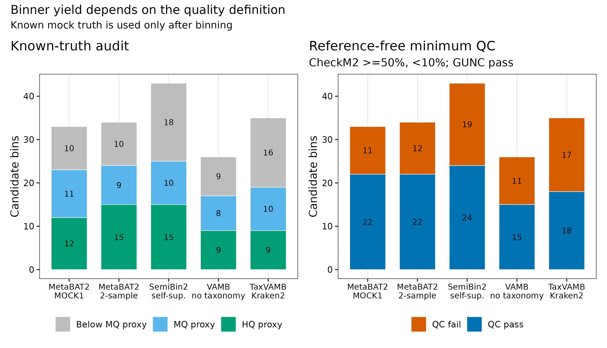
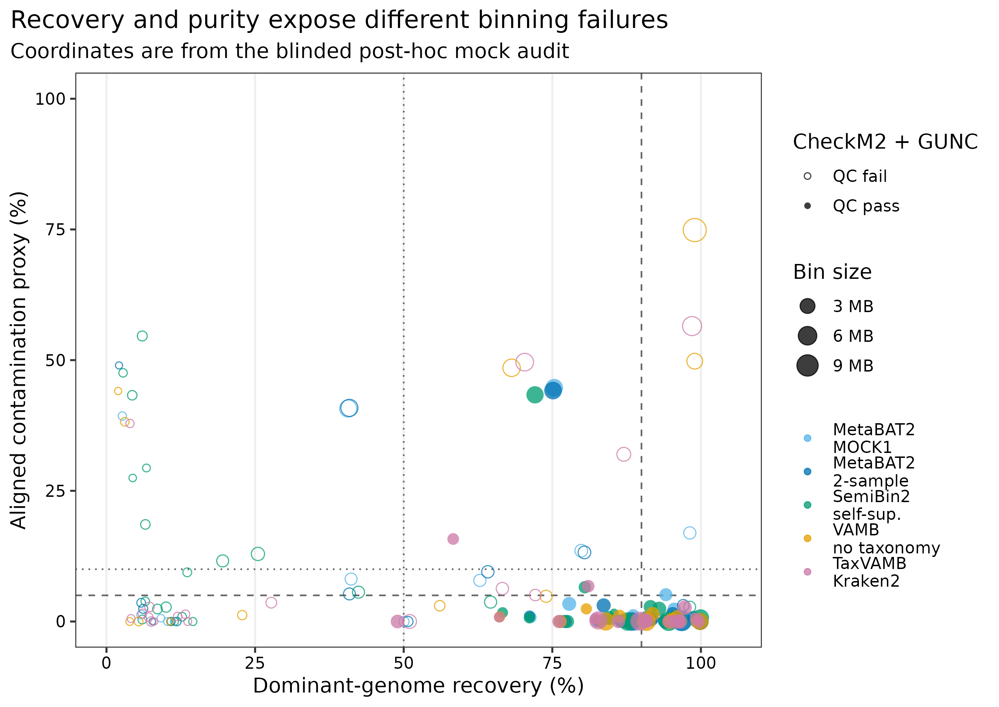
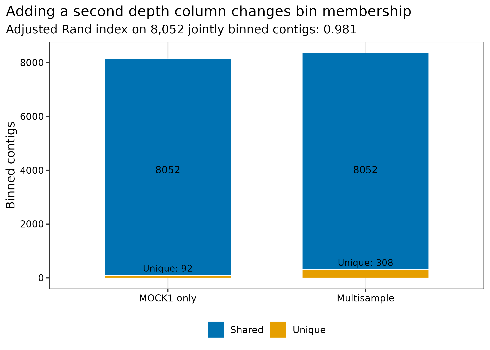
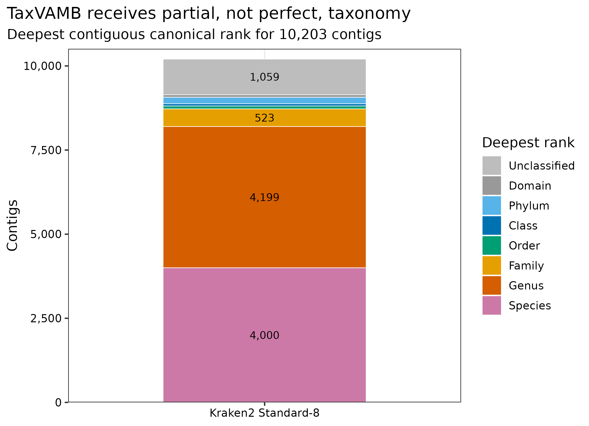

> **先给结论：**分箱器没有脱离数据设计的“总冠军”。本篇把 MOCK1/MOCK2 的同一份 MEGAHIT 共组装限制到 10,203 条 >=1.5 kb contigs（74,932,939 bp），让 MetaBAT2 单样本、MetaBAT2 多样本、SemiBin2 self-supervised、VAMB taxonomy-free 与 TaxVAMB+Kraken2 消费完全相同的序列坐标。方法选择只看 CheckM2 completeness/contamination 与 GUNC；87 个已知输入基因组在运行结束后才用于 recovery/purity 审计。这个 **truth-blind** 边界比“哪个方法找回的真值最多”更接近真实项目。

::: {.callout-important title="算力与数据边界"}
五条分支使用 **24 CPU cores**；建议 **128 GB RAM、100 GB 临时磁盘，预留 2--4 小时**。MetaBAT2 很快，SemiBin2/VAMB 的 CPU 训练占主要耗时，Kraken2 Standard-8 安装后为 8.64 GB。自然群落的 assembly、样本数和 bin 数更大，应为深度矩阵、模型中间文件与候选 FASTA 预留额外磁盘。没有服务器时，可直接读取 `data/small/42-binning-comparison-frozen/` 中的 membership、CheckM2/GUNC、truth audit、日志和环境锁。
:::

## 这一步对应论文里的哪张图 {#sec-target}

锚定图不是一张单独的 UMAP，而是分箱论文常见的“quality yield + recovery/purity”组合：MetaBAT2 以 tetranucleotide frequency 和跨样本 abundance distance 聚类 contigs [@kang2019metabat2]；SemiBin2 加入自监督表示学习 [@pan2023semibin2]；VAMB 用 variational autoencoder 联合组成与 abundance [@nissen2021vamb]；TaxVAMB 再引入不完整的 taxonomy signal [@kutuzova2026taxvamb]。

第一张图把“已知真值等级”和“reference-free minimum QC”并排，明确两套评价不能混称。第二张图再展开 dominant-genome recovery 与 aligned contamination proxy。

{#fig-42-yield}

五条分支依次产生 33、34、43、26 和 35 个 candidates；其中 CheckM2+GUNC minimum-pass 分别为 22、22、24、15 和 18 个。SemiBin2 的 candidate 与 minimum-pass 产出最高，但也有 19 个 candidates 未过 minimum gate；因此“总 bin 数更多”不能直接写成“MAG 回收更好”。MetaBAT2 加入第二列 depth 后，多分出 216 条 contigs、少量独有分配由 92 增至 308 条；在 8,052 条共同分箱 contigs 上 ARI 为 0.981。

## 理论：分箱是在三种信号之间做折中 {#sec-theory}

### 1. Composition、coverage 与 taxonomy 的信息并不等价

- **Composition**：k-mer/tetranucleotide pattern 随 genome 演化，但短 contig 方差很大，近缘菌株也可能相似。
- **Coverage**：同一 genome 的 contigs 在多个样本上应共同升降；只有一个样本时，向量退化为一个数。
- **Taxonomy**：高置信分类可以约束不合理合并，但未培养谱系、水平转移和分类数据库偏倚会制造错误先验。

因此，本篇保留 VAMB taxonomy-free 与 TaxVAMB 两条分支。taxonomy 有帮助时两者会分开；taxonomy 不可靠时，TaxVAMB 也可能退化。

### 2. 单样本与多样本深度回答不同问题

MetaBAT2-MOCK1-only 只看 MOCK1 depth；multisample 同时看 MOCK1/MOCK2。两条分支使用同一 FASTA 和同一参数，差异才能归因于第二列 abundance。比较使用 jointly binned contigs 上的 adjusted Rand index，同时保留 single-only 与 multi-only contigs，避免只看 bin 数。

### 3. CheckM2/GUNC 与 known truth 是互补账本

CheckM2 用标记和机器学习估 completeness/contamination [@chklovski2023checkm2]，GUNC 检查 gene-level lineage dispersion 与 chimerism [@orakov2021gunc]。它们不需要 mock truth，因此可用于预注册选择。已知输入基因组则能回答：一个 bin 找回目标 genome 的多少、已比对部分有多纯、是否重复找回同一 genome。两者不一致时，应报告原因，不能挑更漂亮的一套。

### 4. Post-hoc truth proxy 不等于 MIMAG

每条 >=1.5 kb contig 根据固化的 MetaQUAST coordinates 归到 aligned query span 最大的输入 genome；bin 的 recovery 用该 genome 上非重叠 reference intervals 计算，purity 只在可归属的 bin bp 内计算。`HQ proxy`/`MQ proxy` 只用于算法审计；完整 MIMAG 分级还需要 rRNA、tRNA、chimerism 与更严格的 genome QC。

## 准备工作 {#sec-setup}

### 真实数据与固定坐标

| 输入 | 标识符 | 用途 |
|---|---|---|
| MOCK1 clean reads | PRJEB52977 / ERR9765746 | MetaBAT2 single depth；两样本模型 depth |
| MOCK2 clean reads | PRJEB52977 / ERR9765747 | 第二列 depth；共组装真值范围扩展到 87 genomes |
| MEGAHIT co-assembly | 10,203 contigs >=1.5 kb；74,932,939 bp | 五个分箱器共同坐标 |
| Kraken2 Standard-8 | Standard-8-20260626；8,638,898,739 bytes | 只输入 TaxVAMB，不输入其他分支 |

两份真实不均一 mock 来自同一研究 [@meslier2022platforms]。分箱前不读取 reference genomes、MetaQUAST coordinates 或 organism labels。

<details>
<summary>点开：锁定环境、数据库与内联出版主题</summary>

```bash
mamba create -n metagenome-assembly-2026.07 --file env/assembly-linux-64.lock
mamba create -n metagenome-binning-2026.07 --file env/binning-linux-64.lock
mamba create -n metagenome-mag-qc-2026.07 --file env/mag-qc-linux-64.lock
mamba create -n metagenome-gunc-2026.07 --file env/gunc-linux-64.lock

# Kraken2 Standard-8: 5.95-GB archive, 8.64-GB installed database.
export PROJECT_ROOT="$PWD"
export DB_ROOT=/db/metagenome-kraken2
export DB_MANIFEST=data/small/16-database-manifest.tsv
db/download_db.sh audit
db/download_db.sh download kraken2-standard8-20260626
db/download_db.sh verify kraken2-standard8-20260626
KRAKEN_ARCHIVE="${DB_ROOT}/archives/kraken2-standard8-20260626/k2_standard_08_GB_20260626.tar.gz"
KRAKEN_DB="${DB_ROOT}/standard-8-20260626"
mkdir -p "${KRAKEN_DB}"
tar -xzf "${KRAKEN_ARCHIVE}" -C "${KRAKEN_DB}"
(cd "${KRAKEN_DB}" && \
  md5sum --check "${PROJECT_ROOT}/data/small/16-standard8-files.md5")

# CheckM2 v3 与 GUNC ProGenomes 2.1。
export DB_ROOT=/db/metagenome-mag-qc
export DB_MANIFEST=data/small/44-mag-qc-database-manifest.tsv
db/download_db.sh audit
db/download_db.sh download checkm2-v3
db/download_db.sh download gunc-progenomes2.1
mkdir -p "${DB_ROOT}/checkm2-v3" "${DB_ROOT}/gunc-progenomes2.1"
tar -xzf "${DB_ROOT}/archives/checkm2-v3/checkm2_database.tar.gz" \
  -C "${DB_ROOT}/checkm2-v3"
gzip -cd "${DB_ROOT}/archives/gunc-progenomes2.1/gunc_db_progenomes2.1.dmnd.gz" \
  > "${DB_ROOT}/gunc-progenomes2.1/gunc_db_progenomes2.1.dmnd"
sha256sum "${DB_ROOT}/checkm2-v3/CheckM2_database/uniref100.KO.1.dmnd"
md5sum "${DB_ROOT}/gunc-progenomes2.1/gunc_db_progenomes2.1.dmnd"
```

```{r}
install.packages(c("ggplot2", "dplyr", "readr", "tidyr", "forcats", "scales", "patchwork"))
library(ggplot2); library(dplyr); library(readr); library(tidyr); library(scales)
set.seed(20260742)

pal_pub <- c("#0072B2", "#D55E00", "#009E73", "#CC79A7",
             "#E69F00", "#56B4E9", "#F0E442", "#999999")
scale_color_pub <- function(...) scale_color_manual(values = pal_pub, ...)
scale_fill_pub  <- function(...) scale_fill_manual(values = pal_pub, ...)
theme_pub <- function(base_size = 12) {
  theme_bw(base_size = base_size) + theme(
    panel.grid.minor = element_blank(), panel.grid.major.y = element_blank(),
    axis.text = element_text(color = "black"), legend.key = element_blank(),
    strip.background = element_rect(fill = "#EEF3F5", color = NA),
    plot.title.position = "plot"
  )
}
save_pub <- function(plot, file_base, width = 190, height = 125,
                     units = "mm", dpi = 350) {
  dir.create(dirname(file_base), recursive = TRUE, showWarnings = FALSE)
  ggsave(paste0(file_base, ".pdf"), plot, width = width, height = height,
         units = units, device = cairo_pdf)
  ggsave(paste0(file_base, ".png"), plot, width = width, height = height,
         units = units, dpi = dpi, bg = "white")
  ggsave(paste0(file_base, ".tiff"), plot, width = width, height = height,
         units = units, dpi = dpi, compression = "lzw", bg = "white")
  invisible(plot)
}
```

</details>

## 可复制代码：五条分支、独立 QC 与 post-hoc truth {#sec-code}

### 第 1 步：准备 common-coordinate inputs

```bash
ROOT="$PWD"
WORK="work/article42"
ASSEMBLY_ENV="$HOME/miniconda3/envs/metagenome-assembly-2026.07"
BINNING_ENV="$HOME/miniconda3/envs/metagenome-binning-2026.07"
MAG_QC_ENV="$HOME/miniconda3/envs/metagenome-mag-qc-2026.07"
GUNC_ENV="$HOME/miniconda3/envs/metagenome-gunc-2026.07"
KRAKEN_DB="/db/metagenome-kraken2/standard-8-20260626"
CHECKM2_DB="/db/metagenome-mag-qc/checkm2-v3/CheckM2_database/uniref100.KO.1.dmnd"
GUNC_DB="/db/metagenome-mag-qc/gunc-progenomes2.1/gunc_db_progenomes2.1.dmnd"

python3 scripts/prepare_article42_binning.py \
  --project-root "${ROOT}" --work-dir "${WORK}" \
  --assembly-env "${ASSEMBLY_ENV}" --binning-env "${BINNING_ENV}" \
  --kraken-db "${KRAKEN_DB}" --minimum-contig 1500
```

准备器从 `data/small/30-short-read-assembly-frozen/` 的 assembly 与 `data/small/41-read-mapping-depth-frozen/` 的 JGI depth 按 contig ID 严格连接，生成 two-sample VAMB abundance 和 MOCK1-only MetaBAT2 depth。任何缺行、重名或长度漂移都会停止。

### 第 2 步：运行五条确定性分支

```bash
python3 scripts/run_article42_binning.py \
  --project-root "${ROOT}" --work-dir "${WORK}" \
  --assembly-env "${ASSEMBLY_ENV}" --binning-env "${BINNING_ENV}" \
  --kraken-db "${KRAKEN_DB}" --article41-work-dir work/article41 \
  --threads 24
```

关键参数展开如下：

```bash
metabat2 -i contigs.ge1500.fna -a depth.tsv -m 1500 -s 200000 \
  -t 24 --seed 20260742 --saveCls -o bins/bin

SemiBin2 single_easy_bin --input-fasta contigs.ge1500.fna \
  --input-bam MOCK1.bam MOCK2.bam --min-len 1500 --minfasta-kbs 200 \
  --self-supervised --engine cpu --random-seed 20260742 --threads 24

vamb bin default --fasta contigs.ge1500.fna --abundance_tsv abundance.tsv \
  --outdir vamb-taxonomy-free -m 1500 --minfasta 200000 \
  -p 24 --seed 20260742 -o

vamb bin taxvamb --fasta contigs.ge1500.fna --abundance_tsv abundance.tsv \
  --taxonomy taxvamb-taxonomy.tsv --outdir taxvamb-kraken2 \
  -m 1500 --minfasta 200000 -p 24 --seed 20260742 -o
```

Kraken2 用 `--confidence 0.05 --minimum-hit-groups 2`；每条 contig 的 taxonomy 必须从 domain 开始连续，不能把缺失 rank 人工补成一个真实类群。

### 第 3 步：先建立 truth-free candidate QC

```bash
python3 scripts/summarize_article42_binning.py \
  --project-root "${ROOT}" --work-dir "${WORK}"

python3 scripts/run_article42_candidate_qc.py \
  --work-dir "${WORK}" --mag-qc-env "${MAG_QC_ENV}" \
  --gunc-env "${GUNC_ENV}" \
  --checkm2-db "${CHECKM2_DB}" --gunc-db "${GUNC_DB}" --threads 24
```

CheckM2 1.1.0 使用 database version 3；GUNC 1.1.0 使用 ProGenomes 2.1。minimum pass 固定为 completeness >=50%、contamination <10% 且 `pass.GUNC=TRUE`。

### 第 4 步：加入 post-hoc known-truth audit

```bash
GUNC_MAXCSS=$(find "${WORK}/qc/gunc" -name 'GUNC.*.maxCSS_level.tsv')
python3 scripts/summarize_article42_binning.py \
  --project-root "${ROOT}" --work-dir "${WORK}" \
  --checkm2-quality "${WORK}/qc/checkm2/quality_report.tsv" \
  --gunc-maxcss "${GUNC_MAXCSS}"
```

`bin-quality-truth-audit.tsv` 同时保留 CheckM2/GUNC 与 recovery/purity，但任何 binner 命令都没有 reference FASTA 参数。`truth-contig-assignment.tsv.gz` 记录 10,203 条 contigs 的归属、aligned fraction 与 ambiguous flag。

{#fig-42-recovery}

### 第 5 步：审计 single 与 multisample design

```r
frozen <- "data/small/42-binning-comparison-frozen"
design <- readr::read_tsv(file.path(frozen, "single-vs-multisample.tsv"), show_col_types = FALSE)
stopifnot(design$SharedBinnedContigs > 0)
stopifnot(dplyr::between(design$AdjustedRandOnSharedBinnedContigs, -1, 1))
```

{#fig-42-design}

### 第 6 步：冻结、出图与验收

```bash
python3 scripts/freeze_article42_binning.py \
  --project-root "${ROOT}" --work-dir "${WORK}" \
  --output-dir data/small/42-binning-comparison-frozen

Rscript scripts/plot_article42_binning.R \
  --input-dir data/small/42-binning-comparison-frozen --output-dir figures

python3 scripts/validate_article42_binning.py \
  --project-root "${ROOT}" --frozen-dir data/small/42-binning-comparison-frozen \
  --output-dir results/42-binning-comparison --figure-dir figures \
  --chapter chapters/42-binning.qmd
```

{#fig-42-taxonomy}

## 审计与升级 {#sec-audit}

### 从“每个工具默认跑一次”升级为 matched benchmark

五条分支必须使用同一 FASTA、最短 contig、最小输出 bin、depth columns 与线程预算。比较不同坐标或不同最小 bin 大小，只能说明预处理不同，不能说明算法优劣。

### 从单一 quality score 升级为三张账本

1. reference-free：CheckM2、GUNC、bin size、contig count；
2. known truth：recovery、aligned purity、dominant genome duplication；
3. resource：wall time、peak RAM、磁盘与失败状态。

主方法选择使用第一张账本；第二张用于解释偏差；第三张决定队列规模能否承受。

### 从 taxonomy “有/无”升级为 coverage audit

10,203 条 contigs 必须闭合到 classified/unclassified 与 deepest canonical rank。TaxVAMB 优于 VAMB 时，也要确认优势是否集中在 reference-rich taxa；若 unclassified 或高 rank contigs 被系统性丢弃，结果可能对 novel genomes 不公平。

### 从两份 mock 升级到真实队列

自然样本至少增加多个独立 abundance profiles、低丰度 genome sensitivity、strain mixture、plasmid/virus exclusion policy 与 contamination controls。病人样本可用 CAMI-style synthetic spike-ins 或部分 isolate references 做盲法 benchmark，但不能把所有结果参数都调到已知真值最优。

## 出版级美化 {#sec-publication}

1. quality yield 用 paired panels：known truth 与 reference-free QC 不共用图例名称。
2. recovery/purity 图用阈值参考线而非背景色断言；点大小表示 bin bp，形状表示 GUNC/CheckM2 pass。
3. single/multisample 图同时标 shared 与 unique contigs，并在 subtitle 报 adjusted Rand index 的分母。
4. taxonomy coverage 按 canonical rank 堆叠，保留 `Unclassified`；图内文字全部英文。
5. 五条分支颜色固定，使用色盲友好的 blue/green/orange/magenta 系列。
6. 每图导出 PDF、350-dpi PNG 和 LZW TIFF；PDF 用于排版，PNG 用于网页，TIFF 用于投稿。

## 常见坑 {#sec-pitfalls}

::: {.callout-caution title="1. 用真值调完参数再声称 blind benchmark"}
只要看过 reference recovery 再改 seed、minfasta、taxonomy confidence 或模型分支，主结果就不再是盲法。参数合同必须先冻结。
:::

::: {.callout-caution title="2. 不同工具使用不同 contig cutoff"}
VAMB/SemiBin2 默认值与 MetaBAT2 不同。必须显式固定 >=1.5 kb 与 >=200 kb output，否则短 contig 和小 bin 造成结构性偏差。
:::

::: {.callout-caution title="3. 把 CheckM2 pass 当作分类正确"}
CheckM2/GUNC 不知道 bin 是否对应预期 species。reference-free pass 与 truth recovery/purity 必须分列。
:::

::: {.callout-caution title="4. 把 Kraken unclassified contig 丢掉"}
TaxVAMB 输入应保留全部 contigs；未知 taxonomy 用缺失值表示，而不是删行或伪造 `unknown` domain。
:::

::: {.callout-caution title="5. 将一个 mock 的结果推广到所有生态位"}
reference-rich DNA mock 对 taxonomy-guided 方法更友好；土壤、海洋、病毒富集或宿主关联群落的 ranking 可能完全不同。
:::

::: {.callout-caution title="6. 只保存 bins，不保存 membership"}
每个 FASTA 都应有 `contig -> candidate` 表和 SHA-256。没有 membership，后续无法精炼、追踪 contig 或复核重复分配。
:::

## 这段 Methods 怎么写 {#sec-methods}

### Methods template

> Checksum-identified Illumina data from two uneven synthetic microbial communities (PRJEB52977; ERR9765746 and ERR9765747) were co-assembled with MEGAHIT v1.2.9. A common coordinate set of 10,203 contigs >=1,500 bp (74,932,939 bp) and a two-sample JGI depth matrix were used for all binners. Five prespecified branches were evaluated: MetaBAT2 v2.18 with MOCK1-only depth, MetaBAT2 v2.18 with both depth profiles, SemiBin2 v2.3.0 in self-supervised CPU mode, VAMB v5.0.4 without taxonomy, and TaxVAMB from Vamb v5.0.4 with Kraken2 v2.17.1 Standard-8 release 20260626 taxonomy (`--confidence 0.05 --minimum-hit-groups 2`). The minimum contig and output-bin sizes were 1,500 and 200,000 bp, respectively, and stochastic branches used seed 20260742. Candidate quality was estimated independently with CheckM2 v1.1.0 database version 3 and GUNC v1.1.0 ProGenomes 2.1; minimum-pass bins required completeness >=50%, contamination <10%, and `pass.GUNC=TRUE`. Known reference genomes were withheld during binning and applied only post hoc to estimate dominant-genome recovery and aligned purity from MetaQUAST coordinates. Commands, memberships, versions, database checksums, resource use, and candidate checksums were retained.

### Results template

> All five prespecified branches completed on the same 10,203-contig coordinate set. MetaBAT2 with MOCK1-only and two-sample depth, SemiBin2, VAMB, and TaxVAMB produced 33, 34, 43, 26, and 35 candidates, of which 22, 22, 24, 15, and 18, respectively, met the independent CheckM2+GUNC minimum criterion. In the post-hoc reference audit, the corresponding HQ-proxy counts were 12, 15, 15, 9, and 9. The two MetaBAT2 partitions had an adjusted Rand index of 0.981 across 8,052 jointly binned contigs. Kraken2 assigned 4,000 contigs through species and 4,199 through genus, while 1,059 remained unclassified at the canonical-rank audit. MetaBAT2 required 3.59 s per branch, VAMB 367.12 s, TaxVAMB 1,520.77 s, and the default 15-epoch SemiBin2 workflow 5,046 s; SemiBin2 peak memory was not reported because its GNU-time record was lost during an isolated-session retry, and this missing measurement was retained explicitly. Known mock truth did not influence binner execution or primary quality selection.

## 换成你自己的数据怎么做 {#sec-own-data}

1. 固定最终 assembly 和一个最短 contig cutoff，保存 SHA-256、contig 数、bp 与 N50。
2. 用同一组 coordinate-sorted BAM 一次性生成所有样本 depth；核对 row order、ID 与 length。
3. 预注册候选分支、min bin size、seed、taxonomy confidence、CPU/RAM ceiling 与 primary selection rule。
4. 至少保留一个 taxonomy-free branch；novel environment 不应只跑 taxonomy-guided 方法。
5. 对每个工具输出标准化 `candidate ID + contig membership + FASTA checksum`，并检查分支内 contig 不重复。
6. 用 CheckM2+GUNC 建 reference-free ledger；如果有 mock/isolate truth，再增加 post-hoc recovery/purity，不改变主方法。
7. 报告 failed runs、wall time、peak RAM 和数据库版本，避免 survivorship bias。
8. 最终候选不要直接进入功能结论；先做多分箱器精炼与完整 MIMAG 审计。

## 参考 {#sec-references}

- 真实 uneven microbial mocks [@meslier2022platforms]
- MetaBAT2 [@kang2019metabat2]
- SemiBin2 [@pan2023semibin2]
- VAMB [@nissen2021vamb]
- TaxVAMB [@kutuzova2026taxvamb]
- CheckM2 [@chklovski2023checkm2]
- GUNC [@orakov2021gunc]
