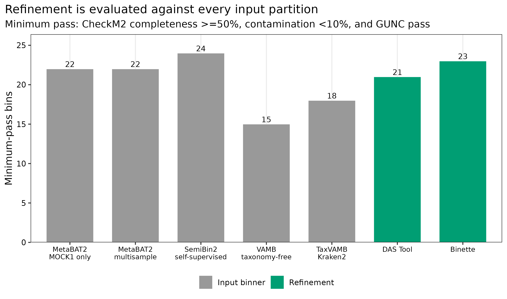
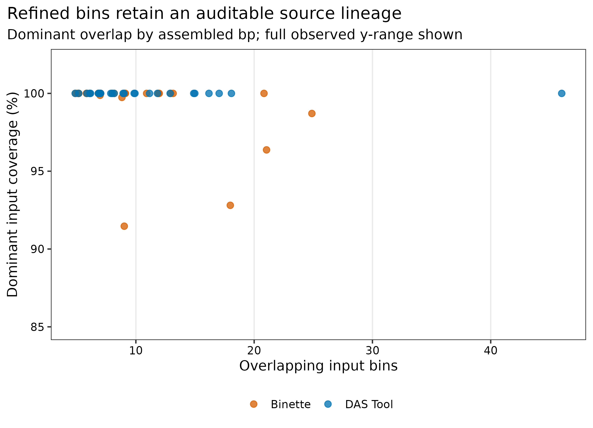
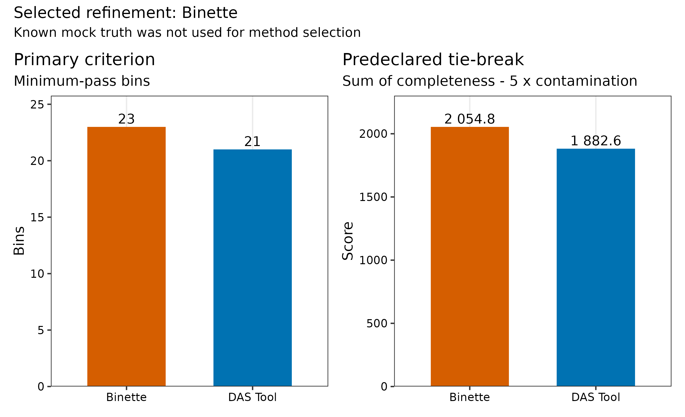
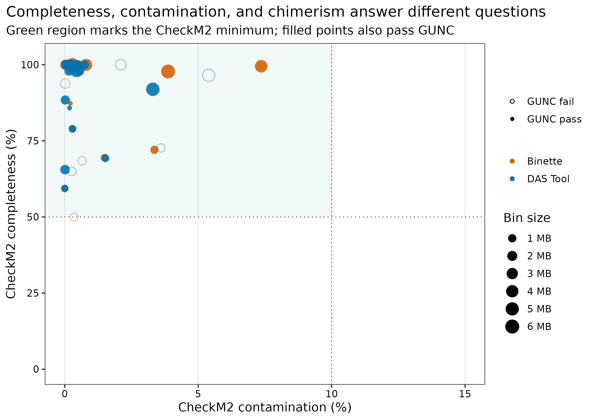

> **先给结论：**精炼不是把所有 bins 拼在一起，也不是按已知真值挑“最像答案”的结果。五套 checksum-locked partition 在同一 10,203-contig 坐标上重建并逐一核对 SHA-256；DAS Tool 用 single-copy genes 对候选打分和选集，Binette 用 CheckM2 驱动的 split/merge/set operations 寻找更好的组合。最终方法按运行前固定的 **truth-blind** 规则选择：先最大化 CheckM2 >=50%、contamination <10%、GUNC pass 的 bins；平局时最大化这些 bins 的 (sum(completeness-5\times contamination))，仍平局则选 Binette。mock truth 只在决定之后解释 recovery/purity。

::: {.callout-important title="算力与数据边界"}
本次输入为五套候选 bins、74.93 Mb 共组装，使用 **24 CPU cores**。建议 **96 GB RAM、150 GB 磁盘**，预计耗时 **2--6 小时**；Binette 内部 CheckM2 与精炼后统一 CheckM2/GUNC 是主要算力开销。数据库为 CheckM2 v3 约 3.08 GB 与 GUNC ProGenomes 2.1 大型 DIAMOND 库。没有服务器时，可读取 `data/small/43-bin-refinement-frozen/` 的 candidate reconstruction、provenance、独立 QC、selection ledger、日志和环境锁。
:::

## 这一步对应论文里的哪张图 {#sec-target}

DAS Tool 论文的核心图比较 single binners、输入 union 与 dereplicated/aggregated genome set 的质量产出 [@sieber2018dastool]。Binette 把这一问题扩展为显式集合运算，并用现代 genome-quality prediction 为新候选评分 [@mainguy2024binette]。

本篇对应论文中“精炼前后 high/medium-quality MAG yield”的主图，同时补两张审计图：每个 refined bin 的来源覆盖，以及预注册方法选择的 primary criterion/tie-break。图不只回答“多了几个 bin”，还回答“这些 contigs 从哪里来、为什么选这一套”。

{#fig-43-yield}

DAS Tool 产生 26 个 refined bins，其中 21 个通过 minimum gate；Binette 产生 27 个，其中 23 个通过。预注册 primary criterion 因而直接选择 Binette，不需要启动平局规则；其 passing score sum 也高于 DAS Tool（2,054.76 对 1,882.56）。决定完成后的 mock audit 中，Binette 与 DAS Tool 分别得到 17 和 13 个 HQ proxies。最终 23 个 selected candidates 共覆盖 57,793,968 bp，选择过程中未读取这组真值结果。

## 理论：精炼优化的是 genome set，而不是单个分数 {#sec-theory}

### 1. 输入是 partitions，不是互不相关的 FASTA 文件

同一条 contig 在每个 binner 分支内只能属于一个 bin，但可在五个分支间重复出现。精炼器消费的是五张 `contig -> bin` 表；如果 contig ID、assembly 版本或 cutoff 不同，集合交并运算失去含义。

### 2. DAS Tool 选择“值得保留的输入候选”

DAS Tool 识别 bacterial/archaeal single-copy genes，计算 completeness、redundancy 与 megabin penalty，再从多个 bin sets 中迭代选择得分较高且互不冲突的 bins [@sieber2018dastool]。它擅长从已有候选中做非冗余选择，但受 SCG 数据库和 score threshold 影响。

### 3. Binette 可以构造新的 split/merge candidates

Binette 不只挑原始 bins，还利用候选间的 contig overlap 产生 difference、intersection 与 union 组合，再用 CheckM2 评分 [@mainguy2024binette]。这能救回一个被不同 binners 各自污染或拆碎的 genome，也扩大了 multiple-testing/search space，因此必须独立重跑 CheckM2/GUNC，不能直接信内部 score。

### 4. “更多 MAGs”必须附带非重叠与来源账本

一个 refined partition 的每条 contig 只能出现一次；每个 refined bin 都应记录所有 overlapping input bins、overlap bp、dominant source 与 contributing branches。若只留下最终 FASTA，无法判断它是原样保留、拆分还是跨方法合并。

## 准备工作 {#sec-setup}

### 输入 lineage

| 输入 | 数量/坐标 | 作用 |
|---|---|---|
| `42-binning-comparison-frozen` memberships | MetaBAT2 single/multi、SemiBin2、VAMB、TaxVAMB 共五套 | 精炼候选集合 |
| Common co-assembly | 10,203 contigs >=1.5 kb；74,932,939 bp | 重建所有 candidates |
| CheckM2 database | version 3；Zenodo 14897628 | Binette 内部与独立 QC |
| GUNC database | ProGenomes 2.1 | 独立 chimerism audit |
| Known mock genomes | PRJEB52977 / ERR9765746 / ERR9765747 | 选择完成后的 post-hoc audit |

版本合同固定为 **DAS Tool 1.1.7、Binette 1.2.1、Prodigal 2.6.3、CheckM2 1.1.0、GUNC 1.1.0**。

<details>
<summary>点开：安装、数据库校验与内联出版主题</summary>

```bash
mamba create -n metagenome-assembly-2026.07 --file env/assembly-linux-64.lock
mamba create -n metagenome-mag-qc-2026.07 --file env/mag-qc-linux-64.lock
mamba create -n metagenome-gunc-2026.07 --file env/gunc-linux-64.lock

export DB_ROOT=/db/metagenome-mag-qc
export DB_MANIFEST=data/small/44-mag-qc-database-manifest.tsv
db/download_db.sh audit
db/download_db.sh download checkm2-v3
db/download_db.sh download gunc-progenomes2.1
mkdir -p "${DB_ROOT}/checkm2-v3" "${DB_ROOT}/gunc-progenomes2.1"
tar -xzf "${DB_ROOT}/archives/checkm2-v3/checkm2_database.tar.gz" \
  -C "${DB_ROOT}/checkm2-v3"
gzip -cd "${DB_ROOT}/archives/gunc-progenomes2.1/gunc_db_progenomes2.1.dmnd.gz" \
  > "${DB_ROOT}/gunc-progenomes2.1/gunc_db_progenomes2.1.dmnd"
sha256sum "${DB_ROOT}/checkm2-v3/CheckM2_database/uniref100.KO.1.dmnd"
md5sum "${DB_ROOT}/gunc-progenomes2.1/gunc_db_progenomes2.1.dmnd"
```

```{r}
install.packages(c("ggplot2", "dplyr", "readr", "tidyr", "forcats", "scales", "patchwork"))
library(ggplot2); library(dplyr); library(readr); library(tidyr); library(scales)
set.seed(20260743)

pal_pub <- c("DAS Tool" = "#0072B2", "Binette" = "#D55E00",
             "Input binner" = "#999999", "Refinement" = "#009E73")
scale_color_pub <- function(...) scale_color_manual(values = pal_pub, ...)
scale_fill_pub  <- function(...) scale_fill_manual(values = pal_pub, ...)
theme_pub <- function(base_size = 12) {
  theme_bw(base_size = base_size) + theme(
    panel.grid.minor = element_blank(), panel.grid.major.y = element_blank(),
    axis.text = element_text(color = "black"), legend.key = element_blank(),
    strip.background = element_rect(fill = "#EEF3F5", color = NA),
    plot.title.position = "plot"
  )
}
save_pub <- function(plot, file_base, width = 190, height = 125,
                     units = "mm", dpi = 350) {
  dir.create(dirname(file_base), recursive = TRUE, showWarnings = FALSE)
  ggsave(paste0(file_base, ".pdf"), plot, width = width, height = height,
         units = units, device = cairo_pdf)
  ggsave(paste0(file_base, ".png"), plot, width = width, height = height,
         units = units, dpi = dpi, bg = "white")
  ggsave(paste0(file_base, ".tiff"), plot, width = width, height = height,
         units = units, dpi = dpi, compression = "lzw", bg = "white")
  invisible(plot)
}
```

</details>

## 可复制代码：重建、双方法精炼与盲法选择 {#sec-code}

### 第 1 步：从 frozen membership 精确重建输入 bins

```bash
ROOT="$PWD"
WORK="work/article43"
FROZEN42="data/small/42-binning-comparison-frozen"
ASSEMBLY_ENV="$HOME/miniconda3/envs/metagenome-assembly-2026.07"
MAG_QC_ENV="$HOME/miniconda3/envs/metagenome-mag-qc-2026.07"
GUNC_ENV="$HOME/miniconda3/envs/metagenome-gunc-2026.07"
CHECKM2_DB="/db/metagenome-mag-qc/checkm2-v3/CheckM2_database/uniref100.KO.1.dmnd"
GUNC_DB="/db/metagenome-mag-qc/gunc-progenomes2.1/gunc_db_progenomes2.1.dmnd"

python3 scripts/prepare_article43_refinement.py \
  --project-root "${ROOT}" --work-dir "${WORK}" \
  --article42-frozen "${FROZEN42}" --assembly-env "${ASSEMBLY_ENV}" \
  --mag-qc-env "${MAG_QC_ENV}" --checkm2-db "${CHECKM2_DB}"
```

准备器把五套 memberships 写为无表头 two-column contig2bin tables，并用共同 assembly 序列重建 FASTA。每个重建 candidate 必须与固化表中的 `CandidateSHA256` 完全一致。

### 第 2 步：共享一次 Prodigal proteins

```bash
prodigal -i work/article43/inputs/megahit-coassembly.ge1500.fna \
  -a work/article43/inputs/megahit-coassembly.ge1500.proteins.faa \
  -p meta -f gff -o work/article43/inputs/megahit-coassembly.ge1500.genes.gff
```

DAS Tool 与 Binette 使用同一 protein file，避免 gene prediction 差异混入方法比较。

### 第 3 步：运行 DAS Tool

```bash
DAS_Tool \
  -i metabat1.tsv,metabat_multi.tsv,semibin2.tsv,vamb.tsv,taxvamb.tsv \
  -l metabat1,metabat_multi,semibin2,vamb,taxvamb \
  -c work/article43/inputs/megahit-coassembly.ge1500.fna \
  -p work/article43/inputs/megahit-coassembly.ge1500.proteins.faa \
  -o work/article43/refinement/dastool/article43 -t 24 \
  --score_threshold 0.5 --duplicate_penalty 0.6 --megabin_penalty 0.5 \
  --write_bin_evals --write_bins
```

### 第 4 步：运行 Binette

```bash
binette -b metabat1.tsv metabat_multi.tsv semibin2.tsv vamb.tsv taxvamb.tsv \
  -c work/article43/inputs/megahit-coassembly.ge1500.fna \
  -p work/article43/inputs/megahit-coassembly.ge1500.proteins.faa \
  -o work/article43/refinement/binette --prefix article43 --threads 24 \
  --min_completeness 40 --max_contamination 10 --min_length 200000 \
  --contamination_weight 2.0 --checkm2_db "${CHECKM2_DB}" --no-progress
```

入口阈值 40% completeness 允许 Binette 构造中间 candidates；这不是最终 MAG cutoff。所有输出随后放回同一 independent QC。

### 第 5 步：统一 CheckM2/GUNC 并做 provenance

```bash
python3 scripts/run_article43_refinement.py \
  --work-dir "${WORK}" --assembly-env "${ASSEMBLY_ENV}" \
  --mag-qc-env "${MAG_QC_ENV}" --gunc-env "${GUNC_ENV}" \
  --checkm2-db "${CHECKM2_DB}" --gunc-db "${GUNC_DB}" --threads 24

python3 scripts/summarize_article43_refinement.py \
  --project-root "${ROOT}" --work-dir "${WORK}" \
  --article42-frozen "${FROZEN42}"
```

`refinement-provenance-links.tsv.gz` 对每个 refined bin 记录与所有 input candidates 的 overlap bp；`refinement-provenance.tsv` 汇总 contributing branches、dominant source 与 coverage。

{#fig-43-provenance}

### 第 6 步：复核预注册 selection ledger

```r
frozen <- "data/small/43-bin-refinement-frozen"
selection <- readr::read_tsv(file.path(frozen, "final-method-selection.tsv"), show_col_types = FALSE)
selected <- readr::read_tsv(file.path(frozen, "selected-mag-candidates.tsv"), show_col_types = FALSE)
stopifnot(selection$MockTruthUsed == "No")
stopifnot(nrow(selected) == selection$SelectedBins)
stopifnot(all(selected$ReferenceFreeMinimumPass))
```

{#fig-43-selection}

### 第 7 步：冻结、出图与验收

```bash
python3 scripts/freeze_article43_refinement.py \
  --project-root "${ROOT}" --work-dir "${WORK}" \
  --output-dir data/small/43-bin-refinement-frozen

Rscript scripts/plot_article43_refinement.R \
  --input-dir data/small/43-bin-refinement-frozen --output-dir figures

python3 scripts/validate_article43_refinement.py \
  --project-root "${ROOT}" --frozen-dir data/small/43-bin-refinement-frozen \
  --output-dir results/43-bin-refinement --figure-dir figures \
  --chapter chapters/43-bin-refinement.qmd
```

{#fig-43-quality}

## 审计与升级 {#sec-audit}

### 忠实复现 DAS Tool，再用现代 QC 复核

DAS Tool 原始 score 基于 SCG completeness/redundancy 与 megabin penalty [@sieber2018dastool]。今天应保留该 selection logic，但输出必须再经 CheckM2+GUNC；不能把 DAS score 直接翻译成 MIMAG tier。

### 允许 Binette 搜索，但隔离内部与外部评分

Binette 内部使用 CheckM2 发现候选。为避免同一 score 既训练/搜索又宣告成功，本篇把最终 FASTA 重新 flatten，以新的输出目录统一跑 CheckM2 和 GUNC，并保留 raw reports。更严格的外部 benchmark 还应使用独立 marker set 或已知真值。

### 从“精炼后更多”升级为 non-overlap ledger

每个 refinement method 内必须满足 contig 唯一；最终 selected membership 也必须唯一。若两个优质 bins 共享 contig，数量不能简单相加，必须解决冲突或标记 alternative representatives。

### 从 mock truth ranking 升级为 predeclared choice

已知 truth 能揭示 marker-based QC 漏掉的错误，却不应在同一 benchmark 中承担 tuning 与 testing。自然数据没有 truth，因此 primary selection 只用可迁移的 CheckM2/GUNC rule；truth audit 用于理解规则何时失败。

## 出版级美化 {#sec-publication}

1. input binners 与 refinement methods 用不同 stage 色，避免读者把七根柱当七个同级算法。
2. quality scatter 显示 completeness、contamination、GUNC、bin size 四个维度；阈值区域只作参考。
3. provenance 图的 x 轴用 overlapping input-bin 数，y 轴用 dominant input coverage (%)，并在表中另存 contributing branches。
4. method-selection 图拆为 primary count 与 tie-break score，标题明确 selected method 和 truth 未参与。
5. 图内全部使用英文 ASCII labels；候选 ID 不承诺 taxonomy。
6. 同时导出 PDF、350-dpi PNG 与 LZW TIFF。

## 常见坑 {#sec-pitfalls}

::: {.callout-caution title="1. 把不同 assembly 的 bins 输入同一次 refinement"}
相同字符串 contig ID 也可能代表不同序列。先核对 assembly checksum、contig length 与 candidate FASTA SHA-256。
:::

::: {.callout-caution title="2. contig2bin 表带普通 header"}
DAS Tool/Binette 可能把 `Contig Bin` 当作真实 assignment。用无表头 two-column TSV，或使用工具明确支持的 comment header。
:::

::: {.callout-caution title="3. 只比较 refined bin 总数"}
低 completeness、小 bin 或 GUNC-fail 也会增加总数。主 endpoint 必须是预定义 quality-pass bins，并报告全部 exclusions。
:::

::: {.callout-caution title="4. Binette 内部 CheckM2 后不再独立 QC"}
搜索 score 与验收 score 完全共用会产生乐观偏差。至少重跑 CheckM2，并加入 GUNC；有 truth 时再做 post-hoc audit。
:::

::: {.callout-caution title="5. 用 mock truth 选择方法却不披露"}
这会把 benchmark test set 变成 tuning set。选择规则、tie-break 与 truth access time 都应写进合同。
:::

::: {.callout-caution title="6. 丢失来源链"}
最终 FASTA 必须能追到 input branch、input candidate、overlap bp、refinement command 和 checksum，否则无法人工校正。
:::

## 这段 Methods 怎么写 {#sec-methods}

### Methods template

> Five checksum-reconstructed bin partitions generated from the same 10,203-contig (74,932,939-bp) MEGAHIT v1.2.9 co-assembly of PRJEB52977 runs ERR9765746 and ERR9765747 were refined. Protein-coding genes were predicted once with Prodigal v2.6.3 in metagenomic mode and supplied to both refiners. DAS Tool v1.1.7 was run with score threshold 0.5, duplicate penalty 0.6, megabin penalty 0.5, and 24 threads. Binette v1.2.1 was run with minimum intermediate completeness 40%, maximum contamination 10%, minimum length 200 kb, contamination weight 2.0, CheckM2 v1.1.0 database version 3, and 24 threads. All DAS Tool and Binette outputs were independently re-evaluated with CheckM2 v1.1.0 database version 3 and GUNC v1.1.0 ProGenomes 2.1. The primary selection rule maximized bins with completeness >=50%, contamination <10%, and `pass.GUNC=TRUE`; ties maximized the sum of completeness minus five times contamination among passing bins, followed by a prespecified Binette tie-break. Known mock references were withheld from refinement and selection and used only for post-hoc recovery/purity auditing. Contig-level provenance, non-overlap, commands, database checksums, resources, and FASTA checksums were retained.

### Results template

> DAS Tool and Binette produced 26 and 27 non-overlapping refined bins, respectively, from the same five input partitions. Independent CheckM2 and GUNC reassessment retained 21 DAS Tool and 23 Binette bins at the prespecified minimum criterion; Binette was therefore selected by the primary endpoint without invoking a tie-break. The corresponding prespecified score sums were 1,882.56 and 2,054.76. The 23 selected Binette candidates covered 57,793,968 assembled bp. In the post-hoc known-truth audit, DAS Tool and Binette yielded 13 and 17 HQ proxies, respectively, but these values were not used for selection. Shared Prodigal prediction, DAS Tool, Binette, independent CheckM2, and GUNC required 1,100.60, 32.95, 540.69, 648.02, and 1,681.44 s, with peak RAM values of 0.058, 0.427, 8.849, 9.820, and 8.839 GiB, respectively. Each refined candidate retained complete overlap-bp provenance to its contributing input bins.

## 换成你自己的数据怎么做 {#sec-own-data}

1. 确保所有 input binsets 来自同一 checksum-locked assembly 和 contig cutoff。
2. 为每套 input 写无表头 `contig<TAB>bin`，检查分支内每条 contig 只出现一次。
3. 共享一份 Prodigal proteins，使 refiners 的 gene evidence 可比。
4. 在看结果前固定 DAS Tool penalties、Binette search thresholds、final pass rule 与 tie-break。
5. 所有 refined outputs 统一重跑 CheckM2+GUNC；不要直接比较各工具内部 quality label。
6. 输出每个 refined bin 的全量 overlap provenance，并审计 selected membership 不重叠。
7. 有 isolate/mock truth 时只做独立 post-hoc audit；无 truth 时可用 read recruitment、coverage uniformity 与 assembly graph 增加证据。
8. 对最终 selected candidates 继续做完整 MIMAG 审计，不要在精炼阶段提前称为 high-quality MAGs。

## 参考 {#sec-references}

- DAS Tool [@sieber2018dastool]
- Binette [@mainguy2024binette]
- CheckM2 [@chklovski2023checkm2]
- GUNC [@orakov2021gunc]
- MIMAG [@bowers2017mimag]
- 真实 uneven microbial mocks [@meslier2022platforms]
