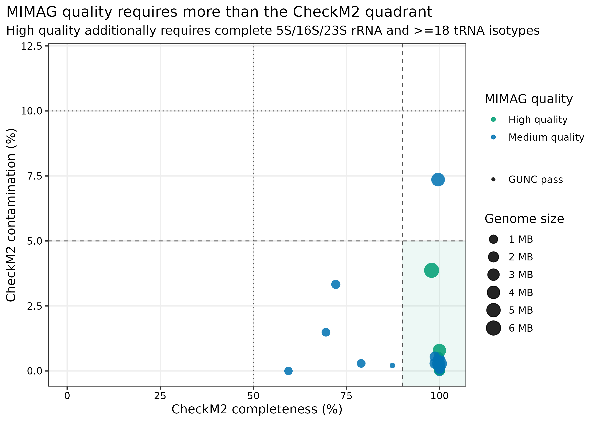
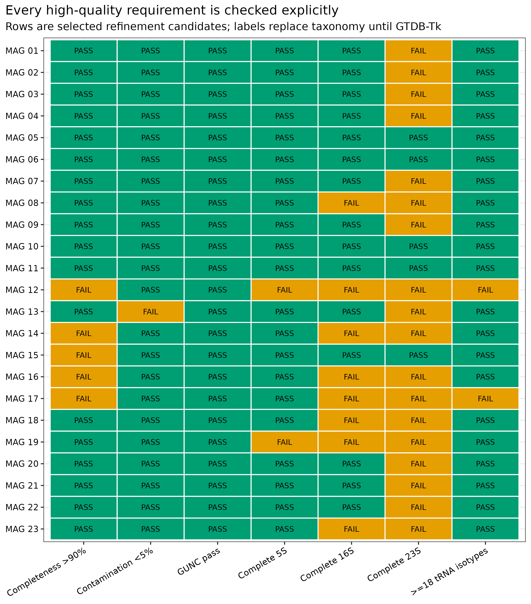
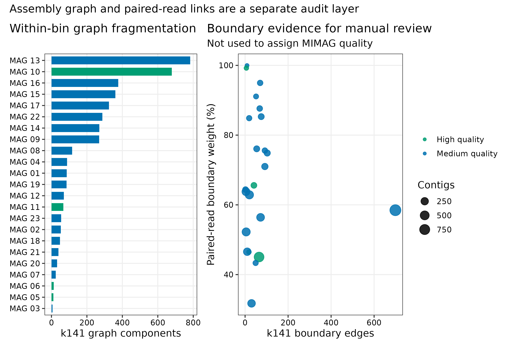
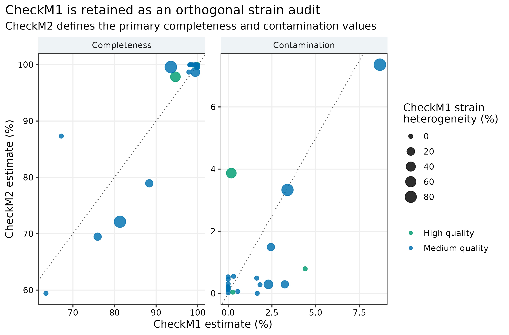

> **先给结论：**`completeness >90% + contamination <5%` 只到达 high-quality 的前门，不等于完整 MIMAG。对 truth-blind 精炼得到的非重叠 candidates，独立重跑 CheckM2 1.1.0、GUNC 1.1.0、CheckM1 1.2.5、barrnap 1.10.5、tRNAscan-SE 2.0.13 与 Prodigal 2.6.3。High-quality 还必须有完整 5S/16S/23S rRNA 和 >=18 个 tRNA isotypes；assembly graph 与 paired-read boundary links 作为人工复核层，既不参与 MIMAG 分级，也不能单独证明 circular genome。taxonomy 需用锁定 release 的 GTDB-Tk 独立完成，不能用 mock truth 冒充分类结果。

::: {.callout-important title="算力与数据边界"}
本次用 **24 CPU cores**；建议 **128 GB RAM、200 GB 磁盘，预计耗时 3--8 小时**。CheckM2 v3 DIAMOND 文件为 3,082,500,605 bytes；GUNC ProGenomes 2.1 下载归档约 7.19 GB、解压库更大；CheckM1 pplacer 应只给 1 thread 以限制内存。barrnap/tRNAscan-SE 很快，但每个 MAG 都保留 GFF、table 和日志。没有服务器时，可读取 `data/small/44-mag-qc-mimag-graph-frozen/` 的完整 MIMAG table、graph audit、raw QC tables、feature evidence、资源日志和环境锁。
:::

## 这一步对应论文里的哪张图 {#sec-target}

锚定图是 genome-resolved 论文常见的 MAG quality landscape：x 轴 CheckM2 completeness，y 轴 contamination，颜色为 MIMAG tier，形状为 GUNC status。CheckM2 提供快速 genome-quality estimates [@chklovski2023checkm2]，GUNC 捕捉 lineage-inconsistent chimerism [@orakov2021gunc]，最终等级遵循 MIMAG minimum information 标准 [@bowers2017mimag]。

与只画 >90/<5 quadrant 的版本相比，本篇增加 explicit requirement matrix：每个 candidate 的 CheckM2、GUNC、5S/16S/23S 和 tRNA isotypes 都能逐项追踪。

{#fig-44-quality}

23 个 candidates 全部通过 GUNC，其中 17 个先通过 CheckM2 `>90%/<5%` 前门；但只有 5 个含完整 5S/16S/23S rRNA set，21 个达到至少 18 个 tRNA isotypes。完整 MIMAG 规则最终得到 **4 个 high-quality、19 个 medium-quality、0 个 low/failed**，也就是 17 个 pre-marker HQ 中有 13 个不能直接写成 high-quality。CheckM marker lineage 进一步把它们分为 16 个 Bacteria 与 7 个 Archaea，结构注释均使用相应 domain mode。

## 理论：五种质量证据回答五个不同问题 {#sec-theory}

### 1. CheckM2：标记与机器学习意义上的 completeness/contamination

CheckM2 使用 protein annotation 与模型预测 genome completeness 和 contamination [@chklovski2023checkm2]。它适合统一筛选大量 bins，却不能保证所有 contigs 来自同一 lineage，也不能证明 chromosome closed。

### 2. GUNC：gene lineage 是否在一个 genome 内自洽

GUNC 根据 genome 内 genes 的 taxonomic assignment distribution 计算 clade separation 与 contamination signal [@orakov2021gunc]。一个 CheckM2 contamination 较低的 bin 仍可能 `pass.GUNC=FALSE`；这种 candidate 不进入 MIMAG high/medium set。

### 3. barrnap + tRNAscan-SE：MIMAG high-quality 的结构要求

MIMAG high-quality draft 要求 >90% completeness、<5% contamination、23S/16S/5S rRNA 和至少 18 个 tRNA species/isotypes [@bowers2017mimag]。本篇只把 barrnap 的完整 hits 计入 rRNA；tRNAscan-SE 的 pseudogene、undetermined 与 suppressor 类别不计入 18-isotype threshold。

### 4. CheckM1：marker lineage 与 strain heterogeneity 的补充审计

CheckM1 与 CheckM2 的 completeness/contamination 算法不同，不能混合择优。本篇用 CheckM2 作为 primary quality，CheckM1 只提供 marker lineage、对比值与 strain heterogeneity。marker lineage 需用同一 CheckM 数据库的 `taxon_marker_sets.tsv` 回溯到 Bacteria/Archaea，随后决定 barrnap/tRNAscan mode；不能把所有不含字面量 `Archaea` 的 lineage 都当细菌，也不能从已知 mock label 倒推。

### 5. Assembly graph：连接证据，不是质量等级

MEGAHIT `k141.contigs.fa` 转为 FASTG 后，可统计一个 MAG 内部 edges、boundary edges 与 connected components；固化的 `paired-contigs.tsv` 提供独立 read-pair link weight。boundary link 可能来自 repeat、strain variation、plasmid 或错误合并，只能标记人工审查。即便 graph 形成 cycle，也不能在没有 closure/read support 的情况下写成 complete circular genome。

## 准备工作 {#sec-setup}

### 输入 lineage 与数据库

| 输入 | 锁定对象 | 角色 |
|---|---|---|
| `43-bin-refinement-frozen` selected membership | PRJEB52977 / ERR9765746 / ERR9765747 共组装 | truth-blind final candidates |
| CheckM2 DB | version 3；Zenodo 14897628；DMND 3,082,500,605 bytes；SHA-256 `1b86ef3e...a63ae46f` | primary completeness/contamination |
| GUNC DB | ProGenomes 2.1；DMND 13,520,342,381 bytes；MD5 `447c9330...fe4af4eb` | chimerism |
| CheckM1 data | release 2015-01-16；Zenodo 7401545；`.dmanifest` 留档 | lineage/strain heterogeneity supplement |
| MEGAHIT graph source | v1.2.9 `k141.contigs.fa` | FASTG adjacency |
| JGI paired links | `41-read-mapping-depth-frozen/raw/paired-contigs.tsv` | read-pair boundary audit |

Known mock references只在 `mag-quality-truth-audit.tsv` 做 post-hoc recovery/purity，不参与 MIMAG 公式、domain mode 或 graph flag。

<details>
<summary>点开：锁定四套环境、校验数据库与内联出版主题</summary>

```bash
mamba create -n metagenome-assembly-2026.07 --file env/assembly-linux-64.lock
mamba create -n metagenome-mag-qc-2026.07 --file env/mag-qc-linux-64.lock
mamba create -n metagenome-gunc-2026.07 --file env/gunc-linux-64.lock
mamba create -n metagenome-checkm1-2026.07 --file env/checkm1-linux-64.lock

export DB_ROOT=/db/metagenome-mag-qc
export DB_MANIFEST=data/small/44-mag-qc-database-manifest.tsv
db/download_db.sh audit
db/download_db.sh download checkm2-v3
db/download_db.sh download gunc-progenomes2.1
db/download_db.sh download checkm1-2015-01-16

mkdir -p "${DB_ROOT}/checkm2-v3" \
  "${DB_ROOT}/gunc-progenomes2.1" \
  "${DB_ROOT}/checkm1-2015-01-16"
tar -xzf "${DB_ROOT}/archives/checkm2-v3/checkm2_database.tar.gz" \
  -C "${DB_ROOT}/checkm2-v3"
gzip -cd "${DB_ROOT}/archives/gunc-progenomes2.1/gunc_db_progenomes2.1.dmnd.gz" \
  > "${DB_ROOT}/gunc-progenomes2.1/gunc_db_progenomes2.1.dmnd"
tar -xzf "${DB_ROOT}/archives/checkm1-2015-01-16/checkm_data_2015_01_16.tar.gz" \
  -C "${DB_ROOT}/checkm1-2015-01-16"

sha256sum "${DB_ROOT}/checkm2-v3/CheckM2_database/uniref100.KO.1.dmnd"
md5sum "${DB_ROOT}/gunc-progenomes2.1/gunc_db_progenomes2.1.dmnd"
"$HOME/miniconda3/envs/metagenome-checkm1-2026.07/bin/checkm" data setRoot \
  "${DB_ROOT}/checkm1-2015-01-16"
```

```{r}
install.packages(c("ggplot2", "dplyr", "readr", "tidyr", "forcats", "scales", "patchwork"))
library(ggplot2); library(dplyr); library(readr); library(tidyr); library(scales)
set.seed(20260744)

pal_pub <- c("High quality" = "#009E73", "Medium quality" = "#0072B2",
             "Low/failed" = "#D55E00", "Pass" = "#009E73", "Fail" = "#E69F00")
scale_color_pub <- function(...) scale_color_manual(values = pal_pub, ...)
scale_fill_pub  <- function(...) scale_fill_manual(values = pal_pub, ...)
theme_pub <- function(base_size = 12) {
  theme_bw(base_size = base_size) + theme(
    panel.grid.minor = element_blank(),
    panel.grid.major = element_line(color = "#EEEEEE"),
    axis.text = element_text(color = "black"), legend.key = element_blank(),
    strip.background = element_rect(fill = "#EEF3F5", color = NA),
    plot.title.position = "plot"
  )
}
save_pub <- function(plot, file_base, width = 190, height = 125,
                     units = "mm", dpi = 350) {
  dir.create(dirname(file_base), recursive = TRUE, showWarnings = FALSE)
  ggsave(paste0(file_base, ".pdf"), plot, width = width, height = height,
         units = units, device = cairo_pdf)
  ggsave(paste0(file_base, ".png"), plot, width = width, height = height,
         units = units, dpi = dpi, bg = "white")
  ggsave(paste0(file_base, ".tiff"), plot, width = width, height = height,
         units = units, dpi = dpi, compression = "lzw", bg = "white")
  invisible(plot)
}
```

</details>

## 可复制代码：完整 MIMAG 与 graph audit {#sec-code}

### 第 1 步：重建 selected candidates 并锁定版本

```bash
ROOT="$PWD"
WORK="work/article44"
FROZEN43="data/small/43-bin-refinement-frozen"
ASSEMBLY_ENV="$HOME/miniconda3/envs/metagenome-assembly-2026.07"
MAG_QC_ENV="$HOME/miniconda3/envs/metagenome-mag-qc-2026.07"
GUNC_ENV="$HOME/miniconda3/envs/metagenome-gunc-2026.07"
CHECKM1_ENV="$HOME/miniconda3/envs/metagenome-checkm1-2026.07"
CHECKM2_DB="/db/metagenome-mag-qc/checkm2-v3/CheckM2_database/uniref100.KO.1.dmnd"
GUNC_DB="/db/metagenome-mag-qc/gunc-progenomes2.1/gunc_db_progenomes2.1.dmnd"

python3 scripts/prepare_article44_mag_qc.py \
  --project-root "${ROOT}" --work-dir "${WORK}" \
  --article43-frozen "${FROZEN43}" --assembly-env "${ASSEMBLY_ENV}" \
  --mag-qc-env "${MAG_QC_ENV}" --gunc-env "${GUNC_ENV}" \
  --checkm1-env "${CHECKM1_ENV}" --checkm2-db "${CHECKM2_DB}" \
  --gunc-db "${GUNC_DB}"
```

每个重建 FASTA 必须与固化 selected table 的 `RefinedSHA256` 一致，selected bins 之间不能共享 contig。

### 第 2 步：独立重跑 CheckM2 与 GUNC

```bash
checkm2 predict --input work/article44/bins \
  --output-directory work/article44/qc/checkm2 --extension .fna \
  --threads 24 --database_path "${CHECKM2_DB}" --remove_intermediates

gunc run --input_dir work/article44/bins --file_suffix .fna \
  --db_file "${GUNC_DB}" --threads 24 \
  --out_dir work/article44/qc/gunc --contig_taxonomy_output
```

独立重跑可以发现 flatten/reconstruction 的任何漂移，也让 raw table、command 和 checksum 形成闭合证据链。

### 第 3 步：CheckM1 lineage 与 strain heterogeneity

```bash
checkm lineage_wf -x fna -t 24 --pplacer_threads 1 --aai_strain 0.9 \
  --tab_table -f work/article44/qc/checkm1-qa.tsv \
  work/article44/bins work/article44/qc/checkm1
```

CheckM1 1.2.5 使用 2015-01-16 reference data，仅作 supplementary audit。Methods 中不能把它的 completeness 与 CheckM2 值混成一个阈值。

### 第 4 步：按 marker lineage 运行 rRNA/tRNA/CDS

```bash
# bacterial lineage 示例；archaeal lineage 改为 barrnap --kingdom arc / tRNAscan-SE -A
barrnap --kingdom bac --threads 8 --addids MAG.fna > MAG.barrnap.gff
tRNAscan-SE -B --thread 8 --output MAG.trnascan.tsv \
  --stats MAG.trnascan.stats --gff MAG.trnascan.gff --forceow --quiet MAG.fna
prodigal -i MAG.fna -p meta -f gff -o MAG.prodigal.gff -a MAG.proteins.faa
```

完整 rRNA hit 要同时通过 barrnap 完整性检查；tRNA 以非 pseudo、非 undetermined、非 suppressor 的 unique isotypes 计数。

### 第 5 步：转换 MEGAHIT graph 并汇总 paired links

```bash
megahit_toolkit contig2fastg 141 \
  data/raw/article30/work/assemblies/megahit-coassembly/intermediate_contigs/k141.contigs.fa \
  > work/article44/graph/megahit-k141.fastg
```

`contig2fastg` 会把原始 `k141_*` 名称改写成 `NODE_*`，不能直接按字符串相交。汇总器以 forward sequence SHA-256 将 58,070 个 FASTG nodes 精确映回 `k141.contigs.fa`，固化 `assembly-graph-node-map.tsv.gz` 后才把 edges 限制到每个 MAG membership，统计 internal/boundary edges 与 components；再把 `paired-contigs.tsv` 的 index 映射回 checksum-locked assembly order，计算内部与 boundary link weight。

### 第 6 步：运行封装流程并生成完整表

```bash
python3 scripts/run_article44_mag_qc.py \
  --project-root "${ROOT}" --work-dir "${WORK}" \
  --assembly-env "${ASSEMBLY_ENV}" --mag-qc-env "${MAG_QC_ENV}" \
  --gunc-env "${GUNC_ENV}" --checkm1-env "${CHECKM1_ENV}" \
  --checkm2-db "${CHECKM2_DB}" --gunc-db "${GUNC_DB}" --threads 24

python3 scripts/summarize_article44_mag_qc.py \
  --project-root "${ROOT}" --work-dir "${WORK}" \
  --article43-frozen "${FROZEN43}"
```

MIMAG 分类公式是：

```r
qc <- readr::read_tsv("data/small/44-mag-qc-mimag-graph-frozen/mag-quality-summary.tsv",
                      show_col_types = FALSE)
qc <- qc |>
  dplyr::mutate(recomputed = dplyr::case_when(
    CheckM2Completeness > 90 & CheckM2Contamination < 5 & GUNCPass &
      Complete5S & Complete16S & Complete23S & TRNAIsotypes >= 18 ~ "High quality",
    CheckM2Completeness >= 50 & CheckM2Contamination < 10 & GUNCPass ~ "Medium quality",
    TRUE ~ "Low/failed"
  ))
stopifnot(all(qc$recomputed == qc$MIMAGQuality))
```

{#fig-44-requirements}

### 第 7 步：冻结、出图与验收

```bash
python3 scripts/freeze_article44_mag_qc.py \
  --project-root "${ROOT}" --work-dir "${WORK}" \
  --output-dir data/small/44-mag-qc-mimag-graph-frozen

Rscript scripts/plot_article44_mag_qc.R \
  --input-dir data/small/44-mag-qc-mimag-graph-frozen --output-dir figures

python3 scripts/validate_article44_mag_qc.py \
  --project-root "${ROOT}" --frozen-dir data/small/44-mag-qc-mimag-graph-frozen \
  --output-dir results/44-mag-qc-mimag-graph --figure-dir figures \
  --chapter chapters/44-mag-qc-checkm2-gunc-mimag.qmd
```

{#fig-44-graph}

58,070 个 FASTG nodes 全部得到唯一 exact-sequence 映射，共解析 5,843 条无向 edges；23 个 MAG 的成员节点均完整落在 k141 坐标中。每个 MAG 有 2--699 条 k141 boundary edges、6--783 个 graph components，paired-read boundary weight 为 31.75%--99.96%；因此 23 个均保留为 `Fragmented in k141 graph`，这些数值只决定人工复核优先级。

{#fig-44-checkm}

CheckM1 与 CheckM2 completeness 的最大绝对差为 20.12 percentage points，contamination 的最大绝对差为 3.69 points；6 个 MAG 的 CheckM1 strain heterogeneity 大于 0，最高 88.89%。73 条已计时命令合计 5,638.86 秒；CheckM2、GUNC、CheckM1 分别耗时 513.63、1,204.70、1,681.26 秒，整条链的实测峰值为 CheckM1 pplacer 阶段的 34.787 GiB。

## 审计与升级 {#sec-audit}

### 从简化 >90/<5 升级为完整 MIMAG

早期研究常把 >90/<5 写作 high-quality。按 MIMAG，缺任一完整 5S/16S/23S 或少于 18 个 tRNA isotypes 时，即使 CheckM2 quadrant 合格，也不能升级为 high quality [@bowers2017mimag]。结果表应保留 `PreMarkerHQ` 和最终 `MIMAGQuality` 两列。

### 从单一 contamination 升级为 marker redundancy + lineage chimerism

CheckM2 contamination 与 GUNC CSS 不同维度。主过滤要求两者都通过，并保留 `pass.GUNC` 与 clade separation score。GUNC fail 不应用“CheckM2 contamination 很低”覆盖。

### 从“有 assembly graph”升级为可解释的 boundary ledger

graph edge 和 paired-read link 分开记录。一个 fragmented MAG 可能只是 assembly 不连续；boundary links 也可能是 conserved repeat。两者用于挑选 Bandage/IGV 人工审查对象，不自动删除或合并 contigs。

### 从 mock taxonomy 升级为独立 GTDB-Tk

已知输入 genome accession 仅验证 recovery/purity。正式 taxonomy 必须用锁定 release 的 GTDB-Tk 独立分类；结果表明确写 `Pending independent GTDB-Tk classification`，避免 data leakage。

### 从单点质量升级为 uncertainty/sensitivity

投稿前应报告 CheckM2 model used、CheckM1 discrepancy、GUNC fail、strain heterogeneity、rRNA partial hits、tRNA isotype count、graph components 和 boundary links。对阈值附近 MAG 可用 BUSCO/lineage-specific markers、read coverage 与 manual curation 增加证据。

## 出版级美化 {#sec-publication}

1. completeness/contamination 图同时画 50/10 与 90/5 参考线；颜色为最终 MIMAG，形状为 GUNC。
2. requirement matrix 每格写 PASS/FAIL，列顺序固定为 CheckM2、GUNC、rRNAs、tRNA。
3. candidate 显示用 `MAG 01` 等匿名 ASCII label；GTDB 未完成前不把 mock organism 写成 taxonomy。
4. graph 图把 components 与 boundary evidence 分 panel，并在 subtitle 明确不用于 MIMAG。
5. CheckM1/CheckM2 对比加 `y=x`，不要把两套值平均。
6. 图内全英文；输出 PDF、350-dpi PNG 与 LZW TIFF。

## 常见坑 {#sec-pitfalls}

::: {.callout-caution title="1. 把 >90/<5 直接标为 MIMAG high-quality"}
还要完整 5S/16S/23S 和 >=18 tRNA isotypes；否则只能报告 medium quality 或 `pre-marker HQ`。
:::

::: {.callout-caution title="2. 只跑 CheckM2，不跑 GUNC"}
marker redundancy 可能漏掉 lineage-inconsistent non-marker contigs。至少并列报告 CheckM2 与 GUNC。
:::

::: {.callout-caution title="3. 把 partial rRNA 当完整 hit"}
barrnap 的 truncated/aligned-only hit 不能满足 MIMAG complete rRNA set；保留 GFF attributes 供复核。
:::

::: {.callout-caution title="4. 用 tRNA gene 总数代替 isotype 数"}
同一 isotype 多拷贝不能补齐缺失 amino-acid coverage；pseudo/undetermined/suppressor 也不计入 18。
:::

::: {.callout-caution title="5. CheckM1/CheckM2 挑更好看的值"}
本篇预注册 CheckM2 为 primary，CheckM1 只作 lineage/strain audit。Methods 必须写清数据库 release 与角色。
:::

::: {.callout-caution title="6. 看见 graph cycle 就声称 circular complete"}
assembly graph orientation、repeat、coverage 与跨接 reads 都需人工核验；本篇对所有 candidates 明确不作 circular claim。
:::

::: {.callout-caution title="7. 用 known mock accession 充当正式 taxonomy"}
这是 benchmark truth，不是 blind classification。taxonomy 保持 pending，等 GTDB-Tk 独立运行。
:::

::: {.callout-caution title="8. 只按 lineage 字符串是否含 Archaea 选择 mode"}
古菌 lineage 可能显示为 `p__Euryarchaeota` 或 `c__Thermoprotei`。应由 CheckM `taxon_marker_sets.tsv` 回溯 domain，并逐 MAG 留存 `qc-domain-audit.tsv`；否则会误跑 bacterial barrnap/tRNAscan mode。
:::

::: {.callout-caution title="9. 直接拿 FASTG 的 NODE 名称与 k141 contig 名称相交"}
`megahit_toolkit contig2fastg` 会重命名节点；字符串相交会得到 0 个 present nodes 和 0 条 edges，却不一定报错。应以 exact sequence hash 建立并冻结 node map，再要求每个 selected contig 都能回到同一 graph 坐标。
:::

## 这段 Methods 怎么写 {#sec-methods}

### Methods template

> Non-overlapping MAG candidates selected without access to known truth from a MEGAHIT v1.2.9 co-assembly of PRJEB52977 runs ERR9765746 and ERR9765747 were reconstructed from checksum-locked contig memberships. Completeness and contamination were estimated independently with CheckM2 v1.1.0 and database version 3 (Zenodo 14897628; DIAMOND SHA-256 `1b86ef3eac0813c1853f53182c17657045e3763d66f384ec95747261a63ae46f`). Chimerism was assessed with GUNC v1.1.0 and ProGenomes 2.1; `pass.GUNC=FALSE` genomes were excluded from high- and medium-quality sets. CheckM v1.2.5 with reference data release 2015-01-16 was used only for marker-lineage and strain-heterogeneity auditing; each marker lineage was mapped through the release-matched `taxon_marker_sets.tsv` hierarchy to choose bacterial or archaeal annotation mode. Complete 5S, 16S, and 23S rRNAs were annotated with barrnap v1.10.5, and tRNAs were annotated with tRNAscan-SE v2.0.13 using that audited marker domain; pseudogene, undetermined, and suppressor calls were excluded from isotype counts. Following MIMAG, high-quality MAGs required CheckM2 completeness >90%, contamination <5%, GUNC pass, all three complete rRNAs, and >=18 tRNA isotypes; medium-quality MAGs required completeness >=50%, contamination <10%, and GUNC pass. Coding density was calculated from Prodigal v2.6.3 metagenomic predictions. MEGAHIT k141 FASTG nodes were mapped back to the original k141 contigs by exact forward-sequence SHA-256 before adjacency was summarized; FASTG adjacency and JGI paired-contig links were retained separately as manual-review evidence and were not used to assign MIMAG quality or claim circularity. Commands, databases, resources, raw features, node mappings, and SHA-256 checksums were retained.

### Results template

> All 23 selected candidates passed GUNC, and 17 met the pre-marker CheckM2 >90% completeness and <5% contamination gate. Only five candidates contained complete 5S, 16S, and 23S rRNAs, whereas 21 contained at least 18 valid tRNA isotypes; the complete MIMAG rule therefore assigned four high-quality and 19 medium-quality MAGs. CheckM marker lineages supported bacterial mode for 16 candidates and archaeal mode for seven. Exact sequence hashes mapped all 58,070 FASTG nodes back to the k141 contig coordinate set and identified 5,843 undirected graph edges; graph components and paired-read boundary evidence were reported without altering MIMAG tiers or supporting circularity claims. Known mock references were used only in a separate post-hoc recovery/purity table, and taxonomy remained pending independent GTDB-Tk classification.

## 换成你自己的数据怎么做 {#sec-own-data}

1. 输入一套 non-overlapping candidate membership 和对应 FASTA checksums；不从手工改过但无记录的 bins 起步。
2. 锁 CheckM2 tool/database、GUNC tool/database 与 CheckM1 data release；保存 archive 和 installed-file hashes。
3. 独立运行 CheckM2+GUNC，先应用 >=50/<10+GUNC 的 minimum gate。
4. 用 marker lineage 选择 bacterial/archaeal barrnap 与 tRNAscan mode；保留 raw GFF/table。
5. 明确按 complete 5S/16S/23S 与 unique valid tRNA isotypes 分类，不使用 gene count shortcut。
6. 同时报告 CheckM1 strain heterogeneity 与 CheckM2/CheckM1 discrepancy，阈值附近 genome 做人工复核。
7. 从 assembler 原始 graph 与 read mappings 计算 internal/boundary evidence；不要用 graph 自动宣称 circularity。
8. taxonomy 单独跑 GTDB-Tk；MIMAG、taxonomy、dereplication 和 abundance 各保留独立字段与版本。

## 参考 {#sec-references}

- CheckM2 [@chklovski2023checkm2]
- GUNC [@orakov2021gunc]
- CheckM [@parks2015checkm]
- MIMAG [@bowers2017mimag]
- 真实 uneven microbial mocks [@meslier2022platforms]
