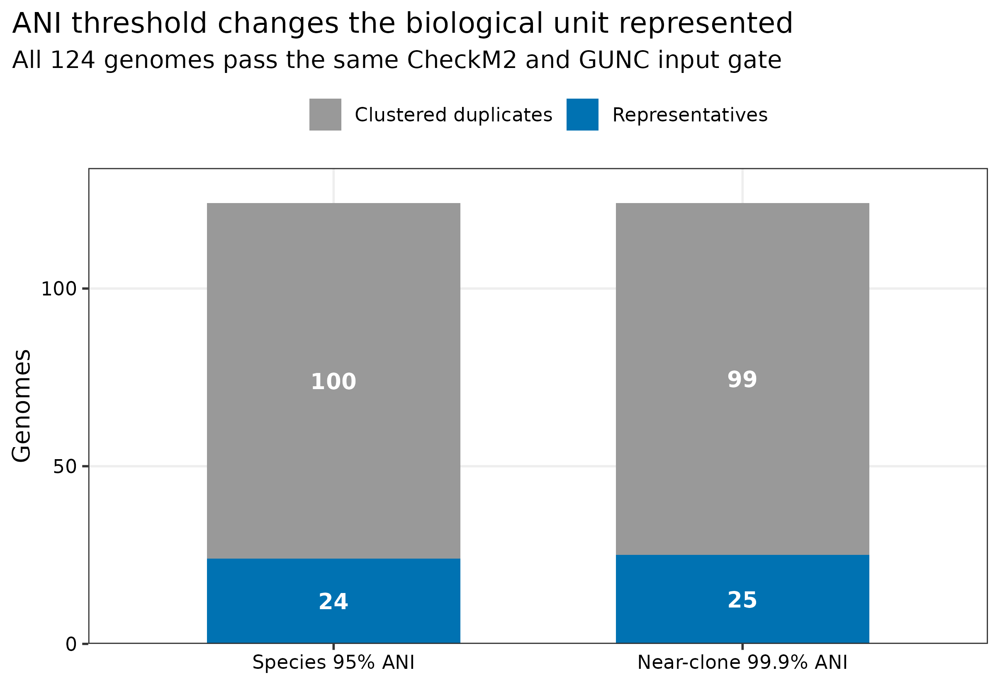
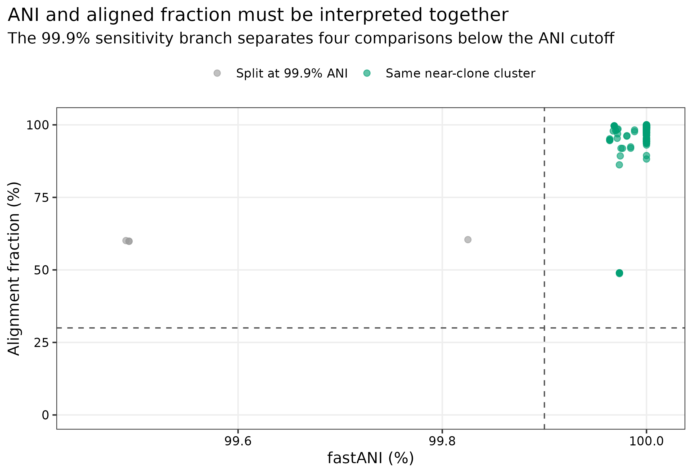
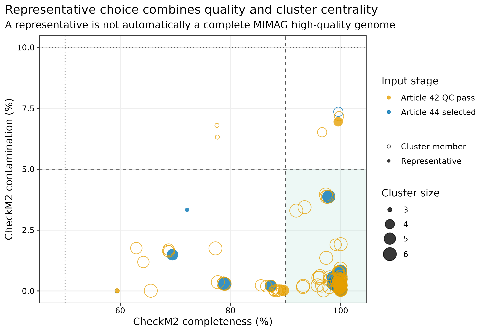
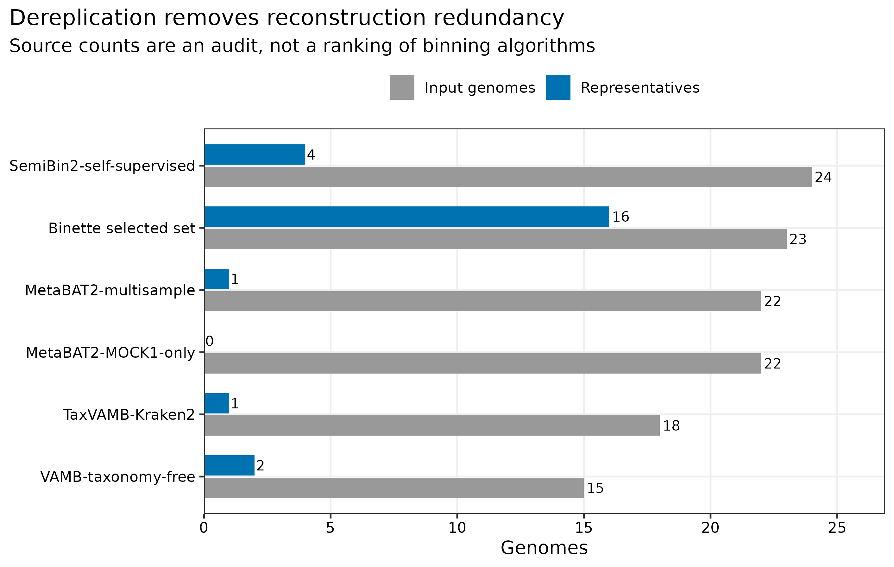

> **先给结论：**去冗余不是删除“低质量重复文件”，而是在预先定义的 ANI（average nucleotide identity，平均核苷酸一致性）与 alignment fraction（可比对比例）下，把同一生物学单位的多个重建归为一簇，再选一个代表基因组。124 个通过相同 CheckM2 >=50%、contamination <10% 与 GUNC gate 的真实重建结果，用 dRep 3.6.2、Mash 2.3 和 fastANI 1.34 在 95% ANI、>=30% alignment fraction 下得到 **24 个物种级簇**，移除 100 个重建冗余；99.9% ANI 敏感性分支得到 25 个近克隆簇，仅拆分 1 个物种簇。代表基因组仍需保留 MIMAG 等级、污染、嵌合和分类证据，不能把“被 dRep 选中”自动写成 high-quality MAG。

::: {.callout-important title="算力与数据边界"}
本次使用 **24 CPU cores**，124 个 genomes 共约 301 MB；两条 dRep 分支各耗时 188--191 秒，实测峰值内存 0.325 GiB，完整工作区约 437 MB。复现这组数据建议 **8 cores、8 GB RAM、2 GB 可用磁盘，预计 5--15 分钟**。数千个跨队列 MAG 的 all-vs-all 比较会显著放大临时文件与计算量，建议使用 16--32 cores、64 GB RAM 和高速本地盘，并先按生态位/host/project 分层。没有服务器时，可直接读取 `data/small/45-drep-dereplication-frozen/` 中 checksum-covered 的 Cdb/Wdb/Ndb、代表表、ANI 审计和资源记录。
:::

## 这一步对应论文里的哪张图 {#sec-target}

锚定图是 genome-resolved 研究中的 non-redundant MAG catalog summary：输入 MAG 数、物种级 genome bins 数、代表基因组质量分布，以及 ANI cluster size。dRep 把快速 primary clustering 与精确 secondary clustering 组合起来，并以质量、连续性与 cluster centrality 选择代表 [@olm2017drep]。

{#fig-45-yield}

95% ANI 主分析保留 24 个 representatives，其中 16 个来自第 44 篇完整 MIMAG 审计后的 selected set；其余 8 个来自第 42 篇通过最小 CheckM2+GUNC gate、但尚未重做完整 rRNA/tRNA MIMAG 审计的分箱结果。因此，“24 个 species representatives”与“24 个 high-quality MAGs”是两种完全不同的陈述。

## 理论：先定义生物学单位，再谈代表 {#sec-theory}

### 1. ANI 与 alignment fraction 是一对门槛

ANI 只在可比较的序列片段上计算。如果两个不完整 MAG 仅有很小的共享片段，即使那段 ANI 很高，也不足以证明它们属于同一 genome cluster。因此主分析同时要求 secondary ANI >=95% 和 minimum alignment fraction >=30%。阈值必须与 Methods 一起报告，不能只写“按 95% ANI 去冗余”。

### 2. 95% 与 99.9% 回答不同问题

- **95% ANI**：常用于构建 species-level genome bins（SGBs），适合物种级 catalog、分类和群落 abundance matrix。
- **99.9% ANI**：本篇作为 near-clone sensitivity branch，用于检查一个物种簇内是否存在明显不同的高相似重建；它不是完整 strain typing。
- **菌株结论**：还需 SNV、shared genome fraction、recombination、样本内多态性与纵向/传播设计；不能由 dRep 的一个阈值代替。

### 3. Primary clustering 是加速层，不是最终物种证据

dRep 先用 Mash 2.3 在 `-pa 0.90` 形成 primary clusters，再只在 primary cluster 内用 fastANI 1.34 做 secondary comparison。这样避免全体精确两两比较，但也意味着 primary cutoff 过严时，原本应进入同一 secondary cluster 的 genomes 可能永远不会相遇。主分析因此保留 native Cdb、Ndb 和命令，便于审计 primary/secondary 两层。

### 4. Representative 是计算角色，不是质量等级

dRep 的 representative score综合 completeness、contamination、N50、genome size 与 centrality。高分 genome 更适合作为 cluster 的索引与展示对象，但仍可能是 medium-quality、嵌合、分类未定或缺少 rRNA。下游 GTDB-Tk、CoverM 与提交表必须继续携带原始 QC 字段。

## 准备工作 {#sec-setup}

### 真实输入与 lineage

| 输入 | 数量 | 进入规则 | 来源 |
|---|---:|---|---|
| Article 42 candidate bins | 101 | CheckM2 completeness >=50%、contamination <10%、GUNC pass | PRJEB52977 的 ERR9765746/ERR9765747 共组装，多分箱分支 |
| Article 44 selected MAGs | 23 | 同一 minimum gate；已做完整 MIMAG 与 graph audit | truth-blind Binette selected set |
| 合计 | 124 | FASTA basename 唯一、SHA-256 固定 | 真实 uneven microbial mocks [@meslier2022platforms] |

这组 pool 表示同一组生物对象被不同分箱/精炼分支重复重建的场景，适合讲 catalog 去冗余；不同 branch 不是独立生物样本，因此 source retention 只作来源审计，不用于比较算法优劣。已知 mock references 不参与聚类、阈值或 representative selection。

<details>
<summary>点开：锁定 dRep 环境并内联出版主题</summary>

```bash
mamba create -n metagenome-drep-2026.07 --file env/drep-linux-64.lock
conda run -n metagenome-drep-2026.07 \
  python -c "import importlib.metadata as m; print(m.version('drep'))"
conda run -n metagenome-drep-2026.07 mash --version
conda run -n metagenome-drep-2026.07 fastANI --version
```

```{r}
install.packages(c("ggplot2", "dplyr", "readr", "tidyr", "forcats", "scales"))
library(ggplot2); library(dplyr); library(readr); library(tidyr); library(forcats)
set.seed(20260745)

pal_pub <- c("Representatives" = "#0072B2", "Clustered duplicates" = "#999999",
             "Same near-clone cluster" = "#009E73", "Split at 99.9% ANI" = "#999999")
scale_color_pub <- function(...) scale_color_manual(values = pal_pub, ...)
scale_fill_pub  <- function(...) scale_fill_manual(values = pal_pub, ...)
theme_pub <- function(base_size = 12) {
  theme_bw(base_size = base_size) + theme(
    panel.grid.minor = element_blank(),
    panel.grid.major = element_line(color = "#EEEEEE"),
    axis.text = element_text(color = "black"), legend.key = element_blank(),
    strip.background = element_rect(fill = "#EEF3F5", color = NA),
    plot.title.position = "plot"
  )
}
save_pub <- function(plot, file_base, width = 190, height = 125,
                     units = "mm", dpi = 350) {
  dir.create(dirname(file_base), recursive = TRUE, showWarnings = FALSE)
  ggsave(paste0(file_base, ".pdf"), plot, width = width, height = height,
         units = units, device = cairo_pdf)
  ggsave(paste0(file_base, ".png"), plot, width = width, height = height,
         units = units, dpi = dpi, bg = "white")
  ggsave(paste0(file_base, ".tiff"), plot, width = width, height = height,
         units = units, dpi = dpi, compression = "lzw", bg = "white")
  invisible(plot)
}
```

</details>

## 可复制代码：从 checksum pool 到 non-redundant catalog {#sec-code}

### 第 1 步：重建输入并固定质量表

```bash
ROOT="$PWD"
WORK="work/article45"
python3 scripts/prepare_article45_drep.py \
  --project-root "${ROOT}" --work-dir "${WORK}"

head "${WORK}/input-genomes.tsv"
head "${WORK}/genome-info.csv"
sha256sum "${WORK}"/inputs/genomes/*.fna > "${WORK}/input-genomes.sha256"
```

`genome-info.csv` 只把 release-matched CheckM2 completeness/contamination 交给 dRep，避免 dRep 再下载另一套 CheckM 数据库后混用版本。输入按 FASTA basename 字典序固定；随机分箱已在来源步骤用 seed 固定，本步的 Mash/fastANI/dRep 对固定输入没有随机抽样。

### 第 2 步：95% ANI 物种级主分析

```bash
export PYTHONHASHSEED=0
conda run -n metagenome-drep-2026.07 dRep dereplicate \
  "${WORK}/drep/species95" \
  -g "${WORK}/genomes.txt" \
  --genomeInfo "${WORK}/genome-info.csv" \
  -comp 50 -con 10 \
  --S_algorithm fastANI \
  -pa 0.90 -sa 0.95 -nc 0.30 \
  -p 24 --gen_warnings
```

关键 native tables 是：

| 文件 | 回答的问题 |
|---|---|
| `data_tables/Cdb.csv` | 每个 genome 属于哪个 primary/secondary cluster |
| `data_tables/Wdb.csv` | 每个 cluster 选中了哪个 representative |
| `data_tables/Ndb.csv` | fastANI 与 alignment coverage 的 pairwise evidence |
| `data_tables/genomeInformation.csv` | 进入评分的 completeness/contamination 与长度信息 |
| `dereplicated_genomes/` | 24 个 representative FASTA；不是唯一证据源 |

### 第 3 步：99.9% ANI 敏感性分支

```bash
conda run -n metagenome-drep-2026.07 dRep dereplicate \
  "${WORK}/drep/nearclone999" \
  -g "${WORK}/genomes.txt" \
  --genomeInfo "${WORK}/genome-info.csv" \
  -comp 50 -con 10 \
  --S_algorithm fastANI \
  -pa 0.90 -sa 0.999 -nc 0.30 \
  -p 24 --gen_warnings
```

{#fig-45-ani}

同一 95% ANI species cluster 中只有 cluster `24_1` 在 99.9% 时拆成两个 near-clone clusters；跨拆分边界的四个 fastANI comparisons 为 99.4902%--99.8251%，alignment fraction 为 59.83%--60.43%。这个结果支持“阈值敏感性可控”，不支持传播或菌株同一性结论。

### 第 4 步：汇总 representative ledger

```bash
python3 scripts/run_article45_drep.py \
  --project-root "${ROOT}" --work-dir "${WORK}" \
  --environment metagenome-drep-2026.07 --threads 24

python3 scripts/summarize_article45_drep.py \
  --project-root "${ROOT}" --work-dir "${WORK}"

column -t -s $'\t' "${WORK}/summary/threshold-summary.tsv"
head "${WORK}/summary/representative-genomes.tsv"
```

`representative-genomes.tsv` 同时保存 cluster、member list、代表来源、CheckM2、MIMAG status 与 dRep score。主分支的 24 个代表中，4 个已经是完整 MIMAG high-quality、12 个是 medium-quality、8 个只通过 minimum gate 而尚未补做完整 marker audit。

{#fig-45-quality}

### 第 5 步：冻结、出图和验收

```bash
python3 scripts/freeze_article45_drep.py \
  --project-root "${ROOT}" --work-dir "${WORK}" \
  --output-dir data/small/45-drep-dereplication-frozen

Rscript scripts/plot_article45_drep.R \
  --input-dir data/small/45-drep-dereplication-frozen \
  --output-dir figures

python3 scripts/validate_article45_drep.py \
  --project-root "${ROOT}" \
  --frozen-dir data/small/45-drep-dereplication-frozen \
  --output-dir results/45-drep-dereplication \
  --figure-dir figures \
  --chapter chapters/45-drep-dereplication.qmd
```

{#fig-45-source}

## 审计与升级 {#sec-audit}

### 从“把所有 HQ MAG 放一起”升级为统一 gate 后聚类

不同分支若使用不同 CheckM/database release 或不同 contamination inequality，representative ranking 会混入测量批次。本篇统一使用 Article 42/44 release-matched estimates，并锁定 `completeness >=50`、`contamination <10`、GUNC pass；完整 MIMAG status 作为审计字段，不偷偷改变 cluster membership。

### 从单一 ANI 数字升级为双门槛与阈值敏感性

主分析同时报告 `-sa 0.95` 与 `-nc 0.30`，再用 99.9% 分支回答 cluster stability。若自己的数据中大量 95% clusters 在 99%--99.9% 被拆分，应单独展示 cluster-size distribution，并在物种 abundance 与 strain analysis 之间明确切换单位。

### 从只交 FASTA 升级为 membership ledger

只保存 `dereplicated_genomes/` 会丢失每个 representative 代表了谁。Cdb、Wdb、Ndb、input SHA-256、quality table、版本与命令缺一不可；后续 taxonomy/abundance 表必须用稳定的 cluster ID 或 representative checksum join，不能凭文件顺序合并。

### 从 representative 崇拜升级为角色分离

GTDB-Tk 分类和 CoverM 索引可以用 24 个 representatives；完整 MIMAG 质量表、潜在 plasmid/virus、strain-resolved variants 与异常 members 仍保留。被聚为 duplicate 不代表“错误”，它仍可能有更完整的 accessory sequence 或更适合特定样本的局部重建。

## 出版级美化 {#sec-publication}

1. 数量图同时显示保留与删除，不用只报“减少 80.6%”掩盖绝对数。
2. quality landscape 用色盲友好的蓝/橙区分输入阶段，代表状态再用空心/实心形状编码，避免只靠颜色。
3. ANI 图同时画 vertical ANI 与 horizontal alignment-fraction cutoff；标题、轴、图例和注释全部使用英文。
4. source-retention 图明确写成 audit，不把非独立 reconstruction branches 画成性能排行榜。
5. 每张图导出 PDF、350 dpi PNG 和 LZW TIFF；正文引用 PNG，投稿优先 PDF/TIFF。

## 常见坑 {#sec-pitfalls}

::: {.callout-caution title="1. 只写 95% ANI，不写 alignment fraction"}
不完整 MAG 的共享区域可能很小。Methods 至少同时报告 primary ANI、secondary ANI、secondary algorithm 与 minimum alignment fraction。
:::

::: {.callout-caution title="2. 在污染/嵌合质控前去冗余"}
污染较高的 chimera 可能连接原本无关的 genomes，改变 primary cluster 和 representative。先做 CheckM2+GUNC gate，再聚类；失败 genome 单独留档。
:::

::: {.callout-caution title="3. 把 99% 或 99.9% cluster 直接叫 strain"}
ANI threshold 不包含样本内混合、SNV support、重组或传播时间尺度。可写 near-clone cluster，菌株结论留给 strain-resolved workflow。
:::

::: {.callout-caution title="4. 用 dRep representative 代替 MIMAG high-quality"}
本篇 24 个物种代表中只有 4 个已经满足完整 MIMAG high-quality。代表身份与质量等级必须分列。
:::

::: {.callout-caution title="5. 丢掉 cluster membership"}
后续 read recruitment、功能注释或跨队列 prevalence 若只拿 representative FASTA，就无法追溯被合并的原始 MAG。保存 Cdb/Wdb 和 checksum ledger。
:::

::: {.callout-caution title="6. 用分箱分支保留率宣称算法优劣"}
这些 branches 在同一 mock 共组装上高度依赖，且 Article 44 selected set 已经过精炼。retention 只说明 representative 来源，不是独立 benchmark。
:::

## 这段 Methods 怎么写 {#sec-methods}

### Methods template

> A checksum-identified pool of 124 genome reconstructions derived from a MEGAHIT v1.2.9 co-assembly of PRJEB52977 runs ERR9765746 and ERR9765747 was dereplicated without access to the known mock references. The pool comprised 101 bins from five reconstruction branches and 23 independently refined MAGs; all inputs met the prespecified CheckM2 v1.1.0 database-v3 completeness >=50% and contamination <10% criterion and passed GUNC v1.1.0 with ProGenomes 2.1. Dereplication was performed with dRep v3.6.2 using Mash v2.3 primary clustering at 90% ANI, fastANI v1.34 secondary comparisons at 95% ANI, a minimum alignment fraction of 30%, and 24 threads. Release-matched completeness and contamination estimates were supplied through `--genomeInfo`; no reference identity or mock taxonomy was used for clustering or representative selection. A prespecified 99.9% secondary-ANI branch assessed near-clone cluster sensitivity. Input FASTA SHA-256 values, cluster membership (Cdb), representatives (Wdb), pairwise ANI evidence (Ndb), quality metadata, commands, versions, and GNU-time resource measurements were retained.

### Results template

> The 124 reconstructions formed 24 species-level clusters at 95% ANI, yielding 24 representatives and removing 100 reconstruction duplicates. Sixteen representatives originated from the complete-MIMAG-audited refined set. The 99.9% sensitivity branch yielded 25 near-clone clusters and split one of the 24 species-level clusters. Representative status was reported separately from MIMAG quality, and source-branch retention was treated as provenance rather than a comparison of binning performance.

## 换成你自己的数据怎么做 {#sec-own-data}

1. 统一 genome FASTA 命名，去掉空格和碰撞；为每个文件计算 SHA-256。
2. 用同一 CheckM2 与 GUNC database release 建 quality ledger，预先写死 completeness/contamination/GUNC gate。
3. 明确目标单位：species catalog 用约 95% ANI；near-clone sensitivity 可用更高阈值；strain typing 另起流程。
4. 把 `genomes.txt` 与 `genome-info.csv` 按 genome basename 固定排序，记录 dRep/Mash/fastANI 版本。
5. 主分析至少保存 Cdb、Wdb、Ndb、genomeInformation、代表 FASTA、commands 与资源日志。
6. 在 taxonomy 与 abundance 章节用 representative checksum join；不要用行号或临时 basename 连接表。
7. 若一个 cohort 内有多时间点/多部位，先决定是全队列统一 catalog，还是按生态位建立子 catalog 后再做 cross-catalog reconciliation，并在 Methods 中说明。

## 参考 {#sec-references}

- dRep 方法与设计 [@olm2017drep]
- MIMAG quality reporting [@bowers2017mimag]
- CheckM2 genome-quality estimation [@chklovski2023checkm2]
- GUNC chimerism detection [@orakov2021gunc]
- PRJEB52977 多平台不均一 microbial mocks [@meslier2022platforms]
