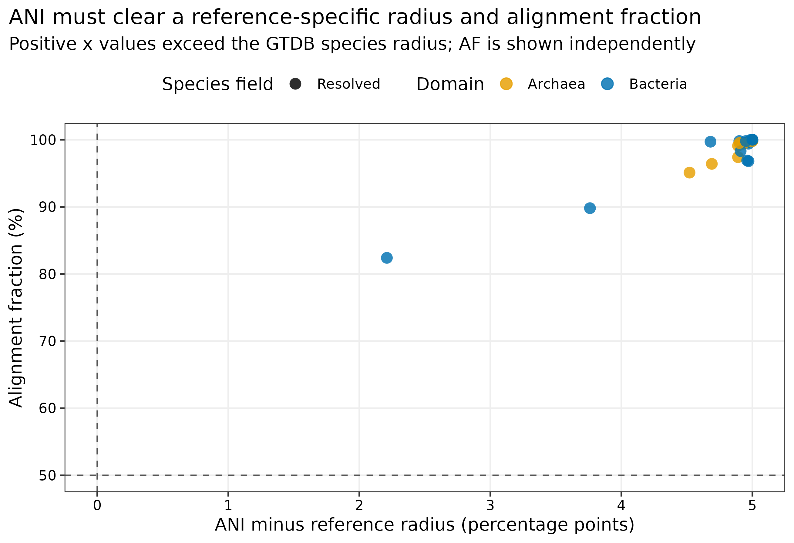
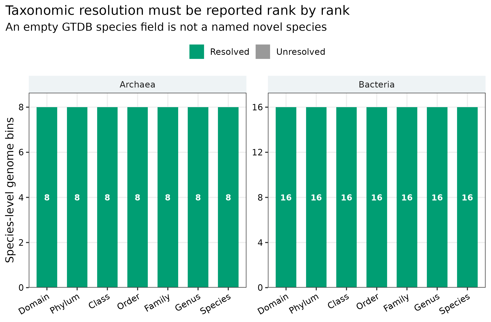
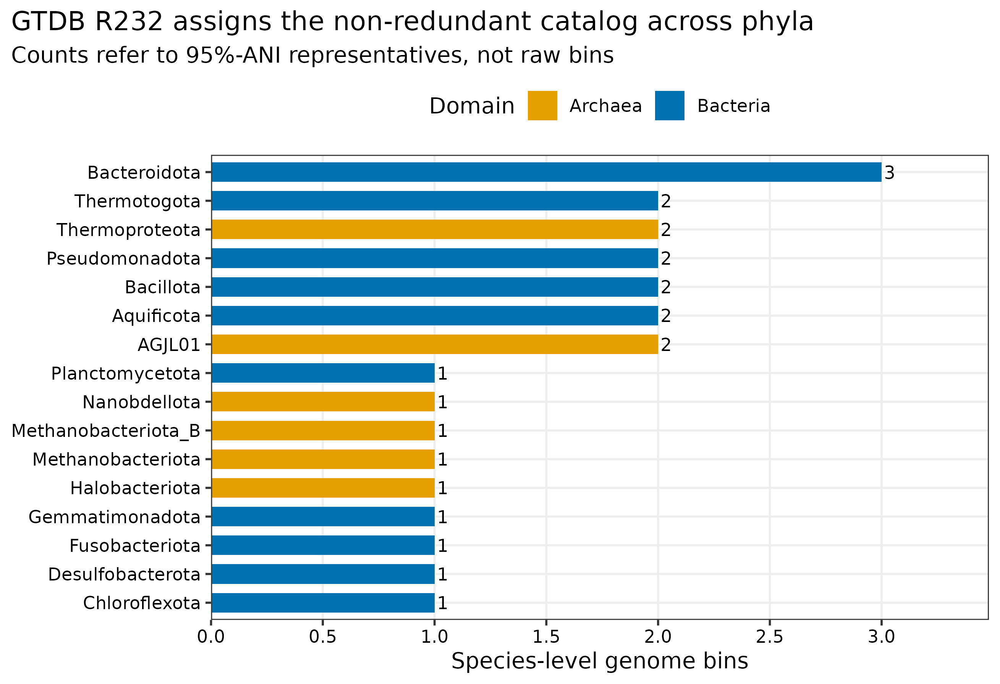
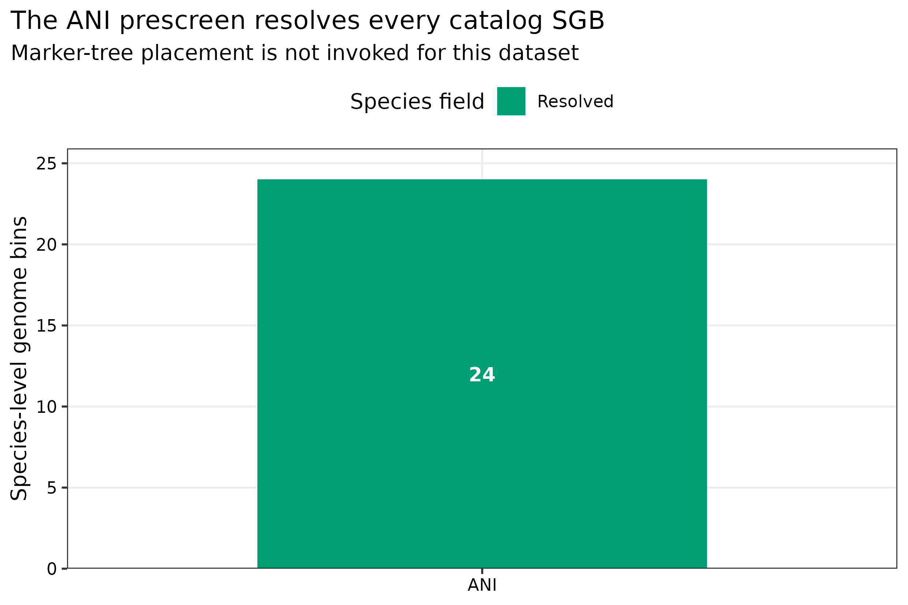

> **先给结论：**24 个 95% ANI species-level genome bins（SGBs）用 GTDB-Tk 2.7.2 和 GTDB R232 重新分类后，得到 **16 个 Bacteria、8 个 Archaea，24/24 均解析到 species**。这 24 个 SGB 全部在 `ani_screen` 阶段命中版本化 GTDB reference，ANI 为 97.21%--100.00%，alignment fraction（AF）为 82.4%--100.0%，且均超过各自 reference-specific species radius；因此本数据没有触发 marker-tree placement。这个结果说明“当前 catalog 与 R232 中已命名物种一致”，并不说明 GTDB-Tk 永远只做 ANI，也不允许把数据库中空的 species 字段直接改写成“新物种”。

::: {.callout-important title="算力与数据库边界"}
本次使用 **24 CPU cores**。数据库 `check_install` 耗时 189.14 秒；24 个 SGB 的 `classify_wf` 耗时 62.45 秒、峰值 RAM 14.611 GiB。R232 官方压缩包为 **60,806,405,195 bytes**，解压后 263 个文件共 **100,482,230,310 bytes**；同时保留压缩包与工作区时建议准备 **220 GB 可用磁盘、24 cores、64 GB RAM，预计 5--30 分钟**。本数据在 ANI prescreen 结束，不能用 14.6 GiB 外推陌生 MAG 的 pplacer 内存；大量未命中 reference 的细菌 MAG 应在大内存 HPC/云节点运行。没有服务器时，可读取 `data/small/46-gtdbtk-taxonomy-frozen/` 中的 native summary、ANI table、数据库审计、命令、版本和资源日志。
:::

::: {.callout-tip title="先确定这一点"}

分类结果依赖参考树与 release；未能细分的结果应保留不确定性，不用已知标签替代独立分类。

:::

## MAG 的分类名称，为什么必须带数据库版本？ {#sec-target}

锚定的是 genome-resolved 论文中常见的 **MAG phylogenomic annotation strip / taxonomic composition panel**：每个非冗余 SGB 有一条完整 GTDB lineage，图中按 domain、phylum 或 genus 汇总，补充表同时给 species assignment、closest reference、ANI、AF、分类路径与数据库 release。GTDB 用统一的 genome phylogeny 和 rank normalization 维护细菌、古菌分类 [@parks2022gtdb]；GTDB-Tk 将 reference ANI screening 与 marker-tree placement 组织成可审计工作流 [@chaumeil2020gtdbtk; @chaumeil2022gtdbtkv2]。

{#fig-46-ani-af}

横轴不是“ANI 减固定 95%”，而是 `observed ANI - closest reference radius`。例如 SGB_023 的 reference radius 为 95.31%，其判定不能被简化成所有物种都共享 95.00%。

## 下载本例数据与分析代码 {#sec-reader-inputs}

[数据与代码清单](https://github.com/petemeng/metagenomics-best-practices/blob/e219a2cd01609cc208a89e291cbd363ed7f2fbd8/examples/46/files.tsv)列出了本例的输入表、分析脚本和环境文件（约 0.2 MiB）。本清单不含原始 FASTQ 或大型数据库；是否需要它们取决于下文的分析起点。清单中的已计算结果仅供核对；读取结果表不等于重新运行统计模型或上游工具。

在新建文件夹中运行下面的 R 代码，下载完成后即可按正文中的相对路径读取文件。需要核验文件版本时，可使用[带完整性检查的下载脚本](https://raw.githubusercontent.com/petemeng/metagenomics-best-practices/54d211859b240c610f61d1a2ae72e605ea96f7f3/examples/46/download.R)。

```{r}
#| label: reader-input-download-46
#| eval: false
options(timeout = 600)
base_url <- "https://raw.githubusercontent.com/petemeng/metagenomics-best-practices/e219a2cd01609cc208a89e291cbd363ed7f2fbd8/"
files <- read.delim(paste0(base_url, "examples/46/files.tsv"))
for (i in seq_len(nrow(files))) {
  path <- files$path[i]
  dir.create(dirname(path), recursive = TRUE, showWarnings = FALSE)
  if (!file.exists(path)) {
    download.file(paste0(base_url, files$source[i]), path, mode = "wb")
  }
}
```

## 先锁定输入、版本和算力边界 {#sec-setup}

### 输入与 lineage

| 输入 | 固定对象 | 审计作用 |
|---|---|---|
| SGB catalog | PRJEB52977 两份真实 mock reads 经组装、分箱、质控、dRep 后的 24 个 95% ANI representatives | 避免 raw bins 重复计数 |
| genome identity | Article 45 representative FASTA 的 SHA-256 | 防止 SGB ID 与序列错位 |
| taxonomy database | GTDB R232 full package | 固定 taxonomy/reference/radius 坐标 |
| database integrity | MD5 `25a59e0352b1fd150c589f56559767d4`、精确字节数、`gtdbtk check_install` | 防止不完整解压或 release 混装 |
| truth boundary | mock reference identities | 只用于另存的 benchmark，不参与分类、参考基因组选择或物种判定 |

R232 archive 与解压数据库不进入 Git；`data/small/46-gtdbtk-database-manifest.tsv` 保存官方 URL、release date、MD5、压缩/安装字节数和验证状态。24 个 FASTA 则从 checksum-covered Article 45 frozen bundle 解压到工作区。

<details class="wechat-omit">
<summary>环境配置与完整运行说明</summary>

```bash
mamba create -n metagenome-gtdbtk-2026.07 --file env/gtdbtk-linux-64.lock
conda run -n metagenome-gtdbtk-2026.07 gtdbtk --version
```

```bash
export DB_MANIFEST=data/small/46-gtdbtk-database-manifest.tsv
export DB_ROOT=/data/databases/gtdbtk-r232
bash db/download_db.sh download gtdbtk-r232

mkdir -p "${DB_ROOT}/extracted"
tar --use-compress-program=pigz -xf \
  "${DB_ROOT}/archives/gtdbtk-r232/gtdbtk_r232_data.tar.gz" \
  -C "${DB_ROOT}/extracted"
export GTDBTK_DATA_PATH="${DB_ROOT}/extracted/release232"
gtdbtk check_install
```

```{r}
install.packages(c("ggplot2", "dplyr", "readr", "tidyr", "forcats", "scales"))
library(ggplot2); library(dplyr); library(readr); library(tidyr); library(forcats)
set.seed(20260746)

pal_pub <- c("Bacteria" = "#0072B2", "Archaea" = "#E69F00",
             "Resolved" = "#009E73", "Unresolved" = "#999999")
scale_color_pub <- function(...) scale_color_manual(values = pal_pub, ...)
scale_fill_pub  <- function(...) scale_fill_manual(values = pal_pub, ...)
theme_pub <- function(base_size = 12) {
  theme_bw(base_size = base_size) + theme(
    panel.grid.minor = element_blank(),
    panel.grid.major = element_line(color = "#EEEEEE"),
    axis.text = element_text(color = "black"),
    legend.key = element_blank(),
    strip.background = element_rect(fill = "#EEF3F5", color = NA),
    plot.title.position = "plot"
  )
}
save_pub <- function(plot, file_base, width = 190, height = 125, dpi = 350) {
  ggsave(paste0(file_base, ".pdf"), plot, width = width, height = height,
         units = "mm", device = cairo_pdf)
  ggsave(paste0(file_base, ".png"), plot, width = width, height = height,
         units = "mm", dpi = dpi, bg = "white")
  ggsave(paste0(file_base, ".tiff"), plot, width = width, height = height,
         units = "mm", dpi = dpi, compression = "lzw", bg = "white")
}
```

</details>

## 生成稳定 SGB 输入并验证数据库 {#sec-code}

### 先固定非冗余 genome coordinate，再谈分类 {#sec-theory}

同一物种可能在多个样本、多个 binning branch 中重复出现。若直接给全部 raw bins 分类，phylum 数量和 species 数量都会被重复重建次数放大。本次输入是第 45 篇确定的 24 个 95% ANI representatives，并按 dRep cluster 的数值顺序赋予稳定 ID `SGB_001`--`SGB_024`。GTDB taxonomy 是这个固定 coordinate 的 annotation，不反过来决定哪个 genome 当 representative。

```bash
python3 scripts/prepare_article46_gtdbtk.py \
  --project-root . \
  --work-dir results/46-gtdbtk-taxonomy \
  --database-dir /data/databases/gtdbtk-r232/extracted/release232 \
  --archive /data/databases/gtdbtk-r232/archives/gtdbtk-r232/gtdbtk_r232_data.tar.gz
```

准备脚本先校验 Article 45 frozen manifest，再逐条解压 representative FASTA，并确认解压后 SHA-256 与 cluster ledger 一致。数据库侧必须同时满足：263 个文件、100,482,230,310 installed bytes、archive MD5/bytes sentinel 与 `VERIFIED_LOCAL_CHECK_INSTALL_PASS`。

## 运行 GTDB-Tk

### release 是结果的一部分

GTDB taxonomy、reference genomes、species radii 和树都会随 release 更新。同一条 MAG 在不同 release 中可能发生 genus 名称变化、reference 替换或 species assignment 改变。因此 Methods 不能只写“用 GTDB-Tk 分类”，至少要同时记录：

- GTDB-Tk version；
- GTDB release；
- 数据库 archive checksum 与安装审计；
- `classify_wf` 的关键阈值；
- 每条 SGB 的原始 summary 行。

```bash
export GTDBTK_DATA_PATH=/data/databases/gtdbtk-r232/extracted/release232
export TMPDIR="$PWD/results/46-gtdbtk-taxonomy/tmp"

conda run -n metagenome-gtdbtk-2026.07 \
  gtdbtk classify_wf \
  --genome_dir results/46-gtdbtk-taxonomy/inputs/genomes \
  --out_dir results/46-gtdbtk-taxonomy/gtdbtk \
  --extension fna \
  --prefix article46 \
  --cpus 24 \
  --pplacer_cpus 1 \
  --min_perc_aa 10 \
  --min_af 0.5 \
  --write_single_copy_genes \
  --keep_intermediates \
  --tmpdir "$TMPDIR"
```

`--pplacer_cpus 1` 是显式的内存控制选择；增加 pplacer threads 可能提高峰值 RAM。`--write_single_copy_genes` 只会在 marker branch 实际运行时产生对应文件。本次 24 个 SGB 均由 ANI prescreen 解决，因此没有伪造空 marker 产物来填补目录。

### 当前标准升级 1：把 release drift 变成可量化对象

升级数据库时，不要覆盖旧 summary 后只看最终名称。应以 `SGB + RepresentativeSHA256` 为 join key，对比两个 release 的 domain-to-species lineage、reference accession、ANI、AF、radius 和 classification method。名称变化不等于序列变化；reference 替换也不等于生物学变化。

::: {.callout-caution title="坑 1：只写 GTDB-Tk version，不写 GTDB release"}
软件版本与数据库 release 是两个坐标。GTDB-Tk 2.7.2 可以读取 R232，但换成另一个 release 后 taxonomy、reference 和 radius 都可能改变；Methods 与补充表必须同时保存二者。
:::

::: {.callout-caution title="坑 2：把 AF 当作百分比直接读"}
R232 native `closest_genome_af` 是 0--1 fraction。本次汇总明确乘以 100 后命名 `FastANIAFPct`。若把 0.824 画在 0--100 轴上，会错误地落到阈值下方。
:::

::: {.callout-caution title="坑 5：增加 pplacer CPUs 后只记录总核数"}
pplacer 并行会改变内存需求。应单独报告 `--cpus`、`--pplacer_cpus`、是否 split-tree/full-tree，以及实测峰值 RAM；不要用 ANI-only 小数据的资源占用承诺陌生 catalog 的上限。
:::

## 汇总 native summary，不从 taxonomy 字符串猜路径

### `ani_screen` 与 marker-tree placement 是两条证据路径

GTDB-Tk 先用本次环境中的 skani 0.3.2 对 genome 做 reference ANI screening。若有 reference 同时满足 reference-specific radius 和 AF 要求，可直接在 `ani_screen` 路径完成 species assignment。未解决的 genome 才进入 marker identification、alignment、pplacer placement 和后续 ANI reconciliation。R232 本次 24 个 SGB 全部在第一条路径完成，因此 `msa_percent`、`pplacer_taxonomy` 和 single-copy marker 输出为空是**符合分支逻辑的结果**，不是漏跑。

### ANI 与 AF 必须成对报告

ANI 只描述可比对片段的平均一致性；很短的 conserved region 也可能给出很高 ANI。AF 描述 query/reference 有多少 genome fraction 参与比较。本次命令固定 `--min_af 0.5`，也就是 AF 至少 50%；实际最低 AF 为 82.4%。图中把 ANI margin 和 AF 分开画，避免把二者压成一个不可解释的“相似度”。

### species field 为空只是候选入口

空 species field 可能来自 reference sampling 不足、MAG 不完整、污染、marker recovery 低或真正的 taxonomic novelty。可靠的新物种论证还要结合 genome quality、ANI/AF、domain-specific phylogeny、reference sampling 和命名规范；第 47 篇会把这些证据放进同一棵树。GTDB 临时 species label 也不能自动转成正式 `Candidatus` 名称。

```bash
python3 scripts/summarize_article46_gtdbtk.py \
  --project-root . \
  --work-dir results/46-gtdbtk-taxonomy
```

R232 native output 使用这些关键字段：

| native field | 规范化列 | 含义 |
|---|---|---|
| `classification` | `GTDBTaxonomy` | 七级 GTDB lineage |
| `closest_genome_reference` | `FastANIReference` | ANI prescreen 命中的版本化 reference |
| `closest_genome_reference_radius` | `FastANIReferenceRadiusPct` | reference-specific species radius |
| `closest_genome_ani` | `FastANIANI` | query/reference ANI |
| `closest_genome_af` | `FastANIAFPct` | native fraction 转为百分比 |
| `classification_method` | `ClassificationMethod` | `ani_screen` 或 marker/tree 相关路径 |

```{r}
frozen <- "../data/small/46-gtdbtk-taxonomy-frozen"
taxonomy <- read_tsv(file.path(frozen, "taxonomy-summary.tsv"), show_col_types = FALSE)
taxonomy |>
  select(SGB, Domain, Phylum, Genus, Species, ClassificationMethod,
         FastANIReference, FastANIANI, FastANIAFPct) |>
  print(n = 8)
```

本次结果坐标如下：

| 审计项 | 结果 |
|---|---:|
| input / classified SGBs | 24 / 24 |
| Bacteria / Archaea | 16 / 8 |
| species field resolved | 24 / 24 |
| `ani_screen` | 24 / 24 |
| marker-tree placement | 0 / 24 |
| warning rows | 0 |
| ANI range | 97.21%--100.00% |
| AF range | 82.4%--100.0% |
| minimum ANI margin above reference radius | 2.21 percentage points |

### 忠实复现：保留 native classification，不用 mock answer key 改名 {#sec-audit}

PRJEB52977 是已知组成的 mock study，但 known organism identity 不进入 GTDB-Tk reference selection，也不用于把结果“纠正”成预期名称。每条 taxonomy 都来自 R232 native summary；truth 只能在独立 benchmark table 中评估，不得污染分类本身。

### 当前标准升级 2：区分“工作流可做 marker placement”与“本数据做了 marker placement”

GTDB-Tk 的完整工作流包含 marker tree，但本数据 24/24 在 `ani_screen` 结束。Methods 应写实际执行分支，不能因为命令叫 `classify_wf` 就宣称每条 MAG 都经过 pplacer。反过来，若陌生环境 MAG 未命中 reference，则要报告 marker recovery、MSA percentage、placement lineage、RED 和 warning。

### 当前标准升级 3：species assignment 不是新物种审稿终点

本次最接近边界的是 SGB_006：ANI 97.21%、reference radius 95.00%、AF 82.4%，仍明确越过 R232 species gate。第 47 篇仍会把全部 SGB 与版本化 closest references 放入 domain-specific genome trees，用来审计 tree context；但不会把“分支较长”单独当作 novel species 证据。

::: {.callout-caution title="坑 3：看到 species 名称就忽略 genome quality"}
低完整度或嵌合 MAG 也可能命中 reference。taxonomy annotation 不能替代 CheckM2、GUNC、MIMAG、coverage/GC 与 assembly-graph 审计；这些质量字段要沿 SGB ledger 一起进入补充表。
:::

::: {.callout-caution title="坑 4：把空 species 写成 novel species"}
空字段只触发候选审计。至少还要证明 quality 合格、没有满足 radius+AF 的近邻、domain tree 中位置稳定、reference sampling 足够，并完成命名与数据库提交前核查。
:::

## 保存可复核证据

```bash
python3 scripts/freeze_article46_gtdbtk.py \
  --project-root . \
  --work-dir results/46-gtdbtk-taxonomy \
  --output-dir data/small/46-gtdbtk-taxonomy-frozen
```

冻结包保留两个 native domain summary、两个 `ani_summary.tsv`、GTDB-Tk log/JSON、规范化 taxonomy/ANI tables、数据库审计、命令、工具版本、GNU time 资源记录和源码；60.8 GB archive、100.5 GB database 与临时索引不复制进仓库。

## 记录 GTDB release 与分类支持 {#sec-methods}

**Methods template（可直接按本次分析使用）：**

> Species-level genome bin representatives were classified with GTDB-Tk 2.7.2 against GTDB release R232. The R232 full package (MD5: 25a59e0352b1fd150c589f56559767d4) was verified by archive byte count and `gtdbtk check_install`. We ran `classify_wf` with 24 CPUs, one pplacer CPU, `--min_perc_aa 10`, `--min_af 0.5`, `--write_single_copy_genes`, and retained intermediate files. Genome identifiers were assigned from the checksum-verified 95%-ANI representative catalog. Known mock-community identities were not used for reference selection or taxonomic assignment. GTDB lineage, classification route, closest reference, reference-specific species radius, ANI, alignment fraction, and warnings were retained from the native domain summary tables.

**Results template（本次实跑结果）：**

> GTDB-Tk classified all 24 SGB representatives, including 16 bacterial and eight archaeal genomes. All SGBs were resolved to a GTDB species through the ANI-screening route; no marker-tree placement was invoked. Closest-reference ANI ranged from 97.21% to 100.00%, alignment fraction ranged from 82.4% to 100.0%, and every genome exceeded its reference-specific species radius. No GTDB-Tk warnings were reported. The classification run completed in 62.45 s with a peak resident memory of 14.611 GiB; database installation verification required 189.14 s.

## 换到自己的研究中，先检查哪些条件？ {#sec-own-data}

1. 先确定分类对象：使用固定的 non-redundant representative catalog，而不是把所有 sample bins 混在一起计数。
2. 为每个 genome 建立稳定 ID、FASTA SHA-256、completeness、contamination、GUNC、MIMAG、coverage 和 graph audit ledger。
3. 锁定 GTDB-Tk version 与兼容的 GTDB release；下载后验证 checksum、精确体积和 `check_install`。
4. 根据服务器内存选择 split-tree/default 工作流；记录 `--pplacer_cpus`，不要盲目增加。
5. 原样保留 `bac120.summary.tsv`、`ar53.summary.tsv`、ANI summary、warning 与 log；规范化表必须能回链到 native row。
6. 对每个 rank 分别统计 resolved/unresolved；对 species assignment 同时报 closest reference、radius、ANI、AF 和 method。
7. 对 unresolved genome 先审计质量与 marker recovery，再扩充近邻 references 做 domain-specific phylogenomics；不要直接命名。
8. 升级 release 时用 `RepresentativeSHA256` 对齐旧新结果，单独报告 taxonomy drift。

最少需要四类输入：MAG FASTA、稳定 genome ledger、完整质量表、可用磁盘/内存预算。若数据涉及正式 genome 提交，还要额外准备 source metadata、BioProject/BioSample 和人工 curation 记录。

## 图中应该保留哪些信息？ {#sec-figure}

### rank resolution：不能只报 species 数

{#fig-46-ranks}

### phylum composition：计数对象必须写清是 SGB

{#fig-46-phyla}

### classification route：只有真实执行过的路径才进入图

{#fig-46-route}

图内 domain、rank、axis、legend 和 annotation 全部使用英文；Bacteria/Archaea 使用 Okabe--Ito 蓝/橙，resolved 使用色盲友好的绿色。矢量 PDF 用于排版，350 dpi PNG/TIFF 用于网页与期刊上传：

```{r}
save_pub(p_ani, "figures/46-ani-af-audit", width = 190, height = 130)
# writes .pdf, .png and .tiff; TIFF uses compression = "lzw"
```

## 回到最初的问题

GTDB-Tk 分类必须同时锁定 release、ANI、reference-specific species radius 与 alignment fraction，不能把空 species 字段直接叫新物种。

## 参考文献 {#sec-references}

- GTDB-Tk 原始工作流与分类框架 [@chaumeil2020gtdbtk]。
- GTDB-Tk v2 的 memory-friendly classification [@chaumeil2022gtdbtkv2]。
- GTDB taxonomy、rank normalization 与持续更新原则 [@parks2022gtdb]。
- 本次可复核数据：`data/small/46-gtdbtk-taxonomy-frozen/`；数据库 manifest：`data/small/46-gtdbtk-database-manifest.tsv`。
