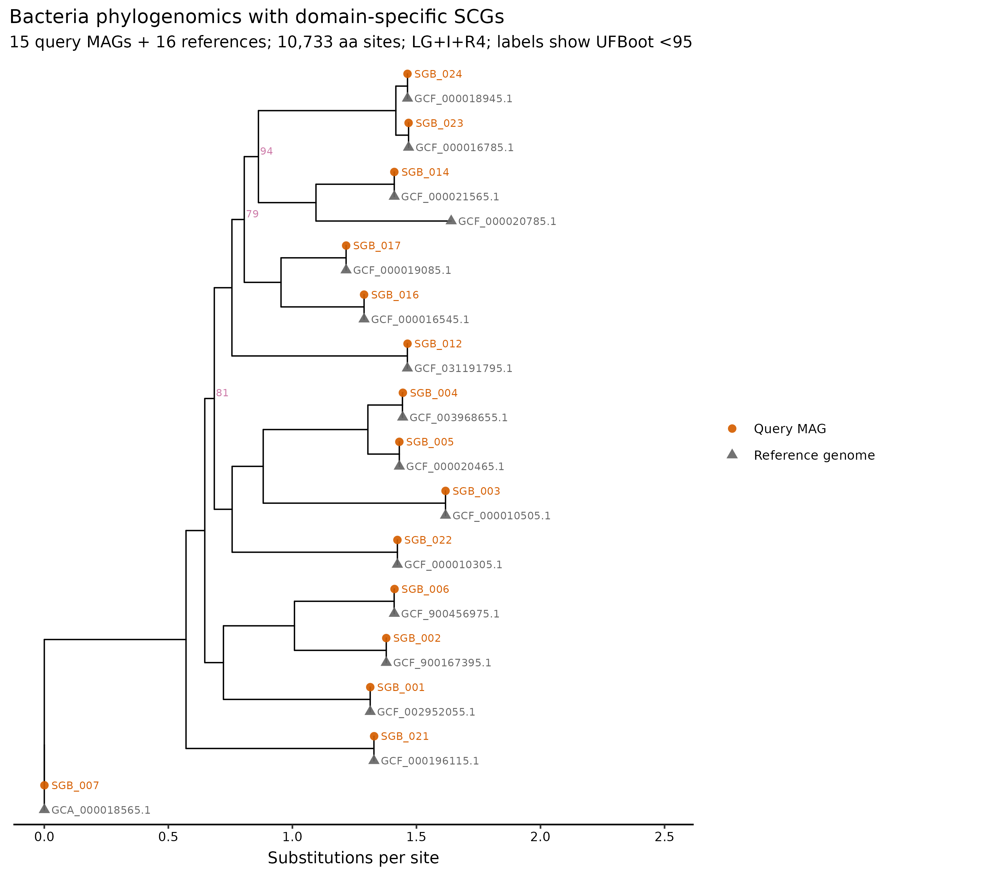
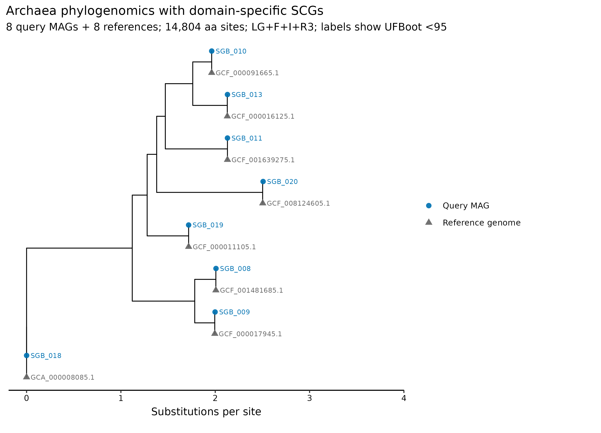

> **先给结论：**系统基因组树能回答 MAG 与参考基因组的进化位置，却不能单独宣布新物种。对 PRJEB52977 真实 mock metagenomes 得到的 **24 SGBs** 逐一审计后，24/24 都有 GTDB species assignment，FastANI 均越过各自 reference-specific species radius，alignment fraction 均超过 82.4%，因此本数据支持 **0 novel species**。GToTree 最终让 **23/24** MAGs 入树；`SGB_015` 因 single-copy gene recovery 不足被排除，但其 ANI/AF 仍支持已有物种归属。

::: {.callout-important title="算力与数据门槛"}
本次实跑使用 **24 CPU cores**。Bacteria 的 GToTree 与 IQ-TREE 分别耗时 **190.03 秒**和 **2,382.92 秒**，Archaea 分别为 **112.99 秒**和 **747.71 秒**；四步顺序运行约 **57 分钟**。峰值 RAM 仅 **0.313 GiB**，完整工作目录约 **94 MB**。考虑并行峰值、参考基因组下载与临时文件，建议为这个 24-MAG 示例准备 **8 GB RAM、24 cores、5 GB 磁盘、1--2 小时**。数百至数千 MAG 的 ModelFinder 和 bootstrap 会显著增时；没有服务器时，可读取 `data/small/47-novel-mag-phylogenomics-frozen/` 中的 alignment、tree 和审计表重画图。
:::

## 这一步对应论文里的哪张图 {#sec-target}

系统基因组研究常以“query genomes + type/reference genomes”的 marker-gene tree 展示候选谱系，再用 ANI、参考覆盖、基因组质量和命名学证据完成物种界定。这里复现这种证据布局：先用 GTDB release R232 给出的 closest FastANI references 建立保守候选集，再用 GToTree 的 domain-specific single-copy genes 生成 protein alignment [@lee2019gtotree]，最后以 IQ-TREE 做模型选择、最大似然建树与双重 branch support [@minh2020iqtree2; @hoang2018ufboot2]。

{#fig-47-bacteria}

{#fig-47-archaea}

## 理论：新物种判定是多道门，不是一棵树 {#sec-theory}

### 1. 先问“是否已有 species assignment”

GTDB 用规范化分类框架和 reference-specific ANI radii 界定 species clusters [@parks2022gtdb]。若 query 已在足够 alignment fraction 下超过相应 reference radius，最保守解释是“属于已有 species cluster”；不能因为它来自 metagenome、没有培养，或树枝看起来较长，就改称 novel species。

### 2. ANI 必须和 alignment fraction 同时出现

令 query 与 reference 的 ANI 为 $A$，该 reference 的 GTDB species radius 为 $R$，则本篇画出的 margin 是

\[
\Delta_{ANI}=A-R.
\]

$\Delta_{ANI}>0$ 只有在足够大的 alignment fraction（AF）下才有意义。局部保守区的高 ANI 不能代表整套基因组；反过来，低质量 MAG 的低 ANI 也可能由缺失、污染或错分箱造成。

### 3. MAG 质量决定“能否提出候选”，不是物种身份

这里把 completeness >=90% 且 contamination <5% 作为进入高质量 novelty review 的最低 gate；17/24 MAGs 满足，7/24 不满足。低于质量 gate 不等于新物种，只表示证据不足以承担正式的 novel-taxon claim。MIMAG 质量、GUNC chimerism、rRNA/tRNA、assembly graph 和人工校正仍需独立报告 [@bowers2017mimag]。

### 4. Tree placement 需要正确 marker universe 与参考采样

Bacteria 与 Archaea 使用不同的 conserved single-copy gene HMM sets，不能塞进一套 alignment。每个 query 至少加入 closest GTDB reference；真正的 novelty review 还要扩充同 genus/nearby clade 的 type material、近邻 MAGs 和不同数据库代表，检查候选位置是否随 reference sampling 改变。

<details>
<summary><strong>高 bootstrap 为什么仍不能证明新物种？</strong></summary>

Bootstrap 衡量的是给定 alignment、模型和 taxon sampling 下某个 split 的稳定性，不检验命名学边界。一个 query 与 reference 形成 100% support 的 sister pair，既可能属于同一 species，也可能跨 species；需要 ANI/AF、物种半径、基因组质量、参考覆盖与系统分类共同解释。遗漏真正最近的 reference 时，错误位置同样可能得到很高支持。

</details>

## 准备工作 {#sec-preparation}

### 数据从哪里来

| 输入 | 本次固定对象 | 来源与审计方式 |
|---|---|---|
| Query MAGs | PRJEB52977 两个公开 uneven mock metagenomes；dRep 95% ANI 后的 24 个 SGB representatives | Article 45 冻结 representatives；解压后 sequence SHA-256 必须与 cluster ledger 一致 [@olm2017drep] |
| Quality | CheckM2 completeness/contamination 与 Article 44/45 质控记录 | 只用于 novelty eligibility 和图表，不修改 GTDB species assignment |
| Taxonomy/ANI | GTDB-Tk 2.7.2，GTDB release R232；24 个 species assignments、FastANI reference/radius/AF | Article 46 冻结包先通过全目录 SHA-256，再读取表格 [@chaumeil2022gtdbtkv2] |
| References | 每个 SGB 的 GTDB FastANI reference；无 FastANI hit 时才回退到 placement reference | 24 个唯一、带 accession version 的 NCBI accessions |
| Phylogeny | Bacteria 16 MAGs、Archaea 8 MAGs 分域输入 | known mock identity 不参与 novelty 判定或参考基因组选择 |

准备脚本会先验证 Article 45/46 冻结包的全部 SHA-256，再解压 representatives，并把 `RS_`/`GB_` 前缀转换成 NCBI accession，同时拒绝没有 `.version` 的可变 accession。GToTree 才按 accession 从 NCBI 获取 reference genomes；下载日志和 accession ledger 都保留。

<details>
<summary><strong>安装环境与内联作图函数</strong></summary>

```bash
conda env create -f env/phylogeny.yml
conda list -n metagenome-phylogeny-2026.07 --explicit \
  > env/phylogeny-linux-64.lock

conda run -n metagenome-phylogeny-2026.07 GToTree -v
conda run -n metagenome-phylogeny-2026.07 iqtree3 --version
conda run -n metagenome-phylogeny-2026.07 hmmsearch -h | head
```

实跑环境锁定 GToTree 1.8.17、IQ-TREE 3.1.3、HMMER 3.4、MUSCLE 5.1、trimAl 1.5.rev1 与 Prodigal 2.6.3。

```r
install.packages(c("ape", "ggplot2", "dplyr", "readr", "ggrepel", "scales"))
if (!requireNamespace("BiocManager", quietly = TRUE)) install.packages("BiocManager")
BiocManager::install("ggtree", ask = FALSE, update = FALSE)

library(ape)
library(ggtree)
library(ggplot2)
library(dplyr)
library(readr)
library(ggrepel)
library(scales)
set.seed(20260747)

pal_pub <- c(
  "Bacteria" = "#D55E00", "Archaea" = "#0072B2",
  "Query MAG" = "#D55E00", "Reference genome" = "#666666",
  "Quality eligible" = "#009E73", "Below quality gate" = "#E69F00"
)
scale_color_pub <- function(...) scale_color_manual(values = pal_pub, ...)
scale_fill_pub  <- function(...) scale_fill_manual(values = pal_pub, ...)
theme_pub <- function(base_size = 12) {
  theme_bw(base_size = base_size) + theme(
    panel.grid.minor = element_blank(),
    panel.grid.major = element_line(color = "#EEEEEE"),
    axis.text = element_text(color = "black"),
    legend.key = element_blank(),
    strip.background = element_rect(fill = "#EEF3F5", color = NA),
    plot.title.position = "plot"
  )
}
save_pub <- function(plot, file_base, width = 195, height = 145,
                     units = "mm", dpi = 350) {
  dir.create(dirname(file_base), recursive = TRUE, showWarnings = FALSE)
  ggsave(paste0(file_base, ".pdf"), plot, width = width, height = height,
         units = units, device = cairo_pdf)
  ggsave(paste0(file_base, ".png"), plot, width = width, height = height,
         units = units, dpi = dpi, bg = "white")
  ggsave(paste0(file_base, ".tiff"), plot, width = width, height = height,
         units = units, dpi = dpi, compression = "lzw", bg = "white")
  invisible(plot)
}
```

</details>

## 可复制代码：从 24 个 SGB representatives 到两棵 domain tree {#sec-code}

### 第 1 步：重建输入与 novelty pre-tree audit

```bash
ROOT="$PWD"
WORK="results/47-phylogenomics"

python3 scripts/prepare_article47_phylogenomics.py \
  --project-root "${ROOT}" --work-dir "${WORK}"

head "${WORK}/genome-ledger.tsv"
head "${WORK}/reference-request-ledger.tsv"
head "${WORK}/novelty-pretree-audit.tsv"
```

`novelty-pretree-audit.tsv` 为每个 SGB 并列记录 GTDB taxonomy、closest reference、FastANI、species radius、AF、completeness、contamination 与 candidate decision。24 个 SGB 的 ANI margin 最低仍为 2.21 percentage points，AF 最低为 82.4%；全部已有 species assignment，所以 pre-tree candidates 为 0。

{#fig-47-gates}

### 第 2 步：Bacteria 和 Archaea 分开运行 GToTree

```bash
conda run -n metagenome-phylogeny-2026.07 \
  GToTree \
  -f "${WORK}/inputs/trees/bacteria-query-fastas.txt" \
  -a "${WORK}/inputs/trees/bacteria-reference-accessions.txt" \
  -H Bacteria \
  -m "${WORK}/inputs/trees/bacteria-labels.tsv" \
  -o "${WORK}/gtotree/bacteria" \
  -F -N -k -d -P -n 4 -M 4 -j 4

conda run -n metagenome-phylogeny-2026.07 \
  GToTree \
  -f "${WORK}/inputs/trees/archaea-query-fastas.txt" \
  -a "${WORK}/inputs/trees/archaea-reference-accessions.txt" \
  -H Archaea \
  -m "${WORK}/inputs/trees/archaea-labels.tsv" \
  -o "${WORK}/gtotree/archaea" \
  -F -N -k -d -P -n 4 -M 4 -j 4
```

GToTree 完成 reference retrieval、gene calling、HMMER SCG search、单 marker alignment、trimming 和 concatenation [@lee2019gtotree]。Bacteria 输入 16 个 MAGs，其中 `SGB_015` 仅找到 38 个 unique SCGs、长度过滤后 33 个，SCG completeness 为 51.35%，未进入 final alignment；其余 15 个 MAGs 与 16 个 references 形成 31-tip、10,733-aa alignment。8 个 archaeal MAGs 全部保留，与 8 个 references 形成 16-tip、14,804-aa alignment。

{#fig-47-recovery}

### 第 3 步：ModelFinder、maximum likelihood 与双重支持度

```bash
conda run -n metagenome-phylogeny-2026.07 \
  iqtree3 \
  -s "${WORK}/gtotree/bacteria/Aligned_SCGs_mod_names.faa" \
  -st AA -m MFP -B 1000 --alrt 1000 \
  -T AUTO --threads-max 24 \
  --seed 20260747 --safe \
  --prefix "${WORK}/iqtree/bacteria/article47-bacteria"

conda run -n metagenome-phylogeny-2026.07 \
  iqtree3 \
  -s "${WORK}/gtotree/archaea/Aligned_SCGs_mod_names.faa" \
  -st AA -m MFP -B 1000 --alrt 1000 \
  -T AUTO --threads-max 24 \
  --seed 20260748 --safe \
  --prefix "${WORK}/iqtree/archaea/article47-archaea"
```

ModelFinder 为 Bacteria 选择 `LG+I+R4`，为 Archaea 选择 `LG+F+I+R3`。Bacteria 的 28 个有双重标签的内部枝中，median UFBoot 为 100，89.3% 达到 UFBoot >=95；96.4% 达到 SH-aLRT >=80。Archaea 的 13 个内部枝 median UFBoot 为 100，UFBoot >=95 与 SH-aLRT >=80 的比例均为 100%。种子按 domain 分开固定，避免两个独立随机过程共用一个含糊记录。

### 第 4 步：汇总、作图、冻结与验收

```bash
python3 scripts/run_article47_phylogenomics.py \
  --project-root "${ROOT}" --work-dir "${WORK}" \
  --environment metagenome-phylogeny-2026.07 --threads 24

python3 scripts/summarize_article47_phylogenomics.py \
  --project-root "${ROOT}" --work-dir "${WORK}"

Rscript scripts/plot_article47_phylogenomics.R \
  --work-dir "${WORK}" --output-dir figures

python3 scripts/freeze_article47_phylogenomics.py \
  --project-root "${ROOT}" --work-dir "${WORK}" \
  --output-dir data/small/47-novel-mag-phylogenomics-frozen

python3 scripts/validate_article47_phylogenomics.py \
  --project-root "${ROOT}" \
  --frozen-dir data/small/47-novel-mag-phylogenomics-frozen \
  --output-dir results/47-phylogenomics-validation \
  --figure-dir figures \
  --chapter chapters/47-novel-mag-phylogenomics.qmd
```

冻结包保留两域的 concatenated protein alignments、IQ-TREE trees/reports/logs、GToTree genome/SCG summaries、versioned reference ledger、novelty decision table、commands、software versions、GNU-time 资源记录及全部 SHA-256；58 MB query FASTAs 和下载后的临时 reference files 留在计算目录。

## 审计与升级 {#sec-audit}

### 先忠实保留“没有新物种”的结果

24/24 SGBs 已有 GTDB species fields，且 ANI/AF 支持这些 assignments；因此最终 NovelSpeciesClaim 与 `CandidatusNameProposed` 全为 false。树中若出现较长 terminal branch，也不能覆盖 ANI/AF 证据。负结果能防止在 supplement 中把“新组装出来的 genome”误写成“新 species”。

### 从一个固定 95% ANI 升级为 reference-specific radius

GTDB species radii 并不都等于 95%。本次逐 SGB 使用 R232 表中的 reference-specific radius，再联合 AF；图上 y 轴画的是 ANI minus radius，而非只画一条通用 95% 横线。数据库 release 一旦变化，closest reference、radius 和 species assignment 都应重算。

### 从 MAG completeness 升级为 marker recovery audit

`SGB_015` 的 CheckM2 completeness 为 69.48%，GToTree SCG completeness 为 51.35%；它有稳定 species-level ANI（99.91%，AF 98.3%），却不足以进入当前 marker tree。系统发育缺席表示 tree evidence 不可用，不表示它是 novel，也不能在图上把它偷偷删掉而不解释。

### 从“高支持树”升级为 sampling sensitivity

两棵树的多数分支支持度很高，但每个 SGB 只加入一个 closest reference，适合验证局部配对，不足以完成正式新物种描述。若真的出现 unassigned high-quality candidate，应扩充同 genus/type strain/reference MAG sampling，测试 marker occupancy、trim settings、模型、recombination 与 alternative rooting；只有结论对这些选择稳健，树才承担 taxonomic evidence。

## 出版级美化 {#sec-publication}

1. Bacteria 与 Archaea 分图，避免把不同 HMM marker universes 伪装成同一可比坐标。
2. Query MAG 用彩色圆点，versioned references 用灰色三角；reference accession 的 `.version` 保留在图中。
3. 只标 UFBoot <95 的内部枝，减少满树“100/100”的视觉噪声；完整 SH-aLRT/UFBoot 仍保留在 native tree。
4. novelty plot 同时放 ANI margin、AF、MAG quality 与 tree inclusion，避免用单一阈值宣布新物种。
5. 图内全部为英文；PDF 保留矢量分支和文字，PNG/TIFF 以 350 dpi 输出，TIFF 使用 LZW `compression = "lzw"`。

## 常见坑 {#sec-pitfalls}

::: {.callout-caution title="1. 把新 MAG 写成新 species"}
“首次从自己的样本组装出来”只描述数据集，不是 taxonomy。先查 GTDB species assignment、reference radius、AF 和更广泛参考库。
:::

::: {.callout-caution title="2. 只报 ANI，不报 AF 和 reference accession version"}
局部匹配可制造高 ANI；无版本 accession 会随数据库更新漂移。ANI、AF、reference、radius、GTDB release 必须同行报告。
:::

::: {.callout-caution title="3. 把 Bacteria 与 Archaea 放进同一 marker alignment"}
两域的 conserved marker sets 和进化尺度不同。分域 search、alignment、model selection 和 tree inference，再在正文并列解释。
:::

::: {.callout-caution title="4. 忽略被 marker filter 排除的 MAG"}
只展示 final tree 会让读者误以为输入从来只有 23 个。应给 input-to-tree flow，列出 excluded ID、SCG hits、length-filtered hits 和质量指标。
:::

::: {.callout-caution title="5. 把 UFBoot=100 当成物种边界"}
Support 评价 split stability，不定义 species。缺 reference、错误 marker、污染或系统误差都可能得到很高 support。
:::

::: {.callout-caution title="6. 自动生成 Candidatus 名称"}
新名称涉及命名规范、现有名称查重、生态与表型描述、type material 或序列型材料要求，以及人工分类学审阅。流程只生成 candidate ledger，不自动命名或提交。
:::

## 这段 Methods 怎么写 {#sec-methods}

### Methods template

> Twenty-four species-level genome-bin representatives dereplicated at 95% ANI from public PRJEB52977 metagenomes were checksum-linked to their GTDB-Tk v2.7.2 classifications against GTDB release R232. The GTDB FastANI reference was selected for each SGB; the closest placement reference was used only when no FastANI reference was available. All 24 selected NCBI accessions were unique and versioned, and known mock composition was not used for novelty assessment or reference selection. Species novelty was screened using the GTDB species field, reference-specific ANI radius, FastANI alignment fraction, CheckM2 completeness and contamination, and phylogenomic placement; no name or novelty claim was generated automatically. Bacterial and archaeal genomes were analyzed separately with GToTree v1.8.17 using the Bacteria and Archaea single-copy-gene HMM sets, respectively, with HMMER v3.4, Prodigal v2.6.3, MUSCLE v5.1 and trimAl v1.5.rev1. Concatenated amino-acid alignments were analyzed with IQ-TREE v3.1.3 using ModelFinder (`-m MFP`), 1,000 ultrafast bootstrap replicates (`-B 1000`), 1,000 SH-aLRT replicates (`--alrt 1000`), automatic thread selection capped at 24 cores, and safe numerical mode. Random seeds were 20260747 for Bacteria and 20260748 for Archaea. Input/output checksums, accession versions, marker-recovery tables, commands, versions and GNU-time resource records were retained.

### Results template

> All 24 SGBs had species-level GTDB assignments and exceeded their reference-specific ANI radii with FastANI alignment fractions of 82.4%--100%; no pre-tree novel-species candidate or final novel-species claim was supported. Seventeen MAGs met the prespecified >=90% completeness and <5% contamination gate for potential novelty review. GToTree retained 15 of 16 bacterial MAGs and all eight archaeal MAGs. SGB_015 was excluded after recovering 38 unique SCGs and 33 length-filtered SCGs (51.35% SCG completeness), although its existing species assignment remained supported by 99.91% ANI and 98.3% alignment fraction. The bacterial alignment comprised 31 tips and 10,733 amino-acid sites; ModelFinder selected LG+I+R4, and 89.3% of supported internal branches had UFBoot >=95. The archaeal alignment comprised 16 tips and 14,804 sites; ModelFinder selected LG+F+I+R3, and all supported internal branches had UFBoot >=95. These trees were interpreted as placement evidence under the sampled references, not as stand-alone species delimitations.

## 换成你自己的数据怎么做 {#sec-own-data}

1. 从通过 CheckM2、GUNC、MIMAG 与人工 assembly-graph 审查的 nonredundant representatives 起步；保留每个 FASTA 的 SHA-256。
2. 用锁定 release 的 GTDB-Tk 导出 species assignment、closest reference、ANI radius、ANI 和 AF；不要只复制 taxonomy string。
3. 把 unassigned、未越过 radius/AF 且质量足够的 MAG 标为 candidate，不直接写 novel species。
4. 为每个 candidate 扩充同 genus、同 family、type/reference genomes 和近邻 MAGs；reference accessions 必须带版本。
5. Bacteria/Archaea 分域运行 SCG pipeline；保存每个 genome 的 hits、redundancy、length filtering 和 final-tree inclusion。
6. 对 alignment occupancy、composition bias、long branches、recombination、模型和 trimming 做审计；固定所有 seed。
7. 同时报 SH-aLRT 与 UFBoot/support，并做 reference-sampling 与 marker-threshold sensitivity；不要只截图一棵最“好看”的树。
8. 只有 ANI/AF、质量、系统发育、生态证据和命名学人工审阅共同支持时，才进入 `Candidatus`/novel species 描述与数据库提交。

## 参考 {#sec-references}

- GTDB 的 rank-normalized taxonomy 与 species clusters [@parks2022gtdb]
- GTDB-Tk v2 分类、placement 与 ANI screening [@chaumeil2022gtdbtkv2]
- GToTree domain-specific phylogenomics workflow [@lee2019gtotree]
- IQ-TREE model selection 与 maximum-likelihood inference [@minh2020iqtree2]
- UFBoot2 branch support [@hoang2018ufboot2]
- MIMAG genome-quality reporting standard [@bowers2017mimag]
