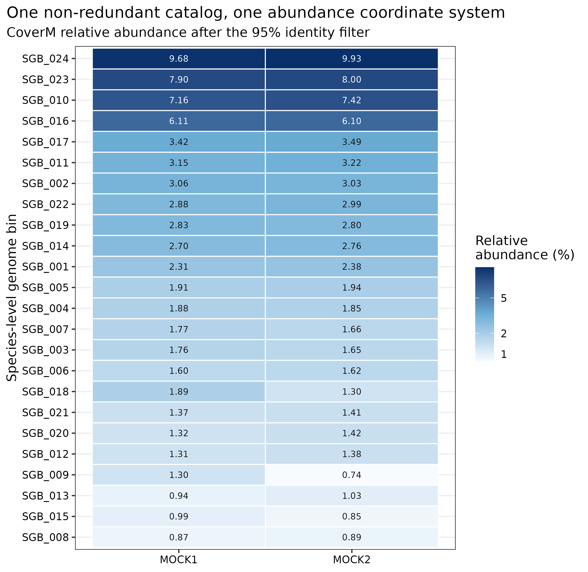
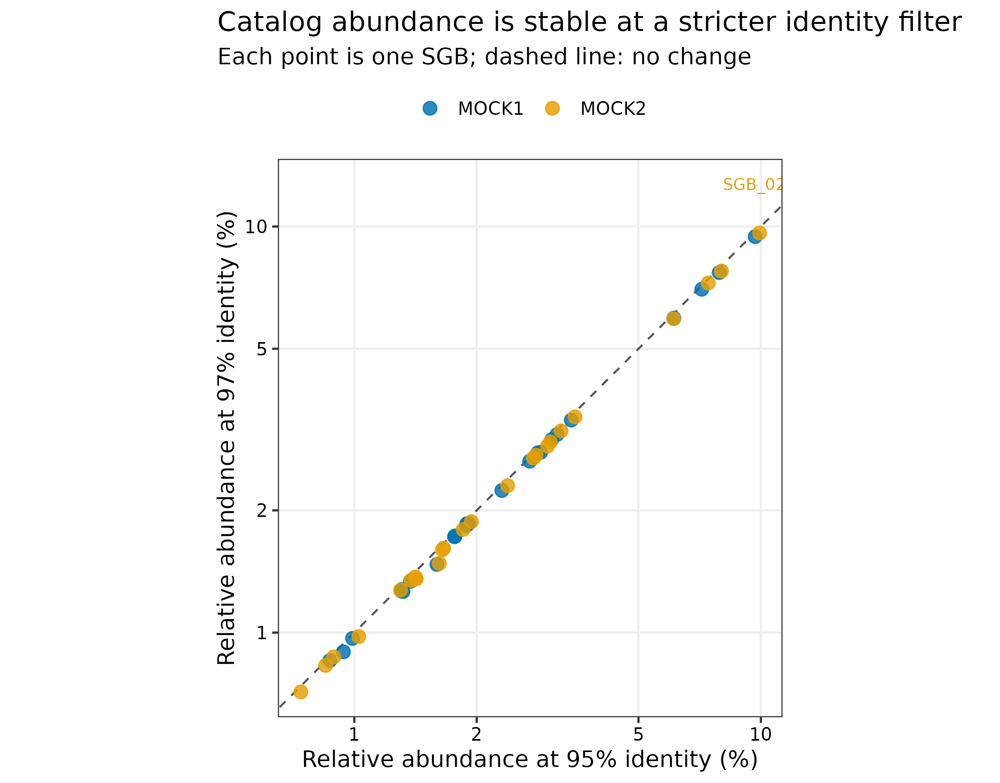
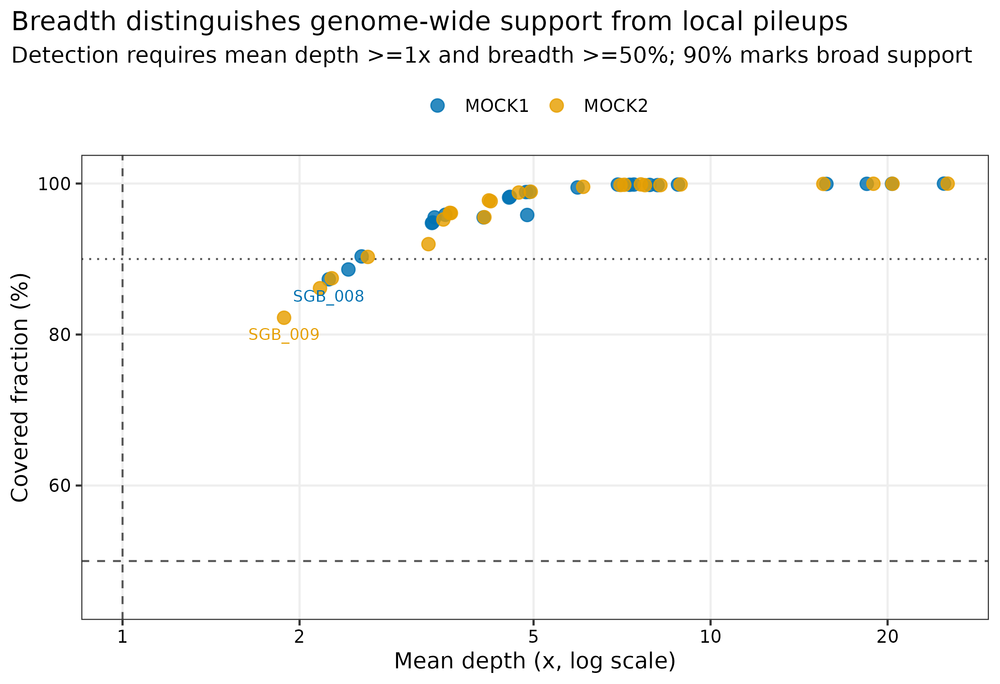
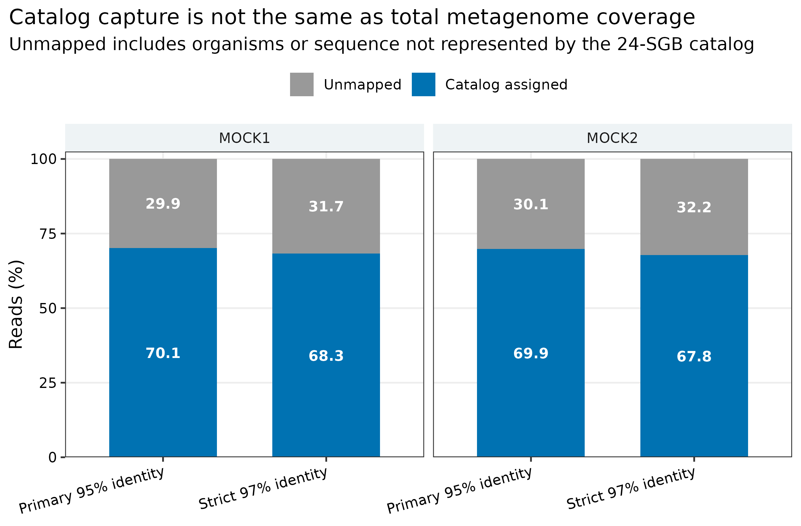

> **先给结论：**MAG abundance 不能只用“mapped reads 数”表示。24 个 95% ANI species-level genome bins（SGBs）组成固定 catalog 后，用 CoverM 0.8.0 + Strobealign 0.17.0 + SAMtools 1.23.1 将两份各约 200 万 read pairs 的真实 mock reads 竞争性回贴。主分析要求 read identity >=95%、aligned length >=75%、proper pair，并同时报告 mean depth、trimmed mean、covered fraction、relative abundance、read count 与 ANIr。两份样本分别有 **70.12% 和 69.87% reads 被 catalog 捕获**；24 个 SGB 均达到预设的 breadth >=50% 且 mean depth >=1x，22/21 个达到 breadth >=90%。把 identity 提高到 97% 后，catalog capture 降为 68.27%/67.78%，单个 SGB 的 relative-abundance 最大变化仅 0.290 percentage points。

::: {.callout-important title="算力与数据边界"}
本次使用 **24 CPU cores**；95% 与 97% 两条 CoverM 分支分别耗时 39.10 与 41.67 秒，峰值 RAM 为 1.413 与 1.401 GiB。24 个代表基因组约 58 MB，四份 clean FASTQ.gz 共约 741 MB；四个未过滤 BAM 共约 1.18 GB。建议准备 **8 cores、8 GB RAM、5 GB 可用磁盘，预计 3--10 分钟**。大队列优先建立固定 catalog/index，将 BAM 放在高速临时盘；没有服务器时，可读取 `data/small/48-mag-abundance-coverm-frozen/` 的 raw CoverM tables、汇总表、命令、资源日志与校验记录，BAM 不进入冻结包。
:::

## 这一步对应论文里的哪张图 {#sec-target}

锚定图是 genome-resolved 论文中的 MAG/SGB abundance heatmap：行是非冗余 genome clusters，列是 samples，颜色表示 relative abundance；正文或补图再给 depth/breadth detection audit。CoverM 把 read alignment、过滤与多种 coverage statistics 放在统一实现中 [@aroney2025coverm]。

{#fig-48-heatmap}

两份 abundance profile 的 Spearman 相关为 0.967，但 ERR9765746 与 ERR9765747 是 composition 不同的真实 uneven mocks，不是生物学重复；这个相关只描述 catalog 坐标上的排序相似性，不构成组间检验。

## 理论：depth、breadth、abundance 与 detection 各回答什么 {#sec-theory}

### 1. Mean depth：平均堆叠高度

Mean depth 是 reads 覆盖每个 genome position 的平均高度。CoverM 在本分析中对每条 contig 两端各排除 75 bp 后计算 mean，减少边界比对造成的偏差。深度对测序量敏感，不能在 library size 不同的样本间直接比较原始值。

### 2. Trimmed mean：降低局部高峰和零覆盖尾部影响

`trimmed_mean` 对一个 genome 的全部位置统一排序，去掉最低 5% 与最高 5% 后求均值。它能降低 repeats、保守序列或局部异常 pileup 的影响，但不是 contamination detector，也不能替代 breadth。

### 3. Covered fraction：支持是否铺满 genome

Covered fraction（覆盖广度）是至少被一条合格 read 覆盖的 genome bases 比例。局部保守基因可产生较高局部 depth，却只有很低 breadth；因此 presence/detection 必须同时查看 breadth 与 depth。本篇把 breadth >=50% 且 mean depth >=1x 预设为 reporting detection rule，并另报 10%、50%、90% 三档敏感性，不把它包装成所有研究都适用的普遍阈值。

### 4. Relative abundance：长度校正后的群落比例

CoverM `relative_abundance` 用各 genome 的 mean coverage 做长度校正，再乘上通过 mapping/filter 的 reads 比例；因此它不是简单的 read-count 百分比。输出中的 `unmapped` 行表示未分配到 catalog 的 reads [@aroney2025coverm]。若只在已捕获的 24 个 SGB 内分析组成，可再把 SGB abundance 归一到 100%；但必须把“全 reads 比例”和“catalog 内比例”分成两列。

### 5. ANIr：已比对 reads 的平均序列一致性

ANIr 是 mapped reads 的 average BLAST-like identity。它可提示 reference divergence，却受 mapper、identity cutoff、read quality 与多重比对共同影响；不能把 ANIr 当作 genome ANI 或 strain distance。

## 准备工作 {#sec-setup}

### 输入对象与 lineage

| 输入 | 固定对象 | 作用 |
|---|---|---|
| SGB catalog | `45-drep-dereplication-frozen/representative-genomes/`；24 个 95% ANI representatives | 统一竞争性 mapping 坐标 |
| MOCK1 reads | PRJEB52977 / ERR9765746；1,999,853 clean pairs | abundance sample 1 |
| MOCK2 reads | PRJEB52977 / ERR9765747；1,999,888 clean pairs | abundance sample 2 |
| genome ledger | `SGB_001`--`SGB_024`、dRep cluster、representative SHA-256、CheckM2/MIMAG fields | 稳定 join key 与质量追踪 |

24 个 representatives 解压后逐一与 Article 45 SHA-256 对照；四份 FASTQ.gz 与 Article 41 input audit 的 SHA-256 对照。known mock reference identities 不参与 mapping filter、detection 或 abundance calculation。

<details>
<summary>点开：锁定环境并内联出版主题</summary>

```bash
mamba create -n metagenome-assembly-2026.07 --file env/assembly-linux-64.lock
conda run -n metagenome-assembly-2026.07 coverm --version
conda run -n metagenome-assembly-2026.07 strobealign --version
conda run -n metagenome-assembly-2026.07 samtools --version | head -n 2
```

```{r}
install.packages(c("ggplot2", "dplyr", "readr", "tidyr", "forcats", "scales"))
library(ggplot2); library(dplyr); library(readr); library(tidyr); library(forcats)
set.seed(20260748)

pal_pub <- c("MOCK1" = "#0072B2", "MOCK2" = "#E69F00",
             "Catalog assigned" = "#0072B2", "Unmapped" = "#999999")
scale_color_pub <- function(...) scale_color_manual(values = pal_pub, ...)
scale_fill_pub  <- function(...) scale_fill_manual(values = pal_pub, ...)
theme_pub <- function(base_size = 12) {
  theme_bw(base_size = base_size) + theme(
    panel.grid.minor = element_blank(),
    panel.grid.major = element_line(color = "#EEEEEE"),
    axis.text = element_text(color = "black"), legend.key = element_blank(),
    strip.background = element_rect(fill = "#EEF3F5", color = NA),
    plot.title.position = "plot"
  )
}
save_pub <- function(plot, file_base, width = 190, height = 125,
                     units = "mm", dpi = 350) {
  dir.create(dirname(file_base), recursive = TRUE, showWarnings = FALSE)
  ggsave(paste0(file_base, ".pdf"), plot, width = width, height = height,
         units = units, device = cairo_pdf)
  ggsave(paste0(file_base, ".png"), plot, width = width, height = height,
         units = units, dpi = dpi, bg = "white")
  ggsave(paste0(file_base, ".tiff"), plot, width = width, height = height,
         units = units, dpi = dpi, compression = "lzw", bg = "white")
  invisible(plot)
}
```

</details>

## 可复制代码：竞争性回贴与多指标汇总 {#sec-code}

### 第 1 步：解压 representatives 并核对 reads

```bash
ROOT="$PWD"
WORK="work/article48"
python3 scripts/prepare_article48_coverm.py \
  --project-root "${ROOT}" --work-dir "${WORK}"

head "${WORK}/genome-ledger.tsv"
head "${WORK}/samples.tsv"
```

脚本按 dRep cluster 排序生成 `SGB_001`--`SGB_024`，但保留 representative basename 与 SHA-256。图表和统计以 SGB ID 为键；GTDB taxonomy 完成后再附加名称，不能用 taxonomy string 代替稳定主键。

### 第 2 步：95% identity 主分析

```bash
mapfile -t READS < <(awk -F '\t' 'NR>1 {print $4; print $5}' "${WORK}/samples.tsv")
mkdir -p "${WORK}/bam"
export TMPDIR="${WORK}/tmp"

conda run -n metagenome-assembly-2026.07 coverm genome \
  --coupled "${READS[@]}" \
  --genome-fasta-directory "${WORK}/inputs/genomes" \
  --genome-fasta-extension fna \
  --mapper strobealign \
  --min-read-percent-identity 95 \
  --min-read-aligned-percent 75 \
  --proper-pairs-only --exclude-supplementary \
  --min-covered-fraction 0 \
  --contig-end-exclusion 75 \
  --trim-min 5 --trim-max 95 \
  --methods mean trimmed_mean covered_fraction relative_abundance count anir length \
  --output-format sparse \
  --cache-unfiltered-bam-directory "${WORK}/bam/identity95" \
  --threads 24 \
  --output-file "${WORK}/raw/coverm-identity95.tsv"
```

`--min-covered-fraction 0` 的作用是保留原始 breadth 值和零值，再在汇总表中透明应用 reporting threshold；若直接使用 CoverM 默认 10% gate，低 breadth genomes 会被先置零，后续无法复核阈值敏感性。

### 第 3 步：97% identity 敏感性分支

```bash
conda run -n metagenome-assembly-2026.07 coverm genome \
  --coupled "${READS[@]}" \
  --genome-fasta-directory "${WORK}/inputs/genomes" \
  --genome-fasta-extension fna \
  --mapper strobealign \
  --min-read-percent-identity 97 \
  --min-read-aligned-percent 75 \
  --proper-pairs-only --exclude-supplementary \
  --min-covered-fraction 0 \
  --contig-end-exclusion 75 \
  --trim-min 5 --trim-max 95 \
  --methods mean trimmed_mean covered_fraction relative_abundance count anir length \
  --output-format sparse \
  --cache-unfiltered-bam-directory "${WORK}/bam/identity97" \
  --threads 24 \
  --output-file "${WORK}/raw/coverm-identity97.tsv"
```

{#fig-48-identity}

严格分支对每个 SGB 的 read count 都不高于主分支，最大 abundance change 出现在 MOCK2 的 `SGB_024`（-0.290 percentage points）。这说明这组 catalog 对 2-percentage-point identity 收紧较稳定；换成真实未知群落时仍应按测序错误率、目标 divergence 与 cross-mapping 风险重新设定。

### 第 4 步：计算 detection 与 catalog capture

```bash
python3 scripts/run_article48_coverm.py \
  --project-root "${ROOT}" --work-dir "${WORK}" \
  --environment metagenome-assembly-2026.07 --threads 24

python3 scripts/summarize_article48_coverm.py \
  --project-root "${ROOT}" --work-dir "${WORK}"

column -t -s $'\t' "${WORK}/summary/sample-capture-summary.tsv"
column -t -s $'\t' "${WORK}/summary/detection-threshold-summary.tsv"
```

{#fig-48-breadth}

主分支中 24/24 SGB 在两个样本均通过 breadth >=50% 且 mean depth >=1x；若提高到 breadth >=90%，MOCK1/MOCK2 分别为 22/21。低于 90% 的 SGB 仍有 1.88--2.42x mean depth，说明 depth 非零不等于 genome-wide support。

{#fig-48-capture}

### 第 5 步：冻结、出图与验收

```bash
python3 scripts/freeze_article48_coverm.py \
  --project-root "${ROOT}" --work-dir "${WORK}" \
  --output-dir data/small/48-mag-abundance-coverm-frozen

Rscript scripts/plot_article48_coverm.R \
  --input-dir data/small/48-mag-abundance-coverm-frozen \
  --output-dir figures

python3 scripts/validate_article48_coverm.py \
  --project-root "${ROOT}" \
  --frozen-dir data/small/48-mag-abundance-coverm-frozen \
  --output-dir results/48-mag-abundance-coverm \
  --figure-dir figures \
  --chapter chapters/48-mag-abundance-coverm.qmd
```

## 审计与升级 {#sec-audit}

### 从单个 MAG 分别回贴升级为 catalog-wide competitive mapping

逐个 genome 独立 mapping 会让同一 read 同时计入多个近缘 MAG。主分析先用 95% ANI 去冗余 catalog，再把所有 representatives 放进同一 reference，由 mapper 在同一坐标系竞争性选择。对于高度近缘 species complexes，仍需检查 multi-mapping、MAPQ 与 alternative mapper/stringency。

### 从 mapped count 升级为四层证据

read count 用于审计 mapping fate；mean/trimmed mean 描述堆叠高度；breadth 判断支持是否遍布 genome；relative abundance 用于样本组成。四列都保留，不能从一列倒推其余三列。

### 从默认置零升级为保留原始 breadth 后再判定

CoverM 默认会把低于 minimum covered fraction 的 genome 报为 zero [@aroney2025coverm]。本篇明确使用 `--min-covered-fraction 0`，再生成 10%、50%、90% threshold table。这样审稿人可以看见 threshold 对 detection counts 的影响。

### 从“未映射就是未知物种”升级为 catalog boundary

约 30% unmapped reads 可能来自 catalog 未包含的 genomes、同一物种未恢复区域、质粒/病毒、低质量序列、divergent strains 或过滤阈值。它衡量 catalog capture，不是“未知微生物比例”，也不是 host-removal failure 的直接证据。

### 从缓存 BAM 升级为过滤契约审计

`--cache-unfiltered-bam-directory` 保存的是未经过 CoverM identity/aligned-percent/genome-breadth 后过滤的 BAM。下游若直接读取这些 BAM，必须重新应用同样过滤条件；不能把 BAM 中 alignment 数与最终 CoverM table 混为一谈。

## 出版级美化 {#sec-publication}

1. heatmap 使用稳定 `SGB_###` 行名，taxonomy 作为附加注释，不因数据库更新改变主键。
2. abundance 色阶采用单调、色盲友好的浅蓝到深蓝，并在格内打印两位小数；不使用彩虹色。
3. breadth-depth 图用 log x 轴，同时画 1x、50% 与 90% 参考线；低 breadth 点才加 label，避免遮挡。
4. identity sensitivity 图画 `y=x`，直接展示偏离而非只报告相关系数。
5. capture 图把 `Catalog assigned` 与 `Unmapped` 堆叠到 100%，避免把 catalog 内重新归一化误当全群落比例。
6. 所有图内文字为英文，导出 PDF、350 dpi PNG 与 LZW TIFF。

## 常见坑 {#sec-pitfalls}

::: {.callout-caution title="1. 用 read count 直接比较不同长度 MAG"}
长 genome 更容易得到更多 reads。跨 genome 的 abundance 应用 length-aware mean coverage/relative abundance；read count 只作 mapping audit。
:::

::: {.callout-caution title="2. 只看 depth，不看 breadth"}
保守基因、repeat 或污染 contig 可造成局部高深度。presence 至少联合 mean depth 与 covered fraction，并展示 threshold sensitivity。
:::

::: {.callout-caution title="3. 把 relative abundance 当绝对细胞比例"}
DNA extraction、genome copy number、replication state、mapping bias 与 catalog completeness 都会影响结果。没有 spike-in/qPCR 时只能写 relative abundance。
:::

::: {.callout-caution title="4. 不报告 identity/aligned-percent/proper-pair 条件"}
同一 FASTQ 和 catalog 在不同 read filters 下会产生不同 capture 与 abundance。Methods 必须锁定 mapper、identity、aligned percent、pair policy 与 end exclusion。
:::

::: {.callout-caution title="5. 把 unmapped 直接命名为 unknown taxa"}
unmapped 是对当前 catalog 与当前过滤条件而言的 read fate；它混合 biological novelty、catalog incompleteness 和 technical filtering。
:::

::: {.callout-caution title="6. 把两个 mock 当重复做显著性检验"}
ERR9765746/ERR9765747 是两份 composition 不同的 mock。这里的相关和差值是描述性结果；真实差异 abundance 需要独立生物学重复、协变量与 compositional model。
:::

::: {.callout-caution title="7. 直接对缓存 BAM 做下游计数"}
CoverM 的 cached BAM 是 unfiltered alignment cache。必须重新过滤或使用已审计的 CoverM output table。
:::

## 这段 Methods 怎么写 {#sec-methods}

### Methods template

> Twenty-four checksum-identified representatives from a 95%-ANI dRep v3.6.2 species-level catalog were assigned stable identifiers (`SGB_001`--`SGB_024`) and used as a common competitive-mapping reference. Fixed clean paired-end subsets from PRJEB52977 runs ERR9765746 (1,999,853 pairs) and ERR9765747 (1,999,888 pairs) were quantified with CoverM v0.8.0, Strobealign v0.17.0, and SAMtools v1.23.1 using 24 threads. The primary analysis required >=95% read identity, >=75% of each read aligned, proper pairs, and exclusion of supplementary alignments. CoverM was run with `--min-covered-fraction 0`, 75-bp contig-end exclusion, and 5%/95% trimming to retain mean depth, trimmed mean depth, covered fraction, relative abundance, read count, ANIr, and genome length. Detection for reporting required mean depth >=1x and covered fraction >=50%; 10%, 50%, and 90% breadth cutoffs were retained as a sensitivity table. A 97%-identity branch assessed mapping-stringency sensitivity. Genome and read SHA-256 values, native tables, commands, software versions, and GNU-time resource measurements were retained; known mock reference identities were not used for mapping or detection.

### Results template

> At the primary 95%-identity threshold, the 24-SGB catalog captured 70.12% and 69.87% of reads from ERR9765746 and ERR9765747, respectively. All 24 SGBs met the prespecified mean-depth >=1x and covered-fraction >=50% reporting criterion in both samples, whereas 22 and 21 SGBs, respectively, had >=90% breadth. The SGB relative-abundance profiles had a descriptive Spearman correlation of 0.967 across the two non-replicate mock communities. Increasing the read-identity threshold to 97% reduced catalog capture to 68.27% and 67.78%; the maximum absolute per-SGB relative-abundance change was 0.290 percentage points. Unmapped reads were reported as catalog-boundary evidence and were not interpreted as a direct estimate of unknown taxa.

## 换成你自己的数据怎么做 {#sec-own-data}

1. 用所有样本共同的、quality-filtered、species-level dereplicated catalog；为每个 representative 固定 checksum 与稳定 SGB ID。
2. 记录 raw/clean read identity、sample metadata 与 library size；每个样本保留独立 mapping fate。
3. 依据 read length、测序错误率、生态位 divergence 与近缘 species 风险预设 identity/aligned-percent/MAPQ/proper-pair 条件。
4. 先用 `--min-covered-fraction 0` 保留原始值，再在统计计划中定义 detection rule；至少做一档 breadth 或 identity sensitivity。
5. 同时导出 mean、trimmed mean、covered fraction、relative abundance、count 与 ANIr；不要只保留最终 abundance matrix。
6. 下游模型使用全样本统一的 SGB coordinate，并区分 `RelativeAbundancePct` 与 `CatalogNormalizedAbundancePct`。
7. 若 catalog capture 在组间系统性不同，将 capture 作为 QC/敏感性变量；不要仅在已捕获 SGB 内归一化后忽略这项偏差。
8. 真正的 differential abundance 使用独立生物学重复、批次/协变量设计与适合 compositional counts 的模型；CoverM table 是输入，不是统计检验本身。

## 参考 {#sec-references}

- CoverM genome coverage 与 calculation methods [@aroney2025coverm]
- dRep 非冗余 catalog [@olm2017drep]
- MIMAG quality reporting [@bowers2017mimag]
- PRJEB52977 多平台不均一 microbial mocks [@meslier2022platforms]
