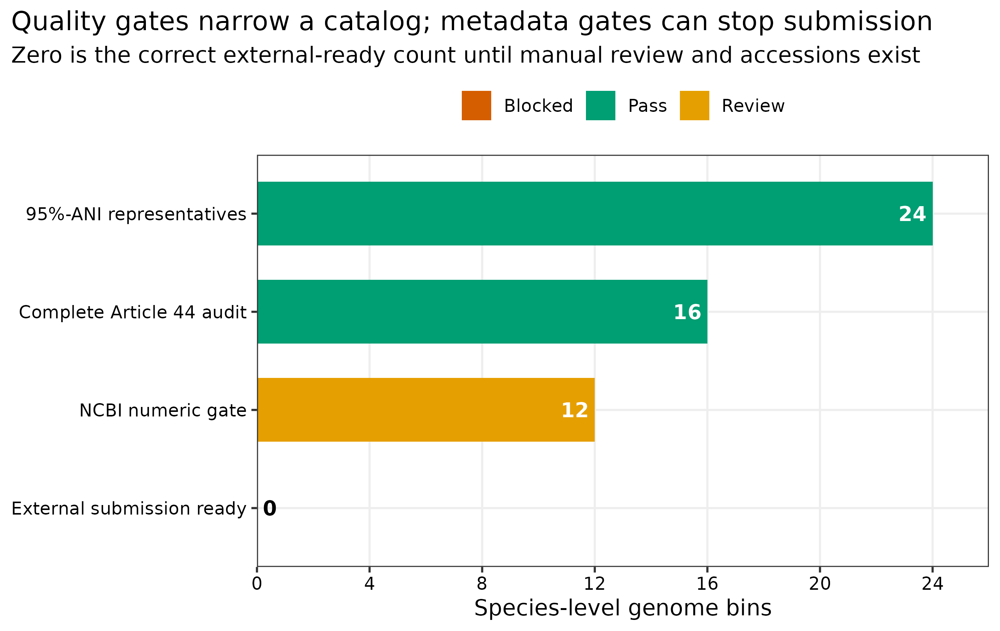
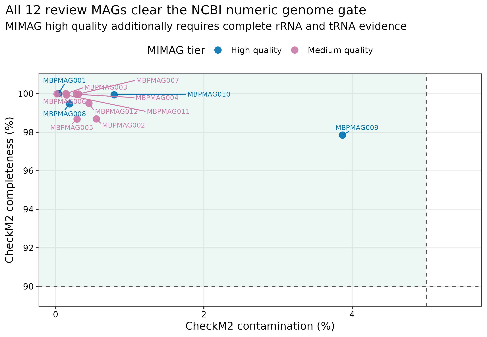
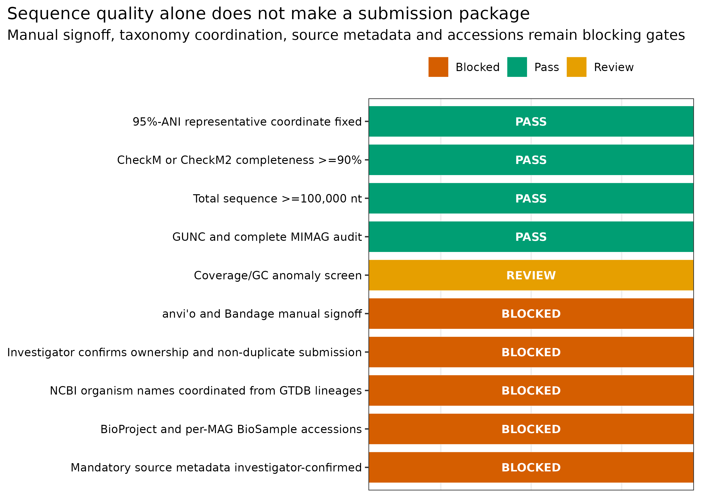
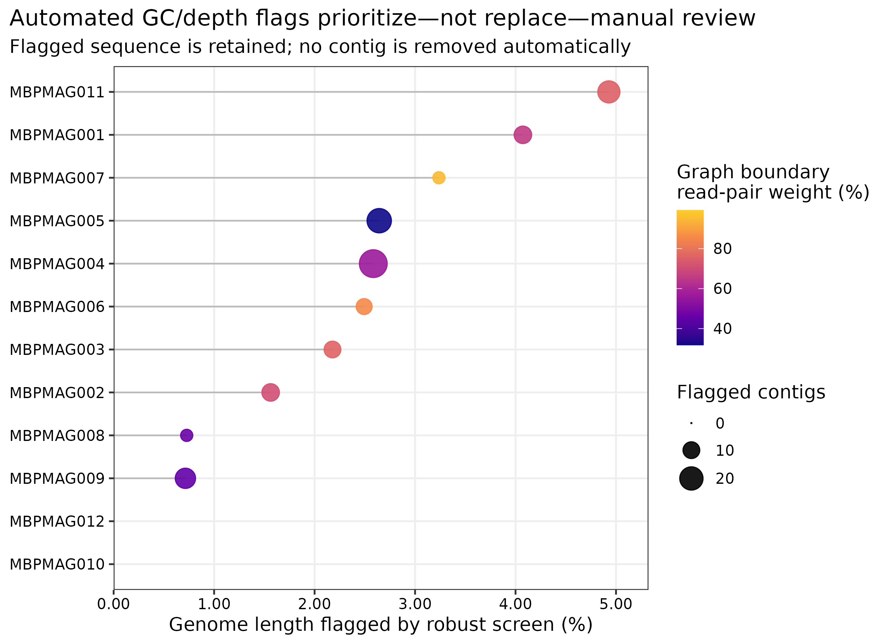

> **先给结论：**“高完整度、低污染”只说明 MAG 值得进入人工复核，不等于已经可以上传数据库。24 个 95% ANI species-level genome bins（SGBs）中，16 个具有完整 Article 44 质量记录；按当前 NCBI 的 CheckM/CheckM2 completeness >=90% 与总长度 >=100,000 nt 数值门槛筛选后，只有 **12 个**进入技术复核集。对这 12 个 MAG 的 1,829 条 contig 做 GC 与双样本深度 robust-z 筛查，共标记 **135 条**、706,042 bp；这些标记只用于定位人工复核对象，**没有自动删除任何 contig**。由于 anvi'o/Bandage 人工签字、数据所有权确认、NCBI taxonomy 协调、BioProject/BioSample accession 和来源元数据尚未齐全，当前外部可提交数严格记为 **0**。

::: {.callout-important title="算力与操作门槛"}
本次自动化预审使用 **1 CPU core**，耗时 **54.08 秒**，峰值 RAM **0.066 GiB**；12 份 review FASTA 合计约 35 MB。建议准备 **4 cores、8 GB RAM、5 GB 可用磁盘**。真正耗时的是人工复核：按 MAG 复杂度预留 **10--30 分钟/MAG**，大型 anvi'o profile 还会受 BAM 体积影响。没有服务器时，可在普通工作站读取 `data/small/49-mag-curation-submission-frozen/` 的压缩审计表与 review FASTA；若需要交互式 anvi'o/Bandage，可把单个 MAG、对应 BAM 和 assembly graph 下载到本地逐一检查。
:::

## 这一步对应论文里的哪张图 {#sec-target}

这一环节通常不会成为论文主图，而会落在三处：Methods 的 curation/submission 描述、补充材料的逐 MAG MIMAG 表，以及 Data availability 中可核验的 BioProject、BioSample 与 assembly accessions。最接近发表图的是 completeness--contamination quality panel；但真正决定数据能否复用的是“每个点背后的稳定 ID、质量字段、来源关系和 accession”。MIMAG 为 MAG 质量与元数据报告建立了最低标准 [@bowers2017mimag]。

{#fig-49-funnel}

{#fig-49-quality}

这两个图回答不同问题：quality panel 是序列质量证据，submission funnel 是可提交性证据。不能用前者替代后者。

## 理论：从“一个 bin”到“可长期引用的 genome record” {#sec-theory}

### 1. 自动质控回答“哪里可疑”，人工校正回答“是否有生物学理由修改”

同一 MAG 内，GC、覆盖深度、四核苷酸组成和 taxonomy 明显偏离的 contig 可能来自污染，也可能是 plasmid、genomic island、rRNA operon、重复区或真实的水平转移。自动规则适合缩小检查范围，不适合自动删序列。删除决定至少要联合 read mapping、assembly graph、taxonomy、gene context 和边界支持。

本次对每个 MAG 内部独立计算 GC 与 `log2(mean depth + 0.1)` 的 median/MAD robust z-score：

\[
z_i^{\mathrm{robust}}=\frac{x_i-\mathrm{median}(x)}{1.4826\times\mathrm{MAD}(x)}.
\]

任一轴满足 \(|z|>3.5\) 即标记 review；阈值在分析前固定，动作永远是 `REVIEW_ONLY`。若 MAD 为 0，该轴全部记为 0，避免除零和人为放大微小差异。

### 2. 去冗余代表是提交坐标，不是自动获得的“物种名”

95% ANI clustering 让一个物种水平 cluster 只保留一个代表，减少同一 biome 内重复提交；ENA 也明确要求优先提交最高质量的 unique-taxon MAG，并建议每个 biome 的每个 species 只保留一个代表 [@ena2026magsubmission]。`SGB_###` 是内部稳定键，`MBPMAG###` 是提交前稳定 isolate；GTDB taxonomy 是注释字段。三者不能互相覆盖。

### 3. NCBI 数值门槛、MIMAG quality tier 与提交就绪是三层概念

- NCBI 当前接收 MAG 的基础序列门槛包括：单一生物体、包含已识别的全部 genome sequence、CheckM/CheckM2 completeness >=90%、总长度 >=100,000 nt [@ncbi2026magfaq]。
- MIMAG high-quality tier 还要结合 contamination、完整 5S/16S/23S rRNA 与 tRNA 等证据 [@bowers2017mimag]。
- 提交就绪还需要数据所有权、taxonomy 名称、每个 MAG 的 BioSample、来源元数据、sequence/header、项目和文件一致性。

因此，一个 MAG 可以通过 NCBI 数值门槛、属于 MIMAG medium quality，同时仍因元数据或人工复核缺失而不能提交。

### 4. 环境样本与 MAG BioSample 不是同一个对象

原始 reads 对应混合群落的 physical/environmental BioSample；每个 MAG 则代表一个计算恢复的单一 organism bin，需要独立的 organism-specific MAG BioSample。NCBI 要求每个 MAG 使用唯一、稳定的字母数字 isolate，且不把 organism 名缩写塞进 isolate [@ncbi2026biosampleorganism]。ENA 同样要求每个 MAG 关联独立 MAG sample，并通过 `sample derived from` 指回来源样本 [@ena2026magsubmission]。

### 5. accession 只能由数据库签发

`PRJNA...`、`SAMN...`、`PRJEB...`、`SAMEA...`、`GCA_...` 都不是本地文件名。只有完成注册或提交后，数据库返回的 accession 才能进入论文。提交前可保留空值、`UNREGISTERED` 或阻断状态，但不能制造“看起来像真的”编号。

<details>
<summary>点开：为什么公开教程数据不能直接再次提交</summary>

NCBI 明确要求只提交由提交者自行确定的序列，不应把从公共数据库下载的数据作为自己的新 genome submission [@ncbi2026magfaq]；ENA 对 third-party data assembly 也要求先联系 helpdesk [@ena2026magsubmission]。本次 ERR9765746/ERR9765747 是公开 mock 数据，只用于演示预审结构。review FASTA 被显式标记为 `DEMONSTRATION_REVIEW_FILE—DO_NOT_SUBMIT`，没有触发任何外部提交。

</details>

## 准备工作 {#sec-setup}

### 输入对象与 lineage

| 输入 | 固定对象 | 本章用途 |
|---|---|---|
| read/contig depth | PRJEB52977 的 ERR9765746/ERR9765747；`41-read-mapping-depth-frozen/` | 双样本 contig-depth 异常筛查 |
| refinement membership | `43-bin-refinement-frozen/` | MAG--contig 映射 |
| MAG quality/graph | `44-mag-qc-mimag-graph-frozen/` | CheckM2、GUNC、rRNA/tRNA、assembly graph 证据 |
| 95% ANI catalog | `45-drep-dereplication-frozen/` | 24 个 species representatives 与 sequence SHA-256 |
| GTDB taxonomy | `46-gtdbtk-taxonomy-frozen/` | 未改写的 GTDB R232 lineage |
| MAG coverage | `48-mag-abundance-coverm-frozen/` | coverage、breadth 与 assembly metadata |

脚本在生成任何 review file 前逐个验证六个冻结包的 `file-checksums.sha256`，并再次核对 Article 44 与 Article 45 representative sequence hash。known mock identities 不参与 curation gate。

<details>
<summary>点开：依赖、人工复核工具与内联出版主题</summary>

```bash
# 自动预审只需 Python 标准库；交互式复核另建环境
mamba create -n metagenome-curation-2026.07 -c conda-forge -c bioconda \
  python=3.13 anvio bandage samtools

conda run -n metagenome-curation-2026.07 anvi-self-test --suite mini
conda run -n metagenome-curation-2026.07 Bandage --help | head
```

```{r}
install.packages(c("ggplot2", "dplyr", "readr", "forcats", "scales", "ggrepel"))
library(ggplot2); library(dplyr); library(readr); library(forcats)
set.seed(20260749)

pal_pub <- c(
  "Pass" = "#009E73", "Review" = "#E69F00", "Blocked" = "#D55E00",
  "High quality" = "#0072B2", "Medium quality" = "#CC79A7"
)
scale_color_pub <- function(...) scale_color_manual(values = pal_pub, ...)
scale_fill_pub  <- function(...) scale_fill_manual(values = pal_pub, ...)
theme_pub <- function(base_size = 12) {
  theme_bw(base_size = base_size) + theme(
    panel.grid.minor = element_blank(),
    panel.grid.major = element_line(color = "#EEEEEE"),
    axis.text = element_text(color = "black"), legend.key = element_blank(),
    strip.background = element_rect(fill = "#EEF3F5", color = NA),
    plot.title.position = "plot"
  )
}
save_pub <- function(plot, file_base, width = 190, height = 125,
                     units = "mm", dpi = 350) {
  dir.create(dirname(file_base), recursive = TRUE, showWarnings = FALSE)
  ggsave(paste0(file_base, ".pdf"), plot, width = width, height = height,
         units = units, device = cairo_pdf)
  ggsave(paste0(file_base, ".png"), plot, width = width, height = height,
         units = units, dpi = dpi, bg = "white")
  ggsave(paste0(file_base, ".tiff"), plot, width = width, height = height,
         units = units, dpi = dpi, compression = "lzw", bg = "white")
  invisible(plot)
}
```

</details>

## 可复制代码：从 catalog gate 到提交前审计包 {#sec-code}

### 第 1 步：建立 fail-closed 技术复核集

```bash
ROOT="$PWD"
WORK="results/49-mag-curation-submission"

python3 scripts/run_article49_mag_submission.py \
  --project-root "${ROOT}" --work-dir "${WORK}"

column -t -s $'\t' "${WORK}/summary/catalog-disposition.tsv" | head -n 15
column -t -s $'\t' "${WORK}/summary/submission-readiness-checklist.tsv"
```

筛选结果固定为：24 个 catalog representatives 中，12 个进入 `TECHNICAL_REVIEW_SET`，4 个因 completeness <90% 暂停，8 个因未经过完整 Article 44 MIMAG/GUNC audit 暂停。后一类即使 completeness 看起来很高，也不能绕过 lineage 完整性直接上传。

{#fig-49-readiness}

### 第 2 步：做 GC/depth 异常筛查，但不自动删 contig

```bash
zcat "${WORK}/summary/contig-anomaly-audit.tsv.gz" | \
  awk -F '\t' 'NR==1 || $12=="True"' | head -n 20

column -t -s $'\t' "${WORK}/summary/manual-review-sheet.tsv"
```

12 个 MAG 共 1,829 条 contig，其中 135 条触发至少一个 robust-z 信号；两个 MAG 没有触发项。被标记序列占各 MAG 长度的 0--4.93%，但所有 12 个 Article 44 graph audit 都显示 k141 graph fragmented。后者说明“没有异常点”也不能跳过 graph inspection。

{#fig-49-flags}

### 第 3 步：在 anvi'o 与 Bandage 中逐条签字

下面是一份单 MAG 的操作骨架。`MAG_FASTA`、`MAG_BAM` 与 `ASSEMBLY_GRAPH` 必须来自同一 assembly coordinate；BAM 先排序并建立 index。若手动删改 contig，需要重新生成 FASTA、checksum、CheckM2/GUNC、mapping depth、taxonomy 和所有下游表。

```bash
MAG_ID="MBPMAG001"
MAG_FASTA="work/curation/${MAG_ID}.fna"
MAG_BAM="work/curation/${MAG_ID}.bam"
ASSEMBLY_GRAPH="work/curation/final.contigs.gfa"

anvi-gen-contigs-database \
  -f "${MAG_FASTA}" -o "work/curation/${MAG_ID}.db" \
  -n "${MAG_ID}"
anvi-init-bam "${MAG_BAM}" \
  -o "work/curation/${MAG_ID}.sorted.bam"
anvi-profile \
  -i "work/curation/${MAG_ID}.sorted.bam" \
  -c "work/curation/${MAG_ID}.db" \
  -o "work/curation/${MAG_ID}-PROFILE" \
  --sample-name MOCK1
anvi-interactive \
  -p "work/curation/${MAG_ID}-PROFILE/PROFILE.db" \
  -c "work/curation/${MAG_ID}.db"

Bandage image "${ASSEMBLY_GRAPH}" \
  "work/curation/${MAG_ID}-graph.png"
```

anvi'o 用于联合查看 coverage、GC、taxonomy 与 contig membership [@eren2015anvio]；Bandage 用于检查 contig 在 assembly graph 中的连接、分支和重复结构 [@wick2015bandage]。`manual-review-sheet.tsv` 的 `AnvioManualSignoff` 与 `BandageManualSignoff` 只有研究者实际看完并记录证据后才能由 `PENDING_INVESTIGATOR_REVIEW` 改为通过或拒绝。

### 第 4 步：生成稳定 isolate、review FASTA 与 MIMAG supplement

自动预审按 SGB 顺序分配 `MBPMAG001`--`MBPMAG012`。每条 contig 重写为唯一 header，并加入真实来源 run：

```text
>MBPMAG001_contig00001 [SRA=ERR9765746,ERR9765747]
```

gzip 使用固定时间戳，因而同一输入可得到相同文件 SHA-256。检查 review FASTA 与补充表：

```bash
gzip -cd "${WORK}/review-fasta/MBPMAG001.fsa.gz" | head -n 3
column -t -s $'\t' "${WORK}/summary/review-fasta-manifest.tsv" | head
column -t -s $'\t' "${WORK}/summary/mimag-quality-supplement.tsv" | head
```

12 个 technical-review MAG 全部通过 NCBI 的 completeness/size 数值门槛；其中 4 个达到本次 MIMAG high-quality 记录，8 个为 medium quality。review FASTA 仍带有 `DO_NOT_SUBMIT` 状态，直到所有人工与元数据关卡关闭。

### 第 5 步：先协调 NCBI organism name，再注册 BioSample

NCBI 不直接采用未发表的 GTDB ad hoc name。提交前把“唯一 isolate + 未改写 GTDB lineage”两列发给 `genomes@ncbi.nlm.nih.gov`，由 taxonomy 团队返回可用 organism name [@ncbi2026magfaq]：

```bash
column -t -s $'\t' "${WORK}/summary/taxonomy-name-request.tsv" | head
```

收到名称后，再建立一个研究级 BioProject 和每个 MAG 一个 MIMAG BioSample。当前 NCBI MIMAG 6.0 的必填来源字段包括 isolate、collection_date、`env_broad_scale`、`env_local_scale`、`env_medium`、`geo_loc_name`、`isolation_source` 与 `lat_lon` [@ncbi2026mimag]。本地 draft 对教程来源无法证明的字段明确写为 investigator must supply：

```bash
column -t -s $'\t' "${WORK}/summary/biosample-review-draft.tsv" | head
column -t -s $'\t' "${WORK}/summary/genome-batch-review-draft.tsv" | head
```

NCBI 路径的最小对象关系是：

```text
one research effort -> one BioProject
mixed source sample -> raw-read BioSample + ERR/SRR/DRR runs
one organism bin    -> one MIMAG BioSample -> one MAG assembly file
```

每个 MAG 在 batch submission 中单独一行、单独一个 sequence file；一个 batch 最多 400 个 assemblies [@ncbi2026magfaq]。不要随机拼接 contigs，也不要把 organism 写成 `metagenome`；病毒基因组走 MIUVIG/病毒提交路径，不走 MIMAG [@ncbi2026mimag]。

### 第 6 步：需要走 ENA 时，重新映射为 ENA manifest

NCBI draft 不能原样冒充 ENA manifest。ENA 要求预注册 study 与独立 MAG sample，MAG sample 使用 GSC MIMAGS checklist，并通过 mandatory `sample derived from` 指向来源 sample。contig-level MAG 通常是一份 manifest 加一份 FASTA，通过 Webin-CLI 的 genome context 校验 [@ena2026magsubmission]。

manifest 至少记录 `STUDY`、`SAMPLE`、`ASSEMBLYNAME`、`ASSEMBLY_TYPE`、`COVERAGE`、`PROGRAM`、`PLATFORM` 与 `FASTA`；来源 runs 可写入 `RUN_REF`。正式 accession 由 ENA 返回，不能提前填写。先只做 validation：

```bash
webin-cli \
  -username "${WEBIN_USER}" \
  -password "${WEBIN_PASSWORD}" \
  -context genome \
  -manifest "${ENA_MANIFEST}" \
  -validate
```

使用 third-party data 或只提交 MAG、不提交 lower-level assembly/reads 时，应先按 ENA 文档联系 helpdesk 或建立并关联 environmental source sample。`-validate` 成功不等于已经提交，ERZ 也不是论文中最终引用的 assembly accession [@ena2026magsubmission]。

### 第 7 步：冻结证据、出图并验收

```bash
python3 scripts/freeze_article49_mag_submission.py \
  --project-root "${ROOT}" --work-dir "${WORK}" \
  --output-dir data/small/49-mag-curation-submission-frozen

Rscript scripts/plot_article49_mag_submission.R \
  --input-dir data/small/49-mag-curation-submission-frozen \
  --output-dir figures

python3 scripts/validate_article49_mag_submission.py \
  --project-root "${ROOT}" \
  --frozen-dir data/small/49-mag-curation-submission-frozen \
  --output-dir results/49-mag-curation-submission \
  --figure-dir figures \
  --chapter chapters/49-mag-curation-submission.qmd
```

## 审计与升级 {#sec-audit}

### 从“挑最好看的 bin”升级为 checksum-covered species representative

先用 95% ANI 去冗余，再在每个 cluster 内固定 representative 和 sequence SHA-256。这样补充表、taxonomy、abundance 与提交文件指向同一序列；文件名变化不会悄悄替换 genome。

### 从 completeness/contamination 二维图升级为完整证据链

CheckM2 衡量 completeness/contamination，GUNC 检查 lineage-level chimerism，rRNA/tRNA 支持 MIMAG tier，coverage/GC 与 assembly graph 支持人工 curation，GTDB/NCBI 名称解决 taxonomy，BioSample 解决来源。每层都不可由另一层代替。

### 从自动删异常 contig 升级为 review-only 规则

135 条异常 contig 中可能混合污染和真实 accessory sequence。本次只输出 `OutlierSignals` 与 robust z-score；没有 sequence deletion。人工若决定删除，必须保留理由、原序列/新序列 hash，并从质量评估开始重跑，而不是只修改最终 FASTA。

### 从 GTDB species label 升级为 NCBI taxonomy 协调

GTDB R232 为 24/24 SGB 提供 species assignment，但这不自动保证名称可被 NCBI Taxonomy 接受。提交前发送未改写 lineage；收到 NCBI 名称后才能填 `organism`。内部 SGB/isolate ID 始终不随 taxonomy release 改变。

### 从“文件准备好”升级为权限与来源审计

公开数据可用于复现，不等于可以作为自己的新提交。当前 review package 故意保留 5 个 blocked gates，`external_submission_performed=false`、`accessions_invented=false`。这不是缺失结果，而是防止重复提交和错误归属的正确结果。

### 从只写 NCBI 路径升级为 INSDC-aware 提交计划

NCBI 与 ENA 最终通过 INSDC 交换数据，但注册表、字段名、认证方式和 validation 工具不同。研究开始时选择一个主提交入口；不要在两端重复创建同一 assembly，也不要把一端的临时 accession 当成另一端的字段。

## 出版级美化 {#sec-publication}

1. funnel 从 24 到 0 保留每个 gate 的真实数量，不用百分比掩盖小样本。
2. readiness matrix 使用绿色/橙色/朱红区分 pass/review/blocked，并直接打印英文状态。
3. quality plot 同时画 completeness=90% 与 contamination=5% 参考线；颜色只表示记录到的 MIMAG tier。
4. curation plot 用 flagged length percentage 而非仅用 contig 数，避免碎片化 MAG 因 contig 多而被视觉放大。
5. 每个点以稳定 isolate 标注；taxonomy 放在表中，避免长名称遮挡。
6. 所有图内文字为英文，导出 PDF、350 dpi PNG 与 LZW TIFF；Data availability table 另导出 TSV/CSV，不把 accession 只藏在图片里。

## 常见坑 {#sec-pitfalls}

::: {.callout-caution title="1. completeness >=90% 就直接上传"}
这只是 NCBI 的一个数值门槛。先确认单一 organism、全部识别序列、GUNC/MIMAG、人工 curation、来源元数据、taxonomy 和数据所有权。
:::

::: {.callout-caution title="2. 用 GC 或 depth 阈值自动删除 contig"}
plasmid、genomic island 与 repeat 都可能离群。自动规则只生成 review queue；删除必须有多证据支持，并触发全链重跑。
:::

::: {.callout-caution title="3. 把 GTDB taxonomy 直接填进 NCBI organism"}
GTDB 的 unpublished/ad hoc names 未必存在于 NCBI Taxonomy。先提交 isolate + unmodified GTDB lineage 给 NCBI taxonomy 协调。
:::

::: {.callout-caution title="4. 所有 MAG 共用一个 BioSample"}
raw reads 对应混合样本，MAG 对应单一 organism bin。每个 MAG 都需要自己的 organism-specific MAG BioSample，并指回来源 runs/sample。
:::

::: {.callout-caution title="5. 用 cluster ID、物种名或 SRA accession 充当 isolate"}
isolate 应是唯一、稳定的字母数字标识，且不包含 organism 名称。cluster 与 taxonomy 会重算，run accession 表示来源 reads，三者语义不同。
:::

::: {.callout-caution title="6. 为了写论文先编 accession"}
提交前只写“accession pending”或保持 blocked；数据库签发后再更新。仿真的 PRJNA/SAMN/GCA 编号会污染数据血缘。
:::

::: {.callout-caution title="7. 把 validation success 当作已公开"}
Webin-CLI `-validate`、本地 checksum 和 NCBI 页面预检都不是 release。论文应引用数据库最终可检索的 study/sample/assembly accessions 与 release 状态。
:::

::: {.callout-caution title="8. 重复提交公共数据或在 NCBI/ENA 两端重复提交"}
先确认提交权、原始研究的现有 accession 与主提交入口。third-party assembly 应联系数据库支持；INSDC 会交换数据，不需要双重提交。
:::

## 这段 Methods 怎么写 {#sec-methods}

### Methods template

> Species-level genome bins were defined by 95%-ANI dereplication, and each representative was tracked by a stable SGB identifier and SHA-256 digest. Representatives were eligible for pre-submission review only when a complete CheckM2/GUNC/MIMAG audit was available and the assembly met the contemporary NCBI numerical requirements of >=90% CheckM2 completeness and >=100,000 nt total length. Within each eligible MAG, contigs were screened using median/MAD robust z-scores for GC content and log2(mean depth + 0.1) in two independently mapped metagenomes; absolute robust z-scores >3.5 were flagged for review and never triggered automatic sequence removal. Coverage, GC, taxonomic assignment, gene context, and assembly-graph connectivity were designated for joint inspection in anvi'o and Bandage. Stable alphanumeric isolate identifiers were assigned independently of taxonomy. MIMAG quality fields, GTDB-Tk v2.7.2 taxonomy against GTDB R232, source-run relationships, FASTA SHA-256 values, and submission-readiness gates were retained in tabular form. Organism names, per-MAG BioSamples, source metadata, and accessions were required before external submission; no third-party tutorial assembly was submitted.

### Results template

> Of 24 species-level representatives, 16 had a complete upstream MAG audit and 12 additionally passed the NCBI completeness and assembly-size numerical gates; four were held below the completeness threshold and eight were held because the complete audit was unavailable. The technical-review set comprised 1,829 contigs. A prespecified robust GC/depth screen flagged 135 contigs (706,042 bp) for manual review, but no contig was removed automatically. Four MAGs met the recorded MIMAG high-quality criteria and eight were medium quality. All 12 required investigator signoff, taxonomy coordination, source-metadata completion, and registered project/sample accessions. Consequently, zero assemblies were classified as externally submission-ready, no accessions were invented, and no external submission was performed.

## 换成你自己的数据怎么做 {#sec-own-data}

1. 在分析前确定提交权、主提交入口和是否已有 BioProject/Study；对 third-party data 先咨询 NCBI/ENA。
2. 用 95% ANI 或研究预设的 species boundary 去冗余；每个 biome/species cluster 选择最高质量代表，并固定内部 SGB ID 与 sequence SHA-256。
3. 只把具有完整 CheckM2、GUNC、MIMAG、coverage 和 graph lineage 的 MAG 放入技术复核集；门槛与例外写入 protocol。
4. 为每条 contig 汇总 GC、多个样本 depth、taxonomy、gene annotation 与 graph neighbor；异常检测只负责排序。
5. 在 anvi'o/Bandage 中记录 reviewer、日期、证据、决定与理由。任何删改都产生新 FASTA、新 checksum，并重跑 QC、taxonomy、abundance 和补充表。
6. 为每个代表分配不含 organism 名的稳定 isolate；将 GTDB release 与未改写 lineage 单独保留。
7. NCBI 路径先协调 organism name，再注册一个研究级 BioProject、来源 mixed-sample BioSample 与每 MAG 一个 MIMAG BioSample；用真实 run accession 填 `derived_from`/FASTA `[SRA=...]`。
8. ENA 路径建立 study、environmental source sample、独立 MAG sample 和 GSC MIMAGS checklist；为每个 MAG 生成 manifest，并先执行 Webin-CLI `-validate`。
9. 将 assembly method/version、binning/refinement、coverage、sequencing platform、MIMAG fields、文件 hash、最终 accession 与 release date 写入补充材料和 Data availability。
10. 只有数据库返回并可检索的 accession 才进入终稿；blocked/pending 状态保留到责任人逐项签字。

## 参考 {#sec-references}

- MIMAG 最低信息与质量标准 [@bowers2017mimag]
- NCBI MAG submission FAQ 与当前序列门槛 [@ncbi2026magfaq]
- NCBI MIMAG BioSample package 6.0 [@ncbi2026mimag]
- NCBI BioSample organism 与 MAG isolate 规则 [@ncbi2026biosampleorganism]
- ENA MAG sample、manifest 与 Webin-CLI 路径 [@ena2026magsubmission]
- anvi'o 交互式多组学检查 [@eren2015anvio]
- Bandage assembly graph inspection [@wick2015bandage]
