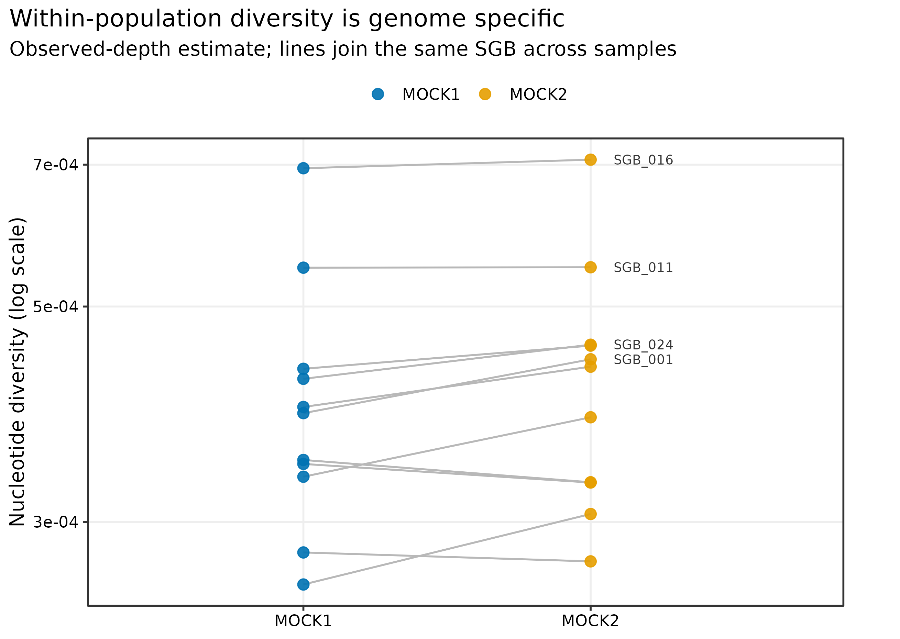
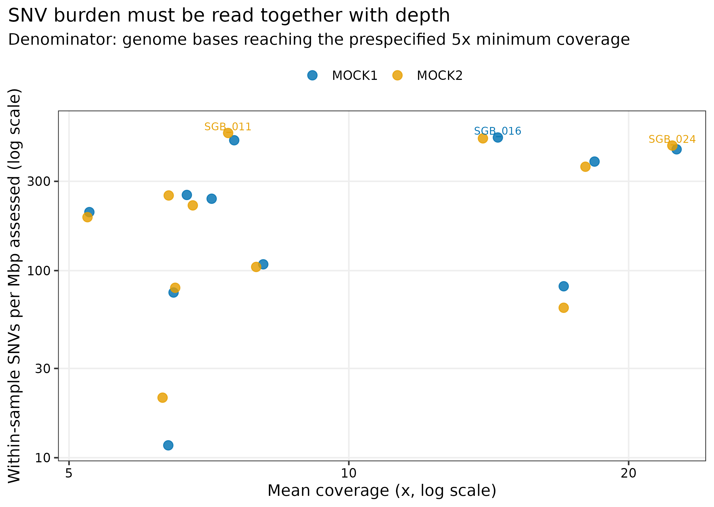
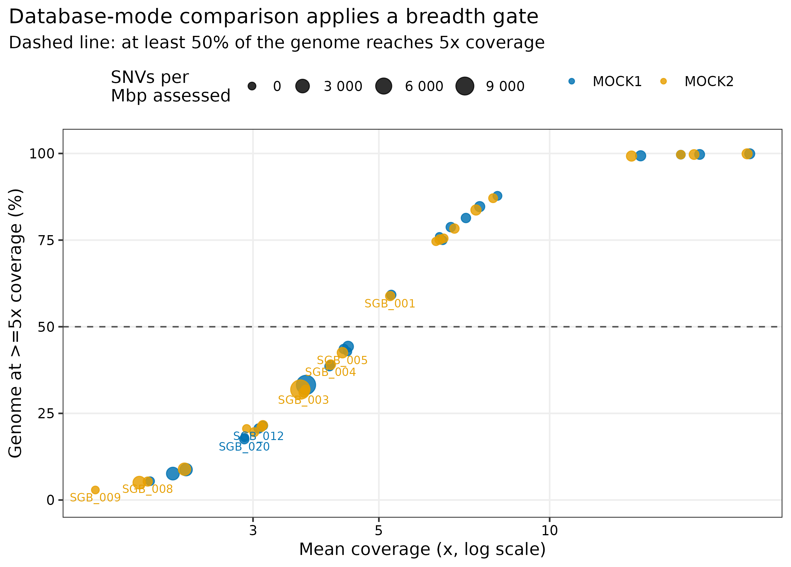
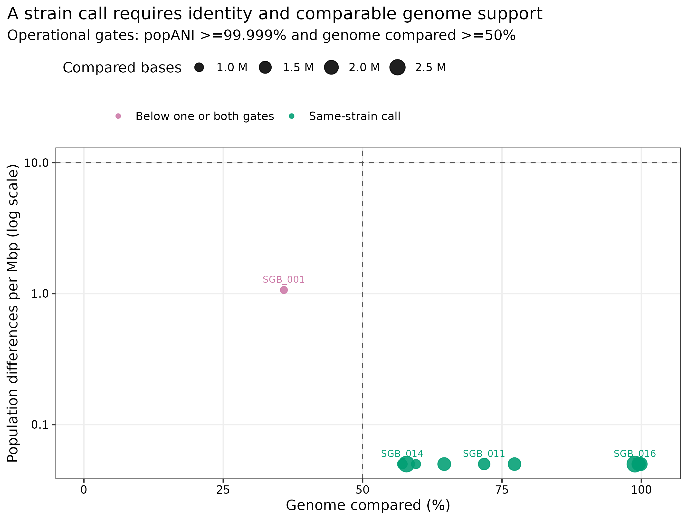

> **先给结论：**同一物种“检出”以后，仍可能由不同菌株或混合菌株构成；只比较 consensus sequence 会漏掉样本内的次要等位基因，只看一个很高的 ANI 又会忽略真正可比较的基因组范围。对 PRJEB52977 的两个真实 uneven mock metagenomes 进行严格重算后，每个样本各有 **11/24 SGBs** 达到“至少 50% genome 具有 >=5x coverage”的分析门槛。11 个跨样本 genome comparisons 中，**10 个**同时满足 `popANI >=99.999%` 与 `genome compared >=50%`；`SGB_001` 的 popANI 为 99.999893%，但只有 **35.87%** genome 可比较，因此不作同株判断。

::: {.callout-important title="算力与数据门槛"}
本次实跑使用 **24 CPU cores**。两个 `inStrain profile` 分别耗时 **432.32 秒**和 **418.05 秒**，峰值 RAM **3.721 GiB**；`inStrain compare` 耗时 **28.32 秒**、峰值 RAM **0.670 GiB**。工作目录约 **497 MB**，另有两份 306.6/329.2 MB BAM 和 58 MB reference catalog。建议准备 **16 GB RAM、24 cores、5 GB 可用磁盘、约 20 分钟**；4--8 cores 也能跑，但会更慢。没有服务器时，可直接读取 `data/small/50-instrain-microdiversity-frozen/` 的规范化表重画图；要重新调用 SNPs，建议使用 HPC 或云主机，并先在 1--2 个样本上核对 BAM/reference 坐标。
:::

## 这一步对应论文里的哪张图 {#sec-target}

inStrain 原始论文的 Figure 1 以 population-level nucleotide diversity、coverage 与 SNV 等指标说明“同一物种内部还有一层群体变异”，Figure 2 则展示 popANI 对近缘菌株共享的分辨能力 [@olm2021instrain]。这里不复制原论文队列，而用可公开获取的 PRJEB52977 uneven mock 数据复现同一证据链：先确认某个 genome 的覆盖范围足以估计微多样性，再同时查看 popANI 和 genome overlap，最后才给出操作性同株标签。

{#fig-50-pi}

{#fig-50-snv}

## 理论：三个数字回答三个不同问题 {#sec-theory}

### 1. Nucleotide diversity（核苷酸多样性）描述样本内变异

对一个可比较位点，若等位基因频率为 (p_1,ldots,p_k)，其 nucleotide diversity 可写为


\[
\pi = 1 - \sum_{i=1}^{k} p_i^2.
\]

把通过 coverage、allele-frequency 与 FDR 条件的位点汇总到 genome，得到样本内群体的平均成对差异。它不是物种 abundance，也不是两个样本的距离；高值可来自真实多菌株共存，也可来自 cross-mapping、污染或重复区域。

### 2. conANI 与 popANI 描述样本间一致性

- **Consensus ANI（conANI）**比较两个样本各位点的主等位基因；主等位基因不同就计为差异。
- **Population ANI（popANI）**只要两个样本在该位点共享至少一个检测到的等位基因，就视为一致，因此通常不低于 conANI，更适合寻找潜在共享菌株 [@olm2021instrain]。

### 3. Genome compared 决定“这个 ANI 覆盖了多少证据”

99.9999% identity 若只来自 genome 的一小段，不能支持全基因组同株结论。本次预设双门槛：`popANI >=99.999%` 且 `percent genome compared >=50%`。这是可审计的 reporting rule，不是跨物种、跨 read length、跨研究通用的自然常数。

<details>
<summary><strong>为什么同株阈值不能脱离时间、生态位和测序设计？</strong></summary>

突变率、重组、样本间时间间隔、reference completeness、read length、测序错误率、平均 depth 与群体复杂度都会改变可观测差异。短时间尺度的传播研究通常需要极严格的 popANI 和足够大的 genome overlap；远距离或长期生态比较若机械套用同一阈值，会把真实相关菌株拆开。阈值应在研究设计前确定，并用阴性样本对、已知共享样本对或模拟 spike-in 做灵敏度分析。

</details>

## 准备工作 {#sec-preparation}

### 数据从哪里来

| 输入 | 本次固定对象 | 生成与审计方式 |
|---|---|---|
| Reads | PRJEB52977 / ERR9765746、ERR9765747；fastp 后分别 1,999,853、1,999,888 pairs | ENA 公开 Illumina reads；固定子集、read SHA-256 已记录 [@meslier2022platforms] |
| Reference catalog | 24 个 `SGB_001`--`SGB_024`，58 MB | 两样本共组装、分箱、CheckM2/GUNC 质控后以 dRep 3.6.2 在 95% ANI 去冗余；每个 representative 保留 sequence SHA-256 |
| BAM | 306.6 MB 与 329.2 MB | Strobealign 0.17.0 通过 CoverM 0.8.0 对共同 catalog 竞争性回贴；缓存的是 coordinate-sorted **unfiltered BAM** |
| Taxonomy | GTDB release R232 | 只用于图表注释，不参与 SNV calling 或同株阈值 |

已知 mock 组成没有用于筛选 genome、修正变异或决定同株标签。`prepare_article50_instrain.py` 先验证 Article 45/46/48 固化证据的 SHA-256，再重建带稳定 SGB 前缀的 concatenated FASTA 与 scaffold-to-bin map。若本地没有 BAM，可从同一公开 reads 与固化 representatives 重新执行 `prepare_article48_coverm.py` 和 `run_article48_coverm.py`；BAM 的即时来源、mapper 和过滤状态都会写入 `sample-ledger.tsv`。

<details>
<summary><strong>安装环境与内联作图函数</strong></summary>

```bash
conda env create -f env/instrain.yml
conda list -n metagenome-instrain-2026.07 --explicit \
  > env/instrain-linux-64.lock

conda run -n metagenome-instrain-2026.07 inStrain profile --version
conda run -n metagenome-instrain-2026.07 samtools --version
```

该环境锁定 inStrain 1.10.0、Python 3.8.20、Biopython 1.74、SAMtools 1.23.1 与 Prodigal 2.6.3。inStrain 1.10.0 对 Biopython 有旧版约束，因此 Python 版本也显式锁定。

```r
install.packages(c("ggplot2", "dplyr", "readr", "tidyr", "scales"))

library(ggplot2)
library(dplyr)
library(readr)
library(tidyr)
library(scales)
set.seed(20260750)

pal_pub <- c(
  "MOCK1" = "#0072B2", "MOCK2" = "#E69F00",
  "Same-strain call" = "#009E73",
  "Below one or both gates" = "#CC79A7"
)
scale_color_pub <- function(...) scale_color_manual(values = pal_pub, ...)
scale_fill_pub  <- function(...) scale_fill_manual(values = pal_pub, ...)
theme_pub <- function(base_size = 12) {
  theme_bw(base_size = base_size) + theme(
    panel.grid.minor = element_blank(),
    panel.grid.major = element_line(color = "#EEEEEE"),
    axis.text = element_text(color = "black"),
    legend.key = element_blank(),
    strip.background = element_rect(fill = "#EEF3F5", color = NA),
    plot.title.position = "plot"
  )
}
save_pub <- function(plot, file_base, width = 190, height = 135,
                     units = "mm", dpi = 350) {
  dir.create(dirname(file_base), recursive = TRUE, showWarnings = FALSE)
  ggsave(paste0(file_base, ".pdf"), plot, width = width, height = height,
         units = units, device = cairo_pdf)
  ggsave(paste0(file_base, ".png"), plot, width = width, height = height,
         units = units, dpi = dpi, bg = "white")
  ggsave(paste0(file_base, ".tiff"), plot, width = width, height = height,
         units = units, dpi = dpi, compression = "lzw", bg = "white")
  invisible(plot)
}
```

</details>

## 可复制代码：从 catalog-wide BAM 到 popANI {#sec-code}

### 第 1 步：重建并核对输入坐标

```bash
ROOT="$PWD"
WORK="work/article50"

python3 scripts/prepare_article50_instrain.py \
  --project-root "${ROOT}" --work-dir "${WORK}"

head "${WORK}/genome-ledger.tsv"
head "${WORK}/sample-ledger.tsv"
head "${WORK}/inputs/article50-scaffold-to-bin.tsv"
```

`article50-sgb-catalog.fna` 的 contig header 写成 `SGB_###~original_contig`，与 BAM header 完全一致；`.stb` 文件把每条 contig 映射回一个 SGB。若 FASTA、BAM 与 `.stb` 不在同一坐标系，inStrain 可能跳过 contigs，结果即使返回 0 也没有生物学意义。

### 第 2 步：对每个样本做 genome-wide profile

```bash
for SAMPLE in MOCK1 MOCK2; do
  conda run -n metagenome-instrain-2026.07 \
    inStrain profile \
    "${WORK}/inputs/${SAMPLE}.identity95.unfiltered.bam" \
    "${WORK}/inputs/article50-sgb-catalog.fna" \
    -o "${WORK}/profiles/${SAMPLE}" \
    -p 24 \
    -s "${WORK}/inputs/article50-scaffold-to-bin.tsv" \
    --min_read_ani 0.95 \
    --min_mapq 2 \
    --pairing_filter paired_only \
    --min_cov 5 \
    --min_freq 0.05 \
    --fdr 1e-06 \
    --rarefied_coverage 1000000000 \
    --skip_mm_profiling \
    --skip_plot_generation \
    --force_compress
done
```

`--min_read_ani 0.95` 是 read-to-reference identity gate，`--min_cov 5` 是位点进入变异统计的 coverage gate，二者不能互换。`paired_only` 会移除 singleton；实跑后 MOCK1/MOCK2 分别保留 1,422,929 和 1,421,391 read pairs，过滤掉 2.1% 与 1.8% 的 pairs。

::: {.callout-warning title="为什么把 rarefied coverage 设为 1,000,000,000？"}
inStrain 1.10.0 的 rarefied nucleotide-diversity 分支调用未暴露 CLI seed 的 NumPy 随机抽样。为了满足确定性要求，本次把 rarefaction depth 设到任何 genome 都达不到的 1,000,000,000×，使随机分支不可达；正文只报告 observed-depth `nucl_diversity`。原生表的 `nucl_diversity_rarefied=0.0` 是禁用哨兵，不是生物学零值；规范化表同时保留原值，并将报告字段转为 `NA`。若研究必须比较等深度 π，应使用带显式、逐 genome seed 的审计版本，而不是引用这里的哨兵。
:::

{#fig-50-breadth}

每个样本均有 11 个 SGB 通过 50% breadth-at-5× 门槛。MOCK1 的这些 SGB 的 nucleotide diversity 中位数为 0.000388（范围 0.000259--0.000694），MOCK2 为 0.000434（0.000273--0.000708）。对应 SNV density 中位数分别为每 Mbp assessed 242 与 223；只有同时报告被评估的 bp 和 coverage，这些密度才可解释。

### 第 3 步：两样本 population comparison

```bash
conda run -n metagenome-instrain-2026.07 \
  inStrain compare \
  -i "${WORK}/profiles/MOCK1" "${WORK}/profiles/MOCK2" \
  -o "${WORK}/comparison/MOCK1-vs-MOCK2" \
  -p 24 \
  -s "${WORK}/inputs/article50-scaffold-to-bin.tsv" \
  --min_cov 5 \
  --min_freq 0.05 \
  --fdr 1e-06 \
  --database_mode \
  --breadth 0.5 \
  --ani_threshold 0.99999 \
  --coverage_treshold 0.5 \
  --store_mismatch_locations \
  --skip_plot_generation \
  --force_compress
```

`--coverage_treshold` 是 inStrain 1.10.0 命令行中保留的原始拼写。`--database_mode` 先按 genome 聚合比较；最终报告仍重新应用明确的 99.999% popANI 与 50% genome-overlap 双门槛。

{#fig-50-popani}

11 个 comparisons 的 popANI 范围为 99.999893%--100%，可比较 genome 比例却横跨 35.87%--99.87%。`SGB_001` 只有 938,002 bp 可比较、存在 1 个 population SNP；虽然 identity 极高，证据覆盖不足，所以 `SameStrainRule=FALSE`。其余 10 个 SGB 通过双门槛，但这里只能称为“按预设规则的 same-strain calls”，不能把两个 mock samples 写成传播事件。

### 第 4 步：规范化、冻结、作图与验收

```bash
python3 scripts/run_article50_instrain.py \
  --project-root "${ROOT}" --work-dir "${WORK}" \
  --environment metagenome-instrain-2026.07 --threads 24

python3 scripts/summarize_article50_instrain.py \
  --project-root "${ROOT}" --work-dir "${WORK}"

Rscript scripts/plot_article50_instrain.R \
  --input-dir "${WORK}/summary" --output-dir figures

python3 scripts/freeze_article50_instrain.py \
  --project-root "${ROOT}" --work-dir "${WORK}" \
  --output-dir data/small/50-instrain-microdiversity-frozen

python3 scripts/validate_article50_instrain.py \
  --project-root "${ROOT}" \
  --frozen-dir data/small/50-instrain-microdiversity-frozen \
  --output-dir results/50-instrain-microdiversity \
  --figure-dir figures \
  --chapter chapters/50-instrain-microdiversity.qmd
```

冻结包保留 24-SGB/2-sample coordinate、规范化 profile、native genome-wide tables、comparison table、read-filter audit、命令、版本、GNU-time 资源记录与全部 SHA-256；大 BAM 和 inStrain HDF5/pickle 工作文件留在产物区，不进入 git。

## 审计与升级 {#sec-audit}

### 从“物种检出”升级为 5× genome breadth

在 1× depth/breadth 口径下可能看见一个 SGB，并不代表足以做 SNV inference。本次 24 个 SGB 在较宽松 abundance 审计中均可检出，但按 `breadth_minCov >=50%` 且 `min_cov=5` 只剩 11 个。报告微多样性时必须写清 coverage 是平均 depth、任意覆盖 breadth，还是达到 minimum site depth 的 breadth。

### 从 SNV count 升级为显式分母

SNV count 随 genome length、coverage 和 callable fraction 增长。图中使用 `SNVs / bases reaching >=5x × 10^6`，同时保留 raw SNV count、considered bp、mean coverage 与 breadth；没有 callable denominator 的“某组 SNV 更多”很容易只是深度差异。

### 从高 ANI 升级为 identity × overlap

`SGB_001` 是最直接的反例：99.999893% popANI 看似足够，但 35.87% overlap 未过门槛。只按 ANI 排名会把局部一致误写成全基因组同株；只按 overlap 又会忽略真正的 SNP distance。两维应并列展示。

### 从工具默认 rarefaction 升级为可重放的随机性契约

无法注入 seed 的随机指标不应混入确定性主分析。本次禁用 rarefied π，保留 observed-depth π；若后续实现显式 seed，应先在同一 BAM 上连续重跑并比较 checksum，再把 rarefaction 作为 sensitivity analysis，而不是静默替换主结果。

### 从“same strain”升级为研究语境中的证据等级

两个公开 mock 不是病例接触对，也不是 longitudinal host samples。同株标签只说明当前 reference、filters 和阈值下的 sequence compatibility。真正的传播研究还需时间窗口、流行病学联系、阴性样本对、可能的环境来源、测序批次与污染排查。

## 出版级美化 {#sec-publication}

1. π 图用 paired slope 连接同一 SGB，在 log scale 上显示数量级；只标极值，避免 22 个标签遮挡。
2. SNV density 图把 coverage 放在 x 轴、SNVs per assessed Mbp 放在 y 轴；两轴都用适合稀疏范围的 log scale。
3. detection 图显式画出 50% breadth gate，点大小表示 SNV burden，避免把 gate 藏在表格筛选里。
4. strain-call 图同时画 50% overlap 竖线与 10 differences/Mbp（99.999% popANI）横线；颜色只表示是否通过双门槛。
5. 图内样本名、轴、图例和注释全为英文，PDF 保留矢量元素，PNG/TIFF 以 350 dpi 输出，TIFF 使用 LZW compression。

## 常见坑 {#sec-pitfalls}

::: {.callout-caution title="1. BAM 与 reference FASTA 坐标不一致"}
contig 名、长度或顺序版本错配会造成大批 `no_length`/missing-scaffold 记录。先比较 BAM header、FASTA index 与 `.stb`，再解释任何零值。
:::

::: {.callout-caution title="2. 把低 coverage 的 π 当成真实低多样性"}
没有足够 reads 时，次要等位基因无法被观察，π 会向零偏。先设 callable breadth/depth 门槛，再比较通过门槛的 genomes。
:::

::: {.callout-caution title="3. 把 cached unfiltered BAM 当成已按 CoverM 过滤"}
本次 BAM 只缓存 coordinate-sorted alignments；inStrain 用 `min_read_ani`、MAPQ 与 pair policy 重新过滤。不能把 CoverM 最终 read count 与 BAM 总 alignment 数混用。
:::

::: {.callout-caution title="4. 只报告 popANI，不报告 compared fraction"}
局部高度保守区域也能给出接近 100% 的 identity。至少同时报告 compared bases、percent genome compared、population SNPs 与 threshold。
:::

::: {.callout-caution title="5. 把 popANI=100% 写成两个样本完全相同"}
它只表示可比较、可调用位点没有 population-level difference；未覆盖区域、结构变异、质粒和 reference 外序列仍可能不同。
:::

::: {.callout-caution title="6. 用两个非重复样本做组间显著性检验"}
ERR9765746/ERR9765747 是 composition 不同的 mocks。这里的 π 与 strain-call 比较是方法演示和描述性审计，不能替代具有生物学重复的统计设计。
:::

## 这段 Methods 怎么写 {#sec-methods}

### Methods template

> Twenty-four checksum-identified representatives from a dRep v3.6.2 95%-ANI species-level genome-bin catalog were concatenated after prefixing every scaffold with a stable `SGB_###` identifier. Coordinate-sorted unfiltered BAM files generated by competitive Strobealign v0.17.0 mapping through CoverM v0.8.0 were obtained for fixed clean-read subsets of PRJEB52977 runs ERR9765746 and ERR9765747. BAM files were indexed with SAMtools v1.23.1 and profiled with inStrain v1.10.0 under Python v3.8.20 using 24 threads, minimum read ANI 0.95, minimum MAPQ 2, paired reads only, minimum site coverage 5, minimum allele frequency 0.05, and FDR 1e-6. Genomes were considered adequately profiled when at least 50% of the reference reached 5x coverage. The two profiles were compared in database mode using the same coverage, frequency and FDR settings. Same-strain calls required popANI >=99.999% and >=50% of the genome compared. The unseeded rarefied-diversity path in inStrain v1.10.0 was disabled by setting `--rarefied_coverage 1000000000`; only observed-depth nucleotide diversity was reported. Plot jitter used seed 20260750. Input and output checksums, native tables, filtering logs, commands, software versions and GNU-time resource measurements were retained; known mock composition was not used for profiling or strain classification.

### Results template

> After inStrain read filtering, 1,422,929 and 1,421,391 read pairs remained for ERR9765746 and ERR9765747, respectively. Eleven of 24 SGBs in each sample had at least 50% of their reference sequence covered at >=5x. Median observed-depth nucleotide diversity among these SGBs was 3.88e-4 (range, 2.59e-4--6.94e-4) and 4.34e-4 (2.73e-4--7.08e-4), respectively. Eleven genomes were compared across samples, with popANI ranging from 99.999893% to 100% and the fraction of genome compared ranging from 35.87% to 99.87%. Ten genomes met the prespecified dual same-strain criterion. SGB_001 did not meet the criterion despite 99.999893% popANI because only 35.87% of its genome was compared. These calls were treated as sequence-based operational classifications rather than evidence of transmission.

## 换成你自己的数据怎么做 {#sec-own-data}

1. 使用同一版本、去冗余并带稳定 genome IDs 的 reference catalog；FASTA、BAM header 与 `.stb` 必须逐 contig 对齐。
2. 对所有样本采用完全一致的 mapper、read ANI、aligned fraction、MAPQ、pair 与 duplicate policy，并保存 unfiltered/filtered read fate。
3. 先画 depth--breadth 分布，再预注册 callable-genome gate；不要看完结果后按组修改阈值。
4. 同时导出 coverage、breadth at minimum coverage、π、SNV/SNS counts、callable bases、conANI、popANI、compared bases 和 percent compared。
5. 对 read ANI、minimum coverage、minimum allele frequency、FDR 与 genome-overlap threshold 至少各做一档 sensitivity analysis。
6. 若同一物种可能存在多株，补做 linkage/haplotype 或 strain deconvolution；一个 consensus profile 不能完整描述复杂混合群体。
7. 传播问题应建立 case-pair/negative-pair 设计，联合时间、地点、接触关系和批次信息；先定义“shared strain”，再看结果。
8. 若需要 rarefied diversity，使用提供显式 seed 的实现或记录可审计补丁，并验证重复运行 checksum；不要把不可控抽样混入主表。

## 参考 {#sec-references}

- inStrain 方法、population microdiversity 与 shared-strain detection [@olm2021instrain]
- inStrain profile/compare 参数与输出定义 [@instrain2026documentation]
- PRJEB52977 多平台 uneven microbial mocks [@meslier2022platforms]
- 95% ANI 非冗余 genome catalog [@olm2017drep]
