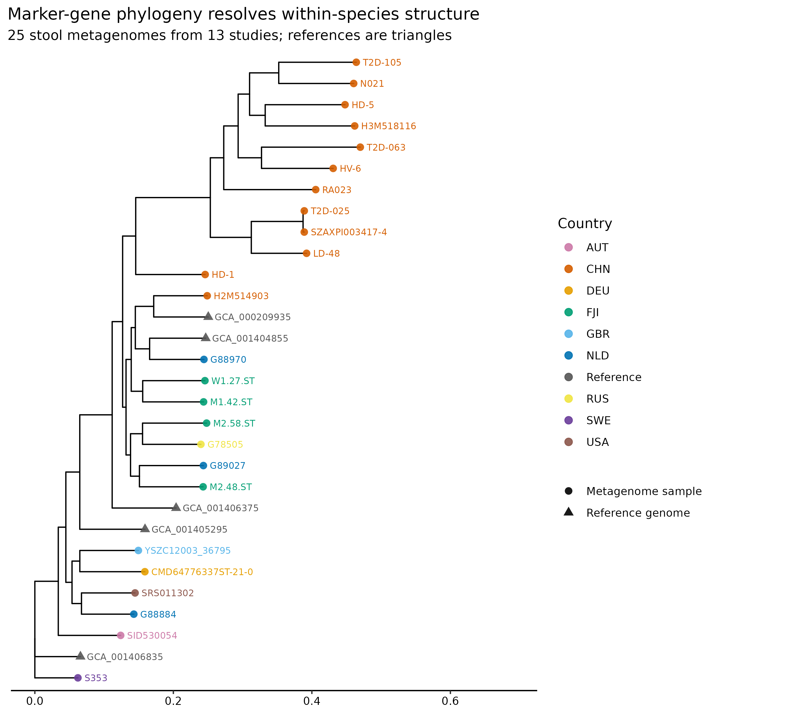
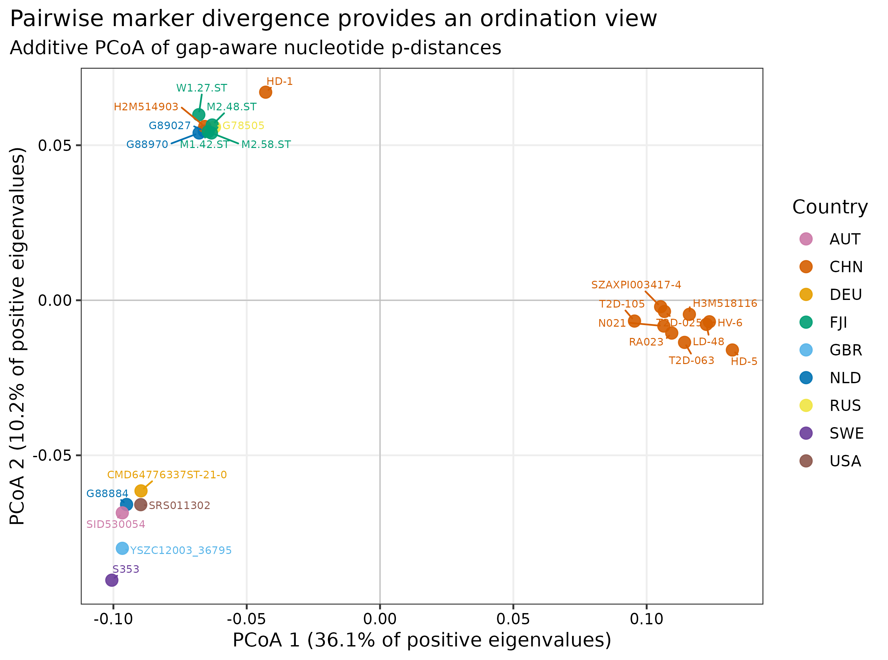
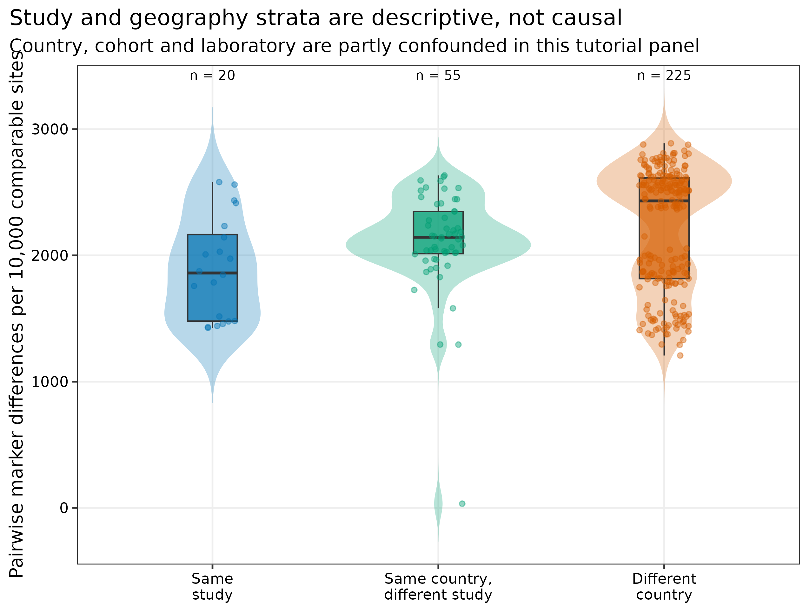
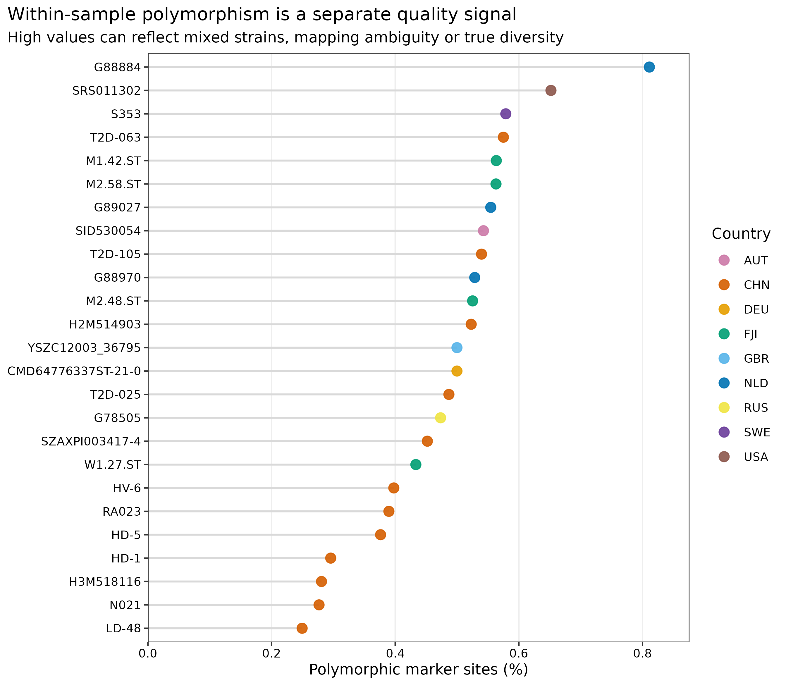

> **先给结论：**StrainPhlAn 回答的是“同一物种的 marker 序列在样本间怎样分化”，不是“两个宿主是否发生传播”。对 bioBakery 官方教程的 **25 个 stool metagenomes（13 studies、9 countries）**和 `t__SGB4933_group` 进行重算后，25 个样本与 5 个参考基因组进入最终树；当前显式阈值保留 187 个 markers、18,027 个 alignment sites。样本间未校正 p-distance 中位数为 0.2288，同研究、同国家异研究、异国家的中位数依次为 0.1861、0.2144 和 0.2431，但 study、country、队列和实验室高度混杂，不能把这一顺序解释成地理因果或传播证据。

::: {.callout-important title="算力与数据门槛"}
本次实跑使用 **24 CPU cores**。PhyloPhlAn 配置生成耗时 **4.13 秒**；当前阈值和官方阈值两次 StrainPhlAn 分别耗时 **80.82 秒**与 **84.08 秒**，峰值 RAM 分别为 **2.076 GiB** 与 **2.083 GiB**。完整工作目录约 **131 MB**。从已生成 consensus marker profiles 起步，建议准备 **8 GB RAM、16--24 cores、2 GB 可用磁盘、约 5 分钟**；若从原始 FASTQ 运行 MetaPhlAn，耗时和磁盘取决于样本数与测序深度。没有服务器时，可读取 `data/small/51-strainphlan-frozen/` 的规范化表和树文件重画图。
:::

## 这一步对应论文里的哪张图 {#sec-target}

StrainPhlAn 方法论文用物种特异 marker 的样本间变异重建菌株系统发育，并展示宿主、地理与时间相关的种内结构 [@truong2017strainphlan]。这里复现同一类“带样本元数据的 strain phylogeny”，数据和预计算基线来自 bioBakery StrainPhlAn 4 官方教程 [@biobakery2026strainphlan4tutorial]。

{#fig-51-tree}

{#fig-51-pcoa}

## 理论：从物种检出到种内系统发育 {#sec-theory}

### 1. 每个样本贡献一套物种特异 consensus markers

MetaPhlAn 用 clade-specific marker genes 做物种/SGB 定量；StrainPhlAn 从目标 clade 的 marker alignments 提取每个样本的 consensus sequence，再与可选参考基因组共同对齐并建树 [@blancomiguez2023metaphlan4]。它避开全基因组 assembly，但只描述数据库 marker 覆盖的核心序列空间。

### 2. Marker filtering 同时控制缺失与信息量

一个样本若只覆盖很少 markers，其树位置会被大量缺失字符支配；一个 marker 若只出现在少数样本中，也难以建立可比坐标。StrainPhlAn 因而先按样本 marker completeness 和 marker prevalence 双向过滤，再拼接保留下来的对齐。阈值变化会改变 alignment sites，继而改变树拓扑。

### 3. 树上的近邻不是传播证明

本次描述性距离只在两个样本都为 A/C/G/T 的位点上计算：

\[
d_{ij}=\frac{\text{nucleotide differences}_{ij}}
{\text{comparable A/C/G/T sites}_{ij}}.
\]

这个未校正 p-distance 便于审计，但深分化时可能饱和，也没有利用位点替换模型。更重要的是，近邻可由共同来源、流行克隆、数据库偏倚、批次、cross-mapping 或样本污染造成。传播分析还需要纵向/接触设计、阴性样本对和更密集的全基因组 SNV 证据。

<details>
<summary><strong>为什么 PCoA 和系统发育树会给出不同视觉印象？</strong></summary>

PCoA 尝试在少数欧氏坐标中保持成对距离；系统发育树则在替换模型下寻找分支结构。距离矩阵可能不是严格欧氏的，前两轴会丢失信息；树也可能因 marker 缺失、重组、模型不适配和弱分支支持而变化。两者可用于互相审计，但不能互相替代。

</details>

## 准备工作 {#sec-preparation}

### 数据从哪里来

| 输入 | 本次固定对象 | 审计证据 |
|---|---|---|
| Consensus markers | 官方教程 25 个真实 stool metagenomes，来自 13 studies、9 countries | 25 个 pickle 各自记录 URL、bytes、SHA-256 和 2022-08-25 last-modified |
| Target markers | `t__SGB4933_group.fna`，187 个可用 markers | bioBakery 官方教程资源，SHA-256 锁定 |
| References | 6 个官方参考基因组，其中 5 个通过最终过滤 | accession 文件、URL 与 SHA-256 锁定 |
| MetaPhlAn metadata | `mpa_vJan21_CHOCOPhlAnSGB_202103.pkl` | 从官方未压缩 tar 的首个完整成员提取；55,986,225 bytes、SHA-256 锁定 |
| Reproduction baseline | 官方 `.info`、`.polymorphic`、concatenated alignment 与 RAxML tree | 4 个原生文件逐一校验 SHA-256 |

准备脚本下载 37 个官方资产。由于 consensus profiles 和数据库 metadata 是 Python serialized objects，运行脚本会在任何反序列化前重新计算并比对全部 checksum；文件缺失、大小变化或 SHA-256 不符时立即停止。官方教程 wiki commit 固定为 `db372805bafe634d5c5f104f33cc9bec11d8bcdf`。

<details>
<summary><strong>安装环境与内联作图函数</strong></summary>

```bash
conda env create -f env/biobakery.yml
conda list -n metagenome-biobakery-2026.07 --explicit \
  > env/biobakery-linux-64.lock

conda run -n metagenome-biobakery-2026.07 strainphlan -v
conda run -n metagenome-biobakery-2026.07 metaphlan --version
conda run -n metagenome-biobakery-2026.07 phylophlan -v
```

实跑环境为 StrainPhlAn 4.2.5、MetaPhlAn 4.2.5、PhyloPhlAn 3.2.1、MAFFT 7.526、BLAST+ 2.17.0 与 Python 3.12.13。环境锁文件标注 RAxML Bioconda package 8.2.13，但可执行文件自报 **RAxML binary 8.2.12**；Methods 必须报告程序实际输出，同时保留 **Bioconda package 8.2.13** 这一环境审计信息。

```r
install.packages(c(
  "ape", "ggplot2", "dplyr", "readr", "tidyr", "scales", "ggrepel"
))
if (!requireNamespace("BiocManager", quietly = TRUE)) install.packages("BiocManager")
BiocManager::install("ggtree", ask = FALSE, update = FALSE)

library(ape)
library(ggtree)
library(ggplot2)
library(dplyr)
library(readr)
library(tidyr)
library(scales)
library(ggrepel)
set.seed(20260751)

pal_pub <- c(
  "AUT" = "#CC79A7", "CHN" = "#D55E00", "DEU" = "#E69F00",
  "FJI" = "#009E73", "GBR" = "#56B4E9", "NLD" = "#0072B2",
  "RUS" = "#F0E442", "SWE" = "#6A3D9A", "USA" = "#8C564B",
  "Reference" = "#555555"
)
scale_color_pub <- function(...) scale_color_manual(values = pal_pub, ...)
scale_fill_pub  <- function(...) scale_fill_manual(values = pal_pub, ...)
theme_pub <- function(base_size = 12) {
  theme_bw(base_size = base_size) + theme(
    panel.grid.minor = element_blank(),
    panel.grid.major = element_line(color = "#EEEEEE"),
    axis.text = element_text(color = "black"),
    legend.key = element_blank(),
    strip.background = element_rect(fill = "#EEF3F5", color = NA),
    plot.title.position = "plot"
  )
}
save_pub <- function(plot, file_base, width = 190, height = 140,
                     units = "mm", dpi = 350) {
  dir.create(dirname(file_base), recursive = TRUE, showWarnings = FALSE)
  ggsave(paste0(file_base, ".pdf"), plot, width = width, height = height,
         units = units, device = cairo_pdf)
  ggsave(paste0(file_base, ".png"), plot, width = width, height = height,
         units = units, dpi = dpi, bg = "white")
  ggsave(paste0(file_base, ".tiff"), plot, width = width, height = height,
         units = units, dpi = dpi, compression = "lzw", bg = "white")
  invisible(plot)
}
```

</details>

## 可复制代码：从官方 marker profiles 到可审计菌株树 {#sec-code}

### 第 1 步：下载、校验并登记输入

```bash
ROOT="$PWD"
WORK="work/article51"

python3 scripts/prepare_article51_strainphlan.py \
  --project-root "${ROOT}" --work-dir "${WORK}"

head "${WORK}/asset-manifest.tsv"
head "${WORK}/sample-metadata.tsv"
cat "${WORK}/run-contract.json"
```

脚本会重建专用的 `work/article51/`，不要把个人文件放进该目录。数据库 tar 总体积约 2.6 GB，但 metadata pickle 位于未压缩 tar 的第一个成员；固定 HTTP range `0-67108863` 已覆盖该完整成员，因此无需下载本篇不使用的 Bowtie2 indices 和 marker archive。若服务器或镜像不支持 range request，应改为下载完整官方 tar，并在解包后核对同一 SHA-256。

### 第 2 步：生成显式 seed 的 PhyloPhlAn 配置

```bash
conda run -n metagenome-biobakery-2026.07 \
  phylophlan_write_config_file \
  -o "${WORK}/phylophlan-seeded.cfg" \
  -d n --db_dna makeblastdb --map_dna blastn \
  --msa mafft --tree1 raxml --overwrite

# 将配置中唯一的 RAxML 默认值替换为：
# params = -p 20260751 -m GTRCAT
rg -- '-p 20260751|--thread 1' "${WORK}/phylophlan-seeded.cfg"
```

RAxML 的 starting parsimony tree 用 `-p 20260751` 固定；MAFFT marker alignment 固定为 `--thread 1`，并设置 `PYTHONHASHSEED=0`。配置若没有且只有一个默认 seed，runner 会拒绝继续，而不是静默生成不可重放的树。

### 第 3 步：当前显式阈值主分析

```bash
conda run -n metagenome-biobakery-2026.07 \
  strainphlan \
  --sample_list "${WORK}/sample-list.txt" \
  --reference_list "${WORK}/reference-list.txt" \
  -m "${WORK}/clade_markers/t__SGB4933_group.fna" \
  -d "${WORK}/database/mpa_vJan21_CHOCOPhlAnSGB_202103.pkl" \
  -c t__SGB4933_group \
  -o "${WORK}/output" -n 24 \
  --trim_sequences 50 \
  --sample_with_n_markers 20 \
  --sample_with_n_markers_perc 25 \
  --marker_in_n_samples_perc 50 \
  --sample_with_n_markers_after_filt 20 \
  --sample_with_n_markers_after_filt_perc 25 \
  --breadth_thres 80 \
  --phylophlan_mode fast \
  --phylophlan_configuration "${WORK}/phylophlan-seeded.cfg" \
  --tmp "${WORK}/tmp" --debug
```

25 个样本全部保留，6 个 references 中 5 个保留，187/187 markers 进入 18,027-site alignment。主分析选择较宽的样本完整度阈值和 50% marker prevalence；它保留信息较多，但不应脱离敏感性分支单独解释。

### 第 4 步：按官方 2022 教程阈值做敏感性复跑

```bash
# 其余参数、输入、软件、seed 和输出检查完全相同，仅替换以下三项：
--sample_with_n_markers_perc 80
--marker_in_n_samples_perc 80
--sample_with_n_markers_after_filt_perc 80

python3 scripts/run_article51_strainphlan.py \
  --project-root "${ROOT}" --work-dir "${WORK}" \
  --environment metagenome-biobakery-2026.07 --threads 24
```

官方预计算 `.info` 记录 179 个 selected markers；在 StrainPhlAn 4.2.5 中用同样的 80/80 阈值、同一输入重跑得到 178 个 markers 和 17,638 sites。阈值复跑仍保留 25 个样本与 5 个 references。这个 1-marker 差异说明软件版本、过滤实现和输入 provenance 必须与阈值一起记录。

### 第 5 步：汇总距离、冻结证据并验收

```bash
python3 scripts/summarize_article51_strainphlan.py \
  --project-root "${ROOT}" --work-dir "${WORK}"

Rscript scripts/plot_article51_strainphlan.R \
  --work-dir "${WORK}" --output-dir figures

python3 scripts/freeze_article51_strainphlan.py \
  --project-root "${ROOT}" --work-dir "${WORK}" \
  --output-dir data/small/51-strainphlan-frozen

python3 scripts/validate_article51_strainphlan.py \
  --project-root "${ROOT}" \
  --frozen-dir data/small/51-strainphlan-frozen \
  --output-dir results/51-strainphlan \
  --figure-dir figures \
  --chapter chapters/51-strainphlan.qmd
```

冻结包保留两套 native `.info`、polymorphism、alignment 和 tree，官方 baseline tree，输入与输出 lineage、commands、software versions、GNU-time 资源表、规范化结果和全部 SHA-256；原始 serialized profiles 与数据库 pickle 留在工作区，不进入冻结包。

## 审计与升级 {#sec-audit}

### 先复现过滤，再审计树拓扑

当前 187-marker tree 与官方 baseline 在 30 个共同 tips 上的 Robinson--Foulds distance 为 8/54，normalized RF 为 **0.148**；官方 80/80 阈值复跑得到 178 markers，RF 为 12/54，normalized RF 为 **0.222**。两者都不是 exact topology match。官方树没有记录本次显式 RAxML seed，且当前软件产生的 marker set 也与官方 `.info` 相差 1 个，因此不应宣称逐分支复现成功；能复现的是数据流程、保留样本和总体结构，不能把不一致分支包装成生物学发现。

### 把地理分层当描述性审计，而不是假设检验

300 个样本对中，同研究 20 对、同国家异研究 55 对、异国家 225 对；其 p-distance 中位数分别为 0.1861、0.2144 和 0.2431。配对不是独立重复，同一研究通常又对应特定国家、疾病、年龄、建库和实验室，因此这里不做伪重复的组间 p 值。最近的一对 `SZAXPI003417-4` 与 `T2D-025` 来自中国的两个不同研究，p-distance 为 0.00330；这只能提示后续核查，不能证明传播。

{#fig-51-strata}

### 把样本内 polymorphism 当作质量与混株信号

25 个样本的 marker polymorphic-sites percentage 中位数为 0.500%，范围 0.249%--0.811%。高值可能来自多菌株共存、mapping ambiguity 或真实种内多样性；低值也可能只是 depth 不足。它应与 marker coverage、read quality 和全基因组 microdiversity 联合审计，不宜直接作为“菌株更多”的定量指标。

{#fig-51-poly}

### 从单棵 fast tree 升级为带支持度与稳健性分析

本次 `phylophlan_mode fast` 生成一棵 seeded RAxML maximum-likelihood tree，但没有把 bootstrap 支持度当作已获得证据。正式研究应至少补充 marker-threshold sensitivity、不同 seed 重跑、重组检测/剔除，以及 bootstrap 或 ultrafast bootstrap；关键结论应在合理参数范围内保持。若目标是近期传播，进一步转向同一 reference 坐标上的全基因组 SNV、callable fraction 和时间流行病学设计。

## 出版级美化 {#sec-publication}

1. 树上 query samples 用圆点、reference genomes 用三角形；颜色只编码 country，并在图注声明 metadata 不参与推断。
2. tip labels 保留稳定 sample IDs，避免用疾病组名替换样本；分支长度轴写成 `Substitutions per site`。
3. PCoA 只标 25 个样本并用 deterministic `ggrepel` seed；轴标题报告 positive eigenvalues 的解释比例。
4. pairwise distance 图同时显示 violin、boxplot、原始点和每层 pair count，图注提醒 pairs 非独立。
5. 所有图内文字为英文；PDF 保留矢量元素，PNG/TIFF 以 350 dpi 输出，TIFF 使用 LZW `compression = "lzw"`。

## 常见坑 {#sec-pitfalls}

::: {.callout-caution title="1. 把 pickle 当普通文本输入"}
Serialized profiles 可在反序列化时执行对象加载逻辑。只使用可信官方来源，并在工具读取前核对固定 SHA-256；下载成功不等于内容可信或完整。
:::

::: {.callout-caution title="2. 数据库 release 与 profiles 不匹配"}
Marker IDs、clade 名和内部 metadata 随 MetaPhlAn release 改变。本次固定 `mpa_vJan21_CHOCOPhlAnSGB_202103`；不能把其他 release 生成的 profiles 与该 metadata pickle 混用。
:::

::: {.callout-caution title="3. 忽略 marker filtering"}
只报告“用了 StrainPhlAn”无法复现。至少记录 trim、sample marker completeness、marker prevalence、post-filter completeness、breadth threshold 和 retained marker count。
:::

::: {.callout-caution title="4. 给没有支持度的分支讲故事"}
单次 fast ML tree 的局部拓扑会随 markers、版本、模型和 seed 改变。没有 branch support 和敏感性分析时，不应把一条短内部枝解释成确定谱系。
:::

::: {.callout-caution title="5. 把树上相邻写成传播"}
共同国家或研究中的近邻可能来自采样结构、流行克隆或批次。传播至少还需要更高分辨率 SNVs、充分 genome overlap、时间与接触信息，以及共同来源排查。
:::

::: {.callout-caution title="6. 对 300 个 pairs 做普通 Wilcoxon 检验"}
每个样本重复出现在多个 pair 中，违反独立性。探索性比较可报告分布；正式推断应使用置换层级、mixed model 或以独立 host/cluster 为单位的设计。
:::

## 这段 Methods 怎么写 {#sec-methods}

### Methods template

> Twenty-five publicly available stool-metagenome consensus-marker profiles from 13 studies and nine countries, six reference genomes, the `t__SGB4933_group` marker FASTA, and the official precomputed tutorial outputs were obtained from the bioBakery StrainPhlAn 4 tutorial snapshot (wiki commit db372805bafe634d5c5f104f33cc9bec11d8bcdf; assets dated 25 August 2022). All 37 assets were size- and SHA-256-verified before serialized objects were read. StrainPhlAn v4.2.5 and MetaPhlAn v4.2.5 were run with the `mpa_vJan21_CHOCOPhlAnSGB_202103` metadata database, `--trim_sequences 50`, `--sample_with_n_markers 20`, `--sample_with_n_markers_perc 25`, `--marker_in_n_samples_perc 50`, `--sample_with_n_markers_after_filt 20`, `--sample_with_n_markers_after_filt_perc 25`, `--breadth_thres 80`, and `--phylophlan_mode fast`. PhyloPhlAn v3.2.1 used BLAST+ v2.17.0, single-threaded MAFFT v7.526, and the RAxML binary v8.2.12 distributed in Bioconda package v8.2.13. The RAxML parsimony-tree seed was fixed at 20260751 (`-p 20260751`), and `PYTHONHASHSEED` was fixed at zero. A sensitivity run used the official tutorial's 80% sample-completeness, 80% marker-prevalence and 80% post-filter-completeness thresholds. Geography and study labels were not used for filtering or phylogenetic inference. Native outputs, commands, versions, resource records and SHA-256 checksums were retained.

### Results template

> All 25 metagenome samples and five of six reference genomes were retained. Under the primary explicit thresholds, all 187 available markers contributed to an 18,027-site concatenated alignment. Median gap-aware, uncorrected p-distance among 300 sample pairs was 0.2288; descriptive medians were 0.1861 for pairs from the same study, 0.2144 for pairs from different studies in the same country, and 0.2431 for pairs from different countries. Median within-sample polymorphic-marker percentage was 0.500% (range, 0.249%--0.811%). The primary rerun and the official-threshold rerun had normalized Robinson--Foulds distances of 0.148 and 0.222, respectively, from the official precomputed tutorial tree across 30 shared tips; neither was an exact topology match. The official-threshold rerun retained 178 markers and 17,638 alignment sites, whereas the archived tutorial information file reported 179 markers. Pair strata were treated as descriptive because country, study and laboratory were confounded and pairwise observations were non-independent.

## 换成你自己的数据怎么做 {#sec-own-data}

1. 用同一 MetaPhlAn release、同一 marker database 和同一 profiling 参数生成全部样本的 consensus markers；不要跨 release 拼接。
2. 先选择在足够多样本中达到充分 marker breadth 的物种；对极稀疏 clade 强行建树只会得到 missingness tree。
3. 预注册 sample completeness、marker prevalence、breadth 和最少样本数，并至少做一档更严和一档更宽的 sensitivity analysis。
4. 将 sample、host、time point、household/site、study、country、sequencing batch 和 read depth 写入独立 metadata 表；这些变量默认不参与建树。
5. 保存每次运行的 selected marker count、retained samples/references、alignment length、tree、polymorphism table、命令和版本。
6. 对关键内部枝报告 bootstrap/support；检查 alignment occupancy、composition bias、重组与异常长枝。
7. 若目标是近期共享或传播，把 StrainPhlAn 用作候选筛查，再用统一 reference 上的 genome-wide SNV、callable fraction、时间和接触信息验证。
8. 若一个样本有明显多菌株信号，consensus tree 可能隐藏少数菌株；联合 inStrain、haplotype/strain deconvolution 或 isolate genomes。

## 参考 {#sec-references}

- StrainPhlAn 的 marker-based strain phylogeny 方法与应用 [@truong2017strainphlan]
- MetaPhlAn 4 与 SGB marker framework [@blancomiguez2023metaphlan4]
- PhyloPhlAn 3 的系统基因组工作流 [@asnicar2020phylophlan3]
- RAxML 8 maximum-likelihood phylogeny [@stamatakis2014raxml8]
- bioBakery StrainPhlAn 4 官方教程、输入与预计算输出 [@biobakery2026strainphlan4tutorial]
